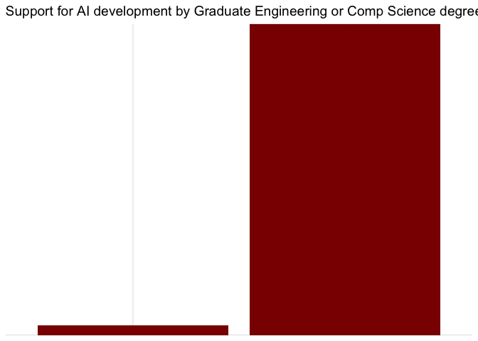
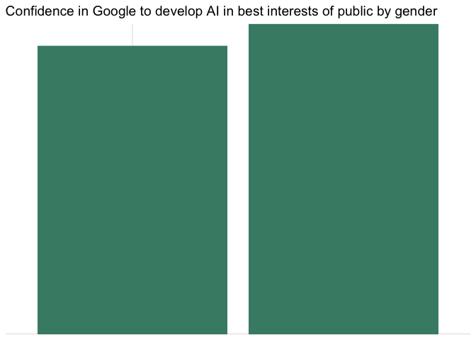

-   [Introduction & Data](#introduction-data)
-   [Literature Review](#literature-review)
    -   [The Role of the Private
        Sector](#the-role-of-the-private-sector)
    -   [AI and the Labour Market](#ai-and-the-labour-market)
    -   [Global studies looking at attitudes towards
        AI](#global-studies-looking-at-attitudes-towards-ai)
    -   [Asymmetries in Information: We fear what we don’t
        know](#asymmetries-in-information-we-fear-what-we-dont-know)
    -   [Biases in datasets](#biases-in-datasets)
    -   [Unpacking the ‘public’ in public trust in
        AI](#unpacking-the-public-in-public-trust-in-ai)
    -   [Hypotheses](#hypotheses)
-   [Methods](#methods)
-   [Analysis & Results](#analysis-results)
    -   [Simple Bar charts](#simple-bar-charts)
    -   [Hypotheses - Results](#hypotheses---results)
    -   [Further analyses: Confidence in
        Organisations](#further-analyses-confidence-in-organisations)
-   [Discussion, Limitations, and
    Conclusion](#discussion-limitations-and-conclusion)
-   [References](#references)

*Data: revised\_AI\_dataset.csv*

# Introduction & Data

*“We fear what we do not know.” - Anonymous / alternatively, this quote
is attributable to many.*

Artificial intelligence, physical security, and political security are
inextricably linked in the Digital Age. The advent of COVID-19 has often
loosened restrictions on the use of AI-driven technologies around the
world, and made salient its use in combating emerging threats. However,
the dual-use nature of AI leads to its use and prolific misuse. The
global damages for AI-driven cyber-attacks totaled over five billion
euro in 2017. These included the hacking of the United Kingdom’s
National Health Service, where 20,000 appointments were cancelled, and
the NotPetya ransomware hack costing Maersk, Merck, and FedEx
approximately USD 300 million each in immediate damages. These attacks
often lead the public to question the robustness of their political and
public structures, and work to undermine trust in governments and
political participation. While AI has significant beneficial use across
political, social, and economic domains in our daily lives, its misuse
due to a lack of regulations to support accountability have led to an
erosion in attitudes towards its use.

For this final project, I am using a simplified version of the data
shared by Baobao Zhang and Allan Dafoe in their 2018 study entitled
Artificial Intelligence: American Attitudes and Trends to explore
attitudes towards AI development in one case study: the United States.
This study may help us identify association between demographic groups
and distrust in AI development, which could make salient for
policymakers specific areas where regulation is needed the most, in
support of their own constituents. This is keeping in mind that the US
tends to exhibit more liberal attitudes towards AI development than in
the EU for example. It may be interesting to contrast this dataset with
that looking at German (more risk averse) attitudes towards AI
development versus regulation - and this is something I am interested in
exploring in my dissertation research.

Researchers have looked at the effect of fear of automation and robots
on support for development of AI technologies. According to the World
Economic Forum, artificial intelligence holds the promise of making
organisations 40% more efficient by 2035 and its development and use and
lead to estimated $14 trillion in new economic value, all while
improving the lives of billions. However, it will only achieve its
potential if it is used responsibly, and its impact on billions will
only be realised if it is developed in democratic ways. The only issue
with democratising code and AI-driven technologies is its potential
malicious use, which could then be used to engender fear regarding its
development among constituents.

The data comprise a series of socio-demographic and subjective attitude
measures and I will run multiple linear regressions to predict affinity
for AI governance based on age, gender, race, income, and political
affiliation of US respondents in a survey conducted in 2018.

# Literature Review

There have been several studies conducted investigating public attitudes
towards the use of Artificial Intelligence-driven technologies in the
medical sciences and banking. In the former, for example, Dos Santos et
al (2019) found that medical studies appreciated the use of AI in
improving diagnoses in radiology, but disagreed in its use to fully
replace human diagnoses. Similarly, within the banking sector, several
studies (see Aitken, Ng, Toreini, van Moorsel, Coopamootoo, and Elliott,
2020) have found support for the use of AI in increasing the efficiency
of processes in the banking sector, while disagreeing that it could be
used to replace human judgment and oversight. Across domains,
participants agree on the use of AI in improving processes, but raise
ethics concerns with regard to misuse. This is where the governance of
these technologies, to ensure their use to improve lives, and limit
misuse, is particularly pertinent. However, the regulation of AI is a
complex problem due to the stakeholders and so-called “pacing problem”
(Taehagh & Ramesh, 2021: see below) between the private sector that
develops the technologies and the public sector that are meant to govern
these technologies.

## The Role of the Private Sector

The defense sector has traditionally been a core driver of innovation.
In recent years however, disruptive innovation has been driven by the
private sector with the military (often problematically) vying not to be
left behind. For example, according to the OECD, Google, Microsoft,
Amazon, and Intel spent more than USD 50 billion a year on digital
innovation in 2018 alone (OECD, 2017). This sum dwarfs the 13 billion
euros over seven years originally put up by the European Defense Fund
(for defense spending in general, not solely on the development of
AI-driven technologies), let alone any other numbers put up by European
governments (Bachmann et al, 2017).

In their seminal work, “Prediction machines: the simple economics of
artificial intelligence,” Agrawal, Gans, and Golfarb (2018) argue that
from an economic perspective, the advent of AI brings a far better
future than envisioned by those wary of its development. They posit that
cheaper data will lead to more, and better predictions, and predictions
in turn will improve human judgement. Predictions are important because
they make life for humans easier: exemplified by recommendations based
on purchases on Amazon and improvements in data and prediction
escalating the development of self-driving cars. The authors argue that
machines don’t make judgements – humans do – but these judgments can be
better informed by more data and better predictions e.g. in the case of
identifying credit card fraud. In this way, the book describes assistive
AI, and is aimed at general audiences trying to understand the economic
trade-offs of using AI in the future. Most interesting is that while the
authors discuss the economics of automation on employment, and the
tradeoffs therein, they fail to look at the implications of automation
on defense and security. This piece is an illustration of how the role
of the private sector in developing AI and their effects on economics
markets, versus the role of policy and security actors in building
resilience to AI-driven hybrid threats has thus far largely been
discussed in isolation from each other – more has to be done to look at
‘where the money goes’ in the development of AI and its implications
within the defense and security sectors. This thesis project is a step
in the direction of bringing these economic, political, and security
lines together.

## AI and the Labour Market

While the implications of the assistive functions of AI-driven
technologies on improving human judgment and innovation across sectors
are clear, its effects on the labor market on more short-term, practical
levels form a large part of the current literature on its development.
Muro, Maxim, and Whiton (2019) use government and private data,
including from the McKinsey Global Institute, to map trends in
automation between 1980 to 2016, and extrapolate these impacts to 2030
across 800 occupations potentially at risk of automation.

AI and ML technologies trained to play games, classify images, and guide
vehicles have ramifications across sectors, from self-driving cars and
traffic coordination within the civilian space to conducting
reconnaissance missions and automated offensive strikes within the
military space. In principle, tasks that could be transformed via AI are
vast. Muro, Maxim, and Whiton illustrate that almost every occupation
will be affected by the adoption of currently available technologies.
The authors present that routine physical and cognitive tasks will be
most at risk for automation, with jobs located in rural geographical
locations most vulnerable. Lowest wage jobs will be most vulnerable to
automation, with Black and Hispanic workers disproportionately currently
in occupations at risk for automation. The report makes broad
recommendations to policy-makers considering these trends and design
programs advocating for a learning mindset that facilitate smoother
adjustment through subsidized hiring programs. They further call for the
reduction of hardships for workers who are vulnerable to the risks of
automation on the labor market by improving resources for skill
development and expanding traditional education programs in rural areas.
This is of particular relevance to the current project, as it looks at
AI discourse vis-a-vis specific demographic groups.

In fact, most research on the impact of AI almost exclusively focuses on
its development across the private sector and the effect of automation
on jobs. However, it is crucial to look at attitudes towards AI from the
perspective of constituents, in order to operationalise actions that
policy makers can take to address distrust in AI-driven technologies due
to a fear of automation/lack of regulation/asymmetries in information.

## Global studies looking at attitudes towards AI

Neudert, Knuutila & Howard (2020) in their “Global Attitudes Towards AI,
Machine Learning & Automation Decision Making” study found that there
are clear global divides in support for AI, with worries about the risks
of an increased use of AI highest among those based in North and South
America and Europe, and least among those in South Asia and South-East
Asia. Here, we wonder if there is a mediating factor of *governance
structure* or *democracy* in driving this support. I am not however able
to unpack this within the confines of this dataset.

## Asymmetries in Information: We fear what we don’t know

Given recent competitive private sector investment, AI is developing at
an exponential rate. Indeed, most of the literature on AI is outdated at
this point, with much of what was discussed by the authors above already
coming to pass. This is due to what Taehagh & Ramesh (2021) call the
“pacing problem,” i.e. the lag between a government’s or supranational
body’s slow responses (due to their consensus-based model) to emerging
challenges posed by a competition-fuelled private sector market for the
development of emerging technologies. As it often comes to pass,
dual-use technologies are developed in the market at a pace set by the
private sector, and governance mechanisms struggle to attract the skills
and capacity needed to keep up and regulate these developments. Often, a
lack of technical literacy within governance actors, whose agencies are
not structured in ways to attract younger talent, grossly contributes to
this problem. This lack of ability to regulate against emerging threats
leads to the erosion of public trust in governance bodies, as well as
the use of AI in general. This may be an acute issue

There is no doubt that we need “effective, values-based digital
frameworks” to govern emerging technologies and protect constituents.
However, asymmetries in information, the pacing lag between the private
sector and public sector, and a lack of accountability mechanisms all
contribute to undermining regulatory protocols, and erode public trust
in government as well as the emerging technologies themselves.

## Biases in datasets

Much academic and popular attention has been devoted to discussing
biases in datasets that skew algorithmic outputs (Noble, 2018). The
private sector solution to this has been a drive to partner with public
sector agents with the aim to collect more data on diverse populations.
The response to this bias in objectives and outputs should rather be
accountability mechanisms, where programmers and their organisations are
held accountable for code that may not be trained on inclusive datasets
- in tandem with robust regulations on which types of data can be
supplied to train these algorithms by public policy bodies. However, if
these officials struggle to understand the problem themselves and lack
the technical capacity to address it (always outsourcing the discussion
to private sector actors who join the dialogue to support their own
agenda) we end up with the tautological problem of a lack of governance
frameworks eroding public trust in their government as well as the
technologies themselves.

## Unpacking the ‘public’ in public trust in AI

While much has been written on developing or addressing public trust in
AI-driven technologies, it is crucial to investigate attitudes towards
AI across demographic groups (Spiegeleire, Maas, & Sweijs, 2017; Taehagh
& Ramesh, 2021). This could help us identify gaps in support for AI, and
help drive targeted efforts to include these groups in the move to the
Digital Age. Importantly, it may help increase the salience of the need
to regulate AI within policy circles. If policy makers are aware which
constituents are most likely to support - or not support - AI
development, which is linked to economic development, they may be
incentivised to work to build more robust check and improve the literacy
of AI among those more likely not to support its development.
Policymakers often need to balance not being left behind with
constituent and ethical concerns, and understanding evolving public
attitudes towards, and factors mediating these attitudes, is crucial to
the public and private sector alike. This is of paricular importance in
the onset of COVID-19, which has seen an increase in the adoption of
AI-driven technologies by national governments and the public alike.

This study aims to investigate the effect of age, religion, gender,
race, income, employment status, political party, and experience in
Computer Science an Engineering respectively on support for AI via
multiple regression analysis.

## Hypotheses

------------------------------------------------------------------------

-   *H*1: Age is *negatively* associated with support for AI.
-   *H*2: Those who are secular are *more likely* to support
    AI.
-   *H*3: Education level is *positively* associated with
    support for AI.
-   *H*4: Marital status is *not* associated with support for
    AI.
-   *H*5: Males are *more likely* to support AI.
-   *H*6: Race is *not* associated with support for AI.
-   *H*7: Employment status is *not* associated with support
    for AI.
-   *H*8: Political party is *not* associated with support
    for AI.
-   *H*9: Political ideology is *not* associated with support
    for AI.
-   *H*10: Experience with computer science is *positively*
    associated with support for AI.
-   *H*11: An engineering degree is *positively* associated
    with support for AI.

------------------------------------------------------------------------

# Methods

The dataset comprises categorical data as ordered response variables
(age groups, education levels, and income brackets) as well as unordered
response variables (political party, ethnicity, and religion). The
former is typically modeled using ordinal logistic regression, and the
latter multinomial logistic regression. However, for this analysis,
since I aim to predict several variables which can typically be any real
number (do not add up to 1) I will run multiple regressions.

I aim to look at support for AI development by 11 demographic subgroup
variables, including age, gender, race, and education based on the data
available. I aim to perform a multiple linear regression to predict
support for developing AI using all these demographic variables. My null
hypotheses are such that age, gender, race, experience with CS
programming, and education will not have an influence on support for
development of AI within this sample in the US.

# Analysis & Results

\#\#Multiple Regressions

    summary(AI_Importance)

    ##   SupportAIdev     USmilitary    UScivilian_go   NationalSecurity
    ##  Min.   :1.000   Min.   :1.000   Min.   :1.000   Min.   :1.000   
    ##  1st Qu.:2.000   1st Qu.:4.000   1st Qu.:4.000   1st Qu.:4.000   
    ##  Median :3.000   Median :9.000   Median :9.000   Median :9.000   
    ##  Mean   :3.048   Mean   :7.009   Mean   :7.036   Mean   :6.885   
    ##  3rd Qu.:4.000   3rd Qu.:9.000   3rd Qu.:9.000   3rd Qu.:9.000   
    ##  Max.   :6.000   Max.   :9.000   Max.   :9.000   Max.   :9.000   
    ##       FBI             CIA             NATO          Techcomp    
    ##  Min.   :1.000   Min.   :1.000   Min.   :1.000   Min.   :1.000  
    ##  1st Qu.:4.000   1st Qu.:4.000   1st Qu.:4.000   1st Qu.:4.000  
    ##  Median :9.000   Median :9.000   Median :9.000   Median :9.000  
    ##  Mean   :7.058   Mean   :6.846   Mean   :7.026   Mean   :6.924  
    ##  3rd Qu.:9.000   3rd Qu.:9.000   3rd Qu.:9.000   3rd Qu.:9.000  
    ##  Max.   :9.000   Max.   :9.000   Max.   :9.000   Max.   :9.000  
    ##      Google         Facebook         Apple         Microsoft        Amazon     
    ##  Min.   :1.000   Min.   :1.000   Min.   :1.000   Min.   :1.00   Min.   :1.000  
    ##  1st Qu.:4.000   1st Qu.:4.000   1st Qu.:4.000   1st Qu.:4.00   1st Qu.:4.000  
    ##  Median :9.000   Median :9.000   Median :9.000   Median :9.00   Median :9.000  
    ##  Mean   :7.064   Mean   :7.254   Mean   :6.913   Mean   :7.17   Mean   :6.928  
    ##  3rd Qu.:9.000   3rd Qu.:9.000   3rd Qu.:9.000   3rd Qu.:9.00   3rd Qu.:9.000  
    ##  Max.   :9.000   Max.   :9.000   Max.   :9.000   Max.   :9.00   Max.   :9.000  
    ##       NGO             Uni           Rank_US        Rank_China       gender     
    ##  Min.   :1.000   Min.   :1.000   Min.   :1.000   Min.   :1.00   Min.   :1.000  
    ##  1st Qu.:4.000   1st Qu.:4.000   1st Qu.:3.000   1st Qu.:2.00   1st Qu.:1.000  
    ##  Median :9.000   Median :9.000   Median :9.000   Median :3.00   Median :2.000  
    ##  Mean   :7.046   Mean   :6.928   Mean   :6.001   Mean   :3.36   Mean   :1.524  
    ##  3rd Qu.:9.000   3rd Qu.:9.000   3rd Qu.:9.000   3rd Qu.:4.00   3rd Qu.:2.000  
    ##  Max.   :9.000   Max.   :9.000   Max.   :9.000   Max.   :8.00   Max.   :2.000  
    ##       race            educ       maritalstatus      employ           pid       
    ##  Min.   :1.000   Min.   :1.000   Min.   :1.00   Min.   :1.000   Min.   :1.000  
    ##  1st Qu.:1.000   1st Qu.:2.000   1st Qu.:1.00   1st Qu.:1.000   1st Qu.:1.000  
    ##  Median :1.000   Median :3.000   Median :3.00   Median :4.000   Median :2.000  
    ##  Mean   :1.777   Mean   :3.401   Mean   :2.91   Mean   :3.544   Mean   :2.269  
    ##  3rd Qu.:2.000   3rd Qu.:5.000   3rd Qu.:5.00   3rd Qu.:5.000   3rd Qu.:3.000  
    ##  Max.   :8.000   Max.   :6.000   Max.   :6.00   Max.   :9.000   Max.   :5.000  
    ##     ideology        religpew      Collegelevelprogramming
    ##  Min.   :1.000   Min.   : 1.000   Min.   :1.00           
    ##  1st Qu.:2.000   1st Qu.: 1.000   1st Qu.:1.00           
    ##  Median :3.000   Median : 2.000   Median :2.00           
    ##  Mean   :3.304   Mean   : 5.484   Mean   :1.75           
    ##  3rd Qu.:4.000   3rd Qu.:11.000   3rd Qu.:2.00           
    ##  Max.   :8.000   Max.   :12.000   Max.   :2.00           
    ##  engineeringcompsciencedegree  gradcompeng    programexperience
    ##  Min.   :1.000                Min.   :1.000   Min.   :1.000    
    ##  1st Qu.:2.000                1st Qu.:2.000   1st Qu.:2.000    
    ##  Median :2.000                Median :2.000   Median :2.000    
    ##  Mean   :1.927                Mean   :1.962   Mean   :1.889    
    ##  3rd Qu.:2.000                3rd Qu.:2.000   3rd Qu.:2.000    
    ##  Max.   :2.000                Max.   :2.000   Max.   :2.000    
    ##  noeducationalcompexp    birthyr          age       
    ##  Min.   :1.000        Min.   :1927   Min.   :1.000  
    ##  1st Qu.:1.000        1st Qu.:1956   1st Qu.:2.000  
    ##  Median :1.000        Median :1972   Median :2.000  
    ##  Mean   :1.368        Mean   :1971   Mean   :1.814  
    ##  3rd Qu.:2.000        3rd Qu.:1986   3rd Qu.:2.000  
    ##  Max.   :2.000        Max.   :2000   Max.   :2.000

    hist(AI_Importance$SupportAIdev)

    model <- lm(SupportAIdev ~ age + gender + race + educ + maritalstatus + employ + pid + ideology + religpew + Collegelevelprogramming + engineeringcompsciencedegree + gradcompeng + programexperience + noeducationalcompexp, data = AI_Importance) 
    summary(model)

    ## 
    ## Call:
    ## lm(formula = SupportAIdev ~ age + gender + race + educ + maritalstatus + 
    ##     employ + pid + ideology + religpew + Collegelevelprogramming + 
    ##     engineeringcompsciencedegree + gradcompeng + programexperience + 
    ##     noeducationalcompexp, data = AI_Importance)
    ## 
    ## Residuals:
    ##     Min      1Q  Median      3Q     Max 
    ## -3.1955 -0.9770 -0.2531  0.8941  3.9685 
    ## 
    ## Coefficients:
    ##                               Estimate Std. Error t value Pr(>|t|)    
    ## (Intercept)                   0.393206   0.823541   0.477 0.633089    
    ## age                           0.061453   0.082362   0.746 0.455675    
    ## gender                        0.272564   0.061764   4.413 1.07e-05 ***
    ## race                          0.041328   0.022888   1.806 0.071125 .  
    ## educ                         -0.105489   0.022270  -4.737 2.32e-06 ***
    ## maritalstatus                 0.002827   0.016760   0.169 0.866054    
    ## employ                        0.016064   0.012615   1.273 0.203034    
    ## pid                           0.101119   0.027108   3.730 0.000197 ***
    ## ideology                      0.167102   0.022768   7.339 3.12e-13 ***
    ## religpew                     -0.011352   0.006870  -1.652 0.098614 .  
    ## Collegelevelprogramming       0.201962   0.126111   1.601 0.109434    
    ## engineeringcompsciencedegree  0.313521   0.134312   2.334 0.019680 *  
    ## gradcompeng                   0.174676   0.169877   1.028 0.303958    
    ## programexperience             0.376103   0.114677   3.280 0.001057 ** 
    ## noeducationalcompexp         -0.279152   0.134435  -2.076 0.037978 *  
    ## ---
    ## Signif. codes:  0 '***' 0.001 '**' 0.01 '*' 0.05 '.' 0.1 ' ' 1
    ## 
    ## Residual standard error: 1.333 on 1985 degrees of freedom
    ## Multiple R-squared:  0.1674, Adjusted R-squared:  0.1615 
    ## F-statistic: 28.51 on 14 and 1985 DF,  p-value: < 2.2e-16

## Simple Bar charts

    library(ggplot2)
    bargender<-ggplot(data=AI_Importance, aes (x=gender,  y=SupportAIdev)) + geom_bar(stat="identity", fill="steelblue")+theme_minimal()
    bargender + ggtitle("Support for AI development by gender: Male vs Female")  +
      xlab("Gender") + ylab("Support for AI development") 

    barage<-ggplot(data=AI_Importance, aes (x=age,  y=SupportAIdev)) + geom_bar(stat="identity", fill="deepskyblue3")+theme_minimal()
    barage + ggtitle("Support for AI development by age: Born on or after 1990 vs before 1990")  +
      xlab("Age") + ylab("Support for AI development")

This shows that those born before 1990 are more likely to support AI
development. However, it must be noted that this cut off point was
arbitrary, based on birth year data - and it would be interesting to
explore the effect of age buy smaller cohorts e.g. Millenials, Boomers,
etc.

    barrace<-ggplot(data=AI_Importance, aes (x=race,  y=SupportAIdev)) + geom_bar(stat="identity", fill="lightskyblue")+theme_minimal()
    barrace + ggtitle("Support for AI development by race: White-Black-Hispanic-Asian-Native American-Mixed-Other-Middle Eastern-Skipped-Not Asked") +
      xlab("Race") + ylab("Support for AI development")

    bareduc<-ggplot(data=AI_Importance, aes (x=educ,  y=SupportAIdev)) + geom_bar(stat="identity", fill="slateblue")+theme_minimal()
    bareduc + ggtitle("Support for AI development by Education") + 
      xlab("Education level") + ylab("Support for AI development")

    barmaritalstatus<-ggplot(data=AI_Importance, aes (x=maritalstatus,  y=SupportAIdev)) + geom_bar(stat="identity", fill="springgreen2")+theme_minimal()
    barmaritalstatus + ggtitle("Support for AI development by Marital Status") + 
      xlab("Marital Status") + ylab("Support for AI development")

    baremployment<-ggplot(data=AI_Importance, aes (x=employ,  y=SupportAIdev)) + geom_bar(stat="identity", fill="burlywood")+theme_minimal()
    baremployment + ggtitle("Support for AI development by Employment Status") + 
      xlab("Employment Status") + ylab("Support for AI development")

    barpoliticalidentity<-ggplot(data=AI_Importance, aes (x=pid,  y=SupportAIdev)) + geom_bar(stat="identity", fill="lightseagreen")+theme_minimal()
    barpoliticalidentity + ggtitle("Support for AI development by Political Identity") + 
      xlab("Political Identity") + ylab("Support for AI development")

    barideology<-ggplot(data=AI_Importance, aes (x=ideology,  y=SupportAIdev)) + geom_bar(stat="identity", fill="springgreen4")+theme_minimal()
    barideology + ggtitle("Support for AI development by Political Ideology") + 
      xlab("Political Ideology") + ylab("Support for AI development")

    barreligion<-ggplot(data=AI_Importance, aes (x=religpew,  y=SupportAIdev)) + geom_bar(stat="identity", fill="navyblue")+theme_minimal()
    barreligion + ggtitle("Support for AI development by Religion") + 
      xlab("Religious Identity") + ylab("Support for AI development")

    barcollegeprogramming<-ggplot(data=AI_Importance, aes (x=Collegelevelprogramming,  y=SupportAIdev)) + geom_bar(stat="identity", fill="turquoise4")+theme_minimal()
    barcollegeprogramming + ggtitle("Support for AI development by Experience in College Level Programming") + 
      xlab("College Level Programming") + ylab("Support for AI development")

    barengineering<-ggplot(data=AI_Importance, aes (x=engineeringcompsciencedegree,  y=SupportAIdev)) + geom_bar(stat="identity", fill="mediumpurple4")+theme_minimal()
    barengineering + ggtitle("Support for AI development by Engineering or Computer Science Bachelor's Degree") + 
      xlab("Comp Science or Engineering Bach degree") + ylab("Support for AI development")

    barcompgrad<-ggplot(data=AI_Importance, aes (x=gradcompeng,  y=SupportAIdev)) + geom_bar(stat="identity", fill="red4")+theme_minimal()
    barcompgrad + ggtitle("Support for AI development by Graduate Engineering or Comp Science degree") + 
      xlab("Graduate degree in Engineering or Comp Science") + ylab("Support for AI development")

    barprogramex<-ggplot(data=AI_Importance, aes (x=programexperience,  y=SupportAIdev)) + geom_bar(stat="identity", fill="aquamarine4")+theme_minimal()
    barprogramex + ggtitle("Support for AI development by prior programming experience") + 
      xlab("Programming Experience") + ylab("Support for AI development")

There is significance variance across demographic subgroups for support
for the development of AI, with gender, education, income, and
experience being key predictors.

## Hypotheses - Results

Therefore:

-   *H*1: Age is *positively* associated with support for AI.
-   *H*2: There is no association between religion and
    support for AI.
-   *H*3: Education level is *positively* associated with
    support for AI.
-   *H*4: Marital status is *not* associated with support for
    AI.
-   *H*5: Males are *more likely* to support AI.
-   *H*6: Race is *not* associated with support for AI.
-   *H*7: Employment status is *not* associated with support
    for AI.
-   *H*8: You are more likely to support AI if you are a
    Democrat.
-   *H*9: You are morel ikely to support AI if you are of a
    liberal ideology.
-   *H*10: Experience with computer science is *positively*
    associated with support for AI.
-   *H*11: An engineering degree is *positively* associated
    with support for AI.

Further, the current dataset allowed us to explore confidence in various
organisations to develop AI in the best interests of the public. Similar
to the above, the author conducted multiple regression analyses by age,
education level, religious affiliation, marital status, gender, race,
employment status, political party affiliation, political ideology, and
experience with computer science.

## Further analyses: Confidence in Organisations

    model <- lm(USmilitary ~ age + gender + race + educ + maritalstatus + employ + pid + ideology + religpew + Collegelevelprogramming + engineeringcompsciencedegree + gradcompeng + programexperience + noeducationalcompexp, data = AI_Importance) 
    summary(model)

    ## 
    ## Call:
    ## lm(formula = USmilitary ~ age + gender + race + educ + maritalstatus + 
    ##     employ + pid + ideology + religpew + Collegelevelprogramming + 
    ##     engineeringcompsciencedegree + gradcompeng + programexperience + 
    ##     noeducationalcompexp, data = AI_Importance)
    ## 
    ## Residuals:
    ##    Min     1Q Median     3Q    Max 
    ## -7.049 -3.027  1.608  2.103  4.875 
    ## 
    ## Coefficients:
    ##                                          Estimate Std. Error t value Pr(>|t|)
    ## (Intercept)                              6.707931   0.935329   7.172 1.05e-12
    ## ageBefore before 1990                    0.524379   0.209756   2.500   0.0125
    ## genderfemale                             0.060806   0.146117   0.416   0.6773
    ## raceBlack                               -0.078927   0.233297  -0.338   0.7352
    ## raceHispanic                            -0.334210   0.203453  -1.643   0.1006
    ## raceAsian                               -0.007967   0.381283  -0.021   0.9833
    ## raceNative American                     -0.702441   0.782903  -0.897   0.3697
    ## raceMixed                               -0.845569   0.468653  -1.804   0.0713
    ## raceOther                               -0.512478   0.605690  -0.846   0.3976
    ## raceMiddle Eastern                      -0.218514   1.278417  -0.171   0.8643
    ## educ.L                                  -0.006117   0.244476  -0.025   0.9800
    ## educ.Q                                   0.162656   0.217778   0.747   0.4552
    ## educ.C                                   0.165713   0.179058   0.925   0.3548
    ## educ^4                                  -0.036671   0.160303  -0.229   0.8191
    ## educ^5                                   0.093843   0.172332   0.545   0.5861
    ## maritalstatusSeparated                   0.988856   0.566986   1.744   0.0813
    ## maritalstatusDivorced                    0.152603   0.231840   0.658   0.5105
    ## maritalstatusWidowed                     0.101690   0.339125   0.300   0.7643
    ## maritalstatusNever married               0.167012   0.176498   0.946   0.3441
    ## maritalstatusDomestic/civil partnership -0.200795   0.341762  -0.588   0.5569
    ## employPart-time                          0.102479   0.241505   0.424   0.6714
    ## employTemporarily laid off               0.352764   0.785219   0.449   0.6533
    ## employUnemployed                         0.346525   0.269471   1.286   0.1986
    ## employRetired                           -0.060650   0.203499  -0.298   0.7657
    ## employPermanently disabled              -0.226650   0.279170  -0.812   0.4170
    ## employHomemaker                          0.425984   0.283444   1.503   0.1330
    ## employStudent                            0.537599   0.326426   1.647   0.0997
    ## employOther                              0.578986   0.581162   0.996   0.3192
    ## pidRepublican                           -0.116978   0.230077  -0.508   0.6112
    ## pidIndependent                           0.021356   0.184452   0.116   0.9078
    ## pidOther                                 0.314995   0.362813   0.868   0.3854
    ## pidNot sure                              0.409888   0.313806   1.306   0.1916
    ## ideology.L                               0.462177   1.739901   0.266   0.7905
    ## ideology.Q                               0.605773   1.671064   0.363   0.7170
    ## ideology.C                               0.201935   1.254361   0.161   0.8721
    ## ideology^4                              -0.125724   0.764953  -0.164   0.8695
    ## ideology^5                               0.195235   0.384167   0.508   0.6114
    ## ideology^6                               0.094789   0.194743   0.487   0.6265
    ## religpewRoman Catholic                  -0.347459   0.200692  -1.731   0.0836
    ## religpewMormon                           0.094665   0.535686   0.177   0.8597
    ## religpewEastern or Greek Orthodox       -2.440518   1.086557  -2.246   0.0248
    ## religpewJewish                           0.287570   0.403623   0.712   0.4763
    ## religpewMuslim                          -0.615888   0.655281  -0.940   0.3474
    ## religpewBuddhist                        -0.916553   0.755240  -1.214   0.2251
    ## religpewHindu                            1.338137   1.000610   1.337   0.1813
    ## religpewAtheist                          0.324750   0.301563   1.077   0.2817
    ## religpewAgnostic                         0.225166   0.292230   0.771   0.4411
    ## religpewNothing in particular            0.041785   0.195991   0.213   0.8312
    ## religpewSomething else                   0.187628   0.323322   0.580   0.5618
    ## CollegelevelprogrammingNo               -0.322965   0.286556  -1.127   0.2599
    ## engineeringcompsciencedegreeNo          -0.293387   0.306481  -0.957   0.3385
    ## gradcompengNo                            0.114327   0.385718   0.296   0.7670
    ## programexperienceNo                      0.416172   0.261922   1.589   0.1122
    ## noeducationalcompexpNo                  -0.158679   0.307259  -0.516   0.6056
    ##                                            
    ## (Intercept)                             ***
    ## ageBefore before 1990                   *  
    ## genderfemale                               
    ## raceBlack                                  
    ## raceHispanic                               
    ## raceAsian                                  
    ## raceNative American                        
    ## raceMixed                               .  
    ## raceOther                                  
    ## raceMiddle Eastern                         
    ## educ.L                                     
    ## educ.Q                                     
    ## educ.C                                     
    ## educ^4                                     
    ## educ^5                                     
    ## maritalstatusSeparated                  .  
    ## maritalstatusDivorced                      
    ## maritalstatusWidowed                       
    ## maritalstatusNever married                 
    ## maritalstatusDomestic/civil partnership    
    ## employPart-time                            
    ## employTemporarily laid off                 
    ## employUnemployed                           
    ## employRetired                              
    ## employPermanently disabled                 
    ## employHomemaker                            
    ## employStudent                           .  
    ## employOther                                
    ## pidRepublican                              
    ## pidIndependent                             
    ## pidOther                                   
    ## pidNot sure                                
    ## ideology.L                                 
    ## ideology.Q                                 
    ## ideology.C                                 
    ## ideology^4                                 
    ## ideology^5                                 
    ## ideology^6                                 
    ## religpewRoman Catholic                  .  
    ## religpewMormon                             
    ## religpewEastern or Greek Orthodox       *  
    ## religpewJewish                             
    ## religpewMuslim                             
    ## religpewBuddhist                           
    ## religpewHindu                              
    ## religpewAtheist                            
    ## religpewAgnostic                           
    ## religpewNothing in particular              
    ## religpewSomething else                     
    ## CollegelevelprogrammingNo                  
    ## engineeringcompsciencedegreeNo             
    ## gradcompengNo                              
    ## programexperienceNo                        
    ## noeducationalcompexpNo                     
    ## ---
    ## Signif. codes:  0 '***' 0.001 '**' 0.01 '*' 0.05 '.' 0.1 ' ' 1
    ## 
    ## Residual standard error: 2.985 on 1946 degrees of freedom
    ## Multiple R-squared:  0.03361,    Adjusted R-squared:  0.007289 
    ## F-statistic: 1.277 on 53 and 1946 DF,  p-value: 0.08821

    model <- lm(UScivilian_go ~ age + gender + race + educ + maritalstatus + employ + pid + ideology + religpew + Collegelevelprogramming + engineeringcompsciencedegree + gradcompeng + programexperience + noeducationalcompexp, data = AI_Importance) 
    summary(model)

    ## 
    ## Call:
    ## lm(formula = UScivilian_go ~ age + gender + race + educ + maritalstatus + 
    ##     employ + pid + ideology + religpew + Collegelevelprogramming + 
    ##     engineeringcompsciencedegree + gradcompeng + programexperience + 
    ##     noeducationalcompexp, data = AI_Importance)
    ## 
    ## Residuals:
    ##    Min     1Q Median     3Q    Max 
    ## -6.700 -2.969  1.629  2.027  3.422 
    ## 
    ## Coefficients:
    ##                                         Estimate Std. Error t value Pr(>|t|)
    ## (Intercept)                              7.65998    0.89046   8.602   <2e-16
    ## ageBefore before 1990                   -0.26205    0.19969  -1.312   0.1896
    ## genderfemale                             0.05297    0.13911   0.381   0.7034
    ## raceBlack                               -0.04305    0.22211  -0.194   0.8463
    ## raceHispanic                             0.03172    0.19369   0.164   0.8699
    ## raceAsian                                0.29007    0.36299   0.799   0.4243
    ## raceNative American                      0.26216    0.74534   0.352   0.7251
    ## raceMixed                               -0.56893    0.44617  -1.275   0.2024
    ## raceOther                               -0.49658    0.57663  -0.861   0.3892
    ## raceMiddle Eastern                       0.54089    1.21708   0.444   0.6568
    ## educ.L                                   0.30218    0.23275   1.298   0.1943
    ## educ.Q                                  -0.23612    0.20733  -1.139   0.2549
    ## educ.C                                   0.23079    0.17047   1.354   0.1759
    ## educ^4                                  -0.30815    0.15261  -2.019   0.0436
    ## educ^5                                  -0.08833    0.16406  -0.538   0.5904
    ## maritalstatusSeparated                  -0.15585    0.53979  -0.289   0.7728
    ## maritalstatusDivorced                   -0.03303    0.22072  -0.150   0.8811
    ## maritalstatusWidowed                     0.26360    0.32286   0.816   0.4143
    ## maritalstatusNever married               0.20338    0.16803   1.210   0.2263
    ## maritalstatusDomestic/civil partnership  0.35337    0.32537   1.086   0.2776
    ## employPart-time                          0.02218    0.22992   0.096   0.9232
    ## employTemporarily laid off              -0.10430    0.74755  -0.140   0.8890
    ## employUnemployed                        -0.10813    0.25654  -0.421   0.6734
    ## employRetired                            0.24247    0.19374   1.252   0.2109
    ## employPermanently disabled               0.22056    0.26578   0.830   0.4067
    ## employHomemaker                         -0.10379    0.26985  -0.385   0.7005
    ## employStudent                           -0.39328    0.31077  -1.266   0.2058
    ## employOther                              0.62061    0.55328   1.122   0.2621
    ## pidRepublican                            0.22440    0.21904   1.024   0.3057
    ## pidIndependent                           0.11242    0.17560   0.640   0.5221
    ## pidOther                                 0.02121    0.34541   0.061   0.9510
    ## pidNot sure                              0.19696    0.29875   0.659   0.5098
    ## ideology.L                               1.78016    1.65643   1.075   0.2826
    ## ideology.Q                               1.41554    1.59089   0.890   0.3737
    ## ideology.C                               1.09048    1.19418   0.913   0.3613
    ## ideology^4                               0.69616    0.72825   0.956   0.3392
    ## ideology^5                               0.38127    0.36574   1.042   0.2973
    ## ideology^6                               0.05991    0.18540   0.323   0.7466
    ## religpewRoman Catholic                  -0.28961    0.19106  -1.516   0.1297
    ## religpewMormon                           0.59441    0.50999   1.166   0.2439
    ## religpewEastern or Greek Orthodox        1.09038    1.03443   1.054   0.2920
    ## religpewJewish                           0.24672    0.38426   0.642   0.5209
    ## religpewMuslim                          -0.14136    0.62384  -0.227   0.8208
    ## religpewBuddhist                         0.98854    0.71901   1.375   0.1693
    ## religpewHindu                            0.36880    0.95261   0.387   0.6987
    ## religpewAtheist                         -0.19109    0.28710  -0.666   0.5057
    ## religpewAgnostic                         0.14491    0.27821   0.521   0.6025
    ## religpewNothing in particular            0.17065    0.18659   0.915   0.3605
    ## religpewSomething else                  -0.27570    0.30781  -0.896   0.3705
    ## CollegelevelprogrammingNo               -0.19747    0.27281  -0.724   0.4692
    ## engineeringcompsciencedegreeNo           0.06633    0.29178   0.227   0.8202
    ## gradcompengNo                           -0.21420    0.36721  -0.583   0.5597
    ## programexperienceNo                      0.12322    0.24936   0.494   0.6212
    ## noeducationalcompexpNo                  -0.37447    0.29252  -1.280   0.2006
    ##                                            
    ## (Intercept)                             ***
    ## ageBefore before 1990                      
    ## genderfemale                               
    ## raceBlack                                  
    ## raceHispanic                               
    ## raceAsian                                  
    ## raceNative American                        
    ## raceMixed                                  
    ## raceOther                                  
    ## raceMiddle Eastern                         
    ## educ.L                                     
    ## educ.Q                                     
    ## educ.C                                     
    ## educ^4                                  *  
    ## educ^5                                     
    ## maritalstatusSeparated                     
    ## maritalstatusDivorced                      
    ## maritalstatusWidowed                       
    ## maritalstatusNever married                 
    ## maritalstatusDomestic/civil partnership    
    ## employPart-time                            
    ## employTemporarily laid off                 
    ## employUnemployed                           
    ## employRetired                              
    ## employPermanently disabled                 
    ## employHomemaker                            
    ## employStudent                              
    ## employOther                                
    ## pidRepublican                              
    ## pidIndependent                             
    ## pidOther                                   
    ## pidNot sure                                
    ## ideology.L                                 
    ## ideology.Q                                 
    ## ideology.C                                 
    ## ideology^4                                 
    ## ideology^5                                 
    ## ideology^6                                 
    ## religpewRoman Catholic                     
    ## religpewMormon                             
    ## religpewEastern or Greek Orthodox          
    ## religpewJewish                             
    ## religpewMuslim                             
    ## religpewBuddhist                           
    ## religpewHindu                              
    ## religpewAtheist                            
    ## religpewAgnostic                           
    ## religpewNothing in particular              
    ## religpewSomething else                     
    ## CollegelevelprogrammingNo                  
    ## engineeringcompsciencedegreeNo             
    ## gradcompengNo                              
    ## programexperienceNo                        
    ## noeducationalcompexpNo                     
    ## ---
    ## Signif. codes:  0 '***' 0.001 '**' 0.01 '*' 0.05 '.' 0.1 ' ' 1
    ## 
    ## Residual standard error: 2.842 on 1946 degrees of freedom
    ## Multiple R-squared:  0.02342,    Adjusted R-squared:  -0.003173 
    ## F-statistic: 0.8807 on 53 and 1946 DF,  p-value: 0.7155

    model <- lm(NationalSecurity ~ age + gender + race + educ + maritalstatus + employ + pid + ideology + religpew + Collegelevelprogramming + engineeringcompsciencedegree + gradcompeng + programexperience + noeducationalcompexp, data = AI_Importance) 
    summary(model)

    ## 
    ## Call:
    ## lm(formula = NationalSecurity ~ age + gender + race + educ + 
    ##     maritalstatus + employ + pid + ideology + religpew + Collegelevelprogramming + 
    ##     engineeringcompsciencedegree + gradcompeng + programexperience + 
    ##     noeducationalcompexp, data = AI_Importance)
    ## 
    ## Residuals:
    ##    Min     1Q Median     3Q    Max 
    ## -7.758 -3.006  1.723  2.162  4.395 
    ## 
    ## Coefficients:
    ##                                          Estimate Std. Error t value Pr(>|t|)
    ## (Intercept)                              6.836122   0.916793   7.457 1.33e-13
    ## ageBefore before 1990                    0.190624   0.205599   0.927  0.35396
    ## genderfemale                            -0.074117   0.143222  -0.517  0.60487
    ## raceBlack                               -0.035944   0.228674  -0.157  0.87512
    ## raceHispanic                             0.240389   0.199421   1.205  0.22818
    ## raceAsian                                0.455665   0.373726   1.219  0.22290
    ## raceNative American                     -1.435794   0.767388  -1.871  0.06149
    ## raceMixed                                0.183606   0.459365   0.400  0.68942
    ## raceOther                                0.982584   0.593687   1.655  0.09807
    ## raceMiddle Eastern                       0.526033   1.253082   0.420  0.67468
    ## educ.L                                  -0.051701   0.239631  -0.216  0.82920
    ## educ.Q                                  -0.354937   0.213462  -1.663  0.09652
    ## educ.C                                   0.386513   0.175509   2.202  0.02777
    ## educ^4                                   0.036380   0.157126   0.232  0.81692
    ## educ^5                                  -0.157452   0.168917  -0.932  0.35139
    ## maritalstatusSeparated                  -0.065407   0.555750  -0.118  0.90632
    ## maritalstatusDivorced                    0.040862   0.227246   0.180  0.85732
    ## maritalstatusWidowed                     0.230590   0.332404   0.694  0.48795
    ## maritalstatusNever married               0.289609   0.173000   1.674  0.09428
    ## maritalstatusDomestic/civil partnership -0.346244   0.334989  -1.034  0.30145
    ## employPart-time                         -0.367002   0.236719  -1.550  0.12121
    ## employTemporarily laid off               0.080958   0.769658   0.105  0.91624
    ## employUnemployed                        -0.138417   0.264131  -0.524  0.60031
    ## employRetired                           -0.113742   0.199466  -0.570  0.56859
    ## employPermanently disabled              -0.039571   0.273638  -0.145  0.88503
    ## employHomemaker                          0.231413   0.277827   0.833  0.40498
    ## employStudent                           -0.002377   0.319957  -0.007  0.99407
    ## employOther                             -0.519141   0.569645  -0.911  0.36223
    ## pidRepublican                           -0.037895   0.225518  -0.168  0.86657
    ## pidIndependent                           0.285583   0.180796   1.580  0.11437
    ## pidOther                                 0.144549   0.355623   0.406  0.68444
    ## pidNot sure                             -0.190612   0.307588  -0.620  0.53553
    ## ideology.L                               1.286978   1.705420   0.755  0.45056
    ## ideology.Q                               1.041290   1.637947   0.636  0.52503
    ## ideology.C                               0.343213   1.229503   0.279  0.78016
    ## ideology^4                               0.425562   0.749793   0.568  0.57039
    ## ideology^5                               0.003510   0.376554   0.009  0.99256
    ## ideology^6                              -0.035956   0.190884  -0.188  0.85061
    ## religpewRoman Catholic                   0.002715   0.196714   0.014  0.98899
    ## religpewMormon                          -1.643955   0.525070  -3.131  0.00177
    ## religpewEastern or Greek Orthodox       -0.649015   1.065024  -0.609  0.54234
    ## religpewJewish                           0.143428   0.395624   0.363  0.71699
    ## religpewMuslim                           0.413605   0.642295   0.644  0.51968
    ## religpewBuddhist                        -1.442714   0.740273  -1.949  0.05145
    ## religpewHindu                            1.474217   0.980780   1.503  0.13297
    ## religpewAtheist                          0.269035   0.295587   0.910  0.36285
    ## religpewAgnostic                         0.348937   0.286439   1.218  0.22330
    ## religpewNothing in particular           -0.238305   0.192107  -1.240  0.21495
    ## religpewSomething else                  -0.055021   0.316915  -0.174  0.86219
    ## CollegelevelprogrammingNo               -0.229252   0.280877  -0.816  0.41449
    ## engineeringcompsciencedegreeNo          -0.043785   0.300408  -0.146  0.88413
    ## gradcompengNo                            0.208101   0.378074   0.550  0.58209
    ## programexperienceNo                      0.150437   0.256731   0.586  0.55796
    ## noeducationalcompexpNo                  -0.205596   0.301170  -0.683  0.49490
    ##                                            
    ## (Intercept)                             ***
    ## ageBefore before 1990                      
    ## genderfemale                               
    ## raceBlack                                  
    ## raceHispanic                               
    ## raceAsian                                  
    ## raceNative American                     .  
    ## raceMixed                                  
    ## raceOther                               .  
    ## raceMiddle Eastern                         
    ## educ.L                                     
    ## educ.Q                                  .  
    ## educ.C                                  *  
    ## educ^4                                     
    ## educ^5                                     
    ## maritalstatusSeparated                     
    ## maritalstatusDivorced                      
    ## maritalstatusWidowed                       
    ## maritalstatusNever married              .  
    ## maritalstatusDomestic/civil partnership    
    ## employPart-time                            
    ## employTemporarily laid off                 
    ## employUnemployed                           
    ## employRetired                              
    ## employPermanently disabled                 
    ## employHomemaker                            
    ## employStudent                              
    ## employOther                                
    ## pidRepublican                              
    ## pidIndependent                             
    ## pidOther                                   
    ## pidNot sure                                
    ## ideology.L                                 
    ## ideology.Q                                 
    ## ideology.C                                 
    ## ideology^4                                 
    ## ideology^5                                 
    ## ideology^6                                 
    ## religpewRoman Catholic                     
    ## religpewMormon                          ** 
    ## religpewEastern or Greek Orthodox          
    ## religpewJewish                             
    ## religpewMuslim                             
    ## religpewBuddhist                        .  
    ## religpewHindu                              
    ## religpewAtheist                            
    ## religpewAgnostic                           
    ## religpewNothing in particular              
    ## religpewSomething else                     
    ## CollegelevelprogrammingNo                  
    ## engineeringcompsciencedegreeNo             
    ## gradcompengNo                              
    ## programexperienceNo                        
    ## noeducationalcompexpNo                     
    ## ---
    ## Signif. codes:  0 '***' 0.001 '**' 0.01 '*' 0.05 '.' 0.1 ' ' 1
    ## 
    ## Residual standard error: 2.926 on 1946 degrees of freedom
    ## Multiple R-squared:  0.0335, Adjusted R-squared:  0.007175 
    ## F-statistic: 1.273 on 53 and 1946 DF,  p-value: 0.09124

    model <- lm(FBI ~ age + gender + race + educ + maritalstatus + employ + pid + ideology + religpew + Collegelevelprogramming + engineeringcompsciencedegree + gradcompeng + programexperience + noeducationalcompexp, data = AI_Importance) 
    summary(model)

    ## 
    ## Call:
    ## lm(formula = FBI ~ age + gender + race + educ + maritalstatus + 
    ##     employ + pid + ideology + religpew + Collegelevelprogramming + 
    ##     engineeringcompsciencedegree + gradcompeng + programexperience + 
    ##     noeducationalcompexp, data = AI_Importance)
    ## 
    ## Residuals:
    ##    Min     1Q Median     3Q    Max 
    ## -6.688 -2.868  1.610  2.035  3.717 
    ## 
    ## Coefficients:
    ##                                           Estimate Std. Error t value Pr(>|t|)
    ## (Intercept)                              9.1291215  0.8961487  10.187  < 2e-16
    ## ageBefore before 1990                   -0.0951433  0.2009694  -0.473  0.63597
    ## genderfemale                             0.0841476  0.1399965   0.601  0.54786
    ## raceBlack                                0.1423751  0.2235248   0.637  0.52423
    ## raceHispanic                            -0.1424300  0.1949308  -0.731  0.46507
    ## raceAsian                               -0.0002492  0.3653108  -0.001  0.99946
    ## raceNative American                      0.6410718  0.7501079   0.855  0.39286
    ## raceMixed                                0.0965096  0.4490214   0.215  0.82984
    ## raceOther                                0.5524664  0.5803183   0.952  0.34121
    ## raceMiddle Eastern                       0.4847458  1.2248648   0.396  0.69233
    ## educ.L                                  -0.2757804  0.2342351  -1.177  0.23919
    ## educ.Q                                  -0.0623032  0.2086550  -0.299  0.76528
    ## educ.C                                   0.0761957  0.1715573   0.444  0.65699
    ## educ^4                                  -0.2139002  0.1535881  -1.393  0.16387
    ## educ^5                                  -0.0381275  0.1651133  -0.231  0.81740
    ## maritalstatusSeparated                  -0.4234495  0.5432356  -0.779  0.43578
    ## maritalstatusDivorced                    0.2268773  0.2221288   1.021  0.30720
    ## maritalstatusWidowed                    -0.0238415  0.3249191  -0.073  0.94151
    ## maritalstatusNever married               0.2253819  0.1691043   1.333  0.18275
    ## maritalstatusDomestic/civil partnership  0.4209490  0.3274461   1.286  0.19875
    ## employPart-time                         -0.1768968  0.2313881  -0.765  0.44466
    ## employTemporarily laid off              -0.2660815  0.7523265  -0.354  0.72362
    ## employUnemployed                        -0.1295727  0.2581829  -0.502  0.61582
    ## employRetired                           -0.2588281  0.1949748  -1.327  0.18450
    ## employPermanently disabled              -0.6374294  0.2674760  -2.383  0.01726
    ## employHomemaker                         -0.0210068  0.2715705  -0.077  0.93835
    ## employStudent                           -0.4933292  0.3127518  -1.577  0.11487
    ## employOther                              0.2581390  0.5568176   0.464  0.64299
    ## pidRepublican                           -0.0906680  0.2204394  -0.411  0.68089
    ## pidIndependent                           0.1602367  0.1767252   0.907  0.36468
    ## pidOther                                 0.4003086  0.3476145   1.152  0.24963
    ## pidNot sure                              0.0100209  0.3006613   0.033  0.97342
    ## ideology.L                              -1.2669252  1.6670173  -0.760  0.44735
    ## ideology.Q                              -1.6697357  1.6010638  -1.043  0.29713
    ## ideology.C                              -1.0414153  1.2018167  -0.867  0.38630
    ## ideology^4                              -0.7791202  0.7329095  -1.063  0.28789
    ## ideology^5                              -0.4295515  0.3680750  -1.167  0.24334
    ## ideology^6                              -0.3860999  0.1865852  -2.069  0.03865
    ## religpewRoman Catholic                  -0.0593627  0.1922847  -0.309  0.75757
    ## religpewMormon                          -0.6518067  0.5132468  -1.270  0.20425
    ## religpewEastern or Greek Orthodox        0.3596760  1.0410421   0.345  0.72976
    ## religpewJewish                           0.2018237  0.3867153   0.522  0.60180
    ## religpewMuslim                           0.2742860  0.6278322   0.437  0.66225
    ## religpewBuddhist                        -0.6631946  0.7236037  -0.917  0.35951
    ## religpewHindu                            1.4496835  0.9586951   1.512  0.13066
    ## religpewAtheist                         -0.0648936  0.2889310  -0.225  0.82231
    ## religpewAgnostic                        -0.5084512  0.2799891  -1.816  0.06953
    ## religpewNothing in particular           -0.1822453  0.1877806  -0.971  0.33191
    ## religpewSomething else                  -0.2496945  0.3097785  -0.806  0.42032
    ## CollegelevelprogrammingNo               -0.7817005  0.2745521  -2.847  0.00446
    ## engineeringcompsciencedegreeNo          -0.0321333  0.2936432  -0.109  0.91287
    ## gradcompengNo                           -1.1164000  0.3695608  -3.021  0.00255
    ## programexperienceNo                     -0.4454574  0.2509502  -1.775  0.07604
    ## noeducationalcompexpNo                  -0.7724574  0.2943881  -2.624  0.00876
    ##                                            
    ## (Intercept)                             ***
    ## ageBefore before 1990                      
    ## genderfemale                               
    ## raceBlack                                  
    ## raceHispanic                               
    ## raceAsian                                  
    ## raceNative American                        
    ## raceMixed                                  
    ## raceOther                                  
    ## raceMiddle Eastern                         
    ## educ.L                                     
    ## educ.Q                                     
    ## educ.C                                     
    ## educ^4                                     
    ## educ^5                                     
    ## maritalstatusSeparated                     
    ## maritalstatusDivorced                      
    ## maritalstatusWidowed                       
    ## maritalstatusNever married                 
    ## maritalstatusDomestic/civil partnership    
    ## employPart-time                            
    ## employTemporarily laid off                 
    ## employUnemployed                           
    ## employRetired                              
    ## employPermanently disabled              *  
    ## employHomemaker                            
    ## employStudent                              
    ## employOther                                
    ## pidRepublican                              
    ## pidIndependent                             
    ## pidOther                                   
    ## pidNot sure                                
    ## ideology.L                                 
    ## ideology.Q                                 
    ## ideology.C                                 
    ## ideology^4                                 
    ## ideology^5                                 
    ## ideology^6                              *  
    ## religpewRoman Catholic                     
    ## religpewMormon                             
    ## religpewEastern or Greek Orthodox          
    ## religpewJewish                             
    ## religpewMuslim                             
    ## religpewBuddhist                           
    ## religpewHindu                              
    ## religpewAtheist                            
    ## religpewAgnostic                        .  
    ## religpewNothing in particular              
    ## religpewSomething else                     
    ## CollegelevelprogrammingNo               ** 
    ## engineeringcompsciencedegreeNo             
    ## gradcompengNo                           ** 
    ## programexperienceNo                     .  
    ## noeducationalcompexpNo                  ** 
    ## ---
    ## Signif. codes:  0 '***' 0.001 '**' 0.01 '*' 0.05 '.' 0.1 ' ' 1
    ## 
    ## Residual standard error: 2.86 on 1946 degrees of freedom
    ## Multiple R-squared:  0.02875,    Adjusted R-squared:  0.002298 
    ## F-statistic: 1.087 on 53 and 1946 DF,  p-value: 0.3119

    model <- lm(CIA ~ age + gender + race + educ + maritalstatus + employ + pid + ideology + religpew + Collegelevelprogramming + engineeringcompsciencedegree + gradcompeng + programexperience + noeducationalcompexp, data = AI_Importance) 
    summary(model)

    ## 
    ## Call:
    ## lm(formula = CIA ~ age + gender + race + educ + maritalstatus + 
    ##     employ + pid + ideology + religpew + Collegelevelprogramming + 
    ##     engineeringcompsciencedegree + gradcompeng + programexperience + 
    ##     noeducationalcompexp, data = AI_Importance)
    ## 
    ## Residuals:
    ##    Min     1Q Median     3Q    Max 
    ## -6.475 -3.018  1.790  2.247  3.536 
    ## 
    ## Coefficients:
    ##                                         Estimate Std. Error t value Pr(>|t|)
    ## (Intercept)                              5.98219    0.91850   6.513 9.35e-11
    ## ageBefore before 1990                    0.05265    0.20598   0.256   0.7983
    ## genderfemale                            -0.04865    0.14349  -0.339   0.7346
    ## raceBlack                                0.05970    0.22910   0.261   0.7944
    ## raceHispanic                             0.03983    0.19979   0.199   0.8420
    ## raceAsian                               -0.04762    0.37442  -0.127   0.8988
    ## raceNative American                      1.30930    0.76881   1.703   0.0887
    ## raceMixed                               -0.09723    0.46022  -0.211   0.8327
    ## raceOther                                0.26587    0.59479   0.447   0.6549
    ## raceMiddle Eastern                       1.07392    1.25541   0.855   0.3924
    ## educ.L                                   0.06186    0.24008   0.258   0.7967
    ## educ.Q                                  -0.03406    0.21386  -0.159   0.8735
    ## educ.C                                   0.40690    0.17584   2.314   0.0208
    ## educ^4                                   0.34465    0.15742   2.189   0.0287
    ## educ^5                                   0.38259    0.16923   2.261   0.0239
    ## maritalstatusSeparated                   0.09777    0.55678   0.176   0.8606
    ## maritalstatusDivorced                   -0.17402    0.22767  -0.764   0.4447
    ## maritalstatusWidowed                     0.16859    0.33302   0.506   0.6127
    ## maritalstatusNever married               0.11777    0.17332   0.679   0.4969
    ## maritalstatusDomestic/civil partnership -0.15497    0.33561  -0.462   0.6443
    ## employPart-time                         -0.21030    0.23716  -0.887   0.3753
    ## employTemporarily laid off               0.01787    0.77109   0.023   0.9815
    ## employUnemployed                         0.04838    0.26462   0.183   0.8550
    ## employRetired                           -0.21466    0.19984  -1.074   0.2829
    ## employPermanently disabled              -0.25226    0.27415  -0.920   0.3576
    ## employHomemaker                         -0.26480    0.27834  -0.951   0.3415
    ## employStudent                            0.04469    0.32055   0.139   0.8891
    ## employOther                             -0.45094    0.57070  -0.790   0.4295
    ## pidRepublican                            0.20607    0.22594   0.912   0.3618
    ## pidIndependent                          -0.17996    0.18113  -0.994   0.3206
    ## pidOther                                 0.02509    0.35628   0.070   0.9439
    ## pidNot sure                             -0.07221    0.30816  -0.234   0.8148
    ## ideology.L                              -1.79635    1.70859  -1.051   0.2932
    ## ideology.Q                              -1.95401    1.64099  -1.191   0.2339
    ## ideology.C                              -1.49019    1.23179  -1.210   0.2265
    ## ideology^4                              -0.81250    0.75119  -1.082   0.2796
    ## ideology^5                              -0.19849    0.37725  -0.526   0.5989
    ## ideology^6                              -0.14903    0.19124  -0.779   0.4359
    ## religpewRoman Catholic                   0.03923    0.19708   0.199   0.8423
    ## religpewMormon                           0.24265    0.52605   0.461   0.6446
    ## religpewEastern or Greek Orthodox        0.52179    1.06700   0.489   0.6249
    ## religpewJewish                           0.34986    0.39636   0.883   0.3775
    ## religpewMuslim                           1.13571    0.64349   1.765   0.0777
    ## religpewBuddhist                         0.81086    0.74165   1.093   0.2744
    ## religpewHindu                            2.42864    0.98260   2.472   0.0135
    ## religpewAtheist                          0.22427    0.29614   0.757   0.4489
    ## religpewAgnostic                         0.34937    0.28697   1.217   0.2236
    ## religpewNothing in particular            0.06620    0.19246   0.344   0.7309
    ## religpewSomething else                   0.62729    0.31750   1.976   0.0483
    ## CollegelevelprogrammingNo                0.11770    0.28140   0.418   0.6758
    ## engineeringcompsciencedegreeNo           0.05192    0.30097   0.173   0.8631
    ## gradcompengNo                            0.19592    0.37878   0.517   0.6050
    ## programexperienceNo                     -0.06431    0.25721  -0.250   0.8026
    ## noeducationalcompexpNo                   0.12510    0.30173   0.415   0.6785
    ##                                            
    ## (Intercept)                             ***
    ## ageBefore before 1990                      
    ## genderfemale                               
    ## raceBlack                                  
    ## raceHispanic                               
    ## raceAsian                                  
    ## raceNative American                     .  
    ## raceMixed                                  
    ## raceOther                                  
    ## raceMiddle Eastern                         
    ## educ.L                                     
    ## educ.Q                                     
    ## educ.C                                  *  
    ## educ^4                                  *  
    ## educ^5                                  *  
    ## maritalstatusSeparated                     
    ## maritalstatusDivorced                      
    ## maritalstatusWidowed                       
    ## maritalstatusNever married                 
    ## maritalstatusDomestic/civil partnership    
    ## employPart-time                            
    ## employTemporarily laid off                 
    ## employUnemployed                           
    ## employRetired                              
    ## employPermanently disabled                 
    ## employHomemaker                            
    ## employStudent                              
    ## employOther                                
    ## pidRepublican                              
    ## pidIndependent                             
    ## pidOther                                   
    ## pidNot sure                                
    ## ideology.L                                 
    ## ideology.Q                                 
    ## ideology.C                                 
    ## ideology^4                                 
    ## ideology^5                                 
    ## ideology^6                                 
    ## religpewRoman Catholic                     
    ## religpewMormon                             
    ## religpewEastern or Greek Orthodox          
    ## religpewJewish                             
    ## religpewMuslim                          .  
    ## religpewBuddhist                           
    ## religpewHindu                           *  
    ## religpewAtheist                            
    ## religpewAgnostic                           
    ## religpewNothing in particular              
    ## religpewSomething else                  *  
    ## CollegelevelprogrammingNo                  
    ## engineeringcompsciencedegreeNo             
    ## gradcompengNo                              
    ## programexperienceNo                        
    ## noeducationalcompexpNo                     
    ## ---
    ## Signif. codes:  0 '***' 0.001 '**' 0.01 '*' 0.05 '.' 0.1 ' ' 1
    ## 
    ## Residual standard error: 2.932 on 1946 degrees of freedom
    ## Multiple R-squared:  0.02555,    Adjusted R-squared:  -0.0009884 
    ## F-statistic: 0.9628 on 53 and 1946 DF,  p-value: 0.5514

    model <- lm(NATO ~ age + gender + race + educ + maritalstatus + employ + pid + ideology + religpew + Collegelevelprogramming + engineeringcompsciencedegree + gradcompeng + programexperience + noeducationalcompexp, data = AI_Importance) 
    summary(model)

    ## 
    ## Call:
    ## lm(formula = NATO ~ age + gender + race + educ + maritalstatus + 
    ##     employ + pid + ideology + religpew + Collegelevelprogramming + 
    ##     engineeringcompsciencedegree + gradcompeng + programexperience + 
    ##     noeducationalcompexp, data = AI_Importance)
    ## 
    ## Residuals:
    ##    Min     1Q Median     3Q    Max 
    ## -6.712 -2.814  1.607  2.029  4.773 
    ## 
    ## Coefficients:
    ##                                          Estimate Std. Error t value Pr(>|t|)
    ## (Intercept)                              6.568249   0.873221   7.522  8.2e-14
    ## ageBefore before 1990                    0.187029   0.195828   0.955   0.3397
    ## genderfemale                             0.259991   0.136415   1.906   0.0568
    ## raceBlack                                0.304794   0.217806   1.399   0.1619
    ## raceHispanic                             0.264084   0.189944   1.390   0.1646
    ## raceAsian                               -0.091161   0.355965  -0.256   0.7979
    ## raceNative American                      0.843937   0.730917   1.155   0.2484
    ## raceMixed                               -0.243108   0.437533  -0.556   0.5785
    ## raceOther                               -0.025568   0.565471  -0.045   0.9639
    ## raceMiddle Eastern                      -1.257702   1.193527  -1.054   0.2921
    ## educ.L                                   0.154523   0.228242   0.677   0.4985
    ## educ.Q                                  -0.401420   0.203317  -1.974   0.0485
    ## educ.C                                  -0.177711   0.167168  -1.063   0.2879
    ## educ^4                                  -0.039079   0.149659  -0.261   0.7940
    ## educ^5                                  -0.037941   0.160889  -0.236   0.8136
    ## maritalstatusSeparated                   0.507740   0.529337   0.959   0.3376
    ## maritalstatusDivorced                   -0.153005   0.216446  -0.707   0.4797
    ## maritalstatusWidowed                    -0.145864   0.316606  -0.461   0.6451
    ## maritalstatusNever married               0.124213   0.164778   0.754   0.4510
    ## maritalstatusDomestic/civil partnership -0.060287   0.319069  -0.189   0.8502
    ## employPart-time                         -0.087309   0.225468  -0.387   0.6986
    ## employTemporarily laid off              -0.913875   0.733079  -1.247   0.2127
    ## employUnemployed                         0.280090   0.251577   1.113   0.2657
    ## employRetired                            0.176449   0.189986   0.929   0.3531
    ## employPermanently disabled               0.259482   0.260633   0.996   0.3196
    ## employHomemaker                          0.065771   0.264623   0.249   0.8037
    ## employStudent                           -0.355774   0.304750  -1.167   0.2432
    ## employOther                              1.016965   0.542572   1.874   0.0610
    ## pidRepublican                           -0.019322   0.214800  -0.090   0.9283
    ## pidIndependent                           0.192343   0.172204   1.117   0.2642
    ## pidOther                                -0.010352   0.338721  -0.031   0.9756
    ## pidNot sure                             -0.052199   0.292969  -0.178   0.8586
    ## ideology.L                               1.638496   1.624368   1.009   0.3132
    ## ideology.Q                               1.451048   1.560102   0.930   0.3524
    ## ideology.C                               0.801806   1.171069   0.685   0.4936
    ## ideology^4                               0.552567   0.714158   0.774   0.4392
    ## ideology^5                               0.426324   0.358658   1.189   0.2347
    ## ideology^6                               0.097046   0.181812   0.534   0.5936
    ## religpewRoman Catholic                   0.022113   0.187365   0.118   0.9061
    ## religpewMormon                          -0.443040   0.500116  -0.886   0.3758
    ## religpewEastern or Greek Orthodox        0.259061   1.014408   0.255   0.7985
    ## religpewJewish                          -0.512330   0.376821  -1.360   0.1741
    ## religpewMuslim                          -0.783218   0.611769  -1.280   0.2006
    ## religpewBuddhist                         0.269238   0.705091   0.382   0.7026
    ## religpewHindu                            0.645103   0.934167   0.691   0.4899
    ## religpewAtheist                         -0.107006   0.281539  -0.380   0.7039
    ## religpewAgnostic                        -0.051652   0.272826  -0.189   0.8499
    ## religpewNothing in particular            0.001431   0.182976   0.008   0.9938
    ## religpewSomething else                   0.229906   0.301853   0.762   0.4464
    ## CollegelevelprogrammingNo                0.457952   0.267528   1.712   0.0871
    ## engineeringcompsciencedegreeNo           0.695533   0.286130   2.431   0.0152
    ## gradcompengNo                           -0.305348   0.360106  -0.848   0.3966
    ## programexperienceNo                     -0.361525   0.244530  -1.478   0.1394
    ## noeducationalcompexpNo                   0.031266   0.286856   0.109   0.9132
    ##                                            
    ## (Intercept)                             ***
    ## ageBefore before 1990                      
    ## genderfemale                            .  
    ## raceBlack                                  
    ## raceHispanic                               
    ## raceAsian                                  
    ## raceNative American                        
    ## raceMixed                                  
    ## raceOther                                  
    ## raceMiddle Eastern                         
    ## educ.L                                     
    ## educ.Q                                  *  
    ## educ.C                                     
    ## educ^4                                     
    ## educ^5                                     
    ## maritalstatusSeparated                     
    ## maritalstatusDivorced                      
    ## maritalstatusWidowed                       
    ## maritalstatusNever married                 
    ## maritalstatusDomestic/civil partnership    
    ## employPart-time                            
    ## employTemporarily laid off                 
    ## employUnemployed                           
    ## employRetired                              
    ## employPermanently disabled                 
    ## employHomemaker                            
    ## employStudent                              
    ## employOther                             .  
    ## pidRepublican                              
    ## pidIndependent                             
    ## pidOther                                   
    ## pidNot sure                                
    ## ideology.L                                 
    ## ideology.Q                                 
    ## ideology.C                                 
    ## ideology^4                                 
    ## ideology^5                                 
    ## ideology^6                                 
    ## religpewRoman Catholic                     
    ## religpewMormon                             
    ## religpewEastern or Greek Orthodox          
    ## religpewJewish                             
    ## religpewMuslim                             
    ## religpewBuddhist                           
    ## religpewHindu                              
    ## religpewAtheist                            
    ## religpewAgnostic                           
    ## religpewNothing in particular              
    ## religpewSomething else                     
    ## CollegelevelprogrammingNo               .  
    ## engineeringcompsciencedegreeNo          *  
    ## gradcompengNo                              
    ## programexperienceNo                        
    ## noeducationalcompexpNo                     
    ## ---
    ## Signif. codes:  0 '***' 0.001 '**' 0.01 '*' 0.05 '.' 0.1 ' ' 1
    ## 
    ## Residual standard error: 2.787 on 1946 degrees of freedom
    ## Multiple R-squared:  0.03053,    Adjusted R-squared:  0.004123 
    ## F-statistic: 1.156 on 53 and 1946 DF,  p-value: 0.2074

    model <- lm(Techcomp ~ age + gender + race + educ + maritalstatus + employ + pid + ideology + religpew + Collegelevelprogramming + engineeringcompsciencedegree + gradcompeng + programexperience + noeducationalcompexp, data = AI_Importance) 
    summary(model)

    ## 
    ## Call:
    ## lm(formula = Techcomp ~ age + gender + race + educ + maritalstatus + 
    ##     employ + pid + ideology + religpew + Collegelevelprogramming + 
    ##     engineeringcompsciencedegree + gradcompeng + programexperience + 
    ##     noeducationalcompexp, data = AI_Importance)
    ## 
    ## Residuals:
    ##    Min     1Q Median     3Q    Max 
    ## -6.987 -3.121  1.749  2.124  4.527 
    ## 
    ## Coefficients:
    ##                                         Estimate Std. Error t value Pr(>|t|)
    ## (Intercept)                              6.39836    0.94027   6.805 1.34e-11
    ## ageBefore before 1990                    0.08861    0.21086   0.420   0.6744
    ## genderfemale                             0.08297    0.14689   0.565   0.5722
    ## raceBlack                                0.02351    0.23453   0.100   0.9202
    ## raceHispanic                            -0.12069    0.20453  -0.590   0.5552
    ## raceAsian                               -0.09133    0.38329  -0.238   0.8117
    ## raceNative American                     -0.59315    0.78704  -0.754   0.4511
    ## raceMixed                                0.36990    0.47113   0.785   0.4325
    ## raceOther                               -0.31755    0.60889  -0.522   0.6021
    ## raceMiddle Eastern                      -0.24688    1.28516  -0.192   0.8477
    ## educ.L                                  -0.11762    0.24577  -0.479   0.6323
    ## educ.Q                                   0.02227    0.21893   0.102   0.9190
    ## educ.C                                  -0.06006    0.18000  -0.334   0.7387
    ## educ^4                                  -0.06512    0.16115  -0.404   0.6862
    ## educ^5                                  -0.23097    0.17324  -1.333   0.1826
    ## maritalstatusSeparated                  -0.26591    0.56998  -0.467   0.6409
    ## maritalstatusDivorced                    0.07865    0.23306   0.337   0.7358
    ## maritalstatusWidowed                    -0.12126    0.34091  -0.356   0.7221
    ## maritalstatusNever married              -0.09890    0.17743  -0.557   0.5773
    ## maritalstatusDomestic/civil partnership -0.45855    0.34357  -1.335   0.1821
    ## employPart-time                          0.18508    0.24278   0.762   0.4459
    ## employTemporarily laid off              -1.51787    0.78936  -1.923   0.0546
    ## employUnemployed                        -0.05995    0.27089  -0.221   0.8249
    ## employRetired                           -0.04883    0.20457  -0.239   0.8114
    ## employPermanently disabled               0.39173    0.28064   1.396   0.1629
    ## employHomemaker                          0.20627    0.28494   0.724   0.4692
    ## employStudent                            0.23149    0.32815   0.705   0.4806
    ## employOther                             -0.11744    0.58423  -0.201   0.8407
    ## pidRepublican                            0.21142    0.23129   0.914   0.3608
    ## pidIndependent                           0.15479    0.18543   0.835   0.4040
    ## pidOther                                 0.13633    0.36473   0.374   0.7086
    ## pidNot sure                              0.31950    0.31546   1.013   0.3113
    ## ideology.L                               0.96858    1.74908   0.554   0.5798
    ## ideology.Q                               0.82568    1.67988   0.492   0.6231
    ## ideology.C                               0.51809    1.26098   0.411   0.6812
    ## ideology^4                               0.27919    0.76899   0.363   0.7166
    ## ideology^5                               0.01143    0.38620   0.030   0.9764
    ## ideology^6                               0.35656    0.19577   1.821   0.0687
    ## religpewRoman Catholic                   0.24316    0.20175   1.205   0.2283
    ## religpewMormon                           0.05315    0.53851   0.099   0.9214
    ## religpewEastern or Greek Orthodox        0.62125    1.09229   0.569   0.5696
    ## religpewJewish                          -0.01087    0.40575  -0.027   0.9786
    ## religpewMuslim                           0.32928    0.65874   0.500   0.6172
    ## religpewBuddhist                         0.77828    0.75923   1.025   0.3054
    ## religpewHindu                           -1.51865    1.00589  -1.510   0.1313
    ## religpewAtheist                         -0.10940    0.30315  -0.361   0.7182
    ## religpewAgnostic                         0.17218    0.29377   0.586   0.5579
    ## religpewNothing in particular            0.11781    0.19702   0.598   0.5499
    ## religpewSomething else                   0.26076    0.32503   0.802   0.4225
    ## CollegelevelprogrammingNo               -0.08844    0.28807  -0.307   0.7589
    ## engineeringcompsciencedegreeNo          -0.32076    0.30810  -1.041   0.2980
    ## gradcompengNo                            0.45723    0.38775   1.179   0.2385
    ## programexperienceNo                      0.44767    0.26330   1.700   0.0893
    ## noeducationalcompexpNo                  -0.17091    0.30888  -0.553   0.5801
    ##                                            
    ## (Intercept)                             ***
    ## ageBefore before 1990                      
    ## genderfemale                               
    ## raceBlack                                  
    ## raceHispanic                               
    ## raceAsian                                  
    ## raceNative American                        
    ## raceMixed                                  
    ## raceOther                                  
    ## raceMiddle Eastern                         
    ## educ.L                                     
    ## educ.Q                                     
    ## educ.C                                     
    ## educ^4                                     
    ## educ^5                                     
    ## maritalstatusSeparated                     
    ## maritalstatusDivorced                      
    ## maritalstatusWidowed                       
    ## maritalstatusNever married                 
    ## maritalstatusDomestic/civil partnership    
    ## employPart-time                            
    ## employTemporarily laid off              .  
    ## employUnemployed                           
    ## employRetired                              
    ## employPermanently disabled                 
    ## employHomemaker                            
    ## employStudent                              
    ## employOther                                
    ## pidRepublican                              
    ## pidIndependent                             
    ## pidOther                                   
    ## pidNot sure                                
    ## ideology.L                                 
    ## ideology.Q                                 
    ## ideology.C                                 
    ## ideology^4                                 
    ## ideology^5                                 
    ## ideology^6                              .  
    ## religpewRoman Catholic                     
    ## religpewMormon                             
    ## religpewEastern or Greek Orthodox          
    ## religpewJewish                             
    ## religpewMuslim                             
    ## religpewBuddhist                           
    ## religpewHindu                              
    ## religpewAtheist                            
    ## religpewAgnostic                           
    ## religpewNothing in particular              
    ## religpewSomething else                     
    ## CollegelevelprogrammingNo                  
    ## engineeringcompsciencedegreeNo             
    ## gradcompengNo                              
    ## programexperienceNo                     .  
    ## noeducationalcompexpNo                     
    ## ---
    ## Signif. codes:  0 '***' 0.001 '**' 0.01 '*' 0.05 '.' 0.1 ' ' 1
    ## 
    ## Residual standard error: 3.001 on 1946 degrees of freedom
    ## Multiple R-squared:  0.02189,    Adjusted R-squared:  -0.004751 
    ## F-statistic: 0.8217 on 53 and 1946 DF,  p-value: 0.8171

    model <- lm(Google ~ age + gender + race + educ + maritalstatus + employ + pid + ideology + religpew + Collegelevelprogramming + engineeringcompsciencedegree + gradcompeng + programexperience + noeducationalcompexp, data = AI_Importance) 
    summary(model)

    ## 
    ## Call:
    ## lm(formula = Google ~ age + gender + race + educ + maritalstatus + 
    ##     employ + pid + ideology + religpew + Collegelevelprogramming + 
    ##     engineeringcompsciencedegree + gradcompeng + programexperience + 
    ##     noeducationalcompexp, data = AI_Importance)
    ## 
    ## Residuals:
    ##    Min     1Q Median     3Q    Max 
    ## -7.295 -2.860  1.558  2.005  4.776 
    ## 
    ## Coefficients:
    ##                                           Estimate Std. Error t value Pr(>|t|)
    ## (Intercept)                              6.5463121  0.9008162   7.267 5.29e-13
    ## ageBefore before 1990                   -0.2214963  0.2020161  -1.096  0.27303
    ## genderfemale                            -0.3380874  0.1407256  -2.402  0.01638
    ## raceBlack                                0.2111831  0.2246890   0.940  0.34739
    ## raceHispanic                             0.2061817  0.1959461   1.052  0.29282
    ## raceAsian                               -0.1882285  0.3672135  -0.513  0.60830
    ## raceNative American                      0.6429113  0.7540148   0.853  0.39396
    ## raceMixed                                0.9400735  0.4513600   2.083  0.03740
    ## raceOther                               -0.7416432  0.5833408  -1.271  0.20375
    ## raceMiddle Eastern                       0.3311618  1.2312444   0.269  0.78799
    ## educ.L                                   0.4586555  0.2354551   1.948  0.05156
    ## educ.Q                                  -0.1513884  0.2097417  -0.722  0.47051
    ## educ.C                                   0.1508099  0.1724509   0.875  0.38195
    ## educ^4                                  -0.1344666  0.1543881  -0.871  0.38388
    ## educ^5                                   0.1129281  0.1659733   0.680  0.49633
    ## maritalstatusSeparated                   0.3956257  0.5460650   0.725  0.46884
    ## maritalstatusDivorced                    0.1571610  0.2232858   0.704  0.48161
    ## maritalstatusWidowed                     0.3889302  0.3266114   1.191  0.23388
    ## maritalstatusNever married              -0.1765194  0.1699850  -1.038  0.29919
    ## maritalstatusDomestic/civil partnership  0.4307835  0.3291516   1.309  0.19077
    ## employPart-time                          0.2946519  0.2325933   1.267  0.20537
    ## employTemporarily laid off               0.3337871  0.7562450   0.441  0.65899
    ## employUnemployed                        -0.0003878  0.2595276  -0.001  0.99881
    ## employRetired                            0.0408778  0.1959903   0.209  0.83481
    ## employPermanently disabled               0.3771827  0.2688691   1.403  0.16082
    ## employHomemaker                          0.5933880  0.2729850   2.174  0.02985
    ## employStudent                            0.2638119  0.3143807   0.839  0.40149
    ## employOther                             -0.0549436  0.5597178  -0.098  0.92181
    ## pidRepublican                            0.4119402  0.2215875   1.859  0.06317
    ## pidIndependent                           0.4366300  0.1776456   2.458  0.01406
    ## pidOther                                 0.2953015  0.3494250   0.845  0.39816
    ## pidNot sure                              0.1471938  0.3022272   0.487  0.62629
    ## ideology.L                               1.1468733  1.6756998   0.684  0.49379
    ## ideology.Q                               1.0108941  1.6094028   0.628  0.53000
    ## ideology.C                               0.7000102  1.2080762   0.579  0.56236
    ## ideology^4                              -0.0479701  0.7367267  -0.065  0.94809
    ## ideology^5                               0.0232723  0.3699920   0.063  0.94985
    ## ideology^6                              -0.1095982  0.1875570  -0.584  0.55906
    ## religpewRoman Catholic                  -0.3765772  0.1932862  -1.948  0.05152
    ## religpewMormon                          -1.4824823  0.5159199  -2.873  0.00410
    ## religpewEastern or Greek Orthodox        1.0012332  1.0464642   0.957  0.33880
    ## religpewJewish                          -0.8594236  0.3887294  -2.211  0.02716
    ## religpewMuslim                           0.0606188  0.6311022   0.096  0.92349
    ## religpewBuddhist                        -1.8015512  0.7273725  -2.477  0.01334
    ## religpewHindu                           -2.5177275  0.9636884  -2.613  0.00905
    ## religpewAtheist                         -0.0243374  0.2904358  -0.084  0.93323
    ## religpewAgnostic                        -0.7484454  0.2814474  -2.659  0.00790
    ## religpewNothing in particular           -0.2758369  0.1887587  -1.461  0.14409
    ## religpewSomething else                  -0.8202172  0.3113920  -2.634  0.00850
    ## CollegelevelprogrammingNo                0.1285251  0.2759821   0.466  0.64148
    ## engineeringcompsciencedegreeNo           0.0446497  0.2951726   0.151  0.87978
    ## gradcompengNo                            0.5576870  0.3714857   1.501  0.13346
    ## programexperienceNo                      0.2805461  0.2522573   1.112  0.26621
    ## noeducationalcompexpNo                   0.1225870  0.2959214   0.414  0.67873
    ##                                            
    ## (Intercept)                             ***
    ## ageBefore before 1990                      
    ## genderfemale                            *  
    ## raceBlack                                  
    ## raceHispanic                               
    ## raceAsian                                  
    ## raceNative American                        
    ## raceMixed                               *  
    ## raceOther                                  
    ## raceMiddle Eastern                         
    ## educ.L                                  .  
    ## educ.Q                                     
    ## educ.C                                     
    ## educ^4                                     
    ## educ^5                                     
    ## maritalstatusSeparated                     
    ## maritalstatusDivorced                      
    ## maritalstatusWidowed                       
    ## maritalstatusNever married                 
    ## maritalstatusDomestic/civil partnership    
    ## employPart-time                            
    ## employTemporarily laid off                 
    ## employUnemployed                           
    ## employRetired                              
    ## employPermanently disabled                 
    ## employHomemaker                         *  
    ## employStudent                              
    ## employOther                                
    ## pidRepublican                           .  
    ## pidIndependent                          *  
    ## pidOther                                   
    ## pidNot sure                                
    ## ideology.L                                 
    ## ideology.Q                                 
    ## ideology.C                                 
    ## ideology^4                                 
    ## ideology^5                                 
    ## ideology^6                                 
    ## religpewRoman Catholic                  .  
    ## religpewMormon                          ** 
    ## religpewEastern or Greek Orthodox          
    ## religpewJewish                          *  
    ## religpewMuslim                             
    ## religpewBuddhist                        *  
    ## religpewHindu                           ** 
    ## religpewAtheist                            
    ## religpewAgnostic                        ** 
    ## religpewNothing in particular              
    ## religpewSomething else                  ** 
    ## CollegelevelprogrammingNo                  
    ## engineeringcompsciencedegreeNo             
    ## gradcompengNo                              
    ## programexperienceNo                        
    ## noeducationalcompexpNo                     
    ## ---
    ## Signif. codes:  0 '***' 0.001 '**' 0.01 '*' 0.05 '.' 0.1 ' ' 1
    ## 
    ## Residual standard error: 2.875 on 1946 degrees of freedom
    ## Multiple R-squared:  0.03897,    Adjusted R-squared:  0.0128 
    ## F-statistic: 1.489 on 53 and 1946 DF,  p-value: 0.01334

    model <- lm(Facebook ~ age + gender + race + educ + maritalstatus + employ + pid + ideology + religpew + Collegelevelprogramming + engineeringcompsciencedegree + gradcompeng + programexperience + noeducationalcompexp, data = AI_Importance) 
    summary(model)

    ## 
    ## Call:
    ## lm(formula = Facebook ~ age + gender + race + educ + maritalstatus + 
    ##     employ + pid + ideology + religpew + Collegelevelprogramming + 
    ##     engineeringcompsciencedegree + gradcompeng + programexperience + 
    ##     noeducationalcompexp, data = AI_Importance)
    ## 
    ## Residuals:
    ##    Min     1Q Median     3Q    Max 
    ## -7.020 -2.884  1.485  1.849  3.610 
    ## 
    ## Coefficients:
    ##                                          Estimate Std. Error t value Pr(>|t|)
    ## (Intercept)                              7.410604   0.824962   8.983  < 2e-16
    ## ageBefore before 1990                    0.210426   0.185005   1.137  0.25551
    ## genderfemale                            -0.001218   0.128876  -0.009  0.99246
    ## raceBlack                                0.286905   0.205769   1.394  0.16338
    ## raceHispanic                             0.245122   0.179446   1.366  0.17210
    ## raceAsian                                0.483514   0.336292   1.438  0.15066
    ## raceNative American                      1.454628   0.690522   2.107  0.03528
    ## raceMixed                                0.422268   0.413353   1.022  0.30711
    ## raceOther                                0.625629   0.534220   1.171  0.24170
    ## raceMiddle Eastern                       1.911881   1.127566   1.696  0.09012
    ## educ.L                                   0.290040   0.215628   1.345  0.17875
    ## educ.Q                                  -0.175288   0.192080  -0.913  0.36158
    ## educ.C                                  -0.166644   0.157929  -1.055  0.29147
    ## educ^4                                  -0.105808   0.141388  -0.748  0.45434
    ## educ^5                                  -0.139770   0.151997  -0.920  0.35792
    ## maritalstatusSeparated                   0.119682   0.500083   0.239  0.81088
    ## maritalstatusDivorced                    0.299263   0.204484   1.464  0.14349
    ## maritalstatusWidowed                     0.151548   0.299109   0.507  0.61245
    ## maritalstatusNever married               0.128183   0.155671   0.823  0.41037
    ## maritalstatusDomestic/civil partnership  0.195420   0.301435   0.648  0.51687
    ## employPart-time                          0.083202   0.213007   0.391  0.69613
    ## employTemporarily laid off               0.370899   0.692564   0.536  0.59233
    ## employUnemployed                         0.413473   0.237674   1.740  0.08208
    ## employRetired                            0.201039   0.179487   1.120  0.26282
    ## employPermanently disabled              -0.031864   0.246229  -0.129  0.89705
    ## employHomemaker                          0.163883   0.249998   0.656  0.51220
    ## employStudent                            0.267751   0.287908   0.930  0.35249
    ## employOther                              0.287297   0.512586   0.560  0.57521
    ## pidRepublican                            0.182978   0.202928   0.902  0.36733
    ## pidIndependent                           0.021895   0.162687   0.135  0.89295
    ## pidOther                                 0.079855   0.320001   0.250  0.80297
    ## pidNot sure                             -0.116871   0.276778  -0.422  0.67289
    ## ideology.L                               0.886561   1.534595   0.578  0.56352
    ## ideology.Q                               0.887797   1.473881   0.602  0.54701
    ## ideology.C                               1.002742   1.106348   0.906  0.36486
    ## ideology^4                               0.520463   0.674690   0.771  0.44056
    ## ideology^5                              -0.048482   0.338836  -0.143  0.88624
    ## ideology^6                              -0.115390   0.171763  -0.672  0.50179
    ## religpewRoman Catholic                  -0.045467   0.177010  -0.257  0.79731
    ## religpewMormon                           0.031444   0.472476   0.067  0.94695
    ## religpewEastern or Greek Orthodox        0.060839   0.958345   0.063  0.94939
    ## religpewJewish                          -0.467759   0.355996  -1.314  0.18902
    ## religpewMuslim                          -1.601794   0.577959  -2.771  0.00563
    ## religpewBuddhist                         0.973014   0.666123   1.461  0.14426
    ## religpewHindu                           -1.352224   0.882539  -1.532  0.12564
    ## religpewAtheist                         -0.118119   0.265979  -0.444  0.65703
    ## religpewAgnostic                         0.218103   0.257748   0.846  0.39755
    ## religpewNothing in particular           -0.070756   0.172864  -0.409  0.68235
    ## religpewSomething else                  -0.082538   0.285171  -0.289  0.77228
    ## CollegelevelprogrammingNo                0.184930   0.252743   0.732  0.46444
    ## engineeringcompsciencedegreeNo          -0.394342   0.270317  -1.459  0.14478
    ## gradcompengNo                           -0.267328   0.340204  -0.786  0.43209
    ## programexperienceNo                      0.086325   0.231016   0.374  0.70869
    ## noeducationalcompexpNo                  -0.143368   0.271003  -0.529  0.59685
    ##                                            
    ## (Intercept)                             ***
    ## ageBefore before 1990                      
    ## genderfemale                               
    ## raceBlack                                  
    ## raceHispanic                               
    ## raceAsian                                  
    ## raceNative American                     *  
    ## raceMixed                                  
    ## raceOther                                  
    ## raceMiddle Eastern                      .  
    ## educ.L                                     
    ## educ.Q                                     
    ## educ.C                                     
    ## educ^4                                     
    ## educ^5                                     
    ## maritalstatusSeparated                     
    ## maritalstatusDivorced                      
    ## maritalstatusWidowed                       
    ## maritalstatusNever married                 
    ## maritalstatusDomestic/civil partnership    
    ## employPart-time                            
    ## employTemporarily laid off                 
    ## employUnemployed                        .  
    ## employRetired                              
    ## employPermanently disabled                 
    ## employHomemaker                            
    ## employStudent                              
    ## employOther                                
    ## pidRepublican                              
    ## pidIndependent                             
    ## pidOther                                   
    ## pidNot sure                                
    ## ideology.L                                 
    ## ideology.Q                                 
    ## ideology.C                                 
    ## ideology^4                                 
    ## ideology^5                                 
    ## ideology^6                                 
    ## religpewRoman Catholic                     
    ## religpewMormon                             
    ## religpewEastern or Greek Orthodox          
    ## religpewJewish                             
    ## religpewMuslim                          ** 
    ## religpewBuddhist                           
    ## religpewHindu                              
    ## religpewAtheist                            
    ## religpewAgnostic                           
    ## religpewNothing in particular              
    ## religpewSomething else                     
    ## CollegelevelprogrammingNo                  
    ## engineeringcompsciencedegreeNo             
    ## gradcompengNo                              
    ## programexperienceNo                        
    ## noeducationalcompexpNo                     
    ## ---
    ## Signif. codes:  0 '***' 0.001 '**' 0.01 '*' 0.05 '.' 0.1 ' ' 1
    ## 
    ## Residual standard error: 2.633 on 1946 degrees of freedom
    ## Multiple R-squared:  0.02712,    Adjusted R-squared:  0.0006224 
    ## F-statistic: 1.023 on 53 and 1946 DF,  p-value: 0.4284

    model <- lm(Apple ~ age + gender + race + educ + maritalstatus + employ + pid + ideology + religpew + Collegelevelprogramming + engineeringcompsciencedegree + gradcompeng + programexperience + noeducationalcompexp, data = AI_Importance) 
    summary(model)

    ## 
    ## Call:
    ## lm(formula = Apple ~ age + gender + race + educ + maritalstatus + 
    ##     employ + pid + ideology + religpew + Collegelevelprogramming + 
    ##     engineeringcompsciencedegree + gradcompeng + programexperience + 
    ##     noeducationalcompexp, data = AI_Importance)
    ## 
    ## Residuals:
    ##    Min     1Q Median     3Q    Max 
    ## -6.530 -3.005  1.785  2.142  4.432 
    ## 
    ## Coefficients:
    ##                                           Estimate Std. Error t value Pr(>|t|)
    ## (Intercept)                              5.5029929  0.9252841   5.947 3.22e-09
    ## ageBefore before 1990                   -0.0007201  0.2075032  -0.003   0.9972
    ## genderfemale                             0.0576219  0.1445480   0.399   0.6902
    ## raceBlack                               -0.0445903  0.2307920  -0.193   0.8468
    ## raceHispanic                             0.2322129  0.2012684   1.154   0.2487
    ## raceAsian                               -0.4559380  0.3771877  -1.209   0.2269
    ## raceNative American                     -0.3148938  0.7744953  -0.407   0.6844
    ## raceMixed                               -0.1074695  0.4636198  -0.232   0.8167
    ## raceOther                                0.9136415  0.5991855   1.525   0.1275
    ## raceMiddle Eastern                       1.4331715  1.2646873   1.133   0.2573
    ## educ.L                                   0.1352049  0.2418505   0.559   0.5762
    ## educ.Q                                   0.3752085  0.2154387   1.742   0.0817
    ## educ.C                                   0.1195627  0.1771350   0.675   0.4998
    ## educ^4                                  -0.1444602  0.1585816  -0.911   0.3624
    ## educ^5                                   0.1192257  0.1704814   0.699   0.4844
    ## maritalstatusSeparated                  -0.5017665  0.5608972  -0.895   0.3711
    ## maritalstatusDivorced                   -0.3768692  0.2293506  -1.643   0.1005
    ## maritalstatusWidowed                    -0.3017655  0.3354828  -0.899   0.3685
    ## maritalstatusNever married              -0.0546502  0.1746022  -0.313   0.7543
    ## maritalstatusDomestic/civil partnership -0.0423043  0.3380920  -0.125   0.9004
    ## employPart-time                          0.0285889  0.2389110   0.120   0.9048
    ## employTemporarily laid off              -0.0112473  0.7767860  -0.014   0.9884
    ## employUnemployed                         0.2522421  0.2665769   0.946   0.3442
    ## employRetired                           -0.1293587  0.2013138  -0.643   0.5206
    ## employPermanently disabled               0.1565883  0.2761721   0.567   0.5708
    ## employHomemaker                          0.0296804  0.2803998   0.106   0.9157
    ## employStudent                            0.3614840  0.3229199   1.119   0.2631
    ## employOther                              0.6402740  0.5749208   1.114   0.2656
    ## pidRepublican                            0.1211166  0.2276063   0.532   0.5947
    ## pidIndependent                          -0.0039186  0.1824708  -0.021   0.9829
    ## pidOther                                 0.1395037  0.3589161   0.389   0.6976
    ## pidNot sure                              0.0418272  0.3104363   0.135   0.8928
    ## ideology.L                              -1.8103249  1.7212149  -1.052   0.2930
    ## ideology.Q                              -1.7353367  1.6531172  -1.050   0.2940
    ## ideology.C                              -1.2010309  1.2408899  -0.968   0.3332
    ## ideology^4                              -0.6875323  0.7567376  -0.909   0.3637
    ## ideology^5                              -0.5957827  0.3800417  -1.568   0.1171
    ## ideology^6                              -0.1236086  0.1926514  -0.642   0.5212
    ## religpewRoman Catholic                   0.2045844  0.1985362   1.030   0.3029
    ## religpewMormon                          -0.0171357  0.5299333  -0.032   0.9742
    ## religpewEastern or Greek Orthodox       -0.3856758  1.0748882  -0.359   0.7198
    ## religpewJewish                           0.1129535  0.3992881   0.283   0.7773
    ## religpewMuslim                          -0.7050971  0.6482441  -1.088   0.2769
    ## religpewBuddhist                         0.1389536  0.7471293   0.186   0.8525
    ## religpewHindu                           -1.8714942  0.9898640  -1.891   0.0588
    ## religpewAtheist                          0.1346430  0.2983246   0.451   0.6518
    ## religpewAgnostic                        -0.0919569  0.2890920  -0.318   0.7505
    ## religpewNothing in particular            0.0941078  0.1938857   0.485   0.6275
    ## religpewSomething else                   0.1994959  0.3198500   0.624   0.5329
    ## CollegelevelprogrammingNo                0.2352599  0.2834782   0.830   0.4067
    ## engineeringcompsciencedegreeNo           0.2681810  0.3031900   0.885   0.3765
    ## gradcompengNo                            0.4356348  0.3815759   1.142   0.2537
    ## programexperienceNo                     -0.0628079  0.2591090  -0.242   0.8085
    ## noeducationalcompexpNo                   0.1272045  0.3039592   0.418   0.6756
    ##                                            
    ## (Intercept)                             ***
    ## ageBefore before 1990                      
    ## genderfemale                               
    ## raceBlack                                  
    ## raceHispanic                               
    ## raceAsian                                  
    ## raceNative American                        
    ## raceMixed                                  
    ## raceOther                                  
    ## raceMiddle Eastern                         
    ## educ.L                                     
    ## educ.Q                                  .  
    ## educ.C                                     
    ## educ^4                                     
    ## educ^5                                     
    ## maritalstatusSeparated                     
    ## maritalstatusDivorced                      
    ## maritalstatusWidowed                       
    ## maritalstatusNever married                 
    ## maritalstatusDomestic/civil partnership    
    ## employPart-time                            
    ## employTemporarily laid off                 
    ## employUnemployed                           
    ## employRetired                              
    ## employPermanently disabled                 
    ## employHomemaker                            
    ## employStudent                              
    ## employOther                                
    ## pidRepublican                              
    ## pidIndependent                             
    ## pidOther                                   
    ## pidNot sure                                
    ## ideology.L                                 
    ## ideology.Q                                 
    ## ideology.C                                 
    ## ideology^4                                 
    ## ideology^5                                 
    ## ideology^6                                 
    ## religpewRoman Catholic                     
    ## religpewMormon                             
    ## religpewEastern or Greek Orthodox          
    ## religpewJewish                             
    ## religpewMuslim                             
    ## religpewBuddhist                           
    ## religpewHindu                           .  
    ## religpewAtheist                            
    ## religpewAgnostic                           
    ## religpewNothing in particular              
    ## religpewSomething else                     
    ## CollegelevelprogrammingNo                  
    ## engineeringcompsciencedegreeNo             
    ## gradcompengNo                              
    ## programexperienceNo                        
    ## noeducationalcompexpNo                     
    ## ---
    ## Signif. codes:  0 '***' 0.001 '**' 0.01 '*' 0.05 '.' 0.1 ' ' 1
    ## 
    ## Residual standard error: 2.953 on 1946 degrees of freedom
    ## Multiple R-squared:  0.02009,    Adjusted R-squared:  -0.006601 
    ## F-statistic: 0.7526 on 53 and 1946 DF,  p-value: 0.9061

    model <- lm(Microsoft ~ age + gender + race + educ + maritalstatus + employ + pid + ideology + religpew + Collegelevelprogramming + engineeringcompsciencedegree + gradcompeng + programexperience + noeducationalcompexp, data = AI_Importance) 
    summary(model)

    ## 
    ## Call:
    ## lm(formula = Microsoft ~ age + gender + race + educ + maritalstatus + 
    ##     employ + pid + ideology + religpew + Collegelevelprogramming + 
    ##     engineeringcompsciencedegree + gradcompeng + programexperience + 
    ##     noeducationalcompexp, data = AI_Importance)
    ## 
    ## Residuals:
    ##    Min     1Q Median     3Q    Max 
    ## -7.024 -2.876  1.537  1.941  3.829 
    ## 
    ## Coefficients:
    ##                                          Estimate Std. Error t value Pr(>|t|)
    ## (Intercept)                              7.711577   0.902519   8.545   <2e-16
    ## ageBefore before 1990                   -0.163051   0.202398  -0.806   0.4206
    ## genderfemale                             0.171907   0.140992   1.219   0.2229
    ## raceBlack                                0.115274   0.225114   0.512   0.6087
    ## raceHispanic                            -0.335556   0.196317  -1.709   0.0876
    ## raceAsian                                0.145757   0.367908   0.396   0.6920
    ## raceNative American                      0.883397   0.755440   1.169   0.2424
    ## raceMixed                               -0.562698   0.452213  -1.244   0.2135
    ## raceOther                                0.852360   0.584444   1.458   0.1449
    ## raceMiddle Eastern                       0.713284   1.233572   0.578   0.5632
    ## educ.L                                  -0.055402   0.235900  -0.235   0.8143
    ## educ.Q                                   0.358860   0.210138   1.708   0.0878
    ## educ.C                                  -0.219396   0.172777  -1.270   0.2043
    ## educ^4                                   0.245421   0.154680   1.587   0.1128
    ## educ^5                                   0.018307   0.166287   0.110   0.9123
    ## maritalstatusSeparated                  -0.424826   0.547097  -0.777   0.4375
    ## maritalstatusDivorced                    0.148262   0.223708   0.663   0.5076
    ## maritalstatusWidowed                    -0.054372   0.327229  -0.166   0.8680
    ## maritalstatusNever married               0.006389   0.170306   0.038   0.9701
    ## maritalstatusDomestic/civil partnership  0.301820   0.329774   0.915   0.3602
    ## employPart-time                          0.357271   0.233033   1.533   0.1254
    ## employTemporarily laid off              -0.311113   0.757675  -0.411   0.6814
    ## employUnemployed                         0.291790   0.260018   1.122   0.2619
    ## employRetired                           -0.055914   0.196361  -0.285   0.7759
    ## employPermanently disabled               0.184316   0.269377   0.684   0.4939
    ## employHomemaker                         -0.575679   0.273501  -2.105   0.0354
    ## employStudent                           -0.010761   0.314975  -0.034   0.9727
    ## employOther                             -0.246047   0.560776  -0.439   0.6609
    ## pidRepublican                           -0.041544   0.222006  -0.187   0.8516
    ## pidIndependent                          -0.151555   0.177981  -0.852   0.3946
    ## pidOther                                -0.162218   0.350086  -0.463   0.6432
    ## pidNot sure                             -0.411407   0.302799  -1.359   0.1744
    ## ideology.L                               1.862905   1.678868   1.110   0.2673
    ## ideology.Q                               1.463643   1.612446   0.908   0.3641
    ## ideology.C                               1.055168   1.210360   0.872   0.3834
    ## ideology^4                               0.432273   0.738120   0.586   0.5582
    ## ideology^5                               0.277214   0.370692   0.748   0.4547
    ## ideology^6                              -0.094851   0.187912  -0.505   0.6138
    ## religpewRoman Catholic                  -0.009898   0.193652  -0.051   0.9592
    ## religpewMormon                           0.504176   0.516895   0.975   0.3295
    ## religpewEastern or Greek Orthodox        0.240930   1.048443   0.230   0.8183
    ## religpewJewish                          -0.914672   0.389464  -2.349   0.0189
    ## religpewMuslim                          -1.175654   0.632295  -1.859   0.0631
    ## religpewBuddhist                         0.365033   0.728748   0.501   0.6165
    ## religpewHindu                           -0.419634   0.965510  -0.435   0.6639
    ## religpewAtheist                          0.272592   0.290985   0.937   0.3490
    ## religpewAgnostic                         0.096831   0.281979   0.343   0.7313
    ## religpewNothing in particular           -0.051166   0.189116  -0.271   0.7868
    ## religpewSomething else                   0.073368   0.311981   0.235   0.8141
    ## CollegelevelprogrammingNo               -0.023476   0.276504  -0.085   0.9323
    ## engineeringcompsciencedegreeNo           0.034579   0.295731   0.117   0.9069
    ## gradcompengNo                            0.383372   0.372188   1.030   0.3031
    ## programexperienceNo                     -0.217690   0.252734  -0.861   0.3892
    ## noeducationalcompexpNo                  -0.176117   0.296481  -0.594   0.5526
    ##                                            
    ## (Intercept)                             ***
    ## ageBefore before 1990                      
    ## genderfemale                               
    ## raceBlack                                  
    ## raceHispanic                            .  
    ## raceAsian                                  
    ## raceNative American                        
    ## raceMixed                                  
    ## raceOther                                  
    ## raceMiddle Eastern                         
    ## educ.L                                     
    ## educ.Q                                  .  
    ## educ.C                                     
    ## educ^4                                     
    ## educ^5                                     
    ## maritalstatusSeparated                     
    ## maritalstatusDivorced                      
    ## maritalstatusWidowed                       
    ## maritalstatusNever married                 
    ## maritalstatusDomestic/civil partnership    
    ## employPart-time                            
    ## employTemporarily laid off                 
    ## employUnemployed                           
    ## employRetired                              
    ## employPermanently disabled                 
    ## employHomemaker                         *  
    ## employStudent                              
    ## employOther                                
    ## pidRepublican                              
    ## pidIndependent                             
    ## pidOther                                   
    ## pidNot sure                                
    ## ideology.L                                 
    ## ideology.Q                                 
    ## ideology.C                                 
    ## ideology^4                                 
    ## ideology^5                                 
    ## ideology^6                                 
    ## religpewRoman Catholic                     
    ## religpewMormon                             
    ## religpewEastern or Greek Orthodox          
    ## religpewJewish                          *  
    ## religpewMuslim                          .  
    ## religpewBuddhist                           
    ## religpewHindu                              
    ## religpewAtheist                            
    ## religpewAgnostic                           
    ## religpewNothing in particular              
    ## religpewSomething else                     
    ## CollegelevelprogrammingNo                  
    ## engineeringcompsciencedegreeNo             
    ## gradcompengNo                              
    ## programexperienceNo                        
    ## noeducationalcompexpNo                     
    ## ---
    ## Signif. codes:  0 '***' 0.001 '**' 0.01 '*' 0.05 '.' 0.1 ' ' 1
    ## 
    ## Residual standard error: 2.881 on 1946 degrees of freedom
    ## Multiple R-squared:  0.02647,    Adjusted R-squared:  -4.609e-05 
    ## F-statistic: 0.9983 on 53 and 1946 DF,  p-value: 0.4787

    model <- lm(Amazon ~ age + gender + race + educ + maritalstatus + employ + pid + ideology + religpew + Collegelevelprogramming + engineeringcompsciencedegree + gradcompeng + programexperience + noeducationalcompexp, data = AI_Importance) 
    summary(model)

    ## 
    ## Call:
    ## lm(formula = Amazon ~ age + gender + race + educ + maritalstatus + 
    ##     employ + pid + ideology + religpew + Collegelevelprogramming + 
    ##     engineeringcompsciencedegree + gradcompeng + programexperience + 
    ##     noeducationalcompexp, data = AI_Importance)
    ## 
    ## Residuals:
    ##    Min     1Q Median     3Q    Max 
    ## -7.556 -3.024  1.701  2.196  4.203 
    ## 
    ## Coefficients:
    ##                                          Estimate Std. Error t value Pr(>|t|)
    ## (Intercept)                              6.994255   0.924287   7.567 5.85e-14
    ## ageBefore before 1990                   -0.269753   0.207280  -1.301   0.1933
    ## genderfemale                             0.037552   0.144392   0.260   0.7948
    ## raceBlack                               -0.131573   0.230543  -0.571   0.5683
    ## raceHispanic                            -0.126456   0.201051  -0.629   0.5294
    ## raceAsian                                0.190685   0.376781   0.506   0.6129
    ## raceNative American                     -0.339482   0.773661  -0.439   0.6609
    ## raceMixed                                0.617662   0.463120   1.334   0.1825
    ## raceOther                               -0.482765   0.598540  -0.807   0.4200
    ## raceMiddle Eastern                      -2.090979   1.263325  -1.655   0.0981
    ## educ.L                                  -0.045413   0.241590  -0.188   0.8509
    ## educ.Q                                   0.322786   0.215207   1.500   0.1338
    ## educ.C                                  -0.400972   0.176944  -2.266   0.0236
    ## educ^4                                   0.232161   0.158411   1.466   0.1429
    ## educ^5                                   0.097838   0.170298   0.575   0.5657
    ## maritalstatusSeparated                   0.290946   0.560293   0.519   0.6036
    ## maritalstatusDivorced                    0.208697   0.229103   0.911   0.3624
    ## maritalstatusWidowed                     0.320435   0.335121   0.956   0.3391
    ## maritalstatusNever married               0.069359   0.174414   0.398   0.6909
    ## maritalstatusDomestic/civil partnership -0.052549   0.337728  -0.156   0.8764
    ## employPart-time                         -0.213625   0.238654  -0.895   0.3708
    ## employTemporarily laid off               1.017577   0.775949   1.311   0.1899
    ## employUnemployed                         0.542968   0.266290   2.039   0.0416
    ## employRetired                            0.008036   0.201097   0.040   0.9681
    ## employPermanently disabled               0.323777   0.275875   1.174   0.2407
    ## employHomemaker                         -0.130313   0.280098  -0.465   0.6418
    ## employStudent                            0.121323   0.322572   0.376   0.7069
    ## employOther                             -0.054084   0.574301  -0.094   0.9250
    ## pidRepublican                            0.156373   0.227361   0.688   0.4917
    ## pidIndependent                           0.055814   0.182274   0.306   0.7595
    ## pidOther                                 0.136343   0.358529   0.380   0.7038
    ## pidNot sure                              0.455232   0.310102   1.468   0.1423
    ## ideology.L                              -1.506824   1.719360  -0.876   0.3809
    ## ideology.Q                              -1.288307   1.651336  -0.780   0.4354
    ## ideology.C                              -1.084393   1.239553  -0.875   0.3818
    ## ideology^4                              -0.744295   0.755922  -0.985   0.3249
    ## ideology^5                              -0.220266   0.379632  -0.580   0.5618
    ## ideology^6                               0.027760   0.192444   0.144   0.8853
    ## religpewRoman Catholic                  -0.097761   0.198322  -0.493   0.6221
    ## religpewMormon                           0.679433   0.529362   1.283   0.1995
    ## religpewEastern or Greek Orthodox        1.255167   1.073730   1.169   0.2426
    ## religpewJewish                           0.339327   0.398858   0.851   0.3950
    ## religpewMuslim                           0.110796   0.647546   0.171   0.8642
    ## religpewBuddhist                        -0.489827   0.746324  -0.656   0.5117
    ## religpewHindu                           -0.399571   0.988797  -0.404   0.6862
    ## religpewAtheist                         -0.447363   0.298003  -1.501   0.1335
    ## religpewAgnostic                        -0.150135   0.288781  -0.520   0.6032
    ## religpewNothing in particular            0.223283   0.193677   1.153   0.2491
    ## religpewSomething else                   0.320550   0.319505   1.003   0.3159
    ## CollegelevelprogrammingNo                0.250964   0.283173   0.886   0.3756
    ## engineeringcompsciencedegreeNo           0.101892   0.302863   0.336   0.7366
    ## gradcompengNo                           -0.125651   0.381165  -0.330   0.7417
    ## programexperienceNo                     -0.473793   0.258830  -1.831   0.0673
    ## noeducationalcompexpNo                  -0.170783   0.303632  -0.562   0.5739
    ##                                            
    ## (Intercept)                             ***
    ## ageBefore before 1990                      
    ## genderfemale                               
    ## raceBlack                                  
    ## raceHispanic                               
    ## raceAsian                                  
    ## raceNative American                        
    ## raceMixed                                  
    ## raceOther                                  
    ## raceMiddle Eastern                      .  
    ## educ.L                                     
    ## educ.Q                                     
    ## educ.C                                  *  
    ## educ^4                                     
    ## educ^5                                     
    ## maritalstatusSeparated                     
    ## maritalstatusDivorced                      
    ## maritalstatusWidowed                       
    ## maritalstatusNever married                 
    ## maritalstatusDomestic/civil partnership    
    ## employPart-time                            
    ## employTemporarily laid off                 
    ## employUnemployed                        *  
    ## employRetired                              
    ## employPermanently disabled                 
    ## employHomemaker                            
    ## employStudent                              
    ## employOther                                
    ## pidRepublican                              
    ## pidIndependent                             
    ## pidOther                                   
    ## pidNot sure                                
    ## ideology.L                                 
    ## ideology.Q                                 
    ## ideology.C                                 
    ## ideology^4                                 
    ## ideology^5                                 
    ## ideology^6                                 
    ## religpewRoman Catholic                     
    ## religpewMormon                             
    ## religpewEastern or Greek Orthodox          
    ## religpewJewish                             
    ## religpewMuslim                             
    ## religpewBuddhist                           
    ## religpewHindu                              
    ## religpewAtheist                            
    ## religpewAgnostic                           
    ## religpewNothing in particular              
    ## religpewSomething else                     
    ## CollegelevelprogrammingNo                  
    ## engineeringcompsciencedegreeNo             
    ## gradcompengNo                              
    ## programexperienceNo                     .  
    ## noeducationalcompexpNo                     
    ## ---
    ## Signif. codes:  0 '***' 0.001 '**' 0.01 '*' 0.05 '.' 0.1 ' ' 1
    ## 
    ## Residual standard error: 2.95 on 1946 degrees of freedom
    ## Multiple R-squared:  0.02986,    Adjusted R-squared:  0.003433 
    ## F-statistic:  1.13 on 53 and 1946 DF,  p-value: 0.2438

    model <- lm(NGO ~ age + gender + race + educ + maritalstatus + employ + pid + ideology + religpew + Collegelevelprogramming + engineeringcompsciencedegree + gradcompeng + programexperience + noeducationalcompexp, data = AI_Importance) 
    summary(model)

    ## 
    ## Call:
    ## lm(formula = NGO ~ age + gender + race + educ + maritalstatus + 
    ##     employ + pid + ideology + religpew + Collegelevelprogramming + 
    ##     engineeringcompsciencedegree + gradcompeng + programexperience + 
    ##     noeducationalcompexp, data = AI_Importance)
    ## 
    ## Residuals:
    ##    Min     1Q Median     3Q    Max 
    ## -6.805 -2.671  1.538  2.049  4.628 
    ## 
    ## Coefficients:
    ##                                          Estimate Std. Error t value Pr(>|t|)
    ## (Intercept)                              7.562255   0.900027   8.402  < 2e-16
    ## ageBefore before 1990                    0.018821   0.201839   0.093 0.925717
    ## genderfemale                             0.125668   0.140602   0.894 0.371548
    ## raceBlack                                0.082180   0.224492   0.366 0.714351
    ## raceHispanic                            -0.071924   0.195774  -0.367 0.713376
    ## raceAsian                               -0.428494   0.366892  -1.168 0.242989
    ## raceNative American                     -0.336634   0.753354  -0.447 0.655035
    ## raceMixed                               -0.309290   0.450965  -0.686 0.492894
    ## raceOther                               -0.841572   0.582830  -1.444 0.148916
    ## raceMiddle Eastern                      -1.745316   1.230166  -1.419 0.156128
    ## educ.L                                  -0.305382   0.235249  -1.298 0.194398
    ## educ.Q                                  -0.209567   0.209558  -1.000 0.317415
    ## educ.C                                  -0.413641   0.172300  -2.401 0.016457
    ## educ^4                                   0.039339   0.154253   0.255 0.798729
    ## educ^5                                   0.037954   0.165828   0.229 0.818991
    ## maritalstatusSeparated                   0.075808   0.545587   0.139 0.889506
    ## maritalstatusDivorced                    0.008449   0.223090   0.038 0.969793
    ## maritalstatusWidowed                    -0.581186   0.326325  -1.781 0.075068
    ## maritalstatusNever married              -0.499174   0.169836  -2.939 0.003330
    ## maritalstatusDomestic/civil partnership -1.097663   0.328863  -3.338 0.000861
    ## employPart-time                         -0.065312   0.232390  -0.281 0.778705
    ## employTemporarily laid off               0.500350   0.755582   0.662 0.507919
    ## employUnemployed                        -0.470848   0.259300  -1.816 0.069549
    ## employRetired                           -0.083318   0.195819  -0.425 0.670531
    ## employPermanently disabled              -0.300221   0.268634  -1.118 0.263881
    ## employHomemaker                          0.068591   0.272746   0.251 0.801466
    ## employStudent                           -0.152988   0.314105  -0.487 0.626270
    ## employOther                             -0.561978   0.559227  -1.005 0.315061
    ## pidRepublican                           -0.081025   0.221393  -0.366 0.714421
    ## pidIndependent                           0.246183   0.177490   1.387 0.165593
    ## pidOther                                 0.648307   0.349119   1.857 0.063465
    ## pidNot sure                              0.388502   0.301962   1.287 0.198391
    ## ideology.L                               0.371693   1.674232   0.222 0.824331
    ## ideology.Q                               0.676627   1.607993   0.421 0.673955
    ## ideology.C                               0.442651   1.207018   0.367 0.713859
    ## ideology^4                               0.433746   0.736081   0.589 0.555753
    ## ideology^5                               0.156643   0.369668   0.424 0.671802
    ## ideology^6                              -0.039928   0.187393  -0.213 0.831294
    ## religpewRoman Catholic                  -0.202943   0.193117  -1.051 0.293443
    ## religpewMormon                           0.279804   0.515468   0.543 0.587319
    ## religpewEastern or Greek Orthodox       -0.005763   1.045547  -0.006 0.995602
    ## religpewJewish                          -0.067380   0.388389  -0.173 0.862288
    ## religpewMuslim                          -0.287803   0.630549  -0.456 0.648130
    ## religpewBuddhist                        -0.260902   0.726735  -0.359 0.719630
    ## religpewHindu                           -2.104224   0.962844  -2.185 0.028977
    ## religpewAtheist                         -0.461695   0.290181  -1.591 0.111760
    ## religpewAgnostic                        -0.406141   0.281201  -1.444 0.148813
    ## religpewNothing in particular            0.282273   0.188593   1.497 0.134626
    ## religpewSomething else                   0.414982   0.311119   1.334 0.182414
    ## CollegelevelprogrammingNo                0.067073   0.275740   0.243 0.807840
    ## engineeringcompsciencedegreeNo           0.398390   0.294914   1.351 0.176894
    ## gradcompengNo                           -0.436543   0.371160  -1.176 0.239676
    ## programexperienceNo                     -0.180115   0.252036  -0.715 0.474919
    ## noeducationalcompexpNo                   0.049221   0.295662   0.166 0.867798
    ##                                            
    ## (Intercept)                             ***
    ## ageBefore before 1990                      
    ## genderfemale                               
    ## raceBlack                                  
    ## raceHispanic                               
    ## raceAsian                                  
    ## raceNative American                        
    ## raceMixed                                  
    ## raceOther                                  
    ## raceMiddle Eastern                         
    ## educ.L                                     
    ## educ.Q                                     
    ## educ.C                                  *  
    ## educ^4                                     
    ## educ^5                                     
    ## maritalstatusSeparated                     
    ## maritalstatusDivorced                      
    ## maritalstatusWidowed                    .  
    ## maritalstatusNever married              ** 
    ## maritalstatusDomestic/civil partnership ***
    ## employPart-time                            
    ## employTemporarily laid off                 
    ## employUnemployed                        .  
    ## employRetired                              
    ## employPermanently disabled                 
    ## employHomemaker                            
    ## employStudent                              
    ## employOther                                
    ## pidRepublican                              
    ## pidIndependent                             
    ## pidOther                                .  
    ## pidNot sure                                
    ## ideology.L                                 
    ## ideology.Q                                 
    ## ideology.C                                 
    ## ideology^4                                 
    ## ideology^5                                 
    ## ideology^6                                 
    ## religpewRoman Catholic                     
    ## religpewMormon                             
    ## religpewEastern or Greek Orthodox          
    ## religpewJewish                             
    ## religpewMuslim                             
    ## religpewBuddhist                           
    ## religpewHindu                           *  
    ## religpewAtheist                            
    ## religpewAgnostic                           
    ## religpewNothing in particular              
    ## religpewSomething else                     
    ## CollegelevelprogrammingNo                  
    ## engineeringcompsciencedegreeNo             
    ## gradcompengNo                              
    ## programexperienceNo                        
    ## noeducationalcompexpNo                     
    ## ---
    ## Signif. codes:  0 '***' 0.001 '**' 0.01 '*' 0.05 '.' 0.1 ' ' 1
    ## 
    ## Residual standard error: 2.873 on 1946 degrees of freedom
    ## Multiple R-squared:  0.03732,    Adjusted R-squared:  0.0111 
    ## F-statistic: 1.423 on 53 and 1946 DF,  p-value: 0.0251

    model <- lm(Uni ~ age + gender + race + educ + maritalstatus + employ + pid + ideology + religpew + Collegelevelprogramming + engineeringcompsciencedegree + gradcompeng + programexperience + noeducationalcompexp, data = AI_Importance) 
    summary(model)

    ## 
    ## Call:
    ## lm(formula = Uni ~ age + gender + race + educ + maritalstatus + 
    ##     employ + pid + ideology + religpew + Collegelevelprogramming + 
    ##     engineeringcompsciencedegree + gradcompeng + programexperience + 
    ##     noeducationalcompexp, data = AI_Importance)
    ## 
    ## Residuals:
    ##    Min     1Q Median     3Q    Max 
    ## -6.636 -3.197  1.800  2.165  4.685 
    ## 
    ## Coefficients:
    ##                                          Estimate Std. Error t value Pr(>|t|)
    ## (Intercept)                              7.060252   0.951424   7.421 1.73e-13
    ## ageBefore before 1990                   -0.098148   0.213365  -0.460   0.6456
    ## genderfemale                            -0.048731   0.148632  -0.328   0.7431
    ## raceBlack                               -0.202805   0.237312  -0.855   0.3929
    ## raceHispanic                            -0.096465   0.206954  -0.466   0.6412
    ## raceAsian                                0.312496   0.387843   0.806   0.4205
    ## raceNative American                     -0.888122   0.796375  -1.115   0.2649
    ## raceMixed                                0.213701   0.476717   0.448   0.6540
    ## raceOther                               -0.373559   0.616113  -0.606   0.5444
    ## raceMiddle Eastern                       1.298750   1.300415   0.999   0.3181
    ## educ.L                                  -0.227905   0.248683  -0.916   0.3595
    ## educ.Q                                   0.011626   0.221525   0.052   0.9581
    ## educ.C                                  -0.046025   0.182139  -0.253   0.8005
    ## educ^4                                   0.071768   0.163062   0.440   0.6599
    ## educ^5                                   0.098936   0.175298   0.564   0.5726
    ## maritalstatusSeparated                  -0.010469   0.576743  -0.018   0.9855
    ## maritalstatusDivorced                   -0.006776   0.235830  -0.029   0.9771
    ## maritalstatusWidowed                     0.237149   0.344960   0.687   0.4919
    ## maritalstatusNever married              -0.039179   0.179535  -0.218   0.8273
    ## maritalstatusDomestic/civil partnership  0.374352   0.347643   1.077   0.2817
    ## employPart-time                          0.027335   0.245660   0.111   0.9114
    ## employTemporarily laid off               1.021724   0.798731   1.279   0.2010
    ## employUnemployed                        -0.127916   0.274108  -0.467   0.6408
    ## employRetired                            0.193504   0.207001   0.935   0.3500
    ## employPermanently disabled               0.250867   0.283974   0.883   0.3771
    ## employHomemaker                         -0.266355   0.288321  -0.924   0.3557
    ## employStudent                           -0.286030   0.332043  -0.861   0.3891
    ## employOther                             -0.328061   0.591163  -0.555   0.5790
    ## pidRepublican                           -0.483877   0.234036  -2.068   0.0388
    ## pidIndependent                          -0.111544   0.187626  -0.595   0.5522
    ## pidOther                                -0.221509   0.369056  -0.600   0.5484
    ## pidNot sure                             -0.127965   0.319206  -0.401   0.6885
    ## ideology.L                               1.723728   1.769840   0.974   0.3302
    ## ideology.Q                               1.183956   1.699819   0.697   0.4862
    ## ideology.C                               0.846248   1.275946   0.663   0.5073
    ## ideology^4                               0.730360   0.778116   0.939   0.3480
    ## ideology^5                               0.474161   0.390778   1.213   0.2251
    ## ideology^6                               0.184790   0.198094   0.933   0.3510
    ## religpewRoman Catholic                   0.052490   0.204145   0.257   0.7971
    ## religpewMormon                           0.755374   0.544904   1.386   0.1658
    ## religpewEastern or Greek Orthodox       -1.102195   1.105254  -0.997   0.3188
    ## religpewJewish                           0.613024   0.410568   1.493   0.1356
    ## religpewMuslim                           0.329756   0.666557   0.495   0.6209
    ## religpewBuddhist                         0.176801   0.768236   0.230   0.8180
    ## religpewHindu                            0.729146   1.017828   0.716   0.4738
    ## religpewAtheist                         -0.189312   0.306752  -0.617   0.5372
    ## religpewAgnostic                         0.262494   0.297259   0.883   0.3773
    ## religpewNothing in particular           -0.012961   0.199363  -0.065   0.9482
    ## religpewSomething else                   0.341807   0.328886   1.039   0.2988
    ## CollegelevelprogrammingNo               -0.081790   0.291487  -0.281   0.7791
    ## engineeringcompsciencedegreeNo           0.570548   0.311755   1.830   0.0674
    ## gradcompengNo                            0.059285   0.392356   0.151   0.8799
    ## programexperienceNo                     -0.061454   0.266429  -0.231   0.8176
    ## noeducationalcompexpNo                   0.017983   0.312546   0.058   0.9541
    ##                                            
    ## (Intercept)                             ***
    ## ageBefore before 1990                      
    ## genderfemale                               
    ## raceBlack                                  
    ## raceHispanic                               
    ## raceAsian                                  
    ## raceNative American                        
    ## raceMixed                                  
    ## raceOther                                  
    ## raceMiddle Eastern                         
    ## educ.L                                     
    ## educ.Q                                     
    ## educ.C                                     
    ## educ^4                                     
    ## educ^5                                     
    ## maritalstatusSeparated                     
    ## maritalstatusDivorced                      
    ## maritalstatusWidowed                       
    ## maritalstatusNever married                 
    ## maritalstatusDomestic/civil partnership    
    ## employPart-time                            
    ## employTemporarily laid off                 
    ## employUnemployed                           
    ## employRetired                              
    ## employPermanently disabled                 
    ## employHomemaker                            
    ## employStudent                              
    ## employOther                                
    ## pidRepublican                           *  
    ## pidIndependent                             
    ## pidOther                                   
    ## pidNot sure                                
    ## ideology.L                                 
    ## ideology.Q                                 
    ## ideology.C                                 
    ## ideology^4                                 
    ## ideology^5                                 
    ## ideology^6                                 
    ## religpewRoman Catholic                     
    ## religpewMormon                             
    ## religpewEastern or Greek Orthodox          
    ## religpewJewish                             
    ## religpewMuslim                             
    ## religpewBuddhist                           
    ## religpewHindu                              
    ## religpewAtheist                            
    ## religpewAgnostic                           
    ## religpewNothing in particular              
    ## religpewSomething else                     
    ## CollegelevelprogrammingNo                  
    ## engineeringcompsciencedegreeNo          .  
    ## gradcompengNo                              
    ## programexperienceNo                        
    ## noeducationalcompexpNo                     
    ## ---
    ## Signif. codes:  0 '***' 0.001 '**' 0.01 '*' 0.05 '.' 0.1 ' ' 1
    ## 
    ## Residual standard error: 3.037 on 1946 degrees of freedom
    ## Multiple R-squared:  0.01763,    Adjusted R-squared:  -0.009125 
    ## F-statistic: 0.659 on 53 and 1946 DF,  p-value: 0.9727

As above, graphs can be generated to visualise the relationships between
these variables. I have selected two of some signifiance below. We see
that there seems to be a higher probability that women have higher
confidence in Google to develop AI in the best interests of the public -
as are Protestants and Roman Catholics.

    barGoogle<-ggplot(data=AI_Importance, aes (x=gender,  y=Google)) + geom_bar(stat="identity", fill="aquamarine4")+theme_minimal()
    barGoogle + ggtitle("Confidence in Google to develop AI in best interests of public by gender") + 
      xlab("Gender") + ylab("Confidence")

    barGooglereligion<-ggplot(data=AI_Importance, aes (x=religpew,  y=Google)) + geom_bar(stat="identity", fill="lightseagreen")+theme_minimal()
    barGooglereligion + ggtitle("Confidence in Google to develop AI in best interests of public by religion") + 
      xlab("Gender") + ylab("Confidence")

# Discussion, Limitations, and Conclusion

These results have significant implications on for policymakers. We can
formally reject the null hypotheses and conclude that those who are
male, liberal, older, non-religious, and have a programming background
are more likely to support the development of AI. In identifying which
demographics are *less* likely to support AI development, public
officials can design programs that target buy-in across these
individuals. If we know for example that women are less likely than men
to support the development of AI, or that those without a college degree
are less likely to support AI development, it may be useful to consider
why, and create programs that allow these individuals to increase their
literacy of AI technologies and capabilities, in order to engender
support among constituencies.

This simple multiple regression does not allow us to to make causal
arguments about support for or antagonism against AI development in the
US. Overall, we see that support for AI development is greater among
those who are wealthy, educated, male, or have background in CS
experience.

In conclusion, many scholars discuss how open AI and increased data
literacy may lead to an increased trust in AI and its development. This
simple study shows support for this assertion as those with prior CS
experience for example is more likely to support AI development.
However, it also has implications in looking at populations to target to
increase literacy in AI technologies - taking on a targeted approach to
support uptake among female populations for example, may be of
particular use to policymakers. However, this study should be replicated
across contexts - e.g. France, Germany, and India, for example, or even
across geographic locations across the US, to understand if these
findings hold across populations.

Finally, this dataset comprises a vast array of attitudes towards AI
beyond demographic variables e.g. understanding of key terms and public
opinion of AI governance with regard to data privacy among others. A
fuller project would run analyses across all these data. It would also
be very interesting to contrast this data pre-COVID on support for AI
with data collected after the onset of COVID, to investigate if there is
an effect of the increased use and discussion of AI-driven technologies
in contract tracing in mediating support for AI among different
demographic groups across the public. In sum, I am limited by the data
available and look forward to collecting my own and running the
appropriate analyses therein, instead of working to fit analyses and a
research question into existing datasets.

# References

Coppock, Alexander, Emily Ekins, David Kirby, and others. 2018. “The
Long-Lasting Effects of Newspaper Op-Eds on Public Opinion.” Quarterly
Journal of Political Science 13 (1): 59–87.

Dafoe, Allan. 2018. “AI Governance: A Research Agenda.” Governance of AI
Program, Future of Humanity Institute, University of Oxford.
<https://perma.cc/L35A-7W2X>.

Eurobarometer. 2017. “Special Eurobarometer 460: Attitudes Towards the
Impact of Digitisation and Automation on Daily Life.” Eurobarometer.
<https://perma.cc/9FRT-ADST>.

Funk, Cary, and Lee Rainie. 2015. “Public and Scientists’ Views on
Science and Society.” Survey report. Pew Research Center.
<https://perma.cc/9XSJ-8AJA>.

Grace, Katja, John Salvatier, Allan Dafoe, Baobao Zhang, and Owain
Evans. 2018. “Viewpoint: When Will AI Exceed Human Performance? Evidence
from AI Experts.” Journal of Artificial Intelligence Research 62:
729–54. <https://doi.org/> 10.1613/jair.1.11222.

Graham, Edward. 2018. “Views on Automation’s U.S. Workforce Impact
Highlight Demographic Divide.” Morning Consult.
<https://perma.cc/544D-WRUM>.

Ipsos and Reuters. 2018. “Facebook Poll 3.23.18.” Survey report. Ipsos;
Reuters. <https://perma.cc/QGH5-S3KE>.

Ipsos MORI. 2018. “Public Views of Machine Learning: Findings from
Public Research and Engagement Conducted on Behalf of the Royal
Society.” Survey report. The Royal Society.
<https://perma.cc/79FE-TEHH>.

McCorduck, Pamela. 2004. Machines Who Think: A Personal Inquiry into the
History and Prospects of Artificial Intelligence. New York: A K
Peters/CRC Press.

Morning Consult. 2017. “National Tracking Poll 170401.” Survey report.
Morning Consult. https ://perma.cc/ TBJ9-CB5K.

Müller, Vincent C, and Nick Bostrom. 2014. “Future Progress in
Artificial Intelligence: A Poll Among Experts.” AI Matters 1 (1). ACM:
9–11. <https://perma.cc/ZY22-E5FF>.

Nagelhout, Gera E, Marc C Willemsen, Mary E Thompson, Geoffrey T Fong,
Bas Van den Putte, and Hein de Vries. 2010. “Is Web Interviewing a Good
Alternative to Telephone Interviewing? Findings from the International
Tobacco Control (Itc) Netherlands Survey.” BMC Public Health 10 (1):
351.

Nedelkoska, Ljubica, and Glenda Quintini. 2018. “Automation, Skills Use
and Training.” Working Papers No. 202. Organisation for Economic
Co-operation; Development. <https://doi.org/10.1787/2e2f4eea-en>.

Noble, S.U., 2018. Algorithms of oppression: How search engines
reinforce racism. NYU Press.

Walsh, Toby. 2018. “Expert and Non-Expert Opinion About Technological
Unemployment.” International Journal of Automation and Computing 15 (5):
637–42. <https://doi.org/10.1007/s11633-018-1127-x>.

Zhang, B. and Dafoe, A., 2019. Artificial intelligence: American
attitudes and trends. Available at SSRN 3312874.
