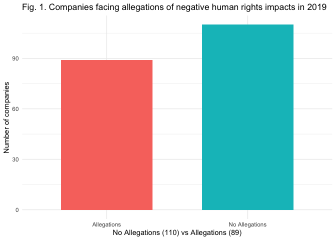
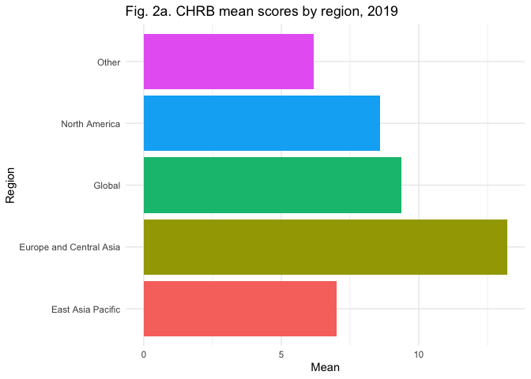
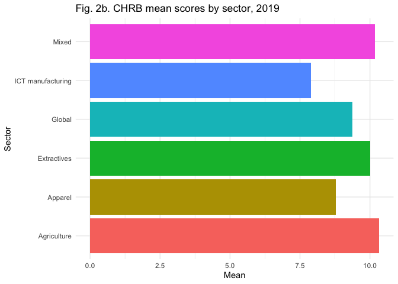
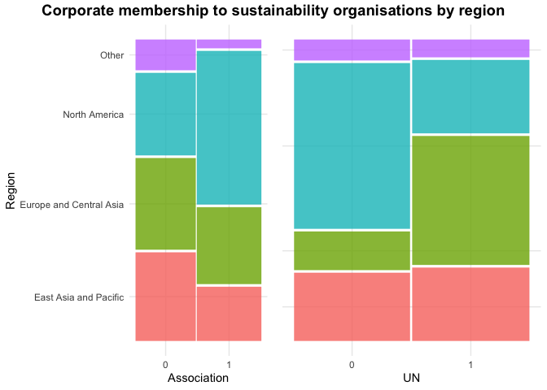
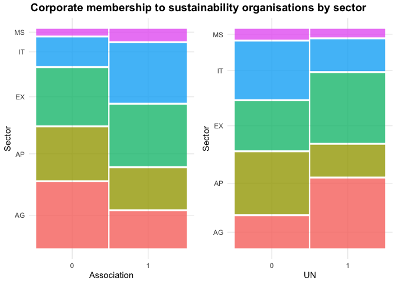
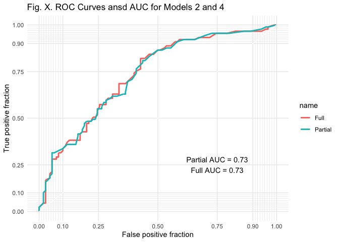
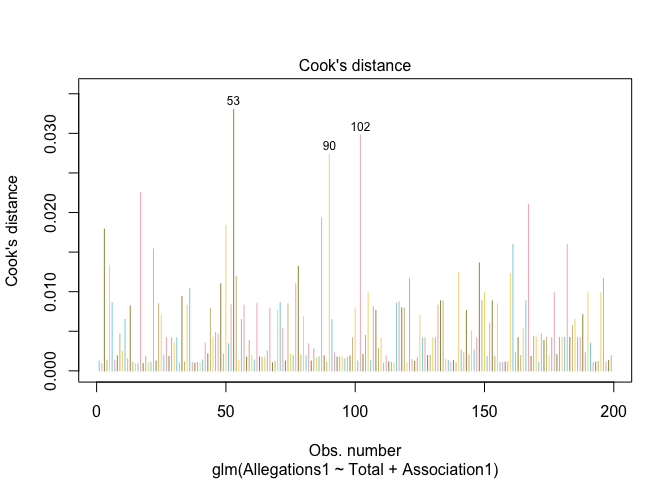
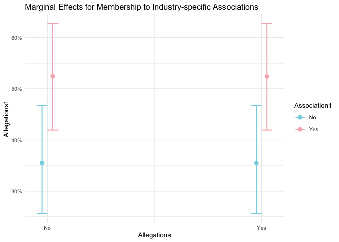

-   [1. Introduction](#introduction)
-   [2. Research proposition and
    hypothesis](#research-proposition-and-hypothesis)
-   [3. Data and measurements](#data-and-measurements)
    -   [3.1. Defining the independent and dependent
        variables](#defining-the-independent-and-dependent-variables)
    -   [3.2 Corporate Human Rights
        Peformance](#corporate-human-rights-peformance)
        -   [CHRB Scores by region and
            sector](#chrb-scores-by-region-and-sector)
        -   [Allegations of negative human rights, by region and
            sector](#allegations-of-negative-human-rights-by-region-and-sector)
-   [4. Methods](#methods)
-   [5. Results](#results)
    -   [5.1 Model selection](#model-selection)
    -   [5.2 Model diagnostics](#model-diagnostics)
    -   [5.3 Results](#results-1)
-   [6. Conclusion](#conclusion)
-   [7. Annex 1](#annex-1)
-   [7. Bibliography](#bibliography)

# 1. Introduction

Since 2011, the international community has sought to achieve corporate
respect for international standards aimed at securing dignity and
equality for all through the multi-level, multi-stakeholder,
transnational, and relational governance system advocated by the United
Nations Guiding Principles for Business and Human Rights (UNGPs) (Assadi
2011; Backer 2014; Burger 2003; Prenkert 2014). This innovative
governance tool has called for several actors to take action at multiple
levels to strengthen corporate human rights due diligence (Backer 2014;
Burger 2003; Taylor 2011). Yet, ten years after their unanimous
endorsement by the Human Rights Council and despite corporate pledges to
redefine its role with society and the environment, UNGP adoption
remains despairingly low, and allegations of severe negative human
rights impacts by transnational companies continue to rise. This has
been captured by different benchmarks ranking corporate commitments and
actions to respect human rights (Human Rights Resource Centre 2014;
Salcito, Wielga, and Singer 2015).

However, at a time when allegations of severe negative human rights
impacts by transnational companies continue to rise, corporate
membership to industry associations seems to signal an improvement in
practices (Eccles (2020); Hogan, Rhodes, and Lawlor (2020);Watch
(2020)). This literature suggests that, when it comes to social
sustainability, companies are more responsive to private peer-to-peer
governance structures than they are to governments threats of heightened
regulation, changes in the institutional investment environment, and
pressure from civil society groups (Lin, Mao, and Wang 2017; Marquis and
Tilcsik 2016; Rosenberg 2011).

# 2. Research proposition and hypothesis

Building on this premise, this project proposes that the governance
spaces created by private transnational industry associations help to
advance corporate human rights commitments, thereby preventing external
sources from making allegations of serious human rights abuses against a
given company. This will be tested by looking at whether company
membership in industry-specific associations and the United Nations
Global Compact - a global sustainability platform focused on corporate
social responsibility corporate governance and mobilizing business to
pursue social objectives - have an impact on whether allegations of
severe human rights impacts are raised against a company.

This project tests the following three hypotheses:

1.  Ho: UNGC membership negatively affects the chances that allegations
    of negative human rights impacts will be raised against a company,

2.  Ho: Membership to industry-specific business associations negatively
    affects the chances that allegations of negative human rights
    impacts will be raised against a company.

3.  Ho: Membership to industry-specific business associations has a
    higher influence than UNGCP-membership in negatively affecting the
    chances that allegations of negative human rights impacts will be
    raised against a company.

# 3. Data and measurements

This project uses the 2019 dataset produced by the Corporate Human
Rights Benchmark (CHRB), which is available for download on their
[website](https://www.corporatebenchmark.org/download-benchmark-data).
This group assesses the performance on human rights of the world’s 199
largest publicly traded companies in the agricultural, apparel,
extractives, ICT manufacturing and automotive manufacturing industries.
This focus on the businesses with the largest market capitalisation
leads to a significant bias that is partially addressed through the
inclusion of at least six companies per continent, spread across
different regions, and ten companies per industry to ensure a minimum of
geographical and industry balance in the pool of assessed firms. As a
result of this sampling bias, nevertheless, it is unlikely that a clear
differentiation between laggard and leader regions and industries can be
drawn (CHRB 2021).

Whilst there are not quantitative base units to measure corporate human
rights performance the benchmark used here is widely employed in the
business and human rights field. Moreover, the CHRB has collaborated
with some 400 stakeholders from the business, government, civil society,
academia, finance, and legal sectors to revise and update its
methodology and ensure that it provides an accurate proxy for companies’
actions to prevent and address negative human rights impacts.
Nevertheless, the scope of this analysis is limited to the end of the
production value chain and does not look at the impact that company
practices have along the distribution, retailing, end-use, re-use and
disposal of the products and services they offer.

The full CHRB dataset includes over 80 indicators divided into six
areas, namely: corporate human rights related policy commitments and
governance, corporate systems and processes to implement such policy
commitments (embedment), grievance mechanisms and remedies, performance
regarding human rights practices, responses to allegations of negative
impacts and transparency. Each of these categories has been assigned a
different weight to produce a company’s total CHRB score. This
assignment will focus on a reduced number of independent variables as
shown below and described in the next section.

## 3.1. Defining the independent and dependent variables

The dependent variable *Allegations* is a categorical binary variable
where: - 0 indicates that no allegations of negative impacts have been
made against a company in 2019 - 1 indicates that at least one
allegation has been made against a company has been made in 2019

Out of the 199 companies included in the study, 89 companies had at
least one serious allegation connected to them.

Other independent variables include:

\[2\] “HQ”: Country of company domicile is a categorical nominal
variable

\[3\] “Region”: categorical nominal variable capturing where the parent
company is domiciled out of four regions, namely North America, Europe
and Central Asia, East Asia and Pacific, and the rest (a category that
comprises Latin America and the Caribbean, South Asia, Sub-Saharan
Africa, and the Middle East and North Africa).

\[4\] “Sector”: categorical nominal variable capturing industry or
economic sector from which the company derives at least 70% of its
revenue. Information and Communication Technology (ICT) Manufacturing,
Apparel, Agricultural (including food and beverage), Extractives
(including oil, gas and mining), Finance, and Automotive Manufacturing.

\[5\] “Total”: numerical continuous variable aggregating scores awarded
for six themes described below. Scores are given in halves and integer
units from 0 to 26 points. The higher the total, the stronger a
company’s commitment to respecting human rights.

\[6\] “Commitments (Governance & Policy Commitments, Score/8)”:
numerical continuous variable with a maximum possible score of 8 points.
Assesses a company’s public acknowledgement of its responsibility to
respect human rights and the way this informs corporate policies and
explicit commitments approved by the highest levels of corporate
management.

\[7\] “HRDD (Embedding Respect & Human Rights Due Diligence, Score/12)”:
numerical continuous variable with a maximum score of 12 points.
Assesses the extent of a company’s systems and processes established to
implement the company’s policy commitments in practice. It comprises
\[9\] “Embedding Respect (Score/2)” and \[10\] “Human Rights Due
Diligence (Score/10),” both of which are numerical continuous variables.

\[8\] “Remedy (Remedies & Grievance Mechanisms, Score/6)”: numerical
continuous variable with a maximum score of 6 points. Focuses on the
extent to which a company provides remedy in addressing actual adverse
impacts on human rights.

\[9\] “UN”: dichotomous variable that indicates that a company is member
to the UN Global Compact (1) or not (0).

\[10\] “Association”: dichotomous variable that indicates that a company
is member to industry-specific associations (1) or not (0). Whenever one
or more industry groupings were relevant, a company needed to be member
to at least one of them to score (1).

## 3.2 Corporate Human Rights Peformance

Total scores reveal that in average, companies’ scores are rather low,
with a mean score of 9.374 out of 26 possible points. Looking at each
category in more detail, we notice that the lowest scores were obtained
in the Human Rights Due Diligence part of the CHRB. Out of a maximum of
12 points, the mean score was 3.131 points. Companies scored the highest
in terms of commitments to respecting human rights, averaging 3.638 out
of 8 possible points. Moreover, there were companies that obtained nil
points in the total score as well as in individual components of the
index. The five companies that have taken no steps whatsoever to make a
public commitment to respecting human rights, and thus obtained a total
score of zero in the benchmark, were all based in China: Heilan Group
(apparel), Kweichow Moutai (agriculture), Shenzhou International
(apparel), Youngor Group (apparel) and Zhejiang Semir Garment (apparel).

Table 1. Corporate Human Rights performance, summary statistics.

<table class="table" style="margin-left: auto; margin-right: auto;">
<caption>
Summary Statistics
</caption>
<thead>
<tr>
<th style="text-align:left;">
Variable
</th>
<th style="text-align:left;">
N
</th>
<th style="text-align:left;">
Mean
</th>
<th style="text-align:left;">
Std. Dev.
</th>
<th style="text-align:left;">
Min
</th>
<th style="text-align:left;">
Pctl. 25
</th>
<th style="text-align:left;">
Pctl. 75
</th>
<th style="text-align:left;">
Max
</th>
</tr>
</thead>
<tbody>
<tr>
<td style="text-align:left;">
Total
</td>
<td style="text-align:left;">
199
</td>
<td style="text-align:left;">
9.374
</td>
<td style="text-align:left;">
6.358
</td>
<td style="text-align:left;">
0
</td>
<td style="text-align:left;">
4.5
</td>
<td style="text-align:left;">
14
</td>
<td style="text-align:left;">
25
</td>
</tr>
<tr>
<td style="text-align:left;">
Commitments
</td>
<td style="text-align:left;">
199
</td>
<td style="text-align:left;">
3.638
</td>
<td style="text-align:left;">
2.055
</td>
<td style="text-align:left;">
0
</td>
<td style="text-align:left;">
2
</td>
<td style="text-align:left;">
5
</td>
<td style="text-align:left;">
8
</td>
</tr>
<tr>
<td style="text-align:left;">
HRDD
</td>
<td style="text-align:left;">
199
</td>
<td style="text-align:left;">
3.131
</td>
<td style="text-align:left;">
3.391
</td>
<td style="text-align:left;">
0
</td>
<td style="text-align:left;">
0
</td>
<td style="text-align:left;">
5.75
</td>
<td style="text-align:left;">
12
</td>
</tr>
<tr>
<td style="text-align:left;">
Remedy
</td>
<td style="text-align:left;">
199
</td>
<td style="text-align:left;">
2.606
</td>
<td style="text-align:left;">
1.519
</td>
<td style="text-align:left;">
0
</td>
<td style="text-align:left;">
1.5
</td>
<td style="text-align:left;">
3.5
</td>
<td style="text-align:left;">
6
</td>
</tr>
</tbody>
</table>

### CHRB Scores by region and sector

Figures 2.a and 2.b below show a regional and sectoral breakdown of firm
representation and average scores.

North America outnumbers other regions with 81 included firms whilst
there is only one company from the MENA region (Middle East and North
Africa): Saudi Aramco, a firm in the extractives industry, with a score
of 1 out of 26 possible points. The highest scoring companies, with 25
points each, were Eni and Unilever, both based in Europe. Companies in
that region had a mean score of 13.21. North American companies scored,
on average, 8.6 points, 1.5 points above companies in East Asia Pacific
and 4 points higher than firms in Latin America and the Caribbean.

The CHRB focuses on four high-risk sectors: agricultural products,
apparel, extractives and Information Communication Technologies (ICT)
manufacturing. As can be seen in Figure 2.b, ICT manufacturing is
lowering the global average score down as it is the poorest performing
sector. Extractives and agriculture, the two most scrutinised global
industries, have the highest scores.

#### By Region

#### By Sector

### Allegations of negative human rights, by region and sector

Figures 3.a and 3.b visualise the relationship between allegations of
negative human rights impacts and membership to the United Nations
Global Compact and sector-specific industrial groupings disaggregated by
region and sector.

#### By Region

#### By Sector

# 4. Methods

The effect that being a member to the United Nations Global Compact and
industry-specific groupings has on whether a company faces allegations
of negative human rights impacts will be tested using a binomial
logistic regression model. This model is used given its suitability to
assess the relationship between a binary response variable (yes/no
membership) and other explanatory variables, granted that it satisfies
the following main assumptions
(**statisticssolutionsAssumptionIndependence2015?**):

1.  Appropriate outcome structure. The dependent variable needs to be
    binary and in this case it refers to whether companies face
    allegations of negative human rights impacts.

2.  Observations need to be independent of each other. This assumption
    is met as the CHRB dataset does not rely on repeated measurements or
    matched data.

3.  Low levels of multicollinearity among the independent variables.
    This is tested in section 5.2 using the variance inflation factor.

4.  Independent variables and log odds are linearly related. This was
    done by looking at the p-values of the selected model. As these were
    small enough, the hypothesis of these coefficients being zero was
    rejected, suggesting that the linearity with log odds held for this
    dataset.

5.  A large sample size. The original dataset consisted of 16 variables
    for 199 observations with no data omissions.

Moreover, logistic regressions do not need to comply with the same
assumptions than linear models to. For instance, no linear relationship
between the dependent and independent variables is required and neither
do the error terms (or residuals) ought to be normally distributed.
Lastly, homoscedasticity is not required.

The following section shows the results of different models tested using
different variables and controls.

# 5. Results

The table below shows three different models. Model 1 and 2 uses total
score in the Corporate Human Rights Benchmark and corporate membership
to sector-specific associations and the UNGC as main independent
variables. Model 3 looks only at the effect of association to
sustainability groups as variables whist Model 4 adds total benchmark
scores. Other models were tested using individual components of the CHRB
index, especially the variable capturing corporate activities to remedy
negative human rights impacts (“Remedy”). In all of these cases, the
results were similar to those presented on Table 2 and thus the total
score was used as a preferable variable given that it captures corporate
commitments and concrete actions to ensure companies respect human
rights.

<table style="border-collapse:collapse; border:none;">
<caption style="font-weight: bold; text-align:left;">
Table 2. Model Selection
</caption>
<tr>
<th style="border-top: double; text-align:center; font-style:normal; font-weight:bold; padding:0.2cm;  text-align:left; ">
 
</th>
<th colspan="2" style="border-top: double; text-align:center; font-style:normal; font-weight:bold; padding:0.2cm; ">
Model 1
</th>
<th colspan="2" style="border-top: double; text-align:center; font-style:normal; font-weight:bold; padding:0.2cm; ">
Model 2
</th>
<th colspan="2" style="border-top: double; text-align:center; font-style:normal; font-weight:bold; padding:0.2cm; ">
Model 3
</th>
<th colspan="2" style="border-top: double; text-align:center; font-style:normal; font-weight:bold; padding:0.2cm; ">
Model 4
</th>
</tr>
<tr>
<td style=" text-align:center; border-bottom:1px solid; font-style:italic; font-weight:normal;  text-align:left; ">
Predictors
</td>
<td style=" text-align:center; border-bottom:1px solid; font-style:italic; font-weight:normal;  ">
Odds Ratios
</td>
<td style=" text-align:center; border-bottom:1px solid; font-style:italic; font-weight:normal;  ">
CI
</td>
<td style=" text-align:center; border-bottom:1px solid; font-style:italic; font-weight:normal;  ">
Odds Ratios
</td>
<td style=" text-align:center; border-bottom:1px solid; font-style:italic; font-weight:normal;  ">
CI
</td>
<td style=" text-align:center; border-bottom:1px solid; font-style:italic; font-weight:normal;  ">
Odds Ratios
</td>
<td style=" text-align:center; border-bottom:1px solid; font-style:italic; font-weight:normal;  col7">
CI
</td>
<td style=" text-align:center; border-bottom:1px solid; font-style:italic; font-weight:normal;  col8">
Odds Ratios
</td>
<td style=" text-align:center; border-bottom:1px solid; font-style:italic; font-weight:normal;  col9">
CI
</td>
</tr>
<tr>
<td style=" padding:0.2cm; text-align:left; vertical-align:top; text-align:left; ">
(Intercept)
</td>
<td style=" padding:0.2cm; text-align:left; vertical-align:top; text-align:center;  ">
0.247 \*\*\*
</td>
<td style=" padding:0.2cm; text-align:left; vertical-align:top; text-align:center;  ">
0.137 – 0.430
</td>
<td style=" padding:0.2cm; text-align:left; vertical-align:top; text-align:center;  ">
0.201 \*\*\*
</td>
<td style=" padding:0.2cm; text-align:left; vertical-align:top; text-align:center;  ">
0.107 – 0.361
</td>
<td style=" padding:0.2cm; text-align:left; vertical-align:top; text-align:center;  ">
0.350 \*\*\*
</td>
<td style=" padding:0.2cm; text-align:left; vertical-align:top; text-align:center;  col7">
0.205 – 0.580
</td>
<td style=" padding:0.2cm; text-align:left; vertical-align:top; text-align:center;  col8">
0.205 \*\*\*
</td>
<td style=" padding:0.2cm; text-align:left; vertical-align:top; text-align:center;  col9">
0.109 – 0.372
</td>
</tr>
<tr>
<td style=" padding:0.2cm; text-align:left; vertical-align:top; text-align:left; ">
Total
</td>
<td style=" padding:0.2cm; text-align:left; vertical-align:top; text-align:center;  ">
1.145 \*\*\*
</td>
<td style=" padding:0.2cm; text-align:left; vertical-align:top; text-align:center;  ">
1.083 – 1.216
</td>
<td style=" padding:0.2cm; text-align:left; vertical-align:top; text-align:center;  ">
1.113 \*\*\*
</td>
<td style=" padding:0.2cm; text-align:left; vertical-align:top; text-align:center;  ">
1.057 – 1.177
</td>
<td style=" padding:0.2cm; text-align:left; vertical-align:top; text-align:center;  ">
</td>
<td style=" padding:0.2cm; text-align:left; vertical-align:top; text-align:center;  col7">
</td>
<td style=" padding:0.2cm; text-align:left; vertical-align:top; text-align:center;  col8">
1.120 \*\*\*
</td>
<td style=" padding:0.2cm; text-align:left; vertical-align:top; text-align:center;  col9">
1.055 – 1.192
</td>
</tr>
<tr>
<td style=" padding:0.2cm; text-align:left; vertical-align:top; text-align:left; ">
UN1 \[Yes\]
</td>
<td style=" padding:0.2cm; text-align:left; vertical-align:top; text-align:center;  ">
0.824 
</td>
<td style=" padding:0.2cm; text-align:left; vertical-align:top; text-align:center;  ">
0.409 – 1.621
</td>
<td style=" padding:0.2cm; text-align:left; vertical-align:top; text-align:center;  ">
</td>
<td style=" padding:0.2cm; text-align:left; vertical-align:top; text-align:center;  ">
</td>
<td style=" padding:0.2cm; text-align:left; vertical-align:top; text-align:center;  ">
1.603 
</td>
<td style=" padding:0.2cm; text-align:left; vertical-align:top; text-align:center;  col7">
0.890 – 2.897
</td>
<td style=" padding:0.2cm; text-align:left; vertical-align:top; text-align:center;  col8">
0.871 
</td>
<td style=" padding:0.2cm; text-align:left; vertical-align:top; text-align:center;  col9">
0.430 – 1.728
</td>
</tr>
<tr>
<td style=" padding:0.2cm; text-align:left; vertical-align:top; text-align:left; ">
Association1 \[Yes\]
</td>
<td style=" padding:0.2cm; text-align:left; vertical-align:top; text-align:center;  ">
</td>
<td style=" padding:0.2cm; text-align:left; vertical-align:top; text-align:center;  ">
</td>
<td style=" padding:0.2cm; text-align:left; vertical-align:top; text-align:center;  ">
2.005 \*
</td>
<td style=" padding:0.2cm; text-align:left; vertical-align:top; text-align:center;  ">
1.050 – 3.833
</td>
<td style=" padding:0.2cm; text-align:left; vertical-align:top; text-align:center;  ">
3.055 \*\*\*
</td>
<td style=" padding:0.2cm; text-align:left; vertical-align:top; text-align:center;  col7">
1.702 – 5.570
</td>
<td style=" padding:0.2cm; text-align:left; vertical-align:top; text-align:center;  col8">
1.986 \*
</td>
<td style=" padding:0.2cm; text-align:left; vertical-align:top; text-align:center;  col9">
1.038 – 3.804
</td>
</tr>
<tr>
<td style=" padding:0.2cm; text-align:left; vertical-align:top; text-align:left; padding-top:0.1cm; padding-bottom:0.1cm; border-top:1px solid;">
Observations
</td>
<td style=" padding:0.2cm; text-align:left; vertical-align:top; padding-top:0.1cm; padding-bottom:0.1cm; text-align:left; border-top:1px solid;" colspan="2">
199
</td>
<td style=" padding:0.2cm; text-align:left; vertical-align:top; padding-top:0.1cm; padding-bottom:0.1cm; text-align:left; border-top:1px solid;" colspan="2">
199
</td>
<td style=" padding:0.2cm; text-align:left; vertical-align:top; padding-top:0.1cm; padding-bottom:0.1cm; text-align:left; border-top:1px solid;" colspan="2">
199
</td>
<td style=" padding:0.2cm; text-align:left; vertical-align:top; padding-top:0.1cm; padding-bottom:0.1cm; text-align:left; border-top:1px solid;" colspan="2">
199
</td>
</tr>
<tr>
<td style=" padding:0.2cm; text-align:left; vertical-align:top; text-align:left; padding-top:0.1cm; padding-bottom:0.1cm;">
R2 Tjur
</td>
<td style=" padding:0.2cm; text-align:left; vertical-align:top; padding-top:0.1cm; padding-bottom:0.1cm; text-align:left;" colspan="2">
0.138
</td>
<td style=" padding:0.2cm; text-align:left; vertical-align:top; padding-top:0.1cm; padding-bottom:0.1cm; text-align:left;" colspan="2">
0.156
</td>
<td style=" padding:0.2cm; text-align:left; vertical-align:top; padding-top:0.1cm; padding-bottom:0.1cm; text-align:left;" colspan="2">
0.091
</td>
<td style=" padding:0.2cm; text-align:left; vertical-align:top; padding-top:0.1cm; padding-bottom:0.1cm; text-align:left;" colspan="2">
0.157
</td>
</tr>
<tr>
<td style=" padding:0.2cm; text-align:left; vertical-align:top; text-align:left; padding-top:0.1cm; padding-bottom:0.1cm;">
AIC
</td>
<td style=" padding:0.2cm; text-align:left; vertical-align:top; padding-top:0.1cm; padding-bottom:0.1cm; text-align:left;" colspan="2">
251.006
</td>
<td style=" padding:0.2cm; text-align:left; vertical-align:top; padding-top:0.1cm; padding-bottom:0.1cm; text-align:left;" colspan="2">
246.872
</td>
<td style=" padding:0.2cm; text-align:left; vertical-align:top; padding-top:0.1cm; padding-bottom:0.1cm; text-align:left;" colspan="2">
261.117
</td>
<td style=" padding:0.2cm; text-align:left; vertical-align:top; padding-top:0.1cm; padding-bottom:0.1cm; text-align:left;" colspan="2">
248.719
</td>
</tr>
<tr>
<td style=" padding:0.2cm; text-align:left; vertical-align:top; text-align:left; padding-top:0.1cm; padding-bottom:0.1cm;">
log-Likelihood
</td>
<td style=" padding:0.2cm; text-align:left; vertical-align:top; padding-top:0.1cm; padding-bottom:0.1cm; text-align:left;" colspan="2">
-122.503
</td>
<td style=" padding:0.2cm; text-align:left; vertical-align:top; padding-top:0.1cm; padding-bottom:0.1cm; text-align:left;" colspan="2">
-120.436
</td>
<td style=" padding:0.2cm; text-align:left; vertical-align:top; padding-top:0.1cm; padding-bottom:0.1cm; text-align:left;" colspan="2">
-127.559
</td>
<td style=" padding:0.2cm; text-align:left; vertical-align:top; padding-top:0.1cm; padding-bottom:0.1cm; text-align:left;" colspan="2">
-120.359
</td>
</tr>
<tr>
<td colspan="9" style="font-style:italic; border-top:double black; text-align:right;">

-   p&lt;0.05   \*\* p&lt;0.01   \*\*\* p&lt;0.001
    </td>
    </tr>

</table>

In these three models, total CHRB scores and membership to
industry-specific groupings are statistically significant at the 99.9%
but the positive signs of the parameters indicate companies have higher
odds of facing allegations of negative human rights impacts. This
counterintuitive finding will be tested in subsequent models that take
Model 4 as a base onto which controls for region of company domicile and
sector were added.

<table style="border-collapse:collapse; border:none;">
<caption style="font-weight: bold; text-align:left;">
Table 3. Model Selection
</caption>
<tr>
<th style="border-top: double; text-align:center; font-style:normal; font-weight:bold; padding:0.2cm;  text-align:left; ">
 
</th>
<th colspan="2" style="border-top: double; text-align:center; font-style:normal; font-weight:bold; padding:0.2cm; ">
Model 5
</th>
<th colspan="2" style="border-top: double; text-align:center; font-style:normal; font-weight:bold; padding:0.2cm; ">
Model 6
</th>
<th colspan="2" style="border-top: double; text-align:center; font-style:normal; font-weight:bold; padding:0.2cm; ">
Model 7
</th>
<th colspan="2" style="border-top: double; text-align:center; font-style:normal; font-weight:bold; padding:0.2cm; ">
Model 8
</th>
</tr>
<tr>
<td style=" text-align:center; border-bottom:1px solid; font-style:italic; font-weight:normal;  text-align:left; ">
Predictors
</td>
<td style=" text-align:center; border-bottom:1px solid; font-style:italic; font-weight:normal;  ">
Odds Ratios
</td>
<td style=" text-align:center; border-bottom:1px solid; font-style:italic; font-weight:normal;  ">
CI
</td>
<td style=" text-align:center; border-bottom:1px solid; font-style:italic; font-weight:normal;  ">
Odds Ratios
</td>
<td style=" text-align:center; border-bottom:1px solid; font-style:italic; font-weight:normal;  ">
CI
</td>
<td style=" text-align:center; border-bottom:1px solid; font-style:italic; font-weight:normal;  ">
Odds Ratios
</td>
<td style=" text-align:center; border-bottom:1px solid; font-style:italic; font-weight:normal;  col7">
CI
</td>
<td style=" text-align:center; border-bottom:1px solid; font-style:italic; font-weight:normal;  col8">
Odds Ratios
</td>
<td style=" text-align:center; border-bottom:1px solid; font-style:italic; font-weight:normal;  col9">
CI
</td>
</tr>
<tr>
<td style=" padding:0.2cm; text-align:left; vertical-align:top; text-align:left; ">
(Intercept)
</td>
<td style=" padding:0.2cm; text-align:left; vertical-align:top; text-align:center;  ">
0.127 \*\*\*
</td>
<td style=" padding:0.2cm; text-align:left; vertical-align:top; text-align:center;  ">
0.048 – 0.307
</td>
<td style=" padding:0.2cm; text-align:left; vertical-align:top; text-align:center;  ">
0.195 \*\*\*
</td>
<td style=" padding:0.2cm; text-align:left; vertical-align:top; text-align:center;  ">
0.091 – 0.397
</td>
<td style=" padding:0.2cm; text-align:left; vertical-align:top; text-align:center;  ">
0.118 \*\*\*
</td>
<td style=" padding:0.2cm; text-align:left; vertical-align:top; text-align:center;  col7">
0.042 – 0.303
</td>
<td style=" padding:0.2cm; text-align:left; vertical-align:top; text-align:center;  col8">
0.245 \*\*
</td>
<td style=" padding:0.2cm; text-align:left; vertical-align:top; text-align:center;  col9">
0.101 – 0.559
</td>
</tr>
<tr>
<td style=" padding:0.2cm; text-align:left; vertical-align:top; text-align:left; ">
Total
</td>
<td style=" padding:0.2cm; text-align:left; vertical-align:top; text-align:center;  ">
1.124 \*\*\*
</td>
<td style=" padding:0.2cm; text-align:left; vertical-align:top; text-align:center;  ">
1.058 – 1.200
</td>
<td style=" padding:0.2cm; text-align:left; vertical-align:top; text-align:center;  ">
1.131 \*\*\*
</td>
<td style=" padding:0.2cm; text-align:left; vertical-align:top; text-align:center;  ">
1.061 – 1.209
</td>
<td style=" padding:0.2cm; text-align:left; vertical-align:top; text-align:center;  ">
1.137 \*\*\*
</td>
<td style=" padding:0.2cm; text-align:left; vertical-align:top; text-align:center;  col7">
1.066 – 1.218
</td>
<td style=" padding:0.2cm; text-align:left; vertical-align:top; text-align:center;  col8">
</td>
<td style=" padding:0.2cm; text-align:left; vertical-align:top; text-align:center;  col9">
</td>
</tr>
<tr>
<td style=" padding:0.2cm; text-align:left; vertical-align:top; text-align:left; ">
UN1 \[Yes\]
</td>
<td style=" padding:0.2cm; text-align:left; vertical-align:top; text-align:center;  ">
1.035 
</td>
<td style=" padding:0.2cm; text-align:left; vertical-align:top; text-align:center;  ">
0.497 – 2.130
</td>
<td style=" padding:0.2cm; text-align:left; vertical-align:top; text-align:center;  ">
0.886 
</td>
<td style=" padding:0.2cm; text-align:left; vertical-align:top; text-align:center;  ">
0.421 – 1.831
</td>
<td style=" padding:0.2cm; text-align:left; vertical-align:top; text-align:center;  ">
1.078 
</td>
<td style=" padding:0.2cm; text-align:left; vertical-align:top; text-align:center;  col7">
0.496 – 2.324
</td>
<td style=" padding:0.2cm; text-align:left; vertical-align:top; text-align:center;  col8">
1.756 
</td>
<td style=" padding:0.2cm; text-align:left; vertical-align:top; text-align:center;  col9">
0.880 – 3.553
</td>
</tr>
<tr>
<td style=" padding:0.2cm; text-align:left; vertical-align:top; text-align:left; ">
Association1 \[Yes\]
</td>
<td style=" padding:0.2cm; text-align:left; vertical-align:top; text-align:center;  ">
1.825 
</td>
<td style=" padding:0.2cm; text-align:left; vertical-align:top; text-align:center;  ">
0.918 – 3.628
</td>
<td style=" padding:0.2cm; text-align:left; vertical-align:top; text-align:center;  ">
1.896 
</td>
<td style=" padding:0.2cm; text-align:left; vertical-align:top; text-align:center;  ">
0.948 – 3.798
</td>
<td style=" padding:0.2cm; text-align:left; vertical-align:top; text-align:center;  ">
1.723 
</td>
<td style=" padding:0.2cm; text-align:left; vertical-align:top; text-align:center;  col7">
0.820 – 3.621
</td>
<td style=" padding:0.2cm; text-align:left; vertical-align:top; text-align:center;  col8">
3.032 \*\*
</td>
<td style=" padding:0.2cm; text-align:left; vertical-align:top; text-align:center;  col9">
1.575 – 5.958
</td>
</tr>
<tr>
<td style=" padding:0.2cm; text-align:left; vertical-align:top; text-align:left; ">
Sector \[AP\]
</td>
<td style=" padding:0.2cm; text-align:left; vertical-align:top; text-align:center;  ">
2.147 
</td>
<td style=" padding:0.2cm; text-align:left; vertical-align:top; text-align:center;  ">
0.838 – 5.661
</td>
<td style=" padding:0.2cm; text-align:left; vertical-align:top; text-align:center;  ">
</td>
<td style=" padding:0.2cm; text-align:left; vertical-align:top; text-align:center;  ">
</td>
<td style=" padding:0.2cm; text-align:left; vertical-align:top; text-align:center;  ">
2.280 
</td>
<td style=" padding:0.2cm; text-align:left; vertical-align:top; text-align:center;  col7">
0.878 – 6.106
</td>
<td style=" padding:0.2cm; text-align:left; vertical-align:top; text-align:center;  col8">
1.954 
</td>
<td style=" padding:0.2cm; text-align:left; vertical-align:top; text-align:center;  col9">
0.785 – 4.968
</td>
</tr>
<tr>
<td style=" padding:0.2cm; text-align:left; vertical-align:top; text-align:left; ">
Sector \[EX\]
</td>
<td style=" padding:0.2cm; text-align:left; vertical-align:top; text-align:center;  ">
1.244 
</td>
<td style=" padding:0.2cm; text-align:left; vertical-align:top; text-align:center;  ">
0.514 – 3.042
</td>
<td style=" padding:0.2cm; text-align:left; vertical-align:top; text-align:center;  ">
</td>
<td style=" padding:0.2cm; text-align:left; vertical-align:top; text-align:center;  ">
</td>
<td style=" padding:0.2cm; text-align:left; vertical-align:top; text-align:center;  ">
1.294 
</td>
<td style=" padding:0.2cm; text-align:left; vertical-align:top; text-align:center;  col7">
0.516 – 3.278
</td>
<td style=" padding:0.2cm; text-align:left; vertical-align:top; text-align:center;  col8">
1.128 
</td>
<td style=" padding:0.2cm; text-align:left; vertical-align:top; text-align:center;  col9">
0.473 – 2.694
</td>
</tr>
<tr>
<td style=" padding:0.2cm; text-align:left; vertical-align:top; text-align:left; ">
Sector \[IT\]
</td>
<td style=" padding:0.2cm; text-align:left; vertical-align:top; text-align:center;  ">
1.663 
</td>
<td style=" padding:0.2cm; text-align:left; vertical-align:top; text-align:center;  ">
0.623 – 4.514
</td>
<td style=" padding:0.2cm; text-align:left; vertical-align:top; text-align:center;  ">
</td>
<td style=" padding:0.2cm; text-align:left; vertical-align:top; text-align:center;  ">
</td>
<td style=" padding:0.2cm; text-align:left; vertical-align:top; text-align:center;  ">
1.619 
</td>
<td style=" padding:0.2cm; text-align:left; vertical-align:top; text-align:center;  col7">
0.596 – 4.470
</td>
<td style=" padding:0.2cm; text-align:left; vertical-align:top; text-align:center;  col8">
1.188 
</td>
<td style=" padding:0.2cm; text-align:left; vertical-align:top; text-align:center;  col9">
0.459 – 3.085
</td>
</tr>
<tr>
<td style=" padding:0.2cm; text-align:left; vertical-align:top; text-align:left; ">
Sector \[MS\]
</td>
<td style=" padding:0.2cm; text-align:left; vertical-align:top; text-align:center;  ">
3.712 
</td>
<td style=" padding:0.2cm; text-align:left; vertical-align:top; text-align:center;  ">
0.738 – 21.840
</td>
<td style=" padding:0.2cm; text-align:left; vertical-align:top; text-align:center;  ">
</td>
<td style=" padding:0.2cm; text-align:left; vertical-align:top; text-align:center;  ">
</td>
<td style=" padding:0.2cm; text-align:left; vertical-align:top; text-align:center;  ">
4.003 
</td>
<td style=" padding:0.2cm; text-align:left; vertical-align:top; text-align:center;  col7">
0.780 – 24.151
</td>
<td style=" padding:0.2cm; text-align:left; vertical-align:top; text-align:center;  col8">
3.179 
</td>
<td style=" padding:0.2cm; text-align:left; vertical-align:top; text-align:center;  col9">
0.665 – 18.159
</td>
</tr>
<tr>
<td style=" padding:0.2cm; text-align:left; vertical-align:top; text-align:left; ">
Region \[East Asia and Pacific\]
</td>
<td style=" padding:0.2cm; text-align:left; vertical-align:top; text-align:center;  ">
</td>
<td style=" padding:0.2cm; text-align:left; vertical-align:top; text-align:center;  ">
</td>
<td style=" padding:0.2cm; text-align:left; vertical-align:top; text-align:center;  ">
1.231 
</td>
<td style=" padding:0.2cm; text-align:left; vertical-align:top; text-align:center;  ">
0.537 – 2.843
</td>
<td style=" padding:0.2cm; text-align:left; vertical-align:top; text-align:center;  ">
1.238 
</td>
<td style=" padding:0.2cm; text-align:left; vertical-align:top; text-align:center;  col7">
0.526 – 2.935
</td>
<td style=" padding:0.2cm; text-align:left; vertical-align:top; text-align:center;  col8">
1.093 
</td>
<td style=" padding:0.2cm; text-align:left; vertical-align:top; text-align:center;  col9">
0.481 – 2.487
</td>
</tr>
<tr>
<td style=" padding:0.2cm; text-align:left; vertical-align:top; text-align:left; ">
Region \[Europe and Central Asia\]
</td>
<td style=" padding:0.2cm; text-align:left; vertical-align:top; text-align:center;  ">
</td>
<td style=" padding:0.2cm; text-align:left; vertical-align:top; text-align:center;  ">
</td>
<td style=" padding:0.2cm; text-align:left; vertical-align:top; text-align:center;  ">
0.786 
</td>
<td style=" padding:0.2cm; text-align:left; vertical-align:top; text-align:center;  ">
0.326 – 1.856
</td>
<td style=" padding:0.2cm; text-align:left; vertical-align:top; text-align:center;  ">
0.719 
</td>
<td style=" padding:0.2cm; text-align:left; vertical-align:top; text-align:center;  col7">
0.291 – 1.739
</td>
<td style=" padding:0.2cm; text-align:left; vertical-align:top; text-align:center;  col8">
1.135 
</td>
<td style=" padding:0.2cm; text-align:left; vertical-align:top; text-align:center;  col9">
0.500 – 2.584
</td>
</tr>
<tr>
<td style=" padding:0.2cm; text-align:left; vertical-align:top; text-align:left; ">
Region \[Other\]
</td>
<td style=" padding:0.2cm; text-align:left; vertical-align:top; text-align:center;  ">
</td>
<td style=" padding:0.2cm; text-align:left; vertical-align:top; text-align:center;  ">
</td>
<td style=" padding:0.2cm; text-align:left; vertical-align:top; text-align:center;  ">
0.917 
</td>
<td style=" padding:0.2cm; text-align:left; vertical-align:top; text-align:center;  ">
0.213 – 3.443
</td>
<td style=" padding:0.2cm; text-align:left; vertical-align:top; text-align:center;  ">
0.904 
</td>
<td style=" padding:0.2cm; text-align:left; vertical-align:top; text-align:center;  col7">
0.199 – 3.613
</td>
<td style=" padding:0.2cm; text-align:left; vertical-align:top; text-align:center;  col8">
0.774 
</td>
<td style=" padding:0.2cm; text-align:left; vertical-align:top; text-align:center;  col9">
0.174 – 3.010
</td>
</tr>
<tr>
<td style=" padding:0.2cm; text-align:left; vertical-align:top; text-align:left; padding-top:0.1cm; padding-bottom:0.1cm; border-top:1px solid;">
Observations
</td>
<td style=" padding:0.2cm; text-align:left; vertical-align:top; padding-top:0.1cm; padding-bottom:0.1cm; text-align:left; border-top:1px solid;" colspan="2">
199
</td>
<td style=" padding:0.2cm; text-align:left; vertical-align:top; padding-top:0.1cm; padding-bottom:0.1cm; text-align:left; border-top:1px solid;" colspan="2">
199
</td>
<td style=" padding:0.2cm; text-align:left; vertical-align:top; padding-top:0.1cm; padding-bottom:0.1cm; text-align:left; border-top:1px solid;" colspan="2">
199
</td>
<td style=" padding:0.2cm; text-align:left; vertical-align:top; padding-top:0.1cm; padding-bottom:0.1cm; text-align:left; border-top:1px solid;" colspan="2">
199
</td>
</tr>
<tr>
<td style=" padding:0.2cm; text-align:left; vertical-align:top; text-align:left; padding-top:0.1cm; padding-bottom:0.1cm;">
R2 Tjur
</td>
<td style=" padding:0.2cm; text-align:left; vertical-align:top; padding-top:0.1cm; padding-bottom:0.1cm; text-align:left;" colspan="2">
0.177
</td>
<td style=" padding:0.2cm; text-align:left; vertical-align:top; padding-top:0.1cm; padding-bottom:0.1cm; text-align:left;" colspan="2">
0.161
</td>
<td style=" padding:0.2cm; text-align:left; vertical-align:top; padding-top:0.1cm; padding-bottom:0.1cm; text-align:left;" colspan="2">
0.183
</td>
<td style=" padding:0.2cm; text-align:left; vertical-align:top; padding-top:0.1cm; padding-bottom:0.1cm; text-align:left;" colspan="2">
0.113
</td>
</tr>
<tr>
<td style=" padding:0.2cm; text-align:left; vertical-align:top; text-align:left; padding-top:0.1cm; padding-bottom:0.1cm;">
AIC
</td>
<td style=" padding:0.2cm; text-align:left; vertical-align:top; padding-top:0.1cm; padding-bottom:0.1cm; text-align:left;" colspan="2">
252.436
</td>
<td style=" padding:0.2cm; text-align:left; vertical-align:top; padding-top:0.1cm; padding-bottom:0.1cm; text-align:left;" colspan="2">
253.780
</td>
<td style=" padding:0.2cm; text-align:left; vertical-align:top; padding-top:0.1cm; padding-bottom:0.1cm; text-align:left;" colspan="2">
257.126
</td>
<td style=" padding:0.2cm; text-align:left; vertical-align:top; padding-top:0.1cm; padding-bottom:0.1cm; text-align:left;" colspan="2">
270.709
</td>
</tr>
<tr>
<td style=" padding:0.2cm; text-align:left; vertical-align:top; text-align:left; padding-top:0.1cm; padding-bottom:0.1cm;">
log-Likelihood
</td>
<td style=" padding:0.2cm; text-align:left; vertical-align:top; padding-top:0.1cm; padding-bottom:0.1cm; text-align:left;" colspan="2">
-118.218
</td>
<td style=" padding:0.2cm; text-align:left; vertical-align:top; padding-top:0.1cm; padding-bottom:0.1cm; text-align:left;" colspan="2">
-119.890
</td>
<td style=" padding:0.2cm; text-align:left; vertical-align:top; padding-top:0.1cm; padding-bottom:0.1cm; text-align:left;" colspan="2">
-117.563
</td>
<td style=" padding:0.2cm; text-align:left; vertical-align:top; padding-top:0.1cm; padding-bottom:0.1cm; text-align:left;" colspan="2">
-125.355
</td>
</tr>
<tr>
<td colspan="9" style="font-style:italic; border-top:double black; text-align:right;">

-   p&lt;0.05   \*\* p&lt;0.01   \*\*\* p&lt;0.001
    </td>
    </tr>

</table>

In Model 5, 6 and 7, the only consistently statistically significant
parameter was the total CHRB score, which also had a positive sign
suggesting that the odds of a company facing allegations of negative
human rights impacts is higher for better-scoring firms. Further prove
that this variable is relevant, once it was removed, like in Model 8,
all other independent variables cease to be of statistical significance.

Models 9 to 12 tested interactions between the different independent
variables but due to their lack of statistical significance, they are
not further considered for analysis. This can be seen in Annex 1.

## 5.1 Model selection

In order to select a Model amongst the 8 possible choices, it is useful
to use the Akaike Information Criterion (AIC), run a Likelihood Ratio
(LR) test as well as look at the Receiver operating characteristic (ROC)
curve and Area under the curve (AUC).

AIC values favour Model 2 (246.872) and Model 4 (248.719). We can also
run a LR test for these two models only to assess the goodness of fit of
Model 2 (nested model) and 4 (complex model). This tests the Ho that
there is no significant difference in models against the Ha that the
full model with additional term is better. Given the p-value of 0.6958,
it is not possible to reject the null hypothesis that there is no
significant difference in these two models, making Model 2 a good
selection.

    ## Likelihood ratio test
    ## 
    ## Model 1: Allegations1 ~ Total + Association1
    ## Model 2: Allegations1 ~ Total + UN1 + Association1
    ##   #Df  LogLik Df  Chisq Pr(>Chisq)
    ## 1   3 -120.44                     
    ## 2   4 -120.36  1 0.1529     0.6958

The ROCs and AUCs for Models 2 and 4 are show in Figure X below. Both
models have a fair performance, which explains why the ROC curves for
Model 2 and Model 4 overlap and their AUC values are the same (0.73).

    ## Warning in verify_d(data$d): D not labeled 0/1, assuming No = 0 and Yes = 1!

    ## Warning in verify_d(data$d): D not labeled 0/1, assuming No = 0 and Yes = 1!

Given the results of these different tests, it is possible to select the
more parsimonious Model 2.

## 5.2 Model diagnostics

This section takes a closer look at some of the binary logistic
regression assumptions. Regarding multicollinearity among the
independent variables, this can be tested using the variance inflation
factor (VIF). As a general threshold, a VIF value higher than 5
indicates a problematic level of collinearity. Model 2 however, does not
present a problem in this regard and neither are there any outlying
observations given low Cook’s distances.

    ## Error in vif(TAS): could not find function "vif"

## 5.3 Results

Table 4 shows the results for the selected Model. The two independent
variables (Total CHRB score) and membership to industry-specific
associations) are both positive and statistically significant,
suggesting that higher scoring companies have 1.113 higher odds ratios
of facing an allegation of negative human rights impacts and companies
that have joined industry-specific groupings have 2.005 higher odds
ratios to also face allegations of human rights harms.

<table style="border-collapse:collapse; border:none;">
<caption style="font-weight: bold; text-align:left;">
Table 4. Selected Model
</caption>
<tr>
<th style="border-top: double; text-align:center; font-style:normal; font-weight:bold; padding:0.2cm;  text-align:left; ">
 
</th>
<th colspan="2" style="border-top: double; text-align:center; font-style:normal; font-weight:bold; padding:0.2cm; ">
Model 2
</th>
</tr>
<tr>
<td style=" text-align:center; border-bottom:1px solid; font-style:italic; font-weight:normal;  text-align:left; ">
Predictors
</td>
<td style=" text-align:center; border-bottom:1px solid; font-style:italic; font-weight:normal;  ">
Odds Ratios
</td>
<td style=" text-align:center; border-bottom:1px solid; font-style:italic; font-weight:normal;  ">
CI
</td>
</tr>
<tr>
<td style=" padding:0.2cm; text-align:left; vertical-align:top; text-align:left; ">
(Intercept)
</td>
<td style=" padding:0.2cm; text-align:left; vertical-align:top; text-align:center;  ">
0.201 \*\*\*
</td>
<td style=" padding:0.2cm; text-align:left; vertical-align:top; text-align:center;  ">
0.107 – 0.361
</td>
</tr>
<tr>
<td style=" padding:0.2cm; text-align:left; vertical-align:top; text-align:left; ">
Total
</td>
<td style=" padding:0.2cm; text-align:left; vertical-align:top; text-align:center;  ">
1.113 \*\*\*
</td>
<td style=" padding:0.2cm; text-align:left; vertical-align:top; text-align:center;  ">
1.057 – 1.177
</td>
</tr>
<tr>
<td style=" padding:0.2cm; text-align:left; vertical-align:top; text-align:left; ">
Association1 \[Yes\]
</td>
<td style=" padding:0.2cm; text-align:left; vertical-align:top; text-align:center;  ">
2.005 \*
</td>
<td style=" padding:0.2cm; text-align:left; vertical-align:top; text-align:center;  ">
1.050 – 3.833
</td>
</tr>
<tr>
<td style=" padding:0.2cm; text-align:left; vertical-align:top; text-align:left; padding-top:0.1cm; padding-bottom:0.1cm; border-top:1px solid;">
Observations
</td>
<td style=" padding:0.2cm; text-align:left; vertical-align:top; padding-top:0.1cm; padding-bottom:0.1cm; text-align:left; border-top:1px solid;" colspan="2">
199
</td>
</tr>
<tr>
<td style=" padding:0.2cm; text-align:left; vertical-align:top; text-align:left; padding-top:0.1cm; padding-bottom:0.1cm;">
R2 Tjur
</td>
<td style=" padding:0.2cm; text-align:left; vertical-align:top; padding-top:0.1cm; padding-bottom:0.1cm; text-align:left;" colspan="2">
0.156
</td>
</tr>
<tr>
<td style=" padding:0.2cm; text-align:left; vertical-align:top; text-align:left; padding-top:0.1cm; padding-bottom:0.1cm;">
AIC
</td>
<td style=" padding:0.2cm; text-align:left; vertical-align:top; padding-top:0.1cm; padding-bottom:0.1cm; text-align:left;" colspan="2">
246.872
</td>
</tr>
<tr>
<td style=" padding:0.2cm; text-align:left; vertical-align:top; text-align:left; padding-top:0.1cm; padding-bottom:0.1cm;">
log-Likelihood
</td>
<td style=" padding:0.2cm; text-align:left; vertical-align:top; padding-top:0.1cm; padding-bottom:0.1cm; text-align:left;" colspan="2">
-120.436
</td>
</tr>
<tr>
<td colspan="3" style="font-style:italic; border-top:double black; text-align:right;">

-   p&lt;0.05   \*\* p&lt;0.01   \*\*\* p&lt;0.001
    </td>
    </tr>

</table>

With this information, it is possible to calculate the marginal effects
for membership association on predicted values of raised allegations of
human rights harms.

We can also calculate average marginal effects (AMEs) for Model 2, which
suggests that a company that has joined an industry-specific association
has, on average, 15.30% higher probabilities of facing allegations for
causing human rights harms. In a similar way, each percentage point
increase in total CHRB scores raises the probability of a company facing
allegations of negative human rights impacts.

    ##           factor    AME     SE      z      p  lower  upper
    ##  Association1Yes 0.1530 0.0739 2.0699 0.0385 0.0081 0.2979
    ##            Total 0.0224 0.0048 4.6239 0.0000 0.0129 0.0318

The results obtained do not support the hypotheses made above since the
signs of the predictors are positive rather than negative, which was the
initial expectation. This is probably due to either a series of
statistical omissions or incomplete theoretical considerations. These
elements are discussed in more detail in the concluding section.

# 6. Conclusion

Contrary to what was proposed in this paper, membership to the United
Nations Global Compact and industry-specific groupings are both
positively associated with companies facing allegations of negative
human rights impacts in 2019. This counter-intuitive result provides an
opportunity to reassess this research’s theory and estimation procedures
(Kennedy 2005). Theory wise, it could be that the membership
requirements to join both the UNGC and industry associations are low,
which means that companies with poor corporate human rights performance
are able to join. This also suggests the presence of an issue with
reverse causality: companies facing allegations of negative human rights
are more likely to join these associations in an effort to improve their
reputation as well as gain access to resources and knowledge on how to
identify and manage human rights impacts. As such, further research
should look at membership screening procedures to assess whether entry
requirements regarding human rights commitments need to be met.

Besides insufficient theory, the analysis could yield different results
if panel data were used and the model could control for entry
requirements and year of membership and of the allegations raised
against a given company. This would be useful to assess if there is a
temporal component to the relationship between allegations and
association membership. Additional research would benefit from obtaining
panel data for this set of companies and test the model lagging the
variables caputuring membership to the UNGC and industrial groupings.

# 7. Annex 1

Additional Models testing interaction terms.

<table style="border-collapse:collapse; border:none;">
<caption style="font-weight: bold; text-align:left;">
Table 4. Model Selection
</caption>
<tr>
<th style="border-top: double; text-align:center; font-style:normal; font-weight:bold; padding:0.2cm;  text-align:left; ">
 
</th>
<th colspan="2" style="border-top: double; text-align:center; font-style:normal; font-weight:bold; padding:0.2cm; ">
Model 9
</th>
<th colspan="2" style="border-top: double; text-align:center; font-style:normal; font-weight:bold; padding:0.2cm; ">
Model 10
</th>
<th colspan="2" style="border-top: double; text-align:center; font-style:normal; font-weight:bold; padding:0.2cm; ">
Model 11
</th>
<th colspan="2" style="border-top: double; text-align:center; font-style:normal; font-weight:bold; padding:0.2cm; ">
Model 12
</th>
</tr>
<tr>
<td style=" text-align:center; border-bottom:1px solid; font-style:italic; font-weight:normal;  text-align:left; ">
Predictors
</td>
<td style=" text-align:center; border-bottom:1px solid; font-style:italic; font-weight:normal;  ">
Odds Ratios
</td>
<td style=" text-align:center; border-bottom:1px solid; font-style:italic; font-weight:normal;  ">
CI
</td>
<td style=" text-align:center; border-bottom:1px solid; font-style:italic; font-weight:normal;  ">
Odds Ratios
</td>
<td style=" text-align:center; border-bottom:1px solid; font-style:italic; font-weight:normal;  ">
CI
</td>
<td style=" text-align:center; border-bottom:1px solid; font-style:italic; font-weight:normal;  ">
Odds Ratios
</td>
<td style=" text-align:center; border-bottom:1px solid; font-style:italic; font-weight:normal;  col7">
CI
</td>
<td style=" text-align:center; border-bottom:1px solid; font-style:italic; font-weight:normal;  col8">
Odds Ratios
</td>
<td style=" text-align:center; border-bottom:1px solid; font-style:italic; font-weight:normal;  col9">
CI
</td>
</tr>
<tr>
<td style=" padding:0.2cm; text-align:left; vertical-align:top; text-align:left; ">
(Intercept)
</td>
<td style=" padding:0.2cm; text-align:left; vertical-align:top; text-align:center;  ">
0.147 \*\*\*
</td>
<td style=" padding:0.2cm; text-align:left; vertical-align:top; text-align:center;  ">
0.045 – 0.429
</td>
<td style=" padding:0.2cm; text-align:left; vertical-align:top; text-align:center;  ">
0.169 \*\*
</td>
<td style=" padding:0.2cm; text-align:left; vertical-align:top; text-align:center;  ">
0.055 – 0.475
</td>
<td style=" padding:0.2cm; text-align:left; vertical-align:top; text-align:center;  ">
0.076 \*\*\*
</td>
<td style=" padding:0.2cm; text-align:left; vertical-align:top; text-align:center;  col7">
0.021 – 0.234
</td>
<td style=" padding:0.2cm; text-align:left; vertical-align:top; text-align:center;  col8">
0.106 \*\*\*
</td>
<td style=" padding:0.2cm; text-align:left; vertical-align:top; text-align:center;  col9">
0.029 – 0.342
</td>
</tr>
<tr>
<td style=" padding:0.2cm; text-align:left; vertical-align:top; text-align:left; ">
Total
</td>
<td style=" padding:0.2cm; text-align:left; vertical-align:top; text-align:center;  ">
1.108 \*
</td>
<td style=" padding:0.2cm; text-align:left; vertical-align:top; text-align:center;  ">
1.008 – 1.225
</td>
<td style=" padding:0.2cm; text-align:left; vertical-align:top; text-align:center;  ">
1.073 
</td>
<td style=" padding:0.2cm; text-align:left; vertical-align:top; text-align:center;  ">
0.975 – 1.186
</td>
<td style=" padding:0.2cm; text-align:left; vertical-align:top; text-align:center;  ">
1.198 \*\*\*
</td>
<td style=" padding:0.2cm; text-align:left; vertical-align:top; text-align:center;  col7">
1.089 – 1.335
</td>
<td style=" padding:0.2cm; text-align:left; vertical-align:top; text-align:center;  col8">
1.130 \*
</td>
<td style=" padding:0.2cm; text-align:left; vertical-align:top; text-align:center;  col9">
1.011 – 1.277
</td>
</tr>
<tr>
<td style=" padding:0.2cm; text-align:left; vertical-align:top; text-align:left; ">
UN1 \[Yes\]
</td>
<td style=" padding:0.2cm; text-align:left; vertical-align:top; text-align:center;  ">
1.104 
</td>
<td style=" padding:0.2cm; text-align:left; vertical-align:top; text-align:center;  ">
0.505 – 2.395
</td>
<td style=" padding:0.2cm; text-align:left; vertical-align:top; text-align:center;  ">
0.471 
</td>
<td style=" padding:0.2cm; text-align:left; vertical-align:top; text-align:center;  ">
0.121 – 1.730
</td>
<td style=" padding:0.2cm; text-align:left; vertical-align:top; text-align:center;  ">
1.073 
</td>
<td style=" padding:0.2cm; text-align:left; vertical-align:top; text-align:center;  col7">
0.491 – 2.327
</td>
<td style=" padding:0.2cm; text-align:left; vertical-align:top; text-align:center;  col8">
0.360 
</td>
<td style=" padding:0.2cm; text-align:left; vertical-align:top; text-align:center;  col9">
0.085 – 1.410
</td>
</tr>
<tr>
<td style=" padding:0.2cm; text-align:left; vertical-align:top; text-align:left; ">
Association1 \[Yes\]
</td>
<td style=" padding:0.2cm; text-align:left; vertical-align:top; text-align:center;  ">
1.692 
</td>
<td style=" padding:0.2cm; text-align:left; vertical-align:top; text-align:center;  ">
0.800 – 3.575
</td>
<td style=" padding:0.2cm; text-align:left; vertical-align:top; text-align:center;  ">
1.788 
</td>
<td style=" padding:0.2cm; text-align:left; vertical-align:top; text-align:center;  ">
0.847 – 3.782
</td>
<td style=" padding:0.2cm; text-align:left; vertical-align:top; text-align:center;  ">
3.772 \*
</td>
<td style=" padding:0.2cm; text-align:left; vertical-align:top; text-align:center;  col7">
1.053 – 13.884
</td>
<td style=" padding:0.2cm; text-align:left; vertical-align:top; text-align:center;  col8">
4.964 \*
</td>
<td style=" padding:0.2cm; text-align:left; vertical-align:top; text-align:center;  col9">
1.338 – 19.197
</td>
</tr>
<tr>
<td style=" padding:0.2cm; text-align:left; vertical-align:top; text-align:left; ">
Region \[East Asia and Pacific\]
</td>
<td style=" padding:0.2cm; text-align:left; vertical-align:top; text-align:center;  ">
0.809 
</td>
<td style=" padding:0.2cm; text-align:left; vertical-align:top; text-align:center;  ">
0.175 – 3.521
</td>
<td style=" padding:0.2cm; text-align:left; vertical-align:top; text-align:center;  ">
1.229 
</td>
<td style=" padding:0.2cm; text-align:left; vertical-align:top; text-align:center;  ">
0.522 – 2.911
</td>
<td style=" padding:0.2cm; text-align:left; vertical-align:top; text-align:center;  ">
1.333 
</td>
<td style=" padding:0.2cm; text-align:left; vertical-align:top; text-align:center;  col7">
0.559 – 3.223
</td>
<td style=" padding:0.2cm; text-align:left; vertical-align:top; text-align:center;  col8">
1.350 
</td>
<td style=" padding:0.2cm; text-align:left; vertical-align:top; text-align:center;  col9">
0.565 – 3.270
</td>
</tr>
<tr>
<td style=" padding:0.2cm; text-align:left; vertical-align:top; text-align:left; ">
Region \[Europe and Central Asia\]
</td>
<td style=" padding:0.2cm; text-align:left; vertical-align:top; text-align:center;  ">
0.537 
</td>
<td style=" padding:0.2cm; text-align:left; vertical-align:top; text-align:center;  ">
0.088 – 2.950
</td>
<td style=" padding:0.2cm; text-align:left; vertical-align:top; text-align:center;  ">
0.684 
</td>
<td style=" padding:0.2cm; text-align:left; vertical-align:top; text-align:center;  ">
0.271 – 1.675
</td>
<td style=" padding:0.2cm; text-align:left; vertical-align:top; text-align:center;  ">
0.706 
</td>
<td style=" padding:0.2cm; text-align:left; vertical-align:top; text-align:center;  col7">
0.287 – 1.701
</td>
<td style=" padding:0.2cm; text-align:left; vertical-align:top; text-align:center;  col8">
0.646 
</td>
<td style=" padding:0.2cm; text-align:left; vertical-align:top; text-align:center;  col9">
0.254 – 1.588
</td>
</tr>
<tr>
<td style=" padding:0.2cm; text-align:left; vertical-align:top; text-align:left; ">
Region \[Other\]
</td>
<td style=" padding:0.2cm; text-align:left; vertical-align:top; text-align:center;  ">
0.388 
</td>
<td style=" padding:0.2cm; text-align:left; vertical-align:top; text-align:center;  ">
0.015 – 4.852
</td>
<td style=" padding:0.2cm; text-align:left; vertical-align:top; text-align:center;  ">
0.933 
</td>
<td style=" padding:0.2cm; text-align:left; vertical-align:top; text-align:center;  ">
0.206 – 3.715
</td>
<td style=" padding:0.2cm; text-align:left; vertical-align:top; text-align:center;  ">
0.928 
</td>
<td style=" padding:0.2cm; text-align:left; vertical-align:top; text-align:center;  col7">
0.202 – 3.770
</td>
<td style=" padding:0.2cm; text-align:left; vertical-align:top; text-align:center;  col8">
0.947 
</td>
<td style=" padding:0.2cm; text-align:left; vertical-align:top; text-align:center;  col9">
0.206 – 3.866
</td>
</tr>
<tr>
<td style=" padding:0.2cm; text-align:left; vertical-align:top; text-align:left; ">
Sector \[AP\]
</td>
<td style=" padding:0.2cm; text-align:left; vertical-align:top; text-align:center;  ">
2.354 
</td>
<td style=" padding:0.2cm; text-align:left; vertical-align:top; text-align:center;  ">
0.902 – 6.338
</td>
<td style=" padding:0.2cm; text-align:left; vertical-align:top; text-align:center;  ">
2.330 
</td>
<td style=" padding:0.2cm; text-align:left; vertical-align:top; text-align:center;  ">
0.895 – 6.275
</td>
<td style=" padding:0.2cm; text-align:left; vertical-align:top; text-align:center;  ">
2.449 
</td>
<td style=" padding:0.2cm; text-align:left; vertical-align:top; text-align:center;  col7">
0.929 – 6.713
</td>
<td style=" padding:0.2cm; text-align:left; vertical-align:top; text-align:center;  col8">
2.592 
</td>
<td style=" padding:0.2cm; text-align:left; vertical-align:top; text-align:center;  col9">
0.973 – 7.231
</td>
</tr>
<tr>
<td style=" padding:0.2cm; text-align:left; vertical-align:top; text-align:left; ">
Sector \[EX\]
</td>
<td style=" padding:0.2cm; text-align:left; vertical-align:top; text-align:center;  ">
1.291 
</td>
<td style=" padding:0.2cm; text-align:left; vertical-align:top; text-align:center;  ">
0.509 – 3.307
</td>
<td style=" padding:0.2cm; text-align:left; vertical-align:top; text-align:center;  ">
1.318 
</td>
<td style=" padding:0.2cm; text-align:left; vertical-align:top; text-align:center;  ">
0.516 – 3.411
</td>
<td style=" padding:0.2cm; text-align:left; vertical-align:top; text-align:center;  ">
1.409 
</td>
<td style=" padding:0.2cm; text-align:left; vertical-align:top; text-align:center;  col7">
0.556 – 3.623
</td>
<td style=" padding:0.2cm; text-align:left; vertical-align:top; text-align:center;  col8">
1.507 
</td>
<td style=" padding:0.2cm; text-align:left; vertical-align:top; text-align:center;  col9">
0.578 – 4.025
</td>
</tr>
<tr>
<td style=" padding:0.2cm; text-align:left; vertical-align:top; text-align:left; ">
Sector \[IT\]
</td>
<td style=" padding:0.2cm; text-align:left; vertical-align:top; text-align:center;  ">
1.656 
</td>
<td style=" padding:0.2cm; text-align:left; vertical-align:top; text-align:center;  ">
0.608 – 4.589
</td>
<td style=" padding:0.2cm; text-align:left; vertical-align:top; text-align:center;  ">
1.647 
</td>
<td style=" padding:0.2cm; text-align:left; vertical-align:top; text-align:center;  ">
0.599 – 4.628
</td>
<td style=" padding:0.2cm; text-align:left; vertical-align:top; text-align:center;  ">
1.602 
</td>
<td style=" padding:0.2cm; text-align:left; vertical-align:top; text-align:center;  col7">
0.589 – 4.440
</td>
<td style=" padding:0.2cm; text-align:left; vertical-align:top; text-align:center;  col8">
1.638 
</td>
<td style=" padding:0.2cm; text-align:left; vertical-align:top; text-align:center;  col9">
0.591 – 4.654
</td>
</tr>
<tr>
<td style=" padding:0.2cm; text-align:left; vertical-align:top; text-align:left; ">
Sector \[MS\]
</td>
<td style=" padding:0.2cm; text-align:left; vertical-align:top; text-align:center;  ">
4.075 
</td>
<td style=" padding:0.2cm; text-align:left; vertical-align:top; text-align:center;  ">
0.778 – 25.372
</td>
<td style=" padding:0.2cm; text-align:left; vertical-align:top; text-align:center;  ">
4.091 
</td>
<td style=" padding:0.2cm; text-align:left; vertical-align:top; text-align:center;  ">
0.768 – 25.489
</td>
<td style=" padding:0.2cm; text-align:left; vertical-align:top; text-align:center;  ">
4.283 
</td>
<td style=" padding:0.2cm; text-align:left; vertical-align:top; text-align:center;  col7">
0.837 – 26.093
</td>
<td style=" padding:0.2cm; text-align:left; vertical-align:top; text-align:center;  col8">
4.475 
</td>
<td style=" padding:0.2cm; text-align:left; vertical-align:top; text-align:center;  col9">
0.831 – 28.985
</td>
</tr>
<tr>
<td style=" padding:0.2cm; text-align:left; vertical-align:top; text-align:left; ">
Total \* Region \[East Asia and Pacific\]
</td>
<td style=" padding:0.2cm; text-align:left; vertical-align:top; text-align:center;  ">
1.054 
</td>
<td style=" padding:0.2cm; text-align:left; vertical-align:top; text-align:center;  ">
0.908 – 1.236
</td>
<td style=" padding:0.2cm; text-align:left; vertical-align:top; text-align:center;  ">
</td>
<td style=" padding:0.2cm; text-align:left; vertical-align:top; text-align:center;  ">
</td>
<td style=" padding:0.2cm; text-align:left; vertical-align:top; text-align:center;  ">
</td>
<td style=" padding:0.2cm; text-align:left; vertical-align:top; text-align:center;  col7">
</td>
<td style=" padding:0.2cm; text-align:left; vertical-align:top; text-align:center;  col8">
</td>
<td style=" padding:0.2cm; text-align:left; vertical-align:top; text-align:center;  col9">
</td>
</tr>
<tr>
<td style=" padding:0.2cm; text-align:left; vertical-align:top; text-align:left; ">
Total \* Region \[Europe and Central Asia\]
</td>
<td style=" padding:0.2cm; text-align:left; vertical-align:top; text-align:center;  ">
1.031 
</td>
<td style=" padding:0.2cm; text-align:left; vertical-align:top; text-align:center;  ">
0.904 – 1.178
</td>
<td style=" padding:0.2cm; text-align:left; vertical-align:top; text-align:center;  ">
</td>
<td style=" padding:0.2cm; text-align:left; vertical-align:top; text-align:center;  ">
</td>
<td style=" padding:0.2cm; text-align:left; vertical-align:top; text-align:center;  ">
</td>
<td style=" padding:0.2cm; text-align:left; vertical-align:top; text-align:center;  col7">
</td>
<td style=" padding:0.2cm; text-align:left; vertical-align:top; text-align:center;  col8">
</td>
<td style=" padding:0.2cm; text-align:left; vertical-align:top; text-align:center;  col9">
</td>
</tr>
<tr>
<td style=" padding:0.2cm; text-align:left; vertical-align:top; text-align:left; ">
Total \* Region \[Other\]
</td>
<td style=" padding:0.2cm; text-align:left; vertical-align:top; text-align:center;  ">
1.122 
</td>
<td style=" padding:0.2cm; text-align:left; vertical-align:top; text-align:center;  ">
0.821 – 1.655
</td>
<td style=" padding:0.2cm; text-align:left; vertical-align:top; text-align:center;  ">
</td>
<td style=" padding:0.2cm; text-align:left; vertical-align:top; text-align:center;  ">
</td>
<td style=" padding:0.2cm; text-align:left; vertical-align:top; text-align:center;  ">
</td>
<td style=" padding:0.2cm; text-align:left; vertical-align:top; text-align:center;  col7">
</td>
<td style=" padding:0.2cm; text-align:left; vertical-align:top; text-align:center;  col8">
</td>
<td style=" padding:0.2cm; text-align:left; vertical-align:top; text-align:center;  col9">
</td>
</tr>
<tr>
<td style=" padding:0.2cm; text-align:left; vertical-align:top; text-align:left; ">
Total \* UN1 \[Yes\]
</td>
<td style=" padding:0.2cm; text-align:left; vertical-align:top; text-align:center;  ">
</td>
<td style=" padding:0.2cm; text-align:left; vertical-align:top; text-align:center;  ">
</td>
<td style=" padding:0.2cm; text-align:left; vertical-align:top; text-align:center;  ">
1.100 
</td>
<td style=" padding:0.2cm; text-align:left; vertical-align:top; text-align:center;  ">
0.974 – 1.244
</td>
<td style=" padding:0.2cm; text-align:left; vertical-align:top; text-align:center;  ">
</td>
<td style=" padding:0.2cm; text-align:left; vertical-align:top; text-align:center;  col7">
</td>
<td style=" padding:0.2cm; text-align:left; vertical-align:top; text-align:center;  col8">
1.132 
</td>
<td style=" padding:0.2cm; text-align:left; vertical-align:top; text-align:center;  col9">
0.997 – 1.290
</td>
</tr>
<tr>
<td style=" padding:0.2cm; text-align:left; vertical-align:top; text-align:left; ">
Total \* Association1 \[Yes\]
</td>
<td style=" padding:0.2cm; text-align:left; vertical-align:top; text-align:center;  ">
</td>
<td style=" padding:0.2cm; text-align:left; vertical-align:top; text-align:center;  ">
</td>
<td style=" padding:0.2cm; text-align:left; vertical-align:top; text-align:center;  ">
</td>
<td style=" padding:0.2cm; text-align:left; vertical-align:top; text-align:center;  ">
</td>
<td style=" padding:0.2cm; text-align:left; vertical-align:top; text-align:center;  ">
0.918 
</td>
<td style=" padding:0.2cm; text-align:left; vertical-align:top; text-align:center;  col7">
0.814 – 1.028
</td>
<td style=" padding:0.2cm; text-align:left; vertical-align:top; text-align:center;  col8">
0.893 
</td>
<td style=" padding:0.2cm; text-align:left; vertical-align:top; text-align:center;  col9">
0.785 – 1.006
</td>
</tr>
<tr>
<td style=" padding:0.2cm; text-align:left; vertical-align:top; text-align:left; padding-top:0.1cm; padding-bottom:0.1cm; border-top:1px solid;">
Observations
</td>
<td style=" padding:0.2cm; text-align:left; vertical-align:top; padding-top:0.1cm; padding-bottom:0.1cm; text-align:left; border-top:1px solid;" colspan="2">
199
</td>
<td style=" padding:0.2cm; text-align:left; vertical-align:top; padding-top:0.1cm; padding-bottom:0.1cm; text-align:left; border-top:1px solid;" colspan="2">
199
</td>
<td style=" padding:0.2cm; text-align:left; vertical-align:top; padding-top:0.1cm; padding-bottom:0.1cm; text-align:left; border-top:1px solid;" colspan="2">
199
</td>
<td style=" padding:0.2cm; text-align:left; vertical-align:top; padding-top:0.1cm; padding-bottom:0.1cm; text-align:left; border-top:1px solid;" colspan="2">
199
</td>
</tr>
<tr>
<td style=" padding:0.2cm; text-align:left; vertical-align:top; text-align:left; padding-top:0.1cm; padding-bottom:0.1cm;">
R2 Tjur
</td>
<td style=" padding:0.2cm; text-align:left; vertical-align:top; padding-top:0.1cm; padding-bottom:0.1cm; text-align:left;" colspan="2">
0.187
</td>
<td style=" padding:0.2cm; text-align:left; vertical-align:top; padding-top:0.1cm; padding-bottom:0.1cm; text-align:left;" colspan="2">
0.195
</td>
<td style=" padding:0.2cm; text-align:left; vertical-align:top; padding-top:0.1cm; padding-bottom:0.1cm; text-align:left;" colspan="2">
0.191
</td>
<td style=" padding:0.2cm; text-align:left; vertical-align:top; padding-top:0.1cm; padding-bottom:0.1cm; text-align:left;" colspan="2">
0.211
</td>
</tr>
<tr>
<td style=" padding:0.2cm; text-align:left; vertical-align:top; text-align:left; padding-top:0.1cm; padding-bottom:0.1cm;">
AIC
</td>
<td style=" padding:0.2cm; text-align:left; vertical-align:top; padding-top:0.1cm; padding-bottom:0.1cm; text-align:left;" colspan="2">
262.297
</td>
<td style=" padding:0.2cm; text-align:left; vertical-align:top; padding-top:0.1cm; padding-bottom:0.1cm; text-align:left;" colspan="2">
256.742
</td>
<td style=" padding:0.2cm; text-align:left; vertical-align:top; padding-top:0.1cm; padding-bottom:0.1cm; text-align:left;" colspan="2">
256.945
</td>
<td style=" padding:0.2cm; text-align:left; vertical-align:top; padding-top:0.1cm; padding-bottom:0.1cm; text-align:left;" colspan="2">
255.296
</td>
</tr>
<tr>
<td style=" padding:0.2cm; text-align:left; vertical-align:top; text-align:left; padding-top:0.1cm; padding-bottom:0.1cm;">
log-Likelihood
</td>
<td style=" padding:0.2cm; text-align:left; vertical-align:top; padding-top:0.1cm; padding-bottom:0.1cm; text-align:left;" colspan="2">
-117.148
</td>
<td style=" padding:0.2cm; text-align:left; vertical-align:top; padding-top:0.1cm; padding-bottom:0.1cm; text-align:left;" colspan="2">
-116.371
</td>
<td style=" padding:0.2cm; text-align:left; vertical-align:top; padding-top:0.1cm; padding-bottom:0.1cm; text-align:left;" colspan="2">
-116.473
</td>
<td style=" padding:0.2cm; text-align:left; vertical-align:top; padding-top:0.1cm; padding-bottom:0.1cm; text-align:left;" colspan="2">
-114.648
</td>
</tr>
<tr>
<td colspan="9" style="font-style:italic; border-top:double black; text-align:right;">

-   p&lt;0.05   \*\* p&lt;0.01   \*\*\* p&lt;0.001
    </td>
    </tr>

</table>

# 7. Bibliography

Assadi, Muzaffar. 2011. “Discourse on Human Rights: Narratives Beyond
"Political".” *The Indian Journal of Political Science* 72 (2): 377–86.
<http://www.jstor.org/stable/42761422>.

Backer, Larry Catá. 2014. “Governance Polycentrism – Hierarchy and Order
Without Government in Business and Human Rights Regulation.” SSRN
Scholarly Paper ID 2373734. Rochester, NY: Social Science Research
Network. <https://doi.org/10.2139/ssrn.2373734>.

Burger, Michael. 2003. “Bi-Polar and Polycentric Approaches to Human
Rights and the Environment.” *Columbia Journal of Environmental Law* 28
(2): 371–94.
<https://heinonline.org/HOL/P?h=hein.journals/cjel28&i=377>.

CHRB. 2021. “CHRB Methodology.” Corporate Human Rights Benchmark. 2021.
<https://www.corporatebenchmark.org/chrb-methodology>.

Eccles, Robert G. 2020. “Human Rights Really Aren’t All That Important:
Just Ask 200 Leading Companies.” Forbes. March 9, 2020.
<https://www.forbes.com/sites/bobeccles/2020/03/09/human-rights-really-arent-all-that-important-just-ask-200-leading-companies/>.

Hogan, Benn F, ML Rhodes, and Mary Lawlor. 2020. “Irish Business and
Human Rights,” November, 42.

Human Rights Resource Centre, Business &. 2014. “Steep Rise in
Allegations of Human Rights Abuse as Boom in Investment Brings Hope of
Prosperity. Business and Human Rights in Eastern Africa: A Regional
Briefing Paper.” Business & Human Rights Resource Centre.
<https://media.business-humanrights.org/media/documents/files/media/documents/eastern-afr-briefing-bus-human-rights-apr-2014.pdf>.

Kennedy, Peter E. 2005. “Oh No! I Got the Wrong Sign! What Should I Do?”
*The Journal of Economic Education* 36 (1): 77–92.
<https://doi.org/10.3200/JECE.36.1.77-92>.

Lin, Yupeng, Ying Mao, and Zheng Wang. 2017. “Institutional Ownership,
Peer Pressure, and Voluntary Disclosures.” *The Accounting Review* 93
(4): 283–308. <https://doi.org/10.2308/accr-51945>.

Marquis, Christopher, and András Tilcsik. 2016. “Institutional
Equivalence: How Industry and Community Peers Influence Corporate
Philanthropy.” *Organization Science* 27 (5): 1325–41.
<https://doi.org/10.1287/orsc.2016.1083>.

Prenkert, Jamie Darin. 2014. “Conflict Minerals and Polycentric
Governance of Business and Human Rights.” In *Law, Business and Human
Rights*, by Robert Bird, Daniel Cahoy, and Jamie Prenkert, 203–29.
Edward Elgar Publishing. <https://doi.org/10.4337/9781782546627.00015>.

Rosenberg, Tina. 2011. *Join the Club: How Peer Pressure Can Transform
the World*. W. W. Norton & Company.

Salcito, Kendyl, Chris Wielga, and Burton H. Singer. 2015. “Corporate
Human Rights Commitments and the Psychology of Business Acceptance of
Human Rights Duties: A Multi-Industry Analysis.” *The International
Journal of Human Rights* 19 (6): 673–96.
<https://doi.org/10.1080/13642987.2015.1029284>.

Taylor, Mark B. 2011. “The Ruggie Framework: Polycentric Regulation and
the Implications for Corporate Social Responsibility.” *Etikk i Praksis
- Nordic Journal of Applied Ethics* 5 (1): 9–30.
<https://doi.org/10.5324/eip.v5i1.1731>.

Watch, Human Rights. 2020. “World Report 2020: Rights Trends in Holding
Companies to Account: Momentum Builds for Corporate Human Rights
Duties.” Human Rights Watch. January 2020.
<https://www.hrw.org/world-report/2020/country-chapters/global-2>.
