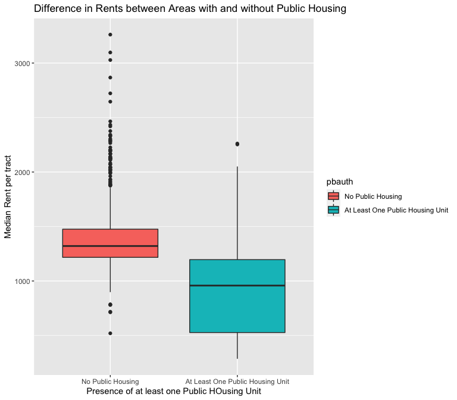

-   [Introduction, Research Question &
    Hypotheses](#introduction-research-question-hypotheses)
-   [Data](#data)
    -   [Dependent Variable](#dependent-variable)
    -   [Independent Variables](#independent-variables)
    -   [Comments](#comments)
    -   [Relationships in the Data](#relationships-in-the-data)
    -   [Omitted Variable Bias](#omitted-variable-bias)
-   [Methodology / Model](#methodology-model)
-   [Results](#results)
-   [Robustness: Eliminating Continuous Aggregated Building
    Variables](#robustness-eliminating-continuous-aggregated-building-variables)
-   [Conclusion](#conclusion)
-   [References:](#references)

## Introduction, Research Question & Hypotheses

Of all the devastating effects brought about by the global Covid-19
pandemic in 2020, one positive effect that some home buyers might have
been excited for was a drop in rental and purchase prices of housing,
following the exodus of people out of global cities like New York.
Despite a modest dip in prices, rents in New York City are already on
the uptick, suggesting that the drop in demand due to more people
working remotely in other cities has not put a dent in the overwhelming
demand to live in New York. In this blog post, I try to look at one
aspect of the question “Why is the rent so high?” I am curious to see if
the intrinsic qualities of the buildings in the various neighborhoods of
Brooklyn, NY have any effect on the median rents in their area.

This blogpost mainly addresses the claims made by the “Market Urbanism”
and “Yes in my Backyard” (YIMBY) movements in the United States, which
argue that addressing the supply of housing (that is, building as many
houses as possible) is the solution to the affordable housing shortage
in the country. They argue that cities in the US have too many
regulations, such as height and lot size restrictions, limiting what
type of apartment buildings can be built (Lewyn 2018). While
deregulation and expansion of the housing supply may sound intuitive,
progressives in the “New Urbanism” camp argue that deregulated housing
would lead to displacement of poorer people in the process of
gentrification (Robinson 2021).

In this blogpost, I seek to investigate the claim that newer, taller
buildings can decrease median rents by looking at cross-sectional data
of 744 census tracts in Brooklyn, NYC.

#### Research Question:

“Do the intrinsic characteristics of buildings in a neighborhood affect
that neighborhood’s median rents?”

#### Hypotheses:

H1: I predict a convex parabolic relationship between the average year
that buildings were built in the census tract and the median rent. I
assume this will be the case because many home buyers will place a
premium on very old buildings, such as those built between 1880-1915
because of the luxurious details and historical value of the homes
themselves. I expect the lowest prices to be for apartments in buildings
from 1930-1970. After 1990, I expect median rents to increase due to the
proliferation of “luxury” apartment buildings.

H2: I predict a positive linear relationship between the average number
of floors in a tract and median rents because I suppose taller buildings
can charge higher rents for better views.

H3: I predict a positive linear relationship between the number of new
residential units (since 1990) constructed in a tract and the median
rent in that tract. I believe the new units constructed in these tracts
will drive up the median rent, even if those new residences may possibly
reduce rents for the city as a whole.

H4: I predict a positive linear relationship between buildings
designated as historic and median rents for the same reasons as H1.

H5: I predict a negative linear relationship between median rent and
neighborhoods that have at least one public housing building.

## Data

I use cross-sectional data for 744 neighborhoods in Brooklyn, NYC in
2016, composed of two datasets. The first is a dataset tracking median
rents and population characteristics of census tracts in Brooklyn,
compiled by Glen Johnson of the City University of New York School of
Public Health. The second is a dataset known as PLUTO, containing the
characteristics of 800,000 individual buildings in the city, which I
downloaded from the New York City Planning Department’s BYTES of the Big
Apple data repository.

Because managing 800,000 observations is extremely difficult, I chose to
focus on the borough of Brooklyn. I believe Brooklyn is representative
of the rest of the city, and of many North American cities in general,
as it is very diverse in building variety and popularity of
neighborhoods. Moreover, Brooklyn is at the “front line” of
gentrification in the city. For example, the historically Black
neighborhood of Bedford-Stuyvesant, made famous by Spike Lee’s “Do the
Right Thing” and for its slogan “Bed-Stuy do or die” has had a massive
influx of wealthy, mostly-white residents, raising prices in the
surrounding area and pricing out its original residents.

In order to put the datasets together, I aggregated all of the buildings
into each of Brooklyn’s 744 Federal Information Processing System (FIPS)
tracts by either taking the average values or the sums of values of each
building in the tract. I then filtered out all non-residential buildings
so that the only ones in the data were buildings with at least one
residence. I made some of my own variables using Excel pivot tables and
IF functions.

One issue I immediately ran into with the data is that it does not
differentiate between RENTED and OWNED properties. The variables in this
data include ALL residences, and not just rentable apartments. This may
explain why rents appear slightly lower than one might expect for
Brooklyn, as mortgage payments on properties are not included in the
median rents variable.

I thus decided to create my own, separate dataset using the same
variables but with single family homes removed. I did this by going back
to the original excel file with the 260,000 residential buildings in
Brooklyn and removing the 64,000 homes that had only one residential
unit per building. This was about the closest approximation of the
difference between rented apartments (which have more than one
residential unit per building) and single family homes, which typically
are not rented, that I could think of. This way, the new dataset I built
has exluded many properties that are not on the rental market, and which
can skew the results.

All of the variables described below are by FIPS census tract for the
year 2016 unless otherwise stated.

### Dependent Variable

*Median Rents:* The median rental price for residential units in the
FIPS census tract in 2016, as calculated from the 2016 American
Community Survey.

    ## 
    ##  Shapiro-Wilk normality test
    ## 
    ## data:  sf$mdrent
    ## W = 0.90085, p-value < 0.00000000000000022

The above histogram shows a relatively normally distribution for the
dependent variable, although the Shapiro-Wilkes test rejects the null
hypothesis that it is normal. Nevertheless, the law of large numbers
allows us to assume that the median rents distribution is approaching
normality. Besides, a non-normal dependent variable does not violate the
assumptions of a Best, Linear, Unbiased Estimator model for Ordinary
Least Squares Regression.

### Independent Variables

*totpop:* The total population in the tract.

*popover24:* The population over 24 years old.

*whitepop:* Total non-Hispanic White population.

*20-34pop:* The population between 20-34 years old.

*collegepop:* The population with a college degree.

*mdfamincome:* The median family income, in USD.

*avglandvalue:* The average assessed land value of the land under the
buildings in the tract, in USD. The NYC Department of Finance calculates
assessed value by multiplying the building’s estimated full market land
value, determined as if vacant and unimproved, by a uniform percentage
for the property’s tax class. This and the following variables were
aggregated using Excel Pivot tables.

*avgfar:* The average Floor Area Ratio (FAR) of buildings in the tract.
FAR is calculated as the total building floor area divided by the area
of the tax lot. Because this is a ratio, it remains the same regardless
of which units of measurement are used.

*avgyear:* The average year of construction for all the residential
buildings in the tract. This is transformed to have a mean centered at
zero as otherwise it would lead to wildly high intercept estimates.

The above side-by-side histograms show the distribution of the average
year of construction for buildings in each of the 744 FIPS tracts. On
the right, I have scaled the year variable by subtracting from it the
mean year, and then dividing by the standard deviation, to center the
distribution around 0.

*avgarea:* The average size of the buildings in a tract, in squared
feet. Total area per building is calculated by adding together the
usable squared area of each floor in a residential building. I take the
average total area per building. Amenities and common spaces are
included, but rooftop spaces are not.

*avgunitsres:* The average number of residential units per building per
tract.

*totalbldgs:* The total number of residential buildings. This is
calculated by taking the sum of all buildings in a FIPS area using an
Excel Pivot table.

*histbldgs:* The total number of buildings with a historical designation
per tract.

*historic:* A binary dummy variable coded to be 1 if there are any
designated historical buildings in the tract and 0 if there are none.

*renovbldgs:* The total number of buildings renovated since 1990 per
tract.

*pbauthbldgs:* The total number of buildings designated as belonging to
a public authority per tract. This is a proxy variable for affordable
housing projects owned by the NYC Housing Authority. I am making this
assumption because I cannot think of any other public agency that owns
residential buildings in NYC.

*pbauth:* A binary dummy variable coded to be 1 if there are any
residential buildings owned by a public authority in the tract and 0 if
there are none.

*avgfloors:* The average number of floors per building per tract.

*newbldgs:* The total number of residential buildings built since 1990
per tract.

*newresid:* The total number of residential units in buildings built
since 1990 per tract.

    ## [1] "<table class=\"Rtable1-zebra\">\n<thead>\n<tr>\n<th class='rowlabel firstrow lastrow'></th>\n<th class='firstrow lastrow'>Overall (N=744)</th>\n</tr>\n</thead>\n<tbody>\n<tr>\n<td class='rowlabel firstrow'>Total Population</td>\n<td class='firstrow'></td>\n</tr>\n<tr>\n<td class='rowlabel'>Mean (SD)</td>\n<td>3490 (1380)</td>\n</tr>\n<tr>\n<td class='rowlabel lastrow'>Median [Min, Max]</td>\n<td class='lastrow'>3330 [432, 8950]</td>\n</tr>\n<tr>\n<td class='rowlabel firstrow'>Population 24+</td>\n<td class='firstrow'></td>\n</tr>\n<tr>\n<td class='rowlabel'>Mean (SD)</td>\n<td>2350 (926)</td>\n</tr>\n<tr>\n<td class='rowlabel lastrow'>Median [Min, Max]</td>\n<td class='lastrow'>2260 [256, 5820]</td>\n</tr>\n<tr>\n<td class='rowlabel firstrow'>Non-Hispanic White Population</td>\n<td class='firstrow'></td>\n</tr>\n<tr>\n<td class='rowlabel'>Mean (SD)</td>\n<td>1250 (1200)</td>\n</tr>\n<tr>\n<td class='rowlabel lastrow'>Median [Min, Max]</td>\n<td class='lastrow'>1030 [0, 8480]</td>\n</tr>\n<tr>\n<td class='rowlabel firstrow'>Population between age 20-34</td>\n<td class='firstrow'></td>\n</tr>\n<tr>\n<td class='rowlabel'>Mean (SD)</td>\n<td>880 (451)</td>\n</tr>\n<tr>\n<td class='rowlabel lastrow'>Median [Min, Max]</td>\n<td class='lastrow'>798 [26.0, 2960]</td>\n</tr>\n<tr>\n<td class='rowlabel firstrow'>People with College Degree</td>\n<td class='firstrow'></td>\n</tr>\n<tr>\n<td class='rowlabel'>Mean (SD)</td>\n<td>802 (604)</td>\n</tr>\n<tr>\n<td class='rowlabel lastrow'>Median [Min, Max]</td>\n<td class='lastrow'>628 [49.0, 3670]</td>\n</tr>\n<tr>\n<td class='rowlabel firstrow'>Median Family Income, USD</td>\n<td class='firstrow'></td>\n</tr>\n<tr>\n<td class='rowlabel'>Mean (SD)</td>\n<td>67000 (34100)</td>\n</tr>\n<tr>\n<td class='rowlabel lastrow'>Median [Min, Max]</td>\n<td class='lastrow'>59500 [14500, 248000]</td>\n</tr>\n<tr>\n<td class='rowlabel firstrow'>Median Rent, USD</td>\n<td class='firstrow'></td>\n</tr>\n<tr>\n<td class='rowlabel'>Mean (SD)</td>\n<td>1350 (375)</td>\n</tr>\n<tr>\n<td class='rowlabel lastrow'>Median [Min, Max]</td>\n<td class='lastrow'>1300 [286, 3260]</td>\n</tr>\n<tr>\n<td class='rowlabel firstrow'>Total Buildings</td>\n<td class='firstrow'></td>\n</tr>\n<tr>\n<td class='rowlabel'>Mean (SD)</td>\n<td>298 (153)</td>\n</tr>\n<tr>\n<td class='rowlabel lastrow'>Median [Min, Max]</td>\n<td class='lastrow'>299 [3.00, 1090]</td>\n</tr>\n<tr>\n<td class='rowlabel firstrow'>Residences in New Buildings</td>\n<td class='firstrow'></td>\n</tr>\n<tr>\n<td class='rowlabel'>Mean (SD)</td>\n<td>125 (259)</td>\n</tr>\n<tr>\n<td class='rowlabel lastrow'>Median [Min, Max]</td>\n<td class='lastrow'>43.0 [0, 4160]</td>\n</tr>\n<tr>\n<td class='rowlabel firstrow'>New Buildings, since 1990</td>\n<td class='firstrow'></td>\n</tr>\n<tr>\n<td class='rowlabel'>Mean (SD)</td>\n<td>17.7 (29.9)</td>\n</tr>\n<tr>\n<td class='rowlabel lastrow'>Median [Min, Max]</td>\n<td class='lastrow'>7.00 [0, 366]</td>\n</tr>\n<tr>\n<td class='rowlabel firstrow'>Units owned by Public Authority</td>\n<td class='firstrow'></td>\n</tr>\n<tr>\n<td class='rowlabel'>Mean (SD)</td>\n<td>80.7 (316)</td>\n</tr>\n<tr>\n<td class='rowlabel lastrow'>Median [Min, Max]</td>\n<td class='lastrow'>0 [0, 2880]</td>\n</tr>\n<tr>\n<td class='rowlabel firstrow'>Average Floor Area Ratio (FAR), feet squared</td>\n<td class='firstrow'></td>\n</tr>\n<tr>\n<td class='rowlabel'>Mean (SD)</td>\n<td>1.79 (0.854)</td>\n</tr>\n<tr>\n<td class='rowlabel lastrow'>Median [Min, Max]</td>\n<td class='lastrow'>1.68 [0, 10.0]</td>\n</tr>\n<tr>\n<td class='rowlabel firstrow'>Total Historical Buildings</td>\n<td class='firstrow'></td>\n</tr>\n<tr>\n<td class='rowlabel'>Mean (SD)</td>\n<td>14.3 (56.0)</td>\n</tr>\n<tr>\n<td class='rowlabel lastrow'>Median [Min, Max]</td>\n<td class='lastrow'>0 [0, 482]</td>\n</tr>\n<tr>\n<td class='rowlabel firstrow'>Buildings Renovated since 1990</td>\n<td class='firstrow'></td>\n</tr>\n<tr>\n<td class='rowlabel'>Mean (SD)</td>\n<td>1.81 (2.62)</td>\n</tr>\n<tr>\n<td class='rowlabel lastrow'>Median [Min, Max]</td>\n<td class='lastrow'>1.00 [0, 22.0]</td>\n</tr>\n<tr>\n<td class='rowlabel firstrow'>Average Year of Building Construction</td>\n<td class='firstrow'></td>\n</tr>\n<tr>\n<td class='rowlabel'>Mean (SD)</td>\n<td>1930 (15.5)</td>\n</tr>\n<tr>\n<td class='rowlabel lastrow'>Median [Min, Max]</td>\n<td class='lastrow'>1930 [1890, 1990]</td>\n</tr>\n<tr>\n<td class='rowlabel firstrow'>Average Land Value, USD</td>\n<td class='firstrow'></td>\n</tr>\n<tr>\n<td class='rowlabel'>Mean (SD)</td>\n<td>130000 (633000)</td>\n</tr>\n<tr>\n<td class='rowlabel lastrow'>Median [Min, Max]</td>\n<td class='lastrow'>18500 [4980, 6690000]</td>\n</tr>\n<tr>\n<td class='rowlabel firstrow'>Average Amount of Residential Units per Building</td>\n<td class='firstrow'></td>\n</tr>\n<tr>\n<td class='rowlabel'>Mean (SD)</td>\n<td>29.8 (144)</td>\n</tr>\n<tr>\n<td class='rowlabel lastrow'>Median [Min, Max]</td>\n<td class='lastrow'>4.30 [2.00, 1590]</td>\n</tr>\n<tr>\n<td class='rowlabel firstrow'>Average Floors per Building</td>\n<td class='firstrow'></td>\n</tr>\n<tr>\n<td class='rowlabel'>Mean (SD)</td>\n<td>2.97 (2.01)</td>\n</tr>\n<tr>\n<td class='rowlabel lastrow'>Median [Min, Max]</td>\n<td class='lastrow'>2.53 [1.16, 24.0]</td>\n</tr>\n<tr>\n<td class='rowlabel firstrow'>avgyearscaled</td>\n<td class='firstrow'></td>\n</tr>\n<tr>\n<td class='rowlabel'>Mean (SD)</td>\n<td>0.00000000000000213 (1.00)</td>\n</tr>\n<tr>\n<td class='rowlabel lastrow'>Median [Min, Max]</td>\n<td class='lastrow'>-0.123 [-2.70, 3.83]</td>\n</tr>\n<tr>\n<td class='rowlabel firstrow'>avgyearsq</td>\n<td class='firstrow'></td>\n</tr>\n<tr>\n<td class='rowlabel'>Mean (SD)</td>\n<td>0.999 (1.69)</td>\n</tr>\n<tr>\n<td class='rowlabel lastrow'>Median [Min, Max]</td>\n<td class='lastrow'>0.358 [0.000000953, 14.7]</td>\n</tr>\n<tr>\n<td class='rowlabel firstrow'>historic</td>\n<td class='firstrow'></td>\n</tr>\n<tr>\n<td class='rowlabel'>Mean (SD)</td>\n<td>0.109 (0.312)</td>\n</tr>\n<tr>\n<td class='rowlabel lastrow'>Median [Min, Max]</td>\n<td class='lastrow'>0 [0, 1.00]</td>\n</tr>\n<tr>\n<td class='rowlabel firstrow'>pbauth</td>\n<td class='firstrow'></td>\n</tr>\n<tr>\n<td class='rowlabel'>Mean (SD)</td>\n<td>0.130 (0.337)</td>\n</tr>\n<tr>\n<td class='rowlabel lastrow'>Median [Min, Max]</td>\n<td class='lastrow'>0 [0, 1.00]</td>\n</tr>\n</tbody>\n</table>\n"

    ## [1] 0

### Comments

The data I’m working with is impressive because it contains no missing
values, attesting to the good record keeping of the NYC Department of
City Planning. Moreover, as one can see in the table above, the total
population of each FIPS tract does not vary too much, meaning we are
comparing like with like.

Unfortunately, the plots below do not bode well for investigation:

One of the key variables of interest, new residential units constructed
per tract, is clustered around 0, creating a distribution that does not
appear to have much effect on median rents.

The above box plots look more promising, as they suggest that FIPS
tracts with at least one historic building have higher rents and tracts
with at least one unit of public housing have lower rents.

### Relationships in the Data

Because I want to use an ordinary least squares model, I need to make
sure that it is adherent to the Gauss Markov assumptions. The first
requirement is that my model is linear in its parameters. That means I
first want to test the linearity of the relationship between median
rents and my first variable of interest: year of construction.

Above, I noticed that the year term had a bow shape at the beginning and
end of the distribution of observed and residual values vs the predicted
values. I thought that squaring the term might make the relationship
more linear, because my hypothesis was that the relationship between
year and median rent would be parabolic. The second two graphs disprove
my theory, because the bow shape gets even worse with a squared term. I
believe this variable is still worth testing however, and it appears it
is more linear than I supposed.

The next variable I will test is the average amount of floors in an
area:

I try to correct for the bow shape by using a squared term, but I see
that the relationship is not in any way close to linear, especially
because the values cluster so much at the end of the x axis. I will try
to use an interaction term, though I am skeptical this will amount to
anything, since an interaction term cannot fix the underlying
non-linearity.

As I expected, including a term for the interaction between tracts with
at least one historically designated building and the average amount of
floors does not address the issue of non-linearity. Moreover, if I look
at the residuals vs predicted values plot, I see two funnel shapes in
the distribution, which suggests heteroskedasticity.

The Breusch-Pagan Test confirms this:

    ## 
    ##  studentized Breusch-Pagan test
    ## 
    ## data:  histfloors
    ## BP = 58.672, df = 3, p-value = 0.00000000000113

The extremely small p-value of the Breusch Pagan test leads me to reject
the null hypothesis of homoskedasticity. I believe there is no
transformation that I could do to make this relationship linear, so I
will not include this variable in the final model. This is unfortunate
because I thought an interaction term would be very useful to predicting
rents.

Unfortunately, the linearity and heteroskedasticity problems are the
same for the amount of newly renovated buildings in a tract:

As well as the amount of new residential units built in a tract:

    ## 
    ##  studentized Breusch-Pagan test
    ## 
    ## data:  resid1
    ## BP = 18.848, df = 1, p-value = 0.00001415

Both the renovated buildings and new residential units variables are too
non-linear and heteroskedastic to justify using in a predictive model. I
suspect this is because of the overwhelming number of observations that
have 0 renovations or new buildings constructed, skewing the
distribution towards 0.

### Omitted Variable Bias

The distinct clustering pattern on each of the variables tested so far
hints at a possible omitted variable, justifying a Ramsey RESET test to
check for endogeneity concerns:

    ## 
    ##  RESET test
    ## 
    ## data:  resid1
    ## RESET = 3.8392, df1 = 2, df2 = 740, p-value = 0.02194

    ## 
    ##  RESET test
    ## 
    ## data:  histfloors
    ## RESET = 0.68386, df1 = 2, df2 = 738, p-value = 0.505

The first test allows us to reject the null hypothesis that a model with
additional polynomial terms is equally well-specified as the model with
just new residential units as a predictor. This means the explanatory
power of new residential unit construction would increase if some
omitted variable were added to it, giving me further proof that I should
not include either of these variables in the final model.

## Methodology / Model

I propose to use a Ordinary Least Squares model to estimate the effects
of building characteristics on median rents. Because I have already
ruled out a few variables as violating fundamental assumptions of OLS, I
will start with a very parsimonious model using the scaled construction
year, the presence of historical buildings and the presence of public
authority buildings as the explanatory variables.

#### Model 1

<table style="border-collapse:collapse; border:none;">
<tr>
<th style="border-top: double; text-align:center; font-style:normal; font-weight:bold; padding:0.2cm;  text-align:left; ">
 
</th>
<th colspan="5" style="border-top: double; text-align:center; font-style:normal; font-weight:bold; padding:0.2cm; ">
Median Rent, USD
</th>
</tr>
<tr>
<td style=" text-align:center; border-bottom:1px solid; font-style:italic; font-weight:normal;  text-align:left; ">
Predictors
</td>
<td style=" text-align:center; border-bottom:1px solid; font-style:italic; font-weight:normal;  ">
Estimates
</td>
<td style=" text-align:center; border-bottom:1px solid; font-style:italic; font-weight:normal;  ">
std. Error
</td>
<td style=" text-align:center; border-bottom:1px solid; font-style:italic; font-weight:normal;  ">
CI
</td>
<td style=" text-align:center; border-bottom:1px solid; font-style:italic; font-weight:normal;  ">
Statistic
</td>
<td style=" text-align:center; border-bottom:1px solid; font-style:italic; font-weight:normal;  ">
p
</td>
</tr>
<tr>
<td style=" padding:0.2cm; text-align:left; vertical-align:top; text-align:left; ">
(Intercept)
</td>
<td style=" padding:0.2cm; text-align:left; vertical-align:top; text-align:center;  ">
1499.29
</td>
<td style=" padding:0.2cm; text-align:left; vertical-align:top; text-align:center;  ">
37.93
</td>
<td style=" padding:0.2cm; text-align:left; vertical-align:top; text-align:center;  ">
1424.83 – 1573.76
</td>
<td style=" padding:0.2cm; text-align:left; vertical-align:top; text-align:center;  ">
39.53
</td>
<td style=" padding:0.2cm; text-align:left; vertical-align:top; text-align:center;  ">
<strong>&lt;0.001
</td>
</tr>
<tr>
<td style=" padding:0.2cm; text-align:left; vertical-align:top; text-align:left; ">
avgyearscaled
</td>
<td style=" padding:0.2cm; text-align:left; vertical-align:top; text-align:center;  ">
-54.80
</td>
<td style=" padding:0.2cm; text-align:left; vertical-align:top; text-align:center;  ">
13.67
</td>
<td style=" padding:0.2cm; text-align:left; vertical-align:top; text-align:center;  ">
-81.64 – -27.96
</td>
<td style=" padding:0.2cm; text-align:left; vertical-align:top; text-align:center;  ">
-4.01
</td>
<td style=" padding:0.2cm; text-align:left; vertical-align:top; text-align:center;  ">
<strong>&lt;0.001
</td>
</tr>
<tr>
<td style=" padding:0.2cm; text-align:left; vertical-align:top; text-align:left; ">
pbauth: At Least One Public Housing Unit
</td>
<td style=" padding:0.2cm; text-align:left; vertical-align:top; text-align:center;  ">
-388.24
</td>
<td style=" padding:0.2cm; text-align:left; vertical-align:top; text-align:center;  ">
46.06
</td>
<td style=" padding:0.2cm; text-align:left; vertical-align:top; text-align:center;  ">
-478.67 – -297.81
</td>
<td style=" padding:0.2cm; text-align:left; vertical-align:top; text-align:center;  ">
-8.43
</td>
<td style=" padding:0.2cm; text-align:left; vertical-align:top; text-align:center;  ">
<strong>&lt;0.001
</td>
</tr>
<tr>
<td style=" padding:0.2cm; text-align:left; vertical-align:top; text-align:left; ">
historic: At Least One Historic Building
</td>
<td style=" padding:0.2cm; text-align:left; vertical-align:top; text-align:center;  ">
277.33
</td>
<td style=" padding:0.2cm; text-align:left; vertical-align:top; text-align:center;  ">
57.88
</td>
<td style=" padding:0.2cm; text-align:left; vertical-align:top; text-align:center;  ">
163.70 – 390.97
</td>
<td style=" padding:0.2cm; text-align:left; vertical-align:top; text-align:center;  ">
4.79
</td>
<td style=" padding:0.2cm; text-align:left; vertical-align:top; text-align:center;  ">
<strong>&lt;0.001
</td>
</tr>
<tr>
<td style=" padding:0.2cm; text-align:left; vertical-align:top; text-align:left; ">
Total Population
</td>
<td style=" padding:0.2cm; text-align:left; vertical-align:top; text-align:center;  ">
-0.04
</td>
<td style=" padding:0.2cm; text-align:left; vertical-align:top; text-align:center;  ">
0.01
</td>
<td style=" padding:0.2cm; text-align:left; vertical-align:top; text-align:center;  ">
-0.06 – -0.02
</td>
<td style=" padding:0.2cm; text-align:left; vertical-align:top; text-align:center;  ">
-3.85
</td>
<td style=" padding:0.2cm; text-align:left; vertical-align:top; text-align:center;  ">
<strong>&lt;0.001
</td>
</tr>
<tr>
<td style=" padding:0.2cm; text-align:left; vertical-align:top; text-align:left; padding-top:0.1cm; padding-bottom:0.1cm; border-top:1px solid;">
Observations
</td>
<td style=" padding:0.2cm; text-align:left; vertical-align:top; padding-top:0.1cm; padding-bottom:0.1cm; text-align:left; border-top:1px solid;" colspan="5">
744
</td>
</tr>
<tr>
<td style=" padding:0.2cm; text-align:left; vertical-align:top; text-align:left; padding-top:0.1cm; padding-bottom:0.1cm;">
R2 / R2 adjusted
</td>
<td style=" padding:0.2cm; text-align:left; vertical-align:top; padding-top:0.1cm; padding-bottom:0.1cm; text-align:left;" colspan="5">
0.279 / 0.275
</td>
</tr>
</table>

We see that, with robust standard errors, the coefficients of each of
the variables are significant at the .01 level. I will interpret
substantively the model I choose in the following section.

#### Model 1: Checking for Normality, Heteroskedasticity, Multicollinearity

Looking at the Q-Q plot above, I can conclude that this model exhibits
kurtosis, since its residuals deviate from a 45 degree “normal” line at
both ends of the distribution. This suggests that the model is
non-normal in its errors.

    ## -----------------------------------------------
    ##        Test             Statistic       pvalue  
    ## -----------------------------------------------
    ## Shapiro-Wilk               0.91          0.0000 
    ## Kolmogorov-Smirnov        0.1142         0.0000 
    ## Cramer-von Mises         68.4862         0.0000 
    ## Anderson-Darling         16.2416         0.0000 
    ## -----------------------------------------------

The above normality tests confirm my suspicion that this model is
non-normal, as all of them are extremely significant. A non-normal model
means I cannot make any inferences by performing statistical hypothesis
tests.

    ## Warning: `arrange_()` was deprecated in dplyr 0.7.0.
    ## Please use `arrange()` instead.
    ## See vignette('programming') for more help

    ## 
    ##  studentized Breusch-Pagan test
    ## 
    ## data:  lm1
    ## BP = 37.746, df = 4, p-value = 0.0000001264

According to the Breusch-Pagan test above, the model is heteroskedastic,
which I can confirm by looking at the residuals vs fitted values graph.
I will use robust standard errors to try to combat the
heteroskedasticity. In my opinion, I the variance in residuals that I
observe does not warrant such a low p-value on the Breusch-Pagan test.

    ##                   [,1]
    ## avgyearscaled 1.207507
    ## pbauth        1.093791
    ## historic      1.175750
    ## totpop        1.064808

A quick glance above at the Variance Inflation Factor coefficients for
each of the explanatory variables tells us there is no multicollinearity
in the model, as typically only coefficients with values larger than 4
are cause for worry.

#### Model 2

I will try taking the log of the response variable to combat the
heteroskedasticity problems of model 1.
<table style="border-collapse:collapse; border:none;">
<tr>
<th style="border-top: double; text-align:center; font-style:normal; font-weight:bold; padding:0.2cm;  text-align:left; ">
 
</th>
<th colspan="5" style="border-top: double; text-align:center; font-style:normal; font-weight:bold; padding:0.2cm; ">
Median Rent, USD
</th>
</tr>
<tr>
<td style=" text-align:center; border-bottom:1px solid; font-style:italic; font-weight:normal;  text-align:left; ">
Predictors
</td>
<td style=" text-align:center; border-bottom:1px solid; font-style:italic; font-weight:normal;  ">
Estimates
</td>
<td style=" text-align:center; border-bottom:1px solid; font-style:italic; font-weight:normal;  ">
std. Error
</td>
<td style=" text-align:center; border-bottom:1px solid; font-style:italic; font-weight:normal;  ">
CI
</td>
<td style=" text-align:center; border-bottom:1px solid; font-style:italic; font-weight:normal;  ">
Statistic
</td>
<td style=" text-align:center; border-bottom:1px solid; font-style:italic; font-weight:normal;  ">
p
</td>
</tr>
<tr>
<td style=" padding:0.2cm; text-align:left; vertical-align:top; text-align:left; ">
(Intercept)
</td>
<td style=" padding:0.2cm; text-align:left; vertical-align:top; text-align:center;  ">
7.30
</td>
<td style=" padding:0.2cm; text-align:left; vertical-align:top; text-align:center;  ">
0.03
</td>
<td style=" padding:0.2cm; text-align:left; vertical-align:top; text-align:center;  ">
7.24 – 7.35
</td>
<td style=" padding:0.2cm; text-align:left; vertical-align:top; text-align:center;  ">
260.60
</td>
<td style=" padding:0.2cm; text-align:left; vertical-align:top; text-align:center;  ">
<strong>&lt;0.001
</td>
</tr>
<tr>
<td style=" padding:0.2cm; text-align:left; vertical-align:top; text-align:left; ">
avgyearscaled
</td>
<td style=" padding:0.2cm; text-align:left; vertical-align:top; text-align:center;  ">
-0.06
</td>
<td style=" padding:0.2cm; text-align:left; vertical-align:top; text-align:center;  ">
0.01
</td>
<td style=" padding:0.2cm; text-align:left; vertical-align:top; text-align:center;  ">
-0.08 – -0.03
</td>
<td style=" padding:0.2cm; text-align:left; vertical-align:top; text-align:center;  ">
-4.95
</td>
<td style=" padding:0.2cm; text-align:left; vertical-align:top; text-align:center;  ">
<strong>&lt;0.001
</td>
</tr>
<tr>
<td style=" padding:0.2cm; text-align:left; vertical-align:top; text-align:left; ">
pbauth: At Least One Public Housing Unit
</td>
<td style=" padding:0.2cm; text-align:left; vertical-align:top; text-align:center;  ">
-0.43
</td>
<td style=" padding:0.2cm; text-align:left; vertical-align:top; text-align:center;  ">
0.05
</td>
<td style=" padding:0.2cm; text-align:left; vertical-align:top; text-align:center;  ">
-0.52 – -0.33
</td>
<td style=" padding:0.2cm; text-align:left; vertical-align:top; text-align:center;  ">
-8.87
</td>
<td style=" padding:0.2cm; text-align:left; vertical-align:top; text-align:center;  ">
<strong>&lt;0.001
</td>
</tr>
<tr>
<td style=" padding:0.2cm; text-align:left; vertical-align:top; text-align:left; ">
historic: At Least One Historic Building
</td>
<td style=" padding:0.2cm; text-align:left; vertical-align:top; text-align:center;  ">
0.15
</td>
<td style=" padding:0.2cm; text-align:left; vertical-align:top; text-align:center;  ">
0.04
</td>
<td style=" padding:0.2cm; text-align:left; vertical-align:top; text-align:center;  ">
0.08 – 0.22
</td>
<td style=" padding:0.2cm; text-align:left; vertical-align:top; text-align:center;  ">
4.11
</td>
<td style=" padding:0.2cm; text-align:left; vertical-align:top; text-align:center;  ">
<strong>&lt;0.001
</td>
</tr>
<tr>
<td style=" padding:0.2cm; text-align:left; vertical-align:top; text-align:left; ">
Total Population
</td>
<td style=" padding:0.2cm; text-align:left; vertical-align:top; text-align:center;  ">
-0.00
</td>
<td style=" padding:0.2cm; text-align:left; vertical-align:top; text-align:center;  ">
0.00
</td>
<td style=" padding:0.2cm; text-align:left; vertical-align:top; text-align:center;  ">
-0.00 – -0.00
</td>
<td style=" padding:0.2cm; text-align:left; vertical-align:top; text-align:center;  ">
-3.50
</td>
<td style=" padding:0.2cm; text-align:left; vertical-align:top; text-align:center;  ">
<strong>&lt;0.001
</td>
</tr>
<tr>
<td style=" padding:0.2cm; text-align:left; vertical-align:top; text-align:left; padding-top:0.1cm; padding-bottom:0.1cm; border-top:1px solid;">
Observations
</td>
<td style=" padding:0.2cm; text-align:left; vertical-align:top; padding-top:0.1cm; padding-bottom:0.1cm; text-align:left; border-top:1px solid;" colspan="5">
744
</td>
</tr>
<tr>
<td style=" padding:0.2cm; text-align:left; vertical-align:top; text-align:left; padding-top:0.1cm; padding-bottom:0.1cm;">
R2 / R2 adjusted
</td>
<td style=" padding:0.2cm; text-align:left; vertical-align:top; padding-top:0.1cm; padding-bottom:0.1cm; text-align:left;" colspan="5">
0.369 / 0.366
</td>
</tr>
</table>

The coefficients in this model are still all significant at the .01
level, but now their magnitudes have changed because of the logged
response variable. I will interpret substantively the model I choose in
the following section.

#### Model 2: Checking for Normality, Heteroskedasticity, Multicollinearity

Model 2’s skewness is slightly less than model 1’s, although the
kurtosis is still clearly visible.

    ## -----------------------------------------------
    ##        Test             Statistic       pvalue  
    ## -----------------------------------------------
    ## Shapiro-Wilk               0.91          0.0000 
    ## Kolmogorov-Smirnov        0.1142         0.0000 
    ## Cramer-von Mises         68.4862         0.0000 
    ## Anderson-Darling         16.2416         0.0000 
    ## -----------------------------------------------

Even with a logged response variable, all 4 of the above tests show that
the model is non-normal.

    ## 
    ##  studentized Breusch-Pagan test
    ## 
    ## data:  lm2
    ## BP = 160.96, df = 4, p-value < 0.00000000000000022

The above Breusch-Pagan test is even more conclusively showing that the
model is heteroskedastic. I can clearly see that the logging median
rents has done nothing to resolve the heteroscedasticity issue.

    ##                   [,1]
    ## avgyearscaled 1.207507
    ## pbauth        1.093791
    ## historic      1.175750
    ## totpop        1.064808

At least this model is not collinear.

#### Model 3

I propose predicting median rents the average year of construction in
the tract as an explanatory variable and with median family income as a
control. Considering the two last models failed multiple assumptions,
I’m hoping this one with only two variables would work.

<table style="border-collapse:collapse; border:none;">
<tr>
<th style="border-top: double; text-align:center; font-style:normal; font-weight:bold; padding:0.2cm;  text-align:left; ">
 
</th>
<th colspan="5" style="border-top: double; text-align:center; font-style:normal; font-weight:bold; padding:0.2cm; ">
Median Rent, USD
</th>
</tr>
<tr>
<td style=" text-align:center; border-bottom:1px solid; font-style:italic; font-weight:normal;  text-align:left; ">
Predictors
</td>
<td style=" text-align:center; border-bottom:1px solid; font-style:italic; font-weight:normal;  ">
Estimates
</td>
<td style=" text-align:center; border-bottom:1px solid; font-style:italic; font-weight:normal;  ">
std. Error
</td>
<td style=" text-align:center; border-bottom:1px solid; font-style:italic; font-weight:normal;  ">
CI
</td>
<td style=" text-align:center; border-bottom:1px solid; font-style:italic; font-weight:normal;  ">
Statistic
</td>
<td style=" text-align:center; border-bottom:1px solid; font-style:italic; font-weight:normal;  ">
p
</td>
</tr>
<tr>
<td style=" padding:0.2cm; text-align:left; vertical-align:top; text-align:left; ">
(Intercept)
</td>
<td style=" padding:0.2cm; text-align:left; vertical-align:top; text-align:center;  ">
855.45
</td>
<td style=" padding:0.2cm; text-align:left; vertical-align:top; text-align:center;  ">
25.19
</td>
<td style=" padding:0.2cm; text-align:left; vertical-align:top; text-align:center;  ">
805.99 – 904.90
</td>
<td style=" padding:0.2cm; text-align:left; vertical-align:top; text-align:center;  ">
33.96
</td>
<td style=" padding:0.2cm; text-align:left; vertical-align:top; text-align:center;  ">
<strong>&lt;0.001
</td>
</tr>
<tr>
<td style=" padding:0.2cm; text-align:left; vertical-align:top; text-align:left; ">
avgyearscaled
</td>
<td style=" padding:0.2cm; text-align:left; vertical-align:top; text-align:center;  ">
-52.64
</td>
<td style=" padding:0.2cm; text-align:left; vertical-align:top; text-align:center;  ">
11.10
</td>
<td style=" padding:0.2cm; text-align:left; vertical-align:top; text-align:center;  ">
-74.43 – -30.84
</td>
<td style=" padding:0.2cm; text-align:left; vertical-align:top; text-align:center;  ">
-4.74
</td>
<td style=" padding:0.2cm; text-align:left; vertical-align:top; text-align:center;  ">
<strong>&lt;0.001
</td>
</tr>
<tr>
<td style=" padding:0.2cm; text-align:left; vertical-align:top; text-align:left; ">
Median Family Income, USD
</td>
<td style=" padding:0.2cm; text-align:left; vertical-align:top; text-align:center;  ">
0.01
</td>
<td style=" padding:0.2cm; text-align:left; vertical-align:top; text-align:center;  ">
0.00
</td>
<td style=" padding:0.2cm; text-align:left; vertical-align:top; text-align:center;  ">
0.01 – 0.01
</td>
<td style=" padding:0.2cm; text-align:left; vertical-align:top; text-align:center;  ">
18.81
</td>
<td style=" padding:0.2cm; text-align:left; vertical-align:top; text-align:center;  ">
<strong>&lt;0.001
</td>
</tr>
<tr>
<td style=" padding:0.2cm; text-align:left; vertical-align:top; text-align:left; padding-top:0.1cm; padding-bottom:0.1cm; border-top:1px solid;">
Observations
</td>
<td style=" padding:0.2cm; text-align:left; vertical-align:top; padding-top:0.1cm; padding-bottom:0.1cm; text-align:left; border-top:1px solid;" colspan="5">
744
</td>
</tr>
<tr>
<td style=" padding:0.2cm; text-align:left; vertical-align:top; text-align:left; padding-top:0.1cm; padding-bottom:0.1cm;">
R2 / R2 adjusted
</td>
<td style=" padding:0.2cm; text-align:left; vertical-align:top; padding-top:0.1cm; padding-bottom:0.1cm; text-align:left;" colspan="5">
0.509 / 0.507
</td>
</tr>
</table>

The coefficients of both variables and the intercept are statistically
significant at the .01 level.

#### Model 3: Checking for Normality, Heteroskedasticity, Multicollinearity

I still see some kurtosis based on the skew at both ends of the Q-Q
plot.

    ## -----------------------------------------------
    ##        Test             Statistic       pvalue  
    ## -----------------------------------------------
    ## Shapiro-Wilk               0.91          0.0000 
    ## Kolmogorov-Smirnov        0.1142         0.0000 
    ## Cramer-von Mises         68.4862         0.0000 
    ## Anderson-Darling         16.2416         0.0000 
    ## -----------------------------------------------

I believe there is nothing I can do about the non-normality of the
models. It appears that building characteristics aggregated by area will
always lead to skewed relationships with median rent.

    ## 
    ##  studentized Breusch-Pagan test
    ## 
    ## data:  lm3
    ## BP = 22.882, df = 2, p-value = 0.00001075

Even with only two variables, the model is heteroskedastic.

#### Model Selection

Although all three of the models have failed fundamental assumptions of
linearity, normality, and heteroskedasticity, I believe I should still
choose one to interpret by looking for the model with the lowest AIC
score and relatively good r squared.

<table style="border-collapse:collapse; border:none;">
<caption style="font-weight: bold; text-align:left;">
Comparing Models 1, 2, 3 and 4
</caption>
<tr>
<th style="border-top: double; text-align:center; font-style:normal; font-weight:bold; padding:0.2cm;  text-align:left; ">
 
</th>
<th colspan="4" style="border-top: double; text-align:center; font-style:normal; font-weight:bold; padding:0.2cm; ">
Median Rent, USD
</th>
<th colspan="4" style="border-top: double; text-align:center; font-style:normal; font-weight:bold; padding:0.2cm; ">
Median Rent, USD
</th>
<th colspan="4" style="border-top: double; text-align:center; font-style:normal; font-weight:bold; padding:0.2cm; ">
Median Rent, USD
</th>
</tr>
<tr>
<td style=" text-align:center; border-bottom:1px solid; font-style:italic; font-weight:normal;  text-align:left; ">
Predictors
</td>
<td style=" text-align:center; border-bottom:1px solid; font-style:italic; font-weight:normal;  ">
Estimates
</td>
<td style=" text-align:center; border-bottom:1px solid; font-style:italic; font-weight:normal;  ">
std. Error
</td>
<td style=" text-align:center; border-bottom:1px solid; font-style:italic; font-weight:normal;  ">
CI
</td>
<td style=" text-align:center; border-bottom:1px solid; font-style:italic; font-weight:normal;  ">
p
</td>
<td style=" text-align:center; border-bottom:1px solid; font-style:italic; font-weight:normal;  ">
Estimates
</td>
<td style=" text-align:center; border-bottom:1px solid; font-style:italic; font-weight:normal;  col7">
std. Error
</td>
<td style=" text-align:center; border-bottom:1px solid; font-style:italic; font-weight:normal;  col8">
CI
</td>
<td style=" text-align:center; border-bottom:1px solid; font-style:italic; font-weight:normal;  col9">
p
</td>
<td style=" text-align:center; border-bottom:1px solid; font-style:italic; font-weight:normal;  0">
Estimates
</td>
<td style=" text-align:center; border-bottom:1px solid; font-style:italic; font-weight:normal;  1">
std. Error
</td>
<td style=" text-align:center; border-bottom:1px solid; font-style:italic; font-weight:normal;  2">
CI
</td>
<td style=" text-align:center; border-bottom:1px solid; font-style:italic; font-weight:normal;  3">
p
</td>
</tr>
<tr>
<td style=" padding:0.2cm; text-align:left; vertical-align:top; text-align:left; ">
(Intercept)
</td>
<td style=" padding:0.2cm; text-align:left; vertical-align:top; text-align:center;  ">
1499.29
</td>
<td style=" padding:0.2cm; text-align:left; vertical-align:top; text-align:center;  ">
37.93
</td>
<td style=" padding:0.2cm; text-align:left; vertical-align:top; text-align:center;  ">
1424.83 – 1573.76
</td>
<td style=" padding:0.2cm; text-align:left; vertical-align:top; text-align:center;  ">
<strong>&lt;0.001
</td>
<td style=" padding:0.2cm; text-align:left; vertical-align:top; text-align:center;  ">
7.30
</td>
<td style=" padding:0.2cm; text-align:left; vertical-align:top; text-align:center;  col7">
0.03
</td>
<td style=" padding:0.2cm; text-align:left; vertical-align:top; text-align:center;  col8">
7.24 – 7.35
</td>
<td style=" padding:0.2cm; text-align:left; vertical-align:top; text-align:center;  col9">
<strong>&lt;0.001
</td>
<td style=" padding:0.2cm; text-align:left; vertical-align:top; text-align:center;  0">
855.45
</td>
<td style=" padding:0.2cm; text-align:left; vertical-align:top; text-align:center;  1">
25.19
</td>
<td style=" padding:0.2cm; text-align:left; vertical-align:top; text-align:center;  2">
805.99 – 904.90
</td>
<td style=" padding:0.2cm; text-align:left; vertical-align:top; text-align:center;  3">
<strong>&lt;0.001
</td>
</tr>
<tr>
<td style=" padding:0.2cm; text-align:left; vertical-align:top; text-align:left; ">
avgyearscaled
</td>
<td style=" padding:0.2cm; text-align:left; vertical-align:top; text-align:center;  ">
-54.80
</td>
<td style=" padding:0.2cm; text-align:left; vertical-align:top; text-align:center;  ">
13.67
</td>
<td style=" padding:0.2cm; text-align:left; vertical-align:top; text-align:center;  ">
-81.64 – -27.96
</td>
<td style=" padding:0.2cm; text-align:left; vertical-align:top; text-align:center;  ">
<strong>&lt;0.001
</td>
<td style=" padding:0.2cm; text-align:left; vertical-align:top; text-align:center;  ">
-0.06
</td>
<td style=" padding:0.2cm; text-align:left; vertical-align:top; text-align:center;  col7">
0.01
</td>
<td style=" padding:0.2cm; text-align:left; vertical-align:top; text-align:center;  col8">
-0.08 – -0.03
</td>
<td style=" padding:0.2cm; text-align:left; vertical-align:top; text-align:center;  col9">
<strong>&lt;0.001
</td>
<td style=" padding:0.2cm; text-align:left; vertical-align:top; text-align:center;  0">
-52.64
</td>
<td style=" padding:0.2cm; text-align:left; vertical-align:top; text-align:center;  1">
11.10
</td>
<td style=" padding:0.2cm; text-align:left; vertical-align:top; text-align:center;  2">
-74.43 – -30.84
</td>
<td style=" padding:0.2cm; text-align:left; vertical-align:top; text-align:center;  3">
<strong>&lt;0.001
</td>
</tr>
<tr>
<td style=" padding:0.2cm; text-align:left; vertical-align:top; text-align:left; ">
pbauth: At Least One Public Housing Unit
</td>
<td style=" padding:0.2cm; text-align:left; vertical-align:top; text-align:center;  ">
-388.24
</td>
<td style=" padding:0.2cm; text-align:left; vertical-align:top; text-align:center;  ">
46.06
</td>
<td style=" padding:0.2cm; text-align:left; vertical-align:top; text-align:center;  ">
-478.67 – -297.81
</td>
<td style=" padding:0.2cm; text-align:left; vertical-align:top; text-align:center;  ">
<strong>&lt;0.001
</td>
<td style=" padding:0.2cm; text-align:left; vertical-align:top; text-align:center;  ">
-0.43
</td>
<td style=" padding:0.2cm; text-align:left; vertical-align:top; text-align:center;  col7">
0.05
</td>
<td style=" padding:0.2cm; text-align:left; vertical-align:top; text-align:center;  col8">
-0.52 – -0.33
</td>
<td style=" padding:0.2cm; text-align:left; vertical-align:top; text-align:center;  col9">
<strong>&lt;0.001
</td>
<td style=" padding:0.2cm; text-align:left; vertical-align:top; text-align:center;  0">
</td>
<td style=" padding:0.2cm; text-align:left; vertical-align:top; text-align:center;  1">
</td>
<td style=" padding:0.2cm; text-align:left; vertical-align:top; text-align:center;  2">
</td>
<td style=" padding:0.2cm; text-align:left; vertical-align:top; text-align:center;  3">
</td>
</tr>
<tr>
<td style=" padding:0.2cm; text-align:left; vertical-align:top; text-align:left; ">
historic: At Least One Historic Building
</td>
<td style=" padding:0.2cm; text-align:left; vertical-align:top; text-align:center;  ">
277.33
</td>
<td style=" padding:0.2cm; text-align:left; vertical-align:top; text-align:center;  ">
57.88
</td>
<td style=" padding:0.2cm; text-align:left; vertical-align:top; text-align:center;  ">
163.70 – 390.97
</td>
<td style=" padding:0.2cm; text-align:left; vertical-align:top; text-align:center;  ">
<strong>&lt;0.001
</td>
<td style=" padding:0.2cm; text-align:left; vertical-align:top; text-align:center;  ">
0.15
</td>
<td style=" padding:0.2cm; text-align:left; vertical-align:top; text-align:center;  col7">
0.04
</td>
<td style=" padding:0.2cm; text-align:left; vertical-align:top; text-align:center;  col8">
0.08 – 0.22
</td>
<td style=" padding:0.2cm; text-align:left; vertical-align:top; text-align:center;  col9">
<strong>&lt;0.001
</td>
<td style=" padding:0.2cm; text-align:left; vertical-align:top; text-align:center;  0">
</td>
<td style=" padding:0.2cm; text-align:left; vertical-align:top; text-align:center;  1">
</td>
<td style=" padding:0.2cm; text-align:left; vertical-align:top; text-align:center;  2">
</td>
<td style=" padding:0.2cm; text-align:left; vertical-align:top; text-align:center;  3">
</td>
</tr>
<tr>
<td style=" padding:0.2cm; text-align:left; vertical-align:top; text-align:left; ">
Total Population
</td>
<td style=" padding:0.2cm; text-align:left; vertical-align:top; text-align:center;  ">
-0.04
</td>
<td style=" padding:0.2cm; text-align:left; vertical-align:top; text-align:center;  ">
0.01
</td>
<td style=" padding:0.2cm; text-align:left; vertical-align:top; text-align:center;  ">
-0.06 – -0.02
</td>
<td style=" padding:0.2cm; text-align:left; vertical-align:top; text-align:center;  ">
<strong>&lt;0.001
</td>
<td style=" padding:0.2cm; text-align:left; vertical-align:top; text-align:center;  ">
-0.00
</td>
<td style=" padding:0.2cm; text-align:left; vertical-align:top; text-align:center;  col7">
0.00
</td>
<td style=" padding:0.2cm; text-align:left; vertical-align:top; text-align:center;  col8">
-0.00 – -0.00
</td>
<td style=" padding:0.2cm; text-align:left; vertical-align:top; text-align:center;  col9">
<strong>&lt;0.001
</td>
<td style=" padding:0.2cm; text-align:left; vertical-align:top; text-align:center;  0">
</td>
<td style=" padding:0.2cm; text-align:left; vertical-align:top; text-align:center;  1">
</td>
<td style=" padding:0.2cm; text-align:left; vertical-align:top; text-align:center;  2">
</td>
<td style=" padding:0.2cm; text-align:left; vertical-align:top; text-align:center;  3">
</td>
</tr>
<tr>
<td style=" padding:0.2cm; text-align:left; vertical-align:top; text-align:left; ">
Median Family Income, USD
</td>
<td style=" padding:0.2cm; text-align:left; vertical-align:top; text-align:center;  ">
</td>
<td style=" padding:0.2cm; text-align:left; vertical-align:top; text-align:center;  ">
</td>
<td style=" padding:0.2cm; text-align:left; vertical-align:top; text-align:center;  ">
</td>
<td style=" padding:0.2cm; text-align:left; vertical-align:top; text-align:center;  ">
</td>
<td style=" padding:0.2cm; text-align:left; vertical-align:top; text-align:center;  ">
</td>
<td style=" padding:0.2cm; text-align:left; vertical-align:top; text-align:center;  col7">
</td>
<td style=" padding:0.2cm; text-align:left; vertical-align:top; text-align:center;  col8">
</td>
<td style=" padding:0.2cm; text-align:left; vertical-align:top; text-align:center;  col9">
</td>
<td style=" padding:0.2cm; text-align:left; vertical-align:top; text-align:center;  0">
0.01
</td>
<td style=" padding:0.2cm; text-align:left; vertical-align:top; text-align:center;  1">
0.00
</td>
<td style=" padding:0.2cm; text-align:left; vertical-align:top; text-align:center;  2">
0.01 – 0.01
</td>
<td style=" padding:0.2cm; text-align:left; vertical-align:top; text-align:center;  3">
<strong>&lt;0.001
</td>
</tr>
<tr>
<td style=" padding:0.2cm; text-align:left; vertical-align:top; text-align:left; padding-top:0.1cm; padding-bottom:0.1cm; border-top:1px solid;">
Observations
</td>
<td style=" padding:0.2cm; text-align:left; vertical-align:top; padding-top:0.1cm; padding-bottom:0.1cm; text-align:left; border-top:1px solid;" colspan="4">
744
</td>
<td style=" padding:0.2cm; text-align:left; vertical-align:top; padding-top:0.1cm; padding-bottom:0.1cm; text-align:left; border-top:1px solid;" colspan="4">
744
</td>
<td style=" padding:0.2cm; text-align:left; vertical-align:top; padding-top:0.1cm; padding-bottom:0.1cm; text-align:left; border-top:1px solid;" colspan="4">
744
</td>
</tr>
<tr>
<td style=" padding:0.2cm; text-align:left; vertical-align:top; text-align:left; padding-top:0.1cm; padding-bottom:0.1cm;">
R2 / R2 adjusted
</td>
<td style=" padding:0.2cm; text-align:left; vertical-align:top; padding-top:0.1cm; padding-bottom:0.1cm; text-align:left;" colspan="4">
0.279 / 0.275
</td>
<td style=" padding:0.2cm; text-align:left; vertical-align:top; padding-top:0.1cm; padding-bottom:0.1cm; text-align:left;" colspan="4">
0.369 / 0.366
</td>
<td style=" padding:0.2cm; text-align:left; vertical-align:top; padding-top:0.1cm; padding-bottom:0.1cm; text-align:left;" colspan="4">
0.509 / 0.507
</td>
</tr>
<tr>
<td style=" padding:0.2cm; text-align:left; vertical-align:top; text-align:left; padding-top:0.1cm; padding-bottom:0.1cm;">
AIC
</td>
<td style=" padding:0.2cm; text-align:left; vertical-align:top; padding-top:0.1cm; padding-bottom:0.1cm; text-align:left;" colspan="4">
10698.693
</td>
<td style=" padding:0.2cm; text-align:left; vertical-align:top; padding-top:0.1cm; padding-bottom:0.1cm; text-align:left;" colspan="4">
23.365
</td>
<td style=" padding:0.2cm; text-align:left; vertical-align:top; padding-top:0.1cm; padding-bottom:0.1cm; text-align:left;" colspan="4">
10409.379
</td>
</tr>
</table>

Based on the above comparison, I should conclude that model 2 is
superior, with its wildly low AIC of 23.365 compared to AICs of over
10,000 for models 1 and 3. I am extremely suspicious of such a low
score, as well as of its very reasonable .366 adjusted r squared. I
believe the logged response variable may been a type of
overspecification which generated such a good result. Despite these
suspicions, I will interpret model 2.

The final model equation is thus:
*l**o**g*(*m**e**d**i**a**n**r**e**n**t*) = *α* + *β*1*a**v**g**y**e**a**r*.*s**c**a**l**e**d* + *β*2*p**b**a**u**t**h* + *β*3*h**i**s**t**o**r**i**c* + *β*4*t**o**t**p**o**p* + *ϵ*

## Results

<table style="border-collapse:collapse; border:none;">
<caption style="font-weight: bold; text-align:left;">
Using Building Characteristics to predict Median Rent
</caption>
<tr>
<th style="border-top: double; text-align:center; font-style:normal; font-weight:bold; padding:0.2cm;  text-align:left; ">
 
</th>
<th colspan="4" style="border-top: double; text-align:center; font-style:normal; font-weight:bold; padding:0.2cm; ">
Median Rent, USD
</th>
</tr>
<tr>
<td style=" text-align:center; border-bottom:1px solid; font-style:italic; font-weight:normal;  text-align:left; ">
Predictors
</td>
<td style=" text-align:center; border-bottom:1px solid; font-style:italic; font-weight:normal;  ">
Estimates
</td>
<td style=" text-align:center; border-bottom:1px solid; font-style:italic; font-weight:normal;  ">
std. Error
</td>
<td style=" text-align:center; border-bottom:1px solid; font-style:italic; font-weight:normal;  ">
CI
</td>
<td style=" text-align:center; border-bottom:1px solid; font-style:italic; font-weight:normal;  ">
p
</td>
</tr>
<tr>
<td style=" padding:0.2cm; text-align:left; vertical-align:top; text-align:left; ">
(Intercept)
</td>
<td style=" padding:0.2cm; text-align:left; vertical-align:top; text-align:center;  ">
7.30
</td>
<td style=" padding:0.2cm; text-align:left; vertical-align:top; text-align:center;  ">
0.03
</td>
<td style=" padding:0.2cm; text-align:left; vertical-align:top; text-align:center;  ">
7.24 – 7.35
</td>
<td style=" padding:0.2cm; text-align:left; vertical-align:top; text-align:center;  ">
<strong>&lt;0.001
</td>
</tr>
<tr>
<td style=" padding:0.2cm; text-align:left; vertical-align:top; text-align:left; ">
avgyearscaled
</td>
<td style=" padding:0.2cm; text-align:left; vertical-align:top; text-align:center;  ">
-0.06
</td>
<td style=" padding:0.2cm; text-align:left; vertical-align:top; text-align:center;  ">
0.01
</td>
<td style=" padding:0.2cm; text-align:left; vertical-align:top; text-align:center;  ">
-0.08 – -0.03
</td>
<td style=" padding:0.2cm; text-align:left; vertical-align:top; text-align:center;  ">
<strong>&lt;0.001
</td>
</tr>
<tr>
<td style=" padding:0.2cm; text-align:left; vertical-align:top; text-align:left; ">
pbauth: At Least One Public Housing Unit
</td>
<td style=" padding:0.2cm; text-align:left; vertical-align:top; text-align:center;  ">
-0.43
</td>
<td style=" padding:0.2cm; text-align:left; vertical-align:top; text-align:center;  ">
0.05
</td>
<td style=" padding:0.2cm; text-align:left; vertical-align:top; text-align:center;  ">
-0.52 – -0.33
</td>
<td style=" padding:0.2cm; text-align:left; vertical-align:top; text-align:center;  ">
<strong>&lt;0.001
</td>
</tr>
<tr>
<td style=" padding:0.2cm; text-align:left; vertical-align:top; text-align:left; ">
historic: At Least One Historic Building
</td>
<td style=" padding:0.2cm; text-align:left; vertical-align:top; text-align:center;  ">
0.15
</td>
<td style=" padding:0.2cm; text-align:left; vertical-align:top; text-align:center;  ">
0.04
</td>
<td style=" padding:0.2cm; text-align:left; vertical-align:top; text-align:center;  ">
0.08 – 0.22
</td>
<td style=" padding:0.2cm; text-align:left; vertical-align:top; text-align:center;  ">
<strong>&lt;0.001
</td>
</tr>
<tr>
<td style=" padding:0.2cm; text-align:left; vertical-align:top; text-align:left; ">
Total Population
</td>
<td style=" padding:0.2cm; text-align:left; vertical-align:top; text-align:center;  ">
-0.00
</td>
<td style=" padding:0.2cm; text-align:left; vertical-align:top; text-align:center;  ">
0.00
</td>
<td style=" padding:0.2cm; text-align:left; vertical-align:top; text-align:center;  ">
-0.00 – -0.00
</td>
<td style=" padding:0.2cm; text-align:left; vertical-align:top; text-align:center;  ">
<strong>&lt;0.001
</td>
</tr>
<tr>
<td style=" padding:0.2cm; text-align:left; vertical-align:top; text-align:left; padding-top:0.1cm; padding-bottom:0.1cm; border-top:1px solid;">
Observations
</td>
<td style=" padding:0.2cm; text-align:left; vertical-align:top; padding-top:0.1cm; padding-bottom:0.1cm; text-align:left; border-top:1px solid;" colspan="4">
744
</td>
</tr>
<tr>
<td style=" padding:0.2cm; text-align:left; vertical-align:top; text-align:left; padding-top:0.1cm; padding-bottom:0.1cm;">
R2 / R2 adjusted
</td>
<td style=" padding:0.2cm; text-align:left; vertical-align:top; padding-top:0.1cm; padding-bottom:0.1cm; text-align:left;" colspan="4">
0.369 / 0.366
</td>
</tr>
<tr>
<td style=" padding:0.2cm; text-align:left; vertical-align:top; text-align:left; padding-top:0.1cm; padding-bottom:0.1cm;">
AIC
</td>
<td style=" padding:0.2cm; text-align:left; vertical-align:top; padding-top:0.1cm; padding-bottom:0.1cm; text-align:left;" colspan="4">
23.365
</td>
</tr>
</table>

Unfortunately, this model violates some of the Gauss Markov assumptions
for OLS, namely in regards to linearity of parameters, exogeneity and
heteroskedasticity. Consequently, the OLS estimators are not BLUE. The
variance of the beta coefficients is also biased, meaning I would not be
able to conduct any hypothesis testing because the t and F statistics I
use are incorrect.

Nevertheless, the OLS estimators are at least consistent and unbiased.
Thus, if we wanted to interpret the coefficients on the table above, the
effects of the explanatory variables would be the following.

The above table shows us that for every increase in the average year of
buildings constructed in the FIPS tract, the median rent will decrease
by 100 \* .06 = 6%.

Median rents in tracts with at least one unit of public housing should
be 43% lower than in tracts without any public housing.

Tracts with at least one historically designated residential structure
should have 15% higher rents than tracts without one.

The coefficient on total population is zero, therefore it is not
practically significant as an explanatory variable for median rents.

## Robustness: Eliminating Continuous Aggregated Building Variables

As a last resort, I ran a model with only the binary variables of
historic and public housing units as well as the total non-hispanic
white population. This model did not include any continuous variables
from the aggregated building data, so I suspected it could lead to
better results.
<table style="border-collapse:collapse; border:none;">
<tr>
<th style="border-top: double; text-align:center; font-style:normal; font-weight:bold; padding:0.2cm;  text-align:left; ">
 
</th>
<th colspan="5" style="border-top: double; text-align:center; font-style:normal; font-weight:bold; padding:0.2cm; ">
Median Rent, USD
</th>
</tr>
<tr>
<td style=" text-align:center; border-bottom:1px solid; font-style:italic; font-weight:normal;  text-align:left; ">
Predictors
</td>
<td style=" text-align:center; border-bottom:1px solid; font-style:italic; font-weight:normal;  ">
Estimates
</td>
<td style=" text-align:center; border-bottom:1px solid; font-style:italic; font-weight:normal;  ">
std. Error
</td>
<td style=" text-align:center; border-bottom:1px solid; font-style:italic; font-weight:normal;  ">
CI
</td>
<td style=" text-align:center; border-bottom:1px solid; font-style:italic; font-weight:normal;  ">
Statistic
</td>
<td style=" text-align:center; border-bottom:1px solid; font-style:italic; font-weight:normal;  ">
p
</td>
</tr>
<tr>
<td style=" padding:0.2cm; text-align:left; vertical-align:top; text-align:left; ">
(Intercept)
</td>
<td style=" padding:0.2cm; text-align:left; vertical-align:top; text-align:center;  ">
1296.97
</td>
<td style=" padding:0.2cm; text-align:left; vertical-align:top; text-align:center;  ">
16.92
</td>
<td style=" padding:0.2cm; text-align:left; vertical-align:top; text-align:center;  ">
1263.75 – 1330.20
</td>
<td style=" padding:0.2cm; text-align:left; vertical-align:top; text-align:center;  ">
76.64
</td>
<td style=" padding:0.2cm; text-align:left; vertical-align:top; text-align:center;  ">
<strong>&lt;0.001
</td>
</tr>
<tr>
<td style=" padding:0.2cm; text-align:left; vertical-align:top; text-align:left; ">
historic: At Least One Historic Building
</td>
<td style=" padding:0.2cm; text-align:left; vertical-align:top; text-align:center;  ">
296.17
</td>
<td style=" padding:0.2cm; text-align:left; vertical-align:top; text-align:center;  ">
50.05
</td>
<td style=" padding:0.2cm; text-align:left; vertical-align:top; text-align:center;  ">
197.92 – 394.42
</td>
<td style=" padding:0.2cm; text-align:left; vertical-align:top; text-align:center;  ">
5.92
</td>
<td style=" padding:0.2cm; text-align:left; vertical-align:top; text-align:center;  ">
<strong>&lt;0.001
</td>
</tr>
<tr>
<td style=" padding:0.2cm; text-align:left; vertical-align:top; text-align:left; ">
pbauth: At Least One Public Housing Unit
</td>
<td style=" padding:0.2cm; text-align:left; vertical-align:top; text-align:center;  ">
-409.65
</td>
<td style=" padding:0.2cm; text-align:left; vertical-align:top; text-align:center;  ">
46.90
</td>
<td style=" padding:0.2cm; text-align:left; vertical-align:top; text-align:center;  ">
-501.71 – -317.58
</td>
<td style=" padding:0.2cm; text-align:left; vertical-align:top; text-align:center;  ">
-8.74
</td>
<td style=" padding:0.2cm; text-align:left; vertical-align:top; text-align:center;  ">
<strong>&lt;0.001
</td>
</tr>
<tr>
<td style=" padding:0.2cm; text-align:left; vertical-align:top; text-align:left; ">
Non-Hispanic White Population
</td>
<td style=" padding:0.2cm; text-align:left; vertical-align:top; text-align:center;  ">
0.06
</td>
<td style=" padding:0.2cm; text-align:left; vertical-align:top; text-align:center;  ">
0.01
</td>
<td style=" padding:0.2cm; text-align:left; vertical-align:top; text-align:center;  ">
0.03 – 0.08
</td>
<td style=" padding:0.2cm; text-align:left; vertical-align:top; text-align:center;  ">
5.03
</td>
<td style=" padding:0.2cm; text-align:left; vertical-align:top; text-align:center;  ">
<strong>&lt;0.001
</td>
</tr>
<tr>
<td style=" padding:0.2cm; text-align:left; vertical-align:top; text-align:left; padding-top:0.1cm; padding-bottom:0.1cm; border-top:1px solid;">
Observations
</td>
<td style=" padding:0.2cm; text-align:left; vertical-align:top; padding-top:0.1cm; padding-bottom:0.1cm; text-align:left; border-top:1px solid;" colspan="5">
744
</td>
</tr>
<tr>
<td style=" padding:0.2cm; text-align:left; vertical-align:top; text-align:left; padding-top:0.1cm; padding-bottom:0.1cm;">
R2 / R2 adjusted
</td>
<td style=" padding:0.2cm; text-align:left; vertical-align:top; padding-top:0.1cm; padding-bottom:0.1cm; text-align:left;" colspan="5">
0.275 / 0.272
</td>
</tr>
</table>

Once again, the coefficients of every variable are significant at the
.01 level. I am unsure if this is a result of a mispecified model, or if
all the explanatory variables are indeed very signifcant.

Luckily, it appears that the residual vs predicted value distribution
only exhibits skewness at the top and not at the bottom of the
distribution. This suggests the residuals are close to normally
distributed.

    ## -----------------------------------------------
    ##        Test             Statistic       pvalue  
    ## -----------------------------------------------
    ## Shapiro-Wilk              0.914          0.0000 
    ## Kolmogorov-Smirnov        0.1126         0.0000 
    ## Cramer-von Mises          67.198         0.0000 
    ## Anderson-Darling         15.0304         0.0000 
    ## -----------------------------------------------

I am surprised that all 4 of the tests once again assert non-normality.
Perhaps my dependent variable is flawed in some way, though I argued
earlier that there are enough observations in the data that it should
approximate a normal distribution.

    ## 
    ##  studentized Breusch-Pagan test
    ## 
    ## data:  lm4
    ## BP = 30.108, df = 3, p-value = 0.00000131

The model is heteroskedastic, just like the others. I feel like I am out
of options for trying different variables or transformations.

## Conclusion

Clearly, something was wrong with the underlying data.

Perhaps the issue was in aggregating average values of building
characteristics per tract instead of comparing individual buildings. I
wanted to see the effects of building characteristics on their
neighborhood, and not just on the apartments inside the building being
examined. This post was an attempt to see whether constructing tall, new
buildings would affect the rents of the surrounding area, and
unfortunately the variables I used violated too many of the Gauss Markov
assumptions to continue with them. I also tried to keep my models simple
without loading them with too many variables to avoid overfitting, yet
even then, taking the log of the dependent variable created what I would
call a very overfitted model.

Some possible problem sources are:

1.  Omitted Variable Bias: Since heteroskedasticity was rampant in all
    of my models, I suspect there must be an omitted variable defining
    the pattern of said distributions. I could not think of instrumental
    variables because of how neighborhood dynamics usually compound off
    of each other. More popular neighborhoods will have more
    construction and probably higher rents; I do not know of a variable
    that fluctuates with one but not the other, except for policy-level
    variables which I already had in my model (Historic designation and
    public housing).

2.  Too many “0” observations: For variables such as historical
    designated houses or public authority-owned houses, most FIPS tracts
    had 0 such designations. I believe a Poisson Distribution is the
    best way to analyze the differences between observations with 0
    variables and a small few with large values.

3.  I chose the improper dependent variable to study: I am unsure why
    this would be the case, since it did not exhibit any strange
    properties.

4.  Missing Control Variable: Obviously, one of the most important
    determinants of rent prices in cities is the proximity of an
    apartment to the city center. My data did not include a variable
    like this. I could personally have looked at a map and made a
    judgement on how close each of the 744 tracts are to the city
    center, but that would have take to long and I doubt it would have
    fixed the overfitting / heteroskedasticity problems.

This blogpost did not succeed in making any contribution to the YIMBY vs
NIMBY debate. However, I still believe the relationship between building
characteristics and prices (whether it be rent, or property values) is a
promising avenue of further research. Future projects could include
looking at how median rents change over time in areas where more new
buildings are constructed, compared to areas that do not have much
construction. Unfortunately, I did not have access to panel data to test
such a claim, but maybe it is possible to find such data sources in the
future.

## References:

Glaeser, Edward. (2010). Preservation Follies: Excessive landmarking
threatens to make Manhattan a refuge for the rich. City Journal
Magazine.

Hackworth, J. (2002). Postrecession Gentrification in New York City.
Urban Affairs Review, 37(6), 815–843.

Johnson, Glen. (2020) “Data\_NYC\_Gentrification\_2000\_16.tab”.
Gentrification Index Data for NYC. Harvard Dataverse, V1.

Lewyn, Michael. (2018). The Rise of Market Urbanism. Probate & Property.
32(4)

Newman, K., & Wyly, E. K. (2006). The Right to Stay Put, Revisited:
Gentrification and Resistance to Displacement in New York City. Urban
Studies, 43(1), 23–57.

NYC Department of City Planning. (2021). PLUTO Data Dictionary. BYTES of
the Big Apple.

Robinson, Nathan. (2021). The Only Thing Worse than a NIMBY is a YIMBY.
Current Affairs.
