-   [1. Introduction](#introduction)
-   [2. Data](#data)
-   [3. Methods](#methods)
-   [4. Results](#results)
-   [5. Conclusion](#conclusion)
-   [References:](#references)

## 1. Introduction {#introduction}

Women’s access to land, both regarding its use and control, has been
limited and restricted throughout the world. Gender inequality in
accessing productive and financial resources, including land’s rights
properties, are related to a large extent to women’s economic, social
and cultural exclusion in society. Challenges to women’s use and control
over land as well as to other productive resources have been often
attributed to insufficient legal provisions, ineffective implementation
of these laws and to discriminatory cultural practices inside a
community (UN Women, 2013).

Despite a growing number of literature on women’s land rights (Jacobs,
2013; Deere and León, 2001; Agarwal, 1994), the causes of such a
gendered structure regarding a secure access to land assets in practice
has been less explored. Most studies relate women’s restricted de facto
control and use of land in practice to a deficiency in countries
legislation. In many countries, constitutional rights to assure gender
equality in access to land are observed, nevertheless, these rights are
contradicted by laws in the matter of marriage, divorce and inheritance
that discriminate women and daughters. Lack of implementation of
existing laws and secure protection to women against land grabbing and
legal struggles are also pointed as main restrictions factors (Sida,
2012).

Although few works have paid attention to how customary, traditional and
social practices as well as power gendered structures affect directly
women’s secure access to land assets de facto, specific types of
discrimination exercised by within these practices have been less
examined.

This paper seeks to look to discrimination in the family as one of the
types of discrimination that has an important impact on women’s use and
control of land in practice. Discrimination in the family, understood as
the primary source of discrimination girls face, will be considered
therefore as the main channel of traditional and social practices that
directly affect women’s secure access to land assets de facto.

The research question that this paper will seek to answer is: Does
discrimination in the family affect women’s secure access to land assets
in practice? The hypothesis that it will seek to verify is that
discrimination in the family does affect a secure access to land in
practice, as it is the first source of discrimination, of a power
gendered social and economic structure, and main mechanism of
traditional and social practices that reinforces women inequal access to
land.

    library(tidyverse)
    library(knitr)
    library(readxl)
    library(ggplot2)
    library(sjPlot)
    library(stargazer)
    library(olsrr)
    library(gridExtra)
    library(table1)
    library(forecast)
    library(ggcorrplot)
    library(tseries)
    library(lmtest)
    library(pscl)
    library(car)
    library(outliers)
    library(lindia)
    library(ggfortify)
    library(lawstat)

    # setwd("C:/Users/Carolina Fontes/Documents/Documents/IHEID/Spring Semester. 2020/Stats II/Paper")

    Data_4 <- read_excel("Data_4 . Carolina Fontes.xlsx")

## 2. Data {#data}

The data used in this report was collected on Land Portal database and
the indicators of the Social Institutions and Gender Index 2019 (SIGI
2019) , provided by the Organization for Economic Cooperation and
Development (OECD). The index measure of the variables chose here were
calculated by the SIGI 2019. It explores gender discrimination regarding
land ownership and in agriculture in 180 countries.

The dependent variable is secure access to land assets in practice
(PRACTICElandacc), expressed as “a percentage of women among the total
number of agriculture holders” (OECD, 2019). The agricultural holder is
understood as the civil or juridical person in charge of the main
decisions on use and management control over the agricultural holding
resource, or in other words the economic agricultural land. This
variable considers, therefore, land used for production purposes,
without regard to title in legal form, and measures the incidence of
women among agricultural holders.

The main predictor is discrimination in the family (Discrfamily), which
includes consideration to formal and informal laws, economic, social,
cultural norms and practices that coexist with the legislation system,
with customary law, religious rules, embracing parental authority,
marriage, household responsibilities, divorce and inheritance rights.
This variable “captures social institutions that limit women’s
decision-making power and undervalues their status in the household and
the family” (Land Portal) . The measurement unit is expressed in
percentage of discriminated women in the family in the country.

This work will control for the variables a) restricted civil liberties
(civilliberties), which “captures discriminatory laws and practices that
restrict women’s access to public space, their political voice and their
participation in all aspects of public life” (Land Portal). This
variable is measured in percentage of restricted civil liberties of
women; b) restricted physical integrity (physicalintegrity), understood
as “social institutions that limit women’s and girls’ control over their
bodies, that increase women’s vulnerability, and that normalize
attitudes toward gender-based violence” (Land Portal), with the
measurement unit in in expressed in percentage; c) restricted access to
productive and financial resources (financialresources), which captures
“women’s restricted access to and control over critical productive and
economic resources and assets” (Land Portal), also measured in
percentage; d) Secure access to land assets guaranteed by law
(LAWlandacc), was expressed as categorical variable, ranging from 0,
0.25, 0.5, 0.75 to 1 (being 0 the best legal framework on equal access
rights and 1 no equal legal rights between women and men on access to
land ownership); and e) SIGI 2019 (SIGI2019), the Index calculated by
the development center of the OECD, and that takes into consideration
the indicators and variables above. The measurement unit is an index
ranging from 0 to 100, as lower values indicate lower levels of
discrimination in social institutions, and the SIGI ranges from 0% for
no discrimination to 100% for very high discrimination.

Although this data counts with a large number of missing values, this
report opted not to include these missing values by omitting NAs. It
proceeded in this way, since it considers that all the classes to be
predicted are sufficiently represented by the data and that sufficient
observations were included, so that the model does not lose statistical
power.

    Data <- na.omit(Data_4)

    Data$PRACTICElandacc<- as.numeric(as.character(Data$PRACTICElandacc))

    Data$Discrfamily<- as.numeric(as.character(Data$Discrfamily))

    Data$financialresources<- as.numeric(as.character(Data$financialresources))

    Data$civilliberties<- as.numeric(as.character(Data$civilliberties))

    Data$physicalintegrity<- as.numeric(as.character(Data$physicalintegrity))

    Data$SIGI2019<- as.numeric(as.character(Data$SIGI2019))

    Data$LAWlandacc <- factor(Data$LAWlandacc)

Descriptive statistics of the data can be verified below.

    table1(~PRACTICElandacc+Discrfamily+financialresources+civilliberties+physicalintegrity+SIGI2019, Data)

\[1\] "
<table class="\&quot;Rtable1\&quot;">
<thead>
<tr>
<th class="rowlabel firstrow lastrow">
</th>
<th class="firstrow lastrow">
Overall (N=67)
</th>
</tr>
</thead>
<tbody>
<tr>
<td class="rowlabel firstrow">
PRACTICElandacc
</td>
<td class="firstrow">
</td>
</tr>
<tr>
<td class="rowlabel">
Mean (SD)
</td>
<td>
18.2 (8.91)
</td>
</tr>
<tr>
<td class="rowlabel lastrow">
Median \[Min, Max\]
</td>
<td class="lastrow">
15.4 \[3.10, 36.3\]
</td>
</tr>
<tr>
<td class="rowlabel firstrow">
Discrfamily
</td>
<td class="firstrow">
</td>
</tr>
<tr>
<td class="rowlabel">
Mean (SD)
</td>
<td>
34.2 (16.0)
</td>
</tr>
<tr>
<td class="rowlabel lastrow">
Median \[Min, Max\]
</td>
<td class="lastrow">
28.0 \[0.100, 87.7\]
</td>
</tr>
<tr>
<td class="rowlabel firstrow">
financialresources
</td>
<td class="firstrow">
</td>
</tr>
<tr>
<td class="rowlabel">
Mean (SD)
</td>
<td>
22.6 (15.6)
</td>
</tr>
<tr>
<td class="rowlabel lastrow">
Median \[Min, Max\]
</td>
<td class="lastrow">
19.8 \[2.10, 67.2\]
</td>
</tr>
<tr>
<td class="rowlabel firstrow">
civilliberties
</td>
<td class="firstrow">
</td>
</tr>
<tr>
<td class="rowlabel">
Mean (SD)
</td>
<td>
25.1 (15.3)
</td>
</tr>
<tr>
<td class="rowlabel lastrow">
Median \[Min, Max\]
</td>
<td class="lastrow">
21.2 \[5.30, 62.1\]
</td>
</tr>
<tr>
<td class="rowlabel firstrow">
physicalintegrity
</td>
<td class="firstrow">
</td>
</tr>
<tr>
<td class="rowlabel">
Mean (SD)
</td>
<td>
19.7 (10.6)
</td>
</tr>
<tr>
<td class="rowlabel lastrow">
Median \[Min, Max\]
</td>
<td class="lastrow">
18.1 \[4.20, 56.9\]
</td>
</tr>
<tr>
<td class="rowlabel firstrow">
SIGI2019
</td>
<td class="firstrow">
</td>
</tr>
<tr>
<td class="rowlabel">
Mean (SD)
</td>
<td>
25.8 (12.1)
</td>
</tr>
<tr>
<td class="rowlabel lastrow">
Median \[Min, Max\]
</td>
<td class="lastrow">
23.2 \[8.10, 56.7\]
</td>
</tr>
</tbody>
</table>
"

The distribution of the dependent variable can be visualized by the
histogram below. It is skewed to the right, indicating that most
frequently throughout the countries analyzed women represent low
percentage of agricultural holders among the total land holders.

    hist(Data$PRACTICElandacc, breaks=30, col="yellow", xlab="Practice land access", main="Dependent Variable Histogram")

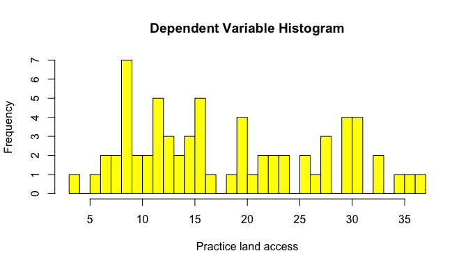

The distribution of the main independent variable can be visualized by
the histogram below. It is also skewed to the right, in this case
meaning that the countries where discrimination in the family achieve
extreme percentage are not the majority.

    hist(Data$Discrfamily, breaks=30, col="lightpink", xlab="Discrimination in the family", main="Independent Variable Histogram")

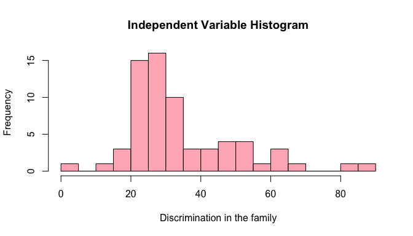

In the scatter plot below, we can observe the relationship between the
dependent variable and the main independent variable as well as perceive
its linearity. There seems to be a linear relationship between women’s
secure access to land in practice and discrimination in the family. The
association is also negative, indicating that as discrimination in the
family increases, the percentage of women with access to control over
the agricultural holding resource decreases.

    attach(Data)

    plot(Discrfamily, PRACTICElandacc, main="Access to land in Practice x Discrimination in the family",
       xlab="Discrimination in the family", ylab="Access to land practice", pch=19, col="black") + abline(lm(PRACTICElandacc~Discrfamily), col="blue")

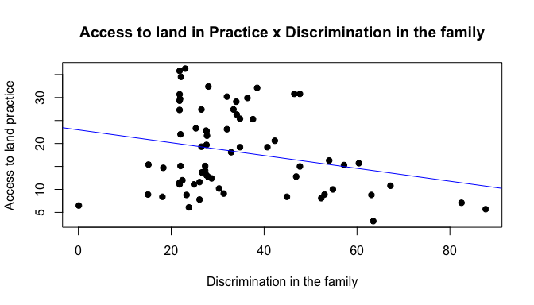integer(0)

## 3. Methods {#methods}

vThe statistical method chosen was ordinary least squares (OLS)
regression to estimate the linear relationship between the dependent
variable and independent variable, premising the existence of a negative
linear relationship between access to land assets in practice and the
main predictor discrimination in the family.

In model lm1, only the dependent variable and main predictor were
included. Discrimination in the family has a significant negative effect
on land access in practice, confirming expectations.

    lm1 <- lm(PRACTICElandacc ~ Discrfamily, data = Data)
    lm1

Call: lm(formula = PRACTICElandacc ~ Discrfamily, data = Data)

Coefficients: (Intercept) Discrfamily  
22.96 -0.14

    summary(lm1)

Call: lm(formula = PRACTICElandacc ~ Discrfamily, data = Data)

Residuals: Min 1Q Median 3Q Max -16.4498 -6.5959 -0.2587 7.4934 16.5556

Coefficients: Estimate Std. Error t value Pr(&gt;|t|)  
(Intercept) 22.96375 2.51599 9.127 2.96e-13 \*\** Discrfamily -0.13997
0.06669 -2.099 0.0397 *  
— Signif. codes: 0 ‘***’ 0.001 ’**’ 0.01 ’*’ 0.05 ‘.’ 0.1 ’ ’ 1

Residual standard error: 8.688 on 65 degrees of freedom Multiple
R-squared: 0.06347, Adjusted R-squared: 0.04906 F-statistic: 4.405 on 1
and 65 DF, p-value: 0.03972

    tab_model(lm1)  

<table style="border-collapse:collapse; border:none;">
<tr>
<th style="border-top: double; text-align:center; font-style:normal; font-weight:bold; padding:0.2cm;  text-align:left; ">
 
</th>
<th colspan="3" style="border-top: double; text-align:center; font-style:normal; font-weight:bold; padding:0.2cm; ">
PRACTICElandacc
</th>
</tr>
<tr>
<td style=" text-align:center; border-bottom:1px solid; font-style:italic; font-weight:normal;  text-align:left; ">
Predictors
</td>
<td style=" text-align:center; border-bottom:1px solid; font-style:italic; font-weight:normal;  ">
Estimates
</td>
<td style=" text-align:center; border-bottom:1px solid; font-style:italic; font-weight:normal;  ">
CI
</td>
<td style=" text-align:center; border-bottom:1px solid; font-style:italic; font-weight:normal;  ">
p
</td>
</tr>
<tr>
<td style=" padding:0.2cm; text-align:left; vertical-align:top; text-align:left; ">
(Intercept)
</td>
<td style=" padding:0.2cm; text-align:left; vertical-align:top; text-align:center;  ">
22.96
</td>
<td style=" padding:0.2cm; text-align:left; vertical-align:top; text-align:center;  ">
17.94 – 27.99
</td>
<td style=" padding:0.2cm; text-align:left; vertical-align:top; text-align:center;  ">
<strong>&lt;0.001
</td>
</tr>
<tr>
<td style=" padding:0.2cm; text-align:left; vertical-align:top; text-align:left; ">
Discrfamily
</td>
<td style=" padding:0.2cm; text-align:left; vertical-align:top; text-align:center;  ">
-0.14
</td>
<td style=" padding:0.2cm; text-align:left; vertical-align:top; text-align:center;  ">
-0.27 – -0.01
</td>
<td style=" padding:0.2cm; text-align:left; vertical-align:top; text-align:center;  ">
<strong>0.040</strong>
</td>
</tr>
<tr>
<td style=" padding:0.2cm; text-align:left; vertical-align:top; text-align:left; padding-top:0.1cm; padding-bottom:0.1cm; border-top:1px solid;">
Observations
</td>
<td style=" padding:0.2cm; text-align:left; vertical-align:top; padding-top:0.1cm; padding-bottom:0.1cm; text-align:left; border-top:1px solid;" colspan="3">
67
</td>
</tr>
<tr>
<td style=" padding:0.2cm; text-align:left; vertical-align:top; text-align:left; padding-top:0.1cm; padding-bottom:0.1cm;">
R2 / R2 adjusted
</td>
<td style=" padding:0.2cm; text-align:left; vertical-align:top; padding-top:0.1cm; padding-bottom:0.1cm; text-align:left;" colspan="3">
0.063 / 0.049
</td>
</tr>
</table>

Model lm2 included the variables restricted access to productive and
financial resources (financialresources), restricted civil liberties
(civilliberties), and restricted physical integrity (physicalintegrity)
as controls. Controlling for these variables, the negative effect of
discrimination in family was reduced and turned out to be not
significant anymore.

    lm2 <- lm(PRACTICElandacc ~ Discrfamily+financialresources+civilliberties+physicalintegrity, data = Data)
    lm2

Call: lm(formula = PRACTICElandacc ~ Discrfamily + financialresources +
civilliberties + physicalintegrity, data = Data)

Coefficients: (Intercept) Discrfamily financialresources
civilliberties  
24.28462 -0.07103 0.07818 0.02335  
physicalintegrity  
-0.30674

    summary(lm2)

Call: lm(formula = PRACTICElandacc ~ Discrfamily + financialresources +
civilliberties + physicalintegrity, data = Data)

Residuals: Min 1Q Median 3Q Max -14.780 -6.910 -1.862 6.469 17.332

Coefficients: Estimate Std. Error t value Pr(&gt;|t|)  
(Intercept) 24.28462 2.57821 9.419 1.43e-13 \*\** Discrfamily -0.07103
0.10276 -0.691 0.4920  
financialresources 0.07818 0.08881 0.880 0.3821  
civilliberties 0.02335 0.08894 0.263 0.7938  
physicalintegrity -0.30674 0.13272 -2.311 0.0242 *  
— Signif. codes: 0 ‘***’ 0.001 ’**’ 0.01 ’*’ 0.05 ‘.’ 0.1 ’ ’ 1

Residual standard error: 8.524 on 62 degrees of freedom Multiple
R-squared: 0.1403, Adjusted R-squared: 0.08479 F-statistic: 2.529 on 4
and 62 DF, p-value: 0.04939

    tab_model(lm2)

<table style="border-collapse:collapse; border:none;">
<tr>
<th style="border-top: double; text-align:center; font-style:normal; font-weight:bold; padding:0.2cm;  text-align:left; ">
 
</th>
<th colspan="3" style="border-top: double; text-align:center; font-style:normal; font-weight:bold; padding:0.2cm; ">
PRACTICElandacc
</th>
</tr>
<tr>
<td style=" text-align:center; border-bottom:1px solid; font-style:italic; font-weight:normal;  text-align:left; ">
Predictors
</td>
<td style=" text-align:center; border-bottom:1px solid; font-style:italic; font-weight:normal;  ">
Estimates
</td>
<td style=" text-align:center; border-bottom:1px solid; font-style:italic; font-weight:normal;  ">
CI
</td>
<td style=" text-align:center; border-bottom:1px solid; font-style:italic; font-weight:normal;  ">
p
</td>
</tr>
<tr>
<td style=" padding:0.2cm; text-align:left; vertical-align:top; text-align:left; ">
(Intercept)
</td>
<td style=" padding:0.2cm; text-align:left; vertical-align:top; text-align:center;  ">
24.28
</td>
<td style=" padding:0.2cm; text-align:left; vertical-align:top; text-align:center;  ">
19.13 – 29.44
</td>
<td style=" padding:0.2cm; text-align:left; vertical-align:top; text-align:center;  ">
<strong>&lt;0.001
</td>
</tr>
<tr>
<td style=" padding:0.2cm; text-align:left; vertical-align:top; text-align:left; ">
Discrfamily
</td>
<td style=" padding:0.2cm; text-align:left; vertical-align:top; text-align:center;  ">
-0.07
</td>
<td style=" padding:0.2cm; text-align:left; vertical-align:top; text-align:center;  ">
-0.28 – 0.13
</td>
<td style=" padding:0.2cm; text-align:left; vertical-align:top; text-align:center;  ">
0.492
</td>
</tr>
<tr>
<td style=" padding:0.2cm; text-align:left; vertical-align:top; text-align:left; ">
financialresources
</td>
<td style=" padding:0.2cm; text-align:left; vertical-align:top; text-align:center;  ">
0.08
</td>
<td style=" padding:0.2cm; text-align:left; vertical-align:top; text-align:center;  ">
-0.10 – 0.26
</td>
<td style=" padding:0.2cm; text-align:left; vertical-align:top; text-align:center;  ">
0.382
</td>
</tr>
<tr>
<td style=" padding:0.2cm; text-align:left; vertical-align:top; text-align:left; ">
civilliberties
</td>
<td style=" padding:0.2cm; text-align:left; vertical-align:top; text-align:center;  ">
0.02
</td>
<td style=" padding:0.2cm; text-align:left; vertical-align:top; text-align:center;  ">
-0.15 – 0.20
</td>
<td style=" padding:0.2cm; text-align:left; vertical-align:top; text-align:center;  ">
0.794
</td>
</tr>
<tr>
<td style=" padding:0.2cm; text-align:left; vertical-align:top; text-align:left; ">
physicalintegrity
</td>
<td style=" padding:0.2cm; text-align:left; vertical-align:top; text-align:center;  ">
-0.31
</td>
<td style=" padding:0.2cm; text-align:left; vertical-align:top; text-align:center;  ">
-0.57 – -0.04
</td>
<td style=" padding:0.2cm; text-align:left; vertical-align:top; text-align:center;  ">
<strong>0.024</strong>
</td>
</tr>
<tr>
<td style=" padding:0.2cm; text-align:left; vertical-align:top; text-align:left; padding-top:0.1cm; padding-bottom:0.1cm; border-top:1px solid;">
Observations
</td>
<td style=" padding:0.2cm; text-align:left; vertical-align:top; padding-top:0.1cm; padding-bottom:0.1cm; text-align:left; border-top:1px solid;" colspan="3">
67
</td>
</tr>
<tr>
<td style=" padding:0.2cm; text-align:left; vertical-align:top; text-align:left; padding-top:0.1cm; padding-bottom:0.1cm;">
R2 / R2 adjusted
</td>
<td style=" padding:0.2cm; text-align:left; vertical-align:top; padding-top:0.1cm; padding-bottom:0.1cm; text-align:left;" colspan="3">
0.140 / 0.085
</td>
</tr>
</table>

In model lm3, the categorical variable access to land guaranteed by law
(LAWlandacc) was added as control. Discrimination in the family remained
insignificant as lm2, so did the categories of the added control
variable.

    lm3 <- lm(PRACTICElandacc ~ Discrfamily+financialresources+civilliberties+physicalintegrity+LAWlandacc, data = Data)
    lm3

Call: lm(formula = PRACTICElandacc ~ Discrfamily + financialresources +
civilliberties + physicalintegrity + LAWlandacc, data = Data)

Coefficients: (Intercept) Discrfamily financialresources
civilliberties  
23.17373 -0.02606 0.02481 0.05440  
physicalintegrity LAWlandacc0.25 LAWlandacc0.5 LAWlandacc0.75  
-0.34428 1.71397 -3.59532 11.63622  
LAWlandacc1  
-1.26214

    summary(lm3)

Call: lm(formula = PRACTICElandacc ~ Discrfamily + financialresources +
civilliberties + physicalintegrity + LAWlandacc, data = Data)

Residuals: Min 1Q Median 3Q Max -13.756 -5.903 -2.582 6.059 17.189

Coefficients: Estimate Std. Error t value Pr(&gt;|t|)  
(Intercept) 23.17373 2.72431 8.506 8.73e-12 \*\** Discrfamily -0.02606
0.10791 -0.241 0.810  
financialresources 0.02481 0.13809 0.180 0.858  
civilliberties 0.05440 0.09441 0.576 0.567  
physicalintegrity -0.34428 0.14145 -2.434 0.018 *  
LAWlandacc0.25 1.71397 3.08872 0.555 0.581  
LAWlandacc0.5 -3.59532 5.57748 -0.645 0.522  
LAWlandacc0.75 11.63622 11.44247 1.017 0.313  
LAWlandacc1 -1.26214 9.26635 -0.136 0.892  
— Signif. codes: 0 ‘***’ 0.001 ’**’ 0.01 ’*’ 0.05 ‘.’ 0.1 ’ ’ 1

Residual standard error: 8.594 on 58 degrees of freedom Multiple
R-squared: 0.1824, Adjusted R-squared: 0.06966 F-statistic: 1.618 on 8
and 58 DF, p-value: 0.1396

    tab_model(lm3) 

<table style="border-collapse:collapse; border:none;">
<tr>
<th style="border-top: double; text-align:center; font-style:normal; font-weight:bold; padding:0.2cm;  text-align:left; ">
 
</th>
<th colspan="3" style="border-top: double; text-align:center; font-style:normal; font-weight:bold; padding:0.2cm; ">
PRACTICElandacc
</th>
</tr>
<tr>
<td style=" text-align:center; border-bottom:1px solid; font-style:italic; font-weight:normal;  text-align:left; ">
Predictors
</td>
<td style=" text-align:center; border-bottom:1px solid; font-style:italic; font-weight:normal;  ">
Estimates
</td>
<td style=" text-align:center; border-bottom:1px solid; font-style:italic; font-weight:normal;  ">
CI
</td>
<td style=" text-align:center; border-bottom:1px solid; font-style:italic; font-weight:normal;  ">
p
</td>
</tr>
<tr>
<td style=" padding:0.2cm; text-align:left; vertical-align:top; text-align:left; ">
(Intercept)
</td>
<td style=" padding:0.2cm; text-align:left; vertical-align:top; text-align:center;  ">
23.17
</td>
<td style=" padding:0.2cm; text-align:left; vertical-align:top; text-align:center;  ">
17.72 – 28.63
</td>
<td style=" padding:0.2cm; text-align:left; vertical-align:top; text-align:center;  ">
<strong>&lt;0.001
</td>
</tr>
<tr>
<td style=" padding:0.2cm; text-align:left; vertical-align:top; text-align:left; ">
Discrfamily
</td>
<td style=" padding:0.2cm; text-align:left; vertical-align:top; text-align:center;  ">
-0.03
</td>
<td style=" padding:0.2cm; text-align:left; vertical-align:top; text-align:center;  ">
-0.24 – 0.19
</td>
<td style=" padding:0.2cm; text-align:left; vertical-align:top; text-align:center;  ">
0.810
</td>
</tr>
<tr>
<td style=" padding:0.2cm; text-align:left; vertical-align:top; text-align:left; ">
financialresources
</td>
<td style=" padding:0.2cm; text-align:left; vertical-align:top; text-align:center;  ">
0.02
</td>
<td style=" padding:0.2cm; text-align:left; vertical-align:top; text-align:center;  ">
-0.25 – 0.30
</td>
<td style=" padding:0.2cm; text-align:left; vertical-align:top; text-align:center;  ">
0.858
</td>
</tr>
<tr>
<td style=" padding:0.2cm; text-align:left; vertical-align:top; text-align:left; ">
civilliberties
</td>
<td style=" padding:0.2cm; text-align:left; vertical-align:top; text-align:center;  ">
0.05
</td>
<td style=" padding:0.2cm; text-align:left; vertical-align:top; text-align:center;  ">
-0.13 – 0.24
</td>
<td style=" padding:0.2cm; text-align:left; vertical-align:top; text-align:center;  ">
0.567
</td>
</tr>
<tr>
<td style=" padding:0.2cm; text-align:left; vertical-align:top; text-align:left; ">
physicalintegrity
</td>
<td style=" padding:0.2cm; text-align:left; vertical-align:top; text-align:center;  ">
-0.34
</td>
<td style=" padding:0.2cm; text-align:left; vertical-align:top; text-align:center;  ">
-0.63 – -0.06
</td>
<td style=" padding:0.2cm; text-align:left; vertical-align:top; text-align:center;  ">
<strong>0.018</strong>
</td>
</tr>
<tr>
<td style=" padding:0.2cm; text-align:left; vertical-align:top; text-align:left; ">
LAWlandacc \[0.25\]
</td>
<td style=" padding:0.2cm; text-align:left; vertical-align:top; text-align:center;  ">
1.71
</td>
<td style=" padding:0.2cm; text-align:left; vertical-align:top; text-align:center;  ">
-4.47 – 7.90
</td>
<td style=" padding:0.2cm; text-align:left; vertical-align:top; text-align:center;  ">
0.581
</td>
</tr>
<tr>
<td style=" padding:0.2cm; text-align:left; vertical-align:top; text-align:left; ">
LAWlandacc \[0.5\]
</td>
<td style=" padding:0.2cm; text-align:left; vertical-align:top; text-align:center;  ">
-3.60
</td>
<td style=" padding:0.2cm; text-align:left; vertical-align:top; text-align:center;  ">
-14.76 – 7.57
</td>
<td style=" padding:0.2cm; text-align:left; vertical-align:top; text-align:center;  ">
0.522
</td>
</tr>
<tr>
<td style=" padding:0.2cm; text-align:left; vertical-align:top; text-align:left; ">
LAWlandacc \[0.75\]
</td>
<td style=" padding:0.2cm; text-align:left; vertical-align:top; text-align:center;  ">
11.64
</td>
<td style=" padding:0.2cm; text-align:left; vertical-align:top; text-align:center;  ">
-11.27 – 34.54
</td>
<td style=" padding:0.2cm; text-align:left; vertical-align:top; text-align:center;  ">
0.313
</td>
</tr>
<tr>
<td style=" padding:0.2cm; text-align:left; vertical-align:top; text-align:left; ">
LAWlandacc \[1\]
</td>
<td style=" padding:0.2cm; text-align:left; vertical-align:top; text-align:center;  ">
-1.26
</td>
<td style=" padding:0.2cm; text-align:left; vertical-align:top; text-align:center;  ">
-19.81 – 17.29
</td>
<td style=" padding:0.2cm; text-align:left; vertical-align:top; text-align:center;  ">
0.892
</td>
</tr>
<tr>
<td style=" padding:0.2cm; text-align:left; vertical-align:top; text-align:left; padding-top:0.1cm; padding-bottom:0.1cm; border-top:1px solid;">
Observations
</td>
<td style=" padding:0.2cm; text-align:left; vertical-align:top; padding-top:0.1cm; padding-bottom:0.1cm; text-align:left; border-top:1px solid;" colspan="3">
67
</td>
</tr>
<tr>
<td style=" padding:0.2cm; text-align:left; vertical-align:top; text-align:left; padding-top:0.1cm; padding-bottom:0.1cm;">
R2 / R2 adjusted
</td>
<td style=" padding:0.2cm; text-align:left; vertical-align:top; padding-top:0.1cm; padding-bottom:0.1cm; text-align:left;" colspan="3">
0.182 / 0.070
</td>
</tr>
</table>

Model lm4 controlled for restricted physical integrity
(physicalintegrity) and access to land guaranteed by law (LAWlandacc).
In this scenario, the effect of the main predictor became slightly
positive.

    lm4 <- lm(PRACTICElandacc ~ Discrfamily+physicalintegrity+LAWlandacc, data = Data)
    lm4

Call: lm(formula = PRACTICElandacc ~ Discrfamily + physicalintegrity +
LAWlandacc, data = Data)

Coefficients: (Intercept) Discrfamily physicalintegrity LAWlandacc0.25  
23.4653428 0.0006535 -0.3281938 2.2400538  
LAWlandacc0.5 LAWlandacc0.75 LAWlandacc1  
-2.3615717 12.5809128 -0.1091316

    summary(lm4)

Call: lm(formula = PRACTICElandacc ~ Discrfamily + physicalintegrity +
LAWlandacc, data = Data)

Residuals: Min 1Q Median 3Q Max -13.143 -5.796 -2.246 5.927 16.988

Coefficients: Estimate Std. Error t value Pr(&gt;|t|)  
(Intercept) 23.4653428 2.6507320 8.852 1.75e-12 \*\** Discrfamily
0.0006535 0.0980750 0.007 0.9947  
physicalintegrity -0.3281938 0.1357396 -2.418 0.0187 *  
LAWlandacc0.25 2.2400538 2.5443441 0.880 0.3822  
LAWlandacc0.5 -2.3615717 4.8320221 -0.489 0.6268  
LAWlandacc0.75 12.5809128 8.7032213 1.446 0.1535  
LAWlandacc1 -0.1091316 6.8983571 -0.016 0.9874  
— Signif. codes: 0 ‘***’ 0.001 ’**’ 0.01 ’*’ 0.05 ‘.’ 0.1 ’ ’ 1

Residual standard error: 8.48 on 60 degrees of freedom Multiple
R-squared: 0.1765, Adjusted R-squared: 0.09418 F-statistic: 2.144 on 6
and 60 DF, p-value: 0.06127

    tab_model(lm4)

<table style="border-collapse:collapse; border:none;">
<tr>
<th style="border-top: double; text-align:center; font-style:normal; font-weight:bold; padding:0.2cm;  text-align:left; ">
 
</th>
<th colspan="3" style="border-top: double; text-align:center; font-style:normal; font-weight:bold; padding:0.2cm; ">
PRACTICElandacc
</th>
</tr>
<tr>
<td style=" text-align:center; border-bottom:1px solid; font-style:italic; font-weight:normal;  text-align:left; ">
Predictors
</td>
<td style=" text-align:center; border-bottom:1px solid; font-style:italic; font-weight:normal;  ">
Estimates
</td>
<td style=" text-align:center; border-bottom:1px solid; font-style:italic; font-weight:normal;  ">
CI
</td>
<td style=" text-align:center; border-bottom:1px solid; font-style:italic; font-weight:normal;  ">
p
</td>
</tr>
<tr>
<td style=" padding:0.2cm; text-align:left; vertical-align:top; text-align:left; ">
(Intercept)
</td>
<td style=" padding:0.2cm; text-align:left; vertical-align:top; text-align:center;  ">
23.47
</td>
<td style=" padding:0.2cm; text-align:left; vertical-align:top; text-align:center;  ">
18.16 – 28.77
</td>
<td style=" padding:0.2cm; text-align:left; vertical-align:top; text-align:center;  ">
<strong>&lt;0.001
</td>
</tr>
<tr>
<td style=" padding:0.2cm; text-align:left; vertical-align:top; text-align:left; ">
Discrfamily
</td>
<td style=" padding:0.2cm; text-align:left; vertical-align:top; text-align:center;  ">
0.00
</td>
<td style=" padding:0.2cm; text-align:left; vertical-align:top; text-align:center;  ">
-0.20 – 0.20
</td>
<td style=" padding:0.2cm; text-align:left; vertical-align:top; text-align:center;  ">
0.995
</td>
</tr>
<tr>
<td style=" padding:0.2cm; text-align:left; vertical-align:top; text-align:left; ">
physicalintegrity
</td>
<td style=" padding:0.2cm; text-align:left; vertical-align:top; text-align:center;  ">
-0.33
</td>
<td style=" padding:0.2cm; text-align:left; vertical-align:top; text-align:center;  ">
-0.60 – -0.06
</td>
<td style=" padding:0.2cm; text-align:left; vertical-align:top; text-align:center;  ">
<strong>0.019</strong>
</td>
</tr>
<tr>
<td style=" padding:0.2cm; text-align:left; vertical-align:top; text-align:left; ">
LAWlandacc \[0.25\]
</td>
<td style=" padding:0.2cm; text-align:left; vertical-align:top; text-align:center;  ">
2.24
</td>
<td style=" padding:0.2cm; text-align:left; vertical-align:top; text-align:center;  ">
-2.85 – 7.33
</td>
<td style=" padding:0.2cm; text-align:left; vertical-align:top; text-align:center;  ">
0.382
</td>
</tr>
<tr>
<td style=" padding:0.2cm; text-align:left; vertical-align:top; text-align:left; ">
LAWlandacc \[0.5\]
</td>
<td style=" padding:0.2cm; text-align:left; vertical-align:top; text-align:center;  ">
-2.36
</td>
<td style=" padding:0.2cm; text-align:left; vertical-align:top; text-align:center;  ">
-12.03 – 7.30
</td>
<td style=" padding:0.2cm; text-align:left; vertical-align:top; text-align:center;  ">
0.627
</td>
</tr>
<tr>
<td style=" padding:0.2cm; text-align:left; vertical-align:top; text-align:left; ">
LAWlandacc \[0.75\]
</td>
<td style=" padding:0.2cm; text-align:left; vertical-align:top; text-align:center;  ">
12.58
</td>
<td style=" padding:0.2cm; text-align:left; vertical-align:top; text-align:center;  ">
-4.83 – 29.99
</td>
<td style=" padding:0.2cm; text-align:left; vertical-align:top; text-align:center;  ">
0.154
</td>
</tr>
<tr>
<td style=" padding:0.2cm; text-align:left; vertical-align:top; text-align:left; ">
LAWlandacc \[1\]
</td>
<td style=" padding:0.2cm; text-align:left; vertical-align:top; text-align:center;  ">
-0.11
</td>
<td style=" padding:0.2cm; text-align:left; vertical-align:top; text-align:center;  ">
-13.91 – 13.69
</td>
<td style=" padding:0.2cm; text-align:left; vertical-align:top; text-align:center;  ">
0.987
</td>
</tr>
<tr>
<td style=" padding:0.2cm; text-align:left; vertical-align:top; text-align:left; padding-top:0.1cm; padding-bottom:0.1cm; border-top:1px solid;">
Observations
</td>
<td style=" padding:0.2cm; text-align:left; vertical-align:top; padding-top:0.1cm; padding-bottom:0.1cm; text-align:left; border-top:1px solid;" colspan="3">
67
</td>
</tr>
<tr>
<td style=" padding:0.2cm; text-align:left; vertical-align:top; text-align:left; padding-top:0.1cm; padding-bottom:0.1cm;">
R2 / R2 adjusted
</td>
<td style=" padding:0.2cm; text-align:left; vertical-align:top; padding-top:0.1cm; padding-bottom:0.1cm; text-align:left;" colspan="3">
0.177 / 0.094
</td>
</tr>
</table>

Model lm5 controlled just for physical integrity (physicalintegrity).
Discrimination in family remained with its negative effect, although not
significant.

    lm5 <- lm(PRACTICElandacc ~ Discrfamily+physicalintegrity, data = Data)
    lm5

Call: lm(formula = PRACTICElandacc ~ Discrfamily + physicalintegrity,
data = Data)

Coefficients: (Intercept) Discrfamily physicalintegrity  
24.38749 -0.02235 -0.27687

    summary(lm5)

Call: lm(formula = PRACTICElandacc ~ Discrfamily + physicalintegrity,
data = Data)

Residuals: Min 1Q Median 3Q Max -14.203 -6.645 -1.914 6.795 15.943

Coefficients: Estimate Std. Error t value Pr(&gt;|t|)  
(Intercept) 24.38749 2.53429 9.623 4.69e-14 \*\** Discrfamily -0.02235
0.08461 -0.264 0.7925  
physicalintegrity -0.27687 0.12787 -2.165 0.0341 *  
— Signif. codes: 0 ‘***’ 0.001 ’**’ 0.01 ’*’ 0.05 ‘.’ 0.1 ’ ’ 1

Residual standard error: 8.452 on 64 degrees of freedom Multiple
R-squared: 0.1274, Adjusted R-squared: 0.1001 F-statistic: 4.672 on 2
and 64 DF, p-value: 0.01277

    tab_model(lm5)

<table style="border-collapse:collapse; border:none;">
<tr>
<th style="border-top: double; text-align:center; font-style:normal; font-weight:bold; padding:0.2cm;  text-align:left; ">
 
</th>
<th colspan="3" style="border-top: double; text-align:center; font-style:normal; font-weight:bold; padding:0.2cm; ">
PRACTICElandacc
</th>
</tr>
<tr>
<td style=" text-align:center; border-bottom:1px solid; font-style:italic; font-weight:normal;  text-align:left; ">
Predictors
</td>
<td style=" text-align:center; border-bottom:1px solid; font-style:italic; font-weight:normal;  ">
Estimates
</td>
<td style=" text-align:center; border-bottom:1px solid; font-style:italic; font-weight:normal;  ">
CI
</td>
<td style=" text-align:center; border-bottom:1px solid; font-style:italic; font-weight:normal;  ">
p
</td>
</tr>
<tr>
<td style=" padding:0.2cm; text-align:left; vertical-align:top; text-align:left; ">
(Intercept)
</td>
<td style=" padding:0.2cm; text-align:left; vertical-align:top; text-align:center;  ">
24.39
</td>
<td style=" padding:0.2cm; text-align:left; vertical-align:top; text-align:center;  ">
19.32 – 29.45
</td>
<td style=" padding:0.2cm; text-align:left; vertical-align:top; text-align:center;  ">
<strong>&lt;0.001
</td>
</tr>
<tr>
<td style=" padding:0.2cm; text-align:left; vertical-align:top; text-align:left; ">
Discrfamily
</td>
<td style=" padding:0.2cm; text-align:left; vertical-align:top; text-align:center;  ">
-0.02
</td>
<td style=" padding:0.2cm; text-align:left; vertical-align:top; text-align:center;  ">
-0.19 – 0.15
</td>
<td style=" padding:0.2cm; text-align:left; vertical-align:top; text-align:center;  ">
0.793
</td>
</tr>
<tr>
<td style=" padding:0.2cm; text-align:left; vertical-align:top; text-align:left; ">
physicalintegrity
</td>
<td style=" padding:0.2cm; text-align:left; vertical-align:top; text-align:center;  ">
-0.28
</td>
<td style=" padding:0.2cm; text-align:left; vertical-align:top; text-align:center;  ">
-0.53 – -0.02
</td>
<td style=" padding:0.2cm; text-align:left; vertical-align:top; text-align:center;  ">
<strong>0.034</strong>
</td>
</tr>
<tr>
<td style=" padding:0.2cm; text-align:left; vertical-align:top; text-align:left; padding-top:0.1cm; padding-bottom:0.1cm; border-top:1px solid;">
Observations
</td>
<td style=" padding:0.2cm; text-align:left; vertical-align:top; padding-top:0.1cm; padding-bottom:0.1cm; text-align:left; border-top:1px solid;" colspan="3">
67
</td>
</tr>
<tr>
<td style=" padding:0.2cm; text-align:left; vertical-align:top; text-align:left; padding-top:0.1cm; padding-bottom:0.1cm;">
R2 / R2 adjusted
</td>
<td style=" padding:0.2cm; text-align:left; vertical-align:top; padding-top:0.1cm; padding-bottom:0.1cm; text-align:left;" colspan="3">
0.127 / 0.100
</td>
</tr>
</table>

Nevertheless, this was the model chosen not even because it has the
highest adjusted R squared and the smallest AIC, but also for
theoretical reasons, as it will be explained later.

    stargazer(lm1, lm2, lm3, lm4, lm5,
              title = "Secure access to land in practice", 
              type = "text")

Secure access to land in practice
=================================

                                                             Dependent variable:                                         
                    -----------------------------------------------------------------------------------------------------
                                                               PRACTICElandacc                                           
                            (1)                  (2)                 (3)                 (4)                 (5)         

<table>
<colgroup>
<col style="width: 100%" />
</colgroup>
<tbody>
<tr class="odd">
<td style="text-align: left;">Discrfamily -0.140** -0.071 -0.026 0.001 -0.022 (0.067) (0.103) (0.108) (0.098) (0.085)</td>
</tr>
<tr class="even">
<td style="text-align: left;">financialresources 0.078 0.025 (0.089) (0.138)</td>
</tr>
<tr class="odd">
<td style="text-align: left;">civilliberties 0.023 0.054 (0.089) (0.094)</td>
</tr>
<tr class="even">
<td style="text-align: left;">physicalintegrity -0.307** -0.344** -0.328** -0.277** (0.133) (0.141) (0.136) (0.128)</td>
</tr>
<tr class="odd">
<td style="text-align: left;">LAWlandacc0.25 1.714 2.240 (3.089) (2.544)</td>
</tr>
<tr class="even">
<td style="text-align: left;">LAWlandacc0.5 -3.595 -2.362 (5.577) (4.832)</td>
</tr>
<tr class="odd">
<td style="text-align: left;">LAWlandacc0.75 11.636 12.581 (11.442) (8.703)</td>
</tr>
<tr class="even">
<td style="text-align: left;">LAWlandacc1 -1.262 -0.109 (9.266) (6.898)</td>
</tr>
<tr class="odd">
<td style="text-align: left;">Constant 22.964*** 24.285*** 23.174*** 23.465*** 24.387*** (2.516) (2.578) (2.724) (2.651) (2.534)</td>
</tr>
</tbody>
</table>

{\normalsize Observations 67 67 67 67 67  
R2 0.063 0.140 0.182 0.177 0.127  
Adjusted R2 0.049 0.085 0.070 0.094 0.100  
Residual Std. Error 8.688 (df = 65) 8.524 (df = 62) 8.594 (df = 58)
8.480 (df = 60) 8.452 (df = 64)  
F Statistic 4.405\*\* (df = 1; 65) 2.529\*\* (df = 4; 62) 1.618 (df = 8;
58) 2.144\* (df = 6; 60) 4.672\*\* (df = 2; 64)}
=========================================================================================================================
Note: *p&lt;0.1; **p&lt;0.05; ***p&lt;0.01

    tab_model(lm1, lm2, lm3, lm4, lm5, show.aic = TRUE) 

<table style="border-collapse:collapse; border:none;">
<tr>
<th style="border-top: double; text-align:center; font-style:normal; font-weight:bold; padding:0.2cm;  text-align:left; ">
 
</th>
<th colspan="3" style="border-top: double; text-align:center; font-style:normal; font-weight:bold; padding:0.2cm; ">
PRACTICElandacc
</th>
<th colspan="3" style="border-top: double; text-align:center; font-style:normal; font-weight:bold; padding:0.2cm; ">
PRACTICElandacc
</th>
<th colspan="3" style="border-top: double; text-align:center; font-style:normal; font-weight:bold; padding:0.2cm; ">
PRACTICElandacc
</th>
<th colspan="3" style="border-top: double; text-align:center; font-style:normal; font-weight:bold; padding:0.2cm; ">
PRACTICElandacc
</th>
<th colspan="3" style="border-top: double; text-align:center; font-style:normal; font-weight:bold; padding:0.2cm; ">
PRACTICElandacc
</th>
</tr>
<tr>
<td style=" text-align:center; border-bottom:1px solid; font-style:italic; font-weight:normal;  text-align:left; ">
Predictors
</td>
<td style=" text-align:center; border-bottom:1px solid; font-style:italic; font-weight:normal;  ">
Estimates
</td>
<td style=" text-align:center; border-bottom:1px solid; font-style:italic; font-weight:normal;  ">
CI
</td>
<td style=" text-align:center; border-bottom:1px solid; font-style:italic; font-weight:normal;  ">
p
</td>
<td style=" text-align:center; border-bottom:1px solid; font-style:italic; font-weight:normal;  ">
Estimates
</td>
<td style=" text-align:center; border-bottom:1px solid; font-style:italic; font-weight:normal;  ">
CI
</td>
<td style=" text-align:center; border-bottom:1px solid; font-style:italic; font-weight:normal;  col7">
p
</td>
<td style=" text-align:center; border-bottom:1px solid; font-style:italic; font-weight:normal;  col8">
Estimates
</td>
<td style=" text-align:center; border-bottom:1px solid; font-style:italic; font-weight:normal;  col9">
CI
</td>
<td style=" text-align:center; border-bottom:1px solid; font-style:italic; font-weight:normal;  0">
p
</td>
<td style=" text-align:center; border-bottom:1px solid; font-style:italic; font-weight:normal;  1">
Estimates
</td>
<td style=" text-align:center; border-bottom:1px solid; font-style:italic; font-weight:normal;  2">
CI
</td>
<td style=" text-align:center; border-bottom:1px solid; font-style:italic; font-weight:normal;  3">
p
</td>
<td style=" text-align:center; border-bottom:1px solid; font-style:italic; font-weight:normal;  4">
Estimates
</td>
<td style=" text-align:center; border-bottom:1px solid; font-style:italic; font-weight:normal;  5">
CI
</td>
<td style=" text-align:center; border-bottom:1px solid; font-style:italic; font-weight:normal;  6">
p
</td>
</tr>
<tr>
<td style=" padding:0.2cm; text-align:left; vertical-align:top; text-align:left; ">
(Intercept)
</td>
<td style=" padding:0.2cm; text-align:left; vertical-align:top; text-align:center;  ">
22.96
</td>
<td style=" padding:0.2cm; text-align:left; vertical-align:top; text-align:center;  ">
17.94 – 27.99
</td>
<td style=" padding:0.2cm; text-align:left; vertical-align:top; text-align:center;  ">
<strong>&lt;0.001
</td>
<td style=" padding:0.2cm; text-align:left; vertical-align:top; text-align:center;  ">
24.28
</td>
<td style=" padding:0.2cm; text-align:left; vertical-align:top; text-align:center;  ">
19.13 – 29.44
</td>
<td style=" padding:0.2cm; text-align:left; vertical-align:top; text-align:center;  col7">
<strong>&lt;0.001
</td>
<td style=" padding:0.2cm; text-align:left; vertical-align:top; text-align:center;  col8">
23.17
</td>
<td style=" padding:0.2cm; text-align:left; vertical-align:top; text-align:center;  col9">
17.72 – 28.63
</td>
<td style=" padding:0.2cm; text-align:left; vertical-align:top; text-align:center;  0">
<strong>&lt;0.001
</td>
<td style=" padding:0.2cm; text-align:left; vertical-align:top; text-align:center;  1">
23.47
</td>
<td style=" padding:0.2cm; text-align:left; vertical-align:top; text-align:center;  2">
18.16 – 28.77
</td>
<td style=" padding:0.2cm; text-align:left; vertical-align:top; text-align:center;  3">
<strong>&lt;0.001
</td>
<td style=" padding:0.2cm; text-align:left; vertical-align:top; text-align:center;  4">
24.39
</td>
<td style=" padding:0.2cm; text-align:left; vertical-align:top; text-align:center;  5">
19.32 – 29.45
</td>
<td style=" padding:0.2cm; text-align:left; vertical-align:top; text-align:center;  6">
<strong>&lt;0.001
</td>
</tr>
<tr>
<td style=" padding:0.2cm; text-align:left; vertical-align:top; text-align:left; ">
Discrfamily
</td>
<td style=" padding:0.2cm; text-align:left; vertical-align:top; text-align:center;  ">
-0.14
</td>
<td style=" padding:0.2cm; text-align:left; vertical-align:top; text-align:center;  ">
-0.27 – -0.01
</td>
<td style=" padding:0.2cm; text-align:left; vertical-align:top; text-align:center;  ">
<strong>0.040</strong>
</td>
<td style=" padding:0.2cm; text-align:left; vertical-align:top; text-align:center;  ">
-0.07
</td>
<td style=" padding:0.2cm; text-align:left; vertical-align:top; text-align:center;  ">
-0.28 – 0.13
</td>
<td style=" padding:0.2cm; text-align:left; vertical-align:top; text-align:center;  col7">
0.492
</td>
<td style=" padding:0.2cm; text-align:left; vertical-align:top; text-align:center;  col8">
-0.03
</td>
<td style=" padding:0.2cm; text-align:left; vertical-align:top; text-align:center;  col9">
-0.24 – 0.19
</td>
<td style=" padding:0.2cm; text-align:left; vertical-align:top; text-align:center;  0">
0.810
</td>
<td style=" padding:0.2cm; text-align:left; vertical-align:top; text-align:center;  1">
0.00
</td>
<td style=" padding:0.2cm; text-align:left; vertical-align:top; text-align:center;  2">
-0.20 – 0.20
</td>
<td style=" padding:0.2cm; text-align:left; vertical-align:top; text-align:center;  3">
0.995
</td>
<td style=" padding:0.2cm; text-align:left; vertical-align:top; text-align:center;  4">
-0.02
</td>
<td style=" padding:0.2cm; text-align:left; vertical-align:top; text-align:center;  5">
-0.19 – 0.15
</td>
<td style=" padding:0.2cm; text-align:left; vertical-align:top; text-align:center;  6">
0.793
</td>
</tr>
<tr>
<td style=" padding:0.2cm; text-align:left; vertical-align:top; text-align:left; ">
financialresources
</td>
<td style=" padding:0.2cm; text-align:left; vertical-align:top; text-align:center;  ">
</td>
<td style=" padding:0.2cm; text-align:left; vertical-align:top; text-align:center;  ">
</td>
<td style=" padding:0.2cm; text-align:left; vertical-align:top; text-align:center;  ">
</td>
<td style=" padding:0.2cm; text-align:left; vertical-align:top; text-align:center;  ">
0.08
</td>
<td style=" padding:0.2cm; text-align:left; vertical-align:top; text-align:center;  ">
-0.10 – 0.26
</td>
<td style=" padding:0.2cm; text-align:left; vertical-align:top; text-align:center;  col7">
0.382
</td>
<td style=" padding:0.2cm; text-align:left; vertical-align:top; text-align:center;  col8">
0.02
</td>
<td style=" padding:0.2cm; text-align:left; vertical-align:top; text-align:center;  col9">
-0.25 – 0.30
</td>
<td style=" padding:0.2cm; text-align:left; vertical-align:top; text-align:center;  0">
0.858
</td>
<td style=" padding:0.2cm; text-align:left; vertical-align:top; text-align:center;  1">
</td>
<td style=" padding:0.2cm; text-align:left; vertical-align:top; text-align:center;  2">
</td>
<td style=" padding:0.2cm; text-align:left; vertical-align:top; text-align:center;  3">
</td>
<td style=" padding:0.2cm; text-align:left; vertical-align:top; text-align:center;  4">
</td>
<td style=" padding:0.2cm; text-align:left; vertical-align:top; text-align:center;  5">
</td>
<td style=" padding:0.2cm; text-align:left; vertical-align:top; text-align:center;  6">
</td>
</tr>
<tr>
<td style=" padding:0.2cm; text-align:left; vertical-align:top; text-align:left; ">
civilliberties
</td>
<td style=" padding:0.2cm; text-align:left; vertical-align:top; text-align:center;  ">
</td>
<td style=" padding:0.2cm; text-align:left; vertical-align:top; text-align:center;  ">
</td>
<td style=" padding:0.2cm; text-align:left; vertical-align:top; text-align:center;  ">
</td>
<td style=" padding:0.2cm; text-align:left; vertical-align:top; text-align:center;  ">
0.02
</td>
<td style=" padding:0.2cm; text-align:left; vertical-align:top; text-align:center;  ">
-0.15 – 0.20
</td>
<td style=" padding:0.2cm; text-align:left; vertical-align:top; text-align:center;  col7">
0.794
</td>
<td style=" padding:0.2cm; text-align:left; vertical-align:top; text-align:center;  col8">
0.05
</td>
<td style=" padding:0.2cm; text-align:left; vertical-align:top; text-align:center;  col9">
-0.13 – 0.24
</td>
<td style=" padding:0.2cm; text-align:left; vertical-align:top; text-align:center;  0">
0.567
</td>
<td style=" padding:0.2cm; text-align:left; vertical-align:top; text-align:center;  1">
</td>
<td style=" padding:0.2cm; text-align:left; vertical-align:top; text-align:center;  2">
</td>
<td style=" padding:0.2cm; text-align:left; vertical-align:top; text-align:center;  3">
</td>
<td style=" padding:0.2cm; text-align:left; vertical-align:top; text-align:center;  4">
</td>
<td style=" padding:0.2cm; text-align:left; vertical-align:top; text-align:center;  5">
</td>
<td style=" padding:0.2cm; text-align:left; vertical-align:top; text-align:center;  6">
</td>
</tr>
<tr>
<td style=" padding:0.2cm; text-align:left; vertical-align:top; text-align:left; ">
physicalintegrity
</td>
<td style=" padding:0.2cm; text-align:left; vertical-align:top; text-align:center;  ">
</td>
<td style=" padding:0.2cm; text-align:left; vertical-align:top; text-align:center;  ">
</td>
<td style=" padding:0.2cm; text-align:left; vertical-align:top; text-align:center;  ">
</td>
<td style=" padding:0.2cm; text-align:left; vertical-align:top; text-align:center;  ">
-0.31
</td>
<td style=" padding:0.2cm; text-align:left; vertical-align:top; text-align:center;  ">
-0.57 – -0.04
</td>
<td style=" padding:0.2cm; text-align:left; vertical-align:top; text-align:center;  col7">
<strong>0.024</strong>
</td>
<td style=" padding:0.2cm; text-align:left; vertical-align:top; text-align:center;  col8">
-0.34
</td>
<td style=" padding:0.2cm; text-align:left; vertical-align:top; text-align:center;  col9">
-0.63 – -0.06
</td>
<td style=" padding:0.2cm; text-align:left; vertical-align:top; text-align:center;  0">
<strong>0.018</strong>
</td>
<td style=" padding:0.2cm; text-align:left; vertical-align:top; text-align:center;  1">
-0.33
</td>
<td style=" padding:0.2cm; text-align:left; vertical-align:top; text-align:center;  2">
-0.60 – -0.06
</td>
<td style=" padding:0.2cm; text-align:left; vertical-align:top; text-align:center;  3">
<strong>0.019</strong>
</td>
<td style=" padding:0.2cm; text-align:left; vertical-align:top; text-align:center;  4">
-0.28
</td>
<td style=" padding:0.2cm; text-align:left; vertical-align:top; text-align:center;  5">
-0.53 – -0.02
</td>
<td style=" padding:0.2cm; text-align:left; vertical-align:top; text-align:center;  6">
<strong>0.034</strong>
</td>
</tr>
<tr>
<td style=" padding:0.2cm; text-align:left; vertical-align:top; text-align:left; ">
LAWlandacc \[0.25\]
</td>
<td style=" padding:0.2cm; text-align:left; vertical-align:top; text-align:center;  ">
</td>
<td style=" padding:0.2cm; text-align:left; vertical-align:top; text-align:center;  ">
</td>
<td style=" padding:0.2cm; text-align:left; vertical-align:top; text-align:center;  ">
</td>
<td style=" padding:0.2cm; text-align:left; vertical-align:top; text-align:center;  ">
</td>
<td style=" padding:0.2cm; text-align:left; vertical-align:top; text-align:center;  ">
</td>
<td style=" padding:0.2cm; text-align:left; vertical-align:top; text-align:center;  col7">
</td>
<td style=" padding:0.2cm; text-align:left; vertical-align:top; text-align:center;  col8">
1.71
</td>
<td style=" padding:0.2cm; text-align:left; vertical-align:top; text-align:center;  col9">
-4.47 – 7.90
</td>
<td style=" padding:0.2cm; text-align:left; vertical-align:top; text-align:center;  0">
0.581
</td>
<td style=" padding:0.2cm; text-align:left; vertical-align:top; text-align:center;  1">
2.24
</td>
<td style=" padding:0.2cm; text-align:left; vertical-align:top; text-align:center;  2">
-2.85 – 7.33
</td>
<td style=" padding:0.2cm; text-align:left; vertical-align:top; text-align:center;  3">
0.382
</td>
<td style=" padding:0.2cm; text-align:left; vertical-align:top; text-align:center;  4">
</td>
<td style=" padding:0.2cm; text-align:left; vertical-align:top; text-align:center;  5">
</td>
<td style=" padding:0.2cm; text-align:left; vertical-align:top; text-align:center;  6">
</td>
</tr>
<tr>
<td style=" padding:0.2cm; text-align:left; vertical-align:top; text-align:left; ">
LAWlandacc \[0.5\]
</td>
<td style=" padding:0.2cm; text-align:left; vertical-align:top; text-align:center;  ">
</td>
<td style=" padding:0.2cm; text-align:left; vertical-align:top; text-align:center;  ">
</td>
<td style=" padding:0.2cm; text-align:left; vertical-align:top; text-align:center;  ">
</td>
<td style=" padding:0.2cm; text-align:left; vertical-align:top; text-align:center;  ">
</td>
<td style=" padding:0.2cm; text-align:left; vertical-align:top; text-align:center;  ">
</td>
<td style=" padding:0.2cm; text-align:left; vertical-align:top; text-align:center;  col7">
</td>
<td style=" padding:0.2cm; text-align:left; vertical-align:top; text-align:center;  col8">
-3.60
</td>
<td style=" padding:0.2cm; text-align:left; vertical-align:top; text-align:center;  col9">
-14.76 – 7.57
</td>
<td style=" padding:0.2cm; text-align:left; vertical-align:top; text-align:center;  0">
0.522
</td>
<td style=" padding:0.2cm; text-align:left; vertical-align:top; text-align:center;  1">
-2.36
</td>
<td style=" padding:0.2cm; text-align:left; vertical-align:top; text-align:center;  2">
-12.03 – 7.30
</td>
<td style=" padding:0.2cm; text-align:left; vertical-align:top; text-align:center;  3">
0.627
</td>
<td style=" padding:0.2cm; text-align:left; vertical-align:top; text-align:center;  4">
</td>
<td style=" padding:0.2cm; text-align:left; vertical-align:top; text-align:center;  5">
</td>
<td style=" padding:0.2cm; text-align:left; vertical-align:top; text-align:center;  6">
</td>
</tr>
<tr>
<td style=" padding:0.2cm; text-align:left; vertical-align:top; text-align:left; ">
LAWlandacc \[0.75\]
</td>
<td style=" padding:0.2cm; text-align:left; vertical-align:top; text-align:center;  ">
</td>
<td style=" padding:0.2cm; text-align:left; vertical-align:top; text-align:center;  ">
</td>
<td style=" padding:0.2cm; text-align:left; vertical-align:top; text-align:center;  ">
</td>
<td style=" padding:0.2cm; text-align:left; vertical-align:top; text-align:center;  ">
</td>
<td style=" padding:0.2cm; text-align:left; vertical-align:top; text-align:center;  ">
</td>
<td style=" padding:0.2cm; text-align:left; vertical-align:top; text-align:center;  col7">
</td>
<td style=" padding:0.2cm; text-align:left; vertical-align:top; text-align:center;  col8">
11.64
</td>
<td style=" padding:0.2cm; text-align:left; vertical-align:top; text-align:center;  col9">
-11.27 – 34.54
</td>
<td style=" padding:0.2cm; text-align:left; vertical-align:top; text-align:center;  0">
0.313
</td>
<td style=" padding:0.2cm; text-align:left; vertical-align:top; text-align:center;  1">
12.58
</td>
<td style=" padding:0.2cm; text-align:left; vertical-align:top; text-align:center;  2">
-4.83 – 29.99
</td>
<td style=" padding:0.2cm; text-align:left; vertical-align:top; text-align:center;  3">
0.154
</td>
<td style=" padding:0.2cm; text-align:left; vertical-align:top; text-align:center;  4">
</td>
<td style=" padding:0.2cm; text-align:left; vertical-align:top; text-align:center;  5">
</td>
<td style=" padding:0.2cm; text-align:left; vertical-align:top; text-align:center;  6">
</td>
</tr>
<tr>
<td style=" padding:0.2cm; text-align:left; vertical-align:top; text-align:left; ">
LAWlandacc \[1\]
</td>
<td style=" padding:0.2cm; text-align:left; vertical-align:top; text-align:center;  ">
</td>
<td style=" padding:0.2cm; text-align:left; vertical-align:top; text-align:center;  ">
</td>
<td style=" padding:0.2cm; text-align:left; vertical-align:top; text-align:center;  ">
</td>
<td style=" padding:0.2cm; text-align:left; vertical-align:top; text-align:center;  ">
</td>
<td style=" padding:0.2cm; text-align:left; vertical-align:top; text-align:center;  ">
</td>
<td style=" padding:0.2cm; text-align:left; vertical-align:top; text-align:center;  col7">
</td>
<td style=" padding:0.2cm; text-align:left; vertical-align:top; text-align:center;  col8">
-1.26
</td>
<td style=" padding:0.2cm; text-align:left; vertical-align:top; text-align:center;  col9">
-19.81 – 17.29
</td>
<td style=" padding:0.2cm; text-align:left; vertical-align:top; text-align:center;  0">
0.892
</td>
<td style=" padding:0.2cm; text-align:left; vertical-align:top; text-align:center;  1">
-0.11
</td>
<td style=" padding:0.2cm; text-align:left; vertical-align:top; text-align:center;  2">
-13.91 – 13.69
</td>
<td style=" padding:0.2cm; text-align:left; vertical-align:top; text-align:center;  3">
0.987
</td>
<td style=" padding:0.2cm; text-align:left; vertical-align:top; text-align:center;  4">
</td>
<td style=" padding:0.2cm; text-align:left; vertical-align:top; text-align:center;  5">
</td>
<td style=" padding:0.2cm; text-align:left; vertical-align:top; text-align:center;  6">
</td>
</tr>
<tr>
<td style=" padding:0.2cm; text-align:left; vertical-align:top; text-align:left; padding-top:0.1cm; padding-bottom:0.1cm; border-top:1px solid;">
Observations
</td>
<td style=" padding:0.2cm; text-align:left; vertical-align:top; padding-top:0.1cm; padding-bottom:0.1cm; text-align:left; border-top:1px solid;" colspan="3">
67
</td>
<td style=" padding:0.2cm; text-align:left; vertical-align:top; padding-top:0.1cm; padding-bottom:0.1cm; text-align:left; border-top:1px solid;" colspan="3">
67
</td>
<td style=" padding:0.2cm; text-align:left; vertical-align:top; padding-top:0.1cm; padding-bottom:0.1cm; text-align:left; border-top:1px solid;" colspan="3">
67
</td>
<td style=" padding:0.2cm; text-align:left; vertical-align:top; padding-top:0.1cm; padding-bottom:0.1cm; text-align:left; border-top:1px solid;" colspan="3">
67
</td>
<td style=" padding:0.2cm; text-align:left; vertical-align:top; padding-top:0.1cm; padding-bottom:0.1cm; text-align:left; border-top:1px solid;" colspan="3">
67
</td>
</tr>
<tr>
<td style=" padding:0.2cm; text-align:left; vertical-align:top; text-align:left; padding-top:0.1cm; padding-bottom:0.1cm;">
R2 / R2 adjusted
</td>
<td style=" padding:0.2cm; text-align:left; vertical-align:top; padding-top:0.1cm; padding-bottom:0.1cm; text-align:left;" colspan="3">
0.063 / 0.049
</td>
<td style=" padding:0.2cm; text-align:left; vertical-align:top; padding-top:0.1cm; padding-bottom:0.1cm; text-align:left;" colspan="3">
0.140 / 0.085
</td>
<td style=" padding:0.2cm; text-align:left; vertical-align:top; padding-top:0.1cm; padding-bottom:0.1cm; text-align:left;" colspan="3">
0.182 / 0.070
</td>
<td style=" padding:0.2cm; text-align:left; vertical-align:top; padding-top:0.1cm; padding-bottom:0.1cm; text-align:left;" colspan="3">
0.177 / 0.094
</td>
<td style=" padding:0.2cm; text-align:left; vertical-align:top; padding-top:0.1cm; padding-bottom:0.1cm; text-align:left;" colspan="3">
0.127 / 0.100
</td>
</tr>
<tr>
<td style=" padding:0.2cm; text-align:left; vertical-align:top; text-align:left; padding-top:0.1cm; padding-bottom:0.1cm;">
AIC
</td>
<td style=" padding:0.2cm; text-align:left; vertical-align:top; padding-top:0.1cm; padding-bottom:0.1cm; text-align:left;" colspan="3">
483.814
</td>
<td style=" padding:0.2cm; text-align:left; vertical-align:top; padding-top:0.1cm; padding-bottom:0.1cm; text-align:left;" colspan="3">
484.082
</td>
<td style=" padding:0.2cm; text-align:left; vertical-align:top; padding-top:0.1cm; padding-bottom:0.1cm; text-align:left;" colspan="3">
488.712
</td>
<td style=" padding:0.2cm; text-align:left; vertical-align:top; padding-top:0.1cm; padding-bottom:0.1cm; text-align:left;" colspan="3">
485.194
</td>
<td style=" padding:0.2cm; text-align:left; vertical-align:top; padding-top:0.1cm; padding-bottom:0.1cm; text-align:left;" colspan="3">
481.077
</td>
</tr>
</table>
    ## lm5 is the best model

When checking assumptions, doubts emerged regarding the linearity
verified through residuals vs predicted values and observed vs predicted
values plots. Points look like somewhat symmetrically distributed, but
at the same time, a small bow can be observed.

    plotpreds <- function(lm5, data = Data){
    p1 <- ggplot(lm5, aes(.fitted, .resid)) + 
      geom_point() + 
      stat_smooth(method="loess") + 
      geom_hline(yintercept=0, col="red") + 
      xlab("Predicted") + ylab("Residuals") + 
      ggtitle("Residuals vs. Predicted Values")
    df_plt <- data.frame("fitted" = fitted(lm5), 
                      "observed" = Data$PRACTICElandacc)
    p2 <- ggplot(df_plt, aes(x=fitted, y=observed)) + 
      geom_point() + stat_smooth(method="loess") + 
      geom_abline(intercept = 1, col="red") + 
      xlab("Predicted") + ylab("Observed") + 
      ggtitle("Observed vs. Predicted Values")
    grid.arrange(p1, p2, ncol=2)
    }

    landacc <- lm(PRACTICElandacc ~ Discrfamily, Data)

    plotpreds(landacc, Data)

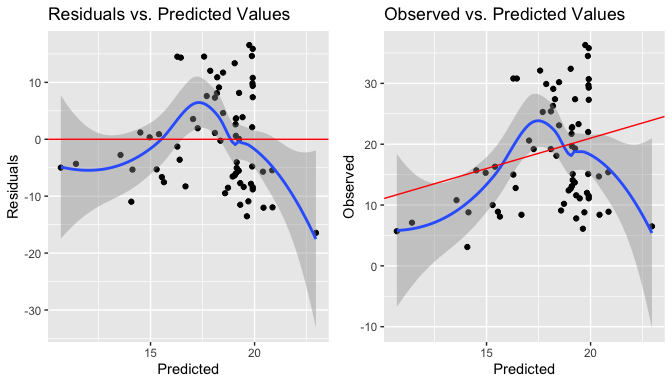

As a robustness check, squaring the main predictor, most common way to
deal with nonlinearity, did not change much this pattern. In this case,
this report takes into consideration that the relationship between
dependent variable and independent variables plus the error term is to a
great extension linear.

    Discrfamily2 <- lm(PRACTICElandacc ~ physicalintegrity + 
                    I(Discrfamily^2), Data)

    summary(Discrfamily2)

Call: lm(formula = PRACTICElandacc ~ physicalintegrity +
I(Discrfamily^2), data = Data)

Residuals: Min 1Q Median 3Q Max -14.469 -6.417 -1.059 6.207 15.745

Coefficients: Estimate Std. Error t value Pr(&gt;|t|)  
(Intercept) 23.7641641 2.1827713 10.887 3.33e-16 \*\*\*
physicalintegrity -0.2101385 0.1252210 -1.678 0.0982 .  
I(Discrfamily^2) -0.0010216 0.0009129 -1.119 0.2673  
— Signif. codes: 0 ‘***’ 0.001 ’**’ 0.01 ’*’ 0.05 ‘.’ 0.1 ’ ’ 1

Residual standard error: 8.375 on 64 degrees of freedom Multiple
R-squared: 0.1432, Adjusted R-squared: 0.1164 F-statistic: 5.348 on 2
and 64 DF, p-value: 0.007113

    plotpreds <- function(Discrfamily2, data = Data){
    p1 <- ggplot(Discrfamily2, aes(.fitted, .resid)) + 
      geom_point() + 
      stat_smooth(method="loess") + 
      geom_hline(yintercept=0, col="red") + 
      xlab("Predicted") + ylab("Residuals") + 
      ggtitle("Residuals vs. Predicted Values")
    df_plt <- data.frame("fitted" = fitted(Discrfamily2), 
                      "observed" = Data$PRACTICElandacc)
    p2 <- ggplot(df_plt, aes(x=fitted, y=observed)) + 
      geom_point() + stat_smooth(method="loess") + 
      geom_abline(intercept = 1, col="red") + 
      xlab("Predicted") + ylab("Observed") + 
      ggtitle("Observed vs. Predicted Values")
    grid.arrange(p1, p2, ncol=2)
    }

    landacc2 <- lm(PRACTICElandacc ~ Discrfamily^2, Data)

    plotpreds(landacc2, Data)

Multicollinearity was checked through the calculation of high variance
inflation factors (VIFs). There seems not to be a problem in this case,
as values are close to 1.

    vif(lm5)

      Discrfamily physicalintegrity 
         1.701102          1.701102 

    t(t(vif(lm5)))

                      [,1]

Discrfamily 1.701102 physicalintegrity 1.701102

    ## no multicollinearity

Checking for endogeneity, we fail to reject the null hypothesis that
gama is zero, meaning that there are no signs of misspecification,
particularly nonlinearity.

    resettest(lm5, type = "fitted")

    RESET test

data: lm5 RESET = 0.19641, df1 = 2, df2 = 62, p-value = 0.8222

Testing correlations between independent variables and residuals with
the Person correlation test demonstrated that there is no evidence of
correlation.

    cor.test(Data$Discrfamily, lm5$residuals)

    Pearson's product-moment correlation

data: Data*D**i**s**c**r**f**a**m**i**l**y**a**n**d**l**m*5residuals t =
-2.053e-17, df = 65, p-value = 1 alternative hypothesis: true
correlation is not equal to 0 95 percent confidence interval: -0.2402086
0.2402086 sample estimates: cor -2.546484e-18

    cor.test(Data$physicalintegrity, lm5$residuals)

    Pearson's product-moment correlation

data:
Data*p**h**y**s**i**c**a**l**i**n**t**e**g**r**i**t**y**a**n**d**l**m*5residuals
t = -2.5546e-16, df = 65, p-value = 1 alternative hypothesis: true
correlation is not equal to 0 95 percent confidence interval: -0.2402086
0.2402086 sample estimates: cor -3.168551e-17

To diagnose autocorrelation, it was used the autocorrelation function
(ACF) plot, by which we can see that there is not really a trend for
autocorrelation.

    ggAcf(lm5$residuals)

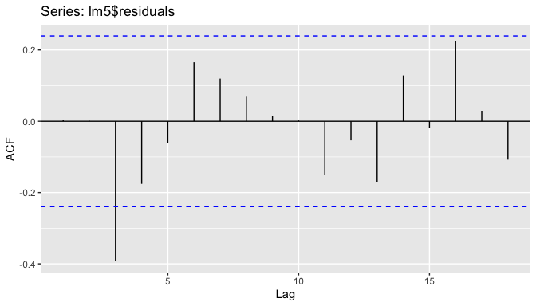

When considering the Wald-Wolfowitz runs test, we fail to reject the
null hypothesis that there are random runs or sequences and, therefore,
assume that the residuals are not autocorrelated.

    runs.test(lm5$residuals)

    Runs Test - Two sided

data: lm5$residuals Standardized Runs Statistic = 0.12497, p-value =
0.9005

Regarding diagnosing normality, the assumption related to it that the
error term should have a population mean of zero is respected, since the
mean in this case is very close to zero.

    mean(lm5$residuals)

\[1\] -3.299049e-16

    ## The mean is very close to zero

The normality probability (QQ) plot appears to have a s-shape pattern,
so further tests were conducted to verify whether normality can be
diagnosed.

    df_resid <- data.frame(resid = lm5$residuals)
    p <- ggplot(df_resid, aes(sample = resid))
    p + stat_qq() + stat_qq_line()

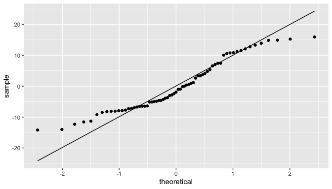

Although some tests used to test whether the residuals were normally
distributed, particularly the Shapiro-Wilk test, presented a P-value
below 0.05, meaning that the null hypothesis that the residuals are
normally distributed would be rejected, this report will take into
consideration the Jarque-Bera test. Even if it is not recognized as the
most powerful normality test, for the purposes and objectives of this
research report, it was considered enough to assume that the errors are
normally distributed, as with the Jarque-Bera test we fail to reject the
null hypothesis that skewness is zero and the excess of kurtosis is also
zero.

    ols_test_normality(lm5)

<table style="width:67%;">
<colgroup>
<col style="width: 66%" />
</colgroup>
<thead>
<tr class="header">
<th style="text-align: center;">Test Statistic pvalue</th>
</tr>
</thead>
<tbody>
<tr class="odd">
<td style="text-align: center;">Shapiro-Wilk 0.9421 0.0037 Kolmogorov-Smirnov 0.1193 0.2735 Cramer-von Mises 5.4782 0.0000 Anderson-Darling 1.3492 0.0016</td>
</tr>
</tbody>
</table>

    jarque.bera.test(lm5$residuals)

    Jarque Bera Test

data: lm5$residuals X-squared = 4.367, df = 2, p-value = 0.1126

    ## normally distributed

When checking the assumption that the error term has equal variance,
which would satisfy the condition of homoscedasticity, the residuals
plot seems to suggest that the residuals grow as a function of fitted
values, forming a cone shape and indicating that there is
heteroskedasticity.

    autoplot(lm5, which = c(1,3))

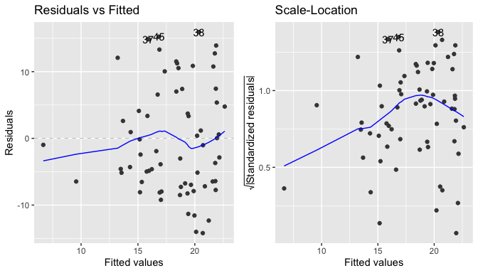

Nevertheless, when running the Breusch-Pagan test, the null hypothesis
that the variance of the residuals is homogenous is not rejected, as the
P-value is greater than 0.05. The condition of homoscedasticity,
therefore, can be accepted.

    bptest(lm5, data = Data, studentize = TRUE)

    studentized Breusch-Pagan test

data: lm5 BP = 3.2227, df = 2, p-value = 0.1996

    ## With bptest, condition of homoskedasticity is satisfied

Outliers were identified as it can be observed in the box plots.

    outlier(Data$PRACTICElandacc)

\[1\] 36.3

    outlier(Data$PRACTICElandacc, opposite = TRUE)

\[1\] 3.1

    ggplot(Data, aes(y = PRACTICElandacc)) + 
      geom_boxplot(outlier.colour = "red")

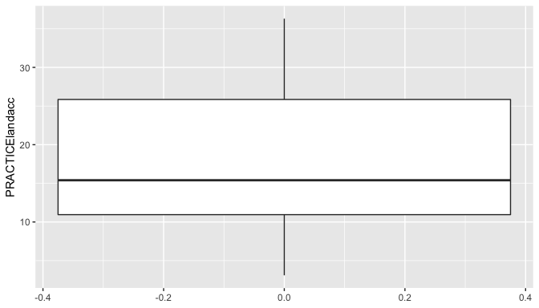

    ggplot(Data, aes(y = Discrfamily)) + 
      geom_boxplot(outlier.colour = "red")

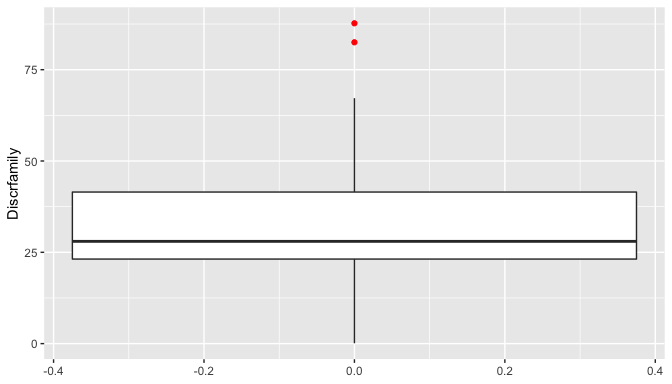

    ggplot(Data, aes(y = physicalintegrity)) + 
      geom_boxplot(outlier.colour = "red")

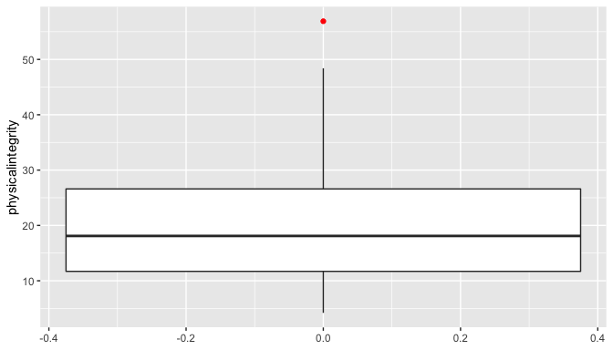

The Cook’s Distance plot shows which observations would impact this
specific chosen regression model if they were deleted, due to their
influence on the predicted outcome. The points with high Cook’s D are 7
(Antigua and Barbuda), 26 (Bhutan) and 36 (Congo).

    gg_cooksd(lm5)

It is possible to observe as well by the dfbeta diagnostic that these
observations are the ones that have a higher leverage and a big
residual.

    gg_resleverage(lm5)

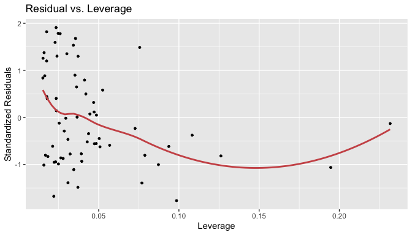

    ols_plot_dfbetas(lm5)

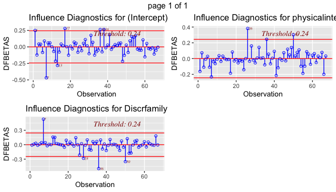

However, as a robustness check, running the model without these
observations demonstrated that there were no meaningful changes, once
the signs and significance remained the same with no major changes in
the coefficient effects. The outliers were, therefore, kept in the
model.

    Data2 <- Data[-c(7,26,36),]

    lm6 <- lm(PRACTICElandacc ~ Discrfamily + physicalintegrity, Data2)

    tab_model(lm5, lm6, dv.labels = c("With Outliers","Without Outliers"))

<table style="border-collapse:collapse; border:none;">
<tr>
<th style="border-top: double; text-align:center; font-style:normal; font-weight:bold; padding:0.2cm;  text-align:left; ">
 
</th>
<th colspan="3" style="border-top: double; text-align:center; font-style:normal; font-weight:bold; padding:0.2cm; ">
With Outliers
</th>
<th colspan="3" style="border-top: double; text-align:center; font-style:normal; font-weight:bold; padding:0.2cm; ">
Without Outliers
</th>
</tr>
<tr>
<td style=" text-align:center; border-bottom:1px solid; font-style:italic; font-weight:normal;  text-align:left; ">
Predictors
</td>
<td style=" text-align:center; border-bottom:1px solid; font-style:italic; font-weight:normal;  ">
Estimates
</td>
<td style=" text-align:center; border-bottom:1px solid; font-style:italic; font-weight:normal;  ">
CI
</td>
<td style=" text-align:center; border-bottom:1px solid; font-style:italic; font-weight:normal;  ">
p
</td>
<td style=" text-align:center; border-bottom:1px solid; font-style:italic; font-weight:normal;  ">
Estimates
</td>
<td style=" text-align:center; border-bottom:1px solid; font-style:italic; font-weight:normal;  ">
CI
</td>
<td style=" text-align:center; border-bottom:1px solid; font-style:italic; font-weight:normal;  col7">
p
</td>
</tr>
<tr>
<td style=" padding:0.2cm; text-align:left; vertical-align:top; text-align:left; ">
(Intercept)
</td>
<td style=" padding:0.2cm; text-align:left; vertical-align:top; text-align:center;  ">
24.39
</td>
<td style=" padding:0.2cm; text-align:left; vertical-align:top; text-align:center;  ">
19.32 – 29.45
</td>
<td style=" padding:0.2cm; text-align:left; vertical-align:top; text-align:center;  ">
<strong>&lt;0.001
</td>
<td style=" padding:0.2cm; text-align:left; vertical-align:top; text-align:center;  ">
25.01
</td>
<td style=" padding:0.2cm; text-align:left; vertical-align:top; text-align:center;  ">
19.72 – 30.31
</td>
<td style=" padding:0.2cm; text-align:left; vertical-align:top; text-align:center;  col7">
<strong>&lt;0.001
</td>
</tr>
<tr>
<td style=" padding:0.2cm; text-align:left; vertical-align:top; text-align:left; ">
Discrfamily
</td>
<td style=" padding:0.2cm; text-align:left; vertical-align:top; text-align:center;  ">
-0.02
</td>
<td style=" padding:0.2cm; text-align:left; vertical-align:top; text-align:center;  ">
-0.19 – 0.15
</td>
<td style=" padding:0.2cm; text-align:left; vertical-align:top; text-align:center;  ">
0.793
</td>
<td style=" padding:0.2cm; text-align:left; vertical-align:top; text-align:center;  ">
-0.01
</td>
<td style=" padding:0.2cm; text-align:left; vertical-align:top; text-align:center;  ">
-0.20 – 0.18
</td>
<td style=" padding:0.2cm; text-align:left; vertical-align:top; text-align:center;  col7">
0.926
</td>
</tr>
<tr>
<td style=" padding:0.2cm; text-align:left; vertical-align:top; text-align:left; ">
physicalintegrity
</td>
<td style=" padding:0.2cm; text-align:left; vertical-align:top; text-align:center;  ">
-0.28
</td>
<td style=" padding:0.2cm; text-align:left; vertical-align:top; text-align:center;  ">
-0.53 – -0.02
</td>
<td style=" padding:0.2cm; text-align:left; vertical-align:top; text-align:center;  ">
<strong>0.034</strong>
</td>
<td style=" padding:0.2cm; text-align:left; vertical-align:top; text-align:center;  ">
-0.32
</td>
<td style=" padding:0.2cm; text-align:left; vertical-align:top; text-align:center;  ">
-0.59 – -0.06
</td>
<td style=" padding:0.2cm; text-align:left; vertical-align:top; text-align:center;  col7">
<strong>0.018</strong>
</td>
</tr>
<tr>
<td style=" padding:0.2cm; text-align:left; vertical-align:top; text-align:left; padding-top:0.1cm; padding-bottom:0.1cm; border-top:1px solid;">
Observations
</td>
<td style=" padding:0.2cm; text-align:left; vertical-align:top; padding-top:0.1cm; padding-bottom:0.1cm; text-align:left; border-top:1px solid;" colspan="3">
67
</td>
<td style=" padding:0.2cm; text-align:left; vertical-align:top; padding-top:0.1cm; padding-bottom:0.1cm; text-align:left; border-top:1px solid;" colspan="3">
64
</td>
</tr>
<tr>
<td style=" padding:0.2cm; text-align:left; vertical-align:top; text-align:left; padding-top:0.1cm; padding-bottom:0.1cm;">
R2 / R2 adjusted
</td>
<td style=" padding:0.2cm; text-align:left; vertical-align:top; padding-top:0.1cm; padding-bottom:0.1cm; text-align:left;" colspan="3">
0.127 / 0.100
</td>
<td style=" padding:0.2cm; text-align:left; vertical-align:top; padding-top:0.1cm; padding-bottom:0.1cm; text-align:left;" colspan="3">
0.158 / 0.130
</td>
</tr>
</table>
    ## no change in significance or sign. 

To a great extent, it was demonstrated that the OLS assumptions were
satisfied, therefore, respecting the Gauss-Markov Theorem, which states
that the OLS is the BLUE – Best (minimizes variance), Linear, Unbiased
(e(B) = B), Estimator – “of populations parameters if errors
uncorrelated with equal variance and a mean of zero” (slides).

## 4. Results {#results}

As mentioned before, lm5 was the model chosen, although the main
predictor, discrimination in the family, is not significant. In this
model, the effect association of this main independent variable was
negative as expected, since the women’s secure access to land in
practice (expressed in percentage of women holding control over land)
decreases as discrimination against women in the family increases.

Compared to the other fitted models used to check robustness (as per
table below), this model was selected not only because it has the
highest adjusted R squared and the smallest AIC, but also for
theoretical reasons. It controlled for the variable restricted physical
integrity (physicalintegrity). Controlling for restricted physical
integrity was important, as vulnerability and control over a woman’s own
body may affect the ability of a woman discriminated by the family to
manage to control de facto over land assets, which is, in its turn, less
explored by the literature.

    tab_model(lm1, lm2, lm3, lm4, lm5, show.aic = TRUE)

<table style="border-collapse:collapse; border:none;">
<tr>
<th style="border-top: double; text-align:center; font-style:normal; font-weight:bold; padding:0.2cm;  text-align:left; ">
 
</th>
<th colspan="3" style="border-top: double; text-align:center; font-style:normal; font-weight:bold; padding:0.2cm; ">
PRACTICElandacc
</th>
<th colspan="3" style="border-top: double; text-align:center; font-style:normal; font-weight:bold; padding:0.2cm; ">
PRACTICElandacc
</th>
<th colspan="3" style="border-top: double; text-align:center; font-style:normal; font-weight:bold; padding:0.2cm; ">
PRACTICElandacc
</th>
<th colspan="3" style="border-top: double; text-align:center; font-style:normal; font-weight:bold; padding:0.2cm; ">
PRACTICElandacc
</th>
<th colspan="3" style="border-top: double; text-align:center; font-style:normal; font-weight:bold; padding:0.2cm; ">
PRACTICElandacc
</th>
</tr>
<tr>
<td style=" text-align:center; border-bottom:1px solid; font-style:italic; font-weight:normal;  text-align:left; ">
Predictors
</td>
<td style=" text-align:center; border-bottom:1px solid; font-style:italic; font-weight:normal;  ">
Estimates
</td>
<td style=" text-align:center; border-bottom:1px solid; font-style:italic; font-weight:normal;  ">
CI
</td>
<td style=" text-align:center; border-bottom:1px solid; font-style:italic; font-weight:normal;  ">
p
</td>
<td style=" text-align:center; border-bottom:1px solid; font-style:italic; font-weight:normal;  ">
Estimates
</td>
<td style=" text-align:center; border-bottom:1px solid; font-style:italic; font-weight:normal;  ">
CI
</td>
<td style=" text-align:center; border-bottom:1px solid; font-style:italic; font-weight:normal;  col7">
p
</td>
<td style=" text-align:center; border-bottom:1px solid; font-style:italic; font-weight:normal;  col8">
Estimates
</td>
<td style=" text-align:center; border-bottom:1px solid; font-style:italic; font-weight:normal;  col9">
CI
</td>
<td style=" text-align:center; border-bottom:1px solid; font-style:italic; font-weight:normal;  0">
p
</td>
<td style=" text-align:center; border-bottom:1px solid; font-style:italic; font-weight:normal;  1">
Estimates
</td>
<td style=" text-align:center; border-bottom:1px solid; font-style:italic; font-weight:normal;  2">
CI
</td>
<td style=" text-align:center; border-bottom:1px solid; font-style:italic; font-weight:normal;  3">
p
</td>
<td style=" text-align:center; border-bottom:1px solid; font-style:italic; font-weight:normal;  4">
Estimates
</td>
<td style=" text-align:center; border-bottom:1px solid; font-style:italic; font-weight:normal;  5">
CI
</td>
<td style=" text-align:center; border-bottom:1px solid; font-style:italic; font-weight:normal;  6">
p
</td>
</tr>
<tr>
<td style=" padding:0.2cm; text-align:left; vertical-align:top; text-align:left; ">
(Intercept)
</td>
<td style=" padding:0.2cm; text-align:left; vertical-align:top; text-align:center;  ">
22.96
</td>
<td style=" padding:0.2cm; text-align:left; vertical-align:top; text-align:center;  ">
17.94 – 27.99
</td>
<td style=" padding:0.2cm; text-align:left; vertical-align:top; text-align:center;  ">
<strong>&lt;0.001
</td>
<td style=" padding:0.2cm; text-align:left; vertical-align:top; text-align:center;  ">
24.28
</td>
<td style=" padding:0.2cm; text-align:left; vertical-align:top; text-align:center;  ">
19.13 – 29.44
</td>
<td style=" padding:0.2cm; text-align:left; vertical-align:top; text-align:center;  col7">
<strong>&lt;0.001
</td>
<td style=" padding:0.2cm; text-align:left; vertical-align:top; text-align:center;  col8">
23.17
</td>
<td style=" padding:0.2cm; text-align:left; vertical-align:top; text-align:center;  col9">
17.72 – 28.63
</td>
<td style=" padding:0.2cm; text-align:left; vertical-align:top; text-align:center;  0">
<strong>&lt;0.001
</td>
<td style=" padding:0.2cm; text-align:left; vertical-align:top; text-align:center;  1">
23.47
</td>
<td style=" padding:0.2cm; text-align:left; vertical-align:top; text-align:center;  2">
18.16 – 28.77
</td>
<td style=" padding:0.2cm; text-align:left; vertical-align:top; text-align:center;  3">
<strong>&lt;0.001
</td>
<td style=" padding:0.2cm; text-align:left; vertical-align:top; text-align:center;  4">
24.39
</td>
<td style=" padding:0.2cm; text-align:left; vertical-align:top; text-align:center;  5">
19.32 – 29.45
</td>
<td style=" padding:0.2cm; text-align:left; vertical-align:top; text-align:center;  6">
<strong>&lt;0.001
</td>
</tr>
<tr>
<td style=" padding:0.2cm; text-align:left; vertical-align:top; text-align:left; ">
Discrfamily
</td>
<td style=" padding:0.2cm; text-align:left; vertical-align:top; text-align:center;  ">
-0.14
</td>
<td style=" padding:0.2cm; text-align:left; vertical-align:top; text-align:center;  ">
-0.27 – -0.01
</td>
<td style=" padding:0.2cm; text-align:left; vertical-align:top; text-align:center;  ">
<strong>0.040</strong>
</td>
<td style=" padding:0.2cm; text-align:left; vertical-align:top; text-align:center;  ">
-0.07
</td>
<td style=" padding:0.2cm; text-align:left; vertical-align:top; text-align:center;  ">
-0.28 – 0.13
</td>
<td style=" padding:0.2cm; text-align:left; vertical-align:top; text-align:center;  col7">
0.492
</td>
<td style=" padding:0.2cm; text-align:left; vertical-align:top; text-align:center;  col8">
-0.03
</td>
<td style=" padding:0.2cm; text-align:left; vertical-align:top; text-align:center;  col9">
-0.24 – 0.19
</td>
<td style=" padding:0.2cm; text-align:left; vertical-align:top; text-align:center;  0">
0.810
</td>
<td style=" padding:0.2cm; text-align:left; vertical-align:top; text-align:center;  1">
0.00
</td>
<td style=" padding:0.2cm; text-align:left; vertical-align:top; text-align:center;  2">
-0.20 – 0.20
</td>
<td style=" padding:0.2cm; text-align:left; vertical-align:top; text-align:center;  3">
0.995
</td>
<td style=" padding:0.2cm; text-align:left; vertical-align:top; text-align:center;  4">
-0.02
</td>
<td style=" padding:0.2cm; text-align:left; vertical-align:top; text-align:center;  5">
-0.19 – 0.15
</td>
<td style=" padding:0.2cm; text-align:left; vertical-align:top; text-align:center;  6">
0.793
</td>
</tr>
<tr>
<td style=" padding:0.2cm; text-align:left; vertical-align:top; text-align:left; ">
financialresources
</td>
<td style=" padding:0.2cm; text-align:left; vertical-align:top; text-align:center;  ">
</td>
<td style=" padding:0.2cm; text-align:left; vertical-align:top; text-align:center;  ">
</td>
<td style=" padding:0.2cm; text-align:left; vertical-align:top; text-align:center;  ">
</td>
<td style=" padding:0.2cm; text-align:left; vertical-align:top; text-align:center;  ">
0.08
</td>
<td style=" padding:0.2cm; text-align:left; vertical-align:top; text-align:center;  ">
-0.10 – 0.26
</td>
<td style=" padding:0.2cm; text-align:left; vertical-align:top; text-align:center;  col7">
0.382
</td>
<td style=" padding:0.2cm; text-align:left; vertical-align:top; text-align:center;  col8">
0.02
</td>
<td style=" padding:0.2cm; text-align:left; vertical-align:top; text-align:center;  col9">
-0.25 – 0.30
</td>
<td style=" padding:0.2cm; text-align:left; vertical-align:top; text-align:center;  0">
0.858
</td>
<td style=" padding:0.2cm; text-align:left; vertical-align:top; text-align:center;  1">
</td>
<td style=" padding:0.2cm; text-align:left; vertical-align:top; text-align:center;  2">
</td>
<td style=" padding:0.2cm; text-align:left; vertical-align:top; text-align:center;  3">
</td>
<td style=" padding:0.2cm; text-align:left; vertical-align:top; text-align:center;  4">
</td>
<td style=" padding:0.2cm; text-align:left; vertical-align:top; text-align:center;  5">
</td>
<td style=" padding:0.2cm; text-align:left; vertical-align:top; text-align:center;  6">
</td>
</tr>
<tr>
<td style=" padding:0.2cm; text-align:left; vertical-align:top; text-align:left; ">
civilliberties
</td>
<td style=" padding:0.2cm; text-align:left; vertical-align:top; text-align:center;  ">
</td>
<td style=" padding:0.2cm; text-align:left; vertical-align:top; text-align:center;  ">
</td>
<td style=" padding:0.2cm; text-align:left; vertical-align:top; text-align:center;  ">
</td>
<td style=" padding:0.2cm; text-align:left; vertical-align:top; text-align:center;  ">
0.02
</td>
<td style=" padding:0.2cm; text-align:left; vertical-align:top; text-align:center;  ">
-0.15 – 0.20
</td>
<td style=" padding:0.2cm; text-align:left; vertical-align:top; text-align:center;  col7">
0.794
</td>
<td style=" padding:0.2cm; text-align:left; vertical-align:top; text-align:center;  col8">
0.05
</td>
<td style=" padding:0.2cm; text-align:left; vertical-align:top; text-align:center;  col9">
-0.13 – 0.24
</td>
<td style=" padding:0.2cm; text-align:left; vertical-align:top; text-align:center;  0">
0.567
</td>
<td style=" padding:0.2cm; text-align:left; vertical-align:top; text-align:center;  1">
</td>
<td style=" padding:0.2cm; text-align:left; vertical-align:top; text-align:center;  2">
</td>
<td style=" padding:0.2cm; text-align:left; vertical-align:top; text-align:center;  3">
</td>
<td style=" padding:0.2cm; text-align:left; vertical-align:top; text-align:center;  4">
</td>
<td style=" padding:0.2cm; text-align:left; vertical-align:top; text-align:center;  5">
</td>
<td style=" padding:0.2cm; text-align:left; vertical-align:top; text-align:center;  6">
</td>
</tr>
<tr>
<td style=" padding:0.2cm; text-align:left; vertical-align:top; text-align:left; ">
physicalintegrity
</td>
<td style=" padding:0.2cm; text-align:left; vertical-align:top; text-align:center;  ">
</td>
<td style=" padding:0.2cm; text-align:left; vertical-align:top; text-align:center;  ">
</td>
<td style=" padding:0.2cm; text-align:left; vertical-align:top; text-align:center;  ">
</td>
<td style=" padding:0.2cm; text-align:left; vertical-align:top; text-align:center;  ">
-0.31
</td>
<td style=" padding:0.2cm; text-align:left; vertical-align:top; text-align:center;  ">
-0.57 – -0.04
</td>
<td style=" padding:0.2cm; text-align:left; vertical-align:top; text-align:center;  col7">
<strong>0.024</strong>
</td>
<td style=" padding:0.2cm; text-align:left; vertical-align:top; text-align:center;  col8">
-0.34
</td>
<td style=" padding:0.2cm; text-align:left; vertical-align:top; text-align:center;  col9">
-0.63 – -0.06
</td>
<td style=" padding:0.2cm; text-align:left; vertical-align:top; text-align:center;  0">
<strong>0.018</strong>
</td>
<td style=" padding:0.2cm; text-align:left; vertical-align:top; text-align:center;  1">
-0.33
</td>
<td style=" padding:0.2cm; text-align:left; vertical-align:top; text-align:center;  2">
-0.60 – -0.06
</td>
<td style=" padding:0.2cm; text-align:left; vertical-align:top; text-align:center;  3">
<strong>0.019</strong>
</td>
<td style=" padding:0.2cm; text-align:left; vertical-align:top; text-align:center;  4">
-0.28
</td>
<td style=" padding:0.2cm; text-align:left; vertical-align:top; text-align:center;  5">
-0.53 – -0.02
</td>
<td style=" padding:0.2cm; text-align:left; vertical-align:top; text-align:center;  6">
<strong>0.034</strong>
</td>
</tr>
<tr>
<td style=" padding:0.2cm; text-align:left; vertical-align:top; text-align:left; ">
LAWlandacc \[0.25\]
</td>
<td style=" padding:0.2cm; text-align:left; vertical-align:top; text-align:center;  ">
</td>
<td style=" padding:0.2cm; text-align:left; vertical-align:top; text-align:center;  ">
</td>
<td style=" padding:0.2cm; text-align:left; vertical-align:top; text-align:center;  ">
</td>
<td style=" padding:0.2cm; text-align:left; vertical-align:top; text-align:center;  ">
</td>
<td style=" padding:0.2cm; text-align:left; vertical-align:top; text-align:center;  ">
</td>
<td style=" padding:0.2cm; text-align:left; vertical-align:top; text-align:center;  col7">
</td>
<td style=" padding:0.2cm; text-align:left; vertical-align:top; text-align:center;  col8">
1.71
</td>
<td style=" padding:0.2cm; text-align:left; vertical-align:top; text-align:center;  col9">
-4.47 – 7.90
</td>
<td style=" padding:0.2cm; text-align:left; vertical-align:top; text-align:center;  0">
0.581
</td>
<td style=" padding:0.2cm; text-align:left; vertical-align:top; text-align:center;  1">
2.24
</td>
<td style=" padding:0.2cm; text-align:left; vertical-align:top; text-align:center;  2">
-2.85 – 7.33
</td>
<td style=" padding:0.2cm; text-align:left; vertical-align:top; text-align:center;  3">
0.382
</td>
<td style=" padding:0.2cm; text-align:left; vertical-align:top; text-align:center;  4">
</td>
<td style=" padding:0.2cm; text-align:left; vertical-align:top; text-align:center;  5">
</td>
<td style=" padding:0.2cm; text-align:left; vertical-align:top; text-align:center;  6">
</td>
</tr>
<tr>
<td style=" padding:0.2cm; text-align:left; vertical-align:top; text-align:left; ">
LAWlandacc \[0.5\]
</td>
<td style=" padding:0.2cm; text-align:left; vertical-align:top; text-align:center;  ">
</td>
<td style=" padding:0.2cm; text-align:left; vertical-align:top; text-align:center;  ">
</td>
<td style=" padding:0.2cm; text-align:left; vertical-align:top; text-align:center;  ">
</td>
<td style=" padding:0.2cm; text-align:left; vertical-align:top; text-align:center;  ">
</td>
<td style=" padding:0.2cm; text-align:left; vertical-align:top; text-align:center;  ">
</td>
<td style=" padding:0.2cm; text-align:left; vertical-align:top; text-align:center;  col7">
</td>
<td style=" padding:0.2cm; text-align:left; vertical-align:top; text-align:center;  col8">
-3.60
</td>
<td style=" padding:0.2cm; text-align:left; vertical-align:top; text-align:center;  col9">
-14.76 – 7.57
</td>
<td style=" padding:0.2cm; text-align:left; vertical-align:top; text-align:center;  0">
0.522
</td>
<td style=" padding:0.2cm; text-align:left; vertical-align:top; text-align:center;  1">
-2.36
</td>
<td style=" padding:0.2cm; text-align:left; vertical-align:top; text-align:center;  2">
-12.03 – 7.30
</td>
<td style=" padding:0.2cm; text-align:left; vertical-align:top; text-align:center;  3">
0.627
</td>
<td style=" padding:0.2cm; text-align:left; vertical-align:top; text-align:center;  4">
</td>
<td style=" padding:0.2cm; text-align:left; vertical-align:top; text-align:center;  5">
</td>
<td style=" padding:0.2cm; text-align:left; vertical-align:top; text-align:center;  6">
</td>
</tr>
<tr>
<td style=" padding:0.2cm; text-align:left; vertical-align:top; text-align:left; ">
LAWlandacc \[0.75\]
</td>
<td style=" padding:0.2cm; text-align:left; vertical-align:top; text-align:center;  ">
</td>
<td style=" padding:0.2cm; text-align:left; vertical-align:top; text-align:center;  ">
</td>
<td style=" padding:0.2cm; text-align:left; vertical-align:top; text-align:center;  ">
</td>
<td style=" padding:0.2cm; text-align:left; vertical-align:top; text-align:center;  ">
</td>
<td style=" padding:0.2cm; text-align:left; vertical-align:top; text-align:center;  ">
</td>
<td style=" padding:0.2cm; text-align:left; vertical-align:top; text-align:center;  col7">
</td>
<td style=" padding:0.2cm; text-align:left; vertical-align:top; text-align:center;  col8">
11.64
</td>
<td style=" padding:0.2cm; text-align:left; vertical-align:top; text-align:center;  col9">
-11.27 – 34.54
</td>
<td style=" padding:0.2cm; text-align:left; vertical-align:top; text-align:center;  0">
0.313
</td>
<td style=" padding:0.2cm; text-align:left; vertical-align:top; text-align:center;  1">
12.58
</td>
<td style=" padding:0.2cm; text-align:left; vertical-align:top; text-align:center;  2">
-4.83 – 29.99
</td>
<td style=" padding:0.2cm; text-align:left; vertical-align:top; text-align:center;  3">
0.154
</td>
<td style=" padding:0.2cm; text-align:left; vertical-align:top; text-align:center;  4">
</td>
<td style=" padding:0.2cm; text-align:left; vertical-align:top; text-align:center;  5">
</td>
<td style=" padding:0.2cm; text-align:left; vertical-align:top; text-align:center;  6">
</td>
</tr>
<tr>
<td style=" padding:0.2cm; text-align:left; vertical-align:top; text-align:left; ">
LAWlandacc \[1\]
</td>
<td style=" padding:0.2cm; text-align:left; vertical-align:top; text-align:center;  ">
</td>
<td style=" padding:0.2cm; text-align:left; vertical-align:top; text-align:center;  ">
</td>
<td style=" padding:0.2cm; text-align:left; vertical-align:top; text-align:center;  ">
</td>
<td style=" padding:0.2cm; text-align:left; vertical-align:top; text-align:center;  ">
</td>
<td style=" padding:0.2cm; text-align:left; vertical-align:top; text-align:center;  ">
</td>
<td style=" padding:0.2cm; text-align:left; vertical-align:top; text-align:center;  col7">
</td>
<td style=" padding:0.2cm; text-align:left; vertical-align:top; text-align:center;  col8">
-1.26
</td>
<td style=" padding:0.2cm; text-align:left; vertical-align:top; text-align:center;  col9">
-19.81 – 17.29
</td>
<td style=" padding:0.2cm; text-align:left; vertical-align:top; text-align:center;  0">
0.892
</td>
<td style=" padding:0.2cm; text-align:left; vertical-align:top; text-align:center;  1">
-0.11
</td>
<td style=" padding:0.2cm; text-align:left; vertical-align:top; text-align:center;  2">
-13.91 – 13.69
</td>
<td style=" padding:0.2cm; text-align:left; vertical-align:top; text-align:center;  3">
0.987
</td>
<td style=" padding:0.2cm; text-align:left; vertical-align:top; text-align:center;  4">
</td>
<td style=" padding:0.2cm; text-align:left; vertical-align:top; text-align:center;  5">
</td>
<td style=" padding:0.2cm; text-align:left; vertical-align:top; text-align:center;  6">
</td>
</tr>
<tr>
<td style=" padding:0.2cm; text-align:left; vertical-align:top; text-align:left; padding-top:0.1cm; padding-bottom:0.1cm; border-top:1px solid;">
Observations
</td>
<td style=" padding:0.2cm; text-align:left; vertical-align:top; padding-top:0.1cm; padding-bottom:0.1cm; text-align:left; border-top:1px solid;" colspan="3">
67
</td>
<td style=" padding:0.2cm; text-align:left; vertical-align:top; padding-top:0.1cm; padding-bottom:0.1cm; text-align:left; border-top:1px solid;" colspan="3">
67
</td>
<td style=" padding:0.2cm; text-align:left; vertical-align:top; padding-top:0.1cm; padding-bottom:0.1cm; text-align:left; border-top:1px solid;" colspan="3">
67
</td>
<td style=" padding:0.2cm; text-align:left; vertical-align:top; padding-top:0.1cm; padding-bottom:0.1cm; text-align:left; border-top:1px solid;" colspan="3">
67
</td>
<td style=" padding:0.2cm; text-align:left; vertical-align:top; padding-top:0.1cm; padding-bottom:0.1cm; text-align:left; border-top:1px solid;" colspan="3">
67
</td>
</tr>
<tr>
<td style=" padding:0.2cm; text-align:left; vertical-align:top; text-align:left; padding-top:0.1cm; padding-bottom:0.1cm;">
R2 / R2 adjusted
</td>
<td style=" padding:0.2cm; text-align:left; vertical-align:top; padding-top:0.1cm; padding-bottom:0.1cm; text-align:left;" colspan="3">
0.063 / 0.049
</td>
<td style=" padding:0.2cm; text-align:left; vertical-align:top; padding-top:0.1cm; padding-bottom:0.1cm; text-align:left;" colspan="3">
0.140 / 0.085
</td>
<td style=" padding:0.2cm; text-align:left; vertical-align:top; padding-top:0.1cm; padding-bottom:0.1cm; text-align:left;" colspan="3">
0.182 / 0.070
</td>
<td style=" padding:0.2cm; text-align:left; vertical-align:top; padding-top:0.1cm; padding-bottom:0.1cm; text-align:left;" colspan="3">
0.177 / 0.094
</td>
<td style=" padding:0.2cm; text-align:left; vertical-align:top; padding-top:0.1cm; padding-bottom:0.1cm; text-align:left;" colspan="3">
0.127 / 0.100
</td>
</tr>
<tr>
<td style=" padding:0.2cm; text-align:left; vertical-align:top; text-align:left; padding-top:0.1cm; padding-bottom:0.1cm;">
AIC
</td>
<td style=" padding:0.2cm; text-align:left; vertical-align:top; padding-top:0.1cm; padding-bottom:0.1cm; text-align:left;" colspan="3">
483.814
</td>
<td style=" padding:0.2cm; text-align:left; vertical-align:top; padding-top:0.1cm; padding-bottom:0.1cm; text-align:left;" colspan="3">
484.082
</td>
<td style=" padding:0.2cm; text-align:left; vertical-align:top; padding-top:0.1cm; padding-bottom:0.1cm; text-align:left;" colspan="3">
488.712
</td>
<td style=" padding:0.2cm; text-align:left; vertical-align:top; padding-top:0.1cm; padding-bottom:0.1cm; text-align:left;" colspan="3">
485.194
</td>
<td style=" padding:0.2cm; text-align:left; vertical-align:top; padding-top:0.1cm; padding-bottom:0.1cm; text-align:left;" colspan="3">
481.077
</td>
</tr>
</table>

With the anova test, it is possible to reject the null hypothesis that
the increase in the model fit – the original model (lm1) by adding the
variable restricted physical integrity – is zero, in favor of the
alternative hypothesis that at least one independent variable has effect
on women’s access to land in practice, confirming that the variable
restricted physical integrity has an explanatory role in the model.

    anova(lm1, lm5)

Analysis of Variance Table

Model 1: PRACTICElandacc ~ Discrfamily Model 2: PRACTICElandacc ~
Discrfamily + physicalintegrity Res.Df RSS Df Sum of Sq F Pr(&gt;F)  
1 65 4906.8  
2 64 4571.8 1 334.92 4.6884 0.0341 \* — Signif. codes: 0 ‘***’ 0.001
’**’ 0.01 ’*’ 0.05 ‘.’ 0.1 ’ ’ 1

## 5. Conclusion {#conclusion}

This report demonstrated that women’s secure access to land in practice
is affected by discrimination of women and girls in the family,
controlling for physical integrity.

The negative effect association shows that in countries where
discrimination against women inside the family reflects a high
percentage, the percentage of women detaining control and use of land
assets decreases, confirming that gendered family structures impact
women’s access to agriculture holdings de facto, reproducing gender
socio-economic inequalities. Controlling for restricted physical
integrity demonstrated that gender-based violence and women’s body
vulnerability also has an impact in these variables association,
constraining women’s secure access to land.

This report recognizes, nevertheless, its limitations. Better accounts
of missing values and normality of the residuals’ distribution should be
considered in the future, in order to improve the model presented in
this study.

## References: {#references}

Agarwal, B. (1994). A field of one’s own: women and land rights in South
Asia. Cambridge: Cambridge University Press.

Deere, C. D., & Leôn, M. (2001). Empowering women: land and property
rights in Latin America. Pittsburgh: Pittsburgh University Press.

Jacobs, S. (2013). Gender, Land and Sexuality: Exploring connections.
International Journal of Politics, Culture, and Society, 27:2, 173-190.

Land Portal website. Social Institutions and Gender Index (2019).
\[online\]. Available at:
<a href="https://landportal.org/book/indicator/oecd-sigi2019sigi" class="uri">https://landportal.org/book/indicator/oecd-sigi2019sigi</a>
(Accessed: 14 April, 2020).

Organization for Economic Cooperation and Development (OECD). OECD Stat
(2019). \[online\]. Available at:
<a href="https://stats.oecd.org/Index.aspx?DataSetCode=GIDDB2019" class="uri">https://stats.oecd.org/Index.aspx?DataSetCode=GIDDB2019</a>
(Accessed: 14 April, 2020).

Social Institutions and Gender Index (SIGI). SIGI results 2019.
\[online\]. Available at:
<a href="https://www.genderindex.org/ranking/" class="uri">https://www.genderindex.org/ranking/</a>
(Accessed: 14 April, 2020).

Swedish International Development Cooperation Agency (Sida). Quick guide
to what and how: increasing women’s access to land. \[online\].
Available at:
<a href="https://www.oecd.org/dac/gender-development/47566053.pdf" class="uri">https://www.oecd.org/dac/gender-development/47566053.pdf</a>
(Accessed: 19 May, 2020).

UN Women, 2013. Realizing women’s rights to land and other productive
resources. UN Women handbook. \[online\]. Available at:
<a href="https://www.unwomen.org/-/media/headquarters/attachments/sections/library/publications/2013/11/ohchr-unwomen-land-rights-handbook-web%20pdf.pdf?la=en&amp;vs=1455" class="uri">https://www.unwomen.org/-/media/headquarters/attachments/sections/library/publications/2013/11/ohchr-unwomen-land-rights-handbook-web%20pdf.pdf?la=en&amp;vs=1455</a>
(Accessed: 19 May, 2020).
