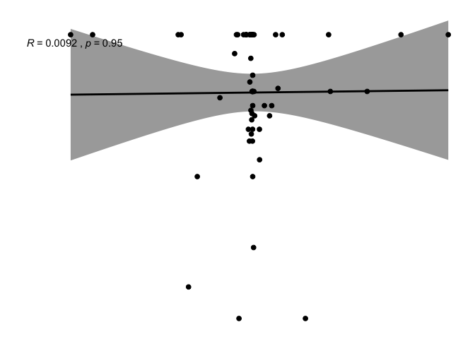
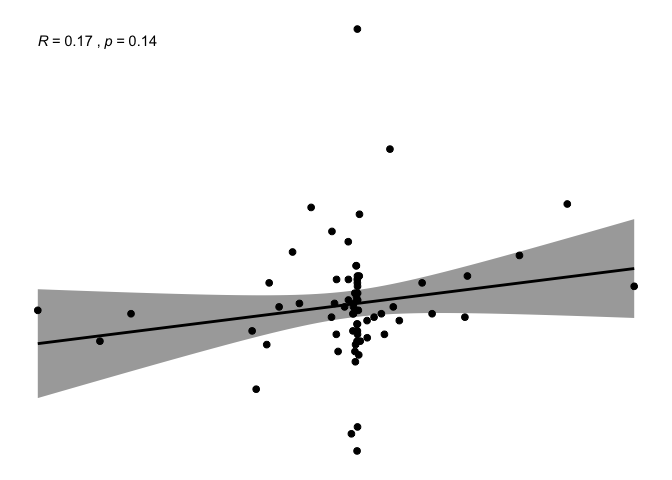

-   [1.Introduction](#introduction)
-   [2.Data](#data)
    -   [Variable of Interest](#variable-of-interest)
    -   [Independent Variables](#independent-variables)
    -   [Treating lagged effects](#treating-lagged-effects)
    -   [Diagnosing and treating missing
        data](#diagnosing-and-treating-missing-data)
-   [3.Method](#method)
    -   [Checking the Gauss-Markov theorem
        assumptions](#checking-the-gauss-markov-theorem-assumptions)
        -   [*Outliers*](#outliers)
        -   [*normality*](#normality)
        -   [*non-linearity*](#non-linearity)
        -   [*checking bias*](#checking-bias)
        -   [*heteroskedasticity*](#heteroskedasticity)
        -   [*multicollinearity*](#multicollinearity)
-   [4.Results](#results)
    -   [*Presentation of the three
        models*](#presentation-of-the-three-models)
    -   [Linear Models Predicting
        Deforestation](#linear-models-predicting-deforestation)
-   [5.Conclusion](#conclusion)

*Data: REDD.dta* This dataset and its indexes have been constructed on
the basis of the data made available by the International Database on
REDD+ projects and programs. Simonet G., Agrawal A., Bénédet F.,
Cromberg M., de Perthuis C., Haggard D., Jansen N., Karsenty A., Liang
W., Newton P., Sales A-M, Schaap B., Seyller C., Vaillant G., (2018)
ID-RECCO, International Database on REDD+ projects and programs, linking
Economic, Carbon and Communities data. version 3.0.
<a href="http://www.reddprojectsdatabase.org" class="uri">http://www.reddprojectsdatabase.org</a>

## 1. Introduction {#introduction}

Over the last twelve years, International Organizations have
increasingly targeted the forests of the Global South as a way to
mitigate climate change. Tropical rainforests are seen as a stabilizing
force for the climate to regulate ecosystems, protect biodiversity and
absorb carbon emissions, but also as a threat for the climate, with
deforestation and land-use change accounting for nearly 20% of all
greenhouse gas emissions — more than the world’s entire transport sector
– adding to the loss of their removal capacity (Karsenty, 2004). This
calculation has strategically shifted the focus of climate mitigation
policies away from northern industrial drivers of carbon emissions to
the global need to save the southern rainforests through both the carbon
market-based financial incentives and governance support programmes.
Initially excluded from the Kyoto Protocol, tropical deforestation is
now a viable object of climate governance, constructed through the
mobilization of expert knowledge on carbon cycle and carbon accounting,
on global land cover change and remote monitoring technologies (Boyd,
2010).

Halting deforestation has become a priority for UN programs, the World
Bank and bilateral cooperation between States. A product of the
trans-nationalization of global environmental politics, the REDD+
(Reducing Emissions from Deforestation and Degradation of Forests) is a
mechanism developed by Parties to the United Nations Framework
Convention on Climate Change (UNFCCC) in 2010. It represents the
political translation of the upsurge of tropical rainforests on the
post-Kyoto climate negotiations scene. By creating a financial value for
the carbon stored in forests and offering incentives for southern
countries to reduce emissions from forested lands and invest in
low-carbon paths to sustainable development, it is a market-based
solution to deforestation, and ultimately to climate change. It revolves
around the idea of financially incentivizing rainforest countries to
avoid deforestation by engaging with northern countries and investors
playing the role of REDD+ funders. The funds are to be channeled through
three main ways: (1) more “business as usual” development grants
programmes offering support through policy and measures to improve
governance capacities at the national level (2) performance-based
payments and payment through the carbon-market targeting specific REDD+
projects, either small-scale or “integrated” in one country’s region.
REDD+ “trade-not-aid” rhetoric has been promoted in many reports, mainly
commissioned by major REDD+ funders such as Norway (Angelsen and al.,
2009), suggesting that it could help southern countries become more
autonomous from development aid.

REDD+ aims at reconciling forest conservation, social development and
market-based logic, three usual antagonists, hence answering the
tripartite dilemma of sustainable development, as market-logics and
foreign direct investments are more often correlated to depletion of
natural resources and incomes (Long, Stretesky, Lynch, 2017).

The underlying question below REDD+ logic revolves under the drivers of
deforestation: what drives deforestation, and how to counter these
drivers? The pendent question I would like to ask here is : “what drives
deforestation reduction?”. No assessment so far of both of REDD+ axis
(development support or project-based support) have been assessed and
compared. Outline research question and main hypotheses (≤3)

This dataset will be used to examine the covariates of the evolution of
the deforestation rate between 2010 and 2015 in REDD+ countries.

What conditions pertaining to either project-based REDD+ support or the
evolution of development indicators can explain the evolution of the
deforestation rate in countries engaged in Reducing their emissions from
deforestation and degradation of forests?

The null hypothesis are : 1/ the more advanced REDD+ project-based
support is, the more deforestation rate would decrease 2/ as the
governance indicators increase, the deforestation rate would decrease 3/
A combination of both REDD+ project-based support and governance
indicators increase would have a higher correlation with a decrease of
deforestation rate

## 2. Data {#data}

This dataset has been created for the sake of this research on the basis
of the data made available by the ID-RECCO, a project from the CIFOR
(Bogor, Indonesia), Climate Economics Chair (Paris-Dauphine university,
France), CIRAD (Montpellier, France) and IFRI (University of Michigan,
United States).

The ID-RECCO database offers data on REDD+ countries and projects
through a series of datasets. The dataset I created for this assignment
combines two of the datasets offered by the ID-RECCO, on the REDD+
countries and one of the REDD+ projects registered in the various
countries. Indexes have been created from different variables in order
to offer a perspective on the evolution of the deforestation rate over
the period between 2010 and 2015.

The unit of analysis is the States involved in REDD+, receiving REDD+
funds and targetted by the program to reduce their deforestation rate.

    library(readxl)
    library(haven)
    library(tidyverse)
    library(dplyr)
    library(ggcorrplot)
    library(qqplotr)
    library(ggpubr)
    library(corrplot)
    library(ggcorrplot)
    library(rmarkdown)
    library(sjPlot)
    library(sjmisc)
    library(sjlabelled)
    library(haven)
    library(ggplot2)
    library(tidyverse)
    library(broom)
    library(dplyr)
    library(stargazer)
    library(ggplot2)
    library(sandwich)
    library(sjPlot)
    library(ggfortify)
    library(ggcorrplot)
    library(car)
    library(margins)
    library(plotROC)
    library(nnet)
    library(plot3logit)
    library(forcats)
    library (sjmisc)
    library(survey)
    library(table1)
    library(rpart)
    library(lmtest)
    library(forecast)
    library(lindia)
    library(car)
    library (outliers)
    library(olsrr)
    library(lawstat)
    library(performance)
    library(see)
    library(DMwR)
    library(gridExtra)
    library(mice)
    library(randomForest)

Here is the dataset:

    #setwd("~/Dropbox/PhD/SPRING 2020/Stats II/Final")
    REDD <- read_excel("REDD.xlsx")
    data("REDD", package = "pscl")
    REDD <- REDD %>%
      mutate(continent = as_factor(continent),
             fund = as_factor(fund))
    REDD$fpic <- REDD$fpic...7
    REDD$part <- REDD$participation...8
    REDD$def <- REDD$deforest_10_15
    REDD$Gov <-  REDD$Goveffectiveness
    summary(REDD)   

deforest\_10\_15 country\_name continent Min. :-4.340280 Length:74
Africa :32  
1st Qu.:-0.124908 Class :character Asia :16  
Median :-0.006446 Mode :character Latin :22  
Mean :-0.082382 Oceania: 4  
3rd Qu.: 0.015512  
Max. : 3.756481

                                  fund         rpp           projects     

Amazon Fund : 1 Min. :0.000 Min. : 0.000  
Congo Basin Forest Fund;FCPF;UNREDD: 3 1st Qu.:0.000 1st Qu.: 1.000  
FCPF : 4 Median :1.000 Median : 3.000  
FCPF;UNREDD :39 Mean :1.932 Mean : 6.311  
No :11 3rd Qu.:4.000 3rd Qu.: 6.750  
UNREDD :16 Max. :6.000 Max. :59.000

    fpic...7       participation...8      IDH               GDPhab      

Min. :0.00000 Min. :0.0000 Min. :-0.02600 Min. :0.6849  
1st Qu.:0.00000 1st Qu.:0.7143 1st Qu.: 0.00900 1st Qu.:1.0183  
Median :0.05556 Median :0.8000 Median : 0.01500 Median :1.0866  
Mean :0.20109 Mean :0.7962 Mean : 0.01679 Mean :1.0869  
3rd Qu.:0.33333 3rd Qu.:1.0000 3rd Qu.: 0.02300 3rd Qu.:1.1571  
Max. :1.00000 Max. :1.0000 Max. : 0.09700 Max. :1.3069  
NA’s :17 NA’s :17 NA’s :1  
Goveffectiveness Corrupt idh\_2011 idh\_2015  
Min. :-0.810000 Min. :-1.92000 Length:74 Min. :0.3520  
1st Qu.:-0.135000 1st Qu.:-0.48000 Class :character 1st Qu.:0.4950  
Median : 0.010000 Median : 0.09000 Mode :character Median :0.5890  
Mean : 0.009459 Mean : 0.02329 Mean :0.6011  
3rd Qu.: 0.150000 3rd Qu.: 0.48000 3rd Qu.:0.7265  
Max. : 0.640000 Max. : 1.71000 Max. :0.8470  
NA’s :1  
gdp\_hab\_2012 gdp\_hab\_2016 deforestation\_rate\_2010 Min. : 236.0
Min. : 218.0 Min. :-6.4537  
1st Qu.: 789.8 1st Qu.: 861.8 1st Qu.:-1.0168  
Median : 1905.0 Median : 2042.0 Median :-0.2847  
Mean : 3545.7 Mean : 3760.6 Mean :-0.4209  
3rd Qu.: 4620.2 3rd Qu.: 4674.5 3rd Qu.: 0.0000  
Max. :16681.0 Max. :16259.0 Max. : 6.0352

deforestation\_rate\_2015 government\_effectiveness\_2011 Min. :-9.5284
Min. :-1.8700  
1st Qu.:-0.8516 1st Qu.:-0.9000  
Median :-0.2013 Median :-0.6000  
Mean :-0.5033 Mean :-0.5256  
3rd Qu.: 0.1535 3rd Qu.:-0.1000  
Max. : 3.0769 Max. : 1.3000  
NA’s :1  
government\_effectiveness\_2016 corruption\_control\_2016
corruption\_control\_2011 Min. :-2.2600 Min. :-1.6100 Length:74  
1st Qu.:-0.8725 1st Qu.:-0.8850 Class :character  
Median :-0.5800 Median :-0.6050 Mode :character  
Mean :-0.5091 Mean :-0.5518  
3rd Qu.:-0.0350 3rd Qu.:-0.3125  
Max. : 1.0200 Max. : 1.3200

rpp\_date id\_country fpic…25 participation…26 Length:74 Min. : 24.0
Min. : 0.000 Min. : 0.000  
Class :character 1st Qu.:178.5 1st Qu.: 0.000 1st Qu.: 0.250  
Mode :character Median :424.0 Median : 0.000 Median : 2.500  
Mean :421.9 Mean : 1.149 Mean : 4.743  
3rd Qu.:607.0 3rd Qu.: 1.750 3rd Qu.: 5.000  
Max. :894.0 Max. :16.000 Max. :33.000

      fpic              part             def                 Gov           

Min. :0.00000 Min. :0.0000 Min. :-4.340280 Min. :-0.810000  
1st Qu.:0.00000 1st Qu.:0.7143 1st Qu.:-0.124908 1st Qu.:-0.135000  
Median :0.05556 Median :0.8000 Median :-0.006446 Median : 0.010000  
Mean :0.20109 Mean :0.7962 Mean :-0.082382 Mean : 0.009459  
3rd Qu.:0.33333 3rd Qu.:1.0000 3rd Qu.: 0.015512 3rd Qu.: 0.150000  
Max. :1.00000 Max. :1.0000 Max. : 3.756481 Max. : 0.640000  
NA’s :17 NA’s :17

    newREDD <- select(REDD, -c(fpic...7, participation...8, Goveffectiveness, idh_2011, idh_2015, fpic...25, participation...26, gdp_hab_2012, gdp_hab_2016, deforestation_rate_2010, deforestation_rate_2015, government_effectiveness_2011, government_effectiveness_2016, corruption_control_2016, corruption_control_2011, deforest_10_15))
    summary(newREDD)  

country\_name continent fund  
Length:74 Africa :32 Amazon Fund : 1  
Class :character Asia :16 Congo Basin Forest Fund;FCPF;UNREDD: 3  
Mode :character Latin :22 FCPF : 4  
Oceania: 4 FCPF;UNREDD :39  
No :11  
UNREDD :16

      rpp           projects           IDH               GDPhab      

Min. :0.000 Min. : 0.000 Min. :-0.02600 Min. :0.6849  
1st Qu.:0.000 1st Qu.: 1.000 1st Qu.: 0.00900 1st Qu.:1.0183  
Median :1.000 Median : 3.000 Median : 0.01500 Median :1.0866  
Mean :1.932 Mean : 6.311 Mean : 0.01679 Mean :1.0869  
3rd Qu.:4.000 3rd Qu.: 6.750 3rd Qu.: 0.02300 3rd Qu.:1.1571  
Max. :6.000 Max. :59.000 Max. : 0.09700 Max. :1.3069  
NA’s :1  
Corrupt rpp\_date id\_country fpic  
Min. :-1.92000 Length:74 Min. : 24.0 Min. :0.00000  
1st Qu.:-0.48000 Class :character 1st Qu.:178.5 1st Qu.:0.00000  
Median : 0.09000 Mode :character Median :424.0 Median :0.05556  
Mean : 0.02329 Mean :421.9 Mean :0.20109  
3rd Qu.: 0.48000 3rd Qu.:607.0 3rd Qu.:0.33333  
Max. : 1.71000 Max. :894.0 Max. :1.00000  
NA’s :1 NA’s :17  
part def Gov  
Min. :0.0000 Min. :-4.340280 Min. :-0.810000  
1st Qu.:0.7143 1st Qu.:-0.124908 1st Qu.:-0.135000  
Median :0.8000 Median :-0.006446 Median : 0.010000  
Mean :0.7962 Mean :-0.082382 Mean : 0.009459  
3rd Qu.:1.0000 3rd Qu.: 0.015512 3rd Qu.: 0.150000  
Max. :1.0000 Max. : 3.756481 Max. : 0.640000  
NA’s :17

We can summarize it in a table with our variables of interests.

    table1::label(newREDD$def) <- "deforestation rate evolution 2010-2015"
    table1::label(newREDD$continent) <- "Continent"
    table1::label(newREDD$fund) <- "Agreement with international REDD+ funds"
    table1::label(newREDD$rpp) <- "Anteriority of RPP"
    table1::label(newREDD$projects) <- "Number of REDD+ projects"
    table1::label(newREDD$fpic) <- "Free Prior Informed Consent index"
    table1::label(newREDD$part) <- "Participatory approaches index"
    table1::label(newREDD$IDH) <- "IDH progress"
    table1::label(newREDD$GDPhab) <- "GDP per capita progress"
    table1::label(newREDD$Gov) <- "Government effectiveness progress"
    table1::label(newREDD$Corrupt) <- "Corruption control progress"
    table1::table1(~continent+fund+rpp+projects+fpic+part+IDH+GDPhab+Gov+Corrupt+def | country_name, data = newREDD)

\[1\] "
<table class="\&quot;Rtable1\&quot;">
<thead>
<tr>
<th class="rowlabel firstrow lastrow">
</th>
<th class="firstrow lastrow">
Angola (N=1)
</th>
<th class="firstrow lastrow">
Argentina (N=1)
</th>
<th class="firstrow lastrow">
Bangladesh (N=1)
</th>
<th class="firstrow lastrow">
Belize (N=1)
</th>
<th class="firstrow lastrow">
Benin (N=1)
</th>
<th class="firstrow lastrow">
Bhutan (N=1)
</th>
<th class="firstrow lastrow">
Bolivia, Plurinational State of (N=1)
</th>
<th class="firstrow lastrow">
Brazil (N=1)
</th>
<th class="firstrow lastrow">
Burkina Faso (N=1)
</th>
<th class="firstrow lastrow">
Burundi (N=1)
</th>
<th class="firstrow lastrow">
C√¥te d’Ivoire (N=1)
</th>
<th class="firstrow lastrow">
Cambodia (N=1)
</th>
<th class="firstrow lastrow">
Cameroon (N=1)
</th>
<th class="firstrow lastrow">
Central African Republic (N=1)
</th>
<th class="firstrow lastrow">
Chad (N=1)
</th>
<th class="firstrow lastrow">
Chile (N=1)
</th>
<th class="firstrow lastrow">
China (N=1)
</th>
<th class="firstrow lastrow">
Colombia (N=1)
</th>
<th class="firstrow lastrow">
Congo (N=1)
</th>
<th class="firstrow lastrow">
Congo, the Democratic Republic of the (N=1)
</th>
<th class="firstrow lastrow">
Costa Rica (N=1)
</th>
<th class="firstrow lastrow">
Ecuador (N=1)
</th>
<th class="firstrow lastrow">
El Salvador (N=1)
</th>
<th class="firstrow lastrow">
Ethiopia (N=1)
</th>
<th class="firstrow lastrow">
Fiji (N=1)
</th>
<th class="firstrow lastrow">
Gabon (N=1)
</th>
<th class="firstrow lastrow">
Ghana (N=1)
</th>
<th class="firstrow lastrow">
Guatemala (N=1)
</th>
<th class="firstrow lastrow">
Guyana (N=1)
</th>
<th class="firstrow lastrow">
Honduras (N=1)
</th>
<th class="firstrow lastrow">
India (N=1)
</th>
<th class="firstrow lastrow">
Indonesia (N=1)
</th>
<th class="firstrow lastrow">
Jamaica (N=1)
</th>
<th class="firstrow lastrow">
Kenya (N=1)
</th>
<th class="firstrow lastrow">
Lao People’s Democratic Republic (N=1)
</th>
<th class="firstrow lastrow">
Liberia (N=1)
</th>
<th class="firstrow lastrow">
Madagascar (N=1)
</th>
<th class="firstrow lastrow">
Malawi (N=1)
</th>
<th class="firstrow lastrow">
Malaysia (N=1)
</th>
<th class="firstrow lastrow">
Mali (N=1)
</th>
<th class="firstrow lastrow">
Mexico (N=1)
</th>
<th class="firstrow lastrow">
Mongolia (N=1)
</th>
<th class="firstrow lastrow">
Mozambique (N=1)
</th>
<th class="firstrow lastrow">
Myanmar (N=1)
</th>
<th class="firstrow lastrow">
Nepal (N=1)
</th>
<th class="firstrow lastrow">
Nicaragua (N=1)
</th>
<th class="firstrow lastrow">
Niger (N=1)
</th>
<th class="firstrow lastrow">
Nigeria (N=1)
</th>
<th class="firstrow lastrow">
Pakistan (N=1)
</th>
<th class="firstrow lastrow">
Panama (N=1)
</th>
<th class="firstrow lastrow">
Papua New Guinea (N=1)
</th>
<th class="firstrow lastrow">
Paraguay (N=1)
</th>
<th class="firstrow lastrow">
Peru (N=1)
</th>
<th class="firstrow lastrow">
Philippines (N=1)
</th>
<th class="firstrow lastrow">
Rwanda (N=1)
</th>
<th class="firstrow lastrow">
Senegal (N=1)
</th>
<th class="firstrow lastrow">
Sierra Leone (N=1)
</th>
<th class="firstrow lastrow">
Solomon Islands (N=1)
</th>
<th class="firstrow lastrow">
South Africa (N=1)
</th>
<th class="firstrow lastrow">
South Sudan (N=1)
</th>
<th class="firstrow lastrow">
Sri Lanka (N=1)
</th>
<th class="firstrow lastrow">
Sudan (N=1)
</th>
<th class="firstrow lastrow">
Suriname (N=1)
</th>
<th class="firstrow lastrow">
Tanzania, United Republic of (N=1)
</th>
<th class="firstrow lastrow">
Thailand (N=1)
</th>
<th class="firstrow lastrow">
Togo (N=1)
</th>
<th class="firstrow lastrow">
Trinidad and Tobago (N=1)
</th>
<th class="firstrow lastrow">
Uganda (N=1)
</th>
<th class="firstrow lastrow">
Uruguay (N=1)
</th>
<th class="firstrow lastrow">
Vanuatu (N=1)
</th>
<th class="firstrow lastrow">
Venezuela, Bolivarian Republic of (N=1)
</th>
<th class="firstrow lastrow">
Viet Nam (N=1)
</th>
<th class="firstrow lastrow">
Zambia (N=1)
</th>
<th class="firstrow lastrow">
Zimbabwe (N=1)
</th>
<th class="firstrow lastrow">
Overall (N=74)
</th>
</tr>
</thead>
<tbody>
<tr>
<td class="rowlabel firstrow">
Continent
</td>
<td class="firstrow">
</td>
<td class="firstrow">
</td>
<td class="firstrow">
</td>
<td class="firstrow">
</td>
<td class="firstrow">
</td>
<td class="firstrow">
</td>
<td class="firstrow">
</td>
<td class="firstrow">
</td>
<td class="firstrow">
</td>
<td class="firstrow">
</td>
<td class="firstrow">
</td>
<td class="firstrow">
</td>
<td class="firstrow">
</td>
<td class="firstrow">
</td>
<td class="firstrow">
</td>
<td class="firstrow">
</td>
<td class="firstrow">
</td>
<td class="firstrow">
</td>
<td class="firstrow">
</td>
<td class="firstrow">
</td>
<td class="firstrow">
</td>
<td class="firstrow">
</td>
<td class="firstrow">
</td>
<td class="firstrow">
</td>
<td class="firstrow">
</td>
<td class="firstrow">
</td>
<td class="firstrow">
</td>
<td class="firstrow">
</td>
<td class="firstrow">
</td>
<td class="firstrow">
</td>
<td class="firstrow">
</td>
<td class="firstrow">
</td>
<td class="firstrow">
</td>
<td class="firstrow">
</td>
<td class="firstrow">
</td>
<td class="firstrow">
</td>
<td class="firstrow">
</td>
<td class="firstrow">
</td>
<td class="firstrow">
</td>
<td class="firstrow">
</td>
<td class="firstrow">
</td>
<td class="firstrow">
</td>
<td class="firstrow">
</td>
<td class="firstrow">
</td>
<td class="firstrow">
</td>
<td class="firstrow">
</td>
<td class="firstrow">
</td>
<td class="firstrow">
</td>
<td class="firstrow">
</td>
<td class="firstrow">
</td>
<td class="firstrow">
</td>
<td class="firstrow">
</td>
<td class="firstrow">
</td>
<td class="firstrow">
</td>
<td class="firstrow">
</td>
<td class="firstrow">
</td>
<td class="firstrow">
</td>
<td class="firstrow">
</td>
<td class="firstrow">
</td>
<td class="firstrow">
</td>
<td class="firstrow">
</td>
<td class="firstrow">
</td>
<td class="firstrow">
</td>
<td class="firstrow">
</td>
<td class="firstrow">
</td>
<td class="firstrow">
</td>
<td class="firstrow">
</td>
<td class="firstrow">
</td>
<td class="firstrow">
</td>
<td class="firstrow">
</td>
<td class="firstrow">
</td>
<td class="firstrow">
</td>
<td class="firstrow">
</td>
<td class="firstrow">
</td>
<td class="firstrow">
</td>
</tr>
<tr>
<td class="rowlabel">
Africa
</td>
<td>
1 (100%)
</td>
<td>
0 (0%)
</td>
<td>
0 (0%)
</td>
<td>
0 (0%)
</td>
<td>
1 (100%)
</td>
<td>
0 (0%)
</td>
<td>
0 (0%)
</td>
<td>
0 (0%)
</td>
<td>
1 (100%)
</td>
<td>
1 (100%)
</td>
<td>
1 (100%)
</td>
<td>
0 (0%)
</td>
<td>
1 (100%)
</td>
<td>
1 (100%)
</td>
<td>
1 (100%)
</td>
<td>
0 (0%)
</td>
<td>
0 (0%)
</td>
<td>
0 (0%)
</td>
<td>
1 (100%)
</td>
<td>
1 (100%)
</td>
<td>
0 (0%)
</td>
<td>
0 (0%)
</td>
<td>
0 (0%)
</td>
<td>
1 (100%)
</td>
<td>
0 (0%)
</td>
<td>
1 (100%)
</td>
<td>
1 (100%)
</td>
<td>
0 (0%)
</td>
<td>
0 (0%)
</td>
<td>
0 (0%)
</td>
<td>
0 (0%)
</td>
<td>
0 (0%)
</td>
<td>
0 (0%)
</td>
<td>
1 (100%)
</td>
<td>
0 (0%)
</td>
<td>
1 (100%)
</td>
<td>
1 (100%)
</td>
<td>
1 (100%)
</td>
<td>
0 (0%)
</td>
<td>
1 (100%)
</td>
<td>
0 (0%)
</td>
<td>
0 (0%)
</td>
<td>
1 (100%)
</td>
<td>
0 (0%)
</td>
<td>
0 (0%)
</td>
<td>
0 (0%)
</td>
<td>
1 (100%)
</td>
<td>
1 (100%)
</td>
<td>
0 (0%)
</td>
<td>
0 (0%)
</td>
<td>
0 (0%)
</td>
<td>
0 (0%)
</td>
<td>
0 (0%)
</td>
<td>
0 (0%)
</td>
<td>
1 (100%)
</td>
<td>
1 (100%)
</td>
<td>
1 (100%)
</td>
<td>
0 (0%)
</td>
<td>
1 (100%)
</td>
<td>
1 (100%)
</td>
<td>
0 (0%)
</td>
<td>
1 (100%)
</td>
<td>
0 (0%)
</td>
<td>
1 (100%)
</td>
<td>
0 (0%)
</td>
<td>
1 (100%)
</td>
<td>
0 (0%)
</td>
<td>
1 (100%)
</td>
<td>
0 (0%)
</td>
<td>
0 (0%)
</td>
<td>
0 (0%)
</td>
<td>
0 (0%)
</td>
<td>
1 (100%)
</td>
<td>
1 (100%)
</td>
<td>
32 (43.2%)
</td>
</tr>
<tr>
<td class="rowlabel">
Asia
</td>
<td>
0 (0%)
</td>
<td>
0 (0%)
</td>
<td>
1 (100%)
</td>
<td>
0 (0%)
</td>
<td>
0 (0%)
</td>
<td>
1 (100%)
</td>
<td>
0 (0%)
</td>
<td>
0 (0%)
</td>
<td>
0 (0%)
</td>
<td>
0 (0%)
</td>
<td>
0 (0%)
</td>
<td>
1 (100%)
</td>
<td>
0 (0%)
</td>
<td>
0 (0%)
</td>
<td>
0 (0%)
</td>
<td>
0 (0%)
</td>
<td>
1 (100%)
</td>
<td>
0 (0%)
</td>
<td>
0 (0%)
</td>
<td>
0 (0%)
</td>
<td>
0 (0%)
</td>
<td>
0 (0%)
</td>
<td>
0 (0%)
</td>
<td>
0 (0%)
</td>
<td>
0 (0%)
</td>
<td>
0 (0%)
</td>
<td>
0 (0%)
</td>
<td>
0 (0%)
</td>
<td>
0 (0%)
</td>
<td>
0 (0%)
</td>
<td>
1 (100%)
</td>
<td>
1 (100%)
</td>
<td>
0 (0%)
</td>
<td>
0 (0%)
</td>
<td>
1 (100%)
</td>
<td>
0 (0%)
</td>
<td>
0 (0%)
</td>
<td>
0 (0%)
</td>
<td>
1 (100%)
</td>
<td>
0 (0%)
</td>
<td>
0 (0%)
</td>
<td>
1 (100%)
</td>
<td>
0 (0%)
</td>
<td>
1 (100%)
</td>
<td>
1 (100%)
</td>
<td>
0 (0%)
</td>
<td>
0 (0%)
</td>
<td>
0 (0%)
</td>
<td>
1 (100%)
</td>
<td>
0 (0%)
</td>
<td>
0 (0%)
</td>
<td>
0 (0%)
</td>
<td>
0 (0%)
</td>
<td>
1 (100%)
</td>
<td>
0 (0%)
</td>
<td>
0 (0%)
</td>
<td>
0 (0%)
</td>
<td>
0 (0%)
</td>
<td>
0 (0%)
</td>
<td>
0 (0%)
</td>
<td>
1 (100%)
</td>
<td>
0 (0%)
</td>
<td>
0 (0%)
</td>
<td>
0 (0%)
</td>
<td>
1 (100%)
</td>
<td>
0 (0%)
</td>
<td>
0 (0%)
</td>
<td>
0 (0%)
</td>
<td>
0 (0%)
</td>
<td>
0 (0%)
</td>
<td>
0 (0%)
</td>
<td>
1 (100%)
</td>
<td>
0 (0%)
</td>
<td>
0 (0%)
</td>
<td>
16 (21.6%)
</td>
</tr>
<tr>
<td class="rowlabel">
Latin
</td>
<td>
0 (0%)
</td>
<td>
1 (100%)
</td>
<td>
0 (0%)
</td>
<td>
1 (100%)
</td>
<td>
0 (0%)
</td>
<td>
0 (0%)
</td>
<td>
1 (100%)
</td>
<td>
1 (100%)
</td>
<td>
0 (0%)
</td>
<td>
0 (0%)
</td>
<td>
0 (0%)
</td>
<td>
0 (0%)
</td>
<td>
0 (0%)
</td>
<td>
0 (0%)
</td>
<td>
0 (0%)
</td>
<td>
1 (100%)
</td>
<td>
0 (0%)
</td>
<td>
1 (100%)
</td>
<td>
0 (0%)
</td>
<td>
0 (0%)
</td>
<td>
1 (100%)
</td>
<td>
1 (100%)
</td>
<td>
1 (100%)
</td>
<td>
0 (0%)
</td>
<td>
0 (0%)
</td>
<td>
0 (0%)
</td>
<td>
0 (0%)
</td>
<td>
1 (100%)
</td>
<td>
1 (100%)
</td>
<td>
1 (100%)
</td>
<td>
0 (0%)
</td>
<td>
0 (0%)
</td>
<td>
1 (100%)
</td>
<td>
0 (0%)
</td>
<td>
0 (0%)
</td>
<td>
0 (0%)
</td>
<td>
0 (0%)
</td>
<td>
0 (0%)
</td>
<td>
0 (0%)
</td>
<td>
0 (0%)
</td>
<td>
1 (100%)
</td>
<td>
0 (0%)
</td>
<td>
0 (0%)
</td>
<td>
0 (0%)
</td>
<td>
0 (0%)
</td>
<td>
1 (100%)
</td>
<td>
0 (0%)
</td>
<td>
0 (0%)
</td>
<td>
0 (0%)
</td>
<td>
1 (100%)
</td>
<td>
0 (0%)
</td>
<td>
1 (100%)
</td>
<td>
1 (100%)
</td>
<td>
0 (0%)
</td>
<td>
0 (0%)
</td>
<td>
0 (0%)
</td>
<td>
0 (0%)
</td>
<td>
0 (0%)
</td>
<td>
0 (0%)
</td>
<td>
0 (0%)
</td>
<td>
0 (0%)
</td>
<td>
0 (0%)
</td>
<td>
1 (100%)
</td>
<td>
0 (0%)
</td>
<td>
0 (0%)
</td>
<td>
0 (0%)
</td>
<td>
1 (100%)
</td>
<td>
0 (0%)
</td>
<td>
1 (100%)
</td>
<td>
0 (0%)
</td>
<td>
1 (100%)
</td>
<td>
0 (0%)
</td>
<td>
0 (0%)
</td>
<td>
0 (0%)
</td>
<td>
22 (29.7%)
</td>
</tr>
<tr>
<td class="rowlabel lastrow">
Oceania
</td>
<td class="lastrow">
0 (0%)
</td>
<td class="lastrow">
0 (0%)
</td>
<td class="lastrow">
0 (0%)
</td>
<td class="lastrow">
0 (0%)
</td>
<td class="lastrow">
0 (0%)
</td>
<td class="lastrow">
0 (0%)
</td>
<td class="lastrow">
0 (0%)
</td>
<td class="lastrow">
0 (0%)
</td>
<td class="lastrow">
0 (0%)
</td>
<td class="lastrow">
0 (0%)
</td>
<td class="lastrow">
0 (0%)
</td>
<td class="lastrow">
0 (0%)
</td>
<td class="lastrow">
0 (0%)
</td>
<td class="lastrow">
0 (0%)
</td>
<td class="lastrow">
0 (0%)
</td>
<td class="lastrow">
0 (0%)
</td>
<td class="lastrow">
0 (0%)
</td>
<td class="lastrow">
0 (0%)
</td>
<td class="lastrow">
0 (0%)
</td>
<td class="lastrow">
0 (0%)
</td>
<td class="lastrow">
0 (0%)
</td>
<td class="lastrow">
0 (0%)
</td>
<td class="lastrow">
0 (0%)
</td>
<td class="lastrow">
0 (0%)
</td>
<td class="lastrow">
1 (100%)
</td>
<td class="lastrow">
0 (0%)
</td>
<td class="lastrow">
0 (0%)
</td>
<td class="lastrow">
0 (0%)
</td>
<td class="lastrow">
0 (0%)
</td>
<td class="lastrow">
0 (0%)
</td>
<td class="lastrow">
0 (0%)
</td>
<td class="lastrow">
0 (0%)
</td>
<td class="lastrow">
0 (0%)
</td>
<td class="lastrow">
0 (0%)
</td>
<td class="lastrow">
0 (0%)
</td>
<td class="lastrow">
0 (0%)
</td>
<td class="lastrow">
0 (0%)
</td>
<td class="lastrow">
0 (0%)
</td>
<td class="lastrow">
0 (0%)
</td>
<td class="lastrow">
0 (0%)
</td>
<td class="lastrow">
0 (0%)
</td>
<td class="lastrow">
0 (0%)
</td>
<td class="lastrow">
0 (0%)
</td>
<td class="lastrow">
0 (0%)
</td>
<td class="lastrow">
0 (0%)
</td>
<td class="lastrow">
0 (0%)
</td>
<td class="lastrow">
0 (0%)
</td>
<td class="lastrow">
0 (0%)
</td>
<td class="lastrow">
0 (0%)
</td>
<td class="lastrow">
0 (0%)
</td>
<td class="lastrow">
1 (100%)
</td>
<td class="lastrow">
0 (0%)
</td>
<td class="lastrow">
0 (0%)
</td>
<td class="lastrow">
0 (0%)
</td>
<td class="lastrow">
0 (0%)
</td>
<td class="lastrow">
0 (0%)
</td>
<td class="lastrow">
0 (0%)
</td>
<td class="lastrow">
1 (100%)
</td>
<td class="lastrow">
0 (0%)
</td>
<td class="lastrow">
0 (0%)
</td>
<td class="lastrow">
0 (0%)
</td>
<td class="lastrow">
0 (0%)
</td>
<td class="lastrow">
0 (0%)
</td>
<td class="lastrow">
0 (0%)
</td>
<td class="lastrow">
0 (0%)
</td>
<td class="lastrow">
0 (0%)
</td>
<td class="lastrow">
0 (0%)
</td>
<td class="lastrow">
0 (0%)
</td>
<td class="lastrow">
0 (0%)
</td>
<td class="lastrow">
1 (100%)
</td>
<td class="lastrow">
0 (0%)
</td>
<td class="lastrow">
0 (0%)
</td>
<td class="lastrow">
0 (0%)
</td>
<td class="lastrow">
0 (0%)
</td>
<td class="lastrow">
4 (5.4%)
</td>
</tr>
<tr>
<td class="rowlabel firstrow">
Agreement with international REDD+ funds
</td>
<td class="firstrow">
</td>
<td class="firstrow">
</td>
<td class="firstrow">
</td>
<td class="firstrow">
</td>
<td class="firstrow">
</td>
<td class="firstrow">
</td>
<td class="firstrow">
</td>
<td class="firstrow">
</td>
<td class="firstrow">
</td>
<td class="firstrow">
</td>
<td class="firstrow">
</td>
<td class="firstrow">
</td>
<td class="firstrow">
</td>
<td class="firstrow">
</td>
<td class="firstrow">
</td>
<td class="firstrow">
</td>
<td class="firstrow">
</td>
<td class="firstrow">
</td>
<td class="firstrow">
</td>
<td class="firstrow">
</td>
<td class="firstrow">
</td>
<td class="firstrow">
</td>
<td class="firstrow">
</td>
<td class="firstrow">
</td>
<td class="firstrow">
</td>
<td class="firstrow">
</td>
<td class="firstrow">
</td>
<td class="firstrow">
</td>
<td class="firstrow">
</td>
<td class="firstrow">
</td>
<td class="firstrow">
</td>
<td class="firstrow">
</td>
<td class="firstrow">
</td>
<td class="firstrow">
</td>
<td class="firstrow">
</td>
<td class="firstrow">
</td>
<td class="firstrow">
</td>
<td class="firstrow">
</td>
<td class="firstrow">
</td>
<td class="firstrow">
</td>
<td class="firstrow">
</td>
<td class="firstrow">
</td>
<td class="firstrow">
</td>
<td class="firstrow">
</td>
<td class="firstrow">
</td>
<td class="firstrow">
</td>
<td class="firstrow">
</td>
<td class="firstrow">
</td>
<td class="firstrow">
</td>
<td class="firstrow">
</td>
<td class="firstrow">
</td>
<td class="firstrow">
</td>
<td class="firstrow">
</td>
<td class="firstrow">
</td>
<td class="firstrow">
</td>
<td class="firstrow">
</td>
<td class="firstrow">
</td>
<td class="firstrow">
</td>
<td class="firstrow">
</td>
<td class="firstrow">
</td>
<td class="firstrow">
</td>
<td class="firstrow">
</td>
<td class="firstrow">
</td>
<td class="firstrow">
</td>
<td class="firstrow">
</td>
<td class="firstrow">
</td>
<td class="firstrow">
</td>
<td class="firstrow">
</td>
<td class="firstrow">
</td>
<td class="firstrow">
</td>
<td class="firstrow">
</td>
<td class="firstrow">
</td>
<td class="firstrow">
</td>
<td class="firstrow">
</td>
<td class="firstrow">
</td>
</tr>
<tr>
<td class="rowlabel">
Amazon Fund
</td>
<td>
0 (0%)
</td>
<td>
0 (0%)
</td>
<td>
0 (0%)
</td>
<td>
0 (0%)
</td>
<td>
0 (0%)
</td>
<td>
0 (0%)
</td>
<td>
0 (0%)
</td>
<td>
1 (100%)
</td>
<td>
0 (0%)
</td>
<td>
0 (0%)
</td>
<td>
0 (0%)
</td>
<td>
0 (0%)
</td>
<td>
0 (0%)
</td>
<td>
0 (0%)
</td>
<td>
0 (0%)
</td>
<td>
0 (0%)
</td>
<td>
0 (0%)
</td>
<td>
0 (0%)
</td>
<td>
0 (0%)
</td>
<td>
0 (0%)
</td>
<td>
0 (0%)
</td>
<td>
0 (0%)
</td>
<td>
0 (0%)
</td>
<td>
0 (0%)
</td>
<td>
0 (0%)
</td>
<td>
0 (0%)
</td>
<td>
0 (0%)
</td>
<td>
0 (0%)
</td>
<td>
0 (0%)
</td>
<td>
0 (0%)
</td>
<td>
0 (0%)
</td>
<td>
0 (0%)
</td>
<td>
0 (0%)
</td>
<td>
0 (0%)
</td>
<td>
0 (0%)
</td>
<td>
0 (0%)
</td>
<td>
0 (0%)
</td>
<td>
0 (0%)
</td>
<td>
0 (0%)
</td>
<td>
0 (0%)
</td>
<td>
0 (0%)
</td>
<td>
0 (0%)
</td>
<td>
0 (0%)
</td>
<td>
0 (0%)
</td>
<td>
0 (0%)
</td>
<td>
0 (0%)
</td>
<td>
0 (0%)
</td>
<td>
0 (0%)
</td>
<td>
0 (0%)
</td>
<td>
0 (0%)
</td>
<td>
0 (0%)
</td>
<td>
0 (0%)
</td>
<td>
0 (0%)
</td>
<td>
0 (0%)
</td>
<td>
0 (0%)
</td>
<td>
0 (0%)
</td>
<td>
0 (0%)
</td>
<td>
0 (0%)
</td>
<td>
0 (0%)
</td>
<td>
0 (0%)
</td>
<td>
0 (0%)
</td>
<td>
0 (0%)
</td>
<td>
0 (0%)
</td>
<td>
0 (0%)
</td>
<td>
0 (0%)
</td>
<td>
0 (0%)
</td>
<td>
0 (0%)
</td>
<td>
0 (0%)
</td>
<td>
0 (0%)
</td>
<td>
0 (0%)
</td>
<td>
0 (0%)
</td>
<td>
0 (0%)
</td>
<td>
0 (0%)
</td>
<td>
0 (0%)
</td>
<td>
1 (1.4%)
</td>
</tr>
<tr>
<td class="rowlabel">
Congo Basin Forest Fund;FCPF;UNREDD
</td>
<td>
0 (0%)
</td>
<td>
0 (0%)
</td>
<td>
0 (0%)
</td>
<td>
0 (0%)
</td>
<td>
0 (0%)
</td>
<td>
0 (0%)
</td>
<td>
0 (0%)
</td>
<td>
0 (0%)
</td>
<td>
0 (0%)
</td>
<td>
0 (0%)
</td>
<td>
0 (0%)
</td>
<td>
0 (0%)
</td>
<td>
1 (100%)
</td>
<td>
0 (0%)
</td>
<td>
0 (0%)
</td>
<td>
0 (0%)
</td>
<td>
0 (0%)
</td>
<td>
0 (0%)
</td>
<td>
0 (0%)
</td>
<td>
1 (100%)
</td>
<td>
0 (0%)
</td>
<td>
0 (0%)
</td>
<td>
0 (0%)
</td>
<td>
0 (0%)
</td>
<td>
0 (0%)
</td>
<td>
1 (100%)
</td>
<td>
0 (0%)
</td>
<td>
0 (0%)
</td>
<td>
0 (0%)
</td>
<td>
0 (0%)
</td>
<td>
0 (0%)
</td>
<td>
0 (0%)
</td>
<td>
0 (0%)
</td>
<td>
0 (0%)
</td>
<td>
0 (0%)
</td>
<td>
0 (0%)
</td>
<td>
0 (0%)
</td>
<td>
0 (0%)
</td>
<td>
0 (0%)
</td>
<td>
0 (0%)
</td>
<td>
0 (0%)
</td>
<td>
0 (0%)
</td>
<td>
0 (0%)
</td>
<td>
0 (0%)
</td>
<td>
0 (0%)
</td>
<td>
0 (0%)
</td>
<td>
0 (0%)
</td>
<td>
0 (0%)
</td>
<td>
0 (0%)
</td>
<td>
0 (0%)
</td>
<td>
0 (0%)
</td>
<td>
0 (0%)
</td>
<td>
0 (0%)
</td>
<td>
0 (0%)
</td>
<td>
0 (0%)
</td>
<td>
0 (0%)
</td>
<td>
0 (0%)
</td>
<td>
0 (0%)
</td>
<td>
0 (0%)
</td>
<td>
0 (0%)
</td>
<td>
0 (0%)
</td>
<td>
0 (0%)
</td>
<td>
0 (0%)
</td>
<td>
0 (0%)
</td>
<td>
0 (0%)
</td>
<td>
0 (0%)
</td>
<td>
0 (0%)
</td>
<td>
0 (0%)
</td>
<td>
0 (0%)
</td>
<td>
0 (0%)
</td>
<td>
0 (0%)
</td>
<td>
0 (0%)
</td>
<td>
0 (0%)
</td>
<td>
0 (0%)
</td>
<td>
3 (4.1%)
</td>
</tr>
<tr>
<td class="rowlabel">
FCPF
</td>
<td>
0 (0%)
</td>
<td>
0 (0%)
</td>
<td>
0 (0%)
</td>
<td>
1 (100%)
</td>
<td>
0 (0%)
</td>
<td>
0 (0%)
</td>
<td>
0 (0%)
</td>
<td>
0 (0%)
</td>
<td>
0 (0%)
</td>
<td>
0 (0%)
</td>
<td>
0 (0%)
</td>
<td>
0 (0%)
</td>
<td>
0 (0%)
</td>
<td>
0 (0%)
</td>
<td>
0 (0%)
</td>
<td>
0 (0%)
</td>
<td>
0 (0%)
</td>
<td>
0 (0%)
</td>
<td>
0 (0%)
</td>
<td>
0 (0%)
</td>
<td>
0 (0%)
</td>
<td>
0 (0%)
</td>
<td>
0 (0%)
</td>
<td>
0 (0%)
</td>
<td>
0 (0%)
</td>
<td>
0 (0%)
</td>
<td>
0 (0%)
</td>
<td>
0 (0%)
</td>
<td>
0 (0%)
</td>
<td>
0 (0%)
</td>
<td>
0 (0%)
</td>
<td>
0 (0%)
</td>
<td>
0 (0%)
</td>
<td>
0 (0%)
</td>
<td>
0 (0%)
</td>
<td>
0 (0%)
</td>
<td>
0 (0%)
</td>
<td>
0 (0%)
</td>
<td>
0 (0%)
</td>
<td>
0 (0%)
</td>
<td>
0 (0%)
</td>
<td>
0 (0%)
</td>
<td>
0 (0%)
</td>
<td>
0 (0%)
</td>
<td>
0 (0%)
</td>
<td>
1 (100%)
</td>
<td>
0 (0%)
</td>
<td>
0 (0%)
</td>
<td>
0 (0%)
</td>
<td>
0 (0%)
</td>
<td>
0 (0%)
</td>
<td>
0 (0%)
</td>
<td>
0 (0%)
</td>
<td>
0 (0%)
</td>
<td>
0 (0%)
</td>
<td>
0 (0%)
</td>
<td>
0 (0%)
</td>
<td>
0 (0%)
</td>
<td>
0 (0%)
</td>
<td>
0 (0%)
</td>
<td>
0 (0%)
</td>
<td>
0 (0%)
</td>
<td>
0 (0%)
</td>
<td>
0 (0%)
</td>
<td>
1 (100%)
</td>
<td>
0 (0%)
</td>
<td>
0 (0%)
</td>
<td>
0 (0%)
</td>
<td>
1 (100%)
</td>
<td>
0 (0%)
</td>
<td>
0 (0%)
</td>
<td>
0 (0%)
</td>
<td>
0 (0%)
</td>
<td>
0 (0%)
</td>
<td>
4 (5.4%)
</td>
</tr>
<tr>
<td class="rowlabel">
FCPF;UNREDD
</td>
<td>
0 (0%)
</td>
<td>
1 (100%)
</td>
<td>
0 (0%)
</td>
<td>
0 (0%)
</td>
<td>
0 (0%)
</td>
<td>
1 (100%)
</td>
<td>
1 (100%)
</td>
<td>
0 (0%)
</td>
<td>
1 (100%)
</td>
<td>
0 (0%)
</td>
<td>
1 (100%)
</td>
<td>
1 (100%)
</td>
<td>
0 (0%)
</td>
<td>
1 (100%)
</td>
<td>
0 (0%)
</td>
<td>
1 (100%)
</td>
<td>
0 (0%)
</td>
<td>
1 (100%)
</td>
<td>
1 (100%)
</td>
<td>
0 (0%)
</td>
<td>
1 (100%)
</td>
<td>
0 (0%)
</td>
<td>
1 (100%)
</td>
<td>
1 (100%)
</td>
<td>
1 (100%)
</td>
<td>
0 (0%)
</td>
<td>
1 (100%)
</td>
<td>
1 (100%)
</td>
<td>
1 (100%)
</td>
<td>
1 (100%)
</td>
<td>
0 (0%)
</td>
<td>
1 (100%)
</td>
<td>
0 (0%)
</td>
<td>
1 (100%)
</td>
<td>
1 (100%)
</td>
<td>
1 (100%)
</td>
<td>
1 (100%)
</td>
<td>
0 (0%)
</td>
<td>
0 (0%)
</td>
<td>
0 (0%)
</td>
<td>
1 (100%)
</td>
<td>
0 (0%)
</td>
<td>
1 (100%)
</td>
<td>
0 (0%)
</td>
<td>
1 (100%)
</td>
<td>
0 (0%)
</td>
<td>
0 (0%)
</td>
<td>
1 (100%)
</td>
<td>
1 (100%)
</td>
<td>
1 (100%)
</td>
<td>
1 (100%)
</td>
<td>
1 (100%)
</td>
<td>
1 (100%)
</td>
<td>
0 (0%)
</td>
<td>
0 (0%)
</td>
<td>
0 (0%)
</td>
<td>
0 (0%)
</td>
<td>
0 (0%)
</td>
<td>
0 (0%)
</td>
<td>
0 (0%)
</td>
<td>
0 (0%)
</td>
<td>
1 (100%)
</td>
<td>
1 (100%)
</td>
<td>
1 (100%)
</td>
<td>
0 (0%)
</td>
<td>
1 (100%)
</td>
<td>
0 (0%)
</td>
<td>
1 (100%)
</td>
<td>
0 (0%)
</td>
<td>
1 (100%)
</td>
<td>
0 (0%)
</td>
<td>
1 (100%)
</td>
<td>
0 (0%)
</td>
<td>
0 (0%)
</td>
<td>
39 (52.7%)
</td>
</tr>
<tr>
<td class="rowlabel">
No
</td>
<td>
1 (100%)
</td>
<td>
0 (0%)
</td>
<td>
0 (0%)
</td>
<td>
0 (0%)
</td>
<td>
0 (0%)
</td>
<td>
0 (0%)
</td>
<td>
0 (0%)
</td>
<td>
0 (0%)
</td>
<td>
0 (0%)
</td>
<td>
1 (100%)
</td>
<td>
0 (0%)
</td>
<td>
0 (0%)
</td>
<td>
0 (0%)
</td>
<td>
0 (0%)
</td>
<td>
0 (0%)
</td>
<td>
0 (0%)
</td>
<td>
1 (100%)
</td>
<td>
0 (0%)
</td>
<td>
0 (0%)
</td>
<td>
0 (0%)
</td>
<td>
0 (0%)
</td>
<td>
0 (0%)
</td>
<td>
0 (0%)
</td>
<td>
0 (0%)
</td>
<td>
0 (0%)
</td>
<td>
0 (0%)
</td>
<td>
0 (0%)
</td>
<td>
0 (0%)
</td>
<td>
0 (0%)
</td>
<td>
0 (0%)
</td>
<td>
0 (0%)
</td>
<td>
0 (0%)
</td>
<td>
0 (0%)
</td>
<td>
0 (0%)
</td>
<td>
0 (0%)
</td>
<td>
0 (0%)
</td>
<td>
0 (0%)
</td>
<td>
0 (0%)
</td>
<td>
0 (0%)
</td>
<td>
1 (100%)
</td>
<td>
0 (0%)
</td>
<td>
0 (0%)
</td>
<td>
0 (0%)
</td>
<td>
0 (0%)
</td>
<td>
0 (0%)
</td>
<td>
0 (0%)
</td>
<td>
1 (100%)
</td>
<td>
0 (0%)
</td>
<td>
0 (0%)
</td>
<td>
0 (0%)
</td>
<td>
0 (0%)
</td>
<td>
0 (0%)
</td>
<td>
0 (0%)
</td>
<td>
0 (0%)
</td>
<td>
1 (100%)
</td>
<td>
1 (100%)
</td>
<td>
1 (100%)
</td>
<td>
0 (0%)
</td>
<td>
1 (100%)
</td>
<td>
0 (0%)
</td>
<td>
0 (0%)
</td>
<td>
0 (0%)
</td>
<td>
0 (0%)
</td>
<td>
0 (0%)
</td>
<td>
0 (0%)
</td>
<td>
0 (0%)
</td>
<td>
1 (100%)
</td>
<td>
0 (0%)
</td>
<td>
0 (0%)
</td>
<td>
0 (0%)
</td>
<td>
1 (100%)
</td>
<td>
0 (0%)
</td>
<td>
0 (0%)
</td>
<td>
0 (0%)
</td>
<td>
11 (14.9%)
</td>
</tr>
<tr>
<td class="rowlabel lastrow">
UNREDD
</td>
<td class="lastrow">
0 (0%)
</td>
<td class="lastrow">
0 (0%)
</td>
<td class="lastrow">
1 (100%)
</td>
<td class="lastrow">
0 (0%)
</td>
<td class="lastrow">
1 (100%)
</td>
<td class="lastrow">
0 (0%)
</td>
<td class="lastrow">
0 (0%)
</td>
<td class="lastrow">
0 (0%)
</td>
<td class="lastrow">
0 (0%)
</td>
<td class="lastrow">
0 (0%)
</td>
<td class="lastrow">
0 (0%)
</td>
<td class="lastrow">
0 (0%)
</td>
<td class="lastrow">
0 (0%)
</td>
<td class="lastrow">
0 (0%)
</td>
<td class="lastrow">
1 (100%)
</td>
<td class="lastrow">
0 (0%)
</td>
<td class="lastrow">
0 (0%)
</td>
<td class="lastrow">
0 (0%)
</td>
<td class="lastrow">
0 (0%)
</td>
<td class="lastrow">
0 (0%)
</td>
<td class="lastrow">
0 (0%)
</td>
<td class="lastrow">
1 (100%)
</td>
<td class="lastrow">
0 (0%)
</td>
<td class="lastrow">
0 (0%)
</td>
<td class="lastrow">
0 (0%)
</td>
<td class="lastrow">
0 (0%)
</td>
<td class="lastrow">
0 (0%)
</td>
<td class="lastrow">
0 (0%)
</td>
<td class="lastrow">
0 (0%)
</td>
<td class="lastrow">
0 (0%)
</td>
<td class="lastrow">
1 (100%)
</td>
<td class="lastrow">
0 (0%)
</td>
<td class="lastrow">
1 (100%)
</td>
<td class="lastrow">
0 (0%)
</td>
<td class="lastrow">
0 (0%)
</td>
<td class="lastrow">
0 (0%)
</td>
<td class="lastrow">
0 (0%)
</td>
<td class="lastrow">
1 (100%)
</td>
<td class="lastrow">
1 (100%)
</td>
<td class="lastrow">
0 (0%)
</td>
<td class="lastrow">
0 (0%)
</td>
<td class="lastrow">
1 (100%)
</td>
<td class="lastrow">
0 (0%)
</td>
<td class="lastrow">
1 (100%)
</td>
<td class="lastrow">
0 (0%)
</td>
<td class="lastrow">
0 (0%)
</td>
<td class="lastrow">
0 (0%)
</td>
<td class="lastrow">
0 (0%)
</td>
<td class="lastrow">
0 (0%)
</td>
<td class="lastrow">
0 (0%)
</td>
<td class="lastrow">
0 (0%)
</td>
<td class="lastrow">
0 (0%)
</td>
<td class="lastrow">
0 (0%)
</td>
<td class="lastrow">
1 (100%)
</td>
<td class="lastrow">
0 (0%)
</td>
<td class="lastrow">
0 (0%)
</td>
<td class="lastrow">
0 (0%)
</td>
<td class="lastrow">
1 (100%)
</td>
<td class="lastrow">
0 (0%)
</td>
<td class="lastrow">
1 (100%)
</td>
<td class="lastrow">
1 (100%)
</td>
<td class="lastrow">
0 (0%)
</td>
<td class="lastrow">
0 (0%)
</td>
<td class="lastrow">
0 (0%)
</td>
<td class="lastrow">
0 (0%)
</td>
<td class="lastrow">
0 (0%)
</td>
<td class="lastrow">
0 (0%)
</td>
<td class="lastrow">
0 (0%)
</td>
<td class="lastrow">
0 (0%)
</td>
<td class="lastrow">
0 (0%)
</td>
<td class="lastrow">
0 (0%)
</td>
<td class="lastrow">
0 (0%)
</td>
<td class="lastrow">
1 (100%)
</td>
<td class="lastrow">
1 (100%)
</td>
<td class="lastrow">
16 (21.6%)
</td>
</tr>
<tr>
<td class="rowlabel firstrow">
Anteriority of RPP
</td>
<td class="firstrow">
</td>
<td class="firstrow">
</td>
<td class="firstrow">
</td>
<td class="firstrow">
</td>
<td class="firstrow">
</td>
<td class="firstrow">
</td>
<td class="firstrow">
</td>
<td class="firstrow">
</td>
<td class="firstrow">
</td>
<td class="firstrow">
</td>
<td class="firstrow">
</td>
<td class="firstrow">
</td>
<td class="firstrow">
</td>
<td class="firstrow">
</td>
<td class="firstrow">
</td>
<td class="firstrow">
</td>
<td class="firstrow">
</td>
<td class="firstrow">
</td>
<td class="firstrow">
</td>
<td class="firstrow">
</td>
<td class="firstrow">
</td>
<td class="firstrow">
</td>
<td class="firstrow">
</td>
<td class="firstrow">
</td>
<td class="firstrow">
</td>
<td class="firstrow">
</td>
<td class="firstrow">
</td>
<td class="firstrow">
</td>
<td class="firstrow">
</td>
<td class="firstrow">
</td>
<td class="firstrow">
</td>
<td class="firstrow">
</td>
<td class="firstrow">
</td>
<td class="firstrow">
</td>
<td class="firstrow">
</td>
<td class="firstrow">
</td>
<td class="firstrow">
</td>
<td class="firstrow">
</td>
<td class="firstrow">
</td>
<td class="firstrow">
</td>
<td class="firstrow">
</td>
<td class="firstrow">
</td>
<td class="firstrow">
</td>
<td class="firstrow">
</td>
<td class="firstrow">
</td>
<td class="firstrow">
</td>
<td class="firstrow">
</td>
<td class="firstrow">
</td>
<td class="firstrow">
</td>
<td class="firstrow">
</td>
<td class="firstrow">
</td>
<td class="firstrow">
</td>
<td class="firstrow">
</td>
<td class="firstrow">
</td>
<td class="firstrow">
</td>
<td class="firstrow">
</td>
<td class="firstrow">
</td>
<td class="firstrow">
</td>
<td class="firstrow">
</td>
<td class="firstrow">
</td>
<td class="firstrow">
</td>
<td class="firstrow">
</td>
<td class="firstrow">
</td>
<td class="firstrow">
</td>
<td class="firstrow">
</td>
<td class="firstrow">
</td>
<td class="firstrow">
</td>
<td class="firstrow">
</td>
<td class="firstrow">
</td>
<td class="firstrow">
</td>
<td class="firstrow">
</td>
<td class="firstrow">
</td>
<td class="firstrow">
</td>
<td class="firstrow">
</td>
<td class="firstrow">
</td>
</tr>
<tr>
<td class="rowlabel">
Mean (SD)
</td>
<td>
0 (NA)
</td>
<td>
5.00 (NA)
</td>
<td>
0 (NA)
</td>
<td>
1.00 (NA)
</td>
<td>
0 (NA)
</td>
<td>
1.00 (NA)
</td>
<td>
0 (NA)
</td>
<td>
0 (NA)
</td>
<td>
2.00 (NA)
</td>
<td>
0 (NA)
</td>
<td>
1.00 (NA)
</td>
<td>
4.00 (NA)
</td>
<td>
0 (NA)
</td>
<td>
0 (NA)
</td>
<td>
0 (NA)
</td>
<td>
2.00 (NA)
</td>
<td>
0 (NA)
</td>
<td>
4.00 (NA)
</td>
<td>
4.00 (NA)
</td>
<td>
3.00 (NA)
</td>
<td>
5.00 (NA)
</td>
<td>
0 (NA)
</td>
<td>
3.00 (NA)
</td>
<td>
4.00 (NA)
</td>
<td>
1.00 (NA)
</td>
<td>
0 (NA)
</td>
<td>
5.00 (NA)
</td>
<td>
3.00 (NA)
</td>
<td>
5.00 (NA)
</td>
<td>
2.00 (NA)
</td>
<td>
0 (NA)
</td>
<td>
6.00 (NA)
</td>
<td>
0 (NA)
</td>
<td>
5.00 (NA)
</td>
<td>
5.00 (NA)
</td>
<td>
4.00 (NA)
</td>
<td>
2.00 (NA)
</td>
<td>
0 (NA)
</td>
<td>
0 (NA)
</td>
<td>
0 (NA)
</td>
<td>
4.00 (NA)
</td>
<td>
0 (NA)
</td>
<td>
3.00 (NA)
</td>
<td>
0 (NA)
</td>
<td>
5.00 (NA)
</td>
<td>
3.00 (NA)
</td>
<td>
0 (NA)
</td>
<td>
1.00 (NA)
</td>
<td>
2.00 (NA)
</td>
<td>
6.00 (NA)
</td>
<td>
2.00 (NA)
</td>
<td>
0 (NA)
</td>
<td>
4.00 (NA)
</td>
<td>
5.00 (NA)
</td>
<td>
0 (NA)
</td>
<td>
0 (NA)
</td>
<td>
0 (NA)
</td>
<td>
5.00 (NA)
</td>
<td>
0 (NA)
</td>
<td>
0 (NA)
</td>
<td>
2.00 (NA)
</td>
<td>
1.00 (NA)
</td>
<td>
3.00 (NA)
</td>
<td>
5.00 (NA)
</td>
<td>
3.00 (NA)
</td>
<td>
1.00 (NA)
</td>
<td>
0 (NA)
</td>
<td>
4.00 (NA)
</td>
<td>
1.00 (NA)
</td>
<td>
2.00 (NA)
</td>
<td>
0 (NA)
</td>
<td>
4.00 (NA)
</td>
<td>
0 (NA)
</td>
<td>
0 (NA)
</td>
<td>
1.93 (2.00)
</td>
</tr>
<tr>
<td class="rowlabel lastrow">
Median \[Min, Max\]
</td>
<td class="lastrow">
0 \[0, 0\]
</td>
<td class="lastrow">
5.00 \[5.00, 5.00\]
</td>
<td class="lastrow">
0 \[0, 0\]
</td>
<td class="lastrow">
1.00 \[1.00, 1.00\]
</td>
<td class="lastrow">
0 \[0, 0\]
</td>
<td class="lastrow">
1.00 \[1.00, 1.00\]
</td>
<td class="lastrow">
0 \[0, 0\]
</td>
<td class="lastrow">
0 \[0, 0\]
</td>
<td class="lastrow">
2.00 \[2.00, 2.00\]
</td>
<td class="lastrow">
0 \[0, 0\]
</td>
<td class="lastrow">
1.00 \[1.00, 1.00\]
</td>
<td class="lastrow">
4.00 \[4.00, 4.00\]
</td>
<td class="lastrow">
0 \[0, 0\]
</td>
<td class="lastrow">
0 \[0, 0\]
</td>
<td class="lastrow">
0 \[0, 0\]
</td>
<td class="lastrow">
2.00 \[2.00, 2.00\]
</td>
<td class="lastrow">
0 \[0, 0\]
</td>
<td class="lastrow">
4.00 \[4.00, 4.00\]
</td>
<td class="lastrow">
4.00 \[4.00, 4.00\]
</td>
<td class="lastrow">
3.00 \[3.00, 3.00\]
</td>
<td class="lastrow">
5.00 \[5.00, 5.00\]
</td>
<td class="lastrow">
0 \[0, 0\]
</td>
<td class="lastrow">
3.00 \[3.00, 3.00\]
</td>
<td class="lastrow">
4.00 \[4.00, 4.00\]
</td>
<td class="lastrow">
1.00 \[1.00, 1.00\]
</td>
<td class="lastrow">
0 \[0, 0\]
</td>
<td class="lastrow">
5.00 \[5.00, 5.00\]
</td>
<td class="lastrow">
3.00 \[3.00, 3.00\]
</td>
<td class="lastrow">
5.00 \[5.00, 5.00\]
</td>
<td class="lastrow">
2.00 \[2.00, 2.00\]
</td>
<td class="lastrow">
0 \[0, 0\]
</td>
<td class="lastrow">
6.00 \[6.00, 6.00\]
</td>
<td class="lastrow">
0 \[0, 0\]
</td>
<td class="lastrow">
5.00 \[5.00, 5.00\]
</td>
<td class="lastrow">
5.00 \[5.00, 5.00\]
</td>
<td class="lastrow">
4.00 \[4.00, 4.00\]
</td>
<td class="lastrow">
2.00 \[2.00, 2.00\]
</td>
<td class="lastrow">
0 \[0, 0\]
</td>
<td class="lastrow">
0 \[0, 0\]
</td>
<td class="lastrow">
0 \[0, 0\]
</td>
<td class="lastrow">
4.00 \[4.00, 4.00\]
</td>
<td class="lastrow">
0 \[0, 0\]
</td>
<td class="lastrow">
3.00 \[3.00, 3.00\]
</td>
<td class="lastrow">
0 \[0, 0\]
</td>
<td class="lastrow">
5.00 \[5.00, 5.00\]
</td>
<td class="lastrow">
3.00 \[3.00, 3.00\]
</td>
<td class="lastrow">
0 \[0, 0\]
</td>
<td class="lastrow">
1.00 \[1.00, 1.00\]
</td>
<td class="lastrow">
2.00 \[2.00, 2.00\]
</td>
<td class="lastrow">
6.00 \[6.00, 6.00\]
</td>
<td class="lastrow">
2.00 \[2.00, 2.00\]
</td>
<td class="lastrow">
0 \[0, 0\]
</td>
<td class="lastrow">
4.00 \[4.00, 4.00\]
</td>
<td class="lastrow">
5.00 \[5.00, 5.00\]
</td>
<td class="lastrow">
0 \[0, 0\]
</td>
<td class="lastrow">
0 \[0, 0\]
</td>
<td class="lastrow">
0 \[0, 0\]
</td>
<td class="lastrow">
5.00 \[5.00, 5.00\]
</td>
<td class="lastrow">
0 \[0, 0\]
</td>
<td class="lastrow">
0 \[0, 0\]
</td>
<td class="lastrow">
2.00 \[2.00, 2.00\]
</td>
<td class="lastrow">
1.00 \[1.00, 1.00\]
</td>
<td class="lastrow">
3.00 \[3.00, 3.00\]
</td>
<td class="lastrow">
5.00 \[5.00, 5.00\]
</td>
<td class="lastrow">
3.00 \[3.00, 3.00\]
</td>
<td class="lastrow">
1.00 \[1.00, 1.00\]
</td>
<td class="lastrow">
0 \[0, 0\]
</td>
<td class="lastrow">
4.00 \[4.00, 4.00\]
</td>
<td class="lastrow">
1.00 \[1.00, 1.00\]
</td>
<td class="lastrow">
2.00 \[2.00, 2.00\]
</td>
<td class="lastrow">
0 \[0, 0\]
</td>
<td class="lastrow">
4.00 \[4.00, 4.00\]
</td>
<td class="lastrow">
0 \[0, 0\]
</td>
<td class="lastrow">
0 \[0, 0\]
</td>
<td class="lastrow">
1.00 \[0, 6.00\]
</td>
</tr>
<tr>
<td class="rowlabel firstrow">
Number of REDD+ projects
</td>
<td class="firstrow">
</td>
<td class="firstrow">
</td>
<td class="firstrow">
</td>
<td class="firstrow">
</td>
<td class="firstrow">
</td>
<td class="firstrow">
</td>
<td class="firstrow">
</td>
<td class="firstrow">
</td>
<td class="firstrow">
</td>
<td class="firstrow">
</td>
<td class="firstrow">
</td>
<td class="firstrow">
</td>
<td class="firstrow">
</td>
<td class="firstrow">
</td>
<td class="firstrow">
</td>
<td class="firstrow">
</td>
<td class="firstrow">
</td>
<td class="firstrow">
</td>
<td class="firstrow">
</td>
<td class="firstrow">
</td>
<td class="firstrow">
</td>
<td class="firstrow">
</td>
<td class="firstrow">
</td>
<td class="firstrow">
</td>
<td class="firstrow">
</td>
<td class="firstrow">
</td>
<td class="firstrow">
</td>
<td class="firstrow">
</td>
<td class="firstrow">
</td>
<td class="firstrow">
</td>
<td class="firstrow">
</td>
<td class="firstrow">
</td>
<td class="firstrow">
</td>
<td class="firstrow">
</td>
<td class="firstrow">
</td>
<td class="firstrow">
</td>
<td class="firstrow">
</td>
<td class="firstrow">
</td>
<td class="firstrow">
</td>
<td class="firstrow">
</td>
<td class="firstrow">
</td>
<td class="firstrow">
</td>
<td class="firstrow">
</td>
<td class="firstrow">
</td>
<td class="firstrow">
</td>
<td class="firstrow">
</td>
<td class="firstrow">
</td>
<td class="firstrow">
</td>
<td class="firstrow">
</td>
<td class="firstrow">
</td>
<td class="firstrow">
</td>
<td class="firstrow">
</td>
<td class="firstrow">
</td>
<td class="firstrow">
</td>
<td class="firstrow">
</td>
<td class="firstrow">
</td>
<td class="firstrow">
</td>
<td class="firstrow">
</td>
<td class="firstrow">
</td>
<td class="firstrow">
</td>
<td class="firstrow">
</td>
<td class="firstrow">
</td>
<td class="firstrow">
</td>
<td class="firstrow">
</td>
<td class="firstrow">
</td>
<td class="firstrow">
</td>
<td class="firstrow">
</td>
<td class="firstrow">
</td>
<td class="firstrow">
</td>
<td class="firstrow">
</td>
<td class="firstrow">
</td>
<td class="firstrow">
</td>
<td class="firstrow">
</td>
<td class="firstrow">
</td>
<td class="firstrow">
</td>
</tr>
<tr>
<td class="rowlabel">
Mean (SD)
</td>
<td>
1.00 (NA)
</td>
<td>
4.00 (NA)
</td>
<td>
0 (NA)
</td>
<td>
5.00 (NA)
</td>
<td>
0 (NA)
</td>
<td>
0 (NA)
</td>
<td>
4.00 (NA)
</td>
<td>
59.0 (NA)
</td>
<td>
3.00 (NA)
</td>
<td>
0 (NA)
</td>
<td>
0 (NA)
</td>
<td>
6.00 (NA)
</td>
<td>
8.00 (NA)
</td>
<td>
0 (NA)
</td>
<td>
0 (NA)
</td>
<td>
5.00 (NA)
</td>
<td>
18.0 (NA)
</td>
<td>
37.0 (NA)
</td>
<td>
1.00 (NA)
</td>
<td>
20.0 (NA)
</td>
<td>
4.00 (NA)
</td>
<td>
10.0 (NA)
</td>
<td>
1.00 (NA)
</td>
<td>
6.00 (NA)
</td>
<td>
4.00 (NA)
</td>
<td>
0 (NA)
</td>
<td>
8.00 (NA)
</td>
<td>
9.00 (NA)
</td>
<td>
0 (NA)
</td>
<td>
1.00 (NA)
</td>
<td>
15.0 (NA)
</td>
<td>
40.0 (NA)
</td>
<td>
0 (NA)
</td>
<td>
24.0 (NA)
</td>
<td>
6.00 (NA)
</td>
<td>
1.00 (NA)
</td>
<td>
7.00 (NA)
</td>
<td>
4.00 (NA)
</td>
<td>
2.00 (NA)
</td>
<td>
1.00 (NA)
</td>
<td>
14.0 (NA)
</td>
<td>
1.00 (NA)
</td>
<td>
5.00 (NA)
</td>
<td>
0 (NA)
</td>
<td>
4.00 (NA)
</td>
<td>
5.00 (NA)
</td>
<td>
1.00 (NA)
</td>
<td>
0 (NA)
</td>
<td>
0 (NA)
</td>
<td>
3.00 (NA)
</td>
<td>
5.00 (NA)
</td>
<td>
5.00 (NA)
</td>
<td>
30.0 (NA)
</td>
<td>
4.00 (NA)
</td>
<td>
1.00 (NA)
</td>
<td>
5.00 (NA)
</td>
<td>
3.00 (NA)
</td>
<td>
1.00 (NA)
</td>
<td>
7.00 (NA)
</td>
<td>
0 (NA)
</td>
<td>
1.00 (NA)
</td>
<td>
0 (NA)
</td>
<td>
0 (NA)
</td>
<td>
12.0 (NA)
</td>
<td>
0 (NA)
</td>
<td>
1.00 (NA)
</td>
<td>
1.00 (NA)
</td>
<td>
19.0 (NA)
</td>
<td>
9.00 (NA)
</td>
<td>
2.00 (NA)
</td>
<td>
1.00 (NA)
</td>
<td>
9.00 (NA)
</td>
<td>
3.00 (NA)
</td>
<td>
1.00 (NA)
</td>
<td>
6.31 (10.2)
</td>
</tr>
<tr>
<td class="rowlabel lastrow">
Median \[Min, Max\]
</td>
<td class="lastrow">
1.00 \[1.00, 1.00\]
</td>
<td class="lastrow">
4.00 \[4.00, 4.00\]
</td>
<td class="lastrow">
0 \[0, 0\]
</td>
<td class="lastrow">
5.00 \[5.00, 5.00\]
</td>
<td class="lastrow">
0 \[0, 0\]
</td>
<td class="lastrow">
0 \[0, 0\]
</td>
<td class="lastrow">
4.00 \[4.00, 4.00\]
</td>
<td class="lastrow">
59.0 \[59.0, 59.0\]
</td>
<td class="lastrow">
3.00 \[3.00, 3.00\]
</td>
<td class="lastrow">
0 \[0, 0\]
</td>
<td class="lastrow">
0 \[0, 0\]
</td>
<td class="lastrow">
6.00 \[6.00, 6.00\]
</td>
<td class="lastrow">
8.00 \[8.00, 8.00\]
</td>
<td class="lastrow">
0 \[0, 0\]
</td>
<td class="lastrow">
0 \[0, 0\]
</td>
<td class="lastrow">
5.00 \[5.00, 5.00\]
</td>
<td class="lastrow">
18.0 \[18.0, 18.0\]
</td>
<td class="lastrow">
37.0 \[37.0, 37.0\]
</td>
<td class="lastrow">
1.00 \[1.00, 1.00\]
</td>
<td class="lastrow">
20.0 \[20.0, 20.0\]
</td>
<td class="lastrow">
4.00 \[4.00, 4.00\]
</td>
<td class="lastrow">
10.0 \[10.0, 10.0\]
</td>
<td class="lastrow">
1.00 \[1.00, 1.00\]
</td>
<td class="lastrow">
6.00 \[6.00, 6.00\]
</td>
<td class="lastrow">
4.00 \[4.00, 4.00\]
</td>
<td class="lastrow">
0 \[0, 0\]
</td>
<td class="lastrow">
8.00 \[8.00, 8.00\]
</td>
<td class="lastrow">
9.00 \[9.00, 9.00\]
</td>
<td class="lastrow">
0 \[0, 0\]
</td>
<td class="lastrow">
1.00 \[1.00, 1.00\]
</td>
<td class="lastrow">
15.0 \[15.0, 15.0\]
</td>
<td class="lastrow">
40.0 \[40.0, 40.0\]
</td>
<td class="lastrow">
0 \[0, 0\]
</td>
<td class="lastrow">
24.0 \[24.0, 24.0\]
</td>
<td class="lastrow">
6.00 \[6.00, 6.00\]
</td>
<td class="lastrow">
1.00 \[1.00, 1.00\]
</td>
<td class="lastrow">
7.00 \[7.00, 7.00\]
</td>
<td class="lastrow">
4.00 \[4.00, 4.00\]
</td>
<td class="lastrow">
2.00 \[2.00, 2.00\]
</td>
<td class="lastrow">
1.00 \[1.00, 1.00\]
</td>
<td class="lastrow">
14.0 \[14.0, 14.0\]
</td>
<td class="lastrow">
1.00 \[1.00, 1.00\]
</td>
<td class="lastrow">
5.00 \[5.00, 5.00\]
</td>
<td class="lastrow">
0 \[0, 0\]
</td>
<td class="lastrow">
4.00 \[4.00, 4.00\]
</td>
<td class="lastrow">
5.00 \[5.00, 5.00\]
</td>
<td class="lastrow">
1.00 \[1.00, 1.00\]
</td>
<td class="lastrow">
0 \[0, 0\]
</td>
<td class="lastrow">
0 \[0, 0\]
</td>
<td class="lastrow">
3.00 \[3.00, 3.00\]
</td>
<td class="lastrow">
5.00 \[5.00, 5.00\]
</td>
<td class="lastrow">
5.00 \[5.00, 5.00\]
</td>
<td class="lastrow">
30.0 \[30.0, 30.0\]
</td>
<td class="lastrow">
4.00 \[4.00, 4.00\]
</td>
<td class="lastrow">
1.00 \[1.00, 1.00\]
</td>
<td class="lastrow">
5.00 \[5.00, 5.00\]
</td>
<td class="lastrow">
3.00 \[3.00, 3.00\]
</td>
<td class="lastrow">
1.00 \[1.00, 1.00\]
</td>
<td class="lastrow">
7.00 \[7.00, 7.00\]
</td>
<td class="lastrow">
0 \[0, 0\]
</td>
<td class="lastrow">
1.00 \[1.00, 1.00\]
</td>
<td class="lastrow">
0 \[0, 0\]
</td>
<td class="lastrow">
0 \[0, 0\]
</td>
<td class="lastrow">
12.0 \[12.0, 12.0\]
</td>
<td class="lastrow">
0 \[0, 0\]
</td>
<td class="lastrow">
1.00 \[1.00, 1.00\]
</td>
<td class="lastrow">
1.00 \[1.00, 1.00\]
</td>
<td class="lastrow">
19.0 \[19.0, 19.0\]
</td>
<td class="lastrow">
9.00 \[9.00, 9.00\]
</td>
<td class="lastrow">
2.00 \[2.00, 2.00\]
</td>
<td class="lastrow">
1.00 \[1.00, 1.00\]
</td>
<td class="lastrow">
9.00 \[9.00, 9.00\]
</td>
<td class="lastrow">
3.00 \[3.00, 3.00\]
</td>
<td class="lastrow">
1.00 \[1.00, 1.00\]
</td>
<td class="lastrow">
3.00 \[0, 59.0\]
</td>
</tr>
<tr>
<td class="rowlabel firstrow">
Free Prior Informed Consent index
</td>
<td class="firstrow">
</td>
<td class="firstrow">
</td>
<td class="firstrow">
</td>
<td class="firstrow">
</td>
<td class="firstrow">
</td>
<td class="firstrow">
</td>
<td class="firstrow">
</td>
<td class="firstrow">
</td>
<td class="firstrow">
</td>
<td class="firstrow">
</td>
<td class="firstrow">
</td>
<td class="firstrow">
</td>
<td class="firstrow">
</td>
<td class="firstrow">
</td>
<td class="firstrow">
</td>
<td class="firstrow">
</td>
<td class="firstrow">
</td>
<td class="firstrow">
</td>
<td class="firstrow">
</td>
<td class="firstrow">
</td>
<td class="firstrow">
</td>
<td class="firstrow">
</td>
<td class="firstrow">
</td>
<td class="firstrow">
</td>
<td class="firstrow">
</td>
<td class="firstrow">
</td>
<td class="firstrow">
</td>
<td class="firstrow">
</td>
<td class="firstrow">
</td>
<td class="firstrow">
</td>
<td class="firstrow">
</td>
<td class="firstrow">
</td>
<td class="firstrow">
</td>
<td class="firstrow">
</td>
<td class="firstrow">
</td>
<td class="firstrow">
</td>
<td class="firstrow">
</td>
<td class="firstrow">
</td>
<td class="firstrow">
</td>
<td class="firstrow">
</td>
<td class="firstrow">
</td>
<td class="firstrow">
</td>
<td class="firstrow">
</td>
<td class="firstrow">
</td>
<td class="firstrow">
</td>
<td class="firstrow">
</td>
<td class="firstrow">
</td>
<td class="firstrow">
</td>
<td class="firstrow">
</td>
<td class="firstrow">
</td>
<td class="firstrow">
</td>
<td class="firstrow">
</td>
<td class="firstrow">
</td>
<td class="firstrow">
</td>
<td class="firstrow">
</td>
<td class="firstrow">
</td>
<td class="firstrow">
</td>
<td class="firstrow">
</td>
<td class="firstrow">
</td>
<td class="firstrow">
</td>
<td class="firstrow">
</td>
<td class="firstrow">
</td>
<td class="firstrow">
</td>
<td class="firstrow">
</td>
<td class="firstrow">
</td>
<td class="firstrow">
</td>
<td class="firstrow">
</td>
<td class="firstrow">
</td>
<td class="firstrow">
</td>
<td class="firstrow">
</td>
<td class="firstrow">
</td>
<td class="firstrow">
</td>
<td class="firstrow">
</td>
<td class="firstrow">
</td>
<td class="firstrow">
</td>
</tr>
<tr>
<td class="rowlabel">
Mean (SD)
</td>
<td>
0 (NA)
</td>
<td>
0 (NA)
</td>
<td>
NA (NA)
</td>
<td>
0 (NA)
</td>
<td>
NA (NA)
</td>
<td>
NA (NA)
</td>
<td>
0 (NA)
</td>
<td>
0.102 (NA)
</td>
<td>
0 (NA)
</td>
<td>
NA (NA)
</td>
<td>
NA (NA)
</td>
<td>
0.333 (NA)
</td>
<td>
0.125 (NA)
</td>
<td>
NA (NA)
</td>
<td>
NA (NA)
</td>
<td>
0 (NA)
</td>
<td>
0.0556 (NA)
</td>
<td>
0.432 (NA)
</td>
<td>
0 (NA)
</td>
<td>
0.200 (NA)
</td>
<td>
0 (NA)
</td>
<td>
0 (NA)
</td>
<td>
0 (NA)
</td>
<td>
0.333 (NA)
</td>
<td>
0.750 (NA)
</td>
<td>
NA (NA)
</td>
<td>
0.125 (NA)
</td>
<td>
0.222 (NA)
</td>
<td>
NA (NA)
</td>
<td>
0 (NA)
</td>
<td>
0.133 (NA)
</td>
<td>
0.225 (NA)
</td>
<td>
NA (NA)
</td>
<td>
0.167 (NA)
</td>
<td>
0.500 (NA)
</td>
<td>
1.00 (NA)
</td>
<td>
0 (NA)
</td>
<td>
0 (NA)
</td>
<td>
0 (NA)
</td>
<td>
0 (NA)
</td>
<td>
0.214 (NA)
</td>
<td>
1.00 (NA)
</td>
<td>
0.400 (NA)
</td>
<td>
NA (NA)
</td>
<td>
0 (NA)
</td>
<td>
0 (NA)
</td>
<td>
0 (NA)
</td>
<td>
NA (NA)
</td>
<td>
NA (NA)
</td>
<td>
0.667 (NA)
</td>
<td>
0.600 (NA)
</td>
<td>
0.200 (NA)
</td>
<td>
0.0667 (NA)
</td>
<td>
0.500 (NA)
</td>
<td>
0 (NA)
</td>
<td>
0 (NA)
</td>
<td>
0.333 (NA)
</td>
<td>
1.00 (NA)
</td>
<td>
0 (NA)
</td>
<td>
NA (NA)
</td>
<td>
0 (NA)
</td>
<td>
NA (NA)
</td>
<td>
NA (NA)
</td>
<td>
0.500 (NA)
</td>
<td>
NA (NA)
</td>
<td>
0 (NA)
</td>
<td>
0 (NA)
</td>
<td>
0 (NA)
</td>
<td>
0 (NA)
</td>
<td>
0.500 (NA)
</td>
<td>
0 (NA)
</td>
<td>
0.111 (NA)
</td>
<td>
0.667 (NA)
</td>
<td>
0 (NA)
</td>
<td>
0.201 (0.284)
</td>
</tr>
<tr>
<td class="rowlabel">
Median \[Min, Max\]
</td>
<td>
0 \[0, 0\]
</td>
<td>
0 \[0, 0\]
</td>
<td>
NA \[NA, NA\]
</td>
<td>
0 \[0, 0\]
</td>
<td>
NA \[NA, NA\]
</td>
<td>
NA \[NA, NA\]
</td>
<td>
0 \[0, 0\]
</td>
<td>
0.102 \[0.102, 0.102\]
</td>
<td>
0 \[0, 0\]
</td>
<td>
NA \[NA, NA\]
</td>
<td>
NA \[NA, NA\]
</td>
<td>
0.333 \[0.333, 0.333\]
</td>
<td>
0.125 \[0.125, 0.125\]
</td>
<td>
NA \[NA, NA\]
</td>
<td>
NA \[NA, NA\]
</td>
<td>
0 \[0, 0\]
</td>
<td>
0.0556 \[0.0556, 0.0556\]
</td>
<td>
0.432 \[0.432, 0.432\]
</td>
<td>
0 \[0, 0\]
</td>
<td>
0.200 \[0.200, 0.200\]
</td>
<td>
0 \[0, 0\]
</td>
<td>
0 \[0, 0\]
</td>
<td>
0 \[0, 0\]
</td>
<td>
0.333 \[0.333, 0.333\]
</td>
<td>
0.750 \[0.750, 0.750\]
</td>
<td>
NA \[NA, NA\]
</td>
<td>
0.125 \[0.125, 0.125\]
</td>
<td>
0.222 \[0.222, 0.222\]
</td>
<td>
NA \[NA, NA\]
</td>
<td>
0 \[0, 0\]
</td>
<td>
0.133 \[0.133, 0.133\]
</td>
<td>
0.225 \[0.225, 0.225\]
</td>
<td>
NA \[NA, NA\]
</td>
<td>
0.167 \[0.167, 0.167\]
</td>
<td>
0.500 \[0.500, 0.500\]
</td>
<td>
1.00 \[1.00, 1.00\]
</td>
<td>
0 \[0, 0\]
</td>
<td>
0 \[0, 0\]
</td>
<td>
0 \[0, 0\]
</td>
<td>
0 \[0, 0\]
</td>
<td>
0.214 \[0.214, 0.214\]
</td>
<td>
1.00 \[1.00, 1.00\]
</td>
<td>
0.400 \[0.400, 0.400\]
</td>
<td>
NA \[NA, NA\]
</td>
<td>
0 \[0, 0\]
</td>
<td>
0 \[0, 0\]
</td>
<td>
0 \[0, 0\]
</td>
<td>
NA \[NA, NA\]
</td>
<td>
NA \[NA, NA\]
</td>
<td>
0.667 \[0.667, 0.667\]
</td>
<td>
0.600 \[0.600, 0.600\]
</td>
<td>
0.200 \[0.200, 0.200\]
</td>
<td>
0.0667 \[0.0667, 0.0667\]
</td>
<td>
0.500 \[0.500, 0.500\]
</td>
<td>
0 \[0, 0\]
</td>
<td>
0 \[0, 0\]
</td>
<td>
0.333 \[0.333, 0.333\]
</td>
<td>
1.00 \[1.00, 1.00\]
</td>
<td>
0 \[0, 0\]
</td>
<td>
NA \[NA, NA\]
</td>
<td>
0 \[0, 0\]
</td>
<td>
NA \[NA, NA\]
</td>
<td>
NA \[NA, NA\]
</td>
<td>
0.500 \[0.500, 0.500\]
</td>
<td>
NA \[NA, NA\]
</td>
<td>
0 \[0, 0\]
</td>
<td>
0 \[0, 0\]
</td>
<td>
0 \[0, 0\]
</td>
<td>
0 \[0, 0\]
</td>
<td>
0.500 \[0.500, 0.500\]
</td>
<td>
0 \[0, 0\]
</td>
<td>
0.111 \[0.111, 0.111\]
</td>
<td>
0.667 \[0.667, 0.667\]
</td>
<td>
0 \[0, 0\]
</td>
<td>
0.0556 \[0, 1.00\]
</td>
</tr>
<tr>
<td class="rowlabel lastrow">
Missing
</td>
<td class="lastrow">
0 (0%)
</td>
<td class="lastrow">
0 (0%)
</td>
<td class="lastrow">
1 (100%)
</td>
<td class="lastrow">
0 (0%)
</td>
<td class="lastrow">
1 (100%)
</td>
<td class="lastrow">
1 (100%)
</td>
<td class="lastrow">
0 (0%)
</td>
<td class="lastrow">
0 (0%)
</td>
<td class="lastrow">
0 (0%)
</td>
<td class="lastrow">
1 (100%)
</td>
<td class="lastrow">
1 (100%)
</td>
<td class="lastrow">
0 (0%)
</td>
<td class="lastrow">
0 (0%)
</td>
<td class="lastrow">
1 (100%)
</td>
<td class="lastrow">
1 (100%)
</td>
<td class="lastrow">
0 (0%)
</td>
<td class="lastrow">
0 (0%)
</td>
<td class="lastrow">
0 (0%)
</td>
<td class="lastrow">
0 (0%)
</td>
<td class="lastrow">
0 (0%)
</td>
<td class="lastrow">
0 (0%)
</td>
<td class="lastrow">
0 (0%)
</td>
<td class="lastrow">
0 (0%)
</td>
<td class="lastrow">
0 (0%)
</td>
<td class="lastrow">
0 (0%)
</td>
<td class="lastrow">
1 (100%)
</td>
<td class="lastrow">
0 (0%)
</td>
<td class="lastrow">
0 (0%)
</td>
<td class="lastrow">
1 (100%)
</td>
<td class="lastrow">
0 (0%)
</td>
<td class="lastrow">
0 (0%)
</td>
<td class="lastrow">
0 (0%)
</td>
<td class="lastrow">
1 (100%)
</td>
<td class="lastrow">
0 (0%)
</td>
<td class="lastrow">
0 (0%)
</td>
<td class="lastrow">
0 (0%)
</td>
<td class="lastrow">
0 (0%)
</td>
<td class="lastrow">
0 (0%)
</td>
<td class="lastrow">
0 (0%)
</td>
<td class="lastrow">
0 (0%)
</td>
<td class="lastrow">
0 (0%)
</td>
<td class="lastrow">
0 (0%)
</td>
<td class="lastrow">
0 (0%)
</td>
<td class="lastrow">
1 (100%)
</td>
<td class="lastrow">
0 (0%)
</td>
<td class="lastrow">
0 (0%)
</td>
<td class="lastrow">
0 (0%)
</td>
<td class="lastrow">
1 (100%)
</td>
<td class="lastrow">
1 (100%)
</td>
<td class="lastrow">
0 (0%)
</td>
<td class="lastrow">
0 (0%)
</td>
<td class="lastrow">
0 (0%)
</td>
<td class="lastrow">
0 (0%)
</td>
<td class="lastrow">
0 (0%)
</td>
<td class="lastrow">
0 (0%)
</td>
<td class="lastrow">
0 (0%)
</td>
<td class="lastrow">
0 (0%)
</td>
<td class="lastrow">
0 (0%)
</td>
<td class="lastrow">
0 (0%)
</td>
<td class="lastrow">
1 (100%)
</td>
<td class="lastrow">
0 (0%)
</td>
<td class="lastrow">
1 (100%)
</td>
<td class="lastrow">
1 (100%)
</td>
<td class="lastrow">
0 (0%)
</td>
<td class="lastrow">
1 (100%)
</td>
<td class="lastrow">
0 (0%)
</td>
<td class="lastrow">
0 (0%)
</td>
<td class="lastrow">
0 (0%)
</td>
<td class="lastrow">
0 (0%)
</td>
<td class="lastrow">
0 (0%)
</td>
<td class="lastrow">
0 (0%)
</td>
<td class="lastrow">
0 (0%)
</td>
<td class="lastrow">
0 (0%)
</td>
<td class="lastrow">
0 (0%)
</td>
<td class="lastrow">
17 (23.0%)
</td>
</tr>
<tr>
<td class="rowlabel firstrow">
Participatory approaches index
</td>
<td class="firstrow">
</td>
<td class="firstrow">
</td>
<td class="firstrow">
</td>
<td class="firstrow">
</td>
<td class="firstrow">
</td>
<td class="firstrow">
</td>
<td class="firstrow">
</td>
<td class="firstrow">
</td>
<td class="firstrow">
</td>
<td class="firstrow">
</td>
<td class="firstrow">
</td>
<td class="firstrow">
</td>
<td class="firstrow">
</td>
<td class="firstrow">
</td>
<td class="firstrow">
</td>
<td class="firstrow">
</td>
<td class="firstrow">
</td>
<td class="firstrow">
</td>
<td class="firstrow">
</td>
<td class="firstrow">
</td>
<td class="firstrow">
</td>
<td class="firstrow">
</td>
<td class="firstrow">
</td>
<td class="firstrow">
</td>
<td class="firstrow">
</td>
<td class="firstrow">
</td>
<td class="firstrow">
</td>
<td class="firstrow">
</td>
<td class="firstrow">
</td>
<td class="firstrow">
</td>
<td class="firstrow">
</td>
<td class="firstrow">
</td>
<td class="firstrow">
</td>
<td class="firstrow">
</td>
<td class="firstrow">
</td>
<td class="firstrow">
</td>
<td class="firstrow">
</td>
<td class="firstrow">
</td>
<td class="firstrow">
</td>
<td class="firstrow">
</td>
<td class="firstrow">
</td>
<td class="firstrow">
</td>
<td class="firstrow">
</td>
<td class="firstrow">
</td>
<td class="firstrow">
</td>
<td class="firstrow">
</td>
<td class="firstrow">
</td>
<td class="firstrow">
</td>
<td class="firstrow">
</td>
<td class="firstrow">
</td>
<td class="firstrow">
</td>
<td class="firstrow">
</td>
<td class="firstrow">
</td>
<td class="firstrow">
</td>
<td class="firstrow">
</td>
<td class="firstrow">
</td>
<td class="firstrow">
</td>
<td class="firstrow">
</td>
<td class="firstrow">
</td>
<td class="firstrow">
</td>
<td class="firstrow">
</td>
<td class="firstrow">
</td>
<td class="firstrow">
</td>
<td class="firstrow">
</td>
<td class="firstrow">
</td>
<td class="firstrow">
</td>
<td class="firstrow">
</td>
<td class="firstrow">
</td>
<td class="firstrow">
</td>
<td class="firstrow">
</td>
<td class="firstrow">
</td>
<td class="firstrow">
</td>
<td class="firstrow">
</td>
<td class="firstrow">
</td>
<td class="firstrow">
</td>
</tr>
<tr>
<td class="rowlabel">
Mean (SD)
</td>
<td>
1.00 (NA)
</td>
<td>
0.250 (NA)
</td>
<td>
NA (NA)
</td>
<td>
0.800 (NA)
</td>
<td>
NA (NA)
</td>
<td>
NA (NA)
</td>
<td>
0.750 (NA)
</td>
<td>
0.559 (NA)
</td>
<td>
1.00 (NA)
</td>
<td>
NA (NA)
</td>
<td>
NA (NA)
</td>
<td>
0.667 (NA)
</td>
<td>
0.625 (NA)
</td>
<td>
NA (NA)
</td>
<td>
NA (NA)
</td>
<td>
0.800 (NA)
</td>
<td>
0.722 (NA)
</td>
<td>
0.811 (NA)
</td>
<td>
1.00 (NA)
</td>
<td>
0.800 (NA)
</td>
<td>
0.750 (NA)
</td>
<td>
0.700 (NA)
</td>
<td>
1.00 (NA)
</td>
<td>
1.00 (NA)
</td>
<td>
1.00 (NA)
</td>
<td>
NA (NA)
</td>
<td>
0.625 (NA)
</td>
<td>
0.667 (NA)
</td>
<td>
NA (NA)
</td>
<td>
1.00 (NA)
</td>
<td>
0.933 (NA)
</td>
<td>
0.650 (NA)
</td>
<td>
NA (NA)
</td>
<td>
0.917 (NA)
</td>
<td>
0.833 (NA)
</td>
<td>
1.00 (NA)
</td>
<td>
0.714 (NA)
</td>
<td>
1.00 (NA)
</td>
<td>
0.500 (NA)
</td>
<td>
1.00 (NA)
</td>
<td>
0.714 (NA)
</td>
<td>
1.00 (NA)
</td>
<td>
0.800 (NA)
</td>
<td>
NA (NA)
</td>
<td>
0.750 (NA)
</td>
<td>
0.800 (NA)
</td>
<td>
1.00 (NA)
</td>
<td>
NA (NA)
</td>
<td>
NA (NA)
</td>
<td>
0.667 (NA)
</td>
<td>
0.800 (NA)
</td>
<td>
1.00 (NA)
</td>
<td>
0.733 (NA)
</td>
<td>
1.00 (NA)
</td>
<td>
1.00 (NA)
</td>
<td>
0.800 (NA)
</td>
<td>
1.00 (NA)
</td>
<td>
1.00 (NA)
</td>
<td>
0.857 (NA)
</td>
<td>
NA (NA)
</td>
<td>
1.00 (NA)
</td>
<td>
NA (NA)
</td>
<td>
NA (NA)
</td>
<td>
1.00 (NA)
</td>
<td>
NA (NA)
</td>
<td>
1.00 (NA)
</td>
<td>
0 (NA)
</td>
<td>
1.00 (NA)
</td>
<td>
0.111 (NA)
</td>
<td>
0.500 (NA)
</td>
<td>
0 (NA)
</td>
<td>
0.778 (NA)
</td>
<td>
1.00 (NA)
</td>
<td>
1.00 (NA)
</td>
<td>
0.796 (0.247)
</td>
</tr>
<tr>
<td class="rowlabel">
Median \[Min, Max\]
</td>
<td>
1.00 \[1.00, 1.00\]
</td>
<td>
0.250 \[0.250, 0.250\]
</td>
<td>
NA \[NA, NA\]
</td>
<td>
0.800 \[0.800, 0.800\]
</td>
<td>
NA \[NA, NA\]
</td>
<td>
NA \[NA, NA\]
</td>
<td>
0.750 \[0.750, 0.750\]
</td>
<td>
0.559 \[0.559, 0.559\]
</td>
<td>
1.00 \[1.00, 1.00\]
</td>
<td>
NA \[NA, NA\]
</td>
<td>
NA \[NA, NA\]
</td>
<td>
0.667 \[0.667, 0.667\]
</td>
<td>
0.625 \[0.625, 0.625\]
</td>
<td>
NA \[NA, NA\]
</td>
<td>
NA \[NA, NA\]
</td>
<td>
0.800 \[0.800, 0.800\]
</td>
<td>
0.722 \[0.722, 0.722\]
</td>
<td>
0.811 \[0.811, 0.811\]
</td>
<td>
1.00 \[1.00, 1.00\]
</td>
<td>
0.800 \[0.800, 0.800\]
</td>
<td>
0.750 \[0.750, 0.750\]
</td>
<td>
0.700 \[0.700, 0.700\]
</td>
<td>
1.00 \[1.00, 1.00\]
</td>
<td>
1.00 \[1.00, 1.00\]
</td>
<td>
1.00 \[1.00, 1.00\]
</td>
<td>
NA \[NA, NA\]
</td>
<td>
0.625 \[0.625, 0.625\]
</td>
<td>
0.667 \[0.667, 0.667\]
</td>
<td>
NA \[NA, NA\]
</td>
<td>
1.00 \[1.00, 1.00\]
</td>
<td>
0.933 \[0.933, 0.933\]
</td>
<td>
0.650 \[0.650, 0.650\]
</td>
<td>
NA \[NA, NA\]
</td>
<td>
0.917 \[0.917, 0.917\]
</td>
<td>
0.833 \[0.833, 0.833\]
</td>
<td>
1.00 \[1.00, 1.00\]
</td>
<td>
0.714 \[0.714, 0.714\]
</td>
<td>
1.00 \[1.00, 1.00\]
</td>
<td>
0.500 \[0.500, 0.500\]
</td>
<td>
1.00 \[1.00, 1.00\]
</td>
<td>
0.714 \[0.714, 0.714\]
</td>
<td>
1.00 \[1.00, 1.00\]
</td>
<td>
0.800 \[0.800, 0.800\]
</td>
<td>
NA \[NA, NA\]
</td>
<td>
0.750 \[0.750, 0.750\]
</td>
<td>
0.800 \[0.800, 0.800\]
</td>
<td>
1.00 \[1.00, 1.00\]
</td>
<td>
NA \[NA, NA\]
</td>
<td>
NA \[NA, NA\]
</td>
<td>
0.667 \[0.667, 0.667\]
</td>
<td>
0.800 \[0.800, 0.800\]
</td>
<td>
1.00 \[1.00, 1.00\]
</td>
<td>
0.733 \[0.733, 0.733\]
</td>
<td>
1.00 \[1.00, 1.00\]
</td>
<td>
1.00 \[1.00, 1.00\]
</td>
<td>
0.800 \[0.800, 0.800\]
</td>
<td>
1.00 \[1.00, 1.00\]
</td>
<td>
1.00 \[1.00, 1.00\]
</td>
<td>
0.857 \[0.857, 0.857\]
</td>
<td>
NA \[NA, NA\]
</td>
<td>
1.00 \[1.00, 1.00\]
</td>
<td>
NA \[NA, NA\]
</td>
<td>
NA \[NA, NA\]
</td>
<td>
1.00 \[1.00, 1.00\]
</td>
<td>
NA \[NA, NA\]
</td>
<td>
1.00 \[1.00, 1.00\]
</td>
<td>
0 \[0, 0\]
</td>
<td>
1.00 \[1.00, 1.00\]
</td>
<td>
0.111 \[0.111, 0.111\]
</td>
<td>
0.500 \[0.500, 0.500\]
</td>
<td>
0 \[0, 0\]
</td>
<td>
0.778 \[0.778, 0.778\]
</td>
<td>
1.00 \[1.00, 1.00\]
</td>
<td>
1.00 \[1.00, 1.00\]
</td>
<td>
0.800 \[0, 1.00\]
</td>
</tr>
<tr>
<td class="rowlabel lastrow">
Missing
</td>
<td class="lastrow">
0 (0%)
</td>
<td class="lastrow">
0 (0%)
</td>
<td class="lastrow">
1 (100%)
</td>
<td class="lastrow">
0 (0%)
</td>
<td class="lastrow">
1 (100%)
</td>
<td class="lastrow">
1 (100%)
</td>
<td class="lastrow">
0 (0%)
</td>
<td class="lastrow">
0 (0%)
</td>
<td class="lastrow">
0 (0%)
</td>
<td class="lastrow">
1 (100%)
</td>
<td class="lastrow">
1 (100%)
</td>
<td class="lastrow">
0 (0%)
</td>
<td class="lastrow">
0 (0%)
</td>
<td class="lastrow">
1 (100%)
</td>
<td class="lastrow">
1 (100%)
</td>
<td class="lastrow">
0 (0%)
</td>
<td class="lastrow">
0 (0%)
</td>
<td class="lastrow">
0 (0%)
</td>
<td class="lastrow">
0 (0%)
</td>
<td class="lastrow">
0 (0%)
</td>
<td class="lastrow">
0 (0%)
</td>
<td class="lastrow">
0 (0%)
</td>
<td class="lastrow">
0 (0%)
</td>
<td class="lastrow">
0 (0%)
</td>
<td class="lastrow">
0 (0%)
</td>
<td class="lastrow">
1 (100%)
</td>
<td class="lastrow">
0 (0%)
</td>
<td class="lastrow">
0 (0%)
</td>
<td class="lastrow">
1 (100%)
</td>
<td class="lastrow">
0 (0%)
</td>
<td class="lastrow">
0 (0%)
</td>
<td class="lastrow">
0 (0%)
</td>
<td class="lastrow">
1 (100%)
</td>
<td class="lastrow">
0 (0%)
</td>
<td class="lastrow">
0 (0%)
</td>
<td class="lastrow">
0 (0%)
</td>
<td class="lastrow">
0 (0%)
</td>
<td class="lastrow">
0 (0%)
</td>
<td class="lastrow">
0 (0%)
</td>
<td class="lastrow">
0 (0%)
</td>
<td class="lastrow">
0 (0%)
</td>
<td class="lastrow">
0 (0%)
</td>
<td class="lastrow">
0 (0%)
</td>
<td class="lastrow">
1 (100%)
</td>
<td class="lastrow">
0 (0%)
</td>
<td class="lastrow">
0 (0%)
</td>
<td class="lastrow">
0 (0%)
</td>
<td class="lastrow">
1 (100%)
</td>
<td class="lastrow">
1 (100%)
</td>
<td class="lastrow">
0 (0%)
</td>
<td class="lastrow">
0 (0%)
</td>
<td class="lastrow">
0 (0%)
</td>
<td class="lastrow">
0 (0%)
</td>
<td class="lastrow">
0 (0%)
</td>
<td class="lastrow">
0 (0%)
</td>
<td class="lastrow">
0 (0%)
</td>
<td class="lastrow">
0 (0%)
</td>
<td class="lastrow">
0 (0%)
</td>
<td class="lastrow">
0 (0%)
</td>
<td class="lastrow">
1 (100%)
</td>
<td class="lastrow">
0 (0%)
</td>
<td class="lastrow">
1 (100%)
</td>
<td class="lastrow">
1 (100%)
</td>
<td class="lastrow">
0 (0%)
</td>
<td class="lastrow">
1 (100%)
</td>
<td class="lastrow">
0 (0%)
</td>
<td class="lastrow">
0 (0%)
</td>
<td class="lastrow">
0 (0%)
</td>
<td class="lastrow">
0 (0%)
</td>
<td class="lastrow">
0 (0%)
</td>
<td class="lastrow">
0 (0%)
</td>
<td class="lastrow">
0 (0%)
</td>
<td class="lastrow">
0 (0%)
</td>
<td class="lastrow">
0 (0%)
</td>
<td class="lastrow">
17 (23.0%)
</td>
</tr>
<tr>
<td class="rowlabel firstrow">
IDH progress
</td>
<td class="firstrow">
</td>
<td class="firstrow">
</td>
<td class="firstrow">
</td>
<td class="firstrow">
</td>
<td class="firstrow">
</td>
<td class="firstrow">
</td>
<td class="firstrow">
</td>
<td class="firstrow">
</td>
<td class="firstrow">
</td>
<td class="firstrow">
</td>
<td class="firstrow">
</td>
<td class="firstrow">
</td>
<td class="firstrow">
</td>
<td class="firstrow">
</td>
<td class="firstrow">
</td>
<td class="firstrow">
</td>
<td class="firstrow">
</td>
<td class="firstrow">
</td>
<td class="firstrow">
</td>
<td class="firstrow">
</td>
<td class="firstrow">
</td>
<td class="firstrow">
</td>
<td class="firstrow">
</td>
<td class="firstrow">
</td>
<td class="firstrow">
</td>
<td class="firstrow">
</td>
<td class="firstrow">
</td>
<td class="firstrow">
</td>
<td class="firstrow">
</td>
<td class="firstrow">
</td>
<td class="firstrow">
</td>
<td class="firstrow">
</td>
<td class="firstrow">
</td>
<td class="firstrow">
</td>
<td class="firstrow">
</td>
<td class="firstrow">
</td>
<td class="firstrow">
</td>
<td class="firstrow">
</td>
<td class="firstrow">
</td>
<td class="firstrow">
</td>
<td class="firstrow">
</td>
<td class="firstrow">
</td>
<td class="firstrow">
</td>
<td class="firstrow">
</td>
<td class="firstrow">
</td>
<td class="firstrow">
</td>
<td class="firstrow">
</td>
<td class="firstrow">
</td>
<td class="firstrow">
</td>
<td class="firstrow">
</td>
<td class="firstrow">
</td>
<td class="firstrow">
</td>
<td class="firstrow">
</td>
<td class="firstrow">
</td>
<td class="firstrow">
</td>
<td class="firstrow">
</td>
<td class="firstrow">
</td>
<td class="firstrow">
</td>
<td class="firstrow">
</td>
<td class="firstrow">
</td>
<td class="firstrow">
</td>
<td class="firstrow">
</td>
<td class="firstrow">
</td>
<td class="firstrow">
</td>
<td class="firstrow">
</td>
<td class="firstrow">
</td>
<td class="firstrow">
</td>
<td class="firstrow">
</td>
<td class="firstrow">
</td>
<td class="firstrow">
</td>
<td class="firstrow">
</td>
<td class="firstrow">
</td>
<td class="firstrow">
</td>
<td class="firstrow">
</td>
<td class="firstrow">
</td>
</tr>
<tr>
<td class="rowlabel">
Mean (SD)
</td>
<td>
0.00600 (NA)
</td>
<td>
0.00200 (NA)
</td>
<td>
0.00900 (NA)
</td>
<td>
-0.0260 (NA)
</td>
<td>
0.00900 (NA)
</td>
<td>
0.0110 (NA)
</td>
<td>
0.00800 (NA)
</td>
<td>
0.00700 (NA)
</td>
<td>
0.0140 (NA)
</td>
<td>
0.0150 (NA)
</td>
<td>
0.0220 (NA)
</td>
<td>
-0.0210 (NA)
</td>
<td>
0.0140 (NA)
</td>
<td>
0.0110 (NA)
</td>
<td>
0.0240 (NA)
</td>
<td>
0.0250 (NA)
</td>
<td>
0.0190 (NA)
</td>
<td>
0.0160 (NA)
</td>
<td>
0.0280 (NA)
</td>
<td>
0.0970 (NA)
</td>
<td>
0.0130 (NA)
</td>
<td>
0.0280 (NA)
</td>
<td>
0.0180 (NA)
</td>
<td>
0.0130 (NA)
</td>
<td>
0.0120 (NA)
</td>
<td>
0.0230 (NA)
</td>
<td>
0.00600 (NA)
</td>
<td>
0.0120 (NA)
</td>
<td>
0 (NA)
</td>
<td>
0.00800 (NA)
</td>
<td>
0.0380 (NA)
</td>
<td>
0.00500 (NA)
</td>
<td>
0.0150 (NA)
</td>
<td>
0.0200 (NA)
</td>
<td>
0.0170 (NA)
</td>
<td>
0.0150 (NA)
</td>
<td>
0.0140 (NA)
</td>
<td>
0.0620 (NA)
</td>
<td>
0.0160 (NA)
</td>
<td>
0.0350 (NA)
</td>
<td>
0.00600 (NA)
</td>
<td>
0.00600 (NA)
</td>
<td>
0.0250 (NA)
</td>
<td>
0.0320 (NA)
</td>
<td>
0.0180 (NA)
</td>
<td>
0.0310 (NA)
</td>
<td>
0.0160 (NA)
</td>
<td>
0.0230 (NA)
</td>
<td>
0.0130 (NA)
</td>
<td>
0.0230 (NA)
</td>
<td>
0.0250 (NA)
</td>
<td>
0.0170 (NA)
</td>
<td>
0.00300 (NA)
</td>
<td>
0.0220 (NA)
</td>
<td>
-0.00800 (NA)
</td>
<td>
0.00900 (NA)
</td>
<td>
0.0460 (NA)
</td>
<td>
0.0240 (NA)
</td>
<td>
0.00800 (NA)
</td>
<td>
NA (NA)
</td>
<td>
0.0160 (NA)
</td>
<td>
0.0170 (NA)
</td>
<td>
0.0200 (NA)
</td>
<td>
0.0430 (NA)
</td>
<td>
0.0180 (NA)
</td>
<td>
0.0140 (NA)
</td>
<td>
0.0140 (NA)
</td>
<td>
0.00900 (NA)
</td>
<td>
0.00500 (NA)
</td>
<td>
-0.0190 (NA)
</td>
<td>
0.00300 (NA)
</td>
<td>
0.0450 (NA)
</td>
<td>
0.0180 (NA)
</td>
<td>
0.0240 (NA)
</td>
<td>
0.0168 (0.0168)
</td>
</tr>
<tr>
<td class="rowlabel">
Median \[Min, Max\]
</td>
<td>
0.00600 \[0.00600, 0.00600\]
</td>
<td>
0.00200 \[0.00200, 0.00200\]
</td>
<td>
0.00900 \[0.00900, 0.00900\]
</td>
<td>
-0.0260 \[-0.0260, -0.0260\]
</td>
<td>
0.00900 \[0.00900, 0.00900\]
</td>
<td>
0.0110 \[0.0110, 0.0110\]
</td>
<td>
0.00800 \[0.00800, 0.00800\]
</td>
<td>
0.00700 \[0.00700, 0.00700\]
</td>
<td>
0.0140 \[0.0140, 0.0140\]
</td>
<td>
0.0150 \[0.0150, 0.0150\]
</td>
<td>
0.0220 \[0.0220, 0.0220\]
</td>
<td>
-0.0210 \[-0.0210, -0.0210\]
</td>
<td>
0.0140 \[0.0140, 0.0140\]
</td>
<td>
0.0110 \[0.0110, 0.0110\]
</td>
<td>
0.0240 \[0.0240, 0.0240\]
</td>
<td>
0.0250 \[0.0250, 0.0250\]
</td>
<td>
0.0190 \[0.0190, 0.0190\]
</td>
<td>
0.0160 \[0.0160, 0.0160\]
</td>
<td>
0.0280 \[0.0280, 0.0280\]
</td>
<td>
0.0970 \[0.0970, 0.0970\]
</td>
<td>
0.0130 \[0.0130, 0.0130\]
</td>
<td>
0.0280 \[0.0280, 0.0280\]
</td>
<td>
0.0180 \[0.0180, 0.0180\]
</td>
<td>
0.0130 \[0.0130, 0.0130\]
</td>
<td>
0.0120 \[0.0120, 0.0120\]
</td>
<td>
0.0230 \[0.0230, 0.0230\]
</td>
<td>
0.00600 \[0.00600, 0.00600\]
</td>
<td>
0.0120 \[0.0120, 0.0120\]
</td>
<td>
0 \[0, 0\]
</td>
<td>
0.00800 \[0.00800, 0.00800\]
</td>
<td>
0.0380 \[0.0380, 0.0380\]
</td>
<td>
0.00500 \[0.00500, 0.00500\]
</td>
<td>
0.0150 \[0.0150, 0.0150\]
</td>
<td>
0.0200 \[0.0200, 0.0200\]
</td>
<td>
0.0170 \[0.0170, 0.0170\]
</td>
<td>
0.0150 \[0.0150, 0.0150\]
</td>
<td>
0.0140 \[0.0140, 0.0140\]
</td>
<td>
0.0620 \[0.0620, 0.0620\]
</td>
<td>
0.0160 \[0.0160, 0.0160\]
</td>
<td>
0.0350 \[0.0350, 0.0350\]
</td>
<td>
0.00600 \[0.00600, 0.00600\]
</td>
<td>
0.00600 \[0.00600, 0.00600\]
</td>
<td>
0.0250 \[0.0250, 0.0250\]
</td>
<td>
0.0320 \[0.0320, 0.0320\]
</td>
<td>
0.0180 \[0.0180, 0.0180\]
</td>
<td>
0.0310 \[0.0310, 0.0310\]
</td>
<td>
0.0160 \[0.0160, 0.0160\]
</td>
<td>
0.0230 \[0.0230, 0.0230\]
</td>
<td>
0.0130 \[0.0130, 0.0130\]
</td>
<td>
0.0230 \[0.0230, 0.0230\]
</td>
<td>
0.0250 \[0.0250, 0.0250\]
</td>
<td>
0.0170 \[0.0170, 0.0170\]
</td>
<td>
0.00300 \[0.00300, 0.00300\]
</td>
<td>
0.0220 \[0.0220, 0.0220\]
</td>
<td>
-0.00800 \[-0.00800, -0.00800\]
</td>
<td>
0.00900 \[0.00900, 0.00900\]
</td>
<td>
0.0460 \[0.0460, 0.0460\]
</td>
<td>
0.0240 \[0.0240, 0.0240\]
</td>
<td>
0.00800 \[0.00800, 0.00800\]
</td>
<td>
NA \[NA, NA\]
</td>
<td>
0.0160 \[0.0160, 0.0160\]
</td>
<td>
0.0170 \[0.0170, 0.0170\]
</td>
<td>
0.0200 \[0.0200, 0.0200\]
</td>
<td>
0.0430 \[0.0430, 0.0430\]
</td>
<td>
0.0180 \[0.0180, 0.0180\]
</td>
<td>
0.0140 \[0.0140, 0.0140\]
</td>
<td>
0.0140 \[0.0140, 0.0140\]
</td>
<td>
0.00900 \[0.00900, 0.00900\]
</td>
<td>
0.00500 \[0.00500, 0.00500\]
</td>
<td>
-0.0190 \[-0.0190, -0.0190\]
</td>
<td>
0.00300 \[0.00300, 0.00300\]
</td>
<td>
0.0450 \[0.0450, 0.0450\]
</td>
<td>
0.0180 \[0.0180, 0.0180\]
</td>
<td>
0.0240 \[0.0240, 0.0240\]
</td>
<td>
0.0150 \[-0.0260, 0.0970\]
</td>
</tr>
<tr>
<td class="rowlabel lastrow">
Missing
</td>
<td class="lastrow">
0 (0%)
</td>
<td class="lastrow">
0 (0%)
</td>
<td class="lastrow">
0 (0%)
</td>
<td class="lastrow">
0 (0%)
</td>
<td class="lastrow">
0 (0%)
</td>
<td class="lastrow">
0 (0%)
</td>
<td class="lastrow">
0 (0%)
</td>
<td class="lastrow">
0 (0%)
</td>
<td class="lastrow">
0 (0%)
</td>
<td class="lastrow">
0 (0%)
</td>
<td class="lastrow">
0 (0%)
</td>
<td class="lastrow">
0 (0%)
</td>
<td class="lastrow">
0 (0%)
</td>
<td class="lastrow">
0 (0%)
</td>
<td class="lastrow">
0 (0%)
</td>
<td class="lastrow">
0 (0%)
</td>
<td class="lastrow">
0 (0%)
</td>
<td class="lastrow">
0 (0%)
</td>
<td class="lastrow">
0 (0%)
</td>
<td class="lastrow">
0 (0%)
</td>
<td class="lastrow">
0 (0%)
</td>
<td class="lastrow">
0 (0%)
</td>
<td class="lastrow">
0 (0%)
</td>
<td class="lastrow">
0 (0%)
</td>
<td class="lastrow">
0 (0%)
</td>
<td class="lastrow">
0 (0%)
</td>
<td class="lastrow">
0 (0%)
</td>
<td class="lastrow">
0 (0%)
</td>
<td class="lastrow">
0 (0%)
</td>
<td class="lastrow">
0 (0%)
</td>
<td class="lastrow">
0 (0%)
</td>
<td class="lastrow">
0 (0%)
</td>
<td class="lastrow">
0 (0%)
</td>
<td class="lastrow">
0 (0%)
</td>
<td class="lastrow">
0 (0%)
</td>
<td class="lastrow">
0 (0%)
</td>
<td class="lastrow">
0 (0%)
</td>
<td class="lastrow">
0 (0%)
</td>
<td class="lastrow">
0 (0%)
</td>
<td class="lastrow">
0 (0%)
</td>
<td class="lastrow">
0 (0%)
</td>
<td class="lastrow">
0 (0%)
</td>
<td class="lastrow">
0 (0%)
</td>
<td class="lastrow">
0 (0%)
</td>
<td class="lastrow">
0 (0%)
</td>
<td class="lastrow">
0 (0%)
</td>
<td class="lastrow">
0 (0%)
</td>
<td class="lastrow">
0 (0%)
</td>
<td class="lastrow">
0 (0%)
</td>
<td class="lastrow">
0 (0%)
</td>
<td class="lastrow">
0 (0%)
</td>
<td class="lastrow">
0 (0%)
</td>
<td class="lastrow">
0 (0%)
</td>
<td class="lastrow">
0 (0%)
</td>
<td class="lastrow">
0 (0%)
</td>
<td class="lastrow">
0 (0%)
</td>
<td class="lastrow">
0 (0%)
</td>
<td class="lastrow">
0 (0%)
</td>
<td class="lastrow">
0 (0%)
</td>
<td class="lastrow">
1 (100%)
</td>
<td class="lastrow">
0 (0%)
</td>
<td class="lastrow">
0 (0%)
</td>
<td class="lastrow">
0 (0%)
</td>
<td class="lastrow">
0 (0%)
</td>
<td class="lastrow">
0 (0%)
</td>
<td class="lastrow">
0 (0%)
</td>
<td class="lastrow">
0 (0%)
</td>
<td class="lastrow">
0 (0%)
</td>
<td class="lastrow">
0 (0%)
</td>
<td class="lastrow">
0 (0%)
</td>
<td class="lastrow">
0 (0%)
</td>
<td class="lastrow">
0 (0%)
</td>
<td class="lastrow">
0 (0%)
</td>
<td class="lastrow">
0 (0%)
</td>
<td class="lastrow">
1 (1.4%)
</td>
</tr>
<tr>
<td class="rowlabel firstrow">
GDP per capita progress
</td>
<td class="firstrow">
</td>
<td class="firstrow">
</td>
<td class="firstrow">
</td>
<td class="firstrow">
</td>
<td class="firstrow">
</td>
<td class="firstrow">
</td>
<td class="firstrow">
</td>
<td class="firstrow">
</td>
<td class="firstrow">
</td>
<td class="firstrow">
</td>
<td class="firstrow">
</td>
<td class="firstrow">
</td>
<td class="firstrow">
</td>
<td class="firstrow">
</td>
<td class="firstrow">
</td>
<td class="firstrow">
</td>
<td class="firstrow">
</td>
<td class="firstrow">
</td>
<td class="firstrow">
</td>
<td class="firstrow">
</td>
<td class="firstrow">
</td>
<td class="firstrow">
</td>
<td class="firstrow">
</td>
<td class="firstrow">
</td>
<td class="firstrow">
</td>
<td class="firstrow">
</td>
<td class="firstrow">
</td>
<td class="firstrow">
</td>
<td class="firstrow">
</td>
<td class="firstrow">
</td>
<td class="firstrow">
</td>
<td class="firstrow">
</td>
<td class="firstrow">
</td>
<td class="firstrow">
</td>
<td class="firstrow">
</td>
<td class="firstrow">
</td>
<td class="firstrow">
</td>
<td class="firstrow">
</td>
<td class="firstrow">
</td>
<td class="firstrow">
</td>
<td class="firstrow">
</td>
<td class="firstrow">
</td>
<td class="firstrow">
</td>
<td class="firstrow">
</td>
<td class="firstrow">
</td>
<td class="firstrow">
</td>
<td class="firstrow">
</td>
<td class="firstrow">
</td>
<td class="firstrow">
</td>
<td class="firstrow">
</td>
<td class="firstrow">
</td>
<td class="firstrow">
</td>
<td class="firstrow">
</td>
<td class="firstrow">
</td>
<td class="firstrow">
</td>
<td class="firstrow">
</td>
<td class="firstrow">
</td>
<td class="firstrow">
</td>
<td class="firstrow">
</td>
<td class="firstrow">
</td>
<td class="firstrow">
</td>
<td class="firstrow">
</td>
<td class="firstrow">
</td>
<td class="firstrow">
</td>
<td class="firstrow">
</td>
<td class="firstrow">
</td>
<td class="firstrow">
</td>
<td class="firstrow">
</td>
<td class="firstrow">
</td>
<td class="firstrow">
</td>
<td class="firstrow">
</td>
<td class="firstrow">
</td>
<td class="firstrow">
</td>
<td class="firstrow">
</td>
<td class="firstrow">
</td>
</tr>
<tr>
<td class="rowlabel">
Mean (SD)
</td>
<td>
0.998 (NA)
</td>
<td>
0.962 (NA)
</td>
<td>
1.23 (NA)
</td>
<td>
0.984 (NA)
</td>
<td>
1.08 (NA)
</td>
<td>
1.17 (NA)
</td>
<td>
1.16 (NA)
</td>
<td>
0.928 (NA)
</td>
<td>
1.08 (NA)
</td>
<td>
0.924 (NA)
</td>
<td>
1.26 (NA)
</td>
<td>
1.23 (NA)
</td>
<td>
1.11 (NA)
</td>
<td>
0.685 (NA)
</td>
<td>
0.941 (NA)
</td>
<td>
1.06 (NA)
</td>
<td>
1.29 (NA)
</td>
<td>
1.11 (NA)
</td>
<td>
1.01 (NA)
</td>
<td>
1.14 (NA)
</td>
<td>
1.11 (NA)
</td>
<td>
1.01 (NA)
</td>
<td>
1.06 (NA)
</td>
<td>
1.31 (NA)
</td>
<td>
1.12 (NA)
</td>
<td>
1.04 (NA)
</td>
<td>
1.10 (NA)
</td>
<td>
1.07 (NA)
</td>
<td>
1.13 (NA)
</td>
<td>
1.06 (NA)
</td>
<td>
1.26 (NA)
</td>
<td>
1.16 (NA)
</td>
<td>
1.02 (NA)
</td>
<td>
1.12 (NA)
</td>
<td>
1.27 (NA)
</td>
<td>
0.978 (NA)
</td>
<td>
1.02 (NA)
</td>
<td>
1.04 (NA)
</td>
<td>
1.14 (NA)
</td>
<td>
1.09 (NA)
</td>
<td>
1.03 (NA)
</td>
<td>
1.16 (NA)
</td>
<td>
1.13 (NA)
</td>
<td>
1.28 (NA)
</td>
<td>
1.09 (NA)
</td>
<td>
1.15 (NA)
</td>
<td>
1.06 (NA)
</td>
<td>
1.02 (NA)
</td>
<td>
1.11 (NA)
</td>
<td>
1.17 (NA)
</td>
<td>
1.20 (NA)
</td>
<td>
1.21 (NA)
</td>
<td>
1.10 (NA)
</td>
<td>
1.21 (NA)
</td>
<td>
1.18 (NA)
</td>
<td>
1.09 (NA)
</td>
<td>
0.976 (NA)
</td>
<td>
1.03 (NA)
</td>
<td>
1.00 (NA)
</td>
<td>
0.997 (NA)
</td>
<td>
1.14 (NA)
</td>
<td>
1.07 (NA)
</td>
<td>
0.917 (NA)
</td>
<td>
1.16 (NA)
</td>
<td>
1.09 (NA)
</td>
<td>
1.10 (NA)
</td>
<td>
0.975 (NA)
</td>
<td>
1.05 (NA)
</td>
<td>
1.08 (NA)
</td>
<td>
0.985 (NA)
</td>
<td>
0.947 (NA)
</td>
<td>
1.21 (NA)
</td>
<td>
1.04 (NA)
</td>
<td>
1.00 (NA)
</td>
<td>
1.09 (0.106)
</td>
</tr>
<tr>
<td class="rowlabel lastrow">
Median \[Min, Max\]
</td>
<td class="lastrow">
0.998 \[0.998, 0.998\]
</td>
<td class="lastrow">
0.962 \[0.962, 0.962\]
</td>
<td class="lastrow">
1.23 \[1.23, 1.23\]
</td>
<td class="lastrow">
0.984 \[0.984, 0.984\]
</td>
<td class="lastrow">
1.08 \[1.08, 1.08\]
</td>
<td class="lastrow">
1.17 \[1.17, 1.17\]
</td>
<td class="lastrow">
1.16 \[1.16, 1.16\]
</td>
<td class="lastrow">
0.928 \[0.928, 0.928\]
</td>
<td class="lastrow">
1.08 \[1.08, 1.08\]
</td>
<td class="lastrow">
0.924 \[0.924, 0.924\]
</td>
<td class="lastrow">
1.26 \[1.26, 1.26\]
</td>
<td class="lastrow">
1.23 \[1.23, 1.23\]
</td>
<td class="lastrow">
1.11 \[1.11, 1.11\]
</td>
<td class="lastrow">
0.685 \[0.685, 0.685\]
</td>
<td class="lastrow">
0.941 \[0.941, 0.941\]
</td>
<td class="lastrow">
1.06 \[1.06, 1.06\]
</td>
<td class="lastrow">
1.29 \[1.29, 1.29\]
</td>
<td class="lastrow">
1.11 \[1.11, 1.11\]
</td>
<td class="lastrow">
1.01 \[1.01, 1.01\]
</td>
<td class="lastrow">
1.14 \[1.14, 1.14\]
</td>
<td class="lastrow">
1.11 \[1.11, 1.11\]
</td>
<td class="lastrow">
1.01 \[1.01, 1.01\]
</td>
<td class="lastrow">
1.06 \[1.06, 1.06\]
</td>
<td class="lastrow">
1.31 \[1.31, 1.31\]
</td>
<td class="lastrow">
1.12 \[1.12, 1.12\]
</td>
<td class="lastrow">
1.04 \[1.04, 1.04\]
</td>
<td class="lastrow">
1.10 \[1.10, 1.10\]
</td>
<td class="lastrow">
1.07 \[1.07, 1.07\]
</td>
<td class="lastrow">
1.13 \[1.13, 1.13\]
</td>
<td class="lastrow">
1.06 \[1.06, 1.06\]
</td>
<td class="lastrow">
1.26 \[1.26, 1.26\]
</td>
<td class="lastrow">
1.16 \[1.16, 1.16\]
</td>
<td class="lastrow">
1.02 \[1.02, 1.02\]
</td>
<td class="lastrow">
1.12 \[1.12, 1.12\]
</td>
<td class="lastrow">
1.27 \[1.27, 1.27\]
</td>
<td class="lastrow">
0.978 \[0.978, 0.978\]
</td>
<td class="lastrow">
1.02 \[1.02, 1.02\]
</td>
<td class="lastrow">
1.04 \[1.04, 1.04\]
</td>
<td class="lastrow">
1.14 \[1.14, 1.14\]
</td>
<td class="lastrow">
1.09 \[1.09, 1.09\]
</td>
<td class="lastrow">
1.03 \[1.03, 1.03\]
</td>
<td class="lastrow">
1.16 \[1.16, 1.16\]
</td>
<td class="lastrow">
1.13 \[1.13, 1.13\]
</td>
<td class="lastrow">
1.28 \[1.28, 1.28\]
</td>
<td class="lastrow">
1.09 \[1.09, 1.09\]
</td>
<td class="lastrow">
1.15 \[1.15, 1.15\]
</td>
<td class="lastrow">
1.06 \[1.06, 1.06\]
</td>
<td class="lastrow">
1.02 \[1.02, 1.02\]
</td>
<td class="lastrow">
1.11 \[1.11, 1.11\]
</td>
<td class="lastrow">
1.17 \[1.17, 1.17\]
</td>
<td class="lastrow">
1.20 \[1.20, 1.20\]
</td>
<td class="lastrow">
1.21 \[1.21, 1.21\]
</td>
<td class="lastrow">
1.10 \[1.10, 1.10\]
</td>
<td class="lastrow">
1.21 \[1.21, 1.21\]
</td>
<td class="lastrow">
1.18 \[1.18, 1.18\]
</td>
<td class="lastrow">
1.09 \[1.09, 1.09\]
</td>
<td class="lastrow">
0.976 \[0.976, 0.976\]
</td>
<td class="lastrow">
1.03 \[1.03, 1.03\]
</td>
<td class="lastrow">
1.00 \[1.00, 1.00\]
</td>
<td class="lastrow">
0.997 \[0.997, 0.997\]
</td>
<td class="lastrow">
1.14 \[1.14, 1.14\]
</td>
<td class="lastrow">
1.07 \[1.07, 1.07\]
</td>
<td class="lastrow">
0.917 \[0.917, 0.917\]
</td>
<td class="lastrow">
1.16 \[1.16, 1.16\]
</td>
<td class="lastrow">
1.09 \[1.09, 1.09\]
</td>
<td class="lastrow">
1.10 \[1.10, 1.10\]
</td>
<td class="lastrow">
0.975 \[0.975, 0.975\]
</td>
<td class="lastrow">
1.05 \[1.05, 1.05\]
</td>
<td class="lastrow">
1.08 \[1.08, 1.08\]
</td>
<td class="lastrow">
0.985 \[0.985, 0.985\]
</td>
<td class="lastrow">
0.947 \[0.947, 0.947\]
</td>
<td class="lastrow">
1.21 \[1.21, 1.21\]
</td>
<td class="lastrow">
1.04 \[1.04, 1.04\]
</td>
<td class="lastrow">
1.00 \[1.00, 1.00\]
</td>
<td class="lastrow">
1.09 \[0.685, 1.31\]
</td>
</tr>
<tr>
<td class="rowlabel firstrow">
Government effectiveness progress
</td>
<td class="firstrow">
</td>
<td class="firstrow">
</td>
<td class="firstrow">
</td>
<td class="firstrow">
</td>
<td class="firstrow">
</td>
<td class="firstrow">
</td>
<td class="firstrow">
</td>
<td class="firstrow">
</td>
<td class="firstrow">
</td>
<td class="firstrow">
</td>
<td class="firstrow">
</td>
<td class="firstrow">
</td>
<td class="firstrow">
</td>
<td class="firstrow">
</td>
<td class="firstrow">
</td>
<td class="firstrow">
</td>
<td class="firstrow">
</td>
<td class="firstrow">
</td>
<td class="firstrow">
</td>
<td class="firstrow">
</td>
<td class="firstrow">
</td>
<td class="firstrow">
</td>
<td class="firstrow">
</td>
<td class="firstrow">
</td>
<td class="firstrow">
</td>
<td class="firstrow">
</td>
<td class="firstrow">
</td>
<td class="firstrow">
</td>
<td class="firstrow">
</td>
<td class="firstrow">
</td>
<td class="firstrow">
</td>
<td class="firstrow">
</td>
<td class="firstrow">
</td>
<td class="firstrow">
</td>
<td class="firstrow">
</td>
<td class="firstrow">
</td>
<td class="firstrow">
</td>
<td class="firstrow">
</td>
<td class="firstrow">
</td>
<td class="firstrow">
</td>
<td class="firstrow">
</td>
<td class="firstrow">
</td>
<td class="firstrow">
</td>
<td class="firstrow">
</td>
<td class="firstrow">
</td>
<td class="firstrow">
</td>
<td class="firstrow">
</td>
<td class="firstrow">
</td>
<td class="firstrow">
</td>
<td class="firstrow">
</td>
<td class="firstrow">
</td>
<td class="firstrow">
</td>
<td class="firstrow">
</td>
<td class="firstrow">
</td>
<td class="firstrow">
</td>
<td class="firstrow">
</td>
<td class="firstrow">
</td>
<td class="firstrow">
</td>
<td class="firstrow">
</td>
<td class="firstrow">
</td>
<td class="firstrow">
</td>
<td class="firstrow">
</td>
<td class="firstrow">
</td>
<td class="firstrow">
</td>
<td class="firstrow">
</td>
<td class="firstrow">
</td>
<td class="firstrow">
</td>
<td class="firstrow">
</td>
<td class="firstrow">
</td>
<td class="firstrow">
</td>
<td class="firstrow">
</td>
<td class="firstrow">
</td>
<td class="firstrow">
</td>
<td class="firstrow">
</td>
<td class="firstrow">
</td>
</tr>
<tr>
<td class="rowlabel">
Mean (SD)
</td>
<td>
0.0600 (NA)
</td>
<td>
0.480 (NA)
</td>
<td>
0.110 (NA)
</td>
<td>
-0.480 (NA)
</td>
<td>
-0.0700 (NA)
</td>
<td>
-0.0100 (NA)
</td>
<td>
-0.170 (NA)
</td>
<td>
-0.0800 (NA)
</td>
<td>
0.0500 (NA)
</td>
<td>
-0.100 (NA)
</td>
<td>
0.430 (NA)
</td>
<td>
0.110 (NA)
</td>
<td>
0.140 (NA)
</td>
<td>
-0.270 (NA)
</td>
<td>
0.0100 (NA)
</td>
<td>
-0.280 (NA)
</td>
<td>
0.360 (NA)
</td>
<td>
0.0200 (NA)
</td>
<td>
0.100 (NA)
</td>
<td>
0.190 (NA)
</td>
<td>
-0.140 (NA)
</td>
<td>
0.0700 (NA)
</td>
<td>
-0.180 (NA)
</td>
<td>
-0.240 (NA)
</td>
<td>
0.640 (NA)
</td>
<td>
0.0100 (NA)
</td>
<td>
-0.100 (NA)
</td>
<td>
0.200 (NA)
</td>
<td>
-0.200 (NA)
</td>
<td>
-0.0300 (NA)
</td>
<td>
0.300 (NA)
</td>
<td>
0.310 (NA)
</td>
<td>
0.410 (NA)
</td>
<td>
0.190 (NA)
</td>
<td>
0.510 (NA)
</td>
<td>
-0.120 (NA)
</td>
<td>
-0.0700 (NA)
</td>
<td>
-0.230 (NA)
</td>
<td>
-0.120 (NA)
</td>
<td>
0.0100 (NA)
</td>
<td>
-0.160 (NA)
</td>
<td>
-0.110 (NA)
</td>
<td>
-0.250 (NA)
</td>
<td>
0.520 (NA)
</td>
<td>
0.190 (NA)
</td>
<td>
0.200 (NA)
</td>
<td>
0.110 (NA)
</td>
<td>
-0.0900 (NA)
</td>
<td>
0.160 (NA)
</td>
<td>
-0.110 (NA)
</td>
<td>
0.0700 (NA)
</td>
<td>
0.130 (NA)
</td>
<td>
0.0300 (NA)
</td>
<td>
-0.110 (NA)
</td>
<td>
0.210 (NA)
</td>
<td>
0.0300 (NA)
</td>
<td>
0 (NA)
</td>
<td>
-0.190 (NA)
</td>
<td>
-0.0300 (NA)
</td>
<td>
-0.390 (NA)
</td>
<td>
-0.0100 (NA)
</td>
<td>
-0.810 (NA)
</td>
<td>
-0.340 (NA)
</td>
<td>
0.150 (NA)
</td>
<td>
0.140 (NA)
</td>
<td>
0.220 (NA)
</td>
<td>
-0.180 (NA)
</td>
<td>
0.0300 (NA)
</td>
<td>
0.150 (NA)
</td>
<td>
-0.680 (NA)
</td>
<td>
-0.190 (NA)
</td>
<td>
0.310 (NA)
</td>
<td>
-0.160 (NA)
</td>
<td>
0.0400 (NA)
</td>
<td>
0.00946 (0.255)
</td>
</tr>
<tr>
<td class="rowlabel lastrow">
Median \[Min, Max\]
</td>
<td class="lastrow">
0.0600 \[0.0600, 0.0600\]
</td>
<td class="lastrow">
0.480 \[0.480, 0.480\]
</td>
<td class="lastrow">
0.110 \[0.110, 0.110\]
</td>
<td class="lastrow">
-0.480 \[-0.480, -0.480\]
</td>
<td class="lastrow">
-0.0700 \[-0.0700, -0.0700\]
</td>
<td class="lastrow">
-0.0100 \[-0.0100, -0.0100\]
</td>
<td class="lastrow">
-0.170 \[-0.170, -0.170\]
</td>
<td class="lastrow">
-0.0800 \[-0.0800, -0.0800\]
</td>
<td class="lastrow">
0.0500 \[0.0500, 0.0500\]
</td>
<td class="lastrow">
-0.100 \[-0.100, -0.100\]
</td>
<td class="lastrow">
0.430 \[0.430, 0.430\]
</td>
<td class="lastrow">
0.110 \[0.110, 0.110\]
</td>
<td class="lastrow">
0.140 \[0.140, 0.140\]
</td>
<td class="lastrow">
-0.270 \[-0.270, -0.270\]
</td>
<td class="lastrow">
0.0100 \[0.0100, 0.0100\]
</td>
<td class="lastrow">
-0.280 \[-0.280, -0.280\]
</td>
<td class="lastrow">
0.360 \[0.360, 0.360\]
</td>
<td class="lastrow">
0.0200 \[0.0200, 0.0200\]
</td>
<td class="lastrow">
0.100 \[0.100, 0.100\]
</td>
<td class="lastrow">
0.190 \[0.190, 0.190\]
</td>
<td class="lastrow">
-0.140 \[-0.140, -0.140\]
</td>
<td class="lastrow">
0.0700 \[0.0700, 0.0700\]
</td>
<td class="lastrow">
-0.180 \[-0.180, -0.180\]
</td>
<td class="lastrow">
-0.240 \[-0.240, -0.240\]
</td>
<td class="lastrow">
0.640 \[0.640, 0.640\]
</td>
<td class="lastrow">
0.0100 \[0.0100, 0.0100\]
</td>
<td class="lastrow">
-0.100 \[-0.100, -0.100\]
</td>
<td class="lastrow">
0.200 \[0.200, 0.200\]
</td>
<td class="lastrow">
-0.200 \[-0.200, -0.200\]
</td>
<td class="lastrow">
-0.0300 \[-0.0300, -0.0300\]
</td>
<td class="lastrow">
0.300 \[0.300, 0.300\]
</td>
<td class="lastrow">
0.310 \[0.310, 0.310\]
</td>
<td class="lastrow">
0.410 \[0.410, 0.410\]
</td>
<td class="lastrow">
0.190 \[0.190, 0.190\]
</td>
<td class="lastrow">
0.510 \[0.510, 0.510\]
</td>
<td class="lastrow">
-0.120 \[-0.120, -0.120\]
</td>
<td class="lastrow">
-0.0700 \[-0.0700, -0.0700\]
</td>
<td class="lastrow">
-0.230 \[-0.230, -0.230\]
</td>
<td class="lastrow">
-0.120 \[-0.120, -0.120\]
</td>
<td class="lastrow">
0.0100 \[0.0100, 0.0100\]
</td>
<td class="lastrow">
-0.160 \[-0.160, -0.160\]
</td>
<td class="lastrow">
-0.110 \[-0.110, -0.110\]
</td>
<td class="lastrow">
-0.250 \[-0.250, -0.250\]
</td>
<td class="lastrow">
0.520 \[0.520, 0.520\]
</td>
<td class="lastrow">
0.190 \[0.190, 0.190\]
</td>
<td class="lastrow">
0.200 \[0.200, 0.200\]
</td>
<td class="lastrow">
0.110 \[0.110, 0.110\]
</td>
<td class="lastrow">
-0.0900 \[-0.0900, -0.0900\]
</td>
<td class="lastrow">
0.160 \[0.160, 0.160\]
</td>
<td class="lastrow">
-0.110 \[-0.110, -0.110\]
</td>
<td class="lastrow">
0.0700 \[0.0700, 0.0700\]
</td>
<td class="lastrow">
0.130 \[0.130, 0.130\]
</td>
<td class="lastrow">
0.0300 \[0.0300, 0.0300\]
</td>
<td class="lastrow">
-0.110 \[-0.110, -0.110\]
</td>
<td class="lastrow">
0.210 \[0.210, 0.210\]
</td>
<td class="lastrow">
0.0300 \[0.0300, 0.0300\]
</td>
<td class="lastrow">
0 \[0, 0\]
</td>
<td class="lastrow">
-0.190 \[-0.190, -0.190\]
</td>
<td class="lastrow">
-0.0300 \[-0.0300, -0.0300\]
</td>
<td class="lastrow">
-0.390 \[-0.390, -0.390\]
</td>
<td class="lastrow">
-0.0100 \[-0.0100, -0.0100\]
</td>
<td class="lastrow">
-0.810 \[-0.810, -0.810\]
</td>
<td class="lastrow">
-0.340 \[-0.340, -0.340\]
</td>
<td class="lastrow">
0.150 \[0.150, 0.150\]
</td>
<td class="lastrow">
0.140 \[0.140, 0.140\]
</td>
<td class="lastrow">
0.220 \[0.220, 0.220\]
</td>
<td class="lastrow">
-0.180 \[-0.180, -0.180\]
</td>
<td class="lastrow">
0.0300 \[0.0300, 0.0300\]
</td>
<td class="lastrow">
0.150 \[0.150, 0.150\]
</td>
<td class="lastrow">
-0.680 \[-0.680, -0.680\]
</td>
<td class="lastrow">
-0.190 \[-0.190, -0.190\]
</td>
<td class="lastrow">
0.310 \[0.310, 0.310\]
</td>
<td class="lastrow">
-0.160 \[-0.160, -0.160\]
</td>
<td class="lastrow">
0.0400 \[0.0400, 0.0400\]
</td>
<td class="lastrow">
0.0100 \[-0.810, 0.640\]
</td>
</tr>
<tr>
<td class="rowlabel firstrow">
Corruption control progress
</td>
<td class="firstrow">
</td>
<td class="firstrow">
</td>
<td class="firstrow">
</td>
<td class="firstrow">
</td>
<td class="firstrow">
</td>
<td class="firstrow">
</td>
<td class="firstrow">
</td>
<td class="firstrow">
</td>
<td class="firstrow">
</td>
<td class="firstrow">
</td>
<td class="firstrow">
</td>
<td class="firstrow">
</td>
<td class="firstrow">
</td>
<td class="firstrow">
</td>
<td class="firstrow">
</td>
<td class="firstrow">
</td>
<td class="firstrow">
</td>
<td class="firstrow">
</td>
<td class="firstrow">
</td>
<td class="firstrow">
</td>
<td class="firstrow">
</td>
<td class="firstrow">
</td>
<td class="firstrow">
</td>
<td class="firstrow">
</td>
<td class="firstrow">
</td>
<td class="firstrow">
</td>
<td class="firstrow">
</td>
<td class="firstrow">
</td>
<td class="firstrow">
</td>
<td class="firstrow">
</td>
<td class="firstrow">
</td>
<td class="firstrow">
</td>
<td class="firstrow">
</td>
<td class="firstrow">
</td>
<td class="firstrow">
</td>
<td class="firstrow">
</td>
<td class="firstrow">
</td>
<td class="firstrow">
</td>
<td class="firstrow">
</td>
<td class="firstrow">
</td>
<td class="firstrow">
</td>
<td class="firstrow">
</td>
<td class="firstrow">
</td>
<td class="firstrow">
</td>
<td class="firstrow">
</td>
<td class="firstrow">
</td>
<td class="firstrow">
</td>
<td class="firstrow">
</td>
<td class="firstrow">
</td>
<td class="firstrow">
</td>
<td class="firstrow">
</td>
<td class="firstrow">
</td>
<td class="firstrow">
</td>
<td class="firstrow">
</td>
<td class="firstrow">
</td>
<td class="firstrow">
</td>
<td class="firstrow">
</td>
<td class="firstrow">
</td>
<td class="firstrow">
</td>
<td class="firstrow">
</td>
<td class="firstrow">
</td>
<td class="firstrow">
</td>
<td class="firstrow">
</td>
<td class="firstrow">
</td>
<td class="firstrow">
</td>
<td class="firstrow">
</td>
<td class="firstrow">
</td>
<td class="firstrow">
</td>
<td class="firstrow">
</td>
<td class="firstrow">
</td>
<td class="firstrow">
</td>
<td class="firstrow">
</td>
<td class="firstrow">
</td>
<td class="firstrow">
</td>
<td class="firstrow">
</td>
</tr>
<tr>
<td class="rowlabel">
Mean (SD)
</td>
<td>
-0.710 (NA)
</td>
<td>
0.0900 (NA)
</td>
<td>
-0.300 (NA)
</td>
<td>
0.560 (NA)
</td>
<td>
0.820 (NA)
</td>
<td>
1.54 (NA)
</td>
<td>
-1.31 (NA)
</td>
<td>
-0.540 (NA)
</td>
<td>
1.52 (NA)
</td>
<td>
-0.380 (NA)
</td>
<td>
0.560 (NA)
</td>
<td>
-0.700 (NA)
</td>
<td>
-0.240 (NA)
</td>
<td>
-0.280 (NA)
</td>
<td>
-0.250 (NA)
</td>
<td>
1.71 (NA)
</td>
<td>
0.350 (NA)
</td>
<td>
0.0600 (NA)
</td>
<td>
-0.810 (NA)
</td>
<td>
-0.730 (NA)
</td>
<td>
1.70 (NA)
</td>
<td>
-0.270 (NA)
</td>
<td>
0.0300 (NA)
</td>
<td>
0.160 (NA)
</td>
<td>
0.930 (NA)
</td>
<td>
-0.350 (NA)
</td>
<td>
0.130 (NA)
</td>
<td>
-0.540 (NA)
</td>
<td>
-1.92 (NA)
</td>
<td>
0.210 (NA)
</td>
<td>
0.300 (NA)
</td>
<td>
-0.790 (NA)
</td>
<td>
-0.0600 (NA)
</td>
<td>
-0.400 (NA)
</td>
<td>
-1.73 (NA)
</td>
<td>
-0.710 (NA)
</td>
<td>
-0.500 (NA)
</td>
<td>
0.150 (NA)
</td>
<td>
1.21 (NA)
</td>
<td>
0.630 (NA)
</td>
<td>
0.230 (NA)
</td>
<td>
-1.80 (NA)
</td>
<td>
0.430 (NA)
</td>
<td>
-0.550 (NA)
</td>
<td>
0.140 (NA)
</td>
<td>
-0.790 (NA)
</td>
<td>
0.460 (NA)
</td>
<td>
0.460 (NA)
</td>
<td>
0.340 (NA)
</td>
<td>
0.410 (NA)
</td>
<td>
0.380 (NA)
</td>
<td>
-0.250 (NA)
</td>
<td>
0.550 (NA)
</td>
<td>
0.170 (NA)
</td>
<td>
1.29 (NA)
</td>
<td>
0.570 (NA)
</td>
<td>
-0.420 (NA)
</td>
<td>
0.760 (NA)
</td>
<td>
-0.250 (NA)
</td>
<td>
NA (NA)
</td>
<td>
0.120 (NA)
</td>
<td>
-0.910 (NA)
</td>
<td>
0.480 (NA)
</td>
<td>
0.790 (NA)
</td>
<td>
-1.10 (NA)
</td>
<td>
-0.380 (NA)
</td>
<td>
0.640 (NA)
</td>
<td>
-0.860 (NA)
</td>
<td>
1.62 (NA)
</td>
<td>
0.600 (NA)
</td>
<td>
-0.190 (NA)
</td>
<td>
0.100 (NA)
</td>
<td>
0 (NA)
</td>
<td>
-0.480 (NA)
</td>
<td>
0.0233 (0.782)
</td>
</tr>
<tr>
<td class="rowlabel">
Median \[Min, Max\]
</td>
<td>
-0.710 \[-0.710, -0.710\]
</td>
<td>
0.0900 \[0.0900, 0.0900\]
</td>
<td>
-0.300 \[-0.300, -0.300\]
</td>
<td>
0.560 \[0.560, 0.560\]
</td>
<td>
0.820 \[0.820, 0.820\]
</td>
<td>
1.54 \[1.54, 1.54\]
</td>
<td>
-1.31 \[-1.31, -1.31\]
</td>
<td>
-0.540 \[-0.540, -0.540\]
</td>
<td>
1.52 \[1.52, 1.52\]
</td>
<td>
-0.380 \[-0.380, -0.380\]
</td>
<td>
0.560 \[0.560, 0.560\]
</td>
<td>
-0.700 \[-0.700, -0.700\]
</td>
<td>
-0.240 \[-0.240, -0.240\]
</td>
<td>
-0.280 \[-0.280, -0.280\]
</td>
<td>
-0.250 \[-0.250, -0.250\]
</td>
<td>
1.71 \[1.71, 1.71\]
</td>
<td>
0.350 \[0.350, 0.350\]
</td>
<td>
0.0600 \[0.0600, 0.0600\]
</td>
<td>
-0.810 \[-0.810, -0.810\]
</td>
<td>
-0.730 \[-0.730, -0.730\]
</td>
<td>
1.70 \[1.70, 1.70\]
</td>
<td>
-0.270 \[-0.270, -0.270\]
</td>
<td>
0.0300 \[0.0300, 0.0300\]
</td>
<td>
0.160 \[0.160, 0.160\]
</td>
<td>
0.930 \[0.930, 0.930\]
</td>
<td>
-0.350 \[-0.350, -0.350\]
</td>
<td>
0.130 \[0.130, 0.130\]
</td>
<td>
-0.540 \[-0.540, -0.540\]
</td>
<td>
-1.92 \[-1.92, -1.92\]
</td>
<td>
0.210 \[0.210, 0.210\]
</td>
<td>
0.300 \[0.300, 0.300\]
</td>
<td>
-0.790 \[-0.790, -0.790\]
</td>
<td>
-0.0600 \[-0.0600, -0.0600\]
</td>
<td>
-0.400 \[-0.400, -0.400\]
</td>
<td>
-1.73 \[-1.73, -1.73\]
</td>
<td>
-0.710 \[-0.710, -0.710\]
</td>
<td>
-0.500 \[-0.500, -0.500\]
</td>
<td>
0.150 \[0.150, 0.150\]
</td>
<td>
1.21 \[1.21, 1.21\]
</td>
<td>
0.630 \[0.630, 0.630\]
</td>
<td>
0.230 \[0.230, 0.230\]
</td>
<td>
-1.80 \[-1.80, -1.80\]
</td>
<td>
0.430 \[0.430, 0.430\]
</td>
<td>
-0.550 \[-0.550, -0.550\]
</td>
<td>
0.140 \[0.140, 0.140\]
</td>
<td>
-0.790 \[-0.790, -0.790\]
</td>
<td>
0.460 \[0.460, 0.460\]
</td>
<td>
0.460 \[0.460, 0.460\]
</td>
<td>
0.340 \[0.340, 0.340\]
</td>
<td>
0.410 \[0.410, 0.410\]
</td>
<td>
0.380 \[0.380, 0.380\]
</td>
<td>
-0.250 \[-0.250, -0.250\]
</td>
<td>
0.550 \[0.550, 0.550\]
</td>
<td>
0.170 \[0.170, 0.170\]
</td>
<td>
1.29 \[1.29, 1.29\]
</td>
<td>
0.570 \[0.570, 0.570\]
</td>
<td>
-0.420 \[-0.420, -0.420\]
</td>
<td>
0.760 \[0.760, 0.760\]
</td>
<td>
-0.250 \[-0.250, -0.250\]
</td>
<td>
NA \[NA, NA\]
</td>
<td>
0.120 \[0.120, 0.120\]
</td>
<td>
-0.910 \[-0.910, -0.910\]
</td>
<td>
0.480 \[0.480, 0.480\]
</td>
<td>
0.790 \[0.790, 0.790\]
</td>
<td>
-1.10 \[-1.10, -1.10\]
</td>
<td>
-0.380 \[-0.380, -0.380\]
</td>
<td>
0.640 \[0.640, 0.640\]
</td>
<td>
-0.860 \[-0.860, -0.860\]
</td>
<td>
1.62 \[1.62, 1.62\]
</td>
<td>
0.600 \[0.600, 0.600\]
</td>
<td>
-0.190 \[-0.190, -0.190\]
</td>
<td>
0.100 \[0.100, 0.100\]
</td>
<td>
0 \[0, 0\]
</td>
<td>
-0.480 \[-0.480, -0.480\]
</td>
<td>
0.0900 \[-1.92, 1.71\]
</td>
</tr>
<tr>
<td class="rowlabel lastrow">
Missing
</td>
<td class="lastrow">
0 (0%)
</td>
<td class="lastrow">
0 (0%)
</td>
<td class="lastrow">
0 (0%)
</td>
<td class="lastrow">
0 (0%)
</td>
<td class="lastrow">
0 (0%)
</td>
<td class="lastrow">
0 (0%)
</td>
<td class="lastrow">
0 (0%)
</td>
<td class="lastrow">
0 (0%)
</td>
<td class="lastrow">
0 (0%)
</td>
<td class="lastrow">
0 (0%)
</td>
<td class="lastrow">
0 (0%)
</td>
<td class="lastrow">
0 (0%)
</td>
<td class="lastrow">
0 (0%)
</td>
<td class="lastrow">
0 (0%)
</td>
<td class="lastrow">
0 (0%)
</td>
<td class="lastrow">
0 (0%)
</td>
<td class="lastrow">
0 (0%)
</td>
<td class="lastrow">
0 (0%)
</td>
<td class="lastrow">
0 (0%)
</td>
<td class="lastrow">
0 (0%)
</td>
<td class="lastrow">
0 (0%)
</td>
<td class="lastrow">
0 (0%)
</td>
<td class="lastrow">
0 (0%)
</td>
<td class="lastrow">
0 (0%)
</td>
<td class="lastrow">
0 (0%)
</td>
<td class="lastrow">
0 (0%)
</td>
<td class="lastrow">
0 (0%)
</td>
<td class="lastrow">
0 (0%)
</td>
<td class="lastrow">
0 (0%)
</td>
<td class="lastrow">
0 (0%)
</td>
<td class="lastrow">
0 (0%)
</td>
<td class="lastrow">
0 (0%)
</td>
<td class="lastrow">
0 (0%)
</td>
<td class="lastrow">
0 (0%)
</td>
<td class="lastrow">
0 (0%)
</td>
<td class="lastrow">
0 (0%)
</td>
<td class="lastrow">
0 (0%)
</td>
<td class="lastrow">
0 (0%)
</td>
<td class="lastrow">
0 (0%)
</td>
<td class="lastrow">
0 (0%)
</td>
<td class="lastrow">
0 (0%)
</td>
<td class="lastrow">
0 (0%)
</td>
<td class="lastrow">
0 (0%)
</td>
<td class="lastrow">
0 (0%)
</td>
<td class="lastrow">
0 (0%)
</td>
<td class="lastrow">
0 (0%)
</td>
<td class="lastrow">
0 (0%)
</td>
<td class="lastrow">
0 (0%)
</td>
<td class="lastrow">
0 (0%)
</td>
<td class="lastrow">
0 (0%)
</td>
<td class="lastrow">
0 (0%)
</td>
<td class="lastrow">
0 (0%)
</td>
<td class="lastrow">
0 (0%)
</td>
<td class="lastrow">
0 (0%)
</td>
<td class="lastrow">
0 (0%)
</td>
<td class="lastrow">
0 (0%)
</td>
<td class="lastrow">
0 (0%)
</td>
<td class="lastrow">
0 (0%)
</td>
<td class="lastrow">
0 (0%)
</td>
<td class="lastrow">
1 (100%)
</td>
<td class="lastrow">
0 (0%)
</td>
<td class="lastrow">
0 (0%)
</td>
<td class="lastrow">
0 (0%)
</td>
<td class="lastrow">
0 (0%)
</td>
<td class="lastrow">
0 (0%)
</td>
<td class="lastrow">
0 (0%)
</td>
<td class="lastrow">
0 (0%)
</td>
<td class="lastrow">
0 (0%)
</td>
<td class="lastrow">
0 (0%)
</td>
<td class="lastrow">
0 (0%)
</td>
<td class="lastrow">
0 (0%)
</td>
<td class="lastrow">
0 (0%)
</td>
<td class="lastrow">
0 (0%)
</td>
<td class="lastrow">
0 (0%)
</td>
<td class="lastrow">
1 (1.4%)
</td>
</tr>
<tr>
<td class="rowlabel firstrow">
deforestation rate evolution 2010-2015
</td>
<td class="firstrow">
</td>
<td class="firstrow">
</td>
<td class="firstrow">
</td>
<td class="firstrow">
</td>
<td class="firstrow">
</td>
<td class="firstrow">
</td>
<td class="firstrow">
</td>
<td class="firstrow">
</td>
<td class="firstrow">
</td>
<td class="firstrow">
</td>
<td class="firstrow">
</td>
<td class="firstrow">
</td>
<td class="firstrow">
</td>
<td class="firstrow">
</td>
<td class="firstrow">
</td>
<td class="firstrow">
</td>
<td class="firstrow">
</td>
<td class="firstrow">
</td>
<td class="firstrow">
</td>
<td class="firstrow">
</td>
<td class="firstrow">
</td>
<td class="firstrow">
</td>
<td class="firstrow">
</td>
<td class="firstrow">
</td>
<td class="firstrow">
</td>
<td class="firstrow">
</td>
<td class="firstrow">
</td>
<td class="firstrow">
</td>
<td class="firstrow">
</td>
<td class="firstrow">
</td>
<td class="firstrow">
</td>
<td class="firstrow">
</td>
<td class="firstrow">
</td>
<td class="firstrow">
</td>
<td class="firstrow">
</td>
<td class="firstrow">
</td>
<td class="firstrow">
</td>
<td class="firstrow">
</td>
<td class="firstrow">
</td>
<td class="firstrow">
</td>
<td class="firstrow">
</td>
<td class="firstrow">
</td>
<td class="firstrow">
</td>
<td class="firstrow">
</td>
<td class="firstrow">
</td>
<td class="firstrow">
</td>
<td class="firstrow">
</td>
<td class="firstrow">
</td>
<td class="firstrow">
</td>
<td class="firstrow">
</td>
<td class="firstrow">
</td>
<td class="firstrow">
</td>
<td class="firstrow">
</td>
<td class="firstrow">
</td>
<td class="firstrow">
</td>
<td class="firstrow">
</td>
<td class="firstrow">
</td>
<td class="firstrow">
</td>
<td class="firstrow">
</td>
<td class="firstrow">
</td>
<td class="firstrow">
</td>
<td class="firstrow">
</td>
<td class="firstrow">
</td>
<td class="firstrow">
</td>
<td class="firstrow">
</td>
<td class="firstrow">
</td>
<td class="firstrow">
</td>
<td class="firstrow">
</td>
<td class="firstrow">
</td>
<td class="firstrow">
</td>
<td class="firstrow">
</td>
<td class="firstrow">
</td>
<td class="firstrow">
</td>
<td class="firstrow">
</td>
<td class="firstrow">
</td>
</tr>
<tr>
<td class="rowlabel">
Mean (SD)
</td>
<td>
-0.00229 (NA)
</td>
<td>
0.0170 (NA)
</td>
<td>
-0.00163 (NA)
</td>
<td>
-0.00586 (NA)
</td>
<td>
-0.0622 (NA)
</td>
<td>
-0.00703 (NA)
</td>
<td>
0.365 (NA)
</td>
<td>
0.132 (NA)
</td>
<td>
-0.0544 (NA)
</td>
<td>
-4.34 (NA)
</td>
<td>
-0.000000740 (NA)
</td>
<td>
-0.0828 (NA)
</td>
<td>
-0.0631 (NA)
</td>
<td>
-0.000246 (NA)
</td>
<td>
-0.284 (NA)
</td>
<td>
1.49 (NA)
</td>
<td>
-0.0143 (NA)
</td>
<td>
0.486 (NA)
</td>
<td>
-0.0154 (NA)
</td>
<td>
-0.00205 (NA)
</td>
<td>
0.225 (NA)
</td>
<td>
-0.0189 (NA)
</td>
<td>
-0.123 (NA)
</td>
<td>
1.46 (NA)
</td>
<td>
0.568 (NA)
</td>
<td>
0.877 (NA)
</td>
<td>
-0.00473 (NA)
</td>
<td>
0.130 (NA)
</td>
<td>
-0.0291 (NA)
</td>
<td>
-0.288 (NA)
</td>
<td>
-0.347 (NA)
</td>
<td>
-0.0262 (NA)
</td>
<td>
0.0112 (NA)
</td>
<td>
-0.0365 (NA)
</td>
<td>
-0.0547 (NA)
</td>
<td>
-0.0245 (NA)
</td>
<td>
0.324 (NA)
</td>
<td>
0.440 (NA)
</td>
<td>
-1.06 (NA)
</td>
<td>
-0.125 (NA)
</td>
<td>
0.0371 (NA)
</td>
<td>
-3.50 (NA)
</td>
<td>
0.0238 (NA)
</td>
<td>
-0.882 (NA)
</td>
<td>
0 (NA)
</td>
<td>
2.20 (NA)
</td>
<td>
-0.0548 (NA)
</td>
<td>
-1.20 (NA)
</td>
<td>
-0.353 (NA)
</td>
<td>
-0.00193 (NA)
</td>
<td>
-0.000599 (NA)
</td>
<td>
-0.312 (NA)
</td>
<td>
-0.0347 (NA)
</td>
<td>
3.76 (NA)
</td>
<td>
-1.38 (NA)
</td>
<td>
-0.0113 (NA)
</td>
<td>
2.85 (NA)
</td>
<td>
-0.00323 (NA)
</td>
<td>
0 (NA)
</td>
<td>
0 (NA)
</td>
<td>
-0.175 (NA)
</td>
<td>
-0.788 (NA)
</td>
<td>
0.00127 (NA)
</td>
<td>
0.0266 (NA)
</td>
<td>
-0.000460 (NA)
</td>
<td>
-3.07 (NA)
</td>
<td>
1.01 (NA)
</td>
<td>
-1.43 (NA)
</td>
<td>
-1.23 (NA)
</td>
<td>
0 (NA)
</td>
<td>
-0.263 (NA)
</td>
<td>
-0.629 (NA)
</td>
<td>
-0.00573 (NA)
</td>
<td>
-0.123 (NA)
</td>
<td>
-0.0824 (1.08)
</td>
</tr>
<tr>
<td class="rowlabel lastrow">
Median \[Min, Max\]
</td>
<td class="lastrow">
-0.00229 \[-0.00229, -0.00229\]
</td>
<td class="lastrow">
0.0170 \[0.0170, 0.0170\]
</td>
<td class="lastrow">
-0.00163 \[-0.00163, -0.00163\]
</td>
<td class="lastrow">
-0.00586 \[-0.00586, -0.00586\]
</td>
<td class="lastrow">
-0.0622 \[-0.0622, -0.0622\]
</td>
<td class="lastrow">
-0.00703 \[-0.00703, -0.00703\]
</td>
<td class="lastrow">
0.365 \[0.365, 0.365\]
</td>
<td class="lastrow">
0.132 \[0.132, 0.132\]
</td>
<td class="lastrow">
-0.0544 \[-0.0544, -0.0544\]
</td>
<td class="lastrow">
-4.34 \[-4.34, -4.34\]
</td>
<td class="lastrow">
-0.000000740 \[-0.000000740, -0.000000740\]
</td>
<td class="lastrow">
-0.0828 \[-0.0828, -0.0828\]
</td>
<td class="lastrow">
-0.0631 \[-0.0631, -0.0631\]
</td>
<td class="lastrow">
-0.000246 \[-0.000246, -0.000246\]
</td>
<td class="lastrow">
-0.284 \[-0.284, -0.284\]
</td>
<td class="lastrow">
1.49 \[1.49, 1.49\]
</td>
<td class="lastrow">
-0.0143 \[-0.0143, -0.0143\]
</td>
<td class="lastrow">
0.486 \[0.486, 0.486\]
</td>
<td class="lastrow">
-0.0154 \[-0.0154, -0.0154\]
</td>
<td class="lastrow">
-0.00205 \[-0.00205, -0.00205\]
</td>
<td class="lastrow">
0.225 \[0.225, 0.225\]
</td>
<td class="lastrow">
-0.0189 \[-0.0189, -0.0189\]
</td>
<td class="lastrow">
-0.123 \[-0.123, -0.123\]
</td>
<td class="lastrow">
1.46 \[1.46, 1.46\]
</td>
<td class="lastrow">
0.568 \[0.568, 0.568\]
</td>
<td class="lastrow">
0.877 \[0.877, 0.877\]
</td>
<td class="lastrow">
-0.00473 \[-0.00473, -0.00473\]
</td>
<td class="lastrow">
0.130 \[0.130, 0.130\]
</td>
<td class="lastrow">
-0.0291 \[-0.0291, -0.0291\]
</td>
<td class="lastrow">
-0.288 \[-0.288, -0.288\]
</td>
<td class="lastrow">
-0.347 \[-0.347, -0.347\]
</td>
<td class="lastrow">
-0.0262 \[-0.0262, -0.0262\]
</td>
<td class="lastrow">
0.0112 \[0.0112, 0.0112\]
</td>
<td class="lastrow">
-0.0365 \[-0.0365, -0.0365\]
</td>
<td class="lastrow">
-0.0547 \[-0.0547, -0.0547\]
</td>
<td class="lastrow">
-0.0245 \[-0.0245, -0.0245\]
</td>
<td class="lastrow">
0.324 \[0.324, 0.324\]
</td>
<td class="lastrow">
0.440 \[0.440, 0.440\]
</td>
<td class="lastrow">
-1.06 \[-1.06, -1.06\]
</td>
<td class="lastrow">
-0.125 \[-0.125, -0.125\]
</td>
<td class="lastrow">
0.0371 \[0.0371, 0.0371\]
</td>
<td class="lastrow">
-3.50 \[-3.50, -3.50\]
</td>
<td class="lastrow">
0.0238 \[0.0238, 0.0238\]
</td>
<td class="lastrow">
-0.882 \[-0.882, -0.882\]
</td>
<td class="lastrow">
0 \[0, 0\]
</td>
<td class="lastrow">
2.20 \[2.20, 2.20\]
</td>
<td class="lastrow">
-0.0548 \[-0.0548, -0.0548\]
</td>
<td class="lastrow">
-1.20 \[-1.20, -1.20\]
</td>
<td class="lastrow">
-0.353 \[-0.353, -0.353\]
</td>
<td class="lastrow">
-0.00193 \[-0.00193, -0.00193\]
</td>
<td class="lastrow">
-0.000599 \[-0.000599, -0.000599\]
</td>
<td class="lastrow">
-0.312 \[-0.312, -0.312\]
</td>
<td class="lastrow">
-0.0347 \[-0.0347, -0.0347\]
</td>
<td class="lastrow">
3.76 \[3.76, 3.76\]
</td>
<td class="lastrow">
-1.38 \[-1.38, -1.38\]
</td>
<td class="lastrow">
-0.0113 \[-0.0113, -0.0113\]
</td>
<td class="lastrow">
2.85 \[2.85, 2.85\]
</td>
<td class="lastrow">
-0.00323 \[-0.00323, -0.00323\]
</td>
<td class="lastrow">
0 \[0, 0\]
</td>
<td class="lastrow">
0 \[0, 0\]
</td>
<td class="lastrow">
-0.175 \[-0.175, -0.175\]
</td>
<td class="lastrow">
-0.788 \[-0.788, -0.788\]
</td>
<td class="lastrow">
0.00127 \[0.00127, 0.00127\]
</td>
<td class="lastrow">
0.0266 \[0.0266, 0.0266\]
</td>
<td class="lastrow">
-0.000460 \[-0.000460, -0.000460\]
</td>
<td class="lastrow">
-3.07 \[-3.07, -3.07\]
</td>
<td class="lastrow">
1.01 \[1.01, 1.01\]
</td>
<td class="lastrow">
-1.43 \[-1.43, -1.43\]
</td>
<td class="lastrow">
-1.23 \[-1.23, -1.23\]
</td>
<td class="lastrow">
0 \[0, 0\]
</td>
<td class="lastrow">
-0.263 \[-0.263, -0.263\]
</td>
<td class="lastrow">
-0.629 \[-0.629, -0.629\]
</td>
<td class="lastrow">
-0.00573 \[-0.00573, -0.00573\]
</td>
<td class="lastrow">
-0.123 \[-0.123, -0.123\]
</td>
<td class="lastrow">
-0.00645 \[-4.34, 3.76\]
</td>
</tr>
</tbody>
</table>
"

Variable of Interest
--------------------

deforest\_10\_15 is our variable of interest, our dependent variable. It
is an index that I constructed by substracting the deforestation rate in
2010 from the deforestation rate in 2015. It ranges from X to X, a
negative score representing a decrease of the deforestation rate over
the period, and a positive score an increase of the deforestation rate
over the period. A zero score means that the deforestation rate has
remained stable. It is a numerical continuous variable.

    summary(newREDD$def)

     Min.   1st Qu.    Median      Mean   3rd Qu.      Max. 

-4.340280 -0.124908 -0.006446 -0.082382 0.015513 3.756481

Independent Variables
---------------------

The initial datasets and the index that were created from it offer a
series of explanatory variables linked to :

1/ the advancement of REDD+ project-support in the countries of the
sample:

-   *fund* represents the international REDD+ funds to which the
    countries are part of. They can be part of one fund (if so, it is
    specified which one), several funds, or none. It is a categorical
    discrete variable.

-   *rpp* represents the anteriority of the agreement on the “Readiness
    preparation proposal”, a key step in the REDD+ process attesting
    that the country is on its way to receive results-based payments and
    have initiated crucial steps to reduce its deforestation rate. They
    range from 6 years for the most advanced REDD+ country to 0 for
    those who haven’t signed it yet. It is a numerical continuous
    variable.

-   *projects* represents the number of REDD+ projects launched in the
    country. A REDD+ project is a pilot-deforestation reduction project
    on a small portion of land in the country. Private and public
    partners are called by the UNFCCC to invest and develop such
    projects in REDD+ countries to help the countries step up their
    efforts. It is a numerical continuous variable.

-   *fpic* is an index that represents the preponderance of “Free Prior
    Informed Consent” in the REDD+ projects. It was constructed by
    looking at how many of the REDD+ countries were using an FPIC
    approach. It is a categorical binary variable.

-   *part* is an index that represents the preponderance of
    participatory approaches in the REDD+ projects. It was constructed
    by looking at how many of the REDD+ countries were using
    participatory approaches, meaning involving local communities and
    indigenous peoples in project design, implementation and
    benefit-sharing. It is a numerical continuous variable.

2/ The governance indicators of the countries and their evolution over
the period

-   *IDH* is an index that represents the progress made over the period
    by the Human Development Index. It was constructed by substracting
    the IDH 2011 to the IDH 2016. It is a numerical continuous variable.

-   *GDPhab* is an index that represents the progress made over the
    period by the GDP per capita. It was constructed by dividing the GDP
    per capita 2011 to the one of 2016. It is a numerical continuous
    variable.

-   *Gov* is an index that represents the progress made over the period
    by the Government effectiveness index. It was constructed by
    substracting the Government effectiveness index of 2011 to the one
    of 2016. It is a numerical continuous variable.

-   *Corrupt* is an index that represents the progress made over the
    period by the Corruption control index. It was constructed by
    substracting the Corruption control index of 2011 to the one
    of 2016. It is a numerical continuous variable.

A geographical variable has been included in this dataset, which can
serve as a control variable to be able to test the hypothesis on only
one continent if needed, in follow-up studies:

-   *Continent* is the continent where the deforestation rate is being
    registered. It could be used as a control variable to only test
    hypothesis on african countries for instance. It is a categorical
    discrete variable.

We can eye-ball the relationship between our dependent variable and the
independent ones:

    ggscatter(newREDD, x = "def", y = "rpp", 
              add = "reg.line", conf.int = TRUE, 
              cor.coef = TRUE, cor.method = "pearson",
              xlab = "deforestation progress between 2010 and 2015", ylab = "anteriority of RPP")

    ggscatter(newREDD, x = "def", y = "fund", 
              add = "reg.line", conf.int = TRUE, 
              cor.coef = TRUE, cor.method = "pearson",
              xlab = "deforestation progress between 2010 and 2015", ylab = "Funds joined by REDD+ countries")  

    ggscatter(newREDD, x = "def", y = "fpic", 
              add = "reg.line", conf.int = TRUE, 
              cor.coef = TRUE, cor.method = "pearson",
              xlab = "deforestation progress between 2010 and 2015", ylab = "Presence of FPIC in REDD+ projects")

    ggscatter(newREDD, x = "def", y = "part", 
              add = "reg.line", conf.int = TRUE, 
              cor.coef = TRUE, cor.method = "pearson",
              xlab = "deforestation progress between 2010 and 2015", ylab = "Use of participatory approaches")

    ggscatter(newREDD, x = "def", y = "continent",
              add = "reg.line", conf.int = TRUE, 
              cor.coef = TRUE, cor.method = "pearson",
              xlab = "deforestation progress between 2010 and 2015", ylab = "Continent")

    ggscatter(newREDD, x = "def", y = "projects", 
              add = "reg.line", conf.int = TRUE, 
              cor.coef = TRUE, cor.method = "pearson",
              xlab = "deforestation progress between 2010 and 2015", ylab = "Number of REDD+ projects")

    ggscatter(newREDD, x = "def", y = "IDH", 
              add = "reg.line", conf.int = TRUE, 
              cor.coef = TRUE, cor.method = "pearson",
              xlab = "deforestation progress between 2010 and 2015", ylab = "IDH progress")

    ggscatter(newREDD, x = "def", y = "GDPhab", 
              add = "reg.line", conf.int = TRUE, 
              cor.coef = TRUE, cor.method = "pearson",
              xlab = "deforestation progress between 2010 and 2015", ylab = "GDP per capita progress")

    ggscatter(newREDD, x = "def", y = "Gov", 
              add = "reg.line", conf.int = TRUE, 
              cor.coef = TRUE, cor.method = "pearson",
              xlab = "deforestation progress between 2010 and 2015", ylab = "Government effectiveness progress")

    ggscatter(newREDD, x = "def", y = "Corrupt", 
              add = "reg.line", conf.int = TRUE, 
              cor.coef = TRUE, cor.method = "pearson",
              xlab = "deforestation progress between 2010 and 2015", ylab = "Corruption control progress")

It is really difficult to eye-ball any pattern on these variables and
they seem very scattered, with powerful outliers. Some transformation
and imputation is needed.

Treating lagged effects
-----------------------

The REDD+ related variables (“fund”, “fpic”, and “part”, and “projects”)
may have a lagged effect, as between the start date of the signature of
an agreement or the launch of a project, an FPIC protocole or the
related participatory approaches, there may be some delay before they
start having an effect on deforestation rates.

    newREDD$fund <- lag(newREDD$fund, 1)
    newREDD$projects <- lag(newREDD$projects, 1)
    newREDD$fpic <- lag(newREDD$fpic, 1)
    newREDD$part <- lag(newREDD$part, 1)

Diagnosing and treating missing data
------------------------------------

    sapply(newREDD, function(x) sum(is.na(x)))

country\_name continent fund rpp projects IDH 0 0 1 0 1 1 GDPhab Corrupt
rpp\_date id\_country fpic part 0 1 0 0 17 17 def Gov 0 0 There are 17
missing data for fpic and 17 for part, 1 for IDH, 1 for projects, 1 for
corrupt, 1 for fund, over a total of 74 observations. They may matter
for fpic and part. Because I would like to avoid “crude and cruel” ways
to treat missing data by imputing values (mean, median or mode), I will
treat them using rpart for fpic and part. As per the 1 missing value for
IDH, projects and corrupt, they are linked to the same observation on
South Sudan. This observation being problematic (5 missing values), and
South Sudan being a particular country where it is hard to have reliable
data at the moment due to the on-going geopolitical situation, I will
exclude this country from the dataset to build my models. After deleting
this one observation over 74, the dataset will still have sufficent data
points, so the model won’t lose power, and it will avoid introducing
bias.

    newREDD <- newREDD[-c(60),] 
    miceMod <- mice(newREDD[, !names(newREDD) %in% "fpic"], method="rf")

iter imp variable 1 1 fund projects IDH Corrupt part 1 2 fund projects
IDH Corrupt part 1 3 fund projects IDH Corrupt part 1 4 fund projects
IDH Corrupt part 1 5 fund projects IDH Corrupt part 2 1 fund projects
IDH Corrupt part 2 2 fund projects IDH Corrupt part 2 3 fund projects
IDH Corrupt part 2 4 fund projects IDH Corrupt part 2 5 fund projects
IDH Corrupt part 3 1 fund projects IDH Corrupt part 3 2 fund projects
IDH Corrupt part 3 3 fund projects IDH Corrupt part 3 4 fund projects
IDH Corrupt part 3 5 fund projects IDH Corrupt part 4 1 fund projects
IDH Corrupt part 4 2 fund projects IDH Corrupt part 4 3 fund projects
IDH Corrupt part 4 4 fund projects IDH Corrupt part 4 5 fund projects
IDH Corrupt part 5 1 fund projects IDH Corrupt part 5 2 fund projects
IDH Corrupt part 5 3 fund projects IDH Corrupt part 5 4 fund projects
IDH Corrupt part 5 5 fund projects IDH Corrupt part

    miceOutput <- complete(miceMod)
    anyNA(miceOutput)

\[1\] FALSE

    miceMod <- mice(newREDD[, !names(newREDD) %in% "part"], method="rf")

iter imp variable 1 1 fund projects IDH Corrupt fpic 1 2 fund projects
IDH Corrupt fpic 1 3 fund projects IDH Corrupt fpic 1 4 fund projects
IDH Corrupt fpic 1 5 fund projects IDH Corrupt fpic 2 1 fund projects
IDH Corrupt fpic 2 2 fund projects IDH Corrupt fpic 2 3 fund projects
IDH Corrupt fpic 2 4 fund projects IDH Corrupt fpic 2 5 fund projects
IDH Corrupt fpic 3 1 fund projects IDH Corrupt fpic 3 2 fund projects
IDH Corrupt fpic 3 3 fund projects IDH Corrupt fpic 3 4 fund projects
IDH Corrupt fpic 3 5 fund projects IDH Corrupt fpic 4 1 fund projects
IDH Corrupt fpic 4 2 fund projects IDH Corrupt fpic 4 3 fund projects
IDH Corrupt fpic 4 4 fund projects IDH Corrupt fpic 4 5 fund projects
IDH Corrupt fpic 5 1 fund projects IDH Corrupt fpic 5 2 fund projects
IDH Corrupt fpic 5 3 fund projects IDH Corrupt fpic 5 4 fund projects
IDH Corrupt fpic 5 5 fund projects IDH Corrupt fpic

    miceOutput <- complete(miceMod)
    anyNA(miceOutput)

\[1\] FALSE

Lets compute the accuracy of fpic and part now.

    actuals <- REDD$fpic[is.na(newREDD$fpic)]
    predicteds <- miceOutput[is.na(newREDD$fpic), "fpic"]
    regr.eval(actuals, predicteds)

mae mse rmse mape NA NA NA NA

    actuals <- REDD$part[is.na(newREDD$part)]
    predicteds <- miceOutput[is.na(newREDD$part), "part"]
    regr.eval(actuals, predicteds)

mae mse rmse mape 0 0 0 0

I expected the mean absolute percentage error (mape) to improve. There
seems to be a problem, and I can’t run alternative code such as rpart,
so I will assume this is correct!

## 3. Methods {#methods}

To answer the research question I propose linear regression models, one
based on REDD+ projects-related variables, the second one on governance
and socio-economic variables, and the third one combining all variables.
I would like to know if REDD+ based variables only can be good
predictors, or overall governance indicators, or alternatively if a mix
of both could predict better the deforestation progress.

    lm1 <-lm(def~fund+rpp+projects+fpic+part, data=newREDD)
    lm2 <-lm(def~IDH+GDPhab+Gov+Corrupt, data=newREDD)
    lm3 <-lm(def~fund+rpp+projects+fpic+part+IDH+GDPhab+Gov+Corrupt, data=newREDD)
    summary(lm1)

Call: lm(formula = def ~ fund + rpp + projects + fpic + part, data =
newREDD)

Residuals: Min 1Q Median 3Q Max -2.8112 -0.3249 -0.1746 0.5412 3.0490

Coefficients: Estimate Std. Error t value Pr(&gt;|t|) (Intercept)
0.305940 1.496357 0.204 0.839 fundCongo Basin Forest Fund;FCPF;UNREDD
0.857890 1.480061 0.580 0.565 fundFCPF -1.220345 1.499869 -0.814 0.420
fundFCPF;UNREDD -0.039164 1.378093 -0.028 0.977 fundNo -0.554748
1.429671 -0.388 0.700 fundUNREDD 0.354498 1.439186 0.246 0.807 rpp
0.077090 0.091319 0.844 0.403 projects -0.001191 0.016943 -0.070 0.944
fpic 0.144073 0.544475 0.265 0.792 part -0.481237 0.617481 -0.779 0.440

Residual standard error: 1.031 on 46 degrees of freedom (17 observations
deleted due to missingness) Multiple R-squared: 0.2001, Adjusted
R-squared: 0.04363 F-statistic: 1.279 on 9 and 46 DF, p-value: 0.274

    summary(lm2)

Call: lm(formula = def ~ IDH + GDPhab + Gov + Corrupt, data = newREDD)

Residuals: Min 1Q Median 3Q Max -4.0645 -0.2055 0.0576 0.4201 3.5745

Coefficients: Estimate Std. Error t value Pr(&gt;|t|) (Intercept)
-1.3409 1.4682 -0.913 0.364 IDH 12.7506 7.8461 1.625 0.109 GDPhab 0.9567
1.3445 0.712 0.479 Gov -0.5314 0.5736 -0.926 0.358 Corrupt 0.1659 0.1659
1.000 0.321

Residual standard error: 1.09 on 67 degrees of freedom (1 observation
deleted due to missingness) Multiple R-squared: 0.06086, Adjusted
R-squared: 0.004788 F-statistic: 1.085 on 4 and 67 DF, p-value: 0.3709

    summary(lm3)

Call: lm(formula = def ~ fund + rpp + projects + fpic + part + IDH +
GDPhab + Gov + Corrupt, data = newREDD)

Residuals: Min 1Q Median 3Q Max -2.84218 -0.48925 -0.00564 0.46381
3.00524

Coefficients: Estimate Std. Error t value Pr(&gt;|t|)  
(Intercept) -0.01021 2.16557 -0.005 0.9963  
fundCongo Basin Forest Fund;FCPF;UNREDD 1.76360 1.43790 1.227 0.2268  
fundFCPF -0.61094 1.43511 -0.426 0.6725  
fundFCPF;UNREDD 0.31410 1.30547 0.241 0.8110  
fundNo 0.51398 1.39539 0.368 0.7145  
fundUNREDD 0.95775 1.37667 0.696 0.4904  
rpp 0.16881 0.09156 1.844 0.0723 . projects 0.01350 0.01671 0.808
0.4236  
fpic 0.61655 0.53542 1.152 0.2560  
part -0.39251 0.58881 -0.667 0.5087  
IDH 14.17490 7.64361 1.854 0.0707 . GDPhab -0.86167 1.61529 -0.533
0.5965  
Gov -1.85656 0.76544 -2.425 0.0197 \* Corrupt 0.16738 0.17655 0.948
0.3485  
— Signif. codes: 0 ‘***’ 0.001 ’**’ 0.01 ’*’ 0.05 ‘.’ 0.1 ’ ’ 1

Residual standard error: 0.9644 on 42 degrees of freedom (17
observations deleted due to missingness) Multiple R-squared: 0.3614,
Adjusted R-squared: 0.1637 F-statistic: 1.828 on 13 and 42 DF, p-value:
0.07013

    tab_model(lm1)

<table style="border-collapse:collapse; border:none;">
<tr>
<th style="border-top: double; text-align:center; font-style:normal; font-weight:bold; padding:0.2cm;  text-align:left; ">
 
</th>
<th colspan="3" style="border-top: double; text-align:center; font-style:normal; font-weight:bold; padding:0.2cm; ">
deforestation rate evolution 2010-2015
</th>
</tr>
<tr>
<td style=" text-align:center; border-bottom:1px solid; font-style:italic; font-weight:normal;  text-align:left; ">
Predictors
</td>
<td style=" text-align:center; border-bottom:1px solid; font-style:italic; font-weight:normal;  ">
Estimates
</td>
<td style=" text-align:center; border-bottom:1px solid; font-style:italic; font-weight:normal;  ">
CI
</td>
<td style=" text-align:center; border-bottom:1px solid; font-style:italic; font-weight:normal;  ">
p
</td>
</tr>
<tr>
<td style=" padding:0.2cm; text-align:left; vertical-align:top; text-align:left; ">
(Intercept)
</td>
<td style=" padding:0.2cm; text-align:left; vertical-align:top; text-align:center;  ">
0.31
</td>
<td style=" padding:0.2cm; text-align:left; vertical-align:top; text-align:center;  ">
-2.71 – 3.32
</td>
<td style=" padding:0.2cm; text-align:left; vertical-align:top; text-align:center;  ">
0.839
</td>
</tr>
<tr>
<td style=" padding:0.2cm; text-align:left; vertical-align:top; text-align:left; ">
Agreement with international REDD+ funds: Congo Basin
Forest Fund;FCPF;UNREDD
</td>
<td style=" padding:0.2cm; text-align:left; vertical-align:top; text-align:center;  ">
0.86
</td>
<td style=" padding:0.2cm; text-align:left; vertical-align:top; text-align:center;  ">
-2.12 – 3.84
</td>
<td style=" padding:0.2cm; text-align:left; vertical-align:top; text-align:center;  ">
0.565
</td>
</tr>
<tr>
<td style=" padding:0.2cm; text-align:left; vertical-align:top; text-align:left; ">
Agreement with international REDD+ funds: FCPF
</td>
<td style=" padding:0.2cm; text-align:left; vertical-align:top; text-align:center;  ">
-1.22
</td>
<td style=" padding:0.2cm; text-align:left; vertical-align:top; text-align:center;  ">
-4.24 – 1.80
</td>
<td style=" padding:0.2cm; text-align:left; vertical-align:top; text-align:center;  ">
0.420
</td>
</tr>
<tr>
<td style=" padding:0.2cm; text-align:left; vertical-align:top; text-align:left; ">
Agreement with international REDD+ funds: FCPF;UNREDD
</td>
<td style=" padding:0.2cm; text-align:left; vertical-align:top; text-align:center;  ">
-0.04
</td>
<td style=" padding:0.2cm; text-align:left; vertical-align:top; text-align:center;  ">
-2.81 – 2.73
</td>
<td style=" padding:0.2cm; text-align:left; vertical-align:top; text-align:center;  ">
0.977
</td>
</tr>
<tr>
<td style=" padding:0.2cm; text-align:left; vertical-align:top; text-align:left; ">
Agreement with international REDD+ funds: No
</td>
<td style=" padding:0.2cm; text-align:left; vertical-align:top; text-align:center;  ">
-0.55
</td>
<td style=" padding:0.2cm; text-align:left; vertical-align:top; text-align:center;  ">
-3.43 – 2.32
</td>
<td style=" padding:0.2cm; text-align:left; vertical-align:top; text-align:center;  ">
0.700
</td>
</tr>
<tr>
<td style=" padding:0.2cm; text-align:left; vertical-align:top; text-align:left; ">
Agreement with international REDD+ funds: UNREDD
</td>
<td style=" padding:0.2cm; text-align:left; vertical-align:top; text-align:center;  ">
0.35
</td>
<td style=" padding:0.2cm; text-align:left; vertical-align:top; text-align:center;  ">
-2.54 – 3.25
</td>
<td style=" padding:0.2cm; text-align:left; vertical-align:top; text-align:center;  ">
0.807
</td>
</tr>
<tr>
<td style=" padding:0.2cm; text-align:left; vertical-align:top; text-align:left; ">
Anteriority of RPP
</td>
<td style=" padding:0.2cm; text-align:left; vertical-align:top; text-align:center;  ">
0.08
</td>
<td style=" padding:0.2cm; text-align:left; vertical-align:top; text-align:center;  ">
-0.11 – 0.26
</td>
<td style=" padding:0.2cm; text-align:left; vertical-align:top; text-align:center;  ">
0.403
</td>
</tr>
<tr>
<td style=" padding:0.2cm; text-align:left; vertical-align:top; text-align:left; ">
Number of REDD+ projects
</td>
<td style=" padding:0.2cm; text-align:left; vertical-align:top; text-align:center;  ">
-0.00
</td>
<td style=" padding:0.2cm; text-align:left; vertical-align:top; text-align:center;  ">
-0.04 – 0.03
</td>
<td style=" padding:0.2cm; text-align:left; vertical-align:top; text-align:center;  ">
0.944
</td>
</tr>
<tr>
<td style=" padding:0.2cm; text-align:left; vertical-align:top; text-align:left; ">
Free Prior Informed Consent index
</td>
<td style=" padding:0.2cm; text-align:left; vertical-align:top; text-align:center;  ">
0.14
</td>
<td style=" padding:0.2cm; text-align:left; vertical-align:top; text-align:center;  ">
-0.95 – 1.24
</td>
<td style=" padding:0.2cm; text-align:left; vertical-align:top; text-align:center;  ">
0.792
</td>
</tr>
<tr>
<td style=" padding:0.2cm; text-align:left; vertical-align:top; text-align:left; ">
Participatory approaches index
</td>
<td style=" padding:0.2cm; text-align:left; vertical-align:top; text-align:center;  ">
-0.48
</td>
<td style=" padding:0.2cm; text-align:left; vertical-align:top; text-align:center;  ">
-1.72 – 0.76
</td>
<td style=" padding:0.2cm; text-align:left; vertical-align:top; text-align:center;  ">
0.440
</td>
</tr>
<tr>
<td style=" padding:0.2cm; text-align:left; vertical-align:top; text-align:left; padding-top:0.1cm; padding-bottom:0.1cm; border-top:1px solid;">
Observations
</td>
<td style=" padding:0.2cm; text-align:left; vertical-align:top; padding-top:0.1cm; padding-bottom:0.1cm; text-align:left; border-top:1px solid;" colspan="3">
56
</td>
</tr>
<tr>
<td style=" padding:0.2cm; text-align:left; vertical-align:top; text-align:left; padding-top:0.1cm; padding-bottom:0.1cm;">
R2 / R2 adjusted
</td>
<td style=" padding:0.2cm; text-align:left; vertical-align:top; padding-top:0.1cm; padding-bottom:0.1cm; text-align:left;" colspan="3">
0.200 / 0.044
</td>
</tr>
</table>
    tab_model(lm2)

<table style="border-collapse:collapse; border:none;">
<tr>
<th style="border-top: double; text-align:center; font-style:normal; font-weight:bold; padding:0.2cm;  text-align:left; ">
 
</th>
<th colspan="3" style="border-top: double; text-align:center; font-style:normal; font-weight:bold; padding:0.2cm; ">
deforestation rate evolution 2010-2015
</th>
</tr>
<tr>
<td style=" text-align:center; border-bottom:1px solid; font-style:italic; font-weight:normal;  text-align:left; ">
Predictors
</td>
<td style=" text-align:center; border-bottom:1px solid; font-style:italic; font-weight:normal;  ">
Estimates
</td>
<td style=" text-align:center; border-bottom:1px solid; font-style:italic; font-weight:normal;  ">
CI
</td>
<td style=" text-align:center; border-bottom:1px solid; font-style:italic; font-weight:normal;  ">
p
</td>
</tr>
<tr>
<td style=" padding:0.2cm; text-align:left; vertical-align:top; text-align:left; ">
(Intercept)
</td>
<td style=" padding:0.2cm; text-align:left; vertical-align:top; text-align:center;  ">
-1.34
</td>
<td style=" padding:0.2cm; text-align:left; vertical-align:top; text-align:center;  ">
-4.27 – 1.59
</td>
<td style=" padding:0.2cm; text-align:left; vertical-align:top; text-align:center;  ">
0.364
</td>
</tr>
<tr>
<td style=" padding:0.2cm; text-align:left; vertical-align:top; text-align:left; ">
IDH progress
</td>
<td style=" padding:0.2cm; text-align:left; vertical-align:top; text-align:center;  ">
12.75
</td>
<td style=" padding:0.2cm; text-align:left; vertical-align:top; text-align:center;  ">
-2.91 – 28.41
</td>
<td style=" padding:0.2cm; text-align:left; vertical-align:top; text-align:center;  ">
0.109
</td>
</tr>
<tr>
<td style=" padding:0.2cm; text-align:left; vertical-align:top; text-align:left; ">
GDP per capita progress
</td>
<td style=" padding:0.2cm; text-align:left; vertical-align:top; text-align:center;  ">
0.96
</td>
<td style=" padding:0.2cm; text-align:left; vertical-align:top; text-align:center;  ">
-1.73 – 3.64
</td>
<td style=" padding:0.2cm; text-align:left; vertical-align:top; text-align:center;  ">
0.479
</td>
</tr>
<tr>
<td style=" padding:0.2cm; text-align:left; vertical-align:top; text-align:left; ">
Government effectiveness progress
</td>
<td style=" padding:0.2cm; text-align:left; vertical-align:top; text-align:center;  ">
-0.53
</td>
<td style=" padding:0.2cm; text-align:left; vertical-align:top; text-align:center;  ">
-1.68 – 0.61
</td>
<td style=" padding:0.2cm; text-align:left; vertical-align:top; text-align:center;  ">
0.358
</td>
</tr>
<tr>
<td style=" padding:0.2cm; text-align:left; vertical-align:top; text-align:left; ">
Corruption control progress
</td>
<td style=" padding:0.2cm; text-align:left; vertical-align:top; text-align:center;  ">
0.17
</td>
<td style=" padding:0.2cm; text-align:left; vertical-align:top; text-align:center;  ">
-0.17 – 0.50
</td>
<td style=" padding:0.2cm; text-align:left; vertical-align:top; text-align:center;  ">
0.321
</td>
</tr>
<tr>
<td style=" padding:0.2cm; text-align:left; vertical-align:top; text-align:left; padding-top:0.1cm; padding-bottom:0.1cm; border-top:1px solid;">
Observations
</td>
<td style=" padding:0.2cm; text-align:left; vertical-align:top; padding-top:0.1cm; padding-bottom:0.1cm; text-align:left; border-top:1px solid;" colspan="3">
72
</td>
</tr>
<tr>
<td style=" padding:0.2cm; text-align:left; vertical-align:top; text-align:left; padding-top:0.1cm; padding-bottom:0.1cm;">
R2 / R2 adjusted
</td>
<td style=" padding:0.2cm; text-align:left; vertical-align:top; padding-top:0.1cm; padding-bottom:0.1cm; text-align:left;" colspan="3">
0.061 / 0.005
</td>
</tr>
</table>
    tab_model(lm3)

<table style="border-collapse:collapse; border:none;">
<tr>
<th style="border-top: double; text-align:center; font-style:normal; font-weight:bold; padding:0.2cm;  text-align:left; ">
 
</th>
<th colspan="3" style="border-top: double; text-align:center; font-style:normal; font-weight:bold; padding:0.2cm; ">
deforestation rate evolution 2010-2015
</th>
</tr>
<tr>
<td style=" text-align:center; border-bottom:1px solid; font-style:italic; font-weight:normal;  text-align:left; ">
Predictors
</td>
<td style=" text-align:center; border-bottom:1px solid; font-style:italic; font-weight:normal;  ">
Estimates
</td>
<td style=" text-align:center; border-bottom:1px solid; font-style:italic; font-weight:normal;  ">
CI
</td>
<td style=" text-align:center; border-bottom:1px solid; font-style:italic; font-weight:normal;  ">
p
</td>
</tr>
<tr>
<td style=" padding:0.2cm; text-align:left; vertical-align:top; text-align:left; ">
(Intercept)
</td>
<td style=" padding:0.2cm; text-align:left; vertical-align:top; text-align:center;  ">
-0.01
</td>
<td style=" padding:0.2cm; text-align:left; vertical-align:top; text-align:center;  ">
-4.38 – 4.36
</td>
<td style=" padding:0.2cm; text-align:left; vertical-align:top; text-align:center;  ">
0.996
</td>
</tr>
<tr>
<td style=" padding:0.2cm; text-align:left; vertical-align:top; text-align:left; ">
Agreement with international REDD+ funds: Congo Basin
Forest Fund;FCPF;UNREDD
</td>
<td style=" padding:0.2cm; text-align:left; vertical-align:top; text-align:center;  ">
1.76
</td>
<td style=" padding:0.2cm; text-align:left; vertical-align:top; text-align:center;  ">
-1.14 – 4.67
</td>
<td style=" padding:0.2cm; text-align:left; vertical-align:top; text-align:center;  ">
0.227
</td>
</tr>
<tr>
<td style=" padding:0.2cm; text-align:left; vertical-align:top; text-align:left; ">
Agreement with international REDD+ funds: FCPF
</td>
<td style=" padding:0.2cm; text-align:left; vertical-align:top; text-align:center;  ">
-0.61
</td>
<td style=" padding:0.2cm; text-align:left; vertical-align:top; text-align:center;  ">
-3.51 – 2.29
</td>
<td style=" padding:0.2cm; text-align:left; vertical-align:top; text-align:center;  ">
0.672
</td>
</tr>
<tr>
<td style=" padding:0.2cm; text-align:left; vertical-align:top; text-align:left; ">
Agreement with international REDD+ funds: FCPF;UNREDD
</td>
<td style=" padding:0.2cm; text-align:left; vertical-align:top; text-align:center;  ">
0.31
</td>
<td style=" padding:0.2cm; text-align:left; vertical-align:top; text-align:center;  ">
-2.32 – 2.95
</td>
<td style=" padding:0.2cm; text-align:left; vertical-align:top; text-align:center;  ">
0.811
</td>
</tr>
<tr>
<td style=" padding:0.2cm; text-align:left; vertical-align:top; text-align:left; ">
Agreement with international REDD+ funds: No
</td>
<td style=" padding:0.2cm; text-align:left; vertical-align:top; text-align:center;  ">
0.51
</td>
<td style=" padding:0.2cm; text-align:left; vertical-align:top; text-align:center;  ">
-2.30 – 3.33
</td>
<td style=" padding:0.2cm; text-align:left; vertical-align:top; text-align:center;  ">
0.714
</td>
</tr>
<tr>
<td style=" padding:0.2cm; text-align:left; vertical-align:top; text-align:left; ">
Agreement with international REDD+ funds: UNREDD
</td>
<td style=" padding:0.2cm; text-align:left; vertical-align:top; text-align:center;  ">
0.96
</td>
<td style=" padding:0.2cm; text-align:left; vertical-align:top; text-align:center;  ">
-1.82 – 3.74
</td>
<td style=" padding:0.2cm; text-align:left; vertical-align:top; text-align:center;  ">
0.490
</td>
</tr>
<tr>
<td style=" padding:0.2cm; text-align:left; vertical-align:top; text-align:left; ">
Anteriority of RPP
</td>
<td style=" padding:0.2cm; text-align:left; vertical-align:top; text-align:center;  ">
0.17
</td>
<td style=" padding:0.2cm; text-align:left; vertical-align:top; text-align:center;  ">
-0.02 – 0.35
</td>
<td style=" padding:0.2cm; text-align:left; vertical-align:top; text-align:center;  ">
0.072
</td>
</tr>
<tr>
<td style=" padding:0.2cm; text-align:left; vertical-align:top; text-align:left; ">
Number of REDD+ projects
</td>
<td style=" padding:0.2cm; text-align:left; vertical-align:top; text-align:center;  ">
0.01
</td>
<td style=" padding:0.2cm; text-align:left; vertical-align:top; text-align:center;  ">
-0.02 – 0.05
</td>
<td style=" padding:0.2cm; text-align:left; vertical-align:top; text-align:center;  ">
0.424
</td>
</tr>
<tr>
<td style=" padding:0.2cm; text-align:left; vertical-align:top; text-align:left; ">
Free Prior Informed Consent index
</td>
<td style=" padding:0.2cm; text-align:left; vertical-align:top; text-align:center;  ">
0.62
</td>
<td style=" padding:0.2cm; text-align:left; vertical-align:top; text-align:center;  ">
-0.46 – 1.70
</td>
<td style=" padding:0.2cm; text-align:left; vertical-align:top; text-align:center;  ">
0.256
</td>
</tr>
<tr>
<td style=" padding:0.2cm; text-align:left; vertical-align:top; text-align:left; ">
Participatory approaches index
</td>
<td style=" padding:0.2cm; text-align:left; vertical-align:top; text-align:center;  ">
-0.39
</td>
<td style=" padding:0.2cm; text-align:left; vertical-align:top; text-align:center;  ">
-1.58 – 0.80
</td>
<td style=" padding:0.2cm; text-align:left; vertical-align:top; text-align:center;  ">
0.509
</td>
</tr>
<tr>
<td style=" padding:0.2cm; text-align:left; vertical-align:top; text-align:left; ">
IDH progress
</td>
<td style=" padding:0.2cm; text-align:left; vertical-align:top; text-align:center;  ">
14.17
</td>
<td style=" padding:0.2cm; text-align:left; vertical-align:top; text-align:center;  ">
-1.25 – 29.60
</td>
<td style=" padding:0.2cm; text-align:left; vertical-align:top; text-align:center;  ">
0.071
</td>
</tr>
<tr>
<td style=" padding:0.2cm; text-align:left; vertical-align:top; text-align:left; ">
GDP per capita progress
</td>
<td style=" padding:0.2cm; text-align:left; vertical-align:top; text-align:center;  ">
-0.86
</td>
<td style=" padding:0.2cm; text-align:left; vertical-align:top; text-align:center;  ">
-4.12 – 2.40
</td>
<td style=" padding:0.2cm; text-align:left; vertical-align:top; text-align:center;  ">
0.597
</td>
</tr>
<tr>
<td style=" padding:0.2cm; text-align:left; vertical-align:top; text-align:left; ">
Government effectiveness progress
</td>
<td style=" padding:0.2cm; text-align:left; vertical-align:top; text-align:center;  ">
-1.86
</td>
<td style=" padding:0.2cm; text-align:left; vertical-align:top; text-align:center;  ">
-3.40 – -0.31
</td>
<td style=" padding:0.2cm; text-align:left; vertical-align:top; text-align:center;  ">
<strong>0.020</strong>
</td>
</tr>
<tr>
<td style=" padding:0.2cm; text-align:left; vertical-align:top; text-align:left; ">
Corruption control progress
</td>
<td style=" padding:0.2cm; text-align:left; vertical-align:top; text-align:center;  ">
0.17
</td>
<td style=" padding:0.2cm; text-align:left; vertical-align:top; text-align:center;  ">
-0.19 – 0.52
</td>
<td style=" padding:0.2cm; text-align:left; vertical-align:top; text-align:center;  ">
0.349
</td>
</tr>
<tr>
<td style=" padding:0.2cm; text-align:left; vertical-align:top; text-align:left; padding-top:0.1cm; padding-bottom:0.1cm; border-top:1px solid;">
Observations
</td>
<td style=" padding:0.2cm; text-align:left; vertical-align:top; padding-top:0.1cm; padding-bottom:0.1cm; text-align:left; border-top:1px solid;" colspan="3">
56
</td>
</tr>
<tr>
<td style=" padding:0.2cm; text-align:left; vertical-align:top; text-align:left; padding-top:0.1cm; padding-bottom:0.1cm;">
R2 / R2 adjusted
</td>
<td style=" padding:0.2cm; text-align:left; vertical-align:top; padding-top:0.1cm; padding-bottom:0.1cm; text-align:left;" colspan="3">
0.361 / 0.164
</td>
</tr>
</table>
Checking the Gauss-Markov theorem assumptions
---------------------------------------------

According to the theorem, there are a series of assumptions that I need
to check, potentially having to treat arising issues within the dataset:

### *Outliers*

    car::outlierTest(lm1)

rstudent unadjusted p-value Bonferroni p 35 4.033947 0.00020985 0.011542

    car::outlierTest(lm2)

    rstudent unadjusted p-value Bonferroni p

67 -4.301293 5.7334e-05 0.0041281 35 3.660775 5.0150e-04 0.0361080

    car::outlierTest(lm3)

    rstudent unadjusted p-value Bonferroni p

49 4.118279 0.00018025 0.0099137 50 -4.103705 0.00018847 0.0103660

    dfbetaPlots(lm1)

    dfbetaPlots(lm2)

    dfbetaPlots(lm3)

The dfbetas plots illustrate that there are outliers within the variable
def (deforestation progress between 2010 and 2015). The most concerning
outliers are Burundi, with a negative index on its deforestation rate
progress, and Philippines, which has a high value. Both could have a
disproportionate impact on results. Although, it is not clear how much
each of these outliers influence the regression model. Also, looking at
the dfbeta plots it appears that outliers are also present in the some
of the other variables used in the model. This is why we will use a
Cook’s D to find out if this outlier really matters for the regression
models.

    gg_cooksd(lm1)

    ols_plot_dfbetas(lm1)

    gg_cooksd(lm2)

    ols_plot_dfbetas(lm2)

    gg_cooksd(lm3)

    ols_plot_dfbetas(lm3)

The Cook’s D plot illustrates that some variables do influence our
regression models’ results. This appears to be the case for variables
number 2 (Bengladesh), 3 (Belize), 8 (Burkina Faso), 14 (Chad), 19
(DRC), 27(Guatemala), 35 (Liberia), 38 (Malaysia), 39 (Mali),
40(Mexico), 49 (Panama), 50 (PNG), 67 (Uganda)). The Cook’s D plot is
telling us is how much deleting each observation would influence the
predicted outcome of the model. However, so many outliers (more than 10%
of the dataset) could also mean that we are with a dataset with a lot of
variation, and not in front of real outliers. This is confirmed by the
diversity of observations: we are dealing with different countries, on
different continents. In addition, there does not seem to be any pattern
in those observations (for instance, countries from one continent only).
We can then conclude that these values are no longer outliers. According
to the dfbetatest, Philippines and Burundi could deserve some more focus
in further studies - their values may be related to the particular
situation of these countries, to be investigated. In order to make sure
that these outliers do not influence the model too much, we can compare
the results with and without them.

    newREDDO <- newREDD[-c(10,54),]
    lm1O <- lm(def~fund+rpp+projects+fpic+part, data=newREDDO)
    lm2O <-lm(def~IDH+GDPhab+Gov+Corrupt, data=newREDDO)
    lm3O <-lm(def~fund+rpp+projects+fpic+part+IDH+GDPhab+Gov+Corrupt, data=newREDDO)
    tab_model(lm1, lm1O, dv.labels = c("Fertility With Outliers","Fertility Without"))

<table style="border-collapse:collapse; border:none;">
<tr>
<th style="border-top: double; text-align:center; font-style:normal; font-weight:bold; padding:0.2cm;  text-align:left; ">
 
</th>
<th colspan="3" style="border-top: double; text-align:center; font-style:normal; font-weight:bold; padding:0.2cm; ">
Fertility With Outliers
</th>
<th colspan="3" style="border-top: double; text-align:center; font-style:normal; font-weight:bold; padding:0.2cm; ">
Fertility Without
</th>
</tr>
<tr>
<td style=" text-align:center; border-bottom:1px solid; font-style:italic; font-weight:normal;  text-align:left; ">
Predictors
</td>
<td style=" text-align:center; border-bottom:1px solid; font-style:italic; font-weight:normal;  ">
Estimates
</td>
<td style=" text-align:center; border-bottom:1px solid; font-style:italic; font-weight:normal;  ">
CI
</td>
<td style=" text-align:center; border-bottom:1px solid; font-style:italic; font-weight:normal;  ">
p
</td>
<td style=" text-align:center; border-bottom:1px solid; font-style:italic; font-weight:normal;  ">
Estimates
</td>
<td style=" text-align:center; border-bottom:1px solid; font-style:italic; font-weight:normal;  ">
CI
</td>
<td style=" text-align:center; border-bottom:1px solid; font-style:italic; font-weight:normal;  col7">
p
</td>
</tr>
<tr>
<td style=" padding:0.2cm; text-align:left; vertical-align:top; text-align:left; ">
(Intercept)
</td>
<td style=" padding:0.2cm; text-align:left; vertical-align:top; text-align:center;  ">
0.31
</td>
<td style=" padding:0.2cm; text-align:left; vertical-align:top; text-align:center;  ">
-2.71 – 3.32
</td>
<td style=" padding:0.2cm; text-align:left; vertical-align:top; text-align:center;  ">
0.839
</td>
<td style=" padding:0.2cm; text-align:left; vertical-align:top; text-align:center;  ">
1.20
</td>
<td style=" padding:0.2cm; text-align:left; vertical-align:top; text-align:center;  ">
-0.66 – 3.06
</td>
<td style=" padding:0.2cm; text-align:left; vertical-align:top; text-align:center;  col7">
0.201
</td>
</tr>
<tr>
<td style=" padding:0.2cm; text-align:left; vertical-align:top; text-align:left; ">
Agreement with international REDD+ funds: Congo Basin
Forest Fund;FCPF;UNREDD
</td>
<td style=" padding:0.2cm; text-align:left; vertical-align:top; text-align:center;  ">
0.86
</td>
<td style=" padding:0.2cm; text-align:left; vertical-align:top; text-align:center;  ">
-2.12 – 3.84
</td>
<td style=" padding:0.2cm; text-align:left; vertical-align:top; text-align:center;  ">
0.565
</td>
<td style=" padding:0.2cm; text-align:left; vertical-align:top; text-align:center;  ">
</td>
<td style=" padding:0.2cm; text-align:left; vertical-align:top; text-align:center;  ">
</td>
<td style=" padding:0.2cm; text-align:left; vertical-align:top; text-align:center;  col7">
</td>
</tr>
<tr>
<td style=" padding:0.2cm; text-align:left; vertical-align:top; text-align:left; ">
Agreement with international REDD+ funds: FCPF
</td>
<td style=" padding:0.2cm; text-align:left; vertical-align:top; text-align:center;  ">
-1.22
</td>
<td style=" padding:0.2cm; text-align:left; vertical-align:top; text-align:center;  ">
-4.24 – 1.80
</td>
<td style=" padding:0.2cm; text-align:left; vertical-align:top; text-align:center;  ">
0.420
</td>
<td style=" padding:0.2cm; text-align:left; vertical-align:top; text-align:center;  ">
-2.08
</td>
<td style=" padding:0.2cm; text-align:left; vertical-align:top; text-align:center;  ">
-4.04 – -0.13
</td>
<td style=" padding:0.2cm; text-align:left; vertical-align:top; text-align:center;  col7">
<strong>0.037</strong>
</td>
</tr>
<tr>
<td style=" padding:0.2cm; text-align:left; vertical-align:top; text-align:left; ">
Agreement with international REDD+ funds: FCPF;UNREDD
</td>
<td style=" padding:0.2cm; text-align:left; vertical-align:top; text-align:center;  ">
-0.04
</td>
<td style=" padding:0.2cm; text-align:left; vertical-align:top; text-align:center;  ">
-2.81 – 2.73
</td>
<td style=" padding:0.2cm; text-align:left; vertical-align:top; text-align:center;  ">
0.977
</td>
<td style=" padding:0.2cm; text-align:left; vertical-align:top; text-align:center;  ">
-0.88
</td>
<td style=" padding:0.2cm; text-align:left; vertical-align:top; text-align:center;  ">
-2.46 – 0.70
</td>
<td style=" padding:0.2cm; text-align:left; vertical-align:top; text-align:center;  col7">
0.267
</td>
</tr>
<tr>
<td style=" padding:0.2cm; text-align:left; vertical-align:top; text-align:left; ">
Agreement with international REDD+ funds: No
</td>
<td style=" padding:0.2cm; text-align:left; vertical-align:top; text-align:center;  ">
-0.55
</td>
<td style=" padding:0.2cm; text-align:left; vertical-align:top; text-align:center;  ">
-3.43 – 2.32
</td>
<td style=" padding:0.2cm; text-align:left; vertical-align:top; text-align:center;  ">
0.700
</td>
<td style=" padding:0.2cm; text-align:left; vertical-align:top; text-align:center;  ">
-1.42
</td>
<td style=" padding:0.2cm; text-align:left; vertical-align:top; text-align:center;  ">
-3.11 – 0.27
</td>
<td style=" padding:0.2cm; text-align:left; vertical-align:top; text-align:center;  col7">
0.097
</td>
</tr>
<tr>
<td style=" padding:0.2cm; text-align:left; vertical-align:top; text-align:left; ">
Agreement with international REDD+ funds: UNREDD
</td>
<td style=" padding:0.2cm; text-align:left; vertical-align:top; text-align:center;  ">
0.35
</td>
<td style=" padding:0.2cm; text-align:left; vertical-align:top; text-align:center;  ">
-2.54 – 3.25
</td>
<td style=" padding:0.2cm; text-align:left; vertical-align:top; text-align:center;  ">
0.807
</td>
<td style=" padding:0.2cm; text-align:left; vertical-align:top; text-align:center;  ">
-0.51
</td>
<td style=" padding:0.2cm; text-align:left; vertical-align:top; text-align:center;  ">
-2.21 – 1.20
</td>
<td style=" padding:0.2cm; text-align:left; vertical-align:top; text-align:center;  col7">
0.554
</td>
</tr>
<tr>
<td style=" padding:0.2cm; text-align:left; vertical-align:top; text-align:left; ">
Anteriority of RPP
</td>
<td style=" padding:0.2cm; text-align:left; vertical-align:top; text-align:center;  ">
0.08
</td>
<td style=" padding:0.2cm; text-align:left; vertical-align:top; text-align:center;  ">
-0.11 – 0.26
</td>
<td style=" padding:0.2cm; text-align:left; vertical-align:top; text-align:center;  ">
0.403
</td>
<td style=" padding:0.2cm; text-align:left; vertical-align:top; text-align:center;  ">
0.07
</td>
<td style=" padding:0.2cm; text-align:left; vertical-align:top; text-align:center;  ">
-0.11 – 0.26
</td>
<td style=" padding:0.2cm; text-align:left; vertical-align:top; text-align:center;  col7">
0.436
</td>
</tr>
<tr>
<td style=" padding:0.2cm; text-align:left; vertical-align:top; text-align:left; ">
Number of REDD+ projects
</td>
<td style=" padding:0.2cm; text-align:left; vertical-align:top; text-align:center;  ">
-0.00
</td>
<td style=" padding:0.2cm; text-align:left; vertical-align:top; text-align:center;  ">
-0.04 – 0.03
</td>
<td style=" padding:0.2cm; text-align:left; vertical-align:top; text-align:center;  ">
0.944
</td>
<td style=" padding:0.2cm; text-align:left; vertical-align:top; text-align:center;  ">
-0.00
</td>
<td style=" padding:0.2cm; text-align:left; vertical-align:top; text-align:center;  ">
-0.04 – 0.03
</td>
<td style=" padding:0.2cm; text-align:left; vertical-align:top; text-align:center;  col7">
0.919
</td>
</tr>
<tr>
<td style=" padding:0.2cm; text-align:left; vertical-align:top; text-align:left; ">
Free Prior Informed Consent index
</td>
<td style=" padding:0.2cm; text-align:left; vertical-align:top; text-align:center;  ">
0.14
</td>
<td style=" padding:0.2cm; text-align:left; vertical-align:top; text-align:center;  ">
-0.95 – 1.24
</td>
<td style=" padding:0.2cm; text-align:left; vertical-align:top; text-align:center;  ">
0.792
</td>
<td style=" padding:0.2cm; text-align:left; vertical-align:top; text-align:center;  ">
0.17
</td>
<td style=" padding:0.2cm; text-align:left; vertical-align:top; text-align:center;  ">
-0.96 – 1.30
</td>
<td style=" padding:0.2cm; text-align:left; vertical-align:top; text-align:center;  col7">
0.762
</td>
</tr>
<tr>
<td style=" padding:0.2cm; text-align:left; vertical-align:top; text-align:left; ">
Participatory approaches index
</td>
<td style=" padding:0.2cm; text-align:left; vertical-align:top; text-align:center;  ">
-0.48
</td>
<td style=" padding:0.2cm; text-align:left; vertical-align:top; text-align:center;  ">
-1.72 – 0.76
</td>
<td style=" padding:0.2cm; text-align:left; vertical-align:top; text-align:center;  ">
0.440
</td>
<td style=" padding:0.2cm; text-align:left; vertical-align:top; text-align:center;  ">
-0.52
</td>
<td style=" padding:0.2cm; text-align:left; vertical-align:top; text-align:center;  ">
-1.81 – 0.77
</td>
<td style=" padding:0.2cm; text-align:left; vertical-align:top; text-align:center;  col7">
0.423
</td>
</tr>
<tr>
<td style=" padding:0.2cm; text-align:left; vertical-align:top; text-align:left; padding-top:0.1cm; padding-bottom:0.1cm; border-top:1px solid;">
Observations
</td>
<td style=" padding:0.2cm; text-align:left; vertical-align:top; padding-top:0.1cm; padding-bottom:0.1cm; text-align:left; border-top:1px solid;" colspan="3">
56
</td>
<td style=" padding:0.2cm; text-align:left; vertical-align:top; padding-top:0.1cm; padding-bottom:0.1cm; text-align:left; border-top:1px solid;" colspan="3">
54
</td>
</tr>
<tr>
<td style=" padding:0.2cm; text-align:left; vertical-align:top; text-align:left; padding-top:0.1cm; padding-bottom:0.1cm;">
R2 / R2 adjusted
</td>
<td style=" padding:0.2cm; text-align:left; vertical-align:top; padding-top:0.1cm; padding-bottom:0.1cm; text-align:left;" colspan="3">
0.200 / 0.044
</td>
<td style=" padding:0.2cm; text-align:left; vertical-align:top; padding-top:0.1cm; padding-bottom:0.1cm; text-align:left;" colspan="3">
0.201 / 0.059
</td>
</tr>
</table>
    tab_model(lm2, lm2O, dv.labels = c("Fertility With Outliers","Fertility Without"))

<table style="border-collapse:collapse; border:none;">
<tr>
<th style="border-top: double; text-align:center; font-style:normal; font-weight:bold; padding:0.2cm;  text-align:left; ">
 
</th>
<th colspan="3" style="border-top: double; text-align:center; font-style:normal; font-weight:bold; padding:0.2cm; ">
Fertility With Outliers
</th>
<th colspan="3" style="border-top: double; text-align:center; font-style:normal; font-weight:bold; padding:0.2cm; ">
Fertility Without
</th>
</tr>
<tr>
<td style=" text-align:center; border-bottom:1px solid; font-style:italic; font-weight:normal;  text-align:left; ">
Predictors
</td>
<td style=" text-align:center; border-bottom:1px solid; font-style:italic; font-weight:normal;  ">
Estimates
</td>
<td style=" text-align:center; border-bottom:1px solid; font-style:italic; font-weight:normal;  ">
CI
</td>
<td style=" text-align:center; border-bottom:1px solid; font-style:italic; font-weight:normal;  ">
p
</td>
<td style=" text-align:center; border-bottom:1px solid; font-style:italic; font-weight:normal;  ">
Estimates
</td>
<td style=" text-align:center; border-bottom:1px solid; font-style:italic; font-weight:normal;  ">
CI
</td>
<td style=" text-align:center; border-bottom:1px solid; font-style:italic; font-weight:normal;  col7">
p
</td>
</tr>
<tr>
<td style=" padding:0.2cm; text-align:left; vertical-align:top; text-align:left; ">
(Intercept)
</td>
<td style=" padding:0.2cm; text-align:left; vertical-align:top; text-align:center;  ">
-1.34
</td>
<td style=" padding:0.2cm; text-align:left; vertical-align:top; text-align:center;  ">
-4.27 – 1.59
</td>
<td style=" padding:0.2cm; text-align:left; vertical-align:top; text-align:center;  ">
0.364
</td>
<td style=" padding:0.2cm; text-align:left; vertical-align:top; text-align:center;  ">
-1.38
</td>
<td style=" padding:0.2cm; text-align:left; vertical-align:top; text-align:center;  ">
-4.39 – 1.64
</td>
<td style=" padding:0.2cm; text-align:left; vertical-align:top; text-align:center;  col7">
0.365
</td>
</tr>
<tr>
<td style=" padding:0.2cm; text-align:left; vertical-align:top; text-align:left; ">
IDH progress
</td>
<td style=" padding:0.2cm; text-align:left; vertical-align:top; text-align:center;  ">
12.75
</td>
<td style=" padding:0.2cm; text-align:left; vertical-align:top; text-align:center;  ">
-2.91 – 28.41
</td>
<td style=" padding:0.2cm; text-align:left; vertical-align:top; text-align:center;  ">
0.109
</td>
<td style=" padding:0.2cm; text-align:left; vertical-align:top; text-align:center;  ">
12.76
</td>
<td style=" padding:0.2cm; text-align:left; vertical-align:top; text-align:center;  ">
-3.21 – 28.74
</td>
<td style=" padding:0.2cm; text-align:left; vertical-align:top; text-align:center;  col7">
0.115
</td>
</tr>
<tr>
<td style=" padding:0.2cm; text-align:left; vertical-align:top; text-align:left; ">
GDP per capita progress
</td>
<td style=" padding:0.2cm; text-align:left; vertical-align:top; text-align:center;  ">
0.96
</td>
<td style=" padding:0.2cm; text-align:left; vertical-align:top; text-align:center;  ">
-1.73 – 3.64
</td>
<td style=" padding:0.2cm; text-align:left; vertical-align:top; text-align:center;  ">
0.479
</td>
<td style=" padding:0.2cm; text-align:left; vertical-align:top; text-align:center;  ">
0.99
</td>
<td style=" padding:0.2cm; text-align:left; vertical-align:top; text-align:center;  ">
-1.77 – 3.76
</td>
<td style=" padding:0.2cm; text-align:left; vertical-align:top; text-align:center;  col7">
0.476
</td>
</tr>
<tr>
<td style=" padding:0.2cm; text-align:left; vertical-align:top; text-align:left; ">
Government effectiveness progress
</td>
<td style=" padding:0.2cm; text-align:left; vertical-align:top; text-align:center;  ">
-0.53
</td>
<td style=" padding:0.2cm; text-align:left; vertical-align:top; text-align:center;  ">
-1.68 – 0.61
</td>
<td style=" padding:0.2cm; text-align:left; vertical-align:top; text-align:center;  ">
0.358
</td>
<td style=" padding:0.2cm; text-align:left; vertical-align:top; text-align:center;  ">
-0.54
</td>
<td style=" padding:0.2cm; text-align:left; vertical-align:top; text-align:center;  ">
-1.70 – 0.63
</td>
<td style=" padding:0.2cm; text-align:left; vertical-align:top; text-align:center;  col7">
0.361
</td>
</tr>
<tr>
<td style=" padding:0.2cm; text-align:left; vertical-align:top; text-align:left; ">
Corruption control progress
</td>
<td style=" padding:0.2cm; text-align:left; vertical-align:top; text-align:center;  ">
0.17
</td>
<td style=" padding:0.2cm; text-align:left; vertical-align:top; text-align:center;  ">
-0.17 – 0.50
</td>
<td style=" padding:0.2cm; text-align:left; vertical-align:top; text-align:center;  ">
0.321
</td>
<td style=" padding:0.2cm; text-align:left; vertical-align:top; text-align:center;  ">
0.17
</td>
<td style=" padding:0.2cm; text-align:left; vertical-align:top; text-align:center;  ">
-0.17 – 0.50
</td>
<td style=" padding:0.2cm; text-align:left; vertical-align:top; text-align:center;  col7">
0.324
</td>
</tr>
<tr>
<td style=" padding:0.2cm; text-align:left; vertical-align:top; text-align:left; padding-top:0.1cm; padding-bottom:0.1cm; border-top:1px solid;">
Observations
</td>
<td style=" padding:0.2cm; text-align:left; vertical-align:top; padding-top:0.1cm; padding-bottom:0.1cm; text-align:left; border-top:1px solid;" colspan="3">
72
</td>
<td style=" padding:0.2cm; text-align:left; vertical-align:top; padding-top:0.1cm; padding-bottom:0.1cm; text-align:left; border-top:1px solid;" colspan="3">
70
</td>
</tr>
<tr>
<td style=" padding:0.2cm; text-align:left; vertical-align:top; text-align:left; padding-top:0.1cm; padding-bottom:0.1cm;">
R2 / R2 adjusted
</td>
<td style=" padding:0.2cm; text-align:left; vertical-align:top; padding-top:0.1cm; padding-bottom:0.1cm; text-align:left;" colspan="3">
0.061 / 0.005
</td>
<td style=" padding:0.2cm; text-align:left; vertical-align:top; padding-top:0.1cm; padding-bottom:0.1cm; text-align:left;" colspan="3">
0.061 / 0.003
</td>
</tr>
</table>
    tab_model(lm3, lm3O, dv.labels = c("Fertility With Outliers","Fertility Without"))

<table style="border-collapse:collapse; border:none;">
<tr>
<th style="border-top: double; text-align:center; font-style:normal; font-weight:bold; padding:0.2cm;  text-align:left; ">
 
</th>
<th colspan="3" style="border-top: double; text-align:center; font-style:normal; font-weight:bold; padding:0.2cm; ">
Fertility With Outliers
</th>
<th colspan="3" style="border-top: double; text-align:center; font-style:normal; font-weight:bold; padding:0.2cm; ">
Fertility Without
</th>
</tr>
<tr>
<td style=" text-align:center; border-bottom:1px solid; font-style:italic; font-weight:normal;  text-align:left; ">
Predictors
</td>
<td style=" text-align:center; border-bottom:1px solid; font-style:italic; font-weight:normal;  ">
Estimates
</td>
<td style=" text-align:center; border-bottom:1px solid; font-style:italic; font-weight:normal;  ">
CI
</td>
<td style=" text-align:center; border-bottom:1px solid; font-style:italic; font-weight:normal;  ">
p
</td>
<td style=" text-align:center; border-bottom:1px solid; font-style:italic; font-weight:normal;  ">
Estimates
</td>
<td style=" text-align:center; border-bottom:1px solid; font-style:italic; font-weight:normal;  ">
CI
</td>
<td style=" text-align:center; border-bottom:1px solid; font-style:italic; font-weight:normal;  col7">
p
</td>
</tr>
<tr>
<td style=" padding:0.2cm; text-align:left; vertical-align:top; text-align:left; ">
(Intercept)
</td>
<td style=" padding:0.2cm; text-align:left; vertical-align:top; text-align:center;  ">
-0.01
</td>
<td style=" padding:0.2cm; text-align:left; vertical-align:top; text-align:center;  ">
-4.38 – 4.36
</td>
<td style=" padding:0.2cm; text-align:left; vertical-align:top; text-align:center;  ">
0.996
</td>
<td style=" padding:0.2cm; text-align:left; vertical-align:top; text-align:center;  ">
1.75
</td>
<td style=" padding:0.2cm; text-align:left; vertical-align:top; text-align:center;  ">
-2.51 – 6.01
</td>
<td style=" padding:0.2cm; text-align:left; vertical-align:top; text-align:center;  col7">
0.412
</td>
</tr>
<tr>
<td style=" padding:0.2cm; text-align:left; vertical-align:top; text-align:left; ">
Agreement with international REDD+ funds: Congo Basin
Forest Fund;FCPF;UNREDD
</td>
<td style=" padding:0.2cm; text-align:left; vertical-align:top; text-align:center;  ">
1.76
</td>
<td style=" padding:0.2cm; text-align:left; vertical-align:top; text-align:center;  ">
-1.14 – 4.67
</td>
<td style=" padding:0.2cm; text-align:left; vertical-align:top; text-align:center;  ">
0.227
</td>
<td style=" padding:0.2cm; text-align:left; vertical-align:top; text-align:center;  ">
</td>
<td style=" padding:0.2cm; text-align:left; vertical-align:top; text-align:center;  ">
</td>
<td style=" padding:0.2cm; text-align:left; vertical-align:top; text-align:center;  col7">
</td>
</tr>
<tr>
<td style=" padding:0.2cm; text-align:left; vertical-align:top; text-align:left; ">
Agreement with international REDD+ funds: FCPF
</td>
<td style=" padding:0.2cm; text-align:left; vertical-align:top; text-align:center;  ">
-0.61
</td>
<td style=" padding:0.2cm; text-align:left; vertical-align:top; text-align:center;  ">
-3.51 – 2.29
</td>
<td style=" padding:0.2cm; text-align:left; vertical-align:top; text-align:center;  ">
0.672
</td>
<td style=" padding:0.2cm; text-align:left; vertical-align:top; text-align:center;  ">
-2.37
</td>
<td style=" padding:0.2cm; text-align:left; vertical-align:top; text-align:center;  ">
-4.28 – -0.47
</td>
<td style=" padding:0.2cm; text-align:left; vertical-align:top; text-align:center;  col7">
<strong>0.016</strong>
</td>
</tr>
<tr>
<td style=" padding:0.2cm; text-align:left; vertical-align:top; text-align:left; ">
Agreement with international REDD+ funds: FCPF;UNREDD
</td>
<td style=" padding:0.2cm; text-align:left; vertical-align:top; text-align:center;  ">
0.31
</td>
<td style=" padding:0.2cm; text-align:left; vertical-align:top; text-align:center;  ">
-2.32 – 2.95
</td>
<td style=" padding:0.2cm; text-align:left; vertical-align:top; text-align:center;  ">
0.811
</td>
<td style=" padding:0.2cm; text-align:left; vertical-align:top; text-align:center;  ">
-1.45
</td>
<td style=" padding:0.2cm; text-align:left; vertical-align:top; text-align:center;  ">
-3.00 – 0.11
</td>
<td style=" padding:0.2cm; text-align:left; vertical-align:top; text-align:center;  col7">
0.068
</td>
</tr>
<tr>
<td style=" padding:0.2cm; text-align:left; vertical-align:top; text-align:left; ">
Agreement with international REDD+ funds: No
</td>
<td style=" padding:0.2cm; text-align:left; vertical-align:top; text-align:center;  ">
0.51
</td>
<td style=" padding:0.2cm; text-align:left; vertical-align:top; text-align:center;  ">
-2.30 – 3.33
</td>
<td style=" padding:0.2cm; text-align:left; vertical-align:top; text-align:center;  ">
0.714
</td>
<td style=" padding:0.2cm; text-align:left; vertical-align:top; text-align:center;  ">
-1.25
</td>
<td style=" padding:0.2cm; text-align:left; vertical-align:top; text-align:center;  ">
-2.86 – 0.36
</td>
<td style=" padding:0.2cm; text-align:left; vertical-align:top; text-align:center;  col7">
0.124
</td>
</tr>
<tr>
<td style=" padding:0.2cm; text-align:left; vertical-align:top; text-align:left; ">
Agreement with international REDD+ funds: UNREDD
</td>
<td style=" padding:0.2cm; text-align:left; vertical-align:top; text-align:center;  ">
0.96
</td>
<td style=" padding:0.2cm; text-align:left; vertical-align:top; text-align:center;  ">
-1.82 – 3.74
</td>
<td style=" padding:0.2cm; text-align:left; vertical-align:top; text-align:center;  ">
0.490
</td>
<td style=" padding:0.2cm; text-align:left; vertical-align:top; text-align:center;  ">
-0.81
</td>
<td style=" padding:0.2cm; text-align:left; vertical-align:top; text-align:center;  ">
-2.44 – 0.83
</td>
<td style=" padding:0.2cm; text-align:left; vertical-align:top; text-align:center;  col7">
0.327
</td>
</tr>
<tr>
<td style=" padding:0.2cm; text-align:left; vertical-align:top; text-align:left; ">
Anteriority of RPP
</td>
<td style=" padding:0.2cm; text-align:left; vertical-align:top; text-align:center;  ">
0.17
</td>
<td style=" padding:0.2cm; text-align:left; vertical-align:top; text-align:center;  ">
-0.02 – 0.35
</td>
<td style=" padding:0.2cm; text-align:left; vertical-align:top; text-align:center;  ">
0.072
</td>
<td style=" padding:0.2cm; text-align:left; vertical-align:top; text-align:center;  ">
0.17
</td>
<td style=" padding:0.2cm; text-align:left; vertical-align:top; text-align:center;  ">
-0.02 – 0.36
</td>
<td style=" padding:0.2cm; text-align:left; vertical-align:top; text-align:center;  col7">
0.081
</td>
</tr>
<tr>
<td style=" padding:0.2cm; text-align:left; vertical-align:top; text-align:left; ">
Number of REDD+ projects
</td>
<td style=" padding:0.2cm; text-align:left; vertical-align:top; text-align:center;  ">
0.01
</td>
<td style=" padding:0.2cm; text-align:left; vertical-align:top; text-align:center;  ">
-0.02 – 0.05
</td>
<td style=" padding:0.2cm; text-align:left; vertical-align:top; text-align:center;  ">
0.424
</td>
<td style=" padding:0.2cm; text-align:left; vertical-align:top; text-align:center;  ">
0.01
</td>
<td style=" padding:0.2cm; text-align:left; vertical-align:top; text-align:center;  ">
-0.02 – 0.05
</td>
<td style=" padding:0.2cm; text-align:left; vertical-align:top; text-align:center;  col7">
0.437
</td>
</tr>
<tr>
<td style=" padding:0.2cm; text-align:left; vertical-align:top; text-align:left; ">
Free Prior Informed Consent index
</td>
<td style=" padding:0.2cm; text-align:left; vertical-align:top; text-align:center;  ">
0.62
</td>
<td style=" padding:0.2cm; text-align:left; vertical-align:top; text-align:center;  ">
-0.46 – 1.70
</td>
<td style=" padding:0.2cm; text-align:left; vertical-align:top; text-align:center;  ">
0.256
</td>
<td style=" padding:0.2cm; text-align:left; vertical-align:top; text-align:center;  ">
0.62
</td>
<td style=" padding:0.2cm; text-align:left; vertical-align:top; text-align:center;  ">
-0.49 – 1.73
</td>
<td style=" padding:0.2cm; text-align:left; vertical-align:top; text-align:center;  col7">
0.265
</td>
</tr>
<tr>
<td style=" padding:0.2cm; text-align:left; vertical-align:top; text-align:left; ">
Participatory approaches index
</td>
<td style=" padding:0.2cm; text-align:left; vertical-align:top; text-align:center;  ">
-0.39
</td>
<td style=" padding:0.2cm; text-align:left; vertical-align:top; text-align:center;  ">
-1.58 – 0.80
</td>
<td style=" padding:0.2cm; text-align:left; vertical-align:top; text-align:center;  ">
0.509
</td>
<td style=" padding:0.2cm; text-align:left; vertical-align:top; text-align:center;  ">
-0.40
</td>
<td style=" padding:0.2cm; text-align:left; vertical-align:top; text-align:center;  ">
-1.63 – 0.83
</td>
<td style=" padding:0.2cm; text-align:left; vertical-align:top; text-align:center;  col7">
0.518
</td>
</tr>
<tr>
<td style=" padding:0.2cm; text-align:left; vertical-align:top; text-align:left; ">
IDH progress
</td>
<td style=" padding:0.2cm; text-align:left; vertical-align:top; text-align:center;  ">
14.17
</td>
<td style=" padding:0.2cm; text-align:left; vertical-align:top; text-align:center;  ">
-1.25 – 29.60
</td>
<td style=" padding:0.2cm; text-align:left; vertical-align:top; text-align:center;  ">
0.071
</td>
<td style=" padding:0.2cm; text-align:left; vertical-align:top; text-align:center;  ">
14.18
</td>
<td style=" padding:0.2cm; text-align:left; vertical-align:top; text-align:center;  ">
-1.45 – 29.80
</td>
<td style=" padding:0.2cm; text-align:left; vertical-align:top; text-align:center;  col7">
0.074
</td>
</tr>
<tr>
<td style=" padding:0.2cm; text-align:left; vertical-align:top; text-align:left; ">
GDP per capita progress
</td>
<td style=" padding:0.2cm; text-align:left; vertical-align:top; text-align:center;  ">
-0.86
</td>
<td style=" padding:0.2cm; text-align:left; vertical-align:top; text-align:center;  ">
-4.12 – 2.40
</td>
<td style=" padding:0.2cm; text-align:left; vertical-align:top; text-align:center;  ">
0.597
</td>
<td style=" padding:0.2cm; text-align:left; vertical-align:top; text-align:center;  ">
-0.85
</td>
<td style=" padding:0.2cm; text-align:left; vertical-align:top; text-align:center;  ">
-4.18 – 2.48
</td>
<td style=" padding:0.2cm; text-align:left; vertical-align:top; text-align:center;  col7">
0.608
</td>
</tr>
<tr>
<td style=" padding:0.2cm; text-align:left; vertical-align:top; text-align:left; ">
Government effectiveness progress
</td>
<td style=" padding:0.2cm; text-align:left; vertical-align:top; text-align:center;  ">
-1.86
</td>
<td style=" padding:0.2cm; text-align:left; vertical-align:top; text-align:center;  ">
-3.40 – -0.31
</td>
<td style=" padding:0.2cm; text-align:left; vertical-align:top; text-align:center;  ">
<strong>0.020</strong>
</td>
<td style=" padding:0.2cm; text-align:left; vertical-align:top; text-align:center;  ">
-1.86
</td>
<td style=" padding:0.2cm; text-align:left; vertical-align:top; text-align:center;  ">
-3.42 – -0.29
</td>
<td style=" padding:0.2cm; text-align:left; vertical-align:top; text-align:center;  col7">
<strong>0.021</strong>
</td>
</tr>
<tr>
<td style=" padding:0.2cm; text-align:left; vertical-align:top; text-align:left; ">
Corruption control progress
</td>
<td style=" padding:0.2cm; text-align:left; vertical-align:top; text-align:center;  ">
0.17
</td>
<td style=" padding:0.2cm; text-align:left; vertical-align:top; text-align:center;  ">
-0.19 – 0.52
</td>
<td style=" padding:0.2cm; text-align:left; vertical-align:top; text-align:center;  ">
0.349
</td>
<td style=" padding:0.2cm; text-align:left; vertical-align:top; text-align:center;  ">
0.17
</td>
<td style=" padding:0.2cm; text-align:left; vertical-align:top; text-align:center;  ">
-0.19 – 0.53
</td>
<td style=" padding:0.2cm; text-align:left; vertical-align:top; text-align:center;  col7">
0.354
</td>
</tr>
<tr>
<td style=" padding:0.2cm; text-align:left; vertical-align:top; text-align:left; padding-top:0.1cm; padding-bottom:0.1cm; border-top:1px solid;">
Observations
</td>
<td style=" padding:0.2cm; text-align:left; vertical-align:top; padding-top:0.1cm; padding-bottom:0.1cm; text-align:left; border-top:1px solid;" colspan="3">
56
</td>
<td style=" padding:0.2cm; text-align:left; vertical-align:top; padding-top:0.1cm; padding-bottom:0.1cm; text-align:left; border-top:1px solid;" colspan="3">
54
</td>
</tr>
<tr>
<td style=" padding:0.2cm; text-align:left; vertical-align:top; text-align:left; padding-top:0.1cm; padding-bottom:0.1cm;">
R2 / R2 adjusted
</td>
<td style=" padding:0.2cm; text-align:left; vertical-align:top; padding-top:0.1cm; padding-bottom:0.1cm; text-align:left;" colspan="3">
0.361 / 0.164
</td>
<td style=" padding:0.2cm; text-align:left; vertical-align:top; padding-top:0.1cm; padding-bottom:0.1cm; text-align:left;" colspan="3">
0.361 / 0.174
</td>
</tr>
</table>
There are no major changes in significance and sign meaning that we can
accept these outliers and continue. It is true that fpic and fund (fcpf)
become significant without the outliers, but that only means that we
would downplay their effects, not overestimate it. Again, because the
outliers are so numerous, we will ignore them.

### *normality*

Let’s check if the residuals are normally distributed, first by
eye-balling the distribution, and then by performing a formal test

    df_resid <- data.frame(resid = lm1$residuals)
    p <- ggplot(df_resid, aes(sample = resid))
    p + stat_qq() + stat_qq_line()

    ols_test_normality(lm1)

<table style="width:67%;">
<colgroup>
<col style="width: 66%" />
</colgroup>
<thead>
<tr class="header">
<th style="text-align: center;">Test Statistic pvalue</th>
</tr>
</thead>
<tbody>
<tr class="odd">
<td style="text-align: center;">Shapiro-Wilk 0.8965 2e-04 Kolmogorov-Smirnov 0.1607 0.0990 Cramer-von Mises 6.7727 0.0000 Anderson-Darling 2.0166 0.0000</td>
</tr>
</tbody>
</table>

It seems a little bit off at both ends.

    df_resid <- data.frame(resid = lm2$residuals)
    p <- ggplot(df_resid, aes(sample = resid))
    p + stat_qq() + stat_qq_line()

    ols_test_normality(lm2)

<table style="width:67%;">
<colgroup>
<col style="width: 66%" />
</colgroup>
<thead>
<tr class="header">
<th style="text-align: center;">Test Statistic pvalue</th>
</tr>
</thead>
<tbody>
<tr class="odd">
<td style="text-align: center;">Shapiro-Wilk 0.8512 0.0000 Kolmogorov-Smirnov 0.2007 0.0051 Cramer-von Mises 6.922 0.0000 Anderson-Darling 3.7186 0.0000</td>
</tr>
</tbody>
</table>

Again, it is a little bit off at both ends.

    df_resid <- data.frame(resid = lm3$residuals)
    p <- ggplot(df_resid, aes(sample = resid))
    p + stat_qq() + stat_qq_line()

    ols_test_normality(lm3)

<table style="width:67%;">
<colgroup>
<col style="width: 66%" />
</colgroup>
<thead>
<tr class="header">
<th style="text-align: center;">Test Statistic pvalue</th>
</tr>
</thead>
<tbody>
<tr class="odd">
<td style="text-align: center;">Shapiro-Wilk 0.919 0.0011 Kolmogorov-Smirnov 0.1151 0.4166 Cramer-von Mises 5.0521 0.0000 Anderson-Darling 1.0218 0.0100</td>
</tr>
</tbody>
</table>

This is quite normally distributed, but a little off at one end.

Only by looking at the residuals plot it is hard to say whether the
residuals are indeed normally distributed - the ends look a bit off.
However, after performing the formal tests too, we fail to reject the
null hypothesis that residuals are normally distributed. This means we
can proceed with the assumption that residuals are normally distributed.

### *non-linearity*

    plotpreds <- function(lm1, data = Data){
    p1 <- ggplot(lm1, aes(.fitted, .resid)) + 
      geom_point() + 
      stat_smooth(method="loess") + 
      geom_hline(yintercept=0, col="red") + 
      xlab("Predicted") + ylab("Residuals") + 
      ggtitle("Residuals vs. Predicted Values")
    df_plt <- data.frame("fitted" = fitted(lm5), 
                      "observed" = newREDD$def)
    p2 <- ggplot(df_plt, aes(x=fitted, y=observed)) + 
      geom_point() + stat_smooth(method="loess") + 
      geom_abline(intercept = 1, col="red") + 
      xlab("Predicted") + ylab("Observed") + 
      ggtitle("Observed vs. Predicted Values")
    grid.arrange(p1, p2, ncol=2)
    }

    plotpreds <- function(lm2, data = Data){
    p1 <- ggplot(lm1, aes(.fitted, .resid)) + 
      geom_point() + 
      stat_smooth(method="loess") + 
      geom_hline(yintercept=0, col="red") + 
      xlab("Predicted") + ylab("Residuals") + 
      ggtitle("Residuals vs. Predicted Values")
    df_plt <- data.frame("fitted" = fitted(lm5), 
                      "observed" = newREDD$def)
    p2 <- ggplot(df_plt, aes(x=fitted, y=observed)) + 
      geom_point() + stat_smooth(method="loess") + 
      geom_abline(intercept = 1, col="red") + 
      xlab("Predicted") + ylab("Observed") + 
      ggtitle("Observed vs. Predicted Values")
    grid.arrange(p1, p2, ncol=2)
    }

    plotpreds <- function(lm3, data = Data){
    p1 <- ggplot(lm1, aes(.fitted, .resid)) + 
      geom_point() + 
      stat_smooth(method="loess") + 
      geom_hline(yintercept=0, col="red") + 
      xlab("Predicted") + ylab("Residuals") + 
      ggtitle("Residuals vs. Predicted Values")
    df_plt <- data.frame("fitted" = fitted(lm5), 
                      "observed" = newREDD$def)
    p2 <- ggplot(df_plt, aes(x=fitted, y=observed)) + 
      geom_point() + stat_smooth(method="loess") + 
      geom_abline(intercept = 1, col="red") + 
      xlab("Predicted") + ylab("Observed") + 
      ggtitle("Observed vs. Predicted Values")
    grid.arrange(p1, p2, ncol=2)
    }

I expect the three models to be linear. However, once again I am unable
to run these codes and interpret the results so I will assume linearity.

### *checking bias*

Deforestation rate is not a cause of the other variables, so we assume
that there is no simultaneity bias. There could be a measurement errorr
because of the changes we made (suppressing South Sudan and treating the
outliers). However, the countries that were causing troubles in the
dataset were from diverse regions and continent, hence this does not
constitute a statistically significant bias. We could check
auto-correlation to make sure this is not an issue.

    lmtest::dwtest(lm2)

    Durbin-Watson test

data: lm2 DW = 2.1247, p-value = 0.6829 alternative hypothesis: true
autocorrelation is greater than 0

    ggAcf(lm1$residuals)

    lmtest::dwtest(lm1)

    Durbin-Watson test

data: lm1 DW = 2.5856, p-value = 0.9729 alternative hypothesis: true
autocorrelation is greater than 0

    lawstat::runs.test(lm1$residuals)

    Runs Test - Two sided

data: lm1$residuals Standardized Runs Statistic = -0.53945, p-value =
0.5896

    ggAcf(lm2$residuals)

    lawstat::runs.test(lm2$residuals)

    Runs Test - Two sided

data: lm2$residuals Standardized Runs Statistic = -0.47476, p-value =
0.635

    ggAcf(lm3$residuals)

    lmtest::dwtest(lm3)

    Durbin-Watson test

data: lm3 DW = 2.669, p-value = 0.9872 alternative hypothesis: true
autocorrelation is greater than 0

    lawstat::runs.test(lm3$residuals)

    Runs Test - Two sided

data: lm3$residuals Standardized Runs Statistic = 1.3486, p-value =
0.1775 There are no apparent bias.

### *heteroskedasticity*

    bptest(lm1, data=demo, studentize = TRUE)

    studentized Breusch-Pagan test

data: lm1 BP = 8.6494, df = 9, p-value = 0.4702

    gvlma::gvlma(lm1)

Call: lm(formula = def ~ fund + rpp + projects + fpic + part, data =
newREDD)

Coefficients: (Intercept)  
0.305940  
fundCongo Basin Forest Fund;FCPF;UNREDD  
0.857890  
fundFCPF  
-1.220345  
fundFCPF;UNREDD  
-0.039164  
fundNo  
-0.554748  
fundUNREDD  
0.354498  
rpp  
0.077090  
projects  
-0.001191  
fpic  
0.144073  
part  
-0.481237

ASSESSMENT OF THE LINEAR MODEL ASSUMPTIONS USING THE GLOBAL TEST ON 4
DEGREES-OF-FREEDOM: Level of Significance = 0.05

Call: gvlma::gvlma(x = lm1)

                     Value   p-value                   Decision

Global Stat 28.9221 8.108e-06 Assumptions NOT satisfied! Skewness 4.3119
3.785e-02 Assumptions NOT satisfied! Kurtosis 23.9877 9.695e-07
Assumptions NOT satisfied! Link Function 0.3716 5.422e-01 Assumptions
acceptable. Heteroscedasticity 0.2509 6.164e-01 Assumptions acceptable.

    bptest(lm2, data=demo, studentize = TRUE)

    studentized Breusch-Pagan test

data: lm2 BP = 2.7453, df = 4, p-value = 0.6013

    gvlma::gvlma(lm2)

Call: lm(formula = def ~ IDH + GDPhab + Gov + Corrupt, data = newREDD)

Coefficients: (Intercept) IDH GDPhab Gov Corrupt  
-1.3409 12.7506 0.9567 -0.5314 0.1659

ASSESSMENT OF THE LINEAR MODEL ASSUMPTIONS USING THE GLOBAL TEST ON 4
DEGREES-OF-FREEDOM: Level of Significance = 0.05

Call: gvlma::gvlma(x = lm2)

                      Value   p-value                   Decision

Global Stat 75.34200 1.665e-15 Assumptions NOT satisfied! Skewness
3.33382 6.787e-02 Assumptions acceptable. Kurtosis 70.62266 0.000e+00
Assumptions NOT satisfied! Link Function 0.06251 8.026e-01 Assumptions
acceptable. Heteroscedasticity 1.32302 2.501e-01 Assumptions acceptable.

    bptest(lm3, data=demo, studentize = TRUE)

    studentized Breusch-Pagan test

data: lm3 BP = 11.781, df = 13, p-value = 0.5457

    gvlma::gvlma(lm3)

Call: lm(formula = def ~ fund + rpp + projects + fpic + part + IDH +
GDPhab + Gov + Corrupt, data = newREDD)

Coefficients: (Intercept)  
-0.01021  
fundCongo Basin Forest Fund;FCPF;UNREDD  
1.76360  
fundFCPF  
-0.61094  
fundFCPF;UNREDD  
0.31410  
fundNo  
0.51398  
fundUNREDD  
0.95775  
rpp  
0.16881  
projects  
0.01350  
fpic  
0.61655  
part  
-0.39251  
IDH  
14.17490  
GDPhab  
-0.86167  
Gov  
-1.85656  
Corrupt  
0.16738

ASSESSMENT OF THE LINEAR MODEL ASSUMPTIONS USING THE GLOBAL TEST ON 4
DEGREES-OF-FREEDOM: Level of Significance = 0.05

Call: gvlma::gvlma(x = lm3)

                      Value   p-value                   Decision

Global Stat 35.12910 4.370e-07 Assumptions NOT satisfied! Skewness
0.96710 3.254e-01 Assumptions acceptable. Kurtosis 32.87593 9.823e-09
Assumptions NOT satisfied! Link Function 0.01697 8.963e-01 Assumptions
acceptable. Heteroscedasticity 1.26910 2.599e-01 Assumptions acceptable.
We should not be worried about heterescesdasticity here. After
performing the Breusch-Pagan test, we fail to reject the null hypothesis
that variance is equal. Thus, condition of homoskedasticity can be
accepted for residuals; as the assessment of the linear model
assumptions (gvlma) also confirms.

### *multicollinearity*

    tab_model(lm1,show.obs = FALSE)

<table style="border-collapse:collapse; border:none;">
<tr>
<th style="border-top: double; text-align:center; font-style:normal; font-weight:bold; padding:0.2cm;  text-align:left; ">
 
</th>
<th colspan="3" style="border-top: double; text-align:center; font-style:normal; font-weight:bold; padding:0.2cm; ">
deforestation rate evolution 2010-2015
</th>
</tr>
<tr>
<td style=" text-align:center; border-bottom:1px solid; font-style:italic; font-weight:normal;  text-align:left; ">
Predictors
</td>
<td style=" text-align:center; border-bottom:1px solid; font-style:italic; font-weight:normal;  ">
Estimates
</td>
<td style=" text-align:center; border-bottom:1px solid; font-style:italic; font-weight:normal;  ">
CI
</td>
<td style=" text-align:center; border-bottom:1px solid; font-style:italic; font-weight:normal;  ">
p
</td>
</tr>
<tr>
<td style=" padding:0.2cm; text-align:left; vertical-align:top; text-align:left; ">
(Intercept)
</td>
<td style=" padding:0.2cm; text-align:left; vertical-align:top; text-align:center;  ">
0.31
</td>
<td style=" padding:0.2cm; text-align:left; vertical-align:top; text-align:center;  ">
-2.71 – 3.32
</td>
<td style=" padding:0.2cm; text-align:left; vertical-align:top; text-align:center;  ">
0.839
</td>
</tr>
<tr>
<td style=" padding:0.2cm; text-align:left; vertical-align:top; text-align:left; ">
Agreement with international REDD+ funds: Congo Basin
Forest Fund;FCPF;UNREDD
</td>
<td style=" padding:0.2cm; text-align:left; vertical-align:top; text-align:center;  ">
0.86
</td>
<td style=" padding:0.2cm; text-align:left; vertical-align:top; text-align:center;  ">
-2.12 – 3.84
</td>
<td style=" padding:0.2cm; text-align:left; vertical-align:top; text-align:center;  ">
0.565
</td>
</tr>
<tr>
<td style=" padding:0.2cm; text-align:left; vertical-align:top; text-align:left; ">
Agreement with international REDD+ funds: FCPF
</td>
<td style=" padding:0.2cm; text-align:left; vertical-align:top; text-align:center;  ">
-1.22
</td>
<td style=" padding:0.2cm; text-align:left; vertical-align:top; text-align:center;  ">
-4.24 – 1.80
</td>
<td style=" padding:0.2cm; text-align:left; vertical-align:top; text-align:center;  ">
0.420
</td>
</tr>
<tr>
<td style=" padding:0.2cm; text-align:left; vertical-align:top; text-align:left; ">
Agreement with international REDD+ funds: FCPF;UNREDD
</td>
<td style=" padding:0.2cm; text-align:left; vertical-align:top; text-align:center;  ">
-0.04
</td>
<td style=" padding:0.2cm; text-align:left; vertical-align:top; text-align:center;  ">
-2.81 – 2.73
</td>
<td style=" padding:0.2cm; text-align:left; vertical-align:top; text-align:center;  ">
0.977
</td>
</tr>
<tr>
<td style=" padding:0.2cm; text-align:left; vertical-align:top; text-align:left; ">
Agreement with international REDD+ funds: No
</td>
<td style=" padding:0.2cm; text-align:left; vertical-align:top; text-align:center;  ">
-0.55
</td>
<td style=" padding:0.2cm; text-align:left; vertical-align:top; text-align:center;  ">
-3.43 – 2.32
</td>
<td style=" padding:0.2cm; text-align:left; vertical-align:top; text-align:center;  ">
0.700
</td>
</tr>
<tr>
<td style=" padding:0.2cm; text-align:left; vertical-align:top; text-align:left; ">
Agreement with international REDD+ funds: UNREDD
</td>
<td style=" padding:0.2cm; text-align:left; vertical-align:top; text-align:center;  ">
0.35
</td>
<td style=" padding:0.2cm; text-align:left; vertical-align:top; text-align:center;  ">
-2.54 – 3.25
</td>
<td style=" padding:0.2cm; text-align:left; vertical-align:top; text-align:center;  ">
0.807
</td>
</tr>
<tr>
<td style=" padding:0.2cm; text-align:left; vertical-align:top; text-align:left; ">
Anteriority of RPP
</td>
<td style=" padding:0.2cm; text-align:left; vertical-align:top; text-align:center;  ">
0.08
</td>
<td style=" padding:0.2cm; text-align:left; vertical-align:top; text-align:center;  ">
-0.11 – 0.26
</td>
<td style=" padding:0.2cm; text-align:left; vertical-align:top; text-align:center;  ">
0.403
</td>
</tr>
<tr>
<td style=" padding:0.2cm; text-align:left; vertical-align:top; text-align:left; ">
Number of REDD+ projects
</td>
<td style=" padding:0.2cm; text-align:left; vertical-align:top; text-align:center;  ">
-0.00
</td>
<td style=" padding:0.2cm; text-align:left; vertical-align:top; text-align:center;  ">
-0.04 – 0.03
</td>
<td style=" padding:0.2cm; text-align:left; vertical-align:top; text-align:center;  ">
0.944
</td>
</tr>
<tr>
<td style=" padding:0.2cm; text-align:left; vertical-align:top; text-align:left; ">
Free Prior Informed Consent index
</td>
<td style=" padding:0.2cm; text-align:left; vertical-align:top; text-align:center;  ">
0.14
</td>
<td style=" padding:0.2cm; text-align:left; vertical-align:top; text-align:center;  ">
-0.95 – 1.24
</td>
<td style=" padding:0.2cm; text-align:left; vertical-align:top; text-align:center;  ">
0.792
</td>
</tr>
<tr>
<td style=" padding:0.2cm; text-align:left; vertical-align:top; text-align:left; ">
Participatory approaches index
</td>
<td style=" padding:0.2cm; text-align:left; vertical-align:top; text-align:center;  ">
-0.48
</td>
<td style=" padding:0.2cm; text-align:left; vertical-align:top; text-align:center;  ">
-1.72 – 0.76
</td>
<td style=" padding:0.2cm; text-align:left; vertical-align:top; text-align:center;  ">
0.440
</td>
</tr>
<tr>
<td style=" padding:0.2cm; text-align:left; vertical-align:top; text-align:left; padding-top:0.1cm; padding-bottom:0.1cm; border-top:1px solid;">
R2 / R2 adjusted
</td>
<td style=" padding:0.2cm; text-align:left; vertical-align:top; padding-top:0.1cm; padding-bottom:0.1cm; text-align:left; border-top:1px solid;" colspan="3">
0.200 / 0.044
</td>
</tr>
</table>
    t(t(vif(lm1)))

             GVIF Df GVIF^(1/(2*Df))

fund 3.953335 5 1.147351 rpp 1.799985 1 1.341635 projects 1.817582 1
1.348177 fpic 1.248388 1 1.117313 part 1.197802 1 1.094441

    tab_model(lm2,show.obs = FALSE)

<table style="border-collapse:collapse; border:none;">
<tr>
<th style="border-top: double; text-align:center; font-style:normal; font-weight:bold; padding:0.2cm;  text-align:left; ">
 
</th>
<th colspan="3" style="border-top: double; text-align:center; font-style:normal; font-weight:bold; padding:0.2cm; ">
deforestation rate evolution 2010-2015
</th>
</tr>
<tr>
<td style=" text-align:center; border-bottom:1px solid; font-style:italic; font-weight:normal;  text-align:left; ">
Predictors
</td>
<td style=" text-align:center; border-bottom:1px solid; font-style:italic; font-weight:normal;  ">
Estimates
</td>
<td style=" text-align:center; border-bottom:1px solid; font-style:italic; font-weight:normal;  ">
CI
</td>
<td style=" text-align:center; border-bottom:1px solid; font-style:italic; font-weight:normal;  ">
p
</td>
</tr>
<tr>
<td style=" padding:0.2cm; text-align:left; vertical-align:top; text-align:left; ">
(Intercept)
</td>
<td style=" padding:0.2cm; text-align:left; vertical-align:top; text-align:center;  ">
-1.34
</td>
<td style=" padding:0.2cm; text-align:left; vertical-align:top; text-align:center;  ">
-4.27 – 1.59
</td>
<td style=" padding:0.2cm; text-align:left; vertical-align:top; text-align:center;  ">
0.364
</td>
</tr>
<tr>
<td style=" padding:0.2cm; text-align:left; vertical-align:top; text-align:left; ">
IDH progress
</td>
<td style=" padding:0.2cm; text-align:left; vertical-align:top; text-align:center;  ">
12.75
</td>
<td style=" padding:0.2cm; text-align:left; vertical-align:top; text-align:center;  ">
-2.91 – 28.41
</td>
<td style=" padding:0.2cm; text-align:left; vertical-align:top; text-align:center;  ">
0.109
</td>
</tr>
<tr>
<td style=" padding:0.2cm; text-align:left; vertical-align:top; text-align:left; ">
GDP per capita progress
</td>
<td style=" padding:0.2cm; text-align:left; vertical-align:top; text-align:center;  ">
0.96
</td>
<td style=" padding:0.2cm; text-align:left; vertical-align:top; text-align:center;  ">
-1.73 – 3.64
</td>
<td style=" padding:0.2cm; text-align:left; vertical-align:top; text-align:center;  ">
0.479
</td>
</tr>
<tr>
<td style=" padding:0.2cm; text-align:left; vertical-align:top; text-align:left; ">
Government effectiveness progress
</td>
<td style=" padding:0.2cm; text-align:left; vertical-align:top; text-align:center;  ">
-0.53
</td>
<td style=" padding:0.2cm; text-align:left; vertical-align:top; text-align:center;  ">
-1.68 – 0.61
</td>
<td style=" padding:0.2cm; text-align:left; vertical-align:top; text-align:center;  ">
0.358
</td>
</tr>
<tr>
<td style=" padding:0.2cm; text-align:left; vertical-align:top; text-align:left; ">
Corruption control progress
</td>
<td style=" padding:0.2cm; text-align:left; vertical-align:top; text-align:center;  ">
0.17
</td>
<td style=" padding:0.2cm; text-align:left; vertical-align:top; text-align:center;  ">
-0.17 – 0.50
</td>
<td style=" padding:0.2cm; text-align:left; vertical-align:top; text-align:center;  ">
0.321
</td>
</tr>
<tr>
<td style=" padding:0.2cm; text-align:left; vertical-align:top; text-align:left; padding-top:0.1cm; padding-bottom:0.1cm; border-top:1px solid;">
R2 / R2 adjusted
</td>
<td style=" padding:0.2cm; text-align:left; vertical-align:top; padding-top:0.1cm; padding-bottom:0.1cm; text-align:left; border-top:1px solid;" colspan="3">
0.061 / 0.005
</td>
</tr>
</table>
    t(t(vif(lm2)))

            [,1]

IDH 1.050367 GDPhab 1.220431 Gov 1.264709 Corrupt 1.008331

    tab_model(lm3,show.obs = FALSE)

<table style="border-collapse:collapse; border:none;">
<tr>
<th style="border-top: double; text-align:center; font-style:normal; font-weight:bold; padding:0.2cm;  text-align:left; ">
 
</th>
<th colspan="3" style="border-top: double; text-align:center; font-style:normal; font-weight:bold; padding:0.2cm; ">
deforestation rate evolution 2010-2015
</th>
</tr>
<tr>
<td style=" text-align:center; border-bottom:1px solid; font-style:italic; font-weight:normal;  text-align:left; ">
Predictors
</td>
<td style=" text-align:center; border-bottom:1px solid; font-style:italic; font-weight:normal;  ">
Estimates
</td>
<td style=" text-align:center; border-bottom:1px solid; font-style:italic; font-weight:normal;  ">
CI
</td>
<td style=" text-align:center; border-bottom:1px solid; font-style:italic; font-weight:normal;  ">
p
</td>
</tr>
<tr>
<td style=" padding:0.2cm; text-align:left; vertical-align:top; text-align:left; ">
(Intercept)
</td>
<td style=" padding:0.2cm; text-align:left; vertical-align:top; text-align:center;  ">
-0.01
</td>
<td style=" padding:0.2cm; text-align:left; vertical-align:top; text-align:center;  ">
-4.38 – 4.36
</td>
<td style=" padding:0.2cm; text-align:left; vertical-align:top; text-align:center;  ">
0.996
</td>
</tr>
<tr>
<td style=" padding:0.2cm; text-align:left; vertical-align:top; text-align:left; ">
Agreement with international REDD+ funds: Congo Basin
Forest Fund;FCPF;UNREDD
</td>
<td style=" padding:0.2cm; text-align:left; vertical-align:top; text-align:center;  ">
1.76
</td>
<td style=" padding:0.2cm; text-align:left; vertical-align:top; text-align:center;  ">
-1.14 – 4.67
</td>
<td style=" padding:0.2cm; text-align:left; vertical-align:top; text-align:center;  ">
0.227
</td>
</tr>
<tr>
<td style=" padding:0.2cm; text-align:left; vertical-align:top; text-align:left; ">
Agreement with international REDD+ funds: FCPF
</td>
<td style=" padding:0.2cm; text-align:left; vertical-align:top; text-align:center;  ">
-0.61
</td>
<td style=" padding:0.2cm; text-align:left; vertical-align:top; text-align:center;  ">
-3.51 – 2.29
</td>
<td style=" padding:0.2cm; text-align:left; vertical-align:top; text-align:center;  ">
0.672
</td>
</tr>
<tr>
<td style=" padding:0.2cm; text-align:left; vertical-align:top; text-align:left; ">
Agreement with international REDD+ funds: FCPF;UNREDD
</td>
<td style=" padding:0.2cm; text-align:left; vertical-align:top; text-align:center;  ">
0.31
</td>
<td style=" padding:0.2cm; text-align:left; vertical-align:top; text-align:center;  ">
-2.32 – 2.95
</td>
<td style=" padding:0.2cm; text-align:left; vertical-align:top; text-align:center;  ">
0.811
</td>
</tr>
<tr>
<td style=" padding:0.2cm; text-align:left; vertical-align:top; text-align:left; ">
Agreement with international REDD+ funds: No
</td>
<td style=" padding:0.2cm; text-align:left; vertical-align:top; text-align:center;  ">
0.51
</td>
<td style=" padding:0.2cm; text-align:left; vertical-align:top; text-align:center;  ">
-2.30 – 3.33
</td>
<td style=" padding:0.2cm; text-align:left; vertical-align:top; text-align:center;  ">
0.714
</td>
</tr>
<tr>
<td style=" padding:0.2cm; text-align:left; vertical-align:top; text-align:left; ">
Agreement with international REDD+ funds: UNREDD
</td>
<td style=" padding:0.2cm; text-align:left; vertical-align:top; text-align:center;  ">
0.96
</td>
<td style=" padding:0.2cm; text-align:left; vertical-align:top; text-align:center;  ">
-1.82 – 3.74
</td>
<td style=" padding:0.2cm; text-align:left; vertical-align:top; text-align:center;  ">
0.490
</td>
</tr>
<tr>
<td style=" padding:0.2cm; text-align:left; vertical-align:top; text-align:left; ">
Anteriority of RPP
</td>
<td style=" padding:0.2cm; text-align:left; vertical-align:top; text-align:center;  ">
0.17
</td>
<td style=" padding:0.2cm; text-align:left; vertical-align:top; text-align:center;  ">
-0.02 – 0.35
</td>
<td style=" padding:0.2cm; text-align:left; vertical-align:top; text-align:center;  ">
0.072
</td>
</tr>
<tr>
<td style=" padding:0.2cm; text-align:left; vertical-align:top; text-align:left; ">
Number of REDD+ projects
</td>
<td style=" padding:0.2cm; text-align:left; vertical-align:top; text-align:center;  ">
0.01
</td>
<td style=" padding:0.2cm; text-align:left; vertical-align:top; text-align:center;  ">
-0.02 – 0.05
</td>
<td style=" padding:0.2cm; text-align:left; vertical-align:top; text-align:center;  ">
0.424
</td>
</tr>
<tr>
<td style=" padding:0.2cm; text-align:left; vertical-align:top; text-align:left; ">
Free Prior Informed Consent index
</td>
<td style=" padding:0.2cm; text-align:left; vertical-align:top; text-align:center;  ">
0.62
</td>
<td style=" padding:0.2cm; text-align:left; vertical-align:top; text-align:center;  ">
-0.46 – 1.70
</td>
<td style=" padding:0.2cm; text-align:left; vertical-align:top; text-align:center;  ">
0.256
</td>
</tr>
<tr>
<td style=" padding:0.2cm; text-align:left; vertical-align:top; text-align:left; ">
Participatory approaches index
</td>
<td style=" padding:0.2cm; text-align:left; vertical-align:top; text-align:center;  ">
-0.39
</td>
<td style=" padding:0.2cm; text-align:left; vertical-align:top; text-align:center;  ">
-1.58 – 0.80
</td>
<td style=" padding:0.2cm; text-align:left; vertical-align:top; text-align:center;  ">
0.509
</td>
</tr>
<tr>
<td style=" padding:0.2cm; text-align:left; vertical-align:top; text-align:left; ">
IDH progress
</td>
<td style=" padding:0.2cm; text-align:left; vertical-align:top; text-align:center;  ">
14.17
</td>
<td style=" padding:0.2cm; text-align:left; vertical-align:top; text-align:center;  ">
-1.25 – 29.60
</td>
<td style=" padding:0.2cm; text-align:left; vertical-align:top; text-align:center;  ">
0.071
</td>
</tr>
<tr>
<td style=" padding:0.2cm; text-align:left; vertical-align:top; text-align:left; ">
GDP per capita progress
</td>
<td style=" padding:0.2cm; text-align:left; vertical-align:top; text-align:center;  ">
-0.86
</td>
<td style=" padding:0.2cm; text-align:left; vertical-align:top; text-align:center;  ">
-4.12 – 2.40
</td>
<td style=" padding:0.2cm; text-align:left; vertical-align:top; text-align:center;  ">
0.597
</td>
</tr>
<tr>
<td style=" padding:0.2cm; text-align:left; vertical-align:top; text-align:left; ">
Government effectiveness progress
</td>
<td style=" padding:0.2cm; text-align:left; vertical-align:top; text-align:center;  ">
-1.86
</td>
<td style=" padding:0.2cm; text-align:left; vertical-align:top; text-align:center;  ">
-3.40 – -0.31
</td>
<td style=" padding:0.2cm; text-align:left; vertical-align:top; text-align:center;  ">
<strong>0.020</strong>
</td>
</tr>
<tr>
<td style=" padding:0.2cm; text-align:left; vertical-align:top; text-align:left; ">
Corruption control progress
</td>
<td style=" padding:0.2cm; text-align:left; vertical-align:top; text-align:center;  ">
0.17
</td>
<td style=" padding:0.2cm; text-align:left; vertical-align:top; text-align:center;  ">
-0.19 – 0.52
</td>
<td style=" padding:0.2cm; text-align:left; vertical-align:top; text-align:center;  ">
0.349
</td>
</tr>
<tr>
<td style=" padding:0.2cm; text-align:left; vertical-align:top; text-align:left; padding-top:0.1cm; padding-bottom:0.1cm; border-top:1px solid;">
R2 / R2 adjusted
</td>
<td style=" padding:0.2cm; text-align:left; vertical-align:top; padding-top:0.1cm; padding-bottom:0.1cm; text-align:left; border-top:1px solid;" colspan="3">
0.361 / 0.164
</td>
</tr>
</table>
    t(t(vif(lm3)))

             GVIF Df GVIF^(1/(2*Df))

fund 5.948683 5 1.195204 rpp 2.069403 1 1.438542 projects 2.021984 1
1.421965 fpic 1.380534 1 1.174961 part 1.245555 1 1.116044 IDH 1.165456
1 1.079563 GDPhab 1.339430 1 1.157337 Gov 1.504773 1 1.226692 Corrupt
1.249013 1 1.117593 Multicolinearity appears not to be an issue here for
most of the variables, as VIF scores are low (close to 1 and way below
4). Only “fund” is an issue, with a VIF score of 5.

## 4. Results {#results}

*Presentation of the three models*
----------------------------------

    stargazer::stargazer(lm1, lm2, lm3, type = "text", style = "io", single.row = T, align = T, 
    apply.coef = exp, intercept.bottom = F, model.numbers = F,
    column.labels = c("Model 1","Model 2","Model 3"), column.separate = c(2,2,2),
    title="Linear Models Predicting Deforestation")

Linear Models Predicting Deforestation
--------------------------------------

                                                                       def                                
                                                         Model 1                          Model 2         

<table>
<colgroup>
<col style="width: 100%" />
</colgroup>
<thead>
<tr class="header">
<th style="text-align: left;">CONSTANT 1.358 (1.496) 0.262 (1.468) 0.990 (2.166) FUNDCONGO BASIN FOREST FUND;FCPF;UNREDD 2.358 (1.480) 5.833*** (1.438) FUNDFCPF 0.295 (1.500) 0.543 (1.435) FUNDFCPF;UNREDD 0.962 (1.378) 1.369 (1.305) FUNDNO 0.574 (1.430) 1.672 (1.395) FUNDUNREDD 1.425 (1.439) 2.606* (1.377) RPP 1.080*** (0.091) 1.184*** (0.092) PROJECTS 0.999*** (0.017) 1.014*** (0.017) FPIC 1.155** (0.544) 1.853*** (0.535) PART 0.618 (0.617) 0.675 (0.589) IDH 344,750.900*** (7.846) 1,432,453.000*** (7.644) GDPHAB 2.603* (1.345) 0.422 (1.615) GOV 0.588 (0.574) 0.156 (0.765) CORRUPT 1.180*** (0.166) 1.182*** (0.177) Observations 56 72 56 R-squared 0.200 0.061 0.361 Adjusted R-squared 0.044 0.005 0.164 Residual standard error 1.031 (df = 46) 1.090 (df = 67) 0.964 (df = 42) F statistic 1.279 (df = 9; 46) 1.085 (df = 4; 67) 1.828* (df = 13; 42)</th>
</tr>
</thead>
<tbody>
<tr class="odd">
<td style="text-align: left;">Notes: <em><strong>p &lt; .01; </strong>p &lt; .05; </em>p &lt; .1</td>
</tr>
<tr class="even">
<td style="text-align: left;"><code>r AIC(lm1)</code></td>
</tr>
<tr class="odd">
<td style="text-align: left;">[1] 173.3534</td>
</tr>
<tr class="even">
<td style="text-align: left;"><code>r AIC(lm2)</code></td>
</tr>
<tr class="odd">
<td style="text-align: left;">[1] 223.576</td>
</tr>
<tr class="even">
<td style="text-align: left;"><code>r AIC(lm3)</code></td>
</tr>
<tr class="odd">
<td style="text-align: left;">[1] 168.7455</td>
</tr>
<tr class="even">
<td style="text-align: left;">We can see that the fact for a country to be funded by multiple funds (Congo Basin Forest Fund, FCPF, UNREDD) actually gains more statistical significance in the third model which has overall more statistical significance. This is confirmed by its highest R2 and lower AIC.</td>
</tr>
<tr class="odd">
<td style="text-align: left;">## Confirming the models</td>
</tr>
<tr class="even">
<td style="text-align: left;">We can confirm the correctness of the three models. While the models, especially the third, may be a little long, this can be explained by the fact that deforestation is a very complex phenomenon which is linked to many factors, both liaised to REDD+ and to overall development of the country.</td>
</tr>
<tr class="odd">
<td style="text-align: left;"><code>r resettest(lm1, type = &quot;fitted&quot;)</code></td>
</tr>
<tr class="even">
<td style="text-align: left;">RESET test</td>
</tr>
<tr class="odd">
<td style="text-align: left;">data: lm1 RESET = 10.264, df1 = 2, df2 = 44, p-value = 0.0002196</td>
</tr>
<tr class="even">
<td style="text-align: left;"><code>r resettest(lm2, type = &quot;fitted&quot;)</code></td>
</tr>
<tr class="odd">
<td style="text-align: left;">RESET test</td>
</tr>
<tr class="even">
<td style="text-align: left;">data: lm2 RESET = 1.0509, df1 = 2, df2 = 65, p-value = 0.3555</td>
</tr>
<tr class="odd">
<td style="text-align: left;"><code>r resettest(lm3, type = &quot;fitted&quot;)</code></td>
</tr>
<tr class="even">
<td style="text-align: left;">RESET test</td>
</tr>
<tr class="odd">
<td style="text-align: left;">data: lm3 RESET = 8.7776, df1 = 2, df2 = 40, p-value = 0.0006911</td>
</tr>
<tr class="even">
<td style="text-align: left;">After running several tests, we can assume that, in all of these models, we find linearity, exogeneity, no multicollinearity, normality, homoskedasticity, and no outliers.</td>
</tr>
<tr class="odd">
<td style="text-align: left;">## Choosing the third model: REDD+ and development variables</td>
</tr>
<tr class="even">
<td style="text-align: left;">We fail to reject the null hypothesis of both model 1 and 3. <strong>For both statistical and theoretical reasons, we will however choose model 3</strong>: it fits the data better and offers the Best Linear Unbiased Estimator of population parameters if errors uncorrelated with equal variance and a mean of zero. While it is true that this model includes many variables, it also relates to the fact that deforestation is a very complex phenomenon that can only be accounted for through the analysis of multiple variables.</td>
</tr>
<tr class="odd">
<td style="text-align: left;">Models 1 and 3 appear to have more statistically significant power, indicating the influence of REDD+. We will compare them to be sure that including only REDD+ related variables would be sufficient.</td>
</tr>
<tr class="even">
<td style="text-align: left;"><code>r anova(lm1, test =&quot;Chisq&quot;)</code></td>
</tr>
<tr class="odd">
<td style="text-align: left;">Analysis of Variance Table</td>
</tr>
<tr class="even">
<td style="text-align: left;">Response: def Df Sum Sq Mean Sq F value Pr(&gt;F) fund 5 10.633 2.12662 1.9996 0.09647 . rpp 1 0.923 0.92339 0.8683 0.35630 projects 1 0.001 0.00066 0.0006 0.98017 fpic 1 0.037 0.03670 0.0345 0.85345 part 1 0.646 0.64597 0.6074 0.43976 Residuals 46 48.921 1.06351</td>
</tr>
</tbody>
</table>

Signif. codes: 0 ‘***’ 0.001 ’**’ 0.01 ’*’ 0.05 ‘.’ 0.1 ’ ’ 1

    anova(lm3, test ="Chisq")

Analysis of Variance Table

Response: def Df Sum Sq Mean Sq F value Pr(&gt;F)  
fund 5 10.633 2.1266 2.2868 0.06317 . rpp 1 0.923 0.9234 0.9929
0.32474  
projects 1 0.001 0.0007 0.0007 0.97880  
fpic 1 0.037 0.0367 0.0395 0.84349  
part 1 0.646 0.6460 0.6946 0.40932  
IDH 1 1.335 1.3352 1.4357 0.23755  
GDPhab 1 1.993 1.9929 2.1430 0.15067  
Gov 1 5.698 5.6984 6.1275 0.01743 \* Corrupt 1 0.836 0.8359 0.8988
0.34852  
Residuals 42 39.059 0.9300  
— Signif. codes: 0 ‘***’ 0.001 ’**’ 0.01 ’*’ 0.05 ‘.’ 0.1 ’ ’ 1

    lrtest(lm1, lm3)

Likelihood ratio test

Model 1: def ~ fund + rpp + projects + fpic + part Model 2: def ~ fund +
rpp + projects + fpic + part + IDH + GDPhab + Gov + Corrupt \#Df LogLik
Df Chisq Pr(&gt;Chisq)  
1 11 -75.677  
2 15 -69.373 4 12.608 0.01336 \* — Signif. codes: 0 ‘***’ 0.001 ’**’
0.01 ’*’ 0.05 ‘.’ 0.1 ’ ’ 1 Both the anova and the Likelihood ratio test
confirm that the combination of REDD+-related variables and overall
country development variables are more statistically significant. This
can be confirmed by visualising how both models perform. The better
performance of model 3 can be confirmed visually. This is also confirmed
by the lower AIC and higher R2 scores we saw earlier.

    plot(compare_performance(lm1, lm3, rank=T))

## 5. Conclusion {#conclusion}

This analysis leads us to fail to reject the hypothesis according which
a combination of both REDD+ project-based support and governance
indicators increase would have a higher correlation with a decrease of
deforestation rate. REDD+ advancement itself does not bear sufficient
explanatory power, but without REDD+, a country development process does
not lead to a decrease in the deforestation rate. This conclusion
reinforces the idea that the double strategy of REDD+ makes sense:
international organizations’ support should go both to projects and
development policies. However, because this was an introductory analysis
to the subject, and because of technical issues met here, this research
would benefit from more research. It would be interesting, for instance,
to study how deforestation has been evolving throughout time, and to add
variables related to conflicts (as deforestation is affected by many
variables and as the outliers - Burundi, Philippines -, may lead to
think), in order to be certain of the relationship we are studying. It
may also be interesting, in further studies, to focus on geographical
tendencies, differentiating between Africa, Latin America and Asia, or
even by forest basin, as the deforestation rates and drivers differ a
lot in between the Congo Basin and the Amazon for instance.
