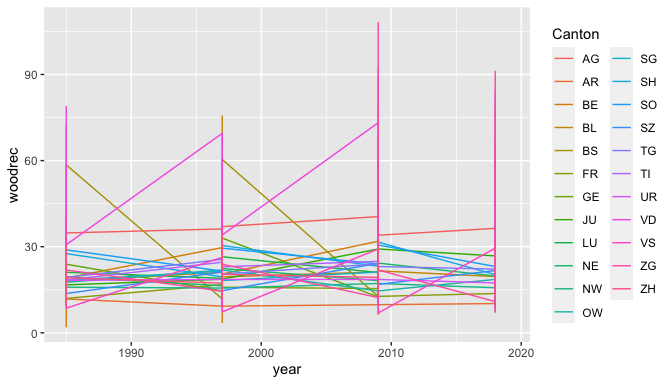

-   [1. Introduction](#introduction)
-   [2. Data](#data)
-   [3. Methods](#methods)
-   [4. Results](#results)
-   [5. Conclusion](#conclusion)
-   [References:](#references)

## 1. Introduction {#introduction}

In his seminal 1951 essay entitled “Building Dwelling Thinking,” Martin
Heidegger stressed the co-constitutiveness of building and dwelling, the
latter extending well beyond the mere residing in end products of
constructions to encompass the whole of Being. (Heidegger, 1971)
Inspired by this observation, the present research connects strictly
defined housing with the broader environment in which we live to
initiate a study of the evolution of living conditions in Switzerland. A
growing body of literature in comparative political science, and in
particular in the domain of political ecology, focuses on the
“livability” of cities around the world. Most of the indexes imagined to
measure this livability include a measure of land use in some form. For
this research project, I focus on the evolution of land use specifically
in Swiss Cantons and cities since the 2012 initiative and 2013
referendum, when the population voted to reduce urban sprawl and to
limit the proportion of secondary housing in each municipality of the
country.

I wish to check, first, whether the aforementioned political decisions
are beginning to achieve their purpose, specifically by examining how
livability in Swiss cities has evolved since 2013. A first hypothesis I
wish to test is whether Switzerland witnesses a shrinking of wooded and
recreational areas in cities, as an unintended consequence of the
limitation imposed on sprawling, that is, the extension of the built
area in less dense regions. Secondly, I examine whether, with regards to
land use, a so-called “Roestigraben” opens up between the Northern
German-speaking part of the country and the Latin South, a split often
observed and commented upon in political debates about cultural
differences within the country. Finally, I test whether housing per se
is impacted in the main urban centers, that is, not only if the built
area is further concentrated but also if accommodations shrink or become
more saturated.

## 2. Data {#data}

I will be using the Confederation’s “standard classification” model, the
so-called “NOAS04”, which includes basic categories of land cover and
use, and allows for extensive synchronic comparison from the 1979/85
period onward. As of December 2019, almost all of the new data for the
“Swiss Land Use Statistics” has been collected for the 2013/2018 period.
(23 out of 26 cantons, 3 still missing full coverage) The dataset
already contains a restriction of previous surveys to fit the existing
data as of December 2019. The data is constructed through an analysis of
satellite images collected throughout the relevant periods, whereby the
nature and function of the ground coverage is identified.

My main response variable will be the surface of wooded and recreational
area per capita, the same indicator used to measure “quality of the
environment” in the “Quality of Life” survey for cities and urban
centers. (Agglo, 2012). It is numerical, continuous, ratio data. The
primary unit of analysis is the 156 “statistical cities” of Switzerland,
with 23 Cantons as a secondary level.

My control variables will be the evolution of the population of each
municipality across the entire period (numerical, continuous, ratio
data), language (dummy, German coded as 1 vs non-German, including
bilingual Cantons as 0) as well as a detailed account of empty housing
(numerical, discrete data) and housing surface per person (numerical,
continuous, ratio data) for 2011-2018 in the 8 largest urban centers, to
connect the environmental part of “livability” with the quality of
housing in the main cities, that is, the “housing” part of our broader
dwelling concept, and of the Swiss “Quality of Life” survey.

All the original data can be accessed on the Swiss Federal Statistical
Office Webpage. From the various available datasets, I created a new
data frame which compiled all the columns of interest into a single file
that I called “Livability”. Combining these measures into a single data
frame creates a panel data with variables for 156 cities (23 Cantons)
over 4 periods (1979/85, 1992/97, 2004/09 and 2013/18). Time is hence
used as numerical, discrete data.

Data Visualization

    r = getOption("repos")
    r["CRAN"] = "http://cran.us.r-project.org"
    options(repos = r)

    library(haven)
    library(readxl)
    Livability <- read_excel("Livability.xlsx")

    Livability$language=as_factor(Livability$language)

    library(ggplot2)
    ggplot(data=Livability, aes(x=year, y=woodrec, color= Canton)) + geom_line()

    model1 <- ggplot(Livability, aes(year, woodrec))
    model1 + geom_point(aes(group = Canton))

    by(Livability$woodrec, Livability$year, summary)

    ## Livability$year: 1985
    ##    Min. 1st Qu.  Median    Mean 3rd Qu.    Max. 
    ##    2.10   15.90   19.50   20.97   23.82   79.00 
    ## ------------------------------------------------------------ 
    ## Livability$year: 1997
    ##    Min. 1st Qu.  Median    Mean 3rd Qu.    Max. 
    ##    3.60   17.00   21.10   22.81   26.30   75.50 
    ## ------------------------------------------------------------ 
    ## Livability$year: 2009
    ##    Min. 1st Qu.  Median    Mean 3rd Qu.    Max. 
    ##    6.40   17.05   21.35   24.21   26.43  108.10 
    ## ------------------------------------------------------------ 
    ## Livability$year: 2014
    ##    Min. 1st Qu.  Median    Mean 3rd Qu.    Max.    NA's 
    ##      NA      NA      NA     NaN      NA      NA       8 
    ## ------------------------------------------------------------ 
    ## Livability$year: 2015
    ##    Min. 1st Qu.  Median    Mean 3rd Qu.    Max.    NA's 
    ##      NA      NA      NA     NaN      NA      NA       8 
    ## ------------------------------------------------------------ 
    ## Livability$year: 2016
    ##    Min. 1st Qu.  Median    Mean 3rd Qu.    Max.    NA's 
    ##      NA      NA      NA     NaN      NA      NA       8 
    ## ------------------------------------------------------------ 
    ## Livability$year: 2017
    ##    Min. 1st Qu.  Median    Mean 3rd Qu.    Max.    NA's 
    ##      NA      NA      NA     NaN      NA      NA       8 
    ## ------------------------------------------------------------ 
    ## Livability$year: 2018
    ##    Min. 1st Qu.  Median    Mean 3rd Qu.    Max.    NA's 
    ##   7.043  15.275  19.600  22.357  24.721  91.100       8 
    ## ------------------------------------------------------------ 
    ## Livability$year: 2019
    ##    Min. 1st Qu.  Median    Mean 3rd Qu.    Max.    NA's 
    ##      NA      NA      NA     NaN      NA      NA       8

    boxplot(woodrec~year,data=Livability, main="Wooded & Recreational Area evolution",
       xlab="Year", ylab="Wooded & Recreational Area")

## 3. Methods {#methods}

I will be using a mixed effects model, with a random effect for Cantons
and fixed effects for population, time and language. This modeling
choice seems appropriate because we are likely to observe noise caused
by canton-correlation in the errors, considering both the wide
geographical and sociological differences across Switzerland and the
political institutionalization at the Cantonal level that might
introduce random Canton-specific trends. Moreover, Cantons capture, in
clustering them, part of city-trends as well, albeit in a more
manageable way (N= 23 instead of 156)) At the same time, the initial
data description shows that there is relatively little variability
within Cantons across the 4 periods, thus we also look for fixed effects
in time-constant language, and time-varying population. Pooling all
panel data in an OLS model would be ill-advised since we violate the
assumption that the parameters are the same for all cities/time periods.
In the end, we will likely observe variability at the cantonal level
that cannot be accounted for completely with our predictors, thus the
need for a mixed effects model.

My assumptions are that variations across Cantons are random in the
sense that they are not correlated with wooded and recreational area or
with other variables of interest. Neither do we expect any major
co-correlation across cantons, except for the language one, accounted
for as a fixed effect.

## 4. Results {#results}

    library("sjPlot")

    ## Learn more about sjPlot with 'browseVignettes("sjPlot")'.

    library(lme4)

    ## Loading required package: Matrix

    re1 <- lmer(woodrec ~ year + (1|Canton), Livability)
    re2 <- lmer(woodrec ~ year + log(pop) + (1|Canton), Livability)
    re3 <- lmer(woodrec ~ year + language + (1|Canton), Livability)
    re4 <- lmer(woodrec ~ year + language + log(pop) + (1|Canton), Livability)

    plot_model(re1)

    ## `geom_smooth()` using formula 'y ~ x'

    ## `geom_smooth()` using formula 'y ~ x'

    plot_model(re4,  type = "pred", terms = c("year", "Canton"), pred.type="re")

    ## Model has log-transformed predictors. Consider using `terms="pop [exp]"` to back-transform scale.

    tab_model(re1, re2, re3, re4, dv.labels = c("1","2","3","4"), digits = 3, show.aic = T)

<table style="border-collapse:collapse; border:none;">
<tr>
<th style="border-top: double; text-align:center; font-style:normal; font-weight:bold; padding:0.2cm;  text-align:left; ">
 
</th>
<th colspan="3" style="border-top: double; text-align:center; font-style:normal; font-weight:bold; padding:0.2cm; ">
1
</th>
<th colspan="3" style="border-top: double; text-align:center; font-style:normal; font-weight:bold; padding:0.2cm; ">
2
</th>
<th colspan="3" style="border-top: double; text-align:center; font-style:normal; font-weight:bold; padding:0.2cm; ">
3
</th>
<th colspan="3" style="border-top: double; text-align:center; font-style:normal; font-weight:bold; padding:0.2cm; ">
4
</th>
</tr>
<tr>
<td style=" text-align:center; border-bottom:1px solid; font-style:italic; font-weight:normal;  text-align:left; ">
Predictors
</td>
<td style=" text-align:center; border-bottom:1px solid; font-style:italic; font-weight:normal;  ">
Estimates
</td>
<td style=" text-align:center; border-bottom:1px solid; font-style:italic; font-weight:normal;  ">
CI
</td>
<td style=" text-align:center; border-bottom:1px solid; font-style:italic; font-weight:normal;  ">
p
</td>
<td style=" text-align:center; border-bottom:1px solid; font-style:italic; font-weight:normal;  ">
Estimates
</td>
<td style=" text-align:center; border-bottom:1px solid; font-style:italic; font-weight:normal;  ">
CI
</td>
<td style=" text-align:center; border-bottom:1px solid; font-style:italic; font-weight:normal;  col7">
p
</td>
<td style=" text-align:center; border-bottom:1px solid; font-style:italic; font-weight:normal;  col8">
Estimates
</td>
<td style=" text-align:center; border-bottom:1px solid; font-style:italic; font-weight:normal;  col9">
CI
</td>
<td style=" text-align:center; border-bottom:1px solid; font-style:italic; font-weight:normal;  0">
p
</td>
<td style=" text-align:center; border-bottom:1px solid; font-style:italic; font-weight:normal;  1">
Estimates
</td>
<td style=" text-align:center; border-bottom:1px solid; font-style:italic; font-weight:normal;  2">
CI
</td>
<td style=" text-align:center; border-bottom:1px solid; font-style:italic; font-weight:normal;  3">
p
</td>
</tr>
<tr>
<td style=" padding:0.2cm; text-align:left; vertical-align:top; text-align:left; ">
(Intercept)
</td>
<td style=" padding:0.2cm; text-align:left; vertical-align:top; text-align:center;  ">
-87.640
</td>
<td style=" padding:0.2cm; text-align:left; vertical-align:top; text-align:center;  ">
-233.889 – 58.609
</td>
<td style=" padding:0.2cm; text-align:left; vertical-align:top; text-align:center;  ">
0.240
</td>
<td style=" padding:0.2cm; text-align:left; vertical-align:top; text-align:center;  ">
-93.412
</td>
<td style=" padding:0.2cm; text-align:left; vertical-align:top; text-align:center;  ">
-239.525 – 52.700
</td>
<td style=" padding:0.2cm; text-align:left; vertical-align:top; text-align:center;  col7">
0.210
</td>
<td style=" padding:0.2cm; text-align:left; vertical-align:top; text-align:center;  col8">
-87.407
</td>
<td style=" padding:0.2cm; text-align:left; vertical-align:top; text-align:center;  col9">
-233.672 – 58.858
</td>
<td style=" padding:0.2cm; text-align:left; vertical-align:top; text-align:center;  0">
0.241
</td>
<td style=" padding:0.2cm; text-align:left; vertical-align:top; text-align:center;  1">
-93.181
</td>
<td style=" padding:0.2cm; text-align:left; vertical-align:top; text-align:center;  2">
-239.296 – 52.935
</td>
<td style=" padding:0.2cm; text-align:left; vertical-align:top; text-align:center;  3">
0.211
</td>
</tr>
<tr>
<td style=" padding:0.2cm; text-align:left; vertical-align:top; text-align:left; ">
year
</td>
<td style=" padding:0.2cm; text-align:left; vertical-align:top; text-align:center;  ">
0.055
</td>
<td style=" padding:0.2cm; text-align:left; vertical-align:top; text-align:center;  ">
-0.018 – 0.128
</td>
<td style=" padding:0.2cm; text-align:left; vertical-align:top; text-align:center;  ">
0.139
</td>
<td style=" padding:0.2cm; text-align:left; vertical-align:top; text-align:center;  ">
0.064
</td>
<td style=" padding:0.2cm; text-align:left; vertical-align:top; text-align:center;  ">
-0.010 – 0.137
</td>
<td style=" padding:0.2cm; text-align:left; vertical-align:top; text-align:center;  col7">
0.090
</td>
<td style=" padding:0.2cm; text-align:left; vertical-align:top; text-align:center;  col8">
0.055
</td>
<td style=" padding:0.2cm; text-align:left; vertical-align:top; text-align:center;  col9">
-0.018 – 0.128
</td>
<td style=" padding:0.2cm; text-align:left; vertical-align:top; text-align:center;  0">
0.139
</td>
<td style=" padding:0.2cm; text-align:left; vertical-align:top; text-align:center;  1">
0.064
</td>
<td style=" padding:0.2cm; text-align:left; vertical-align:top; text-align:center;  2">
-0.010 – 0.137
</td>
<td style=" padding:0.2cm; text-align:left; vertical-align:top; text-align:center;  3">
0.089
</td>
</tr>
<tr>
<td style=" padding:0.2cm; text-align:left; vertical-align:top; text-align:left; ">
pop \[log\]
</td>
<td style=" padding:0.2cm; text-align:left; vertical-align:top; text-align:center;  ">
</td>
<td style=" padding:0.2cm; text-align:left; vertical-align:top; text-align:center;  ">
</td>
<td style=" padding:0.2cm; text-align:left; vertical-align:top; text-align:center;  ">
</td>
<td style=" padding:0.2cm; text-align:left; vertical-align:top; text-align:center;  ">
-1.191
</td>
<td style=" padding:0.2cm; text-align:left; vertical-align:top; text-align:center;  ">
-2.568 – 0.187
</td>
<td style=" padding:0.2cm; text-align:left; vertical-align:top; text-align:center;  col7">
0.090
</td>
<td style=" padding:0.2cm; text-align:left; vertical-align:top; text-align:center;  col8">
</td>
<td style=" padding:0.2cm; text-align:left; vertical-align:top; text-align:center;  col9">
</td>
<td style=" padding:0.2cm; text-align:left; vertical-align:top; text-align:center;  0">
</td>
<td style=" padding:0.2cm; text-align:left; vertical-align:top; text-align:center;  1">
-1.200
</td>
<td style=" padding:0.2cm; text-align:left; vertical-align:top; text-align:center;  2">
-2.580 – 0.179
</td>
<td style=" padding:0.2cm; text-align:left; vertical-align:top; text-align:center;  3">
0.088
</td>
</tr>
<tr>
<td style=" padding:0.2cm; text-align:left; vertical-align:top; text-align:left; ">
language \[1\]
</td>
<td style=" padding:0.2cm; text-align:left; vertical-align:top; text-align:center;  ">
</td>
<td style=" padding:0.2cm; text-align:left; vertical-align:top; text-align:center;  ">
</td>
<td style=" padding:0.2cm; text-align:left; vertical-align:top; text-align:center;  ">
</td>
<td style=" padding:0.2cm; text-align:left; vertical-align:top; text-align:center;  ">
</td>
<td style=" padding:0.2cm; text-align:left; vertical-align:top; text-align:center;  ">
</td>
<td style=" padding:0.2cm; text-align:left; vertical-align:top; text-align:center;  col7">
</td>
<td style=" padding:0.2cm; text-align:left; vertical-align:top; text-align:center;  col8">
-0.359
</td>
<td style=" padding:0.2cm; text-align:left; vertical-align:top; text-align:center;  col9">
-4.541 – 3.824
</td>
<td style=" padding:0.2cm; text-align:left; vertical-align:top; text-align:center;  0">
0.866
</td>
<td style=" padding:0.2cm; text-align:left; vertical-align:top; text-align:center;  1">
-0.429
</td>
<td style=" padding:0.2cm; text-align:left; vertical-align:top; text-align:center;  2">
-4.679 – 3.821
</td>
<td style=" padding:0.2cm; text-align:left; vertical-align:top; text-align:center;  3">
0.843
</td>
</tr>
<tr>
<td colspan="13" style="font-weight:bold; text-align:left; padding-top:.8em;">
Random Effects
</td>
</tr>
<tr>
<td style=" padding:0.2cm; text-align:left; vertical-align:top; text-align:left; padding-top:0.1cm; padding-bottom:0.1cm;">
σ2
</td>
<td style=" padding:0.2cm; text-align:left; vertical-align:top; padding-top:0.1cm; padding-bottom:0.1cm; text-align:left;" colspan="3">
134.04
</td>
<td style=" padding:0.2cm; text-align:left; vertical-align:top; padding-top:0.1cm; padding-bottom:0.1cm; text-align:left;" colspan="3">
133.51
</td>
<td style=" padding:0.2cm; text-align:left; vertical-align:top; padding-top:0.1cm; padding-bottom:0.1cm; text-align:left;" colspan="3">
134.01
</td>
<td style=" padding:0.2cm; text-align:left; vertical-align:top; padding-top:0.1cm; padding-bottom:0.1cm; text-align:left;" colspan="3">
133.46
</td>
<tr>
<td style=" padding:0.2cm; text-align:left; vertical-align:top; text-align:left; padding-top:0.1cm; padding-bottom:0.1cm;">
τ00
</td>
<td style=" padding:0.2cm; text-align:left; vertical-align:top; padding-top:0.1cm; padding-bottom:0.1cm; text-align:left;" colspan="3">
12.88 Canton
</td>
<td style=" padding:0.2cm; text-align:left; vertical-align:top; padding-top:0.1cm; padding-bottom:0.1cm; text-align:left;" colspan="3">
13.43 Canton
</td>
<td style=" padding:0.2cm; text-align:left; vertical-align:top; padding-top:0.1cm; padding-bottom:0.1cm; text-align:left;" colspan="3">
14.00 Canton
</td>
<td style=" padding:0.2cm; text-align:left; vertical-align:top; padding-top:0.1cm; padding-bottom:0.1cm; text-align:left;" colspan="3">
14.67 Canton
</td>
<tr>
<td style=" padding:0.2cm; text-align:left; vertical-align:top; text-align:left; padding-top:0.1cm; padding-bottom:0.1cm;">
ICC
</td>
<td style=" padding:0.2cm; text-align:left; vertical-align:top; padding-top:0.1cm; padding-bottom:0.1cm; text-align:left;" colspan="3">
0.09
</td>
<td style=" padding:0.2cm; text-align:left; vertical-align:top; padding-top:0.1cm; padding-bottom:0.1cm; text-align:left;" colspan="3">
0.09
</td>
<td style=" padding:0.2cm; text-align:left; vertical-align:top; padding-top:0.1cm; padding-bottom:0.1cm; text-align:left;" colspan="3">
0.09
</td>
<td style=" padding:0.2cm; text-align:left; vertical-align:top; padding-top:0.1cm; padding-bottom:0.1cm; text-align:left;" colspan="3">
0.10
</td>
<tr>
<td style=" padding:0.2cm; text-align:left; vertical-align:top; text-align:left; padding-top:0.1cm; padding-bottom:0.1cm;">
N
</td>
<td style=" padding:0.2cm; text-align:left; vertical-align:top; padding-top:0.1cm; padding-bottom:0.1cm; text-align:left;" colspan="3">
23 Canton
</td>
<td style=" padding:0.2cm; text-align:left; vertical-align:top; padding-top:0.1cm; padding-bottom:0.1cm; text-align:left;" colspan="3">
23 Canton
</td>
<td style=" padding:0.2cm; text-align:left; vertical-align:top; padding-top:0.1cm; padding-bottom:0.1cm; text-align:left;" colspan="3">
23 Canton
</td>
<td style=" padding:0.2cm; text-align:left; vertical-align:top; padding-top:0.1cm; padding-bottom:0.1cm; text-align:left;" colspan="3">
23 Canton
</td>
<tr>
<td style=" padding:0.2cm; text-align:left; vertical-align:top; text-align:left; padding-top:0.1cm; padding-bottom:0.1cm; border-top:1px solid;">
Observations
</td>
<td style=" padding:0.2cm; text-align:left; vertical-align:top; padding-top:0.1cm; padding-bottom:0.1cm; text-align:left; border-top:1px solid;" colspan="3">
624
</td>
<td style=" padding:0.2cm; text-align:left; vertical-align:top; padding-top:0.1cm; padding-bottom:0.1cm; text-align:left; border-top:1px solid;" colspan="3">
624
</td>
<td style=" padding:0.2cm; text-align:left; vertical-align:top; padding-top:0.1cm; padding-bottom:0.1cm; text-align:left; border-top:1px solid;" colspan="3">
624
</td>
<td style=" padding:0.2cm; text-align:left; vertical-align:top; padding-top:0.1cm; padding-bottom:0.1cm; text-align:left; border-top:1px solid;" colspan="3">
624
</td>
</tr>
<tr>
<td style=" padding:0.2cm; text-align:left; vertical-align:top; text-align:left; padding-top:0.1cm; padding-bottom:0.1cm;">
Marginal R2 / Conditional R2
</td>
<td style=" padding:0.2cm; text-align:left; vertical-align:top; padding-top:0.1cm; padding-bottom:0.1cm; text-align:left;" colspan="3">
0.003 / 0.091
</td>
<td style=" padding:0.2cm; text-align:left; vertical-align:top; padding-top:0.1cm; padding-bottom:0.1cm; text-align:left;" colspan="3">
0.008 / 0.098
</td>
<td style=" padding:0.2cm; text-align:left; vertical-align:top; padding-top:0.1cm; padding-bottom:0.1cm; text-align:left;" colspan="3">
0.003 / 0.098
</td>
<td style=" padding:0.2cm; text-align:left; vertical-align:top; padding-top:0.1cm; padding-bottom:0.1cm; text-align:left;" colspan="3">
0.008 / 0.106
</td>
</tr>
<tr>
<td style=" padding:0.2cm; text-align:left; vertical-align:top; text-align:left; padding-top:0.1cm; padding-bottom:0.1cm;">
AIC
</td>
<td style=" padding:0.2cm; text-align:left; vertical-align:top; padding-top:0.1cm; padding-bottom:0.1cm; text-align:left;" colspan="3">
4861.013
</td>
<td style=" padding:0.2cm; text-align:left; vertical-align:top; padding-top:0.1cm; padding-bottom:0.1cm; text-align:left;" colspan="3">
4859.021
</td>
<td style=" padding:0.2cm; text-align:left; vertical-align:top; padding-top:0.1cm; padding-bottom:0.1cm; text-align:left;" colspan="3">
4859.658
</td>
<td style=" padding:0.2cm; text-align:left; vertical-align:top; padding-top:0.1cm; padding-bottom:0.1cm; text-align:left;" colspan="3">
4857.626
</td>
</tr>
</table>
    library(dplyr)

    ## 
    ## Attaching package: 'dplyr'

    ## The following objects are masked from 'package:stats':
    ## 
    ##     filter, lag

    ## The following objects are masked from 'package:base':
    ## 
    ##     intersect, setdiff, setequal, union

    filtered <- Livability[which(Livability$year<2010),]
    re8 <- lmer(filtered$woodrec ~ filtered$year+filtered$language+log(filtered$pop)+(1|filtered$Canton), Livability)

    tab_model(re4, re8, dv.labels = c("4","8"), digits = 3, show.aic = T)

<table style="border-collapse:collapse; border:none;">
<tr>
<th style="border-top: double; text-align:center; font-style:normal; font-weight:bold; padding:0.2cm;  text-align:left; ">
 
</th>
<th colspan="3" style="border-top: double; text-align:center; font-style:normal; font-weight:bold; padding:0.2cm; ">
4
</th>
<th colspan="3" style="border-top: double; text-align:center; font-style:normal; font-weight:bold; padding:0.2cm; ">
8
</th>
</tr>
<tr>
<td style=" text-align:center; border-bottom:1px solid; font-style:italic; font-weight:normal;  text-align:left; ">
Predictors
</td>
<td style=" text-align:center; border-bottom:1px solid; font-style:italic; font-weight:normal;  ">
Estimates
</td>
<td style=" text-align:center; border-bottom:1px solid; font-style:italic; font-weight:normal;  ">
CI
</td>
<td style=" text-align:center; border-bottom:1px solid; font-style:italic; font-weight:normal;  ">
p
</td>
<td style=" text-align:center; border-bottom:1px solid; font-style:italic; font-weight:normal;  ">
Estimates
</td>
<td style=" text-align:center; border-bottom:1px solid; font-style:italic; font-weight:normal;  ">
CI
</td>
<td style=" text-align:center; border-bottom:1px solid; font-style:italic; font-weight:normal;  col7">
p
</td>
</tr>
<tr>
<td style=" padding:0.2cm; text-align:left; vertical-align:top; text-align:left; ">
(Intercept)
</td>
<td style=" padding:0.2cm; text-align:left; vertical-align:top; text-align:center;  ">
-93.181
</td>
<td style=" padding:0.2cm; text-align:left; vertical-align:top; text-align:center;  ">
-239.296 – 52.935
</td>
<td style=" padding:0.2cm; text-align:left; vertical-align:top; text-align:center;  ">
0.211
</td>
<td style=" padding:0.2cm; text-align:left; vertical-align:top; text-align:center;  ">
-249.120
</td>
<td style=" padding:0.2cm; text-align:left; vertical-align:top; text-align:center;  ">
-455.598 – -42.641
</td>
<td style=" padding:0.2cm; text-align:left; vertical-align:top; text-align:center;  col7">
<strong>0.018</strong>
</td>
</tr>
<tr>
<td style=" padding:0.2cm; text-align:left; vertical-align:top; text-align:left; ">
year
</td>
<td style=" padding:0.2cm; text-align:left; vertical-align:top; text-align:center;  ">
0.064
</td>
<td style=" padding:0.2cm; text-align:left; vertical-align:top; text-align:center;  ">
-0.010 – 0.137
</td>
<td style=" padding:0.2cm; text-align:left; vertical-align:top; text-align:center;  ">
0.089
</td>
<td style=" padding:0.2cm; text-align:left; vertical-align:top; text-align:center;  ">
</td>
<td style=" padding:0.2cm; text-align:left; vertical-align:top; text-align:center;  ">
</td>
<td style=" padding:0.2cm; text-align:left; vertical-align:top; text-align:center;  col7">
</td>
</tr>
<tr>
<td style=" padding:0.2cm; text-align:left; vertical-align:top; text-align:left; ">
language \[1\]
</td>
<td style=" padding:0.2cm; text-align:left; vertical-align:top; text-align:center;  ">
-0.429
</td>
<td style=" padding:0.2cm; text-align:left; vertical-align:top; text-align:center;  ">
-4.679 – 3.821
</td>
<td style=" padding:0.2cm; text-align:left; vertical-align:top; text-align:center;  ">
0.843
</td>
<td style=" padding:0.2cm; text-align:left; vertical-align:top; text-align:center;  ">
</td>
<td style=" padding:0.2cm; text-align:left; vertical-align:top; text-align:center;  ">
</td>
<td style=" padding:0.2cm; text-align:left; vertical-align:top; text-align:center;  col7">
</td>
</tr>
<tr>
<td style=" padding:0.2cm; text-align:left; vertical-align:top; text-align:left; ">
pop \[log\]
</td>
<td style=" padding:0.2cm; text-align:left; vertical-align:top; text-align:center;  ">
-1.200
</td>
<td style=" padding:0.2cm; text-align:left; vertical-align:top; text-align:center;  ">
-2.580 – 0.179
</td>
<td style=" padding:0.2cm; text-align:left; vertical-align:top; text-align:center;  ">
0.088
</td>
<td style=" padding:0.2cm; text-align:left; vertical-align:top; text-align:center;  ">
</td>
<td style=" padding:0.2cm; text-align:left; vertical-align:top; text-align:center;  ">
</td>
<td style=" padding:0.2cm; text-align:left; vertical-align:top; text-align:center;  col7">
</td>
</tr>
<tr>
<td style=" padding:0.2cm; text-align:left; vertical-align:top; text-align:left; ">
filtered$year&lt;/td&gt; &lt;td style=" padding:0.2cm; text-align:left; vertical-align:top; text-align:center; "&gt;&lt;/td&gt; &lt;td style=" padding:0.2cm; text-align:left; vertical-align:top; text-align:center; "&gt;&lt;/td&gt; &lt;td style=" padding:0.2cm; text-align:left; vertical-align:top; text-align:center; "&gt;&lt;/td&gt; &lt;td style=" padding:0.2cm; text-align:left; vertical-align:top; text-align:center; "&gt;0.141&lt;/td&gt; &lt;td style=" padding:0.2cm; text-align:left; vertical-align:top; text-align:center; "&gt;0.037&nbsp;&ndash;&nbsp;0.245&lt;/td&gt; &lt;td style=" padding:0.2cm; text-align:left; vertical-align:top; text-align:center; col7"&gt;&lt;strong&gt;0.008&lt;/strong&gt;&lt;/td&gt; &lt;/tr&gt; &lt;tr&gt; &lt;td style=" padding:0.2cm; text-align:left; vertical-align:top; text-align:left; "&gt;filtered$language \[filtered$language1\]
</td>
<td style=" padding:0.2cm; text-align:left; vertical-align:top; text-align:center;  ">
</td>
<td style=" padding:0.2cm; text-align:left; vertical-align:top; text-align:center;  ">
</td>
<td style=" padding:0.2cm; text-align:left; vertical-align:top; text-align:center;  ">
</td>
<td style=" padding:0.2cm; text-align:left; vertical-align:top; text-align:center;  ">
-0.416
</td>
<td style=" padding:0.2cm; text-align:left; vertical-align:top; text-align:center;  ">
-4.476 – 3.644
</td>
<td style=" padding:0.2cm; text-align:left; vertical-align:top; text-align:center;  col7">
0.841
</td>
</tr>
<tr>
<td style=" padding:0.2cm; text-align:left; vertical-align:top; text-align:left; ">
filtered$pop \[log\]
</td>
<td style=" padding:0.2cm; text-align:left; vertical-align:top; text-align:center;  ">
</td>
<td style=" padding:0.2cm; text-align:left; vertical-align:top; text-align:center;  ">
</td>
<td style=" padding:0.2cm; text-align:left; vertical-align:top; text-align:center;  ">
</td>
<td style=" padding:0.2cm; text-align:left; vertical-align:top; text-align:center;  ">
-1.000
</td>
<td style=" padding:0.2cm; text-align:left; vertical-align:top; text-align:center;  ">
-2.512 – 0.511
</td>
<td style=" padding:0.2cm; text-align:left; vertical-align:top; text-align:center;  col7">
0.195
</td>
</tr>
<tr>
<td colspan="7" style="font-weight:bold; text-align:left; padding-top:.8em;">
Random Effects
</td>
</tr>
<tr>
<td style=" padding:0.2cm; text-align:left; vertical-align:top; text-align:left; padding-top:0.1cm; padding-bottom:0.1cm;">
σ2
</td>
<td style=" padding:0.2cm; text-align:left; vertical-align:top; padding-top:0.1cm; padding-bottom:0.1cm; text-align:left;" colspan="3">
133.46
</td>
<td style=" padding:0.2cm; text-align:left; vertical-align:top; padding-top:0.1cm; padding-bottom:0.1cm; text-align:left;" colspan="3">
124.96
</td>
<tr>
<td style=" padding:0.2cm; text-align:left; vertical-align:top; text-align:left; padding-top:0.1cm; padding-bottom:0.1cm;">
τ00
</td>
<td style=" padding:0.2cm; text-align:left; vertical-align:top; padding-top:0.1cm; padding-bottom:0.1cm; text-align:left;" colspan="3">
14.67 Canton
</td>
<td style=" padding:0.2cm; text-align:left; vertical-align:top; padding-top:0.1cm; padding-bottom:0.1cm; text-align:left;" colspan="3">
11.41 filtered$Canton
</td>
<tr>
<td style=" padding:0.2cm; text-align:left; vertical-align:top; text-align:left; padding-top:0.1cm; padding-bottom:0.1cm;">
ICC
</td>
<td style=" padding:0.2cm; text-align:left; vertical-align:top; padding-top:0.1cm; padding-bottom:0.1cm; text-align:left;" colspan="3">
0.10
</td>
<td style=" padding:0.2cm; text-align:left; vertical-align:top; padding-top:0.1cm; padding-bottom:0.1cm; text-align:left;" colspan="3">
0.08
</td>
<tr>
<td style=" padding:0.2cm; text-align:left; vertical-align:top; text-align:left; padding-top:0.1cm; padding-bottom:0.1cm;">
N
</td>
<td style=" padding:0.2cm; text-align:left; vertical-align:top; padding-top:0.1cm; padding-bottom:0.1cm; text-align:left;" colspan="3">
23 Canton
</td>
<td style=" padding:0.2cm; text-align:left; vertical-align:top; padding-top:0.1cm; padding-bottom:0.1cm; text-align:left;" colspan="3">
23 filtered$Canton
</td>
<tr>
<td style=" padding:0.2cm; text-align:left; vertical-align:top; text-align:left; padding-top:0.1cm; padding-bottom:0.1cm; border-top:1px solid;">
Observations
</td>
<td style=" padding:0.2cm; text-align:left; vertical-align:top; padding-top:0.1cm; padding-bottom:0.1cm; text-align:left; border-top:1px solid;" colspan="3">
624
</td>
<td style=" padding:0.2cm; text-align:left; vertical-align:top; padding-top:0.1cm; padding-bottom:0.1cm; text-align:left; border-top:1px solid;" colspan="3">
468
</td>
</tr>
<tr>
<td style=" padding:0.2cm; text-align:left; vertical-align:top; text-align:left; padding-top:0.1cm; padding-bottom:0.1cm;">
Marginal R2 / Conditional R2
</td>
<td style=" padding:0.2cm; text-align:left; vertical-align:top; padding-top:0.1cm; padding-bottom:0.1cm; text-align:left;" colspan="3">
0.008 / 0.106
</td>
<td style=" padding:0.2cm; text-align:left; vertical-align:top; padding-top:0.1cm; padding-bottom:0.1cm; text-align:left;" colspan="3">
0.016 / 0.099
</td>
</tr>
<tr>
<td style=" padding:0.2cm; text-align:left; vertical-align:top; text-align:left; padding-top:0.1cm; padding-bottom:0.1cm;">
AIC
</td>
<td style=" padding:0.2cm; text-align:left; vertical-align:top; padding-top:0.1cm; padding-bottom:0.1cm; text-align:left;" colspan="3">
4857.626
</td>
<td style=" padding:0.2cm; text-align:left; vertical-align:top; padding-top:0.1cm; padding-bottom:0.1cm; text-align:left;" colspan="3">
3613.679
</td>
</tr>
</table>
The first model (re1) takes only the time period as a fixed effect and
uses Cantons as a random effect. The linear prediction returns a
non-significant positive effect for time on wooded and recreational
area, controlling for the random variability across cantons. The second
and third models add population and language, respectively, with the
fourth model combining time period, language, and population. The R
squared, giving the proportion of variance in wooded and recreational
area explained by the predictors, is relatively low in all models, but
the higher Conditional R squared is in the fourth model. The inclusion
of all 3 predictors besides time seems relevant, as the AIC is lowest
for model 4, indicating it is the most parsimonious model, the one we
chose to interpret.

The p values of none of the 3 predictors allow us to reject the null
that they have no effect at conventional confidence levels (alpha =
0.05). But considering the non-linear nature of the temporal evolution
we expected following our hypothesized mechanism and the trend observed
for 2018 in the mean of wooded and recreation area per capita as well as
in the basic prediction plot of model 1, it is likely that removing the
last period would reinforce this marginal effect of time. After
filtering accordingly, time indeed becomes statistically significant
(p=0.008), with an increase in wooded and recreational area per capita
of 0.141 square meter per year. Language seems far from being
statistically significant under any of the two models (p = 0.84), thus
disproving the presence of a so-called “Roestigraben” with regards to
wooded and recreational area. The (negative) effect of population was
close to being statistically significant in model 4, but not in model 8.
We then turn to a brief analysis of housing.

    re5 <- lmer(surface ~ year + (1|City), Livability)
    re6 <- lmer(empty ~ year + (1|City), Livability)
    re7 <- lmer(log(overcrowded) ~ year + (1|City), Livability)

    tab_model(re5, re6, re7, dv.labels = c("5","6", "7"), digits = 3, show.aic = T)

<table style="border-collapse:collapse; border:none;">
<tr>
<th style="border-top: double; text-align:center; font-style:normal; font-weight:bold; padding:0.2cm;  text-align:left; ">
 
</th>
<th colspan="3" style="border-top: double; text-align:center; font-style:normal; font-weight:bold; padding:0.2cm; ">
5
</th>
<th colspan="3" style="border-top: double; text-align:center; font-style:normal; font-weight:bold; padding:0.2cm; ">
6
</th>
<th colspan="3" style="border-top: double; text-align:center; font-style:normal; font-weight:bold; padding:0.2cm; ">
7
</th>
</tr>
<tr>
<td style=" text-align:center; border-bottom:1px solid; font-style:italic; font-weight:normal;  text-align:left; ">
Predictors
</td>
<td style=" text-align:center; border-bottom:1px solid; font-style:italic; font-weight:normal;  ">
Estimates
</td>
<td style=" text-align:center; border-bottom:1px solid; font-style:italic; font-weight:normal;  ">
CI
</td>
<td style=" text-align:center; border-bottom:1px solid; font-style:italic; font-weight:normal;  ">
p
</td>
<td style=" text-align:center; border-bottom:1px solid; font-style:italic; font-weight:normal;  ">
Estimates
</td>
<td style=" text-align:center; border-bottom:1px solid; font-style:italic; font-weight:normal;  ">
CI
</td>
<td style=" text-align:center; border-bottom:1px solid; font-style:italic; font-weight:normal;  col7">
p
</td>
<td style=" text-align:center; border-bottom:1px solid; font-style:italic; font-weight:normal;  col8">
Estimates
</td>
<td style=" text-align:center; border-bottom:1px solid; font-style:italic; font-weight:normal;  col9">
CI
</td>
<td style=" text-align:center; border-bottom:1px solid; font-style:italic; font-weight:normal;  0">
p
</td>
</tr>
<tr>
<td style=" padding:0.2cm; text-align:left; vertical-align:top; text-align:left; ">
(Intercept)
</td>
<td style=" padding:0.2cm; text-align:left; vertical-align:top; text-align:center;  ">
149.720
</td>
<td style=" padding:0.2cm; text-align:left; vertical-align:top; text-align:center;  ">
38.543 – 260.897
</td>
<td style=" padding:0.2cm; text-align:left; vertical-align:top; text-align:center;  ">
<strong>0.008</strong>
</td>
<td style=" padding:0.2cm; text-align:left; vertical-align:top; text-align:center;  ">
-132495.704
</td>
<td style=" padding:0.2cm; text-align:left; vertical-align:top; text-align:center;  ">
-177666.634 – -87324.773
</td>
<td style=" padding:0.2cm; text-align:left; vertical-align:top; text-align:center;  col7">
<strong>&lt;0.001
</td>
<td style=" padding:0.2cm; text-align:left; vertical-align:top; text-align:center;  col8">
3.685
</td>
<td style=" padding:0.2cm; text-align:left; vertical-align:top; text-align:center;  col9">
-7.184 – 14.554
</td>
<td style=" padding:0.2cm; text-align:left; vertical-align:top; text-align:center;  0">
0.506
</td>
</tr>
<tr>
<td style=" padding:0.2cm; text-align:left; vertical-align:top; text-align:left; ">
year
</td>
<td style=" padding:0.2cm; text-align:left; vertical-align:top; text-align:center;  ">
-0.054
</td>
<td style=" padding:0.2cm; text-align:left; vertical-align:top; text-align:center;  ">
-0.109 – 0.001
</td>
<td style=" padding:0.2cm; text-align:left; vertical-align:top; text-align:center;  ">
0.055
</td>
<td style=" padding:0.2cm; text-align:left; vertical-align:top; text-align:center;  ">
65.957
</td>
<td style=" padding:0.2cm; text-align:left; vertical-align:top; text-align:center;  ">
43.557 – 88.358
</td>
<td style=" padding:0.2cm; text-align:left; vertical-align:top; text-align:center;  col7">
<strong>&lt;0.001
</td>
<td style=" padding:0.2cm; text-align:left; vertical-align:top; text-align:center;  col8">
0.002
</td>
<td style=" padding:0.2cm; text-align:left; vertical-align:top; text-align:center;  col9">
-0.003 – 0.008
</td>
<td style=" padding:0.2cm; text-align:left; vertical-align:top; text-align:center;  0">
0.375
</td>
</tr>
<tr>
<td colspan="10" style="font-weight:bold; text-align:left; padding-top:.8em;">
Random Effects
</td>
</tr>
<tr>
<td style=" padding:0.2cm; text-align:left; vertical-align:top; text-align:left; padding-top:0.1cm; padding-bottom:0.1cm;">
σ2
</td>
<td style=" padding:0.2cm; text-align:left; vertical-align:top; padding-top:0.1cm; padding-bottom:0.1cm; text-align:left;" colspan="3">
0.11
</td>
<td style=" padding:0.2cm; text-align:left; vertical-align:top; padding-top:0.1cm; padding-bottom:0.1cm; text-align:left;" colspan="3">
18287.33
</td>
<td style=" padding:0.2cm; text-align:left; vertical-align:top; padding-top:0.1cm; padding-bottom:0.1cm; text-align:left;" colspan="3">
0.00
</td>
<tr>
<td style=" padding:0.2cm; text-align:left; vertical-align:top; text-align:left; padding-top:0.1cm; padding-bottom:0.1cm;">
τ00
</td>
<td style=" padding:0.2cm; text-align:left; vertical-align:top; padding-top:0.1cm; padding-bottom:0.1cm; text-align:left;" colspan="3">
15.61 City
</td>
<td style=" padding:0.2cm; text-align:left; vertical-align:top; padding-top:0.1cm; padding-bottom:0.1cm; text-align:left;" colspan="3">
29146.82 City
</td>
<td style=" padding:0.2cm; text-align:left; vertical-align:top; padding-top:0.1cm; padding-bottom:0.1cm; text-align:left;" colspan="3">
0.83 City
</td>
<tr>
<td style=" padding:0.2cm; text-align:left; vertical-align:top; text-align:left; padding-top:0.1cm; padding-bottom:0.1cm;">
ICC
</td>
<td style=" padding:0.2cm; text-align:left; vertical-align:top; padding-top:0.1cm; padding-bottom:0.1cm; text-align:left;" colspan="3">
0.99
</td>
<td style=" padding:0.2cm; text-align:left; vertical-align:top; padding-top:0.1cm; padding-bottom:0.1cm; text-align:left;" colspan="3">
0.61
</td>
<td style=" padding:0.2cm; text-align:left; vertical-align:top; padding-top:0.1cm; padding-bottom:0.1cm; text-align:left;" colspan="3">
1.00
</td>
<tr>
<td style=" padding:0.2cm; text-align:left; vertical-align:top; text-align:left; padding-top:0.1cm; padding-bottom:0.1cm;">
N
</td>
<td style=" padding:0.2cm; text-align:left; vertical-align:top; padding-top:0.1cm; padding-bottom:0.1cm; text-align:left;" colspan="3">
8 City
</td>
<td style=" padding:0.2cm; text-align:left; vertical-align:top; padding-top:0.1cm; padding-bottom:0.1cm; text-align:left;" colspan="3">
8 City
</td>
<td style=" padding:0.2cm; text-align:left; vertical-align:top; padding-top:0.1cm; padding-bottom:0.1cm; text-align:left;" colspan="3">
8 City
</td>
<tr>
<td style=" padding:0.2cm; text-align:left; vertical-align:top; text-align:left; padding-top:0.1cm; padding-bottom:0.1cm; border-top:1px solid;">
Observations
</td>
<td style=" padding:0.2cm; text-align:left; vertical-align:top; padding-top:0.1cm; padding-bottom:0.1cm; text-align:left; border-top:1px solid;" colspan="3">
48
</td>
<td style=" padding:0.2cm; text-align:left; vertical-align:top; padding-top:0.1cm; padding-bottom:0.1cm; text-align:left; border-top:1px solid;" colspan="3">
48
</td>
<td style=" padding:0.2cm; text-align:left; vertical-align:top; padding-top:0.1cm; padding-bottom:0.1cm; text-align:left; border-top:1px solid;" colspan="3">
48
</td>
</tr>
<tr>
<td style=" padding:0.2cm; text-align:left; vertical-align:top; text-align:left; padding-top:0.1cm; padding-bottom:0.1cm;">
Marginal R2 / Conditional R2
</td>
<td style=" padding:0.2cm; text-align:left; vertical-align:top; padding-top:0.1cm; padding-bottom:0.1cm; text-align:left;" colspan="3">
0.001 / 0.993
</td>
<td style=" padding:0.2cm; text-align:left; vertical-align:top; padding-top:0.1cm; padding-bottom:0.1cm; text-align:left;" colspan="3">
0.215 / 0.697
</td>
<td style=" padding:0.2cm; text-align:left; vertical-align:top; padding-top:0.1cm; padding-bottom:0.1cm; text-align:left;" colspan="3">
0.000 / 0.999
</td>
</tr>
<tr>
<td style=" padding:0.2cm; text-align:left; vertical-align:top; text-align:left; padding-top:0.1cm; padding-bottom:0.1cm;">
AIC
</td>
<td style=" padding:0.2cm; text-align:left; vertical-align:top; padding-top:0.1cm; padding-bottom:0.1cm; text-align:left;" colspan="3">
93.310
</td>
<td style=" padding:0.2cm; text-align:left; vertical-align:top; padding-top:0.1cm; padding-bottom:0.1cm; text-align:left;" colspan="3">
615.299
</td>
<td style=" padding:0.2cm; text-align:left; vertical-align:top; padding-top:0.1cm; padding-bottom:0.1cm; text-align:left;" colspan="3">
-108.721
</td>
</tr>
</table>
    plot_model(re6,  type = "pred", terms = c("year", "City"), pred.type="re")

The effect of time on housing is statistically significant for the
number of empty housing (positive, with an estimate of 66 additional
empty units of housing each year between 2014 and 2019, p&lt;0.001), but
not for the number of overcrowded housing units. Housing surface also
seems to decrease slightly by 0.054 square meter per person per year
during that period, but the effect is not quite statistically
significant (p=0.055).

## 5. Conclusion {#conclusion}

At the descriptive stage, one could observe that the overall values for
wooded and recreational area per person per city were relatively
constant over the four periods. There was however a slight general
trend, as that type of area seemed to increase from 1985 to 2009, before
the 2018 mean went back to 1997 levels. Was this a consequence of the
2012/2013 votes, as cities became more densely built to spare the
countryside? Although a more complex temporal analysis (specifically, a
non-linear one) would be required to evaluate further whether the latest
measures deviate from a certain trend, our analysis could already
highlight certain elements.

The most parsimonious model, and the one holding the most explanatory
power, was the one which included time, population, and language as
fixed effects, next to Cantons as random effect. Over the first 3
periods, time is statistically significant, suggesting a positive trend
in wooded and recreational area per person in Swiss cities between 1985
and 2009. Overall, an increase in population might have a negative
effect on the surface of wooded and recreational area per person,
although no model returned quite a statistically significant result for
that predictor. Further research would here be necessary to examine in
greater detail the interaction between the supposed effect of the
2012/2013 votes and population. In terms of housing, the number of empty
housing has been statistically significantly rising from 1985 to 2018,
perhaps following a longer trend expectation of greater urbanization,
something which might also affect building densification in cities.
Housing surface also seems to decrease, but a more detailed approach
would be needed to determine whether the trend is accelerating
post-2013.

In light of the apparent methodological limitations of the present
research, we remain prudent and decide not to propose any definitive
answer regarding the evolution of the observed aspects of livability in
Swiss cities since 2013. Still, further research, both using more
advanced statistical tools and integrating other economical and
sociological control variables, could very well build upon our initial
findings, the latter indicating that Swiss Cantons, no matter their
linguistic character, were evolving towards greater wooded and
recreational area per capita between 1985 and 2009, that the housing
situation in the largest cities testifies to an expectation of continued
urbanization over the last 7 years, and that housing surface per person
might be shrinking in urban centers.

## References: {#references}

Land use data:
<a href="https://www.bfs.admin.ch/bfs/de/home/statistiken/raum-umwelt/bodennutzung-bedeckung.assetdetail.11007207.html" class="uri">https://www.bfs.admin.ch/bfs/de/home/statistiken/raum-umwelt/bodennutzung-bedeckung.assetdetail.11007207.html</a>

Housing data:
<a href="https://www.pxweb.bfs.admin.ch/" class="uri">https://www.pxweb.bfs.admin.ch/</a>
, under Stadt / Agglomeration.

Lebensqualität in den Städten und Agglomerationen (Agglo 2012).
Bundesamt fuer Statistik, 2019.

Heidegger, Martin. “Building Dwelling Thinking,” in: Poetry, Language,
Thought, trans. A. Hofstadter, New York: Harper Colophon Books, 1971.
