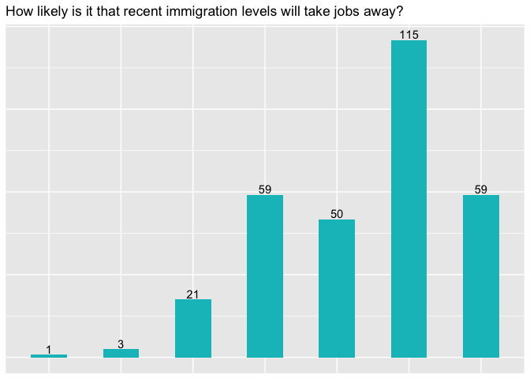
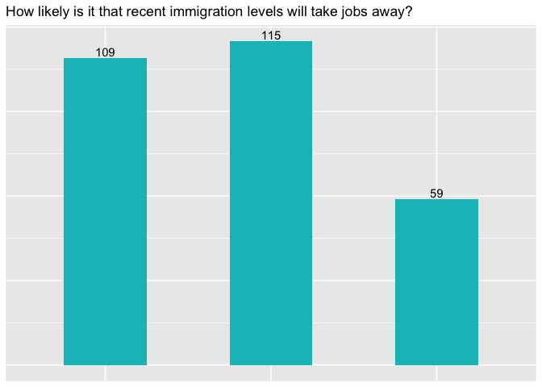
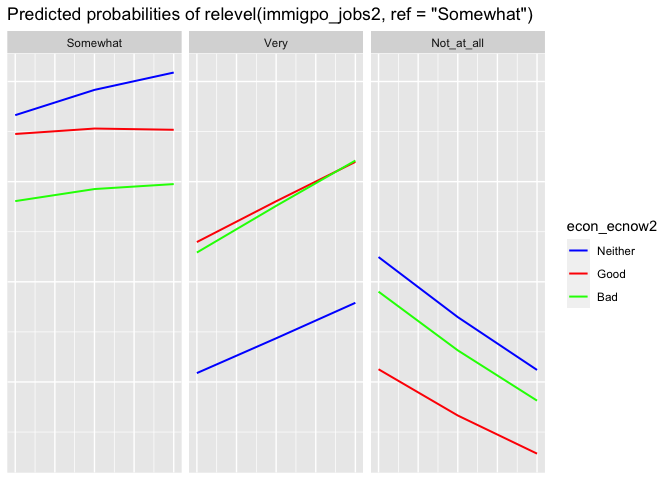

# Introduction

Demographic forecasts suggest an increasing need to better understand
ethnically diverse societies. The globalized nature of today’s economic
value chains, travel and more unfortunate drivers of human mobility send
international migration to record levels each year. As a result,
European societies are now more ethnically diverse than ever, and by
2044, for example, non-white residents are set to constitute the
majority in the United States (Fibbi, Midtbøen, and Simon 2021; Jardina
2019). It remains unclear though what such trends imply for social and
political dynamics in receiving societies. The literature offers two
contending hypotheses, the Contact Hypothesis and the Group Threat
Hypothesis, which will be further explored in this statistical study of
immigration attitudes across the United States (US). The subsequent
analysis will thus be guided by the following research question: What
factors influence attitudes on the effects of immigration? Specifically,
I will investigate the role of the percent change in the immigrant
population of each US State and individual perceptions about the
national economy’s performance.

Current scholarship on the effects of immigration within host societies
has turned to indicators of integration as a way of speaking to the
drivers and inhibitors of social cohesion. However, much of the extant
literature is focused on outcomes such as language acquisition,
naturalization, intermarriage and employment to assess integration, but
this overlooks the role of the local population in defining and
upholding the social barriers to assimilation. I propose that broadening
the scope of analysis to include this majority population allows for
greater theorization about intergroup interactions that ultimately
translate to the political pressures policymakers must contend with. In
order to do so, we must turn to insights from social psychology that
pre-date this more recent attention to immigrant integration. This is
where the Contact and Group Threat hypotheses offer potential utility.

First, the Contact Hypothesis developed in Gordon Allport’s seminal work
on prejudice argues that intergroup exposure (in this case locals and
immigrants) reduces prejudice, especially when in pursuit of a common
goal (Allport 1979; Fibbi, Midtbøen, and Simon 2021; Gabrielli, Gsir,
and Zapata-Barrero 2017; Graefe et al. 2008). His theory predicts that
tensions ease through repeated interaction with members of the opposite
group, as the degree of uncertainty diminishes. This suggests that
increased immigration should translate to more intergroup interaction
and therefore decrease prejudice overall. In contrast, increasing
diversity may actually trigger the opposite reaction, per the Group
Threat Hypothesis, whereby the majority population perceives possible
threats to material security, group position or cultural erosion. Such a
reaction serves to bolster ingroup ties and adherence to dividing lines
(Blalock 1967; Blumer 1958; Schlueter, Meuleman, and Davidov 2013;
kesller and bloemraad).

Specifically, I will test the following hypotheses to understand which
best explains the US context:

*H1: The larger the percent change of the immigrant population in each
state, the more attitudes on the effects of immigration will be
negative*

*H2: the more negative views of the economy’s performance, the more
individuals will hold negative views about the effects of immigration*

The second hypothesis above stems from the functional aspects of
identity formation and stereotyping underpinning these ingroup and
outgroup perceptions. As alluded to in Allport’s Contact Hypothesis and
subsequently validated in a number of studies, group boundaries and
their salience wax and wane depending on how situational characteristics
rely on or ignite their activation (Hale 2004; Rabbie and Horwitz 1969).
If two groups benefit from working together towards common goals,
Allport argues that prejudice will be reduced. Conversely, when group
interests are in conflict, competition and negative attitudes towards
outgroups arise from a perceived sense of threat. Material stakes that
hinge upon group categorization also tend to increase the importance
individuals attach to these divides (Fibbi, Midtbøen, and Simon 2021).
Therefore, by accounting for one’s view of the health of the economy, we
gain a sense of the extent to which material security is perceived to be
at risk.

The findings of this study reveal that percent change in the immigrant
population has a much more limited effect on attitudes than views on the
health of the economy. However, the relationship between attitudes on
the economy and immigration’s effects cannot simply be reduced to
feelings of material insecurity. I conclude that it is much more
fruitful to think about the notion of security generally in relation the
majority group’s status when considering how a the receiving population
feels affected by growing ethnic diversity.

# Data

In order to evaluate these hypotheses, I draw upon data from the
American National Election Studies (ANES) survey and the Migration
Policy Institute (MPI) reports to test the effects of change in state
populations due to immigration (MPI) upon views of immigration (ANES).
The MPI assembled data from previous US Census results to list the
percent change in the immigrant population for each US state. Thus, the
data included reflects population change per 10-year period because the
Census is taken each decade. ANES surveys though are conducted every
four years around US presidential elections. Respondents are surveyed
two-months prior to election day and two months afterwards, but the
responses are compiled in a single dataset. Questionnaires are presented
both in person and online.

The questions posed each time cover the same broad issue areas, but the
specific aspects probed may differ. I will make use of the ANES 2012
dataset, with the potential for further time-series studies in mind. I
selected 2012 given its temporal proximity to the most recent US Census
data available spanning the 2000-2010 time frame, but I made individual
variable selections based off the consistency of questioning across 2008
and 2016 ANES surveys as I believe it will be important to understand
the effect of time on responses in further research. Thus, considering
that ANES questions are inconsistent across years, I selected relevant
variables that were common across all three datasets to allow for
expansion of the present study. Only one immigration-related question
met this criterion: “how likely is it that recent immigration levels
will take jobs away from people already here”. I thus chose the
corresponding individual-level responses as the indicator for my
dependent variable, attitudes on the effects of immigration. Respondents
could choose between “extremely”, “very”, “somewhat”, “not at all”,
“don’t know” or “refuse”. The distribution of responses is shown below:

Given the nearly empty categories and thin conceptual distinction
between levels such as “very” and “extremely”, I chose to simplify the
response variable by collapsing the six response options into three,
“somewhat”, “not at all, and “extremely”. I do present a model that
distinguishes between “extremely” and “very” for comparison below, but
the difference in AIC supports my choice to simplify these
classifications. This will be elaborted upon in subsequent sections. The
three-level response variable changes the distribution to the following:

All ANES surveys also ask respondents about their views of the economy
as well. Thus, I followed the same selection method of identifying a
common question probing the state of the economy to speak to H2. My main
independent variables for this study are (1) percent change in immigrant
population per state and (2) perceived performance of the national
economy. Perceived performance of the national economy corresponds to
the ANES 2012 question: “What do you think about the state of the
economy these days in the United States?” Response options included
“very good”, “good”, “neither good nor bad”, “bad” “very bad”, “don’t
know” and “refused”. I collapsed non-responses into the “neither”
option, in addition to combining “good” and “very good” as well as “bad
and very bad” given the thin conceptual distinction here again. Percent
change was the only continuous variable included, while all others were
treated as categorical.

Additionally, I also introduced a number of control variables in line
with the literature. First, I add a respondent’s highest level of
education, as this is argued to have a bearing on exposure and tolerance
to outgroups, as well as the degree of understanding for the
implications of immigration in an economy (Mansfield and Mutz 2009). In
ANES 2012, participants could answer “less than high school”, “high
school diploma”, “some post high school, no bachelor’s”, “bachelor’s
degree”, “graduate degree”, or “refused”.

The second control variable is informed by two recent studies in
particular that examine the role of a receiving society’s integration
policy landscape, defined as “the institutional practices adopted by
\[government\] agencies to deal with the settlement of immigrants in
host societies” (Schlueter, Meuleman, and Davidov 2013, 670). Schlueter
et al. are also interested in comparing the explanatory power of the
Contact and Group Threat hypotheses, but their study of immigration
attitudes across Europe uses policy landscape as the explanatory
variable rather than immigration flows. They find that countries with
more inclusive or welcoming policies towards immigrants are associated
with more positive perceptions of immigration, while the opposite holds
for more restrictive landscapes. The authors argued that this
relationship could be attributed to the norm-shaping role of policies
regarding the role of immigrants in a society.

Prior to 2019 when Filindra and Manatschal’s paper was published, it
would have been difficult and time-consuming to come by this type of
policy classification for the subnational level in the United States
(Filindra and Manatschal 2019). This is because the majority of work on
integration suffers from methodological nationalism, and scholars are
only beginning to consider how national positions on immigrant
integration get translated to local levels. In the US, integration is
regarded as a private matter that the government should not have a role
in, so the only federal directives are those codified in the 1964 Civil
Rights Act, which outlawed discrimination on the basis of race, color,
religion, sex or national origin (Fibbi, Midtbøen, and Simon 2021). The
result is a patchwork of integration frameworks across each state.
Filindra and Manatschal looked at every integration-related law passed
in the 50 US states from 2004 to 2012 and categorized each one as either
restrictive or inclusive of immigrant rights and access to services.
Using their data, I then constructed a single variable to indicate
whether a state had majority inclusive, restrictive or neutral
integration laws. Neutral states are those where there are either no
integration-specific policies, or the number of restrictive and
inclusive was equal.

In addition to disaggregating by these state-level characteristics, I
also included a variable to indicate which geographic region an
individual respondent lived in. I did so according to the US Census list
of countries within each of the four regions, North, South, West and
Midwest (US Census Bureau n.d.). This variable “Region” offers a means
of accounting for varying histories with ethnic diversity across the
country that may hold influence today. The West, for instance, witnessed
an influx of immigrant labor during the California Gold Rush and
railroad construction of the 1800s, while around the same time, the
South was desperately fighting to uphold slavery. Scholars have found
evidence of a stronger white identity in the modern South relative to
the rest of the country due to this distinct position during the Civil
War (Jardina 2019).

Lastly, I also included a control variable for political party, which is
recorded in the ANES 2012 dataset on a scale of “Republican”,
“Democrat”, “Independent/other” and by “Strong Republican”, “not very
strong Republican”, “Independent Republican”, “Independent”,
“Independent Democrat”, “not very strong Democrat” and “Strong Democrat”
in 2012. A number of studies demonstrate that partisan divide in the US
is associated with positions on immigration (see Dougherty, Nienhusser,
and Vega 2010; Monforti, Orey, and Conroy 2009; Sikes and Valenzuela
2016 for more). For instance, Hawley (2011) concluded that Republicans
are more likely to support immigration restrictions compared to
Democrats and Independents, and further, these views diverged even more
significantly in contexts marked by greater immigration.

Each of these variables was incorporated into models of the ANES 2012
survey responses. The final sample size included 283 individual-level
observations for 2012. Unfortunately, a number of observations had to be
removed in cases where the geographic location was not indicated. This
was an insurmountable obstacle given the primary objective of this
analysis to study the effect of state-level change in immigration
population size on attitudes.

It should also be noted that the use of categorical variables absorbs a
degree of nuance that may exist between each measure. For instance,
there is an important difference in integration policy landscapes that
have only inclusive laws compared to those that have both restrictive
and inclusive, but according to my measurement methods, as long the
number of inclusive policies outnumbered restrictive ones, the state
would be considered overall inclusive. The potential for measurement
error is further increased by my choices to combine several of the
response options into one such as was done for the dependent variable
and education level control. However, I believe doing so benefits
interpretation, and as a robustness check, I display model results using
the disaggregated, more nuanced response variable for comparison as
well.

# Methods

Given that my dependent variable, attitudes on the effects of
immigration, is categorical with more than two response options, I chose
multinomial modelling to fit this data. I considered ordinal logit and a
possible nested design as alternatives given the structure of the data,
but these fell outside the scope of the class. Nevertheless, I aim to
account for the fact that each individual survey respondent is housed
inside a larger unit through state and regional-level control variables.
The results of the multinomial models presented below point to valuable
avenues for further study using more these advanced techniques.

Further, despite the fact that an ordinal logit would have arguably been
more fitting given the Likert scale response variable, the two key
assumptions for the multinomial logit are nevertheless satisfied in this
case. First, the response options are both exhaustive and mutually
exclusive, as the broadest range of opinions from “extremely” to “not at
all” are included, and selecting both would be contradictory. Of course,
more nuance is possible, such as if distinguishing between the effects
of high-wage and low-wage immigrants, but the nature of the question
investigates overall views, thereby upholding the assumption. Secondly,
the conditions for the independence of irrelevant alternatives (IIA) are
met as well. While there are ways to statistically verify this
assertion, such as the Hausman-McFadden or Small-Hsaio tests, McFadden
is clear that outcome categories need only be “plausibly assumed to be
distinct and weighed independently in the eyes of each decision maker”
(Cheng and Long 2007, 598). Thus, we can say through logical deduction
that the introduction of the category “somewhat” should not motivate an
individual to change their view from “not at all” to “extremely” and
vice versa.

Upon establishing that the primary assumptions are not violated by this
dataset and selection of variables, I proceeded to run a range of models
to test my hypotheses regarding the relationship between immigration
flows, perceived health of the economy and attitudes on the effects of
immigration. The first model conveys the effects of including all
controls, while Model Two includes only the two main explanatory
variables. Model three introduces only individual-level controls
(education and party affiliation). Model four considers only controls
pertaining to attributes at the state and regional level (region and
integration policy landscape). Of the four models constructed, the best
fit will be assessed based on AIC values. A final model, Model Five, is
presented separately with disaggregated data for the response variable
as an additional robustness check.

The reference category for each variable is set to reflect the option
closest to neutral, where applicable, so as to reflect the odds
according to moves towards greater polarity. The dependent variable, for
instance, is set to “somewhat” as a base so that results can be
interpreted as the effects of the independent variables on having more
extreme negative or positive views about the effects of immigration on
job availability. For view of the economy, the reference is “neither”,
and thus, the reported odds reflect choosing towards either more
positive or negative perceptions. Similarly, integration policy
landscape is set to “neutral”. For party identity, the reference is
“Independent”. For variables that do not have an obvious middle value on
the corresponding Likert scale, I proceeded with the reference
categories automatically selected by R. This was “no high school” for
education and “Midwest” for region.

# Results

An overview of model results is listed in the table below.

<table style="text-align:center">
<tr>
<td colspan="9" style="border-bottom: 1px solid black">
</td>
</tr>
<tr>
<td style="text-align:left">
</td>
<td>
Very
</td>
<td>
Not\_at\_all
</td>
<td>
Very
</td>
<td>
Not\_at\_all
</td>
<td>
Very
</td>
<td>
Not\_at\_all
</td>
<td>
Very
</td>
<td>
Not\_at\_all
</td>
</tr>
<tr>
<td style="text-align:left">
</td>
<td colspan="2">
Model 1
</td>
<td colspan="2">
Model 2
</td>
<td colspan="2">
Model 3
</td>
<td colspan="2">
Model 4
</td>
</tr>
<tr>
<td colspan="9" style="border-bottom: 1px solid black">
</td>
</tr>
<tr>
<td style="text-align:left">
Intercept
</td>
<td>
0.518
</td>
<td>
0.204
</td>
<td>
0.671\*
</td>
<td>
0.660
</td>
<td>
0.448
</td>
<td>
0.696
</td>
<td>
0.890
</td>
<td>
0.230
</td>
</tr>
<tr>
<td style="text-align:left">
</td>
<td>
(0.833)
</td>
<td>
(1.104)
</td>
<td>
(0.385)
</td>
<td>
(0.436)
</td>
<td>
(0.571)
</td>
<td>
(0.631)
</td>
<td>
(0.674)
</td>
<td>
(0.956)
</td>
</tr>
<tr>
<td style="text-align:left">
Econ Good
</td>
<td>
1.547\*\*\*
</td>
<td>
0.818
</td>
<td>
1.549\*\*\*
</td>
<td>
0.667
</td>
<td>
1.695\*\*\*
</td>
<td>
0.682
</td>
<td>
1.349\*\*\*
</td>
<td>
0.756
</td>
</tr>
<tr>
<td style="text-align:left">
</td>
<td>
(0.520)
</td>
<td>
(0.668)
</td>
<td>
(0.483)
</td>
<td>
(0.642)
</td>
<td>
(0.509)
</td>
<td>
(0.656)
</td>
<td>
(0.495)
</td>
<td>
(0.651)
</td>
</tr>
<tr>
<td style="text-align:left">
Econ Bad
</td>
<td>
1.970\*\*\*
</td>
<td>
1.033\*\*\*
</td>
<td>
1.532\*\*\*
</td>
<td>
0.973\*\*\*
</td>
<td>
1.932\*\*\*
</td>
<td>
1.095\*\*\*
</td>
<td>
1.543\*\*\*
</td>
<td>
0.951\*\*\*
</td>
</tr>
<tr>
<td style="text-align:left">
</td>
<td>
(0.338)
</td>
<td>
(0.381)
</td>
<td>
(0.301)
</td>
<td>
(0.343)
</td>
<td>
(0.330)
</td>
<td>
(0.366)
</td>
<td>
(0.309)
</td>
<td>
(0.358)
</td>
</tr>
<tr>
<td style="text-align:left">
Percent Change Immigration
</td>
<td>
1.121
</td>
<td>
0.873
</td>
<td>
1.131
</td>
<td>
0.609
</td>
<td>
1.224\*
</td>
<td>
0.598
</td>
<td>
0.886
</td>
<td>
1.060
</td>
</tr>
<tr>
<td style="text-align:left">
</td>
<td>
(1.178)
</td>
<td>
(1.594)
</td>
<td>
(0.693)
</td>
<td>
(0.835)
</td>
<td>
(0.730)
</td>
<td>
(0.855)
</td>
<td>
(1.117)
</td>
<td>
(1.540)
</td>
</tr>
<tr>
<td style="text-align:left">
HS Education
</td>
<td>
1.549\*\*\*
</td>
<td>
1.209\*\*
</td>
<td>
</td>
<td>
</td>
<td>
1.590\*\*\*
</td>
<td>
0.946\*
</td>
<td>
</td>
<td>
</td>
</tr>
<tr>
<td style="text-align:left">
</td>
<td>
(0.490)
</td>
<td>
(0.589)
</td>
<td>
</td>
<td>
</td>
<td>
(0.486)
</td>
<td>
(0.568)
</td>
<td>
</td>
<td>
</td>
</tr>
<tr>
<td style="text-align:left">
Some College
</td>
<td>
0.564
</td>
<td>
0.620
</td>
<td>
</td>
<td>
</td>
<td>
0.569
</td>
<td>
0.531
</td>
<td>
</td>
<td>
</td>
</tr>
<tr>
<td style="text-align:left">
</td>
<td>
(0.451)
</td>
<td>
(0.536)
</td>
<td>
</td>
<td>
</td>
<td>
(0.449)
</td>
<td>
(0.516)
</td>
<td>
</td>
<td>
</td>
</tr>
<tr>
<td style="text-align:left">
Bachelors
</td>
<td>
0.319
</td>
<td>
0.502
</td>
<td>
</td>
<td>
</td>
<td>
0.323
</td>
<td>
0.436
</td>
<td>
</td>
<td>
</td>
</tr>
<tr>
<td style="text-align:left">
</td>
<td>
(0.547)
</td>
<td>
(0.626)
</td>
<td>
</td>
<td>
</td>
<td>
(0.545)
</td>
<td>
(0.607)
</td>
<td>
</td>
<td>
</td>
</tr>
<tr>
<td style="text-align:left">
Graduate Degree
</td>
<td>
0.249
</td>
<td>
1.854\*\*
</td>
<td>
</td>
<td>
</td>
<td>
0.254
</td>
<td>
1.568\*\*
</td>
<td>
</td>
<td>
</td>
</tr>
<tr>
<td style="text-align:left">
</td>
<td>
(0.947)
</td>
<td>
(0.796)
</td>
<td>
</td>
<td>
</td>
<td>
(0.940)
</td>
<td>
(0.771)
</td>
<td>
</td>
<td>
</td>
</tr>
<tr>
<td style="text-align:left">
Democrat
</td>
<td>
2.407\*\*\*
</td>
<td>
1.921\*\*\*
</td>
<td>
</td>
<td>
</td>
<td>
2.485\*\*\*
</td>
<td>
1.772\*\*\*
</td>
<td>
</td>
<td>
</td>
</tr>
<tr>
<td style="text-align:left">
</td>
<td>
(0.329)
</td>
<td>
(0.375)
</td>
<td>
</td>
<td>
</td>
<td>
(0.324)
</td>
<td>
(0.365)
</td>
<td>
</td>
<td>
</td>
</tr>
<tr>
<td style="text-align:left">
Republican
</td>
<td>
1.721\*\*\*
</td>
<td>
1.104\*
</td>
<td>
</td>
<td>
</td>
<td>
1.784\*\*\*
</td>
<td>
0.913
</td>
<td>
</td>
<td>
</td>
</tr>
<tr>
<td style="text-align:left">
</td>
<td>
(0.458)
</td>
<td>
(0.571)
</td>
<td>
</td>
<td>
</td>
<td>
(0.451)
</td>
<td>
(0.556)
</td>
<td>
</td>
<td>
</td>
</tr>
<tr>
<td style="text-align:left">
Region North
</td>
<td>
1.013\*
</td>
<td>
1.986\*\*\*
</td>
<td>
</td>
<td>
</td>
<td>
</td>
<td>
</td>
<td>
0.849
</td>
<td>
1.972\*\*\*
</td>
</tr>
<tr>
<td style="text-align:left">
</td>
<td>
(0.549)
</td>
<td>
(0.710)
</td>
<td>
</td>
<td>
</td>
<td>
</td>
<td>
</td>
<td>
(0.521)
</td>
<td>
(0.695)
</td>
</tr>
<tr>
<td style="text-align:left">
Region South
</td>
<td>
1.090\*\*
</td>
<td>
1.118\*
</td>
<td>
</td>
<td>
</td>
<td>
</td>
<td>
</td>
<td>
1.058\*\*
</td>
<td>
0.991\*
</td>
</tr>
<tr>
<td style="text-align:left">
</td>
<td>
(0.463)
</td>
<td>
(0.599)
</td>
<td>
</td>
<td>
</td>
<td>
</td>
<td>
</td>
<td>
(0.435)
</td>
<td>
(0.577)
</td>
</tr>
<tr>
<td style="text-align:left">
Region West
</td>
<td>
0.779\*
</td>
<td>
1.676\*\*\*
</td>
<td>
</td>
<td>
</td>
<td>
</td>
<td>
</td>
<td>
0.707
</td>
<td>
1.517\*\*\*
</td>
</tr>
<tr>
<td style="text-align:left">
</td>
<td>
(0.461)
</td>
<td>
(0.555)
</td>
<td>
</td>
<td>
</td>
<td>
</td>
<td>
</td>
<td>
(0.435)
</td>
<td>
(0.541)
</td>
</tr>
<tr>
<td style="text-align:left">
Policies Restrictive
</td>
<td>
1.046\*\*\*
</td>
<td>
1.401\*\*\*
</td>
<td>
</td>
<td>
</td>
<td>
</td>
<td>
</td>
<td>
1.033\*\*\*
</td>
<td>
1.507\*\*\*
</td>
</tr>
<tr>
<td style="text-align:left">
</td>
<td>
(0.405)
</td>
<td>
(0.529)
</td>
<td>
</td>
<td>
</td>
<td>
</td>
<td>
</td>
<td>
(0.384)
</td>
<td>
(0.516)
</td>
</tr>
<tr>
<td style="text-align:left">
Policies Inclusive
</td>
<td>
0.841\*\*
</td>
<td>
2.522\*\*\*
</td>
<td>
</td>
<td>
</td>
<td>
</td>
<td>
</td>
<td>
0.787\*\*
</td>
<td>
2.489\*\*\*
</td>
</tr>
<tr>
<td style="text-align:left">
</td>
<td>
(0.418)
</td>
<td>
(0.530)
</td>
<td>
</td>
<td>
</td>
<td>
</td>
<td>
</td>
<td>
(0.394)
</td>
<td>
(0.513)
</td>
</tr>
<tr>
<td style="text-align:left">
<em>Akaike information criterion</em>
</td>
<td>
601.215
</td>
<td>
601.215
</td>
<td>
601.663
</td>
<td>
601.663
</td>
<td>
594.562
</td>
<td>
594.562
</td>
<td>
606.591
</td>
<td>
606.591
</td>
</tr>
<tr>
<td colspan="9" style="border-bottom: 1px solid black">
</td>
</tr>
<tr>
<td style="text-align:left">
<em>Notes:</em>
</td>
<td colspan="8" style="text-align:left">
***p &lt; .01; **p &lt; .05; *p &lt; .1
</td>
</tr>
</table>

In terms of the two main independent variables for this study, perceived
performance of the economy and percent change in the immigrant
population by state, views of the economy seem to be a stronger
predictor of attitudes on the effects of immigration than changes in the
immigrant population. Having a good view of the economy leads to a
statistically significant (at a 99% confidence level) increase in the
odds an individual responds “very” over “somewhat” to the question about
the likelihood immigrants will take away jobs across each of the four
models. For instance, Model Three, which has the lowest AIC, tells us
that having a positive opinion of the economy increases the odds of
responding “very” as opposed to “somewhat” by 16.95%. None of the
reported effects for having a good view of the economy’s performance on
answering “not at all” over “somewhat” are statistically significant.

Reporting a bad view of the economy, however, does have a statistically
significant effect with p-values less than 0.01 for both “very” and “not
at all” over choosing “somewhat” in each of the four models. The odds of
responding “very” over “somewhat” though are higher in each case. In
Model Three for example, considering economic performance bad increases
the odds of responding “very” over “somewhat” by 19.32% and only 10.95%
for answering “not at all” over “somewhat”. Considering the reference
category for the economic views variable is “neither (good nor bad)”, we
can see that having a strong opinion on the economy’s performance, at
least in the case of negative opinions, increases the likelihood that an
individual has a stronger view on the effects of immigration on jobs
than “somewhat”.

The variable “percent change”, on the other hand, has no significant
effects in any of the models above conventional levels. There is an
association in Model Three to suggest a one unit increase in percent
change of immigration in a state increases the odds of responding “very”
over “somewhat” by 12.24%, but this is only reported at the 90%
confidence level.

The only classifications of highest education to have statistically
significant effects are having high school only and having a graduate
degree. Having only a high school education increases the odds of
responding “very” over “somewhat” by almost 16% rather than having no
high school at all in both models controlling for individual
characteristics (Model One and Model Three). There was also a
statistically significant effect in having only high school upon
responding “not at all” over “somewhat”, but the level of increased odds
is less in both cases and is only significant at the 95% confidence
level whereas the effects on answering “very” were significant at a 99%
level.

Having a graduate degree increases the odds of responding “not at all”
over “somewhat” by 18.54% (Model One) and 15.68% (Model Three). Both are
significant results at the 95% confidence level, whereas the odds were
much smaller and not significant for responding “very” over “somewhat”.

The second individual-level control variable, political party
identification, also has significant effects in Models One and Three. At
99% confidence levels, being a Democrat increases the odds for
responding both “very” and “not at all” over “somewhat”, as opposed to
Independents. However, the increase in odds was greater in both models
for “not at all”. Identifying as Republican though appears to have a
much more straightforward relationship with immigration attitudes, as
being Republican over Independent increases the odds of responding
“very” over “somewhat” by 17.84% in Model Three for example, while the
odds of answering “not at all” over “somewhat” increase by only 9.13%
for Republicans. The effect of answering “very” is statistically
significant at the 99% confidence level, while it is not statistically
significant for “not at all” in Model Three and only at the 90% level in
Model One.

Regarding state-level control variables, region appears to have a clear
influence on attitudes about the effects of immigration, but integration
policy landscape, though significant, appears more mixed. Living in the
North or West is associated with a statistically significant (at 99%
confidence levels) increase in the odds of responding “not at all” over
“somewhat”, as opposed to living in the Midwest. This was true for both
models controlling for state-specific attributes, Models One and Four.
The increase in odds is near 10% more than the increase in odds for
“very” over “somewhat” in both models for both regions. Being in the
South, on the contrary, increases the odds of reporting “very” over
“somewhat” more than it increases the odds of “not at all” over
“somewhat”. Results for the former are statistically significant at
conventional levels (95%), while the latter is not.

Model results for the effects of integration policy landscape are
similar to those of negative views of the economy’s performance whereby
living in a policy landscape that is either more inclusive or
restrictive increases the odds of answering either more positively or
more negatively about the effects of immigration, as opposed to the more
neutral position of “somewhat”. This is perhaps a more applicable
observation for restrictive policy landscapes, as living in this
state-level environment is linked to a similar increase in odds for both
responding “not at all” over “somewhat” and “very” over “somewhat” - at
a 99% confidence level in both models. For instance, in Model One the
odds increased 10.46% for “very” and 14.01% for “not at all” over
“somewhat”. The gap is larger, however, for inclusive integration policy
environments. The odds increase for responding “very” as well as “not at
all” over “somewhat” in both models, but the difference is a 16.81%
increase in odds for choosing “not at all” over “somewhat” compared to
choosing “very” in Model One and 17.02% difference in Model Four. These
results are significant at the 95% levels for “very” responses and 99%
for “not at all” over “somewhat”.

Given the multitude of interesting insights indicated by the four models
above, model selection criteria will be very useful in deciphering the
most suitable one for the ANES 2012 data. Model Three, which controls
for only individual-level characteristics, has the lowest AIC and thus
the most parsimonious fit. I further confirmed this by running a
confusion matrix to predict the rate of true positives or accuracy for
each model. Model Three again stood out as being the best fit for the
data, with a 53.9% accuracy rate. Although I previously deduced that the
main criteria for the multinomial model was not violated given the
nature of the response variable, I do want to ensure that the assumption
regarding multicollinearity of the predictors has not been violated
either. The GVIF values below indicate low to moderate correlation,
which is not surprising given the natural correlation we might expect
for socio-demographic variables such as education, income and party
identification for instance. Since none of the GVIF values exceed 5, I
conclude that there is no substantial cause for concern.

    ##                      GVIF Df GVIF^(1/(2*Df))
    ## econ_ecnow2      5.326165  2        1.519161
    ## Percent_Change   6.840215  1        2.615380
    ## dem_edugroup_x2 16.557010  4        1.420276
    ## pid_self2        5.331261  2        1.519524

The marginal effects of Model Three with respect to the primary
explanatory variables are displayed in the plot below. Visual inspection
reveals that having this more neutral stance of “neither” regarding the
performance of the economy is most closely associated with responding
more moderately to the immigration question as well via “somewhat”.
Responding either “good” or “bad” about the economy has a very similar
effect on the odds of thinking immigrants are very likely to take jobs
away. The fact that having a positive view of the economy is also
associated with this negative view of the effects of immigration falls
contrary to the hypthesized relationship between these two variables
outlined in H2. This suggests that although I would accept H2 based on
the relationship between reporting “bad” on the economy and “very” about
immigration’s effects, a more nuanced interpretation is required since
“good” has a very similar effect as well. This speaks to the broader
view of insecurity posited by the Group Threat Hypothesis as opposed to
only material security which is most directly related to economic
health. This leads me to believe that an overall threat to the
majority’s group position offers a better explanation for opinions on
the effects of immigration rather than material threat alone.
Additionally, the marginal effects show that the probabilities of
responding “very” clearly increases with increase in percent change of
the immigration population, while there is a negative relationship for
responding “not at all”.

To check the robustness of these results, I also tested model three
using the disaggregated response variable, which includes six response
categories. Model Five below presents the robustness results for the
disaggregated response variable in the 2012 dataset.

<table style="text-align:center">
<tr>
<td colspan="4" style="border-bottom: 1px solid black">
</td>
</tr>
<tr>
<td style="text-align:left">
</td>
<td>
Extremely
</td>
<td>
Very
</td>
<td>
Not\_at\_all
</td>
</tr>
<tr>
<td style="text-align:left">
</td>
<td colspan="3">
Model 5: Robustness Check
</td>
</tr>
<tr>
<td colspan="4" style="border-bottom: 1px solid black">
</td>
</tr>
<tr>
<td style="text-align:left">
Intercept
</td>
<td>
0.284
</td>
<td>
0.153
</td>
<td>
0.695
</td>
</tr>
<tr>
<td style="text-align:left">
</td>
<td>
(0.671)
</td>
<td>
(0.760)
</td>
<td>
(0.631)
</td>
</tr>
<tr>
<td style="text-align:left">
Econ Good
</td>
<td>
1.432\*\*
</td>
<td>
2.111\*\*\*
</td>
<td>
0.678
</td>
</tr>
<tr>
<td style="text-align:left">
</td>
<td>
(0.619)
</td>
<td>
(0.625)
</td>
<td>
(0.656)
</td>
</tr>
<tr>
<td style="text-align:left">
Econ Bad
</td>
<td>
1.851\*\*\*
</td>
<td>
2.095\*\*\*
</td>
<td>
1.094\*\*\*
</td>
</tr>
<tr>
<td style="text-align:left">
</td>
<td>
(0.397)
</td>
<td>
(0.425)
</td>
<td>
(0.366)
</td>
</tr>
<tr>
<td style="text-align:left">
Percent Change Immigration
</td>
<td>
1.845\*\*
</td>
<td>
0.736
</td>
<td>
0.606
</td>
</tr>
<tr>
<td style="text-align:left">
</td>
<td>
(0.875)
</td>
<td>
(0.910)
</td>
<td>
(0.856)
</td>
</tr>
<tr>
<td style="text-align:left">
HS Education
</td>
<td>
1.571\*\*\*
</td>
<td>
1.564\*\*
</td>
<td>
0.946\*
</td>
</tr>
<tr>
<td style="text-align:left">
</td>
<td>
(0.532)
</td>
<td>
(0.662)
</td>
<td>
(0.568)
</td>
</tr>
<tr>
<td style="text-align:left">
Some College
</td>
<td>
0.370
</td>
<td>
0.991
</td>
<td>
0.530
</td>
</tr>
<tr>
<td style="text-align:left">
</td>
<td>
(0.520)
</td>
<td>
(0.603)
</td>
<td>
(0.516)
</td>
</tr>
<tr>
<td style="text-align:left">
Bachelors
</td>
<td>
0.086
</td>
<td>
0.835
</td>
<td>
0.434
</td>
</tr>
<tr>
<td style="text-align:left">
</td>
<td>
(0.864)
</td>
<td>
(0.679)
</td>
<td>
(0.608)
</td>
</tr>
<tr>
<td style="text-align:left">
Graduate Degree
</td>
<td>
0.194
</td>
<td>
0.370
</td>
<td>
1.568\*\*
</td>
</tr>
<tr>
<td style="text-align:left">
</td>
<td>
(1.196)
</td>
<td>
(1.240)
</td>
<td>
(0.771)
</td>
</tr>
<tr>
<td style="text-align:left">
Democrat
</td>
<td>
2.480\*\*\*
</td>
<td>
2.513\*\*\*
</td>
<td>
1.773\*\*\*
</td>
</tr>
<tr>
<td style="text-align:left">
</td>
<td>
(0.394)
</td>
<td>
(0.417)
</td>
<td>
(0.365)
</td>
</tr>
<tr>
<td style="text-align:left">
Republican
</td>
<td>
1.290\*\*
</td>
<td>
2.356\*\*\*
</td>
<td>
0.905
</td>
</tr>
<tr>
<td style="text-align:left">
</td>
<td>
(0.583)
</td>
<td>
(0.540)
</td>
<td>
(0.556)
</td>
</tr>
<tr>
<td style="text-align:left">
<em>Akaike information criterion</em>
</td>
<td>
747.623
</td>
<td>
747.623
</td>
<td>
747.623
</td>
</tr>
<tr>
<td colspan="4" style="border-bottom: 1px solid black">
</td>
</tr>
<tr>
<td style="text-align:left">
<em>Notes:</em>
</td>
<td colspan="3" style="text-align:left">
***p &lt; .01; **p &lt; .05; *p &lt; .1
</td>
</tr>
</table>

 

We find a similar relationship for all variables, except percent change
in the immigrant population by state does have a significant effect at
conventional levels, whereas it did not using the collapsed measure. The
relationship is significant for responding “very” rather than
“somewhat”, which indicates the most extreme views in the negative
direction are influenced by size of the immigrant population though not
for others. In fact the increase in odds for responding “very” is only
7.36%, while it is more than double (18.45%) for “extremely”. However,
the AIC for Model Five is much higher than Model Three, so although the
results are intriguing, Model Three offers a much better fit to the
data. I nevertheless suggest that further research, namely using nested
models, will be needed to respond more conclusively to H1. In the
present study, I lean to reject the hypothesis, but the robustness check
should drive further exploration.

# Conclusion

In the present study, I used multinomial modeling to investigate whether
the Contact Hypothesis or Group Threat Hypothesis better explains the
reactions of Americans to increasing immigrant populations by state. I
tested two hypotheses pertaining to my primary explanatory variables of,
percent change in immigrant population per state (H1) and perceived
performance of the national economy (H2). I included a number control
variables as well to reflect alternative explanations in the literature.
These controls were introduced based on the level of analysis they are
most applicable (either individual or state-level), given the nested
structure of the data. Results indicate that for H1, percent change is
not associated with a significant effect on attitudes about the effects
of immigration on jobs, while for H2, we do see that more negative views
of the economy’s performance translate to increased odds of believing
that immigrants take away jobs. Yet, having positive perceptions of the
economy’s performance has a very similar effect as well. I draw two
important conclusions from these outcomes: (1) percent change may not be
the most efficient predictor for assessing between the Contact and Group
Threat Hypothesis, and (2) views of national economic health serve as
more of an indicator of the importance of the majority population’s
general status rather than the threat to material security specifically.
Thus, when the economy is considered to be doing well, the locals want
to protect this, while if it the economy is perceived as poor,
immigrants are not believed to improve the situation for locals. The
insight on H2 in particular leads me to deduce that the Group Threat
Hypothesis is more applicable to the US environment, but further
research is certainly still needed.

The abundance of information available through ANES surveys, which have
been conducted every four years since 1948, is ideal for time-series
analysis. Future work should take advantage of this and employ a panel
structure to investigate H1 and H2 across US states over time. This
should account for the state-specific effects that could not be as
effectively addressed in the present study without incorporating a
nested design. Models One and Four though indicate interesting and
significant associations of region and state policy landscapes that a
hierarchical method might better address. Future studies would also
benefit from a larger sample size. Nevertheless, the analysis above
provides productive insights on the value Americans place on their
economic status, as well as how individual characteristics such as
education and party affiliation mitigate such an effect on the views of
immigration.

# References

Allport, Gordon W. 1979. The Nature of Prejudice. Unabridged, 25th
anniversary ed. Reading, Mass: Addison-Wesley Pub. Co.

Cheng, Simon, and J. Scott Long. 2007. “Testing for IIA in the
Multinomial Logit Model.” Sociological Methods & Research 35(4):
583–600.

Dougherty, Kevin, Kenny Nienhusser, and Blanca Vega. 2010. “Undocumented
Immigrants and State Higher Education Policy: The Politics of In-State
Tuition Eligibility in Texas and Arizona.” The Review of Higher
Education 34(1): 123–73.

Fibbi, Rosita, Arnfinn H Midtbøen, and Patrick Simon. 2021. Migration
and Discrimination: IMISCOE Short Reader.
<https://doi.org/10.1007/978-3-030-67281-2> (May 13, 2021).

Filindra, Alexandra, and Anita Manatschal. 2019. “Coping with a Changing
Integration Policy Context: American State Policies and Their Effects on
Immigrant Political Engagement.” Regional Studies: 1–12.

Gabrielli, Lorenzo, Sonia Gsir, and Ricard Zapata-Barrero. 2017.
Political and Civic Participation of Immigrants in Host Countries. An
Interpretative Framework from the Perspective of the Origin Countries
and Societies. 1st ed. 2017. Cham: Springer International Publishing :
Imprint: Springer.

Graefe, Deborah Roempke et al. 2008. “Immigrants’ TANF Eligibility,
1996–2003: What Explains the New Across-State Inequalities? .”
International Migration Review 42(1): 89–133.

Hawley, George. 2011. “Political Threat and Immigration: Party
Identification, Demographic Context, and Immigration Policy
Preference\*: Political Threat and Immigration.” Social Science
Quarterly 92(2): 404–22.

Jardina, Ashley. 2019. White Identity Politics.
<https://doi.org/10.1017/9781108645157> (May 13, 2021). Mansfield,
Edward D., and Diana C. Mutz. 2009. “Support for Free Trade:
Self-Interest, Sociotropic Politics, and Out-Group Anxiety.”
International Organization 63(3): 425–57.

Monforti, Jessica Lavariega, Bryon D’Andra Orey, and Andrew Conroy.
2009. “The Politics of Race, Gender, Ethnicity and Representation in the
Texas Legislature.” The Journal of Race and Policy 5(1): 35–53.

Schlueter, Elmar, Bart Meuleman, and Eldad Davidov. 2013. “Immigrant
Integration Policies and Perceived Group Threat: A Multilevel Study of
27 Western and Eastern European Countries.” Social Science Research
42(3): 670–82.

Sikes, Chloe, and Angela Valenzuela. 2016. “Texas Dream Act.” Texas
State Historical Association.
<https://tshaonline.org/handbook/online/articles/mlt03>.

US Census Bureau. “Census Regions and Divisions of the United States.”
<https://www2.census.gov/geo/pdfs/maps-data/maps/reference/us_regdiv.pdf>.

# R Packages Usedt

Tidyverse Haven Readxl Stargazer sjPlot table1 ggplot2 scales gridExtra
car nnet survey
