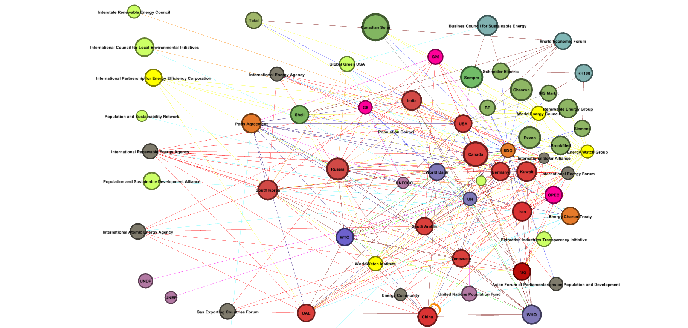

---
title: "Sustainable PowerEarth: energy use and environmental implications"
subtitle: International Environmental Institutions
author: "Alexa P. Calderón Rodríguez"
date: 2021-06-09
math: true
diagram: true
image:
  placement: 3
---

**Welcome**

Ahh climate change, THE most popular environmental problem among governments and politicians, international governmental and non-governmental organizations, civil society, environmental movements, etc. I believe that there are only very few people who deny its existence. However, despite being such a popular and known problem with the consensus of the vast majority of the planet that it is a problem that requires urgent action, no solution so far implemented, or at least semi-implemented, seems to work. Sea level continues to rise, natural disasters are becoming more and more radical and it is practically impossible to predict the weather in a city like Geneva, Switzerland where I am currently living. In defense of all those people who work daily to seek the political will and the technological tools to face this issue, I can say that the problem is huge and complex. So big and complicated that there is no single easy-to-implement solution that saves us all from apparent doom. 

Although I would love to be able to solve the problem of climate change through my humble opinion, supported by academics and scientific data of course, in this blog, I have decided to focus my efforts on one of the issues that is the problem and the solution at the same time: energy. The consumption of fossil fuels for power generation and the increasing demand due to constant population growth is one of the biggest contributors to climate change. However, what about alternative sources of energy known to all of us as clean or renewable energy? Producing sustainable energy seems to be the logical solution to this environmental problem, where renewable energies seem to be the key to success ... so why don’t we use them? That is why we will focus on analyzing, at an international level, how energy consumption is linked to climate change, the key actors that play a preponderant role in energy matters to focus on the institutions that govern renewable energies, especially, on the role that the International Renewable Energy Agency (IRENA) plays.

**Energy consumption unsustainable: What does it have to do with climate change?**

The link between energy and climate change is strong. In fact, it has been the extremely high consumption of fossil fuels that has caused the warming of the climate that we already suffer and that we will continue to experience in the coming decades. Since the beginning of the industrial age, energy consumption from fossil fuels (coal, oil, and natural gas) has been on the rise. Society, as we know it until now, is based on these energy sources and we have based our economy on them. But the burning of fossil fuels is responsible for the production of greenhouse gases, which cause global warming.

Unfortunately, energy consumption, according to [Usenobong F. Akpan and Godwin E. Akpan](https://www.researchgate.net/profile/Usenobong-Akpan-2/publication/227411028_The_Contribution_of_Energy_Consumption_to_Climate_ChangeA_Feasible_Policy_Direction/links/54d47fa60cf2970e4e63498b/The-Contribution-of-Energy-Consumption-to-Climate-ChangeA-Feasible-Policy-Direction.pdf) (2011) is currently equivalent to 80% of greenhouse gas emissions, emissions resulting from the production, transformation of energy into the products we consume on a daily basis. Meanwhile, the world's total energy supply is projected to increase by 52%, compared to 2008 standards, by 2030 and that fossil fuels will sustain 81% of the energy consumed. However, energy is also the vehicle for economic growth, particularly por developing countries. The main challenge governments and international institutions face can be summed up on how to maintain economic growth, while reducing the carbon content. 

Other institutions such as the [Organisation for Economic Co-operation and Development (OECD)](https://www.oecd.org/newsroom/sustainableenergyconsumptionandclimatechange.htm) (2007) and the International Energy Agency are more optimistic on the measures being implemented right now to move towards a more sustainable energy model. According to them, taxes (including carbon taxes), tradable emission permits, incentives for environmental innovation, harmonized standards and regulation and the identification of trade-offs will reach the ambition objective of emission reduction. With the available technology and the range of existing renewable energies, through a very optimistic lens, emissions in 2050 could be just 6% higher than 2007 standards. Still the key word is higher not lower which is what we are trying to achieve. 

The only way to stop climate change is to change our consumption patterns. It is essential to produce more with less, increase the energy efficiency of all processes and replace the consumption of fossil fuels with renewable ones. However the “how(s)” and the “whom (s)” still remain to be seen.  

**Too many players and too many interest**

Energy is a key element in the security of the States, in the social and economic development and in the sustainability of the planet, which generates strong relationships of interdependence between the different areas. The importance of the sector has caused that, at the international level, there are an endless number of actors that have a say in the governance of the energy sector and in the transition towards renewable energies. It is necessary to understand the environment, identify the main actors and their interests in order to understand why it has not been possible to reach a collective consensus that establishes a roadmap or a long-term plan, approved worldwide, to carry out the energy transition.

As [Thijs Van de Graafand and Fariborz Zelli](https://www.researchgate.net/publication/305910543_Actors_Institutions_and_Frames_in_Global_Energy_Politics) (2016) mention, the energy sector is one of the most lucrative sectors, therefore, it has attracted a large number of actors and institutions in the search for power and wealth, operating in different geographical areas, in charge of different market segments and different energy sources. Interests, perceptions and ideas are divided, in constant movement based on technological, political, economic, social and environmental changes.

According to the [Bongsuk Sung and Sang-Do Park](https://www.mdpi.com/2071-1050/10/2/448) (2018) document, the following actors can be identified: governments, international governmental organizations, non-governmental organizations and the private sector. In the image you can see different actors who play a preponderant role and the type of relationship that exists between them.

 Key lines: (i) Red- membership/financial; (ii) Navy blue- binding; (iii) Light blue- observers; (iv) Yellow-research; (v) Pink- belonging to another international organization; and (vi) Green- partnerships

**Fragmentation**

As it can be seen from the above actor analysis, due to globalization and the amount of energy issues that require collective action at regional or global scale there is a huge amount of actors involved. Therefore, if energy global governance could be described in a word it would be “fragmentation” as Van de [Graff and Zelli](https://www.researchgate.net/publication/305910543_Actors_Institutions_and_Frames_in_Global_Energy_Politics) (2016) claim. International cooperation is needed to avoid dilemmas such as free-dining, prisoner’s dilemma or tragedy of the commons when the actors face complex energy related issues such as climate change. Cooperation is also needed to disseminate around the world innovative technologies and information in order to produce sustainable practice, goods, technology and normative standards. 

According to [Van de Graff and Zelli](https://www.researchgate.net/publication/305910543_Actors_Institutions_and_Frames_in_Global_Energy_Politics) (2016) usually, International Organizations are in charge of sharing information, best practices and technological diffusion. On the other hand, the political and economic decisions that are sensitive to the energy sector are made by the States, which are unwilling to turn over the control over energy policies to any international organization or agreement.  The state interest and power is the one if not the main reason why the energy sector has no consistent international regime. There is no single international institution that governs energy, instead there are several institutions that overlap and work side by side forming what is known as a “regime complex.”

In the specific case of renewables, there is an important number of intergovernmental efforts such as the International Renewable Energy Agency (IRENA) and the Clean Energy Ministerial, that exist side by side with an increasing amount of private initiatives and public-private partnerships [(Sanderink, 2020)](https://www.sciencedirect.com/science/article/pii/S2214629619304955). In addition, we must not forget the institutions that govern energy in general. In the study carried out by [Vera Barinova](https://www.researchgate.net/publication/316533280_The_Global_Governance_of_Renewable_Energy_International_Trends_and_Russia) (2017) it can be noted that, though many of the key global energy institutions tend not to get into renewable energy issues or governance (like the Organization of Petroleum Exporting Countries), there are notable exceptions such as the International Energy Agency (IEA). 

The following infographic summarizes the complex regime and institutions that address renewable energy issues. The information is based on the reading of Young (2011) and on the official pages of IRENA, UN Energy, Sustainable Energy For All, Clean Energy Ministerial, IEA, the World Bank and the UN.

.png)

**International Renewable Energy Agency**

[IRENA](https://www.irena.org/aboutirena) (n.d.) is based in Abu Dhabi, United Arab Emirates (UAE); It is a universal international organization open to all members of the United Nations and to international economic integration organizations. IRENA currently has more than 180 members. The Agency's mission is the promotion and widespread and reinforced implementation of all forms of renewable energy and their sustainable use. The Statute of IRENA establishes that “renewable energies” should be understood as all forms of energy that come from renewable sources and that are produced in a sustainable manner; including, among others, bioenergy, geothermal energy, hydraulic energy, marine energy, solar energy and wind energy.

In regard to the institutional structure, the Assembly is the highest body of IRENA and is made up of representatives of all the Member States. It holds regular sessions at IRENA headquarters once a year. The Council is the second most important body and is made up of 21 representatives of the Member States elected on a rotating basis by the Assembly for a period of 2 years. In addition, it has the Secretariat, made up of the General Director, as the governing body and administrative director, and the necessary personnel.

IRENA's activities are epistemic in nature. [Meyer](https://www.researchgate.net/publication/256050027_Epistemic_Institutions_and_Epistemic_Cooperation_in_International_Environmental_Governance) (2013) defines "epistemic cooperation" as the way in which States organize the process of creating shared scientific knowledge relevant to environmental cooperation, and considers as "epistemic institutions" the international institutions involved in creating shared scientific knowledge. The epistemic nature of IRENA can be observed in the different activities entrusted to it by the [Statute](https://www.irena.org/-/media/Files/IRENA/Agency/About-IRENA/Statute/IRENA_FC_Statute_signed_in_Bonn_26_01_2009_incl_declaration_on_further_authentic_versions.ashx?la=en&hash=FAB3B5AE51B8082B04A7BBB5BDE978065EF67D96&hash=FAB3B5AE51B8082B04A7BBB5BDE978065EF67D96) (2009), since all of them are aimed at improving knowledge of practices, technologies and other aspects related to renewable energies, as well as efficiency and maximization of results through the good use of such knowledge. Indeed, the Agency was created with the intention of becoming a center of excellence in the field of renewable energy technology that promotes informed governance from a scientific point of view, by providing credible and useful information to regulators. The Agency does not have powers to establish obligations for its members.

Here is a video presentation that summarizes the successes and challenges that IRENA has faced in recent years, calling for the cooperation of member states to establish public policies aimed at the energy transition based on the paper [“](https://link.springer.com/article/10.1007/s10784-018-9388-y)[A place in the Sun? IRENA’s position in the global energy governance landscape” by Overland & Reischl](https://link.springer.com/article/10.1007/s10784-018-9388-y) (2018) and in the paper [“Is there a “Depth versus Participation” dilemma in international cooperation?” by Thomas Bernauer](https://moodle.graduateinstitute.ch/pluginfile.php/136831/course/section/26434/BERNAUER.pdf) (2013). 

 [Click here](https://www.youtube.com/watch?v=D7hPEdoIv0c)

**Call for cooperation in energy governance**

As we have seen, energy governance is as fragmented as it can be. Even with the vast majority of the population recognizing the urgent need to address these issues in order to tackle climate change, little has been done. We have been unable to organize ourselves adequately to move from a fossil fuels based economy towards alternative sources of energy that are renewable and cleaner. The crisis, in this case, is not one of sustainability, but one of governance. We can not reach sustainable development and in a coordinated effort without governance and this is more than evident when it comes to energy resources, with climate change as a result of mismanagement and lack of political will at a global level. This is a call for all the actors to make the radical changes needed in our energy policies, make the necessary changes to create the global governance mechanisms that can manage the much needed roadmaps to overcome the short-term interest of certain actors linked to our unsustainable fossil economy. 

[^1]: Key Lines: (i) Red- membership / financial; (ii) Navy Blue- binding; (iii) Light Blue- observers; (iv) Yellow- research; (v) Pink- belong to another IO; (vi) Green- partnerships
