-   [I. INTRODUCTION](#i.-introduction)
    -   [Ia. Hypotheses](#ia.-hypotheses)
-   [II. DATA & VISUALIZATION](#ii.-data-visualization)
    -   [IIa. Dataset](#iia.-dataset)
        -   [Identifying Variables](#identifying-variables)
        -   [Importing, Cleaning, and Manipulating the
            Dataset](#importing-cleaning-and-manipulating-the-dataset)
    -   [IIb. Measurements, Descriptive Stats, and
        Distributions](#iib.-measurements-descriptive-stats-and-distributions)
        -   [Descriptive Statistics by
            Region](#descriptive-statistics-by-region)
    -   [IIc. Missing Data &
        Diagnostics](#iic.-missing-data-diagnostics)
        -   [Missingness Map](#missingness-map)
        -   [Missing Data Pattern](#missing-data-pattern)
        -   [Omitting Data](#omitting-data)
    -   [IId. Distribution of
        Variables](#iid.-distribution-of-variables)
        -   [Distribution of Variables (mean score) by
            Region](#distribution-of-variables-mean-score-by-region)
    -   [IIe. Correlation Analysis](#iie.-correlation-analysis)
        -   [Relationship Between Happiness Score, Health (Life
            Expectancy), and Economy (GDP per
            capita)](#relationship-between-happiness-score-health-life-expectancy-and-economy-gdp-per-capita)
-   [III. METHODOLOGY](#iii.-methodology)
-   [IV. REGRESSION MODELS](#iv.-regression-models)
    -   [IVa. Modelling - Multiple Linear Regressions
        (MLR)](#iva.-modelling---multiple-linear-regressions-mlr)
    -   [IVb. Model Selection](#ivb.-model-selection)
    -   [IVc. Model Diagnostics & Assumptions
        Test](#ivc.-model-diagnostics-assumptions-test)
        -   [Multicollinearity](#multicollinearity)
        -   [Linearity, Normality, Homoskedasticity, and
            Outliers](#linearity-normality-homoskedasticity-and-outliers)
-   [V. RESULTS & DISCUSSION](#v.-results-discussion)
    -   [Hypotheses](#hypotheses)
    -   [Other Findings](#other-findings)
    -   [Va. Limitations](#va.-limitations)
    -   [Vb. Avenues for Future
        Research](#vb.-avenues-for-future-research)
-   [VI. REFERENCES](#vi.-references)
-   [VII. APPENDIX](#vii.-appendix)
    -   [Total Population & Happiness](#total-population-happiness)
    -   [Bivariate Model: Population Size &
        Happiness](#bivariate-model-population-size-happiness)

 

# I. INTRODUCTION

The COVID-19 pandemic has certainly forced societies around the world to
adapt to a period defined by social distancing, hardship, lock-down, and
confinement. Although this pandemic brought with it many challenges and
uncertainty, it also provided many people an opportunity to step back
and reflect. While taking this course virtually, I became interested in
the question: **what factors make a country and its citizens happy?**
Curious, I searched for data that could help me answer this question.
Alas, I stumbled upon the United Nation’s Sustainable Development
Solutions Networks’ (UNSDSN) annual [World Happiness
Report](https://www.kaggle.com/unsdsn/world-happiness?select=2019.csv)
for 2019. According to the organization, the annual report incorporates
a “survey of the state of global happiness that ranks 156 countries by
how happy their citizens perceive themselves to be. The World Happiness
Report 2019 focuses on happiness and the community: how happiness has
evolved over the past dozen years, with a focus on the technologies,
social norms, conflicts and government policies that have driven those
changes” (Helliwell et al. 2019). Therefore, considering the ongoing
global pandemic and the utterly abysmal social conditions it has
wrought, we could also use some positivity and *“happiness”* right now.
Why not look more into this?

“Happiness” is a very subjective experience thus, when assessing this
emotion, surveys can help assess a certain average. Indeed, in trying to
gauge this estimate, the UNSDSN relies on data derived from surveys for
social wellbeing carried out by the Gallup World Poll to build their
report. In order to calculate the average national happiness score, the
Gallup World Poll asks participants (in their respective language) to
answer the following question: “Please imagine a ladder, with steps
numbered from 0 at the bottom to 10 at the top. The top of the ladder
represents the best possible life for you and the bottom of the ladder
represents the worst possible life for you. On which step of the ladder
would you say you personally feel you stand at this time?” While this is
a bit broad, it provides some outlook on general perceptions of
wellbeing within a country.

Of course, there has been some debate around using the term “happiness”
to define subjective estimates of one’s wellbeing. As Helliwell (2020:
180) highlights, happiness “plays two important roles within the science
of wellbeing, appearing once as a prototypical positive emotion and
again as part of a cognitive life evaluation question.” True,
“happiness” is a broad term that can take into account a variety of
factors, but it too affects some social and even economic factors,
suggesting mutual relationships. Nevertheless, through this project, I
hope to look at the major factors that the UNSDSN considers to be
important while looking into whether population size plays a role in
overall happiness. Since the UNSDSN’s annual World Happiness Report is
one of the most respected reports used by states to guide public policy,
I will use the same data provided by the organization to learn more
about the relationships between happiness and several indicators.

After looking at the literature on life satisfaction and public policy
(which tend to be in economics), it appears that economic growth (i.e.,
GDP per Capita) increases wellbeing. In Deaton’s (2008: 69) work, he
indicates that there is a “very strong global relationship between per
capita GDP and life satisfaction \[which\] suggests that on average
people have a good idea of how income, or the lack of it, affects their
lives.” Easterlin (2013) disputes this finding, citing evidence that
higher economic growth rates are not accompanied by greater increments
in happiness for a wide range of developed, developing, or transition
countries (including China). Rather Easterlin (2013) suggests that
social support (i.e., welfare) plays a significant role in happiness.
Indeed, he notes that respondents living in “ultra-welfare states give
consistently higher ratings for a wide range of public services: health,
education, care of children and the elderly, and public
pensions…express\[ing\] greater trust in the political system”
(Easterlin 2013: 9). Where the two agree is on health where access to
good health services or life expectancy, as an indicator of health,
yield statistically significant results on happiness. As Deaton (2008:
69) underscores, “without health, there is very little that people can
do, and without income, health alone does little to enable people to
lead a good life.” Therefore it would be interesting to see how these
variables are linked together via an interaction term later in this
study.

Furthermore, when thinking about what would constitute a happy country,
it would not be wrong to assume that good governance (i.e., political
stability, distribution of state resources, and access to good services)
would lie at the root of the question. Therefore, using the data
provided by the UNSDSN, I will rely on OLS (multiple linear regression)
models to track the relationship between the *Happiness Score* and
independent variables such as *Economy (GDP per capita)*, *Social
Support*, *Healthy (Life Expectancy)*, *Generosity*, and *Trust
(Government Corruption)*. Although the dataset already includes these
variables, I am planning on adding other variables, such as a binary
variable for the *Population Size* (large vs. small) and a categorical
variable for the *Region*. I hope to see whether countries with smaller
populations are happier than larger ones as well as which regions are
happiest. In doing so, I aim to get a better idea of what makes
countries happier while testing the two hypotheses below.

## Ia. Hypotheses

-   **Hypothesis 1:** Countries with stronger economies (higher GDP per
    capita), longer life expectancy (i.e., better quality of life),
    greater freedom, and robust social services will be happier than
    those of the contrary.

-   **Hypothesis 2:** Countries with smaller populations will be happier
    than those with larger populations.

 

------------------------------------------------------------------------

# II. DATA & VISUALIZATION

In this section, I will introduce the *happy2019\_dta.csv* I will be
using for this short research project. This section will identify and
discuss the response/dependent variable and the explanatory/independent
variables, visualize the sample data and units of measurements, and
discuss potential issues in the data such as missing data and
questionable values.

 

## IIa. Dataset

The *happy.data\_dta.csv* dataset I will be using for this blog post is
a combination of data used in the UNSDSN’s 2019 World Happiness Report
alongside the World Bank’s population data. The 2019 World Happiness
data contains 156 country observations which means that some states are
missing. Regardless, when importing and merging the World Bank’s
population data, I adhered to the 156 observations since the UNSDSN’s
dataset contains most of the variables I am interested in using After
merging the two datasets via Microsoft Excel, I added a categorical
variable, “region,” to get a better understanding of the distribution of
variables and happiness across ten (10) different regions. Indeed, while
this project aims to get a better understanding of what factors affect
happiness the most, it also seeks to answer why some regions are happier
than others.

 

### Identifying Variables

The dependent variable for this study will be “*hscore*” or the
Happiness Score extrapolated from the 2019 World Happiness Report
dataset - where the higher the score, the happier the country. The
independent variables that will be used in this study are: GDP per
capita (*economy\_gdpc*), Life Expectancy (*health*), Social Support
(*govsupport*), Freedom to make life choices (*freedom*), Generosity
(*generous*), *Trust (Government Corruption)*, and Population Size
(small/large) (*pop\_size*).

**For Reference:**

-   The categorical variable, *region*, was factored accordingly: North
    America (1), Latin America & Caribbean (2), Western Europe (3),
    Central & Eastern Europe (4), Middle East & North Africa (5),
    Sub-Saharan Africa (6) South Asia (7), East Asia (8), Southeast Asia
    (9), Australia & New Zealand (10).

-   The binary variable, *pop\_size*, was broken down accordingly: Small
    (0), Large (1). The cutoff for a small or large population was
    derived from the median population size where populations less than
    or equal to 11.383 million were classified as small and those above
    this value were classified as large.

 

### Importing, Cleaning, and Manipulating the Dataset

Please refer to the R-Markdown code to see how the data was imported,
cleaned, and manipulated. You will find the following:

-   R Package Library
-   Renaming Variables
-   Creating & Factoring Categorical and Binary Variables

 

## IIb. Measurements, Descriptive Stats, and Distributions

**10 Highest Ranked Countries - Happiness Score**

 

**10 Lowest Ranked Countries - Happiness Score**

Taking a look at the ten highest and lowest ranking stats according to
the happiness score reveals something interesting. The top 10 countries
are located in Western Europe, North America, and Australia & New
Zealand. Alternatively, the lowest ranking countries are located in
Sub-Saharan Africa, South Asia, and the Middle East & North Africa. This
preliminary observation could indicate that developed countries are
happier than developing countries; however, more tests need to be done
before making any conclusions.

 

### Descriptive Statistics by Region

\[1\] "
<table class="\&quot;Rtable1\&quot;">
<thead>
<tr>
<th class="rowlabel firstrow lastrow">
</th>
<th class="firstrow lastrow">
North America (N=2)
</th>
<th class="firstrow lastrow">
Latin America & Caribbean (N=21)
</th>
<th class="firstrow lastrow">
Western Europe (N=19)
</th>
<th class="firstrow lastrow">
Central & Eastern Europe (N=31)
</th>
<th class="firstrow lastrow">
Middle East & North Africa (N=19)
</th>
<th class="firstrow lastrow">
Sub-Saharan Africa (N=40)
</th>
<th class="firstrow lastrow">
South Asia (N=7)
</th>
<th class="firstrow lastrow">
East Asia (N=6)
</th>
<th class="firstrow lastrow">
Southeast Asia (N=9)
</th>
<th class="firstrow lastrow">
Australia & New Zealand (N=2)
</th>
<th class="firstrow lastrow">
Overall (N=156)
</th>
</tr>
</thead>
<tbody>
<tr>
<td class="rowlabel firstrow">
hscore
</td>
<td class="firstrow">
</td>
<td class="firstrow">
</td>
<td class="firstrow">
</td>
<td class="firstrow">
</td>
<td class="firstrow">
</td>
<td class="firstrow">
</td>
<td class="firstrow">
</td>
<td class="firstrow">
</td>
<td class="firstrow">
</td>
<td class="firstrow">
</td>
<td class="firstrow">
</td>
</tr>
<tr>
<td class="rowlabel">
Mean (SD)
</td>
<td>
7.09 (0.273)
</td>
<td>
5.95 (0.724)
</td>
<td>
6.94 (0.667)
</td>
<td>
5.58 (0.571)
</td>
<td>
5.24 (1.06)
</td>
<td>
4.30 (0.625)
</td>
<td>
4.53 (0.793)
</td>
<td>
5.69 (0.476)
</td>
<td>
5.27 (0.618)
</td>
<td>
7.27 (0.0559)
</td>
<td>
5.41 (1.11)
</td>
</tr>
<tr>
<td class="rowlabel lastrow">
Median \[Min, Max\]
</td>
<td class="lastrow">
7.09 \[6.89, 7.28\]
</td>
<td class="lastrow">
6.11 \[3.60, 7.17\]
</td>
<td class="lastrow">
7.05 \[5.29, 7.77\]
</td>
<td class="lastrow">
5.60 \[4.33, 6.85\]
</td>
<td class="lastrow">
5.21 \[3.38, 7.14\]
</td>
<td class="lastrow">
4.40 \[2.85, 5.89\]
</td>
<td class="lastrow">
4.46 \[3.20, 5.65\]
</td>
<td class="lastrow">
5.66 \[5.19, 6.45\]
</td>
<td class="lastrow">
5.19 \[4.36, 6.26\]
</td>
<td class="lastrow">
7.27 \[7.23, 7.31\]
</td>
<td class="lastrow">
5.38 \[2.85, 7.77\]
</td>
</tr>
<tr>
<td class="rowlabel firstrow">
region
</td>
<td class="firstrow">
</td>
<td class="firstrow">
</td>
<td class="firstrow">
</td>
<td class="firstrow">
</td>
<td class="firstrow">
</td>
<td class="firstrow">
</td>
<td class="firstrow">
</td>
<td class="firstrow">
</td>
<td class="firstrow">
</td>
<td class="firstrow">
</td>
<td class="firstrow">
</td>
</tr>
<tr>
<td class="rowlabel">
North America
</td>
<td>
2 (100%)
</td>
<td>
0 (0%)
</td>
<td>
0 (0%)
</td>
<td>
0 (0%)
</td>
<td>
0 (0%)
</td>
<td>
0 (0%)
</td>
<td>
0 (0%)
</td>
<td>
0 (0%)
</td>
<td>
0 (0%)
</td>
<td>
0 (0%)
</td>
<td>
2 (1.3%)
</td>
</tr>
<tr>
<td class="rowlabel">
Latin America & Caribbean
</td>
<td>
0 (0%)
</td>
<td>
21 (100%)
</td>
<td>
0 (0%)
</td>
<td>
0 (0%)
</td>
<td>
0 (0%)
</td>
<td>
0 (0%)
</td>
<td>
0 (0%)
</td>
<td>
0 (0%)
</td>
<td>
0 (0%)
</td>
<td>
0 (0%)
</td>
<td>
21 (13.5%)
</td>
</tr>
<tr>
<td class="rowlabel">
Western Europe
</td>
<td>
0 (0%)
</td>
<td>
0 (0%)
</td>
<td>
19 (100%)
</td>
<td>
0 (0%)
</td>
<td>
0 (0%)
</td>
<td>
0 (0%)
</td>
<td>
0 (0%)
</td>
<td>
0 (0%)
</td>
<td>
0 (0%)
</td>
<td>
0 (0%)
</td>
<td>
19 (12.2%)
</td>
</tr>
<tr>
<td class="rowlabel">
Central & Eastern Europe
</td>
<td>
0 (0%)
</td>
<td>
0 (0%)
</td>
<td>
0 (0%)
</td>
<td>
31 (100%)
</td>
<td>
0 (0%)
</td>
<td>
0 (0%)
</td>
<td>
0 (0%)
</td>
<td>
0 (0%)
</td>
<td>
0 (0%)
</td>
<td>
0 (0%)
</td>
<td>
31 (19.9%)
</td>
</tr>
<tr>
<td class="rowlabel">
Middle East & North Africa
</td>
<td>
0 (0%)
</td>
<td>
0 (0%)
</td>
<td>
0 (0%)
</td>
<td>
0 (0%)
</td>
<td>
19 (100%)
</td>
<td>
0 (0%)
</td>
<td>
0 (0%)
</td>
<td>
0 (0%)
</td>
<td>
0 (0%)
</td>
<td>
0 (0%)
</td>
<td>
19 (12.2%)
</td>
</tr>
<tr>
<td class="rowlabel">
Sub-Saharan Africa
</td>
<td>
0 (0%)
</td>
<td>
0 (0%)
</td>
<td>
0 (0%)
</td>
<td>
0 (0%)
</td>
<td>
0 (0%)
</td>
<td>
40 (100%)
</td>
<td>
0 (0%)
</td>
<td>
0 (0%)
</td>
<td>
0 (0%)
</td>
<td>
0 (0%)
</td>
<td>
40 (25.6%)
</td>
</tr>
<tr>
<td class="rowlabel">
South Asia
</td>
<td>
0 (0%)
</td>
<td>
0 (0%)
</td>
<td>
0 (0%)
</td>
<td>
0 (0%)
</td>
<td>
0 (0%)
</td>
<td>
0 (0%)
</td>
<td>
7 (100%)
</td>
<td>
0 (0%)
</td>
<td>
0 (0%)
</td>
<td>
0 (0%)
</td>
<td>
7 (4.5%)
</td>
</tr>
<tr>
<td class="rowlabel">
East Asia
</td>
<td>
0 (0%)
</td>
<td>
0 (0%)
</td>
<td>
0 (0%)
</td>
<td>
0 (0%)
</td>
<td>
0 (0%)
</td>
<td>
0 (0%)
</td>
<td>
0 (0%)
</td>
<td>
6 (100%)
</td>
<td>
0 (0%)
</td>
<td>
0 (0%)
</td>
<td>
6 (3.8%)
</td>
</tr>
<tr>
<td class="rowlabel">
Southeast Asia
</td>
<td>
0 (0%)
</td>
<td>
0 (0%)
</td>
<td>
0 (0%)
</td>
<td>
0 (0%)
</td>
<td>
0 (0%)
</td>
<td>
0 (0%)
</td>
<td>
0 (0%)
</td>
<td>
0 (0%)
</td>
<td>
9 (100%)
</td>
<td>
0 (0%)
</td>
<td>
9 (5.8%)
</td>
</tr>
<tr>
<td class="rowlabel lastrow">
Australia & New Zealand
</td>
<td class="lastrow">
0 (0%)
</td>
<td class="lastrow">
0 (0%)
</td>
<td class="lastrow">
0 (0%)
</td>
<td class="lastrow">
0 (0%)
</td>
<td class="lastrow">
0 (0%)
</td>
<td class="lastrow">
0 (0%)
</td>
<td class="lastrow">
0 (0%)
</td>
<td class="lastrow">
0 (0%)
</td>
<td class="lastrow">
0 (0%)
</td>
<td class="lastrow">
2 (100%)
</td>
<td class="lastrow">
2 (1.3%)
</td>
</tr>
<tr>
<td class="rowlabel firstrow">
economy\_gdpc
</td>
<td class="firstrow">
</td>
<td class="firstrow">
</td>
<td class="firstrow">
</td>
<td class="firstrow">
</td>
<td class="firstrow">
</td>
<td class="firstrow">
</td>
<td class="firstrow">
</td>
<td class="firstrow">
</td>
<td class="firstrow">
</td>
<td class="firstrow">
</td>
<td class="firstrow">
</td>
</tr>
<tr>
<td class="rowlabel">
Mean (SD)
</td>
<td>
1.40 (0.0481)
</td>
<td>
0.924 (0.210)
</td>
<td>
1.37 (0.0988)
</td>
<td>
1.04 (0.214)
</td>
<td>
1.06 (0.347)
</td>
<td>
0.455 (0.282)
</td>
<td>
0.650 (0.211)
</td>
<td>
1.24 (0.198)
</td>
<td>
0.930 (0.309)
</td>
<td>
1.34 (0.0488)
</td>
<td>
0.911 (0.393)
</td>
</tr>
<tr>
<td class="rowlabel">
Median \[Min, Max\]
</td>
<td>
1.40 \[1.37, 1.43\]
</td>
<td>
0.960 \[0.323, 1.23\]
</td>
<td>
1.37 \[1.18, 1.61\]
</td>
<td>
1.07 \[0.493, 1.27\]
</td>
<td>
1.04 \[0.287, 1.68\]
</td>
<td>
0.380 \[0.0260, 1.12\]
</td>
<td>
0.677 \[0.350, 0.949\]
</td>
<td>
1.31 \[0.948, 1.44\]
</td>
<td>
0.807 \[0.574, 1.57\]
</td>
<td>
1.34 \[1.30, 1.37\]
</td>
<td>
0.960 \[0.0260, 1.68\]
</td>
</tr>
<tr>
<td class="rowlabel lastrow">
Missing
</td>
<td class="lastrow">
0 (0%)
</td>
<td class="lastrow">
0 (0%)
</td>
<td class="lastrow">
0 (0%)
</td>
<td class="lastrow">
0 (0%)
</td>
<td class="lastrow">
0 (0%)
</td>
<td class="lastrow">
1 (2.5%)
</td>
<td class="lastrow">
0 (0%)
</td>
<td class="lastrow">
0 (0%)
</td>
<td class="lastrow">
0 (0%)
</td>
<td class="lastrow">
0 (0%)
</td>
<td class="lastrow">
1 (0.6%)
</td>
</tr>
<tr>
<td class="rowlabel firstrow">
govsupport
</td>
<td class="firstrow">
</td>
<td class="firstrow">
</td>
<td class="firstrow">
</td>
<td class="firstrow">
</td>
<td class="firstrow">
</td>
<td class="firstrow">
</td>
<td class="firstrow">
</td>
<td class="firstrow">
</td>
<td class="firstrow">
</td>
<td class="firstrow">
</td>
<td class="firstrow">
</td>
</tr>
<tr>
<td class="rowlabel">
Mean (SD)
</td>
<td>
1.48 (0.0339)
</td>
<td>
1.34 (0.173)
</td>
<td>
1.50 (0.0967)
</td>
<td>
1.33 (0.208)
</td>
<td>
1.15 (0.263)
</td>
<td>
0.940 (0.239)
</td>
<td>
0.987 (0.297)
</td>
<td>
1.33 (0.152)
</td>
<td>
1.25 (0.141)
</td>
<td>
1.55 (0.00636)
</td>
<td>
1.22 (0.284)
</td>
</tr>
<tr>
<td class="rowlabel">
Median \[Min, Max\]
</td>
<td>
1.48 \[1.46, 1.51\]
</td>
<td>
1.40 \[0.688, 1.48\]
</td>
<td>
1.50 \[1.16, 1.62\]
</td>
<td>
1.39 \[0.666, 1.54\]
</td>
<td>
1.23 \[0.378, 1.46\]
</td>
<td>
0.939 \[0.437, 1.40\]
</td>
<td>
0.928 \[0.517, 1.32\]
</td>
<td>
1.35 \[1.13, 1.53\]
</td>
<td>
1.20 \[1.03, 1.46\]
</td>
<td>
1.55 \[1.55, 1.56\]
</td>
<td>
1.27 \[0.378, 1.62\]
</td>
</tr>
<tr>
<td class="rowlabel lastrow">
Missing
</td>
<td class="lastrow">
0 (0%)
</td>
<td class="lastrow">
0 (0%)
</td>
<td class="lastrow">
0 (0%)
</td>
<td class="lastrow">
0 (0%)
</td>
<td class="lastrow">
0 (0%)
</td>
<td class="lastrow">
1 (2.5%)
</td>
<td class="lastrow">
0 (0%)
</td>
<td class="lastrow">
0 (0%)
</td>
<td class="lastrow">
0 (0%)
</td>
<td class="lastrow">
0 (0%)
</td>
<td class="lastrow">
1 (0.6%)
</td>
</tr>
<tr>
<td class="rowlabel firstrow">
health
</td>
<td class="firstrow">
</td>
<td class="firstrow">
</td>
<td class="firstrow">
</td>
<td class="firstrow">
</td>
<td class="firstrow">
</td>
<td class="firstrow">
</td>
<td class="firstrow">
</td>
<td class="firstrow">
</td>
<td class="firstrow">
</td>
<td class="firstrow">
</td>
<td class="firstrow">
</td>
</tr>
<tr>
<td class="rowlabel">
Mean (SD)
</td>
<td>
0.957 (0.117)
</td>
<td>
0.812 (0.106)
</td>
<td>
1.01 (0.0232)
</td>
<td>
0.825 (0.0905)
</td>
<td>
0.751 (0.143)
</td>
<td>
0.418 (0.138)
</td>
<td>
0.617 (0.149)
</td>
<td>
0.953 (0.168)
</td>
<td>
0.745 (0.188)
</td>
<td>
1.03 (0.00707)
</td>
<td>
0.730 (0.236)
</td>
</tr>
<tr>
<td class="rowlabel">
Median \[Min, Max\]
</td>
<td>
0.957 \[0.874, 1.04\]
</td>
<td>
0.831 \[0.449, 0.963\]
</td>
<td>
0.999 \[0.986, 1.06\]
</td>
<td>
0.818 \[0.657, 1.04\]
</td>
<td>
0.795 \[0.440, 1.03\]
</td>
<td>
0.428 \[0.105, 0.798\]
</td>
<td>
0.604 \[0.361, 0.831\]
</td>
<td>
0.975 \[0.667, 1.12\]
</td>
<td>
0.660 \[0.551, 1.14\]
</td>
<td>
1.03 \[1.03, 1.04\]
</td>
<td>
0.789 \[0.105, 1.14\]
</td>
</tr>
<tr>
<td class="rowlabel lastrow">
Missing
</td>
<td class="lastrow">
0 (0%)
</td>
<td class="lastrow">
0 (0%)
</td>
<td class="lastrow">
0 (0%)
</td>
<td class="lastrow">
0 (0%)
</td>
<td class="lastrow">
0 (0%)
</td>
<td class="lastrow">
1 (2.5%)
</td>
<td class="lastrow">
0 (0%)
</td>
<td class="lastrow">
0 (0%)
</td>
<td class="lastrow">
0 (0%)
</td>
<td class="lastrow">
0 (0%)
</td>
<td class="lastrow">
1 (0.6%)
</td>
</tr>
<tr>
<td class="rowlabel firstrow">
freedom
</td>
<td class="firstrow">
</td>
<td class="firstrow">
</td>
<td class="firstrow">
</td>
<td class="firstrow">
</td>
<td class="firstrow">
</td>
<td class="firstrow">
</td>
<td class="firstrow">
</td>
<td class="firstrow">
</td>
<td class="firstrow">
</td>
<td class="firstrow">
</td>
<td class="firstrow">
</td>
</tr>
<tr>
<td class="rowlabel">
Mean (SD)
</td>
<td>
0.519 (0.0919)
</td>
<td>
0.441 (0.128)
</td>
<td>
0.487 (0.137)
</td>
<td>
0.361 (0.114)
</td>
<td>
0.318 (0.167)
</td>
<td>
0.337 (0.118)
</td>
<td>
0.451 (0.0743)
</td>
<td>
0.372 (0.127)
</td>
<td>
0.544 (0.0339)
</td>
<td>
0.571 (0.0198)
</td>
<td>
0.395 (0.140)
</td>
</tr>
<tr>
<td class="rowlabel">
Median \[Min, Max\]
</td>
<td>
0.519 \[0.454, 0.584\]
</td>
<td>
0.489 \[0.0260, 0.558\]
</td>
<td>
0.526 \[0.0670, 0.603\]
</td>
<td>
0.346 \[0.178, 0.631\]
</td>
<td>
0.305 \[0.0130, 0.598\]
</td>
<td>
0.354 \[0.0100, 0.559\]
</td>
<td>
0.464 \[0.313, 0.527\]
</td>
<td>
0.396 \[0.159, 0.521\]
</td>
<td>
0.547 \[0.491, 0.609\]
</td>
<td>
0.571 \[0.557, 0.585\]
</td>
<td>
0.417 \[0.0100, 0.631\]
</td>
</tr>
<tr>
<td class="rowlabel lastrow">
Missing
</td>
<td class="lastrow">
0 (0%)
</td>
<td class="lastrow">
0 (0%)
</td>
<td class="lastrow">
0 (0%)
</td>
<td class="lastrow">
0 (0%)
</td>
<td class="lastrow">
0 (0%)
</td>
<td class="lastrow">
0 (0%)
</td>
<td class="lastrow">
1 (14.3%)
</td>
<td class="lastrow">
0 (0%)
</td>
<td class="lastrow">
0 (0%)
</td>
<td class="lastrow">
0 (0%)
</td>
<td class="lastrow">
1 (0.6%)
</td>
</tr>
<tr>
<td class="rowlabel firstrow">
generous
</td>
<td class="firstrow">
</td>
<td class="firstrow">
</td>
<td class="firstrow">
</td>
<td class="firstrow">
</td>
<td class="firstrow">
</td>
<td class="firstrow">
</td>
<td class="firstrow">
</td>
<td class="firstrow">
</td>
<td class="firstrow">
</td>
<td class="firstrow">
</td>
<td class="firstrow">
</td>
</tr>
<tr>
<td class="rowlabel">
Mean (SD)
</td>
<td>
0.283 (0.00354)
</td>
<td>
0.145 (0.0798)
</td>
<td>
0.235 (0.0906)
</td>
<td>
0.146 (0.0780)
</td>
<td>
0.153 (0.0869)
</td>
<td>
0.188 (0.0692)
</td>
<td>
0.235 (0.0741)
</td>
<td>
0.173 (0.0893)
</td>
<td>
0.302 (0.149)
</td>
<td>
0.331 (0.00141)
</td>
<td>
0.186 (0.0944)
</td>
</tr>
<tr>
<td class="rowlabel">
Median \[Min, Max\]
</td>
<td>
0.283 \[0.280, 0.285\]
</td>
<td>
0.126 \[0.0640, 0.419\]
</td>
<td>
0.257 \[0.0470, 0.375\]
</td>
<td>
0.137 \[0.0350, 0.322\]
</td>
<td>
0.133 \[0.0360, 0.331\]
</td>
<td>
0.198 \[0.0250, 0.372\]
</td>
<td>
0.220 \[0.158, 0.370\]
</td>
<td>
0.205 \[0.0580, 0.258\]
</td>
<td>
0.266 \[0.117, 0.566\]
</td>
<td>
0.331 \[0.330, 0.332\]
</td>
<td>
0.178 \[0.0250, 0.566\]
</td>
</tr>
<tr>
<td class="rowlabel lastrow">
Missing
</td>
<td class="lastrow">
0 (0%)
</td>
<td class="lastrow">
0 (0%)
</td>
<td class="lastrow">
1 (5.3%)
</td>
<td class="lastrow">
0 (0%)
</td>
<td class="lastrow">
0 (0%)
</td>
<td class="lastrow">
0 (0%)
</td>
<td class="lastrow">
0 (0%)
</td>
<td class="lastrow">
0 (0%)
</td>
<td class="lastrow">
0 (0%)
</td>
<td class="lastrow">
0 (0%)
</td>
<td class="lastrow">
1 (0.6%)
</td>
</tr>
<tr>
<td class="rowlabel firstrow">
trust
</td>
<td class="firstrow">
</td>
<td class="firstrow">
</td>
<td class="firstrow">
</td>
<td class="firstrow">
</td>
<td class="firstrow">
</td>
<td class="firstrow">
</td>
<td class="firstrow">
</td>
<td class="firstrow">
</td>
<td class="firstrow">
</td>
<td class="firstrow">
</td>
<td class="firstrow">
</td>
</tr>
<tr>
<td class="rowlabel">
Mean (SD)
</td>
<td>
0.218 (0.127)
</td>
<td>
0.0720 (0.0337)
</td>
<td>
0.231 (0.127)
</td>
<td>
0.0665 (0.0642)
</td>
<td>
0.105 (0.0403)
</td>
<td>
0.0945 (0.0690)
</td>
<td>
0.0934 (0.0497)
</td>
<td>
0.120 (0.0895)
</td>
<td>
0.123 (0.136)
</td>
<td>
0.335 (0.0636)
</td>
<td>
0.111 (0.0944)
</td>
</tr>
<tr>
<td class="rowlabel">
Median \[Min, Max\]
</td>
<td>
0.218 \[0.128, 0.308\]
</td>
<td>
0.0740 \[0.0160, 0.150\]
</td>
<td>
0.265 \[0.0250, 0.410\]
</td>
<td>
0.0400 \[0.00400, 0.240\]
</td>
<td>
0.106 \[0.0270, 0.182\]
</td>
<td>
0.0855 \[0.0330, 0.411\]
</td>
<td>
0.0890 \[0.0250, 0.167\]
</td>
<td>
0.0985 \[0.0380, 0.287\]
</td>
<td>
0.0730 \[0.0240, 0.453\]
</td>
<td>
0.335 \[0.290, 0.380\]
</td>
<td>
0.0860 \[0.00400, 0.453\]
</td>
</tr>
<tr>
<td class="rowlabel lastrow">
Missing
</td>
<td class="lastrow">
0 (0%)
</td>
<td class="lastrow">
0 (0%)
</td>
<td class="lastrow">
0 (0%)
</td>
<td class="lastrow">
1 (3.2%)
</td>
<td class="lastrow">
0 (0%)
</td>
<td class="lastrow">
0 (0%)
</td>
<td class="lastrow">
0 (0%)
</td>
<td class="lastrow">
0 (0%)
</td>
<td class="lastrow">
0 (0%)
</td>
<td class="lastrow">
0 (0%)
</td>
<td class="lastrow">
1 (0.6%)
</td>
</tr>
<tr>
<td class="rowlabel firstrow">
pop\_in\_millions
</td>
<td class="firstrow">
</td>
<td class="firstrow">
</td>
<td class="firstrow">
</td>
<td class="firstrow">
</td>
<td class="firstrow">
</td>
<td class="firstrow">
</td>
<td class="firstrow">
</td>
<td class="firstrow">
</td>
<td class="firstrow">
</td>
<td class="firstrow">
</td>
<td class="firstrow">
</td>
</tr>
<tr>
<td class="rowlabel">
Mean (SD)
</td>
<td>
183 (206)
</td>
<td>
29.9 (50.0)
</td>
<td>
22.4 (27.1)
</td>
<td>
13.3 (26.7)
</td>
<td>
28.1 (30.3)
</td>
<td>
25.6 (37.1)
</td>
<td>
262 (494)
</td>
<td>
268 (555)
</td>
<td>
73.4 (82.9)
</td>
<td>
15.2 (14.4)
</td>
<td>
48.2 (161)
</td>
</tr>
<tr>
<td class="rowlabel lastrow">
Median \[Min, Max\]
</td>
<td class="lastrow">
183 \[37.6, 328\]
</td>
<td class="lastrow">
11.3 \[1.39, 211\]
</td>
<td class="lastrow">
10.3 \[0.361, 83.1\]
</td>
<td class="lastrow">
5.45 \[0.326, 144\]
</td>
<td class="lastrow">
11.7 \[1.64, 100\]
</td>
<td class="lastrow">
15.0 \[0.851, 201\]
</td>
<td class="lastrow">
38.0 \[0.763, 1370\]
</td>
<td class="lastrow">
37.7 \[3.23, 1400\]
</td>
<td class="lastrow">
54.0 \[5.70, 271\]
</td>
<td class="lastrow">
15.2 \[4.98, 25.4\]
</td>
<td class="lastrow">
11.4 \[0.326, 1400\]
</td>
</tr>
<tr>
<td class="rowlabel firstrow">
pop\_size
</td>
<td class="firstrow">
</td>
<td class="firstrow">
</td>
<td class="firstrow">
</td>
<td class="firstrow">
</td>
<td class="firstrow">
</td>
<td class="firstrow">
</td>
<td class="firstrow">
</td>
<td class="firstrow">
</td>
<td class="firstrow">
</td>
<td class="firstrow">
</td>
<td class="firstrow">
</td>
</tr>
<tr>
<td class="rowlabel">
Small
</td>
<td>
0 (0%)
</td>
<td>
11 (52.4%)
</td>
<td>
12 (63.2%)
</td>
<td>
25 (80.6%)
</td>
<td>
9 (47.4%)
</td>
<td>
15 (37.5%)
</td>
<td>
1 (14.3%)
</td>
<td>
2 (33.3%)
</td>
<td>
2 (22.2%)
</td>
<td>
1 (50.0%)
</td>
<td>
78 (50.0%)
</td>
</tr>
<tr>
<td class="rowlabel lastrow">
Large
</td>
<td class="lastrow">
2 (100%)
</td>
<td class="lastrow">
10 (47.6%)
</td>
<td class="lastrow">
7 (36.8%)
</td>
<td class="lastrow">
6 (19.4%)
</td>
<td class="lastrow">
10 (52.6%)
</td>
<td class="lastrow">
25 (62.5%)
</td>
<td class="lastrow">
6 (85.7%)
</td>
<td class="lastrow">
4 (66.7%)
</td>
<td class="lastrow">
7 (77.8%)
</td>
<td class="lastrow">
1 (50.0%)
</td>
<td class="lastrow">
78 (50.0%)
</td>
</tr>
</tbody>
</table>

"

 

## IIc. Missing Data & Diagnostics

In this subsection, I analyze the data by conducting a series of tests
to check the robustness of the dataset and make sure there are no causes
for alarm before creating models. For instance, I start by checking
whether or not there are missing data values, followed by observing the
overall distribution of the dependent value as well as by region.
Afterward, I look for any correlations between variables as well as
outliers. Finally, after these checks are done, I create preliminary OLS
models that will serve further tests to discover the absence or presence
of heteroskedasticity.

Because missing values in data are a common problem, I use the Amelia
package (first tab) and the Mice package (second tab) to get a better
view of my dataset. Looking at the graphs, it appears that there are six
(6) missing values for different observations. In other words, the
observations with missing data have no more than one missing value.
Regardless of these gaps, the percentage of missing data is so low that
the function returns a score of 0%. Therefore, the statistical power of
the regression models that will be created below will not be
significantly reduced.

If a dataset still maintains a large number of observations, then one
way to deal with missing data is to delete or omit missing values from
the observations or rows that contain these gaps. Furthermore, this
results in complete data. Although this makes the data cleaner to use,
can reduce the sample size and statistical power. However, as mentioned
above, the missing data are so few that it will not affect the
statistical power of our models.

### Missingness Map

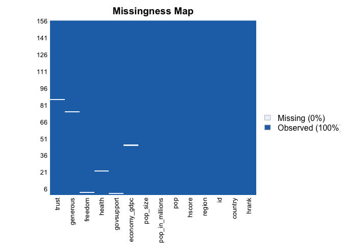

 

### Missing Data Pattern

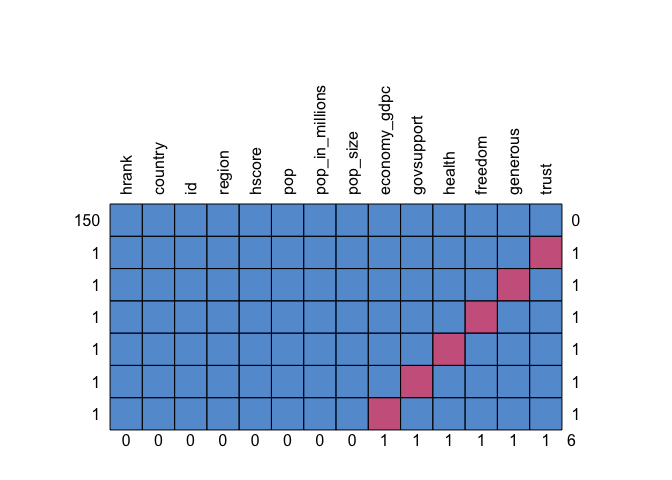

 

### Omitting Data

Therefore, I will update the dataset by omitting the missing values.

    happy.data <- na.omit(happy.data)
    view(happy.data)

 

## IId. Distribution of Variables

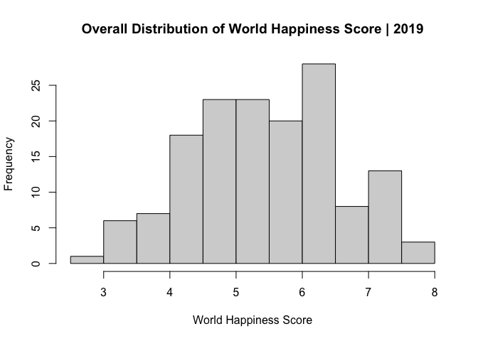

When viewing the distribution of the dependent variable (hscore), it
appears that the distribution is slightly skewed to the right; however,
it is still relatively normal.

 

### Distribution of Variables (mean score) by Region

#### Mean Value Distribution of Happiness Score by Region

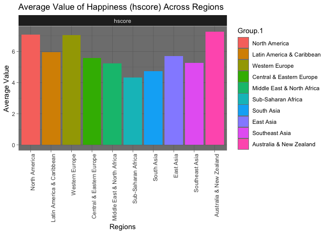

After calculating the mean scores for each variable for each region, it
appears that North America, Western Europe, and Australia & New Zealand
were the happiest regions in the world in 2019. Contrarily, the Middle
East & North Africa, Sub-Saharan Africa, and South Asia were the least
happy regions in the world in 2019. Economic disparities among the
regions as well as varying levels of political freedoms could have
played an integral role in this outcome.

 

#### Mean Value Distribution of GDP per capita, Social Support, and Life Expectancy by Region

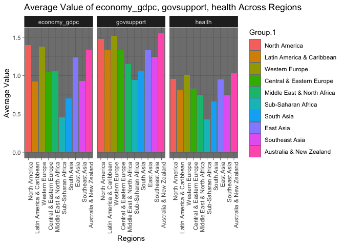

Continuing along this analysis, it appears that there is repeating
pattern. The three happiest regions outlined above are also the top
performers among these three variables. The opposite is also true.

 

#### Mean Value Distribution of Freedom, Generosity, and Trust (Government Corruption) by Region

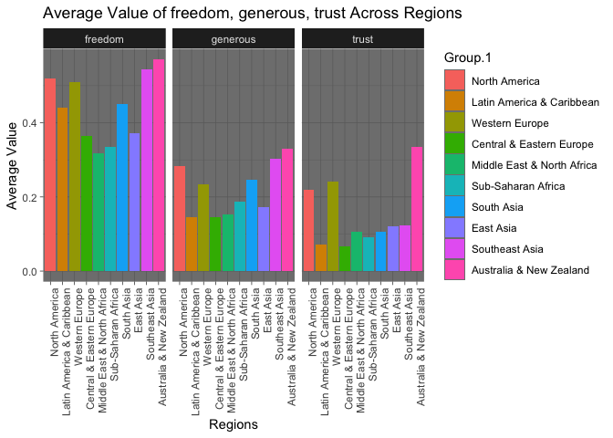

The distribution of values for this series of variables is quite
interesting. In terms of freedom, the top performers are Australia & New
Zealand, Southeast Asia, and North America (Western Europe comes in
fourth); however, the lowest performers are Central Europe, the Middle
East & North Africa, and Sub-Saharan Africa. Generosity and Trust in
one’s government show similar trends in terms of top performers but
changes among the lowest performers.

 

#### Distribution of Happiness Score via Boxplot

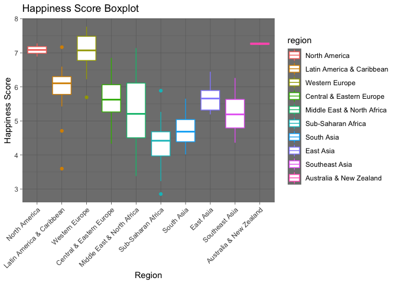

The boxplot above shows the distribution of happiness scores (the
dependent variable), by region. Again, it is clear that North America,
Western Europe, and Australia & New Zealand have the highest hscores
relative to other regions. Another point worth noting is the Middle East
& North Africa region has the largest range of scores comparatively.

 

## IIe. Correlation Analysis

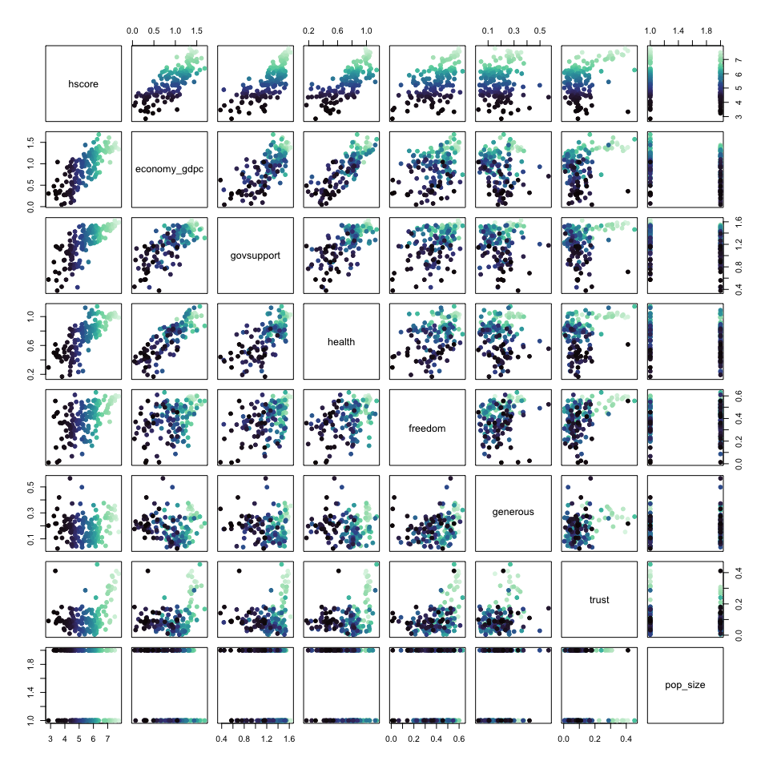

Relying on a correlation matrix, can give us a better understanding of
the relationship between the dependent variable (*hscore*) and relevant
independent variables. As the matrix above shows, hscore has a strong
positive linear relationship with *economy\_gdpc*, *govsupport*, and
*health.* Additionally, it appears that the *generous* and *trust*
variables have little to no relationship with *hscore*, whereas, the
relationship between *freedom* and *hscore* is positive but quite weak.

 

### Relationship Between Happiness Score, Health (Life Expectancy), and Economy (GDP per capita)

It appears that the happiness score, health (life expectancy), and
economy (GDP per capita) share a positive linear relationship. For
instance, as the graph below shows, the higher the health and economy
value, the higher the happiness score. Moreover, as indicated by the
color gauge for health score, it appears that health (life expectancy)
plays a significant effect on the happiness score. Although the line of
best fit (tab 2) returns a slightly sigmoidal relationship, the
relationship between these variables is more or less linear.

#### Scatter Plot

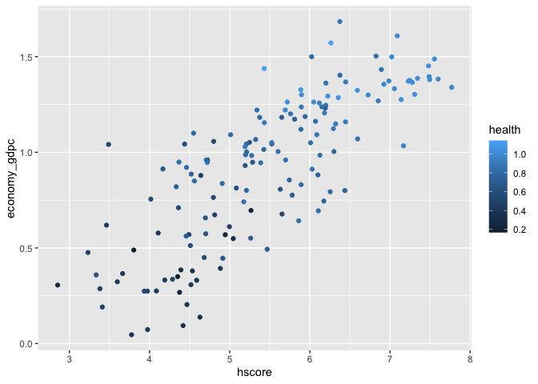
 

------------------------------------------------------------------------

#### Scatter Plot with Fitted Line

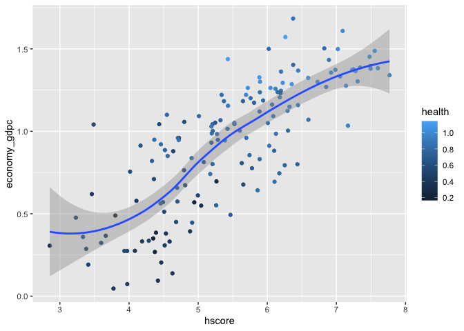

 

------------------------------------------------------------------------

# III. METHODOLOGY

For this project, I will use an extension of ordinary least-squares
regression (OLS), specifically, multiple linear regression models, to
test my hypotheses. Multiple linear regression models are the logical
choice for this study since (1) I have one dependent variable (hscore)
and multiple independent variables, and (2) I am curious to see the
(non)linear relationship between my response/dependent variable and
explanatory/independent variables. Since happiness is a subjective
emotional experience, it is predicated on a compendium of factors.
Therefore, at the macro level (i.e., country-level), I hope to get a
better sense of what main factors affect happiness, in general, across
the world.

In using multiple linear regression models, there are certain
assumptions the must be taken into consideration:

1.  There is a linear relationship between the dependent variable and
    independent variables.
2.  The residuals, the difference between the observed value of the
    dependent variable and its predicted value, are normally distributed
    around a mean of 0.
3.  The independent variables are not highly correlated with each other.
    In other words, there is no major sign of multicollinearity.

 

------------------------------------------------------------------------

# IV. REGRESSION MODELS

## IVa. Modelling - Multiple Linear Regressions (MLR)

 

<table style="border-collapse:collapse; border:none;">
<caption style="font-weight: bold; text-align:left;">
Table 1 - Effects on Happiness (hscore) Among States
</caption>
<tr>
<th style="border-top: double; text-align:center; font-style:normal; font-weight:bold; padding:0.2cm;  text-align:left; ">
 
</th>
<th colspan="3" style="border-top: double; text-align:center; font-style:normal; font-weight:bold; padding:0.2cm; ">
Model 1
</th>
<th colspan="3" style="border-top: double; text-align:center; font-style:normal; font-weight:bold; padding:0.2cm; ">
Model 2
</th>
<th colspan="3" style="border-top: double; text-align:center; font-style:normal; font-weight:bold; padding:0.2cm; ">
Model 3
</th>
<th colspan="3" style="border-top: double; text-align:center; font-style:normal; font-weight:bold; padding:0.2cm; ">
Model 4
</th>
<th colspan="3" style="border-top: double; text-align:center; font-style:normal; font-weight:bold; padding:0.2cm; ">
Model 5
</th>
<th colspan="3" style="border-top: double; text-align:center; font-style:normal; font-weight:bold; padding:0.2cm; ">
Model 6
</th>
</tr>
<tr>
<td style=" text-align:center; border-bottom:1px solid; font-style:italic; font-weight:normal;  text-align:left; ">
Predictors
</td>
<td style=" text-align:center; border-bottom:1px solid; font-style:italic; font-weight:normal;  ">
Estimates
</td>
<td style=" text-align:center; border-bottom:1px solid; font-style:italic; font-weight:normal;  ">
std. Error
</td>
<td style=" text-align:center; border-bottom:1px solid; font-style:italic; font-weight:normal;  ">
CI
</td>
<td style=" text-align:center; border-bottom:1px solid; font-style:italic; font-weight:normal;  ">
Estimates
</td>
<td style=" text-align:center; border-bottom:1px solid; font-style:italic; font-weight:normal;  ">
std. Error
</td>
<td style=" text-align:center; border-bottom:1px solid; font-style:italic; font-weight:normal;  col7">
CI
</td>
<td style=" text-align:center; border-bottom:1px solid; font-style:italic; font-weight:normal;  col8">
Estimates
</td>
<td style=" text-align:center; border-bottom:1px solid; font-style:italic; font-weight:normal;  col9">
std. Error
</td>
<td style=" text-align:center; border-bottom:1px solid; font-style:italic; font-weight:normal;  0">
CI
</td>
<td style=" text-align:center; border-bottom:1px solid; font-style:italic; font-weight:normal;  1">
Estimates
</td>
<td style=" text-align:center; border-bottom:1px solid; font-style:italic; font-weight:normal;  2">
std. Error
</td>
<td style=" text-align:center; border-bottom:1px solid; font-style:italic; font-weight:normal;  3">
CI
</td>
<td style=" text-align:center; border-bottom:1px solid; font-style:italic; font-weight:normal;  4">
Estimates
</td>
<td style=" text-align:center; border-bottom:1px solid; font-style:italic; font-weight:normal;  5">
std. Error
</td>
<td style=" text-align:center; border-bottom:1px solid; font-style:italic; font-weight:normal;  6">
CI
</td>
<td style=" text-align:center; border-bottom:1px solid; font-style:italic; font-weight:normal;  7">
Estimates
</td>
<td style=" text-align:center; border-bottom:1px solid; font-style:italic; font-weight:normal;  8">
std. Error
</td>
<td style=" text-align:center; border-bottom:1px solid; font-style:italic; font-weight:normal;  9">
CI
</td>
</tr>
<tr>
<td style=" padding:0.2cm; text-align:left; vertical-align:top; text-align:left; ">
(Intercept)
</td>
<td style=" padding:0.2cm; text-align:left; vertical-align:top; text-align:center;  ">
1.66 \*\*\*
</td>
<td style=" padding:0.2cm; text-align:left; vertical-align:top; text-align:center;  ">
0.24
</td>
<td style=" padding:0.2cm; text-align:left; vertical-align:top; text-align:center;  ">
1.19 – 2.12
</td>
<td style=" padding:0.2cm; text-align:left; vertical-align:top; text-align:center;  ">
1.68 \*\*\*
</td>
<td style=" padding:0.2cm; text-align:left; vertical-align:top; text-align:center;  ">
0.23
</td>
<td style=" padding:0.2cm; text-align:left; vertical-align:top; text-align:center;  col7">
1.22 – 2.14
</td>
<td style=" padding:0.2cm; text-align:left; vertical-align:top; text-align:center;  col8">
1.66 \*\*\*
</td>
<td style=" padding:0.2cm; text-align:left; vertical-align:top; text-align:center;  col9">
0.25
</td>
<td style=" padding:0.2cm; text-align:left; vertical-align:top; text-align:center;  0">
1.16 – 2.15
</td>
<td style=" padding:0.2cm; text-align:left; vertical-align:top; text-align:center;  1">
2.77 \*\*\*
</td>
<td style=" padding:0.2cm; text-align:left; vertical-align:top; text-align:center;  2">
0.40
</td>
<td style=" padding:0.2cm; text-align:left; vertical-align:top; text-align:center;  3">
1.97 – 3.56
</td>
<td style=" padding:0.2cm; text-align:left; vertical-align:top; text-align:center;  4">
3.97 \*\*\*
</td>
<td style=" padding:0.2cm; text-align:left; vertical-align:top; text-align:center;  5">
0.68
</td>
<td style=" padding:0.2cm; text-align:left; vertical-align:top; text-align:center;  6">
2.63 – 5.31
</td>
<td style=" padding:0.2cm; text-align:left; vertical-align:top; text-align:center;  7">
2.90 \*\*\*
</td>
<td style=" padding:0.2cm; text-align:left; vertical-align:top; text-align:center;  8">
0.60
</td>
<td style=" padding:0.2cm; text-align:left; vertical-align:top; text-align:center;  9">
1.72 – 4.09
</td>
</tr>
<tr>
<td style=" padding:0.2cm; text-align:left; vertical-align:top; text-align:left; ">
economy\_gdpc
</td>
<td style=" padding:0.2cm; text-align:left; vertical-align:top; text-align:center;  ">
0.86 \*\*\*
</td>
<td style=" padding:0.2cm; text-align:left; vertical-align:top; text-align:center;  ">
0.23
</td>
<td style=" padding:0.2cm; text-align:left; vertical-align:top; text-align:center;  ">
0.41 – 1.32
</td>
<td style=" padding:0.2cm; text-align:left; vertical-align:top; text-align:center;  ">
0.80 \*\*\*
</td>
<td style=" padding:0.2cm; text-align:left; vertical-align:top; text-align:center;  ">
0.23
</td>
<td style=" padding:0.2cm; text-align:left; vertical-align:top; text-align:center;  col7">
0.34 – 1.26
</td>
<td style=" padding:0.2cm; text-align:left; vertical-align:top; text-align:center;  col8">
0.81 \*\*\*
</td>
<td style=" padding:0.2cm; text-align:left; vertical-align:top; text-align:center;  col9">
0.23
</td>
<td style=" padding:0.2cm; text-align:left; vertical-align:top; text-align:center;  0">
0.35 – 1.27
</td>
<td style=" padding:0.2cm; text-align:left; vertical-align:top; text-align:center;  1">
-0.72 
</td>
<td style=" padding:0.2cm; text-align:left; vertical-align:top; text-align:center;  2">
0.49
</td>
<td style=" padding:0.2cm; text-align:left; vertical-align:top; text-align:center;  3">
-1.69 – 0.26
</td>
<td style=" padding:0.2cm; text-align:left; vertical-align:top; text-align:center;  4">
-0.56 
</td>
<td style=" padding:0.2cm; text-align:left; vertical-align:top; text-align:center;  5">
0.54
</td>
<td style=" padding:0.2cm; text-align:left; vertical-align:top; text-align:center;  6">
-1.63 – 0.50
</td>
<td style=" padding:0.2cm; text-align:left; vertical-align:top; text-align:center;  7">
0.95 \*\*\*
</td>
<td style=" padding:0.2cm; text-align:left; vertical-align:top; text-align:center;  8">
0.23
</td>
<td style=" padding:0.2cm; text-align:left; vertical-align:top; text-align:center;  9">
0.48 – 1.41
</td>
</tr>
<tr>
<td style=" padding:0.2cm; text-align:left; vertical-align:top; text-align:left; ">
govsupport
</td>
<td style=" padding:0.2cm; text-align:left; vertical-align:top; text-align:center;  ">
1.14 \*\*\*
</td>
<td style=" padding:0.2cm; text-align:left; vertical-align:top; text-align:center;  ">
0.25
</td>
<td style=" padding:0.2cm; text-align:left; vertical-align:top; text-align:center;  ">
0.65 – 1.64
</td>
<td style=" padding:0.2cm; text-align:left; vertical-align:top; text-align:center;  ">
1.22 \*\*\*
</td>
<td style=" padding:0.2cm; text-align:left; vertical-align:top; text-align:center;  ">
0.25
</td>
<td style=" padding:0.2cm; text-align:left; vertical-align:top; text-align:center;  col7">
0.72 – 1.73
</td>
<td style=" padding:0.2cm; text-align:left; vertical-align:top; text-align:center;  col8">
1.23 \*\*\*
</td>
<td style=" padding:0.2cm; text-align:left; vertical-align:top; text-align:center;  col9">
0.26
</td>
<td style=" padding:0.2cm; text-align:left; vertical-align:top; text-align:center;  0">
0.73 – 1.74
</td>
<td style=" padding:0.2cm; text-align:left; vertical-align:top; text-align:center;  1">
1.24 \*\*\*
</td>
<td style=" padding:0.2cm; text-align:left; vertical-align:top; text-align:center;  2">
0.25
</td>
<td style=" padding:0.2cm; text-align:left; vertical-align:top; text-align:center;  3">
0.75 – 1.73
</td>
<td style=" padding:0.2cm; text-align:left; vertical-align:top; text-align:center;  4">
0.89 \*\*\*
</td>
<td style=" padding:0.2cm; text-align:left; vertical-align:top; text-align:center;  5">
0.24
</td>
<td style=" padding:0.2cm; text-align:left; vertical-align:top; text-align:center;  6">
0.42 – 1.37
</td>
<td style=" padding:0.2cm; text-align:left; vertical-align:top; text-align:center;  7">
0.84 \*\*\*
</td>
<td style=" padding:0.2cm; text-align:left; vertical-align:top; text-align:center;  8">
0.25
</td>
<td style=" padding:0.2cm; text-align:left; vertical-align:top; text-align:center;  9">
0.35 – 1.33
</td>
</tr>
<tr>
<td style=" padding:0.2cm; text-align:left; vertical-align:top; text-align:left; ">
health
</td>
<td style=" padding:0.2cm; text-align:left; vertical-align:top; text-align:center;  ">
1.12 \*\*
</td>
<td style=" padding:0.2cm; text-align:left; vertical-align:top; text-align:center;  ">
0.38
</td>
<td style=" padding:0.2cm; text-align:left; vertical-align:top; text-align:center;  ">
0.38 – 1.87
</td>
<td style=" padding:0.2cm; text-align:left; vertical-align:top; text-align:center;  ">
1.05 \*\*
</td>
<td style=" padding:0.2cm; text-align:left; vertical-align:top; text-align:center;  ">
0.38
</td>
<td style=" padding:0.2cm; text-align:left; vertical-align:top; text-align:center;  col7">
0.30 – 1.79
</td>
<td style=" padding:0.2cm; text-align:left; vertical-align:top; text-align:center;  col8">
1.05 \*\*
</td>
<td style=" padding:0.2cm; text-align:left; vertical-align:top; text-align:center;  col9">
0.38
</td>
<td style=" padding:0.2cm; text-align:left; vertical-align:top; text-align:center;  0">
0.30 – 1.80
</td>
<td style=" padding:0.2cm; text-align:left; vertical-align:top; text-align:center;  1">
-0.71 
</td>
<td style=" padding:0.2cm; text-align:left; vertical-align:top; text-align:center;  2">
0.63
</td>
<td style=" padding:0.2cm; text-align:left; vertical-align:top; text-align:center;  3">
-1.95 – 0.53
</td>
<td style=" padding:0.2cm; text-align:left; vertical-align:top; text-align:center;  4">
-1.40 
</td>
<td style=" padding:0.2cm; text-align:left; vertical-align:top; text-align:center;  5">
0.76
</td>
<td style=" padding:0.2cm; text-align:left; vertical-align:top; text-align:center;  6">
-2.90 – 0.09
</td>
<td style=" padding:0.2cm; text-align:left; vertical-align:top; text-align:center;  7">
0.53 
</td>
<td style=" padding:0.2cm; text-align:left; vertical-align:top; text-align:center;  8">
0.44
</td>
<td style=" padding:0.2cm; text-align:left; vertical-align:top; text-align:center;  9">
-0.33 – 1.40
</td>
</tr>
<tr>
<td style=" padding:0.2cm; text-align:left; vertical-align:top; text-align:left; ">
freedom
</td>
<td style=" padding:0.2cm; text-align:left; vertical-align:top; text-align:center;  ">
1.59 \*\*\*
</td>
<td style=" padding:0.2cm; text-align:left; vertical-align:top; text-align:center;  ">
0.38
</td>
<td style=" padding:0.2cm; text-align:left; vertical-align:top; text-align:center;  ">
0.84 – 2.35
</td>
<td style=" padding:0.2cm; text-align:left; vertical-align:top; text-align:center;  ">
1.41 \*\*\*
</td>
<td style=" padding:0.2cm; text-align:left; vertical-align:top; text-align:center;  ">
0.39
</td>
<td style=" padding:0.2cm; text-align:left; vertical-align:top; text-align:center;  col7">
0.63 – 2.19
</td>
<td style=" padding:0.2cm; text-align:left; vertical-align:top; text-align:center;  col8">
1.40 \*\*\*
</td>
<td style=" padding:0.2cm; text-align:left; vertical-align:top; text-align:center;  col9">
0.40
</td>
<td style=" padding:0.2cm; text-align:left; vertical-align:top; text-align:center;  0">
0.62 – 2.18
</td>
<td style=" padding:0.2cm; text-align:left; vertical-align:top; text-align:center;  1">
1.65 \*\*\*
</td>
<td style=" padding:0.2cm; text-align:left; vertical-align:top; text-align:center;  2">
0.39
</td>
<td style=" padding:0.2cm; text-align:left; vertical-align:top; text-align:center;  3">
0.89 – 2.42
</td>
<td style=" padding:0.2cm; text-align:left; vertical-align:top; text-align:center;  4">
1.83 \*\*\*
</td>
<td style=" padding:0.2cm; text-align:left; vertical-align:top; text-align:center;  5">
0.40
</td>
<td style=" padding:0.2cm; text-align:left; vertical-align:top; text-align:center;  6">
1.04 – 2.61
</td>
<td style=" padding:0.2cm; text-align:left; vertical-align:top; text-align:center;  7">
1.61 \*\*\*
</td>
<td style=" padding:0.2cm; text-align:left; vertical-align:top; text-align:center;  8">
0.40
</td>
<td style=" padding:0.2cm; text-align:left; vertical-align:top; text-align:center;  9">
0.82 – 2.41
</td>
</tr>
<tr>
<td style=" padding:0.2cm; text-align:left; vertical-align:top; text-align:left; ">
generous
</td>
<td style=" padding:0.2cm; text-align:left; vertical-align:top; text-align:center;  ">
0.73 
</td>
<td style=" padding:0.2cm; text-align:left; vertical-align:top; text-align:center;  ">
0.49
</td>
<td style=" padding:0.2cm; text-align:left; vertical-align:top; text-align:center;  ">
-0.23 – 1.70
</td>
<td style=" padding:0.2cm; text-align:left; vertical-align:top; text-align:center;  ">
0.48 
</td>
<td style=" padding:0.2cm; text-align:left; vertical-align:top; text-align:center;  ">
0.51
</td>
<td style=" padding:0.2cm; text-align:left; vertical-align:top; text-align:center;  col7">
-0.52 – 1.48
</td>
<td style=" padding:0.2cm; text-align:left; vertical-align:top; text-align:center;  col8">
0.48 
</td>
<td style=" padding:0.2cm; text-align:left; vertical-align:top; text-align:center;  col9">
0.51
</td>
<td style=" padding:0.2cm; text-align:left; vertical-align:top; text-align:center;  0">
-0.53 – 1.48
</td>
<td style=" padding:0.2cm; text-align:left; vertical-align:top; text-align:center;  1">
0.23 
</td>
<td style=" padding:0.2cm; text-align:left; vertical-align:top; text-align:center;  2">
0.50
</td>
<td style=" padding:0.2cm; text-align:left; vertical-align:top; text-align:center;  3">
-0.75 – 1.21
</td>
<td style=" padding:0.2cm; text-align:left; vertical-align:top; text-align:center;  4">
0.54 
</td>
<td style=" padding:0.2cm; text-align:left; vertical-align:top; text-align:center;  5">
0.51
</td>
<td style=" padding:0.2cm; text-align:left; vertical-align:top; text-align:center;  6">
-0.46 – 1.54
</td>
<td style=" padding:0.2cm; text-align:left; vertical-align:top; text-align:center;  7">
0.76 
</td>
<td style=" padding:0.2cm; text-align:left; vertical-align:top; text-align:center;  8">
0.52
</td>
<td style=" padding:0.2cm; text-align:left; vertical-align:top; text-align:center;  9">
-0.27 – 1.78
</td>
</tr>
<tr>
<td style=" padding:0.2cm; text-align:left; vertical-align:top; text-align:left; ">
trust
</td>
<td style=" padding:0.2cm; text-align:left; vertical-align:top; text-align:center;  ">
</td>
<td style=" padding:0.2cm; text-align:left; vertical-align:top; text-align:center;  ">
</td>
<td style=" padding:0.2cm; text-align:left; vertical-align:top; text-align:center;  ">
</td>
<td style=" padding:0.2cm; text-align:left; vertical-align:top; text-align:center;  ">
0.95 
</td>
<td style=" padding:0.2cm; text-align:left; vertical-align:top; text-align:center;  ">
0.56
</td>
<td style=" padding:0.2cm; text-align:left; vertical-align:top; text-align:center;  col7">
-0.15 – 2.06
</td>
<td style=" padding:0.2cm; text-align:left; vertical-align:top; text-align:center;  col8">
0.97 
</td>
<td style=" padding:0.2cm; text-align:left; vertical-align:top; text-align:center;  col9">
0.56
</td>
<td style=" padding:0.2cm; text-align:left; vertical-align:top; text-align:center;  0">
-0.14 – 2.08
</td>
<td style=" padding:0.2cm; text-align:left; vertical-align:top; text-align:center;  1">
0.01 
</td>
<td style=" padding:0.2cm; text-align:left; vertical-align:top; text-align:center;  2">
0.61
</td>
<td style=" padding:0.2cm; text-align:left; vertical-align:top; text-align:center;  3">
-1.20 – 1.21
</td>
<td style=" padding:0.2cm; text-align:left; vertical-align:top; text-align:center;  4">
-0.44 
</td>
<td style=" padding:0.2cm; text-align:left; vertical-align:top; text-align:center;  5">
0.61
</td>
<td style=" padding:0.2cm; text-align:left; vertical-align:top; text-align:center;  6">
-1.64 – 0.76
</td>
<td style=" padding:0.2cm; text-align:left; vertical-align:top; text-align:center;  7">
0.05 
</td>
<td style=" padding:0.2cm; text-align:left; vertical-align:top; text-align:center;  8">
0.60
</td>
<td style=" padding:0.2cm; text-align:left; vertical-align:top; text-align:center;  9">
-1.14 – 1.25
</td>
</tr>
<tr>
<td style=" padding:0.2cm; text-align:left; vertical-align:top; text-align:left; ">
pop\_size \[Large\]
</td>
<td style=" padding:0.2cm; text-align:left; vertical-align:top; text-align:center;  ">
</td>
<td style=" padding:0.2cm; text-align:left; vertical-align:top; text-align:center;  ">
</td>
<td style=" padding:0.2cm; text-align:left; vertical-align:top; text-align:center;  ">
</td>
<td style=" padding:0.2cm; text-align:left; vertical-align:top; text-align:center;  ">
</td>
<td style=" padding:0.2cm; text-align:left; vertical-align:top; text-align:center;  ">
</td>
<td style=" padding:0.2cm; text-align:left; vertical-align:top; text-align:center;  col7">
</td>
<td style=" padding:0.2cm; text-align:left; vertical-align:top; text-align:center;  col8">
0.03 
</td>
<td style=" padding:0.2cm; text-align:left; vertical-align:top; text-align:center;  col9">
0.09
</td>
<td style=" padding:0.2cm; text-align:left; vertical-align:top; text-align:center;  0">
-0.15 – 0.21
</td>
<td style=" padding:0.2cm; text-align:left; vertical-align:top; text-align:center;  1">
0.02 
</td>
<td style=" padding:0.2cm; text-align:left; vertical-align:top; text-align:center;  2">
0.09
</td>
<td style=" padding:0.2cm; text-align:left; vertical-align:top; text-align:center;  3">
-0.15 – 0.20
</td>
<td style=" padding:0.2cm; text-align:left; vertical-align:top; text-align:center;  4">
0.05 
</td>
<td style=" padding:0.2cm; text-align:left; vertical-align:top; text-align:center;  5">
0.09
</td>
<td style=" padding:0.2cm; text-align:left; vertical-align:top; text-align:center;  6">
-0.12 – 0.23
</td>
<td style=" padding:0.2cm; text-align:left; vertical-align:top; text-align:center;  7">
0.04 
</td>
<td style=" padding:0.2cm; text-align:left; vertical-align:top; text-align:center;  8">
0.09
</td>
<td style=" padding:0.2cm; text-align:left; vertical-align:top; text-align:center;  9">
-0.14 – 0.22
</td>
</tr>
<tr>
<td style=" padding:0.2cm; text-align:left; vertical-align:top; text-align:left; ">
economy\_gdpc \* health
</td>
<td style=" padding:0.2cm; text-align:left; vertical-align:top; text-align:center;  ">
</td>
<td style=" padding:0.2cm; text-align:left; vertical-align:top; text-align:center;  ">
</td>
<td style=" padding:0.2cm; text-align:left; vertical-align:top; text-align:center;  ">
</td>
<td style=" padding:0.2cm; text-align:left; vertical-align:top; text-align:center;  ">
</td>
<td style=" padding:0.2cm; text-align:left; vertical-align:top; text-align:center;  ">
</td>
<td style=" padding:0.2cm; text-align:left; vertical-align:top; text-align:center;  col7">
</td>
<td style=" padding:0.2cm; text-align:left; vertical-align:top; text-align:center;  col8">
</td>
<td style=" padding:0.2cm; text-align:left; vertical-align:top; text-align:center;  col9">
</td>
<td style=" padding:0.2cm; text-align:left; vertical-align:top; text-align:center;  0">
</td>
<td style=" padding:0.2cm; text-align:left; vertical-align:top; text-align:center;  1">
2.16 \*\*\*
</td>
<td style=" padding:0.2cm; text-align:left; vertical-align:top; text-align:center;  2">
0.63
</td>
<td style=" padding:0.2cm; text-align:left; vertical-align:top; text-align:center;  3">
0.92 – 3.40
</td>
<td style=" padding:0.2cm; text-align:left; vertical-align:top; text-align:center;  4">
2.14 \*\*
</td>
<td style=" padding:0.2cm; text-align:left; vertical-align:top; text-align:center;  5">
0.69
</td>
<td style=" padding:0.2cm; text-align:left; vertical-align:top; text-align:center;  6">
0.77 – 3.52
</td>
<td style=" padding:0.2cm; text-align:left; vertical-align:top; text-align:center;  7">
</td>
<td style=" padding:0.2cm; text-align:left; vertical-align:top; text-align:center;  8">
</td>
<td style=" padding:0.2cm; text-align:left; vertical-align:top; text-align:center;  9">
</td>
</tr>
<tr>
<td style=" padding:0.2cm; text-align:left; vertical-align:top; text-align:left; ">
region \[Latin America & Caribbean\]
</td>
<td style=" padding:0.2cm; text-align:left; vertical-align:top; text-align:center;  ">
</td>
<td style=" padding:0.2cm; text-align:left; vertical-align:top; text-align:center;  ">
</td>
<td style=" padding:0.2cm; text-align:left; vertical-align:top; text-align:center;  ">
</td>
<td style=" padding:0.2cm; text-align:left; vertical-align:top; text-align:center;  ">
</td>
<td style=" padding:0.2cm; text-align:left; vertical-align:top; text-align:center;  ">
</td>
<td style=" padding:0.2cm; text-align:left; vertical-align:top; text-align:center;  col7">
</td>
<td style=" padding:0.2cm; text-align:left; vertical-align:top; text-align:center;  col8">
</td>
<td style=" padding:0.2cm; text-align:left; vertical-align:top; text-align:center;  col9">
</td>
<td style=" padding:0.2cm; text-align:left; vertical-align:top; text-align:center;  0">
</td>
<td style=" padding:0.2cm; text-align:left; vertical-align:top; text-align:center;  1">
</td>
<td style=" padding:0.2cm; text-align:left; vertical-align:top; text-align:center;  2">
</td>
<td style=" padding:0.2cm; text-align:left; vertical-align:top; text-align:center;  3">
</td>
<td style=" padding:0.2cm; text-align:left; vertical-align:top; text-align:center;  4">
-0.07 
</td>
<td style=" padding:0.2cm; text-align:left; vertical-align:top; text-align:center;  5">
0.39
</td>
<td style=" padding:0.2cm; text-align:left; vertical-align:top; text-align:center;  6">
-0.84 – 0.70
</td>
<td style=" padding:0.2cm; text-align:left; vertical-align:top; text-align:center;  7">
-0.23 
</td>
<td style=" padding:0.2cm; text-align:left; vertical-align:top; text-align:center;  8">
0.40
</td>
<td style=" padding:0.2cm; text-align:left; vertical-align:top; text-align:center;  9">
-1.01 – 0.56
</td>
</tr>
<tr>
<td style=" padding:0.2cm; text-align:left; vertical-align:top; text-align:left; ">
region \[Western Europe\]
</td>
<td style=" padding:0.2cm; text-align:left; vertical-align:top; text-align:center;  ">
</td>
<td style=" padding:0.2cm; text-align:left; vertical-align:top; text-align:center;  ">
</td>
<td style=" padding:0.2cm; text-align:left; vertical-align:top; text-align:center;  ">
</td>
<td style=" padding:0.2cm; text-align:left; vertical-align:top; text-align:center;  ">
</td>
<td style=" padding:0.2cm; text-align:left; vertical-align:top; text-align:center;  ">
</td>
<td style=" padding:0.2cm; text-align:left; vertical-align:top; text-align:center;  col7">
</td>
<td style=" padding:0.2cm; text-align:left; vertical-align:top; text-align:center;  col8">
</td>
<td style=" padding:0.2cm; text-align:left; vertical-align:top; text-align:center;  col9">
</td>
<td style=" padding:0.2cm; text-align:left; vertical-align:top; text-align:center;  0">
</td>
<td style=" padding:0.2cm; text-align:left; vertical-align:top; text-align:center;  1">
</td>
<td style=" padding:0.2cm; text-align:left; vertical-align:top; text-align:center;  2">
</td>
<td style=" padding:0.2cm; text-align:left; vertical-align:top; text-align:center;  3">
</td>
<td style=" padding:0.2cm; text-align:left; vertical-align:top; text-align:center;  4">
-0.06 
</td>
<td style=" padding:0.2cm; text-align:left; vertical-align:top; text-align:center;  5">
0.36
</td>
<td style=" padding:0.2cm; text-align:left; vertical-align:top; text-align:center;  6">
-0.77 – 0.65
</td>
<td style=" padding:0.2cm; text-align:left; vertical-align:top; text-align:center;  7">
-0.02 
</td>
<td style=" padding:0.2cm; text-align:left; vertical-align:top; text-align:center;  8">
0.37
</td>
<td style=" padding:0.2cm; text-align:left; vertical-align:top; text-align:center;  9">
-0.75 – 0.72
</td>
</tr>
<tr>
<td style=" padding:0.2cm; text-align:left; vertical-align:top; text-align:left; ">
region \[Central & Eastern Europe\]
</td>
<td style=" padding:0.2cm; text-align:left; vertical-align:top; text-align:center;  ">
</td>
<td style=" padding:0.2cm; text-align:left; vertical-align:top; text-align:center;  ">
</td>
<td style=" padding:0.2cm; text-align:left; vertical-align:top; text-align:center;  ">
</td>
<td style=" padding:0.2cm; text-align:left; vertical-align:top; text-align:center;  ">
</td>
<td style=" padding:0.2cm; text-align:left; vertical-align:top; text-align:center;  ">
</td>
<td style=" padding:0.2cm; text-align:left; vertical-align:top; text-align:center;  col7">
</td>
<td style=" padding:0.2cm; text-align:left; vertical-align:top; text-align:center;  col8">
</td>
<td style=" padding:0.2cm; text-align:left; vertical-align:top; text-align:center;  col9">
</td>
<td style=" padding:0.2cm; text-align:left; vertical-align:top; text-align:center;  0">
</td>
<td style=" padding:0.2cm; text-align:left; vertical-align:top; text-align:center;  1">
</td>
<td style=" padding:0.2cm; text-align:left; vertical-align:top; text-align:center;  2">
</td>
<td style=" padding:0.2cm; text-align:left; vertical-align:top; text-align:center;  3">
</td>
<td style=" padding:0.2cm; text-align:left; vertical-align:top; text-align:center;  4">
-0.43 
</td>
<td style=" padding:0.2cm; text-align:left; vertical-align:top; text-align:center;  5">
0.38
</td>
<td style=" padding:0.2cm; text-align:left; vertical-align:top; text-align:center;  6">
-1.19 – 0.32
</td>
<td style=" padding:0.2cm; text-align:left; vertical-align:top; text-align:center;  7">
-0.58 
</td>
<td style=" padding:0.2cm; text-align:left; vertical-align:top; text-align:center;  8">
0.39
</td>
<td style=" padding:0.2cm; text-align:left; vertical-align:top; text-align:center;  9">
-1.36 – 0.19
</td>
</tr>
<tr>
<td style=" padding:0.2cm; text-align:left; vertical-align:top; text-align:left; ">
region \[Middle East & North Africa\]
</td>
<td style=" padding:0.2cm; text-align:left; vertical-align:top; text-align:center;  ">
</td>
<td style=" padding:0.2cm; text-align:left; vertical-align:top; text-align:center;  ">
</td>
<td style=" padding:0.2cm; text-align:left; vertical-align:top; text-align:center;  ">
</td>
<td style=" padding:0.2cm; text-align:left; vertical-align:top; text-align:center;  ">
</td>
<td style=" padding:0.2cm; text-align:left; vertical-align:top; text-align:center;  ">
</td>
<td style=" padding:0.2cm; text-align:left; vertical-align:top; text-align:center;  col7">
</td>
<td style=" padding:0.2cm; text-align:left; vertical-align:top; text-align:center;  col8">
</td>
<td style=" padding:0.2cm; text-align:left; vertical-align:top; text-align:center;  col9">
</td>
<td style=" padding:0.2cm; text-align:left; vertical-align:top; text-align:center;  0">
</td>
<td style=" padding:0.2cm; text-align:left; vertical-align:top; text-align:center;  1">
</td>
<td style=" padding:0.2cm; text-align:left; vertical-align:top; text-align:center;  2">
</td>
<td style=" padding:0.2cm; text-align:left; vertical-align:top; text-align:center;  3">
</td>
<td style=" padding:0.2cm; text-align:left; vertical-align:top; text-align:center;  4">
-0.53 
</td>
<td style=" padding:0.2cm; text-align:left; vertical-align:top; text-align:center;  5">
0.38
</td>
<td style=" padding:0.2cm; text-align:left; vertical-align:top; text-align:center;  6">
-1.29 – 0.23
</td>
<td style=" padding:0.2cm; text-align:left; vertical-align:top; text-align:center;  7">
-0.69 
</td>
<td style=" padding:0.2cm; text-align:left; vertical-align:top; text-align:center;  8">
0.39
</td>
<td style=" padding:0.2cm; text-align:left; vertical-align:top; text-align:center;  9">
-1.47 – 0.09
</td>
</tr>
<tr>
<td style=" padding:0.2cm; text-align:left; vertical-align:top; text-align:left; ">
region \[Sub-Saharan Africa\]
</td>
<td style=" padding:0.2cm; text-align:left; vertical-align:top; text-align:center;  ">
</td>
<td style=" padding:0.2cm; text-align:left; vertical-align:top; text-align:center;  ">
</td>
<td style=" padding:0.2cm; text-align:left; vertical-align:top; text-align:center;  ">
</td>
<td style=" padding:0.2cm; text-align:left; vertical-align:top; text-align:center;  ">
</td>
<td style=" padding:0.2cm; text-align:left; vertical-align:top; text-align:center;  ">
</td>
<td style=" padding:0.2cm; text-align:left; vertical-align:top; text-align:center;  col7">
</td>
<td style=" padding:0.2cm; text-align:left; vertical-align:top; text-align:center;  col8">
</td>
<td style=" padding:0.2cm; text-align:left; vertical-align:top; text-align:center;  col9">
</td>
<td style=" padding:0.2cm; text-align:left; vertical-align:top; text-align:center;  0">
</td>
<td style=" padding:0.2cm; text-align:left; vertical-align:top; text-align:center;  1">
</td>
<td style=" padding:0.2cm; text-align:left; vertical-align:top; text-align:center;  2">
</td>
<td style=" padding:0.2cm; text-align:left; vertical-align:top; text-align:center;  3">
</td>
<td style=" padding:0.2cm; text-align:left; vertical-align:top; text-align:center;  4">
-0.78 
</td>
<td style=" padding:0.2cm; text-align:left; vertical-align:top; text-align:center;  5">
0.41
</td>
<td style=" padding:0.2cm; text-align:left; vertical-align:top; text-align:center;  6">
-1.60 – 0.04
</td>
<td style=" padding:0.2cm; text-align:left; vertical-align:top; text-align:center;  7">
-0.74 
</td>
<td style=" padding:0.2cm; text-align:left; vertical-align:top; text-align:center;  8">
0.43
</td>
<td style=" padding:0.2cm; text-align:left; vertical-align:top; text-align:center;  9">
-1.59 – 0.10
</td>
</tr>
<tr>
<td style=" padding:0.2cm; text-align:left; vertical-align:top; text-align:left; ">
region \[South Asia\]
</td>
<td style=" padding:0.2cm; text-align:left; vertical-align:top; text-align:center;  ">
</td>
<td style=" padding:0.2cm; text-align:left; vertical-align:top; text-align:center;  ">
</td>
<td style=" padding:0.2cm; text-align:left; vertical-align:top; text-align:center;  ">
</td>
<td style=" padding:0.2cm; text-align:left; vertical-align:top; text-align:center;  ">
</td>
<td style=" padding:0.2cm; text-align:left; vertical-align:top; text-align:center;  ">
</td>
<td style=" padding:0.2cm; text-align:left; vertical-align:top; text-align:center;  col7">
</td>
<td style=" padding:0.2cm; text-align:left; vertical-align:top; text-align:center;  col8">
</td>
<td style=" padding:0.2cm; text-align:left; vertical-align:top; text-align:center;  col9">
</td>
<td style=" padding:0.2cm; text-align:left; vertical-align:top; text-align:center;  0">
</td>
<td style=" padding:0.2cm; text-align:left; vertical-align:top; text-align:center;  1">
</td>
<td style=" padding:0.2cm; text-align:left; vertical-align:top; text-align:center;  2">
</td>
<td style=" padding:0.2cm; text-align:left; vertical-align:top; text-align:center;  3">
</td>
<td style=" padding:0.2cm; text-align:left; vertical-align:top; text-align:center;  4">
-0.81 
</td>
<td style=" padding:0.2cm; text-align:left; vertical-align:top; text-align:center;  5">
0.42
</td>
<td style=" padding:0.2cm; text-align:left; vertical-align:top; text-align:center;  6">
-1.65 – 0.03
</td>
<td style=" padding:0.2cm; text-align:left; vertical-align:top; text-align:center;  7">
-1.02 \*
</td>
<td style=" padding:0.2cm; text-align:left; vertical-align:top; text-align:center;  8">
0.43
</td>
<td style=" padding:0.2cm; text-align:left; vertical-align:top; text-align:center;  9">
-1.87 – -0.17
</td>
</tr>
<tr>
<td style=" padding:0.2cm; text-align:left; vertical-align:top; text-align:left; ">
region \[East Asia\]
</td>
<td style=" padding:0.2cm; text-align:left; vertical-align:top; text-align:center;  ">
</td>
<td style=" padding:0.2cm; text-align:left; vertical-align:top; text-align:center;  ">
</td>
<td style=" padding:0.2cm; text-align:left; vertical-align:top; text-align:center;  ">
</td>
<td style=" padding:0.2cm; text-align:left; vertical-align:top; text-align:center;  ">
</td>
<td style=" padding:0.2cm; text-align:left; vertical-align:top; text-align:center;  ">
</td>
<td style=" padding:0.2cm; text-align:left; vertical-align:top; text-align:center;  col7">
</td>
<td style=" padding:0.2cm; text-align:left; vertical-align:top; text-align:center;  col8">
</td>
<td style=" padding:0.2cm; text-align:left; vertical-align:top; text-align:center;  col9">
</td>
<td style=" padding:0.2cm; text-align:left; vertical-align:top; text-align:center;  0">
</td>
<td style=" padding:0.2cm; text-align:left; vertical-align:top; text-align:center;  1">
</td>
<td style=" padding:0.2cm; text-align:left; vertical-align:top; text-align:center;  2">
</td>
<td style=" padding:0.2cm; text-align:left; vertical-align:top; text-align:center;  3">
</td>
<td style=" padding:0.2cm; text-align:left; vertical-align:top; text-align:center;  4">
-0.77 
</td>
<td style=" padding:0.2cm; text-align:left; vertical-align:top; text-align:center;  5">
0.40
</td>
<td style=" padding:0.2cm; text-align:left; vertical-align:top; text-align:center;  6">
-1.56 – 0.02
</td>
<td style=" padding:0.2cm; text-align:left; vertical-align:top; text-align:center;  7">
-0.78 
</td>
<td style=" padding:0.2cm; text-align:left; vertical-align:top; text-align:center;  8">
0.41
</td>
<td style=" padding:0.2cm; text-align:left; vertical-align:top; text-align:center;  9">
-1.59 – 0.04
</td>
</tr>
<tr>
<td style=" padding:0.2cm; text-align:left; vertical-align:top; text-align:left; ">
region \[Southeast Asia\]
</td>
<td style=" padding:0.2cm; text-align:left; vertical-align:top; text-align:center;  ">
</td>
<td style=" padding:0.2cm; text-align:left; vertical-align:top; text-align:center;  ">
</td>
<td style=" padding:0.2cm; text-align:left; vertical-align:top; text-align:center;  ">
</td>
<td style=" padding:0.2cm; text-align:left; vertical-align:top; text-align:center;  ">
</td>
<td style=" padding:0.2cm; text-align:left; vertical-align:top; text-align:center;  ">
</td>
<td style=" padding:0.2cm; text-align:left; vertical-align:top; text-align:center;  col7">
</td>
<td style=" padding:0.2cm; text-align:left; vertical-align:top; text-align:center;  col8">
</td>
<td style=" padding:0.2cm; text-align:left; vertical-align:top; text-align:center;  col9">
</td>
<td style=" padding:0.2cm; text-align:left; vertical-align:top; text-align:center;  0">
</td>
<td style=" padding:0.2cm; text-align:left; vertical-align:top; text-align:center;  1">
</td>
<td style=" padding:0.2cm; text-align:left; vertical-align:top; text-align:center;  2">
</td>
<td style=" padding:0.2cm; text-align:left; vertical-align:top; text-align:center;  3">
</td>
<td style=" padding:0.2cm; text-align:left; vertical-align:top; text-align:center;  4">
-0.96 \*
</td>
<td style=" padding:0.2cm; text-align:left; vertical-align:top; text-align:center;  5">
0.39
</td>
<td style=" padding:0.2cm; text-align:left; vertical-align:top; text-align:center;  6">
-1.74 – -0.19
</td>
<td style=" padding:0.2cm; text-align:left; vertical-align:top; text-align:center;  7">
-1.10 \*\*
</td>
<td style=" padding:0.2cm; text-align:left; vertical-align:top; text-align:center;  8">
0.40
</td>
<td style=" padding:0.2cm; text-align:left; vertical-align:top; text-align:center;  9">
-1.89 – -0.30
</td>
</tr>
<tr>
<td style=" padding:0.2cm; text-align:left; vertical-align:top; text-align:left; ">
region \[Australia & New Zealand\]
</td>
<td style=" padding:0.2cm; text-align:left; vertical-align:top; text-align:center;  ">
</td>
<td style=" padding:0.2cm; text-align:left; vertical-align:top; text-align:center;  ">
</td>
<td style=" padding:0.2cm; text-align:left; vertical-align:top; text-align:center;  ">
</td>
<td style=" padding:0.2cm; text-align:left; vertical-align:top; text-align:center;  ">
</td>
<td style=" padding:0.2cm; text-align:left; vertical-align:top; text-align:center;  ">
</td>
<td style=" padding:0.2cm; text-align:left; vertical-align:top; text-align:center;  col7">
</td>
<td style=" padding:0.2cm; text-align:left; vertical-align:top; text-align:center;  col8">
</td>
<td style=" padding:0.2cm; text-align:left; vertical-align:top; text-align:center;  col9">
</td>
<td style=" padding:0.2cm; text-align:left; vertical-align:top; text-align:center;  0">
</td>
<td style=" padding:0.2cm; text-align:left; vertical-align:top; text-align:center;  1">
</td>
<td style=" padding:0.2cm; text-align:left; vertical-align:top; text-align:center;  2">
</td>
<td style=" padding:0.2cm; text-align:left; vertical-align:top; text-align:center;  3">
</td>
<td style=" padding:0.2cm; text-align:left; vertical-align:top; text-align:center;  4">
0.05 
</td>
<td style=" padding:0.2cm; text-align:left; vertical-align:top; text-align:center;  5">
0.48
</td>
<td style=" padding:0.2cm; text-align:left; vertical-align:top; text-align:center;  6">
-0.90 – 1.00
</td>
<td style=" padding:0.2cm; text-align:left; vertical-align:top; text-align:center;  7">
0.03 
</td>
<td style=" padding:0.2cm; text-align:left; vertical-align:top; text-align:center;  8">
0.50
</td>
<td style=" padding:0.2cm; text-align:left; vertical-align:top; text-align:center;  9">
-0.95 – 1.02
</td>
</tr>
<tr>
<td style=" padding:0.2cm; text-align:left; vertical-align:top; text-align:left; padding-top:0.1cm; padding-bottom:0.1cm; border-top:1px solid;">
Observations
</td>
<td style=" padding:0.2cm; text-align:left; vertical-align:top; padding-top:0.1cm; padding-bottom:0.1cm; text-align:left; border-top:1px solid;" colspan="3">
150
</td>
<td style=" padding:0.2cm; text-align:left; vertical-align:top; padding-top:0.1cm; padding-bottom:0.1cm; text-align:left; border-top:1px solid;" colspan="3">
150
</td>
<td style=" padding:0.2cm; text-align:left; vertical-align:top; padding-top:0.1cm; padding-bottom:0.1cm; text-align:left; border-top:1px solid;" colspan="3">
150
</td>
<td style=" padding:0.2cm; text-align:left; vertical-align:top; padding-top:0.1cm; padding-bottom:0.1cm; text-align:left; border-top:1px solid;" colspan="3">
150
</td>
<td style=" padding:0.2cm; text-align:left; vertical-align:top; padding-top:0.1cm; padding-bottom:0.1cm; text-align:left; border-top:1px solid;" colspan="3">
150
</td>
<td style=" padding:0.2cm; text-align:left; vertical-align:top; padding-top:0.1cm; padding-bottom:0.1cm; text-align:left; border-top:1px solid;" colspan="3">
150
</td>
</tr>
<tr>
<td style=" padding:0.2cm; text-align:left; vertical-align:top; text-align:left; padding-top:0.1cm; padding-bottom:0.1cm;">
R2 / R2 adjusted
</td>
<td style=" padding:0.2cm; text-align:left; vertical-align:top; padding-top:0.1cm; padding-bottom:0.1cm; text-align:left;" colspan="3">
0.766 / 0.758
</td>
<td style=" padding:0.2cm; text-align:left; vertical-align:top; padding-top:0.1cm; padding-bottom:0.1cm; text-align:left;" colspan="3">
0.770 / 0.761
</td>
<td style=" padding:0.2cm; text-align:left; vertical-align:top; padding-top:0.1cm; padding-bottom:0.1cm; text-align:left;" colspan="3">
0.771 / 0.759
</td>
<td style=" padding:0.2cm; text-align:left; vertical-align:top; padding-top:0.1cm; padding-bottom:0.1cm; text-align:left;" colspan="3">
0.789 / 0.777
</td>
<td style=" padding:0.2cm; text-align:left; vertical-align:top; padding-top:0.1cm; padding-bottom:0.1cm; text-align:left;" colspan="3">
0.834 / 0.813
</td>
<td style=" padding:0.2cm; text-align:left; vertical-align:top; padding-top:0.1cm; padding-bottom:0.1cm; text-align:left;" colspan="3">
0.822 / 0.801
</td>
</tr>
<tr>
<td style=" padding:0.2cm; text-align:left; vertical-align:top; text-align:left; padding-top:0.1cm; padding-bottom:0.1cm;">
AIC
</td>
<td style=" padding:0.2cm; text-align:left; vertical-align:top; padding-top:0.1cm; padding-bottom:0.1cm; text-align:left;" colspan="3">
248.885
</td>
<td style=" padding:0.2cm; text-align:left; vertical-align:top; padding-top:0.1cm; padding-bottom:0.1cm; text-align:left;" colspan="3">
247.851
</td>
<td style=" padding:0.2cm; text-align:left; vertical-align:top; padding-top:0.1cm; padding-bottom:0.1cm; text-align:left;" colspan="3">
249.763
</td>
<td style=" padding:0.2cm; text-align:left; vertical-align:top; padding-top:0.1cm; padding-bottom:0.1cm; text-align:left;" colspan="3">
239.588
</td>
<td style=" padding:0.2cm; text-align:left; vertical-align:top; padding-top:0.1cm; padding-bottom:0.1cm; text-align:left;" colspan="3">
221.040
</td>
<td style=" padding:0.2cm; text-align:left; vertical-align:top; padding-top:0.1cm; padding-bottom:0.1cm; text-align:left;" colspan="3">
229.500
</td>
</tr>
<tr>
<td colspan="19" style="font-style:italic; border-top:double black; text-align:right;">

-   p&lt;0.05   \*\* p&lt;0.01   \*\*\* p&lt;0.001
    </td>
    </tr>

</table>

 

## IVb. Model Selection

When it comes to model selection, it is important to select the model
that is the most parsimonious and fits the data well. In order to do so,
we can rely on two estimates to help us make a decision, the Adjusted R2
and the Akaike Information Criterion (AIC). The Adjusted R2 indicates
how well data points fit on a regression line while adjusting for the
number of terms in a model, whereas, the AIC compares models and
determine which one best fits the data. In this case, Model 5 is the
best model to use since it has the highest Adjusted R2 value (0.813),
and lowest AIC score (221.040). Another way to make sure which model to
pick is by carrying an ANOVA test.

After comparing the three highest-scoring models (Model 4, Model 5, and
Model 6) via an ANOVA test, it appears that testing additional variables
increases the statistical significance. As indicated by the F-Statistic,
Model 5 has the highest statistical significance; indicating that Model
5 is the best model to use. It is worth mentioning that Model 4 comes in
as a close second.

**NOTE:** Model 3 was used as the reference/baseline group.

 

## IVc. Model Diagnostics & Assumptions Test

### Multicollinearity

After selecting the regression model, the next step is to test for
multicollinearity via the variance inflation factor (or VIF). The R
function vif() from the car package can help us detect the presence of
multicollinearity in our regression model (Model 5) by measuring how
much the variance of a regression coefficient is inflated due to
multicollinearity in the model. As a rule of thumb, VIF values that
exceed 5 or 10 indicate a problematic amount of collinearity (James et
al. 2014). Therefore, after calling the vif() function on Model 5, it
appears that multicollinearity is present with “region” (GVIF =
22.531739). This suggests that we update the model by removing this
predictor variable. Fortunately, Model 4 addresses this issue since it
tests the same independent variables bar “region.”

While it is true that the “economy\_gdpc” and “health” variables are
also above a threshold of 5 or 10, the high VIF values for these
predictor variables are a result of the interaction term that is present
in the model. Additionally, as the ANOVA test above shows, the
coefficients in Model 4 are still statistically significant at the 99%
level (refer to F-statistic). Thus, I will use Model 4 since it solves
the issue of multicollinearity and does not compromise model accuracy,
ergo, a good model.

    vif(lm5)

    ##                          GVIF Df GVIF^(1/(2*Df))
    ## economy_gdpc        29.046748  1        5.389504
    ## health              19.691880  1        4.437553
    ## govsupport           2.998553  1        1.731633
    ## freedom              1.968333  1        1.402973
    ## generous             1.534215  1        1.238635
    ## trust                2.170744  1        1.473344
    ## pop_size             1.288556  1        1.135146
    ## region              22.531739  9        1.188927
    ## economy_gdpc:health 65.914803  1        8.118793

    vif(lm4)

       economy_gdpc              health          govsupport             freedom 
          20.453171           11.309055            2.631177            1.588490 
           generous               trust            pop_size economy_gdpc:health 
           1.236928            1.825298            1.081174           44.887179 

 

### Linearity, Normality, Homoskedasticity, and Outliers

#### Linearity

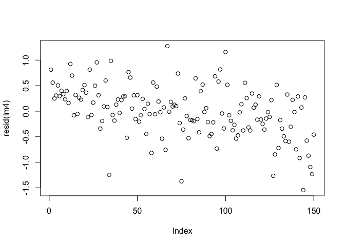

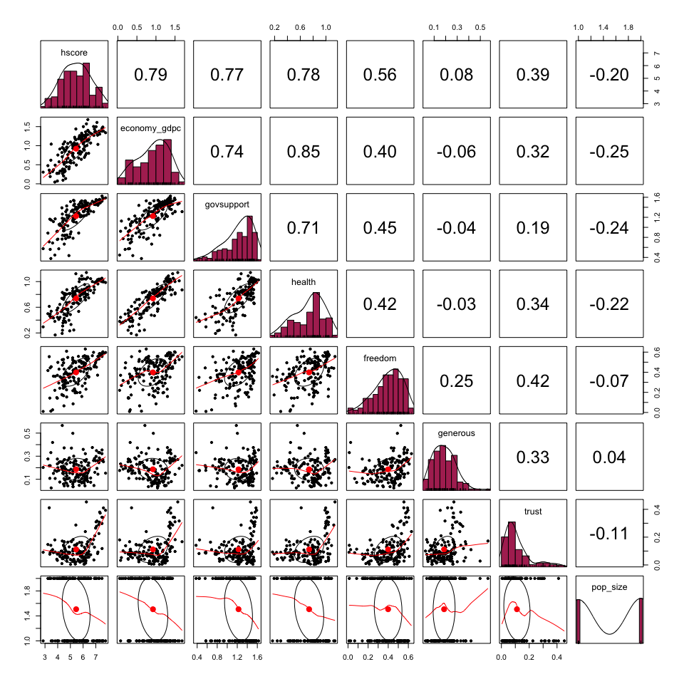

After testing for non-linearity, it appears that relationships between
variables in Model 4 are liner. This can be seen in both plots. For plot
2 (bottom), linear regression fits are shown for both y by x and x by y
as well as correlation ellipses.

 

------------------------------------------------------------------------

#### Normality

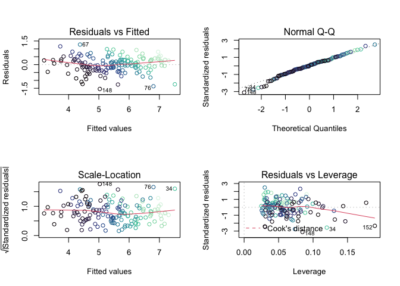

Looking at the Normal Q-Q plot, it appears that the residuals are
normally distributed as most points lie on the line. While both ends
reveal some variance, as indicated by the deviations (outliers) from the
regression lines, the slight variance lies at the ends of the line
(below -2 and above 2). Moreover, looking at the Residual vs. Fitted
plot indicates that the residual points are normally distributed as the
points are evenly distributed around the middle values. This is further
reinforced by the Scale-Location plot as the

Another way to interpret the residual plot is to test for the
distribution of the residuals via a series of normality tests - namely
the Shapiro-Wilk (considered to be the most robust/significant).
Normality tests are used to determine if a dataset is well-modeled by a
normal distribution and compute how likely it is for a random variable
underlying the data set to be normally distributed. Looking at the table
below, both the Shapiro-Wilk (**p = 0.1336**) and Kolmogorov-Smirnov
(**p = 0.6705**) tests have p-values greater than the 0.05 (95% level).
Therefore, we can *fail to reject* the null hypothesis that the
*residuals are normally distributed*.

    ## -----------------------------------------------
    ##        Test             Statistic       pvalue  
    ## -----------------------------------------------
    ## Shapiro-Wilk              0.986          0.1336 
    ## Kolmogorov-Smirnov        0.0591         0.6705 
    ## Cramer-von Mises         17.4628         0.0000 
    ## Anderson-Darling          0.5686         0.1383 
    ## -----------------------------------------------

 

------------------------------------------------------------------------

#### Homoskedasticity.

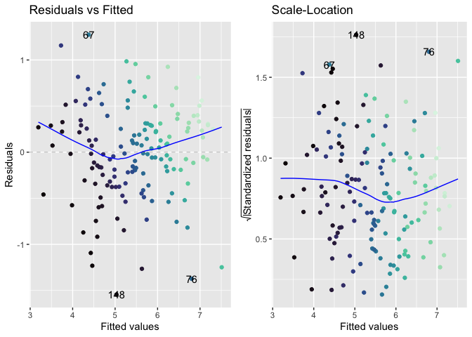

 

------------------------------------------------------------------------

    studentized Breusch-Pagan test

data: lm4 BP = 14.535, df = 8, p-value = 0.06885

Going off of the *Residual vs. Fitted* model, there does not appear to
any glaring sign of the infamous cone shape. Moreover, the residuals
appear to be randomly distributed around the middle values. However, the
*Standardized Residuals vs. Fitted* model tells a different story.
Because the regression line is nearly linear, the model suggests
*homoskedasticity.*.

In order to be sure, I conducted a *Breush-Pagan* test. With a returned
p-value of “**0.06885**”, greater than the p-value of **0.05**, we can
*fail to reject* the null hypothesis in favor of *homoskedasticity.*

 

------------------------------------------------------------------------

#### Outliers

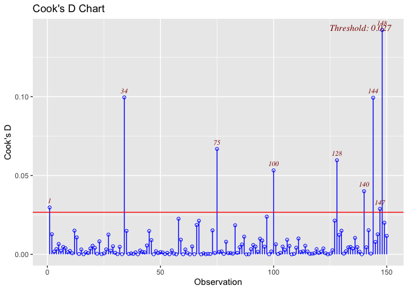

The Cook’s D values for observations ***34, 75, 100, 128, 140, 144, and
148*** each exceed the threshold of 0.027. Therefore, the plot above
would suggest either further investigation or the removal of certain
observations such as the 34th, 144th, and 148th observations. Indeed, by
removing or resolving the issue with the most influential observation
(as well as those already mentioned), the plot reveals that the model
can be improved. However, while deleting these outliers is an option, it
would not necessarily be the best plan of action, especially since they
are real observations after all. There is a possibility that these
outliers may indicate other trends or phenomena. Further investigation
and research would need to be conducted before making this decision.

For reference, the outliers highlighted above are:

-   34 - Singapore (South East Asia)

-   75 - Croatia (Central & Eastern Europe)

-   100 - Nepal (South Asia)

-   128 - Mali (Sub-Saharan Africa)

-   140 - India (South Asia)

-   144 - Lesotho (Sub-Saharan Africa)

-   148 - Botswana (Sub-Saharan Africa)

-   **NOTE:** I ignored observations 1 and 147 since they are slightly
    about the threshold.

 

------------------------------------------------------------------------

# V. RESULTS & DISCUSSION

<table style="border-collapse:collapse; border:none;">
<caption style="font-weight: bold; text-align:left;">
Table 2 - Effects on Happiness
</caption>
<tr>
<th style="border-top: double; text-align:center; font-style:normal; font-weight:bold; padding:0.2cm;  text-align:left; ">
 
</th>
<th colspan="3" style="border-top: double; text-align:center; font-style:normal; font-weight:bold; padding:0.2cm; ">
Model 4
</th>
<th colspan="3" style="border-top: double; text-align:center; font-style:normal; font-weight:bold; padding:0.2cm; ">
Model 5
</th>
</tr>
<tr>
<td style=" text-align:center; border-bottom:1px solid; font-style:italic; font-weight:normal;  text-align:left; ">
Predictors
</td>
<td style=" text-align:center; border-bottom:1px solid; font-style:italic; font-weight:normal;  ">
Estimates
</td>
<td style=" text-align:center; border-bottom:1px solid; font-style:italic; font-weight:normal;  ">
std. Error
</td>
<td style=" text-align:center; border-bottom:1px solid; font-style:italic; font-weight:normal;  ">
CI
</td>
<td style=" text-align:center; border-bottom:1px solid; font-style:italic; font-weight:normal;  ">
Estimates
</td>
<td style=" text-align:center; border-bottom:1px solid; font-style:italic; font-weight:normal;  ">
std. Error
</td>
<td style=" text-align:center; border-bottom:1px solid; font-style:italic; font-weight:normal;  col7">
CI
</td>
</tr>
<tr>
<td style=" padding:0.2cm; text-align:left; vertical-align:top; text-align:left; ">
(Intercept)
</td>
<td style=" padding:0.2cm; text-align:left; vertical-align:top; text-align:center;  ">
2.77 \*\*\*
</td>
<td style=" padding:0.2cm; text-align:left; vertical-align:top; text-align:center;  ">
0.40
</td>
<td style=" padding:0.2cm; text-align:left; vertical-align:top; text-align:center;  ">
1.97 – 3.56
</td>
<td style=" padding:0.2cm; text-align:left; vertical-align:top; text-align:center;  ">
3.97 \*\*\*
</td>
<td style=" padding:0.2cm; text-align:left; vertical-align:top; text-align:center;  ">
0.68
</td>
<td style=" padding:0.2cm; text-align:left; vertical-align:top; text-align:center;  col7">
2.63 – 5.31
</td>
</tr>
<tr>
<td style=" padding:0.2cm; text-align:left; vertical-align:top; text-align:left; ">
economy\_gdpc
</td>
<td style=" padding:0.2cm; text-align:left; vertical-align:top; text-align:center;  ">
-0.72 
</td>
<td style=" padding:0.2cm; text-align:left; vertical-align:top; text-align:center;  ">
0.49
</td>
<td style=" padding:0.2cm; text-align:left; vertical-align:top; text-align:center;  ">
-1.69 – 0.26
</td>
<td style=" padding:0.2cm; text-align:left; vertical-align:top; text-align:center;  ">
-0.56 
</td>
<td style=" padding:0.2cm; text-align:left; vertical-align:top; text-align:center;  ">
0.54
</td>
<td style=" padding:0.2cm; text-align:left; vertical-align:top; text-align:center;  col7">
-1.63 – 0.50
</td>
</tr>
<tr>
<td style=" padding:0.2cm; text-align:left; vertical-align:top; text-align:left; ">
health
</td>
<td style=" padding:0.2cm; text-align:left; vertical-align:top; text-align:center;  ">
-0.71 
</td>
<td style=" padding:0.2cm; text-align:left; vertical-align:top; text-align:center;  ">
0.63
</td>
<td style=" padding:0.2cm; text-align:left; vertical-align:top; text-align:center;  ">
-1.95 – 0.53
</td>
<td style=" padding:0.2cm; text-align:left; vertical-align:top; text-align:center;  ">
-1.40 
</td>
<td style=" padding:0.2cm; text-align:left; vertical-align:top; text-align:center;  ">
0.76
</td>
<td style=" padding:0.2cm; text-align:left; vertical-align:top; text-align:center;  col7">
-2.90 – 0.09
</td>
</tr>
<tr>
<td style=" padding:0.2cm; text-align:left; vertical-align:top; text-align:left; ">
govsupport
</td>
<td style=" padding:0.2cm; text-align:left; vertical-align:top; text-align:center;  ">
1.24 \*\*\*
</td>
<td style=" padding:0.2cm; text-align:left; vertical-align:top; text-align:center;  ">
0.25
</td>
<td style=" padding:0.2cm; text-align:left; vertical-align:top; text-align:center;  ">
0.75 – 1.73
</td>
<td style=" padding:0.2cm; text-align:left; vertical-align:top; text-align:center;  ">
0.89 \*\*\*
</td>
<td style=" padding:0.2cm; text-align:left; vertical-align:top; text-align:center;  ">
0.24
</td>
<td style=" padding:0.2cm; text-align:left; vertical-align:top; text-align:center;  col7">
0.42 – 1.37
</td>
</tr>
<tr>
<td style=" padding:0.2cm; text-align:left; vertical-align:top; text-align:left; ">
freedom
</td>
<td style=" padding:0.2cm; text-align:left; vertical-align:top; text-align:center;  ">
1.65 \*\*\*
</td>
<td style=" padding:0.2cm; text-align:left; vertical-align:top; text-align:center;  ">
0.39
</td>
<td style=" padding:0.2cm; text-align:left; vertical-align:top; text-align:center;  ">
0.89 – 2.42
</td>
<td style=" padding:0.2cm; text-align:left; vertical-align:top; text-align:center;  ">
1.83 \*\*\*
</td>
<td style=" padding:0.2cm; text-align:left; vertical-align:top; text-align:center;  ">
0.40
</td>
<td style=" padding:0.2cm; text-align:left; vertical-align:top; text-align:center;  col7">
1.04 – 2.61
</td>
</tr>
<tr>
<td style=" padding:0.2cm; text-align:left; vertical-align:top; text-align:left; ">
generous
</td>
<td style=" padding:0.2cm; text-align:left; vertical-align:top; text-align:center;  ">
0.23 
</td>
<td style=" padding:0.2cm; text-align:left; vertical-align:top; text-align:center;  ">
0.50
</td>
<td style=" padding:0.2cm; text-align:left; vertical-align:top; text-align:center;  ">
-0.75 – 1.21
</td>
<td style=" padding:0.2cm; text-align:left; vertical-align:top; text-align:center;  ">
0.54 
</td>
<td style=" padding:0.2cm; text-align:left; vertical-align:top; text-align:center;  ">
0.51
</td>
<td style=" padding:0.2cm; text-align:left; vertical-align:top; text-align:center;  col7">
-0.46 – 1.54
</td>
</tr>
<tr>
<td style=" padding:0.2cm; text-align:left; vertical-align:top; text-align:left; ">
trust
</td>
<td style=" padding:0.2cm; text-align:left; vertical-align:top; text-align:center;  ">
0.01 
</td>
<td style=" padding:0.2cm; text-align:left; vertical-align:top; text-align:center;  ">
0.61
</td>
<td style=" padding:0.2cm; text-align:left; vertical-align:top; text-align:center;  ">
-1.20 – 1.21
</td>
<td style=" padding:0.2cm; text-align:left; vertical-align:top; text-align:center;  ">
-0.44 
</td>
<td style=" padding:0.2cm; text-align:left; vertical-align:top; text-align:center;  ">
0.61
</td>
<td style=" padding:0.2cm; text-align:left; vertical-align:top; text-align:center;  col7">
-1.64 – 0.76
</td>
</tr>
<tr>
<td style=" padding:0.2cm; text-align:left; vertical-align:top; text-align:left; ">
pop\_size \[Large\]
</td>
<td style=" padding:0.2cm; text-align:left; vertical-align:top; text-align:center;  ">
0.02 
</td>
<td style=" padding:0.2cm; text-align:left; vertical-align:top; text-align:center;  ">
0.09
</td>
<td style=" padding:0.2cm; text-align:left; vertical-align:top; text-align:center;  ">
-0.15 – 0.20
</td>
<td style=" padding:0.2cm; text-align:left; vertical-align:top; text-align:center;  ">
0.05 
</td>
<td style=" padding:0.2cm; text-align:left; vertical-align:top; text-align:center;  ">
0.09
</td>
<td style=" padding:0.2cm; text-align:left; vertical-align:top; text-align:center;  col7">
-0.12 – 0.23
</td>
</tr>
<tr>
<td style=" padding:0.2cm; text-align:left; vertical-align:top; text-align:left; ">
economy\_gdpc \* health
</td>
<td style=" padding:0.2cm; text-align:left; vertical-align:top; text-align:center;  ">
2.16 \*\*\*
</td>
<td style=" padding:0.2cm; text-align:left; vertical-align:top; text-align:center;  ">
0.63
</td>
<td style=" padding:0.2cm; text-align:left; vertical-align:top; text-align:center;  ">
0.92 – 3.40
</td>
<td style=" padding:0.2cm; text-align:left; vertical-align:top; text-align:center;  ">
2.14 \*\*
</td>
<td style=" padding:0.2cm; text-align:left; vertical-align:top; text-align:center;  ">
0.69
</td>
<td style=" padding:0.2cm; text-align:left; vertical-align:top; text-align:center;  col7">
0.77 – 3.52
</td>
</tr>
<tr>
<td style=" padding:0.2cm; text-align:left; vertical-align:top; text-align:left; ">
region \[Latin America & Caribbean\]
</td>
<td style=" padding:0.2cm; text-align:left; vertical-align:top; text-align:center;  ">
</td>
<td style=" padding:0.2cm; text-align:left; vertical-align:top; text-align:center;  ">
</td>
<td style=" padding:0.2cm; text-align:left; vertical-align:top; text-align:center;  ">
</td>
<td style=" padding:0.2cm; text-align:left; vertical-align:top; text-align:center;  ">
-0.07 
</td>
<td style=" padding:0.2cm; text-align:left; vertical-align:top; text-align:center;  ">
0.39
</td>
<td style=" padding:0.2cm; text-align:left; vertical-align:top; text-align:center;  col7">
-0.84 – 0.70
</td>
</tr>
<tr>
<td style=" padding:0.2cm; text-align:left; vertical-align:top; text-align:left; ">
region \[Western Europe\]
</td>
<td style=" padding:0.2cm; text-align:left; vertical-align:top; text-align:center;  ">
</td>
<td style=" padding:0.2cm; text-align:left; vertical-align:top; text-align:center;  ">
</td>
<td style=" padding:0.2cm; text-align:left; vertical-align:top; text-align:center;  ">
</td>
<td style=" padding:0.2cm; text-align:left; vertical-align:top; text-align:center;  ">
-0.06 
</td>
<td style=" padding:0.2cm; text-align:left; vertical-align:top; text-align:center;  ">
0.36
</td>
<td style=" padding:0.2cm; text-align:left; vertical-align:top; text-align:center;  col7">
-0.77 – 0.65
</td>
</tr>
<tr>
<td style=" padding:0.2cm; text-align:left; vertical-align:top; text-align:left; ">
region \[Central & Eastern Europe\]
</td>
<td style=" padding:0.2cm; text-align:left; vertical-align:top; text-align:center;  ">
</td>
<td style=" padding:0.2cm; text-align:left; vertical-align:top; text-align:center;  ">
</td>
<td style=" padding:0.2cm; text-align:left; vertical-align:top; text-align:center;  ">
</td>
<td style=" padding:0.2cm; text-align:left; vertical-align:top; text-align:center;  ">
-0.43 
</td>
<td style=" padding:0.2cm; text-align:left; vertical-align:top; text-align:center;  ">
0.38
</td>
<td style=" padding:0.2cm; text-align:left; vertical-align:top; text-align:center;  col7">
-1.19 – 0.32
</td>
</tr>
<tr>
<td style=" padding:0.2cm; text-align:left; vertical-align:top; text-align:left; ">
region \[Middle East & North Africa\]
</td>
<td style=" padding:0.2cm; text-align:left; vertical-align:top; text-align:center;  ">
</td>
<td style=" padding:0.2cm; text-align:left; vertical-align:top; text-align:center;  ">
</td>
<td style=" padding:0.2cm; text-align:left; vertical-align:top; text-align:center;  ">
</td>
<td style=" padding:0.2cm; text-align:left; vertical-align:top; text-align:center;  ">
-0.53 
</td>
<td style=" padding:0.2cm; text-align:left; vertical-align:top; text-align:center;  ">
0.38
</td>
<td style=" padding:0.2cm; text-align:left; vertical-align:top; text-align:center;  col7">
-1.29 – 0.23
</td>
</tr>
<tr>
<td style=" padding:0.2cm; text-align:left; vertical-align:top; text-align:left; ">
region \[Sub-Saharan Africa\]
</td>
<td style=" padding:0.2cm; text-align:left; vertical-align:top; text-align:center;  ">
</td>
<td style=" padding:0.2cm; text-align:left; vertical-align:top; text-align:center;  ">
</td>
<td style=" padding:0.2cm; text-align:left; vertical-align:top; text-align:center;  ">
</td>
<td style=" padding:0.2cm; text-align:left; vertical-align:top; text-align:center;  ">
-0.78 
</td>
<td style=" padding:0.2cm; text-align:left; vertical-align:top; text-align:center;  ">
0.41
</td>
<td style=" padding:0.2cm; text-align:left; vertical-align:top; text-align:center;  col7">
-1.60 – 0.04
</td>
</tr>
<tr>
<td style=" padding:0.2cm; text-align:left; vertical-align:top; text-align:left; ">
region \[South Asia\]
</td>
<td style=" padding:0.2cm; text-align:left; vertical-align:top; text-align:center;  ">
</td>
<td style=" padding:0.2cm; text-align:left; vertical-align:top; text-align:center;  ">
</td>
<td style=" padding:0.2cm; text-align:left; vertical-align:top; text-align:center;  ">
</td>
<td style=" padding:0.2cm; text-align:left; vertical-align:top; text-align:center;  ">
-0.81 
</td>
<td style=" padding:0.2cm; text-align:left; vertical-align:top; text-align:center;  ">
0.42
</td>
<td style=" padding:0.2cm; text-align:left; vertical-align:top; text-align:center;  col7">
-1.65 – 0.03
</td>
</tr>
<tr>
<td style=" padding:0.2cm; text-align:left; vertical-align:top; text-align:left; ">
region \[East Asia\]
</td>
<td style=" padding:0.2cm; text-align:left; vertical-align:top; text-align:center;  ">
</td>
<td style=" padding:0.2cm; text-align:left; vertical-align:top; text-align:center;  ">
</td>
<td style=" padding:0.2cm; text-align:left; vertical-align:top; text-align:center;  ">
</td>
<td style=" padding:0.2cm; text-align:left; vertical-align:top; text-align:center;  ">
-0.77 
</td>
<td style=" padding:0.2cm; text-align:left; vertical-align:top; text-align:center;  ">
0.40
</td>
<td style=" padding:0.2cm; text-align:left; vertical-align:top; text-align:center;  col7">
-1.56 – 0.02
</td>
</tr>
<tr>
<td style=" padding:0.2cm; text-align:left; vertical-align:top; text-align:left; ">
region \[Southeast Asia\]
</td>
<td style=" padding:0.2cm; text-align:left; vertical-align:top; text-align:center;  ">
</td>
<td style=" padding:0.2cm; text-align:left; vertical-align:top; text-align:center;  ">
</td>
<td style=" padding:0.2cm; text-align:left; vertical-align:top; text-align:center;  ">
</td>
<td style=" padding:0.2cm; text-align:left; vertical-align:top; text-align:center;  ">
-0.96 \*
</td>
<td style=" padding:0.2cm; text-align:left; vertical-align:top; text-align:center;  ">
0.39
</td>
<td style=" padding:0.2cm; text-align:left; vertical-align:top; text-align:center;  col7">
-1.74 – -0.19
</td>
</tr>
<tr>
<td style=" padding:0.2cm; text-align:left; vertical-align:top; text-align:left; ">
region \[Australia & New Zealand\]
</td>
<td style=" padding:0.2cm; text-align:left; vertical-align:top; text-align:center;  ">
</td>
<td style=" padding:0.2cm; text-align:left; vertical-align:top; text-align:center;  ">
</td>
<td style=" padding:0.2cm; text-align:left; vertical-align:top; text-align:center;  ">
</td>
<td style=" padding:0.2cm; text-align:left; vertical-align:top; text-align:center;  ">
0.05 
</td>
<td style=" padding:0.2cm; text-align:left; vertical-align:top; text-align:center;  ">
0.48
</td>
<td style=" padding:0.2cm; text-align:left; vertical-align:top; text-align:center;  col7">
-0.90 – 1.00
</td>
</tr>
<tr>
<td style=" padding:0.2cm; text-align:left; vertical-align:top; text-align:left; padding-top:0.1cm; padding-bottom:0.1cm; border-top:1px solid;">
Observations
</td>
<td style=" padding:0.2cm; text-align:left; vertical-align:top; padding-top:0.1cm; padding-bottom:0.1cm; text-align:left; border-top:1px solid;" colspan="3">
150
</td>
<td style=" padding:0.2cm; text-align:left; vertical-align:top; padding-top:0.1cm; padding-bottom:0.1cm; text-align:left; border-top:1px solid;" colspan="3">
150
</td>
</tr>
<tr>
<td style=" padding:0.2cm; text-align:left; vertical-align:top; text-align:left; padding-top:0.1cm; padding-bottom:0.1cm;">
R2 / R2 adjusted
</td>
<td style=" padding:0.2cm; text-align:left; vertical-align:top; padding-top:0.1cm; padding-bottom:0.1cm; text-align:left;" colspan="3">
0.789 / 0.777
</td>
<td style=" padding:0.2cm; text-align:left; vertical-align:top; padding-top:0.1cm; padding-bottom:0.1cm; text-align:left;" colspan="3">
0.834 / 0.813
</td>
</tr>
<tr>
<td style=" padding:0.2cm; text-align:left; vertical-align:top; text-align:left; padding-top:0.1cm; padding-bottom:0.1cm;">
AIC
</td>
<td style=" padding:0.2cm; text-align:left; vertical-align:top; padding-top:0.1cm; padding-bottom:0.1cm; text-align:left;" colspan="3">
239.588
</td>
<td style=" padding:0.2cm; text-align:left; vertical-align:top; padding-top:0.1cm; padding-bottom:0.1cm; text-align:left;" colspan="3">
221.040
</td>
</tr>
<tr>
<td colspan="7" style="font-style:italic; border-top:double black; text-align:right;">

-   p&lt;0.05   \*\* p&lt;0.01   \*\*\* p&lt;0.001
    </td>
    </tr>

</table>

After creating the multiple linear regression models above and after
carrying out the series robustness tests, it appears that we can answer
the two hypotheses laid out in the introduction using Model 4.

## Hypotheses

**Hypothesis 1:**

-   Looking at Model 4, it appears that Social Support, Freedom to Make
    Life Choices, and the interaction term between GDP per capita & Life
    Expectancy are all (extremely) statistically significant at the
    99.99% level (p&lt;0.001). This finding supports the first
    hypothesis that countries with stronger economies (higher GDP per
    capita), longer life expectancies (better quality of life), greater
    freedom, and robust systems of government support will be happier
    than those of the contrary. After splitting the 156 (later 150)
    countries into different regions, it makes sense why North America,
    Australia & New Zealand, and Western Europe were among the top
    scorers. Countries in these regions are wealthy and have robust
    systems of governance. Referring back to the literature,
    Easterlin’s (2013) argument that employment and strong welfare
    policies increase happiness appears to be true as the variables with
    the most significant coefficients reflect state policies.
    Consequently, the top performers in terms of happiness (e.g.,
    Finland, Denmark and Norway) - as seen in the Section IIb - are
    considered to have robust welfare systems.

**Hypothesis 2:**

-   When it comes to hypothesis 2, it appears that population size,
    split between large and small, does not play a significant effect on
    a country’s happiness score. It was assumed that the larger the
    country (in terms of population), the harder it would be to provide
    social services, effectively redistribute resources, and add a level
    of competition among citizens. It turns out that this is not true. I
    will note that when testing population size on happiness score in a
    bivariate model, the results indicate that population size leads to
    a statistically significant (p&lt;00.5) negative relationship with
    the happiness score. However, given that it is a bivariate model, no
    other variables were used as control, thus making the model weak.

## Other Findings

-   Although Model 5 did not pass the VIF test, the test detected
    multicollinearity in the regression analysis with regards to the
    “region” variable. Although this study is concerned with the
    relationship between happiness (or the happiness score of a country)
    with several explanatory variables to paint a better picture as to
    what affects happiness, Model 5 still holds relevant theoretical
    findings. Indeed, when comparing the regions with each other and
    controlling for the other variables, using North America as the
    reference category, it appears that each region is unhappy relative
    to North America, bar Australia & New Zealand. Additionally,
    Southeast Asia’s unhappiness appears to be statistically significant
    at the 95% level (p&lt;0.05). Outside of this observation, the
    results are not statistically significant.

 

## Va. Limitations

During my initial analysis of the 2019 World Happiness Report data, it
appeared that there were no outliers or empty variables (i.e., *NA*).
The one thing I should note is that instead of using *NA* (not
applicable), the authors use *0.000* to indicate missing data. For
instance, this can be seen in the social support in the Central African
Republic. Although it is possible respondents did not believe *social
support* exists in their country, it is highly unlikely that the value
would be 0.000. Consequently, I cleaned the data by removing these
values and leaving them blank. Furthermore, by removing this 0-value, I
lost six observations after conducting the missingness tests above.
Although this did not affect the statistical power of my models, as
indicated by the missing data diagnostics, it is a limitation to this
study.

Multiple Linear Regression, although provides useful insight into the
relationship between certain variables, has its drawbacks. Because this
study focuses on one year (2019), it is limited in its causal claims.
This is especially the case when compared to longitudinal studies.
Another limitation that I must address is that the number of variables
used in the study was not exhaustive. True, they do a good job at
highlighting major factors that affect happiness within a country;
however, some nuances have to be addressed. For example, longer life
expectancies do not necessarily indicate that everyone is happy since
other factors could be at play. Quality of life estimates, on the other
hand, could act as a valuable indicator for happiness; however, this is
a broad category that is also composed of sub-factors such as purchasing
power, political representation, feelings toward one’s local community,
etc. Another point I would like to make is that the dataset did not
account for whether a country is experiencing war or conflict,
experiencing war, nor political transition periods (e.g.,
post-conflict). Indeed, there are so many factors that could affect
happiness and vice-versa; therefore, there is plenty of room for more
research.

## Vb. Avenues for Future Research

-   While the research provides some insight as to what factors make
    countries happy (in 2019), it by no means is exhaustive. More
    qualitative and quantitative research should be done to find new
    variables that could be linked to happiness. Using the same example
    from the last section, although life expectancy is typically used to
    assess overall health in a country, the general quality of life in a
    country could play a significant role in the perception of
    happiness. Of course, this variable (e.g., quality of life) will
    take into consideration multiple factors.
-   Another suggestion is using panel data or cross-sectional
    time-series data to observation deviations in happiness among
    countries and regions throughout time. For example, given the recent
    (and ongoing) COVID-19 pandemic, it could be interesting to observe
    fluctuations in happiness.  
-   Lastly, there may be a correlation between good governance and
    happiness. Indeed, a crucial part of governing lies in providing
    quality public services to one’s constituents/citizens as well as
    distributing resources equitably and solving social issues promptly.
    Nevertheless, the relationship between the governed and the
    government could provide insight into general perceptions of
    happiness in “x” country. After looking at Model 4, one can assume
    that there is a relatively strong divide between developed and
    developing countries.

 

------------------------------------------------------------------------

# VI. REFERENCES

-   Deaton, A. (2008). “Income, Health, and Well-being Around the World:
    Evidence from the Gallup World Poll”. *Journal of Economic
    Perspectives*, 22 (2), pp.53-72.
-   Easterlin, R.A. (2013). “Happiness, Growth, and Public Policy”.
    *Economic Inquiry*, 51 (1), pp.1-15.
-   Helliwell, J.F. (2020). “Three Questions About Happiness”.
    *Behavioural Public Policy*, 4 (2), pp.177-187.
-   Helliwell, J., Layard, R., & Sachs, J. (2019). *World Happiness
    Report 2019*, New York: Sustainable Development Solutions Network.
-   James, Gareth, Daniela Witten, Trevor Hastie, and Robert Tibshirani.
    (2014). *An Introduction to Statistical Learning: With Applications
    in R*. Springer Publishing Company, Incorporated.

 

------------------------------------------------------------------------

# VII. APPENDIX

## Total Population & Happiness

<table style="border-collapse:collapse; border:none;">
<caption style="font-weight: bold; text-align:left;">
OLS Models - Happiness Scores Among States
</caption>
<tr>
<th style="border-top: double; text-align:center; font-style:normal; font-weight:bold; padding:0.2cm;  text-align:left; ">
 
</th>
<th colspan="3" style="border-top: double; text-align:center; font-style:normal; font-weight:bold; padding:0.2cm; ">
Model 7 - Happiness Score & Population
</th>
</tr>
<tr>
<td style=" text-align:center; border-bottom:1px solid; font-style:italic; font-weight:normal;  text-align:left; ">
Predictors
</td>
<td style=" text-align:center; border-bottom:1px solid; font-style:italic; font-weight:normal;  ">
Estimates
</td>
<td style=" text-align:center; border-bottom:1px solid; font-style:italic; font-weight:normal;  ">
std. Error
</td>
<td style=" text-align:center; border-bottom:1px solid; font-style:italic; font-weight:normal;  ">
CI
</td>
</tr>
<tr>
<td style=" padding:0.2cm; text-align:left; vertical-align:top; text-align:left; ">
(Intercept)
</td>
<td style=" padding:0.2cm; text-align:left; vertical-align:top; text-align:center;  ">
1.73 \*\*\*
</td>
<td style=" padding:0.2cm; text-align:left; vertical-align:top; text-align:center;  ">
0.24
</td>
<td style=" padding:0.2cm; text-align:left; vertical-align:top; text-align:center;  ">
1.26 – 2.20
</td>
</tr>
<tr>
<td style=" padding:0.2cm; text-align:left; vertical-align:top; text-align:left; ">
economy\_gdpc
</td>
<td style=" padding:0.2cm; text-align:left; vertical-align:top; text-align:center;  ">
0.82 \*\*\*
</td>
<td style=" padding:0.2cm; text-align:left; vertical-align:top; text-align:center;  ">
0.23
</td>
<td style=" padding:0.2cm; text-align:left; vertical-align:top; text-align:center;  ">
0.37 – 1.28
</td>
</tr>
<tr>
<td style=" padding:0.2cm; text-align:left; vertical-align:top; text-align:left; ">
govsupport
</td>
<td style=" padding:0.2cm; text-align:left; vertical-align:top; text-align:center;  ">
1.15 \*\*\*
</td>
<td style=" padding:0.2cm; text-align:left; vertical-align:top; text-align:center;  ">
0.26
</td>
<td style=" padding:0.2cm; text-align:left; vertical-align:top; text-align:center;  ">
0.64 – 1.67
</td>
</tr>
<tr>
<td style=" padding:0.2cm; text-align:left; vertical-align:top; text-align:left; ">
health
</td>
<td style=" padding:0.2cm; text-align:left; vertical-align:top; text-align:center;  ">
1.06 \*\*
</td>
<td style=" padding:0.2cm; text-align:left; vertical-align:top; text-align:center;  ">
0.38
</td>
<td style=" padding:0.2cm; text-align:left; vertical-align:top; text-align:center;  ">
0.31 – 1.80
</td>
</tr>
<tr>
<td style=" padding:0.2cm; text-align:left; vertical-align:top; text-align:left; ">
freedom
</td>
<td style=" padding:0.2cm; text-align:left; vertical-align:top; text-align:center;  ">
1.51 \*\*\*
</td>
<td style=" padding:0.2cm; text-align:left; vertical-align:top; text-align:center;  ">
0.40
</td>
<td style=" padding:0.2cm; text-align:left; vertical-align:top; text-align:center;  ">
0.72 – 2.30
</td>
</tr>
<tr>
<td style=" padding:0.2cm; text-align:left; vertical-align:top; text-align:left; ">
generous
</td>
<td style=" padding:0.2cm; text-align:left; vertical-align:top; text-align:center;  ">
0.45 
</td>
<td style=" padding:0.2cm; text-align:left; vertical-align:top; text-align:center;  ">
0.51
</td>
<td style=" padding:0.2cm; text-align:left; vertical-align:top; text-align:center;  ">
-0.55 – 1.45
</td>
</tr>
<tr>
<td style=" padding:0.2cm; text-align:left; vertical-align:top; text-align:left; ">
trust
</td>
<td style=" padding:0.2cm; text-align:left; vertical-align:top; text-align:center;  ">
0.87 
</td>
<td style=" padding:0.2cm; text-align:left; vertical-align:top; text-align:center;  ">
0.56
</td>
<td style=" padding:0.2cm; text-align:left; vertical-align:top; text-align:center;  ">
-0.23 – 1.98
</td>
</tr>
<tr>
<td style=" padding:0.2cm; text-align:left; vertical-align:top; text-align:left; ">
pop\_in\_millions
</td>
<td style=" padding:0.2cm; text-align:left; vertical-align:top; text-align:center;  ">
-0.00 
</td>
<td style=" padding:0.2cm; text-align:left; vertical-align:top; text-align:center;  ">
0.00
</td>
<td style=" padding:0.2cm; text-align:left; vertical-align:top; text-align:center;  ">
-0.00 – 0.00
</td>
</tr>
<tr>
<td style=" padding:0.2cm; text-align:left; vertical-align:top; text-align:left; padding-top:0.1cm; padding-bottom:0.1cm; border-top:1px solid;">
Observations
</td>
<td style=" padding:0.2cm; text-align:left; vertical-align:top; padding-top:0.1cm; padding-bottom:0.1cm; text-align:left; border-top:1px solid;" colspan="3">
150
</td>
</tr>
<tr>
<td style=" padding:0.2cm; text-align:left; vertical-align:top; text-align:left; padding-top:0.1cm; padding-bottom:0.1cm;">
R2 / R2 adjusted
</td>
<td style=" padding:0.2cm; text-align:left; vertical-align:top; padding-top:0.1cm; padding-bottom:0.1cm; text-align:left;" colspan="3">
0.773 / 0.762
</td>
</tr>
<tr>
<td style=" padding:0.2cm; text-align:left; vertical-align:top; text-align:left; padding-top:0.1cm; padding-bottom:0.1cm;">
AIC
</td>
<td style=" padding:0.2cm; text-align:left; vertical-align:top; padding-top:0.1cm; padding-bottom:0.1cm; text-align:left;" colspan="3">
248.109
</td>
</tr>
<tr>
<td colspan="4" style="font-style:italic; border-top:double black; text-align:right;">

-   p&lt;0.05   \*\* p&lt;0.01   \*\*\* p&lt;0.001
    </td>
    </tr>

</table>

 

**NOTE:**: In the model above, while controlling for other independent
variables, I tested the role of the total population on the happiness
score to see if there was any effect. It turns out that the population
of a country does not have a direct effect on happiness.

## Bivariate Model: Population Size & Happiness

<table style="border-collapse:collapse; border:none;">
<caption style="font-weight: bold; text-align:left;">
OLS Models - Happiness Scores Among States
</caption>
<tr>
<th style="border-top: double; text-align:center; font-style:normal; font-weight:bold; padding:0.2cm;  text-align:left; ">
 
</th>
<th colspan="3" style="border-top: double; text-align:center; font-style:normal; font-weight:bold; padding:0.2cm; ">
Model 8 - Bivariate Population Size & Happiness
</th>
</tr>
<tr>
<td style=" text-align:center; border-bottom:1px solid; font-style:italic; font-weight:normal;  text-align:left; ">
Predictors
</td>
<td style=" text-align:center; border-bottom:1px solid; font-style:italic; font-weight:normal;  ">
Estimates
</td>
<td style=" text-align:center; border-bottom:1px solid; font-style:italic; font-weight:normal;  ">
std. Error
</td>
<td style=" text-align:center; border-bottom:1px solid; font-style:italic; font-weight:normal;  ">
CI
</td>
</tr>
<tr>
<td style=" padding:0.2cm; text-align:left; vertical-align:top; text-align:left; ">
(Intercept)
</td>
<td style=" padding:0.2cm; text-align:left; vertical-align:top; text-align:center;  ">
5.67 \*\*\*
</td>
<td style=" padding:0.2cm; text-align:left; vertical-align:top; text-align:center;  ">
0.13
</td>
<td style=" padding:0.2cm; text-align:left; vertical-align:top; text-align:center;  ">
5.43 – 5.92
</td>
</tr>
<tr>
<td style=" padding:0.2cm; text-align:left; vertical-align:top; text-align:left; ">
pop\_size \[Large\]
</td>
<td style=" padding:0.2cm; text-align:left; vertical-align:top; text-align:center;  ">
-0.44 \*
</td>
<td style=" padding:0.2cm; text-align:left; vertical-align:top; text-align:center;  ">
0.18
</td>
<td style=" padding:0.2cm; text-align:left; vertical-align:top; text-align:center;  ">
-0.79 – -0.09
</td>
</tr>
<tr>
<td style=" padding:0.2cm; text-align:left; vertical-align:top; text-align:left; padding-top:0.1cm; padding-bottom:0.1cm; border-top:1px solid;">
Observations
</td>
<td style=" padding:0.2cm; text-align:left; vertical-align:top; padding-top:0.1cm; padding-bottom:0.1cm; text-align:left; border-top:1px solid;" colspan="3">
150
</td>
</tr>
<tr>
<td style=" padding:0.2cm; text-align:left; vertical-align:top; text-align:left; padding-top:0.1cm; padding-bottom:0.1cm;">
R2 / R2 adjusted
</td>
<td style=" padding:0.2cm; text-align:left; vertical-align:top; padding-top:0.1cm; padding-bottom:0.1cm; text-align:left;" colspan="3">
0.041 / 0.034
</td>
</tr>
<tr>
<td style=" padding:0.2cm; text-align:left; vertical-align:top; text-align:left; padding-top:0.1cm; padding-bottom:0.1cm;">
AIC
</td>
<td style=" padding:0.2cm; text-align:left; vertical-align:top; padding-top:0.1cm; padding-bottom:0.1cm; text-align:left;" colspan="3">
452.356
</td>
</tr>
<tr>
<td colspan="4" style="font-style:italic; border-top:double black; text-align:right;">

-   p&lt;0.05   \*\* p&lt;0.01   \*\*\* p&lt;0.001
    </td>
    </tr>

</table>

 

**NOTE:** In the bivariate model above, I attempted to see what the
effect of population size was on the happiness score. It turns out that
when a country reaches a certain population threshold (11.383), there
will be a statistically significant negative relationship with happiness
at the 95& level. Ergo, countries with large populations would have
unhappy populations. However, because this is a bivariate model - does
not consider any other independent variables - the explanatory power is
very weak. This can be seen in the low R and Adjusted R2 values as well
as the high AIC value.

 
