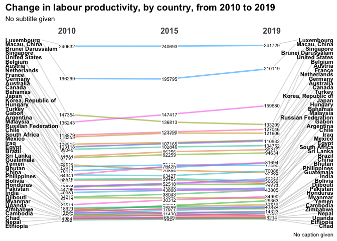
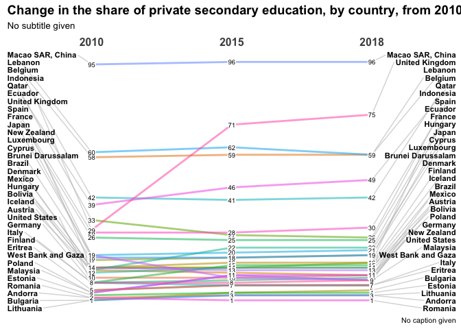
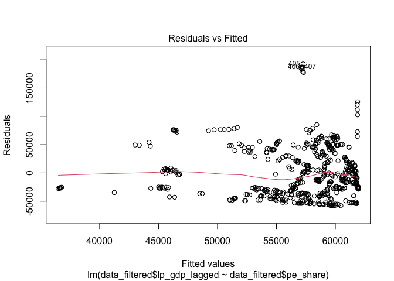
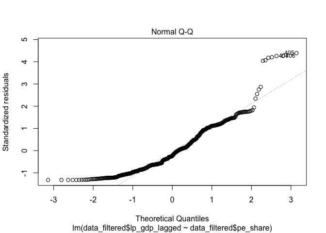
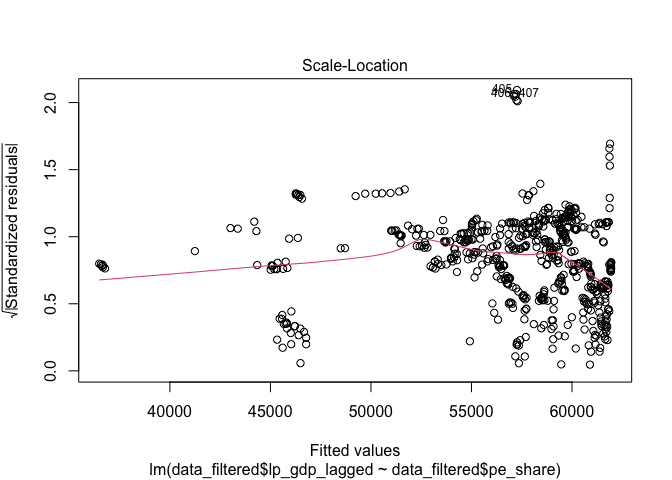
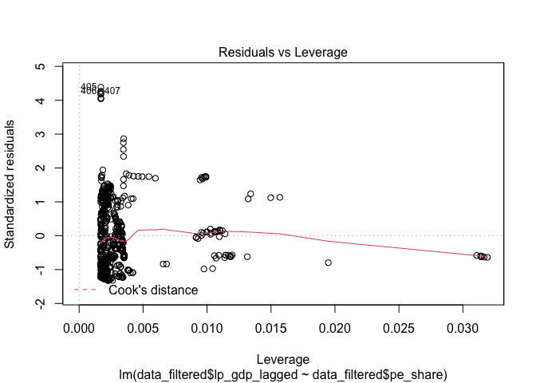

1. Introduction

The aim of this research is to explore the potential causal relationship
between the privatization of education and labor productivity.In recent
years, many countries have embarked on the application of market-based
privatization approaches to different levels of education. Mounting
budget deficits of the government, deteriorating quality of services,
and out-of-date curriculum are among the core reasons why a huge portion
of responsibilities to education service delivery that have long been
recognized as public goods were shifted onto the private sector. The
theoretical rationale behind the privatization of education is that
market-oriented forces can better serve as a tool to increase the
quality of the education while lowering the cost through extensive
competition among providers, ensure more flexibility in contracting of
competent teacher, and above all, to reduce the burden of education cost
and expectations (Fennell, 2012; Steiner-Khamsi & Draxler, 2018).

However such trend has also stimulated considerable controversy as the
private sector is inherently ‘profit-seeking’ and ‘efficiency-seeking.’
Many scholars and practitioners point out that such different nature of
the private sector would rather hamper the universal access to education
or damage the quality of education in a long run. Compared to sectors
such as transportation, roads, or energy that have widely enjoyed the
engagement of the private sector, the education sector, therefore, is
relatively a late adopter of privatization schemes, due in large part to
the widely-held perception that the provision and management of
education services ought to be the responsibility of the public sector
as it is a public good (Draxler, 2013).

Against this backdrop, this research attempts to examine whether the
privatization of education contributes to the improvement of labour
productivity. Among different levels of education from pre-primary to
tertiary, this research will specifically focus on secondary education
due to the fact that it is generally considered to play a fundamental
role in preparing pupils directly for the labour market as it is when
the pupils start receiving ‘vocational education’. This study will
examine whether there is any meaningful causal relationship between the
level of the private sector engagement in education and labour
productivity by testing the hypothesis ‘The increased level of private
sector engagement in the delivery of secondary education services
increases overall labour productivity.’

2. Data

To test the hypothesis, the first model will use a ‘School enrollment,
secondary, private (% of total secondary)’ data set prepared by the
World Bank as the independent variable. It shows the ratio of pupils
enrolled in institutions that are operated by a private sector body, not
a public authority, from 1998 to 2019.A high ratio would consequently
mean that the private sector (e.g. NGOs, firms, religious bodies, or
local communities)is strongly engaged in the delivery of education
services. An ‘output per worker (GDP constant 2011 international $ in
PPP)’ data set prepared by ILO will be the dependent variable. Labour
productivity in this data set refers to the total volume of output (GDP)
produced per one-unit of labour during a time frame of 2010-2019. The
usage of this data set is expected to allow me to assess the level of
GDP-to-labour input as well as growth rates over the given time frame,
which would help me identify the degree of efficiency as well as quality
of labour in the production process in each sample country.

    lpdata <- read.csv("ILO_labour_productivity.csv",  header = TRUE)

    pedata <- read.csv("WB_private education.csv",  header = TRUE)

Both are time series data sets that contain a total of 3 variables -
country, year, and value. However we can see that there is difference in
the number of observations as the number of countries covered are
different: labour productivity data has 1890 observations of a total of
189 countries while private education data has 1780 observations of a
total of 178 countries. Some countries covered in the private education
data are missing in the labour productivity data, and vice versa. For
example, the private education data developed by the World Bank contains
a number of territories that are not recognized as a country under the
UN system, such as Gibraltar, a British overseas territory and headland
or West Bank and Gaza area. However it only includes countries who have
data for at least one year during the given time span. Therefore I will
tailor the extra variables of the World Bank data and ILO data to
combine two data frames vertically in the later stage.

Three control variables that are assumed to be related (either closely
or loosely) to labour productivity will be also added: mean weekly
working hour (mwwhour), consumer price for health service
(healthconpri), and average cost for educational services (educost). All
three data sets are those imported from ILO. A data set of ‘weekly
working hour’ presents the mean values of weekly working hours of all
employees, while the remaining two data sets of consumer price for
health service and average cost for educational services present the
values of consumer price index (CPI).

    working_hr <- read.csv("mean_weekly_working_hour.csv",  header = TRUE)

    conpri_health <- read.csv("consumer_price_health.csv",  header = TRUE)

    edu_price <- read.csv("education_service_aveprice.csv",  header = TRUE)

All three of them have 3 variables: country, year, value, and they all
cover maximum 10 years of data between 2010 and 2019. However, the
volume of observations vary (2079 for *mwwhour*; 1717 for
*healthconpri*; and 1676 for *educost*) according to the availability of
country data.

3. Visualization of the distribution of the
variable

(1-1) The distribution of the dependent variable by year

    library(arsenal)
    require(knitr)

    ## Loading required package: knitr

    require(survival)

    ## Loading required package: survival

    str(lpdata)

    ## 'data.frame':    1890 obs. of  3 variables:
    ##  $ Country: chr  "Afghanistan" "Afghanistan" "Afghanistan" "Afghanistan" ...
    ##  $ Year   : int  2010 2011 2012 2013 2014 2015 2016 2017 2018 2019 ...
    ##  $ Value  : int  9573 9219 9910 9943 9697 9365 9178 9048 8871 8794 ...

    lpdata_table <- tableby(Year ~ Value, data = lpdata) 
    summary(lpdata_table, title = "Labour Productivity Data - Summary Statistics, by year")

    ## 
    ## 
    ## Table: Labour Productivity Data - Summary Statistics, by year
    ## 
    ## |                            |     2010 (N=189)      |     2011 (N=189)      |     2012 (N=189)      |     2013 (N=189)      |     2014 (N=189)      |     2015 (N=189)      |     2016 (N=189)      |     2017 (N=189)      |     2018 (N=189)      |     2019 (N=189)      |    Total (N=1890)     | p value|
    ## |:---------------------------|:---------------------:|:---------------------:|:---------------------:|:---------------------:|:---------------------:|:---------------------:|:---------------------:|:---------------------:|:---------------------:|:---------------------:|:---------------------:|-------:|
    ## |**Value**                   |                       |                       |                       |                       |                       |                       |                       |                       |                       |                       |                       |   1.000|
    ## |&nbsp;&nbsp;&nbsp;Mean (SD) | 44040.635 (41188.903) | 44590.513 (42246.687) | 44929.180 (42127.220) | 45270.444 (42554.979) | 45461.772 (42289.946) | 45506.132 (41560.604) | 45841.190 (41852.116) | 46372.979 (42421.424) | 46816.640 (42865.544) | 47013.016 (42849.813) | 45584.250 (42107.871) |        |
    ## |&nbsp;&nbsp;&nbsp;Range     | 1534.000 - 240632.000 | 1535.000 - 242518.000 | 1510.000 - 245190.000 | 1492.000 - 265200.000 | 1478.000 - 253445.000 | 1480.000 - 240693.000 | 1472.000 - 249868.000 | 1441.000 - 244315.000 | 1430.000 - 244196.000 | 1419.000 - 241729.000 | 1419.000 - 265200.000 |        |

(1-2) The distribution of the dependent variable by country

    lpdata_table_2 <- tableby(Country ~ Value, data = lpdata) 
    summary(lpdata_table_2, title = "Labour Productivity Data - Summary Statistics, by country")

    ## 
    ## 
    ## Table: Labour Productivity Data - Summary Statistics, by country
    ## 
    ## |                            | Afghanistan (N=10)  |    Albania (N=10)     |    Algeria (N=10)     |     Angola (N=10)     |   Argentina (N=10)    |    Armenia (N=10)     |   Australia (N=10)    |     Austria (N=10)      |   Azerbaijan (N=10)   |    Bahamas (N=10)     |    Bahrain (N=10)     |  Bangladesh (N=10)   |    Barbados (N=10)    |    Belarus (N=10)     |     Belgium (N=10)      |     Belize (N=10)     |    Benin (N=10)     |     Bhutan (N=10)     |    Bolivia (N=10)     | Bosnia and Herzegovina (N=10) |    Botswana (N=10)    |     Brazil (N=10)     | Brunei Darussalam (N=10) |    Bulgaria (N=10)    | Burkina Faso (N=10) |   Burundi (N=10)    | C?te d'Ivoire (N=10)  |   Cambodia (N=10)   |   Cameroon (N=10)   |     Canada (N=10)     |   Cape Verde (N=10)   | Central African Republic (N=10) |     Chad (N=10)     | Channel Islands (N=10) |     Chile (N=10)      |     China (N=10)      |    Colombia (N=10)    |    Comoros (N=10)     |     Congo (N=10)     | Congo, Democratic Republic of the (N=10) |   Costa Rica (N=10)   |    Croatia (N=10)     |      Cuba (N=10)      |     Cyprus (N=10)     |    Czechia (N=10)     |     Denmark (N=10)      |   Djibouti (N=10)    | Dominican Republic (N=10) |    Ecuador (N=10)     |     Egypt (N=10)      |  El Salvador (N=10)   | Equatorial Guinea (N=10) |   Eritrea (N=10)    |    Estonia (N=10)     |    Eswatini (N=10)    |   Ethiopia (N=10)   |      Fiji (N=10)      |     Finland (N=10)     |      France (N=10)      | French Polynesia (N=10) |     Gabon (N=10)      |    Gambia (N=10)    |    Georgia (N=10)     |     Germany (N=10)     |     Ghana (N=10)     |     Greece (N=10)     |      Guam (N=10)       |   Guatemala (N=10)    |    Guinea (N=10)    | Guinea-Bissau (N=10) |     Guyana (N=10)     |    Haiti (N=10)     |    Honduras (N=10)    | Hong Kong, China (N=10) |    Hungary (N=10)     |     Iceland (N=10)     |     India (N=10)      |   Indonesia (N=10)    | Iran, Islamic Republic of (N=10) |      Iraq (N=10)      |     Ireland (N=10)      |     Israel (N=10)     |      Italy (N=10)       |    Jamaica (N=10)     |     Japan (N=10)      |     Jordan (N=10)     |   Kazakhstan (N=10)   |    Kenya (N=10)     | Korea, Democratic People's Republic of (N=10) | Korea, Republic of (N=10) |     Kuwait (N=10)      |   Kyrgyzstan (N=10)   | Lao People's Democratic Republic (N=10) |     Latvia (N=10)     |    Lebanon (N=10)     |   Lesotho (N=10)    |   Liberia (N=10)    |     Libya (N=10)      |   Lithuania (N=10)    |    Luxembourg (N=10)    |   Macau, China (N=10)   |  Madagascar (N=10)  |    Malawi (N=10)    |    Malaysia (N=10)    |    Maldives (N=10)    |     Mali (N=10)     |      Malta (N=10)      |   Mauritania (N=10)   |   Mauritius (N=10)    |     Mexico (N=10)     | Moldova, Republic of (N=10) |    Mongolia (N=10)    |   Montenegro (N=10)   |    Morocco (N=10)     |  Mozambique (N=10)  |    Myanmar (N=10)    |    Namibia (N=10)     |    Nepal (N=10)     |   Netherlands (N=10)    |  New Caledonia (N=10)   |  New Zealand (N=10)   |   Nicaragua (N=10)    |    Niger (N=10)     |    Nigeria (N=10)     | North Macedonia (N=10) |      Norway (N=10)      | Occupied Palestinian Territory (N=10) |      Oman (N=10)      |    Pakistan (N=10)    |     Panama (N=10)     | Papua New Guinea (N=10) |    Paraguay (N=10)    |      Peru (N=10)      |  Philippines (N=10)   |     Poland (N=10)     |    Portugal (N=10)    |   Puerto Rico (N=10)    |      Qatar (N=10)       |    Romania (N=10)     | Russian Federation (N=10) |    Rwanda (N=10)    |  Saint Lucia (N=10)   | Saint Vincent and the Grenadines (N=10) |     Samoa (N=10)      | Sao Tome and Principe (N=10) |   Saudi Arabia (N=10)   |    Senegal (N=10)     |     Serbia (N=10)     | Sierra Leone (N=10) |    Singapore (N=10)     |    Slovakia (N=10)    |    Slovenia (N=10)    | Solomon Islands (N=10) |   Somalia (N=10)    |  South Africa (N=10)  | South Sudan (N=10)  |     Spain (N=10)      |   Sri Lanka (N=10)    |     Sudan (N=10)      |    Suriname (N=10)    |      Sweden (N=10)      |   Switzerland (N=10)    | Syrian Arab Republic (N=10) | Taiwan, China (N=10)  |  Tajikistan (N=10)   | Tanzania, United Republic of (N=10) |    Thailand (N=10)    | Timor-Leste (N=10)  |     Togo (N=10)     |     Tonga (N=10)      | Trinidad and Tobago (N=10) |    Tunisia (N=10)     |     Turkey (N=10)     |  Turkmenistan (N=10)  |    Uganda (N=10)    |    Ukraine (N=10)     | United Arab Emirates (N=10) | United Kingdom (N=10) |  United States (N=10)   | United States Virgin Islands (N=10) |    Uruguay (N=10)     |   Uzbekistan (N=10)   |   Vanuatu (N=10)    | Venezuela, Bolivarian Republic of (N=10) |   Viet Nam (N=10)    | Western Sahara (N=10) |     Yemen (N=10)     |    Zambia (N=10)    |   Zimbabwe (N=10)   |    Total (N=1890)     | p value|
    ## |:---------------------------|:-------------------:|:---------------------:|:---------------------:|:---------------------:|:---------------------:|:---------------------:|:---------------------:|:-----------------------:|:---------------------:|:---------------------:|:---------------------:|:--------------------:|:---------------------:|:---------------------:|:-----------------------:|:---------------------:|:-------------------:|:---------------------:|:---------------------:|:-----------------------------:|:---------------------:|:---------------------:|:------------------------:|:---------------------:|:-------------------:|:-------------------:|:---------------------:|:-------------------:|:-------------------:|:---------------------:|:---------------------:|:-------------------------------:|:-------------------:|:----------------------:|:---------------------:|:---------------------:|:---------------------:|:---------------------:|:--------------------:|:----------------------------------------:|:---------------------:|:---------------------:|:---------------------:|:---------------------:|:---------------------:|:-----------------------:|:--------------------:|:-------------------------:|:---------------------:|:---------------------:|:---------------------:|:------------------------:|:-------------------:|:---------------------:|:---------------------:|:-------------------:|:---------------------:|:----------------------:|:-----------------------:|:-----------------------:|:---------------------:|:-------------------:|:---------------------:|:----------------------:|:--------------------:|:---------------------:|:----------------------:|:---------------------:|:-------------------:|:--------------------:|:---------------------:|:-------------------:|:---------------------:|:-----------------------:|:---------------------:|:----------------------:|:---------------------:|:---------------------:|:--------------------------------:|:---------------------:|:-----------------------:|:---------------------:|:-----------------------:|:---------------------:|:---------------------:|:---------------------:|:---------------------:|:-------------------:|:---------------------------------------------:|:-------------------------:|:----------------------:|:---------------------:|:---------------------------------------:|:---------------------:|:---------------------:|:-------------------:|:-------------------:|:---------------------:|:---------------------:|:-----------------------:|:-----------------------:|:-------------------:|:-------------------:|:---------------------:|:---------------------:|:-------------------:|:----------------------:|:---------------------:|:---------------------:|:---------------------:|:---------------------------:|:---------------------:|:---------------------:|:---------------------:|:-------------------:|:--------------------:|:---------------------:|:-------------------:|:-----------------------:|:-----------------------:|:---------------------:|:---------------------:|:-------------------:|:---------------------:|:----------------------:|:-----------------------:|:-------------------------------------:|:---------------------:|:---------------------:|:---------------------:|:-----------------------:|:---------------------:|:---------------------:|:---------------------:|:---------------------:|:---------------------:|:-----------------------:|:-----------------------:|:---------------------:|:-------------------------:|:-------------------:|:---------------------:|:---------------------------------------:|:---------------------:|:----------------------------:|:-----------------------:|:---------------------:|:---------------------:|:-------------------:|:-----------------------:|:---------------------:|:---------------------:|:----------------------:|:-------------------:|:---------------------:|:-------------------:|:---------------------:|:---------------------:|:---------------------:|:---------------------:|:-----------------------:|:-----------------------:|:---------------------------:|:---------------------:|:--------------------:|:-----------------------------------:|:---------------------:|:-------------------:|:-------------------:|:---------------------:|:--------------------------:|:---------------------:|:---------------------:|:---------------------:|:-------------------:|:---------------------:|:---------------------------:|:---------------------:|:-----------------------:|:-----------------------------------:|:---------------------:|:---------------------:|:-------------------:|:----------------------------------------:|:--------------------:|:---------------------:|:--------------------:|:-------------------:|:-------------------:|:---------------------:|-------:|
    ## |**Value**                   |                     |                       |                       |                       |                       |                       |                       |                         |                       |                       |                       |                      |                       |                       |                         |                       |                     |                       |                       |                               |                       |                       |                          |                       |                     |                     |                       |                     |                     |                       |                       |                                 |                     |                        |                       |                       |                       |                       |                      |                                          |                       |                       |                       |                       |                       |                         |                      |                           |                       |                       |                       |                          |                     |                       |                       |                     |                       |                        |                         |                         |                       |                     |                       |                        |                      |                       |                        |                       |                     |                      |                       |                     |                       |                         |                       |                        |                       |                       |                                  |                       |                         |                       |                         |                       |                       |                       |                       |                     |                                               |                           |                        |                       |                                         |                       |                       |                     |                     |                       |                       |                         |                         |                     |                     |                       |                       |                     |                        |                       |                       |                       |                             |                       |                       |                       |                     |                      |                       |                     |                         |                         |                       |                       |                     |                       |                        |                         |                                       |                       |                       |                       |                         |                       |                       |                       |                       |                       |                         |                         |                       |                           |                     |                       |                                         |                       |                              |                         |                       |                       |                     |                         |                       |                       |                        |                     |                       |                     |                       |                       |                       |                       |                         |                         |                             |                       |                      |                                     |                       |                     |                     |                       |                            |                       |                       |                       |                     |                       |                             |                       |                         |                                     |                       |                       |                     |                                          |                      |                       |                      |                     |                     |                       | < 0.001|
    ## |&nbsp;&nbsp;&nbsp;Mean (SD) | 9359.800 (409.767)  | 31149.300 (1807.674)  | 41751.200 (2049.561)  | 20087.400 (1496.409)  | 56680.200 (1899.561)  | 30620.400 (4954.162)  | 95269.800 (3529.443)  |  109305.300 (1911.516)  |  30068.000 (797.536)  | 72694.600 (4674.283)  | 81722.900 (3536.810)  | 9491.000 (1240.419)  |  32197.400 (301.566)  | 36578.100 (1018.088)  |  120154.300 (2234.551)  | 17926.100 (1031.117)  | 7477.800 (427.736)  | 21529.800 (1839.159)  | 16923.600 (1553.025)  |     42641.600 (1953.918)      | 44468.300 (1253.839)  |  33498.800 (670.081)  |  139504.600 (7527.023)   | 46287.500 (2425.957)  | 5603.000 (463.809)  | 1945.500 (123.978)  | 13983.900 (2165.098)  | 6244.900 (989.442)  | 8102.100 (408.304)  | 91709.600 (2340.117)  |  17638.100 (562.342)  |       2574.300 (465.785)        | 4716.100 (329.496)  |  99632.700 (4065.382)  | 50566.800 (1502.980)  | 22150.900 (4551.050)  | 29086.700 (1264.697)  |  12060.400 (105.097)  |  9859.500 (473.323)  |            3047.300 (286.037)            | 41019.200 (2648.200)  | 65195.900 (2231.562)  | 32205.600 (1875.759)  | 58245.300 (1333.154)  | 74505.500 (3296.985)  |  111191.800 (3707.176)  | 11930.900 (1553.228) |   36418.200 (2751.243)    | 25427.500 (1271.958)  | 38081.500 (3300.784)  |  19893.500 (821.929)  |  81477.500 (19929.435)   | 3363.700 (289.594)  | 65120.200 (3631.592)  |  34511.200 (554.051)  | 3820.100 (656.239)  | 30480.600 (4098.078)  | 102079.600 (2196.284)  |  107105.400 (3048.820)  |  78378.700 (2733.572)   | 58494.200 (1898.454)  | 7170.000 (356.961)  | 25338.500 (3242.980)  | 102478.200 (2217.853)  | 11653.200 (1169.703) | 86100.800 (1938.579)  | 100326.600 (3141.186)  |  19941.600 (533.342)  | 6631.900 (686.898)  |  4597.800 (192.511)  | 25081.500 (2284.967)  | 4587.100 (100.669)  |  12930.500 (247.228)  |  111177.600 (5670.623)  | 64789.800 (2278.646)  |  90664.900 (6745.689)  | 15609.200 (2759.765)  | 21523.700 (2135.827)  |       46277.800 (2625.652)       | 45007.300 (2688.477)  | 151458.000 (25626.265)  | 90668.100 (3288.615)  |  110329.100 (1756.229)  | 22488.400 (1019.681)  | 77339.600 (1011.766)  | 46531.700 (1247.565)  | 48885.900 (4637.063)  | 9076.700 (415.110)  |               3099.700 (87.979)               |   75100.600 (3727.882)    | 101992.500 (10692.671) | 12081.100 (1447.326)  |          12397.300 (1751.755)           | 56993.000 (4241.074)  | 52465.600 (4852.991)  | 7782.100 (391.886)  | 3573.900 (206.147)  | 50145.100 (14979.567) | 66282.900 (4963.387)  |  240620.100 (5323.347)  | 222396.300 (25455.741)  |  3145.800 (71.738)  |  2543.900 (43.337)  | 53041.300 (3880.721)  | 36540.300 (2541.821)  | 6269.700 (408.060)  | 88027.600 (10017.010)  |  20565.300 (548.391)  | 45163.600 (3542.535)  |  45337.200 (862.676)  |    21728.100 (2713.828)     | 25779.700 (3896.292)  | 52702.100 (1493.241)  | 22750.900 (2045.054)  | 2847.600 (263.887)  | 8974.400 (1721.896)  | 32745.600 (1471.076)  | 5296.300 (500.248)  |  106911.500 (3052.767)  |  115686.300 (2424.126)  | 77362.800 (2724.652)  |  12539.100 (580.275)  | 3046.000 (282.385)  | 17760.100 (1420.669)  |  43285.800 (487.479)   |  120820.400 (3018.868)  |          26748.200 (710.554)          | 61284.600 (8464.270)  |  13182.700 (869.023)  | 60564.800 (6075.044)  |  13374.500 (1426.162)   | 25050.800 (1535.376)  | 21821.400 (1510.875)  | 17944.000 (2513.695)  | 62406.300 (4738.862)  | 70615.700 (1156.234)  |  119226.900 (2531.834)  |  130025.300 (4546.875)  | 55501.900 (6970.748)  |   52747.800 (2313.555)    | 3731.000 (433.268)  |  32063.000 (968.601)  |           28846.900 (396.818)           | 24598.700 (1265.057)  |     12769.300 (767.219)      |  125558.000 (4739.288)  | 12288.800 (1039.129)  | 34875.900 (1383.014)  | 5139.100 (626.473)  |  148445.400 (8328.323)  | 64797.400 (2474.990)  | 75999.800 (3682.700)  |   4630.200 (162.787)   |  1479.100 (40.534)  |  44426.100 (724.253)  | 5362.800 (835.670)  | 95101.200 (1872.262)  | 29645.400 (3673.821)  |  17524.100 (556.187)  | 49739.700 (2727.299)  |  104597.600 (3875.188)  |  120116.500 (2008.969)  |    14843.200 (4873.076)     | 91608.000 (4754.108)  | 11399.800 (1755.713) |         4955.100 (475.438)          | 28804.100 (3106.600)  | 8185.800 (352.699)  | 4250.600 (366.544)  | 19423.500 (1611.412)  |    59071.700 (2007.947)    | 34456.800 (1149.159)  | 74061.000 (5835.638)  | 31790.500 (6150.547)  | 5654.800 (153.149)  | 27801.400 (1234.782)  |    89519.600 (8185.854)     | 90900.600 (1395.549)  |  122450.300 (2739.975)  |        99258.100 (10218.263)        | 42719.200 (3232.592)  | 14111.000 (2080.878)  | 7457.800 (119.772)  |          63608.600 (17495.907)           | 10912.800 (1663.980) |  17264.800 (452.308)  | 13311.500 (4061.056) | 9354.500 (308.728)  | 6294.500 (569.730)  | 45584.250 (42107.871) |        |
    ## |&nbsp;&nbsp;&nbsp;Range     | 8794.000 - 9943.000 | 27399.000 - 33439.000 | 38950.000 - 43699.000 | 17297.000 - 21705.000 | 52790.000 - 58957.000 | 25297.000 - 40102.000 | 89581.000 - 99210.000 | 106515.000 - 112371.000 | 29124.000 - 31231.000 | 67086.000 - 78538.000 | 76456.000 - 86323.000 | 7709.000 - 11534.000 | 31445.000 - 32495.000 | 34587.000 - 37874.000 | 116249.000 - 122800.000 | 16332.000 - 19317.000 | 6851.000 - 8229.000 | 18025.000 - 23723.000 | 14384.000 - 18491.000 |     39350.000 - 45032.000     | 42048.000 - 45924.000 | 32677.000 - 34525.000 | 129057.000 - 150120.000  | 41866.000 - 49625.000 | 4783.000 - 6243.000 | 1763.000 - 2110.000 | 11101.000 - 17286.000 | 4818.000 - 7774.000 | 7522.000 - 8612.000 | 87797.000 - 94634.000 | 16941.000 - 18867.000 |       2141.000 - 3376.000       | 4290.000 - 5154.000 | 93378.000 - 104611.000 | 47690.000 - 52153.000 | 15687.000 - 29363.000 | 26947.000 - 31182.000 | 11887.000 - 12259.000 | 8993.000 - 10454.000 |           2525.000 - 3335.000            | 37234.000 - 44074.000 | 60813.000 - 68355.000 | 28996.000 - 34638.000 | 55560.000 - 59721.000 | 70703.000 - 80539.000 | 105854.000 - 116692.000 | 9882.000 - 14559.000 |   33283.000 - 40628.000   | 24012.000 - 27674.000 | 34212.000 - 43931.000 | 18808.000 - 21131.000 |  51613.000 - 105037.000  | 3003.000 - 4051.000 | 61153.000 - 72479.000 | 33789.000 - 35497.000 | 2882.000 - 4790.000 | 25197.000 - 35502.000 | 99852.000 - 105600.000 | 102274.000 - 111772.000 |  75466.000 - 83209.000  | 55421.000 - 60495.000 | 6825.000 - 8056.000 | 20717.000 - 31066.000 | 99349.000 - 105427.000 | 9258.000 - 13290.000 | 83401.000 - 88737.000 | 96508.000 - 104874.000 | 18467.000 - 20380.000 | 5779.000 - 7704.000 | 4360.000 - 4909.000  | 21370.000 - 28543.000 | 4368.000 - 4706.000 | 12638.000 - 13445.000 | 103893.000 - 119741.000 | 62705.000 - 70088.000 | 84788.000 - 103296.000 | 11945.000 - 19693.000 | 18360.000 - 24425.000 |      41360.000 - 49423.000       | 40381.000 - 48324.000 | 124610.000 - 187658.000 | 86383.000 - 96573.000 | 108643.000 - 113700.000 | 20752.000 - 23592.000 | 75611.000 - 78759.000 | 45339.000 - 48684.000 | 41390.000 - 56446.000 | 8580.000 - 9848.000 |              2899.000 - 3192.000              |   70117.000 - 81060.000   | 88471.000 - 115511.000 | 10138.000 - 14264.000 |          9843.000 - 14887.000           | 50838.000 - 64221.000 | 44309.000 - 60334.000 | 6995.000 - 8304.000 | 3260.000 - 3910.000 | 30085.000 - 80453.000 | 59615.000 - 75717.000 | 231570.000 - 249868.000 | 194060.000 - 265200.000 | 3058.000 - 3267.000 | 2475.000 - 2600.000 | 48813.000 - 59364.000 | 34120.000 - 41621.000 | 5743.000 - 6869.000 | 77607.000 - 103313.000 | 19534.000 - 21204.000 | 40034.000 - 51105.000 | 43960.000 - 46390.000 |    18570.000 - 26506.000    | 18584.000 - 29905.000 | 50494.000 - 54911.000 | 19698.000 - 25322.000 | 2374.000 - 3078.000 | 6689.000 - 11548.000 | 31092.000 - 35211.000 | 4529.000 - 6055.000 | 103118.000 - 110932.000 | 110049.000 - 118487.000 | 73912.000 - 82100.000 | 11648.000 - 13422.000 | 2574.000 - 3385.000 | 15288.000 - 19134.000 | 42419.000 - 44047.000  | 117219.000 - 124972.000 |         25920.000 - 28082.000         | 52740.000 - 78622.000 | 12245.000 - 14556.000 | 49249.000 - 67184.000 |  11587.000 - 14858.000  | 22207.000 - 26774.000 | 18832.000 - 23344.000 | 14955.000 - 21832.000 | 55547.000 - 71046.000 | 68574.000 - 72660.000 | 115354.000 - 122964.000 | 123661.000 - 138639.000 | 46495.000 - 66848.000 |   48634.000 - 56659.000   | 3084.000 - 4468.000 | 30883.000 - 33876.000 |          28229.000 - 29420.000          | 23147.000 - 26257.000 |    11737.000 - 13640.000     | 119151.000 - 133454.000 | 11154.000 - 13910.000 | 33139.000 - 36958.000 | 4267.000 - 6278.000 | 136243.000 - 160348.000 | 61033.000 - 68993.000 | 71054.000 - 82608.000 |  4184.000 - 4750.000   | 1419.000 - 1535.000 | 43508.000 - 45455.000 | 4286.000 - 6365.000 | 91652.000 - 97280.000 | 23511.000 - 34990.000 | 16375.000 - 18329.000 | 46471.000 - 52974.000 | 100470.000 - 110270.000 | 117860.000 - 123736.000 |    11576.000 - 24648.000    | 85368.000 - 99189.000 | 9158.000 - 14501.000 |         4206.000 - 5623.000         | 24542.000 - 33502.000 | 7704.000 - 8632.000 | 3701.000 - 4771.000 | 17118.000 - 21350.000 |   56463.000 - 60916.000    | 32486.000 - 36031.000 | 64341.000 - 81694.000 | 21669.000 - 40307.000 | 5340.000 - 5923.000 | 25419.000 - 29280.000 |    77311.000 - 98205.000    | 88575.000 - 92646.000 | 118879.000 - 127046.000 |       92961.000 - 122431.000        | 37451.000 - 46795.000 | 11089.000 - 17181.000 | 7268.000 - 7674.000 |          28945.000 - 79334.000           | 8833.000 - 13817.000 | 16473.000 - 17826.000 | 8678.000 - 18921.000 | 8880.000 - 9734.000 | 4984.000 - 6891.000 | 1419.000 - 265200.000 |        |

(1-3) Changes in the distribution of the dependent variable between 2010
and 2019, by country

    library(CGPfunctions)
    library(magrittr)

    ## 
    ## Attaching package: 'magrittr'

    ## The following object is masked from 'package:arsenal':
    ## 
    ##     set_attr

    library(dplyr)

    ## 
    ## Attaching package: 'dplyr'

    ## The following objects are masked from 'package:stats':
    ## 
    ##     filter, lag

    ## The following objects are masked from 'package:base':
    ## 
    ##     intersect, setdiff, setequal, union

    library(ggplot2)
    lp_slope <- lpdata %>%
      filter(Year %in% c(2010, 2015, 2019) &
               Country %in% c("Afghanistan", "Argentina", "Australia", "Austria", "Bahamas", "Bangladesh", "Belgium", "Bhutan", "Bolivia", "Brazil", "Brunei Darussalam", "Cambodia", "Canada", "Chad", "Chile", "China", "Chroatia",  "Djibouti", "Egypt", "Ethiopia", "France", "Gabon", "Germany", "Guatemala", "Honduras", "Hungary", "India", "Iraq", "Japan", "Korea, Republic of", "Luxembourg", "Macau, China", "Malaysia", "Mexico", "Myanmar", "Nepal", "Netherlands", "Pakistan", "Philippines", "Russian Federation", "Singapore", "South Africa", "Sri Lanka", "Switzerand", "Turkey", "Uganda", "United States", "Yemen", "Zimbabwe" )) %>%
      mutate(Year = factor(Year),
             Value = round(Value)) 

    newggslopegraph(lp_slope, Year, Value, Country) +labs(title="Change in labour productivity, by country, from 2010 to 2019", check_overlap = T)

    ## 
    ## Converting 'Year' to an ordered factor

    ## Warning: ggrepel: 2 unlabeled data points (too many overlaps). Consider
    ## increasing max.overlaps

    ## Warning: ggrepel: 2 unlabeled data points (too many overlaps). Consider
    ## increasing max.overlaps

Table 1-1 above suggests that there was an overall 6.75% increase in the
level of labour productivity between 2010 and 2019 across the globe.
Figure 1-3 shows that labour productivity has generally increased in
most of the countries at a gradual pace.

(2-1) The distribution of the independent variable by year

    str(pedata)

    ## 'data.frame':    1780 obs. of  3 variables:
    ##  $ Country: chr  "Aruba" "Aruba" "Aruba" "Aruba" ...
    ##  $ Year   : int  2010 2011 2012 2013 2014 2015 2016 2017 2018 2019 ...
    ##  $ Value  : num  91.8 91.6 92.4 NA NA ...

    pedata_table <- tableby(Year ~ Value, data = pedata) 
    summary(pedata_table, title = "Private Education Data")

    ## 
    ## 
    ## Table: Private Education Data
    ## 
    ## |                            |  2010 (N=178)   |  2011 (N=178)   |  2012 (N=178)   |  2013 (N=178)   |  2014 (N=178)   |  2015 (N=178)   |  2016 (N=178)   |  2017 (N=178)   |  2018 (N=178)   |  2019 (N=178)   | Total (N=1780)  | p value|
    ## |:---------------------------|:---------------:|:---------------:|:---------------:|:---------------:|:---------------:|:---------------:|:---------------:|:---------------:|:---------------:|:---------------:|:---------------:|-------:|
    ## |**Value**                   |                 |                 |                 |                 |                 |                 |                 |                 |                 |                 |                 |   0.994|
    ## |&nbsp;&nbsp;&nbsp;N-Miss    |       55        |       47        |       54        |       54        |       47        |       45        |       48        |       54        |       56        |       119       |       579       |        |
    ## |&nbsp;&nbsp;&nbsp;Mean (SD) | 19.039 (19.558) | 18.531 (18.821) | 18.929 (19.579) | 19.410 (19.361) | 19.426 (18.624) | 19.667 (19.183) | 18.752 (18.339) | 19.386 (19.633) | 18.499 (18.132) | 22.024 (21.684) | 19.219 (19.109) |        |
    ## |&nbsp;&nbsp;&nbsp;Range     | 0.077 - 95.356  | 0.271 - 95.347  | 0.000 - 95.516  | 0.014 - 95.543  | 0.041 - 95.742  | 0.037 - 95.952  | 0.054 - 95.919  | 0.000 - 96.062  | 0.089 - 95.986  | 0.146 - 96.253  | 0.000 - 96.253  |        |

(2-2) The distribution of the independent variable by country

    pedata_table_2 <- tableby(Country ~ Value, data = pedata) 
    summary(pedata_table_2, title = "Private Education Data")

    ## 
    ## 
    ## Table: Private Education Data
    ## 
    ## |                            | Afghanistan (N=10) | Albania (N=10) | Algeria (N=10) | American Samoa (N=10) | Andorra (N=10) |  Angola (N=10)  | Antigua and Barbuda (N=10) | Argentina (N=10) |  Aruba (N=10)   | Australia (N=10) | Austria (N=10) | Azerbaijan (N=10) | Bahamas, The (N=10) | Bahrain (N=10)  | Bangladesh (N=10) | Barbados (N=10) | Belarus (N=10) | Belgium (N=10)  |  Belize (N=10)  |  Benin (N=10)   | Bermuda (N=10)  |  Bhutan (N=10)  | Bolivia (N=10)  | Bosnia and Herzegovina (N=10) | Botswana (N=10) |  Brazil (N=10)  | British Virgin Islands (N=10) | Brunei Darussalam (N=10) | Bulgaria (N=10) | Burkina Faso (N=10) | Burundi (N=10) | Cabo Verde (N=10) | Cambodia (N=10) | Cameroon (N=10) | Canada (N=10) | Cayman Islands (N=10) | Central African Republic (N=10) |   Chad (N=10)   |  Chile (N=10)   |  China (N=10)  | Colombia (N=10) | Comoros (N=10)  | Congo, Dem. Rep. (N=10) | Congo, Rep. (N=10) | Costa Rica (N=10) | Cote d'Ivoire (N=10) | Croatia (N=10) |  Cyprus (N=10)  | Czech Republic (N=10) | Denmark (N=10)  | Djibouti (N=10) | Dominica (N=10) | Dominican Republic (N=10) | Ecuador (N=10)  | Egypt, Arab Rep. (N=10) | El Salvador (N=10) | Eritrea (N=10) | Estonia (N=10) | Ethiopia (N=10) | Fiji (N=10) | Finland (N=10) |  France (N=10)  | Georgia (N=10) | Germany (N=10) |  Ghana (N=10)   | Gibraltar (N=10) | Greece (N=10) | Grenada (N=10)  | Guatemala (N=10) |  Guinea (N=10)  | Guyana (N=10) | Honduras (N=10) | Hong Kong SAR, China (N=10) | Hungary (N=10)  | Iceland (N=10)  |  India (N=10)   | Indonesia (N=10) | Iran, Islamic Rep. (N=10) | Ireland (N=10) |  Israel (N=10)  | Italy (N=10)  | Jamaica (N=10) |  Japan (N=10)   |  Jordan (N=10)  | Kazakhstan (N=10) | Kenya (N=10) | Korea, Rep. (N=10) |  Kuwait (N=10)  | Kyrgyz Republic (N=10) | Lao PDR (N=10) | Latvia (N=10) | Lebanon (N=10)  | Lesotho (N=10) | Liberia (N=10)  | Libya (N=10) | Liechtenstein (N=10) | Lithuania (N=10) | Luxembourg (N=10) | Macao SAR, China (N=10) | Madagascar (N=10) | Malawi (N=10)  | Malaysia (N=10) | Maldives (N=10) |   Mali (N=10)   |  Malta (N=10)   | Marshall Islands (N=10) | Mauritania (N=10) | Mauritius (N=10) |  Mexico (N=10)  | Moldova (N=10) |  Monaco (N=10)  | Mongolia (N=10) | Morocco (N=10) | Mozambique (N=10) | Myanmar (N=10) | Namibia (N=10) | Nepal (N=10) | Netherlands (N=10) | New Zealand (N=10) | Nicaragua (N=10) |  Niger (N=10)   | Nigeria (N=10)  | North Macedonia (N=10) | Norway (N=10) |  Oman (N=10)   | Pakistan (N=10) | Palau (N=10) |  Panama (N=10)  | Paraguay (N=10) |   Peru (N=10)   | Philippines (N=10) | Poland (N=10)  | Portugal (N=10) | Puerto Rico (N=10) |  Qatar (N=10)   | Romania (N=10) | Russian Federation (N=10) |  Rwanda (N=10)  |  Samoa (N=10)   | Saudi Arabia (N=10) | Senegal (N=10)  | Serbia (N=10) | Seychelles (N=10) | Sierra Leone (N=10) | Singapore (N=10) | Slovak Republic (N=10) | Slovenia (N=10) | Solomon Islands (N=10) | South Africa (N=10) |  Spain (N=10)   | Sri Lanka (N=10) | St. Lucia (N=10) |  Sudan (N=10)   | Suriname (N=10) |  Sweden (N=10)  | Switzerland (N=10) | Syrian Arab Republic (N=10) | Tajikistan (N=10) | Tanzania (N=10) | Thailand (N=10) | Timor-Leste (N=10) |   Togo (N=10)   |  Tonga (N=10)   | Tunisia (N=10) | Turkey (N=10) | Turks and Caicos Islands (N=10) |  Tuvalu (N=10)  | Uganda (N=10) | Ukraine (N=10) | United Arab Emirates (N=10) | United Kingdom (N=10) | United States (N=10) | Uruguay (N=10)  | Uzbekistan (N=10) | Venezuela, RB (N=10) | West Bank and Gaza (N=10) | Yemen, Rep. (N=10) | Zimbabwe (N=10) | Total (N=1780)  | p value|
    ## |:---------------------------|:------------------:|:--------------:|:--------------:|:---------------------:|:--------------:|:---------------:|:--------------------------:|:----------------:|:---------------:|:----------------:|:--------------:|:-----------------:|:-------------------:|:---------------:|:-----------------:|:---------------:|:--------------:|:---------------:|:---------------:|:---------------:|:---------------:|:---------------:|:---------------:|:-----------------------------:|:---------------:|:---------------:|:-----------------------------:|:------------------------:|:---------------:|:-------------------:|:--------------:|:-----------------:|:---------------:|:---------------:|:-------------:|:---------------------:|:-------------------------------:|:---------------:|:---------------:|:--------------:|:---------------:|:---------------:|:-----------------------:|:------------------:|:-----------------:|:--------------------:|:--------------:|:---------------:|:---------------------:|:---------------:|:---------------:|:---------------:|:-------------------------:|:---------------:|:-----------------------:|:------------------:|:--------------:|:--------------:|:---------------:|:-----------:|:--------------:|:---------------:|:--------------:|:--------------:|:---------------:|:----------------:|:-------------:|:---------------:|:----------------:|:---------------:|:-------------:|:---------------:|:---------------------------:|:---------------:|:---------------:|:---------------:|:----------------:|:-------------------------:|:--------------:|:---------------:|:-------------:|:--------------:|:---------------:|:---------------:|:-----------------:|:------------:|:------------------:|:---------------:|:----------------------:|:--------------:|:-------------:|:---------------:|:--------------:|:---------------:|:------------:|:--------------------:|:----------------:|:-----------------:|:-----------------------:|:-----------------:|:--------------:|:---------------:|:---------------:|:---------------:|:---------------:|:-----------------------:|:-----------------:|:----------------:|:---------------:|:--------------:|:---------------:|:---------------:|:--------------:|:-----------------:|:--------------:|:--------------:|:------------:|:------------------:|:------------------:|:----------------:|:---------------:|:---------------:|:----------------------:|:-------------:|:--------------:|:---------------:|:------------:|:---------------:|:---------------:|:---------------:|:------------------:|:--------------:|:---------------:|:------------------:|:---------------:|:--------------:|:-------------------------:|:---------------:|:---------------:|:-------------------:|:---------------:|:-------------:|:-----------------:|:-------------------:|:----------------:|:----------------------:|:---------------:|:----------------------:|:-------------------:|:---------------:|:----------------:|:----------------:|:---------------:|:---------------:|:---------------:|:------------------:|:---------------------------:|:-----------------:|:---------------:|:---------------:|:------------------:|:---------------:|:---------------:|:--------------:|:-------------:|:-------------------------------:|:---------------:|:-------------:|:--------------:|:---------------------------:|:---------------------:|:--------------------:|:---------------:|:-----------------:|:--------------------:|:-------------------------:|:------------------:|:---------------:|:---------------:|-------:|
    ## |**Value**                   |                    |                |                |                       |                |                 |                            |                  |                 |                  |                |                   |                     |                 |                   |                 |                |                 |                 |                 |                 |                 |                 |                               |                 |                 |                               |                          |                 |                     |                |                   |                 |                 |               |                       |                                 |                 |                 |                |                 |                 |                         |                    |                   |                      |                |                 |                       |                 |                 |                 |                           |                 |                         |                    |                |                |                 |             |                |                 |                |                |                 |                  |               |                 |                  |                 |               |                 |                             |                 |                 |                 |                  |                           |                |                 |               |                |                 |                 |                   |              |                    |                 |                        |                |               |                 |                |                 |              |                      |                  |                   |                         |                   |                |                 |                 |                 |                 |                         |                   |                  |                 |                |                 |                 |                |                   |                |                |              |                    |                    |                  |                 |                 |                        |               |                |                 |              |                 |                 |                 |                    |                |                 |                    |                 |                |                           |                 |                 |                     |                 |               |                   |                     |                  |                        |                 |                        |                     |                 |                  |                  |                 |                 |                 |                    |                             |                   |                 |                 |                    |                 |                 |                |               |                                 |                 |               |                |                             |                       |                      |                 |                   |                      |                           |                    |                 |                 |        |
    ## |&nbsp;&nbsp;&nbsp;N-Miss    |         3          |       3        |       8        |           4           |       1        |        7        |             3              |        2         |        7        |        6         |       1        |         8         |          1          |        0        |         2         |        2        |       1        |        1        |        2        |        5        |        4        |        1        |        1        |               0               |       10        |        1        |               1               |            1             |        1        |          0          |       0        |         1         |       10        |        4        |       1       |           6           |                8                |        2        |        1        |       0        |        1        |        6        |            6            |         10         |         0         |          4           |       1        |        1        |           2           |        1        |        1        |        6        |             0             |        1        |            5            |         1          |       3        |       1        |        7        |     10      |       1        |        1        |       3        |       1        |        1        |        7         |       1       |        4        |        0         |        8        |       7       |        1        |              0              |        2        |        1        |        4        |        1         |             3             |       2        |        1        |       1       |       1        |        1        |        2        |         0         |      10      |         1          |        5        |           4            |       1        |       1       |        0        |       4        |        8        |      10      |          2           |        1         |         1         |            0            |         2         |       4        |        0        |        8        |        4        |        1        |            8            |         1         |        0         |        1        |       0        |        0        |        9        |       7        |         3         |       6        |       10       |      10      |         4          |         1          |        9         |        4        |        3        |           3            |       1       |       2        |        0        |      10      |        4        |        6        |        1        |         6          |       1        |        1        |         2          |        0        |       1        |             2             |        0        |        5        |          5          |        8        |       0       |         0         |          4          |        7         |           1            |        1        |           7            |          3          |        1        |        6         |        0         |        4        |        3        |        1        |         2          |              6              |         8         |        6        |        0        |         0          |        8        |        5        |       4        |       3       |                8                |        7        |      10       |       0        |              8              |           2           |          1           |        2        |         2         |          2           |             0             |         6          |        9        |       579       |        |
    ## |&nbsp;&nbsp;&nbsp;Mean (SD) |   2.788 (1.134)    | 7.758 (1.183)  | 0.174 (0.137)  |     2.263 (0.322)     | 2.631 (0.367)  | 14.344 (6.173)  |       18.131 (0.825)       |  26.151 (0.516)  | 91.909 (0.424)  |  43.726 (6.028)  | 10.028 (0.364) |  12.588 (0.428)   |   26.708 (4.131)    | 24.260 (1.682)  |  93.616 (2.461)   |  6.326 (0.633)  | 0.477 (0.039)  | 58.376 (0.422)  | 64.342 (3.059)  | 16.167 (2.276)  | 43.726 (0.868)  | 11.124 (0.807)  | 12.180 (0.477)  |         2.067 (0.451)         |       NA        | 13.822 (0.581)  |        17.477 (0.932)         |      15.549 (0.963)      |  3.082 (1.826)  |   40.556 (0.983)    | 8.315 (0.840)  |  10.281 (2.662)   |       NA        | 27.138 (1.069)  | 7.586 (0.452) |    30.090 (2.950)     |         22.813 (1.020)          | 18.890 (4.880)  | 60.612 (1.383)  | 11.192 (1.261) | 20.655 (0.345)  | 51.868 (2.385)  |     16.603 (1.440)      |         NA         |   9.096 (0.523)   |    51.299 (0.628)    | 2.026 (0.372)  | 17.855 (0.423)  |     9.148 (0.598)     | 14.083 (0.903)  |  9.869 (0.882)  | 30.629 (2.235)  |      19.226 (1.306)       | 29.092 (3.036)  |      7.564 (0.538)      |   16.775 (0.589)   | 6.074 (1.234)  | 3.636 (0.263)  | 10.760 (3.909)  |     NA      | 12.726 (2.777) | 25.731 (0.446)  | 10.376 (0.405) | 9.121 (0.391)  | 16.210 (0.590)  |  7.393 (2.979)   | 4.439 (0.219) | 62.999 (1.021)  |  62.425 (1.013)  | 32.776 (9.227)  | 7.625 (1.264) | 26.624 (1.761)  |       18.452 (1.686)        | 18.926 (4.413)  | 13.738 (0.946)  | 50.311 (1.312)  |  41.804 (0.712)  |      12.432 (1.045)       | 0.585 (0.211)  | 11.599 (0.493)  | 7.281 (0.673) | 2.946 (1.355)  | 19.792 (0.557)  | 19.945 (1.387)  |   5.176 (0.396)   |      NA      |   31.279 (0.281)   | 34.357 (1.821)  |     2.893 (0.110)      | 2.969 (0.234)  | 2.360 (0.950) | 60.237 (1.180)  | 1.380 (0.619)  | 59.174 (1.140)  |      NA      |    3.702 (0.911)     |  2.294 (0.905)   |  18.195 (0.356)   |     95.768 (0.314)      |  40.326 (2.779)   | 8.120 (1.680)  |  8.522 (2.340)  |  4.980 (0.296)  | 37.523 (4.863)  | 34.909 (2.688)  |     19.410 (1.943)      |  26.544 (1.673)   |  57.712 (0.988)  | 13.339 (0.244)  | 1.518 (0.263)  | 27.273 (4.752)  |   7.205 (NA)    | 10.331 (0.391) |  11.443 (1.566)   | 4.052 (1.916)  |       NA       |      NA      |   5.294 (1.602)    |   10.862 (3.288)   |   21.834 (NA)    | 17.672 (1.896)  | 21.011 (2.203)  |     0.980 (0.476)      | 7.387 (0.435) | 10.760 (2.027) | 32.765 (1.887)  |      NA      | 16.292 (0.158)  | 21.507 (0.345)  | 28.005 (2.204)  |   20.165 (3.090)   | 8.926 (3.432)  | 16.831 (0.535)  |   24.641 (1.680)   | 44.365 (3.705)  | 1.375 (0.304)  |       1.122 (0.205)       | 16.404 (4.094)  | 32.542 (1.069)  |   12.290 (0.637)    | 22.118 (1.615)  | 0.592 (0.180) |  10.194 (2.259)   |    8.874 (1.448)    |  4.791 (0.496)   |     10.725 (0.756)     |  2.644 (1.164)  |     31.609 (2.154)     |    4.256 (0.458)    | 28.230 (1.222)  |  7.043 (0.412)   |  3.352 (0.302)   | 16.341 (2.905)  |  0.869 (0.134)  | 17.778 (1.527)  |   10.984 (1.709)   |        3.905 (0.245)        |   1.160 (0.126)   | 18.660 (0.424)  | 12.992 (2.841)  |   24.673 (0.930)   | 25.141 (2.645)  | 67.265 (2.356)  | 6.337 (1.248)  | 5.078 (2.055) |         18.675 (5.404)          | 18.168 (10.304) |      NA       | 0.436 (0.096)  |       64.991 (2.031)        |    56.658 (20.254)    |    8.426 (0.397)     | 12.424 (0.626)  |   0.056 (0.046)   |    30.763 (2.079)    |       6.605 (0.643)       |   3.960 (0.411)    |   77.410 (NA)   | 19.219 (19.109) |        |
    ## |&nbsp;&nbsp;&nbsp;Range     |   1.274 - 4.458    | 6.144 - 9.463  | 0.077 - 0.271  |     1.706 - 2.645     | 2.045 - 3.058  | 10.584 - 21.468 |      16.712 - 19.505       | 25.366 - 26.830  | 91.570 - 92.384 | 40.457 - 52.759  | 9.488 - 10.542 |  12.285 - 12.891  |   17.744 - 31.064   | 21.249 - 26.118 |  87.602 - 95.115  |  5.316 - 7.301  | 0.421 - 0.559  | 57.616 - 58.765 | 60.622 - 70.352 | 12.972 - 18.682 | 42.829 - 45.247 | 10.052 - 12.503 | 11.499 - 12.754 |         1.457 - 2.748         |       NA        | 12.878 - 14.981 |        15.913 - 18.830        |     13.523 - 16.813      |  1.030 - 5.374  |   38.777 - 41.857   | 6.859 - 9.252  |  7.444 - 13.711   |       NA        | 25.442 - 28.260 | 6.985 - 8.352 |    27.726 - 34.379    |         22.091 - 23.534         | 14.821 - 26.280 | 57.909 - 61.913 | 9.830 - 13.650 | 20.214 - 21.185 | 49.653 - 55.012 |     14.957 - 18.470     |         NA         |   7.938 - 9.656   |   50.566 - 52.069    | 1.469 - 2.354  | 17.244 - 18.646 |    8.170 - 10.064     | 12.914 - 15.639 | 8.867 - 11.617  | 28.702 - 33.580 |      17.805 - 21.580      | 25.978 - 33.388 |      6.978 - 8.370      |  16.135 - 18.007   | 4.554 - 7.471  | 3.314 - 4.165  | 6.620 - 14.387  |     NA      | 8.310 - 14.859 | 25.205 - 26.169 | 9.945 - 11.070 | 8.480 - 9.632  | 15.403 - 17.184 |  4.381 - 10.338  | 4.205 - 4.811 | 61.594 - 64.453 | 60.309 - 63.445  | 26.251 - 39.300 | 6.235 - 8.706 | 24.483 - 30.192 |       16.470 - 21.012       | 12.864 - 22.444 | 12.290 - 14.970 | 47.995 - 51.888 | 40.913 - 43.356  |      10.527 - 13.556      | 0.213 - 0.747  | 10.517 - 12.096 | 6.761 - 8.520 | 1.784 - 5.150  | 19.132 - 20.706 | 18.583 - 21.727 |   4.671 - 5.718   |      NA      |  30.752 - 31.669   | 31.516 - 36.371 |     2.720 - 3.006      | 2.690 - 3.312  | 1.151 - 3.750 | 58.117 - 62.203 | 0.850 - 2.559  | 58.368 - 59.981 |      NA      |    2.508 - 5.064     |  1.096 - 3.461   |  17.717 - 18.804  |     95.347 - 96.253     |  35.995 - 43.098  | 5.919 - 10.232 | 4.487 - 11.253  |  4.770 - 5.189  | 31.260 - 43.767 | 28.945 - 37.980 |     18.036 - 20.784     |  24.565 - 29.360  | 56.587 - 59.596  | 13.068 - 13.790 | 1.250 - 2.027  | 21.741 - 32.582 |  7.205 - 7.205  | 9.940 - 10.722 |  9.477 - 13.329   | 1.268 - 5.580  |       NA       |      NA      |   3.320 - 7.177    |   9.082 - 19.485   | 21.834 - 21.834  | 14.816 - 19.393 | 18.699 - 24.182 |     0.000 - 1.510      | 6.904 - 8.165 | 6.975 - 13.068 | 30.878 - 35.830 |      NA      | 16.111 - 16.472 | 21.007 - 21.802 | 24.099 - 30.050 |  18.079 - 24.730   | 4.148 - 11.467 | 16.075 - 17.575 |  21.278 - 27.205   | 38.603 - 49.181 | 1.067 - 1.838  |       0.763 - 1.306       | 11.335 - 24.246 | 30.904 - 33.827 |   11.464 - 13.036   | 20.976 - 23.260 | 0.413 - 0.948 |  6.738 - 12.897   |   6.971 - 10.790    |  4.228 - 5.166   |     9.621 - 11.885     |  1.485 - 4.192  |    29.846 - 34.010     |    3.679 - 5.038    | 26.944 - 30.233 |  6.441 - 7.329   |  2.828 - 3.746   | 13.254 - 20.347 |  0.778 - 1.157  | 16.291 - 20.967 |   7.370 - 12.080   |        3.596 - 4.191        |   1.071 - 1.249   | 18.047 - 19.016 | 10.481 - 16.784 |  23.338 - 26.490   | 23.271 - 27.011 | 64.221 - 69.297 | 4.766 - 7.467  | 3.039 - 7.816 |         14.854 - 22.496         | 6.661 - 26.540  |      NA       | 0.368 - 0.647  |       63.555 - 66.427       |    29.316 - 74.760    |    7.911 - 8.953     | 11.423 - 13.002 |   0.000 - 0.146   |   28.299 - 33.311    |       5.450 - 7.286       |   3.468 - 4.453    | 77.410 - 77.410 | 0.000 - 96.253  |        |

(2-3) Changes in the distribution of the independent variable between
2010 and 2018, by country (The figure presents the year 2018 instead of
2019 as many countries miss the latest data for the year)

    pe_slope <- pedata %>%
      filter(Year %in% c(2010, 2015, 2018) &
               Country %in% c("Andorra", "Austria", "Bangladesh", "Brundi", "Belgium", "Bulgaria", "Bolivia", "Brazil", "Brunei Darussalam", "Swizerland", "Cyprus", "Czech Republic", "Denmark", "Ecuador", "Eritrea",  "Djibouti", "Spain", "Estonia", "France", "Finland", "Germany", "United Kingdom", "Iceland", "Hungary", "Indonesia", "Italy", "Japan", "Korea, Republic of", "Luxembourg", "Lao PDR", "Lebanon", "Lithuania", "Macao SAR, China", "Mexico", "Malaysia", "New Zealand", "Poland", "West Bank and Gaza", "Qatar", "Romania", "Slobak Republic", "Venezuela, RB", "Uganda", "United States", "Yemen", "Zimbabwe" )) %>%
      mutate(Year = factor(Year),
             Value = round(Value)) 

    newggslopegraph(pe_slope, Year, Value, Country) +labs(title="Change in the share of private secondary education, by country, from 2010 to 2019", check_overlap = T)

    ## 
    ## Converting 'Year' to an ordered factor

Table 2-1 illustrates that the overall share of private secondary
education has continuously remained at slightly below 20%, except the
year 2019 when it marked above 22%. It is interesting to observe from
Figure 2-3 that around 96% of the secondary education service has been
provided by the private sector in Macao, China while it take s up only
1% in Bulgaria and Romania, implying that each country’s approaches to
application of the privatization schemes in education enormously vary.
Another interesting phenomenon is a stark increase in the share of
private sector provision of secondary education from 29% to 75% over the
last ten years in the UK.

4. Relationships between the independent variable and
dependent variable 

Before plotting the relationship between the independent Variable
(*lp\_gdp*) and dependent variable (*pe\_share*), and further creating
and analzing regression models, all 5 separate data sets introduced in
the previous section has to be merged into one. Also the dependent
variable will be lagged in an attempt to provide more robust estimates
of the effects of the independent variable by overcoming omitted
variable bias and accounting for autocorrelation. \*After trying several
different lag combinations, 3-year lag structure was selected based on
Akaike (AIC) and Bayesian (BIC) information criteria.

    ##merging two main data sets: the main independent variable and dependent variable
    dataset_merged1 <- merge(lpdata, pedata, by=c("Country","Year"))
    dataset_merged1 <- dataset_merged1 %>% 
      rename(
        lp_gdp = Value.x,
        pe_share = Value.y
        )
    ##lagging the dependent variable
    library(Hmisc)

    ## Loading required package: lattice

    ## Loading required package: Formula

    ## 
    ## Attaching package: 'Hmisc'

    ## The following objects are masked from 'package:dplyr':
    ## 
    ##     src, summarize

    ## The following object is masked from 'package:arsenal':
    ## 
    ##     %nin%

    ## The following objects are masked from 'package:base':
    ## 
    ##     format.pval, units

    dataset_merged1$lp_gdp_lagged <- Lag(dataset_merged1$lp_gdp, -3)
    lagged_lpgdp_data <- dplyr::select(dataset_merged1, Country, Year, pe_share, lp_gdp, lp_gdp_lagged)
    head(lagged_lpgdp_data, addrownums = FALSE)

    ##       Country Year pe_share lp_gdp lp_gdp_lagged
    ## 1 Afghanistan 2010       NA   9573          9943
    ## 2 Afghanistan 2011  1.27354   9219          9697
    ## 3 Afghanistan 2012  1.94761   9910          9365
    ## 4 Afghanistan 2013       NA   9943          9178
    ## 5 Afghanistan 2014  1.97750   9697          9048
    ## 6 Afghanistan 2015  2.72148   9365          8871

    ##further merging the data sets for control variables
    dataset_merged2 <- merge(lagged_lpgdp_data, working_hr, by=c("Country","Year"))
    dataset_merged2 <- dataset_merged2 %>% 
      rename(
        mwwhour = Value
        )

    dataset_merged3 <- merge(dataset_merged2, conpri_health, by=c("Country","Year"))
    dataset_merged3 <- dataset_merged3 %>% 
      rename(
        healthconpri = Value
        )

    dataset_merged4 <- merge(dataset_merged3, edu_price, by=c("Country","Year"))
    dataset_merged4 <- dataset_merged4 %>% 
      rename(
       educost = Value
        )

    ##filtering years that are lagged
    library(dplyr)
    data_filtered <- filter(dataset_merged4, Year >=2010 & Year < 2017)

After merging and filtering, countries that are covered in all 5
separate data sets between 2010 and 2016 are left. Through this we
obtain a total of 764 observations with 8 variables.

Using this tailored data set, relationship between the independent
variables and the dependent variable were plotted below.

    plot(lm(data_filtered$lp_gdp_lagged ~ data_filtered$pe_share))

The <Residuals vs Fitted values> plot shows that the scatter pattern of
the residuals over the range of measured values is clearly unequal,
meaning that we can detect *heteroskedasticity*. The <Scale-Location>
plot also supports the occurrence of *heteroskedasticity*. I choose not
to correct for this *heteroskedasticity* as it is possible that the
variance of the least squares estimator would be not too huge and
therefore would not hamper from getting precise estimates, having the
large sample size.

5.Regression results for models

First, three regression models (pooled OLS, fixed-effects and
random-effects) that do not include control variables were prepared
below. While using pooled OLS is often considered problematic in a panel
context as it ignores all individually specific effects, it is worth
trying to test it here.

<Pooled OLS>

    ols1 <- lm(lp_gdp_lagged ~ pe_share, data_filtered)
    library(sjPlot)

    ## #refugeeswelcome

    tab_model(ols1, digits = 3)

<table style="border-collapse:collapse; border:none;">
<tr>
<th style="border-top: double; text-align:center; font-style:normal; font-weight:bold; padding:0.2cm;  text-align:left; ">
 
</th>
<th colspan="3" style="border-top: double; text-align:center; font-style:normal; font-weight:bold; padding:0.2cm; ">
lp\_gdp\_lagged
</th>
</tr>
<tr>
<td style=" text-align:center; border-bottom:1px solid; font-style:italic; font-weight:normal;  text-align:left; ">
Predictors
</td>
<td style=" text-align:center; border-bottom:1px solid; font-style:italic; font-weight:normal;  ">
Estimates
</td>
<td style=" text-align:center; border-bottom:1px solid; font-style:italic; font-weight:normal;  ">
CI
</td>
<td style=" text-align:center; border-bottom:1px solid; font-style:italic; font-weight:normal;  ">
p
</td>
</tr>
<tr>
<td style=" padding:0.2cm; text-align:left; vertical-align:top; text-align:left; ">
(Intercept)
</td>
<td style=" padding:0.2cm; text-align:left; vertical-align:top; text-align:center;  ">
62060.589
</td>
<td style=" padding:0.2cm; text-align:left; vertical-align:top; text-align:center;  ">
56877.492 – 67243.686
</td>
<td style=" padding:0.2cm; text-align:left; vertical-align:top; text-align:center;  ">
<strong>&lt;0.001
</td>
</tr>
<tr>
<td style=" padding:0.2cm; text-align:left; vertical-align:top; text-align:left; ">
pe\_share
</td>
<td style=" padding:0.2cm; text-align:left; vertical-align:top; text-align:center;  ">
-268.902
</td>
<td style=" padding:0.2cm; text-align:left; vertical-align:top; text-align:center;  ">
-466.435 – -71.369
</td>
<td style=" padding:0.2cm; text-align:left; vertical-align:top; text-align:center;  ">
<strong>0.008</strong>
</td>
</tr>
<tr>
<td style=" padding:0.2cm; text-align:left; vertical-align:top; text-align:left; padding-top:0.1cm; padding-bottom:0.1cm; border-top:1px solid;">
Observations
</td>
<td style=" padding:0.2cm; text-align:left; vertical-align:top; padding-top:0.1cm; padding-bottom:0.1cm; text-align:left; border-top:1px solid;" colspan="3">
591
</td>
</tr>
<tr>
<td style=" padding:0.2cm; text-align:left; vertical-align:top; text-align:left; padding-top:0.1cm; padding-bottom:0.1cm;">
R2 / R2 adjusted
</td>
<td style=" padding:0.2cm; text-align:left; vertical-align:top; padding-top:0.1cm; padding-bottom:0.1cm; text-align:left;" colspan="3">
0.012 / 0.010
</td>
</tr>
</table>

<Pooled OLS and Fixed-Effects>

    library(lme4)

    ## Loading required package: Matrix

    fe1 <- lm(lp_gdp_lagged ~ pe_share + factor(Country), data = data_filtered)
    tab_model(fe1, digits = 3)

<table style="border-collapse:collapse; border:none;">
<tr>
<th style="border-top: double; text-align:center; font-style:normal; font-weight:bold; padding:0.2cm;  text-align:left; ">
 
</th>
<th colspan="3" style="border-top: double; text-align:center; font-style:normal; font-weight:bold; padding:0.2cm; ">
lp\_gdp\_lagged
</th>
</tr>
<tr>
<td style=" text-align:center; border-bottom:1px solid; font-style:italic; font-weight:normal;  text-align:left; ">
Predictors
</td>
<td style=" text-align:center; border-bottom:1px solid; font-style:italic; font-weight:normal;  ">
Estimates
</td>
<td style=" text-align:center; border-bottom:1px solid; font-style:italic; font-weight:normal;  ">
CI
</td>
<td style=" text-align:center; border-bottom:1px solid; font-style:italic; font-weight:normal;  ">
p
</td>
</tr>
<tr>
<td style=" padding:0.2cm; text-align:left; vertical-align:top; text-align:left; ">
(Intercept)
</td>
<td style=" padding:0.2cm; text-align:left; vertical-align:top; text-align:center;  ">
8610.536
</td>
<td style=" padding:0.2cm; text-align:left; vertical-align:top; text-align:center;  ">
4528.714 – 12692.358
</td>
<td style=" padding:0.2cm; text-align:left; vertical-align:top; text-align:center;  ">
<strong>&lt;0.001
</td>
</tr>
<tr>
<td style=" padding:0.2cm; text-align:left; vertical-align:top; text-align:left; ">
pe\_share
</td>
<td style=" padding:0.2cm; text-align:left; vertical-align:top; text-align:center;  ">
108.538
</td>
<td style=" padding:0.2cm; text-align:left; vertical-align:top; text-align:center;  ">
-12.435 – 229.510
</td>
<td style=" padding:0.2cm; text-align:left; vertical-align:top; text-align:center;  ">
0.079
</td>
</tr>
<tr>
<td style=" padding:0.2cm; text-align:left; vertical-align:top; text-align:left; ">
Country \[Albania\]
</td>
<td style=" padding:0.2cm; text-align:left; vertical-align:top; text-align:center;  ">
23028.371
</td>
<td style=" padding:0.2cm; text-align:left; vertical-align:top; text-align:center;  ">
17853.127 – 28203.615
</td>
<td style=" padding:0.2cm; text-align:left; vertical-align:top; text-align:center;  ">
<strong>&lt;0.001
</td>
</tr>
<tr>
<td style=" padding:0.2cm; text-align:left; vertical-align:top; text-align:left; ">
Country \[Angola\]
</td>
<td style=" padding:0.2cm; text-align:left; vertical-align:top; text-align:center;  ">
9992.285
</td>
<td style=" padding:0.2cm; text-align:left; vertical-align:top; text-align:center;  ">
4068.616 – 15915.955
</td>
<td style=" padding:0.2cm; text-align:left; vertical-align:top; text-align:center;  ">
<strong>0.001</strong>
</td>
</tr>
<tr>
<td style=" padding:0.2cm; text-align:left; vertical-align:top; text-align:left; ">
Country \[Argentina\]
</td>
<td style=" padding:0.2cm; text-align:left; vertical-align:top; text-align:center;  ">
41297.864
</td>
<td style=" padding:0.2cm; text-align:left; vertical-align:top; text-align:center;  ">
32664.483 – 49931.245
</td>
<td style=" padding:0.2cm; text-align:left; vertical-align:top; text-align:center;  ">
<strong>&lt;0.001
</td>
</tr>
<tr>
<td style=" padding:0.2cm; text-align:left; vertical-align:top; text-align:left; ">
Country \[Australia\]
</td>
<td style=" padding:0.2cm; text-align:left; vertical-align:top; text-align:center;  ">
86073.461
</td>
<td style=" padding:0.2cm; text-align:left; vertical-align:top; text-align:center;  ">
78161.640 – 93985.282
</td>
<td style=" padding:0.2cm; text-align:left; vertical-align:top; text-align:center;  ">
<strong>&lt;0.001
</td>
</tr>
<tr>
<td style=" padding:0.2cm; text-align:left; vertical-align:top; text-align:left; ">
Country \[Austria\]
</td>
<td style=" padding:0.2cm; text-align:left; vertical-align:top; text-align:center;  ">
100307.993
</td>
<td style=" padding:0.2cm; text-align:left; vertical-align:top; text-align:center;  ">
95367.721 – 105248.265
</td>
<td style=" padding:0.2cm; text-align:left; vertical-align:top; text-align:center;  ">
<strong>&lt;0.001
</td>
</tr>
<tr>
<td style=" padding:0.2cm; text-align:left; vertical-align:top; text-align:left; ">
Country \[Bahrain\]
</td>
<td style=" padding:0.2cm; text-align:left; vertical-align:top; text-align:center;  ">
71696.659
</td>
<td style=" padding:0.2cm; text-align:left; vertical-align:top; text-align:center;  ">
66216.419 – 77176.899
</td>
<td style=" padding:0.2cm; text-align:left; vertical-align:top; text-align:center;  ">
<strong>&lt;0.001
</td>
</tr>
<tr>
<td style=" padding:0.2cm; text-align:left; vertical-align:top; text-align:left; ">
Country \[Bangladesh\]
</td>
<td style=" padding:0.2cm; text-align:left; vertical-align:top; text-align:center;  ">
-8819.769
</td>
<td style=" padding:0.2cm; text-align:left; vertical-align:top; text-align:center;  ">
-20998.941 – 3359.403
</td>
<td style=" padding:0.2cm; text-align:left; vertical-align:top; text-align:center;  ">
0.155
</td>
</tr>
<tr>
<td style=" padding:0.2cm; text-align:left; vertical-align:top; text-align:left; ">
Country \[Barbados\]
</td>
<td style=" padding:0.2cm; text-align:left; vertical-align:top; text-align:center;  ">
22832.774
</td>
<td style=" padding:0.2cm; text-align:left; vertical-align:top; text-align:center;  ">
17670.906 – 27994.641
</td>
<td style=" padding:0.2cm; text-align:left; vertical-align:top; text-align:center;  ">
<strong>&lt;0.001
</td>
</tr>
<tr>
<td style=" padding:0.2cm; text-align:left; vertical-align:top; text-align:left; ">
Country \[Belarus\]
</td>
<td style=" padding:0.2cm; text-align:left; vertical-align:top; text-align:center;  ">
28194.445
</td>
<td style=" padding:0.2cm; text-align:left; vertical-align:top; text-align:center;  ">
23324.007 – 33064.883
</td>
<td style=" padding:0.2cm; text-align:left; vertical-align:top; text-align:center;  ">
<strong>&lt;0.001
</td>
</tr>
<tr>
<td style=" padding:0.2cm; text-align:left; vertical-align:top; text-align:left; ">
Country \[Belgium\]
</td>
<td style=" padding:0.2cm; text-align:left; vertical-align:top; text-align:center;  ">
106331.599
</td>
<td style=" padding:0.2cm; text-align:left; vertical-align:top; text-align:center;  ">
98034.816 – 114628.381
</td>
<td style=" padding:0.2cm; text-align:left; vertical-align:top; text-align:center;  ">
<strong>&lt;0.001
</td>
</tr>
<tr>
<td style=" padding:0.2cm; text-align:left; vertical-align:top; text-align:left; ">
Country \[Belize\]
</td>
<td style=" padding:0.2cm; text-align:left; vertical-align:top; text-align:center;  ">
2183.220
</td>
<td style=" padding:0.2cm; text-align:left; vertical-align:top; text-align:center;  ">
-6651.399 – 11017.839
</td>
<td style=" padding:0.2cm; text-align:left; vertical-align:top; text-align:center;  ">
0.627
</td>
</tr>
<tr>
<td style=" padding:0.2cm; text-align:left; vertical-align:top; text-align:left; ">
Country \[Benin\]
</td>
<td style=" padding:0.2cm; text-align:left; vertical-align:top; text-align:center;  ">
-2569.466
</td>
<td style=" padding:0.2cm; text-align:left; vertical-align:top; text-align:center;  ">
-7967.415 – 2828.484
</td>
<td style=" padding:0.2cm; text-align:left; vertical-align:top; text-align:center;  ">
0.350
</td>
</tr>
<tr>
<td style=" padding:0.2cm; text-align:left; vertical-align:top; text-align:left; ">
Country \[Bhutan\]
</td>
<td style=" padding:0.2cm; text-align:left; vertical-align:top; text-align:center;  ">
13112.243
</td>
<td style=" padding:0.2cm; text-align:left; vertical-align:top; text-align:center;  ">
7866.012 – 18358.474
</td>
<td style=" padding:0.2cm; text-align:left; vertical-align:top; text-align:center;  ">
<strong>&lt;0.001
</td>
</tr>
<tr>
<td style=" padding:0.2cm; text-align:left; vertical-align:top; text-align:left; ">
Country \[Bolivia\]
</td>
<td style=" padding:0.2cm; text-align:left; vertical-align:top; text-align:center;  ">
7800.386
</td>
<td style=" padding:0.2cm; text-align:left; vertical-align:top; text-align:center;  ">
2799.494 – 12801.277
</td>
<td style=" padding:0.2cm; text-align:left; vertical-align:top; text-align:center;  ">
<strong>0.002</strong>
</td>
</tr>
<tr>
<td style=" padding:0.2cm; text-align:left; vertical-align:top; text-align:left; ">
Country \[Bosnia and Herzegovina\]
</td>
<td style=" padding:0.2cm; text-align:left; vertical-align:top; text-align:center;  ">
34883.295
</td>
<td style=" padding:0.2cm; text-align:left; vertical-align:top; text-align:center;  ">
30019.176 – 39747.414
</td>
<td style=" padding:0.2cm; text-align:left; vertical-align:top; text-align:center;  ">
<strong>&lt;0.001
</td>
</tr>
<tr>
<td style=" padding:0.2cm; text-align:left; vertical-align:top; text-align:left; ">
Country \[Brunei Darussalam\]
</td>
<td style=" padding:0.2cm; text-align:left; vertical-align:top; text-align:center;  ">
124750.196
</td>
<td style=" padding:0.2cm; text-align:left; vertical-align:top; text-align:center;  ">
119535.750 – 129964.642
</td>
<td style=" padding:0.2cm; text-align:left; vertical-align:top; text-align:center;  ">
<strong>&lt;0.001
</td>
</tr>
<tr>
<td style=" padding:0.2cm; text-align:left; vertical-align:top; text-align:left; ">
Country \[Bulgaria\]
</td>
<td style=" padding:0.2cm; text-align:left; vertical-align:top; text-align:center;  ">
38460.515
</td>
<td style=" padding:0.2cm; text-align:left; vertical-align:top; text-align:center;  ">
33597.511 – 43323.520
</td>
<td style=" padding:0.2cm; text-align:left; vertical-align:top; text-align:center;  ">
<strong>&lt;0.001
</td>
</tr>
<tr>
<td style=" padding:0.2cm; text-align:left; vertical-align:top; text-align:left; ">
Country \[Burkina Faso\]
</td>
<td style=" padding:0.2cm; text-align:left; vertical-align:top; text-align:center;  ">
-6742.397
</td>
<td style=" padding:0.2cm; text-align:left; vertical-align:top; text-align:center;  ">
-14577.661 – 1092.867
</td>
<td style=" padding:0.2cm; text-align:left; vertical-align:top; text-align:center;  ">
0.092
</td>
</tr>
<tr>
<td style=" padding:0.2cm; text-align:left; vertical-align:top; text-align:left; ">
Country \[Burundi\]
</td>
<td style=" padding:0.2cm; text-align:left; vertical-align:top; text-align:center;  ">
-7650.669
</td>
<td style=" padding:0.2cm; text-align:left; vertical-align:top; text-align:center;  ">
-12569.249 – -2732.090
</td>
<td style=" padding:0.2cm; text-align:left; vertical-align:top; text-align:center;  ">
<strong>0.002</strong>
</td>
</tr>
<tr>
<td style=" padding:0.2cm; text-align:left; vertical-align:top; text-align:left; ">
Country \[Cameroon\]
</td>
<td style=" padding:0.2cm; text-align:left; vertical-align:top; text-align:center;  ">
-3138.646
</td>
<td style=" padding:0.2cm; text-align:left; vertical-align:top; text-align:center;  ">
-9093.953 – 2816.660
</td>
<td style=" padding:0.2cm; text-align:left; vertical-align:top; text-align:center;  ">
0.301
</td>
</tr>
<tr>
<td style=" padding:0.2cm; text-align:left; vertical-align:top; text-align:left; ">
Country \[Canada\]
</td>
<td style=" padding:0.2cm; text-align:left; vertical-align:top; text-align:center;  ">
85154.478
</td>
<td style=" padding:0.2cm; text-align:left; vertical-align:top; text-align:center;  ">
78691.926 – 91617.029
</td>
<td style=" padding:0.2cm; text-align:left; vertical-align:top; text-align:center;  ">
<strong>&lt;0.001
</td>
</tr>
<tr>
<td style=" padding:0.2cm; text-align:left; vertical-align:top; text-align:left; ">
Country \[Chad\]
</td>
<td style=" padding:0.2cm; text-align:left; vertical-align:top; text-align:center;  ">
-5992.857
</td>
<td style=" padding:0.2cm; text-align:left; vertical-align:top; text-align:center;  ">
-12607.696 – 621.983
</td>
<td style=" padding:0.2cm; text-align:left; vertical-align:top; text-align:center;  ">
0.076
</td>
</tr>
<tr>
<td style=" padding:0.2cm; text-align:left; vertical-align:top; text-align:left; ">
Country \[Chile\]
</td>
<td style=" padding:0.2cm; text-align:left; vertical-align:top; text-align:center;  ">
36251.206
</td>
<td style=" padding:0.2cm; text-align:left; vertical-align:top; text-align:center;  ">
27760.446 – 44741.966
</td>
<td style=" padding:0.2cm; text-align:left; vertical-align:top; text-align:center;  ">
<strong>&lt;0.001
</td>
</tr>
<tr>
<td style=" padding:0.2cm; text-align:left; vertical-align:top; text-align:left; ">
Country \[Colombia\]
</td>
<td style=" padding:0.2cm; text-align:left; vertical-align:top; text-align:center;  ">
18901.259
</td>
<td style=" padding:0.2cm; text-align:left; vertical-align:top; text-align:center;  ">
13573.724 – 24228.794
</td>
<td style=" padding:0.2cm; text-align:left; vertical-align:top; text-align:center;  ">
<strong>&lt;0.001
</td>
</tr>
<tr>
<td style=" padding:0.2cm; text-align:left; vertical-align:top; text-align:left; ">
Country \[Comoros\]
</td>
<td style=" padding:0.2cm; text-align:left; vertical-align:top; text-align:center;  ">
-2055.745
</td>
<td style=" padding:0.2cm; text-align:left; vertical-align:top; text-align:center;  ">
-10668.812 – 6557.323
</td>
<td style=" padding:0.2cm; text-align:left; vertical-align:top; text-align:center;  ">
0.639
</td>
</tr>
<tr>
<td style=" padding:0.2cm; text-align:left; vertical-align:top; text-align:left; ">
Country \[Costa Rica\]
</td>
<td style=" padding:0.2cm; text-align:left; vertical-align:top; text-align:center;  ">
32467.603
</td>
<td style=" padding:0.2cm; text-align:left; vertical-align:top; text-align:center;  ">
27538.577 – 37396.629
</td>
<td style=" padding:0.2cm; text-align:left; vertical-align:top; text-align:center;  ">
<strong>&lt;0.001
</td>
</tr>
<tr>
<td style=" padding:0.2cm; text-align:left; vertical-align:top; text-align:left; ">
Country \[Croatia\]
</td>
<td style=" padding:0.2cm; text-align:left; vertical-align:top; text-align:center;  ">
57392.310
</td>
<td style=" padding:0.2cm; text-align:left; vertical-align:top; text-align:center;  ">
52528.455 – 62256.166
</td>
<td style=" padding:0.2cm; text-align:left; vertical-align:top; text-align:center;  ">
<strong>&lt;0.001
</td>
</tr>
<tr>
<td style=" padding:0.2cm; text-align:left; vertical-align:top; text-align:left; ">
Country \[Cyprus\]
</td>
<td style=" padding:0.2cm; text-align:left; vertical-align:top; text-align:center;  ">
47546.141
</td>
<td style=" padding:0.2cm; text-align:left; vertical-align:top; text-align:center;  ">
42355.844 – 52736.439
</td>
<td style=" padding:0.2cm; text-align:left; vertical-align:top; text-align:center;  ">
<strong>&lt;0.001
</td>
</tr>
<tr>
<td style=" padding:0.2cm; text-align:left; vertical-align:top; text-align:left; ">
Country \[Denmark\]
</td>
<td style=" padding:0.2cm; text-align:left; vertical-align:top; text-align:center;  ">
102857.259
</td>
<td style=" padding:0.2cm; text-align:left; vertical-align:top; text-align:center;  ">
97815.685 – 107898.833
</td>
<td style=" padding:0.2cm; text-align:left; vertical-align:top; text-align:center;  ">
<strong>&lt;0.001
</td>
</tr>
<tr>
<td style=" padding:0.2cm; text-align:left; vertical-align:top; text-align:left; ">
Country \[Djibouti\]
</td>
<td style=" padding:0.2cm; text-align:left; vertical-align:top; text-align:center;  ">
3888.911
</td>
<td style=" padding:0.2cm; text-align:left; vertical-align:top; text-align:center;  ">
-1550.888 – 9328.709
</td>
<td style=" padding:0.2cm; text-align:left; vertical-align:top; text-align:center;  ">
0.161
</td>
</tr>
<tr>
<td style=" padding:0.2cm; text-align:left; vertical-align:top; text-align:left; ">
Country \[Dominican Republic\]
</td>
<td style=" padding:0.2cm; text-align:left; vertical-align:top; text-align:center;  ">
26968.502
</td>
<td style=" padding:0.2cm; text-align:left; vertical-align:top; text-align:center;  ">
21686.794 – 32250.210
</td>
<td style=" padding:0.2cm; text-align:left; vertical-align:top; text-align:center;  ">
<strong>&lt;0.001
</td>
</tr>
<tr>
<td style=" padding:0.2cm; text-align:left; vertical-align:top; text-align:left; ">
Country \[Ecuador\]
</td>
<td style=" padding:0.2cm; text-align:left; vertical-align:top; text-align:center;  ">
13665.942
</td>
<td style=" padding:0.2cm; text-align:left; vertical-align:top; text-align:center;  ">
7790.274 – 19541.610
</td>
<td style=" padding:0.2cm; text-align:left; vertical-align:top; text-align:center;  ">
<strong>&lt;0.001
</td>
</tr>
<tr>
<td style=" padding:0.2cm; text-align:left; vertical-align:top; text-align:left; ">
Country \[El Salvador\]
</td>
<td style=" padding:0.2cm; text-align:left; vertical-align:top; text-align:center;  ">
9820.990
</td>
<td style=" padding:0.2cm; text-align:left; vertical-align:top; text-align:center;  ">
4666.951 – 14975.028
</td>
<td style=" padding:0.2cm; text-align:left; vertical-align:top; text-align:center;  ">
<strong>&lt;0.001
</td>
</tr>
<tr>
<td style=" padding:0.2cm; text-align:left; vertical-align:top; text-align:left; ">
Country \[Estonia\]
</td>
<td style=" padding:0.2cm; text-align:left; vertical-align:top; text-align:center;  ">
57464.203
</td>
<td style=" padding:0.2cm; text-align:left; vertical-align:top; text-align:center;  ">
52599.932 – 62328.474
</td>
<td style=" padding:0.2cm; text-align:left; vertical-align:top; text-align:center;  ">
<strong>&lt;0.001
</td>
</tr>
<tr>
<td style=" padding:0.2cm; text-align:left; vertical-align:top; text-align:left; ">
Country \[Ethiopia\]
</td>
<td style=" padding:0.2cm; text-align:left; vertical-align:top; text-align:center;  ">
-5879.042
</td>
<td style=" padding:0.2cm; text-align:left; vertical-align:top; text-align:center;  ">
-11714.890 – -43.195
</td>
<td style=" padding:0.2cm; text-align:left; vertical-align:top; text-align:center;  ">
<strong>0.048</strong>
</td>
</tr>
<tr>
<td style=" padding:0.2cm; text-align:left; vertical-align:top; text-align:left; ">
Country \[Finland\]
</td>
<td style=" padding:0.2cm; text-align:left; vertical-align:top; text-align:center;  ">
92806.116
</td>
<td style=" padding:0.2cm; text-align:left; vertical-align:top; text-align:center;  ">
87811.072 – 97801.160
</td>
<td style=" padding:0.2cm; text-align:left; vertical-align:top; text-align:center;  ">
<strong>&lt;0.001
</td>
</tr>
<tr>
<td style=" padding:0.2cm; text-align:left; vertical-align:top; text-align:left; ">
Country \[France\]
</td>
<td style=" padding:0.2cm; text-align:left; vertical-align:top; text-align:center;  ">
97143.207
</td>
<td style=" padding:0.2cm; text-align:left; vertical-align:top; text-align:center;  ">
91530.068 – 102756.345
</td>
<td style=" padding:0.2cm; text-align:left; vertical-align:top; text-align:center;  ">
<strong>&lt;0.001
</td>
</tr>
<tr>
<td style=" padding:0.2cm; text-align:left; vertical-align:top; text-align:left; ">
Country \[Georgia\]
</td>
<td style=" padding:0.2cm; text-align:left; vertical-align:top; text-align:center;  ">
18753.605
</td>
<td style=" padding:0.2cm; text-align:left; vertical-align:top; text-align:center;  ">
13290.767 – 24216.442
</td>
<td style=" padding:0.2cm; text-align:left; vertical-align:top; text-align:center;  ">
<strong>&lt;0.001
</td>
</tr>
<tr>
<td style=" padding:0.2cm; text-align:left; vertical-align:top; text-align:left; ">
Country \[Germany\]
</td>
<td style=" padding:0.2cm; text-align:left; vertical-align:top; text-align:center;  ">
93811.169
</td>
<td style=" padding:0.2cm; text-align:left; vertical-align:top; text-align:center;  ">
88889.145 – 98733.192
</td>
<td style=" padding:0.2cm; text-align:left; vertical-align:top; text-align:center;  ">
<strong>&lt;0.001
</td>
</tr>
<tr>
<td style=" padding:0.2cm; text-align:left; vertical-align:top; text-align:left; ">
Country \[Ghana\]
</td>
<td style=" padding:0.2cm; text-align:left; vertical-align:top; text-align:center;  ">
2046.318
</td>
<td style=" padding:0.2cm; text-align:left; vertical-align:top; text-align:center;  ">
-3361.476 – 7454.111
</td>
<td style=" padding:0.2cm; text-align:left; vertical-align:top; text-align:center;  ">
0.458
</td>
</tr>
<tr>
<td style=" padding:0.2cm; text-align:left; vertical-align:top; text-align:left; ">
Country \[Greece\]
</td>
<td style=" padding:0.2cm; text-align:left; vertical-align:top; text-align:center;  ">
76643.067
</td>
<td style=" padding:0.2cm; text-align:left; vertical-align:top; text-align:center;  ">
71775.471 – 81510.664
</td>
<td style=" padding:0.2cm; text-align:left; vertical-align:top; text-align:center;  ">
<strong>&lt;0.001
</td>
</tr>
<tr>
<td style=" padding:0.2cm; text-align:left; vertical-align:top; text-align:left; ">
Country \[Guatemala\]
</td>
<td style=" padding:0.2cm; text-align:left; vertical-align:top; text-align:center;  ">
4816.604
</td>
<td style=" padding:0.2cm; text-align:left; vertical-align:top; text-align:center;  ">
-3919.750 – 13552.958
</td>
<td style=" padding:0.2cm; text-align:left; vertical-align:top; text-align:center;  ">
0.279
</td>
</tr>
<tr>
<td style=" padding:0.2cm; text-align:left; vertical-align:top; text-align:left; ">
Country \[Guinea\]
</td>
<td style=" padding:0.2cm; text-align:left; vertical-align:top; text-align:center;  ">
-5336.918
</td>
<td style=" padding:0.2cm; text-align:left; vertical-align:top; text-align:center;  ">
-12727.212 – 2053.375
</td>
<td style=" padding:0.2cm; text-align:left; vertical-align:top; text-align:center;  ">
0.157
</td>
</tr>
<tr>
<td style=" padding:0.2cm; text-align:left; vertical-align:top; text-align:left; ">
Country \[Honduras\]
</td>
<td style=" padding:0.2cm; text-align:left; vertical-align:top; text-align:center;  ">
1316.588
</td>
<td style=" padding:0.2cm; text-align:left; vertical-align:top; text-align:center;  ">
-4365.626 – 6998.803
</td>
<td style=" padding:0.2cm; text-align:left; vertical-align:top; text-align:center;  ">
0.649
</td>
</tr>
<tr>
<td style=" padding:0.2cm; text-align:left; vertical-align:top; text-align:left; ">
Country \[Hungary\]
</td>
<td style=" padding:0.2cm; text-align:left; vertical-align:top; text-align:center;  ">
53496.843
</td>
<td style=" padding:0.2cm; text-align:left; vertical-align:top; text-align:center;  ">
48190.244 – 58803.443
</td>
<td style=" padding:0.2cm; text-align:left; vertical-align:top; text-align:center;  ">
<strong>&lt;0.001
</td>
</tr>
<tr>
<td style=" padding:0.2cm; text-align:left; vertical-align:top; text-align:left; ">
Country \[Iceland\]
</td>
<td style=" padding:0.2cm; text-align:left; vertical-align:top; text-align:center;  ">
82933.025
</td>
<td style=" padding:0.2cm; text-align:left; vertical-align:top; text-align:center;  ">
77897.094 – 87968.957
</td>
<td style=" padding:0.2cm; text-align:left; vertical-align:top; text-align:center;  ">
<strong>&lt;0.001
</td>
</tr>
<tr>
<td style=" padding:0.2cm; text-align:left; vertical-align:top; text-align:left; ">
Country \[Ireland\]
</td>
<td style=" padding:0.2cm; text-align:left; vertical-align:top; text-align:center;  ">
152939.726
</td>
<td style=" padding:0.2cm; text-align:left; vertical-align:top; text-align:center;  ">
147950.715 – 157928.736
</td>
<td style=" padding:0.2cm; text-align:left; vertical-align:top; text-align:center;  ">
<strong>&lt;0.001
</td>
</tr>
<tr>
<td style=" padding:0.2cm; text-align:left; vertical-align:top; text-align:left; ">
Country \[Israel\]
</td>
<td style=" padding:0.2cm; text-align:left; vertical-align:top; text-align:center;  ">
82285.659
</td>
<td style=" padding:0.2cm; text-align:left; vertical-align:top; text-align:center;  ">
77308.394 – 87262.924
</td>
<td style=" padding:0.2cm; text-align:left; vertical-align:top; text-align:center;  ">
<strong>&lt;0.001
</td>
</tr>
<tr>
<td style=" padding:0.2cm; text-align:left; vertical-align:top; text-align:left; ">
Country \[Italy\]
</td>
<td style=" padding:0.2cm; text-align:left; vertical-align:top; text-align:center;  ">
100003.821
</td>
<td style=" padding:0.2cm; text-align:left; vertical-align:top; text-align:center;  ">
95107.839 – 104899.804
</td>
<td style=" padding:0.2cm; text-align:left; vertical-align:top; text-align:center;  ">
<strong>&lt;0.001
</td>
</tr>
<tr>
<td style=" padding:0.2cm; text-align:left; vertical-align:top; text-align:left; ">
Country \[Jamaica\]
</td>
<td style=" padding:0.2cm; text-align:left; vertical-align:top; text-align:center;  ">
12233.977
</td>
<td style=" padding:0.2cm; text-align:left; vertical-align:top; text-align:center;  ">
5800.028 – 18667.925
</td>
<td style=" padding:0.2cm; text-align:left; vertical-align:top; text-align:center;  ">
<strong>&lt;0.001
</td>
</tr>
<tr>
<td style=" padding:0.2cm; text-align:left; vertical-align:top; text-align:left; ">
Country \[Japan\]
</td>
<td style=" padding:0.2cm; text-align:left; vertical-align:top; text-align:center;  ">
67140.714
</td>
<td style=" padding:0.2cm; text-align:left; vertical-align:top; text-align:center;  ">
61867.139 – 72414.288
</td>
<td style=" padding:0.2cm; text-align:left; vertical-align:top; text-align:center;  ">
<strong>&lt;0.001
</td>
</tr>
<tr>
<td style=" padding:0.2cm; text-align:left; vertical-align:top; text-align:left; ">
Country \[Jordan\]
</td>
<td style=" padding:0.2cm; text-align:left; vertical-align:top; text-align:center;  ">
35411.070
</td>
<td style=" padding:0.2cm; text-align:left; vertical-align:top; text-align:center;  ">
29901.884 – 40920.255
</td>
<td style=" padding:0.2cm; text-align:left; vertical-align:top; text-align:center;  ">
<strong>&lt;0.001
</td>
</tr>
<tr>
<td style=" padding:0.2cm; text-align:left; vertical-align:top; text-align:left; ">
Country \[Kazakhstan\]
</td>
<td style=" padding:0.2cm; text-align:left; vertical-align:top; text-align:center;  ">
41988.056
</td>
<td style=" padding:0.2cm; text-align:left; vertical-align:top; text-align:center;  ">
37114.380 – 46861.733
</td>
<td style=" padding:0.2cm; text-align:left; vertical-align:top; text-align:center;  ">
<strong>&lt;0.001
</td>
</tr>
<tr>
<td style=" padding:0.2cm; text-align:left; vertical-align:top; text-align:left; ">
Country \[Kuwait\]
</td>
<td style=" padding:0.2cm; text-align:left; vertical-align:top; text-align:center;  ">
84601.653
</td>
<td style=" padding:0.2cm; text-align:left; vertical-align:top; text-align:center;  ">
78187.135 – 91016.171
</td>
<td style=" padding:0.2cm; text-align:left; vertical-align:top; text-align:center;  ">
<strong>&lt;0.001
</td>
</tr>
<tr>
<td style=" padding:0.2cm; text-align:left; vertical-align:top; text-align:left; ">
Country \[Latvia\]
</td>
<td style=" padding:0.2cm; text-align:left; vertical-align:top; text-align:center;  ">
50039.958
</td>
<td style=" padding:0.2cm; text-align:left; vertical-align:top; text-align:center;  ">
45176.237 – 54903.679
</td>
<td style=" padding:0.2cm; text-align:left; vertical-align:top; text-align:center;  ">
<strong>&lt;0.001
</td>
</tr>
<tr>
<td style=" padding:0.2cm; text-align:left; vertical-align:top; text-align:left; ">
Country \[Lebanon\]
</td>
<td style=" padding:0.2cm; text-align:left; vertical-align:top; text-align:center;  ">
34898.183
</td>
<td style=" padding:0.2cm; text-align:left; vertical-align:top; text-align:center;  ">
26362.051 – 43434.314
</td>
<td style=" padding:0.2cm; text-align:left; vertical-align:top; text-align:center;  ">
<strong>&lt;0.001
</td>
</tr>
<tr>
<td style=" padding:0.2cm; text-align:left; vertical-align:top; text-align:left; ">
Country \[Lesotho\]
</td>
<td style=" padding:0.2cm; text-align:left; vertical-align:top; text-align:center;  ">
-781.296
</td>
<td style=" padding:0.2cm; text-align:left; vertical-align:top; text-align:center;  ">
-5766.959 – 4204.367
</td>
<td style=" padding:0.2cm; text-align:left; vertical-align:top; text-align:center;  ">
0.758
</td>
</tr>
<tr>
<td style=" padding:0.2cm; text-align:left; vertical-align:top; text-align:left; ">
Country \[Liberia\]
</td>
<td style=" padding:0.2cm; text-align:left; vertical-align:top; text-align:center;  ">
-11573.187
</td>
<td style=" padding:0.2cm; text-align:left; vertical-align:top; text-align:center;  ">
-20956.579 – -2189.794
</td>
<td style=" padding:0.2cm; text-align:left; vertical-align:top; text-align:center;  ">
<strong>0.016</strong>
</td>
</tr>
<tr>
<td style=" padding:0.2cm; text-align:left; vertical-align:top; text-align:left; ">
Country \[Lithuania\]
</td>
<td style=" padding:0.2cm; text-align:left; vertical-align:top; text-align:center;  ">
59693.503
</td>
<td style=" padding:0.2cm; text-align:left; vertical-align:top; text-align:center;  ">
54829.760 – 64557.246
</td>
<td style=" padding:0.2cm; text-align:left; vertical-align:top; text-align:center;  ">
<strong>&lt;0.001
</td>
</tr>
<tr>
<td style=" padding:0.2cm; text-align:left; vertical-align:top; text-align:left; ">
Country \[Luxembourg\]
</td>
<td style=" padding:0.2cm; text-align:left; vertical-align:top; text-align:center;  ">
231069.001
</td>
<td style=" padding:0.2cm; text-align:left; vertical-align:top; text-align:center;  ">
225863.239 – 236274.762
</td>
<td style=" padding:0.2cm; text-align:left; vertical-align:top; text-align:center;  ">
<strong>&lt;0.001
</td>
</tr>
<tr>
<td style=" padding:0.2cm; text-align:left; vertical-align:top; text-align:left; ">
Country \[Madagascar\]
</td>
<td style=" padding:0.2cm; text-align:left; vertical-align:top; text-align:center;  ">
-9658.019
</td>
<td style=" padding:0.2cm; text-align:left; vertical-align:top; text-align:center;  ">
-16412.514 – -2903.524
</td>
<td style=" padding:0.2cm; text-align:left; vertical-align:top; text-align:center;  ">
<strong>0.005</strong>
</td>
</tr>
<tr>
<td style=" padding:0.2cm; text-align:left; vertical-align:top; text-align:left; ">
Country \[Malawi\]
</td>
<td style=" padding:0.2cm; text-align:left; vertical-align:top; text-align:center;  ">
-6899.473
</td>
<td style=" padding:0.2cm; text-align:left; vertical-align:top; text-align:center;  ">
-12319.588 – -1479.358
</td>
<td style=" padding:0.2cm; text-align:left; vertical-align:top; text-align:center;  ">
<strong>0.013</strong>
</td>
</tr>
<tr>
<td style=" padding:0.2cm; text-align:left; vertical-align:top; text-align:left; ">
Country \[Malaysia\]
</td>
<td style=" padding:0.2cm; text-align:left; vertical-align:top; text-align:center;  ">
45184.497
</td>
<td style=" padding:0.2cm; text-align:left; vertical-align:top; text-align:center;  ">
40276.454 – 50092.540
</td>
<td style=" padding:0.2cm; text-align:left; vertical-align:top; text-align:center;  ">
<strong>&lt;0.001
</td>
</tr>
<tr>
<td style=" padding:0.2cm; text-align:left; vertical-align:top; text-align:left; ">
Country \[Mali\]
</td>
<td style=" padding:0.2cm; text-align:left; vertical-align:top; text-align:center;  ">
-6179.716
</td>
<td style=" padding:0.2cm; text-align:left; vertical-align:top; text-align:center;  ">
-12735.367 – 375.936
</td>
<td style=" padding:0.2cm; text-align:left; vertical-align:top; text-align:center;  ">
0.065
</td>
</tr>
<tr>
<td style=" padding:0.2cm; text-align:left; vertical-align:top; text-align:left; ">
Country \[Malta\]
</td>
<td style=" padding:0.2cm; text-align:left; vertical-align:top; text-align:center;  ">
79678.129
</td>
<td style=" padding:0.2cm; text-align:left; vertical-align:top; text-align:center;  ">
73462.055 – 85894.204
</td>
<td style=" padding:0.2cm; text-align:left; vertical-align:top; text-align:center;  ">
<strong>&lt;0.001
</td>
</tr>
<tr>
<td style=" padding:0.2cm; text-align:left; vertical-align:top; text-align:left; ">
Country \[Mauritania\]
</td>
<td style=" padding:0.2cm; text-align:left; vertical-align:top; text-align:center;  ">
9328.416
</td>
<td style=" padding:0.2cm; text-align:left; vertical-align:top; text-align:center;  ">
3652.024 – 15004.808
</td>
<td style=" padding:0.2cm; text-align:left; vertical-align:top; text-align:center;  ">
<strong>0.001</strong>
</td>
</tr>
<tr>
<td style=" padding:0.2cm; text-align:left; vertical-align:top; text-align:left; ">
Country \[Mauritius\]
</td>
<td style=" padding:0.2cm; text-align:left; vertical-align:top; text-align:center;  ">
31839.686
</td>
<td style=" padding:0.2cm; text-align:left; vertical-align:top; text-align:center;  ">
23576.618 – 40102.755
</td>
<td style=" padding:0.2cm; text-align:left; vertical-align:top; text-align:center;  ">
<strong>&lt;0.001
</td>
</tr>
<tr>
<td style=" padding:0.2cm; text-align:left; vertical-align:top; text-align:left; ">
Country \[Mexico\]
</td>
<td style=" padding:0.2cm; text-align:left; vertical-align:top; text-align:center;  ">
35671.256
</td>
<td style=" padding:0.2cm; text-align:left; vertical-align:top; text-align:center;  ">
30639.913 – 40702.599
</td>
<td style=" padding:0.2cm; text-align:left; vertical-align:top; text-align:center;  ">
<strong>&lt;0.001
</td>
</tr>
<tr>
<td style=" padding:0.2cm; text-align:left; vertical-align:top; text-align:left; ">
Country \[Mongolia\]
</td>
<td style=" padding:0.2cm; text-align:left; vertical-align:top; text-align:center;  ">
15744.474
</td>
<td style=" padding:0.2cm; text-align:left; vertical-align:top; text-align:center;  ">
7588.970 – 23899.978
</td>
<td style=" padding:0.2cm; text-align:left; vertical-align:top; text-align:center;  ">
<strong>&lt;0.001
</td>
</tr>
<tr>
<td style=" padding:0.2cm; text-align:left; vertical-align:top; text-align:left; ">
Country \[Mozambique\]
</td>
<td style=" padding:0.2cm; text-align:left; vertical-align:top; text-align:center;  ">
-6831.258
</td>
<td style=" padding:0.2cm; text-align:left; vertical-align:top; text-align:center;  ">
-11917.421 – -1745.095
</td>
<td style=" padding:0.2cm; text-align:left; vertical-align:top; text-align:center;  ">
<strong>0.009</strong>
</td>
</tr>
<tr>
<td style=" padding:0.2cm; text-align:left; vertical-align:top; text-align:left; ">
Country \[Myanmar\]
</td>
<td style=" padding:0.2cm; text-align:left; vertical-align:top; text-align:center;  ">
2147.052
</td>
<td style=" padding:0.2cm; text-align:left; vertical-align:top; text-align:center;  ">
-4286.095 – 8580.198
</td>
<td style=" padding:0.2cm; text-align:left; vertical-align:top; text-align:center;  ">
0.512
</td>
</tr>
<tr>
<td style=" padding:0.2cm; text-align:left; vertical-align:top; text-align:left; ">
Country \[Netherlands\]
</td>
<td style=" padding:0.2cm; text-align:left; vertical-align:top; text-align:center;  ">
99690.187
</td>
<td style=" padding:0.2cm; text-align:left; vertical-align:top; text-align:center;  ">
94303.417 – 105076.957
</td>
<td style=" padding:0.2cm; text-align:left; vertical-align:top; text-align:center;  ">
<strong>&lt;0.001
</td>
</tr>
<tr>
<td style=" padding:0.2cm; text-align:left; vertical-align:top; text-align:left; ">
Country \[New Zealand\]
</td>
<td style=" padding:0.2cm; text-align:left; vertical-align:top; text-align:center;  ">
68666.828
</td>
<td style=" padding:0.2cm; text-align:left; vertical-align:top; text-align:center;  ">
63692.402 – 73641.255
</td>
<td style=" padding:0.2cm; text-align:left; vertical-align:top; text-align:center;  ">
<strong>&lt;0.001
</td>
</tr>
<tr>
<td style=" padding:0.2cm; text-align:left; vertical-align:top; text-align:left; ">
Country \[Nicaragua\]
</td>
<td style=" padding:0.2cm; text-align:left; vertical-align:top; text-align:center;  ">
1456.702
</td>
<td style=" padding:0.2cm; text-align:left; vertical-align:top; text-align:center;  ">
-7003.196 – 9916.600
</td>
<td style=" padding:0.2cm; text-align:left; vertical-align:top; text-align:center;  ">
0.735
</td>
</tr>
<tr>
<td style=" padding:0.2cm; text-align:left; vertical-align:top; text-align:left; ">
Country \[Niger\]
</td>
<td style=" padding:0.2cm; text-align:left; vertical-align:top; text-align:center;  ">
-7332.067
</td>
<td style=" padding:0.2cm; text-align:left; vertical-align:top; text-align:center;  ">
-12811.038 – -1853.096
</td>
<td style=" padding:0.2cm; text-align:left; vertical-align:top; text-align:center;  ">
<strong>0.009</strong>
</td>
</tr>
<tr>
<td style=" padding:0.2cm; text-align:left; vertical-align:top; text-align:left; ">
Country \[Nigeria\]
</td>
<td style=" padding:0.2cm; text-align:left; vertical-align:top; text-align:center;  ">
7683.371
</td>
<td style=" padding:0.2cm; text-align:left; vertical-align:top; text-align:center;  ">
2339.970 – 13026.772
</td>
<td style=" padding:0.2cm; text-align:left; vertical-align:top; text-align:center;  ">
<strong>0.005</strong>
</td>
</tr>
<tr>
<td style=" padding:0.2cm; text-align:left; vertical-align:top; text-align:left; ">
Country \[North Macedonia\]
</td>
<td style=" padding:0.2cm; text-align:left; vertical-align:top; text-align:center;  ">
34763.359
</td>
<td style=" padding:0.2cm; text-align:left; vertical-align:top; text-align:center;  ">
29613.049 – 39913.669
</td>
<td style=" padding:0.2cm; text-align:left; vertical-align:top; text-align:center;  ">
<strong>&lt;0.001
</td>
</tr>
<tr>
<td style=" padding:0.2cm; text-align:left; vertical-align:top; text-align:left; ">
Country \[Norway\]
</td>
<td style=" padding:0.2cm; text-align:left; vertical-align:top; text-align:center;  ">
112792.837
</td>
<td style=" padding:0.2cm; text-align:left; vertical-align:top; text-align:center;  ">
107896.431 – 117689.243
</td>
<td style=" padding:0.2cm; text-align:left; vertical-align:top; text-align:center;  ">
<strong>&lt;0.001
</td>
</tr>
<tr>
<td style=" padding:0.2cm; text-align:left; vertical-align:top; text-align:left; ">
Country \[Oman\]
</td>
<td style=" padding:0.2cm; text-align:left; vertical-align:top; text-align:center;  ">
46128.923
</td>
<td style=" padding:0.2cm; text-align:left; vertical-align:top; text-align:center;  ">
40912.861 – 51344.984
</td>
<td style=" padding:0.2cm; text-align:left; vertical-align:top; text-align:center;  ">
<strong>&lt;0.001
</td>
</tr>
<tr>
<td style=" padding:0.2cm; text-align:left; vertical-align:top; text-align:left; ">
Country \[Pakistan\]
</td>
<td style=" padding:0.2cm; text-align:left; vertical-align:top; text-align:center;  ">
1380.769
</td>
<td style=" padding:0.2cm; text-align:left; vertical-align:top; text-align:center;  ">
-4701.592 – 7463.130
</td>
<td style=" padding:0.2cm; text-align:left; vertical-align:top; text-align:center;  ">
0.656
</td>
</tr>
<tr>
<td style=" padding:0.2cm; text-align:left; vertical-align:top; text-align:left; ">
Country \[Panama\]
</td>
<td style=" padding:0.2cm; text-align:left; vertical-align:top; text-align:center;  ">
53529.362
</td>
<td style=" padding:0.2cm; text-align:left; vertical-align:top; text-align:center;  ">
48282.284 – 58776.440
</td>
<td style=" padding:0.2cm; text-align:left; vertical-align:top; text-align:center;  ">
<strong>&lt;0.001
</td>
</tr>
<tr>
<td style=" padding:0.2cm; text-align:left; vertical-align:top; text-align:left; ">
Country \[Paraguay\]
</td>
<td style=" padding:0.2cm; text-align:left; vertical-align:top; text-align:center;  ">
14384.918
</td>
<td style=" padding:0.2cm; text-align:left; vertical-align:top; text-align:center;  ">
8541.811 – 20228.026
</td>
<td style=" padding:0.2cm; text-align:left; vertical-align:top; text-align:center;  ">
<strong>&lt;0.001
</td>
</tr>
<tr>
<td style=" padding:0.2cm; text-align:left; vertical-align:top; text-align:left; ">
Country \[Peru\]
</td>
<td style=" padding:0.2cm; text-align:left; vertical-align:top; text-align:center;  ">
10974.429
</td>
<td style=" padding:0.2cm; text-align:left; vertical-align:top; text-align:center;  ">
5113.384 – 16835.474
</td>
<td style=" padding:0.2cm; text-align:left; vertical-align:top; text-align:center;  ">
<strong>&lt;0.001
</td>
</tr>
<tr>
<td style=" padding:0.2cm; text-align:left; vertical-align:top; text-align:left; ">
Country \[Philippines\]
</td>
<td style=" padding:0.2cm; text-align:left; vertical-align:top; text-align:center;  ">
10503.638
</td>
<td style=" padding:0.2cm; text-align:left; vertical-align:top; text-align:center;  ">
4435.298 – 16571.978
</td>
<td style=" padding:0.2cm; text-align:left; vertical-align:top; text-align:center;  ">
<strong>0.001</strong>
</td>
</tr>
<tr>
<td style=" padding:0.2cm; text-align:left; vertical-align:top; text-align:left; ">
Country \[Poland\]
</td>
<td style=" padding:0.2cm; text-align:left; vertical-align:top; text-align:center;  ">
54946.474
</td>
<td style=" padding:0.2cm; text-align:left; vertical-align:top; text-align:center;  ">
50037.366 – 59855.582
</td>
<td style=" padding:0.2cm; text-align:left; vertical-align:top; text-align:center;  ">
<strong>&lt;0.001
</td>
</tr>
<tr>
<td style=" padding:0.2cm; text-align:left; vertical-align:top; text-align:left; ">
Country \[Portugal\]
</td>
<td style=" padding:0.2cm; text-align:left; vertical-align:top; text-align:center;  ">
60753.153
</td>
<td style=" padding:0.2cm; text-align:left; vertical-align:top; text-align:center;  ">
55605.629 – 65900.677
</td>
<td style=" padding:0.2cm; text-align:left; vertical-align:top; text-align:center;  ">
<strong>&lt;0.001
</td>
</tr>
<tr>
<td style=" padding:0.2cm; text-align:left; vertical-align:top; text-align:left; ">
Country \[Qatar\]
</td>
<td style=" padding:0.2cm; text-align:left; vertical-align:top; text-align:center;  ">
114440.267
</td>
<td style=" padding:0.2cm; text-align:left; vertical-align:top; text-align:center;  ">
107569.264 – 121311.269
</td>
<td style=" padding:0.2cm; text-align:left; vertical-align:top; text-align:center;  ">
<strong>&lt;0.001
</td>
</tr>
<tr>
<td style=" padding:0.2cm; text-align:left; vertical-align:top; text-align:left; ">
Country \[Russian Federation\]
</td>
<td style=" padding:0.2cm; text-align:left; vertical-align:top; text-align:center;  ">
45308.218
</td>
<td style=" padding:0.2cm; text-align:left; vertical-align:top; text-align:center;  ">
40321.175 – 50295.261
</td>
<td style=" padding:0.2cm; text-align:left; vertical-align:top; text-align:center;  ">
<strong>&lt;0.001
</td>
</tr>
<tr>
<td style=" padding:0.2cm; text-align:left; vertical-align:top; text-align:left; ">
Country \[Rwanda\]
</td>
<td style=" padding:0.2cm; text-align:left; vertical-align:top; text-align:center;  ">
-6638.629
</td>
<td style=" padding:0.2cm; text-align:left; vertical-align:top; text-align:center;  ">
-11845.494 – -1431.764
</td>
<td style=" padding:0.2cm; text-align:left; vertical-align:top; text-align:center;  ">
<strong>0.013</strong>
</td>
</tr>
<tr>
<td style=" padding:0.2cm; text-align:left; vertical-align:top; text-align:left; ">
Country \[Samoa\]
</td>
<td style=" padding:0.2cm; text-align:left; vertical-align:top; text-align:center;  ">
12883.875
</td>
<td style=" padding:0.2cm; text-align:left; vertical-align:top; text-align:center;  ">
6597.962 – 19169.788
</td>
<td style=" padding:0.2cm; text-align:left; vertical-align:top; text-align:center;  ">
<strong>&lt;0.001
</td>
</tr>
<tr>
<td style=" padding:0.2cm; text-align:left; vertical-align:top; text-align:left; ">
Country \[Saudi Arabia\]
</td>
<td style=" padding:0.2cm; text-align:left; vertical-align:top; text-align:center;  ">
110441.418
</td>
<td style=" padding:0.2cm; text-align:left; vertical-align:top; text-align:center;  ">
103891.828 – 116991.009
</td>
<td style=" padding:0.2cm; text-align:left; vertical-align:top; text-align:center;  ">
<strong>&lt;0.001
</td>
</tr>
<tr>
<td style=" padding:0.2cm; text-align:left; vertical-align:top; text-align:left; ">
Country \[Senegal\]
</td>
<td style=" padding:0.2cm; text-align:left; vertical-align:top; text-align:center;  ">
555.820
</td>
<td style=" padding:0.2cm; text-align:left; vertical-align:top; text-align:center;  ">
-7876.283 – 8987.923
</td>
<td style=" padding:0.2cm; text-align:left; vertical-align:top; text-align:center;  ">
0.897
</td>
</tr>
<tr>
<td style=" padding:0.2cm; text-align:left; vertical-align:top; text-align:left; ">
Country \[Serbia\]
</td>
<td style=" padding:0.2cm; text-align:left; vertical-align:top; text-align:center;  ">
25674.042
</td>
<td style=" padding:0.2cm; text-align:left; vertical-align:top; text-align:center;  ">
20803.803 – 30544.280
</td>
<td style=" padding:0.2cm; text-align:left; vertical-align:top; text-align:center;  ">
<strong>&lt;0.001
</td>
</tr>
<tr>
<td style=" padding:0.2cm; text-align:left; vertical-align:top; text-align:left; ">
Country \[Sierra Leone\]
</td>
<td style=" padding:0.2cm; text-align:left; vertical-align:top; text-align:center;  ">
-4268.633
</td>
<td style=" padding:0.2cm; text-align:left; vertical-align:top; text-align:center;  ">
-9464.901 – 927.635
</td>
<td style=" padding:0.2cm; text-align:left; vertical-align:top; text-align:center;  ">
0.107
</td>
</tr>
<tr>
<td style=" padding:0.2cm; text-align:left; vertical-align:top; text-align:left; ">
Country \[Slovenia\]
</td>
<td style=" padding:0.2cm; text-align:left; vertical-align:top; text-align:center;  ">
68659.701
</td>
<td style=" padding:0.2cm; text-align:left; vertical-align:top; text-align:center;  ">
63796.377 – 73523.025
</td>
<td style=" padding:0.2cm; text-align:left; vertical-align:top; text-align:center;  ">
<strong>&lt;0.001
</td>
</tr>
<tr>
<td style=" padding:0.2cm; text-align:left; vertical-align:top; text-align:left; ">
Country \[South Africa\]
</td>
<td style=" padding:0.2cm; text-align:left; vertical-align:top; text-align:center;  ">
35186.456
</td>
<td style=" padding:0.2cm; text-align:left; vertical-align:top; text-align:center;  ">
30037.174 – 40335.737
</td>
<td style=" padding:0.2cm; text-align:left; vertical-align:top; text-align:center;  ">
<strong>&lt;0.001
</td>
</tr>
<tr>
<td style=" padding:0.2cm; text-align:left; vertical-align:top; text-align:left; ">
Country \[Spain\]
</td>
<td style=" padding:0.2cm; text-align:left; vertical-align:top; text-align:center;  ">
84504.715
</td>
<td style=" padding:0.2cm; text-align:left; vertical-align:top; text-align:center;  ">
78776.871 – 90232.560
</td>
<td style=" padding:0.2cm; text-align:left; vertical-align:top; text-align:center;  ">
<strong>&lt;0.001
</td>
</tr>
<tr>
<td style=" padding:0.2cm; text-align:left; vertical-align:top; text-align:left; ">
Country \[Sudan\]
</td>
<td style=" padding:0.2cm; text-align:left; vertical-align:top; text-align:center;  ">
6420.349
</td>
<td style=" padding:0.2cm; text-align:left; vertical-align:top; text-align:center;  ">
-236.480 – 13077.178
</td>
<td style=" padding:0.2cm; text-align:left; vertical-align:top; text-align:center;  ">
0.059
</td>
</tr>
<tr>
<td style=" padding:0.2cm; text-align:left; vertical-align:top; text-align:left; ">
Country \[Sweden\]
</td>
<td style=" padding:0.2cm; text-align:left; vertical-align:top; text-align:center;  ">
95645.244
</td>
<td style=" padding:0.2cm; text-align:left; vertical-align:top; text-align:center;  ">
90452.980 – 100837.508
</td>
<td style=" padding:0.2cm; text-align:left; vertical-align:top; text-align:center;  ">
<strong>&lt;0.001
</td>
</tr>
<tr>
<td style=" padding:0.2cm; text-align:left; vertical-align:top; text-align:left; ">
Country \[Switzerland\]
</td>
<td style=" padding:0.2cm; text-align:left; vertical-align:top; text-align:center;  ">
110991.737
</td>
<td style=" padding:0.2cm; text-align:left; vertical-align:top; text-align:center;  ">
105917.251 – 116066.222
</td>
<td style=" padding:0.2cm; text-align:left; vertical-align:top; text-align:center;  ">
<strong>&lt;0.001
</td>
</tr>
<tr>
<td style=" padding:0.2cm; text-align:left; vertical-align:top; text-align:left; ">
Country \[Timor-Leste\]
</td>
<td style=" padding:0.2cm; text-align:left; vertical-align:top; text-align:center;  ">
-3106.091
</td>
<td style=" padding:0.2cm; text-align:left; vertical-align:top; text-align:center;  ">
-8872.075 – 2659.892
</td>
<td style=" padding:0.2cm; text-align:left; vertical-align:top; text-align:center;  ">
0.290
</td>
</tr>
<tr>
<td style=" padding:0.2cm; text-align:left; vertical-align:top; text-align:left; ">
Country \[Togo\]
</td>
<td style=" padding:0.2cm; text-align:left; vertical-align:top; text-align:center;  ">
-6941.307
</td>
<td style=" padding:0.2cm; text-align:left; vertical-align:top; text-align:center;  ">
-15450.405 – 1567.792
</td>
<td style=" padding:0.2cm; text-align:left; vertical-align:top; text-align:center;  ">
0.110
</td>
</tr>
<tr>
<td style=" padding:0.2cm; text-align:left; vertical-align:top; text-align:left; ">
Country \[Tunisia\]
</td>
<td style=" padding:0.2cm; text-align:left; vertical-align:top; text-align:center;  ">
25794.207
</td>
<td style=" padding:0.2cm; text-align:left; vertical-align:top; text-align:center;  ">
20791.820 – 30796.593
</td>
<td style=" padding:0.2cm; text-align:left; vertical-align:top; text-align:center;  ">
<strong>&lt;0.001
</td>
</tr>
<tr>
<td style=" padding:0.2cm; text-align:left; vertical-align:top; text-align:left; ">
Country \[Turkey\]
</td>
<td style=" padding:0.2cm; text-align:left; vertical-align:top; text-align:center;  ">
69720.939
</td>
<td style=" padding:0.2cm; text-align:left; vertical-align:top; text-align:center;  ">
64571.527 – 74870.350
</td>
<td style=" padding:0.2cm; text-align:left; vertical-align:top; text-align:center;  ">
<strong>&lt;0.001
</td>
</tr>
<tr>
<td style=" padding:0.2cm; text-align:left; vertical-align:top; text-align:left; ">
Country \[United Arab Emirates\]
</td>
<td style=" padding:0.2cm; text-align:left; vertical-align:top; text-align:center;  ">
82384.588
</td>
<td style=" padding:0.2cm; text-align:left; vertical-align:top; text-align:center;  ">
71175.828 – 93593.348
</td>
<td style=" padding:0.2cm; text-align:left; vertical-align:top; text-align:center;  ">
<strong>&lt;0.001
</td>
</tr>
<tr>
<td style=" padding:0.2cm; text-align:left; vertical-align:top; text-align:left; ">
Country \[United Kingdom\]
</td>
<td style=" padding:0.2cm; text-align:left; vertical-align:top; text-align:center;  ">
77307.130
</td>
<td style=" padding:0.2cm; text-align:left; vertical-align:top; text-align:center;  ">
69651.981 – 84962.279
</td>
<td style=" padding:0.2cm; text-align:left; vertical-align:top; text-align:center;  ">
<strong>&lt;0.001
</td>
</tr>
<tr>
<td style=" padding:0.2cm; text-align:left; vertical-align:top; text-align:left; ">
Country \[United States\]
</td>
<td style=" padding:0.2cm; text-align:left; vertical-align:top; text-align:center;  ">
114231.963
</td>
<td style=" padding:0.2cm; text-align:left; vertical-align:top; text-align:center;  ">
109322.538 – 119141.389
</td>
<td style=" padding:0.2cm; text-align:left; vertical-align:top; text-align:center;  ">
<strong>&lt;0.001
</td>
</tr>
<tr>
<td style=" padding:0.2cm; text-align:left; vertical-align:top; text-align:left; ">
Country \[Uruguay\]
</td>
<td style=" padding:0.2cm; text-align:left; vertical-align:top; text-align:center;  ">
34875.039
</td>
<td style=" padding:0.2cm; text-align:left; vertical-align:top; text-align:center;  ">
29746.454 – 40003.624
</td>
<td style=" padding:0.2cm; text-align:left; vertical-align:top; text-align:center;  ">
<strong>&lt;0.001
</td>
</tr>
<tr>
<td style=" padding:0.2cm; text-align:left; vertical-align:top; text-align:left; ">
Country \[Zimbabwe\]
</td>
<td style=" padding:0.2cm; text-align:left; vertical-align:top; text-align:center;  ">
-10463.463
</td>
<td style=" padding:0.2cm; text-align:left; vertical-align:top; text-align:center;  ">
-22624.252 – 1697.325
</td>
<td style=" padding:0.2cm; text-align:left; vertical-align:top; text-align:center;  ">
0.092
</td>
</tr>
<tr>
<td style=" padding:0.2cm; text-align:left; vertical-align:top; text-align:left; padding-top:0.1cm; padding-bottom:0.1cm; border-top:1px solid;">
Observations
</td>
<td style=" padding:0.2cm; text-align:left; vertical-align:top; padding-top:0.1cm; padding-bottom:0.1cm; text-align:left; border-top:1px solid;" colspan="3">
591
</td>
</tr>
<tr>
<td style=" padding:0.2cm; text-align:left; vertical-align:top; text-align:left; padding-top:0.1cm; padding-bottom:0.1cm;">
R2 / R2 adjusted
</td>
<td style=" padding:0.2cm; text-align:left; vertical-align:top; padding-top:0.1cm; padding-bottom:0.1cm; text-align:left;" colspan="3">
0.995 / 0.993
</td>
</tr>
</table>

    library(stargazer)

    ## 
    ## Please cite as:

    ##  Hlavac, Marek (2018). stargazer: Well-Formatted Regression and Summary Statistics Tables.

    ##  R package version 5.2.2. https://CRAN.R-project.org/package=stargazer

    stargazer(ols1, fe1, type="text", title = "Regression Results for Models without Control Variables", column.labels = c("Pooled OLS", "Fixed-Effects"), dep.var.labels=c("Labour Productivity"), align=TRUE)

    ## 
    ## Regression Results for Models without Control Variables
    ## =======================================================================================
    ##                                                      Dependent variable:               
    ##                                       -------------------------------------------------
    ##                                                      Labour Productivity               
    ##                                             Pooled OLS             Fixed-Effects       
    ##                                                (1)                      (2)            
    ## ---------------------------------------------------------------------------------------
    ## pe_share                                   -268.902***                108.538*         
    ##                                             (100.577)                 (61.566)         
    ##                                                                                        
    ## factor(Country)Albania                                             23,028.370***       
    ##                                                                     (2,633.821)        
    ##                                                                                        
    ## factor(Country)Angola                                               9,992.285***       
    ##                                                                     (3,014.715)        
    ##                                                                                        
    ## factor(Country)Argentina                                           41,297.860***       
    ##                                                                     (4,393.760)        
    ##                                                                                        
    ## factor(Country)Australia                                           86,073.460***       
    ##                                                                     (4,026.539)        
    ##                                                                                        
    ## factor(Country)Austria                                             100,308.000***      
    ##                                                                     (2,514.238)        
    ##                                                                                        
    ## factor(Country)Bahrain                                             71,696.660***       
    ##                                                                     (2,789.042)        
    ##                                                                                        
    ## factor(Country)Bangladesh                                            -8,819.769        
    ##                                                                     (6,198.309)        
    ##                                                                                        
    ## factor(Country)Barbados                                            22,832.770***       
    ##                                                                     (2,627.014)        
    ##                                                                                        
    ## factor(Country)Belarus                                             28,194.440***       
    ##                                                                     (2,478.697)        
    ##                                                                                        
    ## factor(Country)Belgium                                             106,331.600***      
    ##                                                                     (4,222.456)        
    ##                                                                                        
    ## factor(Country)Belize                                                2,183.220         
    ##                                                                     (4,496.176)        
    ##                                                                                        
    ## factor(Country)Benin                                                 -2,569.466        
    ##                                                                     (2,747.162)        
    ##                                                                                        
    ## factor(Country)Bhutan                                              13,112.240***       
    ##                                                                     (2,669.949)        
    ##                                                                                        
    ## factor(Country)Bolivia                                              7,800.386***       
    ##                                                                     (2,545.089)        
    ##                                                                                        
    ## factor(Country)Bosnia and Herzegovina                              34,883.290***       
    ##                                                                     (2,475.481)        
    ##                                                                                        
    ## factor(Country)Brunei Darussalam                                   124,750.200***      
    ##                                                                     (2,653.772)        
    ##                                                                                        
    ## factor(Country)Bulgaria                                            38,460.510***       
    ##                                                                     (2,474.914)        
    ##                                                                                        
    ## factor(Country)Burkina Faso                                         -6,742.397*        
    ##                                                                     (3,987.577)        
    ##                                                                                        
    ## factor(Country)Burundi                                             -7,650.669***       
    ##                                                                     (2,503.198)        
    ##                                                                                        
    ## factor(Country)Cameroon                                              -3,138.646        
    ##                                                                     (3,030.816)        
    ##                                                                                        
    ## factor(Country)Canada                                              85,154.480***       
    ##                                                                     (3,288.967)        
    ##                                                                                        
    ## factor(Country)Chad                                                 -5,992.857*        
    ##                                                                     (3,366.470)        
    ##                                                                                        
    ## factor(Country)Chile                                               36,251.210***       
    ##                                                                     (4,321.177)        
    ##                                                                                        
    ## factor(Country)Colombia                                            18,901.260***       
    ##                                                                     (2,711.326)        
    ##                                                                                        
    ## factor(Country)Comoros                                               -2,055.745        
    ##                                                                     (4,383.422)        
    ##                                                                                        
    ## factor(Country)Costa Rica                                          32,467.600***       
    ##                                                                     (2,508.514)        
    ##                                                                                        
    ## factor(Country)Croatia                                             57,392.310***       
    ##                                                                     (2,475.347)        
    ##                                                                                        
    ## factor(Country)Cyprus                                              47,546.140***       
    ##                                                                     (2,641.482)        
    ##                                                                                        
    ## factor(Country)Denmark                                             102,857.300***      
    ##                                                                     (2,565.793)        
    ##                                                                                        
    ## factor(Country)Djibouti                                              3,888.911         
    ##                                                                     (2,768.460)        
    ##                                                                                        
    ## factor(Country)Dominican Republic                                  26,968.500***       
    ##                                                                     (2,688.004)        
    ##                                                                                        
    ## factor(Country)Ecuador                                             13,665.940***       
    ##                                                                     (2,990.286)        
    ##                                                                                        
    ## factor(Country)El Salvador                                          9,820.990***       
    ##                                                                     (2,623.029)        
    ##                                                                                        
    ## factor(Country)Estonia                                             57,464.200***       
    ##                                                                     (2,475.559)        
    ##                                                                                        
    ## factor(Country)Ethiopia                                             -5,879.042**       
    ##                                                                     (2,970.020)        
    ##                                                                                        
    ## factor(Country)Finland                                             92,806.120***       
    ##                                                                     (2,542.112)        
    ##                                                                                        
    ## factor(Country)France                                              97,143.210***       
    ##                                                                     (2,856.677)        
    ##                                                                                        
    ## factor(Country)Georgia                                             18,753.600***       
    ##                                                                     (2,780.186)        
    ##                                                                                        
    ## factor(Country)Germany                                             93,811.170***       
    ##                                                                     (2,504.950)        
    ##                                                                                        
    ## factor(Country)Ghana                                                 2,046.318         
    ##                                                                     (2,752.172)        
    ##                                                                                        
    ## factor(Country)Greece                                              76,643.070***       
    ##                                                                     (2,477.251)        
    ##                                                                                        
    ## factor(Country)Guatemala                                             4,816.604         
    ##                                                                     (4,446.166)        
    ##                                                                                        
    ## factor(Country)Guinea                                                -5,336.918        
    ##                                                                     (3,761.120)        
    ##                                                                                        
    ## factor(Country)Honduras                                              1,316.588         
    ##                                                                     (2,891.832)        
    ##                                                                                        
    ## factor(Country)Hungary                                             53,496.840***       
    ##                                                                     (2,700.672)        
    ##                                                                                        
    ## factor(Country)Iceland                                             82,933.020***       
    ##                                                                     (2,562.921)        
    ##                                                                                        
    ## factor(Country)Ireland                                             152,939.700***      
    ##                                                                     (2,539.042)        
    ##                                                                                        
    ## factor(Country)Israel                                              82,285.660***       
    ##                                                                     (2,533.064)        
    ##                                                                                        
    ## factor(Country)Italy                                               100,003.800***      
    ##                                                                     (2,491.698)        
    ##                                                                                        
    ## factor(Country)Jamaica                                             12,233.980***       
    ##                                                                     (3,274.410)        
    ##                                                                                        
    ## factor(Country)Japan                                               67,140.710***       
    ##                                                                     (2,683.864)        
    ##                                                                                        
    ## factor(Country)Jordan                                              35,411.070***       
    ##                                                                     (2,803.773)        
    ##                                                                                        
    ## factor(Country)Kazakhstan                                          41,988.060***       
    ##                                                                     (2,480.345)        
    ##                                                                                        
    ## factor(Country)Kuwait                                              84,601.650***       
    ##                                                                     (3,264.521)        
    ##                                                                                        
    ## factor(Country)Latvia                                              50,039.960***       
    ##                                                                     (2,475.279)        
    ##                                                                                        
    ## factor(Country)Lebanon                                             34,898.180***       
    ##                                                                     (4,344.267)        
    ##                                                                                        
    ## factor(Country)Lesotho                                                -781.296         
    ##                                                                     (2,537.338)        
    ##                                                                                        
    ## factor(Country)Liberia                                             -11,573.190**       
    ##                                                                     (4,775.462)        
    ##                                                                                        
    ## factor(Country)Lithuania                                           59,693.500***       
    ##                                                                     (2,475.290)        
    ##                                                                                        
    ## factor(Country)Luxembourg                                          231,069.000***      
    ##                                                                     (2,649.352)        
    ##                                                                                        
    ## factor(Country)Madagascar                                          -9,658.019***       
    ##                                                                     (3,437.545)        
    ##                                                                                        
    ## factor(Country)Malawi                                               -6,899.473**       
    ##                                                                     (2,758.443)        
    ##                                                                                        
    ## factor(Country)Malaysia                                            45,184.500***       
    ##                                                                     (2,497.836)        
    ##                                                                                        
    ## factor(Country)Mali                                                 -6,179.716*        
    ##                                                                     (3,336.348)        
    ##                                                                                        
    ## factor(Country)Malta                                               79,678.130***       
    ##                                                                     (3,163.528)        
    ##                                                                                        
    ## factor(Country)Mauritania                                           9,328.416***       
    ##                                                                     (2,888.869)        
    ##                                                                                        
    ## factor(Country)Mauritius                                           31,839.690***       
    ##                                                                     (4,205.298)        
    ##                                                                                        
    ## factor(Country)Mexico                                              35,671.260***       
    ##                                                                     (2,560.586)        
    ##                                                                                        
    ## factor(Country)Mongolia                                            15,744.470***       
    ##                                                                     (4,150.556)        
    ##                                                                                        
    ## factor(Country)Mozambique                                          -6,831.258***       
    ##                                                                     (2,588.485)        
    ##                                                                                        
    ## factor(Country)Myanmar                                               2,147.052         
    ##                                                                     (3,274.002)        
    ##                                                                                        
    ## factor(Country)Netherlands                                         99,690.190***       
    ##                                                                     (2,741.472)        
    ##                                                                                        
    ## factor(Country)New Zealand                                         68,666.830***       
    ##                                                                     (2,531.620)        
    ##                                                                                        
    ## factor(Country)Nicaragua                                             1,456.702         
    ##                                                                     (4,305.470)        
    ##                                                                                        
    ## factor(Country)Niger                                               -7,332.067***       
    ##                                                                     (2,788.396)        
    ##                                                                                        
    ## factor(Country)Nigeria                                              7,683.371***       
    ##                                                                     (2,719.401)        
    ##                                                                                        
    ## factor(Country)North Macedonia                                     34,763.360***       
    ##                                                                     (2,621.132)        
    ##                                                                                        
    ## factor(Country)Norway                                              112,792.800***      
    ##                                                                     (2,491.913)        
    ##                                                                                        
    ## factor(Country)Oman                                                46,128.920***       
    ##                                                                     (2,654.594)        
    ##                                                                                        
    ## factor(Country)Pakistan                                              1,380.769         
    ##                                                                     (3,095.477)        
    ##                                                                                        
    ## factor(Country)Panama                                              53,529.360***       
    ##                                                                     (2,670.379)        
    ##                                                                                        
    ## factor(Country)Paraguay                                            14,384.920***       
    ##                                                                     (2,973.715)        
    ##                                                                                        
    ## factor(Country)Peru                                                10,974.430***       
    ##                                                                     (2,982.844)        
    ##                                                                                        
    ## factor(Country)Philippines                                         10,503.640***       
    ##                                                                     (3,088.342)        
    ##                                                                                        
    ## factor(Country)Poland                                              54,946.470***       
    ##                                                                     (2,498.377)        
    ##                                                                                        
    ## factor(Country)Portugal                                            60,753.150***       
    ##                                                                     (2,619.714)        
    ##                                                                                        
    ## factor(Country)Qatar                                               114,440.300***      
    ##                                                                     (3,496.838)        
    ##                                                                                        
    ## factor(Country)Russian Federation                                  45,308.220***       
    ##                                                                     (2,538.041)        
    ##                                                                                        
    ## factor(Country)Rwanda                                               -6,638.629**       
    ##                                                                     (2,649.914)        
    ##                                                                                        
    ## factor(Country)Samoa                                               12,883.880***       
    ##                                                                     (3,199.071)        
    ##                                                                                        
    ## factor(Country)Saudi Arabia                                        110,441.400***      
    ##                                                                     (3,333.263)        
    ##                                                                                        
    ## factor(Country)Senegal                                                555.820          
    ##                                                                     (4,291.324)        
    ##                                                                                        
    ## factor(Country)Serbia                                              25,674.040***       
    ##                                                                     (2,478.596)        
    ##                                                                                        
    ## factor(Country)Sierra Leone                                          -4,268.633        
    ##                                                                     (2,644.521)        
    ##                                                                                        
    ## factor(Country)Slovenia                                            68,659.700***       
    ##                                                                     (2,475.077)        
    ##                                                                                        
    ## factor(Country)South Africa                                        35,186.460***       
    ##                                                                     (2,620.608)        
    ##                                                                                        
    ## factor(Country)Spain                                               84,504.710***       
    ##                                                                     (2,915.054)        
    ##                                                                                        
    ## factor(Country)Sudan                                                 6,420.349*        
    ##                                                                     (3,387.840)        
    ##                                                                                        
    ## factor(Country)Sweden                                              95,645.240***       
    ##                                                                     (2,642.483)        
    ##                                                                                        
    ## factor(Country)Switzerland                                         110,991.700***      
    ##                                                                     (2,582.543)        
    ##                                                                                        
    ## factor(Country)Timor-Leste                                           -3,106.091        
    ##                                                                     (2,934.465)        
    ##                                                                                        
    ## factor(Country)Togo                                                  -6,941.307        
    ##                                                                     (4,330.510)        
    ##                                                                                        
    ## factor(Country)Tunisia                                             25,794.210***       
    ##                                                                     (2,545.849)        
    ##                                                                                        
    ## factor(Country)Turkey                                              69,720.940***       
    ##                                                                     (2,620.674)        
    ##                                                                                        
    ## factor(Country)United Arab Emirates                                82,384.590***       
    ##                                                                     (5,704.440)        
    ##                                                                                        
    ## factor(Country)United Kingdom                                      77,307.130***       
    ##                                                                     (3,895.912)        
    ##                                                                                        
    ## factor(Country)United States                                       114,232.000***      
    ##                                                                     (2,498.539)        
    ##                                                                                        
    ## factor(Country)Uruguay                                             34,875.040***       
    ##                                                                     (2,610.075)        
    ##                                                                                        
    ## factor(Country)Zimbabwe                                             -10,463.460*       
    ##                                                                     (6,188.953)        
    ##                                                                                        
    ## Constant                                  62,060.590***             8,610.536***       
    ##                                            (2,639.052)              (2,077.349)        
    ##                                                                                        
    ## ---------------------------------------------------------------------------------------
    ## Observations                                   591                      591            
    ## R2                                            0.012                    0.995           
    ## Adjusted R2                                   0.010                    0.993           
    ## Residual Std. Error                   43,964.570 (df = 589)     3,586.478 (df = 480)   
    ## F Statistic                           7.148*** (df = 1; 589) 810.024*** (df = 110; 480)
    ## =======================================================================================
    ## Note:                                                       *p<0.1; **p<0.05; ***p<0.01

&lt;Pooled OLS, Fixed-Effects, and Random-Effects&gt;

    library(plm)

    ## 
    ## Attaching package: 'plm'

    ## The following objects are masked from 'package:dplyr':
    ## 
    ##     between, lag, lead

    pooledols1 <- plm(lp_gdp_lagged ~ pe_share, data=data_filtered, model = "pooling", index = c("Country", "Year"))
    fixeff1 <- plm(lp_gdp_lagged ~ pe_share, data=data_filtered, model = "within", index = c("Country", "Year"))
    randeff1 <- plm(lp_gdp_lagged ~ pe_share, data=data_filtered, model = "random", index = c("Country", "Year"))

    library(stargazer)
    stargazer(pooledols1, fixeff1, randeff1, type="text", title = "Regression Results for Models without Control Variables", column.labels = c("Pooled OLS", "Fixed-Effects", "Random-Effects") ,dep.var.labels=c("Labour Productivity"), align=TRUE)

    ## 
    ## Regression Results for Models without Control Variables
    ## =======================================================================
    ##                                 Dependent variable:                    
    ##              ----------------------------------------------------------
    ##                                 Labour Productivity                    
    ##                    Pooled OLS          Fixed-Effects     Random-Effects
    ##                       (1)                   (2)               (3)      
    ## -----------------------------------------------------------------------
    ## pe_share          -268.902***             108.538*           82.469    
    ##                    (100.577)              (61.566)          (59.395)   
    ##                                                                        
    ## Constant         62,060.590***                           49,722.330*** 
    ##                   (2,639.052)                             (4,380.876)  
    ##                                                                        
    ## -----------------------------------------------------------------------
    ## Observations          591                   591               591      
    ## R2                   0.012                 0.006             0.0001    
    ## Adjusted R2          0.010                 -0.221            -0.002    
    ## F Statistic  7.148*** (df = 1; 589) 3.108* (df = 1; 480)     1.928     
    ## =======================================================================
    ## Note:                                       *p<0.1; **p<0.05; ***p<0.01

The first regression results for models without control variables do not
allow us to observe any statistically significant correlation between
the share of private education and the level of productivity. Pooled OLS
model shows that the share of private education (pe-share) is
statistically significant at 95% confidence level, while it is
statistically significant at 90% confidence level for the Fixed=Effects
Model. However, the fact that: i) R-square value and adjusted R-square
value are extremely low and even negative for the Fixed-Effects model
and the Random-effects model; and ii) the overall significance of the
model presented by F-statistic is low, suggests that the models hardly
explains the variation in the dependent variable. These results let us
conclude that none of the above models without control variable are a
good fit.

It is followed by three additional regression models with three control
variables included.

<Pooled OLS>

    ols2 <- lm(lp_gdp_lagged ~ pe_share + mwwhour + healthconpri + educost, data_filtered)
    tab_model(ols2, digits = 3)

<table style="border-collapse:collapse; border:none;">
<tr>
<th style="border-top: double; text-align:center; font-style:normal; font-weight:bold; padding:0.2cm;  text-align:left; ">
 
</th>
<th colspan="3" style="border-top: double; text-align:center; font-style:normal; font-weight:bold; padding:0.2cm; ">
lp\_gdp\_lagged
</th>
</tr>
<tr>
<td style=" text-align:center; border-bottom:1px solid; font-style:italic; font-weight:normal;  text-align:left; ">
Predictors
</td>
<td style=" text-align:center; border-bottom:1px solid; font-style:italic; font-weight:normal;  ">
Estimates
</td>
<td style=" text-align:center; border-bottom:1px solid; font-style:italic; font-weight:normal;  ">
CI
</td>
<td style=" text-align:center; border-bottom:1px solid; font-style:italic; font-weight:normal;  ">
p
</td>
</tr>
<tr>
<td style=" padding:0.2cm; text-align:left; vertical-align:top; text-align:left; ">
(Intercept)
</td>
<td style=" padding:0.2cm; text-align:left; vertical-align:top; text-align:center;  ">
58105.628
</td>
<td style=" padding:0.2cm; text-align:left; vertical-align:top; text-align:center;  ">
48943.016 – 67268.240
</td>
<td style=" padding:0.2cm; text-align:left; vertical-align:top; text-align:center;  ">
<strong>&lt;0.001
</td>
</tr>
<tr>
<td style=" padding:0.2cm; text-align:left; vertical-align:top; text-align:left; ">
pe\_share
</td>
<td style=" padding:0.2cm; text-align:left; vertical-align:top; text-align:center;  ">
42.417
</td>
<td style=" padding:0.2cm; text-align:left; vertical-align:top; text-align:center;  ">
-190.712 – 275.546
</td>
<td style=" padding:0.2cm; text-align:left; vertical-align:top; text-align:center;  ">
0.721
</td>
</tr>
<tr>
<td style=" padding:0.2cm; text-align:left; vertical-align:top; text-align:left; ">
mwwhour
</td>
<td style=" padding:0.2cm; text-align:left; vertical-align:top; text-align:center;  ">
0.005
</td>
<td style=" padding:0.2cm; text-align:left; vertical-align:top; text-align:center;  ">
0.000 – 0.009
</td>
<td style=" padding:0.2cm; text-align:left; vertical-align:top; text-align:center;  ">
<strong>0.033</strong>
</td>
</tr>
<tr>
<td style=" padding:0.2cm; text-align:left; vertical-align:top; text-align:left; ">
healthconpri
</td>
<td style=" padding:0.2cm; text-align:left; vertical-align:top; text-align:center;  ">
2497.464
</td>
<td style=" padding:0.2cm; text-align:left; vertical-align:top; text-align:center;  ">
1041.250 – 3953.677
</td>
<td style=" padding:0.2cm; text-align:left; vertical-align:top; text-align:center;  ">
<strong>0.001</strong>
</td>
</tr>
<tr>
<td style=" padding:0.2cm; text-align:left; vertical-align:top; text-align:left; ">
educost
</td>
<td style=" padding:0.2cm; text-align:left; vertical-align:top; text-align:center;  ">
-5307.204
</td>
<td style=" padding:0.2cm; text-align:left; vertical-align:top; text-align:center;  ">
-7392.403 – -3222.004
</td>
<td style=" padding:0.2cm; text-align:left; vertical-align:top; text-align:center;  ">
<strong>&lt;0.001
</td>
</tr>
<tr>
<td style=" padding:0.2cm; text-align:left; vertical-align:top; text-align:left; padding-top:0.1cm; padding-bottom:0.1cm; border-top:1px solid;">
Observations
</td>
<td style=" padding:0.2cm; text-align:left; vertical-align:top; padding-top:0.1cm; padding-bottom:0.1cm; text-align:left; border-top:1px solid;" colspan="3">
577
</td>
</tr>
<tr>
<td style=" padding:0.2cm; text-align:left; vertical-align:top; text-align:left; padding-top:0.1cm; padding-bottom:0.1cm;">
R2 / R2 adjusted
</td>
<td style=" padding:0.2cm; text-align:left; vertical-align:top; padding-top:0.1cm; padding-bottom:0.1cm; text-align:left;" colspan="3">
0.072 / 0.065
</td>
</tr>
</table>

<Pooled OLS and Fixed-Effects>

    library(lme4)
    fe2 <- lm(lp_gdp_lagged ~ pe_share + mwwhour + healthconpri + educost + factor(Country), data = data_filtered)
    tab_model(fe2, digits = 3)

<table style="border-collapse:collapse; border:none;">
<tr>
<th style="border-top: double; text-align:center; font-style:normal; font-weight:bold; padding:0.2cm;  text-align:left; ">
 
</th>
<th colspan="3" style="border-top: double; text-align:center; font-style:normal; font-weight:bold; padding:0.2cm; ">
lp\_gdp\_lagged
</th>
</tr>
<tr>
<td style=" text-align:center; border-bottom:1px solid; font-style:italic; font-weight:normal;  text-align:left; ">
Predictors
</td>
<td style=" text-align:center; border-bottom:1px solid; font-style:italic; font-weight:normal;  ">
Estimates
</td>
<td style=" text-align:center; border-bottom:1px solid; font-style:italic; font-weight:normal;  ">
CI
</td>
<td style=" text-align:center; border-bottom:1px solid; font-style:italic; font-weight:normal;  ">
p
</td>
</tr>
<tr>
<td style=" padding:0.2cm; text-align:left; vertical-align:top; text-align:left; ">
(Intercept)
</td>
<td style=" padding:0.2cm; text-align:left; vertical-align:top; text-align:center;  ">
5363.991
</td>
<td style=" padding:0.2cm; text-align:left; vertical-align:top; text-align:center;  ">
-866.914 – 11594.897
</td>
<td style=" padding:0.2cm; text-align:left; vertical-align:top; text-align:center;  ">
0.091
</td>
</tr>
<tr>
<td style=" padding:0.2cm; text-align:left; vertical-align:top; text-align:left; ">
pe\_share
</td>
<td style=" padding:0.2cm; text-align:left; vertical-align:top; text-align:center;  ">
34.048
</td>
<td style=" padding:0.2cm; text-align:left; vertical-align:top; text-align:center;  ">
-86.172 – 154.269
</td>
<td style=" padding:0.2cm; text-align:left; vertical-align:top; text-align:center;  ">
0.578
</td>
</tr>
<tr>
<td style=" padding:0.2cm; text-align:left; vertical-align:top; text-align:left; ">
mwwhour
</td>
<td style=" padding:0.2cm; text-align:left; vertical-align:top; text-align:center;  ">
0.008
</td>
<td style=" padding:0.2cm; text-align:left; vertical-align:top; text-align:center;  ">
-0.001 – 0.017
</td>
<td style=" padding:0.2cm; text-align:left; vertical-align:top; text-align:center;  ">
0.072
</td>
</tr>
<tr>
<td style=" padding:0.2cm; text-align:left; vertical-align:top; text-align:left; ">
healthconpri
</td>
<td style=" padding:0.2cm; text-align:left; vertical-align:top; text-align:center;  ">
120.235
</td>
<td style=" padding:0.2cm; text-align:left; vertical-align:top; text-align:center;  ">
-685.591 – 926.061
</td>
<td style=" padding:0.2cm; text-align:left; vertical-align:top; text-align:center;  ">
0.769
</td>
</tr>
<tr>
<td style=" padding:0.2cm; text-align:left; vertical-align:top; text-align:left; ">
educost
</td>
<td style=" padding:0.2cm; text-align:left; vertical-align:top; text-align:center;  ">
798.586
</td>
<td style=" padding:0.2cm; text-align:left; vertical-align:top; text-align:center;  ">
-101.767 – 1698.938
</td>
<td style=" padding:0.2cm; text-align:left; vertical-align:top; text-align:center;  ">
0.082
</td>
</tr>
<tr>
<td style=" padding:0.2cm; text-align:left; vertical-align:top; text-align:left; ">
Country \[Albania\]
</td>
<td style=" padding:0.2cm; text-align:left; vertical-align:top; text-align:center;  ">
24923.508
</td>
<td style=" padding:0.2cm; text-align:left; vertical-align:top; text-align:center;  ">
19050.324 – 30796.691
</td>
<td style=" padding:0.2cm; text-align:left; vertical-align:top; text-align:center;  ">
<strong>&lt;0.001
</td>
</tr>
<tr>
<td style=" padding:0.2cm; text-align:left; vertical-align:top; text-align:left; ">
Country \[Angola\]
</td>
<td style=" padding:0.2cm; text-align:left; vertical-align:top; text-align:center;  ">
9050.157
</td>
<td style=" padding:0.2cm; text-align:left; vertical-align:top; text-align:center;  ">
2774.905 – 15325.408
</td>
<td style=" padding:0.2cm; text-align:left; vertical-align:top; text-align:center;  ">
<strong>0.005</strong>
</td>
</tr>
<tr>
<td style=" padding:0.2cm; text-align:left; vertical-align:top; text-align:left; ">
Country \[Argentina\]
</td>
<td style=" padding:0.2cm; text-align:left; vertical-align:top; text-align:center;  ">
37757.624
</td>
<td style=" padding:0.2cm; text-align:left; vertical-align:top; text-align:center;  ">
28598.115 – 46917.132
</td>
<td style=" padding:0.2cm; text-align:left; vertical-align:top; text-align:center;  ">
<strong>&lt;0.001
</td>
</tr>
<tr>
<td style=" padding:0.2cm; text-align:left; vertical-align:top; text-align:left; ">
Country \[Australia\]
</td>
<td style=" padding:0.2cm; text-align:left; vertical-align:top; text-align:center;  ">
85252.000
</td>
<td style=" padding:0.2cm; text-align:left; vertical-align:top; text-align:center;  ">
77123.113 – 93380.887
</td>
<td style=" padding:0.2cm; text-align:left; vertical-align:top; text-align:center;  ">
<strong>&lt;0.001
</td>
</tr>
<tr>
<td style=" padding:0.2cm; text-align:left; vertical-align:top; text-align:left; ">
Country \[Austria\]
</td>
<td style=" padding:0.2cm; text-align:left; vertical-align:top; text-align:center;  ">
101494.692
</td>
<td style=" padding:0.2cm; text-align:left; vertical-align:top; text-align:center;  ">
96407.363 – 106582.021
</td>
<td style=" padding:0.2cm; text-align:left; vertical-align:top; text-align:center;  ">
<strong>&lt;0.001
</td>
</tr>
<tr>
<td style=" padding:0.2cm; text-align:left; vertical-align:top; text-align:left; ">
Country \[Bahrain\]
</td>
<td style=" padding:0.2cm; text-align:left; vertical-align:top; text-align:center;  ">
71637.800
</td>
<td style=" padding:0.2cm; text-align:left; vertical-align:top; text-align:center;  ">
63522.695 – 79752.906
</td>
<td style=" padding:0.2cm; text-align:left; vertical-align:top; text-align:center;  ">
<strong>&lt;0.001
</td>
</tr>
<tr>
<td style=" padding:0.2cm; text-align:left; vertical-align:top; text-align:left; ">
Country \[Barbados\]
</td>
<td style=" padding:0.2cm; text-align:left; vertical-align:top; text-align:center;  ">
25639.561
</td>
<td style=" padding:0.2cm; text-align:left; vertical-align:top; text-align:center;  ">
19614.191 – 31664.930
</td>
<td style=" padding:0.2cm; text-align:left; vertical-align:top; text-align:center;  ">
<strong>&lt;0.001
</td>
</tr>
<tr>
<td style=" padding:0.2cm; text-align:left; vertical-align:top; text-align:left; ">
Country \[Belarus\]
</td>
<td style=" padding:0.2cm; text-align:left; vertical-align:top; text-align:center;  ">
28670.630
</td>
<td style=" padding:0.2cm; text-align:left; vertical-align:top; text-align:center;  ">
23368.055 – 33973.205
</td>
<td style=" padding:0.2cm; text-align:left; vertical-align:top; text-align:center;  ">
<strong>&lt;0.001
</td>
</tr>
<tr>
<td style=" padding:0.2cm; text-align:left; vertical-align:top; text-align:left; ">
Country \[Belgium\]
</td>
<td style=" padding:0.2cm; text-align:left; vertical-align:top; text-align:center;  ">
111591.049
</td>
<td style=" padding:0.2cm; text-align:left; vertical-align:top; text-align:center;  ">
103026.494 – 120155.604
</td>
<td style=" padding:0.2cm; text-align:left; vertical-align:top; text-align:center;  ">
<strong>&lt;0.001
</td>
</tr>
<tr>
<td style=" padding:0.2cm; text-align:left; vertical-align:top; text-align:left; ">
Country \[Belize\]
</td>
<td style=" padding:0.2cm; text-align:left; vertical-align:top; text-align:center;  ">
6984.313
</td>
<td style=" padding:0.2cm; text-align:left; vertical-align:top; text-align:center;  ">
-2887.241 – 16855.868
</td>
<td style=" padding:0.2cm; text-align:left; vertical-align:top; text-align:center;  ">
0.165
</td>
</tr>
<tr>
<td style=" padding:0.2cm; text-align:left; vertical-align:top; text-align:left; ">
Country \[Benin\]
</td>
<td style=" padding:0.2cm; text-align:left; vertical-align:top; text-align:center;  ">
-3694.976
</td>
<td style=" padding:0.2cm; text-align:left; vertical-align:top; text-align:center;  ">
-10928.874 – 3538.922
</td>
<td style=" padding:0.2cm; text-align:left; vertical-align:top; text-align:center;  ">
0.316
</td>
</tr>
<tr>
<td style=" padding:0.2cm; text-align:left; vertical-align:top; text-align:left; ">
Country \[Bhutan\]
</td>
<td style=" padding:0.2cm; text-align:left; vertical-align:top; text-align:center;  ">
15204.084
</td>
<td style=" padding:0.2cm; text-align:left; vertical-align:top; text-align:center;  ">
9300.053 – 21108.114
</td>
<td style=" padding:0.2cm; text-align:left; vertical-align:top; text-align:center;  ">
<strong>&lt;0.001
</td>
</tr>
<tr>
<td style=" padding:0.2cm; text-align:left; vertical-align:top; text-align:left; ">
Country \[Bolivia\]
</td>
<td style=" padding:0.2cm; text-align:left; vertical-align:top; text-align:center;  ">
6269.437
</td>
<td style=" padding:0.2cm; text-align:left; vertical-align:top; text-align:center;  ">
-769.412 – 13308.285
</td>
<td style=" padding:0.2cm; text-align:left; vertical-align:top; text-align:center;  ">
0.081
</td>
</tr>
<tr>
<td style=" padding:0.2cm; text-align:left; vertical-align:top; text-align:left; ">
Country \[Bosnia and Herzegovina\]
</td>
<td style=" padding:0.2cm; text-align:left; vertical-align:top; text-align:center;  ">
36752.177
</td>
<td style=" padding:0.2cm; text-align:left; vertical-align:top; text-align:center;  ">
31477.410 – 42026.944
</td>
<td style=" padding:0.2cm; text-align:left; vertical-align:top; text-align:center;  ">
<strong>&lt;0.001
</td>
</tr>
<tr>
<td style=" padding:0.2cm; text-align:left; vertical-align:top; text-align:left; ">
Country \[Brunei Darussalam\]
</td>
<td style=" padding:0.2cm; text-align:left; vertical-align:top; text-align:center;  ">
125003.698
</td>
<td style=" padding:0.2cm; text-align:left; vertical-align:top; text-align:center;  ">
116687.784 – 133319.611
</td>
<td style=" padding:0.2cm; text-align:left; vertical-align:top; text-align:center;  ">
<strong>&lt;0.001
</td>
</tr>
<tr>
<td style=" padding:0.2cm; text-align:left; vertical-align:top; text-align:left; ">
Country \[Bulgaria\]
</td>
<td style=" padding:0.2cm; text-align:left; vertical-align:top; text-align:center;  ">
39712.307
</td>
<td style=" padding:0.2cm; text-align:left; vertical-align:top; text-align:center;  ">
34634.523 – 44790.091
</td>
<td style=" padding:0.2cm; text-align:left; vertical-align:top; text-align:center;  ">
<strong>&lt;0.001
</td>
</tr>
<tr>
<td style=" padding:0.2cm; text-align:left; vertical-align:top; text-align:left; ">
Country \[Burkina Faso\]
</td>
<td style=" padding:0.2cm; text-align:left; vertical-align:top; text-align:center;  ">
-4467.078
</td>
<td style=" padding:0.2cm; text-align:left; vertical-align:top; text-align:center;  ">
-12765.905 – 3831.748
</td>
<td style=" padding:0.2cm; text-align:left; vertical-align:top; text-align:center;  ">
0.291
</td>
</tr>
<tr>
<td style=" padding:0.2cm; text-align:left; vertical-align:top; text-align:left; ">
Country \[Burundi\]
</td>
<td style=" padding:0.2cm; text-align:left; vertical-align:top; text-align:center;  ">
-6090.063
</td>
<td style=" padding:0.2cm; text-align:left; vertical-align:top; text-align:center;  ">
-11927.671 – -252.456
</td>
<td style=" padding:0.2cm; text-align:left; vertical-align:top; text-align:center;  ">
<strong>0.041</strong>
</td>
</tr>
<tr>
<td style=" padding:0.2cm; text-align:left; vertical-align:top; text-align:left; ">
Country \[Cameroon\]
</td>
<td style=" padding:0.2cm; text-align:left; vertical-align:top; text-align:center;  ">
-3855.513
</td>
<td style=" padding:0.2cm; text-align:left; vertical-align:top; text-align:center;  ">
-10119.434 – 2408.407
</td>
<td style=" padding:0.2cm; text-align:left; vertical-align:top; text-align:center;  ">
0.227
</td>
</tr>
<tr>
<td style=" padding:0.2cm; text-align:left; vertical-align:top; text-align:left; ">
Country \[Canada\]
</td>
<td style=" padding:0.2cm; text-align:left; vertical-align:top; text-align:center;  ">
81723.430
</td>
<td style=" padding:0.2cm; text-align:left; vertical-align:top; text-align:center;  ">
74259.879 – 89186.982
</td>
<td style=" padding:0.2cm; text-align:left; vertical-align:top; text-align:center;  ">
<strong>&lt;0.001
</td>
</tr>
<tr>
<td style=" padding:0.2cm; text-align:left; vertical-align:top; text-align:left; ">
Country \[Chad\]
</td>
<td style=" padding:0.2cm; text-align:left; vertical-align:top; text-align:center;  ">
-4227.747
</td>
<td style=" padding:0.2cm; text-align:left; vertical-align:top; text-align:center;  ">
-11424.448 – 2968.954
</td>
<td style=" padding:0.2cm; text-align:left; vertical-align:top; text-align:center;  ">
0.249
</td>
</tr>
<tr>
<td style=" padding:0.2cm; text-align:left; vertical-align:top; text-align:left; ">
Country \[Chile\]
</td>
<td style=" padding:0.2cm; text-align:left; vertical-align:top; text-align:center;  ">
35280.181
</td>
<td style=" padding:0.2cm; text-align:left; vertical-align:top; text-align:center;  ">
25332.544 – 45227.818
</td>
<td style=" padding:0.2cm; text-align:left; vertical-align:top; text-align:center;  ">
<strong>&lt;0.001
</td>
</tr>
<tr>
<td style=" padding:0.2cm; text-align:left; vertical-align:top; text-align:left; ">
Country \[Colombia\]
</td>
<td style=" padding:0.2cm; text-align:left; vertical-align:top; text-align:center;  ">
12061.573
</td>
<td style=" padding:0.2cm; text-align:left; vertical-align:top; text-align:center;  ">
2985.644 – 21137.501
</td>
<td style=" padding:0.2cm; text-align:left; vertical-align:top; text-align:center;  ">
<strong>0.009</strong>
</td>
</tr>
<tr>
<td style=" padding:0.2cm; text-align:left; vertical-align:top; text-align:left; ">
Country \[Comoros\]
</td>
<td style=" padding:0.2cm; text-align:left; vertical-align:top; text-align:center;  ">
1307.206
</td>
<td style=" padding:0.2cm; text-align:left; vertical-align:top; text-align:center;  ">
-9298.245 – 11912.658
</td>
<td style=" padding:0.2cm; text-align:left; vertical-align:top; text-align:center;  ">
0.809
</td>
</tr>
<tr>
<td style=" padding:0.2cm; text-align:left; vertical-align:top; text-align:left; ">
Country \[Costa Rica\]
</td>
<td style=" padding:0.2cm; text-align:left; vertical-align:top; text-align:center;  ">
30291.526
</td>
<td style=" padding:0.2cm; text-align:left; vertical-align:top; text-align:center;  ">
22987.974 – 37595.078
</td>
<td style=" padding:0.2cm; text-align:left; vertical-align:top; text-align:center;  ">
<strong>&lt;0.001
</td>
</tr>
<tr>
<td style=" padding:0.2cm; text-align:left; vertical-align:top; text-align:left; ">
Country \[Croatia\]
</td>
<td style=" padding:0.2cm; text-align:left; vertical-align:top; text-align:center;  ">
59160.412
</td>
<td style=" padding:0.2cm; text-align:left; vertical-align:top; text-align:center;  ">
53686.265 – 64634.558
</td>
<td style=" padding:0.2cm; text-align:left; vertical-align:top; text-align:center;  ">
<strong>&lt;0.001
</td>
</tr>
<tr>
<td style=" padding:0.2cm; text-align:left; vertical-align:top; text-align:left; ">
Country \[Cyprus\]
</td>
<td style=" padding:0.2cm; text-align:left; vertical-align:top; text-align:center;  ">
48329.069
</td>
<td style=" padding:0.2cm; text-align:left; vertical-align:top; text-align:center;  ">
42001.171 – 54656.968
</td>
<td style=" padding:0.2cm; text-align:left; vertical-align:top; text-align:center;  ">
<strong>&lt;0.001
</td>
</tr>
<tr>
<td style=" padding:0.2cm; text-align:left; vertical-align:top; text-align:left; ">
Country \[Denmark\]
</td>
<td style=" padding:0.2cm; text-align:left; vertical-align:top; text-align:center;  ">
105366.537
</td>
<td style=" padding:0.2cm; text-align:left; vertical-align:top; text-align:center;  ">
99666.942 – 111066.132
</td>
<td style=" padding:0.2cm; text-align:left; vertical-align:top; text-align:center;  ">
<strong>&lt;0.001
</td>
</tr>
<tr>
<td style=" padding:0.2cm; text-align:left; vertical-align:top; text-align:left; ">
Country \[Djibouti\]
</td>
<td style=" padding:0.2cm; text-align:left; vertical-align:top; text-align:center;  ">
6240.934
</td>
<td style=" padding:0.2cm; text-align:left; vertical-align:top; text-align:center;  ">
-547.193 – 13029.061
</td>
<td style=" padding:0.2cm; text-align:left; vertical-align:top; text-align:center;  ">
0.071
</td>
</tr>
<tr>
<td style=" padding:0.2cm; text-align:left; vertical-align:top; text-align:left; ">
Country \[Dominican Republic\]
</td>
<td style=" padding:0.2cm; text-align:left; vertical-align:top; text-align:center;  ">
27260.504
</td>
<td style=" padding:0.2cm; text-align:left; vertical-align:top; text-align:center;  ">
21336.198 – 33184.810
</td>
<td style=" padding:0.2cm; text-align:left; vertical-align:top; text-align:center;  ">
<strong>&lt;0.001
</td>
</tr>
<tr>
<td style=" padding:0.2cm; text-align:left; vertical-align:top; text-align:left; ">
Country \[Ecuador\]
</td>
<td style=" padding:0.2cm; text-align:left; vertical-align:top; text-align:center;  ">
11963.369
</td>
<td style=" padding:0.2cm; text-align:left; vertical-align:top; text-align:center;  ">
5081.364 – 18845.375
</td>
<td style=" padding:0.2cm; text-align:left; vertical-align:top; text-align:center;  ">
<strong>0.001</strong>
</td>
</tr>
<tr>
<td style=" padding:0.2cm; text-align:left; vertical-align:top; text-align:left; ">
Country \[El Salvador\]
</td>
<td style=" padding:0.2cm; text-align:left; vertical-align:top; text-align:center;  ">
10155.828
</td>
<td style=" padding:0.2cm; text-align:left; vertical-align:top; text-align:center;  ">
4207.354 – 16104.302
</td>
<td style=" padding:0.2cm; text-align:left; vertical-align:top; text-align:center;  ">
<strong>0.001</strong>
</td>
</tr>
<tr>
<td style=" padding:0.2cm; text-align:left; vertical-align:top; text-align:left; ">
Country \[Estonia\]
</td>
<td style=" padding:0.2cm; text-align:left; vertical-align:top; text-align:center;  ">
59056.646
</td>
<td style=" padding:0.2cm; text-align:left; vertical-align:top; text-align:center;  ">
53542.502 – 64570.790
</td>
<td style=" padding:0.2cm; text-align:left; vertical-align:top; text-align:center;  ">
<strong>&lt;0.001
</td>
</tr>
<tr>
<td style=" padding:0.2cm; text-align:left; vertical-align:top; text-align:left; ">
Country \[Ethiopia\]
</td>
<td style=" padding:0.2cm; text-align:left; vertical-align:top; text-align:center;  ">
-12113.382
</td>
<td style=" padding:0.2cm; text-align:left; vertical-align:top; text-align:center;  ">
-22425.862 – -1800.902
</td>
<td style=" padding:0.2cm; text-align:left; vertical-align:top; text-align:center;  ">
<strong>0.021</strong>
</td>
</tr>
<tr>
<td style=" padding:0.2cm; text-align:left; vertical-align:top; text-align:left; ">
Country \[Finland\]
</td>
<td style=" padding:0.2cm; text-align:left; vertical-align:top; text-align:center;  ">
95249.037
</td>
<td style=" padding:0.2cm; text-align:left; vertical-align:top; text-align:center;  ">
89989.372 – 100508.702
</td>
<td style=" padding:0.2cm; text-align:left; vertical-align:top; text-align:center;  ">
<strong>&lt;0.001
</td>
</tr>
<tr>
<td style=" padding:0.2cm; text-align:left; vertical-align:top; text-align:left; ">
Country \[France\]
</td>
<td style=" padding:0.2cm; text-align:left; vertical-align:top; text-align:center;  ">
92982.512
</td>
<td style=" padding:0.2cm; text-align:left; vertical-align:top; text-align:center;  ">
84343.982 – 101621.041
</td>
<td style=" padding:0.2cm; text-align:left; vertical-align:top; text-align:center;  ">
<strong>&lt;0.001
</td>
</tr>
<tr>
<td style=" padding:0.2cm; text-align:left; vertical-align:top; text-align:left; ">
Country \[Georgia\]
</td>
<td style=" padding:0.2cm; text-align:left; vertical-align:top; text-align:center;  ">
17010.528
</td>
<td style=" padding:0.2cm; text-align:left; vertical-align:top; text-align:center;  ">
9698.172 – 24322.885
</td>
<td style=" padding:0.2cm; text-align:left; vertical-align:top; text-align:center;  ">
<strong>&lt;0.001
</td>
</tr>
<tr>
<td style=" padding:0.2cm; text-align:left; vertical-align:top; text-align:left; ">
Country \[Germany\]
</td>
<td style=" padding:0.2cm; text-align:left; vertical-align:top; text-align:center;  ">
84992.167
</td>
<td style=" padding:0.2cm; text-align:left; vertical-align:top; text-align:center;  ">
74080.181 – 95904.154
</td>
<td style=" padding:0.2cm; text-align:left; vertical-align:top; text-align:center;  ">
<strong>&lt;0.001
</td>
</tr>
<tr>
<td style=" padding:0.2cm; text-align:left; vertical-align:top; text-align:left; ">
Country \[Ghana\]
</td>
<td style=" padding:0.2cm; text-align:left; vertical-align:top; text-align:center;  ">
-432.662
</td>
<td style=" padding:0.2cm; text-align:left; vertical-align:top; text-align:center;  ">
-7309.873 – 6444.548
</td>
<td style=" padding:0.2cm; text-align:left; vertical-align:top; text-align:center;  ">
0.902
</td>
</tr>
<tr>
<td style=" padding:0.2cm; text-align:left; vertical-align:top; text-align:left; ">
Country \[Greece\]
</td>
<td style=" padding:0.2cm; text-align:left; vertical-align:top; text-align:center;  ">
75651.036
</td>
<td style=" padding:0.2cm; text-align:left; vertical-align:top; text-align:center;  ">
70179.955 – 81122.116
</td>
<td style=" padding:0.2cm; text-align:left; vertical-align:top; text-align:center;  ">
<strong>&lt;0.001
</td>
</tr>
<tr>
<td style=" padding:0.2cm; text-align:left; vertical-align:top; text-align:left; ">
Country \[Guatemala\]
</td>
<td style=" padding:0.2cm; text-align:left; vertical-align:top; text-align:center;  ">
7127.486
</td>
<td style=" padding:0.2cm; text-align:left; vertical-align:top; text-align:center;  ">
-2123.631 – 16378.603
</td>
<td style=" padding:0.2cm; text-align:left; vertical-align:top; text-align:center;  ">
0.131
</td>
</tr>
<tr>
<td style=" padding:0.2cm; text-align:left; vertical-align:top; text-align:left; ">
Country \[Guinea\]
</td>
<td style=" padding:0.2cm; text-align:left; vertical-align:top; text-align:center;  ">
-2438.663
</td>
<td style=" padding:0.2cm; text-align:left; vertical-align:top; text-align:center;  ">
-11164.637 – 6287.312
</td>
<td style=" padding:0.2cm; text-align:left; vertical-align:top; text-align:center;  ">
0.583
</td>
</tr>
<tr>
<td style=" padding:0.2cm; text-align:left; vertical-align:top; text-align:left; ">
Country \[Honduras\]
</td>
<td style=" padding:0.2cm; text-align:left; vertical-align:top; text-align:center;  ">
2636.800
</td>
<td style=" padding:0.2cm; text-align:left; vertical-align:top; text-align:center;  ">
-3964.005 – 9237.605
</td>
<td style=" padding:0.2cm; text-align:left; vertical-align:top; text-align:center;  ">
0.433
</td>
</tr>
<tr>
<td style=" padding:0.2cm; text-align:left; vertical-align:top; text-align:left; ">
Country \[Hungary\]
</td>
<td style=" padding:0.2cm; text-align:left; vertical-align:top; text-align:center;  ">
55056.927
</td>
<td style=" padding:0.2cm; text-align:left; vertical-align:top; text-align:center;  ">
49548.340 – 60565.514
</td>
<td style=" padding:0.2cm; text-align:left; vertical-align:top; text-align:center;  ">
<strong>&lt;0.001
</td>
</tr>
<tr>
<td style=" padding:0.2cm; text-align:left; vertical-align:top; text-align:left; ">
Country \[Iceland\]
</td>
<td style=" padding:0.2cm; text-align:left; vertical-align:top; text-align:center;  ">
85811.427
</td>
<td style=" padding:0.2cm; text-align:left; vertical-align:top; text-align:center;  ">
79982.899 – 91639.954
</td>
<td style=" padding:0.2cm; text-align:left; vertical-align:top; text-align:center;  ">
<strong>&lt;0.001
</td>
</tr>
<tr>
<td style=" padding:0.2cm; text-align:left; vertical-align:top; text-align:left; ">
Country \[Ireland\]
</td>
<td style=" padding:0.2cm; text-align:left; vertical-align:top; text-align:center;  ">
153339.779
</td>
<td style=" padding:0.2cm; text-align:left; vertical-align:top; text-align:center;  ">
147441.949 – 159237.610
</td>
<td style=" padding:0.2cm; text-align:left; vertical-align:top; text-align:center;  ">
<strong>&lt;0.001
</td>
</tr>
<tr>
<td style=" padding:0.2cm; text-align:left; vertical-align:top; text-align:left; ">
Country \[Israel\]
</td>
<td style=" padding:0.2cm; text-align:left; vertical-align:top; text-align:center;  ">
80474.245
</td>
<td style=" padding:0.2cm; text-align:left; vertical-align:top; text-align:center;  ">
73187.541 – 87760.949
</td>
<td style=" padding:0.2cm; text-align:left; vertical-align:top; text-align:center;  ">
<strong>&lt;0.001
</td>
</tr>
<tr>
<td style=" padding:0.2cm; text-align:left; vertical-align:top; text-align:left; ">
Country \[Italy\]
</td>
<td style=" padding:0.2cm; text-align:left; vertical-align:top; text-align:center;  ">
95276.348
</td>
<td style=" padding:0.2cm; text-align:left; vertical-align:top; text-align:center;  ">
88468.938 – 102083.759
</td>
<td style=" padding:0.2cm; text-align:left; vertical-align:top; text-align:center;  ">
<strong>&lt;0.001
</td>
</tr>
<tr>
<td style=" padding:0.2cm; text-align:left; vertical-align:top; text-align:left; ">
Country \[Jamaica\]
</td>
<td style=" padding:0.2cm; text-align:left; vertical-align:top; text-align:center;  ">
13084.784
</td>
<td style=" padding:0.2cm; text-align:left; vertical-align:top; text-align:center;  ">
6031.233 – 20138.336
</td>
<td style=" padding:0.2cm; text-align:left; vertical-align:top; text-align:center;  ">
<strong>&lt;0.001
</td>
</tr>
<tr>
<td style=" padding:0.2cm; text-align:left; vertical-align:top; text-align:left; ">
Country \[Japan\]
</td>
<td style=" padding:0.2cm; text-align:left; vertical-align:top; text-align:center;  ">
47915.096
</td>
<td style=" padding:0.2cm; text-align:left; vertical-align:top; text-align:center;  ">
27785.833 – 68044.360
</td>
<td style=" padding:0.2cm; text-align:left; vertical-align:top; text-align:center;  ">
<strong>&lt;0.001
</td>
</tr>
<tr>
<td style=" padding:0.2cm; text-align:left; vertical-align:top; text-align:left; ">
Country \[Jordan\]
</td>
<td style=" padding:0.2cm; text-align:left; vertical-align:top; text-align:center;  ">
34800.036
</td>
<td style=" padding:0.2cm; text-align:left; vertical-align:top; text-align:center;  ">
26643.485 – 42956.587
</td>
<td style=" padding:0.2cm; text-align:left; vertical-align:top; text-align:center;  ">
<strong>&lt;0.001
</td>
</tr>
<tr>
<td style=" padding:0.2cm; text-align:left; vertical-align:top; text-align:left; ">
Country \[Kazakhstan\]
</td>
<td style=" padding:0.2cm; text-align:left; vertical-align:top; text-align:center;  ">
40488.283
</td>
<td style=" padding:0.2cm; text-align:left; vertical-align:top; text-align:center;  ">
34933.592 – 46042.974
</td>
<td style=" padding:0.2cm; text-align:left; vertical-align:top; text-align:center;  ">
<strong>&lt;0.001
</td>
</tr>
<tr>
<td style=" padding:0.2cm; text-align:left; vertical-align:top; text-align:left; ">
Country \[Kuwait\]
</td>
<td style=" padding:0.2cm; text-align:left; vertical-align:top; text-align:center;  ">
87118.571
</td>
<td style=" padding:0.2cm; text-align:left; vertical-align:top; text-align:center;  ">
79064.644 – 95172.497
</td>
<td style=" padding:0.2cm; text-align:left; vertical-align:top; text-align:center;  ">
<strong>&lt;0.001
</td>
</tr>
<tr>
<td style=" padding:0.2cm; text-align:left; vertical-align:top; text-align:left; ">
Country \[Latvia\]
</td>
<td style=" padding:0.2cm; text-align:left; vertical-align:top; text-align:center;  ">
51235.513
</td>
<td style=" padding:0.2cm; text-align:left; vertical-align:top; text-align:center;  ">
45885.768 – 56585.258
</td>
<td style=" padding:0.2cm; text-align:left; vertical-align:top; text-align:center;  ">
<strong>&lt;0.001
</td>
</tr>
<tr>
<td style=" padding:0.2cm; text-align:left; vertical-align:top; text-align:left; ">
Country \[Lebanon\]
</td>
<td style=" padding:0.2cm; text-align:left; vertical-align:top; text-align:center;  ">
35502.174
</td>
<td style=" padding:0.2cm; text-align:left; vertical-align:top; text-align:center;  ">
25205.511 – 45798.837
</td>
<td style=" padding:0.2cm; text-align:left; vertical-align:top; text-align:center;  ">
<strong>&lt;0.001
</td>
</tr>
<tr>
<td style=" padding:0.2cm; text-align:left; vertical-align:top; text-align:left; ">
Country \[Lesotho\]
</td>
<td style=" padding:0.2cm; text-align:left; vertical-align:top; text-align:center;  ">
-256.599
</td>
<td style=" padding:0.2cm; text-align:left; vertical-align:top; text-align:center;  ">
-7022.146 – 6508.948
</td>
<td style=" padding:0.2cm; text-align:left; vertical-align:top; text-align:center;  ">
0.941
</td>
</tr>
<tr>
<td style=" padding:0.2cm; text-align:left; vertical-align:top; text-align:left; ">
Country \[Liberia\]
</td>
<td style=" padding:0.2cm; text-align:left; vertical-align:top; text-align:center;  ">
-7614.036
</td>
<td style=" padding:0.2cm; text-align:left; vertical-align:top; text-align:center;  ">
-17711.874 – 2483.801
</td>
<td style=" padding:0.2cm; text-align:left; vertical-align:top; text-align:center;  ">
0.139
</td>
</tr>
<tr>
<td style=" padding:0.2cm; text-align:left; vertical-align:top; text-align:left; ">
Country \[Lithuania\]
</td>
<td style=" padding:0.2cm; text-align:left; vertical-align:top; text-align:center;  ">
60504.725
</td>
<td style=" padding:0.2cm; text-align:left; vertical-align:top; text-align:center;  ">
55136.404 – 65873.046
</td>
<td style=" padding:0.2cm; text-align:left; vertical-align:top; text-align:center;  ">
<strong>&lt;0.001
</td>
</tr>
<tr>
<td style=" padding:0.2cm; text-align:left; vertical-align:top; text-align:left; ">
Country \[Luxembourg\]
</td>
<td style=" padding:0.2cm; text-align:left; vertical-align:top; text-align:center;  ">
234259.643
</td>
<td style=" padding:0.2cm; text-align:left; vertical-align:top; text-align:center;  ">
227886.463 – 240632.823
</td>
<td style=" padding:0.2cm; text-align:left; vertical-align:top; text-align:center;  ">
<strong>&lt;0.001
</td>
</tr>
<tr>
<td style=" padding:0.2cm; text-align:left; vertical-align:top; text-align:left; ">
Country \[Madagascar\]
</td>
<td style=" padding:0.2cm; text-align:left; vertical-align:top; text-align:center;  ">
-9960.912
</td>
<td style=" padding:0.2cm; text-align:left; vertical-align:top; text-align:center;  ">
-17914.893 – -2006.931
</td>
<td style=" padding:0.2cm; text-align:left; vertical-align:top; text-align:center;  ">
<strong>0.014</strong>
</td>
</tr>
<tr>
<td style=" padding:0.2cm; text-align:left; vertical-align:top; text-align:left; ">
Country \[Malawi\]
</td>
<td style=" padding:0.2cm; text-align:left; vertical-align:top; text-align:center;  ">
-8762.485
</td>
<td style=" padding:0.2cm; text-align:left; vertical-align:top; text-align:center;  ">
-16369.562 – -1155.407
</td>
<td style=" padding:0.2cm; text-align:left; vertical-align:top; text-align:center;  ">
<strong>0.024</strong>
</td>
</tr>
<tr>
<td style=" padding:0.2cm; text-align:left; vertical-align:top; text-align:left; ">
Country \[Malaysia\]
</td>
<td style=" padding:0.2cm; text-align:left; vertical-align:top; text-align:center;  ">
43008.415
</td>
<td style=" padding:0.2cm; text-align:left; vertical-align:top; text-align:center;  ">
36732.810 – 49284.020
</td>
<td style=" padding:0.2cm; text-align:left; vertical-align:top; text-align:center;  ">
<strong>&lt;0.001
</td>
</tr>
<tr>
<td style=" padding:0.2cm; text-align:left; vertical-align:top; text-align:left; ">
Country \[Mali\]
</td>
<td style=" padding:0.2cm; text-align:left; vertical-align:top; text-align:center;  ">
-3903.092
</td>
<td style=" padding:0.2cm; text-align:left; vertical-align:top; text-align:center;  ">
-11032.904 – 3226.720
</td>
<td style=" padding:0.2cm; text-align:left; vertical-align:top; text-align:center;  ">
0.283
</td>
</tr>
<tr>
<td style=" padding:0.2cm; text-align:left; vertical-align:top; text-align:left; ">
Country \[Mauritania\]
</td>
<td style=" padding:0.2cm; text-align:left; vertical-align:top; text-align:center;  ">
12900.892
</td>
<td style=" padding:0.2cm; text-align:left; vertical-align:top; text-align:center;  ">
6159.624 – 19642.159
</td>
<td style=" padding:0.2cm; text-align:left; vertical-align:top; text-align:center;  ">
<strong>&lt;0.001
</td>
</tr>
<tr>
<td style=" padding:0.2cm; text-align:left; vertical-align:top; text-align:left; ">
Country \[Mauritius\]
</td>
<td style=" padding:0.2cm; text-align:left; vertical-align:top; text-align:center;  ">
35827.248
</td>
<td style=" padding:0.2cm; text-align:left; vertical-align:top; text-align:center;  ">
26235.714 – 45418.781
</td>
<td style=" padding:0.2cm; text-align:left; vertical-align:top; text-align:center;  ">
<strong>&lt;0.001
</td>
</tr>
<tr>
<td style=" padding:0.2cm; text-align:left; vertical-align:top; text-align:left; ">
Country \[Mexico\]
</td>
<td style=" padding:0.2cm; text-align:left; vertical-align:top; text-align:center;  ">
18501.382
</td>
<td style=" padding:0.2cm; text-align:left; vertical-align:top; text-align:center;  ">
1401.827 – 35600.937
</td>
<td style=" padding:0.2cm; text-align:left; vertical-align:top; text-align:center;  ">
<strong>0.034</strong>
</td>
</tr>
<tr>
<td style=" padding:0.2cm; text-align:left; vertical-align:top; text-align:left; ">
Country \[Mongolia\]
</td>
<td style=" padding:0.2cm; text-align:left; vertical-align:top; text-align:center;  ">
14926.591
</td>
<td style=" padding:0.2cm; text-align:left; vertical-align:top; text-align:center;  ">
5584.830 – 24268.351
</td>
<td style=" padding:0.2cm; text-align:left; vertical-align:top; text-align:center;  ">
<strong>0.002</strong>
</td>
</tr>
<tr>
<td style=" padding:0.2cm; text-align:left; vertical-align:top; text-align:left; ">
Country \[Mozambique\]
</td>
<td style=" padding:0.2cm; text-align:left; vertical-align:top; text-align:center;  ">
-6726.619
</td>
<td style=" padding:0.2cm; text-align:left; vertical-align:top; text-align:center;  ">
-12842.055 – -611.184
</td>
<td style=" padding:0.2cm; text-align:left; vertical-align:top; text-align:center;  ">
<strong>0.031</strong>
</td>
</tr>
<tr>
<td style=" padding:0.2cm; text-align:left; vertical-align:top; text-align:left; ">
Country \[Myanmar\]
</td>
<td style=" padding:0.2cm; text-align:left; vertical-align:top; text-align:center;  ">
-6140.434
</td>
<td style=" padding:0.2cm; text-align:left; vertical-align:top; text-align:center;  ">
-16789.028 – 4508.161
</td>
<td style=" padding:0.2cm; text-align:left; vertical-align:top; text-align:center;  ">
0.258
</td>
</tr>
<tr>
<td style=" padding:0.2cm; text-align:left; vertical-align:top; text-align:left; ">
Country \[Netherlands\]
</td>
<td style=" padding:0.2cm; text-align:left; vertical-align:top; text-align:center;  ">
100247.249
</td>
<td style=" padding:0.2cm; text-align:left; vertical-align:top; text-align:center;  ">
94331.716 – 106162.782
</td>
<td style=" padding:0.2cm; text-align:left; vertical-align:top; text-align:center;  ">
<strong>&lt;0.001
</td>
</tr>
<tr>
<td style=" padding:0.2cm; text-align:left; vertical-align:top; text-align:left; ">
Country \[New Zealand\]
</td>
<td style=" padding:0.2cm; text-align:left; vertical-align:top; text-align:center;  ">
70035.752
</td>
<td style=" padding:0.2cm; text-align:left; vertical-align:top; text-align:center;  ">
64581.806 – 75489.698
</td>
<td style=" padding:0.2cm; text-align:left; vertical-align:top; text-align:center;  ">
<strong>&lt;0.001
</td>
</tr>
<tr>
<td style=" padding:0.2cm; text-align:left; vertical-align:top; text-align:left; ">
Country \[Nicaragua\]
</td>
<td style=" padding:0.2cm; text-align:left; vertical-align:top; text-align:center;  ">
965.703
</td>
<td style=" padding:0.2cm; text-align:left; vertical-align:top; text-align:center;  ">
-8468.747 – 10400.153
</td>
<td style=" padding:0.2cm; text-align:left; vertical-align:top; text-align:center;  ">
0.841
</td>
</tr>
<tr>
<td style=" padding:0.2cm; text-align:left; vertical-align:top; text-align:left; ">
Country \[Niger\]
</td>
<td style=" padding:0.2cm; text-align:left; vertical-align:top; text-align:center;  ">
-6449.584
</td>
<td style=" padding:0.2cm; text-align:left; vertical-align:top; text-align:center;  ">
-12477.480 – -421.688
</td>
<td style=" padding:0.2cm; text-align:left; vertical-align:top; text-align:center;  ">
<strong>0.036</strong>
</td>
</tr>
<tr>
<td style=" padding:0.2cm; text-align:left; vertical-align:top; text-align:left; ">
Country \[Nigeria\]
</td>
<td style=" padding:0.2cm; text-align:left; vertical-align:top; text-align:center;  ">
-8889.916
</td>
<td style=" padding:0.2cm; text-align:left; vertical-align:top; text-align:center;  ">
-26578.390 – 8798.557
</td>
<td style=" padding:0.2cm; text-align:left; vertical-align:top; text-align:center;  ">
0.324
</td>
</tr>
<tr>
<td style=" padding:0.2cm; text-align:left; vertical-align:top; text-align:left; ">
Country \[North Macedonia\]
</td>
<td style=" padding:0.2cm; text-align:left; vertical-align:top; text-align:center;  ">
36532.197
</td>
<td style=" padding:0.2cm; text-align:left; vertical-align:top; text-align:center;  ">
30760.801 – 42303.593
</td>
<td style=" padding:0.2cm; text-align:left; vertical-align:top; text-align:center;  ">
<strong>&lt;0.001
</td>
</tr>
<tr>
<td style=" padding:0.2cm; text-align:left; vertical-align:top; text-align:left; ">
Country \[Norway\]
</td>
<td style=" padding:0.2cm; text-align:left; vertical-align:top; text-align:center;  ">
115220.973
</td>
<td style=" padding:0.2cm; text-align:left; vertical-align:top; text-align:center;  ">
109764.704 – 120677.242
</td>
<td style=" padding:0.2cm; text-align:left; vertical-align:top; text-align:center;  ">
<strong>&lt;0.001
</td>
</tr>
<tr>
<td style=" padding:0.2cm; text-align:left; vertical-align:top; text-align:left; ">
Country \[Oman\]
</td>
<td style=" padding:0.2cm; text-align:left; vertical-align:top; text-align:center;  ">
48148.965
</td>
<td style=" padding:0.2cm; text-align:left; vertical-align:top; text-align:center;  ">
41589.316 – 54708.615
</td>
<td style=" padding:0.2cm; text-align:left; vertical-align:top; text-align:center;  ">
<strong>&lt;0.001
</td>
</tr>
<tr>
<td style=" padding:0.2cm; text-align:left; vertical-align:top; text-align:left; ">
Country \[Pakistan\]
</td>
<td style=" padding:0.2cm; text-align:left; vertical-align:top; text-align:center;  ">
-19606.527
</td>
<td style=" padding:0.2cm; text-align:left; vertical-align:top; text-align:center;  ">
-42924.280 – 3711.227
</td>
<td style=" padding:0.2cm; text-align:left; vertical-align:top; text-align:center;  ">
0.099
</td>
</tr>
<tr>
<td style=" padding:0.2cm; text-align:left; vertical-align:top; text-align:left; ">
Country \[Panama\]
</td>
<td style=" padding:0.2cm; text-align:left; vertical-align:top; text-align:center;  ">
55126.405
</td>
<td style=" padding:0.2cm; text-align:left; vertical-align:top; text-align:center;  ">
48928.981 – 61323.829
</td>
<td style=" padding:0.2cm; text-align:left; vertical-align:top; text-align:center;  ">
<strong>&lt;0.001
</td>
</tr>
<tr>
<td style=" padding:0.2cm; text-align:left; vertical-align:top; text-align:left; ">
Country \[Paraguay\]
</td>
<td style=" padding:0.2cm; text-align:left; vertical-align:top; text-align:center;  ">
14513.414
</td>
<td style=" padding:0.2cm; text-align:left; vertical-align:top; text-align:center;  ">
7535.571 – 21491.257
</td>
<td style=" padding:0.2cm; text-align:left; vertical-align:top; text-align:center;  ">
<strong>&lt;0.001
</td>
</tr>
<tr>
<td style=" padding:0.2cm; text-align:left; vertical-align:top; text-align:left; ">
Country \[Peru\]
</td>
<td style=" padding:0.2cm; text-align:left; vertical-align:top; text-align:center;  ">
3715.834
</td>
<td style=" padding:0.2cm; text-align:left; vertical-align:top; text-align:center;  ">
-6535.198 – 13966.866
</td>
<td style=" padding:0.2cm; text-align:left; vertical-align:top; text-align:center;  ">
0.477
</td>
</tr>
<tr>
<td style=" padding:0.2cm; text-align:left; vertical-align:top; text-align:left; ">
Country \[Philippines\]
</td>
<td style=" padding:0.2cm; text-align:left; vertical-align:top; text-align:center;  ">
-1593.513
</td>
<td style=" padding:0.2cm; text-align:left; vertical-align:top; text-align:center;  ">
-15165.932 – 11978.906
</td>
<td style=" padding:0.2cm; text-align:left; vertical-align:top; text-align:center;  ">
0.818
</td>
</tr>
<tr>
<td style=" padding:0.2cm; text-align:left; vertical-align:top; text-align:left; ">
Country \[Poland\]
</td>
<td style=" padding:0.2cm; text-align:left; vertical-align:top; text-align:center;  ">
51855.841
</td>
<td style=" padding:0.2cm; text-align:left; vertical-align:top; text-align:center;  ">
46131.650 – 57580.031
</td>
<td style=" padding:0.2cm; text-align:left; vertical-align:top; text-align:center;  ">
<strong>&lt;0.001
</td>
</tr>
<tr>
<td style=" padding:0.2cm; text-align:left; vertical-align:top; text-align:left; ">
Country \[Portugal\]
</td>
<td style=" padding:0.2cm; text-align:left; vertical-align:top; text-align:center;  ">
61371.602
</td>
<td style=" padding:0.2cm; text-align:left; vertical-align:top; text-align:center;  ">
55950.428 – 66792.775
</td>
<td style=" padding:0.2cm; text-align:left; vertical-align:top; text-align:center;  ">
<strong>&lt;0.001
</td>
</tr>
<tr>
<td style=" padding:0.2cm; text-align:left; vertical-align:top; text-align:left; ">
Country \[Qatar\]
</td>
<td style=" padding:0.2cm; text-align:left; vertical-align:top; text-align:center;  ">
115370.890
</td>
<td style=" padding:0.2cm; text-align:left; vertical-align:top; text-align:center;  ">
105803.077 – 124938.702
</td>
<td style=" padding:0.2cm; text-align:left; vertical-align:top; text-align:center;  ">
<strong>&lt;0.001
</td>
</tr>
<tr>
<td style=" padding:0.2cm; text-align:left; vertical-align:top; text-align:left; ">
Country \[Russian Federation\]
</td>
<td style=" padding:0.2cm; text-align:left; vertical-align:top; text-align:center;  ">
24999.519
</td>
<td style=" padding:0.2cm; text-align:left; vertical-align:top; text-align:center;  ">
3047.750 – 46951.287
</td>
<td style=" padding:0.2cm; text-align:left; vertical-align:top; text-align:center;  ">
<strong>0.026</strong>
</td>
</tr>
<tr>
<td style=" padding:0.2cm; text-align:left; vertical-align:top; text-align:left; ">
Country \[Rwanda\]
</td>
<td style=" padding:0.2cm; text-align:left; vertical-align:top; text-align:center;  ">
-5440.572
</td>
<td style=" padding:0.2cm; text-align:left; vertical-align:top; text-align:center;  ">
-12487.044 – 1605.901
</td>
<td style=" padding:0.2cm; text-align:left; vertical-align:top; text-align:center;  ">
0.130
</td>
</tr>
<tr>
<td style=" padding:0.2cm; text-align:left; vertical-align:top; text-align:left; ">
Country \[Samoa\]
</td>
<td style=" padding:0.2cm; text-align:left; vertical-align:top; text-align:center;  ">
16910.687
</td>
<td style=" padding:0.2cm; text-align:left; vertical-align:top; text-align:center;  ">
8574.265 – 25247.110
</td>
<td style=" padding:0.2cm; text-align:left; vertical-align:top; text-align:center;  ">
<strong>&lt;0.001
</td>
</tr>
<tr>
<td style=" padding:0.2cm; text-align:left; vertical-align:top; text-align:left; ">
Country \[Saudi Arabia\]
</td>
<td style=" padding:0.2cm; text-align:left; vertical-align:top; text-align:center;  ">
106514.372
</td>
<td style=" padding:0.2cm; text-align:left; vertical-align:top; text-align:center;  ">
98404.783 – 114623.961
</td>
<td style=" padding:0.2cm; text-align:left; vertical-align:top; text-align:center;  ">
<strong>&lt;0.001
</td>
</tr>
<tr>
<td style=" padding:0.2cm; text-align:left; vertical-align:top; text-align:left; ">
Country \[Senegal\]
</td>
<td style=" padding:0.2cm; text-align:left; vertical-align:top; text-align:center;  ">
1848.066
</td>
<td style=" padding:0.2cm; text-align:left; vertical-align:top; text-align:center;  ">
-6976.455 – 10672.586
</td>
<td style=" padding:0.2cm; text-align:left; vertical-align:top; text-align:center;  ">
0.681
</td>
</tr>
<tr>
<td style=" padding:0.2cm; text-align:left; vertical-align:top; text-align:left; ">
Country \[Serbia\]
</td>
<td style=" padding:0.2cm; text-align:left; vertical-align:top; text-align:center;  ">
26346.679
</td>
<td style=" padding:0.2cm; text-align:left; vertical-align:top; text-align:center;  ">
21329.200 – 31364.159
</td>
<td style=" padding:0.2cm; text-align:left; vertical-align:top; text-align:center;  ">
<strong>&lt;0.001
</td>
</tr>
<tr>
<td style=" padding:0.2cm; text-align:left; vertical-align:top; text-align:left; ">
Country \[Sierra Leone\]
</td>
<td style=" padding:0.2cm; text-align:left; vertical-align:top; text-align:center;  ">
-4800.947
</td>
<td style=" padding:0.2cm; text-align:left; vertical-align:top; text-align:center;  ">
-11969.068 – 2367.173
</td>
<td style=" padding:0.2cm; text-align:left; vertical-align:top; text-align:center;  ">
0.189
</td>
</tr>
<tr>
<td style=" padding:0.2cm; text-align:left; vertical-align:top; text-align:left; ">
Country \[Slovenia\]
</td>
<td style=" padding:0.2cm; text-align:left; vertical-align:top; text-align:center;  ">
70163.112
</td>
<td style=" padding:0.2cm; text-align:left; vertical-align:top; text-align:center;  ">
64833.683 – 75492.541
</td>
<td style=" padding:0.2cm; text-align:left; vertical-align:top; text-align:center;  ">
<strong>&lt;0.001
</td>
</tr>
<tr>
<td style=" padding:0.2cm; text-align:left; vertical-align:top; text-align:left; ">
Country \[South Africa\]
</td>
<td style=" padding:0.2cm; text-align:left; vertical-align:top; text-align:center;  ">
31475.993
</td>
<td style=" padding:0.2cm; text-align:left; vertical-align:top; text-align:center;  ">
24459.787 – 38492.198
</td>
<td style=" padding:0.2cm; text-align:left; vertical-align:top; text-align:center;  ">
<strong>&lt;0.001
</td>
</tr>
<tr>
<td style=" padding:0.2cm; text-align:left; vertical-align:top; text-align:left; ">
Country \[Spain\]
</td>
<td style=" padding:0.2cm; text-align:left; vertical-align:top; text-align:center;  ">
82748.569
</td>
<td style=" padding:0.2cm; text-align:left; vertical-align:top; text-align:center;  ">
76120.941 – 89376.198
</td>
<td style=" padding:0.2cm; text-align:left; vertical-align:top; text-align:center;  ">
<strong>&lt;0.001
</td>
</tr>
<tr>
<td style=" padding:0.2cm; text-align:left; vertical-align:top; text-align:left; ">
Country \[Sudan\]
</td>
<td style=" padding:0.2cm; text-align:left; vertical-align:top; text-align:center;  ">
6166.548
</td>
<td style=" padding:0.2cm; text-align:left; vertical-align:top; text-align:center;  ">
-1543.996 – 13877.091
</td>
<td style=" padding:0.2cm; text-align:left; vertical-align:top; text-align:center;  ">
0.117
</td>
</tr>
<tr>
<td style=" padding:0.2cm; text-align:left; vertical-align:top; text-align:left; ">
Country \[Sweden\]
</td>
<td style=" padding:0.2cm; text-align:left; vertical-align:top; text-align:center;  ">
98078.354
</td>
<td style=" padding:0.2cm; text-align:left; vertical-align:top; text-align:center;  ">
92636.571 – 103520.138
</td>
<td style=" padding:0.2cm; text-align:left; vertical-align:top; text-align:center;  ">
<strong>&lt;0.001
</td>
</tr>
<tr>
<td style=" padding:0.2cm; text-align:left; vertical-align:top; text-align:left; ">
Country \[Switzerland\]
</td>
<td style=" padding:0.2cm; text-align:left; vertical-align:top; text-align:center;  ">
111389.004
</td>
<td style=" padding:0.2cm; text-align:left; vertical-align:top; text-align:center;  ">
102297.785 – 120480.224
</td>
<td style=" padding:0.2cm; text-align:left; vertical-align:top; text-align:center;  ">
<strong>&lt;0.001
</td>
</tr>
<tr>
<td style=" padding:0.2cm; text-align:left; vertical-align:top; text-align:left; ">
Country \[Timor-Leste\]
</td>
<td style=" padding:0.2cm; text-align:left; vertical-align:top; text-align:center;  ">
-126.318
</td>
<td style=" padding:0.2cm; text-align:left; vertical-align:top; text-align:center;  ">
-7936.917 – 7684.280
</td>
<td style=" padding:0.2cm; text-align:left; vertical-align:top; text-align:center;  ">
0.975
</td>
</tr>
<tr>
<td style=" padding:0.2cm; text-align:left; vertical-align:top; text-align:left; ">
Country \[Togo\]
</td>
<td style=" padding:0.2cm; text-align:left; vertical-align:top; text-align:center;  ">
-4674.483
</td>
<td style=" padding:0.2cm; text-align:left; vertical-align:top; text-align:center;  ">
-13514.625 – 4165.659
</td>
<td style=" padding:0.2cm; text-align:left; vertical-align:top; text-align:center;  ">
0.299
</td>
</tr>
<tr>
<td style=" padding:0.2cm; text-align:left; vertical-align:top; text-align:left; ">
Country \[Tunisia\]
</td>
<td style=" padding:0.2cm; text-align:left; vertical-align:top; text-align:center;  ">
25174.206
</td>
<td style=" padding:0.2cm; text-align:left; vertical-align:top; text-align:center;  ">
19537.983 – 30810.429
</td>
<td style=" padding:0.2cm; text-align:left; vertical-align:top; text-align:center;  ">
<strong>&lt;0.001
</td>
</tr>
<tr>
<td style=" padding:0.2cm; text-align:left; vertical-align:top; text-align:left; ">
Country \[Turkey\]
</td>
<td style=" padding:0.2cm; text-align:left; vertical-align:top; text-align:center;  ">
61291.532
</td>
<td style=" padding:0.2cm; text-align:left; vertical-align:top; text-align:center;  ">
51303.173 – 71279.892
</td>
<td style=" padding:0.2cm; text-align:left; vertical-align:top; text-align:center;  ">
<strong>&lt;0.001
</td>
</tr>
<tr>
<td style=" padding:0.2cm; text-align:left; vertical-align:top; text-align:left; ">
Country \[United Arab Emirates\]
</td>
<td style=" padding:0.2cm; text-align:left; vertical-align:top; text-align:center;  ">
81522.286
</td>
<td style=" padding:0.2cm; text-align:left; vertical-align:top; text-align:center;  ">
67938.454 – 95106.117
</td>
<td style=" padding:0.2cm; text-align:left; vertical-align:top; text-align:center;  ">
<strong>&lt;0.001
</td>
</tr>
<tr>
<td style=" padding:0.2cm; text-align:left; vertical-align:top; text-align:left; ">
Country \[United Kingdom\]
</td>
<td style=" padding:0.2cm; text-align:left; vertical-align:top; text-align:center;  ">
73884.430
</td>
<td style=" padding:0.2cm; text-align:left; vertical-align:top; text-align:center;  ">
63628.256 – 84140.604
</td>
<td style=" padding:0.2cm; text-align:left; vertical-align:top; text-align:center;  ">
<strong>&lt;0.001
</td>
</tr>
<tr>
<td style=" padding:0.2cm; text-align:left; vertical-align:top; text-align:left; ">
Country \[United States\]
</td>
<td style=" padding:0.2cm; text-align:left; vertical-align:top; text-align:center;  ">
71578.300
</td>
<td style=" padding:0.2cm; text-align:left; vertical-align:top; text-align:center;  ">
26716.567 – 116440.033
</td>
<td style=" padding:0.2cm; text-align:left; vertical-align:top; text-align:center;  ">
<strong>0.002</strong>
</td>
</tr>
<tr>
<td style=" padding:0.2cm; text-align:left; vertical-align:top; text-align:left; ">
Country \[Uruguay\]
</td>
<td style=" padding:0.2cm; text-align:left; vertical-align:top; text-align:center;  ">
35179.165
</td>
<td style=" padding:0.2cm; text-align:left; vertical-align:top; text-align:center;  ">
29111.689 – 41246.640
</td>
<td style=" padding:0.2cm; text-align:left; vertical-align:top; text-align:center;  ">
<strong>&lt;0.001
</td>
</tr>
<tr>
<td style=" padding:0.2cm; text-align:left; vertical-align:top; text-align:left; ">
Country \[Zimbabwe\]
</td>
<td style=" padding:0.2cm; text-align:left; vertical-align:top; text-align:center;  ">
-5116.328
</td>
<td style=" padding:0.2cm; text-align:left; vertical-align:top; text-align:center;  ">
-18169.033 – 7936.377
</td>
<td style=" padding:0.2cm; text-align:left; vertical-align:top; text-align:center;  ">
0.442
</td>
</tr>
<tr>
<td style=" padding:0.2cm; text-align:left; vertical-align:top; text-align:left; padding-top:0.1cm; padding-bottom:0.1cm; border-top:1px solid;">
Observations
</td>
<td style=" padding:0.2cm; text-align:left; vertical-align:top; padding-top:0.1cm; padding-bottom:0.1cm; text-align:left; border-top:1px solid;" colspan="3">
577
</td>
</tr>
<tr>
<td style=" padding:0.2cm; text-align:left; vertical-align:top; text-align:left; padding-top:0.1cm; padding-bottom:0.1cm;">
R2 / R2 adjusted
</td>
<td style=" padding:0.2cm; text-align:left; vertical-align:top; padding-top:0.1cm; padding-bottom:0.1cm; text-align:left;" colspan="3">
0.995 / 0.994
</td>
</tr>
</table>

    stargazer(ols2, fe2, type="text", title = "Regression Results for Models without Control Variables", column.labels = c("Pooled OLS", "Fixed-Effects"), dep.var.labels=c("Labour Productivity"), align=TRUE)

    ## 
    ## Regression Results for Models without Control Variables
    ## ========================================================================================
    ##                                                      Dependent variable:                
    ##                                       --------------------------------------------------
    ##                                                      Labour Productivity                
    ##                                             Pooled OLS              Fixed-Effects       
    ##                                                 (1)                      (2)            
    ## ----------------------------------------------------------------------------------------
    ## pe_share                                      42.417                    34.048          
    ##                                              (118.694)                 (61.178)         
    ##                                                                                         
    ## mwwhour                                       0.005**                   0.008*          
    ##                                               (0.002)                  (0.004)          
    ##                                                                                         
    ## healthconpri                               2,497.464***                120.235          
    ##                                              (741.408)                (410.073)         
    ##                                                                                         
    ## educost                                    -5,307.204***               798.586*         
    ##                                             (1,061.646)               (458.176)         
    ##                                                                                         
    ## factor(Country)Albania                                              24,923.510***       
    ##                                                                      (2,988.778)        
    ##                                                                                         
    ## factor(Country)Angola                                                9,050.157***       
    ##                                                                      (3,193.384)        
    ##                                                                                         
    ## factor(Country)Argentina                                            37,757.620***       
    ##                                                                      (4,661.141)        
    ##                                                                                         
    ## factor(Country)Australia                                            85,252.000***       
    ##                                                                      (4,136.672)        
    ##                                                                                         
    ## factor(Country)Austria                                              101,494.700***      
    ##                                                                      (2,588.868)        
    ##                                                                                         
    ## factor(Country)Bahrain                                              71,637.800***       
    ##                                                                      (4,129.659)        
    ##                                                                                         
    ## factor(Country)Barbados                                             25,639.560***       
    ##                                                                      (3,066.223)        
    ##                                                                                         
    ## factor(Country)Belarus                                              28,670.630***       
    ##                                                                      (2,698.403)        
    ##                                                                                         
    ## factor(Country)Belgium                                              111,591.000***      
    ##                                                                      (4,358.378)        
    ##                                                                                         
    ## factor(Country)Belize                                                 6,984.313         
    ##                                                                      (5,023.491)        
    ##                                                                                         
    ## factor(Country)Benin                                                  -3,694.976        
    ##                                                                      (3,681.226)        
    ##                                                                                         
    ## factor(Country)Bhutan                                               15,204.080***       
    ##                                                                      (3,004.475)        
    ##                                                                                         
    ## factor(Country)Bolivia                                                6,269.437*        
    ##                                                                      (3,581.968)        
    ##                                                                                         
    ## factor(Country)Bosnia and Herzegovina                               36,752.180***       
    ##                                                                      (2,684.252)        
    ##                                                                                         
    ## factor(Country)Brunei Darussalam                                    125,003.700***      
    ##                                                                      (4,231.848)        
    ##                                                                                         
    ## factor(Country)Bulgaria                                             39,712.310***       
    ##                                                                      (2,584.011)        
    ##                                                                                         
    ## factor(Country)Burkina Faso                                           -4,467.078        
    ##                                                                      (4,223.152)        
    ##                                                                                         
    ## factor(Country)Burundi                                               -6,090.063**       
    ##                                                                      (2,970.673)        
    ##                                                                                         
    ## factor(Country)Cameroon                                               -3,855.513        
    ##                                                                      (3,187.618)        
    ##                                                                                         
    ## factor(Country)Canada                                               81,723.430***       
    ##                                                                      (3,798.093)        
    ##                                                                                         
    ## factor(Country)Chad                                                   -4,227.747        
    ##                                                                      (3,662.297)        
    ##                                                                                         
    ## factor(Country)Chile                                                35,280.180***       
    ##                                                                      (5,062.208)        
    ##                                                                                         
    ## factor(Country)Colombia                                             12,061.570***       
    ##                                                                      (4,618.608)        
    ##                                                                                         
    ## factor(Country)Comoros                                                1,307.206         
    ##                                                                      (5,396.960)        
    ##                                                                                         
    ## factor(Country)Costa Rica                                           30,291.530***       
    ##                                                                      (3,716.671)        
    ##                                                                                         
    ## factor(Country)Croatia                                              59,160.410***       
    ##                                                                      (2,785.713)        
    ##                                                                                         
    ## factor(Country)Cyprus                                               48,329.070***       
    ##                                                                      (3,220.176)        
    ##                                                                                         
    ## factor(Country)Denmark                                              105,366.500***      
    ##                                                                      (2,900.441)        
    ##                                                                                         
    ## factor(Country)Djibouti                                               6,240.934*        
    ##                                                                      (3,454.379)        
    ##                                                                                         
    ## factor(Country)Dominican Republic                                   27,260.500***       
    ##                                                                      (3,014.793)        
    ##                                                                                         
    ## factor(Country)Ecuador                                              11,963.370***       
    ##                                                                      (3,502.153)        
    ##                                                                                         
    ## factor(Country)El Salvador                                          10,155.830***       
    ##                                                                      (3,027.092)        
    ##                                                                                         
    ## factor(Country)Estonia                                              59,056.650***       
    ##                                                                      (2,806.068)        
    ##                                                                                         
    ## factor(Country)Ethiopia                                             -12,113.380**       
    ##                                                                      (5,247.871)        
    ##                                                                                         
    ## factor(Country)Finland                                              95,249.040***       
    ##                                                                      (2,676.567)        
    ##                                                                                         
    ## factor(Country)France                                               92,982.510***       
    ##                                                                      (4,396.022)        
    ##                                                                                         
    ## factor(Country)Georgia                                              17,010.530***       
    ##                                                                      (3,721.152)        
    ##                                                                                         
    ## factor(Country)Germany                                              84,992.170***       
    ##                                                                      (5,552.951)        
    ##                                                                                         
    ## factor(Country)Ghana                                                   -432.662         
    ##                                                                      (3,499.712)        
    ##                                                                                         
    ## factor(Country)Greece                                               75,651.040***       
    ##                                                                      (2,784.153)        
    ##                                                                                         
    ## factor(Country)Guatemala                                              7,127.486         
    ##                                                                      (4,707.759)        
    ##                                                                                         
    ## factor(Country)Guinea                                                 -2,438.663        
    ##                                                                      (4,440.522)        
    ##                                                                                         
    ## factor(Country)Honduras                                               2,636.800         
    ##                                                                      (3,359.054)        
    ##                                                                                         
    ## factor(Country)Hungary                                              55,056.930***       
    ##                                                                      (2,803.240)        
    ##                                                                                         
    ## factor(Country)Iceland                                              85,811.430***       
    ##                                                                      (2,966.053)        
    ##                                                                                         
    ## factor(Country)Ireland                                              153,339.800***      
    ##                                                                      (3,001.320)        
    ##                                                                                         
    ## factor(Country)Israel                                               80,474.240***       
    ##                                                                      (3,708.098)        
    ##                                                                                         
    ## factor(Country)Italy                                                95,276.350***       
    ##                                                                      (3,464.192)        
    ##                                                                                         
    ## factor(Country)Jamaica                                              13,084.780***       
    ##                                                                      (3,589.450)        
    ##                                                                                         
    ## factor(Country)Japan                                                47,915.100***       
    ##                                                                      (10,243.490)       
    ##                                                                                         
    ## factor(Country)Jordan                                               34,800.040***       
    ##                                                                      (4,150.750)        
    ##                                                                                         
    ## factor(Country)Kazakhstan                                           40,488.280***       
    ##                                                                      (2,826.702)        
    ##                                                                                         
    ## factor(Country)Kuwait                                               87,118.570***       
    ##                                                                      (4,098.526)        
    ##                                                                                         
    ## factor(Country)Latvia                                               51,235.510***       
    ##                                                                      (2,722.408)        
    ##                                                                                         
    ## factor(Country)Lebanon                                              35,502.170***       
    ##                                                                      (5,239.822)        
    ##                                                                                         
    ## factor(Country)Lesotho                                                 -256.599         
    ##                                                                      (3,442.889)        
    ##                                                                                         
    ## factor(Country)Liberia                                                -7,614.036        
    ##                                                                      (5,138.643)        
    ##                                                                                         
    ## factor(Country)Lithuania                                            60,504.720***       
    ##                                                                      (2,731.861)        
    ##                                                                                         
    ## factor(Country)Luxembourg                                           234,259.600***      
    ##                                                                      (3,243.218)        
    ##                                                                                         
    ## factor(Country)Madagascar                                            -9,960.912**       
    ##                                                                      (4,047.665)        
    ##                                                                                         
    ## factor(Country)Malawi                                                -8,762.485**       
    ##                                                                      (3,871.131)        
    ##                                                                                         
    ## factor(Country)Malaysia                                             43,008.420***       
    ##                                                                      (3,193.564)        
    ##                                                                                         
    ## factor(Country)Mali                                                   -3,903.092        
    ##                                                                      (3,628.258)        
    ##                                                                                         
    ## factor(Country)Mauritania                                           12,900.890***       
    ##                                                                      (3,430.533)        
    ##                                                                                         
    ## factor(Country)Mauritius                                            35,827.250***       
    ##                                                                      (4,880.992)        
    ##                                                                                         
    ## factor(Country)Mexico                                                18,501.380**       
    ##                                                                      (8,701.715)        
    ##                                                                                         
    ## factor(Country)Mongolia                                             14,926.590***       
    ##                                                                      (4,753.886)        
    ##                                                                                         
    ## factor(Country)Mozambique                                            -6,726.619**       
    ##                                                                      (3,112.056)        
    ##                                                                                         
    ## factor(Country)Myanmar                                                -6,140.434        
    ##                                                                      (5,418.915)        
    ##                                                                                         
    ## factor(Country)Netherlands                                          100,247.200***      
    ##                                                                      (3,010.329)        
    ##                                                                                         
    ## factor(Country)New Zealand                                          70,035.750***       
    ##                                                                      (2,775.434)        
    ##                                                                                         
    ## factor(Country)Nicaragua                                               965.703          
    ##                                                                      (4,801.055)        
    ##                                                                                         
    ## factor(Country)Niger                                                 -6,449.584**       
    ##                                                                      (3,067.508)        
    ##                                                                                         
    ## factor(Country)Nigeria                                                -8,889.916        
    ##                                                                      (9,001.407)        
    ##                                                                                         
    ## factor(Country)North Macedonia                                      36,532.200***       
    ##                                                                      (2,936.979)        
    ##                                                                                         
    ## factor(Country)Norway                                               115,221.000***      
    ##                                                                      (2,776.616)        
    ##                                                                                         
    ## factor(Country)Oman                                                 48,148.960***       
    ##                                                                      (3,338.110)        
    ##                                                                                         
    ## factor(Country)Pakistan                                              -19,606.530*       
    ##                                                                      (11,866.070)       
    ##                                                                                         
    ## factor(Country)Panama                                               55,126.400***       
    ##                                                                      (3,153.779)        
    ##                                                                                         
    ## factor(Country)Paraguay                                             14,513.410***       
    ##                                                                      (3,550.923)        
    ##                                                                                         
    ## factor(Country)Peru                                                   3,715.834         
    ##                                                                      (5,216.601)        
    ##                                                                                         
    ## factor(Country)Philippines                                            -1,593.513        
    ##                                                                      (6,906.807)        
    ##                                                                                         
    ## factor(Country)Poland                                               51,855.840***       
    ##                                                                      (2,912.957)        
    ##                                                                                         
    ## factor(Country)Portugal                                             61,371.600***       
    ##                                                                      (2,758.756)        
    ##                                                                                         
    ## factor(Country)Qatar                                                115,370.900***      
    ##                                                                      (4,868.921)        
    ##                                                                                         
    ## factor(Country)Russian Federation                                    24,999.520**       
    ##                                                                      (11,170.940)       
    ##                                                                                         
    ## factor(Country)Rwanda                                                 -5,440.572        
    ##                                                                      (3,585.847)        
    ##                                                                                         
    ## factor(Country)Samoa                                                16,910.690***       
    ##                                                                      (4,242.284)        
    ##                                                                                         
    ## factor(Country)Saudi Arabia                                         106,514.400***      
    ##                                                                      (4,126.852)        
    ##                                                                                         
    ## factor(Country)Senegal                                                1,848.066         
    ##                                                                      (4,490.670)        
    ##                                                                                         
    ## factor(Country)Serbia                                               26,346.680***       
    ##                                                                      (2,553.322)        
    ##                                                                                         
    ## factor(Country)Sierra Leone                                           -4,800.947        
    ##                                                                      (3,647.752)        
    ##                                                                                         
    ## factor(Country)Slovenia                                             70,163.110***       
    ##                                                                      (2,712.069)        
    ##                                                                                         
    ## factor(Country)South Africa                                         31,475.990***       
    ##                                                                      (3,570.445)        
    ##                                                                                         
    ## factor(Country)Spain                                                82,748.570***       
    ##                                                                      (3,372.704)        
    ##                                                                                         
    ## factor(Country)Sudan                                                  6,166.548         
    ##                                                                      (3,923.783)        
    ##                                                                                         
    ## factor(Country)Sweden                                               98,078.350***       
    ##                                                                      (2,769.245)        
    ##                                                                                         
    ## factor(Country)Switzerland                                          111,389.000***      
    ##                                                                      (4,626.390)        
    ##                                                                                         
    ## factor(Country)Timor-Leste                                             -126.318         
    ##                                                                      (3,974.700)        
    ##                                                                                         
    ## factor(Country)Togo                                                   -4,674.483        
    ##                                                                      (4,498.620)        
    ##                                                                                         
    ## factor(Country)Tunisia                                              25,174.210***       
    ##                                                                      (2,868.192)        
    ##                                                                                         
    ## factor(Country)Turkey                                               61,291.530***       
    ##                                                                      (5,082.931)        
    ##                                                                                         
    ## factor(Country)United Arab Emirates                                 81,522.290***       
    ##                                                                      (6,912.615)        
    ##                                                                                         
    ## factor(Country)United Kingdom                                       73,884.430***       
    ##                                                                      (5,219.218)        
    ##                                                                                         
    ## factor(Country)United States                                        71,578.300***       
    ##                                                                      (22,829.480)       
    ##                                                                                         
    ## factor(Country)Uruguay                                              35,179.170***       
    ##                                                                      (3,087.650)        
    ##                                                                                         
    ## factor(Country)Zimbabwe                                               -5,116.328        
    ##                                                                      (6,642.332)        
    ##                                                                                         
    ## Constant                                   58,105.630***              5,363.991*        
    ##                                             (4,664.996)              (3,170.817)        
    ##                                                                                         
    ## ----------------------------------------------------------------------------------------
    ## Observations                                    577                      577            
    ## R2                                             0.072                    0.995           
    ## Adjusted R2                                    0.065                    0.994           
    ## Residual Std. Error                    42,763.310 (df = 572)     3,466.238 (df = 465)   
    ## F Statistic                           11.076*** (df = 4; 572) 840.889*** (df = 111; 465)
    ## ========================================================================================
    ## Note:                                                        *p<0.1; **p<0.05; ***p<0.01

&lt;Pooled OLS, Fixed-Effects, and Random-Effects&gt;

    pooledols2 <- plm(lp_gdp_lagged ~ pe_share + mwwhour + healthconpri + educost, data=data_filtered, model = "pooling", index = c("Country", "Year"))
    fixeff2 <- plm(lp_gdp_lagged ~ pe_share + mwwhour + healthconpri + educost, data=data_filtered, model = "within", index = c("Country", "Year"))
    randeff2 <- plm(lp_gdp_lagged ~ pe_share + mwwhour + healthconpri + educost, data=data_filtered, model = "random", index = c("Country", "Year"))

    stargazer(pooledols2, fixeff2, randeff2, type="text", title = "Regression Results for Models with Control Variables", column.labels = c("Pooled OLS", "Fixed-Effects", "Random-Effects") ,dep.var.labels=c("Labour Productivity"), align=TRUE)

    ## 
    ## Regression Results for Models with Control Variables
    ## ========================================================================
    ##                                  Dependent variable:                    
    ##              -----------------------------------------------------------
    ##                                  Labour Productivity                    
    ##                    Pooled OLS           Fixed-Effects     Random-Effects
    ##                        (1)                   (2)               (3)      
    ## ------------------------------------------------------------------------
    ## pe_share             42.417                 34.048            19.193    
    ##                     (118.694)              (61.178)          (59.086)   
    ##                                                                         
    ## mwwhour              0.005**                0.008*           0.007**    
    ##                      (0.002)               (0.004)           (0.003)    
    ##                                                                         
    ## healthconpri      2,497.464***             120.235           294.378    
    ##                     (741.408)             (410.073)         (398.051)   
    ##                                                                         
    ## educost           -5,307.204***            798.586*          610.373    
    ##                    (1,061.646)            (458.176)         (449.341)   
    ##                                                                         
    ## Constant          58,105.630***                           45,259.910*** 
    ##                    (4,664.996)                             (4,797.314)  
    ##                                                                         
    ## ------------------------------------------------------------------------
    ## Observations           577                   577               577      
    ## R2                    0.072                 0.018             0.005     
    ## Adjusted R2           0.065                 -0.217            -0.002    
    ## F Statistic  11.076*** (df = 4; 572) 2.090* (df = 4; 465)     8.155*    
    ## ========================================================================
    ## Note:                                        *p<0.1; **p<0.05; ***p<0.01

Above all, after including control variables, the most notable problem
detected is that the coefficient for the independent variable of
interest “pe\_share” changes drastically for all three models of Pooled
OLS, Fixed-Effects, and Random-Effects. Also none of the above models
show any statistically significant sign of correlations between the
independent variable of main interest and dependent variable, while mean
weekly working hours (mwwhour), consumer price for health services
(healthconpri), and cost for educational services (educost) are
statistically significant at 95% and 99% confidence level for Pooled
OLS, and mean weekly working hours (mwwhour) is statistically
significant at 90% and 95% confidence level, respectively, for
Fixed-Effects model and Random-Effects model. Consistently low R-square
value and adjusted R-square value across the regression models as well
as F-statistic value also lead us to confirm that there is no
statistically significant correlation that we can observed to prove the
hypothesis in these models.

6.Robustness Check

Bera, Sosa-Escudero and Yoon locally robust test helps us test residual
serial correlation against AR(1) residuals in a pooled OLS model. It is
useful in that it helps us detect “the right direction of the departure
from the null” (Croissant and Millo, 2018). The result below presents
the p-value being much lower than 0,05, which leads us to adopt the
alternative hypothesis that errors have either serial correlation or
random effect.

    pbsytest(pooledols1)

    ## 
    ##  Bera, Sosa-Escudero and Yoon locally robust test - unbalanced panel
    ## 
    ## data:  formula
    ## chisq = 23.233, df = 1, p-value = 1.435e-06
    ## alternative hypothesis: AR(1) errors sub random effects

    pbsytest(pooledols2)

    ## 
    ##  Bera, Sosa-Escudero and Yoon locally robust test - unbalanced panel
    ## 
    ## data:  formula
    ## chisq = 28.556, df = 1, p-value = 9.103e-08
    ## alternative hypothesis: AR(1) errors sub random effects

On the other hand, Croissant and Millo (2018) points out that the
“locally corrected” tests are relatively inferior in terms of
statistical properties compared to the tests that are not corrected if
the latter tests are correctly specified.If there Their argument is that
a better test in the case when there is no serial correlation could be
the likelihood-based Lagrange Multiplier Test refined by Honda.
Therefore we run LM Test to supplement the above locally robust test and
to identify the autocorrelation in the residuals, and the result shows
that the p-values for both Pooled OLS models are much less than 0.05,
which allows us to adopt the alternative hypothesis that there are
significant individual/time effects.

    plmtest(pooledols1)

    ## 
    ##  Lagrange Multiplier Test - (Honda) for unbalanced panels
    ## 
    ## data:  lp_gdp_lagged ~ pe_share
    ## normal = 38.844, p-value < 2.2e-16
    ## alternative hypothesis: significant effects

    plmtest(pooledols2)

    ## 
    ##  Lagrange Multiplier Test - (Honda) for unbalanced panels
    ## 
    ## data:  lp_gdp_lagged ~ pe_share + mwwhour + healthconpri + educost
    ## normal = 37.44, p-value < 2.2e-16
    ## alternative hypothesis: significant effects

Therefore, the results from the two tests allow us to conclude that the
Pooled OLS models are not relevant to be applied for this data.

Lastly, to determine whether the Fixed-Effects model or the
Random-Effects model is proper for this data, we run the Hausman test.
The null hypothesis for this test is that the preferred model is random
effects. The results for both models below show the p-values being
higher than 0.05, which leads us to stick to the null hypothesis.
However, as we observed in the previous section, either the
Fixed-Effects model or the Random-Effects model does not present any
statistical significance, meaning that even if the Hausman test leads us
to choose the Random-Effects model, it does not give us much
implications.

    phtest(fixeff1,randeff1)

    ## 
    ##  Hausman Test
    ## 
    ## data:  lp_gdp_lagged ~ pe_share
    ## chisq = 2.5871, df = 1, p-value = 0.1077
    ## alternative hypothesis: one model is inconsistent

    phtest(fixeff2,randeff2)

    ## 
    ##  Hausman Test
    ## 
    ## data:  lp_gdp_lagged ~ pe_share + mwwhour + healthconpri + educost
    ## chisq = 5.1683, df = 4, p-value = 0.2705
    ## alternative hypothesis: one model is inconsistent

7.Conclusion

Based on the regression models and tests we have conducted, it seems
that the data we used does not allow us to either accept or reject the
hypothesis that ‘the increased level of private sector engagement in the
delivery of secondary education services increases overall labour
productivity.’ While it may require further analysis based on better
sets of data, what we could learn or assume at least from this
statistical test is that: i) the impact of the secondary level of
education may not be directly related to the level of labour
productivity of employees but rather the privatization of higher
education or vocational training might give us better insights, ii) we
might be able to obtain some meaningful results if we test with the data
set for the privatization of education that distinguishes the private
ownership of education services, such as private firms, NGOs, or
religious groups, and iii) more detailed analysis of the time taken for
the educational attainment to have statistically significant impact on
individual’s labour productivity, or simply lag structures, would help
researchers who study the relationship between education and labour at
various levels aggregate or utilize relevant data more effectively.

8.Reference

Croissant and Millo (2018). Panel Data Econometrics with R,
ISBN-13:978-1-118-94918-4.

Draxler, A. (2013). International PPPs in Education: New Potential or
Privatizing Public Goods’ in S. Robertson, K. Mundy, A. Verger and F.
Menashy (eds.) Public Private Partnerships in Education: New Actors and
Modes of Governance in a Globalizing World (Cheltenham: Edward Elgar).

Fennell, S. (2012). Why girls’ education rather than gender equality?
The strange political economy of PPPs in Pakistan. In: Robertson S,
Mundy K (Eds) Public-private partnerships in education: new actors and
modes of governance in a globalizing world. Cheltenham: Edward Elgar
Publishing.

Steiner-Khamsi, G. & Draxler, A., eds. (2018). The state, business, and
education: Public-private partnerships revisited. Cheltenham, UK: E.
Elgar. Open-access book.
