-   [Introduction](#introduction)
-   [Literature Review](#literature-review)
    -   [Defining governance](#defining-governance)
    -   [How e-governance is perceived to improve governance
        quality?](#how-e-governance-is-perceived-to-improve-governance-quality)
-   [Hypotheses](#hypotheses)
-   [Data and operationalisation](#data-and-operationalisation)
    -   [Main Independent variable (IV)](#main-independent-variable-iv)
    -   [Dependent variable (DV)](#dependent-variable-dv)
    -   [Control variables (CVs)](#control-variables-cvs)
-   [Descriptive Statistics](#descriptive-statistics)
    -   [Skewness in numerical terms](#skewness-in-numerical-terms)
    -   [Scatter plot matrix with
        histograms](#scatter-plot-matrix-with-histograms)
-   [Methodology](#methodology)
    -   [Model Selection](#model-selection)
        -   [Regression tables of random effects and fixed effects
            models](#regression-tables-of-random-effects-and-fixed-effects-models)
        -   
        -   [Hausman’s test result by dependent
            variable](#hausmans-test-result-by-dependent-variable)
        -   
    -   [Diagnosis](#diagnosis)
        -   [Linearity](#linearity)
        -   [Influential observations](#influential-observations)
        -   
        -   [Normality of the residuals](#normality-of-the-residuals)
        -   
        -   [Homoscedasticity](#homoscedasticity)
        -   [Multi-collinearity](#multi-collinearity)
        -   
        -   [Endogeneity](#endogeneity)
-   [Results](#results)
    -   [Forest-plots of estimated
        coefficients](#forest-plots-of-estimated-coefficients)
        -   [Dependent variable: Control of Corruption Indicator (lagged
            2
            years)](#dependent-variable-control-of-corruption-indicator-lagged-2-years-5)
        -   [Dependent variable: Government Effectiveness Indicator
            (lagged 2
            years)](#dependent-variable-government-effectiveness-indicator-lagged-2-years-5)
        -   [Dependent variable: Voice and Accountability Indicator
            (lagged 2
            years)](#dependent-variable-voice-and-accountability-indicator-lagged-2-years-5)
    -   
-   [Robustness Check](#robustness-check)
    -   [Correlation test of the alternative dependent
        variables](#correlation-test-of-the-alternative-dependent-variables)
        -   [WGI Control of Corruption Indicator and Bayesian Corruption
            Indicator](#wgi-control-of-corruption-indicator-and-bayesian-corruption-indicator)
        -   [WGI Government Effectiveness Indicator and FSI Public
            Services
            Indicator](#wgi-government-effectiveness-indicator-and-fsi-public-services-indicator)
        -   [WGI Voice and Accountability Indicator and Freedom House
            Regime
            Score](#wgi-voice-and-accountability-indicator-and-freedom-house-regime-score)
    -   
    -   [Regression results of alternative dependent
        variables](#regression-results-of-alternative-dependent-variables)
        -   [Model (1) for testing H1](#model-1-for-testing-h1)
        -   [Model (2) for testing H2](#model-2-for-testing-h2)
        -   [Model (3) for testing H3](#model-3-for-testing-h3)
    -   
-   [Conclusion](#conclusion)
-   [Reference](#reference)
    -   [Bibliography](#bibliography)
    -   [R packages](#r-packages)
-   [Appendix 1](#appendix-1)
    -   [E-Government Development
        Index](#e-government-development-index)
    -   [World Bank Control of Corruption
        Indicator](#world-bank-control-of-corruption-indicator)
    -   [World Bank Government Effectiveness
        Indicator](#world-bank-government-effectiveness-indicator)
    -   [World Bank Voice and Accountability
        Indicator](#world-bank-voice-and-accountability-indicator)
    -   [GDP per capita in current USD](#gdp-per-capita-in-current-usd)
    -   [FSI Demographic Pressure](#fsi-demographic-pressure)
    -   [FSI Group Grievance](#fsi-group-grievance)
    -   [FSI External Intervention](#fsi-external-intervention)
    -   [FSI Refugees and IDPs](#fsi-refugees-and-idps)
    -   [V-Dem Women political empowerment
        index](#v-dem-women-political-empowerment-index)

# Introduction

One of the most prominent and rapid technological developments in the
21st Century is information and communication technologies (ICTs), which
are broadly defined as digital technologies which can “transmit, store,
create, share or exchange information”, such as the Internet,
broadcasting and telephone [(UNESCO
2021)](http://uis.unesco.org/en/glossary-term/information-and-communication-technologies-ict).
Subsequently, e-government, the usage of ICTs to develop more efficient
government agencies, provide online government services and channels for
citizens and business to interact with the government as well as permit
open access to government data and facilitate innovative governance
[(United Nations
2021)](https://publicadministration.un.org/egovkb/en-us/About/UNeGovDD-Framework),
has become more and more popular across countries[1].

To what extent has e-governance lived up to the expectation of improving
governance quality around the world as two decades have elapsed in the
21st Century? Using UN member states as the unit of analysis, I will
employ a linear mixed effects model to analyse the relationship between
the level of e-governance and governance quality from 2003 to 2018 after
controlling for other factors using a dataset generated by sources from
the United Nation’s [E-Government Development Index
(EGDI)](https://publicadministration.un.org/egovkb/en-us/About/Overview/-E-Government-Development-Index),
the World Bank’s [Worldwide Governance Indicators
(WGI)](https://info.worldbank.org/governance/wgi/) and the [Quality of
Governance time-series standard
dataset](https://www.gu.se/en/quality-government/qog-data/data-downloads/standard-dataset)
by the University of Gothenburg (Teorell et al. 2021).

To briefly tease the results, the regression analysis result indicates
that there is a lack of evidence to conclude that more advanced
e-governance is associated with less corruption and better public
service provision. As for improvement in government accountability, the
result offers mixed support because there seems to be a non-linear
relationship, namely, although initial advancement in e-governance is
associated with more accountable government, once advancement reaches a
certain point, the relationship may start to reverse.

This blog post’s structure is organised as follow. First, I will define
what governance refers to in this analysis and review the literature on
how e-governance is expected to assist in improving the quality of
governance. Next, I will set up some hypotheses to investigate the
relationship between e-governance level and governance performance
according to the literature on e-governance. Afterwards, I will
introduce the independent, control and dependent variables in terms of
how they were operationalised, collected, measured, and potential issues
in the data set. Then, I will introduce the statistical model which I
will be using for the analysis, present and interpret the result while
also checking for whether assumptions of the model used are grossly
violated and perform several robustness checks on the result. The
conclusion will summarise the findings, discuss the limitations and
suggest further research directions on e-governance.

# Literature Review

## Defining governance

It is imperative to first define what governance means in this blog post
for a coherent discussion and analysis in subsequent sections.
Admittedly, the concept of (good) governance is difficult to be captured
by a single definition, as [Barthwal
(2003)](https://www.jstor.org/stable/41855786) and [Kaufmann et
al. (2011)](https://www.cambridge.org/core/journals/hague-journal-on-the-rule-of-law/article/abs/worldwide-governance-indicators-methodology-and-analytical-issues1/D2DBA45F726D0442A29A651710D96C37)
mention that there exist numerous definitions which vary on their scope,
either broadly defining governance as a whole or specifically focusing
on issues such as the rule of law and public sector management. But to
provide a basis for this blog post’s analysis, I will adopt Kaufmann et
al. (2011)’s definition of governance which consists of three major
components, namely:

------------------------------------------------------------------------

“(a) the process by which governments are selected, monitored and
replaced; (b) the capacity of the government to effectively formulate
and implement sound policies; and (c) the respect of citizens and the
state for the institutions that govern economic and social interactions
among them.” (p.222)

------------------------------------------------------------------------

Note that this does not imply the definition proposed by Kaufmann et
al. (2011) is necessarily superior than others. Rather, this definition
is adopted because it serves better to evaluate whether advancement in
e-governance is associated with improvement in governance quality given
the envisioned benefits of developing e-governance repertoire by policy
makers and scholars as mentioned in the next section. Moreover,
narrowing down what governance means will be helpful for setting up more
precise hypotheses which can be more easily operationalised and tested
in the statistical analysis.

## How e-governance is perceived to improve governance quality?

E-governance is envisioned by both policy makers and academics to
improve the governance quality of a country in various ways. With regard
to the policy-making world, e-governance is often envisioned to be
beneficial in improving governance quality. For instance, the OECD
argues e-governance can enhance the ability of member state to implement
policies, provide government services more efficiently and effectively
as well as standardising governance framework [(OECD
2008)](https://www.oecd.org/governance/eleaders/43340370.pdf). Likewise,
the United Nations argue that e-government can be more than just
facilitating public service provision since it can go as far as
promoting democratic participation by citizens and even help developing
countries to accelerate their developmental processes in improving the
living standard of the people [Smith and Teicher
(2006)](https://cpar.net/index.php/cpar/article/view/63). It seems
therefore that policy makers are optimistic about the impact of
e-governance in ameliorating the quality of life in different countries
by fostering more effective and efficient governance.

Some scholars also agree that e-governance can be beneficial for
enhancing governance quality. Studying the examples of e-governance
initiatives put forward by various countries situated in different
continents and different economic development levels, [Barthwal
(2003)](https://www.jstor.org/stable/41855786) and [Singh et
al. (2010)](https://doi.org/10.1108/09513551011032473) argue that more
efficient public service provision to citizens, greater transparency,
accountability, public participation in policy debates, access to
government information and mitigating corruption are the potential
benefits of adopting e-governance. [Madon
(2009)](https://link.springer.com/chapter/10.1057/9780230250499_4) also
mentions how e-governance projects in developing countries, mostly
focused on digitalising administrative and service provision procedures
of governments, are implemented by international development agencies
such as the World Bank to advance the good governance agenda and thus
mitigate the problem of underdevelopment. Therefore, promoting
accountability and transparency of the government vis-a-vis the public,
bolstering the effectiveness and efficiency of public services as well
as reducing the level of corruption (i.e. abusing public power for
private gains) are the some of the most widely proposed potential
benefits of e-governance on governance quality in the literature.

There exist, however, numerous obstacles which hinder the ability of
e-governance to improve the quality of governance as the above arguments
have outlined. Apart from the enormous requirement for inputs to build
up the infrastructures, [Smith and Teicher
(2006)](https://cpar.net/index.php/cpar/article/view/63) mentions that
even if bureaucracies have extensively digitalised their operations and
public services provision, a lack of coordination and common operational
standard among different government departments will constrain the
ability of e-governance to deliver better governance coherently.
Meanwhile, [Madon
(2009)](https://link.springer.com/chapter/10.1057/9780230250499_4)
mentions some citizens may be indifferent in benefiting from
e-governance-provided service and welfare because of the low perceived
relevance to daily life. Moreover, e-governance may also happen to be
utilised by some national governments to achieve the opposite of the
original aim, such as case studies on China and Jordan reveal that
governments may actually use ICTs to tighten control over the citizens
instead of empowering the mass for political participation [(Madon
2009)](https://link.springer.com/chapter/10.1057/9780230250499_4). Last
but not least, the success of adopting ICTs to improve governance
quality also depends partly on the presence of local intermediaries and
their social networks to help reach out to the most vulnerable groups
who may benefit the most from e-governance initiatives [(Madon
2009)](https://link.springer.com/chapter/10.1057/9780230250499_4).

From the above arguments, the effect of e-governance on improving
governance quality should not be assumed to be a given. Rather, it is
possible that obstacles in certain contexts may prevent the
digitalisation and informatisation of governance from raising the living
standards of the people. Nevertheless, while there have been a lot of
studies which evaluate whether e-governance initiatives have improved
the governance quality in specific countries (e.g. those cited in the
previous paragraphs), there is yet to be a quantitative analysis to
inquire the association between e-governance level and governance
performance across a substantial amount of countries over a given period
of time. This blog post thus aims to fill in this gap by using UN member
states as the unit of analysis throughout the period 2003-18.

# Hypotheses

Based on the review of arguments about how e-governance can promote
better governance ([OECD
2008](https://www.oecd.org/governance/eleaders/43340370.pdf), [Smith and
Teicher 2006](https://cpar.net/index.php/cpar/article/view/63),
[Barthwal 2003](https://www.jstor.org/stable/41855786), [Singh et
al. 2010](https://doi.org/10.1108/09513551011032473), [Madon
2009](https://link.springer.com/chapter/10.1057/9780230250499_4)), I
decided to set up the following three hypotheses to test whether more
e-governance initiatives can improve a national government’s performance
in three specific aspects of governance:

------------------------------------------------------------------------

-   *H*1: More advanced level of e-governance is *positively*
    associated with better control of corruption, ceteris paribus.
-   *H*2: More advanced level of e-governance is *positively*
    associated with the quality of public service, ceteris paribus.
-   *H*3: More advanced level of e-governance is *positively*
    associated with the accountability of the government within a
    nation-state, ceteris paribus.

------------------------------------------------------------------------

# Data and operationalisation

In this section, I will introduce the independent, dependent and control
variables, how they are measured, operationalised and some potential
issues of the data that may need remedy. Starting with the time period
of analysis, I will analyse data during 2003-18. Moreover, it should be
noted that except for the first five years from its debut, the UN
E-Government Survey is published only once in every two years, meaning
that the values of the EGDI will not be available every other year
during the period under analysis. While advanced imputation techniques
can be deployed to fill in the blank years in the dataset in order to
include more observations for the statistical analysis, it is beyond the
author’s current capacity to do so. Therefore, I will just leave the
dataset as it is and discuss the impact on the number of observations in
later sections. In any case, data of the main independent variables are
available for 9 years throughout the period 2003-18.

## Main Independent variable (IV)

The independent variables in interest for this blog post will be the
level of e-governance of each country, and thus an indicator with large
geographical coverage will be ideal. Therefore, I have chosen the UN’s
EGDI (Egov\_Index) because its coverage includes 193 UN member states
and has data throughout 2003-18, making this ideal for investigating
both the temporal and spatial pattern of how e-governance may be
associated with the quality of governance. According to the methodology
section [(UN
2018)](https://publicadministration.un.org/egovkb/en-us/Reports/UN-E-Government-Survey-2018),
the EGDI is the weighted average of the normalised scores of three
components in e-governance. The mathematical equation can be expressed
as:

$$EGDI = \\frac{(OSI\_{normalised} + TII\_{normalised} + HCI\_{normalised})}{3}$$

where *OSInormalised* is the normalised score of the Online
Service Index (OSI) which gauges how easily accessible are public
services and information via government websites by average citizens,
*TIInormalised* is the normalised score of the
Telecommunication Infrastructure Index (TII) which indicates how
developed the ICT infrastructure in a country is in terms of Internet,
telephone as well as broadband coverage, and *HCInormalised*
is defined as the normalised score of the level of human capital within
a country based on its adult (above 15 years old) literacy rate, school
enrolment ratio and years (both expected years for children and mean
years for adults aged 25 or above) of schooling. The values of the EGDI
and its components range from 0 to 1, and higher (lower) values means a
country is performing better (worse) in these aspects of e-governance
vis-a-vis other UN member states. It is therefore a numerical,
continuous and time-variant variable.

The scores of the three components are normalised in the sense that the
composite score of country, *x*, is divided by the composite score of
the highest country after both values are subtracted by the score of the
lowest country. Using the OSI as an example, it can be mathematical
expressed as:

$$OSI\_{x.norm} = \\frac{OSI\_{x}-OSI\_{lowest}}{OSI\_{highest}-OSI\_{lowest}}$$

where *OSIx.norm* refers to the normalised OSI score of
country x, *OSIx* is the raw composite OSI score of country
x, *OSIlowest* is the lowest raw composite OSI score, and
*OSIhighest* is the highest raw composite OSI score.
Therefore, the EGDI measures the relative instead of absolute
performance of UN member states in terms of e-governance adoption and
implementation.

Besides the EGDI, the UN E-Government Survey also includes the
E-Participation Index (EPI) which gauges the extent to which a national
government provides its citizens with digitalised channels to
participate in governance, including how much the government uses online
services to publicise information (“e-information sharing”), to
encourage deliberation on public policies and services
(“e-consultation”) as well as to allow citizens to involve in designing
policy options (“e-decision-making”) [(UN 2018,
p.211)](https://publicadministration.un.org/egovkb/en-us/Reports/UN-E-Government-Survey-2020).
Again the EPI is normalised for each country in the same way as the
three components of the EGDI. However, since new questions have been
often added in newer editions of the UN E-Government Survey to capture
new trends in e-participation, it is *not* recommended to compare the
values of the EPI across years [(UN
2018)](https://publicadministration.un.org/egovkb/en-us/Reports/UN-E-Government-Survey-2020).
Therefore, I will only include the EGDI as the main independent variable
in this analysis.

## Dependent variable (DV)

I will use the Worldwide Governance Indicators (WGI) from the World Bank
as my dependent variables for operationalising governance quality given
the definition of governance adopted in this blog post and also the
WGI’s comprehensive coverage across countries and territories over 2
decades since 1996. According to Kaufmann et al. (2011, p.223), the six
dimensions of WGI can be classified into three areas:

------------------------------------------------------------------------

> The process by which governments are selected, monitored, and
> replaced:

-   Voice and Accountability: the extent to which a country’s citizens
    are able to participate in selecting their government, as well as
    freedom of expression, freedom of association, and a free media.
-   Political Stability and Absence of Violence/Terrorism: the
    likelihood that the government will be destabilized by
    unconstitutional or violent means, including terrorism.

> The capacity of the government to effectively formulate and implement
> sound policies:

-   Government Effectiveness: the quality of public services, the
    capacity of the civil service and its independence from political
    pressures; and the quality of policy formulation.
-   Regulatory Quality: the ability of the government to provide sound
    policies and regulations that enable and promote private sector
    development.

> The respect of citizens and the state for the institutions that govern
> economic and social interactions among them:

-   Rule of Law: the extent to which the agents have confidence in and
    abide by the rules of society, including the quality of contract
    enforcement and property rights, the police, and the courts, as well
    as the likelihood of crime and violence.
-   Control of Corruption: the extent to which public power is exercised
    for private gain, including both petty and grand forms of
    corruption, as well as “capture” of the state by elites and private
    interests.

------------------------------------------------------------------------

In essence, each of the WGI dimensions is created via combining related
perception-based governance measures coming from numerous sources such
as NGOs, public sector and business service providers into an aggregated
composite indicator. The aggregation process is based on the unobserved
components model which assumes each individual governance measurement
data source is an imperfect signal of the difficult-to-observe true
governance quality of country, *j* (*g**j*). Thus, different
data sources on a given dimension of governance are combined together to
formulate a composite score of indicator *k* (*y**j**k*)
which approximates *g**j* (assumed to have a standard normal
distribution, i.e. mean = 0 and standard deviation = 1). The resulted
composite indicator ranges from -2.5 to 2.5, with higher value meaning
country *j* is perceived to perform better in a governance dimension and
vice versa.

For testing *H*1, I will use the Control of Corruption (CC)
indicator (wbgi\_cce) as the dependent variable. For testing
*H*2, I will use the Government Effectiveness (GE) indicator
(wbgi\_gee) as the dependent variable. For testing *H*3, I
will use the Voice and Accountability (VA) indicator (wbgi\_vae) as the
dependent variable.

The last point about the dependent variables is that since the
literature review section demonstrates that a causal relationship is
expected for e-governance to ameliorate governance quality in later
period, lagging the dependent variables by 2 years will permit the
assessment of the dependent variables’ associations with the independent
variable recorded at an earlier time (of course by no means this implies
causal arguments can be drawn from this statistical analysis which is
***observational*** by design). Moreover, including a lag on the
dependent variable can help account for autocorrelation between
observations within a unit. Again, all of the dependent variables are
numerical, continuous and time-variant.

    dataset = dataset %>% 
      mutate(wbgi_cce_lag = Lag(wbgi_cce, 2)) %>% 
      mutate(wbgi_gee_lag = Lag(wbgi_gee, 2)) %>% 
      mutate(wbgi_vae_lag = Lag(wbgi_vae, 2))

## Control variables (CVs)

In order to account for the influence of potential confounding variables
between the main independent variables and dependent variables as well
as alternative explanations, control variables that are expected to be
associated with governance performance of a country shall also be
included into the model. Firstly, the level of economic development is
argued to be associated with governance quality (e.g. [Mira & Hammadache
2017](https://www.tandfonline.com/doi/abs/10.1080/25765949.2017.12023313)),
so GDP per capita in current USD (wdi\_gdpcapcur) will be included into
the model to control for the effect of economic development.

Factors related to demographic situations within a country should also
be accounted for their potential influence on governance quality. For
example, high population growth rates and skewed population distribution
in terms of age groups may create additional burden for the government
in spending public resources to govern the country, especially when
natural disasters occur. Furthermore, higher levels of hostility,
discrimination and violence among different socio-political groups based
on religious or ethnic lines may require additional efforts to maintain
security within its jurisdiction and thus reduce the public resource
available for improving governance quality. Therefore, I will add the
Demographic Pressure (ffp\_dp) and Group Grievance (ffp\_gg) variables
which are sub-indicators of the Fragile States Index (FSI) from the Fund
for Peace to gauge the above two demographic-related factors [(the Fund
for Peace 2018)](https://fragilestatesindex.org/methodology/).

For the *Demographic Pressure* indicator, it measures the extent to
which the population structure is (e.g. growth rate, density) is putting
pressure on public administration, the prevalence of natural disasters
and public health crises etc. As for the *Group Grievance* indicator, it
measures the salience of socio-political grievances (e.g. based on
religion or ethnicity) and how much violence is motivated by such
hostility, and whether victims of past atrocities or conflicts have been
addressed [(the Fund for Peace
2018)](https://fragilestatesindex.org/methodology/). Each sub-indicator
of the FSI ranges from 0 to 10, and a higher (lower) score means that a
country is less (more) stable and more susceptible to political turmoil
in a dimension.

Population dislocation may also strain a country’s ability to provide
quality governance. This is because both massive refugee inflow from
other countries and/or internally displaced persons (IDPs) can heighten
a state’s pressure of providing adequate public services and introduce
addition humanitarian and security issue [(the Fund for Peace
2018)](https://fragilestatesindex.org/methodology/). Therefore, I have
included the *Refugees and IDPs* sub-indicator from the FSI (ffp\_ref)
to operationalise the potential effect of refugees and IDPs in affecting
governance quality of a country.

It is also possible that a state’s governance quality may be impacted by
the intervention from external actors. For instance, political and
military interventions by external states may affect the balance of
power of different political groups within a state. Furthermore,
economic intervention such as foreign aid and developmental projects may
also create dependency of the recipient state on its external aiders
[(the Fund for Peace
2018)](https://fragilestatesindex.org/methodology/). The *External
Intervention* indicator of the FSI (ffp\_ext), therefore, is added to
control for the possible effect of external actors’ engagement on a
state’s governance quality.

I have also decided to include gender equality in terms of political
participation as a control variable. The rationale behind is that as
women in a society have more equal opportunities to participate in the
governance process, this can lead to a larger pool of candidates
suitable for being personnels of governing the country. Moreover,
allowing women to participate in political process is likely to result
in more representative governance. Consequently, I include the *Women
political empowerment index* from the Varieties of Democracy
(vdem\_gender) which measures the civil liberties enjoyed by women as
well as women’s participation in civil society and political process
[(Teorell et
al. 2021)](http://www.qog.pol.gu.se%20doi:10.18157/qogstdjan21). This
index ranges from 0 to 1, and a higher value means women are more
politically empowered within a state. Finally, a *region* variable which
classifying each UN member states as belonging to one of the five
continents (Asia, Africa, Americas, Europe and Oceania) is added to
control for unobserved characteristics of different continents, with
Africa being the reference category. Except for region which is
categorical, nominal and time-constant, all other control variables are
numerical, continuous and time-variant.

# Descriptive Statistics

Before conducting the regression analysis, I will first present the
descriptive statistics of the variables as a preliminary inquiry of the
data. Below is the summary statistics table of the data set for the
whole period 2003-18 as well as clustered by region.

\[1\] "
<table class="\&quot;Rtable1\&quot;">
<caption>
Data summary statistics (2003-18)
</caption>
<thead>
<tr>
<th class="rowlabel firstrow lastrow">
</th>
<th class="firstrow lastrow">
Africa (N=990)
</th>
<th class="firstrow lastrow">
Americas (N=630)
</th>
<th class="firstrow lastrow">
Asia (N=846)
</th>
<th class="firstrow lastrow">
Europe (N=774)
</th>
<th class="firstrow lastrow">
Oceania (N=234)
</th>
<th class="firstrow lastrow">
Total (N=3492)
</th>
</tr>
</thead>
<tbody>
<tr>
<td class="rowlabel firstrow">
E-Government Development Index
</td>
<td class="firstrow">
</td>
<td class="firstrow">
</td>
<td class="firstrow">
</td>
<td class="firstrow">
</td>
<td class="firstrow">
</td>
<td class="firstrow">
</td>
</tr>
<tr>
<td class="rowlabel">
Mean (SD)
</td>
<td>
0.259 (0.130)
</td>
<td>
0.496 (0.149)
</td>
<td>
0.456 (0.188)
</td>
<td>
0.647 (0.177)
</td>
<td>
0.348 (0.254)
</td>
<td>
0.441 (0.222)
</td>
</tr>
<tr>
<td class="rowlabel">
Median \[Min, Max\]
</td>
<td>
0.258 \[0, 0.668\]
</td>
<td>
0.479 \[0, 0.927\]
</td>
<td>
0.448 \[0, 0.946\]
</td>
<td>
0.670 \[0, 0.919\]
</td>
<td>
0.313 \[0, 0.914\]
</td>
<td>
0.430 \[0, 0.946\]
</td>
</tr>
<tr>
<td class="rowlabel lastrow">
Missing
</td>
<td class="lastrow">
495 (50.0%)
</td>
<td class="lastrow">
315 (50.0%)
</td>
<td class="lastrow">
423 (50.0%)
</td>
<td class="lastrow">
387 (50.0%)
</td>
<td class="lastrow">
117 (50.0%)
</td>
<td class="lastrow">
1746 (50.0%)
</td>
</tr>
<tr>
<td class="rowlabel firstrow">
WGI Control of Corruption Indicator
</td>
<td class="firstrow">
</td>
<td class="firstrow">
</td>
<td class="firstrow">
</td>
<td class="firstrow">
</td>
<td class="firstrow">
</td>
<td class="firstrow">
</td>
</tr>
<tr>
<td class="rowlabel">
Mean (SD)
</td>
<td>
-0.645 (0.614)
</td>
<td>
0.0708 (0.864)
</td>
<td>
-0.344 (0.881)
</td>
<td>
0.794 (1.01)
</td>
<td>
0.147 (0.950)
</td>
<td>
-0.0741 (0.997)
</td>
</tr>
<tr>
<td class="rowlabel">
Median \[Min, Max\]
</td>
<td>
-0.684 \[-1.87, 1.22\]
</td>
<td>
-0.230 \[-1.72, 2.07\]
</td>
<td>
-0.534 \[-1.67, 2.33\]
</td>
<td>
0.770 \[-1.13, 2.47\]
</td>
<td>
-0.0741 \[-1.34, 2.39\]
</td>
<td>
-0.309 \[-1.87, 2.47\]
</td>
</tr>
<tr>
<td class="rowlabel lastrow">
Missing
</td>
<td class="lastrow">
134 (13.5%)
</td>
<td class="lastrow">
70 (11.1%)
</td>
<td class="lastrow">
94 (11.1%)
</td>
<td class="lastrow">
124 (16.0%)
</td>
<td class="lastrow">
35 (15.0%)
</td>
<td class="lastrow">
459 (13.1%)
</td>
</tr>
<tr>
<td class="rowlabel firstrow">
WGI Government Effectiveness Indicator
</td>
<td class="firstrow">
</td>
<td class="firstrow">
</td>
<td class="firstrow">
</td>
<td class="firstrow">
</td>
<td class="firstrow">
</td>
<td class="firstrow">
</td>
</tr>
<tr>
<td class="rowlabel">
Mean (SD)
</td>
<td>
-0.768 (0.637)
</td>
<td>
0.0305 (0.759)
</td>
<td>
-0.148 (0.893)
</td>
<td>
0.888 (0.869)
</td>
<td>
-0.207 (0.960)
</td>
<td>
-0.0739 (0.990)
</td>
</tr>
<tr>
<td class="rowlabel">
Median \[Min, Max\]
</td>
<td>
-0.768 \[-2.48, 1.06\]
</td>
<td>
-0.0471 \[-2.08, 1.99\]
</td>
<td>
-0.198 \[-2.24, 2.44\]
</td>
<td>
0.989 \[-1.13, 2.35\]
</td>
<td>
-0.534 \[-2.27, 2.01\]
</td>
<td>
-0.229 \[-2.48, 2.44\]
</td>
</tr>
<tr>
<td class="rowlabel lastrow">
Missing
</td>
<td class="lastrow">
134 (13.5%)
</td>
<td class="lastrow">
70 (11.1%)
</td>
<td class="lastrow">
94 (11.1%)
</td>
<td class="lastrow">
124 (16.0%)
</td>
<td class="lastrow">
35 (15.0%)
</td>
<td class="lastrow">
459 (13.1%)
</td>
</tr>
<tr>
<td class="rowlabel firstrow">
WGI Voice and Accountability Indicator
</td>
<td class="firstrow">
</td>
<td class="firstrow">
</td>
<td class="firstrow">
</td>
<td class="firstrow">
</td>
<td class="firstrow">
</td>
<td class="firstrow">
</td>
</tr>
<tr>
<td class="rowlabel">
Mean (SD)
</td>
<td>
-0.647 (0.746)
</td>
<td>
0.351 (0.693)
</td>
<td>
-0.733 (0.817)
</td>
<td>
0.879 (0.707)
</td>
<td>
0.687 (0.603)
</td>
<td>
-0.0487 (1.01)
</td>
</tr>
<tr>
<td class="rowlabel">
Median \[Min, Max\]
</td>
<td>
-0.714 \[-2.23, 0.998\]
</td>
<td>
0.461 \[-1.89, 1.67\]
</td>
<td>
-0.797 \[-2.31, 1.11\]
</td>
<td>
1.06 \[-1.77, 1.80\]
</td>
<td>
0.714 \[-1.11, 1.65\]
</td>
<td>
-0.00981 \[-2.31, 1.80\]
</td>
</tr>
<tr>
<td class="rowlabel lastrow">
Missing
</td>
<td class="lastrow">
134 (13.5%)
</td>
<td class="lastrow">
70 (11.1%)
</td>
<td class="lastrow">
94 (11.1%)
</td>
<td class="lastrow">
92 (11.9%)
</td>
<td class="lastrow">
26 (11.1%)
</td>
<td class="lastrow">
418 (12.0%)
</td>
</tr>
<tr>
<td class="rowlabel firstrow">
GDP Per Capita in Current USD
</td>
<td class="firstrow">
</td>
<td class="firstrow">
</td>
<td class="firstrow">
</td>
<td class="firstrow">
</td>
<td class="firstrow">
</td>
<td class="firstrow">
</td>
</tr>
<tr>
<td class="rowlabel">
Mean (SD)
</td>
<td>
2420 (3250)
</td>
<td>
10300 (11000)
</td>
<td>
11200 (15700)
</td>
<td>
35300 (35600)
</td>
<td>
10000 (15200)
</td>
<td>
13900 (23100)
</td>
</tr>
<tr>
<td class="rowlabel">
Median \[Min, Max\]
</td>
<td>
1100 \[114, 22900\]
</td>
<td>
6650 \[562, 63000\]
</td>
<td>
3850 \[191, 85100\]
</td>
<td>
23500 \[683, 189000\]
</td>
<td>
3330 \[568, 68200\]
</td>
<td>
4620 \[114, 189000\]
</td>
</tr>
<tr>
<td class="rowlabel lastrow">
Missing
</td>
<td class="lastrow">
160 (16.2%)
</td>
<td class="lastrow">
74 (11.7%)
</td>
<td class="lastrow">
122 (14.4%)
</td>
<td class="lastrow">
92 (11.9%)
</td>
<td class="lastrow">
33 (14.1%)
</td>
<td class="lastrow">
483 (13.8%)
</td>
</tr>
<tr>
<td class="rowlabel firstrow">
V-DEM Women political empowerment index
</td>
<td class="firstrow">
</td>
<td class="firstrow">
</td>
<td class="firstrow">
</td>
<td class="firstrow">
</td>
<td class="firstrow">
</td>
<td class="firstrow">
</td>
</tr>
<tr>
<td class="rowlabel">
Mean (SD)
</td>
<td>
0.664 (0.178)
</td>
<td>
0.813 (0.0946)
</td>
<td>
0.609 (0.193)
</td>
<td>
0.902 (0.0503)
</td>
<td>
0.707 (0.199)
</td>
<td>
0.728 (0.190)
</td>
</tr>
<tr>
<td class="rowlabel">
Median \[Min, Max\]
</td>
<td>
0.708 \[0.151, 0.939\]
</td>
<td>
0.838 \[0.478, 0.963\]
</td>
<td>
0.631 \[0.0970, 0.911\]
</td>
<td>
0.919 \[0.715, 0.976\]
</td>
<td>
0.740 \[0.394, 0.961\]
</td>
<td>
0.786 \[0.0970, 0.976\]
</td>
</tr>
<tr>
<td class="rowlabel lastrow">
Missing
</td>
<td class="lastrow">
134 (13.5%)
</td>
<td class="lastrow">
198 (31.4%)
</td>
<td class="lastrow">
114 (13.5%)
</td>
<td class="lastrow">
156 (20.2%)
</td>
<td class="lastrow">
138 (59.0%)
</td>
<td class="lastrow">
758 (21.7%)
</td>
</tr>
<tr>
<td class="rowlabel firstrow">
Demographic Pressure
</td>
<td class="firstrow">
</td>
<td class="firstrow">
</td>
<td class="firstrow">
</td>
<td class="firstrow">
</td>
<td class="firstrow">
</td>
<td class="firstrow">
</td>
</tr>
<tr>
<td class="rowlabel">
Mean (SD)
</td>
<td>
8.05 (1.34)
</td>
<td>
5.78 (1.44)
</td>
<td>
6.35 (1.68)
</td>
<td>
3.48 (1.43)
</td>
<td>
5.22 (2.51)
</td>
<td>
6.10 (2.25)
</td>
</tr>
<tr>
<td class="rowlabel">
Median \[Min, Max\]
</td>
<td>
8.40 \[3.00, 10.0\]
</td>
<td>
6.00 \[1.30, 10.0\]
</td>
<td>
6.30 \[2.00, 9.80\]
</td>
<td>
3.30 \[0.800, 9.00\]
</td>
<td>
5.90 \[1.00, 8.70\]
</td>
<td>
6.30 \[0.800, 10.0\]
</td>
</tr>
<tr>
<td class="rowlabel lastrow">
Missing
</td>
<td class="lastrow">
249 (25.2%)
</td>
<td class="lastrow">
204 (32.4%)
</td>
<td class="lastrow">
208 (24.6%)
</td>
<td class="lastrow">
233 (30.1%)
</td>
<td class="lastrow">
153 (65.4%)
</td>
<td class="lastrow">
1052 (30.1%)
</td>
</tr>
<tr>
<td class="rowlabel firstrow">
Group Grievance
</td>
<td class="firstrow">
</td>
<td class="firstrow">
</td>
<td class="firstrow">
</td>
<td class="firstrow">
</td>
<td class="firstrow">
</td>
<td class="firstrow">
</td>
</tr>
<tr>
<td class="rowlabel">
Mean (SD)
</td>
<td>
6.58 (1.87)
</td>
<td>
5.38 (1.45)
</td>
<td>
6.96 (1.91)
</td>
<td>
4.72 (1.94)
</td>
<td>
5.39 (1.71)
</td>
<td>
6.00 (2.02)
</td>
</tr>
<tr>
<td class="rowlabel">
Median \[Min, Max\]
</td>
<td>
6.40 \[2.80, 10.0\]
</td>
<td>
5.60 \[2.00, 9.10\]
</td>
<td>
7.30 \[2.00, 10.0\]
</td>
<td>
4.60 \[1.00, 9.30\]
</td>
<td>
5.20 \[2.00, 8.00\]
</td>
<td>
6.00 \[1.00, 10.0\]
</td>
</tr>
<tr>
<td class="rowlabel lastrow">
Missing
</td>
<td class="lastrow">
249 (25.2%)
</td>
<td class="lastrow">
204 (32.4%)
</td>
<td class="lastrow">
208 (24.6%)
</td>
<td class="lastrow">
233 (30.1%)
</td>
<td class="lastrow">
153 (65.4%)
</td>
<td class="lastrow">
1052 (30.1%)
</td>
</tr>
<tr>
<td class="rowlabel firstrow">
External Intervention
</td>
<td class="firstrow">
</td>
<td class="firstrow">
</td>
<td class="firstrow">
</td>
<td class="firstrow">
</td>
<td class="firstrow">
</td>
<td class="firstrow">
</td>
</tr>
<tr>
<td class="rowlabel">
Mean (SD)
</td>
<td>
7.27 (1.57)
</td>
<td>
5.19 (1.86)
</td>
<td>
6.25 (1.95)
</td>
<td>
3.68 (2.10)
</td>
<td>
5.29 (3.25)
</td>
<td>
5.79 (2.34)
</td>
</tr>
<tr>
<td class="rowlabel">
Median \[Min, Max\]
</td>
<td>
7.40 \[2.00, 10.0\]
</td>
<td>
5.40 \[0.700, 10.0\]
</td>
<td>
6.30 \[1.00, 10.0\]
</td>
<td>
3.40 \[0.700, 10.0\]
</td>
<td>
6.50 \[0.700, 9.70\]
</td>
<td>
6.10 \[0.700, 10.0\]
</td>
</tr>
<tr>
<td class="rowlabel lastrow">
Missing
</td>
<td class="lastrow">
249 (25.2%)
</td>
<td class="lastrow">
204 (32.4%)
</td>
<td class="lastrow">
208 (24.6%)
</td>
<td class="lastrow">
233 (30.1%)
</td>
<td class="lastrow">
153 (65.4%)
</td>
<td class="lastrow">
1052 (30.1%)
</td>
</tr>
<tr>
<td class="rowlabel firstrow">
Refugees and IDPs
</td>
<td class="firstrow">
</td>
<td class="firstrow">
</td>
<td class="firstrow">
</td>
<td class="firstrow">
</td>
<td class="firstrow">
</td>
<td class="firstrow">
</td>
</tr>
<tr>
<td class="rowlabel">
Mean (SD)
</td>
<td>
6.63 (1.97)
</td>
<td>
3.93 (1.61)
</td>
<td>
5.73 (2.34)
</td>
<td>
3.42 (1.64)
</td>
<td>
3.15 (1.28)
</td>
<td>
5.08 (2.35)
</td>
</tr>
<tr>
<td class="rowlabel">
Median \[Min, Max\]
</td>
<td>
6.80 \[1.00, 10.0\]
</td>
<td>
3.70 \[1.00, 9.50\]
</td>
<td>
5.80 \[0.900, 10.0\]
</td>
<td>
3.10 \[0.900, 8.60\]
</td>
<td>
3.00 \[1.00, 5.20\]
</td>
<td>
4.80 \[0.900, 10.0\]
</td>
</tr>
<tr>
<td class="rowlabel lastrow">
Missing
</td>
<td class="lastrow">
249 (25.2%)
</td>
<td class="lastrow">
204 (32.4%)
</td>
<td class="lastrow">
208 (24.6%)
</td>
<td class="lastrow">
233 (30.1%)
</td>
<td class="lastrow">
153 (65.4%)
</td>
<td class="lastrow">
1052 (30.1%)
</td>
</tr>
</tbody>
</table>

"

I will also plot the trends of the variables for each country during the
period 2003-18 via line graphs to determine whether they are slow-moving
variables or not in terms of how much within-unit variation is there
throughout 2003-18. Due to space limit, I have put the graphs under
[Appendix 1](#appendix-1). Based on the plots, it appears that the
dependent variables have little within-unit variation over time except
for a few countries, and the trends have remained quite constant from
2003-18. Meanwhile, even though there is overall an increasing trend of
the EGDI throughout the period, the within-unit variation is still quite
small except for a few countries. Lastly, the control variables are also
mostly slow-moving for a considerable amount of units. In sum, although
all but the *region* variable are in theory time-variant variables, in
reality they did not have huge within-unit variation from 2003-18.

Next is the missing data map of the dataset, which shows that a
considerable amount of missing observations are clustered at the EGDI.
As discussed before, however, it is due to the fact that the UN
E-Government Survey is published once in every two years that caused
half of the years in the dataset “missing” the values of the Independent
variable rather than the UN being unable to collect data in some of the
member states. As for the indicators coming from the Fund for Peace,
despite [the FSI’s exclusion of 15 UN member
states](https://fragilestatesindex.org/frequently-asked-questions/how-many-countries-are-included-in-the-fragile-states-index/)
due to the lack of sufficient data sources, it still covers 178 UN
member states and thus should not critically compromise the geographical
coverage of the statistical analysis. Overall, missing data on
observations is unlikely to be a serious issue.

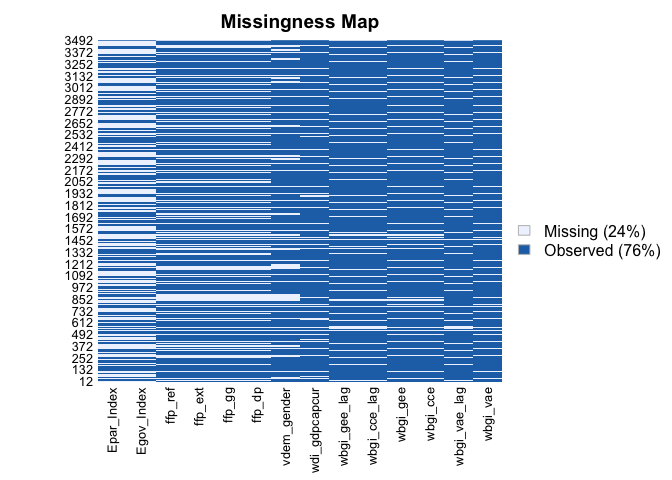

## Skewness of variables

Lastly I take a brief look at the skewness of the variables by both
numerical measures and the scatter plot matrix. Since the skewness of
*wdi\_gdpcapcur* is particularly high among all of the variables (in
fact it is the only variable that has a skewness of higher than 1), I
will log-transform this variable to prevent it from biasing the
regression results.

## Skewness in numerical terms

    library(moments)
    skewness(dataset[c(6, 7, 11:19)], na.rm = T)

    ##    Egov_Index    Epar_Index      wbgi_cce      wbgi_gee      wbgi_vae 
    ##     0.1049568     0.9737278     0.7002863     0.4166640    -0.1764773 
    ## wdi_gdpcapcur   vdem_gender        ffp_dp        ffp_gg       ffp_ext 
    ##     3.4496094    -0.9606798    -0.3078969    -0.1093040    -0.3408144 
    ##       ffp_ref 
    ##     0.2512283

## Scatter plot matrix with histograms

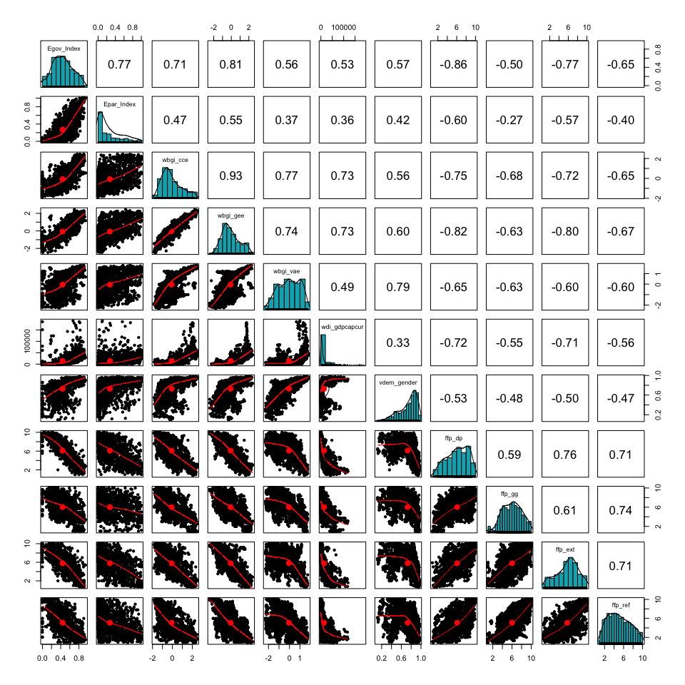

## 

As expected, the *wdi\_gdpcapcur* variable resembles much closer to a
normal distribution after being natural log transformed.

    dataset = dataset %>% 
      mutate(wdi_gdpcapcur_logged = log(wdi_gdpcapcur))

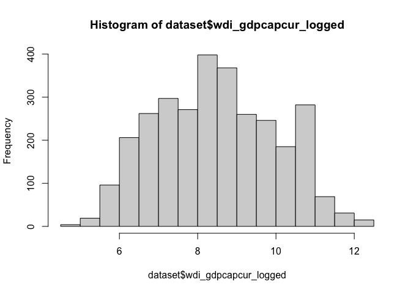

# Methodology

## Model Selection

Since the data set is panel-structured (i.e. having considerably more
units than observations within units across year), it warrants the use
of linear mixed effects model since adopting OLS will very likely
violate its fundamental assumptions (e.g. assuming the effect of
predictors on the response variable and intercept are constant for all
observation, no serial correlation among observations). That leaves to
the choice between fixed effects and random effects model. Which one
should be adopted then?

I will now create models with random effects and fixed effects first
before moving on to select which one is the better for each of the
dependent variable. For the fixed effects model I will be using the LSDV
method, whereas for the random effects model I will add *year* as the
random intercept in one version and *country* as the random intercept in
another. Note that the dummy terms are hidden for the fixed effects
specifications to avoid excessively long tables.

### Regression tables of random effects and fixed effects models

#### Dependent Variable: Control of Corruption Indicator (lagged 2 years)

<table style="border-collapse:collapse; border:none;">
<caption style="font-weight: bold; text-align:left;">
Dependent Variable: Control of Corruption Indicator (lagged 2 years)
</caption>
<tr>
<th style="border-top: double; text-align:center; font-style:normal; font-weight:bold; padding:0.2cm;  text-align:left; ">
 
</th>
<th colspan="3" style="border-top: double; text-align:center; font-style:normal; font-weight:bold; padding:0.2cm; ">
RE with country as random intercept
</th>
<th colspan="3" style="border-top: double; text-align:center; font-style:normal; font-weight:bold; padding:0.2cm; ">
RE with year as random intercept
</th>
<th colspan="3" style="border-top: double; text-align:center; font-style:normal; font-weight:bold; padding:0.2cm; ">
FE with country dummies
</th>
</tr>
<tr>
<td style=" text-align:center; border-bottom:1px solid; font-style:italic; font-weight:normal;  text-align:left; ">
Predictors
</td>
<td style=" text-align:center; border-bottom:1px solid; font-style:italic; font-weight:normal;  ">
Estimates
</td>
<td style=" text-align:center; border-bottom:1px solid; font-style:italic; font-weight:normal;  ">
std. Error
</td>
<td style=" text-align:center; border-bottom:1px solid; font-style:italic; font-weight:normal;  ">
p
</td>
<td style=" text-align:center; border-bottom:1px solid; font-style:italic; font-weight:normal;  ">
Estimates
</td>
<td style=" text-align:center; border-bottom:1px solid; font-style:italic; font-weight:normal;  ">
std. Error
</td>
<td style=" text-align:center; border-bottom:1px solid; font-style:italic; font-weight:normal;  col7">
p
</td>
<td style=" text-align:center; border-bottom:1px solid; font-style:italic; font-weight:normal;  col8">
Estimates
</td>
<td style=" text-align:center; border-bottom:1px solid; font-style:italic; font-weight:normal;  col9">
std. Error
</td>
<td style=" text-align:center; border-bottom:1px solid; font-style:italic; font-weight:normal;  0">
p
</td>
</tr>
<tr>
<td style=" padding:0.2cm; text-align:left; vertical-align:top; text-align:left; ">
(Intercept)
</td>
<td style=" padding:0.2cm; text-align:left; vertical-align:top; text-align:center;  ">
-0.830
</td>
<td style=" padding:0.2cm; text-align:left; vertical-align:top; text-align:center;  ">
0.215
</td>
<td style=" padding:0.2cm; text-align:left; vertical-align:top; text-align:center;  ">
<strong>&lt;0.001
</td>
<td style=" padding:0.2cm; text-align:left; vertical-align:top; text-align:center;  ">
-1.796
</td>
<td style=" padding:0.2cm; text-align:left; vertical-align:top; text-align:center;  ">
0.321
</td>
<td style=" padding:0.2cm; text-align:left; vertical-align:top; text-align:center;  col7">
<strong>&lt;0.001
</td>
<td style=" padding:0.2cm; text-align:left; vertical-align:top; text-align:center;  col8">
</td>
<td style=" padding:0.2cm; text-align:left; vertical-align:top; text-align:center;  col9">
</td>
<td style=" padding:0.2cm; text-align:left; vertical-align:top; text-align:center;  0">
</td>
</tr>
<tr>
<td style=" padding:0.2cm; text-align:left; vertical-align:top; text-align:left; ">
E-Government Development Index
</td>
<td style=" padding:0.2cm; text-align:left; vertical-align:top; text-align:center;  ">
-0.054
</td>
<td style=" padding:0.2cm; text-align:left; vertical-align:top; text-align:center;  ">
0.091
</td>
<td style=" padding:0.2cm; text-align:left; vertical-align:top; text-align:center;  ">
0.552
</td>
<td style=" padding:0.2cm; text-align:left; vertical-align:top; text-align:center;  ">
1.407
</td>
<td style=" padding:0.2cm; text-align:left; vertical-align:top; text-align:center;  ">
0.188
</td>
<td style=" padding:0.2cm; text-align:left; vertical-align:top; text-align:center;  col7">
<strong>&lt;0.001
</td>
<td style=" padding:0.2cm; text-align:left; vertical-align:top; text-align:center;  col8">
-0.097
</td>
<td style=" padding:0.2cm; text-align:left; vertical-align:top; text-align:center;  col9">
0.090
</td>
<td style=" padding:0.2cm; text-align:left; vertical-align:top; text-align:center;  0">
0.282
</td>
</tr>
<tr>
<td style=" padding:0.2cm; text-align:left; vertical-align:top; text-align:left; ">
Logged GDP Per Capita in Current USD
</td>
<td style=" padding:0.2cm; text-align:left; vertical-align:top; text-align:center;  ">
0.096
</td>
<td style=" padding:0.2cm; text-align:left; vertical-align:top; text-align:center;  ">
0.019
</td>
<td style=" padding:0.2cm; text-align:left; vertical-align:top; text-align:center;  ">
<strong>&lt;0.001
</td>
<td style=" padding:0.2cm; text-align:left; vertical-align:top; text-align:center;  ">
0.203
</td>
<td style=" padding:0.2cm; text-align:left; vertical-align:top; text-align:center;  ">
0.025
</td>
<td style=" padding:0.2cm; text-align:left; vertical-align:top; text-align:center;  col7">
<strong>&lt;0.001
</td>
<td style=" padding:0.2cm; text-align:left; vertical-align:top; text-align:center;  col8">
0.056
</td>
<td style=" padding:0.2cm; text-align:left; vertical-align:top; text-align:center;  col9">
0.020
</td>
<td style=" padding:0.2cm; text-align:left; vertical-align:top; text-align:center;  0">
<strong>0.006</strong>
</td>
</tr>
<tr>
<td style=" padding:0.2cm; text-align:left; vertical-align:top; text-align:left; ">
V-DEM Women political empowerment index
</td>
<td style=" padding:0.2cm; text-align:left; vertical-align:top; text-align:center;  ">
0.120
</td>
<td style=" padding:0.2cm; text-align:left; vertical-align:top; text-align:center;  ">
0.127
</td>
<td style=" padding:0.2cm; text-align:left; vertical-align:top; text-align:center;  ">
0.342
</td>
<td style=" padding:0.2cm; text-align:left; vertical-align:top; text-align:center;  ">
0.912
</td>
<td style=" padding:0.2cm; text-align:left; vertical-align:top; text-align:center;  ">
0.123
</td>
<td style=" padding:0.2cm; text-align:left; vertical-align:top; text-align:center;  col7">
<strong>&lt;0.001
</td>
<td style=" padding:0.2cm; text-align:left; vertical-align:top; text-align:center;  col8">
-0.020
</td>
<td style=" padding:0.2cm; text-align:left; vertical-align:top; text-align:center;  col9">
0.133
</td>
<td style=" padding:0.2cm; text-align:left; vertical-align:top; text-align:center;  0">
0.880
</td>
</tr>
<tr>
<td style=" padding:0.2cm; text-align:left; vertical-align:top; text-align:left; ">
Demographic Pressure
</td>
<td style=" padding:0.2cm; text-align:left; vertical-align:top; text-align:center;  ">
-0.017
</td>
<td style=" padding:0.2cm; text-align:left; vertical-align:top; text-align:center;  ">
0.009
</td>
<td style=" padding:0.2cm; text-align:left; vertical-align:top; text-align:center;  ">
0.054
</td>
<td style=" padding:0.2cm; text-align:left; vertical-align:top; text-align:center;  ">
-0.053
</td>
<td style=" padding:0.2cm; text-align:left; vertical-align:top; text-align:center;  ">
0.016
</td>
<td style=" padding:0.2cm; text-align:left; vertical-align:top; text-align:center;  col7">
<strong>0.001</strong>
</td>
<td style=" padding:0.2cm; text-align:left; vertical-align:top; text-align:center;  col8">
-0.013
</td>
<td style=" padding:0.2cm; text-align:left; vertical-align:top; text-align:center;  col9">
0.009
</td>
<td style=" padding:0.2cm; text-align:left; vertical-align:top; text-align:center;  0">
0.123
</td>
</tr>
<tr>
<td style=" padding:0.2cm; text-align:left; vertical-align:top; text-align:left; ">
Group Grievance
</td>
<td style=" padding:0.2cm; text-align:left; vertical-align:top; text-align:center;  ">
-0.039
</td>
<td style=" padding:0.2cm; text-align:left; vertical-align:top; text-align:center;  ">
0.009
</td>
<td style=" padding:0.2cm; text-align:left; vertical-align:top; text-align:center;  ">
<strong>&lt;0.001
</td>
<td style=" padding:0.2cm; text-align:left; vertical-align:top; text-align:center;  ">
-0.133
</td>
<td style=" padding:0.2cm; text-align:left; vertical-align:top; text-align:center;  ">
0.012
</td>
<td style=" padding:0.2cm; text-align:left; vertical-align:top; text-align:center;  col7">
<strong>&lt;0.001
</td>
<td style=" padding:0.2cm; text-align:left; vertical-align:top; text-align:center;  col8">
-0.020
</td>
<td style=" padding:0.2cm; text-align:left; vertical-align:top; text-align:center;  col9">
0.009
</td>
<td style=" padding:0.2cm; text-align:left; vertical-align:top; text-align:center;  0">
<strong>0.031</strong>
</td>
</tr>
<tr>
<td style=" padding:0.2cm; text-align:left; vertical-align:top; text-align:left; ">
External Intervention
</td>
<td style=" padding:0.2cm; text-align:left; vertical-align:top; text-align:center;  ">
-0.014
</td>
<td style=" padding:0.2cm; text-align:left; vertical-align:top; text-align:center;  ">
0.008
</td>
<td style=" padding:0.2cm; text-align:left; vertical-align:top; text-align:center;  ">
0.082
</td>
<td style=" padding:0.2cm; text-align:left; vertical-align:top; text-align:center;  ">
-0.057
</td>
<td style=" padding:0.2cm; text-align:left; vertical-align:top; text-align:center;  ">
0.012
</td>
<td style=" padding:0.2cm; text-align:left; vertical-align:top; text-align:center;  col7">
<strong>&lt;0.001
</td>
<td style=" padding:0.2cm; text-align:left; vertical-align:top; text-align:center;  col8">
-0.005
</td>
<td style=" padding:0.2cm; text-align:left; vertical-align:top; text-align:center;  col9">
0.008
</td>
<td style=" padding:0.2cm; text-align:left; vertical-align:top; text-align:center;  0">
0.535
</td>
</tr>
<tr>
<td style=" padding:0.2cm; text-align:left; vertical-align:top; text-align:left; ">
Refugees and IDPs
</td>
<td style=" padding:0.2cm; text-align:left; vertical-align:top; text-align:center;  ">
-0.011
</td>
<td style=" padding:0.2cm; text-align:left; vertical-align:top; text-align:center;  ">
0.007
</td>
<td style=" padding:0.2cm; text-align:left; vertical-align:top; text-align:center;  ">
0.128
</td>
<td style=" padding:0.2cm; text-align:left; vertical-align:top; text-align:center;  ">
0.059
</td>
<td style=" padding:0.2cm; text-align:left; vertical-align:top; text-align:center;  ">
0.012
</td>
<td style=" padding:0.2cm; text-align:left; vertical-align:top; text-align:center;  col7">
<strong>&lt;0.001
</td>
<td style=" padding:0.2cm; text-align:left; vertical-align:top; text-align:center;  col8">
-0.007
</td>
<td style=" padding:0.2cm; text-align:left; vertical-align:top; text-align:center;  col9">
0.007
</td>
<td style=" padding:0.2cm; text-align:left; vertical-align:top; text-align:center;  0">
0.334
</td>
</tr>
<tr>
<td style=" padding:0.2cm; text-align:left; vertical-align:top; text-align:left; ">
region: Americas
</td>
<td style=" padding:0.2cm; text-align:left; vertical-align:top; text-align:center;  ">
0.222
</td>
<td style=" padding:0.2cm; text-align:left; vertical-align:top; text-align:center;  ">
0.168
</td>
<td style=" padding:0.2cm; text-align:left; vertical-align:top; text-align:center;  ">
0.186
</td>
<td style=" padding:0.2cm; text-align:left; vertical-align:top; text-align:center;  ">
-0.485
</td>
<td style=" padding:0.2cm; text-align:left; vertical-align:top; text-align:center;  ">
0.054
</td>
<td style=" padding:0.2cm; text-align:left; vertical-align:top; text-align:center;  col7">
<strong>&lt;0.001
</td>
<td style=" padding:0.2cm; text-align:left; vertical-align:top; text-align:center;  col8">
-1.328
</td>
<td style=" padding:0.2cm; text-align:left; vertical-align:top; text-align:center;  col9">
0.234
</td>
<td style=" padding:0.2cm; text-align:left; vertical-align:top; text-align:center;  0">
<strong>&lt;0.001
</td>
</tr>
<tr>
<td style=" padding:0.2cm; text-align:left; vertical-align:top; text-align:left; ">
region: Asia
</td>
<td style=" padding:0.2cm; text-align:left; vertical-align:top; text-align:center;  ">
0.144
</td>
<td style=" padding:0.2cm; text-align:left; vertical-align:top; text-align:center;  ">
0.144
</td>
<td style=" padding:0.2cm; text-align:left; vertical-align:top; text-align:center;  ">
0.315
</td>
<td style=" padding:0.2cm; text-align:left; vertical-align:top; text-align:center;  ">
-0.227
</td>
<td style=" padding:0.2cm; text-align:left; vertical-align:top; text-align:center;  ">
0.050
</td>
<td style=" padding:0.2cm; text-align:left; vertical-align:top; text-align:center;  col7">
<strong>&lt;0.001
</td>
<td style=" padding:0.2cm; text-align:left; vertical-align:top; text-align:center;  col8">
-1.382
</td>
<td style=" padding:0.2cm; text-align:left; vertical-align:top; text-align:center;  col9">
0.199
</td>
<td style=" padding:0.2cm; text-align:left; vertical-align:top; text-align:center;  0">
<strong>&lt;0.001
</td>
</tr>
<tr>
<td style=" padding:0.2cm; text-align:left; vertical-align:top; text-align:left; ">
region: Europe
</td>
<td style=" padding:0.2cm; text-align:left; vertical-align:top; text-align:center;  ">
0.891
</td>
<td style=" padding:0.2cm; text-align:left; vertical-align:top; text-align:center;  ">
0.157
</td>
<td style=" padding:0.2cm; text-align:left; vertical-align:top; text-align:center;  ">
<strong>&lt;0.001
</td>
<td style=" padding:0.2cm; text-align:left; vertical-align:top; text-align:center;  ">
-0.427
</td>
<td style=" padding:0.2cm; text-align:left; vertical-align:top; text-align:center;  ">
0.064
</td>
<td style=" padding:0.2cm; text-align:left; vertical-align:top; text-align:center;  col7">
<strong>&lt;0.001
</td>
<td style=" padding:0.2cm; text-align:left; vertical-align:top; text-align:center;  col8">
1.452
</td>
<td style=" padding:0.2cm; text-align:left; vertical-align:top; text-align:center;  col9">
0.239
</td>
<td style=" padding:0.2cm; text-align:left; vertical-align:top; text-align:center;  0">
<strong>&lt;0.001
</td>
</tr>
<tr>
<td style=" padding:0.2cm; text-align:left; vertical-align:top; text-align:left; ">
region: Oceania
</td>
<td style=" padding:0.2cm; text-align:left; vertical-align:top; text-align:center;  ">
0.881
</td>
<td style=" padding:0.2cm; text-align:left; vertical-align:top; text-align:center;  ">
0.328
</td>
<td style=" padding:0.2cm; text-align:left; vertical-align:top; text-align:center;  ">
<strong>0.007</strong>
</td>
<td style=" padding:0.2cm; text-align:left; vertical-align:top; text-align:center;  ">
0.248
</td>
<td style=" padding:0.2cm; text-align:left; vertical-align:top; text-align:center;  ">
0.098
</td>
<td style=" padding:0.2cm; text-align:left; vertical-align:top; text-align:center;  col7">
<strong>0.012</strong>
</td>
<td style=" padding:0.2cm; text-align:left; vertical-align:top; text-align:center;  col8">
-0.393
</td>
<td style=" padding:0.2cm; text-align:left; vertical-align:top; text-align:center;  col9">
0.206
</td>
<td style=" padding:0.2cm; text-align:left; vertical-align:top; text-align:center;  0">
0.056
</td>
</tr>
<tr>
<td style=" padding:0.2cm; text-align:left; vertical-align:top; text-align:left; ">
region: Africa
</td>
<td style=" padding:0.2cm; text-align:left; vertical-align:top; text-align:center;  ">
</td>
<td style=" padding:0.2cm; text-align:left; vertical-align:top; text-align:center;  ">
</td>
<td style=" padding:0.2cm; text-align:left; vertical-align:top; text-align:center;  ">
</td>
<td style=" padding:0.2cm; text-align:left; vertical-align:top; text-align:center;  ">
</td>
<td style=" padding:0.2cm; text-align:left; vertical-align:top; text-align:center;  ">
</td>
<td style=" padding:0.2cm; text-align:left; vertical-align:top; text-align:center;  col7">
</td>
<td style=" padding:0.2cm; text-align:left; vertical-align:top; text-align:center;  col8">
-1.291
</td>
<td style=" padding:0.2cm; text-align:left; vertical-align:top; text-align:center;  col9">
0.209
</td>
<td style=" padding:0.2cm; text-align:left; vertical-align:top; text-align:center;  0">
<strong>&lt;0.001
</td>
</tr>
<tr>
<td colspan="10" style="font-weight:bold; text-align:left; padding-top:.8em;">
Random Effects
</td>
</tr>
<tr>
<td style=" padding:0.2cm; text-align:left; vertical-align:top; text-align:left; padding-top:0.1cm; padding-bottom:0.1cm;">
σ2
</td>
<td style=" padding:0.2cm; text-align:left; vertical-align:top; padding-top:0.1cm; padding-bottom:0.1cm; text-align:left;" colspan="3">
0.03
</td>
<td style=" padding:0.2cm; text-align:left; vertical-align:top; padding-top:0.1cm; padding-bottom:0.1cm; text-align:left;" colspan="3">
0.25
</td>
<td style=" padding:0.2cm; text-align:left; vertical-align:top; padding-top:0.1cm; padding-bottom:0.1cm; text-align:left;" colspan="3">
 
</td>
<tr>
<td style=" padding:0.2cm; text-align:left; vertical-align:top; text-align:left; padding-top:0.1cm; padding-bottom:0.1cm;">
τ00
</td>
<td style=" padding:0.2cm; text-align:left; vertical-align:top; padding-top:0.1cm; padding-bottom:0.1cm; text-align:left;" colspan="3">
0.48 cname
</td>
<td style=" padding:0.2cm; text-align:left; vertical-align:top; padding-top:0.1cm; padding-bottom:0.1cm; text-align:left;" colspan="3">
0.02 year
</td>
<td style=" padding:0.2cm; text-align:left; vertical-align:top; padding-top:0.1cm; padding-bottom:0.1cm; text-align:left;" colspan="3">
 
</td>
<tr>
<td style=" padding:0.2cm; text-align:left; vertical-align:top; text-align:left; padding-top:0.1cm; padding-bottom:0.1cm;">
ICC
</td>
<td style=" padding:0.2cm; text-align:left; vertical-align:top; padding-top:0.1cm; padding-bottom:0.1cm; text-align:left;" colspan="3">
0.95
</td>
<td style=" padding:0.2cm; text-align:left; vertical-align:top; padding-top:0.1cm; padding-bottom:0.1cm; text-align:left;" colspan="3">
0.06
</td>
<td style=" padding:0.2cm; text-align:left; vertical-align:top; padding-top:0.1cm; padding-bottom:0.1cm; text-align:left;" colspan="3">
 
</td>
<tr>
<td style=" padding:0.2cm; text-align:left; vertical-align:top; text-align:left; padding-top:0.1cm; padding-bottom:0.1cm;">
N
</td>
<td style=" padding:0.2cm; text-align:left; vertical-align:top; padding-top:0.1cm; padding-bottom:0.1cm; text-align:left;" colspan="3">
169 cname
</td>
<td style=" padding:0.2cm; text-align:left; vertical-align:top; padding-top:0.1cm; padding-bottom:0.1cm; text-align:left;" colspan="3">
7 year
</td>
<td style=" padding:0.2cm; text-align:left; vertical-align:top; padding-top:0.1cm; padding-bottom:0.1cm; text-align:left;" colspan="3">
 
</td>
<tr>
<td style=" padding:0.2cm; text-align:left; vertical-align:top; text-align:left; padding-top:0.1cm; padding-bottom:0.1cm; border-top:1px solid;">
Observations
</td>
<td style=" padding:0.2cm; text-align:left; vertical-align:top; padding-top:0.1cm; padding-bottom:0.1cm; text-align:left; border-top:1px solid;" colspan="3">
1132
</td>
<td style=" padding:0.2cm; text-align:left; vertical-align:top; padding-top:0.1cm; padding-bottom:0.1cm; text-align:left; border-top:1px solid;" colspan="3">
1132
</td>
<td style=" padding:0.2cm; text-align:left; vertical-align:top; padding-top:0.1cm; padding-bottom:0.1cm; text-align:left; border-top:1px solid;" colspan="3">
1132
</td>
</tr>
<tr>
<td style=" padding:0.2cm; text-align:left; vertical-align:top; text-align:left; padding-top:0.1cm; padding-bottom:0.1cm;">
Marginal R2 / Conditional R2
</td>
<td style=" padding:0.2cm; text-align:left; vertical-align:top; padding-top:0.1cm; padding-bottom:0.1cm; text-align:left;" colspan="3">
0.397 / 0.969
</td>
<td style=" padding:0.2cm; text-align:left; vertical-align:top; padding-top:0.1cm; padding-bottom:0.1cm; text-align:left;" colspan="3">
0.745 / 0.761
</td>
<td style=" padding:0.2cm; text-align:left; vertical-align:top; padding-top:0.1cm; padding-bottom:0.1cm; text-align:left;" colspan="3">
0.979 / 0.975
</td>
</tr>
<tr>
<td style=" padding:0.2cm; text-align:left; vertical-align:top; text-align:left; padding-top:0.1cm; padding-bottom:0.1cm;">
AIC
</td>
<td style=" padding:0.2cm; text-align:left; vertical-align:top; padding-top:0.1cm; padding-bottom:0.1cm; text-align:left;" colspan="3">
-22.087
</td>
<td style=" padding:0.2cm; text-align:left; vertical-align:top; padding-top:0.1cm; padding-bottom:0.1cm; text-align:left;" colspan="3">
1743.708
</td>
<td style=" padding:0.2cm; text-align:left; vertical-align:top; padding-top:0.1cm; padding-bottom:0.1cm; text-align:left;" colspan="3">
-759.239
</td>
</tr>
</table>

#### Dependent Variable: Government Effectiveness Indicator (lagged 2 years)

<table style="border-collapse:collapse; border:none;">
<caption style="font-weight: bold; text-align:left;">
Dependent Variable: Government Effectiveness Indicator (lagged 2 years)
</caption>
<tr>
<th style="border-top: double; text-align:center; font-style:normal; font-weight:bold; padding:0.2cm;  text-align:left; ">
 
</th>
<th colspan="3" style="border-top: double; text-align:center; font-style:normal; font-weight:bold; padding:0.2cm; ">
RE with country as random intercept
</th>
<th colspan="3" style="border-top: double; text-align:center; font-style:normal; font-weight:bold; padding:0.2cm; ">
RE with year as random intercept
</th>
<th colspan="3" style="border-top: double; text-align:center; font-style:normal; font-weight:bold; padding:0.2cm; ">
FE with country dummies
</th>
</tr>
<tr>
<td style=" text-align:center; border-bottom:1px solid; font-style:italic; font-weight:normal;  text-align:left; ">
Predictors
</td>
<td style=" text-align:center; border-bottom:1px solid; font-style:italic; font-weight:normal;  ">
Estimates
</td>
<td style=" text-align:center; border-bottom:1px solid; font-style:italic; font-weight:normal;  ">
std. Error
</td>
<td style=" text-align:center; border-bottom:1px solid; font-style:italic; font-weight:normal;  ">
p
</td>
<td style=" text-align:center; border-bottom:1px solid; font-style:italic; font-weight:normal;  ">
Estimates
</td>
<td style=" text-align:center; border-bottom:1px solid; font-style:italic; font-weight:normal;  ">
std. Error
</td>
<td style=" text-align:center; border-bottom:1px solid; font-style:italic; font-weight:normal;  col7">
p
</td>
<td style=" text-align:center; border-bottom:1px solid; font-style:italic; font-weight:normal;  col8">
Estimates
</td>
<td style=" text-align:center; border-bottom:1px solid; font-style:italic; font-weight:normal;  col9">
std. Error
</td>
<td style=" text-align:center; border-bottom:1px solid; font-style:italic; font-weight:normal;  0">
p
</td>
</tr>
<tr>
<td style=" padding:0.2cm; text-align:left; vertical-align:top; text-align:left; ">
(Intercept)
</td>
<td style=" padding:0.2cm; text-align:left; vertical-align:top; text-align:center;  ">
-0.472
</td>
<td style=" padding:0.2cm; text-align:left; vertical-align:top; text-align:center;  ">
0.201
</td>
<td style=" padding:0.2cm; text-align:left; vertical-align:top; text-align:center;  ">
<strong>0.019</strong>
</td>
<td style=" padding:0.2cm; text-align:left; vertical-align:top; text-align:center;  ">
-1.912
</td>
<td style=" padding:0.2cm; text-align:left; vertical-align:top; text-align:center;  ">
0.251
</td>
<td style=" padding:0.2cm; text-align:left; vertical-align:top; text-align:center;  col7">
<strong>&lt;0.001
</td>
<td style=" padding:0.2cm; text-align:left; vertical-align:top; text-align:center;  col8">
</td>
<td style=" padding:0.2cm; text-align:left; vertical-align:top; text-align:center;  col9">
</td>
<td style=" padding:0.2cm; text-align:left; vertical-align:top; text-align:center;  0">
</td>
</tr>
<tr>
<td style=" padding:0.2cm; text-align:left; vertical-align:top; text-align:left; ">
E-Government Development Index
</td>
<td style=" padding:0.2cm; text-align:left; vertical-align:top; text-align:center;  ">
0.047
</td>
<td style=" padding:0.2cm; text-align:left; vertical-align:top; text-align:center;  ">
0.088
</td>
<td style=" padding:0.2cm; text-align:left; vertical-align:top; text-align:center;  ">
0.593
</td>
<td style=" padding:0.2cm; text-align:left; vertical-align:top; text-align:center;  ">
1.663
</td>
<td style=" padding:0.2cm; text-align:left; vertical-align:top; text-align:center;  ">
0.146
</td>
<td style=" padding:0.2cm; text-align:left; vertical-align:top; text-align:center;  col7">
<strong>&lt;0.001
</td>
<td style=" padding:0.2cm; text-align:left; vertical-align:top; text-align:center;  col8">
-0.021
</td>
<td style=" padding:0.2cm; text-align:left; vertical-align:top; text-align:center;  col9">
0.087
</td>
<td style=" padding:0.2cm; text-align:left; vertical-align:top; text-align:center;  0">
0.811
</td>
</tr>
<tr>
<td style=" padding:0.2cm; text-align:left; vertical-align:top; text-align:left; ">
Logged GDP Per Capita in Current USD
</td>
<td style=" padding:0.2cm; text-align:left; vertical-align:top; text-align:center;  ">
0.082
</td>
<td style=" padding:0.2cm; text-align:left; vertical-align:top; text-align:center;  ">
0.018
</td>
<td style=" padding:0.2cm; text-align:left; vertical-align:top; text-align:center;  ">
<strong>&lt;0.001
</td>
<td style=" padding:0.2cm; text-align:left; vertical-align:top; text-align:center;  ">
0.166
</td>
<td style=" padding:0.2cm; text-align:left; vertical-align:top; text-align:center;  ">
0.020
</td>
<td style=" padding:0.2cm; text-align:left; vertical-align:top; text-align:center;  col7">
<strong>&lt;0.001
</td>
<td style=" padding:0.2cm; text-align:left; vertical-align:top; text-align:center;  col8">
0.037
</td>
<td style=" padding:0.2cm; text-align:left; vertical-align:top; text-align:center;  col9">
0.019
</td>
<td style=" padding:0.2cm; text-align:left; vertical-align:top; text-align:center;  0">
0.059
</td>
</tr>
<tr>
<td style=" padding:0.2cm; text-align:left; vertical-align:top; text-align:left; ">
V-DEM Women political empowerment index
</td>
<td style=" padding:0.2cm; text-align:left; vertical-align:top; text-align:center;  ">
0.228
</td>
<td style=" padding:0.2cm; text-align:left; vertical-align:top; text-align:center;  ">
0.120
</td>
<td style=" padding:0.2cm; text-align:left; vertical-align:top; text-align:center;  ">
0.057
</td>
<td style=" padding:0.2cm; text-align:left; vertical-align:top; text-align:center;  ">
1.097
</td>
<td style=" padding:0.2cm; text-align:left; vertical-align:top; text-align:center;  ">
0.095
</td>
<td style=" padding:0.2cm; text-align:left; vertical-align:top; text-align:center;  col7">
<strong>&lt;0.001
</td>
<td style=" padding:0.2cm; text-align:left; vertical-align:top; text-align:center;  col8">
0.013
</td>
<td style=" padding:0.2cm; text-align:left; vertical-align:top; text-align:center;  col9">
0.128
</td>
<td style=" padding:0.2cm; text-align:left; vertical-align:top; text-align:center;  0">
0.922
</td>
</tr>
<tr>
<td style=" padding:0.2cm; text-align:left; vertical-align:top; text-align:left; ">
Demographic Pressure
</td>
<td style=" padding:0.2cm; text-align:left; vertical-align:top; text-align:center;  ">
-0.032
</td>
<td style=" padding:0.2cm; text-align:left; vertical-align:top; text-align:center;  ">
0.008
</td>
<td style=" padding:0.2cm; text-align:left; vertical-align:top; text-align:center;  ">
<strong>&lt;0.001
</td>
<td style=" padding:0.2cm; text-align:left; vertical-align:top; text-align:center;  ">
-0.056
</td>
<td style=" padding:0.2cm; text-align:left; vertical-align:top; text-align:center;  ">
0.013
</td>
<td style=" padding:0.2cm; text-align:left; vertical-align:top; text-align:center;  col7">
<strong>&lt;0.001
</td>
<td style=" padding:0.2cm; text-align:left; vertical-align:top; text-align:center;  col8">
-0.030
</td>
<td style=" padding:0.2cm; text-align:left; vertical-align:top; text-align:center;  col9">
0.008
</td>
<td style=" padding:0.2cm; text-align:left; vertical-align:top; text-align:center;  0">
<strong>&lt;0.001
</td>
</tr>
<tr>
<td style=" padding:0.2cm; text-align:left; vertical-align:top; text-align:left; ">
Group Grievance
</td>
<td style=" padding:0.2cm; text-align:left; vertical-align:top; text-align:center;  ">
-0.031
</td>
<td style=" padding:0.2cm; text-align:left; vertical-align:top; text-align:center;  ">
0.008
</td>
<td style=" padding:0.2cm; text-align:left; vertical-align:top; text-align:center;  ">
<strong>&lt;0.001
</td>
<td style=" padding:0.2cm; text-align:left; vertical-align:top; text-align:center;  ">
-0.063
</td>
<td style=" padding:0.2cm; text-align:left; vertical-align:top; text-align:center;  ">
0.009
</td>
<td style=" padding:0.2cm; text-align:left; vertical-align:top; text-align:center;  col7">
<strong>&lt;0.001
</td>
<td style=" padding:0.2cm; text-align:left; vertical-align:top; text-align:center;  col8">
-0.013
</td>
<td style=" padding:0.2cm; text-align:left; vertical-align:top; text-align:center;  col9">
0.009
</td>
<td style=" padding:0.2cm; text-align:left; vertical-align:top; text-align:center;  0">
0.138
</td>
</tr>
<tr>
<td style=" padding:0.2cm; text-align:left; vertical-align:top; text-align:left; ">
External Intervention
</td>
<td style=" padding:0.2cm; text-align:left; vertical-align:top; text-align:center;  ">
-0.053
</td>
<td style=" padding:0.2cm; text-align:left; vertical-align:top; text-align:center;  ">
0.008
</td>
<td style=" padding:0.2cm; text-align:left; vertical-align:top; text-align:center;  ">
<strong>&lt;0.001
</td>
<td style=" padding:0.2cm; text-align:left; vertical-align:top; text-align:center;  ">
-0.088
</td>
<td style=" padding:0.2cm; text-align:left; vertical-align:top; text-align:center;  ">
0.009
</td>
<td style=" padding:0.2cm; text-align:left; vertical-align:top; text-align:center;  col7">
<strong>&lt;0.001
</td>
<td style=" padding:0.2cm; text-align:left; vertical-align:top; text-align:center;  col8">
-0.041
</td>
<td style=" padding:0.2cm; text-align:left; vertical-align:top; text-align:center;  col9">
0.008
</td>
<td style=" padding:0.2cm; text-align:left; vertical-align:top; text-align:center;  0">
<strong>&lt;0.001
</td>
</tr>
<tr>
<td style=" padding:0.2cm; text-align:left; vertical-align:top; text-align:left; ">
Refugees and IDPs
</td>
<td style=" padding:0.2cm; text-align:left; vertical-align:top; text-align:center;  ">
-0.027
</td>
<td style=" padding:0.2cm; text-align:left; vertical-align:top; text-align:center;  ">
0.007
</td>
<td style=" padding:0.2cm; text-align:left; vertical-align:top; text-align:center;  ">
<strong>&lt;0.001
</td>
<td style=" padding:0.2cm; text-align:left; vertical-align:top; text-align:center;  ">
0.040
</td>
<td style=" padding:0.2cm; text-align:left; vertical-align:top; text-align:center;  ">
0.009
</td>
<td style=" padding:0.2cm; text-align:left; vertical-align:top; text-align:center;  col7">
<strong>&lt;0.001
</td>
<td style=" padding:0.2cm; text-align:left; vertical-align:top; text-align:center;  col8">
-0.024
</td>
<td style=" padding:0.2cm; text-align:left; vertical-align:top; text-align:center;  col9">
0.007
</td>
<td style=" padding:0.2cm; text-align:left; vertical-align:top; text-align:center;  0">
<strong>0.001</strong>
</td>
</tr>
<tr>
<td style=" padding:0.2cm; text-align:left; vertical-align:top; text-align:left; ">
region: Americas
</td>
<td style=" padding:0.2cm; text-align:left; vertical-align:top; text-align:center;  ">
0.225
</td>
<td style=" padding:0.2cm; text-align:left; vertical-align:top; text-align:center;  ">
0.134
</td>
<td style=" padding:0.2cm; text-align:left; vertical-align:top; text-align:center;  ">
0.094
</td>
<td style=" padding:0.2cm; text-align:left; vertical-align:top; text-align:center;  ">
-0.409
</td>
<td style=" padding:0.2cm; text-align:left; vertical-align:top; text-align:center;  ">
0.042
</td>
<td style=" padding:0.2cm; text-align:left; vertical-align:top; text-align:center;  col7">
<strong>&lt;0.001
</td>
<td style=" padding:0.2cm; text-align:left; vertical-align:top; text-align:center;  col8">
-0.818
</td>
<td style=" padding:0.2cm; text-align:left; vertical-align:top; text-align:center;  col9">
0.226
</td>
<td style=" padding:0.2cm; text-align:left; vertical-align:top; text-align:center;  0">
<strong>&lt;0.001
</td>
</tr>
<tr>
<td style=" padding:0.2cm; text-align:left; vertical-align:top; text-align:left; ">
region: Asia
</td>
<td style=" padding:0.2cm; text-align:left; vertical-align:top; text-align:center;  ">
0.371
</td>
<td style=" padding:0.2cm; text-align:left; vertical-align:top; text-align:center;  ">
0.115
</td>
<td style=" padding:0.2cm; text-align:left; vertical-align:top; text-align:center;  ">
<strong>0.001</strong>
</td>
<td style=" padding:0.2cm; text-align:left; vertical-align:top; text-align:center;  ">
0.001
</td>
<td style=" padding:0.2cm; text-align:left; vertical-align:top; text-align:center;  ">
0.039
</td>
<td style=" padding:0.2cm; text-align:left; vertical-align:top; text-align:center;  col7">
0.989
</td>
<td style=" padding:0.2cm; text-align:left; vertical-align:top; text-align:center;  col8">
-0.550
</td>
<td style=" padding:0.2cm; text-align:left; vertical-align:top; text-align:center;  col9">
0.192
</td>
<td style=" padding:0.2cm; text-align:left; vertical-align:top; text-align:center;  0">
<strong>0.004</strong>
</td>
</tr>
<tr>
<td style=" padding:0.2cm; text-align:left; vertical-align:top; text-align:left; ">
region: Europe
</td>
<td style=" padding:0.2cm; text-align:left; vertical-align:top; text-align:center;  ">
0.814
</td>
<td style=" padding:0.2cm; text-align:left; vertical-align:top; text-align:center;  ">
0.128
</td>
<td style=" padding:0.2cm; text-align:left; vertical-align:top; text-align:center;  ">
<strong>&lt;0.001
</td>
<td style=" padding:0.2cm; text-align:left; vertical-align:top; text-align:center;  ">
-0.348
</td>
<td style=" padding:0.2cm; text-align:left; vertical-align:top; text-align:center;  ">
0.050
</td>
<td style=" padding:0.2cm; text-align:left; vertical-align:top; text-align:center;  col7">
<strong>&lt;0.001
</td>
<td style=" padding:0.2cm; text-align:left; vertical-align:top; text-align:center;  col8">
1.538
</td>
<td style=" padding:0.2cm; text-align:left; vertical-align:top; text-align:center;  col9">
0.230
</td>
<td style=" padding:0.2cm; text-align:left; vertical-align:top; text-align:center;  0">
<strong>&lt;0.001
</td>
</tr>
<tr>
<td style=" padding:0.2cm; text-align:left; vertical-align:top; text-align:left; ">
region: Oceania
</td>
<td style=" padding:0.2cm; text-align:left; vertical-align:top; text-align:center;  ">
0.490
</td>
<td style=" padding:0.2cm; text-align:left; vertical-align:top; text-align:center;  ">
0.260
</td>
<td style=" padding:0.2cm; text-align:left; vertical-align:top; text-align:center;  ">
0.060
</td>
<td style=" padding:0.2cm; text-align:left; vertical-align:top; text-align:center;  ">
-0.027
</td>
<td style=" padding:0.2cm; text-align:left; vertical-align:top; text-align:center;  ">
0.076
</td>
<td style=" padding:0.2cm; text-align:left; vertical-align:top; text-align:center;  col7">
0.725
</td>
<td style=" padding:0.2cm; text-align:left; vertical-align:top; text-align:center;  col8">
-0.455
</td>
<td style=" padding:0.2cm; text-align:left; vertical-align:top; text-align:center;  col9">
0.199
</td>
<td style=" padding:0.2cm; text-align:left; vertical-align:top; text-align:center;  0">
<strong>0.022</strong>
</td>
</tr>
<tr>
<td style=" padding:0.2cm; text-align:left; vertical-align:top; text-align:left; ">
region: Africa
</td>
<td style=" padding:0.2cm; text-align:left; vertical-align:top; text-align:center;  ">
</td>
<td style=" padding:0.2cm; text-align:left; vertical-align:top; text-align:center;  ">
</td>
<td style=" padding:0.2cm; text-align:left; vertical-align:top; text-align:center;  ">
</td>
<td style=" padding:0.2cm; text-align:left; vertical-align:top; text-align:center;  ">
</td>
<td style=" padding:0.2cm; text-align:left; vertical-align:top; text-align:center;  ">
</td>
<td style=" padding:0.2cm; text-align:left; vertical-align:top; text-align:center;  col7">
</td>
<td style=" padding:0.2cm; text-align:left; vertical-align:top; text-align:center;  col8">
-0.630
</td>
<td style=" padding:0.2cm; text-align:left; vertical-align:top; text-align:center;  col9">
0.202
</td>
<td style=" padding:0.2cm; text-align:left; vertical-align:top; text-align:center;  0">
<strong>0.002</strong>
</td>
</tr>
<tr>
<td colspan="10" style="font-weight:bold; text-align:left; padding-top:.8em;">
Random Effects
</td>
</tr>
<tr>
<td style=" padding:0.2cm; text-align:left; vertical-align:top; text-align:left; padding-top:0.1cm; padding-bottom:0.1cm;">
σ2
</td>
<td style=" padding:0.2cm; text-align:left; vertical-align:top; padding-top:0.1cm; padding-bottom:0.1cm; text-align:left;" colspan="3">
0.02
</td>
<td style=" padding:0.2cm; text-align:left; vertical-align:top; padding-top:0.1cm; padding-bottom:0.1cm; text-align:left;" colspan="3">
0.15
</td>
<td style=" padding:0.2cm; text-align:left; vertical-align:top; padding-top:0.1cm; padding-bottom:0.1cm; text-align:left;" colspan="3">
 
</td>
<tr>
<td style=" padding:0.2cm; text-align:left; vertical-align:top; text-align:left; padding-top:0.1cm; padding-bottom:0.1cm;">
τ00
</td>
<td style=" padding:0.2cm; text-align:left; vertical-align:top; padding-top:0.1cm; padding-bottom:0.1cm; text-align:left;" colspan="3">
0.30 cname
</td>
<td style=" padding:0.2cm; text-align:left; vertical-align:top; padding-top:0.1cm; padding-bottom:0.1cm; text-align:left;" colspan="3">
0.02 year
</td>
<td style=" padding:0.2cm; text-align:left; vertical-align:top; padding-top:0.1cm; padding-bottom:0.1cm; text-align:left;" colspan="3">
 
</td>
<tr>
<td style=" padding:0.2cm; text-align:left; vertical-align:top; text-align:left; padding-top:0.1cm; padding-bottom:0.1cm;">
ICC
</td>
<td style=" padding:0.2cm; text-align:left; vertical-align:top; padding-top:0.1cm; padding-bottom:0.1cm; text-align:left;" colspan="3">
0.92
</td>
<td style=" padding:0.2cm; text-align:left; vertical-align:top; padding-top:0.1cm; padding-bottom:0.1cm; text-align:left;" colspan="3">
0.11
</td>
<td style=" padding:0.2cm; text-align:left; vertical-align:top; padding-top:0.1cm; padding-bottom:0.1cm; text-align:left;" colspan="3">
 
</td>
<tr>
<td style=" padding:0.2cm; text-align:left; vertical-align:top; text-align:left; padding-top:0.1cm; padding-bottom:0.1cm;">
N
</td>
<td style=" padding:0.2cm; text-align:left; vertical-align:top; padding-top:0.1cm; padding-bottom:0.1cm; text-align:left;" colspan="3">
169 cname
</td>
<td style=" padding:0.2cm; text-align:left; vertical-align:top; padding-top:0.1cm; padding-bottom:0.1cm; text-align:left;" colspan="3">
7 year
</td>
<td style=" padding:0.2cm; text-align:left; vertical-align:top; padding-top:0.1cm; padding-bottom:0.1cm; text-align:left;" colspan="3">
 
</td>
<tr>
<td style=" padding:0.2cm; text-align:left; vertical-align:top; text-align:left; padding-top:0.1cm; padding-bottom:0.1cm; border-top:1px solid;">
Observations
</td>
<td style=" padding:0.2cm; text-align:left; vertical-align:top; padding-top:0.1cm; padding-bottom:0.1cm; text-align:left; border-top:1px solid;" colspan="3">
1132
</td>
<td style=" padding:0.2cm; text-align:left; vertical-align:top; padding-top:0.1cm; padding-bottom:0.1cm; text-align:left; border-top:1px solid;" colspan="3">
1132
</td>
<td style=" padding:0.2cm; text-align:left; vertical-align:top; padding-top:0.1cm; padding-bottom:0.1cm; text-align:left; border-top:1px solid;" colspan="3">
1132
</td>
</tr>
<tr>
<td style=" padding:0.2cm; text-align:left; vertical-align:top; text-align:left; padding-top:0.1cm; padding-bottom:0.1cm;">
Marginal R2 / Conditional R2
</td>
<td style=" padding:0.2cm; text-align:left; vertical-align:top; padding-top:0.1cm; padding-bottom:0.1cm; text-align:left;" colspan="3">
0.573 / 0.967
</td>
<td style=" padding:0.2cm; text-align:left; vertical-align:top; padding-top:0.1cm; padding-bottom:0.1cm; text-align:left;" colspan="3">
0.830 / 0.849
</td>
<td style=" padding:0.2cm; text-align:left; vertical-align:top; padding-top:0.1cm; padding-bottom:0.1cm; text-align:left;" colspan="3">
0.979 / 0.975
</td>
</tr>
<tr>
<td style=" padding:0.2cm; text-align:left; vertical-align:top; text-align:left; padding-top:0.1cm; padding-bottom:0.1cm;">
AIC
</td>
<td style=" padding:0.2cm; text-align:left; vertical-align:top; padding-top:0.1cm; padding-bottom:0.1cm; text-align:left;" colspan="3">
-158.480
</td>
<td style=" padding:0.2cm; text-align:left; vertical-align:top; padding-top:0.1cm; padding-bottom:0.1cm; text-align:left;" colspan="3">
1170.621
</td>
<td style=" padding:0.2cm; text-align:left; vertical-align:top; padding-top:0.1cm; padding-bottom:0.1cm; text-align:left;" colspan="3">
-838.562
</td>
</tr>
</table>

#### Dependent Variable: Voice and Accountability Indicator (lagged 2 years)

<table style="border-collapse:collapse; border:none;">
<caption style="font-weight: bold; text-align:left;">
Dependent Variable: Voice and Accountability Indicator (lagged 2 years)
</caption>
<tr>
<th style="border-top: double; text-align:center; font-style:normal; font-weight:bold; padding:0.2cm;  text-align:left; ">
 
</th>
<th colspan="3" style="border-top: double; text-align:center; font-style:normal; font-weight:bold; padding:0.2cm; ">
RE with country as random intercept
</th>
<th colspan="3" style="border-top: double; text-align:center; font-style:normal; font-weight:bold; padding:0.2cm; ">
RE with year as random intercept
</th>
<th colspan="3" style="border-top: double; text-align:center; font-style:normal; font-weight:bold; padding:0.2cm; ">
FE with country dummies
</th>
</tr>
<tr>
<td style=" text-align:center; border-bottom:1px solid; font-style:italic; font-weight:normal;  text-align:left; ">
Predictors
</td>
<td style=" text-align:center; border-bottom:1px solid; font-style:italic; font-weight:normal;  ">
Estimates
</td>
<td style=" text-align:center; border-bottom:1px solid; font-style:italic; font-weight:normal;  ">
std. Error
</td>
<td style=" text-align:center; border-bottom:1px solid; font-style:italic; font-weight:normal;  ">
p
</td>
<td style=" text-align:center; border-bottom:1px solid; font-style:italic; font-weight:normal;  ">
Estimates
</td>
<td style=" text-align:center; border-bottom:1px solid; font-style:italic; font-weight:normal;  ">
std. Error
</td>
<td style=" text-align:center; border-bottom:1px solid; font-style:italic; font-weight:normal;  col7">
p
</td>
<td style=" text-align:center; border-bottom:1px solid; font-style:italic; font-weight:normal;  col8">
Estimates
</td>
<td style=" text-align:center; border-bottom:1px solid; font-style:italic; font-weight:normal;  col9">
std. Error
</td>
<td style=" text-align:center; border-bottom:1px solid; font-style:italic; font-weight:normal;  0">
p
</td>
</tr>
<tr>
<td style=" padding:0.2cm; text-align:left; vertical-align:top; text-align:left; ">
(Intercept)
</td>
<td style=" padding:0.2cm; text-align:left; vertical-align:top; text-align:center;  ">
-1.433
</td>
<td style=" padding:0.2cm; text-align:left; vertical-align:top; text-align:center;  ">
0.208
</td>
<td style=" padding:0.2cm; text-align:left; vertical-align:top; text-align:center;  ">
<strong>&lt;0.001
</td>
<td style=" padding:0.2cm; text-align:left; vertical-align:top; text-align:center;  ">
-2.976
</td>
<td style=" padding:0.2cm; text-align:left; vertical-align:top; text-align:center;  ">
0.306
</td>
<td style=" padding:0.2cm; text-align:left; vertical-align:top; text-align:center;  col7">
<strong>&lt;0.001
</td>
<td style=" padding:0.2cm; text-align:left; vertical-align:top; text-align:center;  col8">
</td>
<td style=" padding:0.2cm; text-align:left; vertical-align:top; text-align:center;  col9">
</td>
<td style=" padding:0.2cm; text-align:left; vertical-align:top; text-align:center;  0">
</td>
</tr>
<tr>
<td style=" padding:0.2cm; text-align:left; vertical-align:top; text-align:left; ">
E-Government Development Index
</td>
<td style=" padding:0.2cm; text-align:left; vertical-align:top; text-align:center;  ">
0.272
</td>
<td style=" padding:0.2cm; text-align:left; vertical-align:top; text-align:center;  ">
0.091
</td>
<td style=" padding:0.2cm; text-align:left; vertical-align:top; text-align:center;  ">
<strong>0.003</strong>
</td>
<td style=" padding:0.2cm; text-align:left; vertical-align:top; text-align:center;  ">
0.472
</td>
<td style=" padding:0.2cm; text-align:left; vertical-align:top; text-align:center;  ">
0.181
</td>
<td style=" padding:0.2cm; text-align:left; vertical-align:top; text-align:center;  col7">
<strong>0.009</strong>
</td>
<td style=" padding:0.2cm; text-align:left; vertical-align:top; text-align:center;  col8">
0.236
</td>
<td style=" padding:0.2cm; text-align:left; vertical-align:top; text-align:center;  col9">
0.092
</td>
<td style=" padding:0.2cm; text-align:left; vertical-align:top; text-align:center;  0">
<strong>0.010</strong>
</td>
</tr>
<tr>
<td style=" padding:0.2cm; text-align:left; vertical-align:top; text-align:left; ">
Logged GDP Per Capita in Current USD
</td>
<td style=" padding:0.2cm; text-align:left; vertical-align:top; text-align:center;  ">
0.024
</td>
<td style=" padding:0.2cm; text-align:left; vertical-align:top; text-align:center;  ">
0.019
</td>
<td style=" padding:0.2cm; text-align:left; vertical-align:top; text-align:center;  ">
0.208
</td>
<td style=" padding:0.2cm; text-align:left; vertical-align:top; text-align:center;  ">
0.120
</td>
<td style=" padding:0.2cm; text-align:left; vertical-align:top; text-align:center;  ">
0.024
</td>
<td style=" padding:0.2cm; text-align:left; vertical-align:top; text-align:center;  col7">
<strong>&lt;0.001
</td>
<td style=" padding:0.2cm; text-align:left; vertical-align:top; text-align:center;  col8">
0.000
</td>
<td style=" padding:0.2cm; text-align:left; vertical-align:top; text-align:center;  col9">
0.020
</td>
<td style=" padding:0.2cm; text-align:left; vertical-align:top; text-align:center;  0">
0.985
</td>
</tr>
<tr>
<td style=" padding:0.2cm; text-align:left; vertical-align:top; text-align:left; ">
V-DEM Women political empowerment index
</td>
<td style=" padding:0.2cm; text-align:left; vertical-align:top; text-align:center;  ">
1.282
</td>
<td style=" padding:0.2cm; text-align:left; vertical-align:top; text-align:center;  ">
0.124
</td>
<td style=" padding:0.2cm; text-align:left; vertical-align:top; text-align:center;  ">
<strong>&lt;0.001
</td>
<td style=" padding:0.2cm; text-align:left; vertical-align:top; text-align:center;  ">
2.704
</td>
<td style=" padding:0.2cm; text-align:left; vertical-align:top; text-align:center;  ">
0.120
</td>
<td style=" padding:0.2cm; text-align:left; vertical-align:top; text-align:center;  col7">
<strong>&lt;0.001
</td>
<td style=" padding:0.2cm; text-align:left; vertical-align:top; text-align:center;  col8">
0.977
</td>
<td style=" padding:0.2cm; text-align:left; vertical-align:top; text-align:center;  col9">
0.135
</td>
<td style=" padding:0.2cm; text-align:left; vertical-align:top; text-align:center;  0">
<strong>&lt;0.001
</td>
</tr>
<tr>
<td style=" padding:0.2cm; text-align:left; vertical-align:top; text-align:left; ">
Demographic Pressure
</td>
<td style=" padding:0.2cm; text-align:left; vertical-align:top; text-align:center;  ">
0.005
</td>
<td style=" padding:0.2cm; text-align:left; vertical-align:top; text-align:center;  ">
0.009
</td>
<td style=" padding:0.2cm; text-align:left; vertical-align:top; text-align:center;  ">
0.549
</td>
<td style=" padding:0.2cm; text-align:left; vertical-align:top; text-align:center;  ">
0.011
</td>
<td style=" padding:0.2cm; text-align:left; vertical-align:top; text-align:center;  ">
0.016
</td>
<td style=" padding:0.2cm; text-align:left; vertical-align:top; text-align:center;  col7">
0.505
</td>
<td style=" padding:0.2cm; text-align:left; vertical-align:top; text-align:center;  col8">
0.006
</td>
<td style=" padding:0.2cm; text-align:left; vertical-align:top; text-align:center;  col9">
0.009
</td>
<td style=" padding:0.2cm; text-align:left; vertical-align:top; text-align:center;  0">
0.490
</td>
</tr>
<tr>
<td style=" padding:0.2cm; text-align:left; vertical-align:top; text-align:left; ">
Group Grievance
</td>
<td style=" padding:0.2cm; text-align:left; vertical-align:top; text-align:center;  ">
-0.039
</td>
<td style=" padding:0.2cm; text-align:left; vertical-align:top; text-align:center;  ">
0.009
</td>
<td style=" padding:0.2cm; text-align:left; vertical-align:top; text-align:center;  ">
<strong>&lt;0.001
</td>
<td style=" padding:0.2cm; text-align:left; vertical-align:top; text-align:center;  ">
-0.099
</td>
<td style=" padding:0.2cm; text-align:left; vertical-align:top; text-align:center;  ">
0.012
</td>
<td style=" padding:0.2cm; text-align:left; vertical-align:top; text-align:center;  col7">
<strong>&lt;0.001
</td>
<td style=" padding:0.2cm; text-align:left; vertical-align:top; text-align:center;  col8">
-0.022
</td>
<td style=" padding:0.2cm; text-align:left; vertical-align:top; text-align:center;  col9">
0.009
</td>
<td style=" padding:0.2cm; text-align:left; vertical-align:top; text-align:center;  0">
<strong>0.015</strong>
</td>
</tr>
<tr>
<td style=" padding:0.2cm; text-align:left; vertical-align:top; text-align:left; ">
External Intervention
</td>
<td style=" padding:0.2cm; text-align:left; vertical-align:top; text-align:center;  ">
0.004
</td>
<td style=" padding:0.2cm; text-align:left; vertical-align:top; text-align:center;  ">
0.008
</td>
<td style=" padding:0.2cm; text-align:left; vertical-align:top; text-align:center;  ">
0.599
</td>
<td style=" padding:0.2cm; text-align:left; vertical-align:top; text-align:center;  ">
-0.007
</td>
<td style=" padding:0.2cm; text-align:left; vertical-align:top; text-align:center;  ">
0.012
</td>
<td style=" padding:0.2cm; text-align:left; vertical-align:top; text-align:center;  col7">
0.557
</td>
<td style=" padding:0.2cm; text-align:left; vertical-align:top; text-align:center;  col8">
0.012
</td>
<td style=" padding:0.2cm; text-align:left; vertical-align:top; text-align:center;  col9">
0.009
</td>
<td style=" padding:0.2cm; text-align:left; vertical-align:top; text-align:center;  0">
0.164
</td>
</tr>
<tr>
<td style=" padding:0.2cm; text-align:left; vertical-align:top; text-align:left; ">
Refugees and IDPs
</td>
<td style=" padding:0.2cm; text-align:left; vertical-align:top; text-align:center;  ">
-0.021
</td>
<td style=" padding:0.2cm; text-align:left; vertical-align:top; text-align:center;  ">
0.007
</td>
<td style=" padding:0.2cm; text-align:left; vertical-align:top; text-align:center;  ">
<strong>0.003</strong>
</td>
<td style=" padding:0.2cm; text-align:left; vertical-align:top; text-align:center;  ">
0.018
</td>
<td style=" padding:0.2cm; text-align:left; vertical-align:top; text-align:center;  ">
0.012
</td>
<td style=" padding:0.2cm; text-align:left; vertical-align:top; text-align:center;  col7">
0.126
</td>
<td style=" padding:0.2cm; text-align:left; vertical-align:top; text-align:center;  col8">
-0.017
</td>
<td style=" padding:0.2cm; text-align:left; vertical-align:top; text-align:center;  col9">
0.007
</td>
<td style=" padding:0.2cm; text-align:left; vertical-align:top; text-align:center;  0">
<strong>0.016</strong>
</td>
</tr>
<tr>
<td style=" padding:0.2cm; text-align:left; vertical-align:top; text-align:left; ">
region: Americas
</td>
<td style=" padding:0.2cm; text-align:left; vertical-align:top; text-align:center;  ">
0.490
</td>
<td style=" padding:0.2cm; text-align:left; vertical-align:top; text-align:center;  ">
0.136
</td>
<td style=" padding:0.2cm; text-align:left; vertical-align:top; text-align:center;  ">
<strong>&lt;0.001
</td>
<td style=" padding:0.2cm; text-align:left; vertical-align:top; text-align:center;  ">
0.125
</td>
<td style=" padding:0.2cm; text-align:left; vertical-align:top; text-align:center;  ">
0.053
</td>
<td style=" padding:0.2cm; text-align:left; vertical-align:top; text-align:center;  col7">
<strong>0.019</strong>
</td>
<td style=" padding:0.2cm; text-align:left; vertical-align:top; text-align:center;  col8">
-1.535
</td>
<td style=" padding:0.2cm; text-align:left; vertical-align:top; text-align:center;  col9">
0.238
</td>
<td style=" padding:0.2cm; text-align:left; vertical-align:top; text-align:center;  0">
<strong>&lt;0.001
</td>
</tr>
<tr>
<td style=" padding:0.2cm; text-align:left; vertical-align:top; text-align:left; ">
region: Asia
</td>
<td style=" padding:0.2cm; text-align:left; vertical-align:top; text-align:center;  ">
-0.095
</td>
<td style=" padding:0.2cm; text-align:left; vertical-align:top; text-align:center;  ">
0.116
</td>
<td style=" padding:0.2cm; text-align:left; vertical-align:top; text-align:center;  ">
0.414
</td>
<td style=" padding:0.2cm; text-align:left; vertical-align:top; text-align:center;  ">
-0.103
</td>
<td style=" padding:0.2cm; text-align:left; vertical-align:top; text-align:center;  ">
0.049
</td>
<td style=" padding:0.2cm; text-align:left; vertical-align:top; text-align:center;  col7">
<strong>0.034</strong>
</td>
<td style=" padding:0.2cm; text-align:left; vertical-align:top; text-align:center;  col8">
-1.506
</td>
<td style=" padding:0.2cm; text-align:left; vertical-align:top; text-align:center;  col9">
0.202
</td>
<td style=" padding:0.2cm; text-align:left; vertical-align:top; text-align:center;  0">
<strong>&lt;0.001
</td>
</tr>
<tr>
<td style=" padding:0.2cm; text-align:left; vertical-align:top; text-align:left; ">
region: Europe
</td>
<td style=" padding:0.2cm; text-align:left; vertical-align:top; text-align:center;  ">
0.908
</td>
<td style=" padding:0.2cm; text-align:left; vertical-align:top; text-align:center;  ">
0.130
</td>
<td style=" padding:0.2cm; text-align:left; vertical-align:top; text-align:center;  ">
<strong>&lt;0.001
</td>
<td style=" padding:0.2cm; text-align:left; vertical-align:top; text-align:center;  ">
0.249
</td>
<td style=" padding:0.2cm; text-align:left; vertical-align:top; text-align:center;  ">
0.062
</td>
<td style=" padding:0.2cm; text-align:left; vertical-align:top; text-align:center;  col7">
<strong>&lt;0.001
</td>
<td style=" padding:0.2cm; text-align:left; vertical-align:top; text-align:center;  col8">
0.339
</td>
<td style=" padding:0.2cm; text-align:left; vertical-align:top; text-align:center;  col9">
0.242
</td>
<td style=" padding:0.2cm; text-align:left; vertical-align:top; text-align:center;  0">
0.162
</td>
</tr>
<tr>
<td style=" padding:0.2cm; text-align:left; vertical-align:top; text-align:left; ">
region: Oceania
</td>
<td style=" padding:0.2cm; text-align:left; vertical-align:top; text-align:center;  ">
0.911
</td>
<td style=" padding:0.2cm; text-align:left; vertical-align:top; text-align:center;  ">
0.264
</td>
<td style=" padding:0.2cm; text-align:left; vertical-align:top; text-align:center;  ">
<strong>0.001</strong>
</td>
<td style=" padding:0.2cm; text-align:left; vertical-align:top; text-align:center;  ">
0.712
</td>
<td style=" padding:0.2cm; text-align:left; vertical-align:top; text-align:center;  ">
0.096
</td>
<td style=" padding:0.2cm; text-align:left; vertical-align:top; text-align:center;  col7">
<strong>&lt;0.001
</td>
<td style=" padding:0.2cm; text-align:left; vertical-align:top; text-align:center;  col8">
-0.330
</td>
<td style=" padding:0.2cm; text-align:left; vertical-align:top; text-align:center;  col9">
0.209
</td>
<td style=" padding:0.2cm; text-align:left; vertical-align:top; text-align:center;  0">
0.114
</td>
</tr>
<tr>
<td style=" padding:0.2cm; text-align:left; vertical-align:top; text-align:left; ">
region: Africa
</td>
<td style=" padding:0.2cm; text-align:left; vertical-align:top; text-align:center;  ">
</td>
<td style=" padding:0.2cm; text-align:left; vertical-align:top; text-align:center;  ">
</td>
<td style=" padding:0.2cm; text-align:left; vertical-align:top; text-align:center;  ">
</td>
<td style=" padding:0.2cm; text-align:left; vertical-align:top; text-align:center;  ">
</td>
<td style=" padding:0.2cm; text-align:left; vertical-align:top; text-align:center;  ">
</td>
<td style=" padding:0.2cm; text-align:left; vertical-align:top; text-align:center;  col7">
</td>
<td style=" padding:0.2cm; text-align:left; vertical-align:top; text-align:center;  col8">
-1.935
</td>
<td style=" padding:0.2cm; text-align:left; vertical-align:top; text-align:center;  col9">
0.212
</td>
<td style=" padding:0.2cm; text-align:left; vertical-align:top; text-align:center;  0">
<strong>&lt;0.001
</td>
</tr>
<tr>
<td colspan="10" style="font-weight:bold; text-align:left; padding-top:.8em;">
Random Effects
</td>
</tr>
<tr>
<td style=" padding:0.2cm; text-align:left; vertical-align:top; text-align:left; padding-top:0.1cm; padding-bottom:0.1cm;">
σ2
</td>
<td style=" padding:0.2cm; text-align:left; vertical-align:top; padding-top:0.1cm; padding-bottom:0.1cm; text-align:left;" colspan="3">
0.03
</td>
<td style=" padding:0.2cm; text-align:left; vertical-align:top; padding-top:0.1cm; padding-bottom:0.1cm; text-align:left;" colspan="3">
0.24
</td>
<td style=" padding:0.2cm; text-align:left; vertical-align:top; padding-top:0.1cm; padding-bottom:0.1cm; text-align:left;" colspan="3">
 
</td>
<tr>
<td style=" padding:0.2cm; text-align:left; vertical-align:top; text-align:left; padding-top:0.1cm; padding-bottom:0.1cm;">
τ00
</td>
<td style=" padding:0.2cm; text-align:left; vertical-align:top; padding-top:0.1cm; padding-bottom:0.1cm; text-align:left;" colspan="3">
0.31 cname
</td>
<td style=" padding:0.2cm; text-align:left; vertical-align:top; padding-top:0.1cm; padding-bottom:0.1cm; text-align:left;" colspan="3">
0.00 year
</td>
<td style=" padding:0.2cm; text-align:left; vertical-align:top; padding-top:0.1cm; padding-bottom:0.1cm; text-align:left;" colspan="3">
 
</td>
<tr>
<td style=" padding:0.2cm; text-align:left; vertical-align:top; text-align:left; padding-top:0.1cm; padding-bottom:0.1cm;">
ICC
</td>
<td style=" padding:0.2cm; text-align:left; vertical-align:top; padding-top:0.1cm; padding-bottom:0.1cm; text-align:left;" colspan="3">
0.92
</td>
<td style=" padding:0.2cm; text-align:left; vertical-align:top; padding-top:0.1cm; padding-bottom:0.1cm; text-align:left;" colspan="3">
0.01
</td>
<td style=" padding:0.2cm; text-align:left; vertical-align:top; padding-top:0.1cm; padding-bottom:0.1cm; text-align:left;" colspan="3">
 
</td>
<tr>
<td style=" padding:0.2cm; text-align:left; vertical-align:top; text-align:left; padding-top:0.1cm; padding-bottom:0.1cm;">
N
</td>
<td style=" padding:0.2cm; text-align:left; vertical-align:top; padding-top:0.1cm; padding-bottom:0.1cm; text-align:left;" colspan="3">
169 cname
</td>
<td style=" padding:0.2cm; text-align:left; vertical-align:top; padding-top:0.1cm; padding-bottom:0.1cm; text-align:left;" colspan="3">
7 year
</td>
<td style=" padding:0.2cm; text-align:left; vertical-align:top; padding-top:0.1cm; padding-bottom:0.1cm; text-align:left;" colspan="3">
 
</td>
<tr>
<td style=" padding:0.2cm; text-align:left; vertical-align:top; text-align:left; padding-top:0.1cm; padding-bottom:0.1cm; border-top:1px solid;">
Observations
</td>
<td style=" padding:0.2cm; text-align:left; vertical-align:top; padding-top:0.1cm; padding-bottom:0.1cm; text-align:left; border-top:1px solid;" colspan="3">
1132
</td>
<td style=" padding:0.2cm; text-align:left; vertical-align:top; padding-top:0.1cm; padding-bottom:0.1cm; text-align:left; border-top:1px solid;" colspan="3">
1132
</td>
<td style=" padding:0.2cm; text-align:left; vertical-align:top; padding-top:0.1cm; padding-bottom:0.1cm; text-align:left; border-top:1px solid;" colspan="3">
1132
</td>
</tr>
<tr>
<td style=" padding:0.2cm; text-align:left; vertical-align:top; text-align:left; padding-top:0.1cm; padding-bottom:0.1cm;">
Marginal R2 / Conditional R2
</td>
<td style=" padding:0.2cm; text-align:left; vertical-align:top; padding-top:0.1cm; padding-bottom:0.1cm; text-align:left;" colspan="3">
0.593 / 0.967
</td>
<td style=" padding:0.2cm; text-align:left; vertical-align:top; padding-top:0.1cm; padding-bottom:0.1cm; text-align:left;" colspan="3">
0.747 / 0.748
</td>
<td style=" padding:0.2cm; text-align:left; vertical-align:top; padding-top:0.1cm; padding-bottom:0.1cm; text-align:left;" colspan="3">
0.977 / 0.972
</td>
</tr>
<tr>
<td style=" padding:0.2cm; text-align:left; vertical-align:top; text-align:left; padding-top:0.1cm; padding-bottom:0.1cm;">
AIC
</td>
<td style=" padding:0.2cm; text-align:left; vertical-align:top; padding-top:0.1cm; padding-bottom:0.1cm; text-align:left;" colspan="3">
-70.574
</td>
<td style=" padding:0.2cm; text-align:left; vertical-align:top; padding-top:0.1cm; padding-bottom:0.1cm; text-align:left;" colspan="3">
1685.594
</td>
<td style=" padding:0.2cm; text-align:left; vertical-align:top; padding-top:0.1cm; padding-bottom:0.1cm; text-align:left;" colspan="3">
-728.324
</td>
</tr>
</table>

### 

------------------------------------------------------------------------

From the above tables, the random effects model with year as the random
intercept is the worst-performing one for all the dependent variables
because it has the highest AIC value. That leaves the choice between the
random effects model with country as the random intercept and the fixed
effects model with country dummies. Here I will use the Hausman’s Test
to prompt whether the estimation of coefficients between the two models
is statistically significantly different:

### Hausman’s test result by dependent variable

#### Dependent Variable: Control of Corruption Indicator (lagged 2 years)

    hausman_test(lm_re_CC_cname, lm_fe_CC)

    ## 
    ##  Hausman Test
    ## 
    ## data:  dataset
    ## chisq = 456.54, df = 11, p-value < 2.2e-16
    ## alternative hypothesis: one model is inconsistent

#### Dependent Variable: Government Effectiveness Indicator (lagged 2 years)

    hausman_test(lm_re_GE_cname, lm_fe_GE)

    ## 
    ##  Hausman Test
    ## 
    ## data:  dataset
    ## chisq = 21.811, df = 11, p-value = 0.02588
    ## alternative hypothesis: one model is inconsistent

#### Dependent Variable: Voice and Accountability Indicator (lagged 2 years)

    hausman_test(lm_re_VA_cname, lm_fe_VA)

    ## 
    ##  Hausman Test
    ## 
    ## data:  dataset
    ## chisq = 26.017, df = 11, p-value = 0.006451
    ## alternative hypothesis: one model is inconsistent

### 

The Hausman’s test shows that the difference in the estimation of
coefficients between the random effects and fixed effects models are
statistically significant at the 95% level for all of the dependent
variables. While this can be an evidence to support the use of fixed
effects models, I decided to use random effects model with country as
the random intercept because some of the predictors (including the main
independent variable the EGDI) in the regression are slow-moving within
units over time, thus making the use of fixed effects model to discard
the influence of these sluggish variables on the dependent variables and
bias the results. Moreover, there are also not a really large number of
observations per unit, which supports the use of random effects model as
[Clark and Linzer (2015)](https://doi.org/10.1017/psrm.2014.32) suggest.
Below is the model that I will choose for diagnosis and interpretation
in the subsequent section.

<table style="border-collapse:collapse; border:none;">
<caption style="font-weight: bold; text-align:left;">
Model: random effects with country as the random intercept
</caption>
<tr>
<th style="border-top: double; text-align:center; font-style:normal; font-weight:bold; padding:0.2cm;  text-align:left; ">
 
</th>
<th colspan="3" style="border-top: double; text-align:center; font-style:normal; font-weight:bold; padding:0.2cm; ">
Control of Corruption (lagged 2 years)
</th>
<th colspan="3" style="border-top: double; text-align:center; font-style:normal; font-weight:bold; padding:0.2cm; ">
Government Effectiveness (lagged 2 years)
</th>
<th colspan="3" style="border-top: double; text-align:center; font-style:normal; font-weight:bold; padding:0.2cm; ">
Voice and Accountability (lagged 2 years)
</th>
</tr>
<tr>
<td style=" text-align:center; border-bottom:1px solid; font-style:italic; font-weight:normal;  text-align:left; ">
Predictors
</td>
<td style=" text-align:center; border-bottom:1px solid; font-style:italic; font-weight:normal;  ">
Estimates
</td>
<td style=" text-align:center; border-bottom:1px solid; font-style:italic; font-weight:normal;  ">
std. Error
</td>
<td style=" text-align:center; border-bottom:1px solid; font-style:italic; font-weight:normal;  ">
p
</td>
<td style=" text-align:center; border-bottom:1px solid; font-style:italic; font-weight:normal;  ">
Estimates
</td>
<td style=" text-align:center; border-bottom:1px solid; font-style:italic; font-weight:normal;  ">
std. Error
</td>
<td style=" text-align:center; border-bottom:1px solid; font-style:italic; font-weight:normal;  col7">
p
</td>
<td style=" text-align:center; border-bottom:1px solid; font-style:italic; font-weight:normal;  col8">
Estimates
</td>
<td style=" text-align:center; border-bottom:1px solid; font-style:italic; font-weight:normal;  col9">
std. Error
</td>
<td style=" text-align:center; border-bottom:1px solid; font-style:italic; font-weight:normal;  0">
p
</td>
</tr>
<tr>
<td style=" padding:0.2cm; text-align:left; vertical-align:top; text-align:left; ">
(Intercept)
</td>
<td style=" padding:0.2cm; text-align:left; vertical-align:top; text-align:center;  ">
-0.830
</td>
<td style=" padding:0.2cm; text-align:left; vertical-align:top; text-align:center;  ">
0.215
</td>
<td style=" padding:0.2cm; text-align:left; vertical-align:top; text-align:center;  ">
<strong>&lt;0.001
</td>
<td style=" padding:0.2cm; text-align:left; vertical-align:top; text-align:center;  ">
-0.472
</td>
<td style=" padding:0.2cm; text-align:left; vertical-align:top; text-align:center;  ">
0.201
</td>
<td style=" padding:0.2cm; text-align:left; vertical-align:top; text-align:center;  col7">
<strong>0.019</strong>
</td>
<td style=" padding:0.2cm; text-align:left; vertical-align:top; text-align:center;  col8">
-1.433
</td>
<td style=" padding:0.2cm; text-align:left; vertical-align:top; text-align:center;  col9">
0.208
</td>
<td style=" padding:0.2cm; text-align:left; vertical-align:top; text-align:center;  0">
<strong>&lt;0.001
</td>
</tr>
<tr>
<td style=" padding:0.2cm; text-align:left; vertical-align:top; text-align:left; ">
E-Government Development Index
</td>
<td style=" padding:0.2cm; text-align:left; vertical-align:top; text-align:center;  ">
-0.054
</td>
<td style=" padding:0.2cm; text-align:left; vertical-align:top; text-align:center;  ">
0.091
</td>
<td style=" padding:0.2cm; text-align:left; vertical-align:top; text-align:center;  ">
0.552
</td>
<td style=" padding:0.2cm; text-align:left; vertical-align:top; text-align:center;  ">
0.047
</td>
<td style=" padding:0.2cm; text-align:left; vertical-align:top; text-align:center;  ">
0.088
</td>
<td style=" padding:0.2cm; text-align:left; vertical-align:top; text-align:center;  col7">
0.593
</td>
<td style=" padding:0.2cm; text-align:left; vertical-align:top; text-align:center;  col8">
0.272
</td>
<td style=" padding:0.2cm; text-align:left; vertical-align:top; text-align:center;  col9">
0.091
</td>
<td style=" padding:0.2cm; text-align:left; vertical-align:top; text-align:center;  0">
<strong>0.003</strong>
</td>
</tr>
<tr>
<td style=" padding:0.2cm; text-align:left; vertical-align:top; text-align:left; ">
Logged GDP Per Capita in Current USD
</td>
<td style=" padding:0.2cm; text-align:left; vertical-align:top; text-align:center;  ">
0.096
</td>
<td style=" padding:0.2cm; text-align:left; vertical-align:top; text-align:center;  ">
0.019
</td>
<td style=" padding:0.2cm; text-align:left; vertical-align:top; text-align:center;  ">
<strong>&lt;0.001
</td>
<td style=" padding:0.2cm; text-align:left; vertical-align:top; text-align:center;  ">
0.082
</td>
<td style=" padding:0.2cm; text-align:left; vertical-align:top; text-align:center;  ">
0.018
</td>
<td style=" padding:0.2cm; text-align:left; vertical-align:top; text-align:center;  col7">
<strong>&lt;0.001
</td>
<td style=" padding:0.2cm; text-align:left; vertical-align:top; text-align:center;  col8">
0.024
</td>
<td style=" padding:0.2cm; text-align:left; vertical-align:top; text-align:center;  col9">
0.019
</td>
<td style=" padding:0.2cm; text-align:left; vertical-align:top; text-align:center;  0">
0.208
</td>
</tr>
<tr>
<td style=" padding:0.2cm; text-align:left; vertical-align:top; text-align:left; ">
V-DEM Women political empowerment index
</td>
<td style=" padding:0.2cm; text-align:left; vertical-align:top; text-align:center;  ">
0.120
</td>
<td style=" padding:0.2cm; text-align:left; vertical-align:top; text-align:center;  ">
0.127
</td>
<td style=" padding:0.2cm; text-align:left; vertical-align:top; text-align:center;  ">
0.342
</td>
<td style=" padding:0.2cm; text-align:left; vertical-align:top; text-align:center;  ">
0.228
</td>
<td style=" padding:0.2cm; text-align:left; vertical-align:top; text-align:center;  ">
0.120
</td>
<td style=" padding:0.2cm; text-align:left; vertical-align:top; text-align:center;  col7">
0.057
</td>
<td style=" padding:0.2cm; text-align:left; vertical-align:top; text-align:center;  col8">
1.282
</td>
<td style=" padding:0.2cm; text-align:left; vertical-align:top; text-align:center;  col9">
0.124
</td>
<td style=" padding:0.2cm; text-align:left; vertical-align:top; text-align:center;  0">
<strong>&lt;0.001
</td>
</tr>
<tr>
<td style=" padding:0.2cm; text-align:left; vertical-align:top; text-align:left; ">
Demographic Pressure
</td>
<td style=" padding:0.2cm; text-align:left; vertical-align:top; text-align:center;  ">
-0.017
</td>
<td style=" padding:0.2cm; text-align:left; vertical-align:top; text-align:center;  ">
0.009
</td>
<td style=" padding:0.2cm; text-align:left; vertical-align:top; text-align:center;  ">
0.054
</td>
<td style=" padding:0.2cm; text-align:left; vertical-align:top; text-align:center;  ">
-0.032
</td>
<td style=" padding:0.2cm; text-align:left; vertical-align:top; text-align:center;  ">
0.008
</td>
<td style=" padding:0.2cm; text-align:left; vertical-align:top; text-align:center;  col7">
<strong>&lt;0.001
</td>
<td style=" padding:0.2cm; text-align:left; vertical-align:top; text-align:center;  col8">
0.005
</td>
<td style=" padding:0.2cm; text-align:left; vertical-align:top; text-align:center;  col9">
0.009
</td>
<td style=" padding:0.2cm; text-align:left; vertical-align:top; text-align:center;  0">
0.549
</td>
</tr>
<tr>
<td style=" padding:0.2cm; text-align:left; vertical-align:top; text-align:left; ">
Group Grievance
</td>
<td style=" padding:0.2cm; text-align:left; vertical-align:top; text-align:center;  ">
-0.039
</td>
<td style=" padding:0.2cm; text-align:left; vertical-align:top; text-align:center;  ">
0.009
</td>
<td style=" padding:0.2cm; text-align:left; vertical-align:top; text-align:center;  ">
<strong>&lt;0.001
</td>
<td style=" padding:0.2cm; text-align:left; vertical-align:top; text-align:center;  ">
-0.031
</td>
<td style=" padding:0.2cm; text-align:left; vertical-align:top; text-align:center;  ">
0.008
</td>
<td style=" padding:0.2cm; text-align:left; vertical-align:top; text-align:center;  col7">
<strong>&lt;0.001
</td>
<td style=" padding:0.2cm; text-align:left; vertical-align:top; text-align:center;  col8">
-0.039
</td>
<td style=" padding:0.2cm; text-align:left; vertical-align:top; text-align:center;  col9">
0.009
</td>
<td style=" padding:0.2cm; text-align:left; vertical-align:top; text-align:center;  0">
<strong>&lt;0.001
</td>
</tr>
<tr>
<td style=" padding:0.2cm; text-align:left; vertical-align:top; text-align:left; ">
External Intervention
</td>
<td style=" padding:0.2cm; text-align:left; vertical-align:top; text-align:center;  ">
-0.014
</td>
<td style=" padding:0.2cm; text-align:left; vertical-align:top; text-align:center;  ">
0.008
</td>
<td style=" padding:0.2cm; text-align:left; vertical-align:top; text-align:center;  ">
0.082
</td>
<td style=" padding:0.2cm; text-align:left; vertical-align:top; text-align:center;  ">
-0.053
</td>
<td style=" padding:0.2cm; text-align:left; vertical-align:top; text-align:center;  ">
0.008
</td>
<td style=" padding:0.2cm; text-align:left; vertical-align:top; text-align:center;  col7">
<strong>&lt;0.001
</td>
<td style=" padding:0.2cm; text-align:left; vertical-align:top; text-align:center;  col8">
0.004
</td>
<td style=" padding:0.2cm; text-align:left; vertical-align:top; text-align:center;  col9">
0.008
</td>
<td style=" padding:0.2cm; text-align:left; vertical-align:top; text-align:center;  0">
0.599
</td>
</tr>
<tr>
<td style=" padding:0.2cm; text-align:left; vertical-align:top; text-align:left; ">
Refugees and IDPs
</td>
<td style=" padding:0.2cm; text-align:left; vertical-align:top; text-align:center;  ">
-0.011
</td>
<td style=" padding:0.2cm; text-align:left; vertical-align:top; text-align:center;  ">
0.007
</td>
<td style=" padding:0.2cm; text-align:left; vertical-align:top; text-align:center;  ">
0.128
</td>
<td style=" padding:0.2cm; text-align:left; vertical-align:top; text-align:center;  ">
-0.027
</td>
<td style=" padding:0.2cm; text-align:left; vertical-align:top; text-align:center;  ">
0.007
</td>
<td style=" padding:0.2cm; text-align:left; vertical-align:top; text-align:center;  col7">
<strong>&lt;0.001
</td>
<td style=" padding:0.2cm; text-align:left; vertical-align:top; text-align:center;  col8">
-0.021
</td>
<td style=" padding:0.2cm; text-align:left; vertical-align:top; text-align:center;  col9">
0.007
</td>
<td style=" padding:0.2cm; text-align:left; vertical-align:top; text-align:center;  0">
<strong>0.003</strong>
</td>
</tr>
<tr>
<td style=" padding:0.2cm; text-align:left; vertical-align:top; text-align:left; ">
region: Americas
</td>
<td style=" padding:0.2cm; text-align:left; vertical-align:top; text-align:center;  ">
0.222
</td>
<td style=" padding:0.2cm; text-align:left; vertical-align:top; text-align:center;  ">
0.168
</td>
<td style=" padding:0.2cm; text-align:left; vertical-align:top; text-align:center;  ">
0.186
</td>
<td style=" padding:0.2cm; text-align:left; vertical-align:top; text-align:center;  ">
0.225
</td>
<td style=" padding:0.2cm; text-align:left; vertical-align:top; text-align:center;  ">
0.134
</td>
<td style=" padding:0.2cm; text-align:left; vertical-align:top; text-align:center;  col7">
0.094
</td>
<td style=" padding:0.2cm; text-align:left; vertical-align:top; text-align:center;  col8">
0.490
</td>
<td style=" padding:0.2cm; text-align:left; vertical-align:top; text-align:center;  col9">
0.136
</td>
<td style=" padding:0.2cm; text-align:left; vertical-align:top; text-align:center;  0">
<strong>&lt;0.001
</td>
</tr>
<tr>
<td style=" padding:0.2cm; text-align:left; vertical-align:top; text-align:left; ">
region: Asia
</td>
<td style=" padding:0.2cm; text-align:left; vertical-align:top; text-align:center;  ">
0.144
</td>
<td style=" padding:0.2cm; text-align:left; vertical-align:top; text-align:center;  ">
0.144
</td>
<td style=" padding:0.2cm; text-align:left; vertical-align:top; text-align:center;  ">
0.315
</td>
<td style=" padding:0.2cm; text-align:left; vertical-align:top; text-align:center;  ">
0.371
</td>
<td style=" padding:0.2cm; text-align:left; vertical-align:top; text-align:center;  ">
0.115
</td>
<td style=" padding:0.2cm; text-align:left; vertical-align:top; text-align:center;  col7">
<strong>0.001</strong>
</td>
<td style=" padding:0.2cm; text-align:left; vertical-align:top; text-align:center;  col8">
-0.095
</td>
<td style=" padding:0.2cm; text-align:left; vertical-align:top; text-align:center;  col9">
0.116
</td>
<td style=" padding:0.2cm; text-align:left; vertical-align:top; text-align:center;  0">
0.414
</td>
</tr>
<tr>
<td style=" padding:0.2cm; text-align:left; vertical-align:top; text-align:left; ">
region: Europe
</td>
<td style=" padding:0.2cm; text-align:left; vertical-align:top; text-align:center;  ">
0.891
</td>
<td style=" padding:0.2cm; text-align:left; vertical-align:top; text-align:center;  ">
0.157
</td>
<td style=" padding:0.2cm; text-align:left; vertical-align:top; text-align:center;  ">
<strong>&lt;0.001
</td>
<td style=" padding:0.2cm; text-align:left; vertical-align:top; text-align:center;  ">
0.814
</td>
<td style=" padding:0.2cm; text-align:left; vertical-align:top; text-align:center;  ">
0.128
</td>
<td style=" padding:0.2cm; text-align:left; vertical-align:top; text-align:center;  col7">
<strong>&lt;0.001
</td>
<td style=" padding:0.2cm; text-align:left; vertical-align:top; text-align:center;  col8">
0.908
</td>
<td style=" padding:0.2cm; text-align:left; vertical-align:top; text-align:center;  col9">
0.130
</td>
<td style=" padding:0.2cm; text-align:left; vertical-align:top; text-align:center;  0">
<strong>&lt;0.001
</td>
</tr>
<tr>
<td style=" padding:0.2cm; text-align:left; vertical-align:top; text-align:left; ">
region: Oceania
</td>
<td style=" padding:0.2cm; text-align:left; vertical-align:top; text-align:center;  ">
0.881
</td>
<td style=" padding:0.2cm; text-align:left; vertical-align:top; text-align:center;  ">
0.328
</td>
<td style=" padding:0.2cm; text-align:left; vertical-align:top; text-align:center;  ">
<strong>0.007</strong>
</td>
<td style=" padding:0.2cm; text-align:left; vertical-align:top; text-align:center;  ">
0.490
</td>
<td style=" padding:0.2cm; text-align:left; vertical-align:top; text-align:center;  ">
0.260
</td>
<td style=" padding:0.2cm; text-align:left; vertical-align:top; text-align:center;  col7">
0.060
</td>
<td style=" padding:0.2cm; text-align:left; vertical-align:top; text-align:center;  col8">
0.911
</td>
<td style=" padding:0.2cm; text-align:left; vertical-align:top; text-align:center;  col9">
0.264
</td>
<td style=" padding:0.2cm; text-align:left; vertical-align:top; text-align:center;  0">
<strong>0.001</strong>
</td>
</tr>
<tr>
<td colspan="10" style="font-weight:bold; text-align:left; padding-top:.8em;">
Random Effects
</td>
</tr>
<tr>
<td style=" padding:0.2cm; text-align:left; vertical-align:top; text-align:left; padding-top:0.1cm; padding-bottom:0.1cm;">
σ2
</td>
<td style=" padding:0.2cm; text-align:left; vertical-align:top; padding-top:0.1cm; padding-bottom:0.1cm; text-align:left;" colspan="3">
0.03
</td>
<td style=" padding:0.2cm; text-align:left; vertical-align:top; padding-top:0.1cm; padding-bottom:0.1cm; text-align:left;" colspan="3">
0.02
</td>
<td style=" padding:0.2cm; text-align:left; vertical-align:top; padding-top:0.1cm; padding-bottom:0.1cm; text-align:left;" colspan="3">
0.03
</td>
<tr>
<td style=" padding:0.2cm; text-align:left; vertical-align:top; text-align:left; padding-top:0.1cm; padding-bottom:0.1cm;">
τ00
</td>
<td style=" padding:0.2cm; text-align:left; vertical-align:top; padding-top:0.1cm; padding-bottom:0.1cm; text-align:left;" colspan="3">
0.48 cname
</td>
<td style=" padding:0.2cm; text-align:left; vertical-align:top; padding-top:0.1cm; padding-bottom:0.1cm; text-align:left;" colspan="3">
0.30 cname
</td>
<td style=" padding:0.2cm; text-align:left; vertical-align:top; padding-top:0.1cm; padding-bottom:0.1cm; text-align:left;" colspan="3">
0.31 cname
</td>
<tr>
<td style=" padding:0.2cm; text-align:left; vertical-align:top; text-align:left; padding-top:0.1cm; padding-bottom:0.1cm;">
ICC
</td>
<td style=" padding:0.2cm; text-align:left; vertical-align:top; padding-top:0.1cm; padding-bottom:0.1cm; text-align:left;" colspan="3">
0.95
</td>
<td style=" padding:0.2cm; text-align:left; vertical-align:top; padding-top:0.1cm; padding-bottom:0.1cm; text-align:left;" colspan="3">
0.92
</td>
<td style=" padding:0.2cm; text-align:left; vertical-align:top; padding-top:0.1cm; padding-bottom:0.1cm; text-align:left;" colspan="3">
0.92
</td>
<tr>
<td style=" padding:0.2cm; text-align:left; vertical-align:top; text-align:left; padding-top:0.1cm; padding-bottom:0.1cm;">
N
</td>
<td style=" padding:0.2cm; text-align:left; vertical-align:top; padding-top:0.1cm; padding-bottom:0.1cm; text-align:left;" colspan="3">
169 cname
</td>
<td style=" padding:0.2cm; text-align:left; vertical-align:top; padding-top:0.1cm; padding-bottom:0.1cm; text-align:left;" colspan="3">
169 cname
</td>
<td style=" padding:0.2cm; text-align:left; vertical-align:top; padding-top:0.1cm; padding-bottom:0.1cm; text-align:left;" colspan="3">
169 cname
</td>
<tr>
<td style=" padding:0.2cm; text-align:left; vertical-align:top; text-align:left; padding-top:0.1cm; padding-bottom:0.1cm; border-top:1px solid;">
Observations
</td>
<td style=" padding:0.2cm; text-align:left; vertical-align:top; padding-top:0.1cm; padding-bottom:0.1cm; text-align:left; border-top:1px solid;" colspan="3">
1132
</td>
<td style=" padding:0.2cm; text-align:left; vertical-align:top; padding-top:0.1cm; padding-bottom:0.1cm; text-align:left; border-top:1px solid;" colspan="3">
1132
</td>
<td style=" padding:0.2cm; text-align:left; vertical-align:top; padding-top:0.1cm; padding-bottom:0.1cm; text-align:left; border-top:1px solid;" colspan="3">
1132
</td>
</tr>
<tr>
<td style=" padding:0.2cm; text-align:left; vertical-align:top; text-align:left; padding-top:0.1cm; padding-bottom:0.1cm;">
Marginal R2 / Conditional R2
</td>
<td style=" padding:0.2cm; text-align:left; vertical-align:top; padding-top:0.1cm; padding-bottom:0.1cm; text-align:left;" colspan="3">
0.397 / 0.969
</td>
<td style=" padding:0.2cm; text-align:left; vertical-align:top; padding-top:0.1cm; padding-bottom:0.1cm; text-align:left;" colspan="3">
0.573 / 0.967
</td>
<td style=" padding:0.2cm; text-align:left; vertical-align:top; padding-top:0.1cm; padding-bottom:0.1cm; text-align:left;" colspan="3">
0.593 / 0.967
</td>
</tr>
<tr>
<td style=" padding:0.2cm; text-align:left; vertical-align:top; text-align:left; padding-top:0.1cm; padding-bottom:0.1cm;">
AIC
</td>
<td style=" padding:0.2cm; text-align:left; vertical-align:top; padding-top:0.1cm; padding-bottom:0.1cm; text-align:left;" colspan="3">
-22.087
</td>
<td style=" padding:0.2cm; text-align:left; vertical-align:top; padding-top:0.1cm; padding-bottom:0.1cm; text-align:left;" colspan="3">
-158.480
</td>
<td style=" padding:0.2cm; text-align:left; vertical-align:top; padding-top:0.1cm; padding-bottom:0.1cm; text-align:left;" colspan="3">
-70.574
</td>
</tr>
</table>

## Diagnosis

Now I will check whether assumption are violated in the random effects
model and, if so, what remedies could be employed before interpreting
the regression results. I am following the guidelines of how to diagnose
assumptions of linear mixed-effect models by [Palmeri
(n.d.)](https://ademos.people.uic.edu/Chapter18.html#1_preface).

### Linearity

For this assumption I will plot the residuals vis-a-vis the observed
value of the dependent variables in each model. Ideally the black line
should be closed to the red, horizontal line at y = 0 (i.e. linearity
between independent and dependent variables is satisfied). As observed
from the residual plots, the relationship between the predictors and the
dependent variable is largely linear when the Control of Corruption and
Government Effectiveness indicators are the dependent variables.

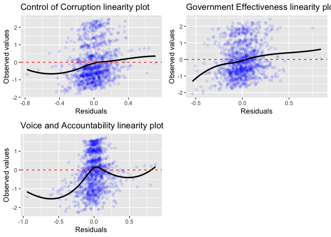

By contrast, the relationship between the predictors and the dependent
variable appears to be less linear when the Voice and Accountability
indicator is the dependent variable. Therefore, I will add a
second-degree term of the EGDI to account for the possibility
non-linearity between the predictors and the dependent variable. As
shown below, the second-degree term of the EGDI is indeed statistically
significant at the 95% level when the Voice and Accountability Indicator
is the dependent variable, thereby implying a non-linear relationship
between the EGDI and the Voice and Accountability Indicator.

<table style="border-collapse:collapse; border:none;">
<caption style="font-weight: bold; text-align:left;">
Model: random effects with country as the random intercept
</caption>
<tr>
<th style="border-top: double; text-align:center; font-style:normal; font-weight:bold; padding:0.2cm;  text-align:left; ">
 
</th>
<th colspan="3" style="border-top: double; text-align:center; font-style:normal; font-weight:bold; padding:0.2cm; ">
Voice and Accountability (lagged 2 years)
</th>
</tr>
<tr>
<td style=" text-align:center; border-bottom:1px solid; font-style:italic; font-weight:normal;  text-align:left; ">
Predictors
</td>
<td style=" text-align:center; border-bottom:1px solid; font-style:italic; font-weight:normal;  ">
Estimates
</td>
<td style=" text-align:center; border-bottom:1px solid; font-style:italic; font-weight:normal;  ">
std. Error
</td>
<td style=" text-align:center; border-bottom:1px solid; font-style:italic; font-weight:normal;  ">
p
</td>
</tr>
<tr>
<td style=" padding:0.2cm; text-align:left; vertical-align:top; text-align:left; ">
(Intercept)
</td>
<td style=" padding:0.2cm; text-align:left; vertical-align:top; text-align:center;  ">
-1.400
</td>
<td style=" padding:0.2cm; text-align:left; vertical-align:top; text-align:center;  ">
0.208
</td>
<td style=" padding:0.2cm; text-align:left; vertical-align:top; text-align:center;  ">
<strong>&lt;0.001
</td>
</tr>
<tr>
<td style=" padding:0.2cm; text-align:left; vertical-align:top; text-align:left; ">
E-Government Development Index
</td>
<td style=" padding:0.2cm; text-align:left; vertical-align:top; text-align:center;  ">
0.821
</td>
<td style=" padding:0.2cm; text-align:left; vertical-align:top; text-align:center;  ">
0.208
</td>
<td style=" padding:0.2cm; text-align:left; vertical-align:top; text-align:center;  ">
<strong>&lt;0.001
</td>
</tr>
<tr>
<td style=" padding:0.2cm; text-align:left; vertical-align:top; text-align:left; ">
I(Egov\_Index^2)
</td>
<td style=" padding:0.2cm; text-align:left; vertical-align:top; text-align:center;  ">
-0.592
</td>
<td style=" padding:0.2cm; text-align:left; vertical-align:top; text-align:center;  ">
0.202
</td>
<td style=" padding:0.2cm; text-align:left; vertical-align:top; text-align:center;  ">
<strong>0.003</strong>
</td>
</tr>
<tr>
<td style=" padding:0.2cm; text-align:left; vertical-align:top; text-align:left; ">
Logged GDP Per Capita in Current USD
</td>
<td style=" padding:0.2cm; text-align:left; vertical-align:top; text-align:center;  ">
0.016
</td>
<td style=" padding:0.2cm; text-align:left; vertical-align:top; text-align:center;  ">
0.019
</td>
<td style=" padding:0.2cm; text-align:left; vertical-align:top; text-align:center;  ">
0.388
</td>
</tr>
<tr>
<td style=" padding:0.2cm; text-align:left; vertical-align:top; text-align:left; ">
V-DEM Women political empowerment index
</td>
<td style=" padding:0.2cm; text-align:left; vertical-align:top; text-align:center;  ">
1.257
</td>
<td style=" padding:0.2cm; text-align:left; vertical-align:top; text-align:center;  ">
0.124
</td>
<td style=" padding:0.2cm; text-align:left; vertical-align:top; text-align:center;  ">
<strong>&lt;0.001
</td>
</tr>
<tr>
<td style=" padding:0.2cm; text-align:left; vertical-align:top; text-align:left; ">
Demographic Pressure
</td>
<td style=" padding:0.2cm; text-align:left; vertical-align:top; text-align:center;  ">
-0.001
</td>
<td style=" padding:0.2cm; text-align:left; vertical-align:top; text-align:center;  ">
0.009
</td>
<td style=" padding:0.2cm; text-align:left; vertical-align:top; text-align:center;  ">
0.896
</td>
</tr>
<tr>
<td style=" padding:0.2cm; text-align:left; vertical-align:top; text-align:left; ">
Group Grievance
</td>
<td style=" padding:0.2cm; text-align:left; vertical-align:top; text-align:center;  ">
-0.037
</td>
<td style=" padding:0.2cm; text-align:left; vertical-align:top; text-align:center;  ">
0.009
</td>
<td style=" padding:0.2cm; text-align:left; vertical-align:top; text-align:center;  ">
<strong>&lt;0.001
</td>
</tr>
<tr>
<td style=" padding:0.2cm; text-align:left; vertical-align:top; text-align:left; ">
External Intervention
</td>
<td style=" padding:0.2cm; text-align:left; vertical-align:top; text-align:center;  ">
0.002
</td>
<td style=" padding:0.2cm; text-align:left; vertical-align:top; text-align:center;  ">
0.008
</td>
<td style=" padding:0.2cm; text-align:left; vertical-align:top; text-align:center;  ">
0.852
</td>
</tr>
<tr>
<td style=" padding:0.2cm; text-align:left; vertical-align:top; text-align:left; ">
Refugees and IDPs
</td>
<td style=" padding:0.2cm; text-align:left; vertical-align:top; text-align:center;  ">
-0.022
</td>
<td style=" padding:0.2cm; text-align:left; vertical-align:top; text-align:center;  ">
0.007
</td>
<td style=" padding:0.2cm; text-align:left; vertical-align:top; text-align:center;  ">
<strong>0.002</strong>
</td>
</tr>
<tr>
<td style=" padding:0.2cm; text-align:left; vertical-align:top; text-align:left; ">
region: Americas
</td>
<td style=" padding:0.2cm; text-align:left; vertical-align:top; text-align:center;  ">
0.473
</td>
<td style=" padding:0.2cm; text-align:left; vertical-align:top; text-align:center;  ">
0.138
</td>
<td style=" padding:0.2cm; text-align:left; vertical-align:top; text-align:center;  ">
<strong>0.001</strong>
</td>
</tr>
<tr>
<td style=" padding:0.2cm; text-align:left; vertical-align:top; text-align:left; ">
region: Asia
</td>
<td style=" padding:0.2cm; text-align:left; vertical-align:top; text-align:center;  ">
-0.113
</td>
<td style=" padding:0.2cm; text-align:left; vertical-align:top; text-align:center;  ">
0.118
</td>
<td style=" padding:0.2cm; text-align:left; vertical-align:top; text-align:center;  ">
0.338
</td>
</tr>
<tr>
<td style=" padding:0.2cm; text-align:left; vertical-align:top; text-align:left; ">
region: Europe
</td>
<td style=" padding:0.2cm; text-align:left; vertical-align:top; text-align:center;  ">
0.908
</td>
<td style=" padding:0.2cm; text-align:left; vertical-align:top; text-align:center;  ">
0.132
</td>
<td style=" padding:0.2cm; text-align:left; vertical-align:top; text-align:center;  ">
<strong>&lt;0.001
</td>
</tr>
<tr>
<td style=" padding:0.2cm; text-align:left; vertical-align:top; text-align:left; ">
region: Oceania
</td>
<td style=" padding:0.2cm; text-align:left; vertical-align:top; text-align:center;  ">
0.919
</td>
<td style=" padding:0.2cm; text-align:left; vertical-align:top; text-align:center;  ">
0.268
</td>
<td style=" padding:0.2cm; text-align:left; vertical-align:top; text-align:center;  ">
<strong>0.001</strong>
</td>
</tr>
<tr>
<td colspan="4" style="font-weight:bold; text-align:left; padding-top:.8em;">
Random Effects
</td>
</tr>
<tr>
<td style=" padding:0.2cm; text-align:left; vertical-align:top; text-align:left; padding-top:0.1cm; padding-bottom:0.1cm;">
σ2
</td>
<td style=" padding:0.2cm; text-align:left; vertical-align:top; padding-top:0.1cm; padding-bottom:0.1cm; text-align:left;" colspan="3">
0.03
</td>
<tr>
<td style=" padding:0.2cm; text-align:left; vertical-align:top; text-align:left; padding-top:0.1cm; padding-bottom:0.1cm;">
τ00 cname
</td>
<td style=" padding:0.2cm; text-align:left; vertical-align:top; padding-top:0.1cm; padding-bottom:0.1cm; text-align:left;" colspan="3">
0.32
</td>
<tr>
<td style=" padding:0.2cm; text-align:left; vertical-align:top; text-align:left; padding-top:0.1cm; padding-bottom:0.1cm;">
ICC
</td>
<td style=" padding:0.2cm; text-align:left; vertical-align:top; padding-top:0.1cm; padding-bottom:0.1cm; text-align:left;" colspan="3">
0.92
</td>
<tr>
<td style=" padding:0.2cm; text-align:left; vertical-align:top; text-align:left; padding-top:0.1cm; padding-bottom:0.1cm;">
N cname
</td>
<td style=" padding:0.2cm; text-align:left; vertical-align:top; padding-top:0.1cm; padding-bottom:0.1cm; text-align:left;" colspan="3">
169
</td>
<tr>
<td style=" padding:0.2cm; text-align:left; vertical-align:top; text-align:left; padding-top:0.1cm; padding-bottom:0.1cm; border-top:1px solid;">
Observations
</td>
<td style=" padding:0.2cm; text-align:left; vertical-align:top; padding-top:0.1cm; padding-bottom:0.1cm; text-align:left; border-top:1px solid;" colspan="3">
1132
</td>
</tr>
<tr>
<td style=" padding:0.2cm; text-align:left; vertical-align:top; text-align:left; padding-top:0.1cm; padding-bottom:0.1cm;">
Marginal R2 / Conditional R2
</td>
<td style=" padding:0.2cm; text-align:left; vertical-align:top; padding-top:0.1cm; padding-bottom:0.1cm; text-align:left;" colspan="3">
0.586 / 0.968
</td>
</tr>
<tr>
<td style=" padding:0.2cm; text-align:left; vertical-align:top; text-align:left; padding-top:0.1cm; padding-bottom:0.1cm;">
AIC
</td>
<td style=" padding:0.2cm; text-align:left; vertical-align:top; padding-top:0.1cm; padding-bottom:0.1cm; text-align:left;" colspan="3">
-75.680
</td>
</tr>
</table>

### Influential observations

I will use the cook’s distance plot to gauge whether there are
influential observations in the model. The threshold of the cook’s
distance will be 4/1133 = 0.00353045 to classify which observations are
influential in terms of how much impact will be on the model after
deleting them from the regression model.

#### Dependent Variable: Control of Corruption Indicator (lagged 2 years)

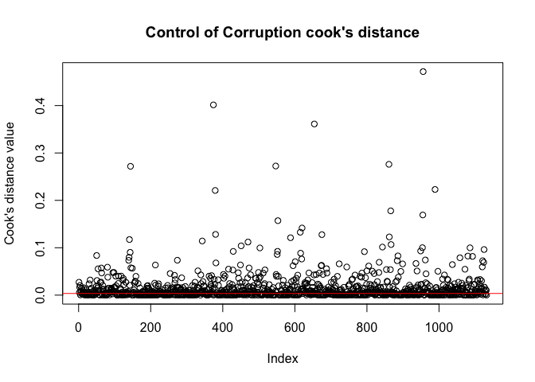

    ## integer(0)

#### Dependent Variable: Government Effectiveness Indicator (lagged 2 years)

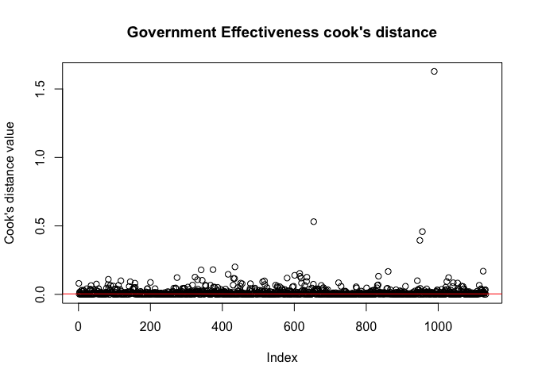

    ## integer(0)

#### Dependent Variable: Voice and Accountability Indicator (lagged 2 years)

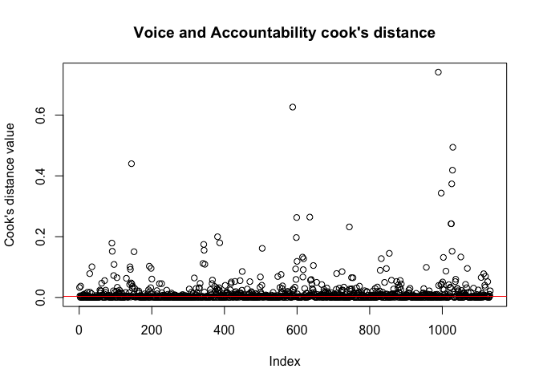

    ## integer(0)

### 

The cook’s distance of most observations fall closely the threshold in
all three models, but there are a few observations that exert much
higher influence on the regression results. However, since this study is
observational and these outliers indeed exist and are observed in the
real world, removing them may risk ignoring information about how
e-governance is associated with governance quality in reality.
Furthermore, given there are over 1100 observations in the model, the
presence of outliers is unlikely to drastically change the estimated
coefficients. Therefore, I decided not to delete these highly
influential observations.

### Normality of the residuals

I will use the Shapiro-Wilk test to diagnose whether the error term is
normally distributed and has an expected value of zero, with the null
hypothesis that the error term is normally distributed whilst the
alternative hypothesis is that it is not.

#### Dependent Variable: Control of Corruption Indicator (lagged 2 years)

    shapiro.test(diag_CC$.resid)

    ## 
    ##  Shapiro-Wilk normality test
    ## 
    ## data:  diag_CC$.resid
    ## W = 0.98182, p-value = 1.061e-10

#### Dependent Variable: Government Effectiveness Indicator (lagged 2 years)

    shapiro.test(diag_GE$.resid)

    ## 
    ##  Shapiro-Wilk normality test
    ## 
    ## data:  diag_GE$.resid
    ## W = 0.98153, p-value = 8.204e-11

#### Dependent Variable: Voice and Accountability Indicator (lagged 2 years)

    shapiro.test(diag_VA$.resid)

    ## 
    ##  Shapiro-Wilk normality test
    ## 
    ## data:  diag_VA$.resid
    ## W = 0.92162, p-value < 2.2e-16

### 

Here, the p-values are all smaller than 0.05 in the Shapiro-Wilk test
for the three models, thereby supporting the alternative hypothesis that
the error term is not normally distributed in the models. Nevertheless,
since my research question is primarily interested in testing whether
e-governance is associated with higher governance quality from 2003-18
(i.e. estimation) instead of using the regression results to generate
predictions of how improvement in e-governance may bolster governance
quality in the future, violating the assumption of normally distributed
residuals is not critical in regard to my research question.

### Homoscedasticity

Next I will test probably one of the most important assumptions called
homoscedasticity, which means the error term has equal variance. Here I
am plotting the fitted values versus the residuals. Ideally the black
line should be closed to the red, horizontal line at y = 0 (i.e. the
residuals have equal variance).

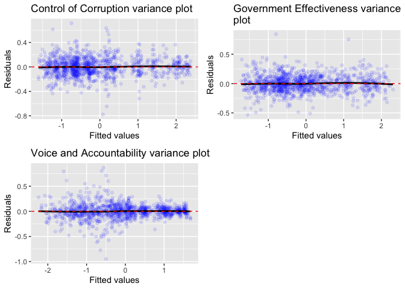

It appears that the black lines closely align to the red line, meaning
that the residuals have equal variance across all levels of the
explanatory variables. Therefore, the homoscedasticity assumption can be
said to be satisfied in the model.

### Multi-collinearity

In terms of multicollinearity, I will check whether the predictors have
Variance inflation factor (VIF) values which are higher than 4 as the
threshold.

#### Dependent Variable: Control of Corruption Indicator (lagged 2 years)

    vif(lm_re_CC_cname)

    ##                          GVIF Df GVIF^(1/(2*Df))
    ## Egov_Index           1.470686  1        1.212718
    ## wdi_gdpcapcur_logged 1.399278  1        1.182911
    ## vdem_gender          1.159931  1        1.077001
    ## ffp_dp               1.470419  1        1.212608
    ## ffp_gg               1.089484  1        1.043783
    ## ffp_ext              1.256714  1        1.121032
    ## ffp_ref              1.202997  1        1.096812
    ## region               1.208657  4        1.023971

#### Dependent Variable: Government Effectiveness Indicator (lagged 2 years)

    vif(lm_re_GE_cname)

    ##                          GVIF Df GVIF^(1/(2*Df))
    ## Egov_Index           1.520746  1        1.233185
    ## wdi_gdpcapcur_logged 1.470558  1        1.212666
    ## vdem_gender          1.186420  1        1.089229
    ## ffp_dp               1.520710  1        1.233171
    ## ffp_gg               1.103482  1        1.050467
    ## ffp_ext              1.294411  1        1.137722
    ## ffp_ref              1.231598  1        1.109774
    ## region               1.292989  4        1.032641

#### Dependent Variable: Voice and Accountability Indicator (lagged 2 years)

    vif(lm_re_VA_cname)

    ##                          GVIF Df GVIF^(1/(2*Df))
    ## Egov_Index           8.019378  1        2.831851
    ## I(Egov_Index^2)      8.149187  1        2.854678
    ## wdi_gdpcapcur_logged 1.496619  1        1.223364
    ## vdem_gender          1.189946  1        1.090846
    ## ffp_dp               1.620748  1        1.273086
    ## ffp_gg               1.108285  1        1.052751
    ## ffp_ext              1.317147  1        1.147670
    ## ffp_ref              1.234163  1        1.110929
    ## region               1.304067  4        1.033743

### 

Besides the second-degree term of the EGDI being highly collinear with
its first-degree counterpart in the model where the Voice and
Accountability is the dependent variable (which should not be
surprising), all other predictors have their VIF values smaller than 4
in all models. Thus, multicollinearity is very unlikely to be a concern.

### Endogeneity

The modelling process has taken the endogeneity issue into account via
two ways. Firstly, I have lagged the dependent variables by two years so
as to alleviate omitted variable bias. As for autocorrelation, since
this is almost certainly the case in panel data setting, this is the
reason for why I chose to adopt linear mixed effects model in the first
place to account for this issue in addition to lagging the dependent
variables by 2 years.

# Results

After checking for the model assumptions and performing relevant
remedies, I will present the following models for the interpretation:

<table style="border-collapse:collapse; border:none;">
<caption style="font-weight: bold; text-align:left;">
Model: random effects with country as the random intercept
</caption>
<tr>
<th style="border-top: double; text-align:center; font-style:normal; font-weight:bold; padding:0.2cm;  text-align:left; ">
 
</th>
<th colspan="3" style="border-top: double; text-align:center; font-style:normal; font-weight:bold; padding:0.2cm; ">
Model (1): Control of Corruption (lagged 2 years)
</th>
<th colspan="3" style="border-top: double; text-align:center; font-style:normal; font-weight:bold; padding:0.2cm; ">
Model (2): Government Effectiveness (lagged 2 years)
</th>
<th colspan="3" style="border-top: double; text-align:center; font-style:normal; font-weight:bold; padding:0.2cm; ">
Model (3): Voice and Accountability (lagged 2 years)
</th>
</tr>
<tr>
<td style=" text-align:center; border-bottom:1px solid; font-style:italic; font-weight:normal;  text-align:left; ">
Predictors
</td>
<td style=" text-align:center; border-bottom:1px solid; font-style:italic; font-weight:normal;  ">
Estimates
</td>
<td style=" text-align:center; border-bottom:1px solid; font-style:italic; font-weight:normal;  ">
std. Error
</td>
<td style=" text-align:center; border-bottom:1px solid; font-style:italic; font-weight:normal;  ">
p
</td>
<td style=" text-align:center; border-bottom:1px solid; font-style:italic; font-weight:normal;  ">
Estimates
</td>
<td style=" text-align:center; border-bottom:1px solid; font-style:italic; font-weight:normal;  ">
std. Error
</td>
<td style=" text-align:center; border-bottom:1px solid; font-style:italic; font-weight:normal;  col7">
p
</td>
<td style=" text-align:center; border-bottom:1px solid; font-style:italic; font-weight:normal;  col8">
Estimates
</td>
<td style=" text-align:center; border-bottom:1px solid; font-style:italic; font-weight:normal;  col9">
std. Error
</td>
<td style=" text-align:center; border-bottom:1px solid; font-style:italic; font-weight:normal;  0">
p
</td>
</tr>
<tr>
<td style=" padding:0.2cm; text-align:left; vertical-align:top; text-align:left; ">
(Intercept)
</td>
<td style=" padding:0.2cm; text-align:left; vertical-align:top; text-align:center;  ">
-0.830
</td>
<td style=" padding:0.2cm; text-align:left; vertical-align:top; text-align:center;  ">
0.215
</td>
<td style=" padding:0.2cm; text-align:left; vertical-align:top; text-align:center;  ">
<strong>&lt;0.001
</td>
<td style=" padding:0.2cm; text-align:left; vertical-align:top; text-align:center;  ">
-0.472
</td>
<td style=" padding:0.2cm; text-align:left; vertical-align:top; text-align:center;  ">
0.201
</td>
<td style=" padding:0.2cm; text-align:left; vertical-align:top; text-align:center;  col7">
<strong>0.019</strong>
</td>
<td style=" padding:0.2cm; text-align:left; vertical-align:top; text-align:center;  col8">
-1.400
</td>
<td style=" padding:0.2cm; text-align:left; vertical-align:top; text-align:center;  col9">
0.208
</td>
<td style=" padding:0.2cm; text-align:left; vertical-align:top; text-align:center;  0">
<strong>&lt;0.001
</td>
</tr>
<tr>
<td style=" padding:0.2cm; text-align:left; vertical-align:top; text-align:left; ">
E-Government Development Index
</td>
<td style=" padding:0.2cm; text-align:left; vertical-align:top; text-align:center;  ">
-0.054
</td>
<td style=" padding:0.2cm; text-align:left; vertical-align:top; text-align:center;  ">
0.091
</td>
<td style=" padding:0.2cm; text-align:left; vertical-align:top; text-align:center;  ">
0.552
</td>
<td style=" padding:0.2cm; text-align:left; vertical-align:top; text-align:center;  ">
0.047
</td>
<td style=" padding:0.2cm; text-align:left; vertical-align:top; text-align:center;  ">
0.088
</td>
<td style=" padding:0.2cm; text-align:left; vertical-align:top; text-align:center;  col7">
0.593
</td>
<td style=" padding:0.2cm; text-align:left; vertical-align:top; text-align:center;  col8">
0.821
</td>
<td style=" padding:0.2cm; text-align:left; vertical-align:top; text-align:center;  col9">
0.208
</td>
<td style=" padding:0.2cm; text-align:left; vertical-align:top; text-align:center;  0">
<strong>&lt;0.001
</td>
</tr>
<tr>
<td style=" padding:0.2cm; text-align:left; vertical-align:top; text-align:left; ">
Logged GDP Per Capita in Current USD
</td>
<td style=" padding:0.2cm; text-align:left; vertical-align:top; text-align:center;  ">
0.096
</td>
<td style=" padding:0.2cm; text-align:left; vertical-align:top; text-align:center;  ">
0.019
</td>
<td style=" padding:0.2cm; text-align:left; vertical-align:top; text-align:center;  ">
<strong>&lt;0.001
</td>
<td style=" padding:0.2cm; text-align:left; vertical-align:top; text-align:center;  ">
0.082
</td>
<td style=" padding:0.2cm; text-align:left; vertical-align:top; text-align:center;  ">
0.018
</td>
<td style=" padding:0.2cm; text-align:left; vertical-align:top; text-align:center;  col7">
<strong>&lt;0.001
</td>
<td style=" padding:0.2cm; text-align:left; vertical-align:top; text-align:center;  col8">
0.016
</td>
<td style=" padding:0.2cm; text-align:left; vertical-align:top; text-align:center;  col9">
0.019
</td>
<td style=" padding:0.2cm; text-align:left; vertical-align:top; text-align:center;  0">
0.388
</td>
</tr>
<tr>
<td style=" padding:0.2cm; text-align:left; vertical-align:top; text-align:left; ">
V-DEM Women political empowerment index
</td>
<td style=" padding:0.2cm; text-align:left; vertical-align:top; text-align:center;  ">
0.120
</td>
<td style=" padding:0.2cm; text-align:left; vertical-align:top; text-align:center;  ">
0.127
</td>
<td style=" padding:0.2cm; text-align:left; vertical-align:top; text-align:center;  ">
0.342
</td>
<td style=" padding:0.2cm; text-align:left; vertical-align:top; text-align:center;  ">
0.228
</td>
<td style=" padding:0.2cm; text-align:left; vertical-align:top; text-align:center;  ">
0.120
</td>
<td style=" padding:0.2cm; text-align:left; vertical-align:top; text-align:center;  col7">
0.057
</td>
<td style=" padding:0.2cm; text-align:left; vertical-align:top; text-align:center;  col8">
1.257
</td>
<td style=" padding:0.2cm; text-align:left; vertical-align:top; text-align:center;  col9">
0.124
</td>
<td style=" padding:0.2cm; text-align:left; vertical-align:top; text-align:center;  0">
<strong>&lt;0.001
</td>
</tr>
<tr>
<td style=" padding:0.2cm; text-align:left; vertical-align:top; text-align:left; ">
Demographic Pressure
</td>
<td style=" padding:0.2cm; text-align:left; vertical-align:top; text-align:center;  ">
-0.017
</td>
<td style=" padding:0.2cm; text-align:left; vertical-align:top; text-align:center;  ">
0.009
</td>
<td style=" padding:0.2cm; text-align:left; vertical-align:top; text-align:center;  ">
0.054
</td>
<td style=" padding:0.2cm; text-align:left; vertical-align:top; text-align:center;  ">
-0.032
</td>
<td style=" padding:0.2cm; text-align:left; vertical-align:top; text-align:center;  ">
0.008
</td>
<td style=" padding:0.2cm; text-align:left; vertical-align:top; text-align:center;  col7">
<strong>&lt;0.001
</td>
<td style=" padding:0.2cm; text-align:left; vertical-align:top; text-align:center;  col8">
-0.001
</td>
<td style=" padding:0.2cm; text-align:left; vertical-align:top; text-align:center;  col9">
0.009
</td>
<td style=" padding:0.2cm; text-align:left; vertical-align:top; text-align:center;  0">
0.896
</td>
</tr>
<tr>
<td style=" padding:0.2cm; text-align:left; vertical-align:top; text-align:left; ">
Group Grievance
</td>
<td style=" padding:0.2cm; text-align:left; vertical-align:top; text-align:center;  ">
-0.039
</td>
<td style=" padding:0.2cm; text-align:left; vertical-align:top; text-align:center;  ">
0.009
</td>
<td style=" padding:0.2cm; text-align:left; vertical-align:top; text-align:center;  ">
<strong>&lt;0.001
</td>
<td style=" padding:0.2cm; text-align:left; vertical-align:top; text-align:center;  ">
-0.031
</td>
<td style=" padding:0.2cm; text-align:left; vertical-align:top; text-align:center;  ">
0.008
</td>
<td style=" padding:0.2cm; text-align:left; vertical-align:top; text-align:center;  col7">
<strong>&lt;0.001
</td>
<td style=" padding:0.2cm; text-align:left; vertical-align:top; text-align:center;  col8">
-0.037
</td>
<td style=" padding:0.2cm; text-align:left; vertical-align:top; text-align:center;  col9">
0.009
</td>
<td style=" padding:0.2cm; text-align:left; vertical-align:top; text-align:center;  0">
<strong>&lt;0.001
</td>
</tr>
<tr>
<td style=" padding:0.2cm; text-align:left; vertical-align:top; text-align:left; ">
External Intervention
</td>
<td style=" padding:0.2cm; text-align:left; vertical-align:top; text-align:center;  ">
-0.014
</td>
<td style=" padding:0.2cm; text-align:left; vertical-align:top; text-align:center;  ">
0.008
</td>
<td style=" padding:0.2cm; text-align:left; vertical-align:top; text-align:center;  ">
0.082
</td>
<td style=" padding:0.2cm; text-align:left; vertical-align:top; text-align:center;  ">
-0.053
</td>
<td style=" padding:0.2cm; text-align:left; vertical-align:top; text-align:center;  ">
0.008
</td>
<td style=" padding:0.2cm; text-align:left; vertical-align:top; text-align:center;  col7">
<strong>&lt;0.001
</td>
<td style=" padding:0.2cm; text-align:left; vertical-align:top; text-align:center;  col8">
0.002
</td>
<td style=" padding:0.2cm; text-align:left; vertical-align:top; text-align:center;  col9">
0.008
</td>
<td style=" padding:0.2cm; text-align:left; vertical-align:top; text-align:center;  0">
0.852
</td>
</tr>
<tr>
<td style=" padding:0.2cm; text-align:left; vertical-align:top; text-align:left; ">
Refugees and IDPs
</td>
<td style=" padding:0.2cm; text-align:left; vertical-align:top; text-align:center;  ">
-0.011
</td>
<td style=" padding:0.2cm; text-align:left; vertical-align:top; text-align:center;  ">
0.007
</td>
<td style=" padding:0.2cm; text-align:left; vertical-align:top; text-align:center;  ">
0.128
</td>
<td style=" padding:0.2cm; text-align:left; vertical-align:top; text-align:center;  ">
-0.027
</td>
<td style=" padding:0.2cm; text-align:left; vertical-align:top; text-align:center;  ">
0.007
</td>
<td style=" padding:0.2cm; text-align:left; vertical-align:top; text-align:center;  col7">
<strong>&lt;0.001
</td>
<td style=" padding:0.2cm; text-align:left; vertical-align:top; text-align:center;  col8">
-0.022
</td>
<td style=" padding:0.2cm; text-align:left; vertical-align:top; text-align:center;  col9">
0.007
</td>
<td style=" padding:0.2cm; text-align:left; vertical-align:top; text-align:center;  0">
<strong>0.002</strong>
</td>
</tr>
<tr>
<td style=" padding:0.2cm; text-align:left; vertical-align:top; text-align:left; ">
region: Americas
</td>
<td style=" padding:0.2cm; text-align:left; vertical-align:top; text-align:center;  ">
0.222
</td>
<td style=" padding:0.2cm; text-align:left; vertical-align:top; text-align:center;  ">
0.168
</td>
<td style=" padding:0.2cm; text-align:left; vertical-align:top; text-align:center;  ">
0.186
</td>
<td style=" padding:0.2cm; text-align:left; vertical-align:top; text-align:center;  ">
0.225
</td>
<td style=" padding:0.2cm; text-align:left; vertical-align:top; text-align:center;  ">
0.134
</td>
<td style=" padding:0.2cm; text-align:left; vertical-align:top; text-align:center;  col7">
0.094
</td>
<td style=" padding:0.2cm; text-align:left; vertical-align:top; text-align:center;  col8">
0.473
</td>
<td style=" padding:0.2cm; text-align:left; vertical-align:top; text-align:center;  col9">
0.138
</td>
<td style=" padding:0.2cm; text-align:left; vertical-align:top; text-align:center;  0">
<strong>0.001</strong>
</td>
</tr>
<tr>
<td style=" padding:0.2cm; text-align:left; vertical-align:top; text-align:left; ">
region: Asia
</td>
<td style=" padding:0.2cm; text-align:left; vertical-align:top; text-align:center;  ">
0.144
</td>
<td style=" padding:0.2cm; text-align:left; vertical-align:top; text-align:center;  ">
0.144
</td>
<td style=" padding:0.2cm; text-align:left; vertical-align:top; text-align:center;  ">
0.315
</td>
<td style=" padding:0.2cm; text-align:left; vertical-align:top; text-align:center;  ">
0.371
</td>
<td style=" padding:0.2cm; text-align:left; vertical-align:top; text-align:center;  ">
0.115
</td>
<td style=" padding:0.2cm; text-align:left; vertical-align:top; text-align:center;  col7">
<strong>0.001</strong>
</td>
<td style=" padding:0.2cm; text-align:left; vertical-align:top; text-align:center;  col8">
-0.113
</td>
<td style=" padding:0.2cm; text-align:left; vertical-align:top; text-align:center;  col9">
0.118
</td>
<td style=" padding:0.2cm; text-align:left; vertical-align:top; text-align:center;  0">
0.338
</td>
</tr>
<tr>
<td style=" padding:0.2cm; text-align:left; vertical-align:top; text-align:left; ">
region: Europe
</td>
<td style=" padding:0.2cm; text-align:left; vertical-align:top; text-align:center;  ">
0.891
</td>
<td style=" padding:0.2cm; text-align:left; vertical-align:top; text-align:center;  ">
0.157
</td>
<td style=" padding:0.2cm; text-align:left; vertical-align:top; text-align:center;  ">
<strong>&lt;0.001
</td>
<td style=" padding:0.2cm; text-align:left; vertical-align:top; text-align:center;  ">
0.814
</td>
<td style=" padding:0.2cm; text-align:left; vertical-align:top; text-align:center;  ">
0.128
</td>
<td style=" padding:0.2cm; text-align:left; vertical-align:top; text-align:center;  col7">
<strong>&lt;0.001
</td>
<td style=" padding:0.2cm; text-align:left; vertical-align:top; text-align:center;  col8">
0.908
</td>
<td style=" padding:0.2cm; text-align:left; vertical-align:top; text-align:center;  col9">
0.132
</td>
<td style=" padding:0.2cm; text-align:left; vertical-align:top; text-align:center;  0">
<strong>&lt;0.001
</td>
</tr>
<tr>
<td style=" padding:0.2cm; text-align:left; vertical-align:top; text-align:left; ">
region: Oceania
</td>
<td style=" padding:0.2cm; text-align:left; vertical-align:top; text-align:center;  ">
0.881
</td>
<td style=" padding:0.2cm; text-align:left; vertical-align:top; text-align:center;  ">
0.328
</td>
<td style=" padding:0.2cm; text-align:left; vertical-align:top; text-align:center;  ">
<strong>0.007</strong>
</td>
<td style=" padding:0.2cm; text-align:left; vertical-align:top; text-align:center;  ">
0.490
</td>
<td style=" padding:0.2cm; text-align:left; vertical-align:top; text-align:center;  ">
0.260
</td>
<td style=" padding:0.2cm; text-align:left; vertical-align:top; text-align:center;  col7">
0.060
</td>
<td style=" padding:0.2cm; text-align:left; vertical-align:top; text-align:center;  col8">
0.919
</td>
<td style=" padding:0.2cm; text-align:left; vertical-align:top; text-align:center;  col9">
0.268
</td>
<td style=" padding:0.2cm; text-align:left; vertical-align:top; text-align:center;  0">
<strong>0.001</strong>
</td>
</tr>
<tr>
<td style=" padding:0.2cm; text-align:left; vertical-align:top; text-align:left; ">
I(Egov\_Index^2)
</td>
<td style=" padding:0.2cm; text-align:left; vertical-align:top; text-align:center;  ">
</td>
<td style=" padding:0.2cm; text-align:left; vertical-align:top; text-align:center;  ">
</td>
<td style=" padding:0.2cm; text-align:left; vertical-align:top; text-align:center;  ">
</td>
<td style=" padding:0.2cm; text-align:left; vertical-align:top; text-align:center;  ">
</td>
<td style=" padding:0.2cm; text-align:left; vertical-align:top; text-align:center;  ">
</td>
<td style=" padding:0.2cm; text-align:left; vertical-align:top; text-align:center;  col7">
</td>
<td style=" padding:0.2cm; text-align:left; vertical-align:top; text-align:center;  col8">
-0.592
</td>
<td style=" padding:0.2cm; text-align:left; vertical-align:top; text-align:center;  col9">
0.202
</td>
<td style=" padding:0.2cm; text-align:left; vertical-align:top; text-align:center;  0">
<strong>0.003</strong>
</td>
</tr>
<tr>
<td colspan="10" style="font-weight:bold; text-align:left; padding-top:.8em;">
Random Effects
</td>
</tr>
<tr>
<td style=" padding:0.2cm; text-align:left; vertical-align:top; text-align:left; padding-top:0.1cm; padding-bottom:0.1cm;">
σ2
</td>
<td style=" padding:0.2cm; text-align:left; vertical-align:top; padding-top:0.1cm; padding-bottom:0.1cm; text-align:left;" colspan="3">
0.03
</td>
<td style=" padding:0.2cm; text-align:left; vertical-align:top; padding-top:0.1cm; padding-bottom:0.1cm; text-align:left;" colspan="3">
0.02
</td>
<td style=" padding:0.2cm; text-align:left; vertical-align:top; padding-top:0.1cm; padding-bottom:0.1cm; text-align:left;" colspan="3">
0.03
</td>
<tr>
<td style=" padding:0.2cm; text-align:left; vertical-align:top; text-align:left; padding-top:0.1cm; padding-bottom:0.1cm;">
τ00
</td>
<td style=" padding:0.2cm; text-align:left; vertical-align:top; padding-top:0.1cm; padding-bottom:0.1cm; text-align:left;" colspan="3">
0.48 cname
</td>
<td style=" padding:0.2cm; text-align:left; vertical-align:top; padding-top:0.1cm; padding-bottom:0.1cm; text-align:left;" colspan="3">
0.30 cname
</td>
<td style=" padding:0.2cm; text-align:left; vertical-align:top; padding-top:0.1cm; padding-bottom:0.1cm; text-align:left;" colspan="3">
0.32 cname
</td>
<tr>
<td style=" padding:0.2cm; text-align:left; vertical-align:top; text-align:left; padding-top:0.1cm; padding-bottom:0.1cm;">
ICC
</td>
<td style=" padding:0.2cm; text-align:left; vertical-align:top; padding-top:0.1cm; padding-bottom:0.1cm; text-align:left;" colspan="3">
0.95
</td>
<td style=" padding:0.2cm; text-align:left; vertical-align:top; padding-top:0.1cm; padding-bottom:0.1cm; text-align:left;" colspan="3">
0.92
</td>
<td style=" padding:0.2cm; text-align:left; vertical-align:top; padding-top:0.1cm; padding-bottom:0.1cm; text-align:left;" colspan="3">
0.92
</td>
<tr>
<td style=" padding:0.2cm; text-align:left; vertical-align:top; text-align:left; padding-top:0.1cm; padding-bottom:0.1cm;">
N
</td>
<td style=" padding:0.2cm; text-align:left; vertical-align:top; padding-top:0.1cm; padding-bottom:0.1cm; text-align:left;" colspan="3">
169 cname
</td>
<td style=" padding:0.2cm; text-align:left; vertical-align:top; padding-top:0.1cm; padding-bottom:0.1cm; text-align:left;" colspan="3">
169 cname
</td>
<td style=" padding:0.2cm; text-align:left; vertical-align:top; padding-top:0.1cm; padding-bottom:0.1cm; text-align:left;" colspan="3">
169 cname
</td>
<tr>
<td style=" padding:0.2cm; text-align:left; vertical-align:top; text-align:left; padding-top:0.1cm; padding-bottom:0.1cm; border-top:1px solid;">
Observations
</td>
<td style=" padding:0.2cm; text-align:left; vertical-align:top; padding-top:0.1cm; padding-bottom:0.1cm; text-align:left; border-top:1px solid;" colspan="3">
1132
</td>
<td style=" padding:0.2cm; text-align:left; vertical-align:top; padding-top:0.1cm; padding-bottom:0.1cm; text-align:left; border-top:1px solid;" colspan="3">
1132
</td>
<td style=" padding:0.2cm; text-align:left; vertical-align:top; padding-top:0.1cm; padding-bottom:0.1cm; text-align:left; border-top:1px solid;" colspan="3">
1132
</td>
</tr>
<tr>
<td style=" padding:0.2cm; text-align:left; vertical-align:top; text-align:left; padding-top:0.1cm; padding-bottom:0.1cm;">
Marginal R2 / Conditional R2
</td>
<td style=" padding:0.2cm; text-align:left; vertical-align:top; padding-top:0.1cm; padding-bottom:0.1cm; text-align:left;" colspan="3">
0.397 / 0.969
</td>
<td style=" padding:0.2cm; text-align:left; vertical-align:top; padding-top:0.1cm; padding-bottom:0.1cm; text-align:left;" colspan="3">
0.573 / 0.967
</td>
<td style=" padding:0.2cm; text-align:left; vertical-align:top; padding-top:0.1cm; padding-bottom:0.1cm; text-align:left;" colspan="3">
0.586 / 0.968
</td>
</tr>
<tr>
<td style=" padding:0.2cm; text-align:left; vertical-align:top; text-align:left; padding-top:0.1cm; padding-bottom:0.1cm;">
AIC
</td>
<td style=" padding:0.2cm; text-align:left; vertical-align:top; padding-top:0.1cm; padding-bottom:0.1cm; text-align:left;" colspan="3">
-22.087
</td>
<td style=" padding:0.2cm; text-align:left; vertical-align:top; padding-top:0.1cm; padding-bottom:0.1cm; text-align:left;" colspan="3">
-158.480
</td>
<td style=" padding:0.2cm; text-align:left; vertical-align:top; padding-top:0.1cm; padding-bottom:0.1cm; text-align:left;" colspan="3">
-75.680
</td>
</tr>
</table>

------------------------------------------------------------------------

From the above regression table, there are 1132 observations for each
model, and the high Intraclass Correlation Coefficient (ICC) values in
each model (&gt; 0.75) supports the decision of using linear mixed
effects model in the first place. The random intercept of countries is
different for each dependent variable, namely, it is 0.48 when the
dependent variable is the Control of Corruption Indicator, 0.3 when the
dependent variable is the Government Effectiveness Indicator and 0.32
when the dependent variable is the Voice and Accountability Indicator.

## Forest-plots of estimated coefficients

To better visualise the estimated coefficients and their confidence
intervals before interpreting the significance of the results, I will be
using the forest plots.

### Dependent variable: Control of Corruption Indicator (lagged 2 years)

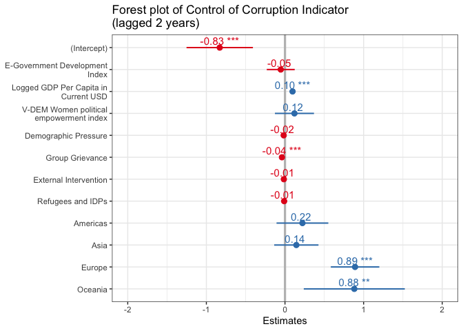

### Dependent variable: Government Effectiveness Indicator (lagged 2 years)

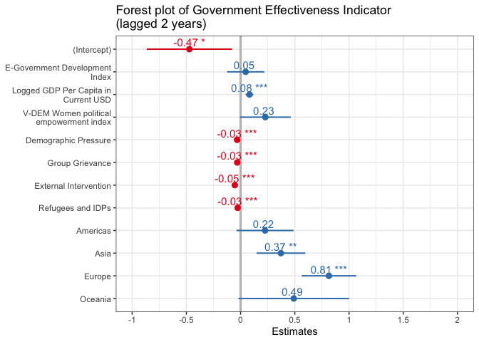

### Dependent variable: Voice and Accountability Indicator (lagged 2 years)

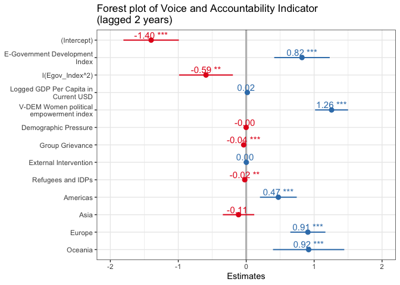

## 

Starting with the significance of the main independent variable, the
EGDI score, its coefficients are only statistically significant at the
99% level when the dependent variable is the Voice and Accountability
Indicator after adjusting for other factors. To interpret the
substantive significance, the marginal effect of one-unit change of the
EGDI score is expected to be associated with
0.821 ⋅ *E**G**D**I* − 0.592 ⋅ *E**G**D**I*2 unit change of
the Voice and Accountability Indicator on average after adjusting for
other factors. For instance, if the EGDI takes the level of its mean
(i.e. 0.441), then it is expected to be associated with
0.821 ⋅ 0.441 − 0.592 ⋅ 0.4412 = 0.247-unit increase of the
Voice and Accountability Indicator on average after controlling for
other factors. The positive coefficient of the first-degree *EGDI* term
and the negative second-degree *EGDI* term together suggest that while
the marginal effect of *Egov\_Index* on *wbgi\_vae*, after controlling
for other variables, starts positive, it will go down and eventually
turn negative as the value of *Egov\_Index* becomes larger. By contrast,
although the directions of the EGDI’s coefficients are also negative and
positive as expected when the dependent variable is respectively the
Control of Corruption and the Government Effectiveness Indicators, they
are statistically indistinguishable from zero, meaning there is no
support for *H*1 and *H*2. The result provides
mixed evidence for *H*3, since although initial increase in
e-governance is predicted with increase in government’s accountability,
once a country’s level of e-governance reaches a certain point, its
accountability is actually predicted to start declining after
controlling for other factors.

As for the control variables, I will only report those which are
statistically significant at least at the 90% level and their
directions, ceteris paribus, in this paragraph because they are not the
main interest in this research. Starting with economic development
level, higher level of economic development is expected to be associated
with better control of corruption and public service provision as the
coefficients of the logged GDP per capita in current USD are positive
and statistically significant at the 99% level in Models (1) and (2).
Gender equality is also predicted to be associated with better
government effectiveness and more accountability of the government as
the coefficients of *V-DEM Women political empowerment index* are
positive and statistically significant at least at the 90% level in
Models (2) and (3). Higher *demographic pressure* may also strain a
government’s ability to control corruption and provide adequate public
service as shown by the negative coefficients in Models (1) and (2).
Likewise, higher hostility among socio-political groups is expected to
be associated with worse government performance in controlling
corruption, providing public services and accountability to citizens as
evidenced by the negative and statistically significant coefficients of
*Group Grievance* in all models. As a country’s governance is intervened
to a larger extent by foreign actors, the country may be less capable of
mitigating corruption and providing public services effectively as
demonstrated by the negative coefficients of *External Intervention* in
models (1) and (2). Higher pressure from displaced population within a
country may also reduce the capacity of a government to provide public
services and its accountability, as the coefficients of *Refugees and
IDPs* are negative in models (2) and (3).

As for different regions in the world, relative to Africa after
adjusting for other factors, Europe and Oceania have better control over
corruption, all other regions are more effective in providing public
services, and governments in all regions except Asia are more
accountable. All of these regional differences in governance quality are
statistically significant at least at the 90% level as shown in the
regression table.

# Robustness Check

Besides checking whether the assumptions are satisfied in previous
section, I will now perform some additional robustness check on the
model. I will rerun the models with alternative measures as the
dependent variables. For model (1), I will use the Bayesian Corruption
Indicator (bci\_bci) which ranges from 0 to 100 and a higher value
indicates that corruption is ***worse*** in a country (Teorell et
al. 2021) (note that the latest value available of this measure is in
2017). For model (2), I will use the FSI Public Services indicator
(ffp\_ps) which ranges from 0 to 10 and higher values means worse
performance in this regard. For model (3), I will use the Freedom
House’s score (FH\_Total) which ranges from 0 to 100 and a higher value
means a country is more democratic (and thus more accountable). The
below correlation test shows that these measures are suitable for being
alternative dependent variables since they are strongly correlated with
their respective World Bank Indicators counterparts, which can be
evidence that they are measuring similar aspects of governance quality.
Moreover, these alternative dependent variables are lagged two years as
well.

## Correlation test of the alternative dependent variables

### WGI Control of Corruption Indicator and Bayesian Corruption Indicator

    cor.test(dataset$wbgi_cce, dataset$bci_bci) 

    ## 
    ##  Pearson's product-moment correlation
    ## 
    ## data:  dataset$wbgi_cce and dataset$bci_bci
    ## t = -120.77, df = 2840, p-value < 2.2e-16
    ## alternative hypothesis: true correlation is not equal to 0
    ## 95 percent confidence interval:
    ##  -0.9206838 -0.9086851
    ## sample estimates:
    ##        cor 
    ## -0.9148862

### WGI Government Effectiveness Indicator and FSI Public Services Indicator

    cor.test(dataset$wbgi_gee, dataset$ffp_ps)

    ## 
    ##  Pearson's product-moment correlation
    ## 
    ## data:  dataset$wbgi_gee and dataset$ffp_ps
    ## t = -92.625, df = 2438, p-value < 2.2e-16
    ## alternative hypothesis: true correlation is not equal to 0
    ## 95 percent confidence interval:
    ##  -0.8909305 -0.8733467
    ## sample estimates:
    ##        cor 
    ## -0.8824465

### WGI Voice and Accountability Indicator and Freedom House Regime Score

    cor.test(dataset$wbgi_vae, dataset$FH_Total)

    ## 
    ##  Pearson's product-moment correlation
    ## 
    ## data:  dataset$wbgi_vae and dataset$FH_Total
    ## t = 224.74, df = 2794, p-value < 2.2e-16
    ## alternative hypothesis: true correlation is not equal to 0
    ## 95 percent confidence interval:
    ##  0.9714230 0.9753142
    ## sample estimates:
    ##       cor 
    ## 0.9734388

## 

    dataset = dataset %>% 
      mutate(FH_Total_lag = Lag(FH_Total, 2)) %>% 
      mutate(bci_bci_lag = Lag(bci_bci, 2)) %>% 
      mutate(ffp_ps_lag = Lag(ffp_ps, 2))

## Regression results of alternative dependent variables

### Model (1) for testing H1

<table style="border-collapse:collapse; border:none;">
<caption style="font-weight: bold; text-align:left;">
Model (1) with different dependent variables
</caption>
<tr>
<th style="border-top: double; text-align:center; font-style:normal; font-weight:bold; padding:0.2cm;  text-align:left; ">
 
</th>
<th colspan="3" style="border-top: double; text-align:center; font-style:normal; font-weight:bold; padding:0.2cm; ">
WGI Control of corruption
</th>
<th colspan="3" style="border-top: double; text-align:center; font-style:normal; font-weight:bold; padding:0.2cm; ">
Bayesian Corruption Indicator
</th>
</tr>
<tr>
<td style=" text-align:center; border-bottom:1px solid; font-style:italic; font-weight:normal;  text-align:left; ">
Predictors
</td>
<td style=" text-align:center; border-bottom:1px solid; font-style:italic; font-weight:normal;  ">
Estimates
</td>
<td style=" text-align:center; border-bottom:1px solid; font-style:italic; font-weight:normal;  ">
std. Error
</td>
<td style=" text-align:center; border-bottom:1px solid; font-style:italic; font-weight:normal;  ">
p
</td>
<td style=" text-align:center; border-bottom:1px solid; font-style:italic; font-weight:normal;  ">
Estimates
</td>
<td style=" text-align:center; border-bottom:1px solid; font-style:italic; font-weight:normal;  ">
std. Error
</td>
<td style=" text-align:center; border-bottom:1px solid; font-style:italic; font-weight:normal;  col7">
p
</td>
</tr>
<tr>
<td style=" padding:0.2cm; text-align:left; vertical-align:top; text-align:left; ">
(Intercept)
</td>
<td style=" padding:0.2cm; text-align:left; vertical-align:top; text-align:center;  ">
-0.830
</td>
<td style=" padding:0.2cm; text-align:left; vertical-align:top; text-align:center;  ">
0.215
</td>
<td style=" padding:0.2cm; text-align:left; vertical-align:top; text-align:center;  ">
<strong>&lt;0.001
</td>
<td style=" padding:0.2cm; text-align:left; vertical-align:top; text-align:center;  ">
63.156
</td>
<td style=" padding:0.2cm; text-align:left; vertical-align:top; text-align:center;  ">
3.242
</td>
<td style=" padding:0.2cm; text-align:left; vertical-align:top; text-align:center;  col7">
<strong>&lt;0.001
</td>
</tr>
<tr>
<td style=" padding:0.2cm; text-align:left; vertical-align:top; text-align:left; ">
E-Government Development Index
</td>
<td style=" padding:0.2cm; text-align:left; vertical-align:top; text-align:center;  ">
-0.054
</td>
<td style=" padding:0.2cm; text-align:left; vertical-align:top; text-align:center;  ">
0.091
</td>
<td style=" padding:0.2cm; text-align:left; vertical-align:top; text-align:center;  ">
0.552
</td>
<td style=" padding:0.2cm; text-align:left; vertical-align:top; text-align:center;  ">
-4.098
</td>
<td style=" padding:0.2cm; text-align:left; vertical-align:top; text-align:center;  ">
1.303
</td>
<td style=" padding:0.2cm; text-align:left; vertical-align:top; text-align:center;  col7">
<strong>0.002</strong>
</td>
</tr>
<tr>
<td style=" padding:0.2cm; text-align:left; vertical-align:top; text-align:left; ">
Logged GDP Per Capita in Current USD
</td>
<td style=" padding:0.2cm; text-align:left; vertical-align:top; text-align:center;  ">
0.096
</td>
<td style=" padding:0.2cm; text-align:left; vertical-align:top; text-align:center;  ">
0.019
</td>
<td style=" padding:0.2cm; text-align:left; vertical-align:top; text-align:center;  ">
<strong>&lt;0.001
</td>
<td style=" padding:0.2cm; text-align:left; vertical-align:top; text-align:center;  ">
-1.655
</td>
<td style=" padding:0.2cm; text-align:left; vertical-align:top; text-align:center;  ">
0.280
</td>
<td style=" padding:0.2cm; text-align:left; vertical-align:top; text-align:center;  col7">
<strong>&lt;0.001
</td>
</tr>
<tr>
<td style=" padding:0.2cm; text-align:left; vertical-align:top; text-align:left; ">
V-DEM Women political empowerment index
</td>
<td style=" padding:0.2cm; text-align:left; vertical-align:top; text-align:center;  ">
0.120
</td>
<td style=" padding:0.2cm; text-align:left; vertical-align:top; text-align:center;  ">
0.127
</td>
<td style=" padding:0.2cm; text-align:left; vertical-align:top; text-align:center;  ">
0.342
</td>
<td style=" padding:0.2cm; text-align:left; vertical-align:top; text-align:center;  ">
2.163
</td>
<td style=" padding:0.2cm; text-align:left; vertical-align:top; text-align:center;  ">
1.849
</td>
<td style=" padding:0.2cm; text-align:left; vertical-align:top; text-align:center;  col7">
0.242
</td>
</tr>
<tr>
<td style=" padding:0.2cm; text-align:left; vertical-align:top; text-align:left; ">
Demographic Pressure
</td>
<td style=" padding:0.2cm; text-align:left; vertical-align:top; text-align:center;  ">
-0.017
</td>
<td style=" padding:0.2cm; text-align:left; vertical-align:top; text-align:center;  ">
0.009
</td>
<td style=" padding:0.2cm; text-align:left; vertical-align:top; text-align:center;  ">
0.054
</td>
<td style=" padding:0.2cm; text-align:left; vertical-align:top; text-align:center;  ">
-0.025
</td>
<td style=" padding:0.2cm; text-align:left; vertical-align:top; text-align:center;  ">
0.124
</td>
<td style=" padding:0.2cm; text-align:left; vertical-align:top; text-align:center;  col7">
0.841
</td>
</tr>
<tr>
<td style=" padding:0.2cm; text-align:left; vertical-align:top; text-align:left; ">
Group Grievance
</td>
<td style=" padding:0.2cm; text-align:left; vertical-align:top; text-align:center;  ">
-0.039
</td>
<td style=" padding:0.2cm; text-align:left; vertical-align:top; text-align:center;  ">
0.009
</td>
<td style=" padding:0.2cm; text-align:left; vertical-align:top; text-align:center;  ">
<strong>&lt;0.001
</td>
<td style=" padding:0.2cm; text-align:left; vertical-align:top; text-align:center;  ">
0.192
</td>
<td style=" padding:0.2cm; text-align:left; vertical-align:top; text-align:center;  ">
0.127
</td>
<td style=" padding:0.2cm; text-align:left; vertical-align:top; text-align:center;  col7">
0.130
</td>
</tr>
<tr>
<td style=" padding:0.2cm; text-align:left; vertical-align:top; text-align:left; ">
External Intervention
</td>
<td style=" padding:0.2cm; text-align:left; vertical-align:top; text-align:center;  ">
-0.014
</td>
<td style=" padding:0.2cm; text-align:left; vertical-align:top; text-align:center;  ">
0.008
</td>
<td style=" padding:0.2cm; text-align:left; vertical-align:top; text-align:center;  ">
0.082
</td>
<td style=" padding:0.2cm; text-align:left; vertical-align:top; text-align:center;  ">
0.363
</td>
<td style=" padding:0.2cm; text-align:left; vertical-align:top; text-align:center;  ">
0.120
</td>
<td style=" padding:0.2cm; text-align:left; vertical-align:top; text-align:center;  col7">
<strong>0.002</strong>
</td>
</tr>
<tr>
<td style=" padding:0.2cm; text-align:left; vertical-align:top; text-align:left; ">
Refugees and IDPs
</td>
<td style=" padding:0.2cm; text-align:left; vertical-align:top; text-align:center;  ">
-0.011
</td>
<td style=" padding:0.2cm; text-align:left; vertical-align:top; text-align:center;  ">
0.007
</td>
<td style=" padding:0.2cm; text-align:left; vertical-align:top; text-align:center;  ">
0.128
</td>
<td style=" padding:0.2cm; text-align:left; vertical-align:top; text-align:center;  ">
0.109
</td>
<td style=" padding:0.2cm; text-align:left; vertical-align:top; text-align:center;  ">
0.102
</td>
<td style=" padding:0.2cm; text-align:left; vertical-align:top; text-align:center;  col7">
0.285
</td>
</tr>
<tr>
<td style=" padding:0.2cm; text-align:left; vertical-align:top; text-align:left; ">
region: Americas
</td>
<td style=" padding:0.2cm; text-align:left; vertical-align:top; text-align:center;  ">
0.222
</td>
<td style=" padding:0.2cm; text-align:left; vertical-align:top; text-align:center;  ">
0.168
</td>
<td style=" padding:0.2cm; text-align:left; vertical-align:top; text-align:center;  ">
0.186
</td>
<td style=" padding:0.2cm; text-align:left; vertical-align:top; text-align:center;  ">
0.987
</td>
<td style=" padding:0.2cm; text-align:left; vertical-align:top; text-align:center;  ">
2.911
</td>
<td style=" padding:0.2cm; text-align:left; vertical-align:top; text-align:center;  col7">
0.735
</td>
</tr>
<tr>
<td style=" padding:0.2cm; text-align:left; vertical-align:top; text-align:left; ">
region: Asia
</td>
<td style=" padding:0.2cm; text-align:left; vertical-align:top; text-align:center;  ">
0.144
</td>
<td style=" padding:0.2cm; text-align:left; vertical-align:top; text-align:center;  ">
0.144
</td>
<td style=" padding:0.2cm; text-align:left; vertical-align:top; text-align:center;  ">
0.315
</td>
<td style=" padding:0.2cm; text-align:left; vertical-align:top; text-align:center;  ">
-4.562
</td>
<td style=" padding:0.2cm; text-align:left; vertical-align:top; text-align:center;  ">
2.494
</td>
<td style=" padding:0.2cm; text-align:left; vertical-align:top; text-align:center;  col7">
0.067
</td>
</tr>
<tr>
<td style=" padding:0.2cm; text-align:left; vertical-align:top; text-align:left; ">
region: Europe
</td>
<td style=" padding:0.2cm; text-align:left; vertical-align:top; text-align:center;  ">
0.891
</td>
<td style=" padding:0.2cm; text-align:left; vertical-align:top; text-align:center;  ">
0.157
</td>
<td style=" padding:0.2cm; text-align:left; vertical-align:top; text-align:center;  ">
<strong>&lt;0.001
</td>
<td style=" padding:0.2cm; text-align:left; vertical-align:top; text-align:center;  ">
-11.277
</td>
<td style=" padding:0.2cm; text-align:left; vertical-align:top; text-align:center;  ">
2.692
</td>
<td style=" padding:0.2cm; text-align:left; vertical-align:top; text-align:center;  col7">
<strong>&lt;0.001
</td>
</tr>
<tr>
<td style=" padding:0.2cm; text-align:left; vertical-align:top; text-align:left; ">
region: Oceania
</td>
<td style=" padding:0.2cm; text-align:left; vertical-align:top; text-align:center;  ">
0.881
</td>
<td style=" padding:0.2cm; text-align:left; vertical-align:top; text-align:center;  ">
0.328
</td>
<td style=" padding:0.2cm; text-align:left; vertical-align:top; text-align:center;  ">
<strong>0.007</strong>
</td>
<td style=" padding:0.2cm; text-align:left; vertical-align:top; text-align:center;  ">
-15.947
</td>
<td style=" padding:0.2cm; text-align:left; vertical-align:top; text-align:center;  ">
5.706
</td>
<td style=" padding:0.2cm; text-align:left; vertical-align:top; text-align:center;  col7">
<strong>0.005</strong>
</td>
</tr>
<tr>
<td colspan="7" style="font-weight:bold; text-align:left; padding-top:.8em;">
Random Effects
</td>
</tr>
<tr>
<td style=" padding:0.2cm; text-align:left; vertical-align:top; text-align:left; padding-top:0.1cm; padding-bottom:0.1cm;">
σ2
</td>
<td style=" padding:0.2cm; text-align:left; vertical-align:top; padding-top:0.1cm; padding-bottom:0.1cm; text-align:left;" colspan="3">
0.03
</td>
<td style=" padding:0.2cm; text-align:left; vertical-align:top; padding-top:0.1cm; padding-bottom:0.1cm; text-align:left;" colspan="3">
5.43
</td>
<tr>
<td style=" padding:0.2cm; text-align:left; vertical-align:top; text-align:left; padding-top:0.1cm; padding-bottom:0.1cm;">
τ00
</td>
<td style=" padding:0.2cm; text-align:left; vertical-align:top; padding-top:0.1cm; padding-bottom:0.1cm; text-align:left;" colspan="3">
0.48 cname
</td>
<td style=" padding:0.2cm; text-align:left; vertical-align:top; padding-top:0.1cm; padding-bottom:0.1cm; text-align:left;" colspan="3">
146.64 cname
</td>
<tr>
<td style=" padding:0.2cm; text-align:left; vertical-align:top; text-align:left; padding-top:0.1cm; padding-bottom:0.1cm;">
ICC
</td>
<td style=" padding:0.2cm; text-align:left; vertical-align:top; padding-top:0.1cm; padding-bottom:0.1cm; text-align:left;" colspan="3">
0.95
</td>
<td style=" padding:0.2cm; text-align:left; vertical-align:top; padding-top:0.1cm; padding-bottom:0.1cm; text-align:left;" colspan="3">
0.96
</td>
<tr>
<td style=" padding:0.2cm; text-align:left; vertical-align:top; text-align:left; padding-top:0.1cm; padding-bottom:0.1cm;">
N
</td>
<td style=" padding:0.2cm; text-align:left; vertical-align:top; padding-top:0.1cm; padding-bottom:0.1cm; text-align:left;" colspan="3">
169 cname
</td>
<td style=" padding:0.2cm; text-align:left; vertical-align:top; padding-top:0.1cm; padding-bottom:0.1cm; text-align:left;" colspan="3">
169 cname
</td>
<tr>
<td style=" padding:0.2cm; text-align:left; vertical-align:top; text-align:left; padding-top:0.1cm; padding-bottom:0.1cm; border-top:1px solid;">
Observations
</td>
<td style=" padding:0.2cm; text-align:left; vertical-align:top; padding-top:0.1cm; padding-bottom:0.1cm; text-align:left; border-top:1px solid;" colspan="3">
1132
</td>
<td style=" padding:0.2cm; text-align:left; vertical-align:top; padding-top:0.1cm; padding-bottom:0.1cm; text-align:left; border-top:1px solid;" colspan="3">
1132
</td>
</tr>
<tr>
<td style=" padding:0.2cm; text-align:left; vertical-align:top; text-align:left; padding-top:0.1cm; padding-bottom:0.1cm;">
Marginal R2 / Conditional R2
</td>
<td style=" padding:0.2cm; text-align:left; vertical-align:top; padding-top:0.1cm; padding-bottom:0.1cm; text-align:left;" colspan="3">
0.397 / 0.969
</td>
<td style=" padding:0.2cm; text-align:left; vertical-align:top; padding-top:0.1cm; padding-bottom:0.1cm; text-align:left;" colspan="3">
0.300 / 0.975
</td>
</tr>
<tr>
<td style=" padding:0.2cm; text-align:left; vertical-align:top; text-align:left; padding-top:0.1cm; padding-bottom:0.1cm;">
AIC
</td>
<td style=" padding:0.2cm; text-align:left; vertical-align:top; padding-top:0.1cm; padding-bottom:0.1cm; text-align:left;" colspan="3">
-22.087
</td>
<td style=" padding:0.2cm; text-align:left; vertical-align:top; padding-top:0.1cm; padding-bottom:0.1cm; text-align:left;" colspan="3">
6007.555
</td>
</tr>
</table>

### Model (2) for testing H2

<table style="border-collapse:collapse; border:none;">
<caption style="font-weight: bold; text-align:left;">
Model (2) with different dependent variables
</caption>
<tr>
<th style="border-top: double; text-align:center; font-style:normal; font-weight:bold; padding:0.2cm;  text-align:left; ">
 
</th>
<th colspan="3" style="border-top: double; text-align:center; font-style:normal; font-weight:bold; padding:0.2cm; ">
WGI Government Effectiveness
</th>
<th colspan="3" style="border-top: double; text-align:center; font-style:normal; font-weight:bold; padding:0.2cm; ">
FSI Public Services
</th>
</tr>
<tr>
<td style=" text-align:center; border-bottom:1px solid; font-style:italic; font-weight:normal;  text-align:left; ">
Predictors
</td>
<td style=" text-align:center; border-bottom:1px solid; font-style:italic; font-weight:normal;  ">
Estimates
</td>
<td style=" text-align:center; border-bottom:1px solid; font-style:italic; font-weight:normal;  ">
std. Error
</td>
<td style=" text-align:center; border-bottom:1px solid; font-style:italic; font-weight:normal;  ">
p
</td>
<td style=" text-align:center; border-bottom:1px solid; font-style:italic; font-weight:normal;  ">
Estimates
</td>
<td style=" text-align:center; border-bottom:1px solid; font-style:italic; font-weight:normal;  ">
std. Error
</td>
<td style=" text-align:center; border-bottom:1px solid; font-style:italic; font-weight:normal;  col7">
p
</td>
</tr>
<tr>
<td style=" padding:0.2cm; text-align:left; vertical-align:top; text-align:left; ">
(Intercept)
</td>
<td style=" padding:0.2cm; text-align:left; vertical-align:top; text-align:center;  ">
-0.472
</td>
<td style=" padding:0.2cm; text-align:left; vertical-align:top; text-align:center;  ">
0.201
</td>
<td style=" padding:0.2cm; text-align:left; vertical-align:top; text-align:center;  ">
<strong>0.019</strong>
</td>
<td style=" padding:0.2cm; text-align:left; vertical-align:top; text-align:center;  ">
7.152
</td>
<td style=" padding:0.2cm; text-align:left; vertical-align:top; text-align:center;  ">
0.661
</td>
<td style=" padding:0.2cm; text-align:left; vertical-align:top; text-align:center;  col7">
<strong>&lt;0.001
</td>
</tr>
<tr>
<td style=" padding:0.2cm; text-align:left; vertical-align:top; text-align:left; ">
E-Government Development Index
</td>
<td style=" padding:0.2cm; text-align:left; vertical-align:top; text-align:center;  ">
0.047
</td>
<td style=" padding:0.2cm; text-align:left; vertical-align:top; text-align:center;  ">
0.088
</td>
<td style=" padding:0.2cm; text-align:left; vertical-align:top; text-align:center;  ">
0.593
</td>
<td style=" padding:0.2cm; text-align:left; vertical-align:top; text-align:center;  ">
-0.604
</td>
<td style=" padding:0.2cm; text-align:left; vertical-align:top; text-align:center;  ">
0.277
</td>
<td style=" padding:0.2cm; text-align:left; vertical-align:top; text-align:center;  col7">
<strong>0.029</strong>
</td>
</tr>
<tr>
<td style=" padding:0.2cm; text-align:left; vertical-align:top; text-align:left; ">
Logged GDP Per Capita in Current USD
</td>
<td style=" padding:0.2cm; text-align:left; vertical-align:top; text-align:center;  ">
0.082
</td>
<td style=" padding:0.2cm; text-align:left; vertical-align:top; text-align:center;  ">
0.018
</td>
<td style=" padding:0.2cm; text-align:left; vertical-align:top; text-align:center;  ">
<strong>&lt;0.001
</td>
<td style=" padding:0.2cm; text-align:left; vertical-align:top; text-align:center;  ">
-0.473
</td>
<td style=" padding:0.2cm; text-align:left; vertical-align:top; text-align:center;  ">
0.054
</td>
<td style=" padding:0.2cm; text-align:left; vertical-align:top; text-align:center;  col7">
<strong>&lt;0.001
</td>
</tr>
<tr>
<td style=" padding:0.2cm; text-align:left; vertical-align:top; text-align:left; ">
V-DEM Women political empowerment index
</td>
<td style=" padding:0.2cm; text-align:left; vertical-align:top; text-align:center;  ">
0.228
</td>
<td style=" padding:0.2cm; text-align:left; vertical-align:top; text-align:center;  ">
0.120
</td>
<td style=" padding:0.2cm; text-align:left; vertical-align:top; text-align:center;  ">
0.057
</td>
<td style=" padding:0.2cm; text-align:left; vertical-align:top; text-align:center;  ">
0.089
</td>
<td style=" padding:0.2cm; text-align:left; vertical-align:top; text-align:center;  ">
0.278
</td>
<td style=" padding:0.2cm; text-align:left; vertical-align:top; text-align:center;  col7">
0.750
</td>
</tr>
<tr>
<td style=" padding:0.2cm; text-align:left; vertical-align:top; text-align:left; ">
Demographic Pressure
</td>
<td style=" padding:0.2cm; text-align:left; vertical-align:top; text-align:center;  ">
-0.032
</td>
<td style=" padding:0.2cm; text-align:left; vertical-align:top; text-align:center;  ">
0.008
</td>
<td style=" padding:0.2cm; text-align:left; vertical-align:top; text-align:center;  ">
<strong>&lt;0.001
</td>
<td style=" padding:0.2cm; text-align:left; vertical-align:top; text-align:center;  ">
0.361
</td>
<td style=" padding:0.2cm; text-align:left; vertical-align:top; text-align:center;  ">
0.028
</td>
<td style=" padding:0.2cm; text-align:left; vertical-align:top; text-align:center;  col7">
<strong>&lt;0.001
</td>
</tr>
<tr>
<td style=" padding:0.2cm; text-align:left; vertical-align:top; text-align:left; ">
Group Grievance
</td>
<td style=" padding:0.2cm; text-align:left; vertical-align:top; text-align:center;  ">
-0.031
</td>
<td style=" padding:0.2cm; text-align:left; vertical-align:top; text-align:center;  ">
0.008
</td>
<td style=" padding:0.2cm; text-align:left; vertical-align:top; text-align:center;  ">
<strong>&lt;0.001
</td>
<td style=" padding:0.2cm; text-align:left; vertical-align:top; text-align:center;  ">
0.052
</td>
<td style=" padding:0.2cm; text-align:left; vertical-align:top; text-align:center;  ">
0.023
</td>
<td style=" padding:0.2cm; text-align:left; vertical-align:top; text-align:center;  col7">
<strong>0.024</strong>
</td>
</tr>
<tr>
<td style=" padding:0.2cm; text-align:left; vertical-align:top; text-align:left; ">
External Intervention
</td>
<td style=" padding:0.2cm; text-align:left; vertical-align:top; text-align:center;  ">
-0.053
</td>
<td style=" padding:0.2cm; text-align:left; vertical-align:top; text-align:center;  ">
0.008
</td>
<td style=" padding:0.2cm; text-align:left; vertical-align:top; text-align:center;  ">
<strong>&lt;0.001
</td>
<td style=" padding:0.2cm; text-align:left; vertical-align:top; text-align:center;  ">
0.096
</td>
<td style=" padding:0.2cm; text-align:left; vertical-align:top; text-align:center;  ">
0.023
</td>
<td style=" padding:0.2cm; text-align:left; vertical-align:top; text-align:center;  col7">
<strong>&lt;0.001
</td>
</tr>
<tr>
<td style=" padding:0.2cm; text-align:left; vertical-align:top; text-align:left; ">
Refugees and IDPs
</td>
<td style=" padding:0.2cm; text-align:left; vertical-align:top; text-align:center;  ">
-0.027
</td>
<td style=" padding:0.2cm; text-align:left; vertical-align:top; text-align:center;  ">
0.007
</td>
<td style=" padding:0.2cm; text-align:left; vertical-align:top; text-align:center;  ">
<strong>&lt;0.001
</td>
<td style=" padding:0.2cm; text-align:left; vertical-align:top; text-align:center;  ">
0.050
</td>
<td style=" padding:0.2cm; text-align:left; vertical-align:top; text-align:center;  ">
0.022
</td>
<td style=" padding:0.2cm; text-align:left; vertical-align:top; text-align:center;  col7">
<strong>0.021</strong>
</td>
</tr>
<tr>
<td style=" padding:0.2cm; text-align:left; vertical-align:top; text-align:left; ">
region: Americas
</td>
<td style=" padding:0.2cm; text-align:left; vertical-align:top; text-align:center;  ">
0.225
</td>
<td style=" padding:0.2cm; text-align:left; vertical-align:top; text-align:center;  ">
0.134
</td>
<td style=" padding:0.2cm; text-align:left; vertical-align:top; text-align:center;  ">
0.094
</td>
<td style=" padding:0.2cm; text-align:left; vertical-align:top; text-align:center;  ">
-0.219
</td>
<td style=" padding:0.2cm; text-align:left; vertical-align:top; text-align:center;  ">
0.173
</td>
<td style=" padding:0.2cm; text-align:left; vertical-align:top; text-align:center;  col7">
0.206
</td>
</tr>
<tr>
<td style=" padding:0.2cm; text-align:left; vertical-align:top; text-align:left; ">
region: Asia
</td>
<td style=" padding:0.2cm; text-align:left; vertical-align:top; text-align:center;  ">
0.371
</td>
<td style=" padding:0.2cm; text-align:left; vertical-align:top; text-align:center;  ">
0.115
</td>
<td style=" padding:0.2cm; text-align:left; vertical-align:top; text-align:center;  ">
<strong>0.001</strong>
</td>
<td style=" padding:0.2cm; text-align:left; vertical-align:top; text-align:center;  ">
-0.747
</td>
<td style=" padding:0.2cm; text-align:left; vertical-align:top; text-align:center;  ">
0.148
</td>
<td style=" padding:0.2cm; text-align:left; vertical-align:top; text-align:center;  col7">
<strong>&lt;0.001
</td>
</tr>
<tr>
<td style=" padding:0.2cm; text-align:left; vertical-align:top; text-align:left; ">
region: Europe
</td>
<td style=" padding:0.2cm; text-align:left; vertical-align:top; text-align:center;  ">
0.814
</td>
<td style=" padding:0.2cm; text-align:left; vertical-align:top; text-align:center;  ">
0.128
</td>
<td style=" padding:0.2cm; text-align:left; vertical-align:top; text-align:center;  ">
<strong>&lt;0.001
</td>
<td style=" padding:0.2cm; text-align:left; vertical-align:top; text-align:center;  ">
-0.998
</td>
<td style=" padding:0.2cm; text-align:left; vertical-align:top; text-align:center;  ">
0.187
</td>
<td style=" padding:0.2cm; text-align:left; vertical-align:top; text-align:center;  col7">
<strong>&lt;0.001
</td>
</tr>
<tr>
<td style=" padding:0.2cm; text-align:left; vertical-align:top; text-align:left; ">
region: Oceania
</td>
<td style=" padding:0.2cm; text-align:left; vertical-align:top; text-align:center;  ">
0.490
</td>
<td style=" padding:0.2cm; text-align:left; vertical-align:top; text-align:center;  ">
0.260
</td>
<td style=" padding:0.2cm; text-align:left; vertical-align:top; text-align:center;  ">
0.060
</td>
<td style=" padding:0.2cm; text-align:left; vertical-align:top; text-align:center;  ">
-0.385
</td>
<td style=" padding:0.2cm; text-align:left; vertical-align:top; text-align:center;  ">
0.318
</td>
<td style=" padding:0.2cm; text-align:left; vertical-align:top; text-align:center;  col7">
0.226
</td>
</tr>
<tr>
<td colspan="7" style="font-weight:bold; text-align:left; padding-top:.8em;">
Random Effects
</td>
</tr>
<tr>
<td style=" padding:0.2cm; text-align:left; vertical-align:top; text-align:left; padding-top:0.1cm; padding-bottom:0.1cm;">
σ2
</td>
<td style=" padding:0.2cm; text-align:left; vertical-align:top; padding-top:0.1cm; padding-bottom:0.1cm; text-align:left;" colspan="3">
0.02
</td>
<td style=" padding:0.2cm; text-align:left; vertical-align:top; padding-top:0.1cm; padding-bottom:0.1cm; text-align:left;" colspan="3">
0.20
</td>
<tr>
<td style=" padding:0.2cm; text-align:left; vertical-align:top; text-align:left; padding-top:0.1cm; padding-bottom:0.1cm;">
τ00
</td>
<td style=" padding:0.2cm; text-align:left; vertical-align:top; padding-top:0.1cm; padding-bottom:0.1cm; text-align:left;" colspan="3">
0.30 cname
</td>
<td style=" padding:0.2cm; text-align:left; vertical-align:top; padding-top:0.1cm; padding-bottom:0.1cm; text-align:left;" colspan="3">
0.40 cname
</td>
<tr>
<td style=" padding:0.2cm; text-align:left; vertical-align:top; text-align:left; padding-top:0.1cm; padding-bottom:0.1cm;">
ICC
</td>
<td style=" padding:0.2cm; text-align:left; vertical-align:top; padding-top:0.1cm; padding-bottom:0.1cm; text-align:left;" colspan="3">
0.92
</td>
<td style=" padding:0.2cm; text-align:left; vertical-align:top; padding-top:0.1cm; padding-bottom:0.1cm; text-align:left;" colspan="3">
0.67
</td>
<tr>
<td style=" padding:0.2cm; text-align:left; vertical-align:top; text-align:left; padding-top:0.1cm; padding-bottom:0.1cm;">
N
</td>
<td style=" padding:0.2cm; text-align:left; vertical-align:top; padding-top:0.1cm; padding-bottom:0.1cm; text-align:left;" colspan="3">
169 cname
</td>
<td style=" padding:0.2cm; text-align:left; vertical-align:top; padding-top:0.1cm; padding-bottom:0.1cm; text-align:left;" colspan="3">
168 cname
</td>
<tr>
<td style=" padding:0.2cm; text-align:left; vertical-align:top; text-align:left; padding-top:0.1cm; padding-bottom:0.1cm; border-top:1px solid;">
Observations
</td>
<td style=" padding:0.2cm; text-align:left; vertical-align:top; padding-top:0.1cm; padding-bottom:0.1cm; text-align:left; border-top:1px solid;" colspan="3">
1132
</td>
<td style=" padding:0.2cm; text-align:left; vertical-align:top; padding-top:0.1cm; padding-bottom:0.1cm; text-align:left; border-top:1px solid;" colspan="3">
990
</td>
</tr>
<tr>
<td style=" padding:0.2cm; text-align:left; vertical-align:top; text-align:left; padding-top:0.1cm; padding-bottom:0.1cm;">
Marginal R2 / Conditional R2
</td>
<td style=" padding:0.2cm; text-align:left; vertical-align:top; padding-top:0.1cm; padding-bottom:0.1cm; text-align:left;" colspan="3">
0.573 / 0.967
</td>
<td style=" padding:0.2cm; text-align:left; vertical-align:top; padding-top:0.1cm; padding-bottom:0.1cm; text-align:left;" colspan="3">
0.892 / 0.964
</td>
</tr>
<tr>
<td style=" padding:0.2cm; text-align:left; vertical-align:top; text-align:left; padding-top:0.1cm; padding-bottom:0.1cm;">
AIC
</td>
<td style=" padding:0.2cm; text-align:left; vertical-align:top; padding-top:0.1cm; padding-bottom:0.1cm; text-align:left;" colspan="3">
-158.480
</td>
<td style=" padding:0.2cm; text-align:left; vertical-align:top; padding-top:0.1cm; padding-bottom:0.1cm; text-align:left;" colspan="3">
1677.371
</td>
</tr>
</table>

### Model (3) for testing H3

<table style="border-collapse:collapse; border:none;">
<caption style="font-weight: bold; text-align:left;">
Model (3) with different dependent variables
</caption>
<tr>
<th style="border-top: double; text-align:center; font-style:normal; font-weight:bold; padding:0.2cm;  text-align:left; ">
 
</th>
<th colspan="3" style="border-top: double; text-align:center; font-style:normal; font-weight:bold; padding:0.2cm; ">
WGI Voice and Accountability
</th>
<th colspan="3" style="border-top: double; text-align:center; font-style:normal; font-weight:bold; padding:0.2cm; ">
Freedom House Regime Score
</th>
</tr>
<tr>
<td style=" text-align:center; border-bottom:1px solid; font-style:italic; font-weight:normal;  text-align:left; ">
Predictors
</td>
<td style=" text-align:center; border-bottom:1px solid; font-style:italic; font-weight:normal;  ">
Estimates
</td>
<td style=" text-align:center; border-bottom:1px solid; font-style:italic; font-weight:normal;  ">
std. Error
</td>
<td style=" text-align:center; border-bottom:1px solid; font-style:italic; font-weight:normal;  ">
p
</td>
<td style=" text-align:center; border-bottom:1px solid; font-style:italic; font-weight:normal;  ">
Estimates
</td>
<td style=" text-align:center; border-bottom:1px solid; font-style:italic; font-weight:normal;  ">
std. Error
</td>
<td style=" text-align:center; border-bottom:1px solid; font-style:italic; font-weight:normal;  col7">
p
</td>
</tr>
<tr>
<td style=" padding:0.2cm; text-align:left; vertical-align:top; text-align:left; ">
(Intercept)
</td>
<td style=" padding:0.2cm; text-align:left; vertical-align:top; text-align:center;  ">
-1.400
</td>
<td style=" padding:0.2cm; text-align:left; vertical-align:top; text-align:center;  ">
0.208
</td>
<td style=" padding:0.2cm; text-align:left; vertical-align:top; text-align:center;  ">
<strong>&lt;0.001
</td>
<td style=" padding:0.2cm; text-align:left; vertical-align:top; text-align:center;  ">
15.172
</td>
<td style=" padding:0.2cm; text-align:left; vertical-align:top; text-align:center;  ">
7.270
</td>
<td style=" padding:0.2cm; text-align:left; vertical-align:top; text-align:center;  col7">
<strong>0.037</strong>
</td>
</tr>
<tr>
<td style=" padding:0.2cm; text-align:left; vertical-align:top; text-align:left; ">
E-Government Development Index
</td>
<td style=" padding:0.2cm; text-align:left; vertical-align:top; text-align:center;  ">
0.821
</td>
<td style=" padding:0.2cm; text-align:left; vertical-align:top; text-align:center;  ">
0.208
</td>
<td style=" padding:0.2cm; text-align:left; vertical-align:top; text-align:center;  ">
<strong>&lt;0.001
</td>
<td style=" padding:0.2cm; text-align:left; vertical-align:top; text-align:center;  ">
22.486
</td>
<td style=" padding:0.2cm; text-align:left; vertical-align:top; text-align:center;  ">
7.296
</td>
<td style=" padding:0.2cm; text-align:left; vertical-align:top; text-align:center;  col7">
<strong>0.002</strong>
</td>
</tr>
<tr>
<td style=" padding:0.2cm; text-align:left; vertical-align:top; text-align:left; ">
I(Egov\_Index^2)
</td>
<td style=" padding:0.2cm; text-align:left; vertical-align:top; text-align:center;  ">
-0.592
</td>
<td style=" padding:0.2cm; text-align:left; vertical-align:top; text-align:center;  ">
0.202
</td>
<td style=" padding:0.2cm; text-align:left; vertical-align:top; text-align:center;  ">
<strong>0.003</strong>
</td>
<td style=" padding:0.2cm; text-align:left; vertical-align:top; text-align:center;  ">
-17.802
</td>
<td style=" padding:0.2cm; text-align:left; vertical-align:top; text-align:center;  ">
7.086
</td>
<td style=" padding:0.2cm; text-align:left; vertical-align:top; text-align:center;  col7">
<strong>0.012</strong>
</td>
</tr>
<tr>
<td style=" padding:0.2cm; text-align:left; vertical-align:top; text-align:left; ">
Logged GDP Per Capita in Current USD
</td>
<td style=" padding:0.2cm; text-align:left; vertical-align:top; text-align:center;  ">
0.016
</td>
<td style=" padding:0.2cm; text-align:left; vertical-align:top; text-align:center;  ">
0.019
</td>
<td style=" padding:0.2cm; text-align:left; vertical-align:top; text-align:center;  ">
0.388
</td>
<td style=" padding:0.2cm; text-align:left; vertical-align:top; text-align:center;  ">
1.271
</td>
<td style=" padding:0.2cm; text-align:left; vertical-align:top; text-align:center;  ">
0.657
</td>
<td style=" padding:0.2cm; text-align:left; vertical-align:top; text-align:center;  col7">
0.053
</td>
</tr>
<tr>
<td style=" padding:0.2cm; text-align:left; vertical-align:top; text-align:left; ">
V-DEM Women political empowerment index
</td>
<td style=" padding:0.2cm; text-align:left; vertical-align:top; text-align:center;  ">
1.257
</td>
<td style=" padding:0.2cm; text-align:left; vertical-align:top; text-align:center;  ">
0.124
</td>
<td style=" padding:0.2cm; text-align:left; vertical-align:top; text-align:center;  ">
<strong>&lt;0.001
</td>
<td style=" padding:0.2cm; text-align:left; vertical-align:top; text-align:center;  ">
29.496
</td>
<td style=" padding:0.2cm; text-align:left; vertical-align:top; text-align:center;  ">
4.288
</td>
<td style=" padding:0.2cm; text-align:left; vertical-align:top; text-align:center;  col7">
<strong>&lt;0.001
</td>
</tr>
<tr>
<td style=" padding:0.2cm; text-align:left; vertical-align:top; text-align:left; ">
Demographic Pressure
</td>
<td style=" padding:0.2cm; text-align:left; vertical-align:top; text-align:center;  ">
-0.001
</td>
<td style=" padding:0.2cm; text-align:left; vertical-align:top; text-align:center;  ">
0.009
</td>
<td style=" padding:0.2cm; text-align:left; vertical-align:top; text-align:center;  ">
0.896
</td>
<td style=" padding:0.2cm; text-align:left; vertical-align:top; text-align:center;  ">
0.544
</td>
<td style=" padding:0.2cm; text-align:left; vertical-align:top; text-align:center;  ">
0.309
</td>
<td style=" padding:0.2cm; text-align:left; vertical-align:top; text-align:center;  col7">
0.079
</td>
</tr>
<tr>
<td style=" padding:0.2cm; text-align:left; vertical-align:top; text-align:left; ">
Group Grievance
</td>
<td style=" padding:0.2cm; text-align:left; vertical-align:top; text-align:center;  ">
-0.037
</td>
<td style=" padding:0.2cm; text-align:left; vertical-align:top; text-align:center;  ">
0.009
</td>
<td style=" padding:0.2cm; text-align:left; vertical-align:top; text-align:center;  ">
<strong>&lt;0.001
</td>
<td style=" padding:0.2cm; text-align:left; vertical-align:top; text-align:center;  ">
-0.791
</td>
<td style=" padding:0.2cm; text-align:left; vertical-align:top; text-align:center;  ">
0.304
</td>
<td style=" padding:0.2cm; text-align:left; vertical-align:top; text-align:center;  col7">
<strong>0.009</strong>
</td>
</tr>
<tr>
<td style=" padding:0.2cm; text-align:left; vertical-align:top; text-align:left; ">
External Intervention
</td>
<td style=" padding:0.2cm; text-align:left; vertical-align:top; text-align:center;  ">
0.002
</td>
<td style=" padding:0.2cm; text-align:left; vertical-align:top; text-align:center;  ">
0.008
</td>
<td style=" padding:0.2cm; text-align:left; vertical-align:top; text-align:center;  ">
0.852
</td>
<td style=" padding:0.2cm; text-align:left; vertical-align:top; text-align:center;  ">
0.166
</td>
<td style=" padding:0.2cm; text-align:left; vertical-align:top; text-align:center;  ">
0.286
</td>
<td style=" padding:0.2cm; text-align:left; vertical-align:top; text-align:center;  col7">
0.563
</td>
</tr>
<tr>
<td style=" padding:0.2cm; text-align:left; vertical-align:top; text-align:left; ">
Refugees and IDPs
</td>
<td style=" padding:0.2cm; text-align:left; vertical-align:top; text-align:center;  ">
-0.022
</td>
<td style=" padding:0.2cm; text-align:left; vertical-align:top; text-align:center;  ">
0.007
</td>
<td style=" padding:0.2cm; text-align:left; vertical-align:top; text-align:center;  ">
<strong>0.002</strong>
</td>
<td style=" padding:0.2cm; text-align:left; vertical-align:top; text-align:center;  ">
-0.162
</td>
<td style=" padding:0.2cm; text-align:left; vertical-align:top; text-align:center;  ">
0.246
</td>
<td style=" padding:0.2cm; text-align:left; vertical-align:top; text-align:center;  col7">
0.511
</td>
</tr>
<tr>
<td style=" padding:0.2cm; text-align:left; vertical-align:top; text-align:left; ">
region: Americas
</td>
<td style=" padding:0.2cm; text-align:left; vertical-align:top; text-align:center;  ">
0.473
</td>
<td style=" padding:0.2cm; text-align:left; vertical-align:top; text-align:center;  ">
0.138
</td>
<td style=" padding:0.2cm; text-align:left; vertical-align:top; text-align:center;  ">
<strong>0.001</strong>
</td>
<td style=" padding:0.2cm; text-align:left; vertical-align:top; text-align:center;  ">
15.598
</td>
<td style=" padding:0.2cm; text-align:left; vertical-align:top; text-align:center;  ">
4.355
</td>
<td style=" padding:0.2cm; text-align:left; vertical-align:top; text-align:center;  col7">
<strong>&lt;0.001
</td>
</tr>
<tr>
<td style=" padding:0.2cm; text-align:left; vertical-align:top; text-align:left; ">
region: Asia
</td>
<td style=" padding:0.2cm; text-align:left; vertical-align:top; text-align:center;  ">
-0.113
</td>
<td style=" padding:0.2cm; text-align:left; vertical-align:top; text-align:center;  ">
0.118
</td>
<td style=" padding:0.2cm; text-align:left; vertical-align:top; text-align:center;  ">
0.338
</td>
<td style=" padding:0.2cm; text-align:left; vertical-align:top; text-align:center;  ">
-9.987
</td>
<td style=" padding:0.2cm; text-align:left; vertical-align:top; text-align:center;  ">
3.859
</td>
<td style=" padding:0.2cm; text-align:left; vertical-align:top; text-align:center;  col7">
<strong>0.010</strong>
</td>
</tr>
<tr>
<td style=" padding:0.2cm; text-align:left; vertical-align:top; text-align:left; ">
region: Europe
</td>
<td style=" padding:0.2cm; text-align:left; vertical-align:top; text-align:center;  ">
0.908
</td>
<td style=" padding:0.2cm; text-align:left; vertical-align:top; text-align:center;  ">
0.132
</td>
<td style=" padding:0.2cm; text-align:left; vertical-align:top; text-align:center;  ">
<strong>&lt;0.001
</td>
<td style=" padding:0.2cm; text-align:left; vertical-align:top; text-align:center;  ">
25.849
</td>
<td style=" padding:0.2cm; text-align:left; vertical-align:top; text-align:center;  ">
4.259
</td>
<td style=" padding:0.2cm; text-align:left; vertical-align:top; text-align:center;  col7">
<strong>&lt;0.001
</td>
</tr>
<tr>
<td style=" padding:0.2cm; text-align:left; vertical-align:top; text-align:left; ">
region: Oceania
</td>
<td style=" padding:0.2cm; text-align:left; vertical-align:top; text-align:center;  ">
0.919
</td>
<td style=" padding:0.2cm; text-align:left; vertical-align:top; text-align:center;  ">
0.268
</td>
<td style=" padding:0.2cm; text-align:left; vertical-align:top; text-align:center;  ">
<strong>0.001</strong>
</td>
<td style=" padding:0.2cm; text-align:left; vertical-align:top; text-align:center;  ">
21.641
</td>
<td style=" padding:0.2cm; text-align:left; vertical-align:top; text-align:center;  ">
8.288
</td>
<td style=" padding:0.2cm; text-align:left; vertical-align:top; text-align:center;  col7">
<strong>0.009</strong>
</td>
</tr>
<tr>
<td colspan="7" style="font-weight:bold; text-align:left; padding-top:.8em;">
Random Effects
</td>
</tr>
<tr>
<td style=" padding:0.2cm; text-align:left; vertical-align:top; text-align:left; padding-top:0.1cm; padding-bottom:0.1cm;">
σ2
</td>
<td style=" padding:0.2cm; text-align:left; vertical-align:top; padding-top:0.1cm; padding-bottom:0.1cm; text-align:left;" colspan="3">
0.03
</td>
<td style=" padding:0.2cm; text-align:left; vertical-align:top; padding-top:0.1cm; padding-bottom:0.1cm; text-align:left;" colspan="3">
30.49
</td>
<tr>
<td style=" padding:0.2cm; text-align:left; vertical-align:top; text-align:left; padding-top:0.1cm; padding-bottom:0.1cm;">
τ00
</td>
<td style=" padding:0.2cm; text-align:left; vertical-align:top; padding-top:0.1cm; padding-bottom:0.1cm; text-align:left;" colspan="3">
0.32 cname
</td>
<td style=" padding:0.2cm; text-align:left; vertical-align:top; padding-top:0.1cm; padding-bottom:0.1cm; text-align:left;" colspan="3">
298.55 cname
</td>
<tr>
<td style=" padding:0.2cm; text-align:left; vertical-align:top; text-align:left; padding-top:0.1cm; padding-bottom:0.1cm;">
ICC
</td>
<td style=" padding:0.2cm; text-align:left; vertical-align:top; padding-top:0.1cm; padding-bottom:0.1cm; text-align:left;" colspan="3">
0.92
</td>
<td style=" padding:0.2cm; text-align:left; vertical-align:top; padding-top:0.1cm; padding-bottom:0.1cm; text-align:left;" colspan="3">
0.91
</td>
<tr>
<td style=" padding:0.2cm; text-align:left; vertical-align:top; text-align:left; padding-top:0.1cm; padding-bottom:0.1cm;">
N
</td>
<td style=" padding:0.2cm; text-align:left; vertical-align:top; padding-top:0.1cm; padding-bottom:0.1cm; text-align:left;" colspan="3">
169 cname
</td>
<td style=" padding:0.2cm; text-align:left; vertical-align:top; padding-top:0.1cm; padding-bottom:0.1cm; text-align:left;" colspan="3">
156 cname
</td>
<tr>
<td style=" padding:0.2cm; text-align:left; vertical-align:top; text-align:left; padding-top:0.1cm; padding-bottom:0.1cm; border-top:1px solid;">
Observations
</td>
<td style=" padding:0.2cm; text-align:left; vertical-align:top; padding-top:0.1cm; padding-bottom:0.1cm; text-align:left; border-top:1px solid;" colspan="3">
1132
</td>
<td style=" padding:0.2cm; text-align:left; vertical-align:top; padding-top:0.1cm; padding-bottom:0.1cm; text-align:left; border-top:1px solid;" colspan="3">
1048
</td>
</tr>
<tr>
<td style=" padding:0.2cm; text-align:left; vertical-align:top; text-align:left; padding-top:0.1cm; padding-bottom:0.1cm;">
Marginal R2 / Conditional R2
</td>
<td style=" padding:0.2cm; text-align:left; vertical-align:top; padding-top:0.1cm; padding-bottom:0.1cm; text-align:left;" colspan="3">
0.586 / 0.968
</td>
<td style=" padding:0.2cm; text-align:left; vertical-align:top; padding-top:0.1cm; padding-bottom:0.1cm; text-align:left;" colspan="3">
0.529 / 0.956
</td>
</tr>
<tr>
<td style=" padding:0.2cm; text-align:left; vertical-align:top; text-align:left; padding-top:0.1cm; padding-bottom:0.1cm;">
AIC
</td>
<td style=" padding:0.2cm; text-align:left; vertical-align:top; padding-top:0.1cm; padding-bottom:0.1cm; text-align:left;" colspan="3">
-75.680
</td>
<td style=" padding:0.2cm; text-align:left; vertical-align:top; padding-top:0.1cm; padding-bottom:0.1cm; text-align:left;" colspan="3">
7191.480
</td>
</tr>
</table>

## 

Regarding the main independent variable (level of e-governance), after
using alternative measures for the dependent variables, in Model (1)
increase in level of e-governance is statistically significantly
associated with better control of corruption when the Bayesian
Corruption Indicator is used as the dependent variable since the
coefficient of Egov\_Index is negative and has a p-value lower than
0.05. Likewise, when the FSI Public Services Indicator is used as the
dependent variable in Model (2), the coefficient of the Egov\_Index is
also negative and statistically significant at the 95% level, again
implying more advanced e-governance is associated with better public
service provision. However, I am cautious to take these results as
evidence supporting *H*1 and *H*2, since this can
also mean that the results are sensitive to the choice of which measure
as the dependent variables. Further investigation is warranted.

As for *H*3, both the first- and second-degree term of the
EGDI are statistically significant at the 95% level and point to the
same directions as when the World Bank’s Voice and Accountability
Indicator is used as the dependent variable. It seems therefore that
*H*3 still has support even when alternative measure of
government accountability is used.

# Conclusion

To conclude, I used linear random effects model to investigate the
relationship between e-governance level and governance quality in regard
to controlling corruption, providing public services and government
accountability across UN member states from 2003-18. The regression
result suggests that there is a lack of evidence to conclude that more
advanced e-governance is associated with less corruption and better
public service provision. As for improvement in government
accountability, the result offers mixed support because there seems to
be a non-linear relationship, namely, although initial advancement in
e-governance is associated with more accountable government, once
advancement reaches a certain point, the relationship may start to
reverse.

In terms of generalisability, since the data set covers most of the UN
member states which constitute a large part of the nation-states in the
world, cross-section-wise the result should be generalisable. In
temporal dimension, however, because of the lack of adequate imputation
techniques, half of the years in the data set do not the values of the
EGDI. Consequently, not only the number of observations was greatly
reduced in the regression analysis, but the argument on whether
countries which saw improvement in e-governance level also witness
increase in governance quality over the period from 2003 to 2018 could
also have been strengthened if imputation techniques had been deployed
to fill in the blank years of the main independent variable.

To situate this analysis in the literature, it appears that the
relationship between e-governance level and governance quality may not
be as straightforward as policy makers and some scholars envision.
Putting aside the lack of support towards reducing corruption and
enhancing public service quality, even when the regression provides
evidence of initial advancement of e-governance to be associated with
more government accountability, at higher levels of e-governance the
associate may start to turn negative instead. Further investigation of
the potential reason for this phenomenon is warranted, which can be
started by disaggregating countries according to different categories
besides regions such as income level and regime type. Moreover, it may
also be important to see whether the improvement of governance quality
associated with e-governance is conditional on other factors in the
future, because a lot of controls are demonstrated to be significant in
associating with governance quality in the regression model.

Of course, this analysis suffers from a few limitations. For starters,
this study only investigated the association between advancement in
e-governance and some of the many aspects of governance quality. Further
studies should explore whether e-governance level may also be associated
other aspects of governance quality, and if so, to what direction and
how much in substantive terms. Moreover, the EGDI primarily focuses on
e-governance initiatives carried out by national government, but
undoubtedly non-state actors also play a crucial role in the development
of e-governance (e.g. social media platforms are owned by private
companies and yet they are an invaluable platform for governments and
politicians to publicise information apart from the official websites).
Indices that capture e-governance performance in the future should
therefore also include the private sector’s contribution of promoting
e-governance.

# Reference

## Bibliography

Bannister, Frank, and Regina Connolly. “Defining e-governance.”
e-Service Journal: A Journal of Electronic Services in the Public and
Private Sectors 8.2 (2012): 3-25.

Barthwal, C.P. “E-GOVERNANCE FOR GOOD GOVERNANCE.” The Indian Journal of
Political Science, vol. 64, no. 3/4, 2003, pp. 285–308. JSTOR,
www.jstor.org/stable/41855786. Accessed 1 June 2021.

Clark, Tom S., and Drew A. Linzer. “Should I use fixed or random
effects.” Political science research and methods 3.2 (2015): 399-408.

“E-government.” UN E-Government Survey. United Nations, 2021. Web. 31
May 2021.
<https://publicadministration.un.org/egovkb/en-us/About/UNeGovDD-Framework>.

Future of E-Government, Agenda 2020. Paris: OECD, 2008.
<https://www.oecd.org/governance/eleaders/43340370.pdf>

“Information and Communication Technologies (ICT).” UNESCO UIS. 31 May
2021. Web. 31 May 2021.
<http://uis.unesco.org/en/glossary-term/information-and-communication-technologies-ict>

Kaufmann, Daniel, Aart Kraay, and Massimo Mastruzzi. “The Worldwide
Governance Indicators: Methodology and Analytical Issues1.” Hague
journal on the rule of law 3.2 (2011): 220-246.

Madon, Shirin. “e-Governance for Development.” e-Governance for
Development. Palgrave Macmillan, London, 2009. 53-70.

“Methodology.” Fragile States Index. The Fund for Peace, 2018. Web. 01
June 2021. <https://fragilestatesindex.org/methodology/>.

Mira, Rachid, and Ahmed Hammadache. “Good governance and economic
growth: A contribution to the institutional debate about state failure
in Middle East and North Africa.” Asian Journal of Middle Eastern and
Islamic Studies 11.3 (2017): 107-120.

Palmeri, Michael. “Chapter 18: Testing the Assumptions of Multilevel
Models.” A Language, Not a Letter: Learning Statistics in R. n.d. Web.
01 June 2021. <https://ademos.people.uic.edu/Chapter18.html#1_preface>.

Singh, Gurmeet, R.D. Pathak, Rafia Naz, and Rakesh Belwal. “E‐governance
for Improved Public Sector Service Delivery in India, Ethiopia and
Fiji.” International Journal of Public Sector Management 23.3 (2010):
254-75. Print.

Smith, Robert Frederick Ingram, and Julian Teicher. “Improving
governance and services: can e-government help?.” Chinese Public
Administration Review 3.3/4 (2016): 62-70.

Teorell, Jan, Aksel Sundström, Sören Holmberg, Bo Rothstein, Natalia
Alvarado Pachon & Cem Mert Dalli. 2021. The Quality of Government
Standard Dataset, version Jan21. University of Gothenburg: The Quality
of Government Institute, <http://www.qog.pol.gu.se>
<doi:10.18157/qogstdjan21>

“UN E-Government Survey 2018.” UN E-Government Survey. United Nations,
2018. Web. 01 June 2021.
<https://publicadministration.un.org/egovkb/en-us/Reports/UN-E-Government-Survey-2018>.

## R packages

Bates D, Mächler M, Bolker B, Walker S (2015). “Fitting Linear
Mixed-Effects Models Using lme4.” Journal of Statistical Software,
67(1), 1–48. doi: 10.18637/jss.v067.i01.

Bolker, Ben et al. (2020). broom.mixed: Tidying Methods for Mixed
Models. R package version 0.2.6,
<https://cran.r-project.org/web/packages/broom.mixed/index.html>.

Fox J, Weisberg S (2019). An R Companion to Applied Regression, Third
edition. Sage, Thousand Oaks CA.
<https://socialsciences.mcmaster.ca/jfox/Books/Companion/>.

Frank E Harrell Jr (2021). Hmisc: Harrell Miscellaneous. R package
version 4.5-0,
<https://cran.r-project.org/web/packages/Hmisc/index.html>.

Honaker J, King G, Blackwell M (2011). “Amelia II: A Program for Missing
Data.” Journal of Statistical Software, 45(7), 1–47.
<https://www.jstatsoft.org/v45/i07/>.

Kassambara, Alboukadel (2020). ggpubr: ‘ggplot2’ Based Publication Ready
Plots. R package version 0.4.0,
<https://cran.r-project.org/web/packages/ggpubr/index.html>.

Komsta, Lukasz & Frederick Novomestky (2015). moments: Moments,
cumulants, skewness, kurtosis and related tests. R package version 0.14,
<https://cran.r-project.org/web/packages/moments/index.html>.

Larmarange, Joseph et al. (2021). labelled: Manipulating Labelled Data.
R package version 2.8.0,
<https://cran.r-project.org/web/packages/labelled/index.html>.

Lüdecke D (2021). sjPlot: Data Visualization for Statistics in Social
Science. R package version 2.8.8,
<https://CRAN.R-project.org/package=sjPlot>.

Revelle W (2021). psych: Procedures for Psychological, Psychometric, and
Personality Research. Northwestern University, Evanston, Illinois. R
package version 2.1.3, <https://CRAN.R-project.org/package=psych>.

Rich, Benjamin (2021). table1: Tables of Descriptive Statistics in HTML.
R package version 1.4.1,
<https://cran.rstudio.com/web/packages/table1/>.

Wickham H, Averick M, Bryan J, Chang W, McGowan LD, François R,
Grolemund G, Hayes A, Henry L, Hester J, Kuhn M, Pedersen TL, Miller E,
Bache SM, Müller K, Ooms J, Robinson D, Seidel DP, Spinu V, Takahashi K,
Vaughan D, Wilke C, Woo K, Yutani H (2019). “Welcome to the tidyverse.”
Journal of Open Source Software, 4(43), 1686. doi: 10.21105/joss.01686.

Wickham, Hadley et al. (2019). readxl: Read Excel Files. R package
version 1.3.1,
<https://cran.r-project.org/web/packages/readxl/index.html>.

Zeileis A, Hothorn T (2002). “Diagnostic Checking in Regression
Relationships.” R News, 2(3), 7–10.
<https://CRAN.R-project.org/doc/Rnews/>.

# 

[1] Although there are some scholars who argue for the distinction
between the terms e-govern*ance* and e-govern*ment* [(e.g. Bannister and
Connolly 2012)](https://www.jstor.org/stable/10.2979/eservicej.8.2.3),
for the sake of simplicity I will use the two terms interchangeably in
this article.
