-   [1. Introduction](#introduction)
-   [2. Data and Visualization](#data-and-visualization)
-   [3. Methods](#methods)
-   [4. Results](#results)
-   [4.1 Model results and Diagnostics](#model-results-and-diagnostics)
-   [4.2 Model Selection](#model-selection)
-   [4.3 The Interpretation of the Best
    Model](#the-interpretation-of-the-best-model)
-   [5. Conclusion](#conclusion)
-   [References:](#references)

# 1. Introduction

According to WHO，unsafe abortion is one of the important reasons for
maternal mortality and morbidity. Decriminalization of abortion is
essential for promoting and protecting women’s health and life. However,
the legalization of abortion services has remained a controversial issue
in some countries. This research attempts to seek the answer for the
following research question: What factors affect the legalization of
abortion?) The influencing factors may include the degree of
globalization, gender inequality level, economic development, the degree
of education popularization. Two other special circumstances are also
taken into consideration in this research, namely, whether abortion
request is accepted as legal when pregnancy is the result of rape or
incest, and whether threat to mother’s mental health is accepted as
grounds for legal abortion. This report consists of five sections: In
Section 1, the background and research question are presented; In
Section 2, the data set used and variables included are described, and
box plots and bar plots are used to visualize the distribution and
relationships of variables; In Section 3, the methods employed in this
research are introduced; In Section 4, the fit results of four models
designed are presented, In section 5, the conclusions and the
limitations of this report are discussed.

# 2. Data and Visualization

The dataset used is a Cross-Sectional dataset, named the Quality of
Government (QoG) OECD (Cross-Sectional) CS Jan21 dataset. This dataset
is collected by QoG Institute for academic-related purpose on quality of
government study. It includes 1008 variables and 36 observations, and
the data is from around 2017 with a range of +/- 3 years.

    ## ── Attaching packages ─────────────────────────────────────── tidyverse 1.3.1 ──

    ## ✓ ggplot2 3.3.3     ✓ purrr   0.3.4
    ## ✓ tibble  3.1.2     ✓ dplyr   1.0.6
    ## ✓ tidyr   1.1.3     ✓ stringr 1.4.0
    ## ✓ readr   1.4.0     ✓ forcats 0.5.1

    ## ── Conflicts ────────────────────────────────────────── tidyverse_conflicts() ──
    ## x dplyr::filter() masks stats::filter()
    ## x dplyr::lag()    masks stats::lag()

    ## Loading required package: carData

    ## 
    ## Attaching package: 'car'

    ## The following object is masked from 'package:dplyr':
    ## 
    ##     recode

    ## The following object is masked from 'package:purrr':
    ## 
    ##     some

    ## Registered S3 methods overwritten by 'lme4':
    ##   method                          from
    ##   cooks.distance.influence.merMod car 
    ##   influence.merMod                car 
    ##   dfbeta.influence.merMod         car 
    ##   dfbetas.influence.merMod        car

    ## ResourceSelection 0.3-5   2019-07-22

    ## Loading required package: lattice

    ## 
    ## Attaching package: 'caret'

    ## The following object is masked from 'package:purrr':
    ## 
    ##     lift

    # load original data set
    df <- read.csv(file = 'qog_oecd_cs_jan21.csv')

7 variables (i.e. cai\_request, dr\_ig, gii\_gii, wdi\_gdpcapcur,
wef\_lse, cai\_rape, cai\_mental) are selected from the original dataset
based on the research question to form a filtered data and develop
models.

    df_filter <- df %>%
      select(cai_request, gii_gii, wdi_gdpcapcur, wef_lse, dr_ig, cai_rape, cai_mental)

    # make binary variables as factor
    df_filter$cai_request <- as.factor(df_filter$cai_request)
    df_filter$cai_rape <- as.factor(df_filter$cai_rape)
    df_filter$cai_mental <- as.factor(df_filter$cai_mental)

    summary(df_filter)

    ##  cai_request    gii_gii       wdi_gdpcapcur       wef_lse          dr_ig      
    ##  0:11        Min.   :0.0410   Min.   :  9288   Min.   :14.23   Min.   :71.49  
    ##  1:25        1st Qu.:0.0655   1st Qu.: 20076   1st Qu.:16.15   1st Qu.:79.91  
    ##              Median :0.0990   Median : 39587   Median :16.52   Median :83.18  
    ##              Mean   :0.1184   Mean   : 39394   Mean   :17.12   Mean   :82.99  
    ##              3rd Qu.:0.1313   3rd Qu.: 49954   3rd Qu.:18.24   3rd Qu.:87.43  
    ##              Max.   :0.3360   Max.   :107627   Max.   :22.10   Max.   :90.83  
    ##  cai_rape cai_mental
    ##  0: 3     0: 3      
    ##  1:33     1:33      
    ##                     
    ##                     
    ##                     
    ## 

The response variable (cai\_request) is a binary categorical variable,
which codes whether abortion is available on request. 1 implies that
there is complete access to abortion, and on the other hand, 0 indicates
that abortion services are not legally available upon request.

    # response cai_request
    table(df_filter$cai_request)

    ## 
    ##  0  1 
    ## 11 25

    # cai_request plot
    g1 <- ggplot(df_filter, aes(x = cai_request, fill=cai_request)) + 
        geom_bar()
    g1

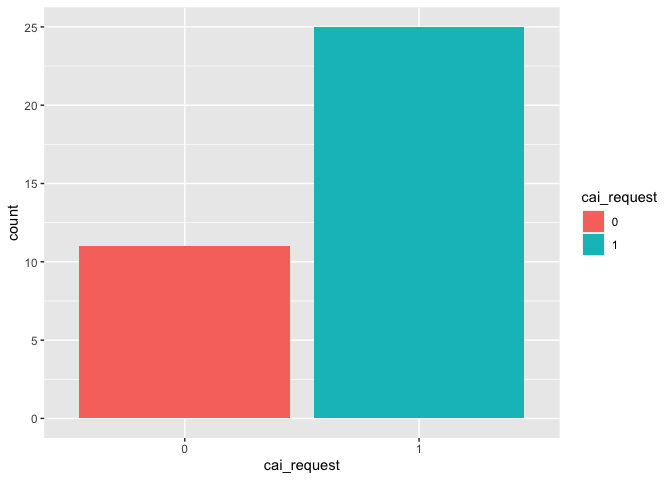

The explanatory variable (dr\_ig) is a numeric variable, which is the
overall weighted score of economic globalization, social globalization
and political globalization. Bernal Santa-Olaya et al (1999) argue that
the rise of women health movement benefit from and coincides with the
development of global communications technology, economic globalization
is leading the world into privatization and the reduction of public
health services offered in the health care system, including
reproductive health services. Therefore, it can be predict that the more
globalized countries are, the more likely they are to accept the
legalization of abortion.

    # predictor dr_ig
    g2 <- ggplot(df_filter, aes(x=cai_request, y=dr_ig, color=cai_request)) +
        geom_boxplot()
    g2

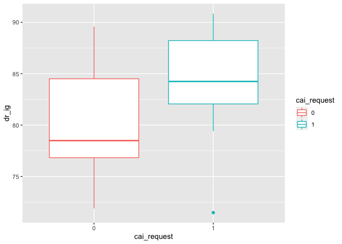

The dependent predictor (gii\_gii) is also numeric variable, which
describes gender inequality index. The higher the (gii\_gii) value the
more disparities between females and males and the more loss to human
development.

    # predictor gii_gii
    g3 <- ggplot(df_filter, aes(x=cai_request, y=gii_gii, color=cai_request)) +
        geom_boxplot()
    g3

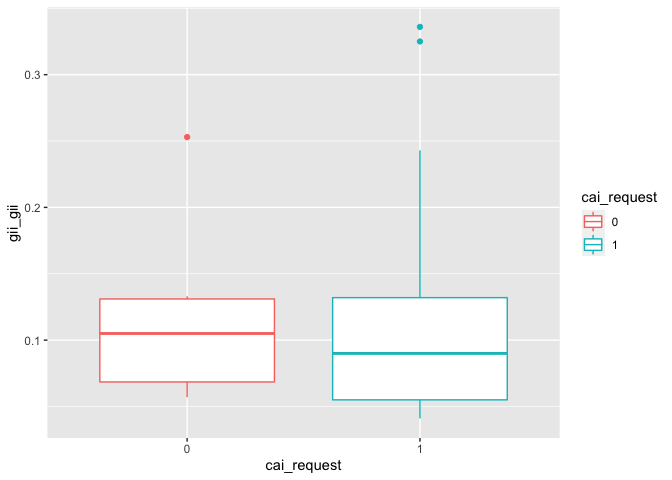

The numeric variable (wdi\_gdpcapcur) is GDP per capita in current U.S.
dollars, indicating gross domestic product divided by midyear
population. Theoretically, the higher the GDP, the more prosperous the
country’s economy.

    # predictor wdi_gdpcapcur
    g4 <- ggplot(df_filter, aes(x=cai_request, y=wdi_gdpcapcur, color=cai_request)) +
        geom_boxplot()
    g4

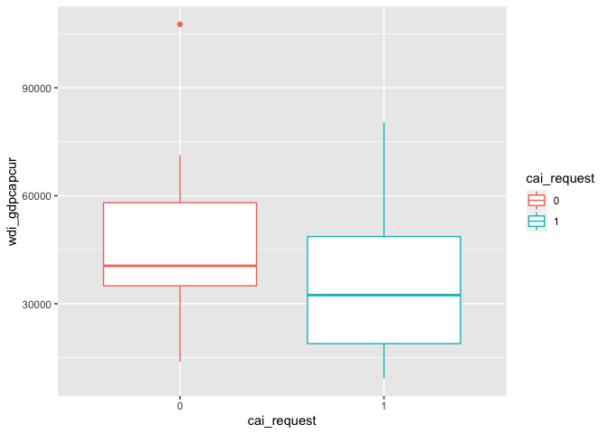

The numeric predictor “wef\_lse” is the total number of years of
schooling (primary through tertiary) that a child can expect to receive,
which reflects education level of a country to some extent.

    # predictor wef_lse
    g5 <- ggplot(df_filter, aes(x=cai_request, y=wef_lse, color=cai_request)) +
        geom_boxplot()
    g5

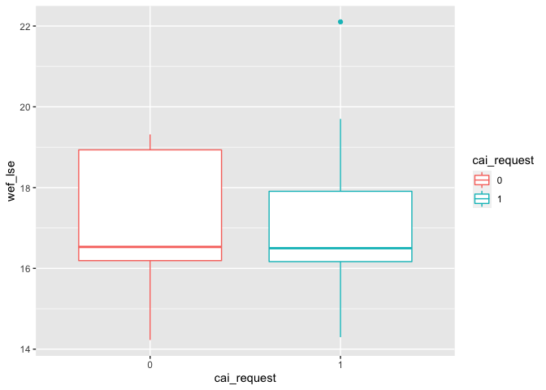

Besides, two special circumstances are also worth discussing. Thus two
categorical variables, (cai\_rape) and (cai\_mental), are included as
controlling variables, which indicate whether abortion request is
accepted as legal when pregnancy is the result of rape or incest, and
whether threat to mother’s mental health is accepted as grounds for
legal abortion, respectively.

    # controlling variable cai_rape
    table(df_filter$cai_rape)

    ## 
    ##  0  1 
    ##  3 33

    g6 <- ggplot(df_filter, aes(x = cai_rape,  fill=cai_request)) + 
        geom_bar(position = position_dodge(preserve = "single"))
    g6

    # controlling variable cai_mental
    table(df_filter$cai_mental)

    ## 
    ##  0  1 
    ##  3 33

    g7 <- ggplot(df_filter, aes(x = cai_mental,  fill=cai_request)) + 
      geom_bar(position = position_dodge(preserve = "single"))
    g7

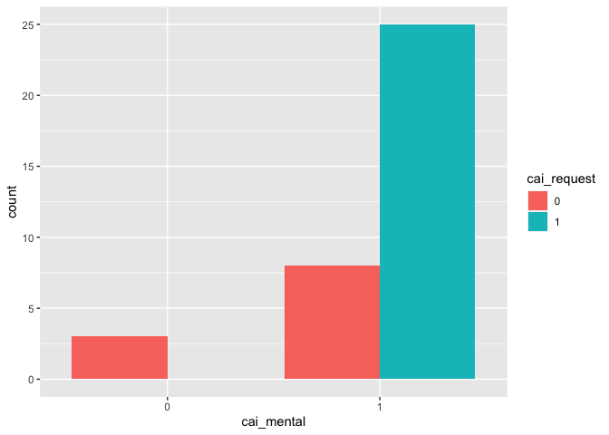

# 3. Methods

Since the response variable, (cai\_request), is a binary outcome,
logistic regression model is designed to model differences in the
likelihood of a binary outcome. Therefore, in this research, the
logistic regression modelling was employed to predict whether the
country approve the legalization of abortion.

In this research, 4 models are developed to explore the research
question. The first model uses globalization index (dr\_ig) as a main
explanatory variable, controlling for (cai\_rape) and (cai\_mental). To
test the effect of gender inequality, the second model adds (gii\_gii)
predictor based on the first model. In the third model, in order to test
hypothesis that whether economy affect abortion legalization, thus this
model concludes GDP per capita (wdi\_gdpcapcur) as explanatory variable,
controlling for the other variables listed above (including (dr\_ig),
and (gii\_gii) ). On the basis of the above models, the last model
considers the impact of education on the legalization of abortion,
adding school life expectancy (wef\_lse) as predictor.

# 4. Results

In this section, the fit results of the previously designed four models
are presented, multicollinearity is checked, and binned residual plots
are drawn to see how well the models fit.

# 4.1 Model results and Diagnostics

#### Model 1

Model 1 is designed to explore whether abortion legalization is affected
by the globalization level. The main explanatory variable is (dr\_ig),
and with control for two special circumstances using variable
(cai\_rape) and variable (cai\_mental) .

The summary of the Model 1 result is as follows:

    # dr_ig  + cai_rape + cai_mental
    mod1 <- glm(cai_request ~ dr_ig  + cai_rape + cai_mental,
                data=df_filter, 
                family=binomial(link="logit"))

    ## Warning: glm.fit: fitted probabilities numerically 0 or 1 occurred

    summary(mod1)

    ## 
    ## Call:
    ## glm(formula = cai_request ~ dr_ig + cai_rape + cai_mental, family = binomial(link = "logit"), 
    ##     data = df_filter)
    ## 
    ## Deviance Residuals: 
    ##      Min        1Q    Median        3Q       Max  
    ## -2.19229  -0.00005   0.43324   0.64614   1.41867  
    ## 
    ## Coefficients:
    ##               Estimate Std. Error z value Pr(>|z|)  
    ## (Intercept)  -52.28874 6645.40235  -0.008   0.9937  
    ## dr_ig          0.17623    0.08931   1.973   0.0485 *
    ## cai_rape1     20.54574 4699.00595   0.004   0.9965  
    ## cai_mental1   18.59390 4699.00588   0.004   0.9968  
    ## ---
    ## Signif. codes:  0 '***' 0.001 '**' 0.01 '*' 0.05 '.' 0.1 ' ' 1
    ## 
    ## (Dispersion parameter for binomial family taken to be 1)
    ## 
    ##     Null deviance: 44.316  on 35  degrees of freedom
    ## Residual deviance: 29.099  on 32  degrees of freedom
    ## AIC: 37.099
    ## 
    ## Number of Fisher Scoring iterations: 18

According to the summary result, dr\_ig is a significant predictor.

By computing variance inflation factor (VIF) and plotting the VIF plot,
whether there is multicollinearity issue in Model 1 is checked.

    t(t(vif(mod1)))

    ##            [,1]
    ## dr_ig         1
    ## cai_rape      1
    ## cai_mental    1

    plot(check_collinearity(mod1))

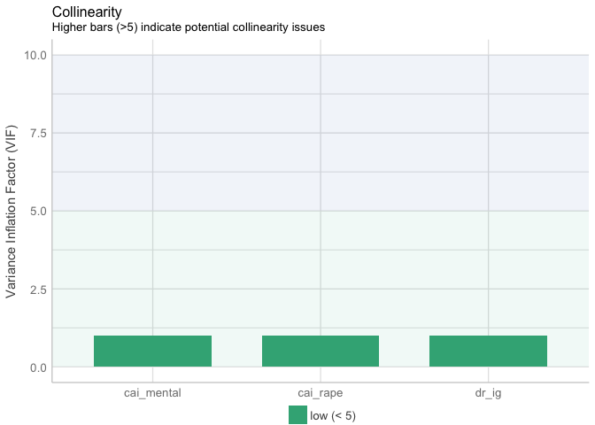

There is no multicollinearity issue found in Model 1.

Then, binned residual plot is drawn to check how many residual groups
are outside the 95 percent confidence boundaries.

    binned_residuals(mod1)

    ## Warning: Probably bad model fit. Only about 50% of the residuals are inside the error bounds.

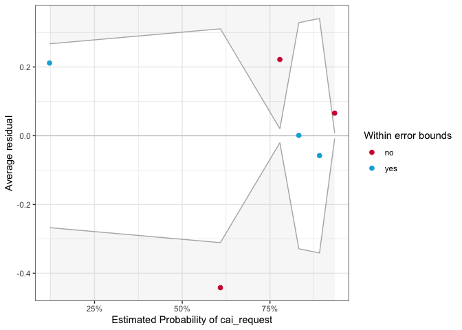

Model 1 probably has bad model fit, because only about 50% of the
residuals are inside the error bounds.

#### Model 2

In model 2, the gender inequality index variable, (gii\_gii) is added,
and all the other variables in Model 1 are kept.

    # gii_gii + dr_ig  + cai_rape + cai_mental
    mod2 <- glm(cai_request ~ gii_gii + dr_ig  + cai_rape + cai_mental,
                data=df_filter, 
                family=binomial(link="logit"))

    ## Warning: glm.fit: fitted probabilities numerically 0 or 1 occurred

    summary(mod2)

    ## 
    ## Call:
    ## glm(formula = cai_request ~ gii_gii + dr_ig + cai_rape + cai_mental, 
    ##     family = binomial(link = "logit"), data = df_filter)
    ## 
    ## Deviance Residuals: 
    ##      Min        1Q    Median        3Q       Max  
    ## -2.32151  -0.00004   0.21198   0.46202   1.73407  
    ## 
    ## Coefficients:
    ##              Estimate Std. Error z value Pr(>|z|)  
    ## (Intercept)  -88.7280  6834.4272  -0.013   0.9896  
    ## gii_gii       33.8654    15.7072   2.156   0.0311 *
    ## dr_ig          0.5498     0.2184   2.518   0.0118 *
    ## cai_rape1     24.1181  4832.6489   0.005   0.9960  
    ## cai_mental1   17.0805  4832.6485   0.004   0.9972  
    ## ---
    ## Signif. codes:  0 '***' 0.001 '**' 0.01 '*' 0.05 '.' 0.1 ' ' 1
    ## 
    ## (Dispersion parameter for binomial family taken to be 1)
    ## 
    ##     Null deviance: 44.316  on 35  degrees of freedom
    ## Residual deviance: 18.859  on 31  degrees of freedom
    ## AIC: 28.859
    ## 
    ## Number of Fisher Scoring iterations: 18

The summary result indicates that both (dr\_ig) and (gii\_gii) are
significant predictors.

    t(t(vif(mod2)))

    ##                [,1]
    ## gii_gii    2.078325
    ## dr_ig      2.078325
    ## cai_rape   1.000000
    ## cai_mental 1.000000

    plot(check_collinearity(mod2))

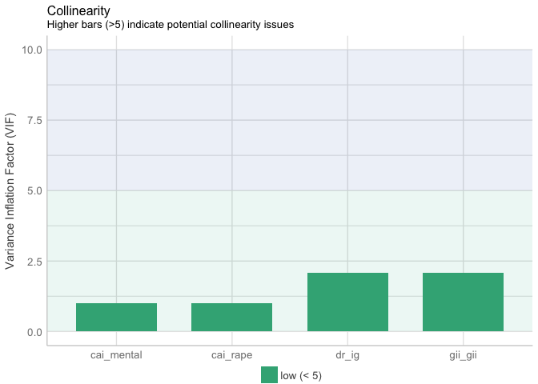

VIF of predictors in Model 2 are less than 5, therefore, there is no
potential collinearity issues in Model 2.

    binned_residuals(mod2)

    ## Warning: Probably bad model fit. Only about 67% of the residuals are inside the error bounds.

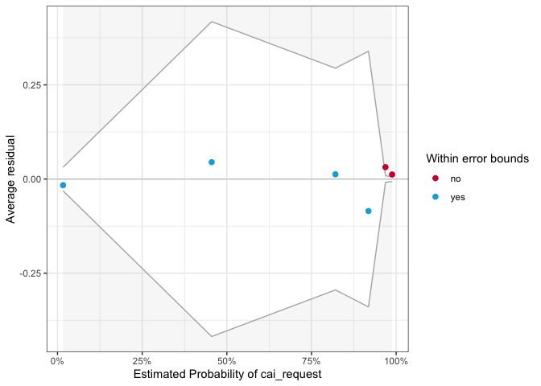

Only about 67% of the residuals are inside the error bounds. However,
according to the residual figure, red dots occur at the ends of the
distribution, and are not far from zero, thus there is no need to
especially worry about this.

#### Model 3

In Model 3, variable (wdi\_gdpcapcur), which give us information about
the impact of country’s economy on abortion legalization, is added.

    # wdi_gdpcapcur + gii_gii  + dr_ig  + cai_rape +  cai_mental
    mod3 <- glm(cai_request ~ wdi_gdpcapcur + gii_gii  + dr_ig  + cai_rape +  cai_mental,
                data=df_filter, 
                family=binomial(link="logit"))

    ## Warning: glm.fit: fitted probabilities numerically 0 or 1 occurred

    summary(mod3)

    ## 
    ## Call:
    ## glm(formula = cai_request ~ wdi_gdpcapcur + gii_gii + dr_ig + 
    ##     cai_rape + cai_mental, family = binomial(link = "logit"), 
    ##     data = df_filter)
    ## 
    ## Deviance Residuals: 
    ##      Min        1Q    Median        3Q       Max  
    ## -2.42600  -0.00005   0.18135   0.37229   1.36592  
    ## 
    ## Coefficients:
    ##                 Estimate Std. Error z value Pr(>|z|)   
    ## (Intercept)   -8.894e+01  6.693e+03  -0.013  0.98940   
    ## wdi_gdpcapcur -3.141e-05  2.839e-05  -1.106  0.26861   
    ## gii_gii        2.849e+01  1.461e+01   1.951  0.05108 . 
    ## dr_ig          5.747e-01  2.223e-01   2.585  0.00975 **
    ## cai_rape1      2.418e+01  4.733e+03   0.005  0.99592   
    ## cai_mental1    1.708e+01  4.733e+03   0.004  0.99712   
    ## ---
    ## Signif. codes:  0 '***' 0.001 '**' 0.01 '*' 0.05 '.' 0.1 ' ' 1
    ## 
    ## (Dispersion parameter for binomial family taken to be 1)
    ## 
    ##     Null deviance: 44.316  on 35  degrees of freedom
    ## Residual deviance: 17.451  on 30  degrees of freedom
    ## AIC: 29.451
    ## 
    ## Number of Fisher Scoring iterations: 18

The summary result shows that variable (dr\_ig) is still significant,
however, variable (gii\_gii) becomes moderately significant.
Additionally, the new added variable (wdi\_gdpcapcur) is not a
significant predictor.

    t(t(vif(mod3)))

    ##                   [,1]
    ## wdi_gdpcapcur 1.342772
    ## gii_gii       2.331198
    ## dr_ig         2.297954
    ## cai_rape      1.000000
    ## cai_mental    1.000000

    plot(check_collinearity(mod3))

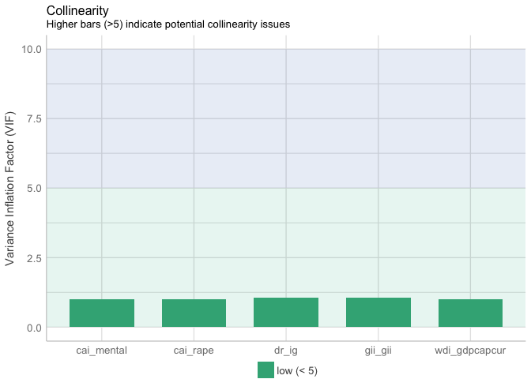

The VIF range between 1.00 and 2.33. It cannot be deduced that there
does not exist multicollinearity issue in model 3.

    binned_residuals(mod3)

    ## Warning: Probably bad model fit. Only about 67% of the residuals are inside the error bounds.

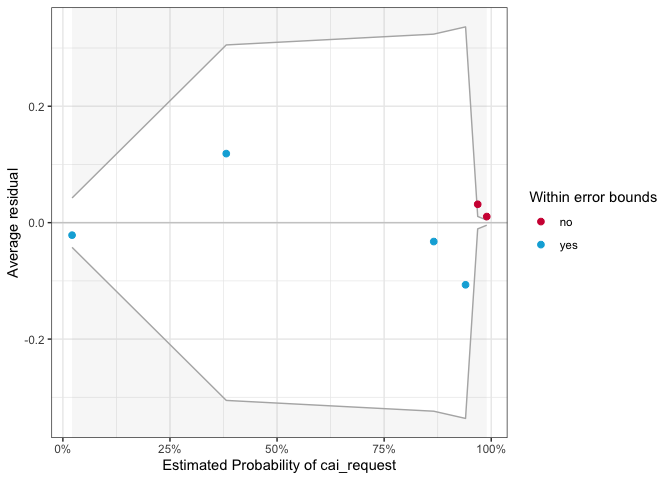

Only about 67% of the residuals are inside the error bounds. And the
same as the residual plot of Model 2, red dots occur at the ends of the
distribution, and are not far from zero, thus this is not a serious
issue.

#### Model 4

Based on Model 3, variable (wef\_lse) is added to find whether education
level has an impact on whether abortion is available on request in model
4. Variable (wdi\_gdpcapcur) is still included as predictor in Model 4
to maintain the theoretical completeness despite the fact that this
variable is revealed to be not statistically significant.

    # wef_lse + wdi_gdpcapcur + gii_gii + dr_ig + cai_rape + cai_mental
    mod4 <- glm(cai_request ~ wef_lse + wdi_gdpcapcur + gii_gii + dr_ig + cai_rape + cai_mental,
                data=df_filter, 
                family=binomial(link="logit"))

    ## Warning: glm.fit: fitted probabilities numerically 0 or 1 occurred

    summary(mod4)

    ## 
    ## Call:
    ## glm(formula = cai_request ~ wef_lse + wdi_gdpcapcur + gii_gii + 
    ##     dr_ig + cai_rape + cai_mental, family = binomial(link = "logit"), 
    ##     data = df_filter)
    ## 
    ## Deviance Residuals: 
    ##      Min        1Q    Median        3Q       Max  
    ## -2.48587  -0.00005   0.18436   0.39028   1.37195  
    ## 
    ## Coefficients:
    ##                 Estimate Std. Error z value Pr(>|z|)  
    ## (Intercept)   -9.047e+01  6.732e+03  -0.013   0.9893  
    ## wef_lse        8.760e-02  3.308e-01   0.265   0.7911  
    ## wdi_gdpcapcur -3.126e-05  2.939e-05  -1.064   0.2875  
    ## gii_gii        2.881e+01  1.459e+01   1.975   0.0483 *
    ## dr_ig          5.744e-01  2.235e-01   2.570   0.0102 *
    ## cai_rape1      2.434e+01  4.760e+03   0.005   0.9959  
    ## cai_mental1    1.690e+01  4.760e+03   0.004   0.9972  
    ## ---
    ## Signif. codes:  0 '***' 0.001 '**' 0.01 '*' 0.05 '.' 0.1 ' ' 1
    ## 
    ## (Dispersion parameter for binomial family taken to be 1)
    ## 
    ##     Null deviance: 44.316  on 35  degrees of freedom
    ## Residual deviance: 17.379  on 29  degrees of freedom
    ## AIC: 31.379
    ## 
    ## Number of Fisher Scoring iterations: 18

The newly added predictor (wef\_lse) is not significant because the
p-value is higher than 0.05. The predictors (dr\_ig) and (gii\_gii) are
significant, and the significance of the variable (wdi\_gdpcapcur)
remains unchanged, not significant.

    t(t(vif(mod4)))

    ##                   [,1]
    ## wef_lse       1.018550
    ## wdi_gdpcapcur 1.356143
    ## gii_gii       2.384422
    ## dr_ig         2.331092
    ## cai_rape      1.000000
    ## cai_mental    1.000000

    plot(check_collinearity(mod4))

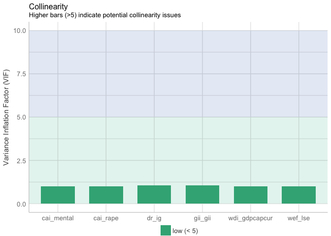

VIF of variables are low, therefore, it proves that there is no
collinearity issues in Model 4.

    binned_residuals(mod4)

    ## Warning: Probably bad model fit. Only about 67% of the residuals are inside the error bounds.

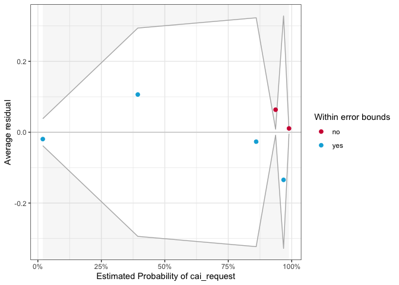

Only about 67% of the residuals are inside the error bounds. And the
same as the residuals in Model 2 and Model 3, outliers in Model 4 are
around zero, and occur at the ends of the distribution.

# 4.2 Model Selection

#### AIC value

By drawing the statistics table of four models, the best fit model can
be selected based on the AIC values. To be specific, if there is a
significant drop in AIC value, it is likely that model fit becomes
better than previous one.

    tab_model(mod4, mod3, mod2, mod1, show.ci = F, show.loglik = T, show.aic = T, show.r2 = F)

<table style="border-collapse:collapse; border:none;">
<tr>
<th style="border-top: double; text-align:center; font-style:normal; font-weight:bold; padding:0.2cm;  text-align:left; ">
 
</th>
<th colspan="2" style="border-top: double; text-align:center; font-style:normal; font-weight:bold; padding:0.2cm; ">
cai\_request
</th>
<th colspan="2" style="border-top: double; text-align:center; font-style:normal; font-weight:bold; padding:0.2cm; ">
cai\_request
</th>
<th colspan="2" style="border-top: double; text-align:center; font-style:normal; font-weight:bold; padding:0.2cm; ">
cai\_request
</th>
<th colspan="2" style="border-top: double; text-align:center; font-style:normal; font-weight:bold; padding:0.2cm; ">
cai\_request
</th>
</tr>
<tr>
<td style=" text-align:center; border-bottom:1px solid; font-style:italic; font-weight:normal;  text-align:left; ">
Predictors
</td>
<td style=" text-align:center; border-bottom:1px solid; font-style:italic; font-weight:normal;  ">
Odds Ratios
</td>
<td style=" text-align:center; border-bottom:1px solid; font-style:italic; font-weight:normal;  ">
p
</td>
<td style=" text-align:center; border-bottom:1px solid; font-style:italic; font-weight:normal;  ">
Odds Ratios
</td>
<td style=" text-align:center; border-bottom:1px solid; font-style:italic; font-weight:normal;  ">
p
</td>
<td style=" text-align:center; border-bottom:1px solid; font-style:italic; font-weight:normal;  ">
Odds Ratios
</td>
<td style=" text-align:center; border-bottom:1px solid; font-style:italic; font-weight:normal;  col7">
p
</td>
<td style=" text-align:center; border-bottom:1px solid; font-style:italic; font-weight:normal;  col8">
Odds Ratios
</td>
<td style=" text-align:center; border-bottom:1px solid; font-style:italic; font-weight:normal;  col9">
p
</td>
</tr>
<tr>
<td style=" padding:0.2cm; text-align:left; vertical-align:top; text-align:left; ">
(Intercept)
</td>
<td style=" padding:0.2cm; text-align:left; vertical-align:top; text-align:center;  ">
0.00
</td>
<td style=" padding:0.2cm; text-align:left; vertical-align:top; text-align:center;  ">
0.989
</td>
<td style=" padding:0.2cm; text-align:left; vertical-align:top; text-align:center;  ">
0.00
</td>
<td style=" padding:0.2cm; text-align:left; vertical-align:top; text-align:center;  ">
0.989
</td>
<td style=" padding:0.2cm; text-align:left; vertical-align:top; text-align:center;  ">
0.00
</td>
<td style=" padding:0.2cm; text-align:left; vertical-align:top; text-align:center;  col7">
0.990
</td>
<td style=" padding:0.2cm; text-align:left; vertical-align:top; text-align:center;  col8">
0.00
</td>
<td style=" padding:0.2cm; text-align:left; vertical-align:top; text-align:center;  col9">
0.994
</td>
</tr>
<tr>
<td style=" padding:0.2cm; text-align:left; vertical-align:top; text-align:left; ">
wef\_lse
</td>
<td style=" padding:0.2cm; text-align:left; vertical-align:top; text-align:center;  ">
1.09
</td>
<td style=" padding:0.2cm; text-align:left; vertical-align:top; text-align:center;  ">
0.791
</td>
<td style=" padding:0.2cm; text-align:left; vertical-align:top; text-align:center;  ">
</td>
<td style=" padding:0.2cm; text-align:left; vertical-align:top; text-align:center;  ">
</td>
<td style=" padding:0.2cm; text-align:left; vertical-align:top; text-align:center;  ">
</td>
<td style=" padding:0.2cm; text-align:left; vertical-align:top; text-align:center;  col7">
</td>
<td style=" padding:0.2cm; text-align:left; vertical-align:top; text-align:center;  col8">
</td>
<td style=" padding:0.2cm; text-align:left; vertical-align:top; text-align:center;  col9">
</td>
</tr>
<tr>
<td style=" padding:0.2cm; text-align:left; vertical-align:top; text-align:left; ">
wdi\_gdpcapcur
</td>
<td style=" padding:0.2cm; text-align:left; vertical-align:top; text-align:center;  ">
1.00
</td>
<td style=" padding:0.2cm; text-align:left; vertical-align:top; text-align:center;  ">
0.287
</td>
<td style=" padding:0.2cm; text-align:left; vertical-align:top; text-align:center;  ">
1.00
</td>
<td style=" padding:0.2cm; text-align:left; vertical-align:top; text-align:center;  ">
0.269
</td>
<td style=" padding:0.2cm; text-align:left; vertical-align:top; text-align:center;  ">
</td>
<td style=" padding:0.2cm; text-align:left; vertical-align:top; text-align:center;  col7">
</td>
<td style=" padding:0.2cm; text-align:left; vertical-align:top; text-align:center;  col8">
</td>
<td style=" padding:0.2cm; text-align:left; vertical-align:top; text-align:center;  col9">
</td>
</tr>
<tr>
<td style=" padding:0.2cm; text-align:left; vertical-align:top; text-align:left; ">
gii\_gii
</td>
<td style=" padding:0.2cm; text-align:left; vertical-align:top; text-align:center;  ">
3259656774933.23
</td>
<td style=" padding:0.2cm; text-align:left; vertical-align:top; text-align:center;  ">
<strong>0.048</strong>
</td>
<td style=" padding:0.2cm; text-align:left; vertical-align:top; text-align:center;  ">
2367175132884.29
</td>
<td style=" padding:0.2cm; text-align:left; vertical-align:top; text-align:center;  ">
0.051
</td>
<td style=" padding:0.2cm; text-align:left; vertical-align:top; text-align:center;  ">
509979183182613.69
</td>
<td style=" padding:0.2cm; text-align:left; vertical-align:top; text-align:center;  col7">
<strong>0.031</strong>
</td>
<td style=" padding:0.2cm; text-align:left; vertical-align:top; text-align:center;  col8">
</td>
<td style=" padding:0.2cm; text-align:left; vertical-align:top; text-align:center;  col9">
</td>
</tr>
<tr>
<td style=" padding:0.2cm; text-align:left; vertical-align:top; text-align:left; ">
dr\_ig
</td>
<td style=" padding:0.2cm; text-align:left; vertical-align:top; text-align:center;  ">
1.78
</td>
<td style=" padding:0.2cm; text-align:left; vertical-align:top; text-align:center;  ">
<strong>0.010</strong>
</td>
<td style=" padding:0.2cm; text-align:left; vertical-align:top; text-align:center;  ">
1.78
</td>
<td style=" padding:0.2cm; text-align:left; vertical-align:top; text-align:center;  ">
<strong>0.010</strong>
</td>
<td style=" padding:0.2cm; text-align:left; vertical-align:top; text-align:center;  ">
1.73
</td>
<td style=" padding:0.2cm; text-align:left; vertical-align:top; text-align:center;  col7">
<strong>0.012</strong>
</td>
<td style=" padding:0.2cm; text-align:left; vertical-align:top; text-align:center;  col8">
1.19
</td>
<td style=" padding:0.2cm; text-align:left; vertical-align:top; text-align:center;  col9">
<strong>0.048</strong>
</td>
</tr>
<tr>
<td style=" padding:0.2cm; text-align:left; vertical-align:top; text-align:left; ">
cai\_rape \[1\]
</td>
<td style=" padding:0.2cm; text-align:left; vertical-align:top; text-align:center;  ">
37211756733.55
</td>
<td style=" padding:0.2cm; text-align:left; vertical-align:top; text-align:center;  ">
0.996
</td>
<td style=" padding:0.2cm; text-align:left; vertical-align:top; text-align:center;  ">
31595758159.64
</td>
<td style=" padding:0.2cm; text-align:left; vertical-align:top; text-align:center;  ">
0.996
</td>
<td style=" padding:0.2cm; text-align:left; vertical-align:top; text-align:center;  ">
29808691658.80
</td>
<td style=" padding:0.2cm; text-align:left; vertical-align:top; text-align:center;  col7">
0.996
</td>
<td style=" padding:0.2cm; text-align:left; vertical-align:top; text-align:center;  col8">
837340769\.66
</td>
<td style=" padding:0.2cm; text-align:left; vertical-align:top; text-align:center;  col9">
0.997
</td>
</tr>
<tr>
<td style=" padding:0.2cm; text-align:left; vertical-align:top; text-align:left; ">
cai\_mental \[1\]
</td>
<td style=" padding:0.2cm; text-align:left; vertical-align:top; text-align:center;  ">
21851271.46
</td>
<td style=" padding:0.2cm; text-align:left; vertical-align:top; text-align:center;  ">
0.997
</td>
<td style=" padding:0.2cm; text-align:left; vertical-align:top; text-align:center;  ">
26053730.43
</td>
<td style=" padding:0.2cm; text-align:left; vertical-align:top; text-align:center;  ">
0.997
</td>
<td style=" padding:0.2cm; text-align:left; vertical-align:top; text-align:center;  ">
26178968.75
</td>
<td style=" padding:0.2cm; text-align:left; vertical-align:top; text-align:center;  col7">
0.997
</td>
<td style=" padding:0.2cm; text-align:left; vertical-align:top; text-align:center;  col8">
118912158\.12
</td>
<td style=" padding:0.2cm; text-align:left; vertical-align:top; text-align:center;  col9">
0.997
</td>
</tr>
<tr>
<td style=" padding:0.2cm; text-align:left; vertical-align:top; text-align:left; padding-top:0.1cm; padding-bottom:0.1cm; border-top:1px solid;">
Observations
</td>
<td style=" padding:0.2cm; text-align:left; vertical-align:top; padding-top:0.1cm; padding-bottom:0.1cm; text-align:left; border-top:1px solid;" colspan="2">
36
</td>
<td style=" padding:0.2cm; text-align:left; vertical-align:top; padding-top:0.1cm; padding-bottom:0.1cm; text-align:left; border-top:1px solid;" colspan="2">
36
</td>
<td style=" padding:0.2cm; text-align:left; vertical-align:top; padding-top:0.1cm; padding-bottom:0.1cm; text-align:left; border-top:1px solid;" colspan="2">
36
</td>
<td style=" padding:0.2cm; text-align:left; vertical-align:top; padding-top:0.1cm; padding-bottom:0.1cm; text-align:left; border-top:1px solid;" colspan="2">
36
</td>
</tr>
<tr>
<td style=" padding:0.2cm; text-align:left; vertical-align:top; text-align:left; padding-top:0.1cm; padding-bottom:0.1cm;">
AIC
</td>
<td style=" padding:0.2cm; text-align:left; vertical-align:top; padding-top:0.1cm; padding-bottom:0.1cm; text-align:left;" colspan="2">
31.379
</td>
<td style=" padding:0.2cm; text-align:left; vertical-align:top; padding-top:0.1cm; padding-bottom:0.1cm; text-align:left;" colspan="2">
29.451
</td>
<td style=" padding:0.2cm; text-align:left; vertical-align:top; padding-top:0.1cm; padding-bottom:0.1cm; text-align:left;" colspan="2">
28.859
</td>
<td style=" padding:0.2cm; text-align:left; vertical-align:top; padding-top:0.1cm; padding-bottom:0.1cm; text-align:left;" colspan="2">
37.099
</td>
</tr>
<tr>
<td style=" padding:0.2cm; text-align:left; vertical-align:top; text-align:left; padding-top:0.1cm; padding-bottom:0.1cm;">
log-Likelihood
</td>
<td style=" padding:0.2cm; text-align:left; vertical-align:top; padding-top:0.1cm; padding-bottom:0.1cm; text-align:left;" colspan="2">
-8.689
</td>
<td style=" padding:0.2cm; text-align:left; vertical-align:top; padding-top:0.1cm; padding-bottom:0.1cm; text-align:left;" colspan="2">
-8.726
</td>
<td style=" padding:0.2cm; text-align:left; vertical-align:top; padding-top:0.1cm; padding-bottom:0.1cm; text-align:left;" colspan="2">
-9.430
</td>
<td style=" padding:0.2cm; text-align:left; vertical-align:top; padding-top:0.1cm; padding-bottom:0.1cm; text-align:left;" colspan="2">
-14.550
</td>
</tr>
</table>

Model 2 has the lowest AIC value, 28.859. This indicates that Model 2
has better fit than other models.

#### AUC

ROC curve shows the trade-off between sensitivity and specificity. The
area under the ROC Curve, which is also referred to as AUC, is a
powerful metric to evaluate the performance of a binary classification
model. The higher the value of AUC, the better the model performs.

    test <- data.frame(resp = c(df_filter$cai_request), 
                       mod1 = predict(mod1, df_filter, type="response"),
                       mod2 = predict(mod2, df_filter, type="response"),
                       mod3 = predict(mod3, df_filter, type="response"),
                       mod4 = predict(mod4, df_filter, type="response"))
    test <- melt_roc(test, "resp", c("mod1", "mod2","mod3","mod4" ))
    out <- ggplot(test, aes(d = D, m = M, colour = name)) +
      geom_roc(n.cuts = 0) + style_roc(theme = theme_grey) + ggtitle("ROC Curves and AUC (Models 1-4)")
    out + annotate("text", x = .75, y = .25, label = paste(paste(unique(test$name), "AUC =", round(calc_auc(out)$AUC, 2)), collapse = "\n"))

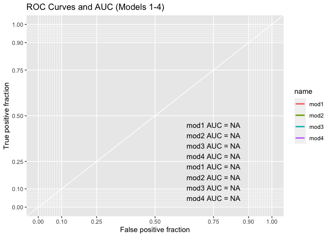

Model 2 and Model 3 has the highest AUC value, 0.94.

In terms of AIC and AUC performance, Model 2 is selected as the best
model in this research.

# 4.3 The Interpretation of the Best Model

#### Goodness of fit

Firstly, the residual and null deviances can be used to test the
following hypotheses: H0: All predictors are not related to the response
variable. HA: At least one of the predictors are related to the response
variable.

    1 - pchisq(q=mod2$null.deviance - mod2$deviance, df=length(coef(mod2)))

    ## [1] 0.0001137127

According to the result, the p-value is nearly 0, therefore the null
hypothesis is rejected, which means at least one of the predictors are
related to the response variable.

Secondly, a table is drawn to look at the odds ratios of the best model,
i.e. model 2. The coefficients with values above 1 increase the odds,
while values below 1 decrease the odds of abortion legalization.

In the following table, the p-values of variables (dr\_ig) and
(gii\_gii) are less than 0.05, which indicates they are significant
predictors.

Variable (dr\_ig) has an odds ratio of 1.73 and a p-value of 0.012,
which means that the higher the degree of globalization, the more likely
it is to legalize abortion request.

Variable (gii\_gii) has an odds ratio of 509979183182613.69, and a
p-value of 0.031, which indicates that the more disparities between
females and males and the more likely the abortion request being
considered legal.

As for the controlling variables(cai\_rape) and (cai\_mental), in
special circumstances such as when pregnancy is the result of rape or
incest or pregnancy is a threat to mother’s mental health, the odds of
abortion request being accepted as legal also increase.

    tab_model(mod2, show.ci = F, show.loglik = T, show.aic = T, show.r2 = F)

<table style="border-collapse:collapse; border:none;">
<tr>
<th style="border-top: double; text-align:center; font-style:normal; font-weight:bold; padding:0.2cm;  text-align:left; ">
 
</th>
<th colspan="2" style="border-top: double; text-align:center; font-style:normal; font-weight:bold; padding:0.2cm; ">
cai\_request
</th>
</tr>
<tr>
<td style=" text-align:center; border-bottom:1px solid; font-style:italic; font-weight:normal;  text-align:left; ">
Predictors
</td>
<td style=" text-align:center; border-bottom:1px solid; font-style:italic; font-weight:normal;  ">
Odds Ratios
</td>
<td style=" text-align:center; border-bottom:1px solid; font-style:italic; font-weight:normal;  ">
p
</td>
</tr>
<tr>
<td style=" padding:0.2cm; text-align:left; vertical-align:top; text-align:left; ">
(Intercept)
</td>
<td style=" padding:0.2cm; text-align:left; vertical-align:top; text-align:center;  ">
0.00
</td>
<td style=" padding:0.2cm; text-align:left; vertical-align:top; text-align:center;  ">
0.990
</td>
</tr>
<tr>
<td style=" padding:0.2cm; text-align:left; vertical-align:top; text-align:left; ">
gii\_gii
</td>
<td style=" padding:0.2cm; text-align:left; vertical-align:top; text-align:center;  ">
509979183182613.69
</td>
<td style=" padding:0.2cm; text-align:left; vertical-align:top; text-align:center;  ">
<strong>0.031</strong>
</td>
</tr>
<tr>
<td style=" padding:0.2cm; text-align:left; vertical-align:top; text-align:left; ">
dr\_ig
</td>
<td style=" padding:0.2cm; text-align:left; vertical-align:top; text-align:center;  ">
1.73
</td>
<td style=" padding:0.2cm; text-align:left; vertical-align:top; text-align:center;  ">
<strong>0.012</strong>
</td>
</tr>
<tr>
<td style=" padding:0.2cm; text-align:left; vertical-align:top; text-align:left; ">
cai\_rape \[1\]
</td>
<td style=" padding:0.2cm; text-align:left; vertical-align:top; text-align:center;  ">
29808691658.80
</td>
<td style=" padding:0.2cm; text-align:left; vertical-align:top; text-align:center;  ">
0.996
</td>
</tr>
<tr>
<td style=" padding:0.2cm; text-align:left; vertical-align:top; text-align:left; ">
cai\_mental \[1\]
</td>
<td style=" padding:0.2cm; text-align:left; vertical-align:top; text-align:center;  ">
26178968.75
</td>
<td style=" padding:0.2cm; text-align:left; vertical-align:top; text-align:center;  ">
0.997
</td>
</tr>
<tr>
<td style=" padding:0.2cm; text-align:left; vertical-align:top; text-align:left; padding-top:0.1cm; padding-bottom:0.1cm; border-top:1px solid;">
Observations
</td>
<td style=" padding:0.2cm; text-align:left; vertical-align:top; padding-top:0.1cm; padding-bottom:0.1cm; text-align:left; border-top:1px solid;" colspan="2">
36
</td>
</tr>
<tr>
<td style=" padding:0.2cm; text-align:left; vertical-align:top; text-align:left; padding-top:0.1cm; padding-bottom:0.1cm;">
AIC
</td>
<td style=" padding:0.2cm; text-align:left; vertical-align:top; padding-top:0.1cm; padding-bottom:0.1cm; text-align:left;" colspan="2">
28.859
</td>
</tr>
<tr>
<td style=" padding:0.2cm; text-align:left; vertical-align:top; text-align:left; padding-top:0.1cm; padding-bottom:0.1cm;">
log-Likelihood
</td>
<td style=" padding:0.2cm; text-align:left; vertical-align:top; padding-top:0.1cm; padding-bottom:0.1cm; text-align:left;" colspan="2">
-9.430
</td>
</tr>
</table>

#### Confusion Matrix

Confusion matrix is an import measure that can be employed in binary
classification scenario, which is consist of True Negative (TN), True
Positive (TP), False, Positive (FP) and False Negative (FN).

A confusion matrix of Model 2 using threshold of 0.5 is drawn as
follows:

    draw_confusion_matrix <- function(cm) {
      
      layout(matrix(c(1,1,2)))
      par(mar=c(2,2,2,2))
      plot(c(100, 345), c(300, 450), type = "n", xlab="", ylab="", xaxt='n', yaxt='n')
      title('CONFUSION MATRIX', cex.main=2)
      
      # create the matrix 
      rect(150, 430, 240, 370, col='#F7AD50')
      text(195, 435, 'No', cex=1.2)
      rect(250, 430, 340, 370, col='#3F97D0')
      text(295, 435, 'Yes', cex=1.2)
      text(125, 370, 'Predicted', cex=1.3, srt=90, font=2)
      text(245, 450, 'Actual', cex=1.3, font=2)
      rect(150, 305, 240, 365, col='#3F97D0')
      rect(250, 305, 340, 365, col='#F7AD50')
      text(140, 400, 'No', cex=1.2, srt=90)
      text(140, 335, 'Yes', cex=1.2, srt=90)
      
      # add in the cm results 
      res <- as.numeric(cm$table)
      text(195, 400, res[1], cex=1.6, font=2, col='white')
      text(195, 335, res[2], cex=1.6, font=2, col='white')
      text(295, 400, res[3], cex=1.6, font=2, col='white')
      text(295, 335, res[4], cex=1.6, font=2, col='white')
      
      # add in the specifics 
      plot(c(100, 0), c(100, 0), type = "n", xlab="", ylab="", main = "DETAILS", xaxt='n', yaxt='n')
      text(10, 50, names(cm$overall[1]), cex=1.2, font=2)
      text(10, 30, round(as.numeric(cm$overall[1]), 3), cex=1.2)
      text(30, 50, names(cm$byClass[2]), cex=1.2, font=2)
      text(30, 30, round(as.numeric(cm$byClass[2]), 3), cex=1.2)
      text(50, 50, names(cm$byClass[5]), cex=1.2, font=2)
      text(50, 30, round(as.numeric(cm$byClass[5]), 3), cex=1.2)
      text(70, 50, names(cm$byClass[6]), cex=1.2, font=2)
      text(70, 30, round(as.numeric(cm$byClass[6]), 3), cex=1.2)
      text(90, 50, names(cm$byClass[7]), cex=1.2, font=2)
      text(90, 30, round(as.numeric(cm$byClass[7]), 3), cex=1.2)
    }  

    # draw confusion matrix
    probabilities <- predict(mod2, newdata = df_filter, type='response')
    predicted.classes <- as.factor(ifelse(probabilities >= 0.5, "1", "0"))

    # model accuracy
    cfm1 <- confusionMatrix(predicted.classes, df_filter$cai_request, positive = '1')

    draw_confusion_matrix(cfm1)

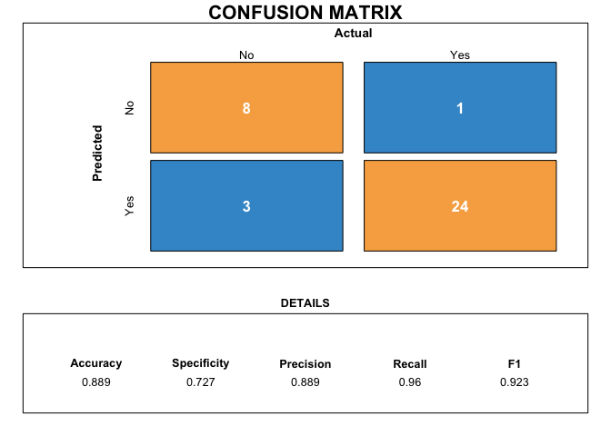

As shown in the confusion matrix, when setting threshold as 0.5, the
accuracy of Model 2 is 0.889, the F1 score is 0.923, the recall is 0.96,
and the specificity is 0.727.

#### ROC and AUC

The ROC curve of the best model is drawn in the following plot. The
computed AUC is 0.94, which indicates the probability of 0.94 that a
randomly chosen legal abortion allowed country is ranked higher than a
randomly chosen legal abortion not allowed country by these models.

    # draw ROC curve
    test <- data.frame(resp = c(df_filter$cai_request), 
                       mod2 = predict(mod2, df_filter, type="response"))
    out <- ggplot(test, aes(d = resp, m = mod2)) +
      geom_roc(n.cuts = 0) + style_roc(theme = theme_grey) + ggtitle("ROC Curves and AUC (Model 2)")
    out + annotate("text", x = .75, y = .25, label = paste(paste(unique(test$name), "AUC =", round(calc_auc(out)$AUC, 2)), collapse = "\n"))

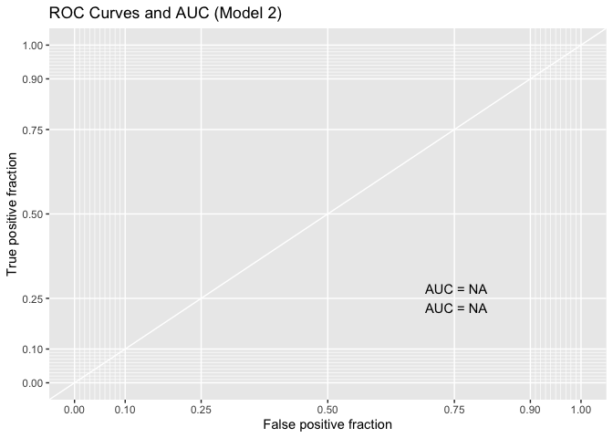

# 5. Conclusion

In order to seek the answer to the research question that what factors
may affect the possibility of abortion being available on request, four
models are developed in this research based on variables describing
globalization level, gender inequality level, economics, and education
level. Two special circumstances (rape, mother’s mental health) have
also been taken into consideration. Since the response variable is a
binary outcome, logistic regression model is used.

The best model is select based on AIC and AUC metrics. According to the
final model results, the higher the degree of globalization, the more
likely it is to legalize abortion request. The gender inequality index
(gii\_gii) is also proved as a significant predictor, however, it
indicates that the more disparities between females and males and the
more likely the abortion request being considered legal. This is a very
weird finding, because according to common sense, if men and women are
more unequal, women are less likely to obtain legal rights including
abortion right. This may be due to the fact that I have overlooked some
control variables, making the model biased. Additionally, sample size
may also be the problem since there are only 36 observations in the
dataset.

It is very interesting to find that economic level (wdi\_gdpcapcur) and
education level (wef\_lse) are not significant predictors to predict
whether the country approve the legalization of abortion. This may also
due to the small data size, or it may be a problem of the variable
selection.

From this analysis, we can infer that the more globalized countries are,
the more likely they are to accept the legalization of abortion. Future
research should try to use a time-series dataset with more observations
instead of a sectional dataset with only 36 observations.

# References:

\[1\] Bernal Santa-Olaya, E., Bissel, S. & Cortes, A. Effects of
Globalization on the Efforts to Decriminalize Abortion in Mexico.
Development 42, 130–133 (1999).
<https://doi.org/10.1057/palgrave.development.1110100>

\[2\] Bozdogan, H. (1987). Model selection and Akaike’s Information
Criterion (AIC): The general theory and its analytical extensions.
Psychometrika, 52(3), 345–370. Retrieved from
<https://doi.org/10.1007/BF02294361>

\[3\] Melo, F. (2013). Area under the ROC Curve. In W. Dubitzky, O.
Wolkenhauer, K.-H. Cho, & H. Yokota (Eds.), Encyclopedia of Systems
Biology (pp. 38–39). New York, NY: Springer New York. Retrieved from
<https://doi.org/10.1007/978-1-4419-9863-7_209>
