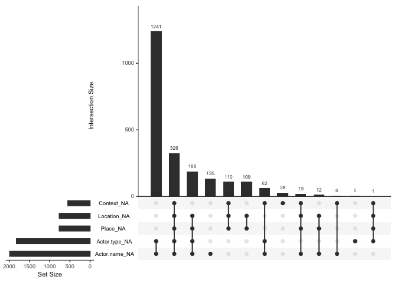
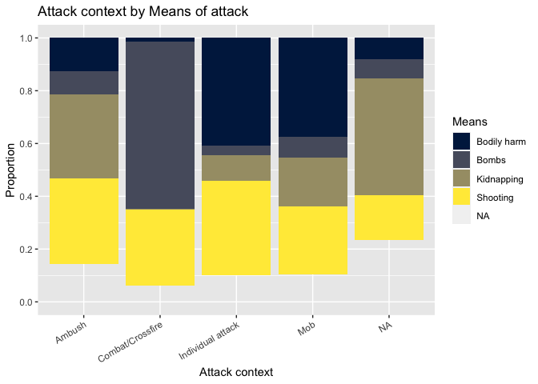
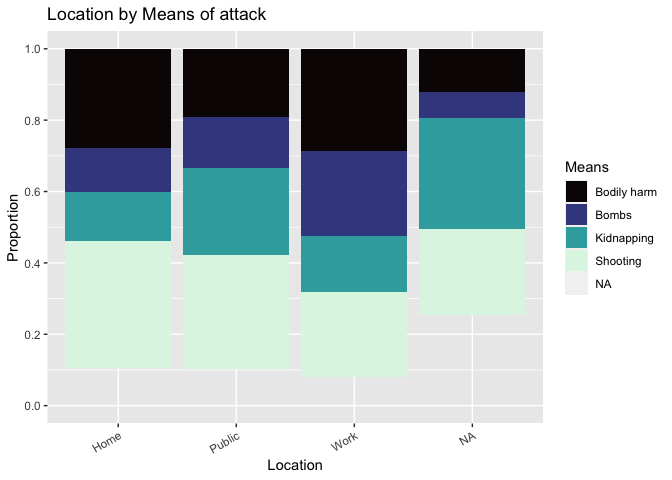
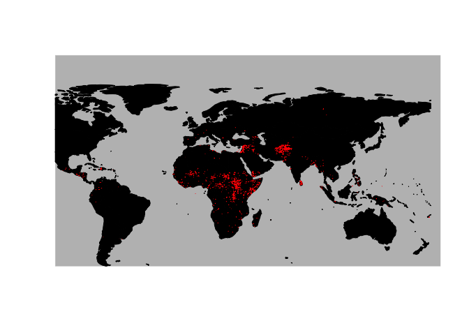
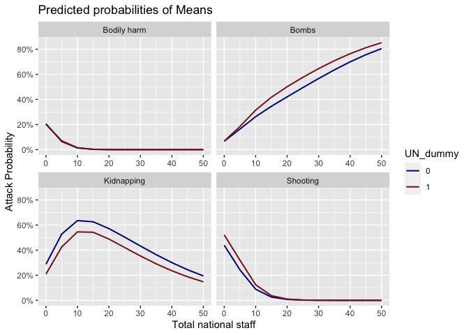
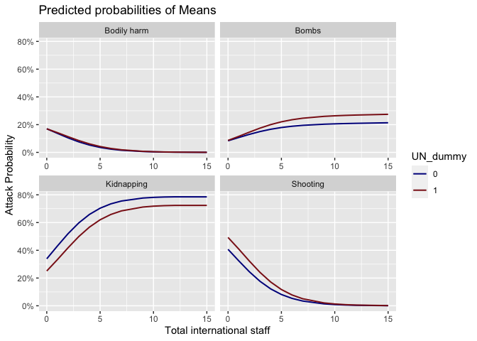
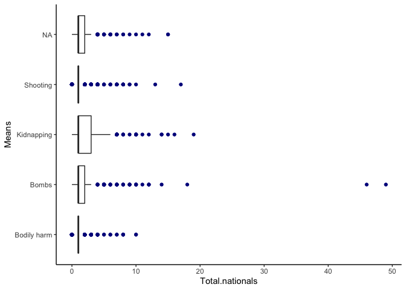
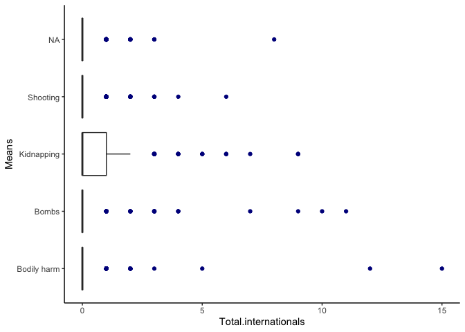
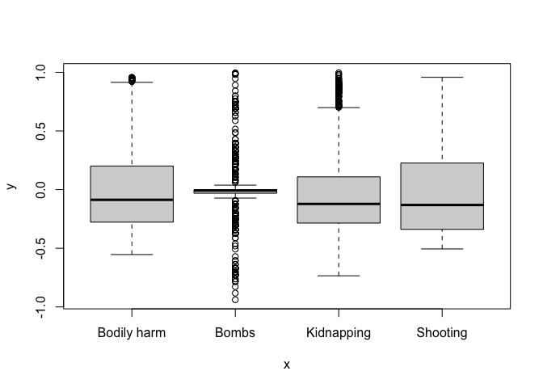

-   [Introduction](#introduction)
-   [Data](#data)
    -   [Overview:](#overview)
    -   [Cleaning:](#cleaning)
    -   [Missing data checks:](#missing-data-checks)
    -   [Description:](#description)
    -   [Potential data issues:](#potential-data-issues)
-   [Methods](#methods)
    -   [Models](#models)
-   [Results](#results)
    -   [Running the models](#running-the-models)
    -   [IIA assumption](#iia-assumption)
    -   [Analyzing the fit](#analyzing-the-fit)
    -   [Accuracy](#accuracy)
    -   [Marginal effects](#marginal-effects)
    -   [Diagnostic tests](#diagnostic-tests)
-   [Conclusion](#conclusion)
-   [References](#references)

## Introduction

Attacks against aid workers have gradually witnessed an upward trend in
the last decade. The number of victims increased to 313 in 2017 and to
over 400 in 2018, marking an all-time high in the last 5 years. It
speaks to the difficulty in keeping staff secure in the
conflict-affected and volatile environments where these attacks take
place (Aid Worker Security Report, 2019). Currently, there is little to
no systematic analysis about the modalities of these attacks: what
methods are used to attack aid workers, where, how, are internationals
more impacted than local staff etc. By analyzing the Aid Worker Security
Database (AWSD), this blog post answers the following question: *“What
factors predict the probability of”how" attacks against aid workers are
carried out (or means of attack)?"*. Simply put, I am trying to explain
a conditional probability question: Given that an attack against aid
workers has already happened, what factors explain “how” it took place?
I specifically study the following means of attack: *Bombs*,
*Kidnapping, Shooting, Bodily harm* and test the following hypotheses:

H1: There exists a positive relationship between attack context (whether
crossfire, mob, or individual attack), place of attack (whether at
office/home) and means of attack.

H2: There exists a positive association between presence of national
staff and means of attack.

Preliminary findings using multinomial logit model suggest that the
attack context, place and national/international staff status emerge
statistically significant, even though the direction varies depending on
teh categories within these variables.

## Data

### Overview:

The dataset I will be using is called the “Aid Worker Security Database
(AWSD)”. It records major attacks against humanitarian workers from
1997-present (2021) and has 3115 observations in total across 43
variables. To be recorded in the AWSD, the attack would first have to
entail “major” violence, in which victims were killed, kidnapped, or
seriously injured as a result. Additionally, they would have to be
personnel of a humanitarian organization (including staff, volunteers,
community outreach workers, or public sector employees supported by an
international humanitarian agency or donor as part of an emergency
response). For this post, I will be using the following variables from
AWSD:

**Dependent Variable (DV):**

-   Means of attack
    -   Categorical variable with 4 categories: Bodily harm, Bombs,
        Kidnapping, Shooting

**Independent Variables (IV):**

-   Place/Location of attack
    -   Categorical variable with 3 categories: Home, Public, Work
-   Attack context
    -   Categorical variable with 4 categories: Ambush,
        Combat/Crossfire, Individual attack, Mob
-   UN
    -   Dummy variable, 0 = No UN worker involved in the attack, 1 =
        Atleast 1 UN worker involved in the attack
-   Total nationals
    -   Discrete variable indicating number of national staff involved
        in the attack across organizations
-   Total internationals:
    -   Discrete variable indicating number of international staff
        involved in the attack across organizations

### Cleaning:

The data could not be used directly in the original format and
necessitated cleaning using the following steps:

-   *Variable transformations*: In the original dataset, vars means of
    attack, attack location and attack context are categorical
    variables, each with 7+ categories each. I combined conceptually
    similar categories to transform them into categorical variables with
    3-4 categories each. In addition to facilitating anlaysis, this
    transformation also helps circumvent issues of perfect separation.
    Also, a new variable called UN\_dummy was created for analysis.

-   *Recoding*: “Unknowns” were recoded as “NAs”. This is because the
    “Unknown” label can be misunderstood as not knowing where or how to
    attack when it’s actually a missing data problem.

-   *Data type*: Factor variables converted into correct format.

### Missing data checks:

Using the “Naniar” package in R, we visually inspect the data for
missing observations:

 The “upset” option allows us to study combination of missing-ness.
We notice that 1241 observations are missing for actor type and name.
This is acceptable given that we won’t be focussing on the two
variables. Other missing values are relatively smaller as a proportion
of the total sample size and raise no major concerns. Given the nature
of data collection (self-reporting by aid organizations) and the
logistical difficulties in determining certain aspects of the attack
(such as which group perpetrated it), I will assume that the data is
“Missing not at random (or MNAR)”. While there is a risk that MNAR will
introduce bias into the estiamtes, this problem is invariable given the
type of dataset we are dealing with.

Now we proceed to describing the dataset using visuals.

### Description:

Provided below are the summary statistics for variables of interest:

    ## [1] "<table class=\"Rtable1\">\n<thead>\n<tr>\n<th class='rowlabel firstrow lastrow'></th>\n<th class='firstrow lastrow'>Overall (N=3115)</th>\n</tr>\n</thead>\n<tbody>\n<tr>\n<td class='rowlabel firstrow'>UN_dummy</td>\n<td class='firstrow'></td>\n</tr>\n<tr>\n<td class='rowlabel'>Mean (SD)</td>\n<td>0.219 (0.414)</td>\n</tr>\n<tr>\n<td class='rowlabel lastrow'>Median [Min, Max]</td>\n<td class='lastrow'>0 [0, 1.00]</td>\n</tr>\n<tr>\n<td class='rowlabel firstrow'>Total.nationals</td>\n<td class='firstrow'></td>\n</tr>\n<tr>\n<td class='rowlabel'>Mean (SD)</td>\n<td>1.62 (2.11)</td>\n</tr>\n<tr>\n<td class='rowlabel lastrow'>Median [Min, Max]</td>\n<td class='lastrow'>1.00 [0, 49.0]</td>\n</tr>\n<tr>\n<td class='rowlabel firstrow'>Total.internationals</td>\n<td class='firstrow'></td>\n</tr>\n<tr>\n<td class='rowlabel'>Mean (SD)</td>\n<td>0.252 (0.845)</td>\n</tr>\n<tr>\n<td class='rowlabel lastrow'>Median [Min, Max]</td>\n<td class='lastrow'>0 [0, 15.0]</td>\n</tr>\n<tr>\n<td class='rowlabel firstrow'>Means</td>\n<td class='firstrow'></td>\n</tr>\n<tr>\n<td class='rowlabel'>Bodily harm</td>\n<td>618 (19.8%)</td>\n</tr>\n<tr>\n<td class='rowlabel'>Bombs</td>\n<td>447 (14.3%)</td>\n</tr>\n<tr>\n<td class='rowlabel'>Kidnapping</td>\n<td>730 (23.4%)</td>\n</tr>\n<tr>\n<td class='rowlabel'>Shooting</td>\n<td>900 (28.9%)</td>\n</tr>\n<tr>\n<td class='rowlabel lastrow'>Missing</td>\n<td class='lastrow'>420 (13.5%)</td>\n</tr>\n<tr>\n<td class='rowlabel firstrow'>Place</td>\n<td class='firstrow'></td>\n</tr>\n<tr>\n<td class='rowlabel'>Home</td>\n<td>240 (7.7%)</td>\n</tr>\n<tr>\n<td class='rowlabel'>Public</td>\n<td>1509 (48.4%)</td>\n</tr>\n<tr>\n<td class='rowlabel'>Work</td>\n<td>601 (19.3%)</td>\n</tr>\n<tr>\n<td class='rowlabel lastrow'>Missing</td>\n<td class='lastrow'>765 (24.6%)</td>\n</tr>\n<tr>\n<td class='rowlabel firstrow'>Context</td>\n<td class='firstrow'></td>\n</tr>\n<tr>\n<td class='rowlabel'>Ambush</td>\n<td>1060 (34.0%)</td>\n</tr>\n<tr>\n<td class='rowlabel'>Combat/Crossfire</td>\n<td>393 (12.6%)</td>\n</tr>\n<tr>\n<td class='rowlabel'>Individual attack</td>\n<td>647 (20.8%)</td>\n</tr>\n<tr>\n<td class='rowlabel'>Mob</td>\n<td>463 (14.9%)</td>\n</tr>\n<tr>\n<td class='rowlabel lastrow'>Missing</td>\n<td class='lastrow'>552 (17.7%)</td>\n</tr>\n</tbody>\n</table>\n"

 We notice that our main categorical variables are well spread across
the different categories, except for the Place var which has ~50% of
observations coded as “Public” and only around ~8% at home. However,
combining categories beyond this level to make the spread more equitable
does not make theoretical sense, so we will retain it as is. Missing
values are mostly below 20%, except for the variable “Place”, which is
~25%.

Now we graphically visualize our 3 main categorical variables, Means of
attack (DV), Place (IV) and Context (IV), to get a sense of how they
relate to each other.

*Figure 1.0*    

*Figure 2.0*    

A final visual to identify countries in which the attacks were
perpetuated:

*Figure 3.0*  

 From the map, it looks like most attacks took place in the
continents of Africa, Middle East and parts of South Asia, and more
specifically in Afghanistan, around Syria, South Sudan, Horn of Africa,
DRC and CAR. The geography is not of direct relevance for the hypotheses
that we are testing, but provides some contexual information
nonetheless.

### Potential data issues:

It is well acknowledged that the AWSD is severely under-representative
of the true numbers, as not all aid workers report violent incidents
against them, especially when it comes to sexual violence and
exploitation. One must also note that perpetrators from within the aid
space are not recorded (i.e. if an aid worker was sexually exploited by
another staff member, the dataset would not record that). Also,
organizations self-report these attacks, which can lead to heavy biases
in reporting.

## Methods

To analyze the AWSD, I will be using a “multinomial logistic” regression
model. The rationale is that the DV (Means of attack) is an unordered
response variable with 4 categories. So we use the model to predict the
probabilities of the different possible outcomes of a categorically
distributed dependent variable, given a set of independent variables
(which may be dummy, categorical, discrete etc). To use multinomial
logit, we need to meet 2 assumptions:

-   Mutually exclusive and exhaustive: This assumption is usually driven
    by theory rather than a specific statistical test. Our DV is indeed
    mutually exclusive (i.e. response belongs to only one category).
    This was apparent during the cleaning process when categories were
    collapsed as all responses belonged to only one category or another.
    On the question of whether the DV is exhaustive (that it covers all
    possibilities), this can be debated. The current conceptualization
    covers the broad attack means of shooting, kidnapping, bodily harm
    and bombs, and one can posit that most means can easily qualify
    under these categories. Keeping this as a rationale, we will proceed
    with the understanding the the exhaustive assumption is also met.

-   Independence of irrelevant alternatives (IIA) The IIA assumption
    means that adding or deleting alternative outcome categories does
    not affect the odds among the remaining outcomes. We will get back
    to this test once the models are run in the results section below.
    If the IIA is violated, options to correct for it include
    Heteroskedastic multinomial logit, multinomial probit or nested
    logit.

### Models

Model 1 (nested) = DV: Means, IVs: Context, Location, UN Dummy Model 2
(complex = DV: Means, IVs: Context, Location, UN Dummy, Total nationals,
Total internationals

We now run these models in the next section, analyze their fit, check
for marginal effects and finally do the standard tests for
multicollinearity, heterskedasticity, outliers.

## Results

### Running the models

<table style="text-align:center">
<tr>
<td colspan="7" style="border-bottom: 1px solid black">
</td>
</tr>
<tr>
<td style="text-align:left">
</td>
<td>
<strong>Bombs</strong>
</td>
<td>
<strong>Kidnapping</strong>
</td>
<td>
<strong>Shooting</strong>
</td>
<td>
<strong>Bombs</strong>
</td>
<td>
<strong>Kidnapping</strong>
</td>
<td>
<strong>Shooting</strong>
</td>
</tr>
<tr>
<td style="text-align:left">
</td>
<td colspan="3">
<strong>Model 1</strong>
</td>
<td colspan="3">
<strong>Model 2</strong>
</td>
</tr>
<tr>
<td colspan="7" style="border-bottom: 1px solid black">
</td>
</tr>
<tr>
<td style="text-align:left">
Constant
</td>
<td>
-0.256 (0.365)
</td>
<td>
1.604\*\*\* (0.316)
</td>
<td>
1.460\*\*\* (0.239)
</td>
<td>
-0.838\*\* (0.379)
</td>
<td>
1.148\*\*\* (0.327)
</td>
<td>
1.339\*\*\* (0.253)
</td>
</tr>
<tr>
<td style="text-align:left">
ContextCombat/Crossfire
</td>
<td>
4.116\*\*\* (0.532)
</td>
<td>
-1.931\*\* (0.881)
</td>
<td>
1.956\*\*\* (0.528)
</td>
<td>
4.348\*\*\* (0.534)
</td>
<td>
-1.744\*\* (0.882)
</td>
<td>
1.985\*\*\* (0.529)
</td>
</tr>
<tr>
<td style="text-align:left">
ContextIndividual attack
</td>
<td>
-2.032\*\*\* (0.277)
</td>
<td>
-2.688\*\*\* (0.225)
</td>
<td>
-1.348\*\*\* (0.166)
</td>
<td>
-1.753\*\*\* (0.282)
</td>
<td>
-2.483\*\*\* (0.230)
</td>
<td>
-1.291\*\*\* (0.168)
</td>
</tr>
<tr>
<td style="text-align:left">
ContextMob
</td>
<td>
-1.510\*\*\* (0.304)
</td>
<td>
-2.109\*\*\* (0.264)
</td>
<td>
-1.481\*\*\* (0.214)
</td>
<td>
-1.730\*\*\* (0.317)
</td>
<td>
-2.259\*\*\* (0.273)
</td>
<td>
-1.475\*\*\* (0.215)
</td>
</tr>
<tr>
<td style="text-align:left">
PlacePublic
</td>
<td>
-0.082 (0.335)
</td>
<td>
-0.600\*\* (0.296)
</td>
<td>
-0.547\*\*\* (0.212)
</td>
<td>
-0.284 (0.343)
</td>
<td>
-0.813\*\*\* (0.301)
</td>
<td>
-0.580\*\*\* (0.213)
</td>
</tr>
<tr>
<td style="text-align:left">
PlaceWork
</td>
<td>
0.379 (0.323)
</td>
<td>
-0.075 (0.262)
</td>
<td>
-0.519\*\* (0.206)
</td>
<td>
-0.005 (0.336)
</td>
<td>
-0.409 (0.270)
</td>
<td>
-0.580\*\*\* (0.209)
</td>
</tr>
<tr>
<td style="text-align:left">
UN\_dummy
</td>
<td>
0.151 (0.205)
</td>
<td>
-0.219 (0.172)
</td>
<td>
0.240 (0.146)
</td>
<td>
0.037 (0.210)
</td>
<td>
-0.296\* (0.176)
</td>
<td>
0.195 (0.147)
</td>
</tr>
<tr>
<td style="text-align:left">
Total.nationals
</td>
<td>
</td>
<td>
</td>
<td>
</td>
<td>
0.410\*\*\* (0.060)
</td>
<td>
0.352\*\*\* (0.057)
</td>
<td>
0.112\* (0.060)
</td>
</tr>
<tr>
<td style="text-align:left">
Total.internationals
</td>
<td>
</td>
<td>
</td>
<td>
</td>
<td>
0.465\*\*\* (0.111)
</td>
<td>
0.459\*\*\* (0.103)
</td>
<td>
-0.009 (0.116)
</td>
</tr>
<tr>
<td style="text-align:left">
AIC
</td>
<td>
4689.778
</td>
<td>
4689.778
</td>
<td>
4689.778
</td>
<td>
4571.020
</td>
<td>
4571.020
</td>
<td>
4571.020
</td>
</tr>
<tr>
<td colspan="7" style="border-bottom: 1px solid black">
</td>
</tr>
<tr>
<td colspan="7" style="text-align:left">
***p &lt; .01; **p &lt; .05; *p &lt; .1
</td>
</tr>
</table>

  **Interpretation (highlights):**

-   “Bodily assault” is the reference category in our DV, “Ambush” for
    the Context (one of our IV) and “Home” for Place var (also IV).

-   For the Context var, we note statistical significance and similarity
    in coefficient sign and magnititude across both models. The log odds
    of being attacked by bodily assault vs. bombs will increase by 4.1
    if moving from ambush to combat/crossfire in model 1. This number
    slightly increases to 4.4 in model 2. Similarly, for instance, the
    log odds of being attacked by bodily assault vs. kidnapping will
    decrease by 2.7 if moving from ambush to individual attack in
    model 1. The same interpretation logic applies for other
    coefficients.

-   For the Place var, we note interesting variations. The log odds of
    being attacked by bodily assault vs. kidnapping orbodily assault
    vs. shooting is negative and statistically significant when attack
    location changes from home to public across both models. When
    location changes from home to work, log odds of being attacked by
    bodily assault vs. shooting is statistically significant and
    decreases by 0.52 and 0.58 in mode1 and 2 respectively.

-   UN\_dummy var is not statistically significant at all, implying that
    whether or not a UN staff member is involved has no bearing on the
    means of attack

-   National v/s international status of staff members emerges
    significant in model 2. Both are positively associated with an
    increase in log odds of being attacked by bodily assault
    vs. kidnapping and bodily assault vs. bombs. The coefficients are in
    a small numeric range of 0.3-0.5.

Now let us check for the IIA assumption to see if the models still hold
good.

### IIA assumption

We can theoretically argue that adding or deleting another category in
our DV “means” won’t drastically change the IIA assumption as the odds
among the remaining outcomes won’t vary drastically. For instance, if we
remove “shooting”, one could argue that the odds of “kidnapping” don’t
have to change. Ofcourse, there is an implicit assumption that every
attack that took place can be neatly defined into one category, so an
attack is either shooting or kidnapping, but not both. While this can be
debated in real life, the dataset has been constructed with exclusive
categories only, so we can argue that IIA holds true. One can also run
the “hmftest” from the mlogit package but this further investigation on
R. For now, we can assume that IIA condition is met.

### Analyzing the fit

For analyzing which model is better, we use the LRT (Likelihood ratio
test):

    ## Likelihood ratio test
    ## 
    ## Model 1: Means ~ Context + Place + UN_dummy
    ## Model 2: Means ~ Context + Place + UN_dummy + Total.nationals + Total.internationals
    ##   #Df  LogLik Df  Chisq Pr(>Chisq)    
    ## 1  21 -2323.9                         
    ## 2  27 -2258.5  6 130.76  < 2.2e-16 ***
    ## ---
    ## Signif. codes:  0 '***' 0.001 '**' 0.01 '*' 0.05 '.' 0.1 ' ' 1

From the results, we see that the null hypothesis (that one should use
nested model) would be rejected at nearly every significance level. We
should instead use the complex model as it increases the accuracy of our
model by a substantial amount. Now that we have chosen our complex
model, we can calibrate the output of the model and examining all
possible outcomes of our predictions (true positive, true negative,
false positive, false negative) using a confusion matrix.

### Accuracy

To ascertain the model’s accuracy, we will be creating a confusion
matrix to see what percentage of the observations can be accurately
predicted by our model.

I tried to run the confusion matrix but couldn’t mitigate the error
message “Error in table(predicted, actual) : all arguments must have the
same length”. With more time, I would be able to decode why the error
remains. That being said the table function of both predicted and
complex functions gives some sense of the accuracy:

    ## 
    ## Bodily harm       Bombs  Kidnapping    Shooting 
    ##         618         447         730         900

    ## pred
    ## Bodily harm       Bombs  Kidnapping    Shooting 
    ##         685         301         439         621

Now we transition to marginal effects to see whether
national/international staff status and UN dummy have more influences
than we previously considered.

### Marginal effects

 We notice that for bombings and shootings, being a local and with
the UN puts the worker at a greater risk. This could be attributed to
the ‘self selection’ in that locals with the UN might be sent to more
challenging locations. Similarly, being international, but not with the
UN, can lead to a much greater incidence of kidnapping. This could be
explained by UN’s strict security protocols for expat staff which might
be missing in this case.

Finally, we conclude the analysis section with some diagnostic tests for
our complex model.

### Diagnostic tests

First we test for multicollinearity using the variance inflation factor
(or VIF)

    ##                           GVIF Df GVIF^(1/(2*Df))
    ## Context              69.267787  3        2.026540
    ## Place                42.361203  2        2.551186
    ## UN_dummy              1.830375  1        1.352913
    ## Total.nationals       7.427332  1        2.725313
    ## Total.internationals  3.640216  1        1.907935

We see a high VIF for our categorical vars Context and Place. However,
the potential reason could be that the proportion of cases in the
reference category is small, meaning the indicator variables will
necessarily have high VIFs (even if the categorical variable is not
associated with other variables in the regression model).So we may
consider reorganizing our categorical variables yet again and repeating
the VIF test. Also broadly, logistic regression seems to assume that
there is no severe multicollinearity among the explanatory variables
anyways (since logit and linear models are driven by different sets of
assumptions). This assertion is based on online resources.

We now turn to evaluating outliers using boxplots. An outlier is
considered influential if its exclusion causes major changes in the
fitted regression function.

 Here, we see a few points as outliers for nationals and
internationals, but this simply signifies the gravity of the attack
(larger the attack, more nationals/internationals impacted). While this
does raise a concern that some big attacks may be over-influencing our
estimates, it is a bit hard to account for which attacks should be
weighted more for instance. So these boxplots prompted me to
double-check the observations, but I choose to retain them in the
sample. These outliers could even provide more information upon further
investigation.

Finally, to detect heteroskedasticity, if we assume that the error terms
are IID (identically and independently distributed), then they are
automatically uncorrelated and homoscedastic. However, IID makes more
sense for linear models than logit ones, which tend to follow a
different set of assumptions. I’m unsure how to proceed with testing IID
for multinomial logit models as the online resources suggest complicated
models and tests. But a visual inspection of residuals and predicted
values could help. Below is such a visual from our chosen “complex”
model:

## Conclusion

In summary, this blog model was a first attempt at answering “What
factors predict the probability of means of attack against aid workers,
given that an attack has taken place”? By using multinomial logit model,
we find that the attack context, place and national/international staff
status emerge statistically significant. Potential issues to resolve for
future iterations include resolving the confusion matrix issue and
running a test for IIA.

## References

\[1\] Aid Worker Security Report (2021), Contending with threats to
humanitarian health workers in the age of epidemics  \[2\] Aid Worker
Security Dataset (2021)  \[3\] Dr. James Hollway, Course: Statistics
for IR slides (2021)  \[4\] Online resources, including but not
limited to: Stats.idre at UCLA, Cran.r-project manuals,
Stackoverflow.com, Github.io, Statology
