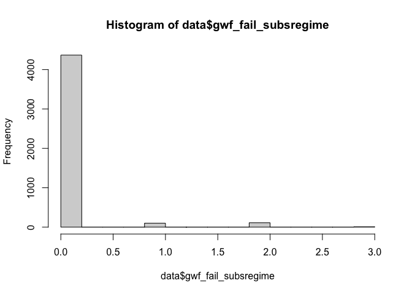
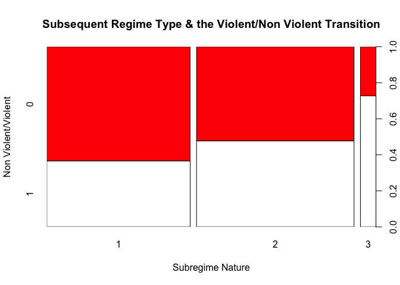
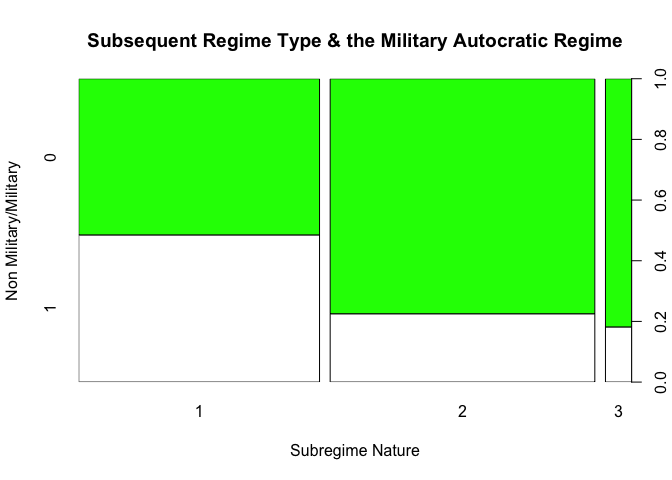
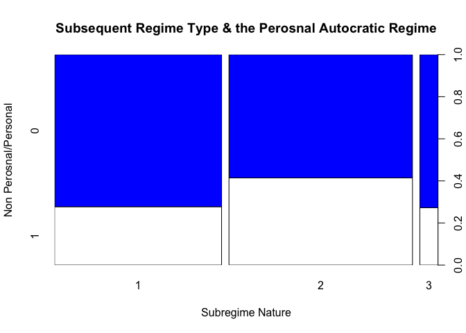

-   [1. Introduction](#introduction)
-   [2. Data](#data)
-   [3. Methods](#methods)
-   [4. Results](#results)
-   [5. Conclusion](#conclusion)

To start in a clean environment:

    #rm(list=ls()) 

## 1. Introduction {#introduction}

The nature and structure of the autocratic regimes play an important
role in the possibility of regime transition/change, and in shaping the
post-autocratic regime sets. The related literature on democratization
theory and regime change has emphasized the role of regime nature in
shaping the trajectories of regime change (The Oxford Handbook of
Transformations of the States, Leibfried et al. 2015) as well as the
subsequent situaiton. (Stepan, Alfred, and Juan Linz. 2013.
“Democratization Theory and the ‘Arab Spring” ) This research tries to
understand the relation between the pre-existing nature of the
autocratic regime and possible outcomes of the transition processes;
democracy, authoritarian, or civil war and the collapse of the order.
Therefore it asks the question of ’How the pre-existing autocratic
regime nature impacts the post-change regime? To address this question,
the research aims to test several hypotheses: H1: the duration of the
autocratic regime change effects the post-change regime nature. H2: the
personalist regime nature impacts the subsequent regime nature and has
negative impact on the possibilities of establishing a democratic regime
after the autocratic regime collapses H3: The military regime nature
impacts the subsequent regime nature and has negative impact on the
possibilities of establishing a democratic regime after the autocratic
regime collapses

Few datasets deal with the autocratic/authortiarian regimes and regime
change. One of the recent contributions in this regard is the Christian
Bjornskov and Martin Rode’s “Regime types and regime change: A new
dataset on democracy, coups, and political institutions”, which have
been published in April 2020. The new dataset is providing an update and
expansion of the Democracy-Dictatorship data by Cheibub et al. (Public
Choice, 143, 67–101, 2010), originally introduced by Alvarez et al.
(Studies in Comparative International Development, 31(2), 3–36, 1996)
(Bjørnskov and Rode 2020). Examining the data shows us that it contains
14532 observations with 46 variables. The data covers a total of 192
sovereign countries and 16 currently self-governing territories between
1950 and 2018, including periods under colonial rule for more than
ninety entities. What good about this dataset is that it includes the
post Arab Spring changes in the Middle East and North Africa.

However, it does not just focus on authoritarian regimes’ transition, my
research interest. I have also some concerns about the regime types the
data uses, mainly by introducing the concept of ‘civilian
dictatorship/autocracy’ to describe hybrid regimes such as Lebanon,
which was given the same category with Iraq under Saddam Husain!

Therefore, I prefer to use the dataset of Barbara Geddes, Joseph Wright,
and Erica Frantz “Autocratic Breakdown and Regime Transitions”. (Geddes,
Wright, and Frantz 2014) ", which is one of the highly-cited datasets.
Comparing to the Christian Bjornskov and Martin Rode’s dataset, Geddes,
Wright and Frantz’s dataset is more concise with just 280 observations
and 11 variables, however, it focuses exclusively on
authoritarian/autocratic regimes, and has also the ‘personalist’ regime
type, one of the type of regimes I am interested in. Though this dataset
has a shortage of not covering post Arab Spring transformations/changes
(coding stopped at 2010), these changes could be used to test the
outputs of data analysis.

The dataset and its codebook is available through the link:
<a href="https://sites.psu.edu/dictators/" class="uri">https://sites.psu.edu/dictators/</a>

installing the needed packages
------------------------------

    #install.packages("dplyr")
    library(dplyr)

    ## 
    ## Attaching package: 'dplyr'

    ## The following objects are masked from 'package:stats':
    ## 
    ##     filter, lag

    ## The following objects are masked from 'package:base':
    ## 
    ##     intersect, setdiff, setequal, union

    #install.packages("dlookr")
    #library(dlookr)
    #install.packages("ggplot2")
    library(ggplot2)
    #install.packages("stargazer")
    library(stargazer)

    ## 
    ## Please cite as:

    ##  Hlavac, Marek (2018). stargazer: Well-Formatted Regression and Summary Statistics Tables.

    ##  R package version 5.2.2. https://CRAN.R-project.org/package=stargazer

    #install.packages("sjPlot")
    library(sjPlot)

    ## Install package "strengejacke" from GitHub (`devtools::install_github("strengejacke/strengejacke")`) to load all sj-packages at once!

    #install.packages("nnet")
    library(nnet)
    library(haven)
    library(plyr)

    ## ------------------------------------------------------------------------------

    ## You have loaded plyr after dplyr - this is likely to cause problems.
    ## If you need functions from both plyr and dplyr, please load plyr first, then dplyr:
    ## library(plyr); library(dplyr)

    ## ------------------------------------------------------------------------------

    ## 
    ## Attaching package: 'plyr'

    ## The following objects are masked from 'package:dplyr':
    ## 
    ##     arrange, count, desc, failwith, id, mutate, rename, summarise,
    ##     summarize

## 2. Data {#data}

Geddes, Wright, and Frantz “Autocratic Breakdown and Regime Transitions”
datset is a series-cross section data, that contains “the Start and End
dates of the autocratic regimes as well as the regime type and variables
that code different dimensions of how autocratic regimes fail
(subsequent regime, level of violence, and type of failure event)”. The
unit of analysis is the ‘autocratic/authoritarian regimes’, which has
limited numbers. The limited numbers of observed units makes it more
difficult to have a statistically significant modelling.

After importing the data

    data <- readxl::read_xlsx("data.xlsx")
    #summary(data)
    #describe(data)

let us take a look at the structure of the data

    str(data)

    ## tibble [4,591 × 17] (S3: tbl_df/tbl/data.frame)
    ##  $ cowcode            : num [1:4591] 40 40 40 40 40 40 40 40 40 40 ...
    ##  $ year               : num [1:4591] 1953 1954 1955 1956 1957 ...
    ##  $ gwf_country        : chr [1:4591] "Cuba" "Cuba" "Cuba" "Cuba" ...
    ##  $ gwf_casename       : chr [1:4591] "Cuba 52-59" "Cuba 52-59" "Cuba 52-59" "Cuba 52-59" ...
    ##  $ gwf_startdate      : chr [1:4591] "19270" "19270" "19270" "19270" ...
    ##  $ gwf_enddate        : chr [1:4591] "21551" "21551" "21551" "21551" ...
    ##  $ gwf_spell          : num [1:4591] 7 7 7 7 7 7 7 51 51 51 ...
    ##  $ gwf_duration       : num [1:4591] 1 2 3 4 5 6 7 1 2 3 ...
    ##  $ gwf_fail           : num [1:4591] 0 0 0 0 0 0 1 0 0 0 ...
    ##  $ gwf_fail_subsregime: num [1:4591] 0 0 0 0 0 0 2 0 0 0 ...
    ##  $ gwf_fail_type      : num [1:4591] 0 0 0 0 0 0 6 0 0 0 ...
    ##  $ gwf_fail_violent   : num [1:4591] 0 0 0 0 0 0 4 0 0 0 ...
    ##  $ gwf_regimetype     : chr [1:4591] "personal" "personal" "personal" "personal" ...
    ##  $ gwf_party          : num [1:4591] 0 0 0 0 0 0 0 1 1 1 ...
    ##  $ gwf_personal       : num [1:4591] 1 1 1 1 1 1 1 0 0 0 ...
    ##  $ gwf_military       : num [1:4591] 0 0 0 0 0 0 0 0 0 0 ...
    ##  $ gwf_monarch        : num [1:4591] 0 0 0 0 0 0 0 0 0 0 ...

The data has 17 variables. The research is interested mainly in the
“gwf\_fail\_subsregime” variable (Categorical variable marking the
subsequent regime type), which has 4 responses gwf fail subs:
Categorical variable marking the subsequent regime type • 1: subsequent
regime is democracy • 2: subsequent regime is autocratic • 3: subsequent
regime is warlord, foreign-occupied or ceases to exist • 0: no regime
failure at duration time t; and regime still in power when the data
coded in 2010

Examining the response varibale shows us that the value 0 is the highist
(which represents “no regime failure of the autocratic regime”), which
make the data skewed. Additionally, I am interested in the aftermath
situation of the ended autocratic regimes.

    table(data$gwf_fail_subsregime)

    ## 
    ##    0    1    2    3 
    ## 4368  101  111   11

    hist(data$gwf_fail_subsregime)

Therefore I am going to delete the observations that refere to “regime
still in power”, and which has 0 value.

    library(dplyr)
    data1 <- filter(data, gwf_fail_subsregime %in% c("1", "2", "3"))

The potential explantory variables which would have, at least
theoritcally, statistical significance are: gwf\_spell: Time-invariant
duration of autocratic regime gwf\_fail\_violent: Categorical variable
marking the level of violence during the autocratic regime failure event
gwf\_regimetype: categorical variable of autocratic regime type
(pre-existing regime) gwf\_fail\_type:Categorical variable marking how
the autocratic regime ends gwf\_party: Binary indicator of party regime
type  
gwf\_personal: Binary indicator of personal regime type  
gwf\_military: Binary indicator of military regime type  
gwf\_monarch: Binary indicator of monarchy regime type

The gwf\_regimetype & gwf\_fail\_type could be useful (theoretically),
however, they have many categories which would complecate the model (10
each)

    table(data1$gwf_regimetype)

    ## 
    ##       indirect military                military       military-personal 
    ##                       6                      47                      23 
    ##                monarchy               oligarchy             party-based 
    ##                      12                       4                      35 
    ##          party-military          party-personal party-personal-military 
    ##                       6                      11                       2 
    ##                personal 
    ##                      77

    table(data1$gwf_fail_type)

    ## 
    ##  1  2  3  4  5  6  7  8  9 
    ## 10 28 31 38 77 17 10  7  5

Therefore, I will not include these two variables in the model. At the
same time, the dummy variables of personal and military regimes type are
included, which adress part of the autocratic regimes. Additionally the
variable of the level of violence during the failure of the autocratic
regime partly adresses the way in which regime fails (violently or not)

Yet, gwf\_fail\_violent have 4 cateogries • 1: no deaths • 2: 1-25
deaths • 3: 26-1000 deaths • 4: &gt;1000 • 0: regime still in power on
December 31, 2010 I need to make it dummy and change the values, with 1
if there is death (the transation is violent), and 0 if there is no
death

    data1$gwf_fail_violent [data1$gwf_fail_violent == 2] <- 2 
    data1$gwf_fail_violent [data1$gwf_fail_violent == 3] <- 2
    data1$gwf_fail_violent [data1$gwf_fail_violent == 4] <- 2
    data1$gwf_fail_violent [data1$gwf_fail_violent == 1] <- 0 
    data1$gwf_fail_violent [data1$gwf_fail_violent == 2] <- 1
    table(data1$gwf_fail_violent)

    ## 
    ##   0   1 
    ## 125  98

Finally I am going to rename the variables that I am interested in for
my model

    library(haven)

    data1 <- data1 %>% dplyr::rename(duration = gwf_spell, subregime = gwf_fail_subsregime, violent = gwf_fail_violent, party = gwf_party,
                     personal = gwf_personal, military = gwf_military)
    str(data1)

    ## tibble [223 × 17] (S3: tbl_df/tbl/data.frame)
    ##  $ cowcode       : num [1:223] 40 41 41 41 41 41 41 41 42 42 ...
    ##  $ year          : num [1:223] 1959 1946 1956 1986 1988 ...
    ##  $ gwf_country   : chr [1:223] "Cuba" "Haiti" "Haiti" "Haiti" ...
    ##  $ gwf_casename  : chr [1:223] "Cuba 52-59" "Haiti 41-46" "Haiti 50-56" "Haiti 57-86" ...
    ##  $ gwf_startdate : chr [1:223] "19270" "15102" "18541" "14/06/1957" ...
    ##  $ gwf_enddate   : chr [1:223] "21551" "17107" "20801" "31595" ...
    ##  $ duration      : num [1:223] 7 5 6 29 2 2 3 5 32 2 ...
    ##  $ gwf_duration  : num [1:223] 7 5 6 29 2 2 3 5 32 2 ...
    ##  $ gwf_fail      : num [1:223] 1 1 1 1 1 1 1 1 1 1 ...
    ##  $ subregime     : num [1:223] 2 1 2 2 2 1 1 1 2 2 ...
    ##  $ gwf_fail_type : num [1:223] 6 4 4 4 5 3 7 6 5 6 ...
    ##  $ violent       : num [1:223] 1 1 1 1 1 0 0 1 0 1 ...
    ##  $ gwf_regimetype: chr [1:223] "personal" "personal" "personal" "personal" ...
    ##  $ party         : num [1:223] 0 0 0 0 0 0 0 0 0 0 ...
    ##  $ personal      : num [1:223] 1 1 1 1 0 0 0 1 1 0 ...
    ##  $ military      : num [1:223] 0 0 0 0 1 1 1 0 0 1 ...
    ##  $ gwf_monarch   : num [1:223] 0 0 0 0 0 0 0 0 0 0 ...

we can see that R is reading the variable as integer, so we need to
convert them to factor. However, no need for factorizing the duration,
which is a counter variable

    data1 <- data1 %>% 
      mutate(subregime = as_factor(subregime), violent = as_factor(violent),
             party = as_factor(party), personal = as_factor(personal), military = as_factor(military))

\#\#Visualizing the variables

Since we have 3 dummy variables, we can use plot function to visualize
the relation between the response (subregime) and the explantory
variables:

    plot(data1$subregime, data1$violent,  main = "Subsequent Regime Type & the Violent/Non Violent Transition", xlab = "Subregime Nature", ylab = "Non Violent/Violent", col = c("white","red"))

We can see that the violent transition is more represent in the 3
reponse possibility of the subsequent regime, this result is logical
giving that the third case represents “warlord, foreign-occupied or
ceases to exist”. In the same vein, the transition into “democracy” as
in the case number 1 is the less violent, while the transition to
autocratic regime is relatively violent.

    plot(data1$subregime, data1$military,  main = "Subsequent Regime Type & the Military Autocratic Regime", xlab = "Subregime Nature", ylab = "Non Military/Military", col = c("white","green"))

We can infere from the plot above that the military nature of the
autocratic regime prevent the country from sliding into a situation of
warlords or occupation after the change of the autocratic regime. But
what is puzzling here is that the military regime nature seems to
present more on the case of transition into democracy more that
autocratic case.

    plot(data1$subregime, data1$personal,  main = "Subsequent Regime Type & the Perosnal Autocratic Regime", xlab = "Subregime Nature", ylab = "Non Perosnal/Personal", col = c("white","blue"))

The personalist nature of the regime seems to present more in the cases
of transition to autocratic regimes (response case 2), more than in the
response case 1, which represents the transition into democratic
regimes.

## 3. Methods {#methods}

Since my response variable is categorical, with more than two
catogories, I will use multinominal regression model, using nnet
packcage. The multinominal model has two main assumptions: 1. The
categories should be mutually exclusive and exhaustive Which seems to be
the case for the three catgories that we have (1.democracy,
2.autocratic, 3.warlord foreign-occupied or ceases to exis) 2.
Independence of irrelevant alternatives (IIA): It seems that this
assumption is not violated. The tranisition process is not a choicable,
rather it is self-realized in which the proportion of choosing one of
the two alternatives is not change with the introduction of a third
alternative. All alternatives of possible subsequent regimes are
theoretically possible and known to the actors, but the path of the
transition is not effected by their theoritical existence.

For nunning the model with subregime as the response variable, I will
choose democracy as the reference category. Democracy is considered to
be the ideal and reference model for democratization and regime
transition theories, and also it represents one end of the continuum (of
the categories) which make it easier to interpret the coefficients. It
is better than the other end of the continuum which is cateogry 3
(warlord, foreign-occupied or ceases to exist) because it has more
observation (101 to 11), and that would help reducing standard error and
decreasing confidence interval width of other coefficients.

In the light of the hypotheses the possible models are as below:

Model1

    model1 <- nnet::multinom(relevel(subregime , ref = "1") ~  duration + violent , data1)

    ## # weights:  12 (6 variable)
    ## initial  value 244.990540 
    ## iter  10 value 185.425351
    ## final  value 185.415096 
    ## converged

    tab_model(model1, title = "Subsequent Regime", p.style = "a")

<table style="border-collapse:collapse; border:none;">
<caption style="font-weight: bold; text-align:left;">
Subsequent Regime
</caption>
<tr>
<th style="border-top: double; text-align:center; font-style:normal; font-weight:bold; padding:0.2cm;  text-align:left; ">
 
</th>
<th colspan="3" style="border-top: double; text-align:center; font-style:normal; font-weight:bold; padding:0.2cm; ">
relevel(subregime, ref = “1”)
</th>
</tr>
<tr>
<td style=" text-align:center; border-bottom:1px solid; font-style:italic; font-weight:normal;  text-align:left; ">
Predictors
</td>
<td style=" text-align:center; border-bottom:1px solid; font-style:italic; font-weight:normal;  ">
Odds Ratios
</td>
<td style=" text-align:center; border-bottom:1px solid; font-style:italic; font-weight:normal;  ">
CI
</td>
<td style=" text-align:center; border-bottom:1px solid; font-style:italic; font-weight:normal;  ">
Response
</td>
</tr>
<tr>
<td style=" padding:0.2cm; text-align:left; vertical-align:top; text-align:left; ">
(Intercept)
</td>
<td style=" padding:0.2cm; text-align:left; vertical-align:top; text-align:center;  ">
1.02 
</td>
<td style=" padding:0.2cm; text-align:left; vertical-align:top; text-align:center;  ">
0.67 – 1.57
</td>
<td style=" padding:0.2cm; text-align:left; vertical-align:top; text-align:center;  ">
2
</td>
</tr>
<tr>
<td style=" padding:0.2cm; text-align:left; vertical-align:top; text-align:left; ">
duration
</td>
<td style=" padding:0.2cm; text-align:left; vertical-align:top; text-align:center;  ">
0.99 
</td>
<td style=" padding:0.2cm; text-align:left; vertical-align:top; text-align:center;  ">
0.98 – 1.01
</td>
<td style=" padding:0.2cm; text-align:left; vertical-align:top; text-align:center;  ">
2
</td>
</tr>
<tr>
<td style=" padding:0.2cm; text-align:left; vertical-align:top; text-align:left; ">
violent \[1\]
</td>
<td style=" padding:0.2cm; text-align:left; vertical-align:top; text-align:center;  ">
1.59 
</td>
<td style=" padding:0.2cm; text-align:left; vertical-align:top; text-align:center;  ">
0.91 – 2.76
</td>
<td style=" padding:0.2cm; text-align:left; vertical-align:top; text-align:center;  ">
2
</td>
</tr>
<tr>
<td style=" padding:0.2cm; text-align:left; vertical-align:top; text-align:left; ">
(Intercept)
</td>
<td style=" padding:0.2cm; text-align:left; vertical-align:top; text-align:center;  ">
0.03 \*\*\*
</td>
<td style=" padding:0.2cm; text-align:left; vertical-align:top; text-align:center;  ">
0.01 – 0.12
</td>
<td style=" padding:0.2cm; text-align:left; vertical-align:top; text-align:center;  ">
3
</td>
</tr>
<tr>
<td style=" padding:0.2cm; text-align:left; vertical-align:top; text-align:left; ">
duration
</td>
<td style=" padding:0.2cm; text-align:left; vertical-align:top; text-align:center;  ">
1.02 
</td>
<td style=" padding:0.2cm; text-align:left; vertical-align:top; text-align:center;  ">
0.99 – 1.04
</td>
<td style=" padding:0.2cm; text-align:left; vertical-align:top; text-align:center;  ">
3
</td>
</tr>
<tr>
<td style=" padding:0.2cm; text-align:left; vertical-align:top; text-align:left; ">
violent \[1\]
</td>
<td style=" padding:0.2cm; text-align:left; vertical-align:top; text-align:center;  ">
4.41 \*
</td>
<td style=" padding:0.2cm; text-align:left; vertical-align:top; text-align:center;  ">
1.09 – 17.79
</td>
<td style=" padding:0.2cm; text-align:left; vertical-align:top; text-align:center;  ">
3
</td>
</tr>
<tr>
<td style=" padding:0.2cm; text-align:left; vertical-align:top; text-align:left; padding-top:0.1cm; padding-bottom:0.1cm; border-top:1px solid;">
Observations
</td>
<td style=" padding:0.2cm; text-align:left; vertical-align:top; padding-top:0.1cm; padding-bottom:0.1cm; text-align:left; border-top:1px solid;" colspan="3">
223
</td>
</tr>
<tr>
<td style=" padding:0.2cm; text-align:left; vertical-align:top; text-align:left; padding-top:0.1cm; padding-bottom:0.1cm;">
R2 Nagelkerke
</td>
<td style=" padding:0.2cm; text-align:left; vertical-align:top; padding-top:0.1cm; padding-bottom:0.1cm; text-align:left;" colspan="3">
0.055
</td>
</tr>
<tr>
<td colspan="4" style="font-style:italic; border-top:double black; text-align:right;">
-   p&lt;0.05   \*\* p&lt;0.01   \*\*\* p&lt;0.001
    </td>
    </tr>

</table>
The violent transition variable have salinet relation with the
transition to ‘warlords or occupied states’, with 4.4statistically
significant odd ratio, which is expectable.

Model2

    model2 <- nnet::multinom(relevel(subregime , ref = "1") ~  duration + violent + personal, data1)

    ## # weights:  15 (8 variable)
    ## initial  value 244.990540 
    ## iter  10 value 184.065706
    ## final  value 183.731789 
    ## converged

    tab_model(model2, title = "Subsequent Regime", p.style = "a")

<table style="border-collapse:collapse; border:none;">
<caption style="font-weight: bold; text-align:left;">
Subsequent Regime
</caption>
<tr>
<th style="border-top: double; text-align:center; font-style:normal; font-weight:bold; padding:0.2cm;  text-align:left; ">
 
</th>
<th colspan="3" style="border-top: double; text-align:center; font-style:normal; font-weight:bold; padding:0.2cm; ">
relevel(subregime, ref = “1”)
</th>
</tr>
<tr>
<td style=" text-align:center; border-bottom:1px solid; font-style:italic; font-weight:normal;  text-align:left; ">
Predictors
</td>
<td style=" text-align:center; border-bottom:1px solid; font-style:italic; font-weight:normal;  ">
Odds Ratios
</td>
<td style=" text-align:center; border-bottom:1px solid; font-style:italic; font-weight:normal;  ">
CI
</td>
<td style=" text-align:center; border-bottom:1px solid; font-style:italic; font-weight:normal;  ">
Response
</td>
</tr>
<tr>
<td style=" padding:0.2cm; text-align:left; vertical-align:top; text-align:left; ">
(Intercept)
</td>
<td style=" padding:0.2cm; text-align:left; vertical-align:top; text-align:center;  ">
0.83 
</td>
<td style=" padding:0.2cm; text-align:left; vertical-align:top; text-align:center;  ">
0.52 – 1.35
</td>
<td style=" padding:0.2cm; text-align:left; vertical-align:top; text-align:center;  ">
2
</td>
</tr>
<tr>
<td style=" padding:0.2cm; text-align:left; vertical-align:top; text-align:left; ">
duration
</td>
<td style=" padding:0.2cm; text-align:left; vertical-align:top; text-align:center;  ">
0.99 
</td>
<td style=" padding:0.2cm; text-align:left; vertical-align:top; text-align:center;  ">
0.98 – 1.01
</td>
<td style=" padding:0.2cm; text-align:left; vertical-align:top; text-align:center;  ">
2
</td>
</tr>
<tr>
<td style=" padding:0.2cm; text-align:left; vertical-align:top; text-align:left; ">
violent \[1\]
</td>
<td style=" padding:0.2cm; text-align:left; vertical-align:top; text-align:center;  ">
1.51 
</td>
<td style=" padding:0.2cm; text-align:left; vertical-align:top; text-align:center;  ">
0.87 – 2.64
</td>
<td style=" padding:0.2cm; text-align:left; vertical-align:top; text-align:center;  ">
2
</td>
</tr>
<tr>
<td style=" padding:0.2cm; text-align:left; vertical-align:top; text-align:left; ">
personal \[1\]
</td>
<td style=" padding:0.2cm; text-align:left; vertical-align:top; text-align:center;  ">
1.71 
</td>
<td style=" padding:0.2cm; text-align:left; vertical-align:top; text-align:center;  ">
0.95 – 3.09
</td>
<td style=" padding:0.2cm; text-align:left; vertical-align:top; text-align:center;  ">
2
</td>
</tr>
<tr>
<td style=" padding:0.2cm; text-align:left; vertical-align:top; text-align:left; ">
(Intercept)
</td>
<td style=" padding:0.2cm; text-align:left; vertical-align:top; text-align:center;  ">
0.03 \*\*\*
</td>
<td style=" padding:0.2cm; text-align:left; vertical-align:top; text-align:center;  ">
0.01 – 0.13
</td>
<td style=" padding:0.2cm; text-align:left; vertical-align:top; text-align:center;  ">
3
</td>
</tr>
<tr>
<td style=" padding:0.2cm; text-align:left; vertical-align:top; text-align:left; ">
duration
</td>
<td style=" padding:0.2cm; text-align:left; vertical-align:top; text-align:center;  ">
1.02 
</td>
<td style=" padding:0.2cm; text-align:left; vertical-align:top; text-align:center;  ">
0.99 – 1.05
</td>
<td style=" padding:0.2cm; text-align:left; vertical-align:top; text-align:center;  ">
3
</td>
</tr>
<tr>
<td style=" padding:0.2cm; text-align:left; vertical-align:top; text-align:left; ">
violent \[1\]
</td>
<td style=" padding:0.2cm; text-align:left; vertical-align:top; text-align:center;  ">
4.38 \*
</td>
<td style=" padding:0.2cm; text-align:left; vertical-align:top; text-align:center;  ">
1.08 – 17.74
</td>
<td style=" padding:0.2cm; text-align:left; vertical-align:top; text-align:center;  ">
3
</td>
</tr>
<tr>
<td style=" padding:0.2cm; text-align:left; vertical-align:top; text-align:left; ">
personal \[1\]
</td>
<td style=" padding:0.2cm; text-align:left; vertical-align:top; text-align:center;  ">
1.07 
</td>
<td style=" padding:0.2cm; text-align:left; vertical-align:top; text-align:center;  ">
0.25 – 4.65
</td>
<td style=" padding:0.2cm; text-align:left; vertical-align:top; text-align:center;  ">
3
</td>
</tr>
<tr>
<td style=" padding:0.2cm; text-align:left; vertical-align:top; text-align:left; padding-top:0.1cm; padding-bottom:0.1cm; border-top:1px solid;">
Observations
</td>
<td style=" padding:0.2cm; text-align:left; vertical-align:top; padding-top:0.1cm; padding-bottom:0.1cm; text-align:left; border-top:1px solid;" colspan="3">
223
</td>
</tr>
<tr>
<td style=" padding:0.2cm; text-align:left; vertical-align:top; text-align:left; padding-top:0.1cm; padding-bottom:0.1cm;">
R2 Nagelkerke
</td>
<td style=" padding:0.2cm; text-align:left; vertical-align:top; padding-top:0.1cm; padding-bottom:0.1cm; text-align:left;" colspan="3">
0.072
</td>
</tr>
<tr>
<td colspan="4" style="font-style:italic; border-top:double black; text-align:right;">
-   p&lt;0.05   \*\* p&lt;0.01   \*\*\* p&lt;0.001
    </td>
    </tr>

</table>
The same pattern seen in the first model could be seen also in the
second model, as violent in the transition increases the odd of having
‘warlords or occupied country’ scenario increases by 4. Though this
result might be statistically significant it has no theortical
contribution since the correlation is intuitive.

Model3

    model3 <- nnet::multinom(relevel(subregime , ref = "1") ~  duration + violent + military, data1)

    ## # weights:  15 (8 variable)
    ## initial  value 244.990540 
    ## iter  10 value 175.721134
    ## final  value 175.674340 
    ## converged

    tab_model(model3, title = "Subsequent Regime", p.style = "a")

<table style="border-collapse:collapse; border:none;">
<caption style="font-weight: bold; text-align:left;">
Subsequent Regime
</caption>
<tr>
<th style="border-top: double; text-align:center; font-style:normal; font-weight:bold; padding:0.2cm;  text-align:left; ">
 
</th>
<th colspan="3" style="border-top: double; text-align:center; font-style:normal; font-weight:bold; padding:0.2cm; ">
relevel(subregime, ref = “1”)
</th>
</tr>
<tr>
<td style=" text-align:center; border-bottom:1px solid; font-style:italic; font-weight:normal;  text-align:left; ">
Predictors
</td>
<td style=" text-align:center; border-bottom:1px solid; font-style:italic; font-weight:normal;  ">
Odds Ratios
</td>
<td style=" text-align:center; border-bottom:1px solid; font-style:italic; font-weight:normal;  ">
CI
</td>
<td style=" text-align:center; border-bottom:1px solid; font-style:italic; font-weight:normal;  ">
Response
</td>
</tr>
<tr>
<td style=" padding:0.2cm; text-align:left; vertical-align:top; text-align:left; ">
(Intercept)
</td>
<td style=" padding:0.2cm; text-align:left; vertical-align:top; text-align:center;  ">
2.14 \*\*
</td>
<td style=" padding:0.2cm; text-align:left; vertical-align:top; text-align:center;  ">
1.22 – 3.76
</td>
<td style=" padding:0.2cm; text-align:left; vertical-align:top; text-align:center;  ">
2
</td>
</tr>
<tr>
<td style=" padding:0.2cm; text-align:left; vertical-align:top; text-align:left; ">
duration
</td>
<td style=" padding:0.2cm; text-align:left; vertical-align:top; text-align:center;  ">
0.98 \*
</td>
<td style=" padding:0.2cm; text-align:left; vertical-align:top; text-align:center;  ">
0.96 – 1.00
</td>
<td style=" padding:0.2cm; text-align:left; vertical-align:top; text-align:center;  ">
2
</td>
</tr>
<tr>
<td style=" padding:0.2cm; text-align:left; vertical-align:top; text-align:left; ">
violent \[1\]
</td>
<td style=" padding:0.2cm; text-align:left; vertical-align:top; text-align:center;  ">
1.38 
</td>
<td style=" padding:0.2cm; text-align:left; vertical-align:top; text-align:center;  ">
0.77 – 2.46
</td>
<td style=" padding:0.2cm; text-align:left; vertical-align:top; text-align:center;  ">
2
</td>
</tr>
<tr>
<td style=" padding:0.2cm; text-align:left; vertical-align:top; text-align:left; ">
military \[1\]
</td>
<td style=" padding:0.2cm; text-align:left; vertical-align:top; text-align:center;  ">
0.25 \*\*\*
</td>
<td style=" padding:0.2cm; text-align:left; vertical-align:top; text-align:center;  ">
0.13 – 0.47
</td>
<td style=" padding:0.2cm; text-align:left; vertical-align:top; text-align:center;  ">
2
</td>
</tr>
<tr>
<td style=" padding:0.2cm; text-align:left; vertical-align:top; text-align:left; ">
(Intercept)
</td>
<td style=" padding:0.2cm; text-align:left; vertical-align:top; text-align:center;  ">
0.06 \*\*\*
</td>
<td style=" padding:0.2cm; text-align:left; vertical-align:top; text-align:center;  ">
0.01 – 0.25
</td>
<td style=" padding:0.2cm; text-align:left; vertical-align:top; text-align:center;  ">
3
</td>
</tr>
<tr>
<td style=" padding:0.2cm; text-align:left; vertical-align:top; text-align:left; ">
duration
</td>
<td style=" padding:0.2cm; text-align:left; vertical-align:top; text-align:center;  ">
1.01 
</td>
<td style=" padding:0.2cm; text-align:left; vertical-align:top; text-align:center;  ">
0.98 – 1.04
</td>
<td style=" padding:0.2cm; text-align:left; vertical-align:top; text-align:center;  ">
3
</td>
</tr>
<tr>
<td style=" padding:0.2cm; text-align:left; vertical-align:top; text-align:left; ">
violent \[1\]
</td>
<td style=" padding:0.2cm; text-align:left; vertical-align:top; text-align:center;  ">
4.04 
</td>
<td style=" padding:0.2cm; text-align:left; vertical-align:top; text-align:center;  ">
0.99 – 16.41
</td>
<td style=" padding:0.2cm; text-align:left; vertical-align:top; text-align:center;  ">
3
</td>
</tr>
<tr>
<td style=" padding:0.2cm; text-align:left; vertical-align:top; text-align:left; ">
military \[1\]
</td>
<td style=" padding:0.2cm; text-align:left; vertical-align:top; text-align:center;  ">
0.32 
</td>
<td style=" padding:0.2cm; text-align:left; vertical-align:top; text-align:center;  ">
0.06 – 1.71
</td>
<td style=" padding:0.2cm; text-align:left; vertical-align:top; text-align:center;  ">
3
</td>
</tr>
<tr>
<td style=" padding:0.2cm; text-align:left; vertical-align:top; text-align:left; padding-top:0.1cm; padding-bottom:0.1cm; border-top:1px solid;">
Observations
</td>
<td style=" padding:0.2cm; text-align:left; vertical-align:top; padding-top:0.1cm; padding-bottom:0.1cm; text-align:left; border-top:1px solid;" colspan="3">
223
</td>
</tr>
<tr>
<td style=" padding:0.2cm; text-align:left; vertical-align:top; text-align:left; padding-top:0.1cm; padding-bottom:0.1cm;">
R2 Nagelkerke
</td>
<td style=" padding:0.2cm; text-align:left; vertical-align:top; padding-top:0.1cm; padding-bottom:0.1cm; text-align:left;" colspan="3">
0.152
</td>
</tr>
<tr>
<td colspan="4" style="font-style:italic; border-top:double black; text-align:right;">
-   p&lt;0.05   \*\* p&lt;0.01   \*\*\* p&lt;0.001
    </td>
    </tr>

</table>
From the third mode we can see that the impact of military nature of the
autocratic regimes negativly impact the transition to autocratic regime,
which seems interesting to examine from academic viewpoint.

To compare between the models:

    tab_model(model1, model2, model3, title = "Subsequent Regime", p.style = "a")

<table style="border-collapse:collapse; border:none;">
<caption style="font-weight: bold; text-align:left;">
Subsequent Regime
</caption>
<tr>
<th style="border-top: double; text-align:center; font-style:normal; font-weight:bold; padding:0.2cm;  text-align:left; ">
 
</th>
<th colspan="3" style="border-top: double; text-align:center; font-style:normal; font-weight:bold; padding:0.2cm; ">
relevel(subregime, ref = “1”)
</th>
<th colspan="3" style="border-top: double; text-align:center; font-style:normal; font-weight:bold; padding:0.2cm; ">
relevel(subregime, ref = “1”)
</th>
<th colspan="3" style="border-top: double; text-align:center; font-style:normal; font-weight:bold; padding:0.2cm; ">
relevel(subregime, ref = “1”)
</th>
</tr>
<tr>
<td style=" text-align:center; border-bottom:1px solid; font-style:italic; font-weight:normal;  text-align:left; ">
Predictors
</td>
<td style=" text-align:center; border-bottom:1px solid; font-style:italic; font-weight:normal;  ">
Odds Ratios
</td>
<td style=" text-align:center; border-bottom:1px solid; font-style:italic; font-weight:normal;  ">
CI
</td>
<td style=" text-align:center; border-bottom:1px solid; font-style:italic; font-weight:normal;  ">
Response
</td>
<td style=" text-align:center; border-bottom:1px solid; font-style:italic; font-weight:normal;  ">
Odds Ratios
</td>
<td style=" text-align:center; border-bottom:1px solid; font-style:italic; font-weight:normal;  ">
CI
</td>
<td style=" text-align:center; border-bottom:1px solid; font-style:italic; font-weight:normal;  col7">
Response
</td>
<td style=" text-align:center; border-bottom:1px solid; font-style:italic; font-weight:normal;  col8">
Odds Ratios
</td>
<td style=" text-align:center; border-bottom:1px solid; font-style:italic; font-weight:normal;  col9">
CI
</td>
<td style=" text-align:center; border-bottom:1px solid; font-style:italic; font-weight:normal;  0">
Response
</td>
</tr>
<tr>
<td style=" padding:0.2cm; text-align:left; vertical-align:top; text-align:left; ">
(Intercept)
</td>
<td style=" padding:0.2cm; text-align:left; vertical-align:top; text-align:center;  ">
1.02 
</td>
<td style=" padding:0.2cm; text-align:left; vertical-align:top; text-align:center;  ">
0.67 – 1.57
</td>
<td style=" padding:0.2cm; text-align:left; vertical-align:top; text-align:center;  ">
2
</td>
<td style=" padding:0.2cm; text-align:left; vertical-align:top; text-align:center;  ">
0.83 
</td>
<td style=" padding:0.2cm; text-align:left; vertical-align:top; text-align:center;  ">
0.52 – 1.35
</td>
<td style=" padding:0.2cm; text-align:left; vertical-align:top; text-align:center;  col7">
2
</td>
<td style=" padding:0.2cm; text-align:left; vertical-align:top; text-align:center;  col8">
2.14 \*\*
</td>
<td style=" padding:0.2cm; text-align:left; vertical-align:top; text-align:center;  col9">
1.22 – 3.76
</td>
<td style=" padding:0.2cm; text-align:left; vertical-align:top; text-align:center;  0">
2
</td>
</tr>
<tr>
<td style=" padding:0.2cm; text-align:left; vertical-align:top; text-align:left; ">
(Intercept)
</td>
<td style=" padding:0.2cm; text-align:left; vertical-align:top; text-align:center;  ">
1.02 
</td>
<td style=" padding:0.2cm; text-align:left; vertical-align:top; text-align:center;  ">
0.67 – 1.57
</td>
<td style=" padding:0.2cm; text-align:left; vertical-align:top; text-align:center;  ">
2
</td>
<td style=" padding:0.2cm; text-align:left; vertical-align:top; text-align:center;  ">
0.83 
</td>
<td style=" padding:0.2cm; text-align:left; vertical-align:top; text-align:center;  ">
0.52 – 1.35
</td>
<td style=" padding:0.2cm; text-align:left; vertical-align:top; text-align:center;  col7">
2
</td>
<td style=" padding:0.2cm; text-align:left; vertical-align:top; text-align:center;  col8">
0.06 \*\*\*
</td>
<td style=" padding:0.2cm; text-align:left; vertical-align:top; text-align:center;  col9">
0.01 – 0.25
</td>
<td style=" padding:0.2cm; text-align:left; vertical-align:top; text-align:center;  0">
3
</td>
</tr>
<tr>
<td style=" padding:0.2cm; text-align:left; vertical-align:top; text-align:left; ">
(Intercept)
</td>
<td style=" padding:0.2cm; text-align:left; vertical-align:top; text-align:center;  ">
1.02 
</td>
<td style=" padding:0.2cm; text-align:left; vertical-align:top; text-align:center;  ">
0.67 – 1.57
</td>
<td style=" padding:0.2cm; text-align:left; vertical-align:top; text-align:center;  ">
2
</td>
<td style=" padding:0.2cm; text-align:left; vertical-align:top; text-align:center;  ">
0.03 \*\*\*
</td>
<td style=" padding:0.2cm; text-align:left; vertical-align:top; text-align:center;  ">
0.01 – 0.13
</td>
<td style=" padding:0.2cm; text-align:left; vertical-align:top; text-align:center;  col7">
3
</td>
<td style=" padding:0.2cm; text-align:left; vertical-align:top; text-align:center;  col8">
2.14 \*\*
</td>
<td style=" padding:0.2cm; text-align:left; vertical-align:top; text-align:center;  col9">
1.22 – 3.76
</td>
<td style=" padding:0.2cm; text-align:left; vertical-align:top; text-align:center;  0">
2
</td>
</tr>
<tr>
<td style=" padding:0.2cm; text-align:left; vertical-align:top; text-align:left; ">
(Intercept)
</td>
<td style=" padding:0.2cm; text-align:left; vertical-align:top; text-align:center;  ">
1.02 
</td>
<td style=" padding:0.2cm; text-align:left; vertical-align:top; text-align:center;  ">
0.67 – 1.57
</td>
<td style=" padding:0.2cm; text-align:left; vertical-align:top; text-align:center;  ">
2
</td>
<td style=" padding:0.2cm; text-align:left; vertical-align:top; text-align:center;  ">
0.03 \*\*\*
</td>
<td style=" padding:0.2cm; text-align:left; vertical-align:top; text-align:center;  ">
0.01 – 0.13
</td>
<td style=" padding:0.2cm; text-align:left; vertical-align:top; text-align:center;  col7">
3
</td>
<td style=" padding:0.2cm; text-align:left; vertical-align:top; text-align:center;  col8">
0.06 \*\*\*
</td>
<td style=" padding:0.2cm; text-align:left; vertical-align:top; text-align:center;  col9">
0.01 – 0.25
</td>
<td style=" padding:0.2cm; text-align:left; vertical-align:top; text-align:center;  0">
3
</td>
</tr>
<tr>
<td style=" padding:0.2cm; text-align:left; vertical-align:top; text-align:left; ">
duration
</td>
<td style=" padding:0.2cm; text-align:left; vertical-align:top; text-align:center;  ">
0.99 
</td>
<td style=" padding:0.2cm; text-align:left; vertical-align:top; text-align:center;  ">
0.98 – 1.01
</td>
<td style=" padding:0.2cm; text-align:left; vertical-align:top; text-align:center;  ">
2
</td>
<td style=" padding:0.2cm; text-align:left; vertical-align:top; text-align:center;  ">
0.99 
</td>
<td style=" padding:0.2cm; text-align:left; vertical-align:top; text-align:center;  ">
0.98 – 1.01
</td>
<td style=" padding:0.2cm; text-align:left; vertical-align:top; text-align:center;  col7">
2
</td>
<td style=" padding:0.2cm; text-align:left; vertical-align:top; text-align:center;  col8">
0.98 \*
</td>
<td style=" padding:0.2cm; text-align:left; vertical-align:top; text-align:center;  col9">
0.96 – 1.00
</td>
<td style=" padding:0.2cm; text-align:left; vertical-align:top; text-align:center;  0">
2
</td>
</tr>
<tr>
<td style=" padding:0.2cm; text-align:left; vertical-align:top; text-align:left; ">
duration
</td>
<td style=" padding:0.2cm; text-align:left; vertical-align:top; text-align:center;  ">
0.99 
</td>
<td style=" padding:0.2cm; text-align:left; vertical-align:top; text-align:center;  ">
0.98 – 1.01
</td>
<td style=" padding:0.2cm; text-align:left; vertical-align:top; text-align:center;  ">
2
</td>
<td style=" padding:0.2cm; text-align:left; vertical-align:top; text-align:center;  ">
0.99 
</td>
<td style=" padding:0.2cm; text-align:left; vertical-align:top; text-align:center;  ">
0.98 – 1.01
</td>
<td style=" padding:0.2cm; text-align:left; vertical-align:top; text-align:center;  col7">
2
</td>
<td style=" padding:0.2cm; text-align:left; vertical-align:top; text-align:center;  col8">
1.01 
</td>
<td style=" padding:0.2cm; text-align:left; vertical-align:top; text-align:center;  col9">
0.98 – 1.04
</td>
<td style=" padding:0.2cm; text-align:left; vertical-align:top; text-align:center;  0">
3
</td>
</tr>
<tr>
<td style=" padding:0.2cm; text-align:left; vertical-align:top; text-align:left; ">
duration
</td>
<td style=" padding:0.2cm; text-align:left; vertical-align:top; text-align:center;  ">
0.99 
</td>
<td style=" padding:0.2cm; text-align:left; vertical-align:top; text-align:center;  ">
0.98 – 1.01
</td>
<td style=" padding:0.2cm; text-align:left; vertical-align:top; text-align:center;  ">
2
</td>
<td style=" padding:0.2cm; text-align:left; vertical-align:top; text-align:center;  ">
1.02 
</td>
<td style=" padding:0.2cm; text-align:left; vertical-align:top; text-align:center;  ">
0.99 – 1.05
</td>
<td style=" padding:0.2cm; text-align:left; vertical-align:top; text-align:center;  col7">
3
</td>
<td style=" padding:0.2cm; text-align:left; vertical-align:top; text-align:center;  col8">
0.98 \*
</td>
<td style=" padding:0.2cm; text-align:left; vertical-align:top; text-align:center;  col9">
0.96 – 1.00
</td>
<td style=" padding:0.2cm; text-align:left; vertical-align:top; text-align:center;  0">
2
</td>
</tr>
<tr>
<td style=" padding:0.2cm; text-align:left; vertical-align:top; text-align:left; ">
duration
</td>
<td style=" padding:0.2cm; text-align:left; vertical-align:top; text-align:center;  ">
0.99 
</td>
<td style=" padding:0.2cm; text-align:left; vertical-align:top; text-align:center;  ">
0.98 – 1.01
</td>
<td style=" padding:0.2cm; text-align:left; vertical-align:top; text-align:center;  ">
2
</td>
<td style=" padding:0.2cm; text-align:left; vertical-align:top; text-align:center;  ">
1.02 
</td>
<td style=" padding:0.2cm; text-align:left; vertical-align:top; text-align:center;  ">
0.99 – 1.05
</td>
<td style=" padding:0.2cm; text-align:left; vertical-align:top; text-align:center;  col7">
3
</td>
<td style=" padding:0.2cm; text-align:left; vertical-align:top; text-align:center;  col8">
1.01 
</td>
<td style=" padding:0.2cm; text-align:left; vertical-align:top; text-align:center;  col9">
0.98 – 1.04
</td>
<td style=" padding:0.2cm; text-align:left; vertical-align:top; text-align:center;  0">
3
</td>
</tr>
<tr>
<td style=" padding:0.2cm; text-align:left; vertical-align:top; text-align:left; ">
violent \[1\]
</td>
<td style=" padding:0.2cm; text-align:left; vertical-align:top; text-align:center;  ">
1.59 
</td>
<td style=" padding:0.2cm; text-align:left; vertical-align:top; text-align:center;  ">
0.91 – 2.76
</td>
<td style=" padding:0.2cm; text-align:left; vertical-align:top; text-align:center;  ">
2
</td>
<td style=" padding:0.2cm; text-align:left; vertical-align:top; text-align:center;  ">
1.51 
</td>
<td style=" padding:0.2cm; text-align:left; vertical-align:top; text-align:center;  ">
0.87 – 2.64
</td>
<td style=" padding:0.2cm; text-align:left; vertical-align:top; text-align:center;  col7">
2
</td>
<td style=" padding:0.2cm; text-align:left; vertical-align:top; text-align:center;  col8">
1.38 
</td>
<td style=" padding:0.2cm; text-align:left; vertical-align:top; text-align:center;  col9">
0.77 – 2.46
</td>
<td style=" padding:0.2cm; text-align:left; vertical-align:top; text-align:center;  0">
2
</td>
</tr>
<tr>
<td style=" padding:0.2cm; text-align:left; vertical-align:top; text-align:left; ">
violent \[1\]
</td>
<td style=" padding:0.2cm; text-align:left; vertical-align:top; text-align:center;  ">
1.59 
</td>
<td style=" padding:0.2cm; text-align:left; vertical-align:top; text-align:center;  ">
0.91 – 2.76
</td>
<td style=" padding:0.2cm; text-align:left; vertical-align:top; text-align:center;  ">
2
</td>
<td style=" padding:0.2cm; text-align:left; vertical-align:top; text-align:center;  ">
1.51 
</td>
<td style=" padding:0.2cm; text-align:left; vertical-align:top; text-align:center;  ">
0.87 – 2.64
</td>
<td style=" padding:0.2cm; text-align:left; vertical-align:top; text-align:center;  col7">
2
</td>
<td style=" padding:0.2cm; text-align:left; vertical-align:top; text-align:center;  col8">
4.04 
</td>
<td style=" padding:0.2cm; text-align:left; vertical-align:top; text-align:center;  col9">
0.99 – 16.41
</td>
<td style=" padding:0.2cm; text-align:left; vertical-align:top; text-align:center;  0">
3
</td>
</tr>
<tr>
<td style=" padding:0.2cm; text-align:left; vertical-align:top; text-align:left; ">
violent \[1\]
</td>
<td style=" padding:0.2cm; text-align:left; vertical-align:top; text-align:center;  ">
1.59 
</td>
<td style=" padding:0.2cm; text-align:left; vertical-align:top; text-align:center;  ">
0.91 – 2.76
</td>
<td style=" padding:0.2cm; text-align:left; vertical-align:top; text-align:center;  ">
2
</td>
<td style=" padding:0.2cm; text-align:left; vertical-align:top; text-align:center;  ">
4.38 \*
</td>
<td style=" padding:0.2cm; text-align:left; vertical-align:top; text-align:center;  ">
1.08 – 17.74
</td>
<td style=" padding:0.2cm; text-align:left; vertical-align:top; text-align:center;  col7">
3
</td>
<td style=" padding:0.2cm; text-align:left; vertical-align:top; text-align:center;  col8">
1.38 
</td>
<td style=" padding:0.2cm; text-align:left; vertical-align:top; text-align:center;  col9">
0.77 – 2.46
</td>
<td style=" padding:0.2cm; text-align:left; vertical-align:top; text-align:center;  0">
2
</td>
</tr>
<tr>
<td style=" padding:0.2cm; text-align:left; vertical-align:top; text-align:left; ">
violent \[1\]
</td>
<td style=" padding:0.2cm; text-align:left; vertical-align:top; text-align:center;  ">
1.59 
</td>
<td style=" padding:0.2cm; text-align:left; vertical-align:top; text-align:center;  ">
0.91 – 2.76
</td>
<td style=" padding:0.2cm; text-align:left; vertical-align:top; text-align:center;  ">
2
</td>
<td style=" padding:0.2cm; text-align:left; vertical-align:top; text-align:center;  ">
4.38 \*
</td>
<td style=" padding:0.2cm; text-align:left; vertical-align:top; text-align:center;  ">
1.08 – 17.74
</td>
<td style=" padding:0.2cm; text-align:left; vertical-align:top; text-align:center;  col7">
3
</td>
<td style=" padding:0.2cm; text-align:left; vertical-align:top; text-align:center;  col8">
4.04 
</td>
<td style=" padding:0.2cm; text-align:left; vertical-align:top; text-align:center;  col9">
0.99 – 16.41
</td>
<td style=" padding:0.2cm; text-align:left; vertical-align:top; text-align:center;  0">
3
</td>
</tr>
<tr>
<td style=" padding:0.2cm; text-align:left; vertical-align:top; text-align:left; ">
(Intercept)
</td>
<td style=" padding:0.2cm; text-align:left; vertical-align:top; text-align:center;  ">
0.03 \*\*\*
</td>
<td style=" padding:0.2cm; text-align:left; vertical-align:top; text-align:center;  ">
0.01 – 0.12
</td>
<td style=" padding:0.2cm; text-align:left; vertical-align:top; text-align:center;  ">
3
</td>
<td style=" padding:0.2cm; text-align:left; vertical-align:top; text-align:center;  ">
0.83 
</td>
<td style=" padding:0.2cm; text-align:left; vertical-align:top; text-align:center;  ">
0.52 – 1.35
</td>
<td style=" padding:0.2cm; text-align:left; vertical-align:top; text-align:center;  col7">
2
</td>
<td style=" padding:0.2cm; text-align:left; vertical-align:top; text-align:center;  col8">
2.14 \*\*
</td>
<td style=" padding:0.2cm; text-align:left; vertical-align:top; text-align:center;  col9">
1.22 – 3.76
</td>
<td style=" padding:0.2cm; text-align:left; vertical-align:top; text-align:center;  0">
2
</td>
</tr>
<tr>
<td style=" padding:0.2cm; text-align:left; vertical-align:top; text-align:left; ">
(Intercept)
</td>
<td style=" padding:0.2cm; text-align:left; vertical-align:top; text-align:center;  ">
0.03 \*\*\*
</td>
<td style=" padding:0.2cm; text-align:left; vertical-align:top; text-align:center;  ">
0.01 – 0.12
</td>
<td style=" padding:0.2cm; text-align:left; vertical-align:top; text-align:center;  ">
3
</td>
<td style=" padding:0.2cm; text-align:left; vertical-align:top; text-align:center;  ">
0.83 
</td>
<td style=" padding:0.2cm; text-align:left; vertical-align:top; text-align:center;  ">
0.52 – 1.35
</td>
<td style=" padding:0.2cm; text-align:left; vertical-align:top; text-align:center;  col7">
2
</td>
<td style=" padding:0.2cm; text-align:left; vertical-align:top; text-align:center;  col8">
0.06 \*\*\*
</td>
<td style=" padding:0.2cm; text-align:left; vertical-align:top; text-align:center;  col9">
0.01 – 0.25
</td>
<td style=" padding:0.2cm; text-align:left; vertical-align:top; text-align:center;  0">
3
</td>
</tr>
<tr>
<td style=" padding:0.2cm; text-align:left; vertical-align:top; text-align:left; ">
(Intercept)
</td>
<td style=" padding:0.2cm; text-align:left; vertical-align:top; text-align:center;  ">
0.03 \*\*\*
</td>
<td style=" padding:0.2cm; text-align:left; vertical-align:top; text-align:center;  ">
0.01 – 0.12
</td>
<td style=" padding:0.2cm; text-align:left; vertical-align:top; text-align:center;  ">
3
</td>
<td style=" padding:0.2cm; text-align:left; vertical-align:top; text-align:center;  ">
0.03 \*\*\*
</td>
<td style=" padding:0.2cm; text-align:left; vertical-align:top; text-align:center;  ">
0.01 – 0.13
</td>
<td style=" padding:0.2cm; text-align:left; vertical-align:top; text-align:center;  col7">
3
</td>
<td style=" padding:0.2cm; text-align:left; vertical-align:top; text-align:center;  col8">
2.14 \*\*
</td>
<td style=" padding:0.2cm; text-align:left; vertical-align:top; text-align:center;  col9">
1.22 – 3.76
</td>
<td style=" padding:0.2cm; text-align:left; vertical-align:top; text-align:center;  0">
2
</td>
</tr>
<tr>
<td style=" padding:0.2cm; text-align:left; vertical-align:top; text-align:left; ">
(Intercept)
</td>
<td style=" padding:0.2cm; text-align:left; vertical-align:top; text-align:center;  ">
0.03 \*\*\*
</td>
<td style=" padding:0.2cm; text-align:left; vertical-align:top; text-align:center;  ">
0.01 – 0.12
</td>
<td style=" padding:0.2cm; text-align:left; vertical-align:top; text-align:center;  ">
3
</td>
<td style=" padding:0.2cm; text-align:left; vertical-align:top; text-align:center;  ">
0.03 \*\*\*
</td>
<td style=" padding:0.2cm; text-align:left; vertical-align:top; text-align:center;  ">
0.01 – 0.13
</td>
<td style=" padding:0.2cm; text-align:left; vertical-align:top; text-align:center;  col7">
3
</td>
<td style=" padding:0.2cm; text-align:left; vertical-align:top; text-align:center;  col8">
0.06 \*\*\*
</td>
<td style=" padding:0.2cm; text-align:left; vertical-align:top; text-align:center;  col9">
0.01 – 0.25
</td>
<td style=" padding:0.2cm; text-align:left; vertical-align:top; text-align:center;  0">
3
</td>
</tr>
<tr>
<td style=" padding:0.2cm; text-align:left; vertical-align:top; text-align:left; ">
duration
</td>
<td style=" padding:0.2cm; text-align:left; vertical-align:top; text-align:center;  ">
1.02 
</td>
<td style=" padding:0.2cm; text-align:left; vertical-align:top; text-align:center;  ">
0.99 – 1.04
</td>
<td style=" padding:0.2cm; text-align:left; vertical-align:top; text-align:center;  ">
3
</td>
<td style=" padding:0.2cm; text-align:left; vertical-align:top; text-align:center;  ">
0.99 
</td>
<td style=" padding:0.2cm; text-align:left; vertical-align:top; text-align:center;  ">
0.98 – 1.01
</td>
<td style=" padding:0.2cm; text-align:left; vertical-align:top; text-align:center;  col7">
2
</td>
<td style=" padding:0.2cm; text-align:left; vertical-align:top; text-align:center;  col8">
0.98 \*
</td>
<td style=" padding:0.2cm; text-align:left; vertical-align:top; text-align:center;  col9">
0.96 – 1.00
</td>
<td style=" padding:0.2cm; text-align:left; vertical-align:top; text-align:center;  0">
2
</td>
</tr>
<tr>
<td style=" padding:0.2cm; text-align:left; vertical-align:top; text-align:left; ">
duration
</td>
<td style=" padding:0.2cm; text-align:left; vertical-align:top; text-align:center;  ">
1.02 
</td>
<td style=" padding:0.2cm; text-align:left; vertical-align:top; text-align:center;  ">
0.99 – 1.04
</td>
<td style=" padding:0.2cm; text-align:left; vertical-align:top; text-align:center;  ">
3
</td>
<td style=" padding:0.2cm; text-align:left; vertical-align:top; text-align:center;  ">
0.99 
</td>
<td style=" padding:0.2cm; text-align:left; vertical-align:top; text-align:center;  ">
0.98 – 1.01
</td>
<td style=" padding:0.2cm; text-align:left; vertical-align:top; text-align:center;  col7">
2
</td>
<td style=" padding:0.2cm; text-align:left; vertical-align:top; text-align:center;  col8">
1.01 
</td>
<td style=" padding:0.2cm; text-align:left; vertical-align:top; text-align:center;  col9">
0.98 – 1.04
</td>
<td style=" padding:0.2cm; text-align:left; vertical-align:top; text-align:center;  0">
3
</td>
</tr>
<tr>
<td style=" padding:0.2cm; text-align:left; vertical-align:top; text-align:left; ">
duration
</td>
<td style=" padding:0.2cm; text-align:left; vertical-align:top; text-align:center;  ">
1.02 
</td>
<td style=" padding:0.2cm; text-align:left; vertical-align:top; text-align:center;  ">
0.99 – 1.04
</td>
<td style=" padding:0.2cm; text-align:left; vertical-align:top; text-align:center;  ">
3
</td>
<td style=" padding:0.2cm; text-align:left; vertical-align:top; text-align:center;  ">
1.02 
</td>
<td style=" padding:0.2cm; text-align:left; vertical-align:top; text-align:center;  ">
0.99 – 1.05
</td>
<td style=" padding:0.2cm; text-align:left; vertical-align:top; text-align:center;  col7">
3
</td>
<td style=" padding:0.2cm; text-align:left; vertical-align:top; text-align:center;  col8">
0.98 \*
</td>
<td style=" padding:0.2cm; text-align:left; vertical-align:top; text-align:center;  col9">
0.96 – 1.00
</td>
<td style=" padding:0.2cm; text-align:left; vertical-align:top; text-align:center;  0">
2
</td>
</tr>
<tr>
<td style=" padding:0.2cm; text-align:left; vertical-align:top; text-align:left; ">
duration
</td>
<td style=" padding:0.2cm; text-align:left; vertical-align:top; text-align:center;  ">
1.02 
</td>
<td style=" padding:0.2cm; text-align:left; vertical-align:top; text-align:center;  ">
0.99 – 1.04
</td>
<td style=" padding:0.2cm; text-align:left; vertical-align:top; text-align:center;  ">
3
</td>
<td style=" padding:0.2cm; text-align:left; vertical-align:top; text-align:center;  ">
1.02 
</td>
<td style=" padding:0.2cm; text-align:left; vertical-align:top; text-align:center;  ">
0.99 – 1.05
</td>
<td style=" padding:0.2cm; text-align:left; vertical-align:top; text-align:center;  col7">
3
</td>
<td style=" padding:0.2cm; text-align:left; vertical-align:top; text-align:center;  col8">
1.01 
</td>
<td style=" padding:0.2cm; text-align:left; vertical-align:top; text-align:center;  col9">
0.98 – 1.04
</td>
<td style=" padding:0.2cm; text-align:left; vertical-align:top; text-align:center;  0">
3
</td>
</tr>
<tr>
<td style=" padding:0.2cm; text-align:left; vertical-align:top; text-align:left; ">
violent \[1\]
</td>
<td style=" padding:0.2cm; text-align:left; vertical-align:top; text-align:center;  ">
4.41 \*
</td>
<td style=" padding:0.2cm; text-align:left; vertical-align:top; text-align:center;  ">
1.09 – 17.79
</td>
<td style=" padding:0.2cm; text-align:left; vertical-align:top; text-align:center;  ">
3
</td>
<td style=" padding:0.2cm; text-align:left; vertical-align:top; text-align:center;  ">
1.51 
</td>
<td style=" padding:0.2cm; text-align:left; vertical-align:top; text-align:center;  ">
0.87 – 2.64
</td>
<td style=" padding:0.2cm; text-align:left; vertical-align:top; text-align:center;  col7">
2
</td>
<td style=" padding:0.2cm; text-align:left; vertical-align:top; text-align:center;  col8">
1.38 
</td>
<td style=" padding:0.2cm; text-align:left; vertical-align:top; text-align:center;  col9">
0.77 – 2.46
</td>
<td style=" padding:0.2cm; text-align:left; vertical-align:top; text-align:center;  0">
2
</td>
</tr>
<tr>
<td style=" padding:0.2cm; text-align:left; vertical-align:top; text-align:left; ">
violent \[1\]
</td>
<td style=" padding:0.2cm; text-align:left; vertical-align:top; text-align:center;  ">
4.41 \*
</td>
<td style=" padding:0.2cm; text-align:left; vertical-align:top; text-align:center;  ">
1.09 – 17.79
</td>
<td style=" padding:0.2cm; text-align:left; vertical-align:top; text-align:center;  ">
3
</td>
<td style=" padding:0.2cm; text-align:left; vertical-align:top; text-align:center;  ">
1.51 
</td>
<td style=" padding:0.2cm; text-align:left; vertical-align:top; text-align:center;  ">
0.87 – 2.64
</td>
<td style=" padding:0.2cm; text-align:left; vertical-align:top; text-align:center;  col7">
2
</td>
<td style=" padding:0.2cm; text-align:left; vertical-align:top; text-align:center;  col8">
4.04 
</td>
<td style=" padding:0.2cm; text-align:left; vertical-align:top; text-align:center;  col9">
0.99 – 16.41
</td>
<td style=" padding:0.2cm; text-align:left; vertical-align:top; text-align:center;  0">
3
</td>
</tr>
<tr>
<td style=" padding:0.2cm; text-align:left; vertical-align:top; text-align:left; ">
violent \[1\]
</td>
<td style=" padding:0.2cm; text-align:left; vertical-align:top; text-align:center;  ">
4.41 \*
</td>
<td style=" padding:0.2cm; text-align:left; vertical-align:top; text-align:center;  ">
1.09 – 17.79
</td>
<td style=" padding:0.2cm; text-align:left; vertical-align:top; text-align:center;  ">
3
</td>
<td style=" padding:0.2cm; text-align:left; vertical-align:top; text-align:center;  ">
4.38 \*
</td>
<td style=" padding:0.2cm; text-align:left; vertical-align:top; text-align:center;  ">
1.08 – 17.74
</td>
<td style=" padding:0.2cm; text-align:left; vertical-align:top; text-align:center;  col7">
3
</td>
<td style=" padding:0.2cm; text-align:left; vertical-align:top; text-align:center;  col8">
1.38 
</td>
<td style=" padding:0.2cm; text-align:left; vertical-align:top; text-align:center;  col9">
0.77 – 2.46
</td>
<td style=" padding:0.2cm; text-align:left; vertical-align:top; text-align:center;  0">
2
</td>
</tr>
<tr>
<td style=" padding:0.2cm; text-align:left; vertical-align:top; text-align:left; ">
violent \[1\]
</td>
<td style=" padding:0.2cm; text-align:left; vertical-align:top; text-align:center;  ">
4.41 \*
</td>
<td style=" padding:0.2cm; text-align:left; vertical-align:top; text-align:center;  ">
1.09 – 17.79
</td>
<td style=" padding:0.2cm; text-align:left; vertical-align:top; text-align:center;  ">
3
</td>
<td style=" padding:0.2cm; text-align:left; vertical-align:top; text-align:center;  ">
4.38 \*
</td>
<td style=" padding:0.2cm; text-align:left; vertical-align:top; text-align:center;  ">
1.08 – 17.74
</td>
<td style=" padding:0.2cm; text-align:left; vertical-align:top; text-align:center;  col7">
3
</td>
<td style=" padding:0.2cm; text-align:left; vertical-align:top; text-align:center;  col8">
4.04 
</td>
<td style=" padding:0.2cm; text-align:left; vertical-align:top; text-align:center;  col9">
0.99 – 16.41
</td>
<td style=" padding:0.2cm; text-align:left; vertical-align:top; text-align:center;  0">
3
</td>
</tr>
<tr>
<td style=" padding:0.2cm; text-align:left; vertical-align:top; text-align:left; ">
personal \[1\]
</td>
<td style=" padding:0.2cm; text-align:left; vertical-align:top; text-align:center;  ">
</td>
<td style=" padding:0.2cm; text-align:left; vertical-align:top; text-align:center;  ">
</td>
<td style=" padding:0.2cm; text-align:left; vertical-align:top; text-align:center;  ">
</td>
<td style=" padding:0.2cm; text-align:left; vertical-align:top; text-align:center;  ">
1.71 
</td>
<td style=" padding:0.2cm; text-align:left; vertical-align:top; text-align:center;  ">
0.95 – 3.09
</td>
<td style=" padding:0.2cm; text-align:left; vertical-align:top; text-align:center;  col7">
2
</td>
<td style=" padding:0.2cm; text-align:left; vertical-align:top; text-align:center;  col8">
</td>
<td style=" padding:0.2cm; text-align:left; vertical-align:top; text-align:center;  col9">
</td>
<td style=" padding:0.2cm; text-align:left; vertical-align:top; text-align:center;  0">
</td>
</tr>
<tr>
<td style=" padding:0.2cm; text-align:left; vertical-align:top; text-align:left; ">
personal \[1\]
</td>
<td style=" padding:0.2cm; text-align:left; vertical-align:top; text-align:center;  ">
</td>
<td style=" padding:0.2cm; text-align:left; vertical-align:top; text-align:center;  ">
</td>
<td style=" padding:0.2cm; text-align:left; vertical-align:top; text-align:center;  ">
</td>
<td style=" padding:0.2cm; text-align:left; vertical-align:top; text-align:center;  ">
1.07 
</td>
<td style=" padding:0.2cm; text-align:left; vertical-align:top; text-align:center;  ">
0.25 – 4.65
</td>
<td style=" padding:0.2cm; text-align:left; vertical-align:top; text-align:center;  col7">
3
</td>
<td style=" padding:0.2cm; text-align:left; vertical-align:top; text-align:center;  col8">
</td>
<td style=" padding:0.2cm; text-align:left; vertical-align:top; text-align:center;  col9">
</td>
<td style=" padding:0.2cm; text-align:left; vertical-align:top; text-align:center;  0">
</td>
</tr>
<tr>
<td style=" padding:0.2cm; text-align:left; vertical-align:top; text-align:left; ">
military \[1\]
</td>
<td style=" padding:0.2cm; text-align:left; vertical-align:top; text-align:center;  ">
</td>
<td style=" padding:0.2cm; text-align:left; vertical-align:top; text-align:center;  ">
</td>
<td style=" padding:0.2cm; text-align:left; vertical-align:top; text-align:center;  ">
</td>
<td style=" padding:0.2cm; text-align:left; vertical-align:top; text-align:center;  ">
</td>
<td style=" padding:0.2cm; text-align:left; vertical-align:top; text-align:center;  ">
</td>
<td style=" padding:0.2cm; text-align:left; vertical-align:top; text-align:center;  col7">
</td>
<td style=" padding:0.2cm; text-align:left; vertical-align:top; text-align:center;  col8">
0.25 \*\*\*
</td>
<td style=" padding:0.2cm; text-align:left; vertical-align:top; text-align:center;  col9">
0.13 – 0.47
</td>
<td style=" padding:0.2cm; text-align:left; vertical-align:top; text-align:center;  0">
2
</td>
</tr>
<tr>
<td style=" padding:0.2cm; text-align:left; vertical-align:top; text-align:left; ">
military \[1\]
</td>
<td style=" padding:0.2cm; text-align:left; vertical-align:top; text-align:center;  ">
</td>
<td style=" padding:0.2cm; text-align:left; vertical-align:top; text-align:center;  ">
</td>
<td style=" padding:0.2cm; text-align:left; vertical-align:top; text-align:center;  ">
</td>
<td style=" padding:0.2cm; text-align:left; vertical-align:top; text-align:center;  ">
</td>
<td style=" padding:0.2cm; text-align:left; vertical-align:top; text-align:center;  ">
</td>
<td style=" padding:0.2cm; text-align:left; vertical-align:top; text-align:center;  col7">
</td>
<td style=" padding:0.2cm; text-align:left; vertical-align:top; text-align:center;  col8">
0.32 
</td>
<td style=" padding:0.2cm; text-align:left; vertical-align:top; text-align:center;  col9">
0.06 – 1.71
</td>
<td style=" padding:0.2cm; text-align:left; vertical-align:top; text-align:center;  0">
3
</td>
</tr>
<tr>
<td style=" padding:0.2cm; text-align:left; vertical-align:top; text-align:left; padding-top:0.1cm; padding-bottom:0.1cm; border-top:1px solid;">
Observations
</td>
<td style=" padding:0.2cm; text-align:left; vertical-align:top; padding-top:0.1cm; padding-bottom:0.1cm; text-align:left; border-top:1px solid;" colspan="3">
223
</td>
<td style=" padding:0.2cm; text-align:left; vertical-align:top; padding-top:0.1cm; padding-bottom:0.1cm; text-align:left; border-top:1px solid;" colspan="3">
223
</td>
<td style=" padding:0.2cm; text-align:left; vertical-align:top; padding-top:0.1cm; padding-bottom:0.1cm; text-align:left; border-top:1px solid;" colspan="3">
223
</td>
</tr>
<tr>
<td style=" padding:0.2cm; text-align:left; vertical-align:top; text-align:left; padding-top:0.1cm; padding-bottom:0.1cm;">
R2 Nagelkerke
</td>
<td style=" padding:0.2cm; text-align:left; vertical-align:top; padding-top:0.1cm; padding-bottom:0.1cm; text-align:left;" colspan="3">
0.055
</td>
<td style=" padding:0.2cm; text-align:left; vertical-align:top; padding-top:0.1cm; padding-bottom:0.1cm; text-align:left;" colspan="3">
0.072
</td>
<td style=" padding:0.2cm; text-align:left; vertical-align:top; padding-top:0.1cm; padding-bottom:0.1cm; text-align:left;" colspan="3">
0.152
</td>
</tr>
<tr>
<td colspan="10" style="font-style:italic; border-top:double black; text-align:right;">
-   p&lt;0.05   \*\* p&lt;0.01   \*\*\* p&lt;0.001
    </td>
    </tr>

</table>
we can see that the third model, has the highist R-squared R2 value
(0.152), so we will choose this model since it will be more explantory
we can aslo carry out the likelihood ratio tests for the three models
using the function lrtest

    #install.packages("lmtest")
    library(lmtest)

    ## Loading required package: zoo

    ## 
    ## Attaching package: 'zoo'

    ## The following objects are masked from 'package:base':
    ## 
    ##     as.Date, as.Date.numeric

    lrtest(model1, model2, model3)

    ## Likelihood ratio test
    ## 
    ## Model 1: relevel(subregime, ref = "1") ~ duration + violent
    ## Model 2: relevel(subregime, ref = "1") ~ duration + violent + personal
    ## Model 3: relevel(subregime, ref = "1") ~ duration + violent + military
    ##   #Df  LogLik Df   Chisq Pr(>Chisq)    
    ## 1   6 -185.41                          
    ## 2   8 -183.73  2  3.3666     0.1858    
    ## 3   8 -175.67  0 16.1149     <2e-16 ***
    ## ---
    ## Signif. codes:  0 '***' 0.001 '**' 0.01 '*' 0.05 '.' 0.1 ' ' 1

The test shows us again that the third model seems to have the best
likelihood ratio among the three models.

## 4. Results {#results}

After doing these tests, it is clear that the third model
is the best among our models to predict the subsequent regime nature.
The third model does not only have more liklihood ratio, but it also
represent an interesing results for the academia and the related
literature.

    tab_model(model3, title = "Subsequent Regime", p.style = "a")

<table style="border-collapse:collapse; border:none;">
<caption style="font-weight: bold; text-align:left;">
Subsequent Regime
</caption>
<tr>
<th style="border-top: double; text-align:center; font-style:normal; font-weight:bold; padding:0.2cm;  text-align:left; ">
 
</th>
<th colspan="3" style="border-top: double; text-align:center; font-style:normal; font-weight:bold; padding:0.2cm; ">
relevel(subregime, ref = “1”)
</th>
</tr>
<tr>
<td style=" text-align:center; border-bottom:1px solid; font-style:italic; font-weight:normal;  text-align:left; ">
Predictors
</td>
<td style=" text-align:center; border-bottom:1px solid; font-style:italic; font-weight:normal;  ">
Odds Ratios
</td>
<td style=" text-align:center; border-bottom:1px solid; font-style:italic; font-weight:normal;  ">
CI
</td>
<td style=" text-align:center; border-bottom:1px solid; font-style:italic; font-weight:normal;  ">
Response
</td>
</tr>
<tr>
<td style=" padding:0.2cm; text-align:left; vertical-align:top; text-align:left; ">
(Intercept)
</td>
<td style=" padding:0.2cm; text-align:left; vertical-align:top; text-align:center;  ">
2.14 \*\*
</td>
<td style=" padding:0.2cm; text-align:left; vertical-align:top; text-align:center;  ">
1.22 – 3.76
</td>
<td style=" padding:0.2cm; text-align:left; vertical-align:top; text-align:center;  ">
2
</td>
</tr>
<tr>
<td style=" padding:0.2cm; text-align:left; vertical-align:top; text-align:left; ">
duration
</td>
<td style=" padding:0.2cm; text-align:left; vertical-align:top; text-align:center;  ">
0.98 \*
</td>
<td style=" padding:0.2cm; text-align:left; vertical-align:top; text-align:center;  ">
0.96 – 1.00
</td>
<td style=" padding:0.2cm; text-align:left; vertical-align:top; text-align:center;  ">
2
</td>
</tr>
<tr>
<td style=" padding:0.2cm; text-align:left; vertical-align:top; text-align:left; ">
violent \[1\]
</td>
<td style=" padding:0.2cm; text-align:left; vertical-align:top; text-align:center;  ">
1.38 
</td>
<td style=" padding:0.2cm; text-align:left; vertical-align:top; text-align:center;  ">
0.77 – 2.46
</td>
<td style=" padding:0.2cm; text-align:left; vertical-align:top; text-align:center;  ">
2
</td>
</tr>
<tr>
<td style=" padding:0.2cm; text-align:left; vertical-align:top; text-align:left; ">
military \[1\]
</td>
<td style=" padding:0.2cm; text-align:left; vertical-align:top; text-align:center;  ">
0.25 \*\*\*
</td>
<td style=" padding:0.2cm; text-align:left; vertical-align:top; text-align:center;  ">
0.13 – 0.47
</td>
<td style=" padding:0.2cm; text-align:left; vertical-align:top; text-align:center;  ">
2
</td>
</tr>
<tr>
<td style=" padding:0.2cm; text-align:left; vertical-align:top; text-align:left; ">
(Intercept)
</td>
<td style=" padding:0.2cm; text-align:left; vertical-align:top; text-align:center;  ">
0.06 \*\*\*
</td>
<td style=" padding:0.2cm; text-align:left; vertical-align:top; text-align:center;  ">
0.01 – 0.25
</td>
<td style=" padding:0.2cm; text-align:left; vertical-align:top; text-align:center;  ">
3
</td>
</tr>
<tr>
<td style=" padding:0.2cm; text-align:left; vertical-align:top; text-align:left; ">
duration
</td>
<td style=" padding:0.2cm; text-align:left; vertical-align:top; text-align:center;  ">
1.01 
</td>
<td style=" padding:0.2cm; text-align:left; vertical-align:top; text-align:center;  ">
0.98 – 1.04
</td>
<td style=" padding:0.2cm; text-align:left; vertical-align:top; text-align:center;  ">
3
</td>
</tr>
<tr>
<td style=" padding:0.2cm; text-align:left; vertical-align:top; text-align:left; ">
violent \[1\]
</td>
<td style=" padding:0.2cm; text-align:left; vertical-align:top; text-align:center;  ">
4.04 
</td>
<td style=" padding:0.2cm; text-align:left; vertical-align:top; text-align:center;  ">
0.99 – 16.41
</td>
<td style=" padding:0.2cm; text-align:left; vertical-align:top; text-align:center;  ">
3
</td>
</tr>
<tr>
<td style=" padding:0.2cm; text-align:left; vertical-align:top; text-align:left; ">
military \[1\]
</td>
<td style=" padding:0.2cm; text-align:left; vertical-align:top; text-align:center;  ">
0.32 
</td>
<td style=" padding:0.2cm; text-align:left; vertical-align:top; text-align:center;  ">
0.06 – 1.71
</td>
<td style=" padding:0.2cm; text-align:left; vertical-align:top; text-align:center;  ">
3
</td>
</tr>
<tr>
<td style=" padding:0.2cm; text-align:left; vertical-align:top; text-align:left; padding-top:0.1cm; padding-bottom:0.1cm; border-top:1px solid;">
Observations
</td>
<td style=" padding:0.2cm; text-align:left; vertical-align:top; padding-top:0.1cm; padding-bottom:0.1cm; text-align:left; border-top:1px solid;" colspan="3">
223
</td>
</tr>
<tr>
<td style=" padding:0.2cm; text-align:left; vertical-align:top; text-align:left; padding-top:0.1cm; padding-bottom:0.1cm;">
R2 Nagelkerke
</td>
<td style=" padding:0.2cm; text-align:left; vertical-align:top; padding-top:0.1cm; padding-bottom:0.1cm; text-align:left;" colspan="3">
0.152
</td>
</tr>
<tr>
<td colspan="4" style="font-style:italic; border-top:double black; text-align:right;">
-   p&lt;0.05   \*\* p&lt;0.01   \*\*\* p&lt;0.001
    </td>
    </tr>

</table>
As the model3 shows us; the relation between the duration of the
autocratic regime and the military nature of this regime is
statistically significant in predicting the nature of subsequent regime
nature, which will be autocratic (as the 2 response). Both varibales has
negaive impact on the possibility that the subsequent regime will be
autocratic (in reference of being democratic), giving that the odd ratio
of both of them is less than 1. In other words: the long the autocratic
military regime stays in power, the less likely that the subsequent
regime nature will be autocratic , while the military nature of the
autocrtic regime will decrease the possibility of having subsequent
autocratic regime with 0.25 ratio. Though the odd ratio is relatively
small, it is counterintuitive. The model3 results claims that the
military nature of the autocratic regime is increasing the possibility
to have a subsequent democratic regime.

However, there are no statistically significant results for response 3,
which is the case of having a civil war and warlords states in the
subsequent regime.The absance of statistically significant results for
response 3, could be due to the limited numbers of observations that we
have in response 3; just 3 observation.

    table(data1$subregime)

    ## 
    ##   1   2   3 
    ## 101 111  11

we can also develop a confusion matrix to test how well our model does
in predicting the target variable.

    #install.packages("caret")
    library(caret)

    ## Loading required package: lattice

    library(e1071)
    pred <- predict(model3)
    caret::confusionMatrix(data=pred, data1$subregime)

    ## Confusion Matrix and Statistics
    ## 
    ##           Reference
    ## Prediction  1  2  3
    ##          1 61 29  4
    ##          2 40 82  7
    ##          3  0  0  0
    ## 
    ## Overall Statistics
    ##                                           
    ##                Accuracy : 0.6413          
    ##                  95% CI : (0.5745, 0.7042)
    ##     No Information Rate : 0.4978          
    ##     P-Value [Acc > NIR] : 1.096e-05       
    ##                                           
    ##                   Kappa : 0.3116          
    ##                                           
    ##  Mcnemar's Test P-Value : 0.005201        
    ## 
    ## Statistics by Class:
    ## 
    ##                      Class: 1 Class: 2 Class: 3
    ## Sensitivity            0.6040   0.7387  0.00000
    ## Specificity            0.7295   0.5804  1.00000
    ## Pos Pred Value         0.6489   0.6357      NaN
    ## Neg Pred Value         0.6899   0.6915  0.95067
    ## Prevalence             0.4529   0.4978  0.04933
    ## Detection Rate         0.2735   0.3677  0.00000
    ## Detection Prevalence   0.4215   0.5785  0.00000
    ## Balanced Accuracy      0.6667   0.6595  0.50000

The model has 64.1% accuray in prediction the observations, which is a
modest value. From the matrix, we can see again that our model, model3,
have serious shortages in predicting the possibility of third response
case (warlord, foreign-occupied or ceases to exist), which as mentioned,
could be due to the limited numbers of response observations (just 11
out of 223)

## 5. Conclusion {#conclusion}

The final results of the chosen model (model3) are academically
interesting and somehow counterintuitive, even though the statistical
significant of the model seems to be modest. The modest statistical
significant is mainly due to the limited number of observations, in
particular for the personal autocratic regime, which is due to the
limited number of the samples (changed autocratic regimes). Going back
to the three hypotheses; the duration or age of the autocratic regime
has impact on the subsequent regime nature, though the odd is too small
to be considered; the personalist regime nature does not seem to have
impact on the subsequent regime, which could be due to statistical
shortages and small sampling; while the military regime nature seems to
impact the subsequent regime nature, what was counterintuitive is that
the impact is positive on the possibilities of establishing a democratic
regime after the autocratic regime collapses. This interesting result
would contribute to the democratization and regime change theory, while
at the same time represents a puzzle regarding the relation between
military tutelage and democracy. Hence, future studies could focus in
detail on the correlation between military regimes and the possibilities
of democratization beyond simple assumptions.
