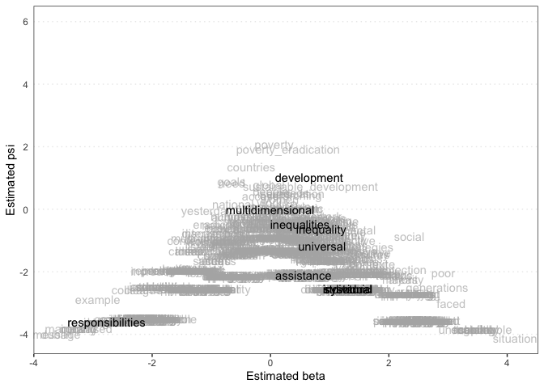
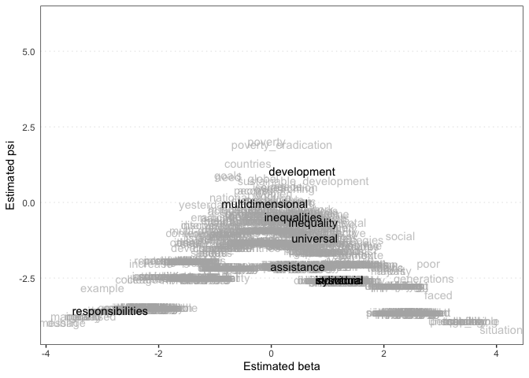
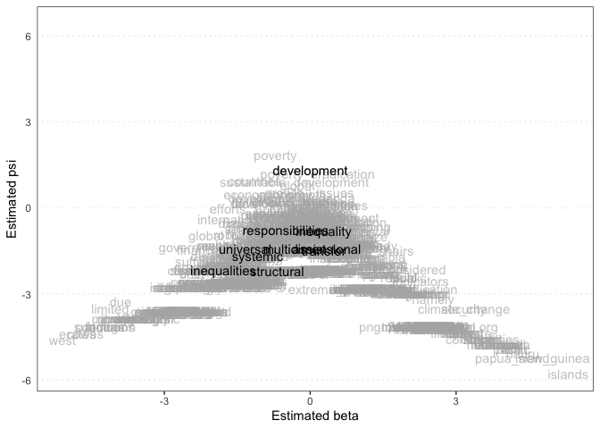
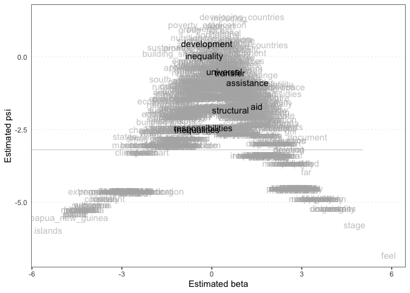
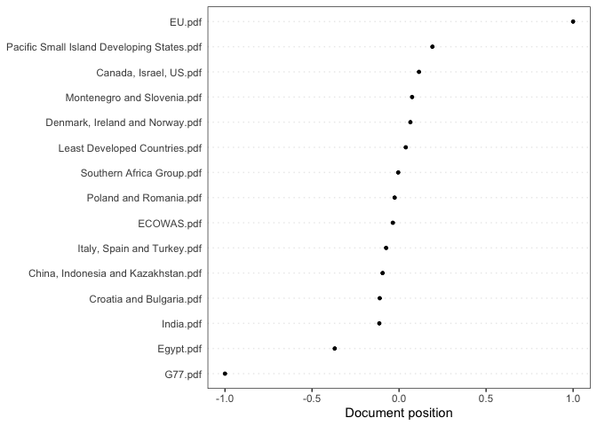
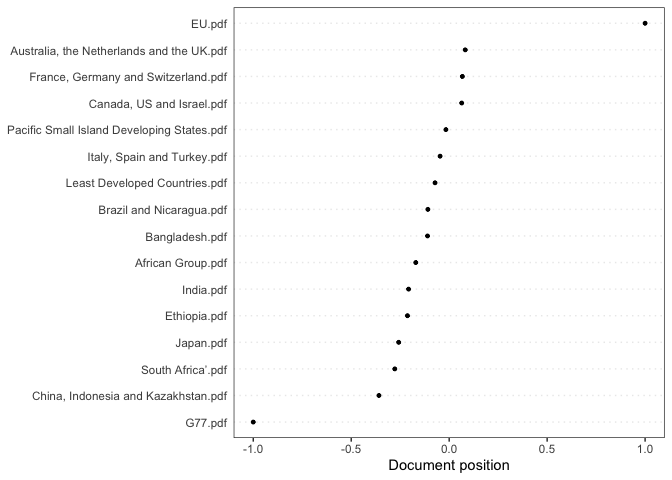

-   [1. Introduction](#introduction)
-   [2. Data](#data)
-   [3. Methods](#methods)
-   [4. Results and interpretation](#results-and-interpretation)
-   [5. Conclusion](#conclusion)

Data used in this project available at:
<https://drive.google.com/drive/folders/1kGO7K8C57PY4KkB2xyagqnUouEwFRMnM?usp=sharing>
Please download all of these folders and save this Rmd file in the same
folder in which you save them.

### 1. Introduction

The Sustainable Development Goals (SDGs) are, in many ways, a landmark, even by their own existence. Indeed, it is no small feat to get all 193 UN member states to agree to a single, comprehensive agenda, with 17 goals and 169 targets covering every area from poverty to ocean biodiversity, from reproductive rights to curbing illicit financial flows. Naturally, negotiating such an agenda was no easy feat. Many rifts hobbled the temporary body tasked with producing the list of goals and targets, called the Open Working Group for SDGs (OWG), during its 13 multi-day sessions between February 2013 and July 2014. Most, although not all, of these divisions cut across a North-South axis, as has been observed by many scholars. To take just one example, what would become SDG1, on poverty eradication, pitted North against South in different ways. Pouliot & Thérien (2019) note that Northern delegations emphasized poverty as a case of individual disempowerment, while Southern ones focused more on the structural/systemic nature of poverty (625).

Degterev (2016), in his own analysis, found that Southern donor states were more likely to side with recipient states rather than other donors (45). More specifically, he found that:

developing countries insist on providing technology and investment,
while developed countries persist in the opinion that developing
countries should create favourable conditions for attracting
investments, and that developed countries can only support them in this
endeavour and assist them in the effective use of finances. The
improvement and strengthening of internal resources, in particular, the
improvement of the tax system and the elimination of corruption are
considered to be basic measures to improve the investment climate.
Developed countries do not believe that they should be the only source
of investment and financial resources for developing ones; they also
advocate the involvement of the private sector and different
organizations (44).

These studies relied on close reading of numerous documents, and cite specific instances in countries’ official statements to support such claims. Naturally, economies of scale are not practical for such an approach: neither author cites every single instance supporting their claims, nor can they discuss every single one going against it. This raises the question: what can statistical text-based methods contribute to this scholarship? Taking a broader view than was available to such authors, and using machine learning, what might we learn about how such cleavages actually played out in practice?

Using a total of 31 official delegation statements on poverty eradication from the second and eleventh sessions of the OWG (hereinafter OWG2 and OWG11), we can specifically probe two hypotheses:

A) A broader one, based on Degterev: that Southern donors were, on the whole, closer to recipient states rather than other (Northern) donors.

B) A narrower set of hypotheses, based on both Degterev and Pouliot & Thérien, by which:

1) Northerners framed poverty as a more individual than systemic problem, while Southerners framed poverty as a more systemic than individual problem; and

2) Northerners emphasized Southerners fostering a welcoming investment environment, while Southerners emphasized Northern aid to them, irrespective of conditionalities.

After discussing data collection, I test these hypotheses through a variety of methods, looking for high-frequency compound words, searching for specific keywords in their respective contexts, and plotting the overall differences in language through both unsupervised and supervised machine learning.

Degterev’s notion of Southern solidarity as more salient than donor vs recipient divisions, especially, is satisfactorily substantiated. As to the more specific differences outlined by these authors, Pouliot & Thérien’s individual/structural dichotomy fails to find substantiation, and even finds much contradiction; while Degterev’s development responsibility spectrum is more comfortably confirmed.

### 2. Data

#### 2.1. Data selection

Many topics generated profound rifts among the 70 members of the OWG, including inequality and women’s rights, but I chose to zero in on poverty eradication because it was mentioned by these two studies of the OWG, with their focus on language, which translates well to the methods pursued below.

Another reason, however, is data availability. Each OWG session is archived on sustainabledevelopment.un.org with a plethora of documents broken down by source and topic. However, there are significant gaps: many delegations’ statements are missing from many sessions and topics. Some are retrievable through other sources: for example, both G77 statements and one EU statement cited below were found on those groups’ respective websites. As it turns out, poverty eradication was the only issue of interest to me that had a fairly comprehensive amount of available documents on more than one session. Indeed, while it was discussed in more than just these two sessions, the online archives for OWG2 (at <https://sustainabledevelopment.un.org/processes/post2015/owg/index.php?page=view&type=12&nr=481&menu=1620&event=421>) and OWG11 (<https://sustainabledevelopment.un.org/processes/post2015/owg/session11>) were the most complete.

Finally, there is the issue of which delegations to choose from. Since the main prism of this study is North vs South, I decided to have those blocs represented almost equally. Exact parity did not prove possible as many documents were unusable or unavailable, as mentioned above, resulting in 7 Northern and 8 Southern statements for OWG2, and 10 Southern vs 6 Northern for OWG11.

but who counts as Northern and Southern? Neither Pouliot & Thérien nor Degterev specify their criteria, but mine is based on the UN General Assembly’s own groupings: the Group of 77 and China (G77) counts 134 members and acts as a voice of the Global South, while the Western European and Others Group (WEOG) can stand in for the developed world. There are some omissions, as in the case of Croatia which is a member of neither, but those all fall within the EU group, which can still be considered part of the Global North. This does mean that Turkey falls into the Northern group, being a member of WEOG, which is not an exact reflection of its foreign policy positions, especially on development. However, one innovation of the OWG helps researchers: most participating countries banded into groups of two, three and sometimes four, known as “troikas”, based on their regional groups. Thus, within the scope of this study, Turkey never spoke as Turkey, but as “Italy, Spain and Turkey”, which, on the whole, can be considered to be a Global North voice. But such nuances will not be smoothed over in the discussion below, as one must rely on this North-South division but also not overly reify it, acknowledge there is some porosity within it—something, in fact, shown in the results.

As for donor vs recipient countries, I rely on Degterev’s list.

These classifications are as follows:

North:

*Australia*, the *Netherlands* and the *UK*

*Canada,* Israel, *US*

Croatia and *Bulgaria*

*Denmark,* *Ireland* and *Norway*

*EU*

*France,* *Germany* and *Switzerland*

*Italy,* *Spain* and Turkey

*Japan*

Montenegro and Slovenia

*Poland* and *Romania*

South:

African Group

Bangladesh

*Brazil* and Nicaragua

*China*, Indonesia and Kazakhstan

ECOWAS

Egypt

Ethiopia

G77

*India*

Least Developed Countries (LDCs)

Pacific Small Island Developing States (SIDS)

Southern Africa Group

*South Africa*

Italicized are the states/groups above that are also considered donors by Degterev (2016): what he calls “traditional donors”, that is, members of the OECD’s Development Assistance Committee are marked with one asterisk; and what he calls “new donors” are the BRICS and “Arab donors”, which he does not specify, but this does not apply here as, apart from Egypt (which he does not mention in his work), there are no Arab states in this list.

From OWG2’s 15 statements and OWG11’s 16, I’ve decided to create six datasets: one for each session with every document, and an additional two per session, split between North and South.

#### 2.2. Data issues, trouble-shooting and discussion

However, this does not mean there were not other problems: many documents were not readable, in the sense that one could not select, copy/paste etc. their individual characters, since they were scanned documents, not the digital originals. I thus resorted to optical character recognition (OCR) software in order to mend this, and this worked well. Another issue was language: while the vast majority of statements were in English, some were in French, and I could not find an official translation, and did not feel comfortable undertaking one myself or through automated means, since I judged this would impact the material too much: after all, the specific wordings matter a lot, and my or an AI’s choice of how to translate a word would not necessarily be this delegation’s favored one.

Another issue concerns OWG11 specifically: delegations were inconsistent as to when they discussed poverty eradication. During OWG2, there was a special meeting just on poverty eradication, but during OWG11, this focus area was discussed along with nutrition/food security. Some delegations on OWG11 have statements treating each separately, in which case I kept the former only; others discussed both together, in which case I did not interfere, given that there was no “clean” way to separate the text thematically. This means there will be some distortion on OWG11, but as seen below, I remove much of the “noise” unrelated to poverty eradication by having the code ignore certain words and phrases, as well as by using network analysis, which displays the nutrition-related keywords on an isolated branch.

Ultimately, while this sample is imperfect, for all the reasons noted above, the hope is that it can still yield useful information—and here the question of time is helpful. It is salutary that there were enough usable documents from not one, but two separate discussions on poverty eradication a little over a year apart from each other by the OWG (OWG2 was held in April 2013, OWG11 in May 2014). It is unfortunate that there could not be more overlap between the actors cited in each session, as this would have allowed for a more one-to-one comparison. Nevertheless, this sample is still large enough that one should be able to discern trends that transcend individual outliers. That is, even if the tests below reveal some unexpected proximities in the language of certain individual actors originally expected to be quite divergent, this can be tempered if they contrast from the overall trend between their respective groups. After all, a Northern and Southern delegation may very well have converged on this issue, but this proximity could also be due to superficial similarities, that is, using similar language to express different ideas. In this case, if the overall trend still shows a North-South divergence, then this outlier case does not affect interpretation too much, since broad trends are sought here. Furthermore, as seen in the network-analysis section, there are more fine-tuned analyses that can help understand such outlying cases—the previous sentence should not give the impression that they would be ignored simply for bucking the trend.

#### 2.3. Data preliminary presentation

Loading each chunk of documents, I perform a basic “clean-up” by turning the raw data into analyzable tokens, removing punctuation, stopwords, and turning everything into lowercase in order to avoid duplicates (such as “Poverty Eradication” and “poverty eradication” being considered different).

Table 1. OWG2

    ## Corpus consisting of 15 documents, showing 15 documents:
    ## 
    ##                                        Text Types Tokens Sentences
    ##                      Canada, Israel, US.pdf   343    809        31
    ##         China, Indonesia and Kazakhstan.pdf   428   1249        39
    ##                    Croatia and Bulgaria.pdf   397    923        31
    ##             Denmark, Ireland and Norway.pdf   469   1023        44
    ##                                  ECOWAS.pdf   437    934        43
    ##                                   Egypt.pdf    73   1214        65
    ##                                      EU.pdf   305    624        27
    ##                                     G77.pdf   417    940        36
    ##                                   India.pdf   449   1406        76
    ##                 Italy, Spain and Turkey.pdf   503   1142        41
    ##               Least Developed Countries.pdf   349    870        29
    ##                 Montenegro and Slovenia.pdf   281    571        17
    ##  Pacific Small Island Developing States.pdf   479   1152        45
    ##                      Poland and Romania.pdf   372    774        36
    ##                   Southern Africa Group.pdf   495   1157        34

Table 2. OWG2 North

    ## Corpus consisting of 7 documents, showing 7 documents:
    ## 
    ##                             Text Types Tokens Sentences
    ##           Canada, Israel, US.pdf   343    809        31
    ##         Croatia and Bulgaria.pdf   397    923        31
    ##  Denmark, Ireland and Norway.pdf   469   1023        44
    ##                           EU.pdf   305    624        27
    ##      Italy, Spain and Turkey.pdf   503   1142        41
    ##      Montenegro and Slovenia.pdf   281    571        17
    ##           Poland and Romania.pdf   372    774        36

Table 3. OWG2 South

    ## Corpus consisting of 8 documents, showing 8 documents:
    ## 
    ##                                        Text Types Tokens Sentences
    ##         China, Indonesia and Kazakhstan.pdf   428   1249        39
    ##                                  ECOWAS.pdf   437    934        43
    ##                                   Egypt.pdf    73   1214        65
    ##                                     G77.pdf   417    940        36
    ##                                   India.pdf   449   1406        76
    ##               Least Developed Countries.pdf   349    870        29
    ##  Pacific Small Island Developing States.pdf   479   1152        45
    ##                   Southern Africa Group.pdf   495   1157        34

Table 4. OWG11

    ## Corpus consisting of 16 documents, showing 16 documents:
    ## 
    ##                                        Text Types Tokens Sentences
    ##                           African Group.pdf   494   1173        24
    ##   Australia, the Netherlands and the UK.pdf   384    928        25
    ##                              Bangladesh.pdf   379    858        30
    ##                    Brazil and Nicaragua.pdf   609   1660        42
    ##                   Canada, US and Israel.pdf   616   1677        66
    ##         China, Indonesia and Kazakhstan.pdf   554   1710        47
    ##                                Ethiopia.pdf   362    790        22
    ##                                      EU.pdf   492   1300        46
    ##         France, Germany and Switzerland.pdf   308    794        20
    ##                                     G77.pdf   646   1841        79
    ##                                   India.pdf   598   1832        61
    ##                 Italy, Spain and Turkey.pdf   591   1527        41
    ##                                   Japan.pdf   296    607        28
    ##               Least Developed Countries.pdf   499   1264        31
    ##  Pacific Small Island Developing States.pdf   470   1289        41
    ##                           South Africa’.pdf   192    450        16

Table 5. OWG11 North:

    ## Corpus consisting of 6 documents, showing 6 documents:
    ## 
    ##                                       Text Types Tokens Sentences
    ##  Australia, the Netherlands and the UK.pdf   384    928        25
    ##                  Canada, US and Israel.pdf   616   1677        66
    ##                                     EU.pdf   492   1300        46
    ##        France, Germany and Switzerland.pdf   308    794        20
    ##                Italy, Spain and Turkey.pdf   591   1527        41
    ##                                  Japan.pdf   296    607        28

Table 6. OWG11 South:

    ## Corpus consisting of 10 documents, showing 10 documents:
    ## 
    ##                                        Text Types Tokens Sentences
    ##                           African Group.pdf   494   1173        24
    ##                              Bangladesh.pdf   379    858        30
    ##                    Brazil and Nicaragua.pdf   609   1660        42
    ##         China, Indonesia and Kazakhstan.pdf   554   1710        47
    ##                                Ethiopia.pdf   362    790        22
    ##                                     G77.pdf   646   1841        79
    ##                                   India.pdf   598   1832        61
    ##               Least Developed Countries.pdf   499   1264        31
    ##  Pacific Small Island Developing States.pdf   470   1289        41
    ##                            South Africa.pdf   192    450        16

### 3. Methods

Several approaches are deployed below to assess the multi-pronged hypotheses, all stemming from one model: Natural Language Processing, that is, the analysis of human language (in this case, written language) through AI and machine learning.

This model is both quantitative and qualitative: it aggregates information in an automated way, and can give all sorts of numerical assessments, but ultimately those only make sense inasmuch as the author interprets them. Authorial intent exists everywhere: arbitrary decisions when calibrating multiple regression analysis can severely impact the output. However, at least compared to text outcomes, once the statistical software produces an output, like a certain regression, there is limited room for interpretive maneuver—one can discuss context, missing variables, but the result itself is straightforward: this regression shows a statistically-significant correlation between A and B. There is nothing comparable here, although by making my expectations clear each time, I hope to create enough transparency to reduce the arbitrariness of interpretation, at least.

In order to make the text easier to follow, I discuss the mechanics of each method “in real time”, as I apply it, in the next section.

### 4. Results and interpretation

#### 4.1. Compound words and DFM top features

I begin with a simple search for the most common compound words in each document group with at least 5 appearances. This way, I can probe the specifics of Hypotheses B1) and B2, tracking divergences in the language of North and South across both OWG sessions.

Following Hypothesis B1, I should find more words such as “structural”, “systemic”, “multidimensional” and so on from the Southern side, and ones such as “individual”, “personal”, “person” on the Northern.

Following Hypotheses B2, I should find more words and phrases related to business and the private sector, such as “private sector”, “entrepreneur”, “investment environment” and so on from the Northern side, and related to development aid from the Southern, such as “conditionalities”, “CBDR”, “national ownership”, “aid”, “assistance” “ODA” (Official Development Assistance) and so on.

This approach, however, is limited by the fact one cannot search for specific words and phrases, and that the lists are crowded with many extraneous words

This is why I create Document-Feature Matrices (DFM) for each document group that removes several of those compound words which I find to be extraneous. That is, ones that are too common and not specifically germane to the object of study, which is specifically differences on poverty eradication, such as “sustainable development goals”, and “post-2015 framework”—as well as ones from OWG11 related to SDG2 on food, like “sustainable agriculture” and “small farmers”. The idea is that by removing such expressions that are very commonly used by all allows the language that differentiates them to stand out more. At the end of that process, I can produce a list of the most-used words by the group and enrich the compound word analysis.

In that case, however, why not only use this latter list? Because a DFM cannot (to my knowledge) produce a list of compound words, only single words, hence the two lists must complement each other. The latter list does include some compound words that the AI reads as single (with an underscore instead of space), which is a helpful accident. As such, the latter list can serve a robustness test for the conclusions drawn from the former.

This word-removal is also useful for the Wordfish and Wordscores techniques I apply later, as they look at the document groups overall, and would benefit from this greater differentiation. Naturally, the exact same list of words will be removed from every group, and words that could mark a difference deemed germane to the hypotheses will be preserved. For example, the prevalence of the word “important” does not reveal anything on its own: if Northerners used it much more than Southerners their difference will become more pronounced—but what really matters is what they find important. One might, however, object that “small farmers”, for example, are not necessarily discussed in the context of SDG2, but could be part of SDG1—but this is where the use of sources from both OWG2 and OWG11 helps: the fact that references to food and farming only appear in OWG11 documents and not in OWG2 strongly indicates that they pertained to a discussion of SDG2, which is absent from OWG2.

#### 4.1.1. North

Table 7. OWG2 North most common compound words:

    ##                collocation count count_nested length    lambda         z
    ## 1      poverty eradication    51            0      2  5.765093 17.521161
    ## 2  sustainable development    23            0      2  6.484650 14.457213
    ## 3            working group     7            0      2  7.730648  9.971611
    ## 4      post-2015 framework     6            0      2  6.164449  9.688875
    ## 5          economic growth     5            0      2  6.658011  9.442887
    ## 6        natural resources     6            0      2  8.268133  8.375483
    ## 7        development goals     5            0      2  3.551338  7.073986
    ## 8           united nations     7            0      2 10.977038  6.559835
    ## 9             open working     6            0      2  9.734983  6.315244
    ## 10         extreme poverty     6            0      2  5.398685  5.927342
    ## 11       eradicate poverty     5            0      2  5.222782  5.640174

Table 8. OWG2 North DFM without extraneous words, top features list:

    ##                                         poverty     poverty_eradication 
    ##                    2880                      57                      51 
    ##               countries             development                   goals 
    ##                      29                      24                      21 
    ##                    need sustainable_development                  global 
    ##                      20                      18                      16 
    ##             eradication                   needs                  people 
    ##                      13                      13                      13 
    ##                  social             overarching                  issues 
    ##                      13                      12                      12 
    ##               yesterday                  access                national 
    ##                      11                      11                      10 
    ##                   women                    like                    work 
    ##                      10                       9                       9 
    ##                   basic                  states                    make 
    ##                       9                       8                       8 
    ##                 support             sustainable                  living 
    ##                       8                       8                       8 
    ##                  income               including               education 
    ##                       8                       8                       8 
    ##        multidimensional                 reflect                  hunger 
    ##                       7                       7                       7 
    ##                 efforts              vulnerable                economic 
    ##                       7                       7                       7 
    ##                    poor                 aspects                   order 
    ##                       7                       7                       6 
    ##                  number                    goal                   issue 
    ##                       6                       6                       6 
    ##                  nature               indicator           international 
    ##                       6                       6                       6 
    ##             achievement                coherent                   human 
    ##                       6                       6                       6 
    ##                  gender           environmental 
    ##                       6                       6

Table 9. OWG11 North most common compound words:

    ##                collocation count count_nested length   lambda         z
    ## 1  sustainable development    17            0      2 5.923432 14.203698
    ## 2            food security    16            0      2 6.892343 13.221727
    ## 3              focus areas    14            0      2 6.309376 11.887558
    ## 4               focus area    19            0      2 7.224977 11.821886
    ## 5            working group     8            0      2 6.953684 11.144995
    ## 6          economic growth     7            0      2 6.717295 10.720747
    ## 7  sustainable agriculture    10            0      2 6.251820 10.561552
    ## 8             open working     7            0      2 7.573458 10.188662
    ## 9            people living     5            0      2 6.926684  9.232154
    ## 10      nutrition security     5            0      2 5.224069  9.148649
    ## 11     poverty eradication    20            0      2 7.638619  8.891334
    ## 12    developing countries     6            0      2 7.689428  8.129187
    ## 13       poverty reduction     5            0      2 4.933399  7.603398
    ## 14         extreme poverty     8            0      2 6.519508  7.279208
    ## 15       social protection     9            0      2 9.755904  6.520267

Table 10. OWG11 North DFM without extraneous words, top features list:

    ##                                         poverty     poverty_eradication 
    ##                    2880                      55                      51 
    ##               countries             development                   goals 
    ##                      27                      24                      21 
    ##                    need sustainable_development                  global 
    ##                      20                      18                      16 
    ##             eradication                   needs             overarching 
    ##                      13                      13                      12 
    ##                  issues               yesterday                  people 
    ##                      12                      11                      11 
    ##                  social                  access                national 
    ##                      11                      11                      10 
    ##                   women                    like                    work 
    ##                      10                       9                       9 
    ##                   basic                  states                    make 
    ##                       9                       8                       8 
    ##                 support             sustainable                  income 
    ##                       8                       8                       8 
    ##               including               education        multidimensional 
    ##                       8                       8                       7 
    ##                 reflect                  hunger                 efforts 
    ##                       7                       7                       7 
    ##              vulnerable                economic                    poor 
    ##                       7                       7                       7 
    ##                 aspects                   order                  number 
    ##                       7                       6                       6 
    ##                    goal                   issue                  nature 
    ##                       6                       6                       6 
    ##               indicator           international             achievement 
    ##                       6                       6                       6 
    ##                coherent                   human                  living 
    ##                       6                       6                       6 
    ##                  gender           environmental 
    ##                       6                       6

None of the expected words have materialized, although the 7 mentions of “multidimensional” in Table 8 are an interesting counter to B1, and also perhaps the 12 of “overarching”—but this will require more fine-tuned observation before such a conclusion can be drawn.

#### 4.1.2. South

Table 11. OWG2 South most common compound words

    ##                collocation count count_nested length    lambda         z
    ## 1  sustainable development    30            0      2  6.379671 16.410720
    ## 2          economic growth    15            0      2  6.416338 14.415625
    ## 3      poverty eradication    27            0      2  6.861763 11.837939
    ## 4     developing countries    10            0      2  6.185557 11.625522
    ## 5       development agenda    12            0      2  5.989373 10.611128
    ## 6        development goals     9            0      2  5.156143 10.226467
    ## 7            working group     6            0      2  7.606465  9.501291
    ## 8       global partnership     5            0      2  6.963313  8.731574
    ## 9          extreme poverty     7            0      2  6.166383  6.847631
    ## 10              new guinea     7            0      2  9.930223  6.565960
    ## 11               papua new     7            0      2  9.930223  6.565960
    ## 12               co chairs     5            0      2 10.239669  6.518454
    ## 13            open working     5            0      2 10.239669  6.518454
    ## 14                new york     6            0      2  9.644021  6.376720
    ## 15          united nations     6            0      2 12.352858  6.060890
    ## 16          climate change     5            0      2 12.185916  5.958950
    ## 17       eradicate poverty     7            0      2  7.265108  4.961393

Already an interesting difference here is the more frequent mention of “developing countries” and “development” in general than tables 7 or 8. This could be considered to reinforce Hypothesis B2, but only in a very preliminary level.

Table 12. OWG2 South DFM without extraneous words, top features list:

    ##                                         poverty             development 
    ##                    5063                      59                      31 
    ##               countries     poverty_eradication sustainable_development 
    ##                      29                      28                      21 
    ##                  global                  issues                 efforts 
    ##                      18                      17                      16 
    ##                  growth                    ldcs         economic_growth 
    ##                      15                      15                      15 
    ##                national                economic                   group 
    ##                      14                      14                      13 
    ##                  social                  states                    poor 
    ##                      13                      13                      12 
    ##                 islands      development_agenda                    work 
    ##                      12                      12                      11 
    ##               including                  levels                  people 
    ##                      11                      11                      11 
    ##             sustainable                  access           international 
    ##                      10                      10                      10 
    ##           opportunities    developing_countries          implementation 
    ##                      10                      10                       9 
    ##                 process                  health                       = 
    ##                       9                       9                       9 
    ##                   china                    fiji              principles 
    ##                       8                       8                       8 
    ##               principle                  member                   areas 
    ##                       8                       8                       8 
    ##                   needs                    need                capacity 
    ##                       8                       8                       8 
    ##                  nature               permanent                   state 
    ##                       8                       8                       8 
    ##                  income                  living                    like 
    ##                       8                       8                       7 
    ##              priorities                   goals 
    ##                       7                       7

No words or compounds here hint at the structural theme cited by Hypothesis B1, except perhaps for the focus on “needs”, although that is a thin connection. One interesting difference is terms such as “principle” and “priorities” (the principle of CDBR?) that might be connected, in their due context, to something useful to a hypothesis, and such words can be flagged for the keywords-in-context search below.

Table 13. OWG11 South most common compound words:

    ##                        collocation count count_nested length    lambda
    ## 1          sustainable agriculture    35            0      2  5.828985
    ## 2             developing countries    60            0      2  8.150076
    ## 3              poverty eradication    34            0      2  7.555457
    ## 4                       focus area    61            0      2  8.870553
    ## 5                 working document    14            0      2  6.487606
    ## 6          sustainable development    16            0      2  5.066386
    ## 7                    food security    34            0      2  7.744575
    ## 8             productive resources    10            0      2  6.933462
    ## 9                  building shared    13            0      2  8.306979
    ## 10             developed countries    25            0      2  6.864029
    ## 11                 economic growth    10            0      2  7.187969
    ## 12                   working group    10            0      2  5.188682
    ## 13                  climate change     9            0      2  7.967735
    ## 14                 adequate policy     8            0      2  6.722153
    ## 15                   member states    11            0      2  8.777908
    ## 16              promoting equality    15            0      2  8.758245
    ## 17                   small farmers     9            0      2  8.587008
    ## 18              financial services     8            0      2  8.391600
    ## 19                     focus areas    19            0      2  7.211183
    ## 20            rural infrastructure     5            0      2  7.320215
    ## 21               natural disasters     5            0      2  8.040776
    ## 22               capacity building     5            0      2  6.798128
    ## 23                current document     5            0      2  5.798508
    ## 24       agricultural productivity     5            0      2  5.907122
    ## 25               rural development     5            0      2  5.481743
    ## 26                   african group     7            0      2  6.783481
    ## 27                     decent work     6            0      2  8.786786
    ## 28                       food loss     9            0      2  6.413902
    ## 29               social protection     5            0      2  8.508506
    ## 30 differentiated responsibilities     5            0      2 10.354956
    ## 31                      food waste     5            0      2  4.862444
    ## 32                      food price     6            0      2  5.997371
    ## 33                 extreme poverty     5            0      2  6.077937
    ## 34               shared prosperity    15            0      2 11.978056
    ## 35                    policy space    10            0      2 10.800290
    ## 36                price volatility     8            0      2 11.888731
    ## 37                        per cent     7            0      2 10.664799
    ## 38                  excessive food     5            0      2  6.329173
    ## 39                  united nations     7            0      2 10.296919
    ## 40                      new guinea     6            0      2  9.885476
    ## 41                       papua new     6            0      2  9.885476
    ## 42                    south africa     9            0      2 13.098569
    ## 43                    open working     9            0      2  9.433527
    ## 44                        new york     5            0      2  9.607197
    ## 45                trade distorting     5            0      2  9.607197
    ## 46                    supply chain     7            0      2 12.862335
    ## 47            distorting subsidies     5            0      2  9.507035
    ## 48                     global rate     6            0      2  9.054271
    ## 49               productive assets     5            0      2  8.995664
    ## 50           agricultural products     5            0      2  8.472540
    ## 51                     food supply     7            0      2  7.762262
    ## 52               smart agriculture     5            0      2  7.672069
    ##            z
    ## 1  20.222578
    ## 2  17.254224
    ## 3  16.445168
    ## 4  15.353532
    ## 5  14.911431
    ## 6  14.568645
    ## 7  13.418157
    ## 8  13.329782
    ## 9  13.107686
    ## 10 13.094874
    ## 11 12.490180
    ## 12 12.436709
    ## 13 12.397735
    ## 14 12.108524
    ## 15 12.096304
    ## 16 11.868085
    ## 17 11.632763
    ## 18 11.617353
    ## 19 10.575380
    ## 20 10.550870
    ## 21 10.199822
    ## 22 10.009581
    ## 23  9.796828
    ## 24  9.715969
    ## 25  9.563832
    ## 26  9.094087
    ## 27  9.071385
    ## 28  8.912324
    ## 29  8.712018
    ## 30  8.412190
    ## 31  8.245948
    ## 32  7.971411
    ## 33  7.863638
    ## 34  7.629809
    ## 35  7.157166
    ## 36  7.124762
    ## 37  6.948624
    ## 38  6.822784
    ## 39  6.808474
    ## 40  6.558952
    ## 41  6.558952
    ## 42  6.464713
    ## 43  6.423725
    ## 44  6.352556
    ## 45  6.352556
    ## 46  6.326529
    ## 47  6.300149
    ## 48  6.097178
    ## 49  6.011771
    ## 50  5.691790
    ## 51  5.299143
    ## 52  5.175845

Table 14. OWG11 South DFM without extraneous words, top features list:

    ##       developing_countries                  including 
    ##                         60                         46 
    ##                      group        poverty_eradication 
    ##                         35                         34 
    ##                       like                    support 
    ##                         33                         33 
    ##                    poverty                  nutrition 
    ##                         31                         28 
    ##                     access                   national 
    ##                         28                         27 
    ##                     ensure                    propose 
    ##                         26                         25 
    ##        developed_countries               agricultural 
    ##                         25                         24 
    ##                       ldcs                      means 
    ##                         23                         22 
    ##                sustainable                       need 
    ##                         21                         21 
    ##                   specific             implementation 
    ##                         21                         21 
    ##                     global              international 
    ##                         20                         19 
    ##                   policies                development 
    ##                         19                         18 
    ##                       goal                      women 
    ##                         18                         18 
    ##                   economic                      point 
    ##                         18                         18 
    ##                      china                      goals 
    ##                         18                         17 
    ##                     reduce                   adequate 
    ##                         17                         17 
    ##    sustainable_development                          b 
    ##                         17                         16 
    ##                       poor                 especially 
    ##                         16                         16 
    ##         promoting_equality                    achieve 
    ##                         16                         15 
    ##                  countries                   increase 
    ##                         15                         14 
    ##                    however building_shared_prosperity 
    ##                         14                         14 
    ##           working_document                        may 
    ##                         14                         13 
    ##                  principle                          e 
    ##                         13                         13 
    ##                    markets                       land 
    ##                         13                         13 
    ##                 vulnerable                       call 
    ##                         13                         13

The Southern OWG11 tables are the most different yet, with previously-unseen phrases such as “promoting equality” and “building shared prosperity” connecting somewhat to B1, as both hints at fighting inequality, a more structural challenge than poverty eradication. Some strong connections to B2 emerge in the form of “differentiated responsibilities”, which is half of “common but differentiated responsibilities” (CBDR), a controversial notion defended by the South and contested by the North according to which, while all states have common goals, they have different levels of responsibility in achieving them depending on their capacities. This was originally deployed regarding environmental politics, emphasizing the need for the North to shoulder most of the burden of it, including though aid to the South—and here, applied to poverty eradication or food, it is not extraneous to consider it relevant as putting the onus for development on Northern assistance to the South. However, is this related to SDG1 or 2? Keywords in context below will explore this.

Ultimately, then, these first methods have proven quite limited at assessing Hypotheses B1 and B2, although they do give some indications as to their saliency. That is, limited though any findings have been so far, they point the way forward by providing a list of words to probe through the keywords-in-context mechanic. Notable absences especially are words “structural”, “systemic”, “private”, "entrepreneur\*" “aid” and “assistance”, all of which will be explored more closely below.

#### 4.2. Keywords-in-context (KWIC)

This method finds inputed keywords in the documents and provides their specific source and surrounding context (few words before and after). This is a rudimentary tool, but still a useful one as it fills many of the gaps left by the two used in the previous section. Indeed, while they could reveal much about groups of text in general, one cannot disaggregate the data: click on “multidimensional” and see which countries, exactly, used it, and in what context.

Table 15. KWIC: Multidimensional8 (OWG2)

    ## Keyword-in-context with 10 matches.                                                                   
    ##        [Canada, Israel, US.pdf, 202]              poverty complex |
    ##        [Canada, Israel, US.pdf, 415]                    agreement |
    ##        [Canada, Israel, US.pdf, 437]                 want capture |
    ##      [Croatia and Bulgaria.pdf, 708]       comprehensive approach |
    ##                        [EU.pdf, 225]                  last decade |
    ##   [Italy, Spain and Turkey.pdf, 373] Poverty eradication requires |
    ##  [Italy, Spain and Turkey.pdf, 1032]                pillars fight |
    ##  [Least Developed Countries.pdf, 95]               Poverty hunger |
    ##   [Montenegro and Slovenia.pdf, 242]             truly eradicated |
    ##     [Southern Africa Group.pdf, 324] Poverty eradication requires |
    ##                                                                 
    ##   multidimensional   | phenomenon need                          
    ##   multidimensional   | nature poverty Dr                        
    ##  multidimensionality | goal indicator framework                 
    ##   multidimensional   | character poverty                        
    ##   multidimensional   | aspect poverty Differences               
    ##   multidimensional   | approach capable address                 
    ##   multidimensional   | poverty progress                         
    ##   multidimensional   | problems pose serious constraints        
    ##   multidimensional   | nature relation income                   
    ##   multidimensional   | approach cutting across relevant thematic

Table 16. KWIC: Multidimensional\* (OWG11)

    ## Keyword-in-context with 6 matches.                                                                       
    ##           [Canada, US and Israel.pdf, 1244]           targets capture |
    ##  [France, Germany and Switzerland.pdf, 146]   living standards median |
    ##  [France, Germany and Switzerland.pdf, 334]                Work Given |
    ##          [Italy, Spain and Turkey.pdf, 416]                      true |
    ##          [Italy, Spain and Turkey.pdf, 805] possibility incorporating |
    ##          [Italy, Spain and Turkey.pdf, 837]            increase usage |
    ##                                                             
    ##   multidimensional   | nature food security                 
    ##   Multidimensional   | Poverty Index                        
    ##  multidimensionality | poverty                              
    ##   multidimensional   | approach based principle             
    ##   multidimensional   | index poverty                        
    ##   multidimensional   | poverty measurement methodology carry

In both OWG2 and OWG11, we see not only Northern states primarily using either “multidimensional” or “multidimensionality” (even monopolizing their use during OWG11), but they are doing so clearly in relation to poverty (this is worth noting due to OWG11’s dual thematic). Even more, as the contexts further reveal, they betray a “complex” (Canada, US and Israel, OWG2) and even “comprehensive approach” (Croatia and Bulgaria, OWG2). This Northern substantive connection to the more broad-ranging aspect of poverty, and the lack of Southern use of “multidimensional” and “multidimensionality”, is a point in contention of hypothesis B1.

Table 17. KWIC: Structural (OWG2)

    ## Keyword-in-context with 2 matches.                                                                         
    ##  [China, Indonesia and Kazakhstan.pdf, 944] robust discussions systemic |
    ##          [Italy, Spain and Turkey.pdf, 404]             poverty product |
    ##                                                  
    ##  structural | impediments sustainable development
    ##  structural | imbalances development processes

Table 18. KWIC: Structural (OWG11)

    ## Keyword-in-context with 2 matches.                                                                               
    ##  [Brazil and Nicaragua.pdf, 624]           acknowledged priority | structural |
    ##                  [G77.pdf, 1581] food price volatility including | structural |
    ##                                 
    ##  dimension Post-2015 Development
    ##  causes must addressed

Very few uses of anything “structural”, mostly Southern, but it is still notable to find Italy, Spain and Turkey in OWG2 explicitly framing poverty as structural.

Table 19. KWIC: Systemic (OWG2)

    ## Keyword-in-context with 3 matches.                                                                             
    ##  [China, Indonesia and Kazakhstan.pdf, 942] also include robust discussions |
    ##          [Italy, Spain and Turkey.pdf, 390]     underlying causes including |
    ##        [Least Developed Countries.pdf, 651]            populations problems |
    ##                                               
    ##  systemic | structural impediments sustainable
    ##  systemic | institutional issues              
    ##  systemic | nature

Table 20. KWIC: Systemic (OWG11)

    ## Keyword-in-context with 0 matches.

No mention of “systemic” in OWG11, interestingly, despite it containing one more document than OWG2. Italy, Spain and Turkey emerge again as a lone Northern troika willing to address the “underlying causes” of poverty, including its “institutional” aspect. If one considers Turkey as Southern, these results could be contested as a result of its influence. But this would imply hypothesis B1 is inherently likely to be correct, of which there is no clear indication yet.

Table 21. KWIC: Overarching (OWG2)

    ## Keyword-in-context with 17 matches.                                                  
    ##                      [Canada, Israel, US.pdf, 112]
    ##                      [Canada, Israel, US.pdf, 386]
    ##         [China, Indonesia and Kazakhstan.pdf, 318]
    ##         [China, Indonesia and Kazakhstan.pdf, 569]
    ##        [China, Indonesia and Kazakhstan.pdf, 1013]
    ##                    [Croatia and Bulgaria.pdf, 407]
    ##                    [Croatia and Bulgaria.pdf, 767]
    ##                                      [EU.pdf, 422]
    ##                                  [India.pdf, 1038]
    ##                 [Italy, Spain and Turkey.pdf, 102]
    ##                 [Italy, Spain and Turkey.pdf, 183]
    ##                [Italy, Spain and Turkey.pdf, 1074]
    ##                 [Montenegro and Slovenia.pdf, 207]
    ##                 [Montenegro and Slovenia.pdf, 313]
    ##                 [Montenegro and Slovenia.pdf, 327]
    ##  [Pacific Small Island Developing States.pdf, 205]
    ##                      [Poland and Romania.pdf, 114]
    ##                                                
    ##         see poverty eradication | overarching |
    ##     address poverty eradication | overarching |
    ##         three explanatory notes | overarching |
    ##                          regard | overarching |
    ##  underlined poverty eradication | overarching |
    ##                      views post | overarching |
    ##                          hunger | overarching |
    ##           need design ambitious | overarching |
    ##                         follows | overarching |
    ##             poverty eradication | overarching |
    ##             poverty eradication | overarching |
    ##             poverty eradication | overarching |
    ##                 building future | overarching |
    ##                    view towards | overarching |
    ##     poverty eradication efforts | overarching |
    ##             poverty eradication | overarching |
    ##            welcomes recognition | overarching |
    ##                                           
    ##  core essential starting                  
    ##  issue subcomponent                       
    ##  framework cross-sectoral issues          
    ##  framework SDGs                           
    ##  objectives sustainable development       
    ##  framework Croatia Bulgaria               
    ##  objective development assistance policies
    ##  post-2015 framework uses                 
    ##  objective must end                       
    ##  priority true objective                  
    ##  goal SDGs can                            
    ##  objective context                        
    ##  post-2015 framework poverty eradication  
    ##  post-2015 framework o                    
    ##  post-2015 framework whole                
    ##  concern intertwined                      
    ##  objective poverty eradication

Table 22. KWIC: Overarching (OWG11)

    ## Keyword-in-context with 2 matches.                                                                         
    ##       [Brazil and Nicaragua.pdf, 178] eradication poverty | overarching |
    ##  [Least Developed Countries.pdf, 249]  poverty standalone | overarching |
    ##                  
    ##  stand alone goal
    ##  goal SDGs

Another interesting difference between OWG sessions: in the latter, only two mentions, and both discussing poverty eradication’s status as a “standalone goal”. Meanwhile, 17 mentions from a diverse set of troikas during OWG2, when SDGs were as yet undefined. But there is very little even in OWG2 about poverty reduction itself, and more about its role in the agenda, with mentions of “framework SDGs”, “post-2015\_framework”, and so on. Nothing, then, clearly connected to B1.

Table 23. KWIC: Inequality (OWG2)

    ## Keyword-in-context with 9 matches.                                                                              
    ##  [China, Indonesia and Kazakhstan.pdf, 953]                  development led |
    ##                           [India.pdf, 1256]                  twin challenges |
    ##                           [India.pdf, 1278]                   can hardy deal |
    ##          [Italy, Spain and Turkey.pdf, 971]           lower degrees economic |
    ##          [Italy, Spain and Turkey.pdf, 981]        often accompanied growing |
    ##          [Montenegro and Slovenia.pdf, 135]                          Poverty |
    ##          [Montenegro and Slovenia.pdf, 151]                    Divided Stand |
    ##          [Montenegro and Slovenia.pdf, 165]             global trend growing |
    ##            [Southern Africa Group.pdf, 458] continued economic growth income |
    ##                                        
    ##  inequality | within among countries   
    ##  inequality | poverty Without raising  
    ##  inequality | effective manner         
    ##  inequality | Sustained economic growth
    ##  inequality | within countries growing 
    ##  inequality | issue Latest reports     
    ##  Inequality | Keeps Rising December    
    ##  inequality | want                     
    ##  inequality | unemployment access

Table 24. KWIC: Inequality (OWG11)

    ## Keyword-in-context with 21 matches.                                           
    ##             [Brazil and Nicaragua.pdf, 581]
    ##             [Brazil and Nicaragua.pdf, 748]
    ##            [Canada, US and Israel.pdf, 607]
    ##            [Canada, US and Israel.pdf, 828]
    ##                               [EU.pdf, 403]
    ##                               [EU.pdf, 550]
    ##                               [EU.pdf, 557]
    ##  [France, Germany and Switzerland.pdf, 225]
    ##                              [G77.pdf, 385]
    ##                              [G77.pdf, 399]
    ##                              [G77.pdf, 406]
    ##                              [G77.pdf, 437]
    ##                              [G77.pdf, 454]
    ##                              [G77.pdf, 496]
    ##                              [G77.pdf, 503]
    ##                             [G77.pdf, 1560]
    ##          [Italy, Spain and Turkey.pdf, 282]
    ##          [Italy, Spain and Turkey.pdf, 933]
    ##          [Italy, Spain and Turkey.pdf, 981]
    ##        [Least Developed Countries.pdf, 387]
    ##                     [South Africa’.pdf, 67]
    ##                                                         
    ##     recall several delegations requesting | inequality |
    ##                    additional item income | inequality |
    ##             hard-wiring commitment combat | inequality |
    ##                concept incorporate Rising | inequality |
    ##                               need ensure | inequality |
    ##  inclusive sustainable development Gender | inequality |
    ##                            pervasive form | inequality |
    ##                         target addressing | inequality |
    ##                                focus area | inequality |
    ##        poverty eradication national-level | inequality |
    ##                         industrialization | inequality |
    ##                single Focus Area reducing | inequality |
    ##              though concept international | inequality |
    ##                               Group focus | inequality |
    ##                            nations target | inequality |
    ##          nutrition threatened reinforcing | inequality |
    ##            importance properly addressing | inequality |
    ##                   speak poverty reduction | inequality |
    ##                       countries must deal | inequality |
    ##                            position issue | inequality |
    ##                            well combating | inequality |
    ##                              
    ##  strengthened                
    ##  reading follows             
    ##  reduce vulnerability        
    ##  undermines poverty reduction
    ##  access services             
    ##  pervasive form              
    ##  around world                
    ##  goal                        
    ##  merged                      
    ##  industrialization           
    ##  among nations               
    ##                              
    ##  included                    
    ##  among nations target        
    ##  among nations need          
    ##  exacerbating poverty        
    ##  access services             
    ##  poverty relative            
    ##  must consolidate progress   
    ##  better suit within          
    ##  levels essential

As mentioned in the discussion of Table 14, inequality could serve as a sign of greater concern for the structural root causes of poverty. In both sessions, the word is often used by Northern delegations, and clearly in relation to poverty (e.g. “undermines poverty reduction”, from Canada, US and Israel in OWG11) and the mechanics by which it does so (e.g. the EU’s OWG11 mention of inequality in “acess to services”).

Table 25. KWIC: Private (OWG2)

    ## Keyword-in-context with 2 matches.                                                                      
    ##              [ECOWAS.pdf, 369]            countries result | private |
    ##  [Poland and Romania.pdf, 761] organizations civil society | private |
    ##                                     
    ##  investments job creationwere rather
    ##  sector joining hands make

Table 26. KWIC: Private (OWG11)

    ## Keyword-in-context with 2 matches.                                                                
    ##            [EU.pdf, 1030] across countries including | private |
    ##  [South Africa’.pdf, 252]    including civil society | private |
    ##                                    
    ##  sector philanthropic organizations
    ##  sector obligation

These four mentions of the private sector or private investments are evenly split across North and South, being too few to draw any robust conclusion from, but still suggesting that this sort of language was cross-cutting.

Table 27. Aid (OWG2)

    ## Keyword-in-context with 0 matches.

Table 28. Aid (OWG11)

    ## Keyword-in-context with 4 matches.                                                                     
    ##                    [African Group.pdf, 1119] conditions loans | aid |
    ##             [Brazil and Nicaragua.pdf, 1651] conditions loans | aid |
    ##  [China, Indonesia and Kazakhstan.pdf, 1559] conditions loans | aid |
    ##                            [India.pdf, 1784] conditions loans | aid |
    ##                     
    ##  support agriculture
    ##  thank              
    ##  support agriculture
    ##  support agriculture

Despite these mentions being overwhelmingly related to agriculture, they are universally Southern and connected to the question of loans conditionalities, which is related to B2’s contention about this being an overarching concern of the South regarding development, but not so much the North. This is also closely tied to hypothesis A, positing a greater closeness between Southern donors (here Brazil, China and India) and recipients than between Southern and Northern donors.

Table 29. Assist\* (OWG2)

    ## Keyword-in-context with 3 matches.                                                                     
    ##   [Croatia and Bulgaria.pdf, 771] overarching objective development |
    ##                    [G77.pdf, 729]            development strategies |
    ##  [Southern Africa Group.pdf, 641]            objectives combination |
    ##                                     
    ##  assistance | policies new framework
    ##    assist   | poor policies         
    ##    assist   | ensuring integration

Table 30. Assist\* (OWG11)

    ## Keyword-in-context with 7 matches.                                           
    ##                    [African Group.pdf, 590]
    ##            [Brazil and Nicaragua.pdf, 1033]
    ##            [Brazil and Nicaragua.pdf, 1057]
    ##            [Brazil and Nicaragua.pdf, 1084]
    ##  [China, Indonesia and Kazakhstan.pdf, 872]
    ##                           [India.pdf, 1319]
    ##       [Least Developed Countries.pdf, 1048]
    ##                                                         
    ##  financing developing countries requiring | assistance |
    ##                  GNI official development | assistance |
    ##                  GNI official development | assistance |
    ##  financing developing countries requiring | assistance |
    ##                  GNI official development | assistance |
    ##  financing developing countries requiring | assistance |
    ##                       expand enhance food | assistance |
    ##                                        
    ##  implement poverty eradication policies
    ##  ODA developing                        
    ##  least developed countries             
    ##  implement poverty reduction policies  
    ##  ODA developing                        
    ##  implement poverty reduction policies  
    ##  safety net programmes

With the only exception being Croatia and Bulgaria in OWG2, every mention of “assist” or “assistance” was Southern and almost always related to development financing, strengthening B2, as well as hypothesis A, as we see Southern donors (Brazil, China, India) siding with Southern recipients.

Table 31. KWIC: Priorit\* (OWG2)

    ## Keyword-in-context with 21 matches.                                                  
    ##         [China, Indonesia and Kazakhstan.pdf, 263]
    ##         [China, Indonesia and Kazakhstan.pdf, 271]
    ##         [China, Indonesia and Kazakhstan.pdf, 478]
    ##         [China, Indonesia and Kazakhstan.pdf, 484]
    ##        [China, Indonesia and Kazakhstan.pdf, 1203]
    ##                    [Croatia and Bulgaria.pdf, 331]
    ##                                      [EU.pdf, 351]
    ##                                     [G77.pdf, 711]
    ##                                   [India.pdf, 443]
    ##                                   [India.pdf, 656]
    ##                                  [India.pdf, 1301]
    ##                 [Italy, Spain and Turkey.pdf, 103]
    ##                [Italy, Spain and Turkey.pdf, 1083]
    ##               [Least Developed Countries.pdf, 481]
    ##                 [Montenegro and Slovenia.pdf, 217]
    ##  [Pacific Small Island Developing States.pdf, 473]
    ##                       [Poland and Romania.pdf, 81]
    ##                      [Poland and Romania.pdf, 149]
    ##                      [Poland and Romania.pdf, 397]
    ##                   [Southern Africa Group.pdf, 786]
    ##                   [Southern Africa Group.pdf, 952]
    ##                                                        
    ##                mapping exercise thematic |  priority  |
    ##                development agenda urgent | priorities |
    ##             respecting national policies | priorities |
    ##                                   regard |  priority  |
    ##              includes agendas principles | priorities |
    ##                      need accord highest |  priority  |
    ##                      stop acting current | priorities |
    ##                            line national | priorities |
    ##                        upon give highest |  priority  |
    ##                           effort However |  priority  |
    ##                             tailor needs | priorities |
    ##          poverty eradication overarching |  priority  |
    ##                                  context |  priority  |
    ##                             area poverty |  priority  |
    ##                  eradication remain core |  priority  |
    ##                       education accorded |  priority  |
    ##  poverty eradication constitutes highest |  priority  |
    ##              stop implementation current | priorities |
    ##                       SDGs consider main | priorities |
    ##                            Chairs regard | priorities |
    ##                  local national regional | priorities |
    ##                                          
    ##  issues development agenda               
    ##  OWG deliberations                       
    ##  regard                                  
    ##  areas also reiterated                   
    ##  means implementation                    
    ##  poverty eradication within              
    ##  MDGs                                    
    ##  circumstances                           
    ##  achieving poverty eradication           
    ##  must income generation                  
    ##  according circumstances                 
    ##  true objective                          
    ##  areas working group                     
    ##  guided                                  
    ##  needs                                   
    ##  whilst important elements               
    ##  within United Nations development agenda
    ##  goals need                              
    ##  facilitate achieving                    
    ##  SDGs thematic                           
    ##  levels interventions

Table 32. KWIC: Priorit\* (OWG11)

    ## Keyword-in-context with 5 matches.                                                                            
    ##  [Australia, the Netherlands and the UK.pdf, 180] forms remains overriding |
    ##                   [Brazil and Nicaragua.pdf, 621]      become acknowledged |
    ##                                   [G77.pdf, 1059]            account needs |
    ##                [Italy, Spain and Turkey.pdf, 190]             States agree |
    ##                                  [Japan.pdf, 363] eradication given utmost |
    ##                                      
    ##   priority  | post-2015 agenda       
    ##   priority  | structural dimension   
    ##  priorities | developing countries   
    ##  priorities | sustainable development
    ##   priority  | among Subarea e

None of these uses of “Priority” or “Priorities” relates directly to any hypothesis, and they seem quite aligned in meaning and regionally-diverse overall.

Table 33. KWIC: Responsibilit\* (OWG2)

    ## Keyword-in-context with 10 matches.                                                                             
    ##                    [African Group.pdf, 248] principle common differentiated |
    ##                       [Bangladesh.pdf, 159]             common differential |
    ##  [China, Indonesia and Kazakhstan.pdf, 278] principle common differentiated |
    ##  [China, Indonesia and Kazakhstan.pdf, 594] principle Common Differentiated |
    ##                              [EU.pdf, 1010]                primacy national |
    ##                              [EU.pdf, 1024]  spectrum respective capacities |
    ##                              [G77.pdf, 291] principle Common Differentiated |
    ##                             [G77.pdf, 1392]            developing countries |
    ##                            [India.pdf, 369] principle Common Differentiated |
    ##                    [South Africa’.pdf, 169]         international community |
    ##                                                                     
    ##  responsibilities | well different                                  
    ##  responsibilities | equity consideration                            
    ##  responsibilities | CBDR                                            
    ##  Responsibilities | CBDR Sustained                                  
    ##   responsibility  | sustainable development accurately              
    ##  responsibilities | across countries including                      
    ##  Responsibilities | CBDR                                            
    ##   responsibility  | order reflect                                   
    ##  Responsibilities | CBDR reflected                                  
    ##   responsibility  | implement internationally agreed poverty-related

Table 34. KWIC: Responsibilit\* (OWG11)

    ## Keyword-in-context with 10 matches.                                                                             
    ##                    [African Group.pdf, 248] principle common differentiated |
    ##                       [Bangladesh.pdf, 159]             common differential |
    ##  [China, Indonesia and Kazakhstan.pdf, 278] principle common differentiated |
    ##  [China, Indonesia and Kazakhstan.pdf, 594] principle Common Differentiated |
    ##                              [EU.pdf, 1010]                primacy national |
    ##                              [EU.pdf, 1024]  spectrum respective capacities |
    ##                              [G77.pdf, 291] principle Common Differentiated |
    ##                             [G77.pdf, 1392]            developing countries |
    ##                            [India.pdf, 369] principle Common Differentiated |
    ##                    [South Africa’.pdf, 169]         international community |
    ##                                                                     
    ##  responsibilities | well different                                  
    ##  responsibilities | equity consideration                            
    ##  responsibilities | CBDR                                            
    ##  Responsibilities | CBDR Sustained                                  
    ##   responsibility  | sustainable development accurately              
    ##  responsibilities | across countries including                      
    ##  Responsibilities | CBDR                                            
    ##   responsibility  | order reflect                                   
    ##  Responsibilities | CBDR reflected                                  
    ##   responsibility  | implement internationally agreed poverty-related

Table 35. CBDR (OWG2)

    ## Keyword-in-context with 1 match.                                                                               
    ##  [Southern Africa Group.pdf, 753] Common Differentiated Responsibilities | CBDR
    ##           
    ##  | options

Table 36. CBDR (OWG11)

    ## Keyword-in-context with 10 matches.                                           
    ##              [Brazil and Nicaragua.pdf, 76]
    ##              [Brazil and Nicaragua.pdf, 96]
    ##  [China, Indonesia and Kazakhstan.pdf, 280]
    ##  [China, Indonesia and Kazakhstan.pdf, 306]
    ##  [China, Indonesia and Kazakhstan.pdf, 596]
    ##                              [G77.pdf, 293]
    ##                              [G77.pdf, 366]
    ##                            [India.pdf, 371]
    ##                    [South Africa’.pdf, 217]
    ##                    [South Africa’.pdf, 396]
    ##                                                                           
    ##                       become unbalanced | CBDR | short-changed            
    ##           sufficient translate critical | CBDR | commitment concrete terms
    ##  common differentiated responsibilities | CBDR | directly reflected       
    ##                    climate change Based | CBDR | view                     
    ##  Common Differentiated Responsibilities | CBDR | Sustained inclusive      
    ##  Common Differentiated Responsibilities | CBDR | appear                   
    ##                   reaffirmed particular | CBDR | guiding principle        
    ##  Common Differentiated Responsibilities | CBDR | reflected even           
    ##                         allow principle | CBDR | South Africa             
    ##                     allowance principle | CBDR | South Africa reiterates

As guessed above, when referring to a “principle”, this often meant the principle of CBDR—to Southern delegations, that is, the only ones to to mention this. Again, Degterev’s alliance of Southern donors and recipients is evident, even on this development-related issue. Both A and B2 are reflected here.

Table 37. KWIC: ODA (OWG2)

    ## Keyword-in-context with 0 matches.

Table 38. KWIC: ODA (OWG11)

    ## Keyword-in-context with 9 matches.                                                                             
    ##                       [Bangladesh.pdf, 439]          emphasized fulfillment |
    ##            [Brazil and Nicaragua.pdf, 1035] official development assistance |
    ##  [China, Indonesia and Kazakhstan.pdf, 874] official development assistance |
    ##  [China, Indonesia and Kazakhstan.pdf, 904]          gross national product |
    ##                              [EU.pdf, 1167]                    finance role |
    ##                           [India.pdf, 1229]                      income GNI |
    ##                           [India.pdf, 1246]                    per cent GNI |
    ##                           [India.pdf, 1254]                   LDCs increase |
    ##        [Least Developed Countries.pdf, 455]         important need enhanced |
    ##                                 
    ##  ODA | targets order achieve    
    ##  ODA | developing countries     
    ##  ODA | developing countries     
    ##  ODA | LDCs                     
    ##  ODA | innovative sources       
    ##  ODA | developing countries well
    ##  ODA | LDCs                     
    ##  ODA | commitment               
    ##  ODA | long-term predictability

Again reflecting both A and B2, Southern delegations proved much more willing to broach the topic of ODA, with the North’s sole mention concerning innovative finance rather than more straightforwardly poverty or Southern themes such as “LDCs” (India), “commitment” (India) and “long-term predictability” (LDCs).

Table 39. KWIC: Individual\* (OWG2)

    ## Keyword-in-context with 2 matches.                                                                               
    ##                      [G77.pdf, 764] protection system empowerment | individuals
    ##  [Italy, Spain and Turkey.pdf, 449]           opportunity achieve | individual 
    ##                                
    ##  | seize economic opportunities
    ##  | considers relevant widen

Table 40. KWIC: ODA (OWG11)

    ## Keyword-in-context with 1 match.                                                                     
    ##  [Canada, US and Israel.pdf, 507] determined | individual | countries

Unlike what B1 posits, the clearest expression of individual empowerment and opportunities related to poverty eradication comes not from the North but the G77, collective voice of the South.

Table 41. KWIC: Transfer\* (OWG2)

    ## Keyword-in-context with 3 matches.                                                                          
    ##  [China, Indonesia and Kazakhstan.pdf, 837] including finance technology |
    ##      [Denmark, Ireland and Norway.pdf, 481]          build solutions key |
    ##            [Southern Africa Group.pdf, 995]    form financing technology |
    ##                                          
    ##    transfer   | capacity development     
    ##  transferable | message Dublin Conference
    ##    transfer   | capacity building

Table 42. KWIC: Transfer\* (OWG11)

    ## Keyword-in-context with 7 matches.                                                                            
    ##                    [African Group.pdf, 1033]     Ensuring public financing |
    ##             [Brazil and Nicaragua.pdf, 1591]                 Increase flow |
    ##  [China, Indonesia and Kazakhstan.pdf, 1505]                 Increase flow |
    ##                          [Ethiopia.pdf, 777]                 increase flow |
    ##                              [G77.pdf, 1101]      include public financing |
    ##                            [India.pdf, 1730]                 increase flow |
    ##        [Least Developed Countries.pdf, 1119] submersion-compatible species |
    ##                                             
    ##  transfer | appropriate technology developed
    ##  transfer | dissemination clean             
    ##  transfer | dissemination clean             
    ##  transfer | dissemination clean             
    ##  transfer | appropriate technology developed
    ##  transfer | dissemination clean             
    ##  transfer | appropriate technology technical

This, finally, is closely correlated to A and B2. Despite this word not appearing in the 4.1 results, a specific search for it paints a lopsided picture: overwhelmingly Southern delegations calling for technology transfers, with the G77 in OWG11 even specifically mentioning transfers from developed countries.

Ultimately, then, while this rudimentary tool might be quite limited in isolation, in this case, with the path suggested by the methods explored in section 4.1, it could serve a more forensic role. Hypotheses A and B2 come out more substantiated than B1, which is quite contradicted: indeed, they show a high level of Southern unity (A) and of North-South divergence on development responsibilities (B2), while there is no indication that Pouliot & Thérien’s North-South individual/structural conception of poverty holds (B1).

#### 4.3. Wordfish

Wordfish is an unsupervised, one-dimensional machine learning code that scales texts through word counts, specifically by plotting words between their average frequency overall (the estimated psi) and the word-specific weight (estimated beta). What this can do is serve as a robustness test for the information gathered so far on hypotheses B1 and B2: that is, breaking down again the documents into North and South, to see what kinds of different word positions they obtain.

Graph 1. Estimated word positions OWG2 North

Graph 2. Estimated word positions OWG11 North

Graph 3. Estimated word positions OWG2 South

Graph 4. Estimated word positions OWG2 South

Confirming the findings from tables 23 and 24, “inequality” and “structural” is not more closely correlated with Northern or Southern in graphs 1 to 3, although graph 4 proves to be quite different in its higher frequency for the former term. Also confirming what was observed above, “assistance”, “aid” and “responsibilities” (which, as shown, is almost always connected to CBDR) are more connected to Southern than Northern sources.

Unfortunately, this remains a rather limited model as well, for not showing in highlights many of the words inputed into the code to that end. Nevetheless, it is useful to replicate some of the results from 4.1 and 4.2 through this very different method.

#### 4.4. Wordscores

Finally, to perform a robustness test on hypothesis A, we can rely on a supervised machine learning method, Wordscores. It operates similarly to Wordfish, basing itself chiefly on word count, but this one can be calibrated such that its output can be framed according to how one weighs certain inputs.

Thus, we can assess the proximity of Southern donors to their Northern donor and Southern counterparts, using the G77 and EU as anchors respectively of the South and North, setting the former a reference score of -1 and the latter 1, plotting all other delegation statements in between.

    ## 
    ## Call:
    ## textmodel_wordscores.dfm(x = dfmat_OWG2_clean, y = refscores, 
    ##     scale = "linear", smooth = 1)
    ## 
    ## Reference Document Statistics:
    ##                                            score total min max   mean median
    ## Canada, Israel, US.pdf                        NA   738   0 434 0.3718      0
    ## China, Indonesia and Kazakhstan.pdf           NA  1125   0 641 0.5668      0
    ## Croatia and Bulgaria.pdf                      NA   853   0 438 0.4297      0
    ## Denmark, Ireland and Norway.pdf               NA   975   0 522 0.4912      0
    ## ECOWAS.pdf                                    NA   881   0 456 0.4438      0
    ## Egypt.pdf                                     NA  1042   0 991 0.5249      0
    ## EU.pdf                                         1   569   0 309 0.2866      0
    ## G77.pdf                                       -1   881   0 469 0.4438      0
    ## India.pdf                                     NA  1327   0 894 0.6685      0
    ## Italy, Spain and Turkey.pdf                   NA  1071   0 538 0.5395      0
    ## Least Developed Countries.pdf                 NA   830   0 507 0.4181      0
    ## Montenegro and Slovenia.pdf                   NA   524   0 278 0.2640      0
    ## Pacific Small Island Developing States.pdf    NA  1079   0 543 0.5436      0
    ## Poland and Romania.pdf                        NA   721   0 361 0.3632      0
    ## Southern Africa Group.pdf                     NA  1049   0 562 0.5285      0
    ## 
    ## Wordscores:
    ## (showing first 30 elements)
    ##                       remarks     ambassador      guillermo    rishchynski 
    ##       -0.14933        0.05756        0.05756        0.05756        0.05756 
    ##         canada      permanent representative         united        nations 
    ##        0.05756       -0.28116       -0.28116       -0.14409       -0.14409 
    ##         israel            2nd            sdg           open        working 
    ##        0.05756        0.05756        0.38354        0.05756       -0.14409 
    ##          group        poverty    eradication           york             ny 
    ##       -0.45555       -0.17046       -0.11016        0.05756        0.05756 
    ##      delivered    opportunity          floor      comprised         states 
    ##        0.05756        0.05756        0.05756        0.05756        0.63561 
    ##         team's   intervention        initial           like     underscore 
    ##        0.05756        0.05756        0.05756        0.05756        0.05756

Table 43. OWG2 Wordscores

    ##                     Canada, Israel, US.pdf 
    ##                                 0.11451231 
    ##        China, Indonesia and Kazakhstan.pdf 
    ##                                -0.09449350 
    ##                   Croatia and Bulgaria.pdf 
    ##                                -0.11097311 
    ##            Denmark, Ireland and Norway.pdf 
    ##                                 0.06516141 
    ##                                 ECOWAS.pdf 
    ##                                -0.03546546 
    ##                                  Egypt.pdf 
    ##                                -0.36955385 
    ##                                     EU.pdf 
    ##                                 1.00000000 
    ##                                    G77.pdf 
    ##                                -1.00000000 
    ##                                  India.pdf 
    ##                                -0.11341607 
    ##                Italy, Spain and Turkey.pdf 
    ##                                -0.07417752 
    ##              Least Developed Countries.pdf 
    ##                                 0.03852583 
    ##                Montenegro and Slovenia.pdf 
    ##                                 0.07492189 
    ## Pacific Small Island Developing States.pdf 
    ##                                 0.19169134 
    ##                     Poland and Romania.pdf 
    ##                                -0.02530548 
    ##                  Southern Africa Group.pdf 
    ##                                -0.00478278

Graph 5. OWG2 Wordscores

    ## 
    ## Call:
    ## textmodel_wordscores.dfm(x = dfmat_OWG11_clean, y = refscores, 
    ##     scale = "linear", smooth = 1)
    ## 
    ## Reference Document Statistics:
    ##                                            score total min max   mean median
    ## African Group.pdf                             NA  1100   0 558 0.5184      0
    ## Australia, the Netherlands and the UK.pdf     NA   869   0 421 0.4095      0
    ## Bangladesh.pdf                                NA   810   0 468 0.3817      0
    ## Brazil and Nicaragua.pdf                      NA  1569   0 851 0.7394      0
    ## Canada, US and Israel.pdf                     NA  1545   0 876 0.7281      0
    ## China, Indonesia and Kazakhstan.pdf           NA  1604   0 903 0.7559      0
    ## Ethiopia.pdf                                  NA   720   0 367 0.3393      0
    ## EU.pdf                                         1  1206   0 629 0.5683      0
    ## France, Germany and Switzerland.pdf           NA   722   0 381 0.3402      0
    ## G77.pdf                                       -1  1707   0 917 0.8044      0
    ## India.pdf                                     NA  1687   0 963 0.7950      0
    ## Italy, Spain and Turkey.pdf                   NA  1416   0 781 0.6673      0
    ## Japan.pdf                                     NA   565   0 306 0.2663      0
    ## Least Developed Countries.pdf                 NA  1197   0 623 0.5641      0
    ## Pacific Small Island Developing States.pdf    NA  1200   0 643 0.5655      0
    ## South Africa’.pdf                             NA   415   0 218 0.1956      0
    ## 
    ## Wordscores:
    ## (showing first 30 elements)
    ##                     permanent representative        lesotho            h.e 
    ##       -0.11758       -0.26962       -0.26962        0.07000       -0.26962 
    ##       kelebone          maope        african          group           11th 
    ##        0.07000        0.07000        0.07000       -0.52232       -0.26962 
    ##           open        working            may           area        poverty 
    ##        0.15989        0.23394        0.07000       -0.65400       -0.22883 
    ##    eradication       building         shared     prosperity      promoting 
    ##       -0.20667       -0.26962       -0.62587       -0.26962       -0.62587 
    ##       equality    sustainable       security      nutrition         honour 
    ##       -0.33950       -0.03021       -0.20667        0.07000        0.39414 
    ##        deliver          areas         aligns      delivered        bolivia 
    ##        0.07000        0.67624        0.07000        0.39414       -0.26962

Table 43. OWG11 Wordscores

    ##                          African Group.pdf 
    ##                                -0.17052941 
    ##  Australia, the Netherlands and the UK.pdf 
    ##                                 0.08204510 
    ##                             Bangladesh.pdf 
    ##                                -0.11056647 
    ##                   Brazil and Nicaragua.pdf 
    ##                                -0.10878558 
    ##                  Canada, US and Israel.pdf 
    ##                                 0.06384918 
    ##        China, Indonesia and Kazakhstan.pdf 
    ##                                -0.35851095 
    ##                               Ethiopia.pdf 
    ##                                -0.21296227 
    ##                                     EU.pdf 
    ##                                 1.00000000 
    ##        France, Germany and Switzerland.pdf 
    ##                                 0.06717086 
    ##                                    G77.pdf 
    ##                                -1.00000000 
    ##                                  India.pdf 
    ##                                -0.20722403 
    ##                Italy, Spain and Turkey.pdf 
    ##                                -0.04641022 
    ##                                  Japan.pdf 
    ##                                -0.25776189 
    ##              Least Developed Countries.pdf 
    ##                                -0.07219096 
    ## Pacific Small Island Developing States.pdf 
    ##                                -0.01679182 
    ##                          South Africa’.pdf 
    ##                                -0.27766443

Graph 5. OWG11 Wordscores

Naturally, there are limitations here too: in sections 4.1 and 4.2, the analysis was detailed, looking at differences over specific words and phrases, while this methods looks at the texts overall. However, hypothesis A can still be tested on an “overall” basis, lest I be accused of having been strategically selective in my word/phrase choices in 4.1 and 4.2 in order to obtain my preferred results. Indeed, despite some of the surprising proximities across the North/South divide, and divergences within groups, this all-encompassing analysis (except for the words removed in 4.1, of course) still finds greater proximity between the surveyed Southern donors—China, Brazil, India and South Africa—and the G77 with its consensually-agreed-upon common Southern position, rather than the EU, as their wordscores all fall beneath 0.

### 5. Conclusion

Regarding the hypotheses, one can thus conclude:

A) All the cited authors were correct in identifying the North-South cleavage as the fundamental one, and Degterev (2016, 45) specifically in finding that that Southern donors sided more closely with their fellow Southerners than their fellow donors. This was observed across specific cases, especially those related to hypothesis B2, where specific language alignments could be observed over and over through a variety of methods, from compound words and DFM topfeatures lists to KWICs; but also in analyses taking a broader view, such as Wordscores.

B)

1) None of these methods, however, yielded any results that could back Pouliot & Thérien’s (2019, 625) claim about a structural/individual conception of poverty being a part of the South/North rift; much evidence, in fact, especially through KWICs, showed that terms expected to yield greater closeness to the South were either split or closer to the North.

2) Degterev’s (44) other claim, concerning a dichotomy between Northerners’ emphasis on investment-friendly measures on Southerners’ part as the path to poverty eradication vs. Southerners’ insistence on Northerners’ responsibility to assist them as a matter of principle is partially vindicated: the Northern part of this finds little substantiation, but the Southern, especially through the KWICs and Wordfish, proved exceptionally substantive.

These findings hopefully achieve two things: first, help dispel some myths and refocus the study of the OWG and international economic/environmental negotiations overall, placing more emphasis on actually-observed rifts, that is, observed through both specific and broad-based analysis; and second, serve as a template for future research, showing that these methods can reveal useful facets of these data.

### References:

Benoit K, Watanabe K, Wang H, Nulty P, Obeng A, Müller S, Matsuo A
(2018). “quanteda: An R package for the quantitative analysis of textual
data.” Journal of Open Source Software, 3(30), 774. doi:
10.21105/joss.00774, <https://quanteda.io>.

Benoit K, Watanabe K, Wang H, Nulty P, Obeng A, Wang H, Lauderdale B.
(2017). kbenoit/quanteda: CRAN release v0.99 (Version v0.99). Zenodo.
<http://doi.org/10.5281/zenodo.843974>

Degterev, D. (2016). “In quest of universal goals: analysis of
statements from the Open Working Group on Sustainable Development Goals
and the United Nations General Assembly voting”, United Nations Economic
and Social Commission for Asia and the Pacific (ESCAP) 23(2): 35-60.

Slapin, Jonathan and Sven-Oliver Proksch. 2008. “A Scaling Model for
Estimating Time-Series Party Positions from Texts.” American Journal of
Political Science 52(3): 705-772.

Thérien, J., and V. Pouliot (2019). “Global Governance as Patchwork: The
Making of the Sustainable Development Goals,” Review of International
Political Economy 27(3): 612–36.

United Nations. “Second session of the Open Working Group on Sustainable
Development Goals” database, Sustainable Development Knowledge Platform.
Retrieved at <https://sustainabledevelopment.un.org/owg2.html> on 1 June
2021.

United Nations. “Eleventh session of the Open Working Group on
Sustainable Development Goals” database, Sustainable Development
Knowledge Platform. Retrieved at
<https://sustainabledevelopment.un.org/processes/post2015/owg/session11>
on 1 June 2021.
