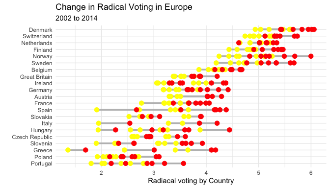
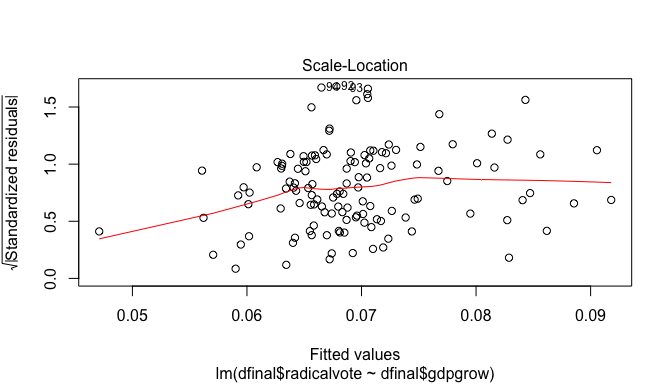

-   [1. Introduction](#introduction)
-   [2. Data and Methodology](#methodology)
-   [3. Data visualization](#visualization)
	-   [3.1 Visualization the independent variable and their correlations](#visualizationcorrelations)
	-   [3.2 Visualizing the Relationships between Independent Variables](#visualizingrelationships)
 	-   [3.3 Plotting Relationships between Independent Variables and Dependent Variable](#plotting)
-   [4. Regression models](#regression)
	-   [4.1 Post-Estimation Tests](#tests)
-   [5. Discussions and Conclusion](#conclusion)
-   [References:](#references)

## 1. Introduction {#introduction}

Rooduijn and Burgoon (2018), in the article “The Paradox of Wellbeing:
Do Unfavorable Socioeconomic and Sociocultural Contexts Deepen or Dampen
Radical Left and Right Voting Among the Less Well-Off?”, find some
interesting patterns related to when voters are more likely to choose
radical left-wing and right-wing parties. The authors argue that “less
well-off citizens might only vote for a radical party under more
favorable circumstances - if, in other words, these circumstances are
relatively ‘safe’ for radical experimentation” (Rooduijn and Burgoon
2018, p. 1746). However, the authors’ proposed mechanisms explaining
experimentalism at the micro level remains underdeveloped theoretically.
While experimentalism may indeed spur from perceptions of economic
“safety” at the macro level, micro level dynamics for why voters
conceive the possibility of voting for either left or right leaning
radical parties are not given enough attention. The authors assume the
less well-off are the voting base for all radical parties and, as such,
they treat low income as their main independent variable, rather than
income as a control variable. Although there are reasonable theoretical
reasons that connect radical party voting to unemployment or poor
economic conditions, there are also mix evidence on the relationship
between income and voting for either, right-wing (see Rydgren and Ruth
2013) or left-wing (see Visser et al. 2014), radical parties in Europe.
Moreover, the radical party’s literature illustrates that there are
mixed socioeconomic and cultural correlations underlying radical party
voting, and these are often country specific (see Rydgren and Ruth
2013).

Still, Rooduijn and Burgoon’s (2018) “safe experimentalism” claim
appears reasonable and, if the authors are right, a condition under
which radical party voting increases generally across European
societies. Yet, the authors do not really test the “safe
experimentalism” finding. Rooduijn and Burgoon operationalize economic
growth as gross domestic product (GDP) per capita (among other things),
which does not tell us much about when it is safe to experiment, but
simply points to a relationship between macro-economics and radical
party voting that could be explained in other ways than
‘experimentalism’. Nevertheless, the authors model right and left-wing
voting in separate binary regressions but argue that the experimentalist
finding holds for right and left-wing voting without testing them
altogether. The claim is even more contentious taking into consideration
the fact that radical parties are not evenly distributed across
societies. This is evident in the dataset as many of the coded countries
have either only right-wing radical parties (Austria and Belgium for
example), or only left-wing radical parties (Czech Republic and Ireland
for example).

There are two reasons to attempt to verify and expand Rooduijn and
Burgoon’s (2018) apparent findings. First, if “safe experimentalism”
holds, then a more specific model for when radical parties become more
appealing to voters can be developed. This, in turn, could be an
important general finding. Second, the election of radical parties over
mainstream parties at the national level is a relatively rare event with
low rates of occurrence over time for a variety of reasons (e.g.
campaign budgets and/or incumbent’s advantage). In such, binary
regressions or linear models may not account well for the time or
country specific effect variation within the data, as Beck et al. (1998)
and Wooldridge (2012) have argued elsewhere. Rather, a panel data model
may be more appropriate to analyze the topic and datasets.

Likewise, radical left-wing and right-wing parties are often closer to
each other in relation policy preferences (e.g. protectionism and
authoritarianism), than they are to mainstream parties’ policy
preferences (see Taylor 2006). For this theoretical reason, treating
radical left-wing and right-wing parties across countries in separate
regression models may be fallacious, as they often reflect similar
policy preferences and appeal to rather similar demographics in
countries where one or the other are absent. This theoretical
understanding of party politics and ideology alongside the reasonable
“safe experimentalism” claim allows me to hypothesize that: ***The
likelihood of voting for radical parties in Europe increases when
macroeconomic conditions are minimally stable and trust in politics and
is low.*** In this sense, radical party voting increases with
dissatisfaction with politics only when economic conditions are stable
enough for experimenting politically. Nevertheless, three considerations
must be made regarding the hypothesis above. First, because the main
claim of this paper is taken from Rooduijn and Burgoon’s (2018) article,
a modified version of their dataset is used. Since the dataset contains
data only on some European countries, the hypothesis is restricted to
Europe. Second, because the predictor variables hypothesized (minimally
stable macroeconomic conditions and political trust) may depend on each
other, it is expected that there will be some degree of
multicollinearity amongst predictors. Finally, there are several reasons
why individuals vote for radical, left or right-wing, parties and these
are not always correlated with economic conditions or political trust
(see Rydgren and Ruth 2013; Visser et al. 2014). Yet, if economic
conditions and political trust delineate underlying conditions that
correlate to increases in radical voting, this could be an important
correlational finding. This paper does not attempt to replicate Rooduijn
and Burgoon’s (2018) findings, rather it attempts to corroborate if
their claim regarding “safe experimentalism” holds once the dataset is
modified and different regression approaches are attempted.

## 2. Data and Methodology {#methodology}

Rooduijn and Burgoon’s (2018) dataset, made available in the article’s
replication materials, is adapted and modified to test the hypothesis
above. The dataset contains individual level data for the twenty-one
European countries who participated in seven waves of the European
Social Survey (ESS) that took place from 2002 to 2014. The individual
level data were aggregated by variables’ average for a respective
country-year. This is done because, contrary to Rooduijn and Burgoon’s
(2018), I am are interested in the variation in radical party voting by
country-year rather than subgroups of the population. Nevertheless, the
main dependent variables coded by the authors’, radical left and
right-wing voting over mainstream left or right leaning parties, was
missing around 25% of the values. This is most likely due to individual
respondents, who declared to have voted for a political party which was
not identified by the authors or participants who refused to answer the
question during the ESS survey round. Following what Rooduijn and
Burgoon’s (2018) did as a robustness check of their findings (see online
appendixes), all the missing values were changed to zeros before these
two variables were averaged. This means all missing values were coded as
if they had not voted for a radical party. Such decreases the likelihood
of finding statistically significant results, but also increases the
robustness of any possible findings using the data. The main dependent
variable here, radical party voting, was recoded as the sum of radical
left-wing and right-wing party voting for the specific country-year.
Beyond missing values for the dependent variables, the dataset also
contained several countries that did not participate in all the waves of
the ESS taking place from 2002 to 2014. Hence, for some countries there
are more country-year observations than others, although most countries
in the dataset participated in at least five out of the seven waves
during the time period.

As for the main predictor variables, the average values for political
trust (poltrst) and trust in politicians (trstplt) for a respective
country-year, already present in the dataset, are how political trust
was operationalized. Minimally stable economic conditions that allow for
experimentalism was operationalized using the Global Economic Indicators
data variable for GDP growth per country-year (available in the World
Bank database). For each round of the ESS, the data relative to a
respective country’s GDP growth for the year prior was added to the
dataset (because the ESS often takes place during the summer months).
However, since the “safe experimentalism” hypothesis holds that safe
enough conditions for experimentalism correlate with radical voting, GDP
growth per se cannot be used. If the hypothesis holds, voting for
radical parties would decrease in times of economic boom or times of
economic recession because these are “unsafe” times for experimentalism.
Thus, a categorical variable for economic growth by country-year was
created. The categorical variable for GDP growth (gdpcat) has seven
categories. The categories are: "minstable" (for GDP growth/decrease
ranging from - 1% to 1% for the previous year), "normalgrowth" (1.01% to
3%), "exceptg" (3.01% to 5%), "boom" (&gt; 5% ), "downturn" (-1.01% to
-3%), "shrink" (-3.01% to -5%) and "recession" (&lt; -5%). Additionally,
because I hypothesize about both political trust and economic conditions
joint effects on radical voting, a dummy variable for “safe
experimentalism” (safexp) was created. The dummy variable has the score
of 1 if, for a respective country-year, political trust levels are below
the country’s average and economic growth falls into “minstable”,
“normalgrowth” or “downturn” categories. The dummy variable is coded 0
otherwise.

The different underlying approaches to estimate relationships and
effects used are pooled OLS, fixed-effect and random effects-models.
Although it is unlikely that pooled OLS models are appropriate to
analyze this data (see Wooldridge 2012), the sample contains countries
which did not participated in all of the ESS waves considered and, for
that reason, there is a small possibility that there are no significant
random or individual time effects. Likely, because this is a panel
dataset, fixed or random-effects approaches are more suited. Since the
pertinent dependent and independent variables, as radical voting or
political trust, may have relatively little variation across unit and
time, there is reason to believe a random-effects model would fit the
data better. At the same time, countries may share distinctive
attributes that correlate with regressors, which could indicate that the
fixed-effects model would produce superior estimates. For these reasons,
the three approaches are modeled while post-estimation tests are used to
determine model fit.

In total six regression models are run using the PLM package dedicated
to panel data estimations. The first three models contain the same four
predictor variables (trstplt, poltrst, gdpcat and safexp) and are run as
pooled OLS, fixed-effects and random-effects. The following three models
are the same as above, but several control variables are added. The
control variables added are average income of participants for each
country/year (income), average education of participants by country/year
(educ), average rate of participants who were unemployed (unemp),
average age of participants by country/year (age), average rate of urban
to rural respondents (ruralurban), percent GDP growth for previous year
(gdpgrow), average immigrant attitudes for country/year (imbgeco) - as a
control for right wing radical party voting - and views about inequality
(incdif) - as a control for left wing radical party voting. The table
below summarizes the modified dataset and illustrate some of the
inconsistencies with the data mentioned above, as missing country data
for some years.

## 3. Data visualization{#visualization}

    library(readxl)

    df <- read_excel("d4.xlsx")

    dfinal <- as.data.frame(df) 

    table1::table1(~.,data=dfinal, topclass="Rtable1-zebra")

    ## [1] "<table class=\"Rtable1-zebra\">\n<thead>\n<tr>\n<th class='rowlabel firstrow lastrow'></th>\n<th class='firstrow lastrow'>Overall (N=130)</th>\n</tr>\n</thead>\n<tbody>\n<tr>\n<td class='rowlabel firstrow'>country</td>\n<td class='firstrow'></td>\n</tr>\n<tr>\n<td class='rowlabel'>Austria</td>\n<td>4 (3.1%)</td>\n</tr>\n<tr>\n<td class='rowlabel'>Belgium</td>\n<td>7 (5.4%)</td>\n</tr>\n<tr>\n<td class='rowlabel'>Czech Republic</td>\n<td>6 (4.6%)</td>\n</tr>\n<tr>\n<td class='rowlabel'>Denmark</td>\n<td>7 (5.4%)</td>\n</tr>\n<tr>\n<td class='rowlabel'>Finland</td>\n<td>7 (5.4%)</td>\n</tr>\n<tr>\n<td class='rowlabel'>France</td>\n<td>7 (5.4%)</td>\n</tr>\n<tr>\n<td class='rowlabel'>Germany</td>\n<td>7 (5.4%)</td>\n</tr>\n<tr>\n<td class='rowlabel'>Great Britain</td>\n<td>6 (4.6%)</td>\n</tr>\n<tr>\n<td class='rowlabel'>Greece</td>\n<td>4 (3.1%)</td>\n</tr>\n<tr>\n<td class='rowlabel'>Hungary</td>\n<td>6 (4.6%)</td>\n</tr>\n<tr>\n<td class='rowlabel'>Ireland</td>\n<td>7 (5.4%)</td>\n</tr>\n<tr>\n<td class='rowlabel'>Italy</td>\n<td>3 (2.3%)</td>\n</tr>\n<tr>\n<td class='rowlabel'>Netherlands</td>\n<td>7 (5.4%)</td>\n</tr>\n<tr>\n<td class='rowlabel'>Norway</td>\n<td>7 (5.4%)</td>\n</tr>\n<tr>\n<td class='rowlabel'>Poland</td>\n<td>7 (5.4%)</td>\n</tr>\n<tr>\n<td class='rowlabel'>Portugal</td>\n<td>6 (4.6%)</td>\n</tr>\n<tr>\n<td class='rowlabel'>Slovakia</td>\n<td>5 (3.8%)</td>\n</tr>\n<tr>\n<td class='rowlabel'>Slovenia</td>\n<td>7 (5.4%)</td>\n</tr>\n<tr>\n<td class='rowlabel'>Spain</td>\n<td>6 (4.6%)</td>\n</tr>\n<tr>\n<td class='rowlabel'>Sweden</td>\n<td>7 (5.4%)</td>\n</tr>\n<tr>\n<td class='rowlabel lastrow'>Switzerland</td>\n<td class='lastrow'>7 (5.4%)</td>\n</tr>\n<tr>\n<td class='rowlabel firstrow'>year</td>\n<td class='firstrow'></td>\n</tr>\n<tr>\n<td class='rowlabel'>Mean (SD)</td>\n<td>2010 (3.94)</td>\n</tr>\n<tr>\n<td class='rowlabel lastrow'>Median [Min, Max]</td>\n<td class='lastrow'>2010 [2000, 2010]</td>\n</tr>\n<tr>\n<td class='rowlabel firstrow'>trstplt</td>\n<td class='firstrow'></td>\n</tr>\n<tr>\n<td class='rowlabel'>Mean (SD)</td>\n<td>3.68 (1.03)</td>\n</tr>\n<tr>\n<td class='rowlabel lastrow'>Median [Min, Max]</td>\n<td class='lastrow'>3.51 [1.36, 5.61]</td>\n</tr>\n<tr>\n<td class='rowlabel firstrow'>poltrst</td>\n<td class='firstrow'></td>\n</tr>\n<tr>\n<td class='rowlabel'>Mean (SD)</td>\n<td>4.13 (1.04)</td>\n</tr>\n<tr>\n<td class='rowlabel lastrow'>Median [Min, Max]</td>\n<td class='lastrow'>4.08 [1.70, 6.06]</td>\n</tr>\n<tr>\n<td class='rowlabel firstrow'>incdif</td>\n<td class='firstrow'></td>\n</tr>\n<tr>\n<td class='rowlabel'>Mean (SD)</td>\n<td>3.82 (0.330)</td>\n</tr>\n<tr>\n<td class='rowlabel lastrow'>Median [Min, Max]</td>\n<td class='lastrow'>3.82 [2.96, 4.43]</td>\n</tr>\n<tr>\n<td class='rowlabel firstrow'>unemp</td>\n<td class='firstrow'></td>\n</tr>\n<tr>\n<td class='rowlabel'>Mean (SD)</td>\n<td>0.0486 (0.0257)</td>\n</tr>\n<tr>\n<td class='rowlabel lastrow'>Median [Min, Max]</td>\n<td class='lastrow'>0.0456 [0.00882, 0.151]</td>\n</tr>\n<tr>\n<td class='rowlabel firstrow'>educ</td>\n<td class='firstrow'></td>\n</tr>\n<tr>\n<td class='rowlabel'>Mean (SD)</td>\n<td>3.07 (0.383)</td>\n</tr>\n<tr>\n<td class='rowlabel lastrow'>Median [Min, Max]</td>\n<td class='lastrow'>3.09 [1.86, 3.69]</td>\n</tr>\n<tr>\n<td class='rowlabel firstrow'>ruralurban</td>\n<td class='firstrow'></td>\n</tr>\n<tr>\n<td class='rowlabel'>Mean (SD)</td>\n<td>1.61 (0.0993)</td>\n</tr>\n<tr>\n<td class='rowlabel lastrow'>Median [Min, Max]</td>\n<td class='lastrow'>1.61 [1.40, 1.80]</td>\n</tr>\n<tr>\n<td class='rowlabel firstrow'>age</td>\n<td class='firstrow'></td>\n</tr>\n<tr>\n<td class='rowlabel'>Mean (SD)</td>\n<td>48.8 (1.97)</td>\n</tr>\n<tr>\n<td class='rowlabel lastrow'>Median [Min, Max]</td>\n<td class='lastrow'>48.6 [43.8, 54.8]</td>\n</tr>\n<tr>\n<td class='rowlabel firstrow'>imbgeco</td>\n<td class='firstrow'></td>\n</tr>\n<tr>\n<td class='rowlabel'>Mean (SD)</td>\n<td>5.10 (0.654)</td>\n</tr>\n<tr>\n<td class='rowlabel lastrow'>Median [Min, Max]</td>\n<td class='lastrow'>5.09 [3.79, 6.90]</td>\n</tr>\n<tr>\n<td class='rowlabel firstrow'>income</td>\n<td class='firstrow'></td>\n</tr>\n<tr>\n<td class='rowlabel'>Mean (SD)</td>\n<td>5.68 (1.22)</td>\n</tr>\n<tr>\n<td class='rowlabel'>Median [Min, Max]</td>\n<td>5.73 [3.14, 8.46]</td>\n</tr>\n<tr>\n<td class='rowlabel lastrow'>Missing</td>\n<td class='lastrow'>6 (4.6%)</td>\n</tr>\n<tr>\n<td class='rowlabel firstrow'>stfeco</td>\n<td class='firstrow'></td>\n</tr>\n<tr>\n<td class='rowlabel'>Mean (SD)</td>\n<td>4.62 (1.47)</td>\n</tr>\n<tr>\n<td class='rowlabel lastrow'>Median [Min, Max]</td>\n<td class='lastrow'>4.73 [1.34, 7.98]</td>\n</tr>\n<tr>\n<td class='rowlabel firstrow'>radicalvote</td>\n<td class='firstrow'></td>\n</tr>\n<tr>\n<td class='rowlabel'>Mean (SD)</td>\n<td>0.0694 (0.0573)</td>\n</tr>\n<tr>\n<td class='rowlabel lastrow'>Median [Min, Max]</td>\n<td class='lastrow'>0.0586 [0, 0.228]</td>\n</tr>\n<tr>\n<td class='rowlabel firstrow'>gdpgrow</td>\n<td class='firstrow'></td>\n</tr>\n<tr>\n<td class='rowlabel'>Mean (SD)</td>\n<td>1.40 (3.05)</td>\n</tr>\n<tr>\n<td class='rowlabel lastrow'>Median [Min, Max]</td>\n<td class='lastrow'>1.80 [-8.07, 10.8]</td>\n</tr>\n<tr>\n<td class='rowlabel firstrow'>gdpcat</td>\n<td class='firstrow'></td>\n</tr>\n<tr>\n<td class='rowlabel'>boom</td>\n<td>12 (9.2%)</td>\n</tr>\n<tr>\n<td class='rowlabel'>downturn</td>\n<td>6 (4.6%)</td>\n</tr>\n<tr>\n<td class='rowlabel'>exceptg</td>\n<td>23 (17.7%)</td>\n</tr>\n<tr>\n<td class='rowlabel'>minstable</td>\n<td>27 (20.8%)</td>\n</tr>\n<tr>\n<td class='rowlabel'>normalgrowth</td>\n<td>48 (36.9%)</td>\n</tr>\n<tr>\n<td class='rowlabel'>recession</td>\n<td>6 (4.6%)</td>\n</tr>\n<tr>\n<td class='rowlabel lastrow'>shrink</td>\n<td class='lastrow'>8 (6.2%)</td>\n</tr>\n<tr>\n<td class='rowlabel firstrow'>safexp</td>\n<td class='firstrow'></td>\n</tr>\n<tr>\n<td class='rowlabel'>Mean (SD)</td>\n<td>0.300 (0.460)</td>\n</tr>\n<tr>\n<td class='rowlabel lastrow'>Median [Min, Max]</td>\n<td class='lastrow'>0 [0, 1.00]</td>\n</tr>\n</tbody>\n</table>\n"

The figure below illustrates the dependent variable, radical party
voting, across European countries during the period.

**Radical Party Voting in Europe from 2002 to 2014**

    library(tidyverse)

    ## ── Attaching packages ───────────────────────────────────────────────── tidyverse 1.3.0 ──

    ## ✓ ggplot2 3.3.0     ✓ purrr   0.3.4
    ## ✓ tibble  3.0.1     ✓ dplyr   0.8.5
    ## ✓ tidyr   1.1.0     ✓ stringr 1.4.0
    ## ✓ readr   1.3.1     ✓ forcats 0.5.0

    ## ── Conflicts ──────────────────────────────────────────────────── tidyverse_conflicts() ──
    ## x dplyr::filter() masks stats::filter()
    ## x dplyr::lag()    masks stats::lag()

    library(ggplot2)

    ggplot(dfinal, mapping = aes(x = year, y = radicalvote)) + geom_line(aes(color = country)) +
      labs(title="Radical Party Vote in Europe from 2002 to 2014", x = "Year", y = "Radical Party Vote")

    library(ggalt)

    ## Registered S3 methods overwritten by 'ggalt':
    ##   method                  from   
    ##   grid.draw.absoluteGrob  ggplot2
    ##   grobHeight.absoluteGrob ggplot2
    ##   grobWidth.absoluteGrob  ggplot2
    ##   grobX.absoluteGrob      ggplot2
    ##   grobY.absoluteGrob      ggplot2

    plotdata_wide <- spread(dfinal, year, radicalvote)

    names(plotdata_wide) <- c("country", "y2002", "y2014")

    ggplot(plotdata_wide, 
           aes(y = reorder(country, y2002),
               x = y2002,
               xend = y2014)) +  
      geom_dumbbell(size = 1.2,
                    size_x = 3, 
                    size_xend = 3,
                    colour = "grey", 
                    colour_x = "yellow", 
                    colour_xend = "red") +
      theme_minimal() + 
      labs(title = "Change in Radical Voting in Europe",
           subtitle = "2002 to 2014",
           x = "Radiacal voting by Country",
           y = "") + theme_minimal()

    library(CGPfunctions)

    ## Registered S3 methods overwritten by 'lme4':
    ##   method                          from
    ##   cooks.distance.influence.merMod car 
    ##   influence.merMod                car 
    ##   dfbeta.influence.merMod         car 
    ##   dfbetas.influence.merMod        car

    slope <- dfinal %>% filter(year %in% c(2002, 2008, 2014)) %>% mutate(year = factor(year))

    newggslopegraph(slope, year, radicalvote, country, DataTextSize = 3) +labs(title="Change in Radical voting by Country in Europe from 2002 to 2014")

    ## 
    ## Converting 'year' to an ordered factor

Note that radical party voting has increased in most countries surveyed
from 2002 to 2014, although this increase appears to be modest.
Moreover, plotting GDP growth (gdpgrow - non categorical) across these
European countries shows that GDP growth and downturns appear to happen
simultaneously for most countries, though the dimensions differ (see
below). This is expected since all the countries belong to the same
geographical region. While political trust does not appear to vary much
within countries during the period, levels appear to fluctuate farther
across countries (see below).

## 3.1 Visualization the independent variable and their correlations{#visualizationcorrelations}

    ggplot(dfinal, mapping = aes(x = year, y = gdpgrow)) + geom_line(aes(color = country)) + labs(title = "GDP Growth Across European Countries from 2002 to 2014", 
           x = "Year",
           y = "GDP Growth")

    ggplot(dfinal, mapping = aes(x = year, y = poltrst)) + geom_line(aes(color = country)) + labs(title = "Political Trust Across European Countries from 2002 to 2014",
           x = "Year",
           y = "Political Trust")

Though it was expected that the political trust and economic growth
variables would correlate, this appears not to be the case. The graph
below shows that their relationship is not linear, and the correlation
test (cor.test) confirms that their correlation is minimal.

## 3.2 Visualizing the Relationships between Independent Variables{#visualizingrelationships}

    ggplot(dfinal, mapping = aes(x = poltrst, y = gdpgrow)) + geom_line(aes(color = country)) + labs(title = "Correlations Between GDP Growth and Political Trust Across European Countries from 2002 to 2014",
           x = "Political Trust",
           y = "GDP Growth")

    cor.test(dfinal$poltrst, dfinal$gdpgrow)

    ## 
    ##  Pearson's product-moment correlation
    ## 
    ## data:  dfinal$poltrst and dfinal$gdpgrow
    ## t = 0.47918, df = 128, p-value = 0.6326
    ## alternative hypothesis: true correlation is not equal to 0
    ## 95 percent confidence interval:
    ##  -0.1308235  0.2129503
    ## sample estimates:
    ##        cor 
    ## 0.04231575

Finally, a simple linear plot of the correlations between radical voting
and political trust, as well as radical voting and GDP growth (below),
illustrates no visible linear relationship between the variables.

## 3.3 Plotting Relationships between Independent Variables and Dependent Variable{#plotting}

    plot(lm(dfinal$radicalvote ~ dfinal$poltrst))

    plot(lm(dfinal$radicalvote ~ dfinal$gdpgrow))

## 4.Regression models{#regression}

The table below shows the results of the 6 regression models. The three
first models are run without any control variables, while the 3 last
contain several control variables.

    library(plm)

    ## 
    ## Attaching package: 'plm'

    ## The following objects are masked from 'package:dplyr':
    ## 
    ##     between, lag, lead

    pols1 <- plm(radicalvote ~ trstplt + poltrst + as.factor(gdpcat) + as.factor(safexp), data=dfinal, model = "pooling", index = c("country", "year"))

    fe1 <- plm(radicalvote ~ trstplt + poltrst + as.factor(gdpcat) + as.factor(safexp), data=dfinal, model = "within", index = c("country", "year"))

    re1 <- plm(radicalvote ~ trstplt + poltrst + as.factor(gdpcat) + as.factor(safexp) , data=dfinal, model = "random", index = c("country", "year"))

    pols2 <- plm(radicalvote ~ trstplt + poltrst + as.factor(gdpcat) + as.factor(safexp) + income + unemp + educ + age + ruralurban + imbgeco + incdif + gdpgrow + stfeco, data=dfinal, model = "pooling", index = c("country", "year"))

    fe2 <- plm(radicalvote ~ trstplt + poltrst + as.factor(gdpcat) + as.factor(safexp) + income + unemp + educ + age + ruralurban + imbgeco + incdif + gdpgrow + stfeco, data=dfinal, model = "within", index = c("country", "year"))

    re2 <- plm(radicalvote ~ trstplt + poltrst + as.factor(gdpcat) + as.factor(safexp) + income + unemp + educ + age + ruralurban + imbgeco + incdif + gdpgrow + stfeco, data=dfinal, model = "random", index = c("country", "year"))

    library(stargazer)

    ## 
    ## Please cite as:

    ##  Hlavac, Marek (2018). stargazer: Well-Formatted Regression and Summary Statistics Tables.

    ##  R package version 5.2.2. https://CRAN.R-project.org/package=stargazer

    stargazer(pols1, fe1, re1, type="text", title = "Regression Results for Models without Control Variables", column.labels = c("Pooled OLS", "Fixed-Effects", "Random-Effects") ,dep.var.labels=c("Radical Party Voting in Europe"), align=TRUE)

    ## 
    ## Regression Results for Models without Control Variables
    ## ========================================================================================
    ##                                                  Dependent variable:                    
    ##                               ----------------------------------------------------------
    ##                                             Radical Party Voting in Europe              
    ##                                     Pooled OLS           Fixed-Effects    Random-Effects
    ##                                         (1)                   (2)              (3)      
    ## ----------------------------------------------------------------------------------------
    ## trstplt                                0.022                 0.015            0.029     
    ##                                       (0.023)               (0.044)          (0.032)    
    ##                                                                                         
    ## poltrst                                0.012                -0.007            -0.005    
    ##                                       (0.023)               (0.041)          (0.031)    
    ##                                                                                         
    ## as.factor(gdpcat)downturn             -0.007               -0.035**           -0.027    
    ##                                       (0.024)               (0.018)          (0.018)    
    ##                                                                                         
    ## as.factor(gdpcat)exceptg              -0.002                 0.004            0.007     
    ##                                       (0.016)               (0.012)          (0.012)    
    ##                                                                                         
    ## as.factor(gdpcat)minstable            0.029*                -0.003            0.007     
    ##                                       (0.017)               (0.013)          (0.013)    
    ##                                                                                         
    ## as.factor(gdpcat)normalgrowth          0.007                -0.0001           0.004     
    ##                                       (0.015)               (0.011)          (0.011)    
    ##                                                                                         
    ## as.factor(gdpcat)recession             0.015                 0.012            0.020     
    ##                                       (0.022)               (0.015)          (0.015)    
    ##                                                                                         
    ## as.factor(gdpcat)shrink               0.038*                 0.014            0.026*    
    ##                                       (0.020)               (0.015)          (0.015)    
    ##                                                                                         
    ## as.factor(safexp)1                    0.018*                 0.013           0.020**    
    ##                                       (0.011)               (0.008)          (0.008)    
    ##                                                                                         
    ## Constant                             -0.078***                                -0.028    
    ##                                       (0.021)                                (0.028)    
    ##                                                                                         
    ## ----------------------------------------------------------------------------------------
    ## Observations                            130                   130              130      
    ## R2                                     0.453                 0.088            0.166     
    ## Adjusted R2                            0.411                -0.176            0.104     
    ## F Statistic                   11.020*** (df = 9; 120) 1.074 (df = 9; 100)   23.927***   
    ## ========================================================================================
    ## Note:                                                        *p<0.1; **p<0.05; ***p<0.01

    stargazer(pols2, fe2, re2, type="text", title = "Regression Results with Control Variables", column.labels = c("Pooled OLS", "Fixed-Effects", "Random-Effects") ,dep.var.labels=c("Radical Party Voting in Europe"), align=TRUE)

    ## 
    ## Regression Results with Control Variables
    ## ========================================================================================
    ##                                                  Dependent variable:                    
    ##                               ----------------------------------------------------------
    ##                                             Radical Party Voting in Europe              
    ##                                     Pooled OLS           Fixed-Effects    Random-Effects
    ##                                         (1)                   (2)              (3)      
    ## ----------------------------------------------------------------------------------------
    ## trstplt                                0.011                 0.009            0.020     
    ##                                       (0.034)               (0.050)          (0.035)    
    ##                                                                                         
    ## poltrst                                0.024                0.0005            0.011     
    ##                                       (0.032)               (0.047)          (0.034)    
    ##                                                                                         
    ## as.factor(gdpcat)downturn              0.025                -0.052            -0.026    
    ##                                       (0.058)               (0.039)          (0.043)    
    ##                                                                                         
    ## as.factor(gdpcat)exceptg               0.009                -0.003            0.008     
    ##                                       (0.024)               (0.016)          (0.018)    
    ##                                                                                         
    ## as.factor(gdpcat)minstable             0.044                -0.020            0.002     
    ##                                       (0.041)               (0.028)          (0.031)    
    ##                                                                                         
    ## as.factor(gdpcat)normalgrowth          0.018                -0.010            0.0002    
    ##                                       (0.030)               (0.020)          (0.022)    
    ##                                                                                         
    ## as.factor(gdpcat)recession             0.057                -0.022            0.007     
    ##                                       (0.086)               (0.058)          (0.065)    
    ##                                                                                         
    ## as.factor(gdpcat)shrink                0.064                -0.006            0.019     
    ##                                       (0.072)               (0.047)          (0.054)    
    ##                                                                                         
    ## as.factor(safexp)1                     0.018                 0.007            0.017*    
    ##                                       (0.012)               (0.009)          (0.009)    
    ##                                                                                         
    ## income                                -0.003                 0.001            0.002     
    ##                                       (0.005)               (0.003)          (0.004)    
    ##                                                                                         
    ## unemp                                 -0.139                -0.064            0.076     
    ##                                       (0.237)               (0.238)          (0.215)    
    ##                                                                                         
    ## educ                                   0.021                 0.018            0.027*    
    ##                                       (0.015)               (0.023)          (0.015)    
    ##                                                                                         
    ## age                                   -0.002                 0.001           -0.0005    
    ##                                       (0.003)               (0.002)          (0.002)    
    ##                                                                                         
    ## ruralurban                            0.091*                0.219**          0.117**    
    ##                                       (0.052)               (0.088)          (0.058)    
    ##                                                                                         
    ## imbgeco                               -0.001                 0.007            -0.003    
    ##                                       (0.010)               (0.014)          (0.011)    
    ##                                                                                         
    ## incdif                                -0.008                 0.041            0.001     
    ##                                       (0.023)               (0.031)          (0.022)    
    ##                                                                                         
    ## gdpgrow                                0.003                -0.002            -0.001    
    ##                                       (0.007)               (0.004)          (0.005)    
    ##                                                                                         
    ## stfeco                                -0.004                -0.004            -0.005    
    ##                                       (0.007)               (0.005)          (0.006)    
    ##                                                                                         
    ## Constant                              -0.144                                  -0.280    
    ##                                       (0.200)                                (0.194)    
    ##                                                                                         
    ## ----------------------------------------------------------------------------------------
    ## Observations                            124                   124              124      
    ## R2                                     0.489                 0.218            0.288     
    ## Adjusted R2                            0.402                -0.132            0.165     
    ## F Statistic                   5.593*** (df = 18; 105) 1.316 (df = 18; 85)   42.370***   
    ## ========================================================================================
    ## Note:                                                        *p<0.1; **p<0.05; ***p<0.01

    # I could not put all the models in the same table because the HTML file only shows4 models at a time when this is done. This is why the tables are split in two. 

From the results tables, we do not see many statistically significant
correlations between predictors and radical voting across the regression
models. In the first pooled OLS model, the GDP growth categorical
variables for minimally stable economic conditions (minstable) and
economic shrink (shrink) are statistically significant (at the 0.1 P
&lt; 0.1 level) and appear to correlate with radical voting, in relation
to the reference category (economic boom). As well, the safe
experimentalism (safexp) dummy variable is statistically significant (at
the P &lt; 0.1 level). However, once several control variables are added
to the same pooled OLS model, the only statistically significant
predictor becomes the average rate of rural to urban (ruralurban)
participants surveyed (at the 0.1 P-value level). Alternatively, in the
first fixed-effects model only the GDP categorical variable for economic
downturn (downturn) is statistically significant (at the 0.05 level). In
the second fixed-effects model, with the control variables, downturn
economic conditions (downturn) remains statistically significant
alongside the average rate of rural to urban (ruralurban) participants
(both at the P &lt; 0.05 level). Nonetheless, in the first
random-effects model, GDP growth categorical variables for economic
shrink (shrink) is statistically significant (at the 0.1 P &lt; 0.1
level), alongside the safe experimentalism (safexp) dummy variable (at
the P &lt; 0.5 level). In the second random-effects model, the safe
experimentalism (safexp) dummy variable, the average education level of
participants (educ) and the average rate of rural to urban (ruralurban)
participants are statistically significant (all three at the P &lt; 0.1
level). Yet, none of the models appears to be a good fit prima-facie or
capture the variance in the dependent variable well, judging by adjusted
R squared scores, coefficient values and standard errors. Moreover, the
models do not appear to provide enough evidence that radical voting
correlates consistently across in statistically significant ways with
economically stable conditions or decreases in levels of political trust
(or both).

## 4.1 Post-Estimation Tests{#tests}

    pbsytest(pols1)

    ## 
    ##  Bera, Sosa-Escudero and Yoon locally robust test - unbalanced panel
    ## 
    ## data:  formula
    ## chisq = 9.1758, df = 1, p-value = 0.002452
    ## alternative hypothesis: AR(1) errors sub random effects

    pbsytest(pols2)

    ## 
    ##  Bera, Sosa-Escudero and Yoon locally robust test - unbalanced panel
    ## 
    ## data:  formula
    ## chisq = 11.484, df = 1, p-value = 0.000702
    ## alternative hypothesis: AR(1) errors sub random effects

    plmtest(pols1)

    ## 
    ##  Lagrange Multiplier Test - (Honda) for unbalanced panels
    ## 
    ## data:  radicalvote ~ trstplt + poltrst + as.factor(gdpcat) + as.factor(safexp)
    ## normal = 9.4342, p-value < 2.2e-16
    ## alternative hypothesis: significant effects

    plmtest(pols2)

    ## 
    ##  Lagrange Multiplier Test - (Honda) for unbalanced panels
    ## 
    ## data:  radicalvote ~ trstplt + poltrst + as.factor(gdpcat) + as.factor(safexp) +  ...
    ## normal = 8.7025, p-value < 2.2e-16
    ## alternative hypothesis: significant effects

    phtest(fe1,re1)

    ## 
    ##  Hausman Test
    ## 
    ## data:  radicalvote ~ trstplt + poltrst + as.factor(gdpcat) + as.factor(safexp)
    ## chisq = 2.8326, df = 9, p-value = 0.9706
    ## alternative hypothesis: one model is inconsistent

    phtest(fe2,re2)

    ## 
    ##  Hausman Test
    ## 
    ## data:  radicalvote ~ trstplt + poltrst + as.factor(gdpcat) + as.factor(safexp) +  ...
    ## chisq = 82.041, df = 18, p-value = 3.756e-10
    ## alternative hypothesis: one model is inconsistent

The Bera, Sosa-Escudero and Yoon locally robust test (pbsytest)
performed on the pooled OLS regressions (above) allows us to reject the
null hypothesis and confirm that errors are either serially correlated
or randomly correlated; this means that the pooled OLS models are not
appropriate to analyze the data. This is also confirmed by the Lagrange
Multiplier Test (plmtest) which indicates that there are significant
individual or time effects present on both pooled OLS models. When it
comes to choosing between fixed or random-effects models, the Hausman
test (phtest) allows us to can reject the null hypothesis that errors
are not correlated to the independent variables. Thus, it indicates that
the errors are indeed correlated with regressors and that there is no
need to use random-effects; that both fixed-effects models are preferred
over the random effects’ models. Given that we know that the pooled OLS
models are not adequate for the data, and that neither the fixed-effects
or random effects models give us many statistically significant results
or appear to explain much of the variance in the dependent variable,
there is no point in going further to check if the models violate other
assumptions. Rather it is better to re-think the relationships
theoretically, how to operationalize the variables hypothesized and try
to find better datasets to test the hypothesis.

## 5. Discussions and Conclusion {#conclusion}

Although none of the regression models above shows many (or consistent)
statistically significant results, the “safe experimentalism” hypothesis
remains a reasonable claim that should be further addressed in the
future. This should be done with better data and better
operationalizations of macro-economically safe conditions. While this
paper did not attempt to replicate Rooduijn and Burgoon’s (2018), their
claimed findings that: “individual hardship spurs radical left and right
voting, this is the case mainly when aggregate conditions are favorable,
yielding a setting that is safe for radical experimentalism or
positioning” (p. 1748) were not confirmed for broader patterns radical
voting increases in societies. The only variable that appears to
consistently correlate with radical voting in the dataset is the average
rate of rural to urban participants surveyed for a given country-year
(ruralurban). The correlation indicates that an increase in the average
rate of rural participants a country surveyed has, leads to an increase
in radical party voting. That said, we should continue to look for
correlations that explain radical party voting across countries and
across time with more appropriate models. Given that the election of
radical parties at the national levels is a relatively rare phenomenon,
better datasets surrounding elections in national politics across times
and countries should be assembled. The usage of survival analysis tools
could present better alternatives to put forward more conclusive
findings regarding the relationship (or lack thereof) between
macro-economic conditions and radical party voting.

## References {#references}

Beck, N., Katz, J., & Tucker, R. (1998). Taking Time Seriously:
Time-Series-Cross-Section Analysis with a Binary Dependent Variable.
American Journal of Political Science, 42(4), 1260-1288.

Rooduijn, M., & Burgoon, B. (2018). The paradox of well-being: do
unfavorable socioeconomic and sociocultural contexts deepen or dampen
radical left and right voting among the less well-off? Comparative
Political Studies, 51(13), 1720-1753.

Rydgren, J., & Ruth, P. (2013). Contextual explanations of radical
right-wing support in Sweden: socioeconomic marginalization, group
threat, and the halo effect. Ethnic and Racial Studies, 36(4), 711-728.

Taylor, J. (2006). Where did the party go? William Jennings Bryan,
Hubert Humphrey, and the Jeffersonian legacy. University of Missouri
Press. Visser, M., Lubbers, M., Kraaykamp, G., & Jaspers, E. (2014).
Support for radical left ideologies in E Europe. European journal of
political research, 53(3), 541-558.

Wooldridge, J. M. (2012). Introduction to econometrics: A modern
approach. Michigan State University. USA.
