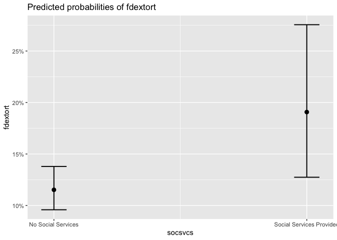
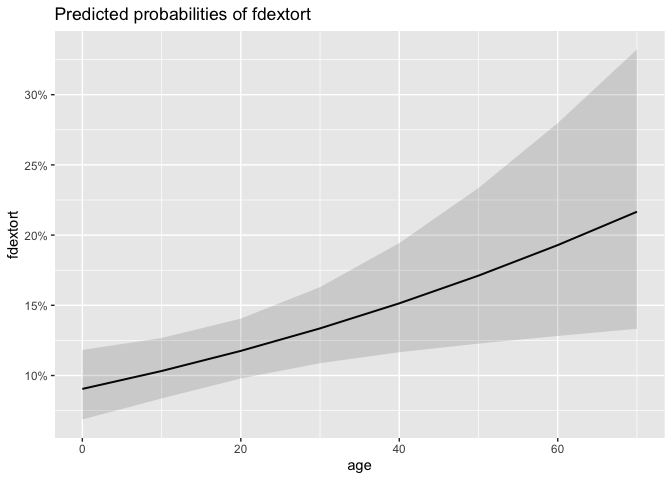
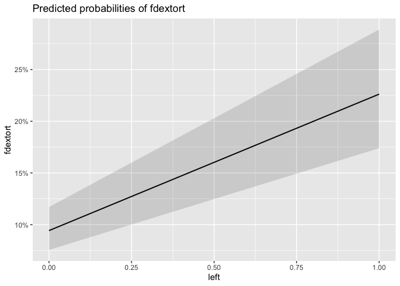
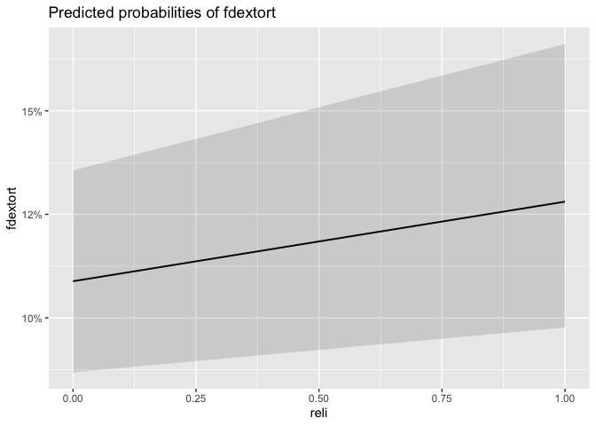
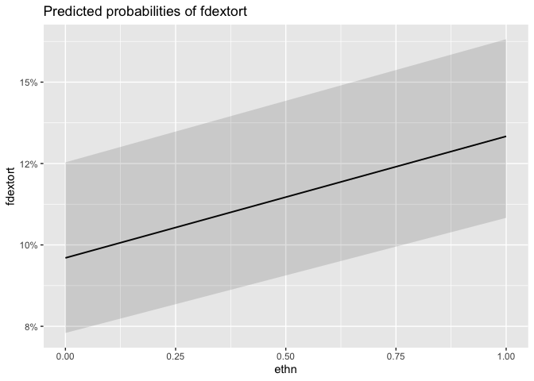
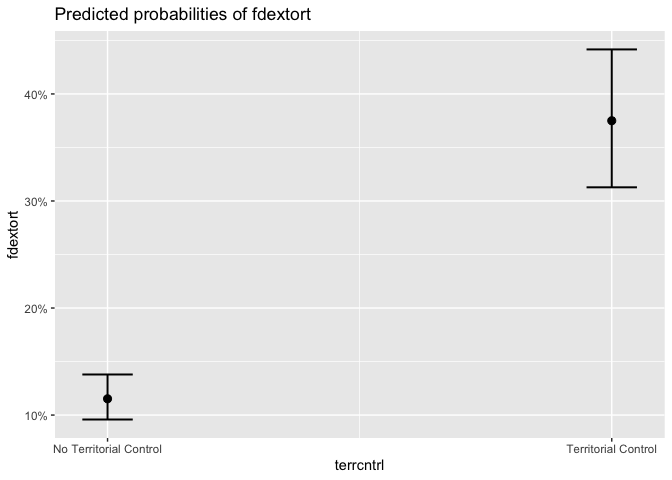
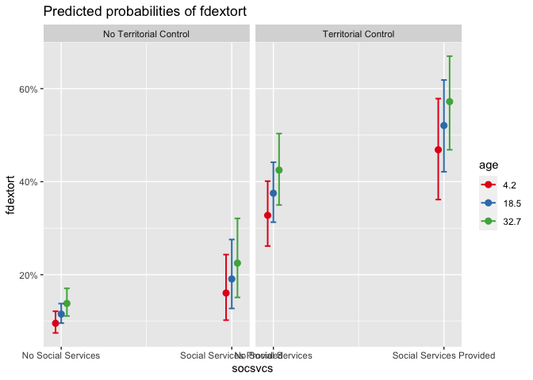
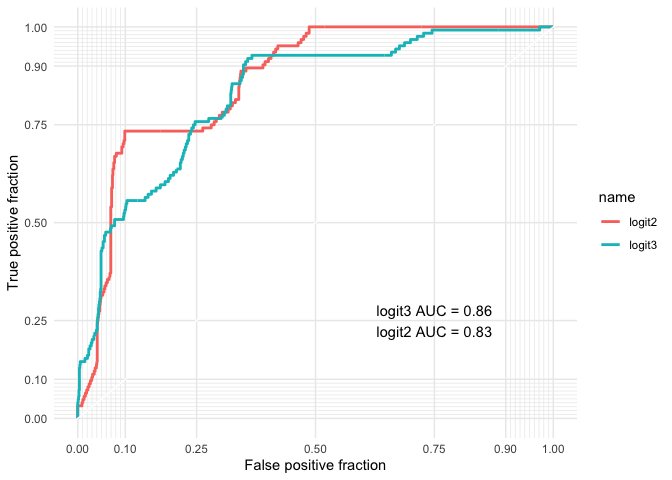
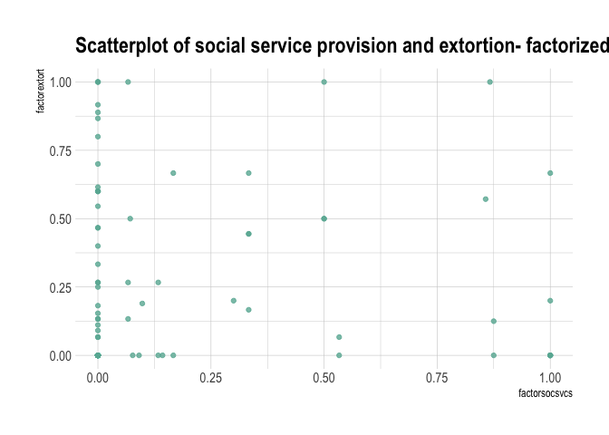
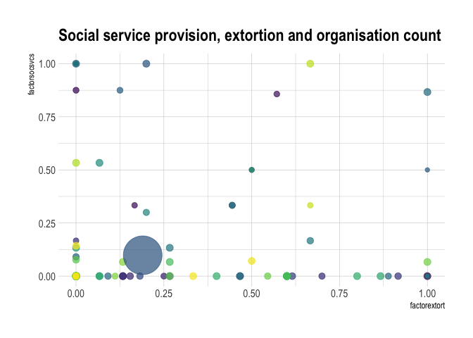

-   [$\\color{darkcyan}{\\text{Conflict and crime-Rethinking extortion through rebel governance}}$](#colordarkcyantextconflict-and-crime-rethinking-extortion-through-rebel-governance)
    -   [Extortion and rebels- more than just economic
        underpinnings?](#extortion-and-rebels--more-than-just-economic-underpinnings)
    -   [Hypothesis](#hypothesis)
-   [$\\color{darkcyan}{\\text{Introducing the Data}}$](#colordarkcyantextintroducing-the-data)
    -   [Variables of Interest](#variables-of-interest)
    -   [Bivariate relationship between Social Service Provision and
        Extortion](#bivariate-relationship-between-social-service-provision-and-extortion)
-   [$\\color{darkcyan}{\\text{Models}}$](#colordarkcyantextmodels)
    -   [Logistic Regression: Social Service Provision and
        Extortion](#logistic-regression-social-service-provision-and-extortion)
    -   [Marginal effects](#marginal-effects)
    -   [Choosing the right model](#choosing-the-right-model)
-   [$\\color{darkcyan}{\\text{Conclusion}}$](#colordarkcyantextconclusion)
-   [$\\color{darkcyan}{\\text{References}}$](#colordarkcyantextreferences)
-   [$\\color{darkcyan}{\\text{Appendix}}$](#colordarkcyantextappendix)

## Conflict and crime - Rethinking extortion through rebel governance

### Extortion and rebels- more than just economic underpinnings?

While rebel groups and transnational crime make for a heady mix, the
motivations behind many rebel behaviors remain understudied. Activities
like ‘extortion’ continue to be seen as driven predominantly by purely
economic motivations. Rebels continue to be seen simply as actors
engaging in violence against the state with an end goal towards
overthrowing the state and coming into power.

A growing literature has been moving beyond this narrow view of rebel
governance, exploring and analysing different dimensions of ‘wartime
orders’, from rebel-civilian interaction to rebel-state relationships
(Arjona, 2016; Mampilly 2011; Staniland 2012). Wartime orders have been
documented and researched across insurgencies and armed movements.
Governance practices of LTTE in Sri Lanka, SPLA in Sudan and RCD in
Congo (Mampilly 2011), FARC in Columbia (Arjona 2010) Sendero Luminoso
in Peru (Wood 2003) as well as Islamist rebel governance in Afghanistan
(Giustozzi 2019, Jackson 2018) and Iraq and Syria (Revkin 2016), have
all added to our understanding of governance practices in spaces of
total or partial rebel control.

Economic life in conflict zones is likely to be more informal, with
fewer formal taxes paid or collected but with informal taxation and
revenue increasing (Sanchez de la Sierra, 2020). In the context of of
rebel groups, the word ‘extortion’ is often used, almost interchangeably
with ‘taxes’. While most informal taxes are not implemented through
legal mechanisms and are considered ‘informal’, the armed nature of
rebel groups makes the taxes collected outside a legal framework by them
‘criminal’. Until quite recently, the ‘greed’ literature (Collier and
Hoeffler 2004) dominated the discourse on rebel groups collecting
‘taxes’. There was a dominant understanding that taxation from an armed
group under the threat of injury or death is little more than coercive
extraction, and the reciprocity that underpins taxation is missing
altogether. More nuanced explorations of armed group taxation that
emphasise the importance of order and reciprocity have emerged since
(Sabates and Wheeler 2014; Raeymaekers 2010).

Rebel taxation is an integral part of rebel governance. Building on
‘greed’ based theories of political economy of rebellion (Collier and
Hoeffler 2004), scholar’s have argued that rebels would only engage in
sustained taxation (or extortion) in the absence of exploitable
resources, thereby pinning the logics of taxation by such groups as
purely economic. Weinstein (2007) finds that access to exploitable
resources makes rebels more inclined to predation than governance
(including regulated taxation), based on civil war cases in Mozambique,
Uganda and Peru. Similar observations are made by Florea (2020) in his
paper explaining what determines variations in governance across
separatist enclaves.

Moving beyond this economic/extractive lens, studies in rebel taxation
have begun to explore the ideological, political and social
underpinnings of armed group taxation, and how it ties into a groups’
wider political agendas. Revkin (2020) demonstrates the limitations of
the greed based theories through the case of Islamic State, where they
established various types of taxes despite operating in resource rich
areas of Syria, finding ideological and strategic logics to this
taxation. Meanwhile, Sabates and Wheeler (2014) find that extortion and
through an institutionalised route increases household welfare.

### Hypothesis

While this research has enriched our understanding of extortion/rebel
taxation in many ways, few statistical studies have been conducted to
understand the relationship between extortion and elements of
governance, such as the provision of social services. Social service
provision can be seen as an important part of governance. Much of the
research done on extortion it connection to rebel governance through
social service provision remains anecdotal in nature. In my fieldwork
along the Indo-Myanmar border I too, have observed the often surprising
and unintuitive relationship between the two. However, the lack of
external validity of these findings has led to the ‘greed’ based
narrative to continue to dominate the rebel motivations scholarship.

Finding a statistically significant relationship between the two
(extortion and social service provision) would speak to the
generalizability of these observations.

This article thus seeks to explore the significance of the relationship
between the two variables- extortion and social service provision.

*Hypothesis 1: Non-state armed groups that engage in extortion are more
likely to provide social services.*

*Hypothesis 2: Non-state armed groups that provide social services are
more likely to extort*

By testing the effect extortion has on whether a non-state armed group
provides social services and vice versa, we can then speak to the
importance of understanding ‘extortion’ in lenses other than just
criminal. Though the data itself cannot tell us about public legitimacy
and degrees of coercion, a causal link or even a surprising correlation
between the two would be an important finding for re-evaluating how we
understand revenue generation by non-state armed groups.

## $\\color{darkcyan}{\\text{Introducing the Data}}$

To do this, we have used the BAAD2 (Big Allied and Dangerous) dataset.
BAAD2seeks to code information on every terrorist entity recorded in the
Global Terrorism Database, each insurgent entity in the Uppsala Conflict
Data Program (UCDP) Battle Deaths dataset, and each terrorist or
insurgent entity that has sought a weapon of mass destruction and is
recorded in the Profiles of Incidents Involving CBRN Use by Non-state
Actors (POICN) database. They document all violent non-state
organizations that perpetrated at least 25 battle-related deaths as
defined and recorded by the Uppsala Conflict Data Program (UCDP) on or
after January 1, 1998 through December 31, 2012.

One more para on the data

### Variables of Interest

To test hypothesis 1

The dependent variable would be social services provides- SOCSVCS
(Social Services) Does the organization provide any medical, welfare,
education, infrastructure, protection (or security), or other service?
This is a dichotomous variable. If it does provide social services, it
coded as 1, else as 0.

The main explanatory variable would be whether a group engages in
extortion-. FDEXTORT (Extortion) Organization collects resources by
threatening local businesses or communities with violence unless they
pay what is often termed as a “revolutionary tax”. If “donations” are
collected through a threat of violence or against persons or other
organizations, then that activity was coded as extortion.

To test hypothesis 2

The main dependent variable would be whether a group engages in
extortion-. FDEXTORT (Extortion) and the main explanatory variable would
be whether or not social services provides- SOCSVCS (Social Services)

The main control variables would be:

1.  Age- The organization’s age is a continuous variable, measured in
    years, is how long a violent nonstate organization has been in
    existence. Ages are calculated from best known founding date, and
    founding dates may be well before the BAAD2 data window. For
    instance, Al Qa’ida is listed as age 10 in 1998. Age increments for
    each year in the data set. For organizations founded during the
    BAAD2 window, the age for the organization in its first year of
    operation is zero (0). Age would be an important control variable,
    as groups that have been around longer would be more likely to be in
    a position to extort, as well as provide social services.

2.  Ideology- Organizational deology is the guiding principle for the
    organization and the closest thing to an organization identity. This
    is important to include as a control variable as groups with no
    ideology are likely to closely resemble criminal gangs and there
    would appear to be no incentive for them to provide social services.
    0 = Does not adhere to ideology 1 = Adheres to ideology. This is
    further split into:

LEFT (Leftist Organization) The organization promotes economically
leftist policies such as redistribution of wealth by the government and
nationalization of industry. Most that fall into this category will
primarily be communist and socialist organizations and their variants
(Marxist, Leninist, Maoist). Examples include the New People’s Army
(NPA), the Red Brigades and the Revolutionary Armed Forces of Columbia
(FARC).

RELI (Religious Organization) The organization is guided by some form of
religious principles. They may seek to incorporate religious policies
into public life or exist to protect a distinct religious group.
Examples include al-Qa’ida, Jemaah Islamiya, Kach, and the Lord’s
Resistance Army (LRA)

ETHN (Ethnic Organization) The organization represents a certain ethnic
group and advocates for the rights or expansion of that ethnic group.
Examples include Fatah, Basque Fatherland and Freedom (ETA), and the
Kurdistan Workers’ Party (PKK). Organizational Characteristics and
Activity

1.  Territorial control (TERRCNTRL)- Arguably the most important
    variable to control for is territorial control. Territory can set
    the outer bounds to whether a non-state armed group is able to
    engage in extortion or provide social services. TERRCNTRL
    (Territorial Control). As per the codebook, in some instances
    organizations will perform functions or provide services, similar to
    that of a legitimate government. Territory may be controlled by
    threat or use of force, or if the government grants the organization
    the authority to do so. The territory as defined by the codebook
    refers to a substantial area (city, region, etc.) and not just an
    organization occupying a building or a couple of buildings. Thus
    this excludes military bases and checkpoints. Though bases may
    indicate that the organization does have control over territory,
    they may also be covert and thus not exercising social control over
    civilians in the area of the base. Additionally, the organization
    must have control over the territory for more than a few days. For
    instance, seizure and loss of a town in the space of a week does not
    constitute territorial control. -99 = Unknown 0 = Does not control
    territory 1 = Controls territory

2.  State sponsorship (FDSTATE)- In a later model, we will add the
    control variable for state sponsorship and whether the non-state
    armed organisation was known to be directly supported by a sovereign
    state in a given year. This is again coded as 21. 1 = Organization
    known to be directly supported by a sovereign state in this year 0 =
    Organization not known to be directly supported by a sovereign state
    in this year

### Bivariate relationship between Social Service Provision and Extortion

Before running into our logistic regression, lets try to get a sense of
the bivariate relationship between our IV and DV

    ##                           
    ##                            No Extortion Extortion
    ##   No Social Services                922       200
    ##   Social Services Provided           75        49

By looking at this 2 x2 table, the bivariate relationship between social
service provision and extortion does not look immediately intuitive or
promising. Groups that extort, but do not provide social services are
over four times more groups that extort and do provide social services
(200 to 49).

Furthermore, the number of do not extort and provide social services
exceed the number of groups who do extort and provide social services
(75-49).

However, the proportion of groups that are providing social services to
those are not within groups that extort is close to 0.24 while, the
proportion of groups that are providing social services to those who are
not within groups that do not extort is just 0.08.

While this contingency table does, indeed give us a snapshot into the
proportions and numbers of the two, it does not tell us much more about
the relationship between the two, especially controlling for other
variables. For this, we will use logistic regression.

## $\\color{darkcyan}{\\text{Models}}$

Since the dependent variable in both cases is binary in nature, it is
concerned with whether social services are provided by non-state armed
groups, or not. The regression analysis in this article thus seeks to
speak speaks to the likelihood of services being provided. Hence, we
need a probability model underlying our regression. The issue with a
linear probability model (i.e., treating the y variable as a non-binary
variable and just running a normal regression) is that we may get
probability estimates that are greater than 1 or less than 0. A logit or
probit is the standard way to address this.

### Logistic Regression: Social Service Provision and Extortion

In our first model, we look at extortion to predict social services,
controlling for age and ideology and territorial control-

<table style="border-collapse:collapse; border:none;">
<tr>
<th style="border-top: double; text-align:center; font-style:normal; font-weight:bold; padding:0.2cm;  text-align:left; ">
 
</th>
<th colspan="3" style="border-top: double; text-align:center; font-style:normal; font-weight:bold; padding:0.2cm; ">
socsvcs
</th>
</tr>
<tr>
<td style=" text-align:center; border-bottom:1px solid; font-style:italic; font-weight:normal;  text-align:left; ">
Predictors
</td>
<td style=" text-align:center; border-bottom:1px solid; font-style:italic; font-weight:normal;  ">
Log-Odds
</td>
<td style=" text-align:center; border-bottom:1px solid; font-style:italic; font-weight:normal;  ">
CI
</td>
<td style=" text-align:center; border-bottom:1px solid; font-style:italic; font-weight:normal;  ">
p
</td>
</tr>
<tr>
<td style=" padding:0.2cm; text-align:left; vertical-align:top; text-align:left; ">
(Intercept)
</td>
<td style=" padding:0.2cm; text-align:left; vertical-align:top; text-align:center;  ">
-4.68
</td>
<td style=" padding:0.2cm; text-align:left; vertical-align:top; text-align:center;  ">
-5.48 – -3.95
</td>
<td style=" padding:0.2cm; text-align:left; vertical-align:top; text-align:center;  ">
<strong>&lt;0.001</strong>
</td>
</tr>
<tr>
<td style=" padding:0.2cm; text-align:left; vertical-align:top; text-align:left; ">
age
</td>
<td style=" padding:0.2cm; text-align:left; vertical-align:top; text-align:center;  ">
0.02
</td>
<td style=" padding:0.2cm; text-align:left; vertical-align:top; text-align:center;  ">
0.00 – 0.04
</td>
<td style=" padding:0.2cm; text-align:left; vertical-align:top; text-align:center;  ">
<strong>0.011</strong>
</td>
</tr>
<tr>
<td style=" padding:0.2cm; text-align:left; vertical-align:top; text-align:left; ">
ethn
</td>
<td style=" padding:0.2cm; text-align:left; vertical-align:top; text-align:center;  ">
0.13
</td>
<td style=" padding:0.2cm; text-align:left; vertical-align:top; text-align:center;  ">
-0.39 – 0.64
</td>
<td style=" padding:0.2cm; text-align:left; vertical-align:top; text-align:center;  ">
0.632
</td>
</tr>
<tr>
<td style=" padding:0.2cm; text-align:left; vertical-align:top; text-align:left; ">
No Extortion
</td>
<td style=" padding:0.2cm; text-align:left; vertical-align:top; text-align:center;  ">
<em>Reference</em>
</td>
<td style=" padding:0.2cm; text-align:left; vertical-align:top; text-align:center;  ">
</td>
<td style=" padding:0.2cm; text-align:left; vertical-align:top; text-align:center;  ">
</td>
</tr>
<tr>
<td style=" padding:0.2cm; text-align:left; vertical-align:top; text-align:left; ">
Extortion
</td>
<td style=" padding:0.2cm; text-align:left; vertical-align:top; text-align:center;  ">
0.51
</td>
<td style=" padding:0.2cm; text-align:left; vertical-align:top; text-align:center;  ">
0.02 – 1.00
</td>
<td style=" padding:0.2cm; text-align:left; vertical-align:top; text-align:center;  ">
<strong>0.041</strong>
</td>
</tr>
<tr>
<td style=" padding:0.2cm; text-align:left; vertical-align:top; text-align:left; ">
left
</td>
<td style=" padding:0.2cm; text-align:left; vertical-align:top; text-align:center;  ">
-0.91
</td>
<td style=" padding:0.2cm; text-align:left; vertical-align:top; text-align:center;  ">
-1.76 – -0.16
</td>
<td style=" padding:0.2cm; text-align:left; vertical-align:top; text-align:center;  ">
<strong>0.024</strong>
</td>
</tr>
<tr>
<td style=" padding:0.2cm; text-align:left; vertical-align:top; text-align:left; ">
reli
</td>
<td style=" padding:0.2cm; text-align:left; vertical-align:top; text-align:center;  ">
1.88
</td>
<td style=" padding:0.2cm; text-align:left; vertical-align:top; text-align:center;  ">
1.34 – 2.44
</td>
<td style=" padding:0.2cm; text-align:left; vertical-align:top; text-align:center;  ">
<strong>&lt;0.001</strong>
</td>
</tr>
<tr>
<td style=" padding:0.2cm; text-align:left; vertical-align:top; text-align:left; ">
No Territorial Control
</td>
<td style=" padding:0.2cm; text-align:left; vertical-align:top; text-align:center;  ">
<em>Reference</em>
</td>
<td style=" padding:0.2cm; text-align:left; vertical-align:top; text-align:center;  ">
</td>
<td style=" padding:0.2cm; text-align:left; vertical-align:top; text-align:center;  ">
</td>
</tr>
<tr>
<td style=" padding:0.2cm; text-align:left; vertical-align:top; text-align:left; ">
Territorial Control
</td>
<td style=" padding:0.2cm; text-align:left; vertical-align:top; text-align:center;  ">
2.45
</td>
<td style=" padding:0.2cm; text-align:left; vertical-align:top; text-align:center;  ">
1.98 – 2.96
</td>
<td style=" padding:0.2cm; text-align:left; vertical-align:top; text-align:center;  ">
<strong>&lt;0.001</strong>
</td>
</tr>
<tr>
<td style=" padding:0.2cm; text-align:left; vertical-align:top; text-align:left; padding-top:0.1cm; padding-bottom:0.1cm; border-top:1px solid;">
Observations
</td>
<td style=" padding:0.2cm; text-align:left; vertical-align:top; padding-top:0.1cm; padding-bottom:0.1cm; text-align:left; border-top:1px solid;" colspan="3">
1246
</td>
</tr>
<tr>
<td style=" padding:0.2cm; text-align:left; vertical-align:top; text-align:left; padding-top:0.1cm; padding-bottom:0.1cm;">
R2 Tjur
</td>
<td style=" padding:0.2cm; text-align:left; vertical-align:top; padding-top:0.1cm; padding-bottom:0.1cm; text-align:left;" colspan="3">
0.241
</td>
</tr>
</table>

In logistic regression, the the y-axis is transformed from ‘probability
of providing social services’ to the log(odds of providing social
services)

The extortion estimate tells us, on a log scale, how having extortion
increases or decreases the odds of a group providing social services. In
this case, holding other factors constant we see from the sign
(positive) and the p value is significant.

The pattern in the data goes in the same direction of our hypothesis,
and, given the significance, seems unlikely to be just by chance.

The coefficients here are not easy to interpret, given the logit model.
To make this a bit more intuitive, and more substantive, we transform
the log-odds into an odds-ratio.

<table style="border-collapse:collapse; border:none;">
<tr>
<th style="border-top: double; text-align:center; font-style:normal; font-weight:bold; padding:0.2cm;  text-align:left; ">
 
</th>
<th colspan="3" style="border-top: double; text-align:center; font-style:normal; font-weight:bold; padding:0.2cm; ">
socsvcs
</th>
</tr>
<tr>
<td style=" text-align:center; border-bottom:1px solid; font-style:italic; font-weight:normal;  text-align:left; ">
Predictors
</td>
<td style=" text-align:center; border-bottom:1px solid; font-style:italic; font-weight:normal;  ">
Odds Ratios
</td>
<td style=" text-align:center; border-bottom:1px solid; font-style:italic; font-weight:normal;  ">
CI
</td>
<td style=" text-align:center; border-bottom:1px solid; font-style:italic; font-weight:normal;  ">
p
</td>
</tr>
<tr>
<td style=" padding:0.2cm; text-align:left; vertical-align:top; text-align:left; ">
(Intercept)
</td>
<td style=" padding:0.2cm; text-align:left; vertical-align:top; text-align:center;  ">
0.01
</td>
<td style=" padding:0.2cm; text-align:left; vertical-align:top; text-align:center;  ">
0.00 – 0.02
</td>
<td style=" padding:0.2cm; text-align:left; vertical-align:top; text-align:center;  ">
<strong>&lt;0.001</strong>
</td>
</tr>
<tr>
<td style=" padding:0.2cm; text-align:left; vertical-align:top; text-align:left; ">
age
</td>
<td style=" padding:0.2cm; text-align:left; vertical-align:top; text-align:center;  ">
1.02
</td>
<td style=" padding:0.2cm; text-align:left; vertical-align:top; text-align:center;  ">
1.00 – 1.04
</td>
<td style=" padding:0.2cm; text-align:left; vertical-align:top; text-align:center;  ">
<strong>0.011</strong>
</td>
</tr>
<tr>
<td style=" padding:0.2cm; text-align:left; vertical-align:top; text-align:left; ">
ethn
</td>
<td style=" padding:0.2cm; text-align:left; vertical-align:top; text-align:center;  ">
1.13
</td>
<td style=" padding:0.2cm; text-align:left; vertical-align:top; text-align:center;  ">
0.68 – 1.89
</td>
<td style=" padding:0.2cm; text-align:left; vertical-align:top; text-align:center;  ">
0.632
</td>
</tr>
<tr>
<td style=" padding:0.2cm; text-align:left; vertical-align:top; text-align:left; ">
No Extortion
</td>
<td style=" padding:0.2cm; text-align:left; vertical-align:top; text-align:center;  ">
<em>Reference</em>
</td>
<td style=" padding:0.2cm; text-align:left; vertical-align:top; text-align:center;  ">
</td>
<td style=" padding:0.2cm; text-align:left; vertical-align:top; text-align:center;  ">
</td>
</tr>
<tr>
<td style=" padding:0.2cm; text-align:left; vertical-align:top; text-align:left; ">
Extortion
</td>
<td style=" padding:0.2cm; text-align:left; vertical-align:top; text-align:center;  ">
1.67
</td>
<td style=" padding:0.2cm; text-align:left; vertical-align:top; text-align:center;  ">
1.02 – 2.71
</td>
<td style=" padding:0.2cm; text-align:left; vertical-align:top; text-align:center;  ">
<strong>0.041</strong>
</td>
</tr>
<tr>
<td style=" padding:0.2cm; text-align:left; vertical-align:top; text-align:left; ">
left
</td>
<td style=" padding:0.2cm; text-align:left; vertical-align:top; text-align:center;  ">
0.40
</td>
<td style=" padding:0.2cm; text-align:left; vertical-align:top; text-align:center;  ">
0.17 – 0.85
</td>
<td style=" padding:0.2cm; text-align:left; vertical-align:top; text-align:center;  ">
<strong>0.024</strong>
</td>
</tr>
<tr>
<td style=" padding:0.2cm; text-align:left; vertical-align:top; text-align:left; ">
reli
</td>
<td style=" padding:0.2cm; text-align:left; vertical-align:top; text-align:center;  ">
6.55
</td>
<td style=" padding:0.2cm; text-align:left; vertical-align:top; text-align:center;  ">
3.83 – 11.50
</td>
<td style=" padding:0.2cm; text-align:left; vertical-align:top; text-align:center;  ">
<strong>&lt;0.001</strong>
</td>
</tr>
<tr>
<td style=" padding:0.2cm; text-align:left; vertical-align:top; text-align:left; ">
No Territorial Control
</td>
<td style=" padding:0.2cm; text-align:left; vertical-align:top; text-align:center;  ">
<em>Reference</em>
</td>
<td style=" padding:0.2cm; text-align:left; vertical-align:top; text-align:center;  ">
</td>
<td style=" padding:0.2cm; text-align:left; vertical-align:top; text-align:center;  ">
</td>
</tr>
<tr>
<td style=" padding:0.2cm; text-align:left; vertical-align:top; text-align:left; ">
Territorial Control
</td>
<td style=" padding:0.2cm; text-align:left; vertical-align:top; text-align:center;  ">
11.65
</td>
<td style=" padding:0.2cm; text-align:left; vertical-align:top; text-align:center;  ">
7.23 – 19.20
</td>
<td style=" padding:0.2cm; text-align:left; vertical-align:top; text-align:center;  ">
<strong>&lt;0.001</strong>
</td>
</tr>
<tr>
<td style=" padding:0.2cm; text-align:left; vertical-align:top; text-align:left; padding-top:0.1cm; padding-bottom:0.1cm; border-top:1px solid;">
Observations
</td>
<td style=" padding:0.2cm; text-align:left; vertical-align:top; padding-top:0.1cm; padding-bottom:0.1cm; text-align:left; border-top:1px solid;" colspan="3">
1246
</td>
</tr>
<tr>
<td style=" padding:0.2cm; text-align:left; vertical-align:top; text-align:left; padding-top:0.1cm; padding-bottom:0.1cm;">
R2 Tjur
</td>
<td style=" padding:0.2cm; text-align:left; vertical-align:top; padding-top:0.1cm; padding-bottom:0.1cm; text-align:left;" colspan="3">
0.241
</td>
</tr>
</table>

We can now see, based on the odds ratio, that engaging in extortion
increases the odds of a non-state armed group providing social services
by 1.67

While these findings are in line with the hypothesis 1, one would
imagine that we might see a case of reverse causality and endogeneity .
While a group that engages in extortion may be conducting a legitimized
taxation to (in part) provide social services, it might also be that
providing social services causes groups to extort. Lets now test for
hypothesis 2,

<table style="border-collapse:collapse; border:none;">
<tr>
<th style="border-top: double; text-align:center; font-style:normal; font-weight:bold; padding:0.2cm;  text-align:left; ">
 
</th>
<th colspan="3" style="border-top: double; text-align:center; font-style:normal; font-weight:bold; padding:0.2cm; ">
fdextort
</th>
</tr>
<tr>
<td style=" text-align:center; border-bottom:1px solid; font-style:italic; font-weight:normal;  text-align:left; ">
Predictors
</td>
<td style=" text-align:center; border-bottom:1px solid; font-style:italic; font-weight:normal;  ">
Log-Odds
</td>
<td style=" text-align:center; border-bottom:1px solid; font-style:italic; font-weight:normal;  ">
CI
</td>
<td style=" text-align:center; border-bottom:1px solid; font-style:italic; font-weight:normal;  ">
p
</td>
</tr>
<tr>
<td style=" padding:0.2cm; text-align:left; vertical-align:top; text-align:left; ">
(Intercept)
</td>
<td style=" padding:0.2cm; text-align:left; vertical-align:top; text-align:center;  ">
-2.80
</td>
<td style=" padding:0.2cm; text-align:left; vertical-align:top; text-align:center;  ">
-3.24 – -2.38
</td>
<td style=" padding:0.2cm; text-align:left; vertical-align:top; text-align:center;  ">
<strong>&lt;0.001</strong>
</td>
</tr>
<tr>
<td style=" padding:0.2cm; text-align:left; vertical-align:top; text-align:left; ">
age
</td>
<td style=" padding:0.2cm; text-align:left; vertical-align:top; text-align:center;  ">
0.01
</td>
<td style=" padding:0.2cm; text-align:left; vertical-align:top; text-align:center;  ">
0.00 – 0.03
</td>
<td style=" padding:0.2cm; text-align:left; vertical-align:top; text-align:center;  ">
<strong>0.009</strong>
</td>
</tr>
<tr>
<td style=" padding:0.2cm; text-align:left; vertical-align:top; text-align:left; ">
ethn
</td>
<td style=" padding:0.2cm; text-align:left; vertical-align:top; text-align:center;  ">
0.37
</td>
<td style=" padding:0.2cm; text-align:left; vertical-align:top; text-align:center;  ">
0.03 – 0.72
</td>
<td style=" padding:0.2cm; text-align:left; vertical-align:top; text-align:center;  ">
<strong>0.034</strong>
</td>
</tr>
<tr>
<td style=" padding:0.2cm; text-align:left; vertical-align:top; text-align:left; ">
left
</td>
<td style=" padding:0.2cm; text-align:left; vertical-align:top; text-align:center;  ">
1.03
</td>
<td style=" padding:0.2cm; text-align:left; vertical-align:top; text-align:center;  ">
0.63 – 1.43
</td>
<td style=" padding:0.2cm; text-align:left; vertical-align:top; text-align:center;  ">
<strong>&lt;0.001</strong>
</td>
</tr>
<tr>
<td style=" padding:0.2cm; text-align:left; vertical-align:top; text-align:left; ">
reli
</td>
<td style=" padding:0.2cm; text-align:left; vertical-align:top; text-align:center;  ">
0.18
</td>
<td style=" padding:0.2cm; text-align:left; vertical-align:top; text-align:center;  ">
-0.19 – 0.55
</td>
<td style=" padding:0.2cm; text-align:left; vertical-align:top; text-align:center;  ">
0.327
</td>
</tr>
<tr>
<td style=" padding:0.2cm; text-align:left; vertical-align:top; text-align:left; ">
No Social Services
</td>
<td style=" padding:0.2cm; text-align:left; vertical-align:top; text-align:center;  ">
<em>Reference</em>
</td>
<td style=" padding:0.2cm; text-align:left; vertical-align:top; text-align:center;  ">
</td>
<td style=" padding:0.2cm; text-align:left; vertical-align:top; text-align:center;  ">
</td>
</tr>
<tr>
<td style=" padding:0.2cm; text-align:left; vertical-align:top; text-align:left; ">
Social Services Provided
</td>
<td style=" padding:0.2cm; text-align:left; vertical-align:top; text-align:center;  ">
0.59
</td>
<td style=" padding:0.2cm; text-align:left; vertical-align:top; text-align:center;  ">
0.13 – 1.06
</td>
<td style=" padding:0.2cm; text-align:left; vertical-align:top; text-align:center;  ">
<strong>0.012</strong>
</td>
</tr>
<tr>
<td style=" padding:0.2cm; text-align:left; vertical-align:top; text-align:left; ">
No Territorial Control
</td>
<td style=" padding:0.2cm; text-align:left; vertical-align:top; text-align:center;  ">
<em>Reference</em>
</td>
<td style=" padding:0.2cm; text-align:left; vertical-align:top; text-align:center;  ">
</td>
<td style=" padding:0.2cm; text-align:left; vertical-align:top; text-align:center;  ">
</td>
</tr>
<tr>
<td style=" padding:0.2cm; text-align:left; vertical-align:top; text-align:left; ">
Territorial Control
</td>
<td style=" padding:0.2cm; text-align:left; vertical-align:top; text-align:center;  ">
1.53
</td>
<td style=" padding:0.2cm; text-align:left; vertical-align:top; text-align:center;  ">
1.20 – 1.86
</td>
<td style=" padding:0.2cm; text-align:left; vertical-align:top; text-align:center;  ">
<strong>&lt;0.001</strong>
</td>
</tr>
<tr>
<td style=" padding:0.2cm; text-align:left; vertical-align:top; text-align:left; padding-top:0.1cm; padding-bottom:0.1cm; border-top:1px solid;">
Observations
</td>
<td style=" padding:0.2cm; text-align:left; vertical-align:top; padding-top:0.1cm; padding-bottom:0.1cm; text-align:left; border-top:1px solid;" colspan="3">
1246
</td>
</tr>
<tr>
<td style=" padding:0.2cm; text-align:left; vertical-align:top; text-align:left; padding-top:0.1cm; padding-bottom:0.1cm;">
R2 Tjur
</td>
<td style=" padding:0.2cm; text-align:left; vertical-align:top; padding-top:0.1cm; padding-bottom:0.1cm; text-align:left;" colspan="3">
0.139
</td>
</tr>
</table>

We see that the social services provided ratio estimate tells us, on a
log scale, that having social services increases the odds of a group
engaging in extortion, given the positive sign and the statistical
significance. In fact, it is more statistically significant. The odds
ratio should give one a more substantive idea of what this effect is.

<table style="border-collapse:collapse; border:none;">
<tr>
<th style="border-top: double; text-align:center; font-style:normal; font-weight:bold; padding:0.2cm;  text-align:left; ">
 
</th>
<th colspan="3" style="border-top: double; text-align:center; font-style:normal; font-weight:bold; padding:0.2cm; ">
fdextort
</th>
</tr>
<tr>
<td style=" text-align:center; border-bottom:1px solid; font-style:italic; font-weight:normal;  text-align:left; ">
Predictors
</td>
<td style=" text-align:center; border-bottom:1px solid; font-style:italic; font-weight:normal;  ">
Odds Ratios
</td>
<td style=" text-align:center; border-bottom:1px solid; font-style:italic; font-weight:normal;  ">
CI
</td>
<td style=" text-align:center; border-bottom:1px solid; font-style:italic; font-weight:normal;  ">
p
</td>
</tr>
<tr>
<td style=" padding:0.2cm; text-align:left; vertical-align:top; text-align:left; ">
(Intercept)
</td>
<td style=" padding:0.2cm; text-align:left; vertical-align:top; text-align:center;  ">
0.06
</td>
<td style=" padding:0.2cm; text-align:left; vertical-align:top; text-align:center;  ">
0.04 – 0.09
</td>
<td style=" padding:0.2cm; text-align:left; vertical-align:top; text-align:center;  ">
<strong>&lt;0.001</strong>
</td>
</tr>
<tr>
<td style=" padding:0.2cm; text-align:left; vertical-align:top; text-align:left; ">
age
</td>
<td style=" padding:0.2cm; text-align:left; vertical-align:top; text-align:center;  ">
1.01
</td>
<td style=" padding:0.2cm; text-align:left; vertical-align:top; text-align:center;  ">
1.00 – 1.03
</td>
<td style=" padding:0.2cm; text-align:left; vertical-align:top; text-align:center;  ">
<strong>0.009</strong>
</td>
</tr>
<tr>
<td style=" padding:0.2cm; text-align:left; vertical-align:top; text-align:left; ">
ethn
</td>
<td style=" padding:0.2cm; text-align:left; vertical-align:top; text-align:center;  ">
1.45
</td>
<td style=" padding:0.2cm; text-align:left; vertical-align:top; text-align:center;  ">
1.03 – 2.04
</td>
<td style=" padding:0.2cm; text-align:left; vertical-align:top; text-align:center;  ">
<strong>0.034</strong>
</td>
</tr>
<tr>
<td style=" padding:0.2cm; text-align:left; vertical-align:top; text-align:left; ">
left
</td>
<td style=" padding:0.2cm; text-align:left; vertical-align:top; text-align:center;  ">
2.81
</td>
<td style=" padding:0.2cm; text-align:left; vertical-align:top; text-align:center;  ">
1.89 – 4.18
</td>
<td style=" padding:0.2cm; text-align:left; vertical-align:top; text-align:center;  ">
<strong>&lt;0.001</strong>
</td>
</tr>
<tr>
<td style=" padding:0.2cm; text-align:left; vertical-align:top; text-align:left; ">
reli
</td>
<td style=" padding:0.2cm; text-align:left; vertical-align:top; text-align:center;  ">
1.20
</td>
<td style=" padding:0.2cm; text-align:left; vertical-align:top; text-align:center;  ">
0.83 – 1.74
</td>
<td style=" padding:0.2cm; text-align:left; vertical-align:top; text-align:center;  ">
0.327
</td>
</tr>
<tr>
<td style=" padding:0.2cm; text-align:left; vertical-align:top; text-align:left; ">
No Social Services
</td>
<td style=" padding:0.2cm; text-align:left; vertical-align:top; text-align:center;  ">
<em>Reference</em>
</td>
<td style=" padding:0.2cm; text-align:left; vertical-align:top; text-align:center;  ">
</td>
<td style=" padding:0.2cm; text-align:left; vertical-align:top; text-align:center;  ">
</td>
</tr>
<tr>
<td style=" padding:0.2cm; text-align:left; vertical-align:top; text-align:left; ">
Social Services Provided
</td>
<td style=" padding:0.2cm; text-align:left; vertical-align:top; text-align:center;  ">
1.81
</td>
<td style=" padding:0.2cm; text-align:left; vertical-align:top; text-align:center;  ">
1.13 – 2.87
</td>
<td style=" padding:0.2cm; text-align:left; vertical-align:top; text-align:center;  ">
<strong>0.012</strong>
</td>
</tr>
<tr>
<td style=" padding:0.2cm; text-align:left; vertical-align:top; text-align:left; ">
No Territorial Control
</td>
<td style=" padding:0.2cm; text-align:left; vertical-align:top; text-align:center;  ">
<em>Reference</em>
</td>
<td style=" padding:0.2cm; text-align:left; vertical-align:top; text-align:center;  ">
</td>
<td style=" padding:0.2cm; text-align:left; vertical-align:top; text-align:center;  ">
</td>
</tr>
<tr>
<td style=" padding:0.2cm; text-align:left; vertical-align:top; text-align:left; ">
Territorial Control
</td>
<td style=" padding:0.2cm; text-align:left; vertical-align:top; text-align:center;  ">
4.61
</td>
<td style=" padding:0.2cm; text-align:left; vertical-align:top; text-align:center;  ">
3.30 – 6.44
</td>
<td style=" padding:0.2cm; text-align:left; vertical-align:top; text-align:center;  ">
<strong>&lt;0.001</strong>
</td>
</tr>
<tr>
<td style=" padding:0.2cm; text-align:left; vertical-align:top; text-align:left; padding-top:0.1cm; padding-bottom:0.1cm; border-top:1px solid;">
Observations
</td>
<td style=" padding:0.2cm; text-align:left; vertical-align:top; padding-top:0.1cm; padding-bottom:0.1cm; text-align:left; border-top:1px solid;" colspan="3">
1246
</td>
</tr>
<tr>
<td style=" padding:0.2cm; text-align:left; vertical-align:top; text-align:left; padding-top:0.1cm; padding-bottom:0.1cm;">
R2 Tjur
</td>
<td style=" padding:0.2cm; text-align:left; vertical-align:top; padding-top:0.1cm; padding-bottom:0.1cm; text-align:left;" colspan="3">
0.139
</td>
</tr>
</table>

We can now see, based on the odds ratio, that providing social service
provision increases the odds of a non-state armed group providing social
services by 1.81. Further we see that social service provision as a
dependent variable is more statistically significant.

**A note on endogeneity**

This observation that causality can be seen to go both ways speaks to a
potentially endogenous relationship between the two variables. Whether a
group that engages in extortion may is conducting a legitimized taxation
to (in part) provide social services, or whether providing social
services causes groups to extort still speaks to the unexpected link
between the two. Given the size of the odds ratios and the significance,
we find a stronger argument for the second hypothesis. Groups that
provide social services are more likely to extort.

### Marginal effects

Marginal effects show us amount of change in Pr(Y=1) produced by a
1-unit change in X.

If we change X from 0 to 1, what is the approximation of change in the
probability that y=1?

To get a clearer idea, lets begin by looking at the marginal effects of
the model, by calculating AMEs (average marginal effects), which
represent the average differences in values associated with a unit
change in the specified covariate.

    ##                           factor    AME     SE      z      p   lower  upper
    ##                              age 0.0020 0.0008 2.6312 0.0085  0.0005 0.0035
    ##                             ethn 0.0511 0.0240 2.1325 0.0330  0.0041 0.0980
    ##                             left 0.1422 0.0273 5.2126 0.0000  0.0887 0.1957
    ##                             reli 0.0254 0.0259 0.9801 0.3270 -0.0254 0.0762
    ##  socsvcsSocial Services Provided 0.0917 0.0405 2.2676 0.0234  0.0124 0.1710
    ##     terrcntrlTerritorial Control 0.2608 0.0318 8.2088 0.0000  0.1985 0.3230

So here we see that providing social services increases the probability
of a group enagaing in extortion by 9 percentage points on average.

What is striking is that having territorial control in fact increases
the probability of having social service provisions by 26 percentage
points on average. This makes sense intuitively, as having territorial
control seems like an imperative step for a group to disburse their
services.

The plots below give a visual idea of these marginal effects

    ## $socsvcs

    ## 
    ## $age

    ## 
    ## $left

    ## 
    ## $reli

    ## 
    ## $ethn

    ## 
    ## $terrcntrl

We can further look at the marginal effects of social service provisions
and age in cases without territorial control and with territorial
control

Based on the plot above, which assumes all other variables are held
constant, we can see that those groups with territorial control have a
higher probability of extorting than those outside without territorial
control. For both groups with territorial control and without, the
effect of age and social services provided seems to be positive on how
likely they would be to extort. The table showing average marginal
effects supports this as well.

### Choosing the right model

Lets now add a variable for groups that are funded by a sovereign state
(fdstate).

<table style="border-collapse:collapse; border:none;">
<tr>
<th style="border-top: double; text-align:center; font-style:normal; font-weight:bold; padding:0.2cm;  text-align:left; ">
 
</th>
<th colspan="3" style="border-top: double; text-align:center; font-style:normal; font-weight:bold; padding:0.2cm; ">
fdextort
</th>
</tr>
<tr>
<td style=" text-align:center; border-bottom:1px solid; font-style:italic; font-weight:normal;  text-align:left; ">
Predictors
</td>
<td style=" text-align:center; border-bottom:1px solid; font-style:italic; font-weight:normal;  ">
Log-Odds
</td>
<td style=" text-align:center; border-bottom:1px solid; font-style:italic; font-weight:normal;  ">
CI
</td>
<td style=" text-align:center; border-bottom:1px solid; font-style:italic; font-weight:normal;  ">
p
</td>
</tr>
<tr>
<td style=" padding:0.2cm; text-align:left; vertical-align:top; text-align:left; ">
(Intercept)
</td>
<td style=" padding:0.2cm; text-align:left; vertical-align:top; text-align:center;  ">
-2.84
</td>
<td style=" padding:0.2cm; text-align:left; vertical-align:top; text-align:center;  ">
-3.29 – -2.41
</td>
<td style=" padding:0.2cm; text-align:left; vertical-align:top; text-align:center;  ">
<strong>&lt;0.001</strong>
</td>
</tr>
<tr>
<td style=" padding:0.2cm; text-align:left; vertical-align:top; text-align:left; ">
age
</td>
<td style=" padding:0.2cm; text-align:left; vertical-align:top; text-align:center;  ">
0.02
</td>
<td style=" padding:0.2cm; text-align:left; vertical-align:top; text-align:center;  ">
0.00 – 0.03
</td>
<td style=" padding:0.2cm; text-align:left; vertical-align:top; text-align:center;  ">
<strong>0.006</strong>
</td>
</tr>
<tr>
<td style=" padding:0.2cm; text-align:left; vertical-align:top; text-align:left; ">
ethn
</td>
<td style=" padding:0.2cm; text-align:left; vertical-align:top; text-align:center;  ">
0.39
</td>
<td style=" padding:0.2cm; text-align:left; vertical-align:top; text-align:center;  ">
0.05 – 0.74
</td>
<td style=" padding:0.2cm; text-align:left; vertical-align:top; text-align:center;  ">
<strong>0.025</strong>
</td>
</tr>
<tr>
<td style=" padding:0.2cm; text-align:left; vertical-align:top; text-align:left; ">
No Social Services
</td>
<td style=" padding:0.2cm; text-align:left; vertical-align:top; text-align:center;  ">
<em>Reference</em>
</td>
<td style=" padding:0.2cm; text-align:left; vertical-align:top; text-align:center;  ">
</td>
<td style=" padding:0.2cm; text-align:left; vertical-align:top; text-align:center;  ">
</td>
</tr>
<tr>
<td style=" padding:0.2cm; text-align:left; vertical-align:top; text-align:left; ">
Social Services Provided
</td>
<td style=" padding:0.2cm; text-align:left; vertical-align:top; text-align:center;  ">
0.83
</td>
<td style=" padding:0.2cm; text-align:left; vertical-align:top; text-align:center;  ">
0.35 – 1.32
</td>
<td style=" padding:0.2cm; text-align:left; vertical-align:top; text-align:center;  ">
<strong>0.001</strong>
</td>
</tr>
<tr>
<td style=" padding:0.2cm; text-align:left; vertical-align:top; text-align:left; ">
left
</td>
<td style=" padding:0.2cm; text-align:left; vertical-align:top; text-align:center;  ">
1.04
</td>
<td style=" padding:0.2cm; text-align:left; vertical-align:top; text-align:center;  ">
0.64 – 1.44
</td>
<td style=" padding:0.2cm; text-align:left; vertical-align:top; text-align:center;  ">
<strong>&lt;0.001</strong>
</td>
</tr>
<tr>
<td style=" padding:0.2cm; text-align:left; vertical-align:top; text-align:left; ">
reli
</td>
<td style=" padding:0.2cm; text-align:left; vertical-align:top; text-align:center;  ">
0.34
</td>
<td style=" padding:0.2cm; text-align:left; vertical-align:top; text-align:center;  ">
-0.05 – 0.72
</td>
<td style=" padding:0.2cm; text-align:left; vertical-align:top; text-align:center;  ">
0.084
</td>
</tr>
<tr>
<td style=" padding:0.2cm; text-align:left; vertical-align:top; text-align:left; ">
No Territorial Control
</td>
<td style=" padding:0.2cm; text-align:left; vertical-align:top; text-align:center;  ">
<em>Reference</em>
</td>
<td style=" padding:0.2cm; text-align:left; vertical-align:top; text-align:center;  ">
</td>
<td style=" padding:0.2cm; text-align:left; vertical-align:top; text-align:center;  ">
</td>
</tr>
<tr>
<td style=" padding:0.2cm; text-align:left; vertical-align:top; text-align:left; ">
Territorial Control
</td>
<td style=" padding:0.2cm; text-align:left; vertical-align:top; text-align:center;  ">
1.55
</td>
<td style=" padding:0.2cm; text-align:left; vertical-align:top; text-align:center;  ">
1.22 – 1.89
</td>
<td style=" padding:0.2cm; text-align:left; vertical-align:top; text-align:center;  ">
<strong>&lt;0.001</strong>
</td>
</tr>
<tr>
<td style=" padding:0.2cm; text-align:left; vertical-align:top; text-align:left; ">
Not Foreign Funded
</td>
<td style=" padding:0.2cm; text-align:left; vertical-align:top; text-align:center;  ">
<em>Reference</em>
</td>
<td style=" padding:0.2cm; text-align:left; vertical-align:top; text-align:center;  ">
</td>
<td style=" padding:0.2cm; text-align:left; vertical-align:top; text-align:center;  ">
</td>
</tr>
<tr>
<td style=" padding:0.2cm; text-align:left; vertical-align:top; text-align:left; ">
Foreign Funded
</td>
<td style=" padding:0.2cm; text-align:left; vertical-align:top; text-align:center;  ">
-1.27
</td>
<td style=" padding:0.2cm; text-align:left; vertical-align:top; text-align:center;  ">
-2.01 – -0.60
</td>
<td style=" padding:0.2cm; text-align:left; vertical-align:top; text-align:center;  ">
<strong>&lt;0.001</strong>
</td>
</tr>
<tr>
<td style=" padding:0.2cm; text-align:left; vertical-align:top; text-align:left; padding-top:0.1cm; padding-bottom:0.1cm; border-top:1px solid;">
Observations
</td>
<td style=" padding:0.2cm; text-align:left; vertical-align:top; padding-top:0.1cm; padding-bottom:0.1cm; text-align:left; border-top:1px solid;" colspan="3">
1246
</td>
</tr>
<tr>
<td style=" padding:0.2cm; text-align:left; vertical-align:top; text-align:left; padding-top:0.1cm; padding-bottom:0.1cm;">
R2 Tjur
</td>
<td style=" padding:0.2cm; text-align:left; vertical-align:top; padding-top:0.1cm; padding-bottom:0.1cm; text-align:left;" colspan="3">
0.155
</td>
</tr>
</table>

Since state funding seems to be a significant independent variable, it
would be worthwhile running a Likelihood Ratio Test to compare the
likelihood scores of the two models to determine if the difference
between the two is statistically significant.

    lmtest::lrtest(logit2, logit3)

    ## Likelihood ratio test
    ## 
    ## Model 1: fdextort ~ socsvcs + age + left + reli + ethn + terrcntrl
    ## Model 2: fdextort ~ socsvcs + age + left + reli + ethn + terrcntrl + fdstate
    ##   #Df  LogLik Df  Chisq Pr(>Chisq)    
    ## 1   7 -544.18                         
    ## 2   8 -536.60  1 15.151  9.926e-05 ***
    ## ---
    ## Signif. codes:  0 '***' 0.001 '**' 0.01 '*' 0.05 '.' 0.1 ' ' 1

Based on the output of this LR test, which gives us a p-value
considerably less than 0.05, we can reject the null hypothesis that the
smaller model (logit 1), which does not include sovereign funding for a
non-state armed group, is true. Therefore, we would chose logit 2, our
second model, as there evidence against the reduced model alternative.

State funding may be given to groups to provide social services, or
groups may be providing social services in order to come across as
attractive to foreign funders. Controlling for this variable and
incorporating our larger model hence intuitively makes sense as well.

To add a level of certainty,

ROC is visualising trade-off between TPR (Sensitivity) and TNR
(1-Specificity). Basically, ROC traces %TPR as prediction cutoff
1-&gt;0. Which means that the curve should rise steeply, indicating that
TPR (y-axis) rises faster than FPR (x-axis) as cutoff decreases.

The Area under the ROC curve looks ‘good’, and logit 3 (with the added
variable of foreign investment) model has a slightly higher AUC
indicating that it is better at predicting extortion.

## $\\color{darkcyan}{\\text{Conclusion}}$

The central argument of this article is that commonly understood
‘criminal’ logics of non-state armed groups, emphasizing purely economic
motives and underpinned by a narrative of ‘greed’ should be questioned
and investigated with more nuance. While qualitative scholars have now
begun to inductively explore non-economic motivations behind extortion,
seeing it in part as informal taxation, establishing a relationship
statistically adds heft to this claim.

While the marginal effects, ROC curves and predicted probabilities
further explicate the relationship between extortion and social service
provision, the main aim of this piece is to show that they have a
significant relationship at all, and reflect on what this might mean.

The significance we found in our models logit2 and logit3 might speak to
groups taxing constituents in order to provide service provision. This
extortion/taxation may be viewed as a form of governance. Given the
vastly understudied nature of the non-economic logics of extortion/rebel
taxation, this surprising significant relationship shared between
extortion and social service provision should be taken as step towards
re-evaluating the premise through which we view rebel groups and their
behaviours. If non-state armed groups that provide social services are
more likely to extort, what is that saying about the nature and meaning
of extortion itself? Some groups, like the Kachin Independence Army in
Burma/Myanmar (Brenner 2015) set up schools and hospitals, thereby
demonstrating a capacity to provide public goods beyond security, many
other groups, like the LTTE (Tertstra and Frerks 2018), while taxing
their constituents and displaying extensive police and judicial systems
have/do not offer health or education services in the territory under
their control. If the groups are providing these services in exchange
for fees from civilians, can extortion be better understood as a
technology of governance? Is treating it like criminal behaviour by
states, then, possibly counterintuivite?

Apart from in the scholarship, this has important implications for
policy when it comes to conflict resolution and peacebuilding. Cracking
down on ‘criminal’ behaviours that may potentially have a degree of
local instrumental legitimacy, for example might exacerbate conflict. On
the other hand, seeing beyond the lens of the criminal by, as this paper
has argued - seeing social service provision as more likely with groups
who extort, we can start looking at rebel behaviour and motivations in a
fresh light, taking a step towards sustainable conflict resolution.

## $\\color{darkcyan}{\\text{References}}$

Arjona, A. (2016).Rebelocracy: Social Order in the Colombian Civil War.
Cambridge: Cambridge University Press.

Brenner, D. (2015), Ashes of co-optation: from armed groups
fragmentation to the rebuilding of popular insurgency in Myanmar.
Conflict, Security & Development, 15(4): 337–58

Collier, P. Hoeffler, A. (2004) Greed and grievance in civil war. Oxford
Economic Papers, Volume 56, Issue 4, Pages 563–595

Florea, A. (2020). Rebel Governance in De Facto States, European Journal
of International Relations

Giustozzi, A. (2019) The Taliban at War London: Hurst

Jackson, A. (2018). Life under the Taliban Shadow Government. ODI
report, June 2018

Mampilly, Z. (2011).Rebel Rulers: Insurgent Governance and Civilian Life
during War. Ithaca, London: Cornell University Press

Olson, M. (1993). Dictatorship, Democracy, and Development. The American
Political Science Review, 87(3), 567-576.

Raeymaekers, T.. (2010). Protection for Sale? War and the Transformation
of Regulation on the Congo–Uganda Border. Development and Change. 41.
563 - 587

Revkin, M. (2016). The legal foundations of the Islamic State Brookings
Analysis Paper No 23

Revkin,, M (2020) What Explains Taxation by Resource-Rich Rebels?
Evidence from the Islamic State in Syria Journal of Politics, 2020,
Forthcoming. Available at SSRN: <https://ssrn.com/abstract=3023317>

Sabates-Wheeler, R., & Verwimp, P. (2014). Extortion with Protection:
Understanding the Effect of Rebel Taxation on Civilian Welfare in
Burundi. Journal of Conflict Resolution, 58(8), 1474–1499.

Sánchez de la Sierra, R. (2020) On the Origins of the State: Stationary
Bandits and Taxation in Eastern Congo, Journal of Political Economy 128,
no. 1 (January 2020)

Staniland, P. (2012). States, Insurgents, and Wartime Political Orders.
Perspectives on Politics, 10(2), pp.243–64.

Weinstein, J.. 2007. Inside Rebellion: The Politics of Insurgent
Violence. Cambridge: Cambridge University Press.

## $\\color{darkcyan}{\\text{Appendix}}$

A pivot table was made to play around with a data by way of grouping it.

Here an extortion factor or extortion index was created, based on an
average of the extortion in the years the organisation has been active
that there is data on. For example- if a group was extorting for 5 years
out of 10, the score would be 0.5.A similar social service provision
factor was created/score was created.

This gives us continuous variables for both social service provision and
extortion as grouped by time, and could be a useful tool to check for
correlation and linearity, while also exploring the role of time.The
first plot below, for example shows a scatterplot of social service
provision and extortion in their new form. The second plot adds an
element of size for the count of organizations (how many times they
appear in the dataset).

Unfortunately, there’s no specific trend we’re seeing through these.
Seeing how the 1s and 0s translate into numbers 0 and 1, when accounting
for time is still interesting though!
