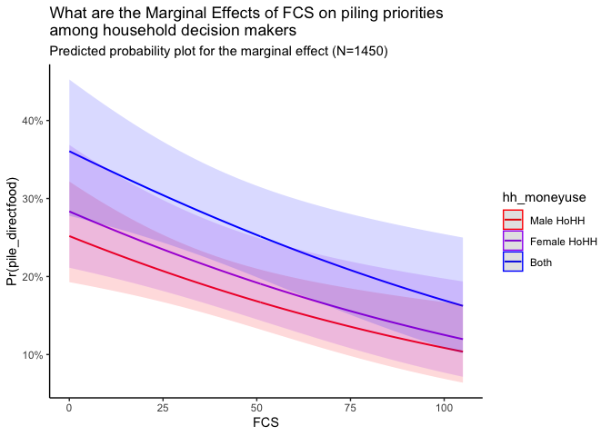

-   [Introduction](#introduction)
-   [Data](#data)
-   [Methods & Models](#methods-models)
-   [Results](#results)
-   [Conclusion](#conclusion)
-   [References](#references)
-   [Annex](#annex)

## Introduction

#### Background

Recent estimates suggest that over half the population of South Sudan is
facing severe acute food insecurity (South Sudan IPC Technical Working
Group 2020). By the summer of 2021, this number is projected to increase
to 60% of the population (7.24 million people) who will fall under
‘crisis’, ‘emergency’ or ‘catastrophe’ classifications of food
insecurity, including 31,000 individuals likely to be facing conditions
of famine (South Sudan IPC Technical Working Group 2020). While this
phenomenon is clearly a grave, real world problem warranting political
attention and resolution (Gustafsson and Hagström 2018), my experiences
close to the processes that produced these classifications compels me to
look at the situation more critically.

The Integrated Food Security Phase Classification’s (IPC) five-phase
scale, with phases distinguished by thresholds of food consumption,
child malnutrition, or related mortality, has become “the global
standard” for classifying situations of acute food insecurity (The IPC
Famine Factsheet 2020). With the tagline, “*Evidence and Standards for
Better Food Security and Nutrition Decisions*,” IPC products are highly
influential in humanitarian responses in contexts such as South Sudan,
where they are used to pinpoint geographic areas of need. The numbers
presented in the IPC’s reports are cited in project proposals and
appeals for funding to international donors as large and small
humanitarian organizations design needs-based responses aimed at
reaching “the most food insecure.” Color-coded IPC maps are projected at
emergency response coordination meetings, guiding discussions about
which counties should be prioritized with the limited resources
available. Even news articles and security updates are peppered with the
numbers describing current and projected food security.

The popularity of IPC metrics is just one example of the range of
approaches to describe levels of food related needs. Beyond assessments
such as early warning and nutrition surveillance systems that seek to
identify populations in need, there are reporting processes such as
through which humanitarian organizations will account for their response
to (identified) need, as well as monitoring processes which seek to
further reconcile need with responses. So important are these processes,
that entire units within humanitarian organizations are dedicated to the
collection of such information or such tasks are outsourced to service
providers. However, despite the increasing range and usage of processes
for describing food security need, the humanitarian system continues to
struggle to respond to and prevent food security crises in South Sudan.
We would expect that more tools and processes to translate the ‘needs’
of affected populations into actionable data would lead to better
informed decisions about where to direct food aid. However, numerous
studies continue to note a disconnect in understandings of need between
localities, humanitarian actors and policy makers. ***Why is there a
disconnect between what affected populations want and what they receive
even though humanitarian service providers have a variety of processes
for measuring levels of need?***

#### Research Question & Hypothesis

I suspect that the reason studies continue to note differences in how
affected populations and humanitarian actors understand levels of food
need relates to the processes by which humanitarians solicit, interpret,
and aggregate information. For instance, the **Food Consumption Score
(FCS)** attempts to present a standardized approximation of a
household’s level of need upon which decisions of providing food
interventions are made. FCS information is a critical component for
determining an IPC classification for a given location, a determination
that has implications for subsequent humanitarian assistance. But do the
needs of affected populations as identified by popular metrics of
humanitarian agencies like the FCS align with what affected populations
say they need?

In 2017-2019, a team of researchers put this to the test, by collecting
information not only on the FCS of households in South Sudan, but also
asking them how they would prioritize resources in their own community
if given the chance. This was done through a piling exercise, during
which respondents demonstrated the amount of resources they would
dedicate to a different area (education, infrastructure, food aid, etc)
if they could decide, by placing different numbers of dried beans on
different representations of the areas. We can understand this piling
exercise as an alternative way to understand need, with the assumption
that participants would allocate more resources to areas they feel their
community needs the most. We simplify this inquiry into prioritizing
direct food aid or any other area. This allows us to as the following
research question: *What does a household’s FCS tell us about the odds
that they would chose to prioritize direct food assistance if given the
chance?* Put differently, does the gold standard (FCS) tell us
information that is any different than a pile of beans could tell us in
terms of which households are in need?

If FCS aligned with the priorities of affected populations, we would
expect that households with lower FCS would prioritize direct food aid
over other types of interventions. Misalignment could indicate that
people’s needs and priorities are more complex than a metric like the
FCS can capture and reflect.

-   *Null Hypothesis*: FCS match how households would prioritize
    resources.
    -   Observable implication: As FCS decrease, households prioritize
        direct food aid over other types of assistance.
-   *Alternative Hypothesis*: FCS do not match how households would
    prioritize resources.
    -   Observable implication: As FCS decrease, households prioritize
        other types of assistance over direct food aid.

#### TLDR: What did we learn in this exploration?

Using a binomial logit regression, we find support for the null
hypothesis. In general, it does appear that the odds a household would
prefer direct food aid over other types of food assistant are higher in
households with lower FCS. This trend generally holds even when we
control for basic demographic features and the person who controls how
resources in a household are used. However, results are distinct enough
to support calls for understanding gender roles in relation to household
food security.

Since this preliminary analysis does not seem to support our hypothesis,
does this mean the FCS is perfectly aligned with community preferences?
Not necessarily. The findings here can not be interpreted without
consideration of the limitations of the data from which they are drawn
and of the model specifications used to explore our hypothesis.
Nonetheless, this study provides a helpful starting point from which
subsequent inquiries related to food security metrics may be built.

## Data

For this inquiry, I draw on an existing data set of household-level
survey data compiled by myself and my colleagues (see Annex). The raw
data set contains 1,552 observations collected in South Sudan between
March-November 2019. This survey was originally meant to supplement
qualitative monitoring exercises conducted at the sites of various
humanitarian interventions across the country by providing community
perceptions in relation to humanitarian programming in general.

This survey was not designed to be representative of a given geographic
area or of the direct beneficiaries of a given humanitarian
intervention. Rather, this survey selected households in the general
population residing within the “catchment area” of specific humanitarian
programs being monitored. It is important to note that in spite of
rhetoric about reaching the most remote populations with the greatest
need, most humanitarian interventions are clustered around a few
established ‘hubs’. As monitoring took place where the interventions
were conducted, this sample reflects this clustering around services. It
is therefore recognized that this data may therefore be biased towards
those with more access to, knowledge of, and potentially participation
in humanitarian programming, while it under-represents those in more
remote locations. Any investigation is exploratory; any insights are
limited as suggestions of wider trends. To make this data usable, it was
necessary to clean the data set. The majority of cleaning related to
enumerator error and measurement error. These processes will be further
explored in subsequent works. The final, cleaned data set contains 1,450
observations.

#### Variables of Interest

This survey was intended to explore community-level perceptions relevant
to humanitarian programming. It contained multiple modules, but only
those related to demographics, food security, and the piling exercise
are utilized for the present hypothesis.

The dependent variable of interest is a binary, categorical variable
with the value of 1 if a respondent piled more dried beans on the
category of “direct food aid” than they did on any other category, and a
value of 0 if otherwise. Based on frequency, we see that the majority of
respondents prioritized areas other than direct food aid.

The independent variable of interest is the Food Consumption Score (FCS)
of a household. This is a continuous, numeric variable based on industry
best practices
(<https://inddex.nutrition.tufts.edu/data4diets/indicator/household-dietary-diversity-score-hdds>).
As shown below, the distribution of FCS among respondents is
right-tailed, with most respondents having a score of less than 50 (the
median). The dotted red line falls on the mean, which is roughly 36.

##### Control variables

The choice of potential control variables was guided by the knowledge of
the limitations of this data set. Given the exploratory nature of this
hypothesis testing, the author was weary to include too many controls.
For instance, while there are important differences in geography to
account for, many administrative boundaries in South Sudan are currently
contested. It was therefore deemed inappropriate to control for this
using variables available in the data set, as existing variables would
only support politically-motivated distinctions that may or may not
align with more pertinent characteristics of a population in that
particular area. It was also deemed inappropriate to explore household
income or other economic factors at this point, with the assumption that
these factors would co-vary with food consumption.

Current transformations brought about by conflict and political-economic
developments are directly impacting gender roles and behaviors
throughout society. Nonetheless, in many areas of South Sudan,
food-related tasks are gendered, with women bearing primary
responsibility for much of a household’s daily food needs. Further,
humanitarian assistance can sometimes reinforce existing gender roles
(Mulukwat 2017). Therefore it is important to take gender and decision
making into account when considering matters of food security and
household resources.

Existing literature also suggests that levels of education have an
effect on household food security, but that these effects are context
dependent (Mutisya et al 2016).

Thus, three control variables are included: 1) the gender of the
respondent; 2) the gender of the household member who decides how
resources in the home will be used; and 3) education level. We also
explore an interaction between gender and education level.

## Methods & Models

Given the nature of our DV of interest (categorical), and our RQ that
seeks to calculate estimates for this data, a binomial logistic
regression was deemed the most appropriate. Logits are also useful since
they can be transformed into odds ratios, which is perhaps easier to
interpret (Hollway Lecture 5 - Binary). It was not deemed appropriate to
transform any variables of interest through logging or squaring, since
many are categorical and the numeric variables are well contained. The
aforementioned limitations of the data set call for some restraint when
it comes to model specification. We test a simple model (Model 1) that
includes only our DV & IV, a model with all our control variables (Model
2), and a model with all control variables plus an interaction term
(Model 3).

#### Preliminary Findings support the null

We can compare the log-odds of our parameters across models as an
initial hypothesis test. This allows us to understand the probability of
prioritizing direct food aid (our DV) as a function of an intercept, IV,
our control variables, and an error term. The results table showing log
odds can be found in the Annex.

In this preliminary analysis, the coefficient of FCS (the IV) is
significant (differentiable from zero) and it is negative, suggesting
that an increase in FCS, decreases the odds of prioritizing direct food
aid. However, we note that the beta value of the IV log-odds is quite
small. More interestingly, this “sign-ificance” (Hollway Lecture 5 -
Binary) of the IV remains the same across all 3 models. Regardless of
the controls used or presence of an interaction term, holding all else
constant, the IV remains significant and negative.

Therefore in general, these models seem to support the idea that FCS is
a good metric (in the sense that it seems to align with areas that
individuals would themselves prioritize).

However, this general indication does not allow us to chose between
models. We can run our regression models using the sjPlot function in R
to understand the respective odds ratios of our parameters, which is
easier to interpret.

<table style="border-collapse:collapse; border:none;">
<tr>
<th style="border-top: double; text-align:center; font-style:normal; font-weight:bold; padding:0.2cm;  text-align:left; ">
 
</th>
<th colspan="3" style="border-top: double; text-align:center; font-style:normal; font-weight:bold; padding:0.2cm; ">
Model 1: simple
</th>
<th colspan="3" style="border-top: double; text-align:center; font-style:normal; font-weight:bold; padding:0.2cm; ">
Model 2: with controls
</th>
<th colspan="3" style="border-top: double; text-align:center; font-style:normal; font-weight:bold; padding:0.2cm; ">
Model 3: interaction
</th>
</tr>
<tr>
<td style=" text-align:center; border-bottom:1px solid; font-style:italic; font-weight:normal;  text-align:left; ">
Predictors
</td>
<td style=" text-align:center; border-bottom:1px solid; font-style:italic; font-weight:normal;  ">
Odds Ratios
</td>
<td style=" text-align:center; border-bottom:1px solid; font-style:italic; font-weight:normal;  ">
CI
</td>
<td style=" text-align:center; border-bottom:1px solid; font-style:italic; font-weight:normal;  ">
p
</td>
<td style=" text-align:center; border-bottom:1px solid; font-style:italic; font-weight:normal;  ">
Odds Ratios
</td>
<td style=" text-align:center; border-bottom:1px solid; font-style:italic; font-weight:normal;  ">
CI
</td>
<td style=" text-align:center; border-bottom:1px solid; font-style:italic; font-weight:normal;  col7">
p
</td>
<td style=" text-align:center; border-bottom:1px solid; font-style:italic; font-weight:normal;  col8">
Odds Ratios
</td>
<td style=" text-align:center; border-bottom:1px solid; font-style:italic; font-weight:normal;  col9">
CI
</td>
<td style=" text-align:center; border-bottom:1px solid; font-style:italic; font-weight:normal;  0">
p
</td>
</tr>
<tr>
<td style=" padding:0.2cm; text-align:left; vertical-align:top; text-align:left; ">
(Intercept)
</td>
<td style=" padding:0.2cm; text-align:left; vertical-align:top; text-align:center;  ">
0.64
</td>
<td style=" padding:0.2cm; text-align:left; vertical-align:top; text-align:center;  ">
0.50 – 0.82
</td>
<td style=" padding:0.2cm; text-align:left; vertical-align:top; text-align:center;  ">
<strong>&lt;0.001</strong>
</td>
<td style=" padding:0.2cm; text-align:left; vertical-align:top; text-align:center;  ">
0.47
</td>
<td style=" padding:0.2cm; text-align:left; vertical-align:top; text-align:center;  ">
0.33 – 0.66
</td>
<td style=" padding:0.2cm; text-align:left; vertical-align:top; text-align:center;  col7">
<strong>&lt;0.001</strong>
</td>
<td style=" padding:0.2cm; text-align:left; vertical-align:top; text-align:center;  col8">
0.37
</td>
<td style=" padding:0.2cm; text-align:left; vertical-align:top; text-align:center;  col9">
0.24 – 0.55
</td>
<td style=" padding:0.2cm; text-align:left; vertical-align:top; text-align:center;  0">
<strong>&lt;0.001</strong>
</td>
</tr>
<tr>
<td style=" padding:0.2cm; text-align:left; vertical-align:top; text-align:left; ">
IV.continuous
</td>
<td style=" padding:0.2cm; text-align:left; vertical-align:top; text-align:center;  ">
0.99
</td>
<td style=" padding:0.2cm; text-align:left; vertical-align:top; text-align:center;  ">
0.98 – 0.99
</td>
<td style=" padding:0.2cm; text-align:left; vertical-align:top; text-align:center;  ">
<strong>&lt;0.001</strong>
</td>
<td style=" padding:0.2cm; text-align:left; vertical-align:top; text-align:center;  ">
0.99
</td>
<td style=" padding:0.2cm; text-align:left; vertical-align:top; text-align:center;  ">
0.98 – 1.00
</td>
<td style=" padding:0.2cm; text-align:left; vertical-align:top; text-align:center;  col7">
<strong>0.001</strong>
</td>
<td style=" padding:0.2cm; text-align:left; vertical-align:top; text-align:center;  col8">
0.99
</td>
<td style=" padding:0.2cm; text-align:left; vertical-align:top; text-align:center;  col9">
0.98 – 1.00
</td>
<td style=" padding:0.2cm; text-align:left; vertical-align:top; text-align:center;  0">
<strong>0.003</strong>
</td>
</tr>
<tr>
<td style=" padding:0.2cm; text-align:left; vertical-align:top; text-align:left; ">
d\_sex \[Female\]
</td>
<td style=" padding:0.2cm; text-align:left; vertical-align:top; text-align:center;  ">
</td>
<td style=" padding:0.2cm; text-align:left; vertical-align:top; text-align:center;  ">
</td>
<td style=" padding:0.2cm; text-align:left; vertical-align:top; text-align:center;  ">
</td>
<td style=" padding:0.2cm; text-align:left; vertical-align:top; text-align:center;  ">
1.46
</td>
<td style=" padding:0.2cm; text-align:left; vertical-align:top; text-align:center;  ">
1.10 – 1.93
</td>
<td style=" padding:0.2cm; text-align:left; vertical-align:top; text-align:center;  col7">
<strong>0.008</strong>
</td>
<td style=" padding:0.2cm; text-align:left; vertical-align:top; text-align:center;  col8">
1.97
</td>
<td style=" padding:0.2cm; text-align:left; vertical-align:top; text-align:center;  col9">
1.37 – 2.87
</td>
<td style=" padding:0.2cm; text-align:left; vertical-align:top; text-align:center;  0">
<strong>&lt;0.001</strong>
</td>
</tr>
<tr>
<td style=" padding:0.2cm; text-align:left; vertical-align:top; text-align:left; ">
d\_education
</td>
<td style=" padding:0.2cm; text-align:left; vertical-align:top; text-align:center;  ">
</td>
<td style=" padding:0.2cm; text-align:left; vertical-align:top; text-align:center;  ">
</td>
<td style=" padding:0.2cm; text-align:left; vertical-align:top; text-align:center;  ">
</td>
<td style=" padding:0.2cm; text-align:left; vertical-align:top; text-align:center;  ">
0.95
</td>
<td style=" padding:0.2cm; text-align:left; vertical-align:top; text-align:center;  ">
0.92 – 0.97
</td>
<td style=" padding:0.2cm; text-align:left; vertical-align:top; text-align:center;  col7">
<strong>&lt;0.001</strong>
</td>
<td style=" padding:0.2cm; text-align:left; vertical-align:top; text-align:center;  col8">
0.98
</td>
<td style=" padding:0.2cm; text-align:left; vertical-align:top; text-align:center;  col9">
0.95 – 1.02
</td>
<td style=" padding:0.2cm; text-align:left; vertical-align:top; text-align:center;  0">
0.279
</td>
</tr>
<tr>
<td style=" padding:0.2cm; text-align:left; vertical-align:top; text-align:left; ">
hh\_moneyuse \[Female HoHH\]
</td>
<td style=" padding:0.2cm; text-align:left; vertical-align:top; text-align:center;  ">
</td>
<td style=" padding:0.2cm; text-align:left; vertical-align:top; text-align:center;  ">
</td>
<td style=" padding:0.2cm; text-align:left; vertical-align:top; text-align:center;  ">
</td>
<td style=" padding:0.2cm; text-align:left; vertical-align:top; text-align:center;  ">
1.20
</td>
<td style=" padding:0.2cm; text-align:left; vertical-align:top; text-align:center;  ">
0.91 – 1.59
</td>
<td style=" padding:0.2cm; text-align:left; vertical-align:top; text-align:center;  col7">
0.200
</td>
<td style=" padding:0.2cm; text-align:left; vertical-align:top; text-align:center;  col8">
1.18
</td>
<td style=" padding:0.2cm; text-align:left; vertical-align:top; text-align:center;  col9">
0.89 – 1.56
</td>
<td style=" padding:0.2cm; text-align:left; vertical-align:top; text-align:center;  0">
0.262
</td>
</tr>
<tr>
<td style=" padding:0.2cm; text-align:left; vertical-align:top; text-align:left; ">
hh\_moneyuse \[Both\]
</td>
<td style=" padding:0.2cm; text-align:left; vertical-align:top; text-align:center;  ">
</td>
<td style=" padding:0.2cm; text-align:left; vertical-align:top; text-align:center;  ">
</td>
<td style=" padding:0.2cm; text-align:left; vertical-align:top; text-align:center;  ">
</td>
<td style=" padding:0.2cm; text-align:left; vertical-align:top; text-align:center;  ">
1.64
</td>
<td style=" padding:0.2cm; text-align:left; vertical-align:top; text-align:center;  ">
1.20 – 2.24
</td>
<td style=" padding:0.2cm; text-align:left; vertical-align:top; text-align:center;  col7">
<strong>0.002</strong>
</td>
<td style=" padding:0.2cm; text-align:left; vertical-align:top; text-align:center;  col8">
1.68
</td>
<td style=" padding:0.2cm; text-align:left; vertical-align:top; text-align:center;  col9">
1.23 – 2.29
</td>
<td style=" padding:0.2cm; text-align:left; vertical-align:top; text-align:center;  0">
<strong>0.001</strong>
</td>
</tr>
<tr>
<td style=" padding:0.2cm; text-align:left; vertical-align:top; text-align:left; ">
d\_sex \[Female\] \* d\_education
</td>
<td style=" padding:0.2cm; text-align:left; vertical-align:top; text-align:center;  ">
</td>
<td style=" padding:0.2cm; text-align:left; vertical-align:top; text-align:center;  ">
</td>
<td style=" padding:0.2cm; text-align:left; vertical-align:top; text-align:center;  ">
</td>
<td style=" padding:0.2cm; text-align:left; vertical-align:top; text-align:center;  ">
</td>
<td style=" padding:0.2cm; text-align:left; vertical-align:top; text-align:center;  ">
</td>
<td style=" padding:0.2cm; text-align:left; vertical-align:top; text-align:center;  col7">
</td>
<td style=" padding:0.2cm; text-align:left; vertical-align:top; text-align:center;  col8">
0.93
</td>
<td style=" padding:0.2cm; text-align:left; vertical-align:top; text-align:center;  col9">
0.89 – 0.98
</td>
<td style=" padding:0.2cm; text-align:left; vertical-align:top; text-align:center;  0">
<strong>0.010</strong>
</td>
</tr>
<tr>
<td style=" padding:0.2cm; text-align:left; vertical-align:top; text-align:left; padding-top:0.1cm; padding-bottom:0.1cm; border-top:1px solid;">
Observations
</td>
<td style=" padding:0.2cm; text-align:left; vertical-align:top; padding-top:0.1cm; padding-bottom:0.1cm; text-align:left; border-top:1px solid;" colspan="3">
1450
</td>
<td style=" padding:0.2cm; text-align:left; vertical-align:top; padding-top:0.1cm; padding-bottom:0.1cm; text-align:left; border-top:1px solid;" colspan="3">
1450
</td>
<td style=" padding:0.2cm; text-align:left; vertical-align:top; padding-top:0.1cm; padding-bottom:0.1cm; text-align:left; border-top:1px solid;" colspan="3">
1450
</td>
</tr>
<tr>
<td style=" padding:0.2cm; text-align:left; vertical-align:top; text-align:left; padding-top:0.1cm; padding-bottom:0.1cm;">
R2 Tjur
</td>
<td style=" padding:0.2cm; text-align:left; vertical-align:top; padding-top:0.1cm; padding-bottom:0.1cm; text-align:left;" colspan="3">
0.013
</td>
<td style=" padding:0.2cm; text-align:left; vertical-align:top; padding-top:0.1cm; padding-bottom:0.1cm; text-align:left;" colspan="3">
0.044
</td>
<td style=" padding:0.2cm; text-align:left; vertical-align:top; padding-top:0.1cm; padding-bottom:0.1cm; text-align:left;" colspan="3">
0.048
</td>
</tr>
</table>

Across all three models, the results suggest that holding all over
parameters constant, as FCS increases (by one unit) the odds of
prioritizing direct food aid decrease by 0.99 (or 169% if we
exponentiate). This finding is statistically significant.

When looking at the effect of gender, Model 2 indicates that being a
female respondent increases the odds of prioritizing direct food aid by
1.46 (or roughly 330% if we exponentiate), as compared to male
respondents, holding all other parameters constant. This relationship is
consistent in its direction and significance across Model 2 and 3.

Education appears to have a positive effect on the odds of prioritizing
direct food aid, but it is only statistically significant in Model 2.
However, the interaction term between the gender of a respondent and
their level of education is shown to be statistically significant in
Model 3.

However, we should not get too carried away with our substantive
interpretations of either log odds or odds ratios. For instance, Mood
(2010) would suggest that we should pay attention to predicted
probabilities, marginal effects, and average marginal effects. Norton
and Dowd (2018) reiterate this, and emphasize that AME are preferable to
odds ratios due to how odds ratios are computed. Therefore, once a model
is selected, we will put more stock in the results of these other
indicators (see: Results)

#### Selecting a model

We have three models and each include statistically significant results,
but that doesn’t automatically mean they are all of equal utility.
Ideally, we would select a model that, in comparison to others, appears
to fit our data best. We can do this by looking at Likelihood Ratios,
AIC, and the ROC.

    ## Likelihood ratio test
    ## 
    ## Model 1: DV.binary ~ IV.continuous
    ## Model 2: DV.binary ~ IV.continuous + d_sex + d_education + hh_moneyuse
    ## Model 3: DV.binary ~ IV.continuous + d_sex + d_education + hh_moneyuse + 
    ##     d_sex * d_education
    ##   #Df  LogLik Df   Chisq Pr(>Chisq)    
    ## 1   2 -854.58                          
    ## 2   6 -832.13  4 44.9060  4.159e-09 ***
    ## 3   7 -828.75  1  6.7437   0.009408 ** 
    ## ---
    ## Signif. codes:  0 '***' 0.001 '**' 0.01 '*' 0.05 '.' 0.1 ' ' 1

The Likelihood Ratio Test compares the likelihood scores of the three
models to determine if the difference between the three is statistically
significant, by testing if the predictors are jointly significant. Based
on the output of this LR test, which gives us a p-value less than 0.05
for Models 2 and 3, we can reject the null hypothesis that the smaller
model (Model 1) is true. Therefore, we would chose Model 2 or Model 3,
as there evidence against the reduced model alternative.

We can also revisit our regression results, this time including AIC for
comparison, which is appropriate since we are training the models on the
exact same data.
<table style="border-collapse:collapse; border:none;">
<tr>
<th style="border-top: double; text-align:center; font-style:normal; font-weight:bold; padding:0.2cm;  text-align:left; ">
 
</th>
<th colspan="3" style="border-top: double; text-align:center; font-style:normal; font-weight:bold; padding:0.2cm; ">
DV.binary
</th>
<th colspan="3" style="border-top: double; text-align:center; font-style:normal; font-weight:bold; padding:0.2cm; ">
DV.binary
</th>
</tr>
<tr>
<td style=" text-align:center; border-bottom:1px solid; font-style:italic; font-weight:normal;  text-align:left; ">
Predictors
</td>
<td style=" text-align:center; border-bottom:1px solid; font-style:italic; font-weight:normal;  ">
Odds Ratios
</td>
<td style=" text-align:center; border-bottom:1px solid; font-style:italic; font-weight:normal;  ">
CI
</td>
<td style=" text-align:center; border-bottom:1px solid; font-style:italic; font-weight:normal;  ">
p
</td>
<td style=" text-align:center; border-bottom:1px solid; font-style:italic; font-weight:normal;  ">
Odds Ratios
</td>
<td style=" text-align:center; border-bottom:1px solid; font-style:italic; font-weight:normal;  ">
CI
</td>
<td style=" text-align:center; border-bottom:1px solid; font-style:italic; font-weight:normal;  col7">
p
</td>
</tr>
<tr>
<td style=" padding:0.2cm; text-align:left; vertical-align:top; text-align:left; ">
(Intercept)
</td>
<td style=" padding:0.2cm; text-align:left; vertical-align:top; text-align:center;  ">
0.47
</td>
<td style=" padding:0.2cm; text-align:left; vertical-align:top; text-align:center;  ">
0.33 – 0.66
</td>
<td style=" padding:0.2cm; text-align:left; vertical-align:top; text-align:center;  ">
<strong>&lt;0.001</strong>
</td>
<td style=" padding:0.2cm; text-align:left; vertical-align:top; text-align:center;  ">
0.37
</td>
<td style=" padding:0.2cm; text-align:left; vertical-align:top; text-align:center;  ">
0.24 – 0.55
</td>
<td style=" padding:0.2cm; text-align:left; vertical-align:top; text-align:center;  col7">
<strong>&lt;0.001</strong>
</td>
</tr>
<tr>
<td style=" padding:0.2cm; text-align:left; vertical-align:top; text-align:left; ">
IV.continuous
</td>
<td style=" padding:0.2cm; text-align:left; vertical-align:top; text-align:center;  ">
0.99
</td>
<td style=" padding:0.2cm; text-align:left; vertical-align:top; text-align:center;  ">
0.98 – 1.00
</td>
<td style=" padding:0.2cm; text-align:left; vertical-align:top; text-align:center;  ">
<strong>0.001</strong>
</td>
<td style=" padding:0.2cm; text-align:left; vertical-align:top; text-align:center;  ">
0.99
</td>
<td style=" padding:0.2cm; text-align:left; vertical-align:top; text-align:center;  ">
0.98 – 1.00
</td>
<td style=" padding:0.2cm; text-align:left; vertical-align:top; text-align:center;  col7">
<strong>0.003</strong>
</td>
</tr>
<tr>
<td style=" padding:0.2cm; text-align:left; vertical-align:top; text-align:left; ">
d\_sex \[Female\]
</td>
<td style=" padding:0.2cm; text-align:left; vertical-align:top; text-align:center;  ">
1.46
</td>
<td style=" padding:0.2cm; text-align:left; vertical-align:top; text-align:center;  ">
1.10 – 1.93
</td>
<td style=" padding:0.2cm; text-align:left; vertical-align:top; text-align:center;  ">
<strong>0.008</strong>
</td>
<td style=" padding:0.2cm; text-align:left; vertical-align:top; text-align:center;  ">
1.97
</td>
<td style=" padding:0.2cm; text-align:left; vertical-align:top; text-align:center;  ">
1.37 – 2.87
</td>
<td style=" padding:0.2cm; text-align:left; vertical-align:top; text-align:center;  col7">
<strong>&lt;0.001</strong>
</td>
</tr>
<tr>
<td style=" padding:0.2cm; text-align:left; vertical-align:top; text-align:left; ">
d\_education
</td>
<td style=" padding:0.2cm; text-align:left; vertical-align:top; text-align:center;  ">
0.95
</td>
<td style=" padding:0.2cm; text-align:left; vertical-align:top; text-align:center;  ">
0.92 – 0.97
</td>
<td style=" padding:0.2cm; text-align:left; vertical-align:top; text-align:center;  ">
<strong>&lt;0.001</strong>
</td>
<td style=" padding:0.2cm; text-align:left; vertical-align:top; text-align:center;  ">
0.98
</td>
<td style=" padding:0.2cm; text-align:left; vertical-align:top; text-align:center;  ">
0.95 – 1.02
</td>
<td style=" padding:0.2cm; text-align:left; vertical-align:top; text-align:center;  col7">
0.279
</td>
</tr>
<tr>
<td style=" padding:0.2cm; text-align:left; vertical-align:top; text-align:left; ">
hh\_moneyuse \[Female HoHH\]
</td>
<td style=" padding:0.2cm; text-align:left; vertical-align:top; text-align:center;  ">
1.20
</td>
<td style=" padding:0.2cm; text-align:left; vertical-align:top; text-align:center;  ">
0.91 – 1.59
</td>
<td style=" padding:0.2cm; text-align:left; vertical-align:top; text-align:center;  ">
0.200
</td>
<td style=" padding:0.2cm; text-align:left; vertical-align:top; text-align:center;  ">
1.18
</td>
<td style=" padding:0.2cm; text-align:left; vertical-align:top; text-align:center;  ">
0.89 – 1.56
</td>
<td style=" padding:0.2cm; text-align:left; vertical-align:top; text-align:center;  col7">
0.262
</td>
</tr>
<tr>
<td style=" padding:0.2cm; text-align:left; vertical-align:top; text-align:left; ">
hh\_moneyuse \[Both\]
</td>
<td style=" padding:0.2cm; text-align:left; vertical-align:top; text-align:center;  ">
1.64
</td>
<td style=" padding:0.2cm; text-align:left; vertical-align:top; text-align:center;  ">
1.20 – 2.24
</td>
<td style=" padding:0.2cm; text-align:left; vertical-align:top; text-align:center;  ">
<strong>0.002</strong>
</td>
<td style=" padding:0.2cm; text-align:left; vertical-align:top; text-align:center;  ">
1.68
</td>
<td style=" padding:0.2cm; text-align:left; vertical-align:top; text-align:center;  ">
1.23 – 2.29
</td>
<td style=" padding:0.2cm; text-align:left; vertical-align:top; text-align:center;  col7">
<strong>0.001</strong>
</td>
</tr>
<tr>
<td style=" padding:0.2cm; text-align:left; vertical-align:top; text-align:left; ">
d\_sex \[Female\] \* d\_education
</td>
<td style=" padding:0.2cm; text-align:left; vertical-align:top; text-align:center;  ">
</td>
<td style=" padding:0.2cm; text-align:left; vertical-align:top; text-align:center;  ">
</td>
<td style=" padding:0.2cm; text-align:left; vertical-align:top; text-align:center;  ">
</td>
<td style=" padding:0.2cm; text-align:left; vertical-align:top; text-align:center;  ">
0.93
</td>
<td style=" padding:0.2cm; text-align:left; vertical-align:top; text-align:center;  ">
0.89 – 0.98
</td>
<td style=" padding:0.2cm; text-align:left; vertical-align:top; text-align:center;  col7">
<strong>0.010</strong>
</td>
</tr>
<tr>
<td style=" padding:0.2cm; text-align:left; vertical-align:top; text-align:left; padding-top:0.1cm; padding-bottom:0.1cm; border-top:1px solid;">
Observations
</td>
<td style=" padding:0.2cm; text-align:left; vertical-align:top; padding-top:0.1cm; padding-bottom:0.1cm; text-align:left; border-top:1px solid;" colspan="3">
1450
</td>
<td style=" padding:0.2cm; text-align:left; vertical-align:top; padding-top:0.1cm; padding-bottom:0.1cm; text-align:left; border-top:1px solid;" colspan="3">
1450
</td>
</tr>
<tr>
<td style=" padding:0.2cm; text-align:left; vertical-align:top; text-align:left; padding-top:0.1cm; padding-bottom:0.1cm;">
AIC
</td>
<td style=" padding:0.2cm; text-align:left; vertical-align:top; padding-top:0.1cm; padding-bottom:0.1cm; text-align:left;" colspan="3">
1676.252
</td>
<td style=" padding:0.2cm; text-align:left; vertical-align:top; padding-top:0.1cm; padding-bottom:0.1cm; text-align:left;" colspan="3">
1671.508
</td>
</tr>
<tr>
<td style=" padding:0.2cm; text-align:left; vertical-align:top; text-align:left; padding-top:0.1cm; padding-bottom:0.1cm;">
log-Likelihood
</td>
<td style=" padding:0.2cm; text-align:left; vertical-align:top; padding-top:0.1cm; padding-bottom:0.1cm; text-align:left;" colspan="3">
-832.126
</td>
<td style=" padding:0.2cm; text-align:left; vertical-align:top; padding-top:0.1cm; padding-bottom:0.1cm; text-align:left;" colspan="3">
-828.754
</td>
</tr>
</table>

In the results table above, we see that Model 3 has a slightly lower AIC
value than Model 2, suggesting we select the former. As once final
check, we will also consider the accuracy of the models by examining the
Receiver Operating Characteristic (ROC) curve plots.

The Area under the Curve (AUC) values tell us two key things. First,
that both Model 2 (glm2) and Model 3 (glm3) perform the same in terms of
the accuracy of classification. However, more importantly, neither of
these models seem to give us much confidence in the accuracy of their
classifications. At 0.64, these models are just shy of a total failure
(Hollway Lecture 5 - Binary).

Together, the LR test and AIC values suggest that we should use Model 3
to explore our hypothesis, but our AUROC values remind us to exercise
constraint with the findings, given that our models may not be as
accurate as we might like.

## Results

Bearing in mind the limitations of our selected model, we now seek to
explore support for our hypothesis through predicted probabilities and
marginal effects.

Indeed, holding all else equal, the predicted probability graph for
Model 3 indicates a negative association between the probability an
individual prioritizes direct food aid and their food consumption score.
In other words, the higher an individuals food consumption score, the
less probable they are to prioritize direct food aid.

Based on the plot above, which assumes all other variables are held
constant, we see a familiar pattern in that those with higher FCS have a
lower probability of prioritizing direct food aid. This trend holds for
both male and female respondents alike. However, given the higher
intercept of female respondents and otherwise parallel lines, it appears
that the odds of a female respondent prioritizing direct food aid over
other forms of assistance are higher than that of male respondents,
regardless of their FCS.

    ##         factor     AME     SE       z      p   lower   upper
    ##    d_sexFemale  0.0806 0.0258  3.1211 0.0018  0.0300  0.1312
    ##  IV.continuous -0.0020 0.0006 -3.0485 0.0023 -0.0032 -0.0007

The table showing average marginal effects (AME) supports this as well.
The sign of the AME for d\_sex is positive and statistically
significant; and for FCS it is negative and significant. This can be
interpreted as the average marginal effect of an additional unit of FCS
is a decrease of 0.0021 on the predicted probability (a decrease by 0.2
percentage points on average) and the predicted probability of
prioritizing direct food aid for female respondents is 0.0718 (an
increase of 7 percentage points on average) more on average than for
male respondents.

The plot above, again assuming all other variables are held constant,
reveals a similar trend, but adds another layer. In households where
both spouses decide how resources will be used, the odds that they will
prioritize direct food aid over other types of assistance are higher
than that of a female headed household or a male headed household. This
finding might give some support to notions of changing gender roles and
their effect on household food security, as suggested by the literature
cited above.

## Conclusion

This study has used binomial logit regressions to explore how well a
commonly used food security metric aligns with the priorities of
affected populations in South Sudan. In general, findings indicate that
households with lower food consumption scores have higher odds of
prioritizing direct food aid than households with higher food
consumption scores. While this preliminary analysis does not seem to
support our hypothesis, the results should be understood as exploratory,
given some of the shortcomings in the accuracy of the selected models.
Nonetheless, these preliminary findings can be used to inform subsequent
inquiries such as:

-   Repeating the exploration outlined above, with data that is more
    geographically representative
-   Repeating the exploration outlined above, but with a non-binary
    categorical DV or by restructuring the nature of the existing binary
    DV (i.e. grouping any food-related area such as direct food aid and
    agricultural support together)
-   Repeating the exploration outlined above with other common metrics
    of food security (such as dietary diversity scores) as a IV
-   Exploring more model specifications that yield higher accuracy in
    their classification. This might include controls for age.
-   Exploring how priorities (piling exercise) are effected by notions
    of social cohesion or other forms of humanitarian programming
    happening in that area (this data is currently available in the
    existing data set, but will require significant “wrangling”)
-   Comparing results with other studies exploring changes in gender
    roles
-   Exploring the data generating processes that produce the survey
    observations utilized for this and other surveys to better
    understand how food security metrics are understood by a variety of
    interlocutors.

## References

Gustafsson, K,, & Hagström, L (2018). “What Is the Point? Teaching
Graduate Students How to Construct Political Science Research Puzzles.”
European Political Science 17, no. 634–48.
<https://doi.org/10.1057/s41304-017-0130-y>.

Mulukwat, K. (2017). “Gender Norms, Conflict, and Aid - briefing note.”
Conflict Sensitivity Resource Facility.
<https://www.csrf-southsudan.org/repository/gender-norms-conflict-aid-briefing-note/>

Mood, C. (2010) Logistic Regression: Why We Cannot Do What We Think We
Can Do, and What We Can Do About It, European Sociological Review,
26(1), 67–82, <https://doi.org/10.1093/esr/jcp006>

Mutisya, M., Ngware, M.W., Kabiru, C.W. et al. (2016). “The effect of
education on household food security in two informal urban settlements
in Kenya: a longitudinal analysis.” Food Sec. 8, 743–756
<https://doi.org/10.1007/s12571-016-0589-3>

Norton, E. C., & Dowd, B. E. (2018). Log Odds and the Interpretation of
Logit Models. Health services research, 53(2), 859–878.
<https://doi.org/10.1111/1475-6773.12712>

“The IPC Famine Factsheet.” Factsheet. Integrated Food Security Phase
Classification, 2020.
<https://reliefweb.int/report/world/ipc-famine-factsheet-updated-december-2020>.

#### R Packages

Fox J, Weisberg S (2019). An R Companion to Applied Regression, Third
edition. Sage, Thousand Oaks CA.
<https://socialsciences.mcmaster.ca/jfox/Books/Companion/>.

John, Christopher (2020) MLeval: Machine Learning Model Evaluation.
<https://cran.r-project.org/web/packages/MLeval/index.html>

Kassambara, Alboukadel (2020). ggpubr: ‘ggplot2’ Based Publication Ready
Plots. R package version 0.4.0,
<https://cran.r-project.org/web/packages/ggpubr/index.html>.

Leeper TJ (2021). margins: Marginal Effects for Model Objects. R package
version
0.3.26.https://cran.r-project.org/web/packages/margins/citation.html

Lüdecke D (2021). sjPlot: Data Visualization for Statistics in Social
Science. R package version 2.8.8,
<https://CRAN.R-project.org/package=sjPlot>.

Revelle W (2021). psych: Procedures for Psychological, Psychometric, and
Personality Research. Northwestern University, Evanston, Illinois. R
package version 2.1.3, <https://CRAN.R-project.org/package=psych>.

Rich, Benjamin (2021). table1: Table of Descriptive Statistics in HTML.
<https://cran.r-project.org/package=table1>

Sachs, Michael C. (2017). plotROC: A Tool for Plotting ROC Curves.
Journal of Statistical Software, Code Snippets, 79(2),
1-19.<doi:10.18637/jss.v079.c02>

Wickham H, Averick M, Bryan J, Chang W, McGowan LD, François R,
Grolemund G, Hayes A, Henry L, Hester J, Kuhn M, Pedersen TL, Miller E,
Bache SM, Müller K, Ooms J, Robinson D, Seidel DP, Spinu V, Takahashi K,
Vaughan D, Wilke C, Woo K, Yutani H (2019). “Welcome to the tidyverse.”
Journal of Open Source Software, 4(43), 1686. doi: 10.21105/joss.01686.

## Annex

#### Additional notes on the data

The survey from which this data is drawn was collectively designed and
managed by the ELFSS team from 2017-2020, which included Philip Taban,
Lokiri Moses, Brendan Tuttle, Eero Wahlstedt, Hayley Umayam, Angelina
Gon, Holly Moses, Nyama Williams, Kur Kur, and others. Data collection
was conducted by numerous enumerators, without whom this work would not
be possible.

#### Model Comparison using Log Odds

\#comparing models with log-odds
<table style="border-collapse:collapse; border:none;">
<tr>
<th style="border-top: double; text-align:center; font-style:normal; font-weight:bold; padding:0.2cm;  text-align:left; ">
 
</th>
<th colspan="3" style="border-top: double; text-align:center; font-style:normal; font-weight:bold; padding:0.2cm; ">
Model 1: simple
</th>
<th colspan="3" style="border-top: double; text-align:center; font-style:normal; font-weight:bold; padding:0.2cm; ">
Model 2: with controls
</th>
<th colspan="3" style="border-top: double; text-align:center; font-style:normal; font-weight:bold; padding:0.2cm; ">
Model 3: interaction
</th>
</tr>
<tr>
<td style=" text-align:center; border-bottom:1px solid; font-style:italic; font-weight:normal;  text-align:left; ">
Predictors
</td>
<td style=" text-align:center; border-bottom:1px solid; font-style:italic; font-weight:normal;  ">
Log-Odds
</td>
<td style=" text-align:center; border-bottom:1px solid; font-style:italic; font-weight:normal;  ">
CI
</td>
<td style=" text-align:center; border-bottom:1px solid; font-style:italic; font-weight:normal;  ">
p
</td>
<td style=" text-align:center; border-bottom:1px solid; font-style:italic; font-weight:normal;  ">
Log-Odds
</td>
<td style=" text-align:center; border-bottom:1px solid; font-style:italic; font-weight:normal;  ">
CI
</td>
<td style=" text-align:center; border-bottom:1px solid; font-style:italic; font-weight:normal;  col7">
p
</td>
<td style=" text-align:center; border-bottom:1px solid; font-style:italic; font-weight:normal;  col8">
Log-Odds
</td>
<td style=" text-align:center; border-bottom:1px solid; font-style:italic; font-weight:normal;  col9">
CI
</td>
<td style=" text-align:center; border-bottom:1px solid; font-style:italic; font-weight:normal;  0">
p
</td>
</tr>
<tr>
<td style=" padding:0.2cm; text-align:left; vertical-align:top; text-align:left; ">
(Intercept)
</td>
<td style=" padding:0.2cm; text-align:left; vertical-align:top; text-align:center;  ">
-0.44
</td>
<td style=" padding:0.2cm; text-align:left; vertical-align:top; text-align:center;  ">
-0.69 – -0.20
</td>
<td style=" padding:0.2cm; text-align:left; vertical-align:top; text-align:center;  ">
<strong>&lt;0.001</strong>
</td>
<td style=" padding:0.2cm; text-align:left; vertical-align:top; text-align:center;  ">
-0.76
</td>
<td style=" padding:0.2cm; text-align:left; vertical-align:top; text-align:center;  ">
-1.11 – -0.41
</td>
<td style=" padding:0.2cm; text-align:left; vertical-align:top; text-align:center;  col7">
<strong>&lt;0.001</strong>
</td>
<td style=" padding:0.2cm; text-align:left; vertical-align:top; text-align:center;  col8">
-1.00
</td>
<td style=" padding:0.2cm; text-align:left; vertical-align:top; text-align:center;  col9">
-1.41 – -0.60
</td>
<td style=" padding:0.2cm; text-align:left; vertical-align:top; text-align:center;  0">
<strong>&lt;0.001</strong>
</td>
</tr>
<tr>
<td style=" padding:0.2cm; text-align:left; vertical-align:top; text-align:left; ">
IV.continuous
</td>
<td style=" padding:0.2cm; text-align:left; vertical-align:top; text-align:center;  ">
-0.01
</td>
<td style=" padding:0.2cm; text-align:left; vertical-align:top; text-align:center;  ">
-0.02 – -0.01
</td>
<td style=" padding:0.2cm; text-align:left; vertical-align:top; text-align:center;  ">
<strong>&lt;0.001</strong>
</td>
<td style=" padding:0.2cm; text-align:left; vertical-align:top; text-align:center;  ">
-0.01
</td>
<td style=" padding:0.2cm; text-align:left; vertical-align:top; text-align:center;  ">
-0.02 – -0.00
</td>
<td style=" padding:0.2cm; text-align:left; vertical-align:top; text-align:center;  col7">
<strong>0.001</strong>
</td>
<td style=" padding:0.2cm; text-align:left; vertical-align:top; text-align:center;  col8">
-0.01
</td>
<td style=" padding:0.2cm; text-align:left; vertical-align:top; text-align:center;  col9">
-0.02 – -0.00
</td>
<td style=" padding:0.2cm; text-align:left; vertical-align:top; text-align:center;  0">
<strong>0.003</strong>
</td>
</tr>
<tr>
<td style=" padding:0.2cm; text-align:left; vertical-align:top; text-align:left; ">
d\_sex \[Female\]
</td>
<td style=" padding:0.2cm; text-align:left; vertical-align:top; text-align:center;  ">
</td>
<td style=" padding:0.2cm; text-align:left; vertical-align:top; text-align:center;  ">
</td>
<td style=" padding:0.2cm; text-align:left; vertical-align:top; text-align:center;  ">
</td>
<td style=" padding:0.2cm; text-align:left; vertical-align:top; text-align:center;  ">
0.38
</td>
<td style=" padding:0.2cm; text-align:left; vertical-align:top; text-align:center;  ">
0.10 – 0.66
</td>
<td style=" padding:0.2cm; text-align:left; vertical-align:top; text-align:center;  col7">
<strong>0.008</strong>
</td>
<td style=" padding:0.2cm; text-align:left; vertical-align:top; text-align:center;  col8">
0.68
</td>
<td style=" padding:0.2cm; text-align:left; vertical-align:top; text-align:center;  col9">
0.32 – 1.05
</td>
<td style=" padding:0.2cm; text-align:left; vertical-align:top; text-align:center;  0">
<strong>&lt;0.001</strong>
</td>
</tr>
<tr>
<td style=" padding:0.2cm; text-align:left; vertical-align:top; text-align:left; ">
d\_education
</td>
<td style=" padding:0.2cm; text-align:left; vertical-align:top; text-align:center;  ">
</td>
<td style=" padding:0.2cm; text-align:left; vertical-align:top; text-align:center;  ">
</td>
<td style=" padding:0.2cm; text-align:left; vertical-align:top; text-align:center;  ">
</td>
<td style=" padding:0.2cm; text-align:left; vertical-align:top; text-align:center;  ">
-0.05
</td>
<td style=" padding:0.2cm; text-align:left; vertical-align:top; text-align:center;  ">
-0.08 – -0.03
</td>
<td style=" padding:0.2cm; text-align:left; vertical-align:top; text-align:center;  col7">
<strong>&lt;0.001</strong>
</td>
<td style=" padding:0.2cm; text-align:left; vertical-align:top; text-align:center;  col8">
-0.02
</td>
<td style=" padding:0.2cm; text-align:left; vertical-align:top; text-align:center;  col9">
-0.06 – 0.02
</td>
<td style=" padding:0.2cm; text-align:left; vertical-align:top; text-align:center;  0">
0.279
</td>
</tr>
<tr>
<td style=" padding:0.2cm; text-align:left; vertical-align:top; text-align:left; ">
hh\_moneyuse \[Female HoHH\]
</td>
<td style=" padding:0.2cm; text-align:left; vertical-align:top; text-align:center;  ">
</td>
<td style=" padding:0.2cm; text-align:left; vertical-align:top; text-align:center;  ">
</td>
<td style=" padding:0.2cm; text-align:left; vertical-align:top; text-align:center;  ">
</td>
<td style=" padding:0.2cm; text-align:left; vertical-align:top; text-align:center;  ">
0.18
</td>
<td style=" padding:0.2cm; text-align:left; vertical-align:top; text-align:center;  ">
-0.10 – 0.46
</td>
<td style=" padding:0.2cm; text-align:left; vertical-align:top; text-align:center;  col7">
0.200
</td>
<td style=" padding:0.2cm; text-align:left; vertical-align:top; text-align:center;  col8">
0.16
</td>
<td style=" padding:0.2cm; text-align:left; vertical-align:top; text-align:center;  col9">
-0.12 – 0.44
</td>
<td style=" padding:0.2cm; text-align:left; vertical-align:top; text-align:center;  0">
0.262
</td>
</tr>
<tr>
<td style=" padding:0.2cm; text-align:left; vertical-align:top; text-align:left; ">
hh\_moneyuse \[Both\]
</td>
<td style=" padding:0.2cm; text-align:left; vertical-align:top; text-align:center;  ">
</td>
<td style=" padding:0.2cm; text-align:left; vertical-align:top; text-align:center;  ">
</td>
<td style=" padding:0.2cm; text-align:left; vertical-align:top; text-align:center;  ">
</td>
<td style=" padding:0.2cm; text-align:left; vertical-align:top; text-align:center;  ">
0.50
</td>
<td style=" padding:0.2cm; text-align:left; vertical-align:top; text-align:center;  ">
0.19 – 0.81
</td>
<td style=" padding:0.2cm; text-align:left; vertical-align:top; text-align:center;  col7">
<strong>0.002</strong>
</td>
<td style=" padding:0.2cm; text-align:left; vertical-align:top; text-align:center;  col8">
0.52
</td>
<td style=" padding:0.2cm; text-align:left; vertical-align:top; text-align:center;  col9">
0.20 – 0.83
</td>
<td style=" padding:0.2cm; text-align:left; vertical-align:top; text-align:center;  0">
<strong>0.001</strong>
</td>
</tr>
<tr>
<td style=" padding:0.2cm; text-align:left; vertical-align:top; text-align:left; ">
d\_sex \[Female\] \* d\_education
</td>
<td style=" padding:0.2cm; text-align:left; vertical-align:top; text-align:center;  ">
</td>
<td style=" padding:0.2cm; text-align:left; vertical-align:top; text-align:center;  ">
</td>
<td style=" padding:0.2cm; text-align:left; vertical-align:top; text-align:center;  ">
</td>
<td style=" padding:0.2cm; text-align:left; vertical-align:top; text-align:center;  ">
</td>
<td style=" padding:0.2cm; text-align:left; vertical-align:top; text-align:center;  ">
</td>
<td style=" padding:0.2cm; text-align:left; vertical-align:top; text-align:center;  col7">
</td>
<td style=" padding:0.2cm; text-align:left; vertical-align:top; text-align:center;  col8">
-0.07
</td>
<td style=" padding:0.2cm; text-align:left; vertical-align:top; text-align:center;  col9">
-0.12 – -0.02
</td>
<td style=" padding:0.2cm; text-align:left; vertical-align:top; text-align:center;  0">
<strong>0.010</strong>
</td>
</tr>
<tr>
<td style=" padding:0.2cm; text-align:left; vertical-align:top; text-align:left; padding-top:0.1cm; padding-bottom:0.1cm; border-top:1px solid;">
Observations
</td>
<td style=" padding:0.2cm; text-align:left; vertical-align:top; padding-top:0.1cm; padding-bottom:0.1cm; text-align:left; border-top:1px solid;" colspan="3">
1450
</td>
<td style=" padding:0.2cm; text-align:left; vertical-align:top; padding-top:0.1cm; padding-bottom:0.1cm; text-align:left; border-top:1px solid;" colspan="3">
1450
</td>
<td style=" padding:0.2cm; text-align:left; vertical-align:top; padding-top:0.1cm; padding-bottom:0.1cm; text-align:left; border-top:1px solid;" colspan="3">
1450
</td>
</tr>
<tr>
<td style=" padding:0.2cm; text-align:left; vertical-align:top; text-align:left; padding-top:0.1cm; padding-bottom:0.1cm;">
R2 Tjur
</td>
<td style=" padding:0.2cm; text-align:left; vertical-align:top; padding-top:0.1cm; padding-bottom:0.1cm; text-align:left;" colspan="3">
0.013
</td>
<td style=" padding:0.2cm; text-align:left; vertical-align:top; padding-top:0.1cm; padding-bottom:0.1cm; text-align:left;" colspan="3">
0.044
</td>
<td style=" padding:0.2cm; text-align:left; vertical-align:top; padding-top:0.1cm; padding-bottom:0.1cm; text-align:left;" colspan="3">
0.048
</td>
</tr>
</table>
