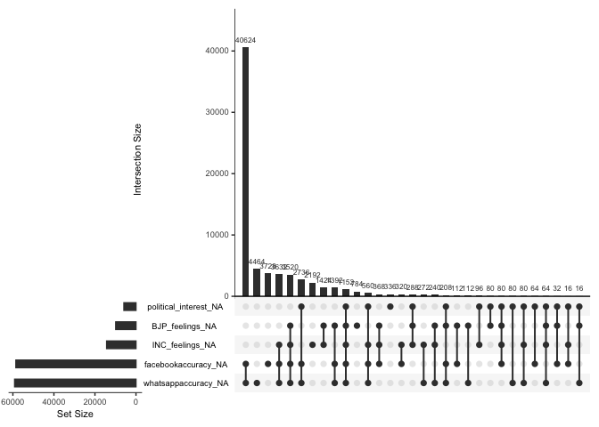
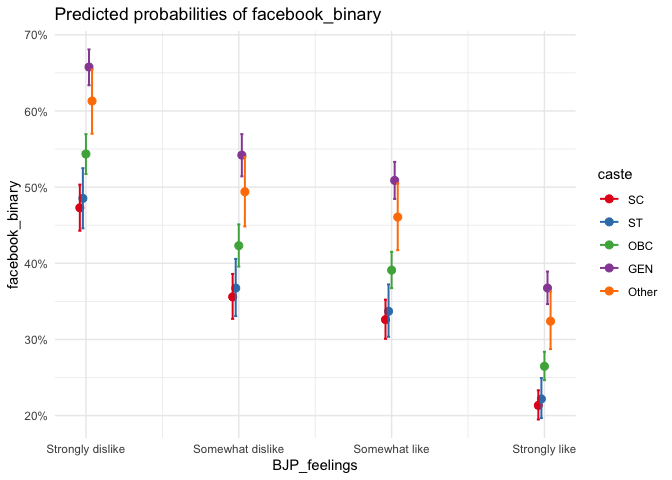
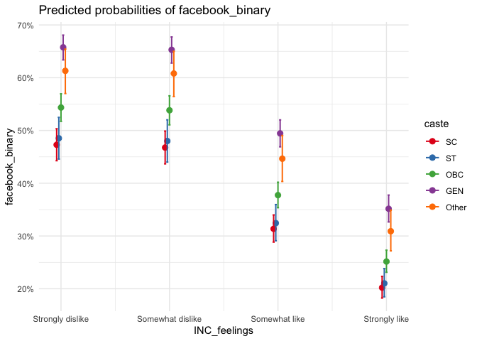
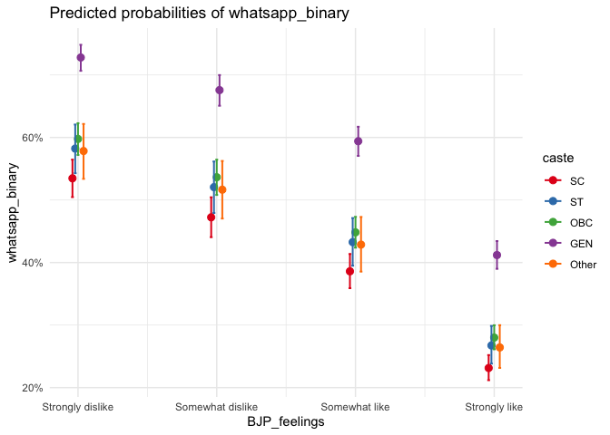
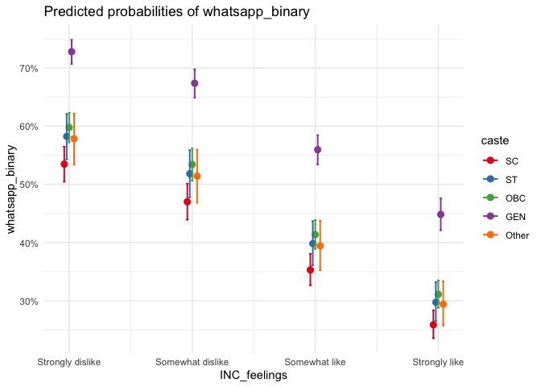

-   [INTRODUCING THE DATASET](#introducing-the-dataset)
-   [DATASET INSPECTION AND CLEANING](#dataset-inspection-and-cleaning)
    -   [**Checking the structure of the
        dataset:**](#checking-the-structure-of-the-dataset)
    -   [**Sample size of the dataset:**](#sample-size-of-the-dataset)
    -   [**Status of missing data**](#status-of-missing-data)
    -   [**Creating new binary
        variables:**](#creating-new-binary-variables)
-   [VARIABLES AND THEORETICAL
    APPROACH](#variables-and-theoretical-approach)
-   [REGRESSION](#regression)
    -   [Regression Model 1 - Facebook
        Accuracy:](#regression-model-1---facebook-accuracy)
    -   [Regression Model 2 - Whatsapp
        Accuracy:](#regression-model-2---whatsapp-accuracy)
-   [DIAGNOSTICS](#diagnostics)
-   [CONCLUSION](#conclusion)

*Data: pooledthreeway\_data.dta*

------------------------------------------------------------------------

**WARNING: THIS DOCUMENT DOES NOT WANT TO AUTOMATICALLY INSTALL RELEVANT
PACKAGES ON YOUR COMPUTER WITHOUT PRIOR CONSENT, SO MAKE SURE THE
FOLLOWING PACKAGES ARE INSTALLED FOR THE CODES TO PROPERLY FUNCTION.**

**tidyverse**  
**haven**  
**car**  
**sjPlot**  
**survey**  
**naniar**

------------------------------------------------------------------------

# INTRODUCING THE DATASET

This dataset contains 112,272 100,000 observations and 104 variables,
coding the three-way survey asking Indians about their political
affiliations and personal details. This dataset was prepared to find
whether digital media literacy intervention increases comprehension
between mainstream news and false news in the United States and India.
This project was involved in the creation of multiple datasets, and I
have singled out a dataset that was created by pooling in all the data
that was collected in India between 2018-2019. First, I shall import the
dataset by entering the following command:

    data_old <- read_dta("pooledthreeway_data.dta")

This dataset contains 104 variables out of which 21 interested me. Out
of those 21, I singled out six variables that were relevant for my
blogpost. Creating a new dataset using those variables,

    data <- select(data_old, facebookaccuracy, whatsappaccuracy, BJP_feelings, INC_feelings, caste, political_interest)

------------------------------------------------------------------------

# DATASET INSPECTION AND CLEANING

Let me subject the dataset into a series of inspections.

## **Checking the structure of the dataset:**

I intuitively know which variables are supposed to be numerical and
which are to be categorical, but we need to make sure whether the
structure of this dataset is intact:

    str(data)

    ## tibble[,6] [112,272 × 6] (S3: tbl_df/tbl/data.frame)
    ##  $ facebookaccuracy  : num [1:112272] NA NA NA NA NA NA NA NA NA NA ...
    ##   ..- attr(*, "label")= chr "_71 if 1/4"
    ##   ..- attr(*, "format.stata")= chr "%9.0g"
    ##  $ whatsappaccuracy  : num [1:112272] NA NA NA NA NA NA NA NA NA NA ...
    ##   ..- attr(*, "label")= chr "_72 if 1/4"
    ##   ..- attr(*, "format.stata")= chr "%9.0g"
    ##  $ BJP_feelings      : num [1:112272] 3 3 3 3 3 3 3 3 3 3 ...
    ##   ..- attr(*, "format.stata")= chr "%9.0g"
    ##  $ INC_feelings      : num [1:112272] 3 3 3 3 3 3 3 3 3 3 ...
    ##   ..- attr(*, "format.stata")= chr "%9.0g"
    ##  $ caste             : num [1:112272] 1 1 1 1 1 1 1 1 1 1 ...
    ##   ..- attr(*, "label")= chr "q_137 if 1/5"
    ##   ..- attr(*, "format.stata")= chr "%9.0g"
    ##  $ political_interest: num [1:112272] 4 4 4 4 4 4 4 4 4 4 ...
    ##   ..- attr(*, "format.stata")= chr "%9.0g"

As expected, this dataset requires cleaning. the variables here are
coded as numerical variables, but the variables that we deal with here
are categorical variables, so we have some factoring work to do:

    data$facebookaccuracy = factor(data$facebookaccuracy, levels = c(1,2,3,4), labels = c("Not at all accurate", "Not very accurate", "Somewhat accurate", "Very accurate"))
    data$whatsappaccuracy = factor(data$whatsappaccuracy, levels = c(1,2,3,4), labels = c("Not at all accurate", "Not very accurate", "Somewhat accurate", "Very accurate"))
    data$BJP_feelings = factor(data$BJP_feelings, levels = c(1,2,3,4), labels = c("Strongly dislike", "Somewhat dislike", "Somewhat like", "Strongly like"))
    data$INC_feelings = factor(data$INC_feelings, levels = c(1,2,3,4), labels = c("Strongly dislike", "Somewhat dislike", "Somewhat like", "Strongly like"))
    data$caste = factor(data$caste, levels = c(1,2,3,4,5), labels = c("SC", "ST", "OBC", "GEN", "Other"))
    data$political_interest = factor(data$political_interest, levels = c(1,2,3,4,5), labels = c("Not at all interested", "Not very interested", "Somewhat interested", "Very interested", "Extremely interested"))

Now that we factored it, let’s check its structure again:

    str(data)

    ## tibble[,6] [112,272 × 6] (S3: tbl_df/tbl/data.frame)
    ##  $ facebookaccuracy  : Factor w/ 4 levels "Not at all accurate",..: NA NA NA NA NA NA NA NA NA NA ...
    ##  $ whatsappaccuracy  : Factor w/ 4 levels "Not at all accurate",..: NA NA NA NA NA NA NA NA NA NA ...
    ##  $ BJP_feelings      : Factor w/ 4 levels "Strongly dislike",..: 3 3 3 3 3 3 3 3 3 3 ...
    ##  $ INC_feelings      : Factor w/ 4 levels "Strongly dislike",..: 3 3 3 3 3 3 3 3 3 3 ...
    ##  $ caste             : Factor w/ 5 levels "SC","ST","OBC",..: 1 1 1 1 1 1 1 1 1 1 ...
    ##  $ political_interest: Factor w/ 5 levels "Not at all interested",..: 4 4 4 4 4 4 4 4 4 4 ...

Perfect, I have factored the categorical variables accordingly.

## **Sample size of the dataset:**

Let me check how many occurrences each variable has to make sure we have
adequate number of samples to regress:

    table(data$facebookaccuracy)

    ## 
    ## Not at all accurate   Not very accurate   Somewhat accurate       Very accurate 
    ##                3792               14752               26000                9184

    table(data$whatsappaccuracy)

    ## 
    ## Not at all accurate   Not very accurate   Somewhat accurate       Very accurate 
    ##                4640               15792               25024                7664

    table(data$BJP_feelings)

    ## 
    ## Strongly dislike Somewhat dislike    Somewhat like    Strongly like 
    ##            13104             6608            26432            56256

    table(data$INC_feelings)

    ## 
    ## Strongly dislike Somewhat dislike    Somewhat like    Strongly like 
    ##            34208            14544            32864            16352

    table(data$caste)

    ## 
    ##    SC    ST   OBC   GEN Other 
    ## 14848  3088 46688 42032  2464

    table(data$political_interest)

    ## 
    ## Not at all interested   Not very interested   Somewhat interested 
    ##                 21216                  6912                 26480 
    ##       Very interested  Extremely interested 
    ##                 24048                 27728

We have adequate samples to work on our way.

## **Status of missing data**

    gg_miss_upset(data)

This graph is so refreshing to look at, because there are not so many
missing values in our dataset compared to the sample size we have. We
have huge missing values when facebookaccuracy and whatsapp accuracy are
combines, but it it not a problem since they are separate dependent
variables that I use in separate regressions.

## **Creating new binary variables:**

In order to simplify the regression, I wish to convert the categorical
variables as binary variables, and then proceed to introducing them:

    data$facebook_binary <- recode(data$facebookaccuracy, "c('Not at all accurate','Not very accurate')='Not accurate';c('Somewhat accurate', 'Very accurate') = 'Accurate'")
    data$whatsapp_binary <- recode(data$whatsappaccuracy, "c('Not at all accurate','Not very accurate')='Not accurate';c('Somewhat accurate', 'Very accurate') = 'Accurate'")

Checking whether we have adequate samples there,

    table(data$facebook_binary)

    ## 
    ##     Accurate Not accurate 
    ##        35184        18544

    table(data$whatsapp_binary)

    ## 
    ##     Accurate Not accurate 
    ##        32688        20432

Yes, we have. Proceeding to introducing the variables now.

# VARIABLES AND THEORETICAL APPROACH

I have chosen six variables from the pooledthreeway\_data dataset, which
are given below:

  
**Dependent variables:**

**facebook\_binary** - Categorical binary variable. 1 tells us that
people believe the news that they consume on Facebook are accurate, and
0 tells us that people believe the news that they consume on Facebook
are inaccurate.

**whatsapp\_binary** - Categorical binary variable. 1 tells us that
people believe the news that they consume on Whatsapp are accurate, and
0 tells us that people believe the news that they consume on Whatsapp
are inaccurate.

  
**Independent variables:**

**BJP\_feelings** - Feelings about the ruling BJP party, with 4 levels
ranging from “Strongly dislike” to “Strongly like”.

**INC\_feelings** - Feelings about the opposition Congress party, with 4
levels ranging from “Strongly dislike” to “Strongly like”.

**caste** - Caste of the respondent, with five levels Scheduled Tribes
(ST), Scheduled Castes (SC), Other Backward Castes (OBC), General
category (GEN), and Other.

**political\_interest** - Whether respondents are interested in
politics, with five levels ranging from “Not at all interested” to
“Extremely interested”.

The rationale behind me choosing the accuracies as dependent variables
is that, usually, literature in electoral studies focus on how news
consumption influence the voter intentions to vote for a particular
party. But I am approaching this from the angle of motivated reasoning
where I assume that people already make up their minds due to various
mechanisms at play, like 1)leadership stance, 2)Ideological crowding
out, 3)Moral panic, etc, and then motivate their reasons accordingly.
When the data was collected during 2018-19, BJP’s nationalistic fervour
was at its peak, and there was a widespread distrust towards print
media. Therefore, as an experiment, I keep the accuracy variables as the
dependent variables and see whether I am able to interpret anything
substantial in it.

# REGRESSION

## Regression Model 1 - Facebook Accuracy:

In my first model, I will keep facebook\_binary as the dependent
variable and logit regress (since my dependent variable is binary) it
against BJP\_feelings, INC\_feelings, caste and political\_interest:

    model_facebook <- glm(facebook_binary ~ BJP_feelings + INC_feelings + caste + political_interest, 
                  data = data, family = binomial(link="logit"))
    tab_model(model_facebook, show.se = T, show.aic = T, show.loglik = T, transform = NULL)

<table style="border-collapse:collapse; border:none;">
<tr>
<th style="border-top: double; text-align:center; font-style:normal; font-weight:bold; padding:0.2cm;  text-align:left; ">
 
</th>
<th colspan="4" style="border-top: double; text-align:center; font-style:normal; font-weight:bold; padding:0.2cm; ">
facebook\_binary
</th>
</tr>
<tr>
<td style=" text-align:center; border-bottom:1px solid; font-style:italic; font-weight:normal;  text-align:left; ">
Predictors
</td>
<td style=" text-align:center; border-bottom:1px solid; font-style:italic; font-weight:normal;  ">
Log-Odds
</td>
<td style=" text-align:center; border-bottom:1px solid; font-style:italic; font-weight:normal;  ">
std. Error
</td>
<td style=" text-align:center; border-bottom:1px solid; font-style:italic; font-weight:normal;  ">
CI
</td>
<td style=" text-align:center; border-bottom:1px solid; font-style:italic; font-weight:normal;  ">
p
</td>
</tr>
<tr>
<td style=" padding:0.2cm; text-align:left; vertical-align:top; text-align:left; ">
(Intercept)
</td>
<td style=" padding:0.2cm; text-align:left; vertical-align:top; text-align:center;  ">
-0.11
</td>
<td style=" padding:0.2cm; text-align:left; vertical-align:top; text-align:center;  ">
0.06
</td>
<td style=" padding:0.2cm; text-align:left; vertical-align:top; text-align:center;  ">
-0.23 – 0.01
</td>
<td style=" padding:0.2cm; text-align:left; vertical-align:top; text-align:center;  ">
0.080
</td>
</tr>
<tr>
<td style=" padding:0.2cm; text-align:left; vertical-align:top; text-align:left; ">
BJP\_feelings \[Somewhat dislike\]
</td>
<td style=" padding:0.2cm; text-align:left; vertical-align:top; text-align:center;  ">
-0.48
</td>
<td style=" padding:0.2cm; text-align:left; vertical-align:top; text-align:center;  ">
0.04
</td>
<td style=" padding:0.2cm; text-align:left; vertical-align:top; text-align:center;  ">
-0.57 – -0.40
</td>
<td style=" padding:0.2cm; text-align:left; vertical-align:top; text-align:center;  ">
<strong>&lt;0.001
</td>
</tr>
<tr>
<td style=" padding:0.2cm; text-align:left; vertical-align:top; text-align:left; ">
BJP\_feelings \[Somewhat like\]
</td>
<td style=" padding:0.2cm; text-align:left; vertical-align:top; text-align:center;  ">
-0.62
</td>
<td style=" padding:0.2cm; text-align:left; vertical-align:top; text-align:center;  ">
0.03
</td>
<td style=" padding:0.2cm; text-align:left; vertical-align:top; text-align:center;  ">
-0.69 – -0.55
</td>
<td style=" padding:0.2cm; text-align:left; vertical-align:top; text-align:center;  ">
<strong>&lt;0.001
</td>
</tr>
<tr>
<td style=" padding:0.2cm; text-align:left; vertical-align:top; text-align:left; ">
BJP\_feelings \[Strongly like\]
</td>
<td style=" padding:0.2cm; text-align:left; vertical-align:top; text-align:center;  ">
-1.20
</td>
<td style=" padding:0.2cm; text-align:left; vertical-align:top; text-align:center;  ">
0.03
</td>
<td style=" padding:0.2cm; text-align:left; vertical-align:top; text-align:center;  ">
-1.26 – -1.13
</td>
<td style=" padding:0.2cm; text-align:left; vertical-align:top; text-align:center;  ">
<strong>&lt;0.001
</td>
</tr>
<tr>
<td style=" padding:0.2cm; text-align:left; vertical-align:top; text-align:left; ">
INC\_feelings \[Somewhat dislike\]
</td>
<td style=" padding:0.2cm; text-align:left; vertical-align:top; text-align:center;  ">
-0.02
</td>
<td style=" padding:0.2cm; text-align:left; vertical-align:top; text-align:center;  ">
0.03
</td>
<td style=" padding:0.2cm; text-align:left; vertical-align:top; text-align:center;  ">
-0.08 – 0.04
</td>
<td style=" padding:0.2cm; text-align:left; vertical-align:top; text-align:center;  ">
0.469
</td>
</tr>
<tr>
<td style=" padding:0.2cm; text-align:left; vertical-align:top; text-align:left; ">
INC\_feelings \[Somewhat like\]
</td>
<td style=" padding:0.2cm; text-align:left; vertical-align:top; text-align:center;  ">
-0.67
</td>
<td style=" padding:0.2cm; text-align:left; vertical-align:top; text-align:center;  ">
0.03
</td>
<td style=" padding:0.2cm; text-align:left; vertical-align:top; text-align:center;  ">
-0.73 – -0.62
</td>
<td style=" padding:0.2cm; text-align:left; vertical-align:top; text-align:center;  ">
<strong>&lt;0.001
</td>
</tr>
<tr>
<td style=" padding:0.2cm; text-align:left; vertical-align:top; text-align:left; ">
INC\_feelings \[Strongly like\]
</td>
<td style=" padding:0.2cm; text-align:left; vertical-align:top; text-align:center;  ">
-1.26
</td>
<td style=" padding:0.2cm; text-align:left; vertical-align:top; text-align:center;  ">
0.04
</td>
<td style=" padding:0.2cm; text-align:left; vertical-align:top; text-align:center;  ">
-1.33 – -1.20
</td>
<td style=" padding:0.2cm; text-align:left; vertical-align:top; text-align:center;  ">
<strong>&lt;0.001
</td>
</tr>
<tr>
<td style=" padding:0.2cm; text-align:left; vertical-align:top; text-align:left; ">
caste \[ST\]
</td>
<td style=" padding:0.2cm; text-align:left; vertical-align:top; text-align:center;  ">
0.05
</td>
<td style=" padding:0.2cm; text-align:left; vertical-align:top; text-align:center;  ">
0.07
</td>
<td style=" padding:0.2cm; text-align:left; vertical-align:top; text-align:center;  ">
-0.10 – 0.19
</td>
<td style=" padding:0.2cm; text-align:left; vertical-align:top; text-align:center;  ">
0.500
</td>
</tr>
<tr>
<td style=" padding:0.2cm; text-align:left; vertical-align:top; text-align:left; ">
caste \[OBC\]
</td>
<td style=" padding:0.2cm; text-align:left; vertical-align:top; text-align:center;  ">
0.28
</td>
<td style=" padding:0.2cm; text-align:left; vertical-align:top; text-align:center;  ">
0.04
</td>
<td style=" padding:0.2cm; text-align:left; vertical-align:top; text-align:center;  ">
0.20 – 0.37
</td>
<td style=" padding:0.2cm; text-align:left; vertical-align:top; text-align:center;  ">
<strong>&lt;0.001
</td>
</tr>
<tr>
<td style=" padding:0.2cm; text-align:left; vertical-align:top; text-align:left; ">
caste \[GEN\]
</td>
<td style=" padding:0.2cm; text-align:left; vertical-align:top; text-align:center;  ">
0.76
</td>
<td style=" padding:0.2cm; text-align:left; vertical-align:top; text-align:center;  ">
0.04
</td>
<td style=" padding:0.2cm; text-align:left; vertical-align:top; text-align:center;  ">
0.68 – 0.84
</td>
<td style=" padding:0.2cm; text-align:left; vertical-align:top; text-align:center;  ">
<strong>&lt;0.001
</td>
</tr>
<tr>
<td style=" padding:0.2cm; text-align:left; vertical-align:top; text-align:left; ">
caste \[Other\]
</td>
<td style=" padding:0.2cm; text-align:left; vertical-align:top; text-align:center;  ">
0.57
</td>
<td style=" padding:0.2cm; text-align:left; vertical-align:top; text-align:center;  ">
0.08
</td>
<td style=" padding:0.2cm; text-align:left; vertical-align:top; text-align:center;  ">
0.40 – 0.73
</td>
<td style=" padding:0.2cm; text-align:left; vertical-align:top; text-align:center;  ">
<strong>&lt;0.001
</td>
</tr>
<tr>
<td style=" padding:0.2cm; text-align:left; vertical-align:top; text-align:left; ">
political\_interest \[Not very interested\]
</td>
<td style=" padding:0.2cm; text-align:left; vertical-align:top; text-align:center;  ">
0.52
</td>
<td style=" padding:0.2cm; text-align:left; vertical-align:top; text-align:center;  ">
0.06
</td>
<td style=" padding:0.2cm; text-align:left; vertical-align:top; text-align:center;  ">
0.40 – 0.64
</td>
<td style=" padding:0.2cm; text-align:left; vertical-align:top; text-align:center;  ">
<strong>&lt;0.001
</td>
</tr>
<tr>
<td style=" padding:0.2cm; text-align:left; vertical-align:top; text-align:left; ">
political\_interest \[Somewhat interested\]
</td>
<td style=" padding:0.2cm; text-align:left; vertical-align:top; text-align:center;  ">
0.28
</td>
<td style=" padding:0.2cm; text-align:left; vertical-align:top; text-align:center;  ">
0.05
</td>
<td style=" padding:0.2cm; text-align:left; vertical-align:top; text-align:center;  ">
0.19 – 0.37
</td>
<td style=" padding:0.2cm; text-align:left; vertical-align:top; text-align:center;  ">
<strong>&lt;0.001
</td>
</tr>
<tr>
<td style=" padding:0.2cm; text-align:left; vertical-align:top; text-align:left; ">
political\_interest \[Very interested\]
</td>
<td style=" padding:0.2cm; text-align:left; vertical-align:top; text-align:center;  ">
0.20
</td>
<td style=" padding:0.2cm; text-align:left; vertical-align:top; text-align:center;  ">
0.05
</td>
<td style=" padding:0.2cm; text-align:left; vertical-align:top; text-align:center;  ">
0.11 – 0.29
</td>
<td style=" padding:0.2cm; text-align:left; vertical-align:top; text-align:center;  ">
<strong>&lt;0.001
</td>
</tr>
<tr>
<td style=" padding:0.2cm; text-align:left; vertical-align:top; text-align:left; ">
political\_interest \[Extremely interested\]
</td>
<td style=" padding:0.2cm; text-align:left; vertical-align:top; text-align:center;  ">
-0.05
</td>
<td style=" padding:0.2cm; text-align:left; vertical-align:top; text-align:center;  ">
0.05
</td>
<td style=" padding:0.2cm; text-align:left; vertical-align:top; text-align:center;  ">
-0.15 – 0.04
</td>
<td style=" padding:0.2cm; text-align:left; vertical-align:top; text-align:center;  ">
0.278
</td>
</tr>
<tr>
<td style=" padding:0.2cm; text-align:left; vertical-align:top; text-align:left; padding-top:0.1cm; padding-bottom:0.1cm; border-top:1px solid;">
Observations
</td>
<td style=" padding:0.2cm; text-align:left; vertical-align:top; padding-top:0.1cm; padding-bottom:0.1cm; text-align:left; border-top:1px solid;" colspan="4">
46560
</td>
</tr>
<tr>
<td style=" padding:0.2cm; text-align:left; vertical-align:top; text-align:left; padding-top:0.1cm; padding-bottom:0.1cm;">
R2 Tjur
</td>
<td style=" padding:0.2cm; text-align:left; vertical-align:top; padding-top:0.1cm; padding-bottom:0.1cm; text-align:left;" colspan="4">
0.088
</td>
</tr>
<tr>
<td style=" padding:0.2cm; text-align:left; vertical-align:top; text-align:left; padding-top:0.1cm; padding-bottom:0.1cm;">
AIC
</td>
<td style=" padding:0.2cm; text-align:left; vertical-align:top; padding-top:0.1cm; padding-bottom:0.1cm; text-align:left;" colspan="4">
55467.162
</td>
</tr>
<tr>
<td style=" padding:0.2cm; text-align:left; vertical-align:top; text-align:left; padding-top:0.1cm; padding-bottom:0.1cm;">
log-Likelihood
</td>
<td style=" padding:0.2cm; text-align:left; vertical-align:top; padding-top:0.1cm; padding-bottom:0.1cm; text-align:left;" colspan="4">
-27718.581
</td>
</tr>
</table>
  

As we can see from the table, lot of variables are statistically
significant. For example, for every unit of increase in people strongly
liking both BJP and INC, the log-odds of people believing facebook news
as true decreases by 1.2 - but we can see that the R-square value is
extremely low that suggests a very weak association. But then, there is
not really an intuitive way to interpret the log-odds, the best we can
do is to see whether there is a pattern in the table, or to see whether
the pattern flows in a certain direction. In this table, we can see that
no matter the feelings about either BJP or INC, people are less inclined
to believe that facebook news is accurate. This interpretation might
hold good to test a hypothesis, but not efficient in policy advocacy.
Given that we get a high AIC value, this table gives us a general
direction that people are not trusting facebook news irrespective of
their party preference. But people who are polarised on the extremes
have more extreme views on this, which might indicate the motivated
reasoning in the sense that people might be distrusting facebook
precisely because they might be seeing positive news from their
opposition camp, but this is a long stretch.

However, across caste lines, there are interesting patterns. We see that
the general category who belong to the dominant castes are inclined to
believe that facebook news is accurate, compared to the Scheduled Caste
who are in the lowest of the caste hierarchy. Let me make a predicted
probability graph to visualise it better.

    plot_model(model_facebook, type = "pred", 
         terms = c("BJP_feelings","caste")) + 
      theme_minimal()

    plot_model(model_facebook, type = "pred", 
         terms = c("INC_feelings","caste")) + 
      theme_minimal()

  

As we can see, the perception about Facebook is also stratified across
caste-lines, in the same hierarchy. The dominant GEN believes facebook
news to be more accurate, followed by the Other comprising of dominant
castes, followed by OBC comprising of middle to backward castes, and
followed closely by ST and SC who are in the bottom of the caste
hierarchy.

## Regression Model 2 - Whatsapp Accuracy:

In this second model, I will keep whatsapp\_binary as the dependent
variable and logit regress it against BJP\_feelings, INC\_feelings,
caste and political\_interest:

    model_whatsapp <- glm(whatsapp_binary ~ BJP_feelings + INC_feelings + caste + political_interest, 
                  data = data, family = binomial(link="logit"))
    tab_model(model_whatsapp, show.se = T, show.aic = T, show.loglik = T, transform = NULL)

<table style="border-collapse:collapse; border:none;">
<tr>
<th style="border-top: double; text-align:center; font-style:normal; font-weight:bold; padding:0.2cm;  text-align:left; ">
 
</th>
<th colspan="4" style="border-top: double; text-align:center; font-style:normal; font-weight:bold; padding:0.2cm; ">
whatsapp\_binary
</th>
</tr>
<tr>
<td style=" text-align:center; border-bottom:1px solid; font-style:italic; font-weight:normal;  text-align:left; ">
Predictors
</td>
<td style=" text-align:center; border-bottom:1px solid; font-style:italic; font-weight:normal;  ">
Log-Odds
</td>
<td style=" text-align:center; border-bottom:1px solid; font-style:italic; font-weight:normal;  ">
std. Error
</td>
<td style=" text-align:center; border-bottom:1px solid; font-style:italic; font-weight:normal;  ">
CI
</td>
<td style=" text-align:center; border-bottom:1px solid; font-style:italic; font-weight:normal;  ">
p
</td>
</tr>
<tr>
<td style=" padding:0.2cm; text-align:left; vertical-align:top; text-align:left; ">
(Intercept)
</td>
<td style=" padding:0.2cm; text-align:left; vertical-align:top; text-align:center;  ">
0.14
</td>
<td style=" padding:0.2cm; text-align:left; vertical-align:top; text-align:center;  ">
0.06
</td>
<td style=" padding:0.2cm; text-align:left; vertical-align:top; text-align:center;  ">
0.02 – 0.26
</td>
<td style=" padding:0.2cm; text-align:left; vertical-align:top; text-align:center;  ">
<strong>0.024</strong>
</td>
</tr>
<tr>
<td style=" padding:0.2cm; text-align:left; vertical-align:top; text-align:left; ">
BJP\_feelings \[Somewhat dislike\]
</td>
<td style=" padding:0.2cm; text-align:left; vertical-align:top; text-align:center;  ">
-0.25
</td>
<td style=" padding:0.2cm; text-align:left; vertical-align:top; text-align:center;  ">
0.04
</td>
<td style=" padding:0.2cm; text-align:left; vertical-align:top; text-align:center;  ">
-0.34 – -0.16
</td>
<td style=" padding:0.2cm; text-align:left; vertical-align:top; text-align:center;  ">
<strong>&lt;0.001
</td>
</tr>
<tr>
<td style=" padding:0.2cm; text-align:left; vertical-align:top; text-align:left; ">
BJP\_feelings \[Somewhat like\]
</td>
<td style=" padding:0.2cm; text-align:left; vertical-align:top; text-align:center;  ">
-0.60
</td>
<td style=" padding:0.2cm; text-align:left; vertical-align:top; text-align:center;  ">
0.03
</td>
<td style=" padding:0.2cm; text-align:left; vertical-align:top; text-align:center;  ">
-0.67 – -0.54
</td>
<td style=" padding:0.2cm; text-align:left; vertical-align:top; text-align:center;  ">
<strong>&lt;0.001
</td>
</tr>
<tr>
<td style=" padding:0.2cm; text-align:left; vertical-align:top; text-align:left; ">
BJP\_feelings \[Strongly like\]
</td>
<td style=" padding:0.2cm; text-align:left; vertical-align:top; text-align:center;  ">
-1.34
</td>
<td style=" padding:0.2cm; text-align:left; vertical-align:top; text-align:center;  ">
0.03
</td>
<td style=" padding:0.2cm; text-align:left; vertical-align:top; text-align:center;  ">
-1.41 – -1.27
</td>
<td style=" padding:0.2cm; text-align:left; vertical-align:top; text-align:center;  ">
<strong>&lt;0.001
</td>
</tr>
<tr>
<td style=" padding:0.2cm; text-align:left; vertical-align:top; text-align:left; ">
INC\_feelings \[Somewhat dislike\]
</td>
<td style=" padding:0.2cm; text-align:left; vertical-align:top; text-align:center;  ">
-0.26
</td>
<td style=" padding:0.2cm; text-align:left; vertical-align:top; text-align:center;  ">
0.03
</td>
<td style=" padding:0.2cm; text-align:left; vertical-align:top; text-align:center;  ">
-0.32 – -0.20
</td>
<td style=" padding:0.2cm; text-align:left; vertical-align:top; text-align:center;  ">
<strong>&lt;0.001
</td>
</tr>
<tr>
<td style=" padding:0.2cm; text-align:left; vertical-align:top; text-align:left; ">
INC\_feelings \[Somewhat like\]
</td>
<td style=" padding:0.2cm; text-align:left; vertical-align:top; text-align:center;  ">
-0.75
</td>
<td style=" padding:0.2cm; text-align:left; vertical-align:top; text-align:center;  ">
0.03
</td>
<td style=" padding:0.2cm; text-align:left; vertical-align:top; text-align:center;  ">
-0.80 – -0.69
</td>
<td style=" padding:0.2cm; text-align:left; vertical-align:top; text-align:center;  ">
<strong>&lt;0.001
</td>
</tr>
<tr>
<td style=" padding:0.2cm; text-align:left; vertical-align:top; text-align:left; ">
INC\_feelings \[Strongly like\]
</td>
<td style=" padding:0.2cm; text-align:left; vertical-align:top; text-align:center;  ">
-1.19
</td>
<td style=" padding:0.2cm; text-align:left; vertical-align:top; text-align:center;  ">
0.03
</td>
<td style=" padding:0.2cm; text-align:left; vertical-align:top; text-align:center;  ">
-1.26 – -1.12
</td>
<td style=" padding:0.2cm; text-align:left; vertical-align:top; text-align:center;  ">
<strong>&lt;0.001
</td>
</tr>
<tr>
<td style=" padding:0.2cm; text-align:left; vertical-align:top; text-align:left; ">
caste \[ST\]
</td>
<td style=" padding:0.2cm; text-align:left; vertical-align:top; text-align:center;  ">
0.19
</td>
<td style=" padding:0.2cm; text-align:left; vertical-align:top; text-align:center;  ">
0.07
</td>
<td style=" padding:0.2cm; text-align:left; vertical-align:top; text-align:center;  ">
0.05 – 0.34
</td>
<td style=" padding:0.2cm; text-align:left; vertical-align:top; text-align:center;  ">
<strong>0.008</strong>
</td>
</tr>
<tr>
<td style=" padding:0.2cm; text-align:left; vertical-align:top; text-align:left; ">
caste \[OBC\]
</td>
<td style=" padding:0.2cm; text-align:left; vertical-align:top; text-align:center;  ">
0.26
</td>
<td style=" padding:0.2cm; text-align:left; vertical-align:top; text-align:center;  ">
0.04
</td>
<td style=" padding:0.2cm; text-align:left; vertical-align:top; text-align:center;  ">
0.17 – 0.34
</td>
<td style=" padding:0.2cm; text-align:left; vertical-align:top; text-align:center;  ">
<strong>&lt;0.001
</td>
</tr>
<tr>
<td style=" padding:0.2cm; text-align:left; vertical-align:top; text-align:left; ">
caste \[GEN\]
</td>
<td style=" padding:0.2cm; text-align:left; vertical-align:top; text-align:center;  ">
0.84
</td>
<td style=" padding:0.2cm; text-align:left; vertical-align:top; text-align:center;  ">
0.04
</td>
<td style=" padding:0.2cm; text-align:left; vertical-align:top; text-align:center;  ">
0.77 – 0.93
</td>
<td style=" padding:0.2cm; text-align:left; vertical-align:top; text-align:center;  ">
<strong>&lt;0.001
</td>
</tr>
<tr>
<td style=" padding:0.2cm; text-align:left; vertical-align:top; text-align:left; ">
caste \[Other\]
</td>
<td style=" padding:0.2cm; text-align:left; vertical-align:top; text-align:center;  ">
0.18
</td>
<td style=" padding:0.2cm; text-align:left; vertical-align:top; text-align:center;  ">
0.09
</td>
<td style=" padding:0.2cm; text-align:left; vertical-align:top; text-align:center;  ">
0.01 – 0.34
</td>
<td style=" padding:0.2cm; text-align:left; vertical-align:top; text-align:center;  ">
<strong>0.040</strong>
</td>
</tr>
<tr>
<td style=" padding:0.2cm; text-align:left; vertical-align:top; text-align:left; ">
political\_interest \[Not very interested\]
</td>
<td style=" padding:0.2cm; text-align:left; vertical-align:top; text-align:center;  ">
0.61
</td>
<td style=" padding:0.2cm; text-align:left; vertical-align:top; text-align:center;  ">
0.06
</td>
<td style=" padding:0.2cm; text-align:left; vertical-align:top; text-align:center;  ">
0.49 – 0.74
</td>
<td style=" padding:0.2cm; text-align:left; vertical-align:top; text-align:center;  ">
<strong>&lt;0.001
</td>
</tr>
<tr>
<td style=" padding:0.2cm; text-align:left; vertical-align:top; text-align:left; ">
political\_interest \[Somewhat interested\]
</td>
<td style=" padding:0.2cm; text-align:left; vertical-align:top; text-align:center;  ">
0.26
</td>
<td style=" padding:0.2cm; text-align:left; vertical-align:top; text-align:center;  ">
0.05
</td>
<td style=" padding:0.2cm; text-align:left; vertical-align:top; text-align:center;  ">
0.17 – 0.35
</td>
<td style=" padding:0.2cm; text-align:left; vertical-align:top; text-align:center;  ">
<strong>&lt;0.001
</td>
</tr>
<tr>
<td style=" padding:0.2cm; text-align:left; vertical-align:top; text-align:left; ">
political\_interest \[Very interested\]
</td>
<td style=" padding:0.2cm; text-align:left; vertical-align:top; text-align:center;  ">
0.19
</td>
<td style=" padding:0.2cm; text-align:left; vertical-align:top; text-align:center;  ">
0.05
</td>
<td style=" padding:0.2cm; text-align:left; vertical-align:top; text-align:center;  ">
0.10 – 0.28
</td>
<td style=" padding:0.2cm; text-align:left; vertical-align:top; text-align:center;  ">
<strong>&lt;0.001
</td>
</tr>
<tr>
<td style=" padding:0.2cm; text-align:left; vertical-align:top; text-align:left; ">
political\_interest \[Extremely interested\]
</td>
<td style=" padding:0.2cm; text-align:left; vertical-align:top; text-align:center;  ">
-0.09
</td>
<td style=" padding:0.2cm; text-align:left; vertical-align:top; text-align:center;  ">
0.05
</td>
<td style=" padding:0.2cm; text-align:left; vertical-align:top; text-align:center;  ">
-0.19 – 0.00
</td>
<td style=" padding:0.2cm; text-align:left; vertical-align:top; text-align:center;  ">
<strong>0.050</strong>
</td>
</tr>
<tr>
<td style=" padding:0.2cm; text-align:left; vertical-align:top; text-align:left; padding-top:0.1cm; padding-bottom:0.1cm; border-top:1px solid;">
Observations
</td>
<td style=" padding:0.2cm; text-align:left; vertical-align:top; padding-top:0.1cm; padding-bottom:0.1cm; text-align:left; border-top:1px solid;" colspan="4">
45792
</td>
</tr>
<tr>
<td style=" padding:0.2cm; text-align:left; vertical-align:top; text-align:left; padding-top:0.1cm; padding-bottom:0.1cm;">
R2 Tjur
</td>
<td style=" padding:0.2cm; text-align:left; vertical-align:top; padding-top:0.1cm; padding-bottom:0.1cm; text-align:left;" colspan="4">
0.104
</td>
</tr>
<tr>
<td style=" padding:0.2cm; text-align:left; vertical-align:top; text-align:left; padding-top:0.1cm; padding-bottom:0.1cm;">
AIC
</td>
<td style=" padding:0.2cm; text-align:left; vertical-align:top; padding-top:0.1cm; padding-bottom:0.1cm; text-align:left;" colspan="4">
55749.060
</td>
</tr>
<tr>
<td style=" padding:0.2cm; text-align:left; vertical-align:top; text-align:left; padding-top:0.1cm; padding-bottom:0.1cm;">
log-Likelihood
</td>
<td style=" padding:0.2cm; text-align:left; vertical-align:top; padding-top:0.1cm; padding-bottom:0.1cm; text-align:left;" colspan="4">
-27859.530
</td>
</tr>
</table>

In this model as well, we get a very weak association owing to the low
R-square value, but we have a high AIC value and statistical signifance
across many variables. Similar to the accuracy of facebook, people show
a similar attitude towards whatsapp, as they might be treating it both
under social media, attributing common characteristics. In this table
also, we can see that no matter the feelings about either BJP or INC,
people are less inclined to believe that whatsapp news is accurate. But
as usual, I am more interested in how caste distrinution is present in
this model, as we are seeing that the “Other” caste group is not showing
a significat log-odds as it showed in the previous model. Let me create
a predicted probability graph to visualise:

    plot_model(model_whatsapp, type = "pred", 
         terms = c("BJP_feelings","caste")) + 
      theme_minimal()

    plot_model(model_whatsapp, type = "pred", 
         terms = c("INC_feelings","caste")) + 
      theme_minimal()

  

Here too, except the “Other” category, the line-up follows closely the
caste hierarchy, but the dominant General category believes whatsapp
news to be accurate more evidently here. This might probably have to do
with their digital literacy and smartphone affordability, but this graph
indicates the high mobility that the dominant castes enjoy in the
digital space. One way to interpret is that the more we spend time on a
social media, the more we tend to believe it as true, and this may
indicate the higher trust of whatsapp news by the dominant general
category. However, to see what news they are really consuming require a
separate experiment with qualitative features.

# DIAGNOSTICS

Since I am not directly comparing two models, I am not running a
Likelihood Ratio Test or ROC curves. However, I shall run the Wald’s
test to evaluate the statisitical significance individual coefficients
in both the models. First in the Facebook model:

    regTermTest(model_facebook, "BJP_feelings")

    ## Wald test for BJP_feelings
    ##  in glm(formula = facebook_binary ~ BJP_feelings + INC_feelings + 
    ##     caste + political_interest, family = binomial(link = "logit"), 
    ##     data = data)
    ## F =  476.8545  on  3  and  46545  df: p= < 2.22e-16

    regTermTest(model_facebook, "INC_feelings")

    ## Wald test for INC_feelings
    ##  in glm(formula = facebook_binary ~ BJP_feelings + INC_feelings + 
    ##     caste + political_interest, family = binomial(link = "logit"), 
    ##     data = data)
    ## F =  577.5673  on  3  and  46545  df: p= < 2.22e-16

    regTermTest(model_facebook, "caste")

    ## Wald test for caste
    ##  in glm(formula = facebook_binary ~ BJP_feelings + INC_feelings + 
    ##     caste + political_interest, family = binomial(link = "logit"), 
    ##     data = data)
    ## F =  175.0703  on  4  and  46545  df: p= < 2.22e-16

    regTermTest(model_facebook, "political_interest")

    ## Wald test for political_interest
    ##  in glm(formula = facebook_binary ~ BJP_feelings + INC_feelings + 
    ##     caste + political_interest, family = binomial(link = "logit"), 
    ##     data = data)
    ## F =  58.29105  on  4  and  46545  df: p= < 2.22e-16

  

We see that all the p-values are low, indicating statistical
significance of individual coeffecients. Let me take the test for
Whatsapp model as well:

    regTermTest(model_whatsapp, "BJP_feelings")

    ## Wald test for BJP_feelings
    ##  in glm(formula = whatsapp_binary ~ BJP_feelings + INC_feelings + 
    ##     caste + political_interest, family = binomial(link = "logit"), 
    ##     data = data)
    ## F =  693.6791  on  3  and  45777  df: p= < 2.22e-16

    regTermTest(model_whatsapp, "INC_feelings")

    ## Wald test for INC_feelings
    ##  in glm(formula = whatsapp_binary ~ BJP_feelings + INC_feelings + 
    ##     caste + political_interest, family = binomial(link = "logit"), 
    ##     data = data)
    ## F =  500.8289  on  3  and  45777  df: p= < 2.22e-16

    regTermTest(model_whatsapp, "caste")

    ## Wald test for caste
    ##  in glm(formula = whatsapp_binary ~ BJP_feelings + INC_feelings + 
    ##     caste + political_interest, family = binomial(link = "logit"), 
    ##     data = data)
    ## F =  241.0764  on  4  and  45777  df: p= < 2.22e-16

    regTermTest(model_whatsapp, "political_interest")

    ## Wald test for political_interest
    ##  in glm(formula = whatsapp_binary ~ BJP_feelings + INC_feelings + 
    ##     caste + political_interest, family = binomial(link = "logit"), 
    ##     data = data)
    ## F =  74.91164  on  4  and  45777  df: p= < 2.22e-16

Again, we get low p-values, indicating statistical significance of
individual coeffecients in this model as well.

# CONCLUSION

Given the low value of R-square, I am unable to substantiate any
association between people’s political preference or caste to their
opinion about social media news, however, I was able to pinpoint a
pattern of trust cutting across caste-lines rather than party-lines
towards the social media news. This makes me think about the missing
variables in this dataset such as the ability to buy a smartphone,
digital literacy, etc. I consciously avoided education as a variable in
my regression for theoretical reasons, since I intuitively do not give
much value to the notion that school education in India could improve
one’s perception about news accuracy. I believe that keeping these
dependent variables and introducing new independentent variables in
future models could shed light on how people’s motivated reasoning could
affect their perception about social media news accuracy.

