***The views and opinions expressed in this article are those of the
author and do not reflect the official policy or the position of the
institutions to which the author is affiliated.***

***This project was submitted in partial fulfillment of the requirements
of the course RI-SP062 and not for public disclosure***

*Cleaning environment*

*Loading packages*

***1. Introduction***

This project will attempt to answer the following research questions:

-   have the speeches of Brazil in the General-Debates of the United
    Nations General Assembly remained stable since the country’s
    redemocratization in 1985?

-   have peace and development remained constant priorities of Brazilian
    Foreign Policy in these speeches?

Brazil has the oldest professional diplomacy in the Americas, as the
country became the site of colonial power when the Portuguese court fled
the Napoleonic wars. Considered a precursor of Brazilian diplomacy,
Alexandre de Gusmão, born in the Portuguese colony of Brazil was one of
the main negotiators of the Treaty of Madrid in 1761 between Portugal
and Spain, roughly defining the borders of future independent Brazil. In
fact, diplomacy played a crucial role in the very constitution of Brazil
as an independent country, since the Brazilian borders were all defined
by diplomatic negotiations rather than wars with its numerous neighbors
(Pinheiro, 2010; Cervo & Bueno, 2002; Mendonça, 2013).

Due to its long professional tradition and the influence that the
Ministry of Foreign Affairs of Brazil still enjoys to date, the tenants
of the Brazilian foreign policy are thought to have remained stable over
time. Sharing boarders with 10 out of 12 South American countries,
Brazil has not been involved in armed conflicts with any of its
neighbors for the past 150 years. Therefore, “peace” has been pointed as
a priority for the Brazilian foreign policy (Cervo & Bueno, 2002). That
the search for “development” has remained a main priority is however a
disputed argument among historians (Pinheiro, 2010; Cervo & Bueno,
2002).

Since redemocratization in 1985, the Brazilian history has been marked
by a few ruptures, with the impeachment of President Fernando Collor de
Mello (1992) and of President Dilma Rousseff (2016). There have also
been a variety of administrations, with different political
affiliations, from liberal to leftist to ultraconservative. I want to
verify whether the speeches of Brazil in the UNGA remained stable across
these administrations and with a focus on peace and development, even if
the country faced political ruptures over time.

*Therefore, I want to test the hypotheses that (i) the policy positions
of Brazil in UNGA have remained constant since the redemocratization
period and that (ii) the policy positions of Brazil in UNGA focused on
peace and development during this time.*

***2. Methodology***

The speeches of Brazil in the UNGA have a singular relevance, as by
tradition the country opens the General Debate of the UNGA and firstly
speaks about its perception of the world affairs and about its foreign
policy priorities for the entire UN membership (Vargas, 2012).

By employing the technique of Natural Language Processing (NLP), I will
assess Brazil’s 37 speeches delivered in the General Debates of the UN
General Assembly (UNGA), between 1985 to 2020.

NLP uses machine learning techniques to assess a large number of natural
language data. A subfield of artificial intelligence, NLP provides the
most appropriate methods (tokenization, stemming, parsing, among others)
for content analysis that allows for extracting keywords, identifying
relations between words, establishing the structure of the text,
measuring the degree of lexical homogeneity of the corpora, etc.

In this light, NLP will assist us in measuring:

-   how much the policy positions of Brazil in the GD of the UNGAs have
    changed from one speech to another since 1985 to date; and,

-   whether *development* and *peace* have remained the main features of
    such corpora.

***3. Data***

**Describing the Data**

*BRUNGA* is a compilation of the 37 speeches of Brazil since 1985 to
date, which I built by drawing on a corpus of data that is publicly
available in the official websites of the United Nations General
Assembly and in the book “Brazil in the United Nations: 1945 - 2011”,
organized by Seixas Corrêa and the publisher house of the MFA of Brazil
(FUNAG) (Corrêa and Fundação Alexandre de Gusmão, 2013). The data
comprise the speeches delivered from UNGA40 to UNGA75. The speeches were
originally delivered in Portuguese; however, an English version of the
speeches was provided by the Brazilian delegation in each occasion. The
speeches used here are, therefore, in English language.

I also built eight separated data for each different administration, as
follows:

*Sarney (term 1985-1990)*: a compilation of the speeches delivered in
UNGA40 in 1985, UNGA41 in 1986, UNGA42 in 1987, UNGA43 in 1988 and
UNGA44 in 1989. The UNGA40 and UNGA44 speeches were delivered by
President José Sarney, and the others by the Minister of Foreign Affairs
Abreu Sodré.

*Collor (term 1990-1992)*: a compilation of the speeches delivered in
UNGA45 in 1990, UNGA46 in 1991 and UNGA47 in 1992. The UNGA45 and UNGA46
speeches were delivered by President Fernando Collor de Mello (also
known as Collor), and the other by the Minister of Foreign Affairs Celso
Lafer. Note that Minister Celso Lafer was also MFA of Brazil in the last
year of the adminstration of President Fernando Henrique Cardoso (also
known as FHC).

*Franco (term 1992-1995)*: a compilation of the speeches delivered in
UNGA48 in 1993 and UNGA49 in 1994. The UNGA48 and UNGA49 speeches were
delivered by the Minister of Foreign Affairs Celso Amorim. President
Itamar Franco did not deliver speeches in the GA. Note that Minister
Celso Amorim was also MFA of Brazil under President Lula.

*FHC (term 1995-2003)*: a compilation of the speeches delivered in
UNGA50 in 1995, UNGA51 in 1996, UNGA52 in 1997, UNGA53 in 1998, UNGA54
in 1999, UNGA55 in 2000, UNGA56 in 2001 and UNGA57 in 2002. The Minister
of Foreign Affairs Luiz Felipe Lampreia delivered the speeches between
UNGA50 and UNGA55. President Fernando Henrique Cardoso delivered the
UNGA56 speech. And the Minister of Foreign Affairs Celso Lafer delivered
the last speech of the adminstration FHC in UNGA 57.

*Lula (term 2003-2011)*: a compilation of the speeches delivered in
UNGA58 in 2003, UNGA59 in 2004, UNGA60 in 2005, UNGA61 in 2006, UNGA62
in 2007, UNGA63 in 2008, UNGA64 in 2009 and UNGA65 in 2010. Except for
UNGA60 and UNGA65, where the Minister of Foreign Affairs Celso Amorim
delivered the speeches, all others were delivered by President Luiz
Inácio Lula da Silva (also known as Lula).

*Rousseff (term 2011-2016)*: a compilation of the speeches delivered in
UNGA66 in 2011, UNGA67 in 2012, UNGA68 in 2013, UNGA69 in 2014 and
UNGA70 in 2015. All the speeches were delivered by President Dilma
Rousseff.

*Temer (term 2016-2019)*: a compilation of the speeches delivered in
UNGA71 in 2016, UNGA72 in 2017 and UNGA73 in 2018. All the speeches were
delivered by President Michel Temer.

*Bolsonaro (term 2019-present)*: a compilation of the speeches delivered
in UNGA74 in 2019 and UNGA75 in 2020. All the speeches were delivered by
President Jair Bolsonaro.

Presidents Sarney, Franco and Temer belonged to the same center-right,
liberal party: Movimento Democrático Brasileiro (PMDB or, currently,
MDB). President Collor was from a right-wing, liberal-conservative
party: Partido da Reconstrução Nacional (PRN or, currently, PTC).
President Lula and Rousseff belong to the same left-wing party: Partido
dos Trabalhadores (PT). President Bolsonaro, currently independent, was
elected on a far-right platform and belonged to Partido Social Liberal
(PSL).

**Access to the speeches**

The speeches are on the google drive that I shared with Prof Hollway and
Juliette’s email address and can be assessed here:

**BRUNGA**
<https://drive.google.com/drive/folders/1fRDlvEufY3R8QCK5jlqzIL5oq7cmfAC2?usp=sharing>

**BRUNGAADM/by administration dataset**
<https://drive.google.com/drive/folders/1mUSI_YgEQBhtVa3tMPeuJZ3Q6-wxWp3Q?usp=sharing>

**Treating the data**

*Importing the data*

*Creating a corpus*

    corp_Sarney <- corpus(Sarney, 
                         docvars = data.frame(party = names(Sarney)))
    corp_Collor <- corpus(Collor, 
                         docvars = data.frame(party = names(Collor)))
    corp_Franco <- corpus(Franco, 
                         docvars = data.frame(party = names(Franco)))
    corp_FHC <- corpus(FHC, 
                         docvars = data.frame(party = names(FHC)))
    corp_Lula <- corpus(Lula, 
                         docvars = data.frame(party = names(Lula)))
    corp_Rousseff <- corpus(Rousseff, 
                         docvars = data.frame(party = names(Rousseff)))
    corp_Temer <- corpus(Temer, 
                         docvars = data.frame(party = names(Temer)))
    corp_Bolsonaro <- corpus(Bolsonaro, 
                         docvars = data.frame(party = names(Bolsonaro)))

*Adding a column for Administration*

    ## Corpus consisting of 36 documents, showing 36 documents:
    ## 
    ##                 Text Types Tokens Sentences Administration
    ##     UNGA40Sarney.pdf  1839   6306       254         Sarney
    ##      UNGA41Sodre.pdf  1664   5564       193         Sarney
    ##      UNGA42Sodre.pdf  1098   3391       106         Sarney
    ##      UNGA43Sodre.pdf  1222   3564       119         Sarney
    ##     UNGA44Sarney.pdf  1490   4713       210         Sarney
    ##     UNGA45Collor.pdf  1167   3721       147         Collor
    ##     UNGA46Collor.pdf  1130   3624       141         Collor
    ##      UNGA47Lafer.pdf  1283   4196       165         Collor
    ##     UNGA48Amorim.pdf  1428   4567       133         Franco
    ##     UNGA49Amorim.pdf  1243   3764       144         Franco
    ##   UNGA50Lampreia.pdf  1196   3824       137            FHC
    ##   UNGA51Lampreia.pdf   983   3180       104            FHC
    ##   UNGA52Lampreia.pdf   918   2821       127            FHC
    ##   UNGA53Lampreia.pdf  1057   3212       117            FHC
    ##   UNGA54Lampreia.pdf   965   2672        88            FHC
    ##   UNGA55Lampreia.pdf   962   2630       103            FHC
    ##    UNGA56Cardoso.pdf   882   2409        97            FHC
    ##      UNGA57Lafer.pdf   654   1579        63            FHC
    ##       UNGA58Lula.pdf  1058   2853       128           Lula
    ##       UNGA59Lula.pdf   907   2291       102           Lula
    ##     UNGA60Amorim.pdf   865   2284       100           Lula
    ##       UNGA61Lula.pdf   850   2282       113           Lula
    ##       UNGA62Lula.pdf   760   1816       100           Lula
    ##       UNGA63Lula.pdf   790   1872        79           Lula
    ##       UNGA64Lula.pdf   832   2174        94           Lula
    ##     UNGA65Amorim.pdf   991   2537       118           Lula
    ##   UNGA66Rousseff.pdf   930   2668       123       Rousseff
    ##   UNGA67Rousseff.pdf   977   2608       113       Rousseff
    ##   UNGA68Rousseff.pdf   970   2694       120       Rousseff
    ##   UNGA69Rousseff.pdf  1087   2935       131       Rousseff
    ##   UNGA70Rousseff.pdf   968   2611       108       Rousseff
    ##      UNGA71Temer.pdf   955   2455       149          Temer
    ##      UNGA72Temer.pdf   851   2233       127          Temer
    ##      UNGA73Temer.pdf   870   2426       135          Temer
    ##  UNGA74Bolsonaro.pdf  1290   3856       159      Bolsonaro
    ##  UNGA75Bolsonaro.pdf   854   2078        86      Bolsonaro

*Adding a column for Political Affiliation*

    ## Corpus consisting of 36 documents, showing 36 documents:
    ## 
    ##                 Text Types Tokens Sentences Administration  Affiliation
    ##     UNGA40Sarney.pdf  1839   6306       254         Sarney Center Right
    ##      UNGA41Sodre.pdf  1664   5564       193         Sarney Center Right
    ##      UNGA42Sodre.pdf  1098   3391       106         Sarney Center Right
    ##      UNGA43Sodre.pdf  1222   3564       119         Sarney Center Right
    ##     UNGA44Sarney.pdf  1490   4713       210         Sarney Center Right
    ##     UNGA45Collor.pdf  1167   3721       147         Collor        Right
    ##     UNGA46Collor.pdf  1130   3624       141         Collor        Right
    ##      UNGA47Lafer.pdf  1283   4196       165         Collor        Right
    ##     UNGA48Amorim.pdf  1428   4567       133         Franco Center Right
    ##     UNGA49Amorim.pdf  1243   3764       144         Franco Center Right
    ##   UNGA50Lampreia.pdf  1196   3824       137            FHC Center Right
    ##   UNGA51Lampreia.pdf   983   3180       104            FHC Center Right
    ##   UNGA52Lampreia.pdf   918   2821       127            FHC Center Right
    ##   UNGA53Lampreia.pdf  1057   3212       117            FHC Center Right
    ##   UNGA54Lampreia.pdf   965   2672        88            FHC Center Right
    ##   UNGA55Lampreia.pdf   962   2630       103            FHC Center Right
    ##    UNGA56Cardoso.pdf   882   2409        97            FHC Center Right
    ##      UNGA57Lafer.pdf   654   1579        63            FHC Center Right
    ##       UNGA58Lula.pdf  1058   2853       128           Lula         Left
    ##       UNGA59Lula.pdf   907   2291       102           Lula         Left
    ##     UNGA60Amorim.pdf   865   2284       100           Lula         Left
    ##       UNGA61Lula.pdf   850   2282       113           Lula         Left
    ##       UNGA62Lula.pdf   760   1816       100           Lula         Left
    ##       UNGA63Lula.pdf   790   1872        79           Lula         Left
    ##       UNGA64Lula.pdf   832   2174        94           Lula         Left
    ##     UNGA65Amorim.pdf   991   2537       118           Lula         Left
    ##   UNGA66Rousseff.pdf   930   2668       123       Rousseff         Left
    ##   UNGA67Rousseff.pdf   977   2608       113       Rousseff         Left
    ##   UNGA68Rousseff.pdf   970   2694       120       Rousseff         Left
    ##   UNGA69Rousseff.pdf  1087   2935       131       Rousseff         Left
    ##   UNGA70Rousseff.pdf   968   2611       108       Rousseff         Left
    ##      UNGA71Temer.pdf   955   2455       149          Temer Center Right
    ##      UNGA72Temer.pdf   851   2233       127          Temer Center Right
    ##      UNGA73Temer.pdf   870   2426       135          Temer Center Right
    ##  UNGA74Bolsonaro.pdf  1290   3856       159      Bolsonaro    Far Right
    ##  UNGA75Bolsonaro.pdf   854   2078        86      Bolsonaro    Far Right

*Adding a column for year of the statement and visualizing the table*

    docvars(corp_BRUNGA, "Year") <- 1984
    docvars(corp_BRUNGA, field = "Year") <- floor(docvars(corp_BRUNGA, field = "Year")) + 1:36
    summary(corp_BRUNGA)

    ## Corpus consisting of 36 documents, showing 36 documents:
    ## 
    ##                 Text Types Tokens Sentences Administration  Affiliation Year
    ##     UNGA40Sarney.pdf  1839   6306       254         Sarney Center Right 1985
    ##      UNGA41Sodre.pdf  1664   5564       193         Sarney Center Right 1986
    ##      UNGA42Sodre.pdf  1098   3391       106         Sarney Center Right 1987
    ##      UNGA43Sodre.pdf  1222   3564       119         Sarney Center Right 1988
    ##     UNGA44Sarney.pdf  1490   4713       210         Sarney Center Right 1989
    ##     UNGA45Collor.pdf  1167   3721       147         Collor        Right 1990
    ##     UNGA46Collor.pdf  1130   3624       141         Collor        Right 1991
    ##      UNGA47Lafer.pdf  1283   4196       165         Collor        Right 1992
    ##     UNGA48Amorim.pdf  1428   4567       133         Franco Center Right 1993
    ##     UNGA49Amorim.pdf  1243   3764       144         Franco Center Right 1994
    ##   UNGA50Lampreia.pdf  1196   3824       137            FHC Center Right 1995
    ##   UNGA51Lampreia.pdf   983   3180       104            FHC Center Right 1996
    ##   UNGA52Lampreia.pdf   918   2821       127            FHC Center Right 1997
    ##   UNGA53Lampreia.pdf  1057   3212       117            FHC Center Right 1998
    ##   UNGA54Lampreia.pdf   965   2672        88            FHC Center Right 1999
    ##   UNGA55Lampreia.pdf   962   2630       103            FHC Center Right 2000
    ##    UNGA56Cardoso.pdf   882   2409        97            FHC Center Right 2001
    ##      UNGA57Lafer.pdf   654   1579        63            FHC Center Right 2002
    ##       UNGA58Lula.pdf  1058   2853       128           Lula         Left 2003
    ##       UNGA59Lula.pdf   907   2291       102           Lula         Left 2004
    ##     UNGA60Amorim.pdf   865   2284       100           Lula         Left 2005
    ##       UNGA61Lula.pdf   850   2282       113           Lula         Left 2006
    ##       UNGA62Lula.pdf   760   1816       100           Lula         Left 2007
    ##       UNGA63Lula.pdf   790   1872        79           Lula         Left 2008
    ##       UNGA64Lula.pdf   832   2174        94           Lula         Left 2009
    ##     UNGA65Amorim.pdf   991   2537       118           Lula         Left 2010
    ##   UNGA66Rousseff.pdf   930   2668       123       Rousseff         Left 2011
    ##   UNGA67Rousseff.pdf   977   2608       113       Rousseff         Left 2012
    ##   UNGA68Rousseff.pdf   970   2694       120       Rousseff         Left 2013
    ##   UNGA69Rousseff.pdf  1087   2935       131       Rousseff         Left 2014
    ##   UNGA70Rousseff.pdf   968   2611       108       Rousseff         Left 2015
    ##      UNGA71Temer.pdf   955   2455       149          Temer Center Right 2016
    ##      UNGA72Temer.pdf   851   2233       127          Temer Center Right 2017
    ##      UNGA73Temer.pdf   870   2426       135          Temer Center Right 2018
    ##  UNGA74Bolsonaro.pdf  1290   3856       159      Bolsonaro    Far Right 2019
    ##  UNGA75Bolsonaro.pdf   854   2078        86      Bolsonaro    Far Right 2020

*Transforming corpus into tokens*

    toks_Sarney <- tokens(corp_Sarney)
    toks_Collor <- tokens(corp_Collor)
    toks_Franco <- tokens(corp_Franco)
    toks_FHC <- tokens(corp_FHC)
    toks_Lula <- tokens(corp_Lula)
    toks_Rousseff <- tokens(corp_Rousseff)
    toks_Temer <- tokens(corp_Temer)
    toks_Bolsonaro <- tokens(corp_Bolsonaro)
    toks_BRUNGA <- tokens(corp_BRUNGA)

*Removing punctuations*

    nopunct_Sarney <- tokens(toks_Sarney, remove_punct = TRUE)
    nopunct_Collor <- tokens(toks_Collor, remove_punct = TRUE)
    nopunct_Franco <- tokens(toks_Franco, remove_punct = TRUE)
    nopunct_FHC <- tokens(toks_FHC, remove_punct = TRUE)
    nopunct_Lula <- tokens(toks_Lula, remove_punct = TRUE)
    nopunct_Rousseff <- tokens(toks_Rousseff, remove_punct = TRUE)
    nopunct_Temer <- tokens(toks_Temer, remove_punct = TRUE)
    nopunct_Bolsonaro <- tokens(toks_Bolsonaro, remove_punct = TRUE)
    nopunct_BRUNGA <- tokens(toks_BRUNGA, remove_punct = TRUE)

*Removing stop words*

    cleantoks_Sarney <- tokens_select(nopunct_Sarney, pattern = stopwords("en"), selection = "remove")
    cleantoks_Collor <- tokens_select(nopunct_Collor, pattern = stopwords("en"), selection = "remove")
    cleantoks_Franco <- tokens_select(nopunct_Franco, pattern = stopwords("en"), selection = "remove")
    cleantoks_FHC <- tokens_select(nopunct_FHC, pattern = stopwords("en"), selection = "remove")
    cleantoks_Lula <- tokens_select(nopunct_Lula, pattern = stopwords("en"), selection = "remove")
    cleantoks_Rousseff <- tokens_select(nopunct_Rousseff, pattern = stopwords("en"), selection = "remove")
    cleantoks_Temer <- tokens_select(nopunct_Temer, pattern = stopwords("en"), selection = "remove")
    cleantoks_Bolsonaro <- tokens_select(nopunct_Bolsonaro, pattern = stopwords("en"), selection = "remove")
    cleantoks_BRUNGA <- tokens_select(nopunct_BRUNGA, pattern = stopwords("en"), selection = "remove")

*Creating DFMs*

    dfmtoks_Sarney <- tokens(cleantoks_Sarney)
    dfmat_Sarney <- dfm(dfmtoks_Sarney)
    dfmtoks_Collor <- tokens(cleantoks_Collor)
    dfmat_Collor <- dfm(dfmtoks_Collor)
    dfmtoks_Franco <- tokens(cleantoks_Franco)
    dfmat_Franco <- dfm(dfmtoks_Franco)
    dfmtoks_FHC <- tokens(cleantoks_FHC)
    dfmat_FHC <- dfm(dfmtoks_FHC)
    dfmtoks_FHC <- tokens(cleantoks_FHC)
    dfmat_FHC <- dfm(dfmtoks_FHC)
    dfmtoks_Lula <- tokens(cleantoks_Lula)
    dfmat_Lula <- dfm(dfmtoks_Lula)
    dfmtoks_Rousseff <- tokens(cleantoks_Rousseff)
    dfmat_Rousseff <- dfm(dfmtoks_Rousseff)
    dfmtoks_Temer <- tokens(cleantoks_Temer)
    dfmat_Temer <- dfm(dfmtoks_Temer)
    dfmtoks_Bolsonaro <- tokens(cleantoks_Bolsonaro)
    dfmat_Bolsonaro <- dfm(dfmtoks_Bolsonaro)
    dfmtoks_BRUNGA <- tokens(cleantoks_BRUNGA)
    dfmat_BRUNGA <- dfm(dfmtoks_BRUNGA)

*Creating clean DFMs*

BRUNGA

Sarney (term 1985-1990)

Collor (term 1990-1992)

Franco (term 1992-1995)

FHC (term 1995-2003)

Lula (term 2003-2011)

Rousseff (term 2011-2016)

Temer (term 2016-2019)

Bolsonaro (term 2019-present)

*Creating feature co-occurrence matrix (FCM)*

    fcmat_Sarney <- fcm(cleandfmat_Sarney)
    fcmat_Collor <- fcm(cleandfmat_Collor)
    fcmat_Franco <- fcm(cleandfmat_Franco)
    fcmat_FHC <- fcm(cleandfmat_FHC)
    fcmat_Lula <- fcm(cleandfmat_Lula)
    fcmat_Rousseff <- fcm(cleandfmat_Rousseff)
    fcmat_Temer <- fcm(cleandfmat_Temer)
    fcmat_Bolsonaro <- fcm(cleandfmat_Bolsonaro)
    fcmat_BRUNGA <- fcm(cleandfmat_BRUNGA)

***4. Empirical findings about the stability and the thematic axes of
the speeches of Brazil in UNGA between 1985 and 2020***

> Brazil’s policy positions in the UNGA (1985-2020):

**Table 1**

*Top features for all 37 speeches*

    topfeatures(cleandfmat_BRUNGA)

    ##       peace development    economic    security      rights      social 
    ##         342         314         281         197         184         181 
    ##       human   democracy cooperation       trade 
    ##         179         151         147         135

*Scaling all 37 speeches*

    ## 
    ## Call:
    ## textmodel_wordfish.dfm(x = cleandfmat_BRUNGA)
    ## 
    ## Estimated Document Positions:
    ##                        theta      se
    ## UNGA40Sarney.pdf     1.49378 0.02416
    ## UNGA41Sodre.pdf      1.54413 0.02486
    ## UNGA42Sodre.pdf      1.37687 0.03591
    ## UNGA43Sodre.pdf      1.30132 0.03642
    ## UNGA44Sarney.pdf     1.25324 0.03291
    ## UNGA45Collor.pdf     1.79450 0.02515
    ## UNGA46Collor.pdf     1.74891 0.02676
    ## UNGA47Lafer.pdf      1.09047 0.03794
    ## UNGA48Amorim.pdf     0.71158 0.04149
    ## UNGA49Amorim.pdf     0.62423 0.04603
    ## UNGA50Lampreia.pdf   0.43760 0.04680
    ## UNGA51Lampreia.pdf   0.66355 0.05224
    ## UNGA52Lampreia.pdf   0.51599 0.05509
    ## UNGA53Lampreia.pdf   0.48512 0.05208
    ## UNGA54Lampreia.pdf   0.57424 0.05488
    ## UNGA55Lampreia.pdf   0.04149 0.05598
    ## UNGA56Cardoso.pdf   -0.08729 0.05808
    ## UNGA57Lafer.pdf      0.13048 0.07300
    ## UNGA58Lula.pdf      -0.66084 0.04157
    ## UNGA59Lula.pdf      -0.65221 0.04703
    ## UNGA60Amorim.pdf    -0.43531 0.05061
    ## UNGA61Lula.pdf      -0.76259 0.04597
    ## UNGA62Lula.pdf      -1.05695 0.04092
    ## UNGA63Lula.pdf      -1.00936 0.04197
    ## UNGA64Lula.pdf      -1.22956 0.03445
    ## UNGA65Amorim.pdf    -0.65427 0.04423
    ## UNGA66Rousseff.pdf  -0.66668 0.04597
    ## UNGA67Rousseff.pdf  -0.67697 0.04449
    ## UNGA68Rousseff.pdf  -0.74938 0.04242
    ## UNGA69Rousseff.pdf  -0.96306 0.03497
    ## UNGA70Rousseff.pdf  -1.20361 0.03212
    ## UNGA71Temer.pdf     -0.58541 0.04785
    ## UNGA72Temer.pdf     -0.65415 0.05005
    ## UNGA73Temer.pdf     -0.74033 0.04575
    ## UNGA74Bolsonaro.pdf -1.54536 0.02075
    ## UNGA75Bolsonaro.pdf -1.45417 0.02991
    ## 
    ## Estimated Feature Scores:
    ##      regular   1985    eyes suffering mexico   just undergone landed     see
    ## beta  0.4379  2.531  0.7843    0.2867  1.207 0.4589     1.180  1.944  0.5135
    ## psi   0.2841 -3.063 -1.3365   -0.3198 -2.316 0.8400    -3.542 -5.107 -0.2426
    ##      tragedy happened  affirm  people solidarity   dare   hope conveyed
    ## beta  0.2374    1.945  0.7871 0.05543     0.1126  1.883 0.2772    1.944
    ## psi  -1.4421   -4.010 -2.5170 1.24015     0.5259 -3.644 0.4777   -5.107
    ##      feelings   rest   begin statement assuring   entire tribune instills
    ## beta   0.9241  0.183  0.8343   -0.1039   0.1175  0.08186   1.135    2.428
    ## psi   -2.3981 -1.431 -1.8582   -0.9047  -2.9246 -0.61823  -2.806   -5.059
    ##      respect dignity loftiest  nation mighty
    ## beta  0.1617  0.1446    1.843  0.5088  1.390
    ## psi   0.6799 -0.3634   -3.594 -0.4046 -3.065

**Graph 1**

    textplot_scale1d(tmod_BRUNGA) + 
      theme_economist() +
      geom_hline(aes(yintercept = 0), col = "red", linetype = "longdash")

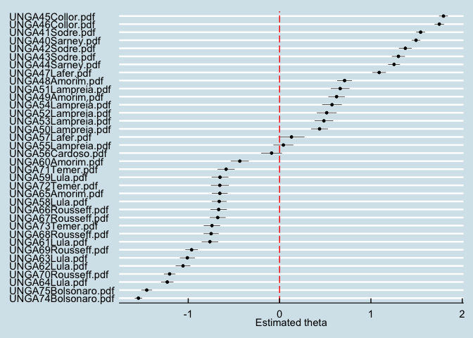

*Indexing Sarney UNGA 40 and Bolsonaro UNGA 74*

*Establishing reference scores for Sarney UNGA 40 and Bolsonaro UNGA 74*

*Modeling Wordscores for Sarney UNGA 40 and Bolsonaro UNGA 74*

*Retrieving Wordscores*

    pred_ws_Sarney40Bolsonaro74 <- predict(ws_Sarney40Bolsonaro74, rescaling = "mv")
    pred_ws_Sarney40Bolsonaro74

    ##    UNGA40Sarney.pdf     UNGA41Sodre.pdf     UNGA42Sodre.pdf     UNGA43Sodre.pdf 
    ##        -1.000000000        -0.258146089        -0.233624688        -0.148348564 
    ##    UNGA44Sarney.pdf    UNGA45Collor.pdf    UNGA46Collor.pdf     UNGA47Lafer.pdf 
    ##        -0.220405744        -0.165319750        -0.165493181        -0.132578947 
    ##    UNGA48Amorim.pdf    UNGA49Amorim.pdf  UNGA50Lampreia.pdf  UNGA51Lampreia.pdf 
    ##        -0.087136904        -0.137537304        -0.144360123        -0.101553756 
    ##  UNGA52Lampreia.pdf  UNGA53Lampreia.pdf  UNGA54Lampreia.pdf  UNGA55Lampreia.pdf 
    ##        -0.127297894        -0.051779930        -0.119934407        -0.042397014 
    ##   UNGA56Cardoso.pdf     UNGA57Lafer.pdf      UNGA58Lula.pdf      UNGA59Lula.pdf 
    ##        -0.113909826        -0.124694215        -0.118447369        -0.120183023 
    ##    UNGA60Amorim.pdf      UNGA61Lula.pdf      UNGA62Lula.pdf      UNGA63Lula.pdf 
    ##        -0.051724896        -0.075265738         0.014892868        -0.068437664 
    ##      UNGA64Lula.pdf    UNGA65Amorim.pdf  UNGA66Rousseff.pdf  UNGA67Rousseff.pdf 
    ##        -0.024335844        -0.043858479        -0.120172500        -0.103245226 
    ##  UNGA68Rousseff.pdf  UNGA69Rousseff.pdf  UNGA70Rousseff.pdf     UNGA71Temer.pdf 
    ##        -0.045825247        -0.023278044         0.007985528        -0.051577371 
    ##     UNGA72Temer.pdf     UNGA73Temer.pdf UNGA74Bolsonaro.pdf UNGA75Bolsonaro.pdf 
    ##        -0.042275574        -0.038585296         1.000000000         0.194818212

**Graph 2**

*Plotting Wordscores*

    BRUNGA$ws_Sarney40Bolsonaro74 = pred_ws_Sarney40Bolsonaro74
    BRUNGA %>% ggplot (aes(x=ws_Sarney40Bolsonaro74, y=reorder(doc_id, -ws_Sarney40Bolsonaro74))) + geom_point()

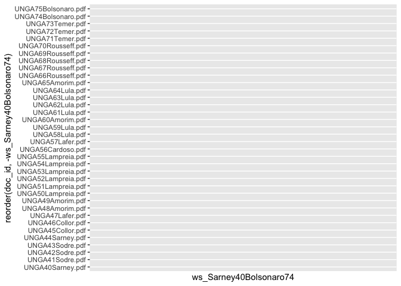

**Graph 3**

*Comparing all speeches from 1985 to 2020 for frequency of words*

    textplot_scale1d(tmod_BRUNGA, margin = "features", highlighted = c("development", "nuclear", "peace", "social", "democracy", "god", "gender", "women", "indebtedness", "religion", "liberalism", "socialism", "indigenous"), alpha = 1) + labs(title = "Estimated word positions for speeches by the Brazil \nat UNGA sessions") + theme_economist()

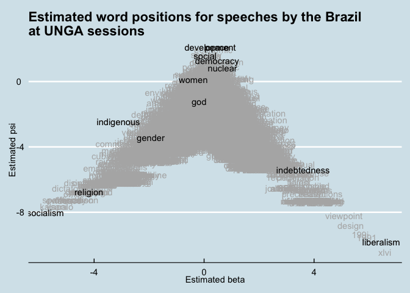

**Graph 4**

    set.seed(132)
    textplot_wordcloud(cleandfmat_BRUNGA, max_words = 100, colors = RColorBrewer::brewer.pal(8,"Dark2"), random_order = FALSE,
                       rotation = .25, )

    ## Warning: colors is deprecated; use color instead

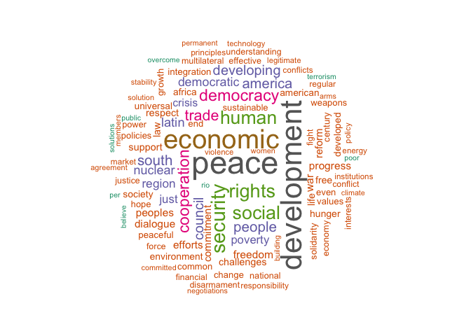

**Graph 5**

    size <- log(colSums(dfm_select(cleandfmat_BRUNGA, selection = "keep")))
    set.seed(144)
    feat <- names(topfeatures(fcmat_BRUNGA, 30))
    fcm_select(fcmat_BRUNGA, pattern = feat) %>%
        textplot_network(min_freq = 0.5)

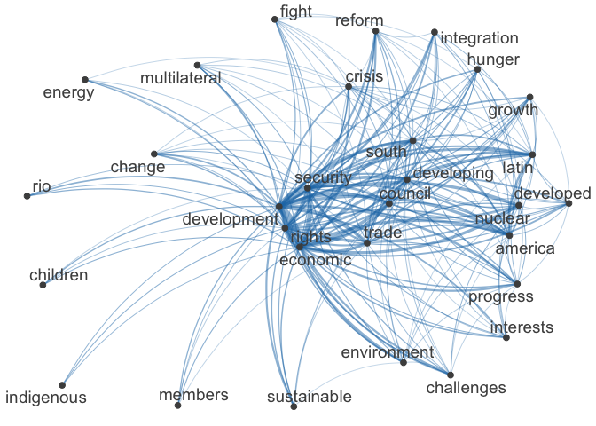

**Graph 6**

    tstat_dist <- as.dist(textstat_dist(cleandfmat_BRUNGA))
    clust <- hclust(tstat_dist)
    plot(clust, xlab = "Distance", ylab = NULL)

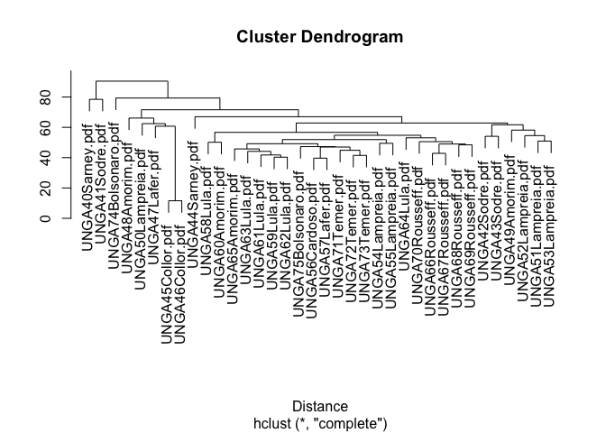

The unsupervised method (Graph 1) shows that *the majority of speeches
fall between theta -1 and 1, indicating a relatively stable policy
position across the different administrations since redemocratization of
Brazil*. There are, however, some notable variations in policy
positions, as follows:

-   in the early years of the redemocratization (during the
    administrations of Presidents Sarney and Collor, from UNGAs 40 to
    47), where theta &gt;= 1;
-   in the year before last of administration Lula (UNGAs 64) and in the
    last year of the administration Rousseff (UNGA 70), where theta
    &lt;= -1;
-   in the two years of Bolsonaro’s administration (UNGAs 74 and 75),
    where theta &lt;= -1.

It is possible to notice a variation within Collor’s administration. In
his first two years, President Collor’s speeches (UNGAs 45 and 46)
scored a theta &gt;= 1; however, in the last year of his mandate, the
UNGA47 speech fell within 0 &lt;= theta &gt;= 1. The impeachment of
President Collor did not seem to impact the policy position of his
successor, President Franco in UNGAs 48 and 49. The administration of
Franco registered a 0 &lt;= theta &gt;= 1, as in the last year of
Collor’s mandate. This is an important observation, because Collor was
impeached and Franco was his successor.

In the same line, FHC’s administration (UNGAs 50 to 54) registered a 0
&lt;= theta &gt;= 1 for most part, except for the last two years (UNGAs
55 and 56), where theta &lt;= 0. From 1992 to 2000 (a period that
corresponds to the last year President Collor’ term to the year before
last of President FHC’s term), the policy position of Brazil ranged
between 0 &lt;= theta &gt;= 1. The outcome was expected, since these
administrations (Collor, Franco and FHC) leaned towards a right or
center-right position.

The administrations of Lula (UNGAs 58 to 65), Rousseff (UNGAs 66 to 70)
and Temer (UNGAs 71 to 73) continued the tendency showed during the last
years of President FHC (UNGAs 55 and 56), where -1 &lt;= theta &gt;= 0.
Note, however, that Presidents Lula and Rousseff lean towards a left
position, while President Temer lean towards a center-right position.
Although the three speeches of administration Temer fell within the -1
&lt;= theta &gt;= 0, it is possible to note that the year after the
impeachment of Rousseff, President Temer’s speech in UNGA 71 was closer
to zero. President Temer’s speech in UNGA 71, however, was not that
different from that of left-wing Lula (UNGA58 and 60). This is an
important observation, because Rousseff was impeached and Temer was her
successor. In subsequent years, the speeches of President Temer (UNGA 72
and 73) approached those of left-wing Rousseff (UNGA 66, 67 and 68).

The supervised method (Graph 2), which has Bolsonaro’s first speech in
the GA (UNGA74) and the first speech of the redemocratization period
(Sarney, during the 40th session of UNGA) as indexes, confirms the
outcomes of the unsupervised method (Graph 1), while indicating that
majority of speeches of Brazil is clustered between a wordscore of -0.25
and 0.25. Once again, *the indication is that there is a relative stable
policy position across the different administrations since
redemocratization of Brazil*. The supervised method (Graph 2) also
confirms that the highest variations are during the redemocratization
period (UNGAs 41, 42 and 43, with the exception of UNGA 43) and the
second intervention of President Bolsonaro (during the 75th session of
UNGA). The estimated word positions (Graph 3) give some hints regarding
the variations in the speeches during the redemocratization and the
Bolsonaro periods. The right side of Graph 3 indicates that, in the
early years redemocratization, there were concerns with the Latin
America debt crises of the 1980s and the reopening of the Brazilian
economy after years of military rule. The left side of Graph 3 indicates
that the Bolsonaro administration seemed rather concerned with matters
related to indigenous groups, gender issues, religion and socialism.
Overall, the top center of Graph 3 confirms that *peace* and
*development* were the main thematic axes of the speeches of Brazil
since 1984, as wel as concerns with *social*, *democracy* and *nuclear*
matters.

The cluster dendrogram (Graph 6) also shows, on the basis of the tree,
that the vast majority of speeches are similar among them (UNGA 42, 43,
44, 49, 51, 52, 53, 54, 55, 59, 60, 61, 62, 63, 64, 65, 66, 67, 68, 69,
70, 71, 72, 72, 74 and 75), regardless of the political affiliation.
Clustered together on the basis of the tree are left-wing
administrations, such as Lula’s and Rousseff’s, and center and
center-right administrations, such as Sarney’s, Franco’s, FHC’s,
Temer’s. The speeches of the first 2 years of the redemocratization
period (UNGAs 40 and 41), on the top left of the tree, are the most
distant from the rest of the speeches of Brazil in UNGA. The first
speech of Bolsonaro in the UNGA is also one of the most distant from the
rest of the speeches. The third branch of the tree (UNGAs 45, 46, 47, 48
and 50) refers to the early years of the redemocratization and is the
third most distant cluster from the rest of the speeches. One important
observation is that Bolsonaro’s second speech (which was indexed in the
supervised method - Graph 2) is not as distant from the rest of majority
of the speeches.

The top features method (Table 1) once again confirms that *peace* and
*development* are the two thematic axes of the 37 speeches of Brazil in
the UNGA since redemocratization. From the plot of the frequency of
words in the Brazilian speeches in the General Assembly since the
redemocratization (Table 1), the words *peace* (342 observations) and
*development* (314 observations) are the most frequently mentioned. The
wordcloud graph (Graph 4) confirms the tendency and adds *economic*,
*political*, *social*, *security*, *rights* and *human* as other
frequent words.

The outcome of the network graph (Graph 5) shows that *development*,
*developing* and *developed* are nodal points. Development is related to
*security*, *rights*, *trade*, *south*, *Latin America* and
*sustainable*. It is noticeable that *peace* does not appear as a nodal
point. That is the case, because the network of co-occurrences graph is
based on semantic distance between words. In this sense, the networks of
co-occurrences shows the most frequent *chunk of words* after removing
stopwords and applying stemming. Note that *security* emerges as a nodal
point and is related to *council* and *reform*. The reform of the
Security Council has been another priority of the Brazilian diplomacy
(Pinheiro, 2004; Cervo & Bueno, 2002; Mendonça, 2013).

***5. Robustness tests***

As robustness tests, I will compare all 37 the speeches by
administration’s political affiliation and will assess the frequency of
words and co-occurrence networks for each individual administration. I
will also compare the relative frequency of words by administration and
lexical dispersion of the words development and peace in the corpus of
the 37 speeches year over year.

> Comparing all speeches from 1985 to 2020 by indexing Lula (left) and
> Bolsonaro (far-right):

*Indexing Lula and Bolsonaro*

*Establishing reference scores for Lula and Bolsonaro*

*Modeling Wordscores for Bolsonaro 74 UNGA and Bolsonaro 74 UNGA*

*Retrieving Wordscores*

    pred_ws_LulaBolsonaro <- predict(ws_LulaBolsonaro, rescaling = "mv")
    pred_ws_LulaBolsonaro

    ##    UNGA40Sarney.pdf     UNGA41Sodre.pdf     UNGA42Sodre.pdf     UNGA43Sodre.pdf 
    ##          -0.5912376          -0.5904842          -0.6914821          -0.5241864 
    ##    UNGA44Sarney.pdf    UNGA45Collor.pdf    UNGA46Collor.pdf     UNGA47Lafer.pdf 
    ##          -0.5662680          -0.5413491          -0.6229430          -0.5746850 
    ##    UNGA48Amorim.pdf    UNGA49Amorim.pdf  UNGA50Lampreia.pdf  UNGA51Lampreia.pdf 
    ##          -0.5457995          -0.5737767          -0.6157445          -0.5155816 
    ##  UNGA52Lampreia.pdf  UNGA53Lampreia.pdf  UNGA54Lampreia.pdf  UNGA55Lampreia.pdf 
    ##          -0.6279497          -0.5537841          -0.6395312          -0.5744135 
    ##   UNGA56Cardoso.pdf     UNGA57Lafer.pdf      UNGA58Lula.pdf      UNGA59Lula.pdf 
    ##          -0.6396015          -0.6447301          -1.0173184          -0.9681899 
    ##    UNGA60Amorim.pdf      UNGA61Lula.pdf      UNGA62Lula.pdf      UNGA63Lula.pdf 
    ##          -0.9448528          -0.9490014          -1.0203013          -1.0990778 
    ##      UNGA64Lula.pdf    UNGA65Amorim.pdf  UNGA66Rousseff.pdf  UNGA67Rousseff.pdf 
    ##          -1.0185647          -0.9870661          -0.6949221          -0.5567390 
    ##  UNGA68Rousseff.pdf  UNGA69Rousseff.pdf  UNGA70Rousseff.pdf     UNGA71Temer.pdf 
    ##          -0.5791896          -0.4818133          -0.5903937          -0.5356510 
    ##     UNGA72Temer.pdf     UNGA73Temer.pdf UNGA74Bolsonaro.pdf UNGA75Bolsonaro.pdf 
    ##          -0.5499090          -0.4979098           1.0000000           1.0000000

**Graph 7**

*Plotting Wordscores*

    BRUNGA$ws_LulaBolsonaro = pred_ws_LulaBolsonaro
    BRUNGA %>% ggplot (aes(x=ws_LulaBolsonaro, y=reorder(doc_id, -ws_LulaBolsonaro))) + geom_point()

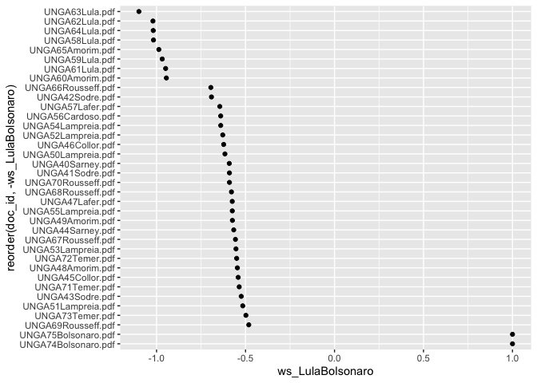

The robustness test (Graph 7) confirms that the majority of the speeches
are clustered and shows little variation. While indexing Lula’s (left)
and Bolsonaro’s (far-right) administrations for political affiliation,
the speeches of all other periods (Collor, Franco, FHC, Rousseff and
Temer) fall between wordscores -0.75 and -0.5. Graph 7 also shows
variations in the speeches in UNGAs 59, 60, 61, 63, 65, during Lula’s
administration. It is also noticeable that the majority of speeches
clustered around wordscores -0.75 and -0.5 is closer to the speeches of
Lula’s administration than to those of Bolsonaro’s.

> Sarney (1985-1990):

**Table 2**

    topfeatures(cleandfmat_Sarney)

    ##       peace    economic       latin     america development cooperation 
    ##          88          61          52          48          42          37 
    ##      people   democracy  developing     peoples 
    ##          34          33          29          28

**Graph 8**

    size <- log(colSums(dfm_select(cleandfmat_Sarney, selection = "keep")))
    set.seed(144)
    feat <- names(topfeatures(fcmat_Sarney, 30))
    fcm_select(fcmat_Sarney, pattern = feat) %>%
        textplot_network(min_freq = 0.5)

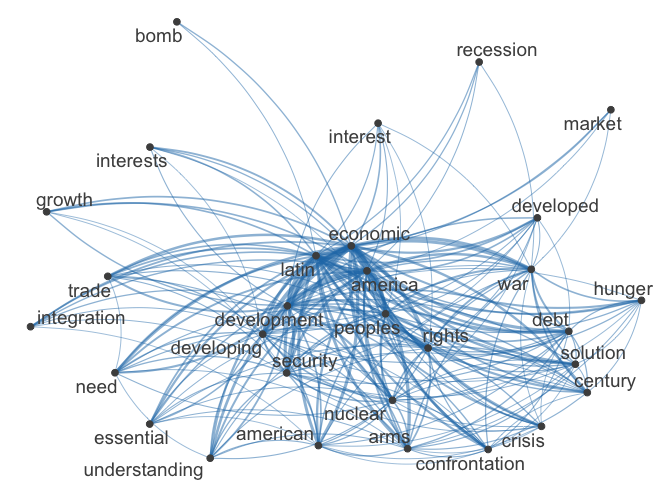
The top features function (Table 2) show that the most frequent words in
the speeches of Brazil under Sarney’s administration was *peace*,
followed by *economic*, *Latin America*, *development*, *cooperation*,
*people*, *political*, *democracy* and *developing*. If taken together,
*development* and *developing* appear 71 times. Therefore, *development*
and *peace* were two most spoken words in Brazil’s speeches in the UNGA
40, 41, 42, 43 and 44.

The words *development, developing, developed* are also central nodal
points in the network of feature co-occurrences (Graph 8) under the
Sarney’s administration and the early years of the redemocratization of
Brazil. Here, I can note that *development* is associated with *Latin
America* and the *South*, *economy*, *security* and *peoples*.

The outcome of the network graph (Graph 8) also show that Brazil has
prioritized in international fora the economic development and the
security of Latin America and the South. Other co-occurrences with Latin
America are integration and trade. In fact, the economic integration
with Latin America during Sarney’s administration was one vector of
development, as historians point out (Cervo and Bueno, 2002). Although
*peace* is one of the most frequently spoken word along with development
(and variations), *peace* does not appear as a nodal point in Graph 8,
as it is not captured as a frequent chunk of words in these speeches.

It is also worth mentioning that the debt crisis that Latin America has
faced in the 1980s is reflected in the speeches of Brazil, as well as
concerns with wars, bomb and nuclear (weapons/threat). The Latin America
debt crisis and the ever present nuclear threat during the Cold War
years are a reflection of the time in the Brazilian speeches in the UN.

> Collor (1990-1992):

**Table 3**

    topfeatures(cleandfmat_Collor)

    ##       peace development    economic   democracy cooperation      rights 
    ##          49          49          36          28          26          25 
    ##      social   universal  democratic    peaceful 
    ##          25          23          18          18

**Graph 10**

    size <- log(colSums(dfm_select(cleandfmat_Collor, selection = "keep")))
    set.seed(144)
    feat <- names(topfeatures(fcmat_Collor, 30))
    fcm_select(fcmat_Collor, pattern = feat) %>%
        textplot_network(min_freq = 0.5)

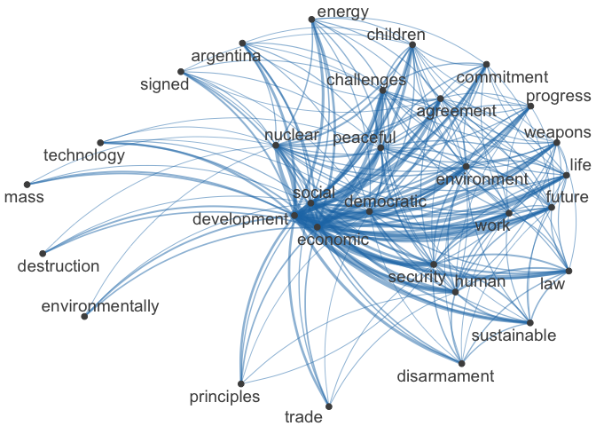

Once again, the top features function (Table 3) has *peace* and
*development* as the most frequent words in Brazil’s speeches in UNGAs
45, 46 and 47, under Collor’s administration. It is worth noting,
however, that *economic* becomes the third most relevant word in
President Collor’s speeches, reflecting the priority of his neoliberal
agenda.

The feature co-occurrence network graph (Graph 10) shows that
*development* however ceased to be associated with Latin America and the
South, pointing to a change of perception regarding *development*. In
other words, *development* is no longer a project for the Southern
Hemisphere, in an attempt to bridge the Cold War divide between the
developed North and the underdeveloped South.

In President Collor’s years, *development* is rather linked to
*economic*, *social*, *human*, *democratic*, *technology*,
*disarmament*, *weapons*, *security*, *peaceful*, *disarmament*,
*progress*, *trade*, *environmentally* and *sustainable*, among other
connections. The links associated with the nodal point *development*
corroborates the argument that the new model of development adopted by
President Collor prioritized access to markets and technology, as well
as the abandonment of any aspiration for Brazil to become a nuclear
power. Although *peace* is not a nodal point, *peaceful* is and is
associated with *nuclear*, *Argentina*, *democratic*, *social*,
*economic*, *development*. The lexicon reflects Collor’s turn to the
peaceful uses of the nuclear technology and the agreement with Argentina
on the matter, one of the main legacies of his administration.

> Franco (1992-1995):

**Table 4**

    topfeatures(cleandfmat_Franco)

    ## development       peace      rights       human       south cooperation 
    ##          33          27          25          23          21          16 
    ##  democratic   democracy     society    economic 
    ##          14          13          13          13

**Graph 12**

    size <- log(colSums(dfm_select(cleandfmat_Franco, selection = "keep")))
    set.seed(144)
    feat <- names(topfeatures(fcmat_Franco, 30))
    fcm_select(fcmat_Franco, pattern = feat) %>%
        textplot_network(min_freq = 0.5)

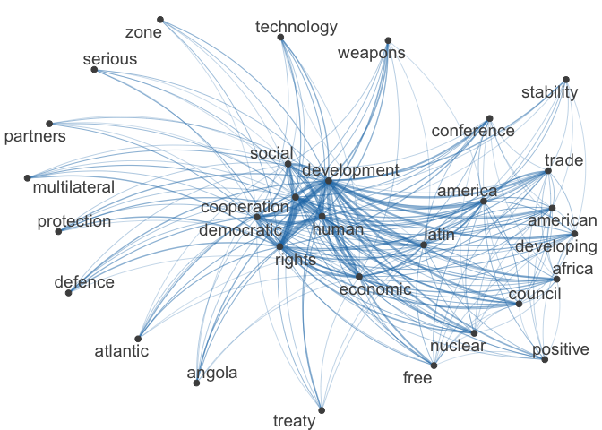

Despite the political rupture provoked by the impeachment of President
Collor, *peace* and *development* remain the two most important features
in the speeches of President Franco in UNGAs 48 and 49 (Table 4). A
novelty is the shift of emphasis from *economic* to *human* *rights* in
the outcome of the top features function (Table 4).

The co-occurrence network graph (Graph 12) shows that *development* is
still associated with *economic* and, as in Sarney’s years, *Latin*
*America*, *Africa* and *national*. However, *development* gains new
connotations, being also associated with *human*, *rights* and
*conference*. Under President Franco, Brazil hosted the United Nations
*Conference* on Environment and *Development* (emphasis added), also
known as the Rio de Janeiro Earth Summit. In 1992, Brazil also signed
the International Covenant on Economic, Social and Cultural Rights and
the International Covenant on Civil and Political Rights. The country
has also signed the Organization of American States’ Convention on Human
Rights, also known as Pact of San José da Costa Rica.

Although a frequent word in the wordcloud, *peace* is not a nodal point
in the network graph (Graph 12), as it is not captured as a frequent
chunk of words in these speeches.

> FHC (1995-2003):

**Table 5**

    topfeatures(cleandfmat_FHC)

    ##       peace    economic development    security       human       trade 
    ##          68          65          64          55          39          38 
    ##     council      reform cooperation   democracy 
    ##          35          33          32          30

**Graph 14**

    size <- log(colSums(dfm_select(cleandfmat_FHC, selection = "keep")))
    set.seed(144)
    feat <- names(topfeatures(fcmat_FHC, 30))
    fcm_select(fcmat_FHC, pattern = feat) %>%
        textplot_network(min_freq = 0.5)

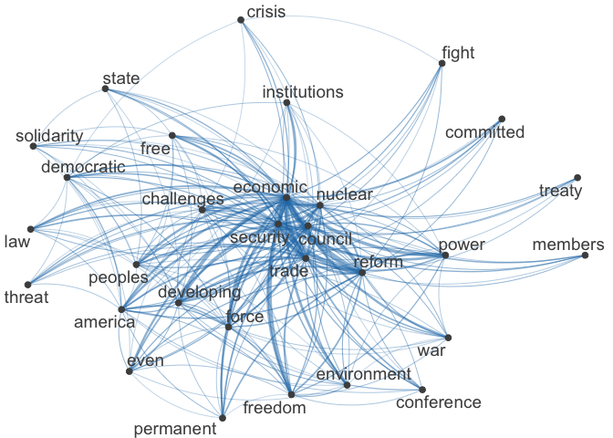

The triad *peace*, *economic* and *development* becomes more salient in
the speeches of Brazil in UNGAS 50 to 57 (Table 5). Under President FHC,
*economic* has even more prominence than during the Collor’s years, as
the top features function shows (Table 5). The co-occurrence network
graph (Graph 14) shows that *economic* is tied to *free* and *trade* to
*freedom*, reflecting the neoliberal agenda of the FHC years. In the
same vein, *developing* is linked to *trade*, *environment*, *freedom*
and *challenges*. At this point in time, there were various attempts to
negotiate free trade zones with the Americas (ALCA) and the EU
(Mercorsur and EU). It is also noticeable that the reform of the
Security Council gained prominence in the speeches of the FHC
administration, reflecting an attempt to project the country globally.
Although a frequent word in the wordcloud, *peace* is not a nodal point
in the network graph, as it is not captured as a frequent chunk of words
in these speeches.

> Lula (2003-2011):

**Table 6**

    topfeatures(cleandfmat_Lula)

    ##       peace      social    economic development      hunger    security 
    ##          57          57          55          53          45          40 
    ##       south     poverty     council      people 
    ##          38          36          34          31

**Graph 16**

    size <- log(colSums(dfm_select(cleandfmat_Lula, selection = "keep")))
    set.seed(144)
    feat <- names(topfeatures(fcmat_Lula, 30))
    fcm_select(fcmat_Lula, pattern = feat) %>%
        textplot_network(min_freq = 0.5)

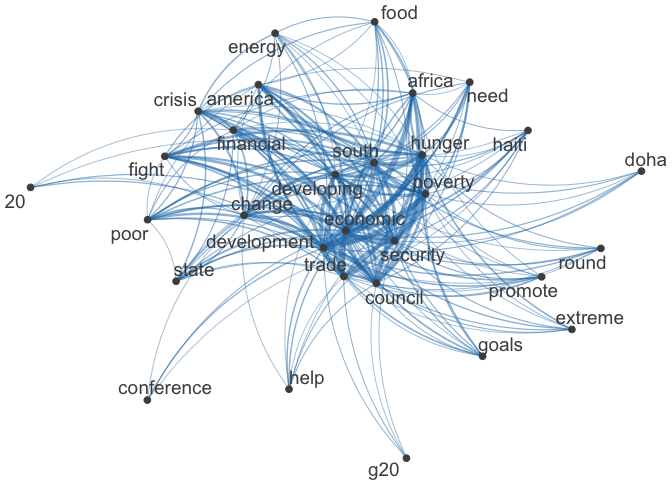

The left-wing administration of President Lula added the word *social*
to the triad *development*, *peace* and *economic*, which were present
in Collor’s and FHC’s speeches in the UN (Table 6). The concern with
social issues is also reflected by the frequency of the words *hunger*
and *poverty* (Table 6). The top features function shows that the word
*social* comes in second place in frequency, along with *peace*.

The novelty of the concern with social issues in the speeches of Brazil
in the UNGAs 58 to 65 can explain that the theta of the Lula
administration was *mostly* between zero and -1, in the comparison of
all 37 speeches of Brazil after the redemocratization (Graph 1). The
fact that the administration Lula maintained the triad *development*,
*peace* and *economic* can also explain that some speeches of the
neoliberal administration FHC (UNGAs 55 and 56) are close to those of
Lula’s left-wing period (Graph 1).

The network graph (Graph 16) also reveals that *development* and
*developing* are linked to the Doha *Development* Round (emphasis added)
of the World Trade Organization (WTO). The graph also reveals other
important aspects of the Brazilian diplomacy under Lula, such as the
Brazilian command of the military component of the UN peacekeeping
mission in Haiti and the Brazilian engagement with the establishment of
the G20. Although a frequent word in the wordcloud, *peace* is not a
nodal point in the network graph, as it is not captured as a frequent
chunk of words in these speeches.

> Rousseff (2011-2016):

**Table 7**

    topfeatures(cleandfmat_Rousseff)

    ## development    economic      social     poverty      crisis       peace 
    ##          38          28          28          28          27          27 
    ##      rights    security       women     council 
    ##          26          25          23          21

**Graph 18**

    size <- log(colSums(dfm_select(cleandfmat_Rousseff, selection = "keep")))
    set.seed(144)
    feat <- names(topfeatures(fcmat_Rousseff, 30))
    fcm_select(fcmat_Rousseff, pattern = feat) %>%
        textplot_network(min_freq = 0.5)

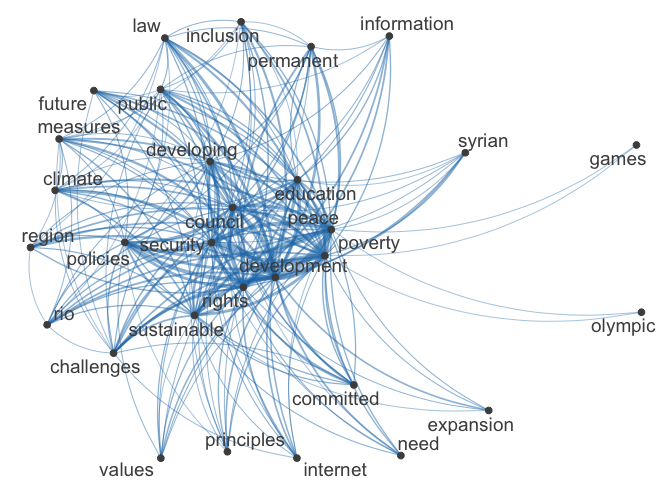

*Development* was the flagship of Rousseff’s administration, as her two
National Development Plans evidence. Her concern with *development* is
clearly reflected in her speeches from UNGAs 66 to 70 (Table 7). Like
her predecessor, Rousseff’s administration also evidences a concern with
social issues in her interventions in the United Nations, with the words
*social* and *poverty* appearing frequently.

One very distinct feature of the speeches of President Rousseff is the
frequency of the word *women*, which gain prominence for the first time
in Brazil’s interventions in the United Nations (Table 7). It is
noticeable that President Rousseff was the first female Head of State
and Government of Brazil and, as such, the first woman to ever open a
General Debate of the United Nations.

*Development* and its variations is linked with *education*, *poverty*,
*rights*, *peace*, *security*, *public*, *climate*, *sustainable* and
*Rio* (Graph 18). Under President Rousseff’s administration, Brazil
hosted the UN Conference on *Sustainable Development* in Rio de Janeiro
(emphasis added). The network graph also reveals other important aspects
of the Brazilian diplomacy under Rousseff, such as the Olympic Games in
Rio. *Peace* appears as a nodal point in the network graph and is linked
to *Syrian*, *information*, *security*, *council*, *development* and
*rights*, indicating that Brazil’s speeches are now addressing peace
from a more global than local or regional perspective.

> Temer (2016-2019):

**Table 8**

    topfeatures(cleandfmat_Temer)

    ## development     nuclear    security       peace      rights       human 
    ##          26          20          18          17          16          14 
    ##       trade   diplomacy    dialogue    economic 
    ##          13          12          11          11

**Graph 20**

    size <- log(colSums(dfm_select(cleandfmat_Temer, selection = "keep")))
    set.seed(144)
    feat <- names(topfeatures(fcmat_Temer, 30))
    fcm_select(fcmat_Temer, pattern = feat) %>%
        textplot_network(min_freq = 0.5)

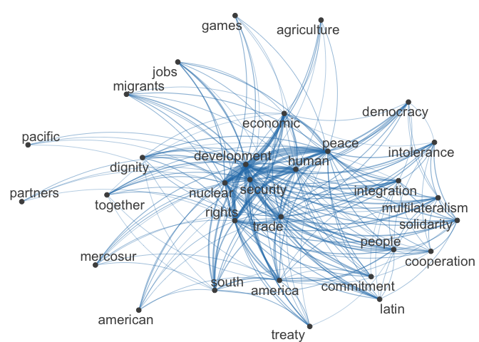

Despite the political rupture provoked by the impeachment of President
Rousseff, *development* remained the most important feature in the
speeches of President Temer in UNGAs 71 to 73 (Table 8). However,
*peace* lost some of its prominence, appearing in fourth place after
*nuclear* and *security* (Table 8); however, *peace* is still one of the
most frequent words. Additionally, the social concern has also
disappeared, which evidences the shift back to a center-right, liberal
politics. *Peace*, *security* and *nuclear* gain prominence due to a
global nuclear threat that started to loom in the horizon with North
Korea and Iran and to the conclusion of the Treaty on the Prohibition of
Nuclear Weapons (TPNW). *Economic* and *trade* regain importance, as per
top features function (Table 8). *Development* is again associated to
*economic* (Graph 20). It is noticeable that *women* loses relevance in
Temer’s speeches. *Pacific* and *peace* are nodal points and linked to
*human*, *agriculture*, *democracy*, *economic*, *integration*,
*nuclear*, *development*, *security*. The links with *peace* (Graph 20)
seem very general and connected to global politics, except for the
reference to *agriculture* (one of the main economic activities in
Brazil).

> Bolsonaro (2019-present):

**Table 9**

    topfeatures(cleandfmat_Bolsonaro)

    ##    indigenous       freedom      economic         human        rights 
    ##            31            14            12            12            11 
    ## environmental       peoples        amazon        people   development 
    ##            11            11            10             9             9

**Graph 22**

    size <- log(colSums(dfm_select(cleandfmat_Bolsonaro, selection = "keep")))
    set.seed(144)
    feat <- names(topfeatures(fcmat_Bolsonaro, 30))
    fcm_select(fcmat_Bolsonaro, pattern = feat) %>%
        textplot_network(min_freq = 0.5)

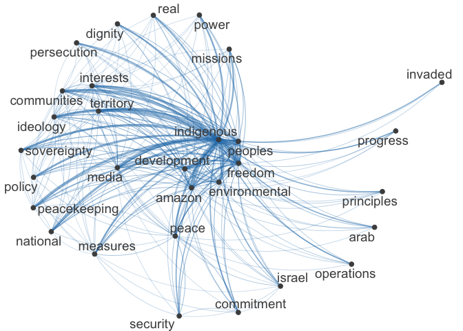

As Graphs 1 and 6 showed, the speech of President Bolsonaro in UNGAs 74
is the most distant from all the others during the redemocratization
period. The robustness tests confirm the trend. For the first time since
1985, *development* and *peace* cease to have prominence in Brazil’s
speeches in the UNGA (Table 9). *Development* is the 10th most spoken
word and *peace* does not appear in the top features table (Table 9).
*Indigenous* appears as the most spoken word for the first time in the
top features and wordcloud and is associated with *development*, the
*Amazon*, *environmental*, *freedom*, *progress*, *peoples*, *invaded*,
*territory*, *sovereignty* and *media*. *Peace* is a nodal point and is
linked to *indigenous*, *environmental*, *security*, *Israel* and
*peacekeeping* (Graph 22). In this light, *peace* seems connected to
*indigenous* or territorial issues (possibly sovereignty in the Amazon
region), but also to global politics (Israel, as the main allied of
Bolsonaro’s administration).

> Peace and Development

**Graph 23**

    dfm_weight <- dfmatclean_BRUNGA

    # Calculate relative frequency by administration
    freq_weight <- textstat_frequency(dfm_weight, n = 5, 
                                      groups = dfm_weight$Administration)

    ggplot(data = freq_weight, aes(x = nrow(freq_weight):1, y = frequency)) +
         geom_point() +
         facet_wrap(~ group, scales = "free") +
         coord_flip() +
         scale_x_continuous(breaks = nrow(freq_weight):1,
                            labels = freq_weight$feature) +
         labs(x = NULL, y = "Relative frequency")

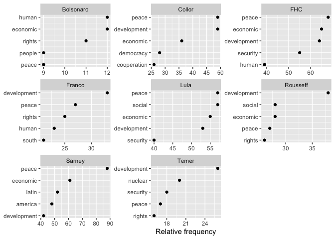
The relative frequency graph (Graph 23) shows that, in relative terms,
the left-wing governments of Lula and Rousseff did not abandon the triad
peace, development and economic of the Collor’s and FHC’s
administration, adding to it a social concern. During the early years of
redemocratization (Sarney’s years), development was less prominent in
relative terms. In the same vein, peace and development were less
prominent under Bolsonaro in relative terms.

**Graph 24**

    data_corpus_inaugural_subset <- 
        corpus_subset(corp_BRUNGA, Year > 1984)

        
    toks <- tokens(data_corpus_inaugural_subset)
    textplot_xray(
        kwic(toks, pattern = "development"),
        kwic(toks, pattern = "peace"),
        scale = "absolute"
    )

    ## Warning: Use of `x$ntokens` is discouraged. Use `ntokens` instead.

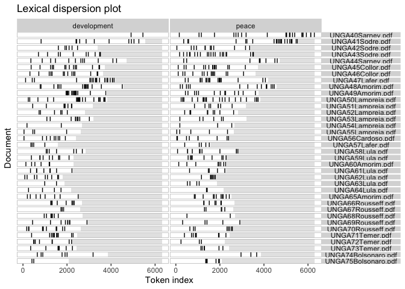
The dispersion plot (Graph 24) shows the lexical dispersion of the words
*development* and *peace* in the corpus of the 37 speeches year over
year. Graph 24 is useful to show how homogeneous the employment of these
two words have been over time across the parts of the corpus. The output
of graph 24 indicates that both *development* and *peace* are widely
dispersed across the texts of the speeches of Brazil in the UNGA over
time.

***6. Conclusion***

The NLP method corroborates the hypotheses that the speeches of Brazil
from UNGAs 40 to 75 have remained relatively stable and centered around
the two main thematic axes: *peace* and *development*.

Graph 1 (unsupervised method) shows that the majority of speeches falls
between theta -1 and 1, indicating a relatively stable policy position
across the eight administrations. The most noticeable variations are
observed during the early years of the redemocratization period and of
the Bolsonaro administration. The two moments of political rupture
(after Collor’s and Rousseff’s impeachment) did not show any radical
transformation, although the Temer’s speech suffered some small
adjustments becoming closer to Lula’s period (UNGA58 and 60) immediately
after President Rousseff was toppled but approached Rousseff’s speeches
in subsequent years.

Additionally, Graph 2 (supervised method) indicates that majority of
speeches of Brazil is clustered between a wordscore of -0.25 and 0.25,
when indexing Bolsonaro’s first speech in the GA (UNGA74) and the first
speech of the redemocratization period (Sarney, during the 40th session
of UNGA). Graph 2 confirms that the highest variations are during the
redemocratization period (UNGAs 41, 42 and 43, with the exception of
UNGA 43) and the Bolsonaro’s administration (during the 75th session of
UNGA).

Finally, Graph 6 (Cluster Dendrogram) shows that the vast majority of
speeches are similar among them (UNGA 42, 43, 44, 49, 51, 52, 53, 54,
55, 59, 60, 61, 62, 63, 64, 65, 66, 67, 68, 69, 70, 71, 72, 72, 74 and
75), regardless of the political affiliation. The speeches of the first
2 years of the redemocratization period (UNGAs 40 and 41) and the first
speech of Bolsonaro in the UNGA were the most distant from the rest of
the speeches of Brazil in UNGA.

As Graph 3 (Estimated word positions) suggests, in the early years
redemocratization, there was a concern with the Latin America debt
crises of the 1980s and the reopening of the Brazilian economy after
years of military rule, whereas, in the Bolsonaro years, there were
concerns with matters related to indigenous groups, gender issues,
religion and socialism.

The top features method (Table 1) once again confirms that peace and
development are the two thematic axes of the 37 speeches of Brazil in
the UNGA since redemocratization: the words peace (342 observations) and
development (314 observations) are the most frequently mentioned in all
37 speeches.

The outcome of the network graph (Graph 5) shows that development,
developing and developed are nodal points and related to security,
rights, trade, south, Latin America and sustainable. *Peace* however
does not appear as a nodal point, because *chunk of words* containing
*peace* are not frequent in the 37 speeches, after removing stopwords
and applying stemming.

As robustness tests, I compared all 37 the speeches by administration’s
political affiliation (Graph 7) and assessed the frequency of words
(Tables 2 to 9) and co-occurrence networks (Graphs 8, 10, 12, 14, 16,
18, 20 and 22) for *each individual administration*. I also compared the
relative frequency of words by administration (Graph 23) and lexical
dispersion of the words development and peace in the corpus of the 37
speeches year over year (Graph 24).

Graph 7 (supervised method by political affiliation for all 37 speeches)
confirmed that the majority of the speeches is clustered and showed
little variation, after indexing Lula’s left wing administration and
Bolsonaro’s far-right administration. It is also noticeable that the
majority of speeches clustered around wordscores -0.75 and -0.5 is
closer to the speeches of Lula’s administration than to those of
Bolsonaro’s.

Although *development* remained a constant feature in the speeches from
one administration to another with the exception of Bolsonaro’s period,
there have been some variations as to which word *development* was
associated with. In the early years of the redemocratization process,
*development* was linked with Latin America and the South, economy,
security and peoples (Graph 8). Indeed, *development*, under Sarney’s
administration, was a project for the Southern Hemisphere, in an attempt
to bridge the Cold War divide between the developed North and the
underdeveloped South. Afterwards, *development* became associated with
economy and trade in the neoliberal administrations of Collor and FHC
(Graphs 10 and 14). The economic integration with Latin America, which
was possible after the nuclear agreement between Argentina and Brazil,
was the main legacy of Collor’s years. As for FHC, the priority was the
negotiation of free trade areas, as the ALCA and the Mercosur-EU
agreement. Franco’s speeches recovers the link between *development* and
Latin America and introduces a new link with human rights and
cooperation (Graph 12). During Franco’s years, Brazil signed the UN
Covenants on human rights and the OAS Convention on the same matter.
Another variation was introduced by the left-wing administrations of
Presidents Lula and Rousseff, which added a link between *development*
and *social* (Graphs 16 and 18). It was the first time that social
issues were linked to development and that reflects the leftist
inclination of Lula’s and Rousseff’s administrations.

*Peace* has also remained a constant feature, appearing frequently in
the speeches of Brazil in the UNGA over time. *Peace* and variations
(*peaceful*, *pacific*) appeared as nodal points only in Collor’s,
Rousseff’s, Temer’s and Bolsonaro’s administrations (Graphs 10, 18, 20
and 22). *Peace* was linked with *nuclear*, *Argentina*, *democratic*,
*social*, *economic* and *development* in Collor’s administration and
reflects his foreign policy priority of signing an agreement on the
peaceful uses of the nuclear technology with Argentina and of abandoning
any ambitions of a nuclear program other than for peaceful purposes for
Brazil (Graph 10). Under Rousseff’s administration, *peace* is
associated with *Syrian*, *information*, *security*, *council*,
*development* and *rights*, indicating that Brazil’s speeches were
addressing peace from a more global than local or regional perspective
(Graph 18). The tendency is maintained in Temer’s administration (Graph
20), except for the connection between *peace* and *agriculture* (one of
the main economic activities in Brazil). Under Bolsonaro’s
administration, *peace* seems to be connected to both global (Israel)
and local (*indigenous*) politics (Graph 22).

*Peace* and *development* clearly lose relevance in President
Bolsonaro’s speeches in the UNGAs 74 and 75 (Table 9 and Graph 22).
While emphasizing aspects related to the Amazon, indigenous people and
territory, Bolsonaro’s speeches represent the highest variation when
compared to all other interventions since the redemocratization of
Brazil.

The relative frequency graph (Graph 23) shows that the left-wing
governments of Lula and Rousseff did not abandon the triad peace,
development and economic of the Collor’s and FHC’s administration,
adding to it a social concern. The novelty of the concern with social
issues in the speeches of Brazil in the UNGAs 58 to 65 can explain that
the theta of the Lula administration was mostly between zero and -1, in
the comparison of all 37 speeches of Brazil after the redemocratization
(Graph 1). The fact that the administration Lula maintained the triad
development, peace and economic can also explain that some speeches of
the neoliberal administration FHC (UNGAs 55 and 56) are close to those
of Lula’s left-wing period (Graph 1). Such a trend explains the little
variation from one administration to another, regardless of political
affiliation. During the early years of redemocratization (Sarney’s
years), development was less prominent in relative terms; similarly,
peace and development were less prominent under Bolsonaro in relative
terms (Graph 23).

Overall, the output of graph 24 (lexical dispersion) indicates that both
*development* and *peace* are widely dispersed across the speeches of
Brazil in the UNGAs.

***7. References***

Benoit, K. et al. (2018) quanteda: An R package for the quantitative
analysis of textual data. Journal of Open Source Software. \[Online\] 3
(30), 774.

Cervo, A. L. & Bueno, C. (2002) História da política exterior do Brasil.
4a edição revista e ampliada. Brasília, DF: Editora UnB.

Corrêa, L. F. de S. & Fundação Alexandre de Gusmão (eds.) (2013) Brazil
in the United Nations, 1946 - 2011. Third edition. Brasília: Fundação
Alexandre de Gusmão.

Dag Hammarskjold Library (n.d.) Ask DAG! \[online\]. Available from:
<https://ask.un.org/faq/70473> (Accessed 23 May 2021).

Garcia, E. V. (2012) O sexto membro permanente: o Brasil e a criação da
ONU. 1a ed. Rio de Janeiro, RJ: Contraponto.

Mendonça, R. (2013) História da política exterior do Brasil: do período
colonial ao reconhecimento do império (1500-1825). Brasília, DF:
Fundação Alexandre de Gusmão.

Pinheiro, L. (2004) Política externa brasileira (1889-2002). Rio de
Janeiro, RJ: Jorge Zahar Editor.

UCLSPP (n.d.) Advanced Quantitative Methods. \[online\]. Available from:
<https://uclspp.github.io/PUBLG088/seminar7.html> (Accessed 23 May
2021).
