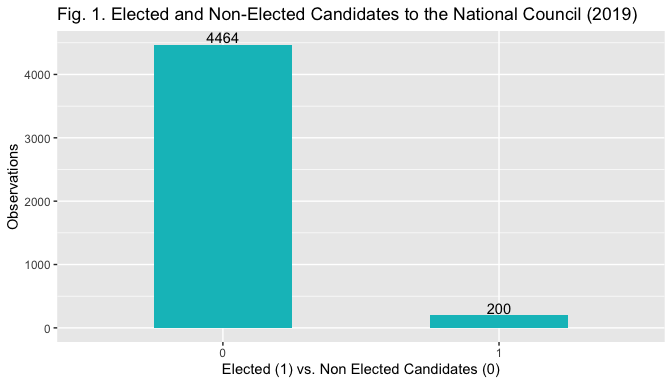
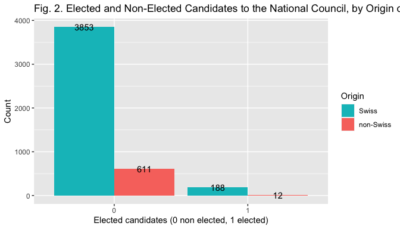
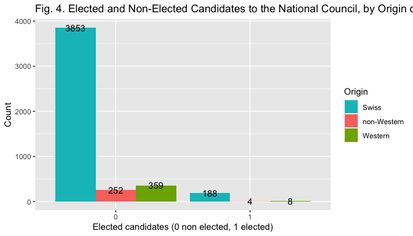
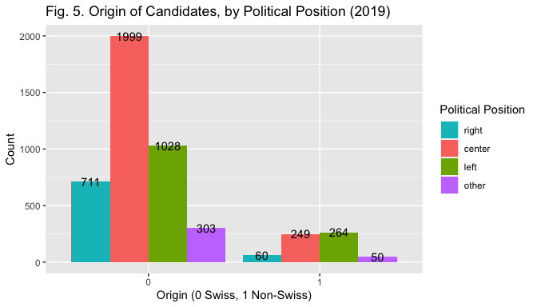
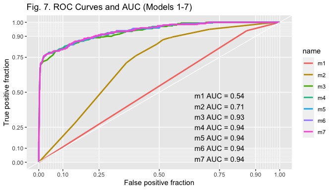
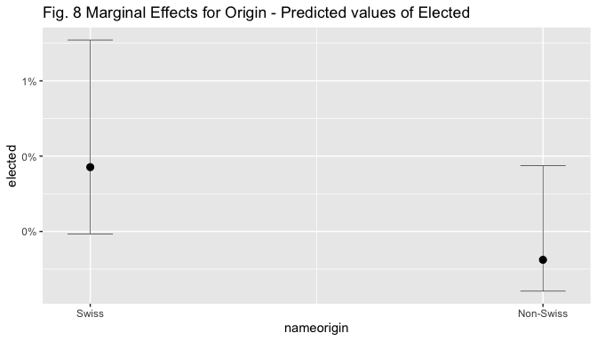
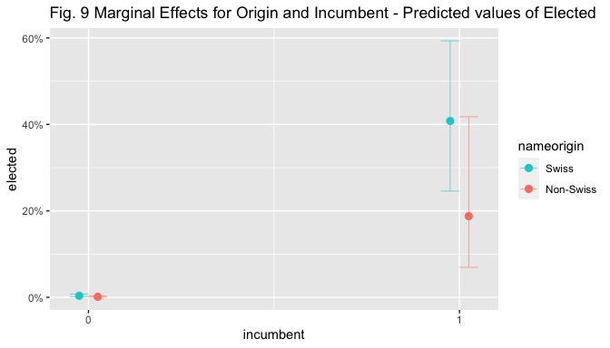
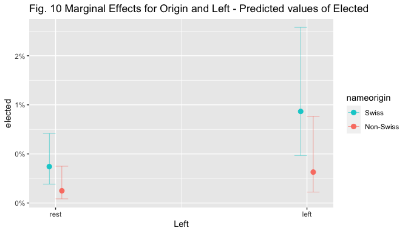

<!-- Justify text. -->

-   [1. Electoral Discrimination in Switzerland](#electoral-discrimination-in-switzerland)
  -   [1.1 Introduction and Research Question](#introduction-and-research-question)
  -   [1.2 Hypothese](#hypothese)
-   [2. Data and Measurement](#data-and-measurement)
  -   [2.1 Study Setting, Data Source and Characteristics](#study-setting-data-source-and-characteristics)
  -   [2.2 Data, Coding, and Measurement](#data-coding-and-measurement)
-   [3. Methods](#methods)
-   [4. Results](#results)
  -   [4.1 Overview](#overview)
  -   [4.2 Model Selection](#model-selection)
  -   [4.3 Diagnostics](#diagnostics)
  -   [4.4 Results](#results)
-   [5. Conclusion](#conclusion)
-   [References:](#references)

## 1. Electoral Discrimination in Switzerland {#electoral-discrimination-in-switzerland}

### 1.1 Introduction and Research Question {#introduction-and-research-question}

Switzerland has one of the highest shares of foreign-born population in
Europe (Nguyen 2016). In 2018, the number of foreign-born represented
29.65% of the population (OFS 2019a) and 37.5% of the Swiss population
aged 15 or above had an immigration background. Of these, 13.6% held a
Swiss passport (OFS 2019b). Yet, in recent years Switzerland has also
been on the spotlight for the anti-immigration attitudes of its citizens
expressed via popular initiatives aimed at imposing restrictions in the
immigration domain. This apparent tension raises the question of whether
the diversity of the Swiss population is mirrored in its political
institutions.

The underrepresentation of immigrant minorities in parliaments is a
common characteristic of many European states although it is precisely
in democratic countries that institutions should be representative of
their populations. Regardless of its causes, underrepresentation may
thus be seen as entailing a democratic deficit (Bloemraad and
Schönwälder 2013).

In Switzerland, this question has been studied from the discriminatory
voting behavior standpoint by Portmann and Stojanović (2019), who found
that immigrant-origin candidates received significantly more negative
preference votes than their Swiss counterparts in Zurich local
elections. This study will assess whether these findings can be extended
to the federal level by answering the following research question:

**RQ:** To what extent does the origin of a candidate influences its
chances of success in Swiss parliamentary elections?

### 1.2 Hypotheses {#hypothese}

Voters inferences about the ethnic origins of a candidate have been
found to be used as heuristic tools during elections (McDermott 1999).
Yet, the specific mechanism explaining how the origin of a candidate
influences voters’ evaluations are multiple: voters may simply hold
negative attitudes towards immigrants, they could use ethnicity to infer
the ideological leaning of a candidate (Street 2014), or they could make
evaluations based on the perceived capacity of such candidates to
conform to Swiss political culture. The use of a statistical method does
not allow to directly test any of such mechanisms. However, the
following hypothesis can be formulated:

**H1a:** Having an immigration background negatively influences the
chances of election of a candidate.

## 2 Data and Measurement {#data-and-measurement}

### 2.1  Study Setting, Data Source and Characteristics {#study-setting-data-source-and-characteristics}

Cross-sectional data on the 2019 federal elections of the National
Council (NC) are employed to test the hypothesis. The NC is the lower
chamber of the Swiss parliament, it has 200 seats allocated
proportionally to the population of Cantons, which serve as electoral
districts. The NC is elected with an open-PR system (except in the six
cantons that only have one seat, who elect their representatives through
a majoritarian system). The main source of data employed for the
analysis is an official dataset compiled by the Federal Statistical
Office (Opendata.swiss 2019) that includes several personal information
on candidates. The final dataset includes information on 4,664
candidates, who represent the unit of analysis (four observations in the
original dataset have been deleted because they were aggregates not
corresponding to a specific candidate).

    library(utils)
    elections<- read.csv2("/Users/Juliette/Dropbox/Stats II/Assignments (1)/Final project/Agnese Cecilia Maria Zucca_114354_assignsubmission_file_/CN2019.csv", header=TRUE, dec=".")

### 2.2 Data, Coding, and Measurement {#data-coding-and-measurement}

**Response Variable and Main Independent Variables**

The dependent variable *electoral success* is a categorical bianry
variable where 0 indicates non-election and 1 election. The barplot in
Fig. 1 displays its distrubution.

    library(ggplot2)
    library(scales)

    ggplot (data=elections, aes(x = factor(elected))) + geom_bar(position="dodge",  fill="#00BFC4", width=0.5) + xlab("Elected (1) vs. Non Elected Candidates (0)") + 
        ylab("Observations") + ggtitle("Fig. 1. Elected and Non-Elected Candidates to the National Council (2019)") + geom_text(stat = 'count', aes(label = stat(count), vjust = -0.2))

The measure the main independent variable *origin of the candidate* the
origin of family names of candidates is considered. The use of names to
determine candidates' origin has been employed in similar studies and
the rationale behind it is that names provide voters with an information
cue regarding the origin of the candidate, and may thus be used as a
heuristic tool when casting votes (Portmann and Stojanović 2019;
Thrasher et al. 2015). First, each of the 4,664 names has been coded
according to which it was Swiss or not. Following Portmann and
Stojanović (2019) all family names appearing in the Register of Swiss
Family Names (RSS 2020) as bore by someone with Swiss citizenship before
1940 have been coded as Swiss (see Portmann and Stojanovicc2ć for a
discussion of the cut-off). All the other names have been coded as
“non-Swiss”. This results in a categorical binary measure (0 = Swiss
name, 1 = non-Swiss name). As highlighted by Stojanović and Portmann
(2019), this coding procedure is not necessarily precise, as Swiss
candidates that through marriage acquire a foreign family name or
foreign ones that acquire Swiss names would be misclassified. However,
the misscategorization is less worrisome if one considers that voters
infer the origin from names and use them as heuristic tools.

To conduct robustness checks comparable to the ones of Stojanović and
Portmann (2019) their approach has been further followed to create two
additional measures of name origin. The country or region of non-Swiss
names has been coded using the database “forebears.io” (as well as
background information available on the internet and first names when in
doubt). For the first additional measure, names have been classified as
either Swiss, Non-Swiss but linguistically proximate to Switzerland
(i.e. IT, FR, D and AT) or Non-Swiss but linguistically distant (i.e.
all the rest). The measure was chosen by the authors to account for the
potential inability to discriminate between Swiss and other
linguistically proximate names. Further, voters may also consider that
coming from a neighbouring country and speaking the same language
facilitates integration, and thus consider these candidates better
equipped than other foreigners to serve as MPs. For the second, names
have been classified as Swiss, Western (i.e. Western, Southern and
Northern Europeans and Anglo-Saxon names) or Non-Western (i.e. Eastern
European, Western Balkans, Turkish, Asian, African and Latin American
names). This distinction has been included considering that the strenght
of immigration prejudices may vary: western individuals may be perceived
more similar to Swiss ones, and thus be suject to less prejudice than
non-Western ones. Both variables are categorical and take three values
(0 if Swiss, 1 if linguistically proximate/Western, 2 if linguistically
distant/non-Western).

The bar plot in Fig. 2, 3 and 4 help visualize the relationship between
the election outcome and the different measures of the indipendent
variables.

    library(ggplot2)
    library(scales)

    ggplot (data=elections, mapping = aes(x = factor(elected), fill = factor(nameorigin)))+ geom_bar(position='dodge') + xlab("Elected candidates (0 non elected, 1 elected)") + 
        ylab("Count") + ggtitle("Fig. 2. Elected and Non-Elected Candidates to the National Council, by Origin of Family Name (2019)") + labs (fill="Origin") + geom_text(stat = 'count', aes(label = stat(count)), position=position_dodge(width = 0.9)) + scale_fill_manual(values=c("#00BFC4", "#F8766D"), labels=c("Swiss", "non-Swiss"))

    elections$nameoriginl <- relevel(elections$nameoriginl, ref = "Swiss")
    elections$nameoriginw <- relevel(elections$nameoriginw, ref = "Swiss")

    ggplot (data=elections, mapping = aes(x = factor(elected), fill = factor(nameoriginl))) + geom_bar(position="dodge") + xlab("Elected candidates (0 non elected, 1 elected)") + ylab("Count") + ggtitle("Fig. 3. Elected and Non-Elected Candidates to the National Council, by Origin of Family Name") + labs (fill="Origin") + geom_text(stat = 'count',  aes(label = stat(count)), position=position_dodge(width = 0.9)) + scale_fill_manual(values=c("#00BFC4", "#F8766D", "#7CAE00"))

    ggplot (data=elections, mapping = aes(x = factor(elected), fill = factor(nameoriginw)))+ geom_bar(position="dodge") + xlab("Elected candidates (0 non elected, 1 elected)") + 
        ylab("Count") + ggtitle("Fig. 4. Elected and Non-Elected Candidates to the National Council, by Origin of Family Name (2019)") + labs (fill="Origin") + geom_text(stat = 'count', aes(label = stat(count)), position=position_dodge(width = 0.9)) + scale_fill_manual(values=c("#00BFC4", "#F8766D", "#7CAE00"))

Other candidates' individual characteristics that may have an effect on
the personal election outcome are included as controls.

*Gender* is a categorical binary variable (1 if woman, 0 if men). It is
included because it is one of the information voters can easily infer
from the ballot by looking at names, and may thus use it as a heuristic
tool (McDermott 1998, Stojanovic and Portmann 2019).

    library(stats)
    elections$gender <- relevel(elections$gender, ref="M")

*Age Category* is a categorical variable with three levels (18-35;
36-60; 61+). It has been created by substracting the year of birth from
2019 at the stage of data coding and subsequently the continuous
variable has been binned into the three categories with R. Age is
included because it is one of the few information voters possess about
the candidate and may thus be used as a cue (Lutz 2010). In addition,
older candidates may be favoured over younger ones because they may
signal experience and competence.

    library(base)
    agecat<- cut(elections$age, breaks=c(17, 35, 60, Inf), labels=c("18-35", "36-60", "61+"))

*Incumbency Status* is a categorical binary variable created by
attributing value 1 to incumbents and 0 to the others. Being an
incumbent should exert a positive effect on the elction outcome as
incumbents are more known to the public and more likely to invest in
their campaign (Lutz 2010).

*Ballot Position* is a numerical variable indicating the position of a
candidate name on the ballot (1 = top of the list). Ballot position is
included as control as it is deemed to influence election outcomes
through name-order effects that provide an advantage to top positions
(Lutz 2010; Thrasher 2015). The coefficient is expected to be negative
as higher numbers indicate a lower position on the ballot.

*Pre Cumulation* is a categorical binary variable created by attributing
1 to all individuals holding two list positions and 0 to others. In
Switzerland candidates can be listed two times on the same ballot and
could hence double their votes. As such, it should exert a positive
effect on election outcomes (Lutz 2010).

*Political Position - Left* is a categorical binary variable created by
merging the categories center, right and other (= 0) and opposing them
to left (=1) (candidates were first coded according to their left,
center and right position plus, the category other for apolitical or
unrecognisable parties). Party position may provide an ideological cue
to voters, and must those be controlled for (McDermott 1999). Further,
it serves to control for the unequal distribution of non-Swiss
candidates across list of different political positions (Black and
Erickson 2006), as Fig.5. below displays. Yet, the analyis will employ
the binary specification (Left = 1, Rest = 0 ) for two main reasons.
First, left positioning may mitigate the effect on the hypothesized
negative relationship between name origin and election outcome, as
parties on the left are more open to immigration, and the pool of voters
to which they appeal may thus discriminate less based on origin (Street
2013). For this reason, it may be interesting to look at the interaction
effect between Left and name origin. Second, while keeping the
multi-level specification could be more interesting in an ideal setting,
here the resulting categories would be too small. E.g. the fact that the
number of elected non-Swiss is 12 (see Table 1) risks creating problems
with the interaction term if a combination has 0 cases.

    library (tidyverse)
    library(forcats)

    elections1 <- elections %>%
      mutate(polposition = as_factor(polposition))

    Left <- fct_collapse(elections1$polposition, 
                    left = "2", 
                    rest = c("0", "1", "3"))

    library(ggplot2)
    library(scales)

    ggplot (data=elections, mapping = aes(x = factor(nameorigin), fill = factor(polposition)))+ geom_bar(position="dodge") + xlab("Origin (0 Swiss, 1 Non-Swiss)") + 
        ylab("Count") + ggtitle("Fig. 5. Origin of Candidates, by Political Position (2019)") + labs (fill="Political Position") + geom_text(stat = 'count', aes(label = stat(count)), position=position_dodge(width = 0.9)) + scale_fill_manual(values=c("#00BFC4", "#F8766D", "#7CAE00", "#C77CFF"), labels = c ("right", "center", "left", "other")) 

*Foreign Population* is a continuous numerical variable measuring the
share of foreign population in the electoral district of each candidate.
It has been included because previous studies suggest that the presence
of minorities may foster the election of immigrant-origin candidates due
to the presence of more minority citizens voting for them (Threasher et
al. 2015). Further, this relationship could also result from the fact
that higher exposure to foreign residents may lead to less negative
attitudes towards immigrants. Its interaction effect with name origin
will thus be considered. Data source: Swiss Statistical Atlas (OFS
2020).

Table 1 below provides summary statistics for all the variables
discussed above.

    library(tidyverse)
    library(table1)

    elections2 <- elections1 %>%
      mutate(gender = as_factor(gender), incumbent = as_factor(incumbent), nameorigin = as_factor(nameorigin), Left = as_factor(Left), nameoriginl=as_factor(nameoriginl), nameoriginw = as_factor(nameoriginw), precumulation=as_factor(precumulation), elected=as_factor(elected))

    elections2$elected <- factor(elections2$elected, levels=c(0,1),
             labels=c("Non-Elected", 
                      "Elected"))

    elections2$nameorigin <- factor(elections2$nameorigin, levels=c(0,1),
             labels=c("Swiss", 
                      "Non-Swiss"))

    table1(~nameorigin +nameoriginw + nameoriginl + agecat + gender + ballotposition + incumbent + precumulation + polposition + Left + foreign2018 |elected, elections2)

    ## [1] "<table class=\"Rtable1\">\n<thead>\n<tr>\n<th class='rowlabel firstrow lastrow'></th>\n<th class='firstrow lastrow'>Non-Elected (N=4464)</th>\n<th class='firstrow lastrow'>Elected (N=200)</th>\n<th class='firstrow lastrow'>Overall (N=4664)</th>\n</tr>\n</thead>\n<tbody>\n<tr>\n<td class='rowlabel firstrow'>nameorigin</td>\n<td class='firstrow'></td>\n<td class='firstrow'></td>\n<td class='firstrow'></td>\n</tr>\n<tr>\n<td class='rowlabel'>Swiss</td>\n<td>3853 (86.3%)</td>\n<td>188 (94.0%)</td>\n<td>4041 (86.6%)</td>\n</tr>\n<tr>\n<td class='rowlabel lastrow'>Non-Swiss</td>\n<td class='lastrow'>611 (13.7%)</td>\n<td class='lastrow'>12 (6.0%)</td>\n<td class='lastrow'>623 (13.4%)</td>\n</tr>\n<tr>\n<td class='rowlabel firstrow'>nameoriginw</td>\n<td class='firstrow'></td>\n<td class='firstrow'></td>\n<td class='firstrow'></td>\n</tr>\n<tr>\n<td class='rowlabel'>Swiss</td>\n<td>3853 (86.3%)</td>\n<td>188 (94.0%)</td>\n<td>4041 (86.6%)</td>\n</tr>\n<tr>\n<td class='rowlabel'>non-Western</td>\n<td>252 (5.6%)</td>\n<td>4 (2.0%)</td>\n<td>256 (5.5%)</td>\n</tr>\n<tr>\n<td class='rowlabel lastrow'>Western</td>\n<td class='lastrow'>359 (8.0%)</td>\n<td class='lastrow'>8 (4.0%)</td>\n<td class='lastrow'>367 (7.9%)</td>\n</tr>\n<tr>\n<td class='rowlabel firstrow'>nameoriginl</td>\n<td class='firstrow'></td>\n<td class='firstrow'></td>\n<td class='firstrow'></td>\n</tr>\n<tr>\n<td class='rowlabel'>Swiss</td>\n<td>3853 (86.3%)</td>\n<td>188 (94.0%)</td>\n<td>4041 (86.6%)</td>\n</tr>\n<tr>\n<td class='rowlabel'>OtherLang</td>\n<td>347 (7.8%)</td>\n<td>4 (2.0%)</td>\n<td>351 (7.5%)</td>\n</tr>\n<tr>\n<td class='rowlabel lastrow'>SameLang</td>\n<td class='lastrow'>264 (5.9%)</td>\n<td class='lastrow'>8 (4.0%)</td>\n<td class='lastrow'>272 (5.8%)</td>\n</tr>\n<tr>\n<td class='rowlabel firstrow'>agecat</td>\n<td class='firstrow'></td>\n<td class='firstrow'></td>\n<td class='firstrow'></td>\n</tr>\n<tr>\n<td class='rowlabel'>18-35</td>\n<td>1986 (44.5%)</td>\n<td>21 (10.5%)</td>\n<td>2007 (43.0%)</td>\n</tr>\n<tr>\n<td class='rowlabel'>36-60</td>\n<td>1857 (41.6%)</td>\n<td>151 (75.5%)</td>\n<td>2008 (43.1%)</td>\n</tr>\n<tr>\n<td class='rowlabel lastrow'>61+</td>\n<td class='lastrow'>621 (13.9%)</td>\n<td class='lastrow'>28 (14.0%)</td>\n<td class='lastrow'>649 (13.9%)</td>\n</tr>\n<tr>\n<td class='rowlabel firstrow'>gender</td>\n<td class='firstrow'></td>\n<td class='firstrow'></td>\n<td class='firstrow'></td>\n</tr>\n<tr>\n<td class='rowlabel'>M</td>\n<td>2670 (59.8%)</td>\n<td>116 (58.0%)</td>\n<td>2786 (59.7%)</td>\n</tr>\n<tr>\n<td class='rowlabel lastrow'>F</td>\n<td class='lastrow'>1794 (40.2%)</td>\n<td class='lastrow'>84 (42.0%)</td>\n<td class='lastrow'>1878 (40.3%)</td>\n</tr>\n<tr>\n<td class='rowlabel firstrow'>ballotposition</td>\n<td class='firstrow'></td>\n<td class='firstrow'></td>\n<td class='firstrow'></td>\n</tr>\n<tr>\n<td class='rowlabel'>Mean (SD)</td>\n<td>8.92 (8.01)</td>\n<td>2.73 (2.44)</td>\n<td>8.66 (7.95)</td>\n</tr>\n<tr>\n<td class='rowlabel lastrow'>Median [Min, Max]</td>\n<td class='lastrow'>6.00 [1.00, 35.0]</td>\n<td class='lastrow'>2.00 [1.00, 12.0]</td>\n<td class='lastrow'>6.00 [1.00, 35.0]</td>\n</tr>\n<tr>\n<td class='rowlabel firstrow'>incumbent</td>\n<td class='firstrow'></td>\n<td class='firstrow'></td>\n<td class='firstrow'></td>\n</tr>\n<tr>\n<td class='rowlabel'>0</td>\n<td>4433 (99.3%)</td>\n<td>61 (30.5%)</td>\n<td>4494 (96.4%)</td>\n</tr>\n<tr>\n<td class='rowlabel lastrow'>1</td>\n<td class='lastrow'>31 (0.7%)</td>\n<td class='lastrow'>139 (69.5%)</td>\n<td class='lastrow'>170 (3.6%)</td>\n</tr>\n<tr>\n<td class='rowlabel firstrow'>precumulation</td>\n<td class='firstrow'></td>\n<td class='firstrow'></td>\n<td class='firstrow'></td>\n</tr>\n<tr>\n<td class='rowlabel'>0</td>\n<td>4089 (91.6%)</td>\n<td>193 (96.5%)</td>\n<td>4282 (91.8%)</td>\n</tr>\n<tr>\n<td class='rowlabel lastrow'>1</td>\n<td class='lastrow'>375 (8.4%)</td>\n<td class='lastrow'>7 (3.5%)</td>\n<td class='lastrow'>382 (8.2%)</td>\n</tr>\n<tr>\n<td class='rowlabel firstrow'>polposition</td>\n<td class='firstrow'></td>\n<td class='firstrow'></td>\n<td class='firstrow'></td>\n</tr>\n<tr>\n<td class='rowlabel'>0</td>\n<td>716 (16.0%)</td>\n<td>55 (27.5%)</td>\n<td>771 (16.5%)</td>\n</tr>\n<tr>\n<td class='rowlabel'>1</td>\n<td>2172 (48.7%)</td>\n<td>76 (38.0%)</td>\n<td>2248 (48.2%)</td>\n</tr>\n<tr>\n<td class='rowlabel'>2</td>\n<td>1223 (27.4%)</td>\n<td>69 (34.5%)</td>\n<td>1292 (27.7%)</td>\n</tr>\n<tr>\n<td class='rowlabel lastrow'>3</td>\n<td class='lastrow'>353 (7.9%)</td>\n<td class='lastrow'>0 (0%)</td>\n<td class='lastrow'>353 (7.6%)</td>\n</tr>\n<tr>\n<td class='rowlabel firstrow'>Left</td>\n<td class='firstrow'></td>\n<td class='firstrow'></td>\n<td class='firstrow'></td>\n</tr>\n<tr>\n<td class='rowlabel'>rest</td>\n<td>3241 (72.6%)</td>\n<td>131 (65.5%)</td>\n<td>3372 (72.3%)</td>\n</tr>\n<tr>\n<td class='rowlabel lastrow'>left</td>\n<td class='lastrow'>1223 (27.4%)</td>\n<td class='lastrow'>69 (34.5%)</td>\n<td class='lastrow'>1292 (27.7%)</td>\n</tr>\n<tr>\n<td class='rowlabel firstrow'>foreign2018</td>\n<td class='firstrow'></td>\n<td class='firstrow'></td>\n<td class='firstrow'></td>\n</tr>\n<tr>\n<td class='rowlabel'>Mean (SD)</td>\n<td>24.8 (5.87)</td>\n<td>25.2 (6.46)</td>\n<td>24.8 (5.89)</td>\n</tr>\n<tr>\n<td class='rowlabel lastrow'>Median [Min, Max]</td>\n<td class='lastrow'>25.1 [11.3, 40.0]</td>\n<td class='lastrow'>25.1 [11.3, 40.0]</td>\n<td class='lastrow'>25.1 [11.3, 40.0]</td>\n</tr>\n</tbody>\n</table>\n"

## 3. Methods {#methods}

The effect of the origin of a candidate's name on his electoral success
are tested by specifying a logistic regression model. The choice of this
method stems from the dichotomous nature of the dependent variable.
Logit models should satisfy five main assumptions. The first is
satisfied, as it posits that the outcome variable must be a categorical
binary. The second assumption regards the independence of observation.
The cross-sectional nature of the data suggests the plausibility of this
assumption. However, the multi-level nature of election data in
Switzerland may create dependencies and should be addressed using a
hierarchical model. Third, the independent variables should not exhibit
high multicollinearity. This will later be checked with the GVIF.
Fourth, the independent variables and the log-odds must be linearily
related. This assumption is less of concern here as most predictors are
categorical.Finally,the large sample size assumption is satisfied. The
main analysis employs the independent variable candidate origin in its
binary form and estimates a total of seven models. The first model will
include only the main independent variable. The second model includes
socio-demographic controls (age and gender). The third model introduces
candidates exposure characteristics (ballot position, incumbency and
precumulation). The fourth model introduces political position. The
fifth model includes the percentage of foreigners in the candidates
district. The sixth and seventh models introduce the interaction term
between the origin of the candidate and his political position and the
origin of the candidate and the percentage of foreigners in his district
respectively.

Subsequently, a robustness check will be conducted by estimating two
additional models using the two categorical multi-level measurements of
candidates origin. This will allow to assess whether any potential
established relationship holds with alternative measurements and also to
detect any specific discrimination pattern across groups.

## 4. Results {#results}

### 4.1. Overview {#overview}

Table 2 below shows the results of the models.

    library(sjPlot)

    m1 <- glm(elected ~ nameorigin,
                     data=elections2, 
                     family=binomial(link="logit"))

    m2<- glm(elected ~ nameorigin + agecat + gender,
                     data=elections2, 
                     family=binomial(link="logit"))

    m3<- glm(elected ~ nameorigin + gender + agecat + ballotposition + incumbent + precumulation,
                     data=elections2, 
                     family=binomial(link="logit"))

    m4<- glm(elected ~ nameorigin + gender + agecat + ballotposition + incumbent + precumulation + Left, data=elections2, 
                     family=binomial(link="logit"))

    m5<- glm(elected ~ nameorigin + gender + agecat + ballotposition + incumbent + precumulation + Left + foreign2018, data=elections2, 
                     family=binomial(link="logit"))

    m6<- glm(elected ~ nameorigin + gender + agecat + ballotposition + incumbent + precumulation + Left + foreign2018 + nameorigin:Left, data=elections2, 
                     family=binomial(link="logit"))

    m7<- glm(elected ~ nameorigin + gender + agecat + ballotposition + incumbent + precumulation + Left + foreign2018 + nameorigin:foreign2018, data=elections2, 
                     family=binomial(link="logit"))

    tab_model (m1, m2, m3, m4, m5, m6, m7, show.loglik = T, show.aic = T, show.r2 = F, title="Table 2 - Logistic Regression Results", dv.labels=c("Model 1", "Model 2", "Model 3", "Model 4", "Model 5", "Model 6", "Model 7") )

<table style="border-collapse:collapse; border:none;">
<caption style="font-weight: bold; text-align:left;">
Table 2 - Logistic Regression Results
</caption>
<tr>
<th style="border-top: double; text-align:center; font-style:normal; font-weight:bold; padding:0.2cm;  text-align:left; ">
 
</th>
<th colspan="3" style="border-top: double; text-align:center; font-style:normal; font-weight:bold; padding:0.2cm; ">
Model 1
</th>
<th colspan="3" style="border-top: double; text-align:center; font-style:normal; font-weight:bold; padding:0.2cm; ">
Model 2
</th>
<th colspan="3" style="border-top: double; text-align:center; font-style:normal; font-weight:bold; padding:0.2cm; ">
Model 3
</th>
<th colspan="3" style="border-top: double; text-align:center; font-style:normal; font-weight:bold; padding:0.2cm; ">
Model 4
</th>
<th colspan="3" style="border-top: double; text-align:center; font-style:normal; font-weight:bold; padding:0.2cm; ">
Model 5
</th>
<th colspan="3" style="border-top: double; text-align:center; font-style:normal; font-weight:bold; padding:0.2cm; ">
Model 6
</th>
<th colspan="3" style="border-top: double; text-align:center; font-style:normal; font-weight:bold; padding:0.2cm; ">
Model 7
</th>
</tr>
<tr>
<td style=" text-align:center; border-bottom:1px solid; font-style:italic; font-weight:normal;  text-align:left; ">
Predictors
</td>
<td style=" text-align:center; border-bottom:1px solid; font-style:italic; font-weight:normal;  ">
Odds Ratios
</td>
<td style=" text-align:center; border-bottom:1px solid; font-style:italic; font-weight:normal;  ">
CI
</td>
<td style=" text-align:center; border-bottom:1px solid; font-style:italic; font-weight:normal;  ">
p
</td>
<td style=" text-align:center; border-bottom:1px solid; font-style:italic; font-weight:normal;  ">
Odds Ratios
</td>
<td style=" text-align:center; border-bottom:1px solid; font-style:italic; font-weight:normal;  ">
CI
</td>
<td style=" text-align:center; border-bottom:1px solid; font-style:italic; font-weight:normal;  col7">
p
</td>
<td style=" text-align:center; border-bottom:1px solid; font-style:italic; font-weight:normal;  col8">
Odds Ratios
</td>
<td style=" text-align:center; border-bottom:1px solid; font-style:italic; font-weight:normal;  col9">
CI
</td>
<td style=" text-align:center; border-bottom:1px solid; font-style:italic; font-weight:normal;  0">
p
</td>
<td style=" text-align:center; border-bottom:1px solid; font-style:italic; font-weight:normal;  1">
Odds Ratios
</td>
<td style=" text-align:center; border-bottom:1px solid; font-style:italic; font-weight:normal;  2">
CI
</td>
<td style=" text-align:center; border-bottom:1px solid; font-style:italic; font-weight:normal;  3">
p
</td>
<td style=" text-align:center; border-bottom:1px solid; font-style:italic; font-weight:normal;  4">
Odds Ratios
</td>
<td style=" text-align:center; border-bottom:1px solid; font-style:italic; font-weight:normal;  5">
CI
</td>
<td style=" text-align:center; border-bottom:1px solid; font-style:italic; font-weight:normal;  6">
p
</td>
<td style=" text-align:center; border-bottom:1px solid; font-style:italic; font-weight:normal;  7">
Odds Ratios
</td>
<td style=" text-align:center; border-bottom:1px solid; font-style:italic; font-weight:normal;  8">
CI
</td>
<td style=" text-align:center; border-bottom:1px solid; font-style:italic; font-weight:normal;  9">
p
</td>
<td style=" text-align:center; border-bottom:1px solid; font-style:italic; font-weight:normal;  0">
Odds Ratios
</td>
<td style=" text-align:center; border-bottom:1px solid; font-style:italic; font-weight:normal;  1">
CI
</td>
<td style=" text-align:center; border-bottom:1px solid; font-style:italic; font-weight:normal;  2">
p
</td>
</tr>
<tr>
<td style=" padding:0.2cm; text-align:left; vertical-align:top; text-align:left; ">
(Intercept)
</td>
<td style=" padding:0.2cm; text-align:left; vertical-align:top; text-align:center;  ">
0.05
</td>
<td style=" padding:0.2cm; text-align:left; vertical-align:top; text-align:center;  ">
0.04 – 0.06
</td>
<td style=" padding:0.2cm; text-align:left; vertical-align:top; text-align:center;  ">
<strong>&lt;0.001
</td>
<td style=" padding:0.2cm; text-align:left; vertical-align:top; text-align:center;  ">
0.01
</td>
<td style=" padding:0.2cm; text-align:left; vertical-align:top; text-align:center;  ">
0.01 – 0.02
</td>
<td style=" padding:0.2cm; text-align:left; vertical-align:top; text-align:center;  col7">
<strong>&lt;0.001
</td>
<td style=" padding:0.2cm; text-align:left; vertical-align:top; text-align:center;  col8">
0.02
</td>
<td style=" padding:0.2cm; text-align:left; vertical-align:top; text-align:center;  col9">
0.01 – 0.03
</td>
<td style=" padding:0.2cm; text-align:left; vertical-align:top; text-align:center;  0">
<strong>&lt;0.001
</td>
<td style=" padding:0.2cm; text-align:left; vertical-align:top; text-align:center;  1">
0.01
</td>
<td style=" padding:0.2cm; text-align:left; vertical-align:top; text-align:center;  2">
0.01 – 0.02
</td>
<td style=" padding:0.2cm; text-align:left; vertical-align:top; text-align:center;  3">
<strong>&lt;0.001
</td>
<td style=" padding:0.2cm; text-align:left; vertical-align:top; text-align:center;  4">
0.01
</td>
<td style=" padding:0.2cm; text-align:left; vertical-align:top; text-align:center;  5">
0.00 – 0.02
</td>
<td style=" padding:0.2cm; text-align:left; vertical-align:top; text-align:center;  6">
<strong>&lt;0.001
</td>
<td style=" padding:0.2cm; text-align:left; vertical-align:top; text-align:center;  7">
0.01
</td>
<td style=" padding:0.2cm; text-align:left; vertical-align:top; text-align:center;  8">
0.00 – 0.02
</td>
<td style=" padding:0.2cm; text-align:left; vertical-align:top; text-align:center;  9">
<strong>&lt;0.001
</td>
<td style=" padding:0.2cm; text-align:left; vertical-align:top; text-align:center;  0">
0.01
</td>
<td style=" padding:0.2cm; text-align:left; vertical-align:top; text-align:center;  1">
0.00 – 0.02
</td>
<td style=" padding:0.2cm; text-align:left; vertical-align:top; text-align:center;  2">
<strong>&lt;0.001
</td>
</tr>
<tr>
<td style=" padding:0.2cm; text-align:left; vertical-align:top; text-align:left; ">
nameorigin \[Non-Swiss\]
</td>
<td style=" padding:0.2cm; text-align:left; vertical-align:top; text-align:center;  ">
0.40
</td>
<td style=" padding:0.2cm; text-align:left; vertical-align:top; text-align:center;  ">
0.21 – 0.69
</td>
<td style=" padding:0.2cm; text-align:left; vertical-align:top; text-align:center;  ">
<strong>0.002</strong>
</td>
<td style=" padding:0.2cm; text-align:left; vertical-align:top; text-align:center;  ">
0.45
</td>
<td style=" padding:0.2cm; text-align:left; vertical-align:top; text-align:center;  ">
0.23 – 0.78
</td>
<td style=" padding:0.2cm; text-align:left; vertical-align:top; text-align:center;  col7">
<strong>0.008</strong>
</td>
<td style=" padding:0.2cm; text-align:left; vertical-align:top; text-align:center;  col8">
0.45
</td>
<td style=" padding:0.2cm; text-align:left; vertical-align:top; text-align:center;  col9">
0.18 – 0.99
</td>
<td style=" padding:0.2cm; text-align:left; vertical-align:top; text-align:center;  0">
0.063
</td>
<td style=" padding:0.2cm; text-align:left; vertical-align:top; text-align:center;  1">
0.34
</td>
<td style=" padding:0.2cm; text-align:left; vertical-align:top; text-align:center;  2">
0.13 – 0.78
</td>
<td style=" padding:0.2cm; text-align:left; vertical-align:top; text-align:center;  3">
<strong>0.019</strong>
</td>
<td style=" padding:0.2cm; text-align:left; vertical-align:top; text-align:center;  4">
0.32
</td>
<td style=" padding:0.2cm; text-align:left; vertical-align:top; text-align:center;  5">
0.12 – 0.75
</td>
<td style=" padding:0.2cm; text-align:left; vertical-align:top; text-align:center;  6">
<strong>0.015</strong>
</td>
<td style=" padding:0.2cm; text-align:left; vertical-align:top; text-align:center;  7">
0.42
</td>
<td style=" padding:0.2cm; text-align:left; vertical-align:top; text-align:center;  8">
0.08 – 1.43
</td>
<td style=" padding:0.2cm; text-align:left; vertical-align:top; text-align:center;  9">
0.231
</td>
<td style=" padding:0.2cm; text-align:left; vertical-align:top; text-align:center;  0">
0.06
</td>
<td style=" padding:0.2cm; text-align:left; vertical-align:top; text-align:center;  1">
0.00 – 2.84
</td>
<td style=" padding:0.2cm; text-align:left; vertical-align:top; text-align:center;  2">
0.153
</td>
</tr>
<tr>
<td style=" padding:0.2cm; text-align:left; vertical-align:top; text-align:left; ">
agecat \[36-60\]
</td>
<td style=" padding:0.2cm; text-align:left; vertical-align:top; text-align:center;  ">
</td>
<td style=" padding:0.2cm; text-align:left; vertical-align:top; text-align:center;  ">
</td>
<td style=" padding:0.2cm; text-align:left; vertical-align:top; text-align:center;  ">
</td>
<td style=" padding:0.2cm; text-align:left; vertical-align:top; text-align:center;  ">
7.52
</td>
<td style=" padding:0.2cm; text-align:left; vertical-align:top; text-align:center;  ">
4.86 – 12.27
</td>
<td style=" padding:0.2cm; text-align:left; vertical-align:top; text-align:center;  col7">
<strong>&lt;0.001
</td>
<td style=" padding:0.2cm; text-align:left; vertical-align:top; text-align:center;  col8">
3.63
</td>
<td style=" padding:0.2cm; text-align:left; vertical-align:top; text-align:center;  col9">
2.10 – 6.58
</td>
<td style=" padding:0.2cm; text-align:left; vertical-align:top; text-align:center;  0">
<strong>&lt;0.001
</td>
<td style=" padding:0.2cm; text-align:left; vertical-align:top; text-align:center;  1">
4.24
</td>
<td style=" padding:0.2cm; text-align:left; vertical-align:top; text-align:center;  2">
2.41 – 7.85
</td>
<td style=" padding:0.2cm; text-align:left; vertical-align:top; text-align:center;  3">
<strong>&lt;0.001
</td>
<td style=" padding:0.2cm; text-align:left; vertical-align:top; text-align:center;  4">
4.17
</td>
<td style=" padding:0.2cm; text-align:left; vertical-align:top; text-align:center;  5">
2.36 – 7.73
</td>
<td style=" padding:0.2cm; text-align:left; vertical-align:top; text-align:center;  6">
<strong>&lt;0.001
</td>
<td style=" padding:0.2cm; text-align:left; vertical-align:top; text-align:center;  7">
4.19
</td>
<td style=" padding:0.2cm; text-align:left; vertical-align:top; text-align:center;  8">
2.37 – 7.76
</td>
<td style=" padding:0.2cm; text-align:left; vertical-align:top; text-align:center;  9">
<strong>&lt;0.001
</td>
<td style=" padding:0.2cm; text-align:left; vertical-align:top; text-align:center;  0">
4.18
</td>
<td style=" padding:0.2cm; text-align:left; vertical-align:top; text-align:center;  1">
2.37 – 7.75
</td>
<td style=" padding:0.2cm; text-align:left; vertical-align:top; text-align:center;  2">
<strong>&lt;0.001
</td>
</tr>
<tr>
<td style=" padding:0.2cm; text-align:left; vertical-align:top; text-align:left; ">
agecat \[61+\]
</td>
<td style=" padding:0.2cm; text-align:left; vertical-align:top; text-align:center;  ">
</td>
<td style=" padding:0.2cm; text-align:left; vertical-align:top; text-align:center;  ">
</td>
<td style=" padding:0.2cm; text-align:left; vertical-align:top; text-align:center;  ">
</td>
<td style=" padding:0.2cm; text-align:left; vertical-align:top; text-align:center;  ">
4.10
</td>
<td style=" padding:0.2cm; text-align:left; vertical-align:top; text-align:center;  ">
2.32 – 7.37
</td>
<td style=" padding:0.2cm; text-align:left; vertical-align:top; text-align:center;  col7">
<strong>&lt;0.001
</td>
<td style=" padding:0.2cm; text-align:left; vertical-align:top; text-align:center;  col8">
1.14
</td>
<td style=" padding:0.2cm; text-align:left; vertical-align:top; text-align:center;  col9">
0.50 – 2.57
</td>
<td style=" padding:0.2cm; text-align:left; vertical-align:top; text-align:center;  0">
0.751
</td>
<td style=" padding:0.2cm; text-align:left; vertical-align:top; text-align:center;  1">
1.25
</td>
<td style=" padding:0.2cm; text-align:left; vertical-align:top; text-align:center;  2">
0.55 – 2.79
</td>
<td style=" padding:0.2cm; text-align:left; vertical-align:top; text-align:center;  3">
0.591
</td>
<td style=" padding:0.2cm; text-align:left; vertical-align:top; text-align:center;  4">
1.23
</td>
<td style=" padding:0.2cm; text-align:left; vertical-align:top; text-align:center;  5">
0.54 – 2.75
</td>
<td style=" padding:0.2cm; text-align:left; vertical-align:top; text-align:center;  6">
0.618
</td>
<td style=" padding:0.2cm; text-align:left; vertical-align:top; text-align:center;  7">
1.22
</td>
<td style=" padding:0.2cm; text-align:left; vertical-align:top; text-align:center;  8">
0.54 – 2.73
</td>
<td style=" padding:0.2cm; text-align:left; vertical-align:top; text-align:center;  9">
0.632
</td>
<td style=" padding:0.2cm; text-align:left; vertical-align:top; text-align:center;  0">
1.22
</td>
<td style=" padding:0.2cm; text-align:left; vertical-align:top; text-align:center;  1">
0.54 – 2.73
</td>
<td style=" padding:0.2cm; text-align:left; vertical-align:top; text-align:center;  2">
0.633
</td>
</tr>
<tr>
<td style=" padding:0.2cm; text-align:left; vertical-align:top; text-align:left; ">
gender \[F\]
</td>
<td style=" padding:0.2cm; text-align:left; vertical-align:top; text-align:center;  ">
</td>
<td style=" padding:0.2cm; text-align:left; vertical-align:top; text-align:center;  ">
</td>
<td style=" padding:0.2cm; text-align:left; vertical-align:top; text-align:center;  ">
</td>
<td style=" padding:0.2cm; text-align:left; vertical-align:top; text-align:center;  ">
1.10
</td>
<td style=" padding:0.2cm; text-align:left; vertical-align:top; text-align:center;  ">
0.82 – 1.46
</td>
<td style=" padding:0.2cm; text-align:left; vertical-align:top; text-align:center;  col7">
0.540
</td>
<td style=" padding:0.2cm; text-align:left; vertical-align:top; text-align:center;  col8">
1.87
</td>
<td style=" padding:0.2cm; text-align:left; vertical-align:top; text-align:center;  col9">
1.19 – 2.99
</td>
<td style=" padding:0.2cm; text-align:left; vertical-align:top; text-align:center;  0">
<strong>0.007</strong>
</td>
<td style=" padding:0.2cm; text-align:left; vertical-align:top; text-align:center;  1">
1.60
</td>
<td style=" padding:0.2cm; text-align:left; vertical-align:top; text-align:center;  2">
1.01 – 2.57
</td>
<td style=" padding:0.2cm; text-align:left; vertical-align:top; text-align:center;  3">
<strong>0.048</strong>
</td>
<td style=" padding:0.2cm; text-align:left; vertical-align:top; text-align:center;  4">
1.60
</td>
<td style=" padding:0.2cm; text-align:left; vertical-align:top; text-align:center;  5">
1.01 – 2.57
</td>
<td style=" padding:0.2cm; text-align:left; vertical-align:top; text-align:center;  6">
<strong>0.048</strong>
</td>
<td style=" padding:0.2cm; text-align:left; vertical-align:top; text-align:center;  7">
1.60
</td>
<td style=" padding:0.2cm; text-align:left; vertical-align:top; text-align:center;  8">
1.00 – 2.57
</td>
<td style=" padding:0.2cm; text-align:left; vertical-align:top; text-align:center;  9">
<strong>0.050</strong>
</td>
<td style=" padding:0.2cm; text-align:left; vertical-align:top; text-align:center;  0">
1.60
</td>
<td style=" padding:0.2cm; text-align:left; vertical-align:top; text-align:center;  1">
1.01 – 2.57
</td>
<td style=" padding:0.2cm; text-align:left; vertical-align:top; text-align:center;  2">
<strong>0.050</strong>
</td>
</tr>
<tr>
<td style=" padding:0.2cm; text-align:left; vertical-align:top; text-align:left; ">
ballotposition
</td>
<td style=" padding:0.2cm; text-align:left; vertical-align:top; text-align:center;  ">
</td>
<td style=" padding:0.2cm; text-align:left; vertical-align:top; text-align:center;  ">
</td>
<td style=" padding:0.2cm; text-align:left; vertical-align:top; text-align:center;  ">
</td>
<td style=" padding:0.2cm; text-align:left; vertical-align:top; text-align:center;  ">
</td>
<td style=" padding:0.2cm; text-align:left; vertical-align:top; text-align:center;  ">
</td>
<td style=" padding:0.2cm; text-align:left; vertical-align:top; text-align:center;  col7">
</td>
<td style=" padding:0.2cm; text-align:left; vertical-align:top; text-align:center;  col8">
0.84
</td>
<td style=" padding:0.2cm; text-align:left; vertical-align:top; text-align:center;  col9">
0.78 – 0.89
</td>
<td style=" padding:0.2cm; text-align:left; vertical-align:top; text-align:center;  0">
<strong>&lt;0.001
</td>
<td style=" padding:0.2cm; text-align:left; vertical-align:top; text-align:center;  1">
0.84
</td>
<td style=" padding:0.2cm; text-align:left; vertical-align:top; text-align:center;  2">
0.78 – 0.89
</td>
<td style=" padding:0.2cm; text-align:left; vertical-align:top; text-align:center;  3">
<strong>&lt;0.001
</td>
<td style=" padding:0.2cm; text-align:left; vertical-align:top; text-align:center;  4">
0.84
</td>
<td style=" padding:0.2cm; text-align:left; vertical-align:top; text-align:center;  5">
0.77 – 0.89
</td>
<td style=" padding:0.2cm; text-align:left; vertical-align:top; text-align:center;  6">
<strong>&lt;0.001
</td>
<td style=" padding:0.2cm; text-align:left; vertical-align:top; text-align:center;  7">
0.84
</td>
<td style=" padding:0.2cm; text-align:left; vertical-align:top; text-align:center;  8">
0.78 – 0.89
</td>
<td style=" padding:0.2cm; text-align:left; vertical-align:top; text-align:center;  9">
<strong>&lt;0.001
</td>
<td style=" padding:0.2cm; text-align:left; vertical-align:top; text-align:center;  0">
0.84
</td>
<td style=" padding:0.2cm; text-align:left; vertical-align:top; text-align:center;  1">
0.77 – 0.89
</td>
<td style=" padding:0.2cm; text-align:left; vertical-align:top; text-align:center;  2">
<strong>&lt;0.001
</td>
</tr>
<tr>
<td style=" padding:0.2cm; text-align:left; vertical-align:top; text-align:left; ">
incumbent \[1\]
</td>
<td style=" padding:0.2cm; text-align:left; vertical-align:top; text-align:center;  ">
</td>
<td style=" padding:0.2cm; text-align:left; vertical-align:top; text-align:center;  ">
</td>
<td style=" padding:0.2cm; text-align:left; vertical-align:top; text-align:center;  ">
</td>
<td style=" padding:0.2cm; text-align:left; vertical-align:top; text-align:center;  ">
</td>
<td style=" padding:0.2cm; text-align:left; vertical-align:top; text-align:center;  ">
</td>
<td style=" padding:0.2cm; text-align:left; vertical-align:top; text-align:center;  col7">
</td>
<td style=" padding:0.2cm; text-align:left; vertical-align:top; text-align:center;  col8">
175.73
</td>
<td style=" padding:0.2cm; text-align:left; vertical-align:top; text-align:center;  col9">
104.28 – 308.39
</td>
<td style=" padding:0.2cm; text-align:left; vertical-align:top; text-align:center;  0">
<strong>&lt;0.001
</td>
<td style=" padding:0.2cm; text-align:left; vertical-align:top; text-align:center;  1">
185.18
</td>
<td style=" padding:0.2cm; text-align:left; vertical-align:top; text-align:center;  2">
108.85 – 328.50
</td>
<td style=" padding:0.2cm; text-align:left; vertical-align:top; text-align:center;  3">
<strong>&lt;0.001
</td>
<td style=" padding:0.2cm; text-align:left; vertical-align:top; text-align:center;  4">
187.12
</td>
<td style=" padding:0.2cm; text-align:left; vertical-align:top; text-align:center;  5">
109.79 – 332.67
</td>
<td style=" padding:0.2cm; text-align:left; vertical-align:top; text-align:center;  6">
<strong>&lt;0.001
</td>
<td style=" padding:0.2cm; text-align:left; vertical-align:top; text-align:center;  7">
189.82
</td>
<td style=" padding:0.2cm; text-align:left; vertical-align:top; text-align:center;  8">
110.90 – 339.29
</td>
<td style=" padding:0.2cm; text-align:left; vertical-align:top; text-align:center;  9">
<strong>&lt;0.001
</td>
<td style=" padding:0.2cm; text-align:left; vertical-align:top; text-align:center;  0">
187.97
</td>
<td style=" padding:0.2cm; text-align:left; vertical-align:top; text-align:center;  1">
110.18 – 334.62
</td>
<td style=" padding:0.2cm; text-align:left; vertical-align:top; text-align:center;  2">
<strong>&lt;0.001
</td>
</tr>
<tr>
<td style=" padding:0.2cm; text-align:left; vertical-align:top; text-align:left; ">
precumulation \[1\]
</td>
<td style=" padding:0.2cm; text-align:left; vertical-align:top; text-align:center;  ">
</td>
<td style=" padding:0.2cm; text-align:left; vertical-align:top; text-align:center;  ">
</td>
<td style=" padding:0.2cm; text-align:left; vertical-align:top; text-align:center;  ">
</td>
<td style=" padding:0.2cm; text-align:left; vertical-align:top; text-align:center;  ">
</td>
<td style=" padding:0.2cm; text-align:left; vertical-align:top; text-align:center;  ">
</td>
<td style=" padding:0.2cm; text-align:left; vertical-align:top; text-align:center;  col7">
</td>
<td style=" padding:0.2cm; text-align:left; vertical-align:top; text-align:center;  col8">
0.46
</td>
<td style=" padding:0.2cm; text-align:left; vertical-align:top; text-align:center;  col9">
0.16 – 1.08
</td>
<td style=" padding:0.2cm; text-align:left; vertical-align:top; text-align:center;  0">
0.103
</td>
<td style=" padding:0.2cm; text-align:left; vertical-align:top; text-align:center;  1">
0.51
</td>
<td style=" padding:0.2cm; text-align:left; vertical-align:top; text-align:center;  2">
0.18 – 1.23
</td>
<td style=" padding:0.2cm; text-align:left; vertical-align:top; text-align:center;  3">
0.168
</td>
<td style=" padding:0.2cm; text-align:left; vertical-align:top; text-align:center;  4">
0.45
</td>
<td style=" padding:0.2cm; text-align:left; vertical-align:top; text-align:center;  5">
0.15 – 1.13
</td>
<td style=" padding:0.2cm; text-align:left; vertical-align:top; text-align:center;  6">
0.119
</td>
<td style=" padding:0.2cm; text-align:left; vertical-align:top; text-align:center;  7">
0.46
</td>
<td style=" padding:0.2cm; text-align:left; vertical-align:top; text-align:center;  8">
0.15 – 1.13
</td>
<td style=" padding:0.2cm; text-align:left; vertical-align:top; text-align:center;  9">
0.121
</td>
<td style=" padding:0.2cm; text-align:left; vertical-align:top; text-align:center;  0">
0.45
</td>
<td style=" padding:0.2cm; text-align:left; vertical-align:top; text-align:center;  1">
0.15 – 1.13
</td>
<td style=" padding:0.2cm; text-align:left; vertical-align:top; text-align:center;  2">
0.119
</td>
</tr>
<tr>
<td style=" padding:0.2cm; text-align:left; vertical-align:top; text-align:left; ">
Left \[left\]
</td>
<td style=" padding:0.2cm; text-align:left; vertical-align:top; text-align:center;  ">
</td>
<td style=" padding:0.2cm; text-align:left; vertical-align:top; text-align:center;  ">
</td>
<td style=" padding:0.2cm; text-align:left; vertical-align:top; text-align:center;  ">
</td>
<td style=" padding:0.2cm; text-align:left; vertical-align:top; text-align:center;  ">
</td>
<td style=" padding:0.2cm; text-align:left; vertical-align:top; text-align:center;  ">
</td>
<td style=" padding:0.2cm; text-align:left; vertical-align:top; text-align:center;  col7">
</td>
<td style=" padding:0.2cm; text-align:left; vertical-align:top; text-align:center;  col8">
</td>
<td style=" padding:0.2cm; text-align:left; vertical-align:top; text-align:center;  col9">
</td>
<td style=" padding:0.2cm; text-align:left; vertical-align:top; text-align:center;  0">
</td>
<td style=" padding:0.2cm; text-align:left; vertical-align:top; text-align:center;  1">
2.53
</td>
<td style=" padding:0.2cm; text-align:left; vertical-align:top; text-align:center;  2">
1.56 – 4.12
</td>
<td style=" padding:0.2cm; text-align:left; vertical-align:top; text-align:center;  3">
<strong>&lt;0.001
</td>
<td style=" padding:0.2cm; text-align:left; vertical-align:top; text-align:center;  4">
2.45
</td>
<td style=" padding:0.2cm; text-align:left; vertical-align:top; text-align:center;  5">
1.51 – 4.00
</td>
<td style=" padding:0.2cm; text-align:left; vertical-align:top; text-align:center;  6">
<strong>&lt;0.001
</td>
<td style=" padding:0.2cm; text-align:left; vertical-align:top; text-align:center;  7">
2.53
</td>
<td style=" padding:0.2cm; text-align:left; vertical-align:top; text-align:center;  8">
1.53 – 4.20
</td>
<td style=" padding:0.2cm; text-align:left; vertical-align:top; text-align:center;  9">
<strong>&lt;0.001
</td>
<td style=" padding:0.2cm; text-align:left; vertical-align:top; text-align:center;  0">
2.48
</td>
<td style=" padding:0.2cm; text-align:left; vertical-align:top; text-align:center;  1">
1.52 – 4.05
</td>
<td style=" padding:0.2cm; text-align:left; vertical-align:top; text-align:center;  2">
<strong>&lt;0.001
</td>
</tr>
<tr>
<td style=" padding:0.2cm; text-align:left; vertical-align:top; text-align:left; ">
foreign2018
</td>
<td style=" padding:0.2cm; text-align:left; vertical-align:top; text-align:center;  ">
</td>
<td style=" padding:0.2cm; text-align:left; vertical-align:top; text-align:center;  ">
</td>
<td style=" padding:0.2cm; text-align:left; vertical-align:top; text-align:center;  ">
</td>
<td style=" padding:0.2cm; text-align:left; vertical-align:top; text-align:center;  ">
</td>
<td style=" padding:0.2cm; text-align:left; vertical-align:top; text-align:center;  ">
</td>
<td style=" padding:0.2cm; text-align:left; vertical-align:top; text-align:center;  col7">
</td>
<td style=" padding:0.2cm; text-align:left; vertical-align:top; text-align:center;  col8">
</td>
<td style=" padding:0.2cm; text-align:left; vertical-align:top; text-align:center;  col9">
</td>
<td style=" padding:0.2cm; text-align:left; vertical-align:top; text-align:center;  0">
</td>
<td style=" padding:0.2cm; text-align:left; vertical-align:top; text-align:center;  1">
</td>
<td style=" padding:0.2cm; text-align:left; vertical-align:top; text-align:center;  2">
</td>
<td style=" padding:0.2cm; text-align:left; vertical-align:top; text-align:center;  3">
</td>
<td style=" padding:0.2cm; text-align:left; vertical-align:top; text-align:center;  4">
1.03
</td>
<td style=" padding:0.2cm; text-align:left; vertical-align:top; text-align:center;  5">
0.99 – 1.06
</td>
<td style=" padding:0.2cm; text-align:left; vertical-align:top; text-align:center;  6">
0.174
</td>
<td style=" padding:0.2cm; text-align:left; vertical-align:top; text-align:center;  7">
1.03
</td>
<td style=" padding:0.2cm; text-align:left; vertical-align:top; text-align:center;  8">
0.99 – 1.06
</td>
<td style=" padding:0.2cm; text-align:left; vertical-align:top; text-align:center;  9">
0.182
</td>
<td style=" padding:0.2cm; text-align:left; vertical-align:top; text-align:center;  0">
1.02
</td>
<td style=" padding:0.2cm; text-align:left; vertical-align:top; text-align:center;  1">
0.98 – 1.06
</td>
<td style=" padding:0.2cm; text-align:left; vertical-align:top; text-align:center;  2">
0.286
</td>
</tr>
<tr>
<td style=" padding:0.2cm; text-align:left; vertical-align:top; text-align:left; ">
nameorigin \[Non-Swiss\] \* Left \[left\]
</td>
<td style=" padding:0.2cm; text-align:left; vertical-align:top; text-align:center;  ">
</td>
<td style=" padding:0.2cm; text-align:left; vertical-align:top; text-align:center;  ">
</td>
<td style=" padding:0.2cm; text-align:left; vertical-align:top; text-align:center;  ">
</td>
<td style=" padding:0.2cm; text-align:left; vertical-align:top; text-align:center;  ">
</td>
<td style=" padding:0.2cm; text-align:left; vertical-align:top; text-align:center;  ">
</td>
<td style=" padding:0.2cm; text-align:left; vertical-align:top; text-align:center;  col7">
</td>
<td style=" padding:0.2cm; text-align:left; vertical-align:top; text-align:center;  col8">
</td>
<td style=" padding:0.2cm; text-align:left; vertical-align:top; text-align:center;  col9">
</td>
<td style=" padding:0.2cm; text-align:left; vertical-align:top; text-align:center;  0">
</td>
<td style=" padding:0.2cm; text-align:left; vertical-align:top; text-align:center;  1">
</td>
<td style=" padding:0.2cm; text-align:left; vertical-align:top; text-align:center;  2">
</td>
<td style=" padding:0.2cm; text-align:left; vertical-align:top; text-align:center;  3">
</td>
<td style=" padding:0.2cm; text-align:left; vertical-align:top; text-align:center;  4">
</td>
<td style=" padding:0.2cm; text-align:left; vertical-align:top; text-align:center;  5">
</td>
<td style=" padding:0.2cm; text-align:left; vertical-align:top; text-align:center;  6">
</td>
<td style=" padding:0.2cm; text-align:left; vertical-align:top; text-align:center;  7">
0.65
</td>
<td style=" padding:0.2cm; text-align:left; vertical-align:top; text-align:center;  8">
0.11 – 4.68
</td>
<td style=" padding:0.2cm; text-align:left; vertical-align:top; text-align:center;  9">
0.644
</td>
<td style=" padding:0.2cm; text-align:left; vertical-align:top; text-align:center;  0">
</td>
<td style=" padding:0.2cm; text-align:left; vertical-align:top; text-align:center;  1">
</td>
<td style=" padding:0.2cm; text-align:left; vertical-align:top; text-align:center;  2">
</td>
</tr>
<tr>
<td style=" padding:0.2cm; text-align:left; vertical-align:top; text-align:left; ">
nameorigin \[Non-Swiss\] \* foreign2018
</td>
<td style=" padding:0.2cm; text-align:left; vertical-align:top; text-align:center;  ">
</td>
<td style=" padding:0.2cm; text-align:left; vertical-align:top; text-align:center;  ">
</td>
<td style=" padding:0.2cm; text-align:left; vertical-align:top; text-align:center;  ">
</td>
<td style=" padding:0.2cm; text-align:left; vertical-align:top; text-align:center;  ">
</td>
<td style=" padding:0.2cm; text-align:left; vertical-align:top; text-align:center;  ">
</td>
<td style=" padding:0.2cm; text-align:left; vertical-align:top; text-align:center;  col7">
</td>
<td style=" padding:0.2cm; text-align:left; vertical-align:top; text-align:center;  col8">
</td>
<td style=" padding:0.2cm; text-align:left; vertical-align:top; text-align:center;  col9">
</td>
<td style=" padding:0.2cm; text-align:left; vertical-align:top; text-align:center;  0">
</td>
<td style=" padding:0.2cm; text-align:left; vertical-align:top; text-align:center;  1">
</td>
<td style=" padding:0.2cm; text-align:left; vertical-align:top; text-align:center;  2">
</td>
<td style=" padding:0.2cm; text-align:left; vertical-align:top; text-align:center;  3">
</td>
<td style=" padding:0.2cm; text-align:left; vertical-align:top; text-align:center;  4">
</td>
<td style=" padding:0.2cm; text-align:left; vertical-align:top; text-align:center;  5">
</td>
<td style=" padding:0.2cm; text-align:left; vertical-align:top; text-align:center;  6">
</td>
<td style=" padding:0.2cm; text-align:left; vertical-align:top; text-align:center;  7">
</td>
<td style=" padding:0.2cm; text-align:left; vertical-align:top; text-align:center;  8">
</td>
<td style=" padding:0.2cm; text-align:left; vertical-align:top; text-align:center;  9">
</td>
<td style=" padding:0.2cm; text-align:left; vertical-align:top; text-align:center;  0">
1.06
</td>
<td style=" padding:0.2cm; text-align:left; vertical-align:top; text-align:center;  1">
0.93 – 1.20
</td>
<td style=" padding:0.2cm; text-align:left; vertical-align:top; text-align:center;  2">
0.379
</td>
</tr>
<tr>
<td style=" padding:0.2cm; text-align:left; vertical-align:top; text-align:left; padding-top:0.1cm; padding-bottom:0.1cm; border-top:1px solid;">
Observations
</td>
<td style=" padding:0.2cm; text-align:left; vertical-align:top; padding-top:0.1cm; padding-bottom:0.1cm; text-align:left; border-top:1px solid;" colspan="3">
4664
</td>
<td style=" padding:0.2cm; text-align:left; vertical-align:top; padding-top:0.1cm; padding-bottom:0.1cm; text-align:left; border-top:1px solid;" colspan="3">
4664
</td>
<td style=" padding:0.2cm; text-align:left; vertical-align:top; padding-top:0.1cm; padding-bottom:0.1cm; text-align:left; border-top:1px solid;" colspan="3">
4664
</td>
<td style=" padding:0.2cm; text-align:left; vertical-align:top; padding-top:0.1cm; padding-bottom:0.1cm; text-align:left; border-top:1px solid;" colspan="3">
4664
</td>
<td style=" padding:0.2cm; text-align:left; vertical-align:top; padding-top:0.1cm; padding-bottom:0.1cm; text-align:left; border-top:1px solid;" colspan="3">
4664
</td>
<td style=" padding:0.2cm; text-align:left; vertical-align:top; padding-top:0.1cm; padding-bottom:0.1cm; text-align:left; border-top:1px solid;" colspan="3">
4664
</td>
<td style=" padding:0.2cm; text-align:left; vertical-align:top; padding-top:0.1cm; padding-bottom:0.1cm; text-align:left; border-top:1px solid;" colspan="3">
4664
</td>
</tr>
<tr>
<td style=" padding:0.2cm; text-align:left; vertical-align:top; text-align:left; padding-top:0.1cm; padding-bottom:0.1cm;">
AIC
</td>
<td style=" padding:0.2cm; text-align:left; vertical-align:top; padding-top:0.1cm; padding-bottom:0.1cm; text-align:left;" colspan="3">
1643.168
</td>
<td style=" padding:0.2cm; text-align:left; vertical-align:top; padding-top:0.1cm; padding-bottom:0.1cm; text-align:left;" colspan="3">
1536.860
</td>
<td style=" padding:0.2cm; text-align:left; vertical-align:top; padding-top:0.1cm; padding-bottom:0.1cm; text-align:left;" colspan="3">
738.318
</td>
<td style=" padding:0.2cm; text-align:left; vertical-align:top; padding-top:0.1cm; padding-bottom:0.1cm; text-align:left;" colspan="3">
726.477
</td>
<td style=" padding:0.2cm; text-align:left; vertical-align:top; padding-top:0.1cm; padding-bottom:0.1cm; text-align:left;" colspan="3">
726.659
</td>
<td style=" padding:0.2cm; text-align:left; vertical-align:top; padding-top:0.1cm; padding-bottom:0.1cm; text-align:left;" colspan="3">
728.450
</td>
<td style=" padding:0.2cm; text-align:left; vertical-align:top; padding-top:0.1cm; padding-bottom:0.1cm; text-align:left;" colspan="3">
727.924
</td>
</tr>
<tr>
<td style=" padding:0.2cm; text-align:left; vertical-align:top; text-align:left; padding-top:0.1cm; padding-bottom:0.1cm;">
log-Likelihood
</td>
<td style=" padding:0.2cm; text-align:left; vertical-align:top; padding-top:0.1cm; padding-bottom:0.1cm; text-align:left;" colspan="3">
-819.584
</td>
<td style=" padding:0.2cm; text-align:left; vertical-align:top; padding-top:0.1cm; padding-bottom:0.1cm; text-align:left;" colspan="3">
-763.430
</td>
<td style=" padding:0.2cm; text-align:left; vertical-align:top; padding-top:0.1cm; padding-bottom:0.1cm; text-align:left;" colspan="3">
-361.159
</td>
<td style=" padding:0.2cm; text-align:left; vertical-align:top; padding-top:0.1cm; padding-bottom:0.1cm; text-align:left;" colspan="3">
-354.238
</td>
<td style=" padding:0.2cm; text-align:left; vertical-align:top; padding-top:0.1cm; padding-bottom:0.1cm; text-align:left;" colspan="3">
-353.329
</td>
<td style=" padding:0.2cm; text-align:left; vertical-align:top; padding-top:0.1cm; padding-bottom:0.1cm; text-align:left;" colspan="3">
-353.225
</td>
<td style=" padding:0.2cm; text-align:left; vertical-align:top; padding-top:0.1cm; padding-bottom:0.1cm; text-align:left;" colspan="3">
-352.962
</td>
</tr>
</table>
Overall, results are consistent across models with respect to the effect
of candidate origin on electoral success. The odds ratios of name origin
are in fact largely smaller than 1 and significant in most models, even
when controls are included. When personal exposure predictors are
included (Model 3), the significance of the odds ratios for name origin
is decreased but nonetheless remains marginally significant (p=0.06).
None of the two interaction terms (Model 7, Model 8) approaches
significance, and the odds ratios of name origin lose significance as
well.

### 4.2 Model Selection {#model-selection}

Models are compared based on AIC, LR test and AUC of ROC curves.

Looking at ROC curves provides information on how well models classify
data points. Fig. 7 displays the ROC curves of all the estimated models.
The comparison of curves and AUC scores suggests that models 3-7
similarily classify data points very well (AUC scores &gt; 0.9), much
better than model 1 and 2.

    library(plotROC)
    test <- data.frame(resp = c(elections2$elected), 
                        m1 = predict(m1, elections2, type="response"),
                        m2 = predict(m2, elections2, type="response"),
                        m3 = predict(m3, elections2, type="response"),
                        m4 = predict(m4, elections2, type="response"),
                        m5 = predict(m5, elections2, type="response"), 
                        m6 = predict(m6, elections2, type="response"),
                        m7 = predict(m7, elections2, type="response"))
    test <- melt_roc(test, "resp", c("m1", "m2","m3","m4","m5", "m6", "m7" ))
    out <- ggplot(test, aes(d = D, m = M, colour = name)) +
       geom_roc(n.cuts = 0) + style_roc(theme = theme_grey) + ggtitle("Fig. 7. ROC Curves and AUC (Models 1-7)")
    out + annotate("text", x = .75, y = .25, label = paste(paste(unique(test$name), "AUC =", round(calc_auc(out)$AUC, 2)), collapse = "\n"))

As displayed in Table 2, however, models 4 and 5 exhibit the lowest AIC
score and thus seem to fit the data better, with the one of model 4
being slightly smaller. Results of the LR test confirm that the more
parsimonious model 4 should be selected ( p-value &gt; 0.05, hence the
null hypothesis that the more parsimonious model is better cannot be
rejected).

    library(lmtest)
    lrtest(m4, m5)

    ## Likelihood ratio test
    ## 
    ## Model 1: elected ~ nameorigin + gender + agecat + ballotposition + incumbent + 
    ##     precumulation + Left
    ## Model 2: elected ~ nameorigin + gender + agecat + ballotposition + incumbent + 
    ##     precumulation + Left + foreign2018
    ##   #Df  LogLik Df  Chisq Pr(>Chisq)
    ## 1   9 -354.24                     
    ## 2  10 -353.33  1 1.8178     0.1776

### 4.3 Diagnostics {#daignostics}

The GVIFs do not indicate a problem of multicollinearity (no score &gt;
4). An outlier test reveals the presence of 232 outliers for the
continuous predictor ballotposition. All these outliers however
originate in the Canton of Zurich (as more seats equal ballots including
more names); removing them would require eliminating all candidates at
the bottom of the lists in the Canton of Zurich. In conclusion it will
be explained how to better account for this problem in the future.

    library(car)
    vif(m4)

    ##                    GVIF Df GVIF^(1/(2*Df))
    ## nameorigin     1.035434  1        1.017563
    ## gender         1.148775  1        1.071809
    ## agecat         1.158796  2        1.037533
    ## ballotposition 1.052387  1        1.025859
    ## incumbent      1.285800  1        1.133931
    ## precumulation  1.023246  1        1.011556
    ## Left           1.162062  1        1.077990

    boxplot(elections2$ballotposition, plot=FALSE)$out

    ##   [1] 30 33 30 27 28 28 29 34 28 32 29 26 33 32 33 31 31 28 30 30 34 29 34 34 34
    ##  [26] 31 31 30 26 32 26 27 31 31 27 29 29 28 31 26 33 35 29 33 28 33 27 27 26 26
    ##  [51] 32 35 31 26 33 32 27 26 33 30 32 29 34 35 31 32 32 27 28 31 26 26 29 34 27
    ##  [76] 35 28 33 29 35 33 27 35 35 33 28 26 27 34 32 35 34 28 33 26 33 29 26 29 34
    ## [101] 33 27 30 32 30 27 32 28 30 34 26 28 31 32 27 31 35 34 33 34 30 26 30 31 32
    ## [126] 34 30 30 34 34 27 29 27 34 33 35 35 33 28 34 29 30 32 30 32 33 26 29 26 33
    ## [151] 29 30 29 29 31 34 34 31 35 31 29 30 33 32 35 35 29 32 31 29 28 27 30 27 26
    ## [176] 26 34 35 31 29 35 26 31 32 26 32 35 31 26 27 33 28 27 28 29 30 31 34 32 31
    ## [201] 35 32 34 28 30 30 29 27 28 30 27 28 33 31 27 26 28 31 32 30 28 34 35 26 27
    ## [226] 32 31 31 30 33 29 26 32 33 28 28 28 35 28 33 35 32 35 27 28 27 30 29 32 35
    ## [251] 26 33 30 34 27 29

### 4.4 Results {#results}

    tab_model(m4, show.loglik = T, show.aic = T, show.r2 = F, title="Table 3 - Model 4, Logistic Regression Results")

<table style="border-collapse:collapse; border:none;">
<caption style="font-weight: bold; text-align:left;">
Table 3 - Model 4, Logistic Regression Results
</caption>
<tr>
<th style="border-top: double; text-align:center; font-style:normal; font-weight:bold; padding:0.2cm;  text-align:left; ">
 
</th>
<th colspan="3" style="border-top: double; text-align:center; font-style:normal; font-weight:bold; padding:0.2cm; ">
elected
</th>
</tr>
<tr>
<td style=" text-align:center; border-bottom:1px solid; font-style:italic; font-weight:normal;  text-align:left; ">
Predictors
</td>
<td style=" text-align:center; border-bottom:1px solid; font-style:italic; font-weight:normal;  ">
Odds Ratios
</td>
<td style=" text-align:center; border-bottom:1px solid; font-style:italic; font-weight:normal;  ">
CI
</td>
<td style=" text-align:center; border-bottom:1px solid; font-style:italic; font-weight:normal;  ">
p
</td>
</tr>
<tr>
<td style=" padding:0.2cm; text-align:left; vertical-align:top; text-align:left; ">
(Intercept)
</td>
<td style=" padding:0.2cm; text-align:left; vertical-align:top; text-align:center;  ">
0.01
</td>
<td style=" padding:0.2cm; text-align:left; vertical-align:top; text-align:center;  ">
0.01 – 0.02
</td>
<td style=" padding:0.2cm; text-align:left; vertical-align:top; text-align:center;  ">
<strong>&lt;0.001
</td>
</tr>
<tr>
<td style=" padding:0.2cm; text-align:left; vertical-align:top; text-align:left; ">
nameorigin \[Non-Swiss\]
</td>
<td style=" padding:0.2cm; text-align:left; vertical-align:top; text-align:center;  ">
0.34
</td>
<td style=" padding:0.2cm; text-align:left; vertical-align:top; text-align:center;  ">
0.13 – 0.78
</td>
<td style=" padding:0.2cm; text-align:left; vertical-align:top; text-align:center;  ">
<strong>0.019</strong>
</td>
</tr>
<tr>
<td style=" padding:0.2cm; text-align:left; vertical-align:top; text-align:left; ">
gender \[F\]
</td>
<td style=" padding:0.2cm; text-align:left; vertical-align:top; text-align:center;  ">
1.60
</td>
<td style=" padding:0.2cm; text-align:left; vertical-align:top; text-align:center;  ">
1.01 – 2.57
</td>
<td style=" padding:0.2cm; text-align:left; vertical-align:top; text-align:center;  ">
<strong>0.048</strong>
</td>
</tr>
<tr>
<td style=" padding:0.2cm; text-align:left; vertical-align:top; text-align:left; ">
agecat \[36-60\]
</td>
<td style=" padding:0.2cm; text-align:left; vertical-align:top; text-align:center;  ">
4.24
</td>
<td style=" padding:0.2cm; text-align:left; vertical-align:top; text-align:center;  ">
2.41 – 7.85
</td>
<td style=" padding:0.2cm; text-align:left; vertical-align:top; text-align:center;  ">
<strong>&lt;0.001
</td>
</tr>
<tr>
<td style=" padding:0.2cm; text-align:left; vertical-align:top; text-align:left; ">
agecat \[61+\]
</td>
<td style=" padding:0.2cm; text-align:left; vertical-align:top; text-align:center;  ">
1.25
</td>
<td style=" padding:0.2cm; text-align:left; vertical-align:top; text-align:center;  ">
0.55 – 2.79
</td>
<td style=" padding:0.2cm; text-align:left; vertical-align:top; text-align:center;  ">
0.591
</td>
</tr>
<tr>
<td style=" padding:0.2cm; text-align:left; vertical-align:top; text-align:left; ">
ballotposition
</td>
<td style=" padding:0.2cm; text-align:left; vertical-align:top; text-align:center;  ">
0.84
</td>
<td style=" padding:0.2cm; text-align:left; vertical-align:top; text-align:center;  ">
0.78 – 0.89
</td>
<td style=" padding:0.2cm; text-align:left; vertical-align:top; text-align:center;  ">
<strong>&lt;0.001
</td>
</tr>
<tr>
<td style=" padding:0.2cm; text-align:left; vertical-align:top; text-align:left; ">
incumbent \[1\]
</td>
<td style=" padding:0.2cm; text-align:left; vertical-align:top; text-align:center;  ">
185.18
</td>
<td style=" padding:0.2cm; text-align:left; vertical-align:top; text-align:center;  ">
108.85 – 328.50
</td>
<td style=" padding:0.2cm; text-align:left; vertical-align:top; text-align:center;  ">
<strong>&lt;0.001
</td>
</tr>
<tr>
<td style=" padding:0.2cm; text-align:left; vertical-align:top; text-align:left; ">
precumulation \[1\]
</td>
<td style=" padding:0.2cm; text-align:left; vertical-align:top; text-align:center;  ">
0.51
</td>
<td style=" padding:0.2cm; text-align:left; vertical-align:top; text-align:center;  ">
0.18 – 1.23
</td>
<td style=" padding:0.2cm; text-align:left; vertical-align:top; text-align:center;  ">
0.168
</td>
</tr>
<tr>
<td style=" padding:0.2cm; text-align:left; vertical-align:top; text-align:left; ">
Left \[left\]
</td>
<td style=" padding:0.2cm; text-align:left; vertical-align:top; text-align:center;  ">
2.53
</td>
<td style=" padding:0.2cm; text-align:left; vertical-align:top; text-align:center;  ">
1.56 – 4.12
</td>
<td style=" padding:0.2cm; text-align:left; vertical-align:top; text-align:center;  ">
<strong>&lt;0.001
</td>
</tr>
<tr>
<td style=" padding:0.2cm; text-align:left; vertical-align:top; text-align:left; padding-top:0.1cm; padding-bottom:0.1cm; border-top:1px solid;">
Observations
</td>
<td style=" padding:0.2cm; text-align:left; vertical-align:top; padding-top:0.1cm; padding-bottom:0.1cm; text-align:left; border-top:1px solid;" colspan="3">
4664
</td>
</tr>
<tr>
<td style=" padding:0.2cm; text-align:left; vertical-align:top; text-align:left; padding-top:0.1cm; padding-bottom:0.1cm;">
AIC
</td>
<td style=" padding:0.2cm; text-align:left; vertical-align:top; padding-top:0.1cm; padding-bottom:0.1cm; text-align:left;" colspan="3">
726.477
</td>
</tr>
<tr>
<td style=" padding:0.2cm; text-align:left; vertical-align:top; text-align:left; padding-top:0.1cm; padding-bottom:0.1cm;">
log-Likelihood
</td>
<td style=" padding:0.2cm; text-align:left; vertical-align:top; padding-top:0.1cm; padding-bottom:0.1cm; text-align:left;" colspan="3">
-354.238
</td>
</tr>
</table>
Table 3 displays the results of the selected model. The odds ratios for
the origin of the candidate (nameorigin) are 0.034, implying that
bearing a non-Swiss name decreases the odds ratios of being elected by
66%, and this effect is stastistically significant at the 0.05 level
(p=0.019). Being a woman instead exerts a positive effect on election.
The odds ratios are 1.6, meaning that being a woman increases the odds
of being elected by 60%. Only one age category display a significant
result. The odds ratios of the 36-60 category are 4.24, implying that
being aged between 36-60 (as opposed to 18-35) increases the odds of
being elected by 324%. The effect of being aged 61 or above (as opposed
to 18-35) is also positive, but statistically insignigicant. Ballot
position also displays significant odds ratios and in the expected
direction (0.84). A one unit increase in the position on the ballot
decreases the odds of being elected by 16%. The odds ratios of
incumbency are in the expected direction (185.18) and statistically
significant as well. Being an incumbent in facts increases the odds of
being elected by 18,400%. As expected, incumbency exerts a very strong
positive effect on election outcome. Finally, the odds ratios of
pre-cumulation are in the expected direction (2.53) but they are not
stastically significant. Finally, the odds ratios for left are 2.53,
implying that running in a left-wing list increases the odds of being
elected by 153%. This result is quite striking and may in part be caused
by the way in which parties have been categorized.

The figures below display marginal effect (ME) plots for name origin
alone, name origin and incumbent (given the strong effect of incumbency
found in the models), and for name origin and left (given the interest
in the theoretical relation between the two).

    plot_model(m4, type = "pred", line.size=0.2,
         terms = c("nameorigin"),
         colors = c("darkturquoise"),
         title = "Fig. 8 Marginal Effects for Origin - Predicted values of Elected")

    plot_model(m4, type = "pred", line.size=0.2,
         terms = c("incumbent", "nameorigin"),
         colors = c("darkturquoise","salmon"),
         title = "Fig. 9 Marginal Effects for Origin and Incumbent - Predicted values of Elected ")

    plot_model(m4, type = "pred", line.size=0.2,
         terms = c("Left", "nameorigin"),
         colors = c("darkturquoise","salmon"),
         title = "Fig. 10 Marginal Effects for Origin and Left - Predicted values of Elected ")

Visual inspection of the marginal effect plot for nameorigin shows that
the predicted value of election goes from around 0.4% for non-Swiss to
1.1% for Swiss candidates, holding other covariates at means. The
predicted values of election are similar and below 5% for both Swiss and
Non-Swiss non.incumbent candidates, but when the candidate is an
incumbent, the predicted value of election increases to 71% for Swiss
candidates while only to 46% for non-Swiss ones, holding other
covariates at means. The predicted values of election are below 0.5% for
non-Swiss, non-Left-wing candidates, while they are situated above 1%
for Swiss ones; they increase to 1.6% for left-wing non-Swiss candidates
and to 2.4% for left-wing Swiss ones, holding other covariates at means.

### 4.5 Robustness Checks:

    m8<- glm(elected ~ nameoriginl + gender + agecat + ballotposition + incumbent + precumulation + Left, data=elections1, 
                     family=binomial(link="logit"))

    m9<- glm(elected ~ nameoriginw + gender + agecat + ballotposition + incumbent + precumulation + Left, data=elections1, 
                     family=binomial(link="logit"))

    tab_model(m8, show.aic = TRUE, show.loglik = T, show.r2 = F, title="Table 5 - Robustness Check 1")

<table style="border-collapse:collapse; border:none;">
<caption style="font-weight: bold; text-align:left;">
Table 5 - Robustness Check 1
</caption>
<tr>
<th style="border-top: double; text-align:center; font-style:normal; font-weight:bold; padding:0.2cm;  text-align:left; ">
 
</th>
<th colspan="3" style="border-top: double; text-align:center; font-style:normal; font-weight:bold; padding:0.2cm; ">
elected
</th>
</tr>
<tr>
<td style=" text-align:center; border-bottom:1px solid; font-style:italic; font-weight:normal;  text-align:left; ">
Predictors
</td>
<td style=" text-align:center; border-bottom:1px solid; font-style:italic; font-weight:normal;  ">
Odds Ratios
</td>
<td style=" text-align:center; border-bottom:1px solid; font-style:italic; font-weight:normal;  ">
CI
</td>
<td style=" text-align:center; border-bottom:1px solid; font-style:italic; font-weight:normal;  ">
p
</td>
</tr>
<tr>
<td style=" padding:0.2cm; text-align:left; vertical-align:top; text-align:left; ">
(Intercept)
</td>
<td style=" padding:0.2cm; text-align:left; vertical-align:top; text-align:center;  ">
0.01
</td>
<td style=" padding:0.2cm; text-align:left; vertical-align:top; text-align:center;  ">
0.01 – 0.02
</td>
<td style=" padding:0.2cm; text-align:left; vertical-align:top; text-align:center;  ">
<strong>&lt;0.001
</td>
</tr>
<tr>
<td style=" padding:0.2cm; text-align:left; vertical-align:top; text-align:left; ">
nameoriginl \[OtherLang\]
</td>
<td style=" padding:0.2cm; text-align:left; vertical-align:top; text-align:center;  ">
0.15
</td>
<td style=" padding:0.2cm; text-align:left; vertical-align:top; text-align:center;  ">
0.03 – 0.58
</td>
<td style=" padding:0.2cm; text-align:left; vertical-align:top; text-align:center;  ">
<strong>0.013</strong>
</td>
</tr>
<tr>
<td style=" padding:0.2cm; text-align:left; vertical-align:top; text-align:left; ">
nameoriginl \[SameLang\]
</td>
<td style=" padding:0.2cm; text-align:left; vertical-align:top; text-align:center;  ">
0.62
</td>
<td style=" padding:0.2cm; text-align:left; vertical-align:top; text-align:center;  ">
0.18 – 1.65
</td>
<td style=" padding:0.2cm; text-align:left; vertical-align:top; text-align:center;  ">
0.387
</td>
</tr>
<tr>
<td style=" padding:0.2cm; text-align:left; vertical-align:top; text-align:left; ">
gender \[F\]
</td>
<td style=" padding:0.2cm; text-align:left; vertical-align:top; text-align:center;  ">
1.58
</td>
<td style=" padding:0.2cm; text-align:left; vertical-align:top; text-align:center;  ">
1.00 – 2.55
</td>
<td style=" padding:0.2cm; text-align:left; vertical-align:top; text-align:center;  ">
0.054
</td>
</tr>
<tr>
<td style=" padding:0.2cm; text-align:left; vertical-align:top; text-align:left; ">
agecat \[36-60\]
</td>
<td style=" padding:0.2cm; text-align:left; vertical-align:top; text-align:center;  ">
4.18
</td>
<td style=" padding:0.2cm; text-align:left; vertical-align:top; text-align:center;  ">
2.37 – 7.74
</td>
<td style=" padding:0.2cm; text-align:left; vertical-align:top; text-align:center;  ">
<strong>&lt;0.001
</td>
</tr>
<tr>
<td style=" padding:0.2cm; text-align:left; vertical-align:top; text-align:left; ">
agecat \[61+\]
</td>
<td style=" padding:0.2cm; text-align:left; vertical-align:top; text-align:center;  ">
1.20
</td>
<td style=" padding:0.2cm; text-align:left; vertical-align:top; text-align:center;  ">
0.53 – 2.69
</td>
<td style=" padding:0.2cm; text-align:left; vertical-align:top; text-align:center;  ">
0.662
</td>
</tr>
<tr>
<td style=" padding:0.2cm; text-align:left; vertical-align:top; text-align:left; ">
ballotposition
</td>
<td style=" padding:0.2cm; text-align:left; vertical-align:top; text-align:center;  ">
0.84
</td>
<td style=" padding:0.2cm; text-align:left; vertical-align:top; text-align:center;  ">
0.78 – 0.89
</td>
<td style=" padding:0.2cm; text-align:left; vertical-align:top; text-align:center;  ">
<strong>&lt;0.001
</td>
</tr>
<tr>
<td style=" padding:0.2cm; text-align:left; vertical-align:top; text-align:left; ">
incumbent
</td>
<td style=" padding:0.2cm; text-align:left; vertical-align:top; text-align:center;  ">
190.83
</td>
<td style=" padding:0.2cm; text-align:left; vertical-align:top; text-align:center;  ">
111.50 – 341.24
</td>
<td style=" padding:0.2cm; text-align:left; vertical-align:top; text-align:center;  ">
<strong>&lt;0.001
</td>
</tr>
<tr>
<td style=" padding:0.2cm; text-align:left; vertical-align:top; text-align:left; ">
precumulation
</td>
<td style=" padding:0.2cm; text-align:left; vertical-align:top; text-align:center;  ">
0.51
</td>
<td style=" padding:0.2cm; text-align:left; vertical-align:top; text-align:center;  ">
0.18 – 1.23
</td>
<td style=" padding:0.2cm; text-align:left; vertical-align:top; text-align:center;  ">
0.169
</td>
</tr>
<tr>
<td style=" padding:0.2cm; text-align:left; vertical-align:top; text-align:left; ">
Left \[left\]
</td>
<td style=" padding:0.2cm; text-align:left; vertical-align:top; text-align:center;  ">
2.61
</td>
<td style=" padding:0.2cm; text-align:left; vertical-align:top; text-align:center;  ">
1.60 – 4.26
</td>
<td style=" padding:0.2cm; text-align:left; vertical-align:top; text-align:center;  ">
<strong>&lt;0.001
</td>
</tr>
<tr>
<td style=" padding:0.2cm; text-align:left; vertical-align:top; text-align:left; padding-top:0.1cm; padding-bottom:0.1cm; border-top:1px solid;">
Observations
</td>
<td style=" padding:0.2cm; text-align:left; vertical-align:top; padding-top:0.1cm; padding-bottom:0.1cm; text-align:left; border-top:1px solid;" colspan="3">
4664
</td>
</tr>
<tr>
<td style=" padding:0.2cm; text-align:left; vertical-align:top; text-align:left; padding-top:0.1cm; padding-bottom:0.1cm;">
AIC
</td>
<td style=" padding:0.2cm; text-align:left; vertical-align:top; padding-top:0.1cm; padding-bottom:0.1cm; text-align:left;" colspan="3">
726.073
</td>
</tr>
<tr>
<td style=" padding:0.2cm; text-align:left; vertical-align:top; text-align:left; padding-top:0.1cm; padding-bottom:0.1cm;">
log-Likelihood
</td>
<td style=" padding:0.2cm; text-align:left; vertical-align:top; padding-top:0.1cm; padding-bottom:0.1cm; text-align:left;" colspan="3">
-353.037
</td>
</tr>
</table>
    tab_model(m9, show.aic = TRUE, show.loglik = T, show.r2 = F, title="Table 6 - Robustness Check 2")

<table style="border-collapse:collapse; border:none;">
<caption style="font-weight: bold; text-align:left;">
Table 6 - Robustness Check 2
</caption>
<tr>
<th style="border-top: double; text-align:center; font-style:normal; font-weight:bold; padding:0.2cm;  text-align:left; ">
 
</th>
<th colspan="3" style="border-top: double; text-align:center; font-style:normal; font-weight:bold; padding:0.2cm; ">
elected
</th>
</tr>
<tr>
<td style=" text-align:center; border-bottom:1px solid; font-style:italic; font-weight:normal;  text-align:left; ">
Predictors
</td>
<td style=" text-align:center; border-bottom:1px solid; font-style:italic; font-weight:normal;  ">
Odds Ratios
</td>
<td style=" text-align:center; border-bottom:1px solid; font-style:italic; font-weight:normal;  ">
CI
</td>
<td style=" text-align:center; border-bottom:1px solid; font-style:italic; font-weight:normal;  ">
p
</td>
</tr>
<tr>
<td style=" padding:0.2cm; text-align:left; vertical-align:top; text-align:left; ">
(Intercept)
</td>
<td style=" padding:0.2cm; text-align:left; vertical-align:top; text-align:center;  ">
0.01
</td>
<td style=" padding:0.2cm; text-align:left; vertical-align:top; text-align:center;  ">
0.01 – 0.02
</td>
<td style=" padding:0.2cm; text-align:left; vertical-align:top; text-align:center;  ">
<strong>&lt;0.001
</td>
</tr>
<tr>
<td style=" padding:0.2cm; text-align:left; vertical-align:top; text-align:left; ">
nameoriginw \[non-Western\]
</td>
<td style=" padding:0.2cm; text-align:left; vertical-align:top; text-align:center;  ">
0.26
</td>
<td style=" padding:0.2cm; text-align:left; vertical-align:top; text-align:center;  ">
0.05 – 0.99
</td>
<td style=" padding:0.2cm; text-align:left; vertical-align:top; text-align:center;  ">
0.085
</td>
</tr>
<tr>
<td style=" padding:0.2cm; text-align:left; vertical-align:top; text-align:left; ">
nameoriginw \[Western\]
</td>
<td style=" padding:0.2cm; text-align:left; vertical-align:top; text-align:center;  ">
0.39
</td>
<td style=" padding:0.2cm; text-align:left; vertical-align:top; text-align:center;  ">
0.12 – 1.05
</td>
<td style=" padding:0.2cm; text-align:left; vertical-align:top; text-align:center;  ">
0.090
</td>
</tr>
<tr>
<td style=" padding:0.2cm; text-align:left; vertical-align:top; text-align:left; ">
gender \[F\]
</td>
<td style=" padding:0.2cm; text-align:left; vertical-align:top; text-align:center;  ">
1.60
</td>
<td style=" padding:0.2cm; text-align:left; vertical-align:top; text-align:center;  ">
1.01 – 2.57
</td>
<td style=" padding:0.2cm; text-align:left; vertical-align:top; text-align:center;  ">
<strong>0.049</strong>
</td>
</tr>
<tr>
<td style=" padding:0.2cm; text-align:left; vertical-align:top; text-align:left; ">
agecat \[36-60\]
</td>
<td style=" padding:0.2cm; text-align:left; vertical-align:top; text-align:center;  ">
4.22
</td>
<td style=" padding:0.2cm; text-align:left; vertical-align:top; text-align:center;  ">
2.39 – 7.81
</td>
<td style=" padding:0.2cm; text-align:left; vertical-align:top; text-align:center;  ">
<strong>&lt;0.001
</td>
</tr>
<tr>
<td style=" padding:0.2cm; text-align:left; vertical-align:top; text-align:left; ">
agecat \[61+\]
</td>
<td style=" padding:0.2cm; text-align:left; vertical-align:top; text-align:center;  ">
1.24
</td>
<td style=" padding:0.2cm; text-align:left; vertical-align:top; text-align:center;  ">
0.54 – 2.77
</td>
<td style=" padding:0.2cm; text-align:left; vertical-align:top; text-align:center;  ">
0.609
</td>
</tr>
<tr>
<td style=" padding:0.2cm; text-align:left; vertical-align:top; text-align:left; ">
ballotposition
</td>
<td style=" padding:0.2cm; text-align:left; vertical-align:top; text-align:center;  ">
0.84
</td>
<td style=" padding:0.2cm; text-align:left; vertical-align:top; text-align:center;  ">
0.78 – 0.89
</td>
<td style=" padding:0.2cm; text-align:left; vertical-align:top; text-align:center;  ">
<strong>&lt;0.001
</td>
</tr>
<tr>
<td style=" padding:0.2cm; text-align:left; vertical-align:top; text-align:left; ">
incumbent
</td>
<td style=" padding:0.2cm; text-align:left; vertical-align:top; text-align:center;  ">
185.88
</td>
<td style=" padding:0.2cm; text-align:left; vertical-align:top; text-align:center;  ">
109.16 – 330.17
</td>
<td style=" padding:0.2cm; text-align:left; vertical-align:top; text-align:center;  ">
<strong>&lt;0.001
</td>
</tr>
<tr>
<td style=" padding:0.2cm; text-align:left; vertical-align:top; text-align:left; ">
precumulation
</td>
<td style=" padding:0.2cm; text-align:left; vertical-align:top; text-align:center;  ">
0.51
</td>
<td style=" padding:0.2cm; text-align:left; vertical-align:top; text-align:center;  ">
0.18 – 1.23
</td>
<td style=" padding:0.2cm; text-align:left; vertical-align:top; text-align:center;  ">
0.167
</td>
</tr>
<tr>
<td style=" padding:0.2cm; text-align:left; vertical-align:top; text-align:left; ">
Left \[left\]
</td>
<td style=" padding:0.2cm; text-align:left; vertical-align:top; text-align:center;  ">
2.55
</td>
<td style=" padding:0.2cm; text-align:left; vertical-align:top; text-align:center;  ">
1.56 – 4.15
</td>
<td style=" padding:0.2cm; text-align:left; vertical-align:top; text-align:center;  ">
<strong>&lt;0.001
</td>
</tr>
<tr>
<td style=" padding:0.2cm; text-align:left; vertical-align:top; text-align:left; padding-top:0.1cm; padding-bottom:0.1cm; border-top:1px solid;">
Observations
</td>
<td style=" padding:0.2cm; text-align:left; vertical-align:top; padding-top:0.1cm; padding-bottom:0.1cm; text-align:left; border-top:1px solid;" colspan="3">
4664
</td>
</tr>
<tr>
<td style=" padding:0.2cm; text-align:left; vertical-align:top; text-align:left; padding-top:0.1cm; padding-bottom:0.1cm;">
AIC
</td>
<td style=" padding:0.2cm; text-align:left; vertical-align:top; padding-top:0.1cm; padding-bottom:0.1cm; text-align:left;" colspan="3">
728.304
</td>
</tr>
<tr>
<td style=" padding:0.2cm; text-align:left; vertical-align:top; text-align:left; padding-top:0.1cm; padding-bottom:0.1cm;">
log-Likelihood
</td>
<td style=" padding:0.2cm; text-align:left; vertical-align:top; padding-top:0.1cm; padding-bottom:0.1cm; text-align:left;" colspan="3">
-354.152
</td>
</tr>
</table>
Tables 5 and 6 display the results of the robustness checks conducted
with the multi-level measurement of candidate origin. Results of the
first robustness check (Table 5) reveal that the odds ratios of bearing
a foreign name from a country distant from Switzerland are 0.15 and
statistically significant at the 0.05 level, meaning that bearing such a
name (as opposed to a Swiss one) decreases the odds of being elected by
85%. The effect of bearing a linguistically proximate name (i.e. from I,
D, AT, FR) is not statistically significant, but odds ratios are - as
expected - higher than for linguistically distant candidates, and closer
to 1. The lack of significance may thus suggest that voters are either
not able to distinguish family names that are linguistically similar to
their owns or that they evaluate candidates from bordering countries
differently with respect to other foreigners. With respect to controls,
results are in line with those of the main analysis, except for the loss
of significance of gender. In the results of the second robustness check
(Table 6) the odds-ratios of both categories of name origin are only
marginally significant. The effects are in the expected direction (i.e.
odds-ratios &lt; 1) and smaller for non-Western than Western, but
p-values are only marginally significant (p between 0.05 and 0.1 ).
While in line with the main analysis, these results do not clarify
whether non-Western candidates are more discriminated against than
non-Swiss Western ones. The effect of other predictors is in line with
results of the main analysis.

## 5. Conclusion{#conclusion}

To conclude, results of the statistical analyses suggest that bearing a
non-Swiss name exerts a negative effect on the chances of being elected,
and this even after controlling for multiple individual characteristics
of candidates that may affect their electoral success. The local-level
findings of Portmann and Stojanović (2019) find support in this federal
level assessment. Further studies and a better model specification are
however needed to draw conclusions. Three main limitations should in
fact be addressed. First, the use of a binary dependent variable to
measure electoral success may conceal important information and
variation that would instead be visible by using a continuous measure
such as vote share. However, computing vote share is not a simple task
due to the complex PR system that involves the possibility of casting
preferences within and across lists; moreover, the unequal number of
votes casted per electoral district should also be taken into account.
Future studies should however consider the use of such a measure.
Second, the structure of Swiss election data would require to be taken
into account through a multi-level model allowing to take into account
the nestedness of individuals within party lists and cantons. Finally, a
minor limitation regards the way in which ballot position has been
measured. To account for cantonal differences in ballot size position
could have been measured in percentiles, instead absolute numbers. The
six cantons electing only one seat using the majoritarian system should
instead be removed or considered as missing as their candidates are
necessarily on top of the lists. In spite of these limitations, this
project suggests that electoral discrimination in Switzerland is a topic
(and possibly a problem) worth further investigation.

## References {#references}

Black, Jerome and Lynda Erickson. 2006. "Ethno-racial Origins of
Candidates and Electoral Performance." *Party Politics* 12(4): 541-561.

Bloemraad, Irene and Karen Schönwälder. 2013. "Immigrant and Ethnic
Minority Representation in Europe: Conceptual Challenges and Theoretical
Approaches." *West European Politics* 36(3): 564-579.

Fibbi, Rosita, Mathias Lerch and Philipp Wanner. 2007. "Naturalisation
and Socio-Economic Characteristics of Youth of Immigrant Descent in
Switzerland." *Journal of Ethnic and Migration Studies* 33(7):
1121-1144.

McDermott, Monika. 1998. "Race and gender cues in low-information
elections." *Political Research Quarterly* 51(4): 895-918.

Nguyen, Duc-Quang. 2016. "244 millions d'immigrés dans le monde, quel
pays en dénombre le plus?" *Swissinfo*, 13 September 2016
<https://www.swissinfo.ch/fre/s%C3%A9rie-migration-partie-2-_244-millions-d-immigr%C3%A9s-dans-le-monde-quel-pays-en-d%C3%A9nombre-le-plus/42392104>

OFS. 2019a. *Population résidante permanente selon le sexe, le lieu de
naissance, la durée de résidence, la catégorie de nationalité et
l'autorisation de résidence, 2010-2018.* Available at:
<https://www.bfs.admin.ch/bfs/fr/home/statistiques/population/migration-integration/selon-lieu-naissance.html>

OFS. 2019b. "Population selon le statut migratoire." *Office fédéral de
la Statistique - Migration et Intégration.* Last Accessed on May 25,
2020.
<https://www.bfs.admin.ch/bfs/fr/home/statistiques/population/migration-integration/selon-statut-migratoire.html>

OFS. 2020. "Population résidante permanente étrangère, en 2018." *Atlas
statistique de la Suisse*.
<https://www.atlas.bfs.admin.ch/maps/13/fr/14472_90_89_70/23060.html>

Opendata.swiss. 2019. "Elections Fédérales 2019 - CN - Candidats
(Canton) (INT2)." Dataset available at:
<https://opendata.swiss/fr/dataset/eidg-wahlen-2019/resource/8df0f8b2-f213-47b1-b714-b7bff03fc229>

Portmann Lea and Nenad Stojanović. 2019. "Electoral Discrimination
Against Immigrant-Origin Candidates." *Political Behavior*41(1):105-134.

RSS. 2020. "The Register of Swiss Surnames." Historical Dictionary of
Switzerland. <https://hls-dhs-dss.ch/famn/index.php?lg=e>

Street, Alex. 2014. "Representation Despite Discrimination: Minority
Candidates in Germany." *Political Research Quarterly* 67(2): 374-385.

Thrasher, Michael et al. 2015. "Candidate Ethnic Origins and Voter
Preferences: Examining Name Discrimination in Local Elections in
Britain." *British Journal of Political Science* 47:413-435.
